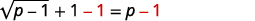
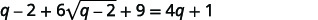

By the end of this section, you will be able to:
* Solve radical equations
* Solve radical equations with two radicals
* Use radicals in applications

Before you get started, take this readiness quiz.

1.  Simplify:
    <math xmlns="http://www.w3.org/1998/Math/MathML"><mrow><msup><mrow><mrow><mo>(</mo><mrow><mi>y</mi><mo>−</mo><mn>3</mn></mrow><mo>)</mo></mrow></mrow><mn>2</mn></msup><mo>.</mo></mrow></math>
    
    * * *
    {: data-type="newline"}
    
    If you missed this problem, review [\[link\]](/m63351#fs-id1167836660220).
2.  Solve:
    <math xmlns="http://www.w3.org/1998/Math/MathML"><mrow><mn>2</mn><mi>x</mi><mo>−</mo><mn>5</mn><mo>=</mo><mn>0</mn><mo>.</mo></mrow></math>
    
    * * *
    {: data-type="newline"}
    
    If you missed this problem, review [\[link\]](/m63308#fs-id1167836432956).
3.  Solve
    <math xmlns="http://www.w3.org/1998/Math/MathML"><mrow><msup><mi>n</mi><mn>2</mn></msup><mo>−</mo><mn>6</mn><mi>n</mi><mo>+</mo><mn>8</mn><mo>=</mo><mn>0</mn><mo>.</mo></mrow></math>
    
    * * *
    {: data-type="newline"}
    
    If you missed this problem, review [\[link\]](/m63362#fs-id1167836625705).
{: data-number-style="arabic"}

### Solve Radical Equations

In this section we will solve equations that have a variable in the radicand of a radical expression. An equation of this type is called a **radical equation**{: data-type="term"}.

Radical Equation

An equation in which a variable is in the radicand of a radical expression is called a **radical equation**.

As usual, when solving these equations, what we do to one side of an equation we must do to the other side as well. Once we isolate the radical, our strategy will be to raise both sides of the equation to the power of the index. This will eliminate the radical.

Solving radical equations containing an even index by raising both sides to the power of the index may introduce an algebraic solution that would not be a solution to the original radical equation. Again, we call this an extraneous solution as we did when we solved rational equations.

In the next example, we will see how to solve a radical equation. Our strategy is based on raising a radical with index *n* to the *n*th power. This will eliminate the radical.

<math xmlns="http://www.w3.org/1998/Math/MathML"><mrow><mtext>For</mtext><mspace width="0.2em" /><mi>a</mi><mo>≥</mo><mn>0</mn><mo>,</mo><mspace width="0.2em" /><msup><mrow><mrow><mo>(</mo><mrow><mroot><mi>a</mi><mrow><mi>n</mi></mrow></mroot></mrow><mo>)</mo></mrow></mrow><mi>n</mi></msup><mo>=</mo><mi>a</mi><mo>.</mo></mrow></math>

How to Solve a Radical Equation

Solve: <math xmlns="http://www.w3.org/1998/Math/MathML"><mrow><msqrt><mrow><mn>5</mn><mi>n</mi><mo>−</mo><mn>4</mn></mrow></msqrt><mo>−</mo><mn>9</mn><mo>=</mo><mn>0</mn><mo>.</mo></mrow></math>

        

Solve: <math xmlns="http://www.w3.org/1998/Math/MathML"><mrow><msqrt><mrow><mn>3</mn><mi>m</mi><mo>+</mo><mn>2</mn></mrow></msqrt><mo>−</mo><mn>5</mn><mo>=</mo><mn>0</mn><mo>.</mo></mrow></math>

<math xmlns="http://www.w3.org/1998/Math/MathML"><mrow><mi>m</mi><mo>=</mo><mfrac><mrow><mn>23</mn></mrow><mn>3</mn></mfrac></mrow></math>

Solve: <math xmlns="http://www.w3.org/1998/Math/MathML"><mrow><msqrt><mrow><mn>10</mn><mi>z</mi><mo>+</mo><mn>1</mn></mrow></msqrt><mo>−</mo><mn>2</mn><mo>=</mo><mn>0</mn><mo>.</mo></mrow></math>

<math xmlns="http://www.w3.org/1998/Math/MathML"><mrow><mi>z</mi><mo>=</mo><mfrac><mn>3</mn><mrow><mn>10</mn></mrow></mfrac></mrow></math>

Solve a radical equation with one radical.

1.  Isolate the radical on one side of the equation.
2.  Raise both sides of the equation to the power of the index.
3.  Solve the new equation.
4.  Check the answer in the original equation.
{: data-number-style="arabic" .stepwise}

When we use a radical sign, it indicates the principal or positive root. If an equation has a radical with an even index equal to a negative number, that equation will have no solution.

Solve: <math xmlns="http://www.w3.org/1998/Math/MathML"><mrow><msqrt><mrow><mn>9</mn><mi>k</mi><mo>−</mo><mn>2</mn></mrow></msqrt><mo>+</mo><mn>1</mn><mo>=</mo><mn>0</mn><mo>.</mo></mrow></math>

|  |  |
{: valign="top"}| To isolate the radical, subtract 1 to both sides. |  |
{: valign="top"}| Simplify. |  |
{: valign="top"}{: .unnumbered .unstyled summary="To isolate the radical, subtract 1 from both sides. The resulting equation is square root of the quantity 9 k minus 2 in parentheses plus 1 minus 1 equals 0 minus 1. Simplifying this we get square root of the quantity 9 k minus 2 in parentheses equals negative 1. Since the square root of a real number is always positive there is no solution to the equation." data-label=""}

Because the square root is equal to a negative number, the equation has no solution.

Solve: <math xmlns="http://www.w3.org/1998/Math/MathML"><mrow><msqrt><mrow><mn>2</mn><mi>r</mi><mo>−</mo><mn>3</mn></mrow></msqrt><mo>+</mo><mn>5</mn><mo>=</mo><mn>0</mn><mo>.</mo></mrow></math>

<math xmlns="http://www.w3.org/1998/Math/MathML"><mrow><mtext>no solution</mtext></mrow></math>

Solve: <math xmlns="http://www.w3.org/1998/Math/MathML"><mrow><msqrt><mrow><mn>7</mn><mi>s</mi><mo>−</mo><mn>3</mn></mrow></msqrt><mo>+</mo><mn>2</mn><mo>=</mo><mn>0</mn><mo>.</mo></mrow></math>

<math xmlns="http://www.w3.org/1998/Math/MathML"><mrow><mtext>no solution</mtext></mrow></math>

If one side of an equation with a square root is a binomial, we use the Product of Binomial Squares Pattern when we square it.

Binomial Squares

<math xmlns="http://www.w3.org/1998/Math/MathML"><mtable><mtr /><mtr /><mtr><mtd><msup><mrow><mo>(</mo><mrow><mi>a</mi><mo>+</mo><mi>b</mi></mrow><mo>)</mo></mrow><mn>2</mn></msup><mo>=</mo><msup><mi>a</mi><mn>2</mn></msup><mo>+</mo><mn>2</mn><mi>a</mi><mi>b</mi><mo>+</mo><msup><mi>b</mi><mn>2</mn></msup></mtd></mtr><mtr><mtd><msup><mrow><mo>(</mo><mrow><mi>a</mi><mo>−</mo><mi>b</mi></mrow><mo>)</mo></mrow><mn>2</mn></msup><mo>=</mo><msup><mi>a</mi><mn>2</mn></msup><mo>−</mo><mn>2</mn><mi>a</mi><mi>b</mi><mo>+</mo><msup><mi>b</mi><mn>2</mn></msup></mtd></mtr></mtable></math>

Don’t forget the middle term!

Solve: <math xmlns="http://www.w3.org/1998/Math/MathML"><mrow><msqrt><mrow><mi>p</mi><mo>−</mo><mn>1</mn></mrow></msqrt><mo>+</mo><mn>1</mn><mo>=</mo><mi>p</mi><mo>.</mo></mrow></math>

<table class="unnumbered unstyled can-break" summary="To isolate the radical, subtract 1 from both sides. The resulting equation is square root of the quantity p minus 1 in parentheses plus 1 minus 1 equals p minus 1. This simplifies to is square root of the quantity p minus 1 in parentheses equals p minus 1. Squaring both sides of the equation we get the square of the square root of the quantity p minus 1 in parentheses equals the square of the quantity p minus 1. Simplify using the binomial squares pattern on the right. The simplified equation is p minus 1 equals p squared minus 2 p plus 1. This is a quadratic equation, so get zero on one side. 0 equals p squared minus 3 p plus 2. Factor the right side. 0 equals the product of the quantity p minus 1 in parentheses with the quantity p minus 2 in parentheses. Use the zero procuct property. 0 equals p minus 1 and 0 equals p minus 2. Solving each equation we get p equals 1 and p equals 2. Checking the answer p equals 1. Does the square root of the quantity 1 minus 1 in parentheses equal 1? The square root of zero plus 1 equals 1 so p equals 1 is a solution. Checking the answer p equals 2. Does the square root of the quantity 2 minus 1 in parentheses plus 1 equal 2. Since the square root of 1 plus 1 equals 2, p equals 2 is also a solution. The solutions are p equals 1 and p equals 2." data-label=""><tbody>
<tr valign="top">
<td data-valign="top" data-align="left" />
<td data-valign="top" data-align="left"></td>
</tr>
<tr valign="top">
<td data-valign="top" data-align="left">To isolate the radical, subtract 1 from both sides.</td>
<td data-valign="top" data-align="left"></td>
</tr>
<tr valign="top">
<td data-valign="top" data-align="left">Simplify.</td>
<td data-valign="top" data-align="left"></td>
</tr>
<tr valign="top">
<td data-valign="top" data-align="left">Square both sides of the equation.</td>
<td data-valign="top" data-align="left"></td>
</tr>
<tr valign="top">
<td data-valign="top" data-align="left">Simplify, using the Product of Binomial Squares Pattern on the
right. Then solve the new equation.</td>
<td data-valign="top" data-align="left"></td>
</tr>
<tr valign="top">
<td data-valign="top" data-align="left">It is a quadratic equation, so get zero on one side.</td>
<td data-valign="top" data-align="left"></td>
</tr>
<tr valign="top">
<td data-valign="top" data-align="left">Factor the right side.</td>
<td data-valign="top" data-align="left"></td>
</tr>
<tr valign="top">
<td data-valign="top" data-align="left">Use the Zero Product Property.</td>
<td data-valign="top" data-align="left"></td>
</tr>
<tr valign="top">
<td data-valign="top" data-align="left">Solve each equation.</td>
<td data-valign="top" data-align="left"></td>
</tr>
<tr valign="top">
<td data-valign="top" data-align="left">Check the answers.</td>
<td data-valign="top" data-align="left" />
</tr>
<tr valign="top">
<td data-valign="top" data-align="left"></td>
<td data-valign="top" data-align="left" />
</tr>
<tr valign="top">
<td data-valign="top" data-align="left" />
<td data-valign="top" data-align="left">The solutions are <math xmlns="http://www.w3.org/1998/Math/MathML"><mrow><mi>p</mi><mo>=</mo><mn>1</mn><mo>,</mo><mspace width="0.5em" /><mi>p</mi><mo>=</mo><mn>2.</mn></mrow></math></td>
</tr>
</tbody></table>

Solve: <math xmlns="http://www.w3.org/1998/Math/MathML"><mrow><msqrt><mrow><mi>x</mi><mo>−</mo><mn>2</mn></mrow></msqrt><mo>+</mo><mn>2</mn><mo>=</mo><mi>x</mi><mo>.</mo></mrow></math>

<math xmlns="http://www.w3.org/1998/Math/MathML"><mrow><mi>x</mi><mo>=</mo><mn>2</mn><mo>,</mo><mi>x</mi><mo>=</mo><mn>3</mn></mrow></math>

Solve: <math xmlns="http://www.w3.org/1998/Math/MathML"><mrow><msqrt><mrow><mi>y</mi><mo>−</mo><mn>5</mn></mrow></msqrt><mo>+</mo><mn>5</mn><mo>=</mo><mi>y</mi><mo>.</mo></mrow></math>

<math xmlns="http://www.w3.org/1998/Math/MathML"><mrow><mi>y</mi><mo>=</mo><mn>5</mn><mo>,</mo><mi>y</mi><mo>=</mo><mn>6</mn></mrow></math>

When the index of the radical is 3, we cube both sides to remove the radical.

<math xmlns="http://www.w3.org/1998/Math/MathML"><mrow><msup><mrow><mrow><mo>(</mo><mrow><mroot><mi>a</mi><mn>3</mn></mroot></mrow><mo>)</mo></mrow></mrow><mn>3</mn></msup><mo>=</mo><mi>a</mi></mrow></math>

Solve: <math xmlns="http://www.w3.org/1998/Math/MathML"><mrow><mroot><mrow><mn>5</mn><mi>x</mi><mo>+</mo><mn>1</mn></mrow><mrow><mn>3</mn></mrow></mroot><mo>+</mo><mn>8</mn><mo>=</mo><mn>4</mn><mo>.</mo></mrow></math>

|  | <math xmlns="http://www.w3.org/1998/Math/MathML"><mrow><mroot><mrow><mn>5</mn><mi>x</mi><mo>+</mo><mn>1</mn></mrow><mrow><mn>3</mn></mrow></mroot><mo>+</mo><mn>8</mn><mo>=</mo><mn>4</mn><mspace width="1.8em" /></mrow></math>

 |
{: valign="top"}| To isolate the radical, subtract 8 from both sides. | <math xmlns="http://www.w3.org/1998/Math/MathML"><mrow><mroot><mrow><mn>5</mn><mi>x</mi><mo>+</mo><mn>1</mn></mrow><mrow><mn>3</mn></mrow></mroot><mo>=</mo><mn>−4</mn><mspace width="1.2em" /></mrow></math>

 |
{: valign="top"}| Cube both sides of the equation. | <math xmlns="http://www.w3.org/1998/Math/MathML"><mrow><msup><mrow><mrow><mo>(</mo><mrow><mroot><mrow><mn>5</mn><mi>x</mi><mo>+</mo><mn>1</mn></mrow><mrow><mn>3</mn></mrow></mroot></mrow><mo>)</mo></mrow></mrow><mn>3</mn></msup><mo>=</mo><msup><mrow><mrow><mo>(</mo><mrow><mn>−4</mn></mrow><mo>)</mo></mrow></mrow><mn>3</mn></msup></mrow></math>

 |
{: valign="top"}| Simplify. | <math xmlns="http://www.w3.org/1998/Math/MathML"><mrow><mn>5</mn><mi>x</mi><mo>+</mo><mn>1</mn><mo>=</mo><mn>−64</mn><mspace width="0.6em" /></mrow></math>

 |
{: valign="top"}| Solve the equation. | <math xmlns="http://www.w3.org/1998/Math/MathML"><mrow><mn>5</mn><mi>x</mi><mo>=</mo><mn>−65</mn><mspace width="0.6em" /></mrow></math>

 |
{: valign="top"}|  | <math xmlns="http://www.w3.org/1998/Math/MathML"><mrow><mi>x</mi><mo>=</mo><mn>−13</mn><mspace width="0.6em" /></mrow></math>

 |
{: valign="top"}| Check the answer. |  |
{: valign="top"}|  |  |
{: valign="top"}|  | The solution is <math xmlns="http://www.w3.org/1998/Math/MathML"><mrow><mi>x</mi><mo>=</mo><mn>−13</mn><mo>.</mo><mspace width="0.35em" /></mrow></math>

 |
{: valign="top"}{: .unnumbered .unstyled .can-break summary="To isolate the radical, subtract 8 from both sides. The resulting equation is cube root of the quantity 5 x plus 1 equals negative 4. Cubeing both sides of the equation we get the cube of the cube root of the quantity 5 x plus 1 equals the cube of negative 4. The simplified equation is 5 x plus 1 equals negative 64. This simplifies to 5 x equals negative 65. So x equals negative 13. Checking the answer x equals negative 13. Does the cube root of the quantity 5 times negative 13 plus 1 in parentheses plus 8 equal 4? The cube root of negative 64 plus 8 equals negative 4 plus 8 which equals 4 so the solution is x equals negative 13." data-label=""}

Solve: <math xmlns="http://www.w3.org/1998/Math/MathML"><mrow><mroot><mrow><mn>4</mn><mi>x</mi><mo>−</mo><mn>3</mn></mrow><mrow><mn>3</mn></mrow></mroot><mo>+</mo><mn>8</mn><mo>=</mo><mn>5</mn></mrow></math>

<math xmlns="http://www.w3.org/1998/Math/MathML"><mrow><mi>x</mi><mo>=</mo><mn>−6</mn></mrow></math>

Solve: <math xmlns="http://www.w3.org/1998/Math/MathML"><mrow><mroot><mrow><mn>6</mn><mi>x</mi><mo>−</mo><mn>10</mn></mrow><mrow><mn>3</mn></mrow></mroot><mo>+</mo><mn>1</mn><mo>=</mo><mn>−3</mn></mrow></math>

<math xmlns="http://www.w3.org/1998/Math/MathML"><mrow><mi>x</mi><mo>=</mo><mn>−9</mn></mrow></math>

Sometimes an equation will contain rational exponents instead of a radical. We use the same techniques to solve the equation as when we have a radical. We raise each side of the equation to the power of the denominator of the rational exponent. Since <math xmlns="http://www.w3.org/1998/Math/MathML"><mrow><msup><mrow><mrow><mo>(</mo><mrow><msup><mi>a</mi><mi>m</mi></msup></mrow><mo>)</mo></mrow></mrow><mi>n</mi></msup><mo>=</mo><msup><mi>a</mi><mrow><mi>m</mi><mo>·</mo><mi>n</mi></mrow></msup><mo>,</mo></mrow></math>

 we have for example,

<math xmlns="http://www.w3.org/1998/Math/MathML"><mrow><msup><mrow><mrow><mo>(</mo><mrow><msup><mi>x</mi><mrow><mfrac><mn>1</mn><mn>2</mn></mfrac></mrow></msup></mrow><mo>)</mo></mrow></mrow><mn>2</mn></msup><mo>=</mo><mi>x</mi><mo>,</mo><mspace width="0.5em" /><msup><mrow><mrow><mo>(</mo><mrow><msup><mi>x</mi><mrow><mfrac><mn>1</mn><mn>3</mn></mfrac></mrow></msup></mrow><mo>)</mo></mrow></mrow><mn>3</mn></msup><mo>=</mo><mi>x</mi></mrow></math>

Remember, <math xmlns="http://www.w3.org/1998/Math/MathML"><mrow><msup><mi>x</mi><mrow><mfrac><mn>1</mn><mn>2</mn></mfrac></mrow></msup><mo>=</mo><msqrt><mi>x</mi></msqrt></mrow></math>

 and <math xmlns="http://www.w3.org/1998/Math/MathML"><mrow><msup><mi>x</mi><mrow><mfrac><mn>1</mn><mn>3</mn></mfrac></mrow></msup><mo>=</mo><mroot><mi>x</mi><mrow><mn>3</mn></mrow></mroot><mo>.</mo></mrow></math>

Solve: <math xmlns="http://www.w3.org/1998/Math/MathML"><mrow><msup><mrow><mrow><mo>(</mo><mrow><mn>3</mn><mi>x</mi><mo>−</mo><mn>2</mn></mrow><mo>)</mo></mrow></mrow><mrow><mfrac><mn>1</mn><mn>4</mn></mfrac></mrow></msup><mo>+</mo><mn>3</mn><mo>=</mo><mn>5</mn><mo>.</mo></mrow></math>

<table class="unnumbered unstyled can-break" summary="To isolate the term with the rational exponent, subtract 3 from both sides. The resulting equation is the quantity 3 x minus 2 raised to the power of one fourth equals 2. Raising each side to the fourth power we get the fourth power of the quantity 3 x minus 2 in parentheses raised to the power of one fourth in parentheses equals 2 to the fourth power. The simplified equation is 3 x minus 2 equals 16. This simplifies to 3 x equals 18. So x equals 6. Checking the answer x equals 6. Does the quantity 3 times 6 minus 2 in parentheses raised to the one-fourth power plus 3 equal 5? The quantity 18 minus 2 in parentheses raised to the one-fourth power plus 3 equals 16 to the one fourth power plus 3 which equals 2 plus 3 which does equal 5 so the solution is x equals 6." data-label=""><tbody>
<tr valign="top">
<td data-valign="top" data-align="left" />
<td data-valign="top" data-align="right"><math xmlns="http://www.w3.org/1998/Math/MathML"><mrow><msup><mrow><mrow><mo>(</mo><mrow><mn>3</mn><mi>x</mi><mo>−</mo><mn>2</mn></mrow><mo>)</mo></mrow></mrow><mrow><mfrac><mn>1</mn><mn>4</mn></mfrac></mrow></msup><mo>+</mo><mn>3</mn><mo>=</mo><mn>5</mn><mspace width="1.1em" /></mrow></math></td>
</tr>
<tr valign="top">
<td data-valign="top" data-align="left">To isolate the term with the rational exponent,
subtract 3 from both sides.</td>
<td data-valign="top" data-align="right"><math xmlns="http://www.w3.org/1998/Math/MathML"><mrow><msup><mrow><mrow><mo>(</mo><mrow><mn>3</mn><mi>x</mi><mo>−</mo><mn>2</mn></mrow><mo>)</mo></mrow></mrow><mrow><mfrac><mn>1</mn><mn>4</mn></mfrac></mrow></msup><mo>=</mo><mn>2</mn><mspace width="1.1em" /></mrow></math></td>
</tr>
<tr valign="top">
<td data-valign="top" data-align="left">Raise each side of the equation to the fourth power.</td>
<td data-valign="top" data-align="right"><math xmlns="http://www.w3.org/1998/Math/MathML"><mrow><msup><mrow><mrow><mo>(</mo><mrow><msup><mrow><mrow><mo>(</mo><mrow><mn>3</mn><mi>x</mi><mo>−</mo><mn>2</mn></mrow><mo>)</mo></mrow></mrow><mrow><mfrac><mn>1</mn><mn>4</mn></mfrac></mrow></msup></mrow><mo>)</mo></mrow></mrow><mn>4</mn></msup><mo>=</mo><msup><mrow><mrow><mo>(</mo><mn>2</mn><mo>)</mo></mrow></mrow><mn>4</mn></msup></mrow></math></td>
</tr>
<tr valign="top">
<td data-valign="top" data-align="left">Simplify.</td>
<td data-valign="top" data-align="right"><math xmlns="http://www.w3.org/1998/Math/MathML"><mrow><mn>3</mn><mi>x</mi><mo>−</mo><mn>2</mn><mo>=</mo><mn>16</mn><mspace width="0.6em" /></mrow></math></td>
</tr>
<tr valign="top">
<td data-valign="top" data-align="left">Solve the equation.</td>
<td data-valign="top" data-align="right"><math xmlns="http://www.w3.org/1998/Math/MathML"><mrow><mn>3</mn><mi>x</mi><mo>=</mo><mn>18</mn><mspace width="0.6em" /></mrow></math></td>
</tr>
<tr valign="top">
<td data-valign="top" data-align="left" />
<td data-valign="top" data-align="right"><math xmlns="http://www.w3.org/1998/Math/MathML"><mrow><mi>x</mi><mo>=</mo><mn>6</mn><mspace width="1.17em" /></mrow></math></td>
</tr>

<tr valign="top">
<td data-valign="top" data-align="left">Check the answer.</td>
<td data-valign="top" data-align="left" />
</tr>
<tr valign="top">
<td data-valign="top" data-align="left"></td>
<td data-valign="top" data-align="left" />
</tr>
<tr valign="top">
<td data-valign="top" data-align="left" />
<td data-valign="top" data-align="right">The solution is <math xmlns="http://www.w3.org/1998/Math/MathML"><mrow><mi>x</mi><mo>=</mo><mn>6</mn><mo>.</mo><mspace width="0.95em" /></mrow></math></td>
</tr>
</tbody></table>

Solve: <math xmlns="http://www.w3.org/1998/Math/MathML"><mrow><msup><mrow><mrow><mo>(</mo><mrow><mn>9</mn><mi>x</mi><mo>+</mo><mn>9</mn></mrow><mo>)</mo></mrow></mrow><mrow><mfrac><mn>1</mn><mn>4</mn></mfrac></mrow></msup><mo>−</mo><mn>2</mn><mo>=</mo><mn>1</mn><mo>.</mo></mrow></math>

<math xmlns="http://www.w3.org/1998/Math/MathML"><mrow><mi>x</mi><mo>=</mo><mn>8</mn></mrow></math>

Solve: <math xmlns="http://www.w3.org/1998/Math/MathML"><mrow><msup><mrow><mrow><mo>(</mo><mrow><mn>4</mn><mi>x</mi><mo>−</mo><mn>8</mn></mrow><mo>)</mo></mrow></mrow><mrow><mfrac><mn>1</mn><mn>4</mn></mfrac></mrow></msup><mo>+</mo><mn>5</mn><mo>=</mo><mn>7</mn><mo>.</mo></mrow></math>

<math xmlns="http://www.w3.org/1998/Math/MathML"><mrow><mi>x</mi><mo>=</mo><mn>6</mn></mrow></math>

Sometimes the solution of a radical equation results in two algebraic solutions, but one of them may be an **extraneous solution**{: data-type="term" .no-emphasis}!

Solve: <math xmlns="http://www.w3.org/1998/Math/MathML"><mrow><msqrt><mrow><mi>r</mi><mo>+</mo><mn>4</mn></mrow></msqrt><mo>−</mo><mi>r</mi><mo>+</mo><mn>2</mn><mo>=</mo><mn>0</mn><mo>.</mo></mrow></math>

<table class="unnumbered unstyled can-break" summary="First, isolate the radical. The resulting equation is square root of the quantity r plus 4 in parentheses equals r minus 2. Squaring both sides of the equation we get the square of the square root of the quantity r plus 4 in parentheses equals the square of the quantity r minus 2 in parentheses. Simplify using the binomial squares pattern on the right. The simplified equation is r plus 4 equals r squared minus 4 r plus 4. This is a quadratic equation, so get zero on one side. 0 equals r squared minus 5 r. Factor the right side. 0 equals r times the quantity r minus 5 in parentheses. Use the zero procuct property. 0 equals r and 0 equals r minus 5. Solving each equation we get r equals 0 and r equals 5. Checking the answer r equals 0. Does the square root of the quantity 0 plus 4 in parentheses minus 0 plus 2 equal 0? The square root of 4 plus 2 equals 0 so r equals 0 is a solution. Checking the answer r equals 5. Does the square root of the quantity 5 plus 4 in parentheses minus 5 plus 2 equal 0. Since the square root of 9 minus 3 equals 0, r equals 5 is also a solution. The solutions are r equals 0 and r equals 5." data-label=""><tbody>
<tr valign="top">
<td data-valign="top" data-align="left" />
<td data-valign="top" data-align="right"><math xmlns="http://www.w3.org/1998/Math/MathML"><mrow><msqrt><mrow><mi>r</mi><mo>+</mo><mn>4</mn></mrow></msqrt><mo>−</mo><mi>r</mi><mo>+</mo><mn>2</mn><mo>=</mo><mn>0</mn><mspace width="4.8em" /></mrow></math></td>
</tr>
<tr valign="top">
<td data-valign="top" data-align="left">Isolate the radical.</td>
<td data-valign="top" data-align="right"><math xmlns="http://www.w3.org/1998/Math/MathML"><mrow><msqrt><mrow><mi>r</mi><mo>+</mo><mn>4</mn></mrow></msqrt><mo>=</mo><mi>r</mi><mo>−</mo><mn>2</mn><mspace width="3.2em" /></mrow></math></td>
</tr>
<tr valign="top">
<td data-valign="top" data-align="left">Square both sides of the equation.</td>
<td data-valign="top" data-align="right"><math xmlns="http://www.w3.org/1998/Math/MathML"><mrow><msup><mrow><mrow><mo>(</mo><mrow><msqrt><mrow><mi>r</mi><mo>+</mo><mn>4</mn></mrow></msqrt></mrow><mo>)</mo></mrow></mrow><mn>2</mn></msup><mo>=</mo><msup><mrow><mrow><mo>(</mo><mrow><mi>r</mi><mo>−</mo><mn>2</mn></mrow><mo>)</mo></mrow></mrow><mn>2</mn></msup><mspace width="2em" /></mrow></math></td>
</tr>
<tr valign="top">
<td data-valign="top" data-align="left">Simplify and then solve the equation</td>
<td data-valign="top" data-align="right"><math xmlns="http://www.w3.org/1998/Math/MathML"><mrow><mi>r</mi><mo>+</mo><mn>4</mn><mo>=</mo><msup><mi>r</mi><mn>2</mn></msup><mo>−</mo><mn>4</mn><mi>r</mi><mo>+</mo><mn>4</mn><mspace width="0.7em" /></mrow></math></td>
</tr>
<tr valign="top">
<td data-valign="top" data-align="left">It is a quadratic equation, so get zero on
one side.</td>
<td data-valign="top" data-align="right"><math xmlns="http://www.w3.org/1998/Math/MathML"><mrow><mn>0</mn><mo>=</mo><msup><mi>r</mi><mn>2</mn></msup><mo>−</mo><mn>5</mn><mi>r</mi><mspace width="2.4em" /></mrow></math></td>
</tr>
<tr valign="top">
<td data-valign="top" data-align="left">Factor the right side.</td>
<td data-valign="top" data-align="right"><math xmlns="http://www.w3.org/1998/Math/MathML"><mrow><mn>0</mn><mo>=</mo><mi>r</mi><mrow><mo>(</mo><mrow><mi>r</mi><mo>−</mo><mn>5</mn></mrow><mo>)</mo></mrow><mspace width="2.1em" /></mrow></math></td>
</tr>
<tr valign="top">
<td data-valign="top" data-align="left">Use the Zero Product Property.</td>
<td data-valign="top" data-align="right"><math xmlns="http://www.w3.org/1998/Math/MathML"><mrow><mn>0</mn><mo>=</mo><mi>r</mi><mspace width="1.5em" /><mn>0</mn><mo>=</mo><mi>r</mi><mo>−</mo><mn>5</mn></mrow></math></td>
</tr>
<tr valign="top">
<td data-valign="top" data-align="left">Solve the equation.</td>
<td data-valign="top" data-align="right"><math xmlns="http://www.w3.org/1998/Math/MathML"><mrow><mi>r</mi><mo>=</mo><mn>0</mn><mspace width="1em" /><mi>r</mi><mo>=</mo><mn>5</mn><mspace width="1.5em" /></mrow></math></td>
</tr>
<tr valign="top">
<td data-valign="top" data-align="left">Check your answer.</td>
<td data-valign="top" data-align="left" />
</tr>
<tr valign="top">
<td data-valign="top" data-align="left"></td>
<td data-valign="bottom" data-align="left">The solution is <em>r</em> = 5.</td>
</tr>
<tr valign="top">
<td data-valign="top" data-align="left" />
<td data-valign="top" data-align="left"><math xmlns="http://www.w3.org/1998/Math/MathML"><mrow><mi>r</mi><mo>=</mo><mn>0</mn></mrow></math> is an extraneous solution.</td>
</tr>
</tbody></table>

Solve: <math xmlns="http://www.w3.org/1998/Math/MathML"><mrow><msqrt><mrow><mi>m</mi><mo>+</mo><mn>9</mn></mrow></msqrt><mo>−</mo><mi>m</mi><mo>+</mo><mn>3</mn><mo>=</mo><mn>0</mn><mo>.</mo></mrow></math>

<math xmlns="http://www.w3.org/1998/Math/MathML"><mrow><mi>m</mi><mo>=</mo><mn>7</mn></mrow></math>

Solve: <math xmlns="http://www.w3.org/1998/Math/MathML"><mrow><msqrt><mrow><mi>n</mi><mo>+</mo><mn>1</mn></mrow></msqrt><mo>−</mo><mi>n</mi><mo>+</mo><mn>1</mn><mo>=</mo><mn>0</mn><mo>.</mo></mrow></math>

<math xmlns="http://www.w3.org/1998/Math/MathML"><mrow><mi>n</mi><mo>=</mo><mn>3</mn></mrow></math>

When there is a coefficient in front of the radical, we must raise it to the power of the index, too.

Solve: <math xmlns="http://www.w3.org/1998/Math/MathML"><mrow><mtext>3</mtext><mspace width="0.2em" /><msqrt><mrow><mn>3</mn><mi>x</mi><mo>−</mo><mn>5</mn></mrow></msqrt><mo>−</mo><mn>8</mn><mo>=</mo><mn>4</mn><mo>.</mo></mrow></math>

|  | <math xmlns="http://www.w3.org/1998/Math/MathML"><mrow><mtext>3</mtext><mspace width="0.2em" /><msqrt><mrow><mn>3</mn><mi>x</mi><mo>−</mo><mn>5</mn></mrow></msqrt><mo>−</mo><mn>8</mn><mo>=</mo><mn>4</mn><mspace width="1.05em" /></mrow></math>

 |
{: valign="top"}| Isolate the radical term. | <math xmlns="http://www.w3.org/1998/Math/MathML"><mrow><mn>3</mn><msqrt><mrow><mn>3</mn><mi>x</mi><mo>−</mo><mn>5</mn></mrow></msqrt><mo>=</mo><mn>12</mn><mspace width="0.6em" /></mrow></math>

 |
{: valign="top"}| Isolate the radical by dividing both sides by 3. | <math xmlns="http://www.w3.org/1998/Math/MathML"><mrow><msqrt><mrow><mn>3</mn><mi>x</mi><mo>−</mo><mn>5</mn></mrow></msqrt><mo>=</mo><mn>4</mn><mspace width="1.05em" /></mrow></math>

 |
{: valign="top"}| Square both sides of the equation. | <math xmlns="http://www.w3.org/1998/Math/MathML"><mrow><msup><mrow><mrow><mo>(</mo><mrow><msqrt><mrow><mn>3</mn><mi>x</mi><mo>−</mo><mn>5</mn></mrow></msqrt></mrow><mo>)</mo></mrow></mrow><mn>2</mn></msup><mo>=</mo><msup><mrow><mrow><mo>(</mo><mn>4</mn><mo>)</mo></mrow></mrow><mn>2</mn></msup></mrow></math>

 |
{: valign="top"}| Simplify, then solve the new equation. | <math xmlns="http://www.w3.org/1998/Math/MathML"><mrow><mn>3</mn><mi>x</mi><mo>−</mo><mn>5</mn><mo>=</mo><mn>16</mn><mspace width="0.6em" /></mrow></math>

 |
{: valign="top"}|  | <math xmlns="http://www.w3.org/1998/Math/MathML"><mrow><mn>3</mn><mi>x</mi><mo>=</mo><mn>21</mn><mspace width="0.6em" /></mrow></math>

 |
{: valign="top"}| Solve the equation. | <math xmlns="http://www.w3.org/1998/Math/MathML"><mrow><mi>x</mi><mo>=</mo><mn>7</mn><mspace width="1.05em" /></mrow></math>

 |
{: valign="top"}| Check the answer. |  |
{: valign="top"}|  |  |
{: valign="top"}|  | The solution is <math xmlns="http://www.w3.org/1998/Math/MathML"><mrow><mi>x</mi><mo>=</mo><mn>7</mn><mo>.</mo><mspace width="1.05em" /></mrow></math>

 |
{: valign="top"}{: .unnumbered .unstyled .can-break summary="First, isolate the radical term by adding 8 to both sides. 3 times square root of the quantity 3 x minus 5 in parentheses equals 12. Isolate the radical by dividing both sides by 3. Square root of the quantity 3 x minus 5 in parentheses equals 4. Square both sides of the equation. The square of the square root of the quantity 3 x minus 5 in parentheses equals 4 squared. Simplify, then solve the new equation. 3 x minus 5 equals 16. 3 x equals 21. x equals 7. Check the answer x equals 7. Does 3 times the square root of the quantity 3 times 7 minus 5 in parentheses minus 8 equal 4? Simplifying the left side we get 3 times the square root of the quantity 21 minus 5 in parentheses minus 8 which equals 3 times the square root of 16 minus 8 which equals 3 times 4 minus 8 which equals 4. The solution is x equals 7." data-label=""}

Solve: <math xmlns="http://www.w3.org/1998/Math/MathML"><mrow><mn>2</mn><msqrt><mrow><mn>4</mn><mi>a</mi><mo>+</mo><mn>4</mn></mrow></msqrt><mo>−</mo><mn>16</mn><mo>=</mo><mn>16</mn><mo>.</mo></mrow></math>

<math xmlns="http://www.w3.org/1998/Math/MathML"><mrow><mi>a</mi><mo>=</mo><mn>63</mn></mrow></math>

Solve: <math xmlns="http://www.w3.org/1998/Math/MathML"><mrow><mn>3</mn><msqrt><mrow><mn>2</mn><mi>b</mi><mo>+</mo><mn>3</mn></mrow></msqrt><mo>−</mo><mn>25</mn><mo>=</mo><mn>50</mn><mo>.</mo></mrow></math>

<math xmlns="http://www.w3.org/1998/Math/MathML"><mrow><mi>b</mi><mo>=</mo><mn>311</mn></mrow></math>

### Solve Radical Equations with Two Radicals

If the radical equation has two radicals, we start out by isolating one of them. It often works out easiest to isolate the more complicated radical first.

In the next example, when one radical is isolated, the second radical is also isolated.

Solve: <math xmlns="http://www.w3.org/1998/Math/MathML"><mrow><mroot><mrow><mn>4</mn><mi>x</mi><mo>−</mo><mn>3</mn></mrow><mn>3</mn></mroot><mo>=</mo><mroot><mrow><mn>3</mn><mi>x</mi><mo>+</mo><mn>2</mn></mrow><mn>3</mn></mroot><mo>.</mo></mrow></math>

<math xmlns="http://www.w3.org/1998/Math/MathML"><mrow><mtable> <mtr><mtd columnalign="left"><mtext>The radical terms are isolated.</mtext></mtd><mtd /><mtd /><mtd columnalign="right"><mroot><mrow><mn>4</mn><mi>x</mi><mo>−</mo><mn>3</mn></mrow><mn>3</mn></mroot></mtd><mtd columnalign="left"><mo>=</mo></mtd><mtd columnalign="left"><mroot><mrow><mn>3</mn><mi>x</mi><mo>+</mo><mn>2</mn></mrow><mn>3</mn></mroot></mtd></mtr> <mtr><mtd columnalign="left"><mtable><mtr><mtd columnalign="left"><mtext>Since the index is 3, cube both sides of the</mtext></mtd></mtr><mtr><mtd columnalign="left"><mtext>equation.</mtext></mtd></mtr></mtable></mtd><mtd /><mtd /><mtd columnalign="right"><msup><mrow><mrow><mo>(</mo><mrow><mroot><mrow><mn>4</mn><mi>x</mi><mo>−</mo><mn>3</mn></mrow><mn>3</mn></mroot></mrow><mo>)</mo></mrow></mrow><mn>3</mn></msup></mtd><mtd columnalign="left"><mo>=</mo></mtd><mtd columnalign="left"><msup><mrow><mrow><mo>(</mo><mrow><mroot><mrow><mn>3</mn><mi>x</mi><mo>+</mo><mn>2</mn></mrow><mn>3</mn></mroot></mrow><mo>)</mo></mrow></mrow><mn>3</mn></msup></mtd></mtr> <mtr><mtd columnalign="left"><mtext>Simplify, then solve the new equation.</mtext></mtd><mtd /><mtd /><mtd columnalign="right"><mn>4</mn><mi>x</mi><mo>−</mo><mn>3</mn></mtd><mtd columnalign="left"><mo>=</mo></mtd><mtd columnalign="left"><mn>3</mn><mi>x</mi><mo>+</mo><mn>2</mn></mtd></mtr> <mtr><mtd /><mtd /><mtd /><mtd columnalign="right"><mi>x</mi><mo>−</mo><mn>3</mn></mtd><mtd columnalign="left"><mo>=</mo></mtd><mtd columnalign="left"><mn>2</mn></mtd></mtr> <mtr><mtd /><mtd /><mtd /><mtd columnalign="right"><mi>x</mi></mtd><mtd columnalign="left"><mo>=</mo></mtd><mtd columnalign="left"><mn>5</mn></mtd></mtr> <mtr><mtd /><mtd /><mtd /><mtd columnalign="right"><mtext>The solution is</mtext><mspace width="0.2em" /><mi>x</mi></mtd><mtd columnalign="left"><mo>=</mo></mtd><mtd columnalign="left"><mn>5</mn><mo>.</mo></mtd></mtr> <mtr><mtd columnalign="left"><mtext>Check the answer.</mtext></mtd><mtd /><mtd /><mtd /><mtd /><mtd /></mtr> <mtr><mtd columnalign="left"><mtext>We leave it to you to show that 5 checks!</mtext></mtd><mtd /><mtd /><mtd /><mtd /><mtd /></mtr></mtable></mrow></math>

Solve: <math xmlns="http://www.w3.org/1998/Math/MathML"><mrow><mroot><mrow><mn>5</mn><mi>x</mi><mo>−</mo><mn>4</mn></mrow><mn>3</mn></mroot><mo>=</mo><mroot><mrow><mn>2</mn><mi>x</mi><mo>+</mo><mn>5</mn></mrow><mn>3</mn></mroot><mo>.</mo></mrow></math>

<math xmlns="http://www.w3.org/1998/Math/MathML"><mrow><mi>x</mi><mo>=</mo><mn>3</mn></mrow></math>

Solve: <math xmlns="http://www.w3.org/1998/Math/MathML"><mrow><mroot><mrow><mn>7</mn><mi>x</mi><mo>+</mo><mn>1</mn></mrow><mn>3</mn></mroot><mo>=</mo><mroot><mrow><mn>2</mn><mi>x</mi><mo>−</mo><mn>5</mn></mrow><mn>3</mn></mroot><mo>.</mo></mrow></math>

<math xmlns="http://www.w3.org/1998/Math/MathML"><mrow><mi>x</mi><mo>=</mo><mo>−</mo><mfrac><mn>6</mn><mn>5</mn></mfrac></mrow></math>

Sometimes after raising both sides of an equation to a power, we still have a variable inside a radical. When that happens, we repeat Step 1 and Step 2 of our procedure. We isolate the radical and raise both sides of the equation to the power of the index again.

How to Solve a Radical Equation

Solve: <math xmlns="http://www.w3.org/1998/Math/MathML"><mrow><msqrt><mi>m</mi></msqrt><mo>+</mo><mn>1</mn><mo>=</mo><msqrt><mrow><mi>m</mi><mo>+</mo><mn>9</mn></mrow></msqrt><mo>.</mo></mrow></math>

        

Solve: <math xmlns="http://www.w3.org/1998/Math/MathML"><mrow><mn>3</mn><mo>−</mo><msqrt><mi>x</mi></msqrt><mo>=</mo><msqrt><mrow><mi>x</mi><mo>−</mo><mn>3</mn></mrow></msqrt><mo>.</mo></mrow></math>

<math xmlns="http://www.w3.org/1998/Math/MathML"><mrow><mi>x</mi><mo>=</mo><mn>4</mn></mrow></math>

Solve: <math xmlns="http://www.w3.org/1998/Math/MathML"><mrow><msqrt><mi>x</mi></msqrt><mo>+</mo><mn>2</mn><mo>=</mo><msqrt><mrow><mi>x</mi><mo>+</mo><mn>16</mn></mrow></msqrt><mo>.</mo></mrow></math>

<math xmlns="http://www.w3.org/1998/Math/MathML"><mrow><mi>x</mi><mo>=</mo><mn>9</mn></mrow></math>

We summarize the steps here. We have adjusted our previous steps to include more than one radical in the equation This procedure will now work for any radical equations.

Solve a radical equation.

1.  Isolate one of the radical terms on one side of the equation.
2.  Raise both sides of the equation to the power of the index.
3.  Are there any more radicals?
    * * *
    {: data-type="newline"}
    
    If yes, repeat Step 1 and Step 2 again.
    * * *
    {: data-type="newline"}
    
    If no, solve the new equation.
4.  Check the answer in the original equation.
{: data-number-style="arabic" .stepwise}

Be careful as you square binomials in the next example. Remember the pattern is <math xmlns="http://www.w3.org/1998/Math/MathML"><mrow><msup><mrow><mrow><mo>(</mo><mrow><mi>a</mi><mo>+</mo><mi>b</mi></mrow><mo>)</mo></mrow></mrow><mn>2</mn></msup><mo>=</mo><msup><mi>a</mi><mn>2</mn></msup><mo>+</mo><mn>2</mn><mi>a</mi><mi>b</mi><mo>+</mo><msup><mi>b</mi><mn>2</mn></msup></mrow></math>

 or <math xmlns="http://www.w3.org/1998/Math/MathML"><mrow><msup><mrow><mrow><mo>(</mo><mrow><mi>a</mi><mo>−</mo><mi>b</mi></mrow><mo>)</mo></mrow></mrow><mn>2</mn></msup><mo>=</mo><msup><mi>a</mi><mn>2</mn></msup><mo>−</mo><mn>2</mn><mi>a</mi><mi>b</mi><mo>+</mo><msup><mi>b</mi><mn>2</mn></msup><mo>.</mo></mrow></math>

Solve: <math xmlns="http://www.w3.org/1998/Math/MathML"><mrow><msqrt><mrow><mi>q</mi><mo>−</mo><mn>2</mn></mrow></msqrt><mo>+</mo><mn>3</mn><mo>=</mo><msqrt><mrow><mn>4</mn><mi>q</mi><mo>+</mo><mn>1</mn></mrow></msqrt><mo>.</mo></mrow></math>

<table class="unnumbered unstyled can-break" summary="The radical on the right is isolated. Square both sides. The equation that results is the square of the sum of the square root of the quantity q minus 2 in parentheses and 3 in parentheses equals the square of the square root of the quantity 4 q plus 1 in parentheses. This simplifies to q minus 2 plus 6 times square root of the quantity q minus 2 in parentheses plus 9 equals 4 q plus 1. There is still a radical in the equation. So we must repeat the previous steps. Isolate the radical term. 6 times square root of the quantity q minus 2 in parentheses equals 3 q minus 6. It would not help to divide both sides by 6. Squaring both sides we get the square of the product of 6 and the square root of the quantity q minus 2 in parentheses the square of the quantity 3 q minus 6 in parentheses. Remember to square both the 6 and the square root of the quantity q minus 2. When squaring the right side use the formula the quantity a minus b in parentheses squared equals a squared minus 2 a b plus b squared. The resulting equation is 6 squared times the square of the square root of the quantity q minus 2 in parentheses equals the quantity 3 q in parentheses squared minus 2 times 3 q times 6 plus 6 squared. Simplifying we get 36 times the quantity q minus 2 in parentheses equals 9 q squared minus 36 q plus 36. Distributing we get 36 q minus 72 equals 9 q squared minus 36 q plus 36. It is a quadratic equation, so get zero on one side. 0 equals 9 q squared minus 72 q plus 108. Factor the right side to get 0 equals 9 times the quantity q minus 6 in parentheses times the quantity q minus 2 in parentheses. Use the zero product property to get the equations q minus 6 equals 0 and q minus 2 equals 0. Solving eah equation we get q equals 6 and q equals 2. The checks are left to you. The solutions are q equals 6 and q equals 2." data-label=""><tbody>
<tr valign="top">
<td data-valign="top" data-align="left" />
<td data-valign="top" data-align="left"></td>
</tr>
<tr valign="top">
<td data-valign="top" data-align="left">The radical on the right is isolated. Square
both sides.</td>
<td data-valign="top" data-align="left"></td>
</tr>
<tr valign="top">
<td data-valign="top" data-align="left">Simplify.</td>
<td data-valign="top" data-align="left"></td>
</tr>
<tr valign="top">
<td data-valign="top" data-align="left">There is still a radical in the equation so
we must repeat the previous steps. Isolate
the radical.</td>
<td data-valign="top" data-align="left"></td>
</tr>
<tr valign="top">
<td data-valign="top" data-align="left">Square both sides. It would not help to
divide both sides by 6. Remember to
square both the 6 and the <math xmlns="http://www.w3.org/1998/Math/MathML"><mrow><msqrt><mrow><mi>q</mi><mo>−</mo><mn>2</mn></mrow></msqrt><mo>.</mo></mrow></math></td>
<td data-valign="top" data-align="left"></td>
</tr>
<tr valign="top">
<td data-valign="top" data-align="left">Simplify, then solve the new equation.</td>
<td data-valign="top" data-align="left"></td>
</tr>
<tr valign="top">
<td data-valign="top" data-align="left">Distribute.</td>
<td data-valign="top" data-align="left"></td>
</tr>
<tr valign="top">
<td data-valign="top" data-align="left">It is a quadratic equation, so get zero on
one side.</td>
<td data-valign="top" data-align="left"></td>
</tr>
<tr valign="top">
<td data-valign="top" data-align="left">Factor the right side.</td>
<td data-valign="top" data-align="left"></td>
</tr>
<tr valign="top">
<td data-valign="top" data-align="left">Use the Zero Product Property.</td>
<td data-valign="top" data-align="left"></td>
</tr>
<tr valign="top">
<td data-valign="top" data-align="left">The checks are left to you.</td>
<td data-valign="top" data-align="center">The solutions are <math xmlns="http://www.w3.org/1998/Math/MathML"><mrow><mi>q</mi><mo>=</mo><mn>6</mn></mrow></math> and <math xmlns="http://www.w3.org/1998/Math/MathML"><mrow><mi>q</mi><mo>=</mo><mn>2</mn><mo>.</mo></mrow></math></td>
</tr>
</tbody></table>

Solve: <math xmlns="http://www.w3.org/1998/Math/MathML"><mrow><msqrt><mrow><mi>x</mi><mo>−</mo><mn>1</mn></mrow></msqrt><mo>+</mo><mn>2</mn><mo>=</mo><msqrt><mrow><mn>2</mn><mi>x</mi><mo>+</mo><mn>6</mn></mrow></msqrt></mrow></math>

<math xmlns="http://www.w3.org/1998/Math/MathML"><mrow><mi>x</mi><mo>=</mo><mn>5</mn></mrow></math>

Solve: <math xmlns="http://www.w3.org/1998/Math/MathML"><mrow><msqrt><mi>x</mi></msqrt><mo>+</mo><mn>2</mn><mo>=</mo><msqrt><mrow><mn>3</mn><mi>x</mi><mo>+</mo><mn>4</mn></mrow></msqrt></mrow></math>

<math xmlns="http://www.w3.org/1998/Math/MathML"><mrow><mi>x</mi><mo>=</mo><mn>0</mn><mspace width="0.2em" /><mi>x</mi><mo>=</mo><mn>4</mn></mrow></math>

### Use Radicals in Applications

As you progress through your college courses, you’ll encounter formulas that include radicals in many disciplines. We will modify our Problem Solving Strategy for Geometry Applications slightly to give us a plan for solving applications with formulas from any discipline.

Use a problem solving strategy for applications with formulas.

1.  **Read** the problem and make sure all the words and ideas are understood. When appropriate, draw a figure and label it with the given information.
2.  **Identify** what we are looking for.
3.  **Name** what we are looking for by choosing a variable to represent it.
4.  **Translate** into an equation by writing the appropriate formula or model for the situation. Substitute in the given information.
5.  **Solve the equation** using good algebra techniques.
6.  **Check** the answer in the problem and make sure it makes sense.
7.  **Answer** the question with a complete sentence.
{: data-number-style="arabic" .stepwise}

One application of radicals has to do with the effect of **gravity**{: data-type="term" .no-emphasis} on falling objects. The formula allows us to determine how long it will take a fallen object to hit the gound.

Falling Objects

On Earth, if an object is dropped from a height of *h* feet, the time in seconds it will take to reach the ground is found by using the formula

<math xmlns="http://www.w3.org/1998/Math/MathML"><mrow><mi>t</mi><mo>=</mo><mfrac><mrow><msqrt><mi>h</mi></msqrt></mrow><mn>4</mn></mfrac><mo>.</mo></mrow></math>

For example, if an object is dropped from a height of 64 feet, we can find the time it takes to reach the ground by substituting <math xmlns="http://www.w3.org/1998/Math/MathML"><mrow><mi>h</mi><mo>=</mo><mn>64</mn></mrow></math>

 into the formula.

|  |  |
{: valign="top"}|  |  |
{: valign="top"}| Take the square root of 64. |  |
{: valign="top"}| Simplify the fraction. |  |
{: valign="top"}{: .unnumbered .unstyled summary="Since h equals 64 we rewrite the formula, replacing h with the number 64. The formula then becomes t equals square root of 64 divided by 4. Taking the square root of 64 we get t equals 8 divided by 4. Simplifying the fraction we get t equals 2. It would take 2 seconds for an object dropped from a height of 64 feet to reach the ground." data-label=""}

It would take 2 seconds for an object dropped from a height of 64 feet to reach the ground.

Marissa dropped her sunglasses from a bridge 400 feet above a river. Use the formula <math xmlns="http://www.w3.org/1998/Math/MathML"><mrow><mi>t</mi><mo>=</mo><mfrac><mrow><msqrt><mi>h</mi></msqrt></mrow><mn>4</mn></mfrac></mrow></math>

 to find how many seconds it took for the sunglasses to reach the river.

<table class="unnumbered unstyled can-break" summary="The first step in the process is to read the problem. Step 2 is to identify what we are looking for. We are looking for the time it takes the sunglasses to reach the river. Step 3 is to name what we are looking for. Let t equal the time. Step 4 is to translate into an equation by writing the appropriate formula and substitute in the given information. t equals the square root of h divided by 4 and h equals 400. So t equals the square root of 400 divided by 4. Step 5 is to solve the equation. So t equals 20 divided by 4. So t equals 5. Step 6 is to check the answer in the problem and make sure it makes sense. Does 5 equal the square root of 400 divided 4. Since 5 equals 20 divided by 4, the answer is a solution to the equation. Does 5 seconds seem like a reasonable length of time? Yes. Step 7 is to answer the question. It will take 5 seconds for the sunglasses to reach the river." data-label=""><tbody>
<tr valign="top">
<td data-valign="top" data-align="left"><strong>Step 1. Read</strong> the problem.</td>
<td data-valign="top" data-align="left" />
</tr>
<tr valign="top">
<td data-valign="top" data-align="left"><strong>Step 2. Identify</strong> what we are looking for.</td>
<td data-valign="top" data-align="left">the time it takes for the
sunglasses to reach the river</td>
</tr>
<tr valign="top">
<td data-valign="top" data-align="left"><strong>Step 3. Name</strong> what we are looking.</td>
<td data-valign="top" data-align="left">Let <math xmlns="http://www.w3.org/1998/Math/MathML"><mrow><mi>t</mi><mo>=</mo></mrow></math> time.</td>
</tr>
<tr valign="top">
<td data-valign="top" data-align="left"><strong>Step 4. Translate</strong> into an equation by writing the
appropriate formula. Substitute in the given
information.</td>
<td data-valign="top" data-align="left"></td>
</tr>
<tr valign="top">
<td data-valign="top" data-align="left"><strong>Step 5. Solve the equation.</strong></td>
<td data-valign="top" data-align="left"></td>
</tr>
<tr valign="top">
<td data-valign="top" data-align="left" />
<td data-valign="top" data-align="left"></td>
</tr>
<tr valign="top">
<td data-valign="top" data-align="left"><strong>Step 6. Check</strong> the answer in the problem and make
sure it makes sense.</td>
<td data-valign="top" data-align="left"></td>
</tr>
<tr valign="top">
<td data-valign="top" data-align="left">Does 5 seconds seem like a reasonable length of
time?</td>
<td data-valign="top" data-align="left">Yes.</td>
</tr>
<tr valign="top">
<td data-valign="top" data-align="left"><strong>Step 7. Answer</strong> the question.</td>
<td data-valign="top" data-align="left">It will take 5 seconds for the
sunglasses to reach the river.</td>
</tr>
</tbody></table>

A helicopter dropped a rescue package from a height of 1,296 feet. Use the formula <math xmlns="http://www.w3.org/1998/Math/MathML"><mrow><mi>t</mi><mo>=</mo><mfrac><mrow><msqrt><mi>h</mi></msqrt></mrow><mn>4</mn></mfrac></mrow></math>

 to find how many seconds it took for the package to reach the ground.

9 seconds

A window washer dropped a squeegee from a platform 196 feet above the sidewalk Use the formula <math xmlns="http://www.w3.org/1998/Math/MathML"><mrow><mi>t</mi><mo>=</mo><mfrac><mrow><msqrt><mi>h</mi></msqrt></mrow><mn>4</mn></mfrac></mrow></math>

 to find how many seconds it took for the squeegee to reach the sidewalk.

<math xmlns="http://www.w3.org/1998/Math/MathML"><mrow><mn>3.5</mn></mrow></math>

 seconds

Police officers investigating car accidents measure the length of the skid marks on the pavement. Then they use square roots to determine the **speed**{: data-type="term" .no-emphasis}, in miles per hour, a car was going before applying the brakes.

Skid Marks and Speed of a Car

If the length of the skid marks is *d* feet, then the speed, *s*, of the car before the brakes were applied can be found by using the formula

<math xmlns="http://www.w3.org/1998/Math/MathML"><mrow><mi>s</mi><mo>=</mo><msqrt><mrow><mn>24</mn><mi>d</mi></mrow></msqrt></mrow></math>

After a car accident, the skid marks for one car measured 190 feet. Use the formula <math xmlns="http://www.w3.org/1998/Math/MathML"><mrow><mi>s</mi><mo>=</mo><msqrt><mrow><mn>24</mn><mi>d</mi></mrow></msqrt></mrow></math>

 to find the speed of the car before the brakes were applied. Round your answer to the nearest tenth.

<table class="unnumbered unstyled can-break" summary="The first step in the process is to read the problem. Step 2 is to identify what we are looking for. We are looking for the speed of the car. Step 3 is to name what we are looking for. Let s equal the speed. Step 4 is to translate into an equation by writing the appropriate formula and substitute in the given information. s equals the square root of the quantity 24 d in parentheses, and d equals 190. So s equals the square root of the quantity 24 times 190 in parentheses. Step 5 is to solve the equation. So s equals the square root of 4560. So s is approximately equal to 67.52777. Rounding to 1 decimal place we et s equal to 67.5. Step 6 is to check the answer in the problem and make sure it makes sense. Does the square root of 4560 equal the square root of the quantity 24 times 190 in parentheses? It does. Does 67.5 mph seem like a reasonable speed? Yes. Step 7 is to answer the question. The car was traveling approximately 67.5 mph before the brakes were applied." data-label=""><tbody>
<tr valign="top">
<td data-valign="top" data-align="left"><strong>Step 1. Read</strong> the problem</td>
<td data-valign="top" data-align="left" />
</tr>
<tr valign="top">
<td data-valign="top" data-align="left"><strong>Step 2. Identify</strong> what we are looking for.</td>
<td data-valign="top" data-align="left">the speed of a car</td>
</tr>
<tr valign="top">
<td data-valign="top" data-align="left"><strong>Step 3. Name</strong> what weare looking for,</td>
<td data-valign="top" data-align="left">Let <math xmlns="http://www.w3.org/1998/Math/MathML"><mrow><mi>s</mi><mo>=</mo></mrow></math> the speed.</td>
</tr>
<tr valign="top">
<td data-valign="top" data-align="left"><strong>Step 4. Translate</strong> into an equation by writing
the appropriate formula. Substitute in the
given information.</td>
<td data-valign="top" data-align="left"></td>
</tr>
<tr valign="top">
<td data-valign="top" data-align="left"><strong>Step 5. Solve the equation.</strong></td>
<td data-valign="top" data-align="left"></td>
</tr>
<tr valign="top">
<td data-valign="top" data-align="left" />
<td data-valign="top" data-align="left"></td>
</tr>
<tr valign="top">
<td data-valign="top" data-align="left">Round to 1 decimal place.</td>
<td data-valign="top" data-align="left"></td>
</tr>
<tr valign="top">
<td data-valign="top" data-align="left" />
<td data-valign="top" data-align="left"></td>
</tr>
<tr valign="top">
<td data-valign="top" data-align="left" />
<td data-valign="top" data-align="left">The speed of the car before the brakes were applied
was 67.5 miles per hour.</td>
</tr>
</tbody></table>

An accident investigator measured the skid marks of the car. The length of the skid marks was 76 feet. Use the formula <math xmlns="http://www.w3.org/1998/Math/MathML"><mrow><mi>s</mi><mo>=</mo><msqrt><mrow><mn>24</mn><mi>d</mi></mrow></msqrt></mrow></math>

 to find the speed of the car before the brakes were applied. Round your answer to the nearest tenth.

<math xmlns="http://www.w3.org/1998/Math/MathML"><mrow><mn>42.7</mn></mrow></math>

 feet

The skid marks of a vehicle involved in an accident were 122 feet long. Use the formula <math xmlns="http://www.w3.org/1998/Math/MathML"><mrow><mi>s</mi><mo>=</mo><msqrt><mrow><mn>24</mn><mi>d</mi></mrow></msqrt></mrow></math>

 to find the speed of the vehicle before the brakes were applied. Round your answer to the nearest tenth.

<math xmlns="http://www.w3.org/1998/Math/MathML"><mrow><mn>54.1</mn></mrow></math>

 feet

Access these online resources for additional instruction and practice with solving radical equations.

* [Solving an Equation Involving a Single Radical][1]
* [Solving Equations with Radicals and Rational Exponents][2]
* [Solving Radical Equations][3]
* [Solve Radical Equations][4]
* [Radical Equation Application][5]
{: data-bullet-style="bullet"}

### Key Concepts

* **Binomial Squares**
  * * *
  {: data-type="newline"}
  
  <math xmlns="http://www.w3.org/1998/Math/MathML"><mtable><mtr><mtd><msup><mrow><mo>(</mo><mrow><mi>a</mi><mo>+</mo><mi>b</mi></mrow><mo>)</mo></mrow><mn>2</mn></msup><mo>=</mo><msup><mi>a</mi><mn>2</mn></msup><mo>+</mo><mn>2</mn><mi>a</mi><mi>b</mi><mo>+</mo><msup><mi>b</mi><mn>2</mn></msup></mtd></mtr><mtr><mtd><msup><mrow><mo>(</mo><mrow><mi>a</mi><mo>−</mo><mi>b</mi></mrow><mo>)</mo></mrow><mn>2</mn></msup><mo>=</mo><msup><mi>a</mi><mn>2</mn></msup><mo>−</mo><mn>2</mn><mi>a</mi><mi>b</mi><mo>+</mo><msup><mi>b</mi><mn>2</mn></msup></mtd></mtr></mtable></math>

* **Solve a Radical Equation**
  1.  Isolate one of the radical terms on one side of the equation.
  2.  Raise both sides of the equation to the power of the index.
  3.  Are there any more radicals?
      * * *
      {: data-type="newline"}
      
      If yes, repeat Step 1 and Step 2 again.
      * * *
      {: data-type="newline"}
      
      If no, solve the new equation.
  4.  Check the answer in the original equation.
  {: data-number-style="arabic" .stepwise}

* **Problem Solving Strategy for Applications with Formulas**
  1.  Read the problem and make sure all the words and ideas are understood. When appropriate, draw a figure and label it with the given information.
  2.  Identify what we are looking for.
  3.  Name what we are looking for by choosing a variable to represent it.
  4.  Translate into an equation by writing the appropriate formula or model for the situation. Substitute in the given information.
  5.  Solve the equation using good algebra techniques.
  6.  Check the answer in the problem and make sure it makes sense.
  7.  Answer the question with a complete sentence.
  {: data-number-style="arabic" .stepwise}

* **Falling Objects**
  * On Earth, if an object is dropped from a height of *h* feet, the time in seconds it will take to reach the ground is found by using the formula
    <math xmlns="http://www.w3.org/1998/Math/MathML"><mrow><mi>t</mi><mo>=</mo><mfrac><mrow><msqrt><mi>h</mi></msqrt></mrow><mn>4</mn></mfrac><mo>.</mo></mrow></math>
  {: data-bullet-style="bullet"}

* **Skid Marks and Speed of a Car**
  * If the length of the skid marks is *d* feet, then the speed, *s*, of the car before the brakes were applied can be found by using the formula
    <math xmlns="http://www.w3.org/1998/Math/MathML"><mrow><mi>s</mi><mo>=</mo><msqrt><mrow><mn>24</mn><mi>d</mi></mrow></msqrt><mo>.</mo></mrow></math>
  {: data-bullet-style="bullet"}
{: data-bullet-style="bullet"}

<section data-depth="1" class="section-exercises" markdown="1">
#### Practice Makes Perfect

**Solve Radical Equations**

In the following exercises, solve.

<math xmlns="http://www.w3.org/1998/Math/MathML"><mrow><msqrt><mrow><mn>5</mn><mi>x</mi><mo>−</mo><mn>6</mn></mrow></msqrt><mo>=</mo><mn>8</mn></mrow></math>

<math xmlns="http://www.w3.org/1998/Math/MathML"><mrow><mi>m</mi><mo>=</mo><mn>14</mn></mrow></math>

<math xmlns="http://www.w3.org/1998/Math/MathML"><mrow><msqrt><mrow><mn>4</mn><mi>x</mi><mo>−</mo><mn>3</mn></mrow></msqrt><mo>=</mo><mn>7</mn></mrow></math>

<math xmlns="http://www.w3.org/1998/Math/MathML"><mrow><msqrt><mrow><mn>5</mn><mi>x</mi><mo>+</mo><mn>1</mn></mrow></msqrt><mo>=</mo><mn>−3</mn></mrow></math>

no solution

<math xmlns="http://www.w3.org/1998/Math/MathML"><mrow><msqrt><mrow><mn>3</mn><mi>y</mi><mo>−</mo><mn>4</mn></mrow></msqrt><mo>=</mo><mn>−2</mn></mrow></math>

<math xmlns="http://www.w3.org/1998/Math/MathML"><mrow><mroot><mrow><mn>2</mn><mi>x</mi></mrow><mrow><mn>3</mn></mrow></mroot><mo>=</mo><mn>−2</mn></mrow></math>

<math xmlns="http://www.w3.org/1998/Math/MathML"><mrow><mi>x</mi><mo>=</mo><mn>−4</mn></mrow></math>

<math xmlns="http://www.w3.org/1998/Math/MathML"><mrow><mroot><mrow><mn>4</mn><mi>x</mi><mo>−</mo><mn>1</mn></mrow><mrow><mn>3</mn></mrow></mroot><mo>=</mo><mn>3</mn></mrow></math>

<math xmlns="http://www.w3.org/1998/Math/MathML"><mrow><msqrt><mrow><mn>2</mn><mi>m</mi><mo>−</mo><mn>3</mn></mrow></msqrt><mo>−</mo><mn>5</mn><mo>=</mo><mn>0</mn></mrow></math>

<math xmlns="http://www.w3.org/1998/Math/MathML"><mrow><mi>m</mi><mo>=</mo><mn>14</mn></mrow></math>

<math xmlns="http://www.w3.org/1998/Math/MathML"><mrow><msqrt><mrow><mn>2</mn><mi>n</mi><mo>−</mo><mn>1</mn></mrow></msqrt><mo>−</mo><mn>3</mn><mo>=</mo><mn>0</mn></mrow></math>

<math xmlns="http://www.w3.org/1998/Math/MathML"><mrow><msqrt><mrow><mn>6</mn><mi>v</mi><mo>−</mo><mn>2</mn></mrow></msqrt><mo>−</mo><mn>10</mn><mo>=</mo><mn>0</mn></mrow></math>

<math xmlns="http://www.w3.org/1998/Math/MathML"><mrow><mi>v</mi><mo>=</mo><mn>17</mn></mrow></math>

<math xmlns="http://www.w3.org/1998/Math/MathML"><mrow><msqrt><mrow><mn>12</mn><mi>u</mi><mo>+</mo><mn>1</mn></mrow></msqrt><mo>−</mo><mn>11</mn><mo>=</mo><mn>0</mn></mrow></math>

<math xmlns="http://www.w3.org/1998/Math/MathML"><mrow><msqrt><mrow><mn>4</mn><mi>m</mi><mo>+</mo><mn>2</mn></mrow></msqrt><mo>+</mo><mn>2</mn><mo>=</mo><mn>6</mn></mrow></math>

<math xmlns="http://www.w3.org/1998/Math/MathML"><mrow><mi>m</mi><mo>=</mo><mfrac><mn>7</mn><mn>2</mn></mfrac></mrow></math>

<math xmlns="http://www.w3.org/1998/Math/MathML"><mrow><msqrt><mrow><mn>6</mn><mi>n</mi><mo>+</mo><mn>1</mn></mrow></msqrt><mo>+</mo><mn>4</mn><mo>=</mo><mn>8</mn></mrow></math>

<math xmlns="http://www.w3.org/1998/Math/MathML"><mrow><msqrt><mrow><mn>2</mn><mi>u</mi><mo>−</mo><mn>3</mn></mrow></msqrt><mo>+</mo><mn>2</mn><mo>=</mo><mn>0</mn></mrow></math>

no solution

<math xmlns="http://www.w3.org/1998/Math/MathML"><mrow><msqrt><mrow><mn>5</mn><mi>v</mi><mo>−</mo><mn>2</mn></mrow></msqrt><mo>+</mo><mn>5</mn><mo>=</mo><mn>0</mn></mrow></math>

<math xmlns="http://www.w3.org/1998/Math/MathML"><mrow><msqrt><mrow><mi>u</mi><mo>−</mo><mn>3</mn></mrow></msqrt><mo>−</mo><mn>3</mn><mo>=</mo><mi>u</mi></mrow></math>

<math xmlns="http://www.w3.org/1998/Math/MathML"><mrow><mi>u</mi><mo>=</mo><mn>3</mn><mo>,</mo><mi>u</mi><mo>=</mo><mn>4</mn></mrow></math>

<math xmlns="http://www.w3.org/1998/Math/MathML"><mrow><msqrt><mrow><mi>v</mi><mo>−</mo><mn>10</mn></mrow></msqrt><mo>+</mo><mn>10</mn><mo>=</mo><mi>v</mi></mrow></math>

<math xmlns="http://www.w3.org/1998/Math/MathML"><mrow><msqrt><mrow><mi>r</mi><mo>−</mo><mn>1</mn></mrow></msqrt><mo>=</mo><mi>r</mi><mo>−</mo><mn>1</mn></mrow></math>

<math xmlns="http://www.w3.org/1998/Math/MathML"><mrow><mi>r</mi><mo>=</mo><mn>1</mn><mo>,</mo><mi>r</mi><mo>=</mo><mn>2</mn></mrow></math>

<math xmlns="http://www.w3.org/1998/Math/MathML"><mrow><msqrt><mrow><mi>s</mi><mo>−</mo><mn>8</mn></mrow></msqrt><mo>=</mo><mi>s</mi><mo>−</mo><mn>8</mn></mrow></math>

<math xmlns="http://www.w3.org/1998/Math/MathML"><mrow><mroot><mrow><mn>6</mn><mi>x</mi><mo>+</mo><mn>4</mn></mrow><mrow><mn>3</mn></mrow></mroot><mo>=</mo><mn>4</mn></mrow></math>

<math xmlns="http://www.w3.org/1998/Math/MathML"><mrow><mi>x</mi><mo>=</mo><mn>10</mn></mrow></math>

<math xmlns="http://www.w3.org/1998/Math/MathML"><mrow><mroot><mrow><mn>11</mn><mi>x</mi><mo>+</mo><mn>4</mn></mrow><mrow><mn>3</mn></mrow></mroot><mo>=</mo><mn>5</mn></mrow></math>

<math xmlns="http://www.w3.org/1998/Math/MathML"><mrow><mroot><mrow><mn>4</mn><mi>x</mi><mo>+</mo><mn>5</mn></mrow><mrow><mn>3</mn></mrow></mroot><mo>−</mo><mn>2</mn><mo>=</mo><mn>−5</mn></mrow></math>

<math xmlns="http://www.w3.org/1998/Math/MathML"><mrow><mi>x</mi><mo>=</mo><mn>−8</mn></mrow></math>

<math xmlns="http://www.w3.org/1998/Math/MathML"><mrow><mroot><mrow><mn>9</mn><mi>x</mi><mo>−</mo><mn>1</mn></mrow><mrow><mn>3</mn></mrow></mroot><mo>−</mo><mn>1</mn><mo>=</mo><mn>−5</mn></mrow></math>

<math xmlns="http://www.w3.org/1998/Math/MathML"><mrow><msup><mrow><mrow><mo>(</mo><mrow><mn>6</mn><mi>x</mi><mo>+</mo><mn>1</mn></mrow><mo>)</mo></mrow></mrow><mrow><mfrac><mn>1</mn><mn>2</mn></mfrac></mrow></msup><mo>−</mo><mn>3</mn><mo>=</mo><mn>4</mn></mrow></math>

<math xmlns="http://www.w3.org/1998/Math/MathML"><mrow><mi>x</mi><mo>=</mo><mn>8</mn></mrow></math>

<math xmlns="http://www.w3.org/1998/Math/MathML"><mrow><msup><mrow><mrow><mo>(</mo><mrow><mn>3</mn><mi>x</mi><mo>−</mo><mn>2</mn></mrow><mo>)</mo></mrow></mrow><mrow><mfrac><mn>1</mn><mn>2</mn></mfrac></mrow></msup><mo>+</mo><mn>1</mn><mo>=</mo><mn>6</mn></mrow></math>

<math xmlns="http://www.w3.org/1998/Math/MathML"><mrow><msup><mrow><mrow><mo>(</mo><mrow><mn>8</mn><mi>x</mi><mo>+</mo><mn>5</mn></mrow><mo>)</mo></mrow></mrow><mrow><mfrac><mn>1</mn><mn>3</mn></mfrac></mrow></msup><mo>+</mo><mn>2</mn><mo>=</mo><mn>−1</mn></mrow></math>

<math xmlns="http://www.w3.org/1998/Math/MathML"><mrow><mi>x</mi><mo>=</mo><mn>−4</mn></mrow></math>

<math xmlns="http://www.w3.org/1998/Math/MathML"><mrow><msup><mrow><mrow><mo>(</mo><mrow><mn>12</mn><mi>x</mi><mo>−</mo><mn>5</mn></mrow><mo>)</mo></mrow></mrow><mrow><mfrac><mn>1</mn><mn>3</mn></mfrac></mrow></msup><mo>+</mo><mn>8</mn><mo>=</mo><mn>3</mn></mrow></math>

<math xmlns="http://www.w3.org/1998/Math/MathML"><mrow><msup><mrow><mrow><mo>(</mo><mrow><mn>12</mn><mi>x</mi><mo>−</mo><mn>3</mn></mrow><mo>)</mo></mrow></mrow><mrow><mfrac><mn>1</mn><mn>4</mn></mfrac></mrow></msup><mo>−</mo><mn>5</mn><mo>=</mo><mn>−2</mn></mrow></math>

<math xmlns="http://www.w3.org/1998/Math/MathML"><mrow><mi>x</mi><mo>=</mo><mn>7</mn></mrow></math>

<math xmlns="http://www.w3.org/1998/Math/MathML"><mrow><msup><mrow><mrow><mo>(</mo><mrow><mn>5</mn><mi>x</mi><mo>−</mo><mn>4</mn></mrow><mo>)</mo></mrow></mrow><mrow><mfrac><mn>1</mn><mn>4</mn></mfrac></mrow></msup><mo>+</mo><mn>7</mn><mo>=</mo><mn>9</mn></mrow></math>

<math xmlns="http://www.w3.org/1998/Math/MathML"><mrow><msqrt><mrow><mi>x</mi><mo>+</mo><mn>1</mn></mrow></msqrt><mo>−</mo><mi>x</mi><mo>+</mo><mn>1</mn><mo>=</mo><mn>0</mn></mrow></math>

<math xmlns="http://www.w3.org/1998/Math/MathML"><mrow><mi>x</mi><mo>=</mo><mn>3</mn></mrow></math>

<math xmlns="http://www.w3.org/1998/Math/MathML"><mrow><msqrt><mrow><mi>y</mi><mo>+</mo><mn>4</mn></mrow></msqrt><mo>−</mo><mi>y</mi><mo>+</mo><mn>2</mn><mo>=</mo><mn>0</mn></mrow></math>

<math xmlns="http://www.w3.org/1998/Math/MathML"><mrow><msqrt><mrow><mi>z</mi><mo>+</mo><mn>100</mn></mrow></msqrt><mo>−</mo><mi>z</mi><mo>=</mo><mn>−10</mn></mrow></math>

<math xmlns="http://www.w3.org/1998/Math/MathML"><mrow><mi>z</mi><mo>=</mo><mn>21</mn></mrow></math>

<math xmlns="http://www.w3.org/1998/Math/MathML"><mrow><msqrt><mrow><mi>w</mi><mo>+</mo><mn>25</mn></mrow></msqrt><mo>−</mo><mi>w</mi><mo>=</mo><mn>−5</mn></mrow></math>

<math xmlns="http://www.w3.org/1998/Math/MathML"><mrow><mn>3</mn><msqrt><mrow><mn>2</mn><mi>x</mi><mo>−</mo><mn>3</mn></mrow></msqrt><mo>−</mo><mn>20</mn><mo>=</mo><mn>7</mn></mrow></math>

<math xmlns="http://www.w3.org/1998/Math/MathML"><mrow><mi>x</mi><mo>=</mo><mn>42</mn></mrow></math>

<math xmlns="http://www.w3.org/1998/Math/MathML"><mrow><mn>2</mn><msqrt><mrow><mn>5</mn><mi>x</mi><mo>+</mo><mn>1</mn></mrow></msqrt><mo>−</mo><mn>8</mn><mo>=</mo><mn>0</mn></mrow></math>

<math xmlns="http://www.w3.org/1998/Math/MathML"><mrow><mn>2</mn><msqrt><mrow><mn>8</mn><mi>r</mi><mo>+</mo><mn>1</mn></mrow></msqrt><mo>−</mo><mn>8</mn><mo>=</mo><mn>2</mn></mrow></math>

<math xmlns="http://www.w3.org/1998/Math/MathML"><mrow><mi>r</mi><mo>=</mo><mn>3</mn></mrow></math>

<math xmlns="http://www.w3.org/1998/Math/MathML"><mrow><mn>3</mn><msqrt><mrow><mn>7</mn><mi>y</mi><mo>+</mo><mn>1</mn></mrow></msqrt><mo>−</mo><mn>10</mn><mo>=</mo><mn>8</mn></mrow></math>

**Solve Radical Equations with Two Radicals**

In the following exercises, solve.

<math xmlns="http://www.w3.org/1998/Math/MathML"><mrow><msqrt><mrow><mn>3</mn><mi>u</mi><mo>+</mo><mn>7</mn></mrow></msqrt><mo>=</mo><msqrt><mrow><mn>5</mn><mi>u</mi><mo>+</mo><mn>1</mn></mrow></msqrt></mrow></math>

<math xmlns="http://www.w3.org/1998/Math/MathML"><mrow><mi>u</mi><mo>=</mo><mn>3</mn></mrow></math>

<math xmlns="http://www.w3.org/1998/Math/MathML"><mrow><msqrt><mrow><mn>4</mn><mi>v</mi><mo>+</mo><mn>1</mn></mrow></msqrt><mo>=</mo><msqrt><mrow><mn>3</mn><mi>v</mi><mo>+</mo><mn>3</mn></mrow></msqrt></mrow></math>

<math xmlns="http://www.w3.org/1998/Math/MathML"><mrow><msqrt><mrow><mn>8</mn><mo>+</mo><mn>2</mn><mi>r</mi></mrow></msqrt><mo>=</mo><msqrt><mrow><mn>3</mn><mi>r</mi><mo>+</mo><mn>10</mn></mrow></msqrt></mrow></math>

<math xmlns="http://www.w3.org/1998/Math/MathML"><mrow><mi>r</mi><mo>=</mo><mn>−2</mn></mrow></math>

<math xmlns="http://www.w3.org/1998/Math/MathML"><mrow><msqrt><mrow><mn>10</mn><mo>+</mo><mn>2</mn><mi>c</mi></mrow></msqrt><mo>=</mo><msqrt><mrow><mn>4</mn><mi>c</mi><mo>+</mo><mn>16</mn></mrow></msqrt></mrow></math>

<math xmlns="http://www.w3.org/1998/Math/MathML"><mrow><mroot><mrow><mn>5</mn><mi>x</mi><mo>−</mo><mn>1</mn></mrow><mn>3</mn></mroot><mo>=</mo><mroot><mrow><mi>x</mi><mo>+</mo><mn>3</mn></mrow><mn>3</mn></mroot></mrow></math>

<math xmlns="http://www.w3.org/1998/Math/MathML"><mrow><mi>x</mi><mo>=</mo><mn>1</mn></mrow></math>

<math xmlns="http://www.w3.org/1998/Math/MathML"><mrow><mroot><mrow><mn>8</mn><mi>x</mi><mo>−</mo><mn>5</mn></mrow><mn>3</mn></mroot><mo>=</mo><mroot><mrow><mn>3</mn><mi>x</mi><mo>+</mo><mn>5</mn></mrow><mn>3</mn></mroot></mrow></math>

<math xmlns="http://www.w3.org/1998/Math/MathML"><mrow><mroot><mrow><mn>2</mn><msup><mi>x</mi><mn>2</mn></msup><mo>+</mo><mn>9</mn><mi>x</mi><mo>−</mo><mn>18</mn></mrow><mn>3</mn></mroot><mo>=</mo><mroot><mrow><msup><mi>x</mi><mn>2</mn></msup><mo>+</mo><mn>3</mn><mi>x</mi><mo>−</mo><mn>2</mn></mrow><mn>3</mn></mroot></mrow></math>

<math xmlns="http://www.w3.org/1998/Math/MathML"><mrow><mi>x</mi><mo>=</mo><mn>−8</mn><mo>,</mo><mi>x</mi><mo>=</mo><mn>2</mn></mrow></math>

<math xmlns="http://www.w3.org/1998/Math/MathML"><mrow><mroot><mrow><msup><mi>x</mi><mn>2</mn></msup><mo>−</mo><mi>x</mi><mo>+</mo><mn>18</mn></mrow><mn>3</mn></mroot><mo>=</mo><mroot><mrow><mn>2</mn><msup><mi>x</mi><mn>2</mn></msup><mo>−</mo><mn>3</mn><mi>x</mi><mo>−</mo><mn>6</mn></mrow><mn>3</mn></mroot></mrow></math>

<math xmlns="http://www.w3.org/1998/Math/MathML"><mrow><msqrt><mi>a</mi></msqrt><mo>+</mo><mn>2</mn><mo>=</mo><msqrt><mrow><mi>a</mi><mo>+</mo><mn>4</mn></mrow></msqrt></mrow></math>

<math xmlns="http://www.w3.org/1998/Math/MathML"><mrow><mi>a</mi><mo>=</mo><mn>0</mn></mrow></math>

<math xmlns="http://www.w3.org/1998/Math/MathML"><mrow><msqrt><mi>r</mi></msqrt><mo>+</mo><mn>6</mn><mo>=</mo><msqrt><mrow><mi>r</mi><mo>+</mo><mn>8</mn></mrow></msqrt></mrow></math>

<math xmlns="http://www.w3.org/1998/Math/MathML"><mrow><msqrt><mi>u</mi></msqrt><mo>+</mo><mn>1</mn><mo>=</mo><msqrt><mrow><mi>u</mi><mo>+</mo><mn>4</mn></mrow></msqrt></mrow></math>

<math xmlns="http://www.w3.org/1998/Math/MathML"><mrow><mi>u</mi><mo>=</mo><mfrac><mn>9</mn><mn>4</mn></mfrac></mrow></math>

<math xmlns="http://www.w3.org/1998/Math/MathML"><mrow><msqrt><mi>x</mi></msqrt><mo>+</mo><mn>1</mn><mo>=</mo><msqrt><mrow><mi>x</mi><mo>+</mo><mn>2</mn></mrow></msqrt></mrow></math>

<math xmlns="http://www.w3.org/1998/Math/MathML"><mrow><msqrt><mrow><mi>a</mi><mo>+</mo><mn>5</mn></mrow></msqrt><mo>−</mo><msqrt><mi>a</mi></msqrt><mo>=</mo><mn>1</mn></mrow></math>

<math xmlns="http://www.w3.org/1998/Math/MathML"><mrow><mi>a</mi><mo>=</mo><mn>4</mn></mrow></math>

<math xmlns="http://www.w3.org/1998/Math/MathML"><mrow><mn>−2</mn><mo>=</mo><msqrt><mrow><mi>d</mi><mo>−</mo><mn>20</mn></mrow></msqrt><mo>−</mo><msqrt><mi>d</mi></msqrt></mrow></math>

<math xmlns="http://www.w3.org/1998/Math/MathML"><mrow><msqrt><mrow><mn>2</mn><mi>x</mi><mo>+</mo><mn>1</mn></mrow></msqrt><mo>=</mo><mn>1</mn><mo>+</mo><msqrt><mi>x</mi></msqrt></mrow></math>

<math xmlns="http://www.w3.org/1998/Math/MathML"><mrow><mi>x</mi><mo>=</mo><mn>0</mn><mspace width="0.2em" /><mi>x</mi><mo>=</mo><mn>4</mn></mrow></math>

<math xmlns="http://www.w3.org/1998/Math/MathML"><mrow><msqrt><mrow><mn>3</mn><mi>x</mi><mo>+</mo><mn>1</mn></mrow></msqrt><mo>=</mo><mn>1</mn><mo>+</mo><msqrt><mrow><mn>2</mn><mi>x</mi><mo>−</mo><mn>1</mn></mrow></msqrt></mrow></math>

<math xmlns="http://www.w3.org/1998/Math/MathML"><mrow><msqrt><mrow><mn>2</mn><mi>x</mi><mo>−</mo><mn>1</mn></mrow></msqrt><mo>−</mo><msqrt><mrow><mi>x</mi><mo>−</mo><mn>1</mn></mrow></msqrt><mo>=</mo><mn>1</mn></mrow></math>

<math xmlns="http://www.w3.org/1998/Math/MathML"><mrow><mi>x</mi><mo>=</mo><mn>1</mn><mspace width="0.2em" /><mi>x</mi><mo>=</mo><mn>5</mn></mrow></math>

<math xmlns="http://www.w3.org/1998/Math/MathML"><mrow><msqrt><mrow><mi>x</mi><mo>+</mo><mn>1</mn></mrow></msqrt><mo>−</mo><msqrt><mrow><mi>x</mi><mo>−</mo><mn>2</mn></mrow></msqrt><mo>=</mo><mn>1</mn></mrow></math>

<math xmlns="http://www.w3.org/1998/Math/MathML"><mrow><msqrt><mrow><mi>x</mi><mo>+</mo><mn>7</mn></mrow></msqrt><mo>−</mo><msqrt><mrow><mi>x</mi><mo>−</mo><mn>5</mn></mrow></msqrt><mo>=</mo><mn>2</mn></mrow></math>

<math xmlns="http://www.w3.org/1998/Math/MathML"><mrow><mi>x</mi><mo>=</mo><mn>9</mn></mrow></math>

<math xmlns="http://www.w3.org/1998/Math/MathML"><mrow><msqrt><mrow><mi>x</mi><mo>+</mo><mn>5</mn></mrow></msqrt><mo>−</mo><msqrt><mrow><mi>x</mi><mo>−</mo><mn>3</mn></mrow></msqrt><mo>=</mo><mn>2</mn></mrow></math>

**Use Radicals in Applications**

In the following exercises, solve. Round approximations to one decimal place.

**Landscaping** Reed wants to have a square garden plot in his backyard. He has enough compost to cover an area of 75 square feet. Use the formula <math xmlns="http://www.w3.org/1998/Math/MathML"><mrow><mi>s</mi><mo>=</mo><msqrt><mi>A</mi></msqrt></mrow></math>

 to find the length of each side of his garden. Round your answer to the nearest tenth of a foot.

<math xmlns="http://www.w3.org/1998/Math/MathML"><mrow><mn>8.7</mn></mrow></math>

 feet

**Landscaping** Vince wants to make a square patio in his yard. He has enough concrete to pave an area of 130 square feet. Use the formula <math xmlns="http://www.w3.org/1998/Math/MathML"><mrow><mi>s</mi><mo>=</mo><msqrt><mi>A</mi></msqrt></mrow></math>

 to find the length of each side of his patio. Round your answer to the nearest tenth of a foot.

**Gravity** A hang glider dropped his cell phone from a height of 350 feet. Use the formula <math xmlns="http://www.w3.org/1998/Math/MathML"><mrow><mi>t</mi><mo>=</mo><mfrac><mrow><msqrt><mi>h</mi></msqrt></mrow><mn>4</mn></mfrac></mrow></math>

 to find how many seconds it took for the cell phone to reach the ground.

<math xmlns="http://www.w3.org/1998/Math/MathML"><mrow><mn>4.7</mn></mrow></math>

 seconds

**Gravity** A construction worker dropped a hammer while building the Grand Canyon skywalk, 4000 feet above the Colorado River. Use the formula <math xmlns="http://www.w3.org/1998/Math/MathML"><mrow><mi>t</mi><mo>=</mo><mfrac><mrow><msqrt><mi>h</mi></msqrt></mrow><mn>4</mn></mfrac></mrow></math>

 to find how many seconds it took for the hammer to reach the river.

**Accident investigation** The skid marks for a car involved in an accident measured 216 feet. Use the formula <math xmlns="http://www.w3.org/1998/Math/MathML"><mrow><mi>s</mi><mo>=</mo><msqrt><mrow><mn>24</mn><mi>d</mi></mrow></msqrt></mrow></math>

 to find the speed of the car before the brakes were applied. Round your answer to the nearest tenth.

72 feet

**Accident investigation** An accident investigator measured the skid marks of one of the vehicles involved in an accident. The length of the skid marks was 175 feet. Use the formula <math xmlns="http://www.w3.org/1998/Math/MathML"><mrow><mi>s</mi><mo>=</mo><msqrt><mrow><mn>24</mn><mi>d</mi></mrow></msqrt></mrow></math>

 to find the speed of the vehicle before the brakes were applied. Round your answer to the nearest tenth.

#### Writing Exercises

Explain why an equation of the form <math xmlns="http://www.w3.org/1998/Math/MathML"><mrow><msqrt><mi>x</mi></msqrt><mo>+</mo><mn>1</mn><mo>=</mo><mn>0</mn></mrow></math>

 has no solution.

Answers will vary.

* * *
{: data-type="newline"}

ⓐ Solve the equation <math xmlns="http://www.w3.org/1998/Math/MathML"><mrow><msqrt><mrow><mi>r</mi><mo>+</mo><mn>4</mn></mrow></msqrt><mo>−</mo><mi>r</mi><mo>+</mo><mn>2</mn><mo>=</mo><mn>0</mn><mo>.</mo></mrow></math>

* * *
{: data-type="newline"}

ⓑ Explain why one of the “solutions” that was found was not actually a solution to the equation.

#### Self Check

ⓐ After completing the exercises, use this checklist to evaluate your mastery of the objectives of this section.

![The table has 4 columns and 4 rows. The first row is a header row with the headers &#x201C;I can&#x2026;&#x201D;, &#x201C;Confidently&#x201D;, &#x201C;With some help.&#x201D;, and &#x201C;No &#x2013; I don&#x2019;t get it!&#x201D;. The first column contains the phrases &#x201C;Solve radical equations&#x201D;, &#x201C;solve radical equations with two radicals&#x201D;, and &#x201C;use radicals in applications&#x201D;. The other columns are left blank so the learner can indicate their level of understanding.](../resources/CNX_IntAlg_Figure_08_06_201_img.jpg)

ⓑ After reviewing this checklist, what will you do to become confident for all objectives?

</section>

### Glossary
{: data-type="glossary-title"}

radical equation
: An equation in which a variable is in the radicand of a radical expression is called a radical equation.

[1]: https://openstax.org/l/37RadEquat1
[2]: https://openstax.org/l/37RadEquat2
[3]: https://openstax.org/l/37RadEquat3
[4]: https://openstax.org/l/37RadEquat4
[5]: https://openstax.org/l/37RadEquat5
