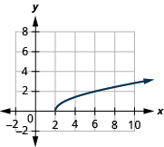
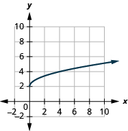
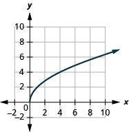

By the end of this section, you will be able to:
* Evaluate a radical function
* Find the domain of a radical function
* Graph radical functions

Before you get started, take this readiness quiz.

1.  Solve:
    <math xmlns="http://www.w3.org/1998/Math/MathML"><mrow><mn>1</mn><mo>−</mo><mn>2</mn><mi>x</mi><mo>≥</mo><mn>0</mn><mo>.</mo></mrow></math>
    
    * * *
    {: data-type="newline"}
    
    If you missed this problem, review [\[link\]](/m63312#fs-id1167835419716).
2.  For
    <math xmlns="http://www.w3.org/1998/Math/MathML"><mrow><mi>f</mi><mrow><mo>(</mo><mi>x</mi><mo>)</mo></mrow><mo>=</mo><mn>3</mn><mi>x</mi><mo>−</mo><mn>4</mn><mo>,</mo></mrow></math>
    
    evaluate
    <math xmlns="http://www.w3.org/1998/Math/MathML"><mrow><mi>f</mi><mrow><mo>(</mo><mn>2</mn><mo>)</mo></mrow><mo>,</mo><mi>f</mi><mrow><mo>(</mo><mrow><mn>−1</mn></mrow><mo>)</mo></mrow><mo>,</mo><mi>f</mi><mrow><mo>(</mo><mn>0</mn><mo>)</mo></mrow><mo>.</mo></mrow></math>
    
    * * *
    {: data-type="newline"}
    
    If you missed this problem, review [\[link\]](/m63324#fs-id1167836521479).
3.  Graph
    <math xmlns="http://www.w3.org/1998/Math/MathML"><mrow><mi>f</mi><mrow><mo>(</mo><mi>x</mi><mo>)</mo></mrow><mo>=</mo><msqrt><mi>x</mi></msqrt><mo>.</mo></mrow></math>
    
    State the domain and range of the function in interval notation.
    * * *
    {: data-type="newline"}
    
    If you missed this problem, review [\[link\]](/m63325#fs-id1167829930477).
{: data-number-style="arabic"}

# Evaluate a Radical Function

In this section we will extend our previous work with functions to include radicals. If a function is defined by a radical expression, we call it a **radical function**{: data-type="term"}.

The square root function is <math xmlns="http://www.w3.org/1998/Math/MathML"><mrow><mi>f</mi><mrow><mo>(</mo><mi>x</mi><mo>)</mo></mrow><mo>=</mo><mroot><mi>x</mi><mrow /></mroot><mo>.</mo></mrow></math>

The cube root function is <math xmlns="http://www.w3.org/1998/Math/MathML"><mrow><mi>f</mi><mrow><mo>(</mo><mi>x</mi><mo>)</mo></mrow><mo>=</mo><mroot><mi>x</mi><mn>3</mn></mroot><mo>.</mo></mrow></math>

Radical Function

A **radical function** is a function that is defined by a radical expression.

To evaluate a radical function, we find the value of *f*(*x*) for a given value of *x* just as we did in our previous work with functions.

For the function <math xmlns="http://www.w3.org/1998/Math/MathML"><mrow><mi>f</mi><mrow><mo>(</mo><mi>x</mi><mo>)</mo></mrow><mo>=</mo><msqrt><mrow><mn>2</mn><mi>x</mi><mo>−</mo><mn>1</mn></mrow></msqrt><mo>,</mo></mrow></math>

 find ⓐ <math xmlns="http://www.w3.org/1998/Math/MathML"><mrow><mi>f</mi><mrow><mo>(</mo><mn>5</mn><mo>)</mo></mrow></mrow></math>

 ⓑ <math xmlns="http://www.w3.org/1998/Math/MathML"><mrow><mi>f</mi><mrow><mo>(</mo><mrow><mn>−2</mn></mrow><mo>)</mo></mrow><mo>.</mo></mrow></math>

ⓐ* * *
{: data-type="newline"}

 <math xmlns="http://www.w3.org/1998/Math/MathML"><mrow><mtable> <mtr><mtd /><mtd /><mtd /><mtd columnalign="right"><mspace width="3em" /><mi>f</mi><mrow><mo>(</mo><mi>x</mi><mo>)</mo></mrow></mtd><mtd columnalign="left"><mo>=</mo></mtd><mtd columnalign="left"><msqrt><mrow><mn>2</mn><mi>x</mi><mo>−</mo><mn>1</mn></mrow></msqrt></mtd></mtr> <mtr><mtd columnalign="left"><mtext>To evaluate</mtext><mspace width="0.2em" /><mi>f</mi><mrow><mo>(</mo><mn>5</mn><mo>)</mo></mrow><mo>,</mo><mspace width="0.2em" /><mtext>substitute 5 for</mtext><mspace width="0.2em" /><mi>x</mi><mo>.</mo></mtd><mtd /><mtd /><mtd columnalign="right"><mspace width="3em" /><mi>f</mi><mrow><mo>(</mo><mn>5</mn><mo>)</mo></mrow></mtd><mtd columnalign="left"><mo>=</mo></mtd><mtd columnalign="left"><msqrt><mrow><mn>2</mn><mo>·</mo><mn>5</mn><mo>−</mo><mn>1</mn></mrow></msqrt></mtd></mtr> <mtr><mtd columnalign="left"><mtext>Simplify.</mtext></mtd><mtd /><mtd /><mtd columnalign="right"><mspace width="3em" /><mi>f</mi><mrow><mo>(</mo><mn>5</mn><mo>)</mo></mrow></mtd><mtd columnalign="left"><mo>=</mo></mtd><mtd columnalign="left"><msqrt><mrow><mn>9</mn></mrow></msqrt></mtd></mtr> <mtr><mtd columnalign="left"><mtext>Take the square root.</mtext></mtd><mtd /><mtd /><mtd columnalign="right"><mspace width="3em" /><mi>f</mi><mrow><mo>(</mo><mn>5</mn><mo>)</mo></mrow></mtd><mtd columnalign="left"><mo>=</mo></mtd><mtd columnalign="left"><mn>3</mn></mtd></mtr></mtable></mrow></math>

ⓑ* * *
{: data-type="newline"}

 <math xmlns="http://www.w3.org/1998/Math/MathML"><mrow><mtable> <mtr><mtd /><mtd /><mtd /><mtd columnalign="right"><mspace width="1.5em" /><mi>f</mi><mrow><mo>(</mo><mi>x</mi><mo>)</mo></mrow></mtd><mtd columnalign="left"><mo>=</mo></mtd><mtd columnalign="left"><msqrt><mrow><mn>2</mn><mi>x</mi><mo>−</mo><mn>1</mn></mrow></msqrt></mtd></mtr> <mtr><mtd columnalign="left"><mtext>To evaluate</mtext><mspace width="0.2em" /><mi>f</mi><mrow><mo>(</mo><mrow><mn>−2</mn></mrow><mo>)</mo></mrow><mo>,</mo><mspace width="0.2em" /><mtext>substitute</mtext><mspace width="0.2em" /><mn>−2</mn><mspace width="0.2em" /><mtext>for</mtext><mspace width="0.2em" /><mi>x</mi><mo>.</mo></mtd><mtd /><mtd /><mtd columnalign="right"><mspace width="1.5em" /><mi>f</mi><mrow><mo>(</mo><mrow><mn>−2</mn></mrow><mo>)</mo></mrow></mtd><mtd columnalign="left"><mo>=</mo></mtd><mtd columnalign="left"><msqrt><mrow><mn>2</mn><mrow><mo>(</mo><mrow><mn>−2</mn></mrow><mo>)</mo></mrow><mo>−</mo><mn>1</mn></mrow></msqrt></mtd></mtr> <mtr><mtd columnalign="left"><mtext>Simplify.</mtext></mtd><mtd /><mtd /><mtd columnalign="right"><mspace width="1.5em" /><mi>f</mi><mrow><mo>(</mo><mrow><mn>−2</mn></mrow><mo>)</mo></mrow></mtd><mtd columnalign="left"><mo>=</mo></mtd><mtd columnalign="left"><msqrt><mrow><mn>−5</mn></mrow></msqrt></mtd></mtr></mtable></mrow></math>

Since the square root of a negative number is not a real number, the function does not have a value at <math xmlns="http://www.w3.org/1998/Math/MathML"><mrow><mi>x</mi><mo>=</mo><mn>−2</mn><mo>.</mo></mrow></math>

For the function <math xmlns="http://www.w3.org/1998/Math/MathML"><mrow><mi>f</mi><mrow><mo>(</mo><mi>x</mi><mo>)</mo></mrow><mo>=</mo><msqrt><mrow><mn>3</mn><mi>x</mi><mo>−</mo><mn>2</mn></mrow></msqrt><mo>,</mo></mrow></math>

 find ⓐ <math xmlns="http://www.w3.org/1998/Math/MathML"><mrow><mi>f</mi><mrow><mo>(</mo><mn>6</mn><mo>)</mo></mrow></mrow></math>

 ⓑ <math xmlns="http://www.w3.org/1998/Math/MathML"><mrow><mi>f</mi><mrow><mo>(</mo><mn>0</mn><mo>)</mo></mrow><mo>.</mo></mrow></math>

ⓐ <math xmlns="http://www.w3.org/1998/Math/MathML"><mrow><mi>f</mi><mrow><mo>(</mo><mn>6</mn><mo>)</mo></mrow><mo>=</mo><mn>4</mn></mrow></math>

 ⓑ no value at <math xmlns="http://www.w3.org/1998/Math/MathML"><mrow><mi>x</mi><mo>=</mo><mn>0</mn></mrow></math>

For the function <math xmlns="http://www.w3.org/1998/Math/MathML"><mrow><mi>g</mi><mrow><mo>(</mo><mi>x</mi><mo>)</mo></mrow><mo>=</mo><msqrt><mrow><mn>5</mn><mi>x</mi><mo>+</mo><mn>5</mn></mrow></msqrt><mo>,</mo></mrow></math>

 find ⓐ <math xmlns="http://www.w3.org/1998/Math/MathML"><mrow><mi>g</mi><mrow><mo>(</mo><mn>4</mn><mo>)</mo></mrow></mrow></math>

 ⓑ <math xmlns="http://www.w3.org/1998/Math/MathML"><mrow><mi>g</mi><mrow><mo>(</mo><mrow><mn>−3</mn></mrow><mo>)</mo></mrow><mo>.</mo></mrow></math>

ⓐ <math xmlns="http://www.w3.org/1998/Math/MathML"><mrow><mi>g</mi><mrow><mo>(</mo><mn>4</mn><mo>)</mo></mrow><mo>=</mo><mn>5</mn></mrow></math>

 ⓑ no value at <math xmlns="http://www.w3.org/1998/Math/MathML"><mrow><mi>f</mi><mo stretchy="false">(</mo><mn>−3</mn><mo stretchy="false">)</mo></mrow></math>

We follow the same procedure to evaluate cube roots.

For the function <math xmlns="http://www.w3.org/1998/Math/MathML"><mrow><mi>g</mi><mrow><mo>(</mo><mi>x</mi><mo>)</mo></mrow><mo>=</mo><mroot><mrow><mi>x</mi><mo>−</mo><mn>6</mn></mrow><mrow><mn>3</mn></mrow></mroot><mo>,</mo></mrow></math>

 find ⓐ <math xmlns="http://www.w3.org/1998/Math/MathML"><mrow><mi>g</mi><mrow><mo>(</mo><mrow><mn>14</mn></mrow><mo>)</mo></mrow></mrow></math>

 ⓑ <math xmlns="http://www.w3.org/1998/Math/MathML"><mrow><mi>g</mi><mrow><mo>(</mo><mrow><mn>−2</mn></mrow><mo>)</mo></mrow><mo>.</mo></mrow></math>

ⓐ* * *
{: data-type="newline"}

 <math xmlns="http://www.w3.org/1998/Math/MathML"><mrow><mtable> <mtr><mtd /><mtd /><mtd /><mtd columnalign="right"><mspace width="0.5em" /><mi>g</mi><mrow><mo>(</mo><mi>x</mi><mo>)</mo></mrow></mtd><mtd columnalign="left"><mo>=</mo></mtd><mtd columnalign="left"><mroot><mrow><mi>x</mi><mo>−</mo><mn>6</mn></mrow><mrow><mn>3</mn></mrow></mroot></mtd></mtr> <mtr><mtd columnalign="left"><mtext>To evaluate</mtext><mspace width="0.2em" /><mi>g</mi><mrow><mo>(</mo><mrow><mn>14</mn></mrow><mo>)</mo></mrow><mo>,</mo><mspace width="0.2em" /><mtext>substitute 14 for</mtext><mspace width="0.2em" /><mi>x</mi><mo>.</mo></mtd><mtd /><mtd /><mtd columnalign="right"><mspace width="0.5em" /><mi>g</mi><mrow><mo>(</mo><mrow><mn>14</mn></mrow><mo>)</mo></mrow></mtd><mtd columnalign="left"><mo>=</mo></mtd><mtd columnalign="left"><mroot><mrow><mn>14</mn><mo>−</mo><mn>6</mn></mrow><mrow><mn>3</mn></mrow></mroot></mtd></mtr> <mtr><mtd columnalign="left"><mtext>Simplify.</mtext></mtd><mtd /><mtd /><mtd columnalign="right"><mspace width="0.5em" /><mi>g</mi><mrow><mo>(</mo><mrow><mn>14</mn></mrow><mo>)</mo></mrow></mtd><mtd columnalign="left"><mo>=</mo></mtd><mtd columnalign="left"><mroot><mn>8</mn><mrow><mn>3</mn></mrow></mroot></mtd></mtr> <mtr><mtd columnalign="left"><mtext>Take the cube root.</mtext></mtd><mtd /><mtd /><mtd columnalign="right"><mspace width="0.5em" /><mi>g</mi><mrow><mo>(</mo><mrow><mn>14</mn></mrow><mo>)</mo></mrow></mtd><mtd columnalign="left"><mo>=</mo></mtd><mtd columnalign="left"><mn>2</mn></mtd></mtr></mtable></mrow></math>

ⓑ* * *
{: data-type="newline"}

 <math xmlns="http://www.w3.org/1998/Math/MathML"><mrow><mtable> <mtr><mtd /><mtd /><mtd /><mtd columnalign="right"><mi>g</mi><mrow><mo>(</mo><mi>x</mi><mo>)</mo></mrow></mtd><mtd columnalign="left"><mo>=</mo></mtd><mtd columnalign="left"><mroot><mrow><mi>x</mi><mo>−</mo><mn>6</mn></mrow><mrow><mn>3</mn></mrow></mroot></mtd></mtr> <mtr><mtd columnalign="left"><mtext>To evaluate</mtext><mspace width="0.2em" /><mi>g</mi><mrow><mo>(</mo><mrow><mn>−2</mn></mrow><mo>)</mo></mrow><mo>,</mo><mspace width="0.2em" /><mtext>substitute</mtext><mspace width="0.2em" /><mn>−2</mn><mspace width="0.2em" /><mtext>for</mtext><mspace width="0.2em" /><mi>x</mi><mo>.</mo></mtd><mtd /><mtd /><mtd columnalign="right"><mi>g</mi><mrow><mo>(</mo><mrow><mn>−2</mn></mrow><mo>)</mo></mrow></mtd><mtd columnalign="left"><mo>=</mo></mtd><mtd columnalign="left"><mroot><mrow><mn>−2</mn><mo>−</mo><mn>6</mn></mrow><mrow><mn>3</mn></mrow></mroot></mtd></mtr> <mtr><mtd columnalign="left"><mtext>Simplify.</mtext></mtd><mtd /><mtd /><mtd columnalign="right"><mi>g</mi><mrow><mo>(</mo><mrow><mn>−2</mn></mrow><mo>)</mo></mrow></mtd><mtd columnalign="left"><mo>=</mo></mtd><mtd columnalign="left"><mroot><mrow><mn>−8</mn></mrow><mrow><mn>3</mn></mrow></mroot></mtd></mtr> <mtr><mtd columnalign="left"><mtext>Take the cube root.</mtext></mtd><mtd /><mtd /><mtd columnalign="right"><mi>g</mi><mrow><mo>(</mo><mrow><mn>−2</mn></mrow><mo>)</mo></mrow></mtd><mtd columnalign="left"><mo>=</mo></mtd><mtd columnalign="left"><mn>−2</mn></mtd></mtr></mtable></mrow></math>

For the function <math xmlns="http://www.w3.org/1998/Math/MathML"><mrow><mi>g</mi><mrow><mo>(</mo><mi>x</mi><mo>)</mo></mrow><mo>=</mo><mroot><mrow><mn>3</mn><mi>x</mi><mo>−</mo><mn>4</mn></mrow><mrow><mn>3</mn></mrow></mroot><mo>,</mo></mrow></math>

 find ⓐ <math xmlns="http://www.w3.org/1998/Math/MathML"><mrow><mi>g</mi><mrow><mo>(</mo><mn>4</mn><mo>)</mo></mrow></mrow></math>

 ⓑ <math xmlns="http://www.w3.org/1998/Math/MathML"><mrow><mi>g</mi><mrow><mo>(</mo><mn>1</mn><mo>)</mo></mrow><mo>.</mo></mrow></math>

ⓐ <math xmlns="http://www.w3.org/1998/Math/MathML"><mrow><mi>g</mi><mo stretchy="false">(</mo><mn>4</mn><mo stretchy="false">)</mo><mo>=</mo><mn>2</mn></mrow></math>

 ⓑ <math xmlns="http://www.w3.org/1998/Math/MathML"><mrow><mi>g</mi><mo stretchy="false">(</mo><mn>1</mn><mo stretchy="false">)</mo><mo>=</mo><mn>−1</mn></mrow></math>

For the function <math xmlns="http://www.w3.org/1998/Math/MathML"><mrow><mi>h</mi><mrow><mo>(</mo><mi>x</mi><mo>)</mo></mrow><mo>=</mo><mroot><mrow><mn>5</mn><mi>x</mi><mo>−</mo><mn>2</mn></mrow><mrow><mn>3</mn></mrow></mroot><mo>,</mo></mrow></math>

 find ⓐ <math xmlns="http://www.w3.org/1998/Math/MathML"><mrow><mi>h</mi><mrow><mo>(</mo><mn>2</mn><mo>)</mo></mrow></mrow></math>

 ⓑ <math xmlns="http://www.w3.org/1998/Math/MathML"><mrow><mi>h</mi><mrow><mo>(</mo><mrow><mn>−5</mn></mrow><mo>)</mo></mrow><mo>.</mo></mrow></math>

ⓐ <math xmlns="http://www.w3.org/1998/Math/MathML"><mrow><mi>h</mi><mo stretchy="false">(</mo><mn>2</mn><mo stretchy="false">)</mo><mo>=</mo><mn>2</mn></mrow></math>

* * *
{: data-type="newline"}

ⓑ <math xmlns="http://www.w3.org/1998/Math/MathML"><mrow><mi>h</mi><mo stretchy="false">(</mo><mn>−5</mn><mo stretchy="false">)</mo><mo>=</mo><mn>−3</mn></mrow></math>

The next example has fourth roots.

For the function <math xmlns="http://www.w3.org/1998/Math/MathML"><mrow><mi>f</mi><mrow><mo>(</mo><mi>x</mi><mo>)</mo></mrow><mo>=</mo><mroot><mrow><mn>5</mn><mi>x</mi><mo>−</mo><mn>4</mn></mrow><mrow><mn>4</mn></mrow></mroot><mo>,</mo></mrow></math>

 find ⓐ <math xmlns="http://www.w3.org/1998/Math/MathML"><mrow><mi>f</mi><mrow><mo>(</mo><mn>4</mn><mo>)</mo></mrow></mrow></math>

 ⓑ <math xmlns="http://www.w3.org/1998/Math/MathML"><mrow><mi>f</mi><mrow><mo>(</mo><mrow><mn>−12</mn></mrow><mo>)</mo></mrow></mrow></math>

ⓐ* * *
{: data-type="newline"}

 <math xmlns="http://www.w3.org/1998/Math/MathML"><mrow><mtable> <mtr><mtd /><mtd /><mtd /><mtd columnalign="right"><mspace width="3.5em" /><mi>f</mi><mrow><mo>(</mo><mi>x</mi><mo>)</mo></mrow></mtd><mtd columnalign="left"><mo>=</mo></mtd><mtd columnalign="left"><mroot><mrow><mn>5</mn><mi>x</mi><mo>−</mo><mn>4</mn></mrow><mrow><mn>4</mn></mrow></mroot></mtd></mtr> <mtr><mtd columnalign="left"><mtext>To evaluate</mtext><mspace width="0.2em" /><mi>f</mi><mrow><mo>(</mo><mn>4</mn><mo>)</mo></mrow><mo>,</mo><mspace width="0.2em" /><mtext>substitute 4 for</mtext><mspace width="0.2em" /><mi>x</mi><mo>.</mo></mtd><mtd /><mtd /><mtd columnalign="right"><mspace width="3.5em" /><mi>f</mi><mrow><mo>(</mo><mn>4</mn><mo>)</mo></mrow></mtd><mtd columnalign="left"><mo>=</mo></mtd><mtd columnalign="left"><mroot><mrow><mn>5</mn><mo>·</mo><mn>4</mn><mo>−</mo><mn>4</mn></mrow><mrow><mn>4</mn></mrow></mroot></mtd></mtr> <mtr><mtd columnalign="left"><mtext>Simplify.</mtext></mtd><mtd /><mtd /><mtd columnalign="right"><mspace width="3.5em" /><mi>f</mi><mrow><mo>(</mo><mn>4</mn><mo>)</mo></mrow></mtd><mtd columnalign="left"><mo>=</mo></mtd><mtd columnalign="left"><mroot><mrow><mn>16</mn></mrow><mrow><mn>4</mn></mrow></mroot></mtd></mtr> <mtr><mtd columnalign="left"><mtext>Take the fourth root.</mtext></mtd><mtd /><mtd /><mtd columnalign="right"><mspace width="3.5em" /><mi>f</mi><mrow><mo>(</mo><mn>4</mn><mo>)</mo></mrow></mtd><mtd columnalign="left"><mo>=</mo></mtd><mtd columnalign="left"><mn>2</mn></mtd></mtr></mtable></mrow></math>

ⓑ* * *
{: data-type="newline"}

 <math xmlns="http://www.w3.org/1998/Math/MathML"><mrow><mtable> <mtr><mtd /><mtd /><mtd /><mtd columnalign="right"><mi>f</mi><mrow><mo>(</mo><mi>x</mi><mo>)</mo></mrow></mtd><mtd columnalign="left"><mo>=</mo></mtd><mtd columnalign="left"><mroot><mrow><mn>5</mn><mi>x</mi><mo>−</mo><mn>4</mn></mrow><mrow><mn>4</mn></mrow></mroot></mtd></mtr> <mtr><mtd columnalign="left"><mtext>To evaluate</mtext><mspace width="0.2em" /><mi>f</mi><mrow><mo>(</mo><mrow><mn>−12</mn></mrow><mo>)</mo></mrow><mo>,</mo><mspace width="0.2em" /><mtext>substitute</mtext><mspace width="0.2em" /><mn>−12</mn><mspace width="0.2em" /><mtext>for</mtext><mspace width="0.2em" /><mi>x</mi><mi>.</mi></mtd><mtd /><mtd /><mtd columnalign="right"><mi>f</mi><mrow><mo>(</mo><mrow><mn>−12</mn></mrow><mo>)</mo></mrow></mtd><mtd columnalign="left"><mo>=</mo></mtd><mtd columnalign="left"><mroot><mrow><mn>5</mn><mrow><mo>(</mo><mrow><mn>−12</mn></mrow><mo>)</mo></mrow><mo>−</mo><mn>4</mn></mrow><mrow><mn>4</mn></mrow></mroot></mtd></mtr> <mtr><mtd columnalign="left"><mtext>Simplify.</mtext></mtd><mtd /><mtd /><mtd columnalign="right"><mi>f</mi><mrow><mo>(</mo><mrow><mn>−12</mn></mrow><mo>)</mo></mrow></mtd><mtd columnalign="left"><mo>=</mo></mtd><mtd columnalign="left"><mroot><mrow><mn>−64</mn></mrow><mrow><mn>4</mn></mrow></mroot></mtd></mtr></mtable></mrow></math>

Since the fourth root of a negative number is not a real number, the function does not have a value at <math xmlns="http://www.w3.org/1998/Math/MathML"><mrow><mi>x</mi><mo>=</mo><mn>−12</mn><mo>.</mo></mrow></math>

For the function <math xmlns="http://www.w3.org/1998/Math/MathML"><mrow><mi>f</mi><mrow><mo>(</mo><mi>x</mi><mo>)</mo></mrow><mo>=</mo><mroot><mrow><mn>3</mn><mi>x</mi><mo>+</mo><mn>4</mn></mrow><mrow><mn>4</mn></mrow></mroot><mo>,</mo></mrow></math>

 find ⓐ <math xmlns="http://www.w3.org/1998/Math/MathML"><mrow><mi>f</mi><mrow><mo>(</mo><mn>4</mn><mo>)</mo></mrow></mrow></math>

 ⓑ <math xmlns="http://www.w3.org/1998/Math/MathML"><mrow><mi>f</mi><mrow><mo>(</mo><mrow><mn>−1</mn></mrow><mo>)</mo></mrow><mo>.</mo></mrow></math>

ⓐ <math xmlns="http://www.w3.org/1998/Math/MathML"><mrow><mi>f</mi><mo stretchy="false">(</mo><mn>4</mn><mo stretchy="false">)</mo><mo>=</mo><mn>2</mn></mrow></math>

 ⓑ <math xmlns="http://www.w3.org/1998/Math/MathML"><mrow><mi>f</mi><mo stretchy="false">(</mo><mn>−1</mn><mo stretchy="false">)</mo><mo>=</mo><mn>1</mn></mrow></math>

For the function <math xmlns="http://www.w3.org/1998/Math/MathML"><mrow><mi>g</mi><mrow><mo>(</mo><mi>x</mi><mo>)</mo></mrow><mo>=</mo><mroot><mrow><mn>5</mn><mi>x</mi><mo>+</mo><mn>1</mn></mrow><mrow><mn>4</mn></mrow></mroot><mo>,</mo></mrow></math>

 find ⓐ <math xmlns="http://www.w3.org/1998/Math/MathML"><mrow><mi>g</mi><mrow><mo>(</mo><mrow><mn>16</mn></mrow><mo>)</mo></mrow></mrow></math>

 ⓑ <math xmlns="http://www.w3.org/1998/Math/MathML"><mrow><mi>g</mi><mrow><mo>(</mo><mn>3</mn><mo>)</mo></mrow><mo>.</mo></mrow></math>

ⓐ <math xmlns="http://www.w3.org/1998/Math/MathML"><mrow><mi>g</mi><mo stretchy="false">(</mo><mn>16</mn><mo stretchy="false">)</mo><mo>=</mo><mn>3</mn></mrow></math>

 ⓑ <math xmlns="http://www.w3.org/1998/Math/MathML"><mrow><mi>g</mi><mo stretchy="false">(</mo><mn>3</mn><mo stretchy="false">)</mo><mo>=</mo><mn>2</mn></mrow></math>

# Find the Domain of a Radical Function

To find the **domain**{: data-type="term" .no-emphasis} and **range**{: data-type="term" .no-emphasis} of radical functions, we use our properties of radicals. For a radical with an even index, we said the radicand had to be greater than or equal to zero as even roots of negative numbers are not real numbers. For an odd index, the radicand can be any real number. We restate the properties here for reference.

Properties of
<math xmlns="http://www.w3.org/1998/Math/MathML"><mrow><mroot><mi>a</mi><mi>n</mi></mroot></mrow></math>

When *n* is an **even** number and:

* <math xmlns="http://www.w3.org/1998/Math/MathML"><mrow><mi>a</mi><mo>≥</mo><mn>0</mn><mo>,</mo></mrow></math>
  
  then
  <math xmlns="http://www.w3.org/1998/Math/MathML"><mrow><mroot><mi>a</mi><mi>n</mi></mroot></mrow></math>
  
  is a real number.
* <math xmlns="http://www.w3.org/1998/Math/MathML"><mrow><mi>a</mi><mo>&lt;</mo><mn>0</mn><mo>,</mo></mrow></math>
  
  then
  <math xmlns="http://www.w3.org/1998/Math/MathML"><mrow><mroot><mi>a</mi><mi>n</mi></mroot></mrow></math>
  
  is not a real number.
{: data-bullet-style="bullet"}

When *n* is an **odd** number, <math xmlns="http://www.w3.org/1998/Math/MathML"><mrow><mroot><mi>a</mi><mi>n</mi></mroot></mrow></math>

 is a real number for all values of *a*.

So, to find the domain of a radical function with even index, we set the radicand to be greater than or equal to zero. For an odd index radical, the radicand can be any real number.

Domain of a Radical Function

When the **index** of the radical is **even**, the radicand must be greater than or equal to zero.

When the **index** of the radical is **odd**, the radicand can be any real number.

Find the domain of the function, <math xmlns="http://www.w3.org/1998/Math/MathML"><mrow><mi>f</mi><mrow><mo>(</mo><mi>x</mi><mo>)</mo></mrow><mo>=</mo><msqrt><mrow><mn>3</mn><mi>x</mi><mo>−</mo><mn>4</mn></mrow></msqrt><mo>.</mo></mrow></math>

 Write the domain in interval notation.

Since the function, <math xmlns="http://www.w3.org/1998/Math/MathML"><mrow><mi>f</mi><mrow><mo>(</mo><mi>x</mi><mo>)</mo></mrow><mo>=</mo><msqrt><mrow><mn>3</mn><mi>x</mi><mo>−</mo><mn>4</mn></mrow></msqrt></mrow></math>

 has a radical with an index of 2, which is even, we know the radicand must be greater than or equal to 0. We set the radicand to be greater than or equal to 0 and then solve to find the domain.

<math xmlns="http://www.w3.org/1998/Math/MathML"><mrow><mtable> <mtr><mtd /><mtd /><mtd /><mtd /><mtd /><mtd columnalign="right"><mn>3</mn><mi>x</mi><mo>−</mo><mn>4</mn></mtd><mtd columnalign="left"><mo>≥</mo></mtd><mtd columnalign="left"><mn>0</mn></mtd></mtr> <mtr><mtd columnalign="left"><mtext>Solve.</mtext></mtd><mtd /><mtd /><mtd /><mtd /><mtd columnalign="right"><mn>3</mn><mi>x</mi></mtd><mtd columnalign="left"><mo>≥</mo></mtd><mtd columnalign="left"><mn>4</mn></mtd></mtr> <mtr><mtd /><mtd /><mtd /><mtd /><mtd /><mtd columnalign="right"><mi>x</mi></mtd><mtd columnalign="left"><mo>≥</mo></mtd><mtd columnalign="left"><mfrac><mn>4</mn><mn>3</mn></mfrac></mtd></mtr></mtable></mrow></math>

The domain of <math xmlns="http://www.w3.org/1998/Math/MathML"><mrow><mi>f</mi><mrow><mo>(</mo><mi>x</mi><mo>)</mo></mrow><mo>=</mo><msqrt><mrow><mn>3</mn><mi>x</mi><mo>−</mo><mn>4</mn></mrow></msqrt></mrow></math>

 is all values <math xmlns="http://www.w3.org/1998/Math/MathML"><mrow><mi>x</mi><mo>≥</mo><mfrac><mn>4</mn><mn>3</mn></mfrac></mrow></math>

 and we write it in interval notation as <math xmlns="http://www.w3.org/1998/Math/MathML"><mrow><mrow><mo>[</mo><mrow><mfrac><mn>4</mn><mn>3</mn></mfrac><mo>,</mo><mi>∞</mi></mrow><mo>)</mo></mrow><mo>.</mo></mrow></math>

Find the domain of the function, <math xmlns="http://www.w3.org/1998/Math/MathML"><mrow><mi>f</mi><mrow><mo>(</mo><mi>x</mi><mo>)</mo></mrow><mo>=</mo><msqrt><mrow><mn>6</mn><mi>x</mi><mo>−</mo><mn>5</mn></mrow></msqrt><mo>.</mo></mrow></math>

 Write the domain in interval notation.

<math xmlns="http://www.w3.org/1998/Math/MathML"><mrow><mrow><mo>[</mo><mrow><mfrac><mn>5</mn><mn>6</mn></mfrac><mo>,</mo><mi>∞</mi></mrow><mo>)</mo></mrow></mrow></math>

Find the domain of the function, <math xmlns="http://www.w3.org/1998/Math/MathML"><mrow><mi>f</mi><mrow><mo>(</mo><mi>x</mi><mo>)</mo></mrow><mo>=</mo><msqrt><mrow><mn>4</mn><mo>−</mo><mn>5</mn><mi>x</mi></mrow></msqrt><mo>.</mo></mrow></math>

 Write the domain in interval notation.

<math xmlns="http://www.w3.org/1998/Math/MathML"><mrow><mrow><mo>(</mo><mrow><mtext>−</mtext><mi>∞</mi><mo>,</mo><mfrac><mn>4</mn><mn>5</mn></mfrac></mrow><mo>]</mo></mrow></mrow></math>

Find the domain of the function, <math xmlns="http://www.w3.org/1998/Math/MathML"><mrow><mi>g</mi><mrow><mo>(</mo><mi>x</mi><mo>)</mo></mrow><mo>=</mo><msqrt><mrow><mfrac><mn>6</mn><mrow><mi>x</mi><mo>−</mo><mn>1</mn></mrow></mfrac></mrow></msqrt><mo>.</mo></mrow></math>

 Write the domain in interval notation.

Since the function, <math xmlns="http://www.w3.org/1998/Math/MathML"><mrow><mi>g</mi><mrow><mo>(</mo><mi>x</mi><mo>)</mo></mrow><mo>=</mo><msqrt><mrow><mfrac><mn>6</mn><mrow><mi>x</mi><mo>−</mo><mn>1</mn></mrow></mfrac></mrow></msqrt></mrow></math>

 has a radical with an index of 2, which is even, we know the radicand must be greater than or equal to 0.

The radicand cannot be zero since the numerator is not zero.

For <math xmlns="http://www.w3.org/1998/Math/MathML"><mrow><mfrac><mn>6</mn><mrow><mi>x</mi><mo>−</mo><mn>1</mn></mrow></mfrac></mrow></math>

 to be greater than zero, the denominator must be positive since the numerator is positive. We know a positive divided by a positive is positive.

We set <math xmlns="http://www.w3.org/1998/Math/MathML"><mrow><mi>x</mi><mo>−</mo><mn>1</mn><mo>&gt;</mo><mn>0</mn></mrow></math>

 and solve.

<math xmlns="http://www.w3.org/1998/Math/MathML"><mrow><mtable> <mtr><mtd /><mtd /><mtd /><mtd /><mtd /><mtd columnalign="right"><mi>x</mi><mo>−</mo><mn>1</mn></mtd><mtd columnalign="left"><mo>&gt;</mo></mtd><mtd columnalign="left"><mn>0</mn></mtd></mtr> <mtr><mtd columnalign="left"><mtext>Solve.</mtext></mtd><mtd /><mtd /><mtd /><mtd /><mtd columnalign="right"><mi>x</mi></mtd><mtd columnalign="left"><mo>&gt;</mo></mtd><mtd columnalign="left"><mn>1</mn></mtd></mtr></mtable></mrow></math>

Also, since the radicand is a fraction, we must realize that the denominator cannot be zero.

We solve <math xmlns="http://www.w3.org/1998/Math/MathML"><mrow><mi>x</mi><mo>−</mo><mn>1</mn><mo>=</mo><mn>0</mn></mrow></math>

 to find the value that must be eliminated from the domain.

<math xmlns="http://www.w3.org/1998/Math/MathML"><mrow><mtable> <mtr><mtd /><mtd /><mtd /><mtd /><mtd /><mtd columnalign="right"><mi>x</mi><mo>−</mo><mn>1</mn></mtd><mtd columnalign="left"><mo>=</mo></mtd><mtd columnalign="left"><mn>0</mn></mtd></mtr> <mtr><mtd columnalign="left"><mtext>Solve.</mtext></mtd><mtd /><mtd /><mtd /><mtd /><mtd columnalign="right"><mi>x</mi></mtd><mtd columnalign="left"><mo>=</mo></mtd><mtd columnalign="left"><mn>1</mn><mspace width="0.2em" /><mtext>so</mtext><mspace width="0.2em" /><mi>x</mi><mo>≠</mo><mn>1</mn><mspace width="0.2em" /><mtext>in the domain.</mtext></mtd></mtr></mtable></mrow></math>

Putting this together we get the domain is <math xmlns="http://www.w3.org/1998/Math/MathML"><mrow><mi>x</mi><mo>&gt;</mo><mn>1</mn></mrow></math>

 and we write it as <math xmlns="http://www.w3.org/1998/Math/MathML"><mrow><mrow><mo>(</mo><mrow><mn>1</mn><mo>,</mo><mi>∞</mi></mrow><mo>)</mo></mrow><mo>.</mo></mrow></math>

Find the domain of the function, <math xmlns="http://www.w3.org/1998/Math/MathML"><mrow><mi>f</mi><mrow><mo>(</mo><mi>x</mi><mo>)</mo></mrow><mo>=</mo><msqrt><mrow><mfrac><mn>4</mn><mrow><mi>x</mi><mo>+</mo><mn>3</mn></mrow></mfrac></mrow></msqrt><mo>.</mo></mrow></math>

 Write the domain in interval notation.

<math xmlns="http://www.w3.org/1998/Math/MathML"><mrow><mrow><mo>(</mo><mrow><mn>−3</mn><mo>,</mo><mi>∞</mi></mrow><mo>)</mo></mrow></mrow></math>

Find the domain of the function, <math xmlns="http://www.w3.org/1998/Math/MathML"><mrow><mi>h</mi><mrow><mo>(</mo><mi>x</mi><mo>)</mo></mrow><mo>=</mo><msqrt><mrow><mfrac><mn>9</mn><mrow><mi>x</mi><mo>−</mo><mn>5</mn></mrow></mfrac></mrow></msqrt><mo>.</mo></mrow></math>

 Write the domain in interval notation.

<math xmlns="http://www.w3.org/1998/Math/MathML"><mrow><mrow><mo>(</mo><mrow><mn>5</mn><mo>,</mo><mi>∞</mi></mrow><mo>)</mo></mrow></mrow></math>

The next example involves a cube root and so will require different thinking.

Find the domain of the function, <math xmlns="http://www.w3.org/1998/Math/MathML"><mrow><mi>f</mi><mrow><mo>(</mo><mi>x</mi><mo>)</mo></mrow><mo>=</mo><mroot><mrow><mn>2</mn><msup><mi>x</mi><mn>2</mn></msup><mo>+</mo><mn>3</mn></mrow><mrow><mn>3</mn></mrow></mroot><mo>.</mo></mrow></math>

 Write the domain in interval notation.

Since the function, <math xmlns="http://www.w3.org/1998/Math/MathML"><mrow><mi>f</mi><mrow><mo>(</mo><mi>x</mi><mo>)</mo></mrow><mo>=</mo><mroot><mrow><mn>2</mn><msup><mi>x</mi><mn>2</mn></msup><mo>+</mo><mn>3</mn></mrow><mrow><mn>3</mn></mrow></mroot></mrow></math>

 has a radical with an index of 3, which is odd, we know the radicand can be any real number. This tells us the domain is any real number. In interval notation, we write <math xmlns="http://www.w3.org/1998/Math/MathML"><mrow><mrow><mo>(</mo><mrow><mtext>−</mtext><mi>∞</mi><mo>,</mo><mi>∞</mi></mrow><mo>)</mo><mo>.</mo></mrow></mrow></math>

The domain of <math xmlns="http://www.w3.org/1998/Math/MathML"><mrow><mi>f</mi><mrow><mo>(</mo><mi>x</mi><mo>)</mo></mrow><mo>=</mo><mroot><mrow><mn>2</mn><msup><mi>x</mi><mn>2</mn></msup><mo>+</mo><mn>3</mn></mrow><mrow><mn>3</mn></mrow></mroot></mrow></math>

 is all real numbers and we write it in interval notation as <math xmlns="http://www.w3.org/1998/Math/MathML"><mrow><mrow><mo>(</mo><mrow><mtext>−</mtext><mi>∞</mi><mo>,</mo><mi>∞</mi></mrow><mo>)</mo><mo>.</mo></mrow></mrow></math>

Find the domain of the function, <math xmlns="http://www.w3.org/1998/Math/MathML"><mrow><mi>f</mi><mrow><mo>(</mo><mi>x</mi><mo>)</mo></mrow><mo>=</mo><mroot><mrow><mn>3</mn><msup><mi>x</mi><mn>2</mn></msup><mo>−</mo><mn>1</mn></mrow><mrow><mn>3</mn></mrow></mroot><mo>.</mo></mrow></math>

 Write the domain in interval notation.

<math xmlns="http://www.w3.org/1998/Math/MathML"><mrow><mo stretchy="false">(</mo><mtext>−</mtext><mi>∞</mi><mo>,</mo><mi>∞</mi><mo stretchy="false">)</mo></mrow></math>

Find the domain of the function, <math xmlns="http://www.w3.org/1998/Math/MathML"><mrow><mi>g</mi><mrow><mo>(</mo><mi>x</mi><mo>)</mo></mrow><mo>=</mo><mroot><mrow><mn>5</mn><mi>x</mi><mo>−</mo><mn>4</mn></mrow><mrow><mn>3</mn></mrow></mroot><mo>.</mo></mrow></math>

 Write the domain in interval notation.

<math xmlns="http://www.w3.org/1998/Math/MathML"><mrow><mo stretchy="false">(</mo><mtext>−</mtext><mi>∞</mi><mo>,</mo><mi>∞</mi><mo stretchy="false">)</mo></mrow></math>

# Graph Radical Functions

Before we graph any radical function, we first find the **domain**{: data-type="term" .no-emphasis} of the function. For the function, <math xmlns="http://www.w3.org/1998/Math/MathML"><mrow><mi>f</mi><mrow><mo>(</mo><mi>x</mi><mo>)</mo></mrow><mo>=</mo><msqrt><mrow><mi>x</mi></mrow></msqrt><mo>,</mo></mrow></math>

 the index is even, and so the radicand must be greater than or equal to 0.

This tells us the domain is <math xmlns="http://www.w3.org/1998/Math/MathML"><mrow><mi>x</mi><mo>≥</mo><mn>0</mn></mrow></math>

 and we write this in interval notation as <math xmlns="http://www.w3.org/1998/Math/MathML"><mrow><mrow><mo>[</mo><mrow><mn>0</mn><mo>,</mo><mi>∞</mi></mrow><mo>)</mo></mrow><mo>.</mo></mrow></math>

Previously we used point plotting to graph the function, <math xmlns="http://www.w3.org/1998/Math/MathML"><mrow><mi>f</mi><mrow><mo>(</mo><mi>x</mi><mo>)</mo></mrow><mo>=</mo><msqrt><mrow><mi>x</mi></mrow></msqrt><mo>.</mo></mrow></math>

 We chose *x*-values, substituted them in and then created a chart. Notice we chose points that are perfect squares in order to make taking the square root easier.

  ![The figure shows the square root function graph on the x y-coordinate plane. The x-axis of the plane runs from 0 to 7. The y-axis runs from 0 to 7. The function has a starting point at (0, 0) and goes through the points (1, 1) and (4, 2). A table is shown beside the graph with 3 columns and 5 rows. The first row is a header row with the expressions &#x201C;x&#x201D;, &#x201C;f (x) = square root of x&#x201D;, and &#x201C;(x, f (x))&#x201D;. The second row has the numbers 0, 0, and (0, 0). The third row has the numbers 1, 1, and (1, 1). The fourth row has the numbers 4, 2, and (4, 2). The fifth row has the numbers 9, 3, and (9, 3).](../resources/CNX_IntAlg_Figure_08_07_001.jpg)  Once we see the graph, we can find the range of the function. The *y*-values of the function are greater than or equal to zero. The range then is <math xmlns="http://www.w3.org/1998/Math/MathML"><mrow><mrow><mo>[</mo><mrow><mn>0</mn><mo>,</mo><mi>∞</mi></mrow><mo>)</mo></mrow><mo>.</mo></mrow></math>

For the function <math xmlns="http://www.w3.org/1998/Math/MathML"><mrow><mi>f</mi><mrow><mo>(</mo><mi>x</mi><mo>)</mo></mrow><mo>=</mo><msqrt><mrow><mi>x</mi><mo>+</mo><mn>3</mn></mrow></msqrt><mo>,</mo></mrow></math>

ⓐ find the domain ⓑ graph the function ⓒ use the graph to determine the range.

ⓐ Since the radical has index 2, we know the radicand must be greater than or equal to zero. If <math xmlns="http://www.w3.org/1998/Math/MathML"><mrow><mi>x</mi><mo>+</mo><mn>3</mn><mo>≥</mo><mn>0</mn><mo>,</mo></mrow></math>

 then <math xmlns="http://www.w3.org/1998/Math/MathML"><mrow><mi>x</mi><mo>≥</mo><mn>−3</mn><mo>.</mo></mrow></math>

 This tells us the domain is all values <math xmlns="http://www.w3.org/1998/Math/MathML"><mrow><mi>x</mi><mo>≥</mo><mn>−3</mn></mrow></math>

 and written in interval notation as <math xmlns="http://www.w3.org/1998/Math/MathML"><mrow><mrow><mo>[</mo><mrow><mn>−3</mn><mo>,</mo><mi>∞</mi></mrow><mo>)</mo></mrow><mo>.</mo></mrow></math>

ⓑ To graph the function, we choose points in the interval <math xmlns="http://www.w3.org/1998/Math/MathML"><mrow><mrow><mo>[</mo><mrow><mn>−3</mn><mo>,</mo><mi>∞</mi></mrow><mo>)</mo></mrow></mrow></math>

 that will also give us a radicand which will be easy to take the square root.

 ![The figure shows a square root function graph on the x y-coordinate plane. The x-axis of the plane runs from negative 3 to 3. The y-axis runs from 0 to 7. The function has a starting point at (negative 3, 0) and goes through the points (negative 2, 1) and (1, 2). A table is shown beside the graph with 3 columns and 5 rows. The first row is a header row with the expressions &#x201C;x&#x201D;, &#x201C;f (x) = square root of the quantity x plus 3&#x201D;, and &#x201C;(x, f (x))&#x201D;. The second row has the numbers negative 3, 0, and (negative 3, 0). The third row has the numbers negative 2, 1, and (negative 2, 1). The fourth row has the numbers 1, 2, and (1, 2). The fifth row has the numbers 6, 3, and (6, 3).](../resources/CNX_IntAlg_Figure_08_07_002_img.jpg) 
ⓒ Looking at the graph, we see the *y*-values of the function are greater than or equal to zero. The range then is <math xmlns="http://www.w3.org/1998/Math/MathML"><mrow><mrow><mo>[</mo><mrow><mn>0</mn><mo>,</mo><mi>∞</mi></mrow><mo>)</mo></mrow><mo>.</mo></mrow></math>

For the function <math xmlns="http://www.w3.org/1998/Math/MathML"><mrow><mi>f</mi><mrow><mo>(</mo><mi>x</mi><mo>)</mo></mrow><mo>=</mo><msqrt><mrow><mi>x</mi><mo>+</mo><mn>2</mn></mrow></msqrt><mo>,</mo></mrow></math>

 ⓐ find the domain ⓑ graph the function ⓒ use the graph to determine the range.

ⓐ domain: <math xmlns="http://www.w3.org/1998/Math/MathML"><mrow><mrow><mo>[</mo><mrow><mn>−2</mn><mo>,</mo><mi>∞</mi></mrow><mo>)</mo></mrow></mrow></math>

* * *
{: data-type="newline"}

 ⓑ* * *
{: data-type="newline"}

   * * *
{: data-type="newline"}

 ⓒ range: <math xmlns="http://www.w3.org/1998/Math/MathML"><mrow><mrow><mo>[</mo><mrow><mn>0</mn><mo>,</mo><mi>∞</mi></mrow><mo>)</mo></mrow></mrow></math>

For the function <math xmlns="http://www.w3.org/1998/Math/MathML"><mrow><mi>f</mi><mrow><mo>(</mo><mi>x</mi><mo>)</mo></mrow><mo>=</mo><msqrt><mrow><mi>x</mi><mo>−</mo><mn>2</mn></mrow></msqrt><mo>,</mo></mrow></math>

 ⓐ find the domain ⓑ graph the function ⓒ use the graph to determine the range.

ⓐ domain: <math xmlns="http://www.w3.org/1998/Math/MathML"><mrow><mrow><mo>[</mo><mrow><mn>2</mn><mo>,</mo><mi>∞</mi></mrow><mo>)</mo></mrow></mrow></math>

* * *
{: data-type="newline"}

 ⓑ* * *
{: data-type="newline"}

   * * *
{: data-type="newline"}

 ⓒ range: <math xmlns="http://www.w3.org/1998/Math/MathML"><mrow><mrow><mo>[</mo><mrow><mn>0</mn><mo>,</mo><mi>∞</mi></mrow><mo>)</mo></mrow></mrow></math>

In our previous work graphing functions, we graphed <math xmlns="http://www.w3.org/1998/Math/MathML"><mrow><mi>f</mi><mrow><mo>(</mo><mi>x</mi><mo>)</mo></mrow><mo>=</mo><msup><mi>x</mi><mn>3</mn></msup></mrow></math>

 but we did not graph the function <math xmlns="http://www.w3.org/1998/Math/MathML"><mrow><mi>f</mi><mrow><mo>(</mo><mi>x</mi><mo>)</mo></mrow><mo>=</mo><mroot><mi>x</mi><mrow><mn>3</mn></mrow></mroot><mo>.</mo></mrow></math>

 We will do this now in the next example.

For the function <math xmlns="http://www.w3.org/1998/Math/MathML"><mrow><mi>f</mi><mrow><mo>(</mo><mi>x</mi><mo>)</mo></mrow><mo>=</mo><mroot><mi>x</mi><mrow><mn>3</mn></mrow></mroot><mo>,</mo></mrow></math>

 ⓐ find the domain ⓑ graph the function ⓒ use the graph to determine the range.

ⓐ Since the radical has index 3, we know the radicand can be any real number. This tells us the domain is all real numbers and written in interval notation as <math xmlns="http://www.w3.org/1998/Math/MathML"><mrow><mrow><mo>(</mo><mrow><mtext>−</mtext><mi>∞</mi><mo>,</mo><mi>∞</mi></mrow><mo>)</mo></mrow></mrow></math>

ⓑ To graph the function, we choose points in the interval <math xmlns="http://www.w3.org/1998/Math/MathML"><mrow><mrow><mo>(</mo><mrow><mtext>−</mtext><mi>∞</mi><mo>,</mo><mi>∞</mi></mrow><mo>)</mo></mrow></mrow></math>

 that will also give us a radicand which will be easy to take the cube root.

 ![The figure shows the cube root function graph on the x y-coordinate plane. The x-axis of the plane runs from negative 10 to 10. The y-axis runs from negative 10 to 10. The function has a center point at (0, 0) and goes through the points (1, 1), (negative 1, negative 1), (8, 2), and (negative 8, negative 2). A table is shown beside the graph with 3 columns and 6 rows. The first row is a header row with the expressions &#x201C;x&#x201D;, &#x201C;f (x) = cube root of x&#x201D;, and &#x201C;(x, f (x))&#x201D;. The second row has the numbers negative 8, negative 2, and (negative 8, negative 2). The third row has the numbers negative 1, negative 1, and (negative 1, negative 1). The fourth row has the numbers 0, 0, and (0, 0). The fifth row has the numbers 1, 1, and (1, 1). The sixth row has the numbers 8, 2, and (8, 2).](../resources/CNX_IntAlg_Figure_08_07_003_img.jpg) 

ⓒ Looking at the graph, we see the *y*-values of the function are all real numbers. The range then is <math xmlns="http://www.w3.org/1998/Math/MathML"><mrow><mrow><mo>(</mo><mrow><mtext>−</mtext><mi>∞</mi><mo>,</mo><mi>∞</mi></mrow><mo>)</mo></mrow><mo>.</mo></mrow></math>

For the function <math xmlns="http://www.w3.org/1998/Math/MathML"><mrow><mi>f</mi><mrow><mo>(</mo><mi>x</mi><mo>)</mo></mrow><mo>=</mo><mtext>−</mtext><mroot><mi>x</mi><mrow><mn>3</mn></mrow></mroot><mo>,</mo></mrow></math>

ⓐ find the domain ⓑ graph the function ⓒ use the graph to determine the range.

ⓐ domain: <math xmlns="http://www.w3.org/1998/Math/MathML"><mrow><mtext>(</mtext><mo>−</mo><mi>∞</mi><mo>,</mo><mi>∞</mi><mo stretchy="false">)</mo></mrow></math>

* * *
{: data-type="newline"}

 ⓑ* * *
{: data-type="newline"}

   * * *
{: data-type="newline"}

 ⓒ range: <math xmlns="http://www.w3.org/1998/Math/MathML"><mrow><mtext>(</mtext><mo>−</mo><mi>∞</mi><mo>,</mo><mi>∞</mi><mo stretchy="false">)</mo></mrow></math>

For the function <math xmlns="http://www.w3.org/1998/Math/MathML"><mrow><mi>f</mi><mrow><mo>(</mo><mi>x</mi><mo>)</mo></mrow><mo>=</mo><mroot><mrow><mi>x</mi><mo>−</mo><mn>2</mn></mrow><mrow><mn>3</mn></mrow></mroot><mo>,</mo></mrow></math>

ⓐ find the domain ⓑ graph the function ⓒ use the graph to determine the range.

ⓐ domain: <math xmlns="http://www.w3.org/1998/Math/MathML"><mrow><mtext>(</mtext><mo>−</mo><mi>∞</mi><mo>,</mo><mi>∞</mi><mo stretchy="false">)</mo></mrow></math>

* * *
{: data-type="newline"}

 ⓑ* * *
{: data-type="newline"}

   * * *
{: data-type="newline"}

 ⓒ range: <math xmlns="http://www.w3.org/1998/Math/MathML"><mrow><mtext>(</mtext><mo>−</mo><mi>∞</mi><mo>,</mo><mi>∞</mi><mo stretchy="false">)</mo></mrow></math>

Access these online resources for additional instruction and practice with radical functions.

* [Domain of a Radical Function][1]
* [Domain of a Radical Function 2][2]
* [Finding Domain of a Radical Function][3]
{: data-display="block"}

# Key Concepts

* **Properties of <math xmlns="http://www.w3.org/1998/Math/MathML"><mrow><mroot><mi>a</mi><mi>n</mi></mroot></mrow></math>
  
  **
  * When *n* is an **even** number and:
    * * *
    {: data-type="newline"}
    
    <math xmlns="http://www.w3.org/1998/Math/MathML"><mrow><mi>a</mi><mo>≥</mo><mn>0</mn><mo>,</mo></mrow></math>
    
    then
    <math xmlns="http://www.w3.org/1998/Math/MathML"><mrow><mroot><mi>a</mi><mi>n</mi></mroot></mrow></math>
    
    is a real number.
    * * *
    {: data-type="newline"}
    
    <math xmlns="http://www.w3.org/1998/Math/MathML"><mrow><mi>a</mi><mo>&lt;</mo><mn>0</mn><mo>,</mo></mrow></math>
    
    then
    <math xmlns="http://www.w3.org/1998/Math/MathML"><mrow><mroot><mi>a</mi><mi>n</mi></mroot></mrow></math>
    
    is not a real number.
  * When *n* is an **odd** number,
    <math xmlns="http://www.w3.org/1998/Math/MathML"><mrow><mroot><mi>a</mi><mi>n</mi></mroot></mrow></math>
    
    is a real number for all values of *a*.
  {: data-bullet-style="bullet"}

* **Domain of a Radical Function**
  * When the **index** of the radical is **even**, the radicand must be greater than or equal to zero.
  * When the **index** of the radical is **odd**, the radicand can be any real number.
  {: data-bullet-style="bullet"}
{: data-bullet-style="bullet"}

<section data-depth="1" class="section-exercises" markdown="1">
## Practice Makes Perfect

**Evaluate a Radical Function**

In the following exercises, evaluate each function.

<math xmlns="http://www.w3.org/1998/Math/MathML"><mrow><mi>f</mi><mrow><mo>(</mo><mi>x</mi><mo>)</mo></mrow><mo>=</mo><msqrt><mrow><mn>4</mn><mi>x</mi><mo>−</mo><mn>4</mn></mrow></msqrt><mo>,</mo></mrow></math>

 find* * *
{: data-type="newline"}

ⓐ <math xmlns="http://www.w3.org/1998/Math/MathML"><mrow><mi>f</mi><mrow><mo>(</mo><mn>5</mn><mo>)</mo></mrow></mrow></math>

* * *
{: data-type="newline"}

ⓑ <math xmlns="http://www.w3.org/1998/Math/MathML"><mrow><mi>f</mi><mrow><mo>(</mo><mn>0</mn><mo>)</mo></mrow><mo>.</mo></mrow></math>

ⓐ <math xmlns="http://www.w3.org/1998/Math/MathML"><mrow><mi>f</mi><mo stretchy="false">(</mo><mn>5</mn><mo stretchy="false">)</mo><mo>=</mo><mn>4</mn></mrow></math>

 ⓑ no value at <math xmlns="http://www.w3.org/1998/Math/MathML"><mrow><mi>x</mi><mo>=</mo><mn>0</mn></mrow></math>

<math xmlns="http://www.w3.org/1998/Math/MathML"><mrow><mi>f</mi><mrow><mo>(</mo><mi>x</mi><mo>)</mo></mrow><mo>=</mo><msqrt><mrow><mn>6</mn><mi>x</mi><mo>−</mo><mn>5</mn></mrow></msqrt><mo>,</mo></mrow></math>

 find* * *
{: data-type="newline"}

ⓐ <math xmlns="http://www.w3.org/1998/Math/MathML"><mrow><mi>f</mi><mrow><mo>(</mo><mn>5</mn><mo>)</mo></mrow></mrow></math>

* * *
{: data-type="newline"}

ⓑ <math xmlns="http://www.w3.org/1998/Math/MathML"><mrow><mi>f</mi><mrow><mo>(</mo><mrow><mn>−1</mn></mrow><mo>)</mo></mrow><mo>.</mo></mrow></math>

<math xmlns="http://www.w3.org/1998/Math/MathML"><mrow><mi>g</mi><mrow><mo>(</mo><mi>x</mi><mo>)</mo></mrow><mo>=</mo><msqrt><mrow><mn>6</mn><mi>x</mi><mo>+</mo><mn>1</mn></mrow></msqrt><mo>,</mo></mrow></math>

 find* * *
{: data-type="newline"}

ⓐ <math xmlns="http://www.w3.org/1998/Math/MathML"><mrow><mi>g</mi><mrow><mo>(</mo><mn>4</mn><mo>)</mo></mrow></mrow></math>

* * *
{: data-type="newline"}

ⓑ <math xmlns="http://www.w3.org/1998/Math/MathML"><mrow><mi>g</mi><mrow><mo>(</mo><mn>8</mn><mo>)</mo></mrow><mo>.</mo></mrow></math>

ⓐ <math xmlns="http://www.w3.org/1998/Math/MathML"><mrow><mi>g</mi><mo stretchy="false">(</mo><mn>4</mn><mo stretchy="false">)</mo><mo>=</mo><mn>5</mn></mrow></math>

 ⓑ <math xmlns="http://www.w3.org/1998/Math/MathML"><mrow><mi>g</mi><mo stretchy="false">(</mo><mn>8</mn><mo stretchy="false">)</mo><mo>=</mo><mn>7</mn></mrow></math>

<math xmlns="http://www.w3.org/1998/Math/MathML"><mrow><mi>g</mi><mrow><mo>(</mo><mi>x</mi><mo>)</mo></mrow><mo>=</mo><msqrt><mrow><mn>3</mn><mi>x</mi><mo>+</mo><mn>1</mn></mrow></msqrt><mo>,</mo></mrow></math>

 find* * *
{: data-type="newline"}

ⓐ <math xmlns="http://www.w3.org/1998/Math/MathML"><mrow><mi>g</mi><mrow><mo>(</mo><mn>8</mn><mo>)</mo></mrow></mrow></math>

* * *
{: data-type="newline"}

ⓑ <math xmlns="http://www.w3.org/1998/Math/MathML"><mrow><mi>g</mi><mrow><mo>(</mo><mn>5</mn><mo>)</mo></mrow><mo>.</mo></mrow></math>

<math xmlns="http://www.w3.org/1998/Math/MathML"><mrow><mi>F</mi><mrow><mo>(</mo><mi>x</mi><mo>)</mo></mrow><mo>=</mo><msqrt><mrow><mn>3</mn><mo>−</mo><mn>2</mn><mi>x</mi></mrow></msqrt><mo>,</mo></mrow></math>

 find* * *
{: data-type="newline"}

ⓐ <math xmlns="http://www.w3.org/1998/Math/MathML"><mrow><mi>F</mi><mrow><mo>(</mo><mn>1</mn><mo>)</mo></mrow></mrow></math>

* * *
{: data-type="newline"}

ⓑ <math xmlns="http://www.w3.org/1998/Math/MathML"><mrow><mi>F</mi><mrow><mo>(</mo><mrow><mn>−11</mn></mrow><mo>)</mo></mrow><mo>.</mo></mrow></math>

ⓐ <math xmlns="http://www.w3.org/1998/Math/MathML"><mrow><mi>F</mi><mo stretchy="false">(</mo><mn>1</mn><mo stretchy="false">)</mo><mo>=</mo><mn>1</mn></mrow></math>

 ⓑ <math xmlns="http://www.w3.org/1998/Math/MathML"><mrow><mi>F</mi><mo stretchy="false">(</mo><mn>−11</mn><mo stretchy="false">)</mo><mo>=</mo><mn>5</mn></mrow></math>

<math xmlns="http://www.w3.org/1998/Math/MathML"><mrow><mi>F</mi><mrow><mo>(</mo><mi>x</mi><mo>)</mo></mrow><mo>=</mo><msqrt><mrow><mn>8</mn><mo>−</mo><mn>4</mn><mi>x</mi></mrow></msqrt><mo>,</mo></mrow></math>

 find* * *
{: data-type="newline"}

ⓐ <math xmlns="http://www.w3.org/1998/Math/MathML"><mrow><mi>F</mi><mrow><mo>(</mo><mn>1</mn><mo>)</mo></mrow></mrow></math>

* * *
{: data-type="newline"}

ⓑ <math xmlns="http://www.w3.org/1998/Math/MathML"><mrow><mi>F</mi><mrow><mo>(</mo><mrow><mn>−2</mn></mrow><mo>)</mo></mrow><mo>.</mo></mrow></math>

<math xmlns="http://www.w3.org/1998/Math/MathML"><mrow><mi>G</mi><mrow><mo>(</mo><mi>x</mi><mo>)</mo></mrow><mo>=</mo><msqrt><mrow><mn>5</mn><mi>x</mi><mo>−</mo><mn>1</mn></mrow></msqrt><mo>,</mo></mrow></math>

 find* * *
{: data-type="newline"}

ⓐ <math xmlns="http://www.w3.org/1998/Math/MathML"><mrow><mi>G</mi><mrow><mo>(</mo><mn>5</mn><mo>)</mo></mrow></mrow></math>

* * *
{: data-type="newline"}

ⓑ <math xmlns="http://www.w3.org/1998/Math/MathML"><mrow><mi>G</mi><mrow><mo>(</mo><mn>2</mn><mo>)</mo></mrow><mo>.</mo></mrow></math>

ⓐ <math xmlns="http://www.w3.org/1998/Math/MathML"><mrow><mi>G</mi><mo stretchy="false">(</mo><mn>5</mn><mo stretchy="false">)</mo><mo>=</mo><mn>2</mn><msqrt><mn>6</mn></msqrt></mrow></math>

 ⓑ <math xmlns="http://www.w3.org/1998/Math/MathML"><mrow><mi>G</mi><mo stretchy="false">(</mo><mn>2</mn><mo stretchy="false">)</mo><mo>=</mo><mn>3</mn></mrow></math>

<math xmlns="http://www.w3.org/1998/Math/MathML"><mrow><mi>G</mi><mrow><mo>(</mo><mi>x</mi><mo>)</mo></mrow><mo>=</mo><msqrt><mrow><mn>4</mn><mi>x</mi><mo>+</mo><mn>1</mn></mrow></msqrt><mo>,</mo></mrow></math>

 find* * *
{: data-type="newline"}

ⓐ <math xmlns="http://www.w3.org/1998/Math/MathML"><mrow><mi>G</mi><mrow><mo>(</mo><mrow><mn>11</mn></mrow><mo>)</mo></mrow></mrow></math>

* * *
{: data-type="newline"}

ⓑ <math xmlns="http://www.w3.org/1998/Math/MathML"><mrow><mi>G</mi><mrow><mo>(</mo><mn>2</mn><mo>)</mo></mrow><mo>.</mo></mrow></math>

<math xmlns="http://www.w3.org/1998/Math/MathML"><mrow><mi>g</mi><mrow><mo>(</mo><mi>x</mi><mo>)</mo></mrow><mo>=</mo><mroot><mrow><mn>2</mn><mi>x</mi><mo>−</mo><mn>4</mn></mrow><mrow><mn>3</mn></mrow></mroot><mo>,</mo></mrow></math>

 find* * *
{: data-type="newline"}

ⓐ <math xmlns="http://www.w3.org/1998/Math/MathML"><mrow><mi>g</mi><mrow><mo>(</mo><mn>6</mn><mo>)</mo></mrow></mrow></math>

* * *
{: data-type="newline"}

ⓑ <math xmlns="http://www.w3.org/1998/Math/MathML"><mrow><mi>g</mi><mrow><mo>(</mo><mrow><mn>−2</mn></mrow><mo>)</mo></mrow><mo>.</mo></mrow></math>

ⓐ <math xmlns="http://www.w3.org/1998/Math/MathML"><mrow><mi>g</mi><mo stretchy="false">(</mo><mn>6</mn><mo stretchy="false">)</mo><mo>=</mo><mn>2</mn></mrow></math>

 ⓑ <math xmlns="http://www.w3.org/1998/Math/MathML"><mrow><mi>g</mi><mo stretchy="false">(</mo><mn>−2</mn><mo stretchy="false">)</mo><mo>=</mo><mn>−2</mn></mrow></math>

<math xmlns="http://www.w3.org/1998/Math/MathML"><mrow><mi>g</mi><mrow><mo>(</mo><mi>x</mi><mo>)</mo></mrow><mo>=</mo><mroot><mrow><mn>7</mn><mi>x</mi><mo>−</mo><mn>1</mn></mrow><mrow><mn>3</mn></mrow></mroot><mo>,</mo></mrow></math>

 find* * *
{: data-type="newline"}

ⓐ <math xmlns="http://www.w3.org/1998/Math/MathML"><mrow><mi>g</mi><mrow><mo>(</mo><mn>4</mn><mo>)</mo></mrow></mrow></math>

* * *
{: data-type="newline"}

ⓑ <math xmlns="http://www.w3.org/1998/Math/MathML"><mrow><mi>g</mi><mrow><mo>(</mo><mrow><mn>−1</mn></mrow><mo>)</mo></mrow><mo>.</mo></mrow></math>

<math xmlns="http://www.w3.org/1998/Math/MathML"><mrow><mi>h</mi><mrow><mo>(</mo><mi>x</mi><mo>)</mo></mrow><mo>=</mo><mroot><mrow><msup><mi>x</mi><mn>2</mn></msup><mo>−</mo><mn>4</mn></mrow><mrow><mn>3</mn></mrow></mroot><mo>,</mo></mrow></math>

 find* * *
{: data-type="newline"}

ⓐ <math xmlns="http://www.w3.org/1998/Math/MathML"><mrow><mi>h</mi><mrow><mo>(</mo><mrow><mn>−2</mn></mrow><mo>)</mo></mrow></mrow></math>

* * *
{: data-type="newline"}

ⓑ <math xmlns="http://www.w3.org/1998/Math/MathML"><mrow><mi>h</mi><mrow><mo>(</mo><mn>6</mn><mo>)</mo></mrow><mo>.</mo></mrow></math>

ⓐ <math xmlns="http://www.w3.org/1998/Math/MathML"><mrow><mi>h</mi><mo stretchy="false">(</mo><mn>−2</mn><mo stretchy="false">)</mo><mo>=</mo><mn>0</mn></mrow></math>

 ⓑ <math xmlns="http://www.w3.org/1998/Math/MathML"><mrow><mi>h</mi><mo stretchy="false">(</mo><mn>6</mn><mo stretchy="false">)</mo><mo>=</mo><mn>2</mn><mroot><mn>4</mn><mn>3</mn></mroot></mrow></math>

<math xmlns="http://www.w3.org/1998/Math/MathML"><mrow><mi>h</mi><mrow><mo>(</mo><mi>x</mi><mo>)</mo></mrow><mo>=</mo><mroot><mrow><msup><mi>x</mi><mn>2</mn></msup><mo>+</mo><mn>4</mn></mrow><mrow><mn>3</mn></mrow></mroot><mo>,</mo></mrow></math>

 find* * *
{: data-type="newline"}

ⓐ <math xmlns="http://www.w3.org/1998/Math/MathML"><mrow><mi>h</mi><mrow><mo>(</mo><mrow><mn>−2</mn></mrow><mo>)</mo></mrow></mrow></math>

* * *
{: data-type="newline"}

ⓑ <math xmlns="http://www.w3.org/1998/Math/MathML"><mrow><mi>h</mi><mo stretchy="false">(</mo><mn>6</mn><mo stretchy="false">)</mo><mo>.</mo></mrow></math>

For the function* * *
{: data-type="newline"}

<math xmlns="http://www.w3.org/1998/Math/MathML"><mrow><mi>f</mi><mrow><mo>(</mo><mi>x</mi><mo>)</mo></mrow><mo>=</mo><mroot><mrow><mn>2</mn><msup><mi>x</mi><mn>3</mn></msup></mrow><mrow><mn>4</mn></mrow></mroot><mo>,</mo></mrow></math>

 find* * *
{: data-type="newline"}

ⓐ <math xmlns="http://www.w3.org/1998/Math/MathML"><mrow><mi>f</mi><mrow><mo>(</mo><mn>0</mn><mo>)</mo></mrow></mrow></math>

* * *
{: data-type="newline"}

ⓑ <math xmlns="http://www.w3.org/1998/Math/MathML"><mrow><mi>f</mi><mrow><mo>(</mo><mn>2</mn><mo>)</mo></mrow><mo>.</mo></mrow></math>

ⓐ <math xmlns="http://www.w3.org/1998/Math/MathML"><mrow><mi>f</mi><mo stretchy="false">(</mo><mn>0</mn><mo stretchy="false">)</mo><mo>=</mo><mn>0</mn></mrow></math>

 ⓑ <math xmlns="http://www.w3.org/1998/Math/MathML"><mrow><mi>f</mi><mo stretchy="false">(</mo><mn>2</mn><mo stretchy="false">)</mo><mo>=</mo><mn>2</mn></mrow></math>

For the function* * *
{: data-type="newline"}

<math xmlns="http://www.w3.org/1998/Math/MathML"><mrow><mi>f</mi><mrow><mo>(</mo><mi>x</mi><mo>)</mo></mrow><mo>=</mo><mroot><mrow><mn>3</mn><msup><mi>x</mi><mn>3</mn></msup></mrow><mrow><mn>4</mn></mrow></mroot><mo>,</mo></mrow></math>

 find* * *
{: data-type="newline"}

ⓐ <math xmlns="http://www.w3.org/1998/Math/MathML"><mrow><mi>f</mi><mrow><mo>(</mo><mn>0</mn><mo>)</mo></mrow></mrow></math>

* * *
{: data-type="newline"}

ⓑ <math xmlns="http://www.w3.org/1998/Math/MathML"><mrow><mi>f</mi><mrow><mo>(</mo><mn>3</mn><mo>)</mo></mrow><mo>.</mo></mrow></math>

For the function* * *
{: data-type="newline"}

<math xmlns="http://www.w3.org/1998/Math/MathML"><mrow><mi>g</mi><mrow><mo>(</mo><mi>x</mi><mo>)</mo></mrow><mo>=</mo><mroot><mrow><mn>4</mn><mo>−</mo><mn>4</mn><mi>x</mi></mrow><mrow><mn>4</mn></mrow></mroot><mo>,</mo></mrow></math>

 find* * *
{: data-type="newline"}

ⓐ <math xmlns="http://www.w3.org/1998/Math/MathML"><mrow><mi>g</mi><mrow><mo>(</mo><mn>1</mn><mo>)</mo></mrow></mrow></math>

* * *
{: data-type="newline"}

ⓑ <math xmlns="http://www.w3.org/1998/Math/MathML"><mrow><mi>g</mi><mrow><mo>(</mo><mrow><mn>−3</mn></mrow><mo>)</mo></mrow><mo>.</mo></mrow></math>

ⓐ <math xmlns="http://www.w3.org/1998/Math/MathML"><mrow><mi>g</mi><mo stretchy="false">(</mo><mn>1</mn><mo stretchy="false">)</mo><mo>=</mo><mn>0</mn></mrow></math>

 ⓑ <math xmlns="http://www.w3.org/1998/Math/MathML"><mrow><mi>g</mi><mo stretchy="false">(</mo><mn>−3</mn><mo stretchy="false">)</mo><mo>=</mo><mn>2</mn></mrow></math>

For the function* * *
{: data-type="newline"}

<math xmlns="http://www.w3.org/1998/Math/MathML"><mrow><mi>g</mi><mrow><mo>(</mo><mi>x</mi><mo>)</mo></mrow><mo>=</mo><mroot><mrow><mn>8</mn><mo>−</mo><mn>4</mn><mi>x</mi></mrow><mrow><mn>4</mn></mrow></mroot><mo>,</mo></mrow></math>

 find* * *
{: data-type="newline"}

ⓐ <math xmlns="http://www.w3.org/1998/Math/MathML"><mrow><mi>g</mi><mrow><mo>(</mo><mrow><mn>−6</mn></mrow><mo>)</mo></mrow></mrow></math>

* * *
{: data-type="newline"}

ⓑ <math xmlns="http://www.w3.org/1998/Math/MathML"><mrow><mi>g</mi><mrow><mo>(</mo><mn>2</mn><mo>)</mo></mrow><mo>.</mo></mrow></math>

**Find the Domain of a Radical Function**

In the following exercises, find the domain of the function and write the domain in interval notation.

<math xmlns="http://www.w3.org/1998/Math/MathML"><mrow><mi>f</mi><mrow><mo>(</mo><mi>x</mi><mo>)</mo></mrow><mo>=</mo><msqrt><mrow><mn>3</mn><mi>x</mi><mo>−</mo><mn>1</mn></mrow></msqrt></mrow></math>

<math xmlns="http://www.w3.org/1998/Math/MathML"><mrow><mrow><mo>[</mo><mrow><mfrac><mn>1</mn><mn>3</mn></mfrac><mo>,</mo><mi>∞</mi></mrow><mo>)</mo></mrow></mrow></math>

<math xmlns="http://www.w3.org/1998/Math/MathML"><mrow><mi>f</mi><mrow><mo>(</mo><mi>x</mi><mo>)</mo></mrow><mo>=</mo><msqrt><mrow><mn>4</mn><mi>x</mi><mo>−</mo><mn>2</mn></mrow></msqrt></mrow></math>

<math xmlns="http://www.w3.org/1998/Math/MathML"><mrow><mi>g</mi><mrow><mo>(</mo><mi>x</mi><mo>)</mo></mrow><mo>=</mo><msqrt><mrow><mn>2</mn><mo>−</mo><mn>3</mn><mi>x</mi></mrow></msqrt></mrow></math>

<math xmlns="http://www.w3.org/1998/Math/MathML"><mrow><mrow><mo>(</mo><mrow><mtext>−</mtext><mi>∞</mi><mo>,</mo><mfrac><mn>2</mn><mn>3</mn></mfrac></mrow><mo>]</mo></mrow></mrow></math>

<math xmlns="http://www.w3.org/1998/Math/MathML"><mrow><mi>g</mi><mrow><mo>(</mo><mi>x</mi><mo>)</mo></mrow><mo>=</mo><msqrt><mrow><mn>8</mn><mo>−</mo><mi>x</mi></mrow></msqrt></mrow></math>

<math xmlns="http://www.w3.org/1998/Math/MathML"><mrow><mi>h</mi><mrow><mo>(</mo><mi>x</mi><mo>)</mo></mrow><mo>=</mo><msqrt><mrow><mfrac><mn>5</mn><mrow><mi>x</mi><mo>−</mo><mn>2</mn></mrow></mfrac></mrow></msqrt></mrow></math>

<math xmlns="http://www.w3.org/1998/Math/MathML"><mrow><mrow><mo>(</mo><mrow><mn>2</mn><mo>,</mo><mi>∞</mi></mrow><mo>)</mo></mrow></mrow></math>

<math xmlns="http://www.w3.org/1998/Math/MathML"><mrow><mi>h</mi><mrow><mo>(</mo><mi>x</mi><mo>)</mo></mrow><mo>=</mo><msqrt><mrow><mfrac><mn>6</mn><mrow><mi>x</mi><mo>+</mo><mn>3</mn></mrow></mfrac></mrow></msqrt></mrow></math>

<math xmlns="http://www.w3.org/1998/Math/MathML"><mrow><mi>f</mi><mrow><mo>(</mo><mi>x</mi><mo>)</mo></mrow><mo>=</mo><msqrt><mrow><mfrac><mrow><mi>x</mi><mo>+</mo><mn>3</mn></mrow><mrow><mi>x</mi><mo>−</mo><mn>2</mn></mrow></mfrac></mrow></msqrt></mrow></math>

<math xmlns="http://www.w3.org/1998/Math/MathML"><mrow><mrow><mo>(</mo><mrow><mtext>−</mtext><mi>∞</mi><mo>,</mo><mn>−3</mn></mrow><mo>]</mo></mrow><mo>∪</mo><mrow><mo>(</mo><mrow><mn>2</mn><mo>,</mo><mi>∞</mi></mrow><mo>)</mo></mrow></mrow></math>

<math xmlns="http://www.w3.org/1998/Math/MathML"><mrow><mi>f</mi><mrow><mo>(</mo><mi>x</mi><mo>)</mo></mrow><mo>=</mo><msqrt><mrow><mfrac><mrow><mi>x</mi><mo>−</mo><mn>1</mn></mrow><mrow><mi>x</mi><mo>+</mo><mn>4</mn></mrow></mfrac></mrow></msqrt></mrow></math>

<math xmlns="http://www.w3.org/1998/Math/MathML"><mrow><mi>g</mi><mrow><mo>(</mo><mi>x</mi><mo>)</mo></mrow><mo>=</mo><mroot><mrow><mn>8</mn><mi>x</mi><mo>−</mo><mn>1</mn></mrow><mrow><mn>3</mn></mrow></mroot></mrow></math>

<math xmlns="http://www.w3.org/1998/Math/MathML"><mrow><mrow><mo>(</mo><mrow><mtext>−</mtext><mi>∞</mi><mo>,</mo><mi>∞</mi></mrow><mo>)</mo></mrow></mrow></math>

<math xmlns="http://www.w3.org/1998/Math/MathML"><mrow><mi>g</mi><mrow><mo>(</mo><mi>x</mi><mo>)</mo></mrow><mo>=</mo><mroot><mrow><mn>6</mn><mi>x</mi><mo>+</mo><mn>5</mn></mrow><mrow><mn>3</mn></mrow></mroot></mrow></math>

<math xmlns="http://www.w3.org/1998/Math/MathML"><mrow><mi>f</mi><mrow><mo>(</mo><mi>x</mi><mo>)</mo></mrow><mo>=</mo><mroot><mrow><mn>4</mn><msup><mi>x</mi><mn>2</mn></msup><mo>−</mo><mn>16</mn></mrow><mrow><mn>3</mn></mrow></mroot></mrow></math>

<math xmlns="http://www.w3.org/1998/Math/MathML"><mrow><mrow><mo>(</mo><mrow><mtext>−</mtext><mi>∞</mi><mo>,</mo><mi>∞</mi></mrow><mo>)</mo></mrow></mrow></math>

<math xmlns="http://www.w3.org/1998/Math/MathML"><mrow><mi>f</mi><mrow><mo>(</mo><mi>x</mi><mo>)</mo></mrow><mo>=</mo><mroot><mrow><mn>6</mn><msup><mi>x</mi><mn>2</mn></msup><mo>−</mo><mn>25</mn></mrow><mrow><mn>3</mn></mrow></mroot></mrow></math>

<math xmlns="http://www.w3.org/1998/Math/MathML"><mrow><mi>F</mi><mrow><mo>(</mo><mi>x</mi><mo>)</mo></mrow><mo>=</mo><mroot><mrow><mn>8</mn><mi>x</mi><mo>+</mo><mn>3</mn></mrow><mn>4</mn></mroot></mrow></math>

<math xmlns="http://www.w3.org/1998/Math/MathML"><mrow><mrow><mo>[</mo><mrow><mo>−</mo><mfrac><mn>3</mn><mn>8</mn></mfrac><mo>,</mo><mi>∞</mi></mrow><mo>)</mo></mrow></mrow></math>

<math xmlns="http://www.w3.org/1998/Math/MathML"><mrow><mi>F</mi><mrow><mo>(</mo><mi>x</mi><mo>)</mo></mrow><mo>=</mo><mroot><mrow><mn>10</mn><mo>−</mo><mn>7</mn><mi>x</mi></mrow><mrow><mn>4</mn></mrow></mroot></mrow></math>

<math xmlns="http://www.w3.org/1998/Math/MathML"><mrow><mi>G</mi><mrow><mo>(</mo><mi>x</mi><mo>)</mo></mrow><mo>=</mo><mroot><mrow><mn>2</mn><mi>x</mi><mo>−</mo><mn>1</mn></mrow><mn>5</mn></mroot></mrow></math>

<math xmlns="http://www.w3.org/1998/Math/MathML"><mrow><mrow><mo>(</mo><mrow><mtext>−</mtext><mi>∞</mi><mo>,</mo><mi>∞</mi></mrow><mo>)</mo></mrow></mrow></math>

<math xmlns="http://www.w3.org/1998/Math/MathML"><mrow><mi>G</mi><mrow><mo>(</mo><mi>x</mi><mo>)</mo></mrow><mo>=</mo><mroot><mrow><mn>6</mn><mi>x</mi><mo>−</mo><mn>3</mn></mrow><mn>5</mn></mroot></mrow></math>

**Graph Radical Functions**

In the following exercises, ⓐ find the domain of the function ⓑ graph the function ⓒ use the graph to determine the range.

<math xmlns="http://www.w3.org/1998/Math/MathML"><mrow><mi>f</mi><mrow><mo>(</mo><mi>x</mi><mo>)</mo></mrow><mo>=</mo><msqrt><mrow><mi>x</mi><mo>+</mo><mn>1</mn></mrow></msqrt></mrow></math>

ⓐ domain: <math xmlns="http://www.w3.org/1998/Math/MathML"><mrow><mrow><mo>[</mo><mrow><mn>−1</mn><mo>,</mo><mi>∞</mi></mrow><mo>)</mo></mrow></mrow></math>

* * *
{: data-type="newline"}

 ⓑ* * *
{: data-type="newline"}

   * * *
{: data-type="newline"}

 ⓒ <math xmlns="http://www.w3.org/1998/Math/MathML"><mrow><mrow><mo>[</mo><mrow><mn>0</mn><mo>,</mo><mi>∞</mi></mrow><mo>)</mo></mrow></mrow></math>

<math xmlns="http://www.w3.org/1998/Math/MathML"><mrow><mi>f</mi><mrow><mo>(</mo><mi>x</mi><mo>)</mo></mrow><mo>=</mo><msqrt><mrow><mi>x</mi><mo>−</mo><mn>1</mn></mrow></msqrt></mrow></math>

<math xmlns="http://www.w3.org/1998/Math/MathML"><mrow><mi>g</mi><mrow><mo>(</mo><mi>x</mi><mo>)</mo></mrow><mo>=</mo><msqrt><mrow><mi>x</mi><mo>+</mo><mn>4</mn></mrow></msqrt></mrow></math>

ⓐ domain: <math xmlns="http://www.w3.org/1998/Math/MathML"><mrow><mrow><mo>[</mo><mrow><mn>−4</mn><mo>,</mo><mi>∞</mi></mrow><mo>)</mo></mrow></mrow></math>

* * *
{: data-type="newline"}

 ⓑ* * *
{: data-type="newline"}

   * * *
{: data-type="newline"}

 ⓒ <math xmlns="http://www.w3.org/1998/Math/MathML"><mrow><mrow><mo>[</mo><mrow><mn>0</mn><mo>,</mo><mi>∞</mi></mrow><mo>)</mo></mrow></mrow></math>

<math xmlns="http://www.w3.org/1998/Math/MathML"><mrow><mi>g</mi><mrow><mo>(</mo><mi>x</mi><mo>)</mo></mrow><mo>=</mo><msqrt><mrow><mi>x</mi><mo>−</mo><mn>4</mn></mrow></msqrt></mrow></math>

<math xmlns="http://www.w3.org/1998/Math/MathML"><mrow><mi>f</mi><mrow><mo>(</mo><mi>x</mi><mo>)</mo></mrow><mo>=</mo><msqrt><mrow><mi>x</mi></mrow></msqrt><mo>+</mo><mn>2</mn></mrow></math>

ⓐ domain: <math xmlns="http://www.w3.org/1998/Math/MathML"><mrow><mrow><mo>[</mo><mrow><mn>0</mn><mo>,</mo><mi>∞</mi></mrow><mo>)</mo></mrow></mrow></math>

* * *
{: data-type="newline"}

 ⓑ* * *
{: data-type="newline"}

   * * *
{: data-type="newline"}

 ⓒ <math xmlns="http://www.w3.org/1998/Math/MathML"><mrow><mrow><mo>[</mo><mrow><mn>2</mn><mo>,</mo><mi>∞</mi></mrow><mo>)</mo></mrow></mrow></math>

<math xmlns="http://www.w3.org/1998/Math/MathML"><mrow><mi>f</mi><mrow><mo>(</mo><mi>x</mi><mo>)</mo></mrow><mo>=</mo><msqrt><mi>x</mi></msqrt><mo>−</mo><mn>2</mn></mrow></math>

<math xmlns="http://www.w3.org/1998/Math/MathML"><mrow><mi>g</mi><mrow><mo>(</mo><mi>x</mi><mo>)</mo></mrow><mo>=</mo><mn>2</mn><msqrt><mrow><mi>x</mi></mrow></msqrt></mrow></math>

ⓐ domain: <math xmlns="http://www.w3.org/1998/Math/MathML"><mrow><mrow><mo>[</mo><mrow><mn>0</mn><mo>,</mo><mi>∞</mi></mrow><mo>)</mo></mrow></mrow></math>

* * *
{: data-type="newline"}

 ⓑ* * *
{: data-type="newline"}

   * * *
{: data-type="newline"}

 ⓒ <math xmlns="http://www.w3.org/1998/Math/MathML"><mrow><mrow><mo>[</mo><mrow><mn>0</mn><mo>,</mo><mi>∞</mi></mrow><mo>)</mo></mrow></mrow></math>

<math xmlns="http://www.w3.org/1998/Math/MathML"><mrow><mi>g</mi><mrow><mo>(</mo><mi>x</mi><mo>)</mo></mrow><mo>=</mo><mn>3</mn><msqrt><mi>x</mi></msqrt></mrow></math>

<math xmlns="http://www.w3.org/1998/Math/MathML"><mrow><mi>f</mi><mrow><mo>(</mo><mi>x</mi><mo>)</mo></mrow><mo>=</mo><msqrt><mrow><mn>3</mn><mo>−</mo><mi>x</mi></mrow></msqrt></mrow></math>

ⓐ domain: <math xmlns="http://www.w3.org/1998/Math/MathML"><mrow><mrow><mo>(</mo><mrow><mtext>−</mtext><mi>∞</mi><mo>,</mo><mn>3</mn></mrow><mo>]</mo></mrow></mrow></math>

* * *
{: data-type="newline"}

 ⓑ* * *
{: data-type="newline"}

   * * *
{: data-type="newline"}

 ⓒ <math xmlns="http://www.w3.org/1998/Math/MathML"><mrow><mrow><mo>[</mo><mrow><mn>0</mn><mo>,</mo><mi>∞</mi></mrow><mo>)</mo></mrow></mrow></math>

<math xmlns="http://www.w3.org/1998/Math/MathML"><mrow><mi>f</mi><mrow><mo>(</mo><mi>x</mi><mo>)</mo></mrow><mo>=</mo><msqrt><mrow><mn>4</mn><mo>−</mo><mi>x</mi></mrow></msqrt></mrow></math>

<math xmlns="http://www.w3.org/1998/Math/MathML"><mrow><mi>g</mi><mrow><mo>(</mo><mi>x</mi><mo>)</mo></mrow><mo>=</mo><mtext>−</mtext><msqrt><mrow><mi>x</mi></mrow></msqrt></mrow></math>

ⓐ domain: <math xmlns="http://www.w3.org/1998/Math/MathML"><mrow><mrow><mo>[</mo><mrow><mn>0</mn><mo>,</mo><mi>∞</mi></mrow><mo>)</mo></mrow></mrow></math>

* * *
{: data-type="newline"}

 ⓑ* * *
{: data-type="newline"}

   * * *
{: data-type="newline"}

 ⓒ <math xmlns="http://www.w3.org/1998/Math/MathML"><mrow><mrow><mo>(</mo><mrow><mtext>−</mtext><mi>∞</mi><mo>,</mo><mn>0</mn></mrow><mo>]</mo></mrow></mrow></math>

<math xmlns="http://www.w3.org/1998/Math/MathML"><mrow><mi>g</mi><mrow><mo>(</mo><mi>x</mi><mo>)</mo></mrow><mo>=</mo><mtext>−</mtext><msqrt><mi>x</mi></msqrt><mo>+</mo><mn>1</mn></mrow></math>

<math xmlns="http://www.w3.org/1998/Math/MathML"><mrow><mi>f</mi><mrow><mo>(</mo><mi>x</mi><mo>)</mo></mrow><mo>=</mo><mroot><mrow><mi>x</mi><mo>+</mo><mn>1</mn></mrow><mrow><mn>3</mn></mrow></mroot></mrow></math>

ⓐ domain: <math xmlns="http://www.w3.org/1998/Math/MathML"><mrow><mrow><mo>(</mo><mrow><mtext>−</mtext><mi>∞</mi><mo>,</mo><mi>∞</mi></mrow><mo>)</mo></mrow></mrow></math>

* * *
{: data-type="newline"}

 ⓑ* * *
{: data-type="newline"}

   * * *
{: data-type="newline"}

 ⓒ <math xmlns="http://www.w3.org/1998/Math/MathML"><mrow><mrow><mo>(</mo><mrow><mtext>−</mtext><mi>∞</mi><mo>,</mo><mi>∞</mi></mrow><mo>)</mo></mrow></mrow></math>

<math xmlns="http://www.w3.org/1998/Math/MathML"><mrow><mi>f</mi><mrow><mo>(</mo><mi>x</mi><mo>)</mo></mrow><mo>=</mo><mroot><mrow><mi>x</mi><mo>−</mo><mn>1</mn></mrow><mrow><mn>3</mn></mrow></mroot></mrow></math>

<math xmlns="http://www.w3.org/1998/Math/MathML"><mrow><mi>g</mi><mrow><mo>(</mo><mi>x</mi><mo>)</mo></mrow><mo>=</mo><mroot><mrow><mi>x</mi><mo>+</mo><mn>2</mn></mrow><mrow><mn>3</mn></mrow></mroot></mrow></math>

ⓐ domain: <math xmlns="http://www.w3.org/1998/Math/MathML"><mrow><mrow><mo>(</mo><mrow><mtext>−</mtext><mi>∞</mi><mo>,</mo><mi>∞</mi></mrow><mo>)</mo></mrow></mrow></math>

* * *
{: data-type="newline"}

 ⓑ* * *
{: data-type="newline"}

   * * *
{: data-type="newline"}

 ⓒ <math xmlns="http://www.w3.org/1998/Math/MathML"><mrow><mrow><mo>(</mo><mrow><mtext>−</mtext><mi>∞</mi><mo>,</mo><mi>∞</mi></mrow><mo>)</mo></mrow></mrow></math>

<math xmlns="http://www.w3.org/1998/Math/MathML"><mrow><mi>g</mi><mrow><mo>(</mo><mi>x</mi><mo>)</mo></mrow><mo>=</mo><mroot><mrow><mi>x</mi><mo>−</mo><mn>2</mn></mrow><mrow><mn>3</mn></mrow></mroot></mrow></math>

<math xmlns="http://www.w3.org/1998/Math/MathML"><mrow><mi>f</mi><mrow><mo>(</mo><mi>x</mi><mo>)</mo></mrow><mo>=</mo><mroot><mi>x</mi><mrow><mn>3</mn></mrow></mroot><mo>+</mo><mn>3</mn></mrow></math>

ⓐ domain: <math xmlns="http://www.w3.org/1998/Math/MathML"><mrow><mrow><mo>(</mo><mrow><mtext>−</mtext><mi>∞</mi><mo>,</mo><mi>∞</mi></mrow><mo>)</mo></mrow></mrow></math>

* * *
{: data-type="newline"}

 ⓑ* * *
{: data-type="newline"}

   * * *
{: data-type="newline"}

 ⓒ <math xmlns="http://www.w3.org/1998/Math/MathML"><mrow><mrow><mo>(</mo><mrow><mtext>−</mtext><mi>∞</mi><mo>,</mo><mi>∞</mi></mrow><mo>)</mo></mrow></mrow></math>

<math xmlns="http://www.w3.org/1998/Math/MathML"><mrow><mi>f</mi><mrow><mo>(</mo><mi>x</mi><mo>)</mo></mrow><mo>=</mo><mroot><mi>x</mi><mrow><mn>3</mn></mrow></mroot><mo>−</mo><mn>3</mn></mrow></math>

<math xmlns="http://www.w3.org/1998/Math/MathML"><mrow><mi>g</mi><mrow><mo>(</mo><mi>x</mi><mo>)</mo></mrow><mo>=</mo><mroot><mi>x</mi><mrow><mn>3</mn></mrow></mroot></mrow></math>

ⓐ domain: <math xmlns="http://www.w3.org/1998/Math/MathML"><mrow><mrow><mo>(</mo><mrow><mtext>−</mtext><mi>∞</mi><mo>,</mo><mi>∞</mi></mrow><mo>)</mo></mrow></mrow></math>

* * *
{: data-type="newline"}

 ⓑ* * *
{: data-type="newline"}

   * * *
{: data-type="newline"}

 ⓒ <math xmlns="http://www.w3.org/1998/Math/MathML"><mrow><mrow><mo>(</mo><mrow><mtext>−</mtext><mi>∞</mi><mo>,</mo><mi>∞</mi></mrow><mo>)</mo></mrow></mrow></math>

<math xmlns="http://www.w3.org/1998/Math/MathML"><mrow><mi>g</mi><mrow><mo>(</mo><mi>x</mi><mo>)</mo></mrow><mo>=</mo><mtext>−</mtext><mroot><mi>x</mi><mrow><mn>3</mn></mrow></mroot></mrow></math>

<math xmlns="http://www.w3.org/1998/Math/MathML"><mrow><mi>f</mi><mrow><mo>(</mo><mi>x</mi><mo>)</mo></mrow><mo>=</mo><mn>2</mn><mroot><mi>x</mi><mrow><mn>3</mn></mrow></mroot></mrow></math>

ⓐ domain: <math xmlns="http://www.w3.org/1998/Math/MathML"><mrow><mrow><mo>(</mo><mrow><mtext>−</mtext><mi>∞</mi><mo>,</mo><mi>∞</mi></mrow><mo>)</mo></mrow></mrow></math>

* * *
{: data-type="newline"}

 ⓑ* * *
{: data-type="newline"}

   * * *
{: data-type="newline"}

 ⓒ <math xmlns="http://www.w3.org/1998/Math/MathML"><mrow><mrow><mo>(</mo><mrow><mtext>−</mtext><mi>∞</mi><mo>,</mo><mi>∞</mi></mrow><mo>)</mo></mrow></mrow></math>

<math xmlns="http://www.w3.org/1998/Math/MathML"><mrow><mi>f</mi><mrow><mo>(</mo><mi>x</mi><mo>)</mo></mrow><mo>=</mo><mn>−2</mn><mroot><mi>x</mi><mrow><mn>3</mn></mrow></mroot></mrow></math>

## Writing Exercises

Explain how to find the domain of a fourth root function.

Answers will vary.

Explain how to find the domain of a fifth root function.

Explain why <math xmlns="http://www.w3.org/1998/Math/MathML"><mrow><mi>y</mi><mo>=</mo><mroot><mi>x</mi><mrow><mn>3</mn></mrow></mroot></mrow></math>

 is a function.

Answers will vary.

Explain why the process of finding the domain of a radical function with an even index is different from the process when the index is odd.

## Self Check

ⓐ After completing the exercises, use this checklist to evaluate your mastery of the objectives of this section.

 ![The table has 4 columns and 4 rows. The first row is a header row with the headers &#x201C;I can&#x2026;&#x201D;, &#x201C;Confidently&#x201D;, &#x201C;With some help.&#x201D;, and &#x201C;No &#x2013; I don&#x2019;t get it!&#x201D;. The first column contains the phrases &#x201C;evaluate a radical function&#x201D;, &#x201C;find the domain of a radical function&#x201D;, and &#x201C;graph a radical function&#x201D;. The other columns are left blank so the learner can indicate their level of understanding.](../resources/CNX_IntAlg_Figure_08_07_201_img.jpg) 
ⓑ What does this checklist tell you about your mastery of this section? What steps will you take to improve?

</section>

## Glossary
{: data-type="glossary-title"}

radical function
: A radical function is a function that is defined by a radical expression.
{: .definition}

[1]: https://openstax.org/l/37RadFuncDom1
[2]: https://openstax.org/l/37RadFuncDom2
[3]: https://openstax.org/l/37RadFuncDom3
