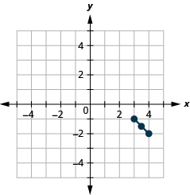

By the end of this section, you will be able to:
* Use the Distance Formula
* Use the Midpoint Formula
* Write the equation of a circle in standard form
* Graph a circle

Before you get started, take this readiness quiz.

1.  Find the length of the hypotenuse of a right triangle whose legs are 12 and 16 inches.
    * * *
    {: data-type="newline"}
    
    If you missed this problem, review [\[link\]](/m63310#fs-id1167832054640).
2.  Factor:
    <math xmlns="http://www.w3.org/1998/Math/MathML"><mrow><msup><mi>x</mi><mn>2</mn></msup><mo>−</mo><mn>18</mn><mi>x</mi><mo>+</mo><mn>81</mn><mo>.</mo></mrow></math>
    
    * * *
    {: data-type="newline"}
    
    If you missed this problem, review [\[link\]](/m63360#fs-id1167835345249).
3.  Solve by completing the square:
    <math xmlns="http://www.w3.org/1998/Math/MathML"><mrow><msup><mi>x</mi><mn>2</mn></msup><mo>−</mo><mn>12</mn><mi>x</mi><mo>−</mo><mn>12</mn><mo>=</mo><mn>0</mn><mo>.</mo></mrow></math>
    
    * * *
    {: data-type="newline"}
    
    If you missed this problem, review [\[link\]](/m63463#fs-id1167836717133).
{: data-number-style="arabic"}

In this chapter we will be looking at the conic sections, usually called the conics, and their properties. The conics are curves that result from a plane intersecting a double cone—two cones placed point-to-point. Each half of a double cone is called a nappe.

    There are four conics—the **circle**{: data-type="term"}, **parabola**{: data-type="term"}, **ellipse**{: data-type="term"}, and **hyperbola**{: data-type="term"}. The next figure shows how the plane intersecting the double cone results in each curve.

  ![Each of these four figures shows a double cone intersected by a plane. In the first figure, the plane is perpendicular to the axis of the cones and intersects the bottom cone to form a circle. In the second figure, the plane is at an angle to the axis and intersects the bottom cone in such a way that it intersects the base as well. Thus, the curve formed by the intersection is open at both ends. This is labeled parabola. In the third figure, the plane is at an angle to the axis and intersects the bottom cone in such a way that it does not intersect the base of the cone. Thus, the curve formed by the intersection is a closed loop, labeled ellipse. In the fourth figure, the plane is parallel to the axis, intersecting both cones. This is labeled hyperbola.](../resources/CNX_IntAlg_Figure_11_01_002_img.jpg)  Each of the curves has many applications that affect your daily life, from your cell phone to acoustics and navigation systems. In this section we will look at the properties of a circle.

# Use the Distance Formula

We have used the Pythagorean Theorem to find the lengths of the sides of a right triangle. Here we will use this theorem again to find distances on the rectangular coordinate system. By finding distance on the rectangular coordinate system, we can make a connection between the geometry of a conic and algebra—which opens up a world of opportunities for application.

Our first step is to develop a formula to find distances between points on the rectangular coordinate system. We will plot the points and create a right triangle much as we did when we found slope in [Graphs and Functions](/m63316){: .target-chapter}. We then take it one step further and use the Pythagorean Theorem to find the length of the hypotenuse of the triangle—which is the distance between the points.

Use the rectangular coordinate system to find the distance between the points <math xmlns="http://www.w3.org/1998/Math/MathML"><mrow><mrow><mo>(</mo><mrow><mn>6</mn><mo>,</mo><mn>4</mn></mrow><mo>)</mo></mrow></mrow></math>

 and <math xmlns="http://www.w3.org/1998/Math/MathML"><mrow><mrow><mo>(</mo><mrow><mn>2</mn><mo>,</mo><mn>1</mn></mrow><mo>)</mo></mrow><mo>.</mo></mrow></math>

<table class="unnumbered unstyled can-break" summary="Plot the two points 2, 1 and 6, 4. Connect the two points with a line d. Draw a right triangle as if you were going to find slope of that line. Find the length of each leg. The rise is 3 and the length is 4. Use the Pythagorean Theorem to find d, the distance between the two points. 3 squared plus 4 squared is d squared. Simplifying, we get 25 equals d squared. Use the Square Root Property, d is 5 or minus 5. Since distance, d is positive, we can eliminate minus 5. The distance between the points 6, 4 and 2, 1 is 5." data-label=""><tbody>
<tr valign="top">
<td data-valign="top" data-align="left">Plot the two points. Connect the two points
with a line.

Draw a right triangle as if you were going to
find slope.</td>
<td data-valign="top" data-align="left"></td>
</tr>
<tr valign="top">
<td data-valign="top" data-align="left">Find the length of each leg.</td>
<td data-valign="top" data-align="left"></td>
</tr>
<tr valign="top">
<td data-valign="top" data-align="left">Use the Pythagorean Theorem to find <em>d</em>, the
distance between the two points.</td>
<td data-valign="top" data-align="center"><math xmlns="http://www.w3.org/1998/Math/MathML"><mrow><msup><mi>a</mi><mn>2</mn></msup><mo>+</mo><msup><mi>b</mi><mn>2</mn></msup><mo>=</mo><msup><mi>c</mi><mn>2</mn></msup></mrow></math></td>
</tr>
<tr valign="top">
<td data-valign="top" data-align="left">Substitute in the values.</td>
<td data-valign="top" data-align="center"><math xmlns="http://www.w3.org/1998/Math/MathML"><mrow><msup><mn>3</mn><mn>2</mn></msup><mo>+</mo><msup><mn>4</mn><mn>2</mn></msup><mo>=</mo><msup><mi>d</mi><mn>2</mn></msup></mrow></math></td>
</tr>
<tr valign="top">
<td data-valign="top" data-align="left">Simplify.</td>
<td data-valign="top" data-align="center"><math xmlns="http://www.w3.org/1998/Math/MathML"><mrow><mspace width="0.3em" /><mn>9</mn><mo>+</mo><mn>16</mn><mo>=</mo><msup><mi>d</mi><mn>2</mn></msup></mrow></math></td>
</tr>
<tr valign="top">
<td data-valign="top" data-align="left" />
<td data-valign="top" data-align="center"><math xmlns="http://www.w3.org/1998/Math/MathML"><mrow><mspace width="2em" /><mn>25</mn><mo>=</mo><msup><mi>d</mi><mn>2</mn></msup></mrow></math></td>
</tr>
<tr valign="top">
<td data-valign="top" data-align="left">Use the Square Root Property.</td>
<td data-valign="top" data-align="center"><math xmlns="http://www.w3.org/1998/Math/MathML"><mrow><mspace width="1em" /><mi>d</mi><mo>=</mo><mn>5</mn><mspace width="2em" /><menclose notation="updiagonalstrike"><mrow><mi>d</mi><mo>=</mo><mn>−5</mn></mrow></menclose></mrow></math></td>
</tr>
<tr valign="top">
<td data-valign="top" data-align="left">Since distance, <em>d</em> is positive, we can eliminate
<math xmlns="http://www.w3.org/1998/Math/MathML"><mrow><mi>d</mi><mo>=</mo><mn>−5</mn><mo>.</mo></mrow></math></td>
<td data-valign="top" data-align="left">The distance between the points <math xmlns="http://www.w3.org/1998/Math/MathML"><mrow><mrow><mo>(</mo><mrow><mn>6</mn><mo>,</mo><mn>4</mn></mrow><mo>)</mo></mrow></mrow></math> and
<math xmlns="http://www.w3.org/1998/Math/MathML"><mrow><mrow><mo>(</mo><mrow><mn>2</mn><mo>,</mo><mn>1</mn></mrow><mo>)</mo></mrow></mrow></math> is 5.</td>
</tr>
</tbody></table>

Use the rectangular coordinate system to find the distance between the points <math xmlns="http://www.w3.org/1998/Math/MathML"><mrow><mrow><mo>(</mo><mrow><mn>6</mn><mo>,</mo><mn>1</mn></mrow><mo>)</mo></mrow></mrow></math>

 and <math xmlns="http://www.w3.org/1998/Math/MathML"><mrow><mrow><mo>(</mo><mrow><mn>2</mn><mo>,</mo><mn>−2</mn></mrow><mo>)</mo></mrow><mo>.</mo></mrow></math>

<math xmlns="http://www.w3.org/1998/Math/MathML"><mrow><mi>d</mi><mo>=</mo><mn>5</mn></mrow></math>

Use the rectangular coordinate system to find the distance between the points <math xmlns="http://www.w3.org/1998/Math/MathML"><mrow><mrow><mo>(</mo><mrow><mn>5</mn><mo>,</mo><mn>3</mn></mrow><mo>)</mo></mrow></mrow></math>

 and <math xmlns="http://www.w3.org/1998/Math/MathML"><mrow><mrow><mo>(</mo><mrow><mn>−3</mn><mo>,</mo><mn>−3</mn></mrow><mo>)</mo></mrow><mo>.</mo></mrow></math>

<math xmlns="http://www.w3.org/1998/Math/MathML"><mrow><mi>d</mi><mo>=</mo><mn>10</mn></mrow></math>

    The method we used in the last example leads us to the formula to find the distance between the two points <math xmlns="http://www.w3.org/1998/Math/MathML"><mrow><mrow><mo>(</mo><mrow><msub><mi>x</mi><mn>1</mn></msub><mo>,</mo><msub><mi>y</mi><mn>1</mn></msub></mrow><mo>)</mo></mrow></mrow></math>

 and <math xmlns="http://www.w3.org/1998/Math/MathML"><mrow><mrow><mo>(</mo><mrow><msub><mi>x</mi><mn>2</mn></msub><mo>,</mo><msub><mi>y</mi><mn>2</mn></msub></mrow><mo>)</mo></mrow><mo>.</mo></mrow></math>

When we found the length of the horizontal leg we subtracted <math xmlns="http://www.w3.org/1998/Math/MathML"><mrow><mn>6</mn><mo>−</mo><mn>2</mn></mrow></math>

 which is <math xmlns="http://www.w3.org/1998/Math/MathML"><mrow><msub><mi>x</mi><mn>2</mn></msub><mo>−</mo><msub><mi>x</mi><mn>1</mn></msub><mo>.</mo></mrow></math>

When we found the length of the vertical leg we subtracted <math xmlns="http://www.w3.org/1998/Math/MathML"><mrow><mn>4</mn><mo>−</mo><mn>1</mn></mrow></math>

 which is <math xmlns="http://www.w3.org/1998/Math/MathML"><mrow><msub><mi>y</mi><mn>2</mn></msub><mo>−</mo><msub><mi>y</mi><mn>1</mn></msub><mo>.</mo></mrow></math>

If the triangle had been in a different position, we may have subtracted <math xmlns="http://www.w3.org/1998/Math/MathML"><mrow><msub><mi>x</mi><mn>1</mn></msub><mo>−</mo><msub><mi>x</mi><mn>2</mn></msub></mrow></math>

 or <math xmlns="http://www.w3.org/1998/Math/MathML"><mrow><msub><mi>y</mi><mn>1</mn></msub><mo>−</mo><msub><mi>y</mi><mn>2</mn></msub><mo>.</mo></mrow></math>

 The expressions <math xmlns="http://www.w3.org/1998/Math/MathML"><mrow><msub><mi>x</mi><mn>2</mn></msub><mo>−</mo><msub><mi>x</mi><mn>1</mn></msub></mrow></math>

 and <math xmlns="http://www.w3.org/1998/Math/MathML"><mrow><msub><mi>x</mi><mn>1</mn></msub><mo>−</mo><msub><mi>x</mi><mn>2</mn></msub></mrow></math>

 vary only in the sign of the resulting number. To get the positive value-since distance is positive- we can use absolute value. So to generalize we will say <math xmlns="http://www.w3.org/1998/Math/MathML"><mrow><mrow><mo>\|</mo><mrow><msub><mi>x</mi><mn>2</mn></msub><mo>−</mo><msub><mi>x</mi><mn>1</mn></msub></mrow><mo>\|</mo></mrow></mrow></math>

 and <math xmlns="http://www.w3.org/1998/Math/MathML"><mrow><mrow><mo>\|</mo><mrow><msub><mi>y</mi><mn>2</mn></msub><mo>−</mo><msub><mi>y</mi><mn>1</mn></msub></mrow><mo>\|</mo></mrow><mo>.</mo></mrow></math>

In the Pythagorean Theorem, we substitute the general expressions <math xmlns="http://www.w3.org/1998/Math/MathML"><mrow><mrow><mo>\|</mo><mrow><msub><mi>x</mi><mn>2</mn></msub><mo>−</mo><msub><mi>x</mi><mn>1</mn></msub></mrow><mo>\|</mo></mrow></mrow></math>

 and <math xmlns="http://www.w3.org/1998/Math/MathML"><mrow><mrow><mo>\|</mo><mrow><msub><mi>y</mi><mn>2</mn></msub><mo>−</mo><msub><mi>y</mi><mn>1</mn></msub></mrow><mo>\|</mo></mrow></mrow></math>

 rather than the numbers.

<math xmlns="http://www.w3.org/1998/Math/MathML"><mrow> <mtable><mtr><mtd /><mtd /><mtd /><mtd columnalign="right"><msup><mi>a</mi><mn>2</mn></msup></mtd><mtd columnalign="left"><mo>+</mo></mtd><mtd columnalign="left"><msup><mi>b</mi><mn>2</mn></msup><mo>=</mo><msup><mi>c</mi><mn>2</mn></msup></mtd></mtr> <mtr><mtd columnalign="left"><mtext>Substitute in the values.</mtext></mtd><mtd /><mtd /><mtd columnalign="right"><msup><mrow><mrow><mo>(</mo><mrow><mrow><mo>\|</mo><mrow><msub><mi>x</mi><mn>2</mn></msub><mo>−</mo><msub><mi>x</mi><mn>1</mn></msub></mrow><mo>\|</mo></mrow></mrow><mo>)</mo></mrow></mrow><mn>2</mn></msup></mtd><mtd columnalign="left"><mo>+</mo></mtd><mtd columnalign="left"><msup><mrow><mrow><mo>(</mo><mrow><mrow><mo>\|</mo><mrow><msub><mi>y</mi><mn>2</mn></msub><mo>−</mo><msub><mi>y</mi><mn>1</mn></msub></mrow><mo>\|</mo></mrow></mrow><mo>)</mo></mrow></mrow><mn>2</mn></msup><mo>=</mo><msup><mi>d</mi><mn>2</mn></msup></mtd></mtr> <mtr><mtd columnalign="left"><mtable><mtr><mtd columnalign="left"><mtext>Squaring the expressions makes them</mtext></mtd></mtr><mtr><mtd columnalign="left"><mtext>positive, so we eliminate the absolute value</mtext></mtd></mtr><mtr><mtd columnalign="left"><mtext>bars.</mtext></mtd></mtr></mtable></mtd><mtd /><mtd /><mtd columnalign="right"><msup><mrow><mrow><mo>(</mo><mrow><msub><mi>x</mi><mn>2</mn></msub><mo>−</mo><msub><mi>x</mi><mn>1</mn></msub></mrow><mo>)</mo></mrow></mrow><mn>2</mn></msup></mtd><mtd columnalign="left"><mo>+</mo></mtd><mtd columnalign="left"><msup><mrow><mrow><mo>(</mo><mrow><msub><mi>y</mi><mn>2</mn></msub><mo>−</mo><msub><mi>y</mi><mn>1</mn></msub></mrow><mo>)</mo></mrow></mrow><mn>2</mn></msup><mo>=</mo><msup><mi>d</mi><mn>2</mn></msup></mtd></mtr> <mtr><mtd columnalign="left"><mtext>Use the Square Root Property.</mtext></mtd><mtd /><mtd /><mtd columnalign="right"><mi>d</mi></mtd><mtd columnalign="left"><mo>=</mo></mtd><mtd columnalign="left"><mo>±</mo><msqrt><mrow><msup><mrow><mrow><mo>(</mo><mrow><msub><mi>x</mi><mn>2</mn></msub><mo>−</mo><msub><mi>x</mi><mn>1</mn></msub></mrow><mo>)</mo></mrow></mrow><mn>2</mn></msup><mo>+</mo><msup><mrow><mrow><mo>(</mo><mrow><msub><mi>y</mi><mn>2</mn></msub><mo>−</mo><msub><mi>y</mi><mn>1</mn></msub></mrow><mo>)</mo></mrow></mrow><mn>2</mn></msup></mrow></msqrt></mtd></mtr> <mtr><mtd columnalign="left"><mtable><mtr><mtd columnalign="left"><mtext>Distance is positive, so eliminate the negative</mtext></mtd></mtr><mtr><mtd columnalign="left"><mtext>value.</mtext></mtd></mtr></mtable></mtd><mtd /><mtd /><mtd columnalign="right"><mi>d</mi></mtd><mtd columnalign="left"><mo>=</mo></mtd><mtd columnalign="left"><msqrt><mrow><msup><mrow><mrow><mo>(</mo><mrow><msub><mi>x</mi><mn>2</mn></msub><mo>−</mo><msub><mi>x</mi><mn>1</mn></msub></mrow><mo>)</mo></mrow></mrow><mn>2</mn></msup><mo>+</mo><msup><mrow><mrow><mo>(</mo><mrow><msub><mi>y</mi><mn>2</mn></msub><mo>−</mo><msub><mi>y</mi><mn>1</mn></msub></mrow><mo>)</mo></mrow></mrow><mn>2</mn></msup></mrow></msqrt></mtd></mtr></mtable></mrow></math>

This is the Distance Formula we use to find the distance *d* between the two points <math xmlns="http://www.w3.org/1998/Math/MathML"><mrow><mrow><mo>(</mo><mrow><msub><mi>x</mi><mn>1</mn></msub><mo>,</mo><msub><mi>y</mi><mn>1</mn></msub></mrow><mo>)</mo></mrow></mrow></math>

 and <math xmlns="http://www.w3.org/1998/Math/MathML"><mrow><mrow><mo>(</mo><mrow><msub><mi>x</mi><mn>2</mn></msub><mo>,</mo><msub><mi>y</mi><mn>2</mn></msub></mrow><mo>)</mo></mrow><mo>.</mo></mrow></math>

Distance Formula

The distance *d* between the two points <math xmlns="http://www.w3.org/1998/Math/MathML"><mrow><mrow><mo>(</mo><mrow><msub><mi>x</mi><mn>1</mn></msub><mo>,</mo><msub><mi>y</mi><mn>1</mn></msub></mrow><mo>)</mo></mrow></mrow></math>

 and <math xmlns="http://www.w3.org/1998/Math/MathML"><mrow><mrow><mo>(</mo><mrow><msub><mi>x</mi><mn>2</mn></msub><mo>,</mo><msub><mi>y</mi><mn>2</mn></msub></mrow><mo>)</mo></mrow></mrow></math>

 is

<math xmlns="http://www.w3.org/1998/Math/MathML"><mrow><mi>d</mi><mo>=</mo><msqrt><mrow><msup><mrow><mrow><mo>(</mo><mrow><msub><mi>x</mi><mn>2</mn></msub><mo>−</mo><msub><mi>x</mi><mn>1</mn></msub></mrow><mo>)</mo></mrow></mrow><mn>2</mn></msup><mo>+</mo><msup><mrow><mrow><mo>(</mo><mrow><msub><mi>y</mi><mn>2</mn></msub><mo>−</mo><msub><mi>y</mi><mn>1</mn></msub></mrow><mo>)</mo></mrow></mrow><mn>2</mn></msup></mrow></msqrt></mrow></math>

Use the Distance Formula to find the distance between the points <math xmlns="http://www.w3.org/1998/Math/MathML"><mrow><mrow><mo>(</mo><mrow><mn>−5</mn><mo>,</mo><mn>−3</mn></mrow><mo>)</mo></mrow></mrow></math>

 and <math xmlns="http://www.w3.org/1998/Math/MathML"><mrow><mrow><mo>(</mo><mrow><mn>7</mn><mo>,</mo><mn>2</mn></mrow><mo>)</mo></mrow><mo>.</mo></mrow></math>

<math xmlns="http://www.w3.org/1998/Math/MathML"><mrow> <mtable><mtr><mtd columnalign="left"><mtext>Write the Distance Formula.</mtext></mtd><mtd /><mtd /><mtd /><mtd /><mtd columnalign="left"><mi>d</mi></mtd><mtd columnalign="left"><mo>=</mo></mtd><mtd columnalign="left"><msqrt><mrow><msup><mrow><mrow><mo>(</mo><mrow><msub><mi>x</mi><mn>2</mn></msub><mo>−</mo><msub><mi>x</mi><mn>1</mn></msub></mrow><mo>)</mo></mrow></mrow><mn>2</mn></msup><mo>+</mo><msup><mrow><mrow><mo>(</mo><mrow><msub><mi>y</mi><mn>2</mn></msub><mo>−</mo><msub><mi>y</mi><mn>1</mn></msub></mrow><mo>)</mo></mrow></mrow><mn>2</mn></msup></mrow></msqrt></mtd></mtr> <mtr><mtd columnalign="left"><mtext>Label the points,</mtext><mspace width="0.2em" /><mrow><mo>(</mo><mrow><mover><mrow><mn>−5</mn><mo>,</mo><mn>−3</mn></mrow><mrow><msub><mi>x</mi><mn>1</mn></msub><mo>,</mo><msub><mi>y</mi><mrow><mn>1</mn></mrow></msub></mrow></mover></mrow><mo>)</mo></mrow><mo>,</mo><mo>(</mo><mrow><mover><mrow><mn>7</mn><mo>,</mo><mn>2</mn></mrow><mrow><msub><mi>x</mi><mn>2</mn></msub><mo>,</mo><msub><mi>y</mi><mrow><mn>2</mn></mrow></msub></mrow></mover></mrow><mo>)</mo><mspace width="0.2em" /><mtext>and substitute.</mtext></mtd><mtd /><mtd /><mtd /><mtd /><mtd columnalign="left"><mi>d</mi></mtd><mtd columnalign="left"><mo>=</mo></mtd><mtd columnalign="left"><msqrt><mrow><msup><mrow><mrow><mo>(</mo><mrow><mn>7</mn><mo>−</mo><mrow><mo>(</mo><mrow><mn>−5</mn></mrow><mo>)</mo></mrow></mrow><mo>)</mo></mrow></mrow><mn>2</mn></msup><mo>+</mo><msup><mrow><mrow><mo>(</mo><mrow><mn>2</mn><mo>−</mo><mrow><mo>(</mo><mrow><mn>−3</mn></mrow><mo>)</mo></mrow></mrow><mo>)</mo></mrow></mrow><mn>2</mn></msup></mrow></msqrt></mtd></mtr> <mtr /> <mtr><mtd columnalign="left"><mtext>Simplify.</mtext></mtd><mtd /><mtd /><mtd /><mtd /><mtd columnalign="left"><mi>d</mi></mtd><mtd columnalign="left"><mo>=</mo></mtd><mtd columnalign="left"><msqrt><mrow><msup><mrow><mn>12</mn></mrow><mn>2</mn></msup><mo>+</mo><msup><mn>5</mn><mn>2</mn></msup></mrow></msqrt></mtd></mtr> <mtr><mtd /><mtd /><mtd /><mtd /><mtd /><mtd columnalign="left"><mi>d</mi></mtd><mtd columnalign="left"><mo>=</mo></mtd><mtd columnalign="left"><msqrt><mrow><mn>144</mn><mo>+</mo><mn>25</mn></mrow></msqrt></mtd></mtr> <mtr><mtd /><mtd /><mtd /><mtd /><mtd /><mtd columnalign="left"><mi>d</mi></mtd><mtd columnalign="left"><mo>=</mo></mtd><mtd columnalign="left"><msqrt><mrow><mn>169</mn></mrow></msqrt></mtd></mtr> <mtr><mtd /><mtd /><mtd /><mtd /><mtd /><mtd columnalign="left"><mi>d</mi></mtd><mtd columnalign="left"><mo>=</mo></mtd><mtd columnalign="left"><mn>13</mn></mtd></mtr></mtable></mrow></math>

Use the Distance Formula to find the distance between the points <math xmlns="http://www.w3.org/1998/Math/MathML"><mrow><mrow><mo>(</mo><mrow><mn>−4</mn><mo>,</mo><mn>−5</mn></mrow><mo>)</mo></mrow></mrow></math>

 and <math xmlns="http://www.w3.org/1998/Math/MathML"><mrow><mrow><mo>(</mo><mrow><mn>5</mn><mo>,</mo><mn>7</mn></mrow><mo>)</mo></mrow><mo>.</mo></mrow></math>

<math xmlns="http://www.w3.org/1998/Math/MathML"><mrow><mi>d</mi><mo>=</mo><mn>15</mn></mrow></math>

Use the Distance Formula to find the distance between the points <math xmlns="http://www.w3.org/1998/Math/MathML"><mrow><mrow><mo>(</mo><mrow><mn>−2</mn><mo>,</mo><mn>−5</mn></mrow><mo>)</mo></mrow></mrow></math>

 and <math xmlns="http://www.w3.org/1998/Math/MathML"><mrow><mrow><mo>(</mo><mrow><mn>−14</mn><mo>,</mo><mn>−10</mn></mrow><mo>)</mo></mrow><mo>.</mo></mrow></math>

<math xmlns="http://www.w3.org/1998/Math/MathML"><mrow><mi>d</mi><mo>=</mo><mn>13</mn></mrow></math>

Use the Distance Formula to find the distance between the points <math xmlns="http://www.w3.org/1998/Math/MathML"><mrow><mrow><mo>(</mo><mrow><mn>10</mn><mo>,</mo><mn>−4</mn></mrow><mo>)</mo></mrow></mrow></math>

 and <math xmlns="http://www.w3.org/1998/Math/MathML"><mrow><mrow><mo>(</mo><mrow><mn>−1</mn><mo>,</mo><mn>5</mn></mrow><mo>)</mo></mrow><mo>.</mo></mrow></math>

 Write the answer in exact form and then find the decimal approximation, rounded to the nearest tenth if needed.

<math xmlns="http://www.w3.org/1998/Math/MathML"><mrow> <mtable><mtr><mtd columnalign="left"><mtext>Write the Distance Formula.</mtext></mtd><mtd /><mtd /><mtd /><mtd /><mtd columnalign="left"><mi>d</mi><mo>=</mo><msqrt><mrow><msup><mrow><mrow><mo>(</mo><mrow><msub><mi>x</mi><mn>2</mn></msub><mo>−</mo><msub><mi>x</mi><mn>1</mn></msub></mrow><mo>)</mo></mrow></mrow><mn>2</mn></msup><mo>+</mo><msup><mrow><mrow><mo>(</mo><mrow><msub><mi>y</mi><mn>2</mn></msub><mo>−</mo><msub><mi>y</mi><mn>1</mn></msub></mrow><mo>)</mo></mrow></mrow><mn>2</mn></msup></mrow></msqrt></mtd></mtr><mtr /><mtr /> <mtr><mtd columnalign="left"><mtext>Label the points,</mtext><mspace width="0.2em" /><mrow><mo>(</mo><mrow><mover><mrow><mn>10</mn><mo>,</mo><mn>−4</mn></mrow><mrow><msub><mi>x</mi><mn>1</mn></msub><mo>,</mo><msub><mi>y</mi><mrow><mn>1</mn></mrow></msub></mrow></mover></mrow><mo>)</mo></mrow><mo>,</mo><mrow><mo>(</mo><mrow><mover><mrow><mn>−1</mn><mo>,</mo><mn>5</mn></mrow><mrow><msub><mi>x</mi><mn>2</mn></msub><mo>,</mo><msub><mi>y</mi><mrow><mn>2</mn></mrow></msub></mrow></mover></mrow><mo>)</mo></mrow><mspace width="0.2em" /><mtext>and substitute.</mtext></mtd><mtd /><mtd /><mtd /><mtd /><mtd columnalign="left"><mi>d</mi><mo>=</mo><msqrt><mrow><msup><mrow><mrow><mo>(</mo><mrow><mn>−1</mn><mo>−</mo><mn>10</mn></mrow><mo>)</mo></mrow></mrow><mn>2</mn></msup><mo>+</mo><msup><mrow><mrow><mo>(</mo><mrow><mn>5</mn><mo>−</mo><mrow><mo>(</mo><mrow><mn>−4</mn></mrow><mo>)</mo></mrow></mrow><mo>)</mo></mrow></mrow><mn>2</mn></msup></mrow></msqrt></mtd></mtr> <mtr /><mtr /><mtr><mtd columnalign="left"><mtext>Simplify.</mtext></mtd><mtd /><mtd /><mtd /><mtd /><mtd columnalign="left"><mi>d</mi><mo>=</mo><msqrt><mrow><msup><mrow><mrow><mo>(</mo><mrow><mn>−11</mn></mrow><mo>)</mo></mrow></mrow><mn>2</mn></msup><mo>+</mo><msup><mn>9</mn><mn>2</mn></msup></mrow></msqrt></mtd></mtr> <mtr><mtd /><mtd /><mtd /><mtd /><mtd /><mtd columnalign="left"><mi>d</mi><mo>=</mo><msqrt><mrow><mn>121</mn><mo>+</mo><mn>81</mn></mrow></msqrt></mtd></mtr> <mtr><mtd /><mtd /><mtd /><mtd /><mtd /><mtd columnalign="left"><mi>d</mi><mo>=</mo><msqrt><mrow><mn>202</mn></mrow></msqrt></mtd></mtr> <mtr><mtd columnalign="left"><mtable><mtr><mtd columnalign="left"><mtext>Since 202 is not a perfect square, we can leave</mtext></mtd></mtr><mtr><mtd columnalign="left"><mtext>the answer in exact form or find a decimal</mtext></mtd></mtr><mtr><mtd columnalign="left"><mtext>approximation.</mtext></mtd></mtr></mtable></mtd><mtd /><mtd /><mtd /><mtd /><mtd columnalign="left"><mtable><mtr><mtd columnalign="left"><mi>d</mi><mo>=</mo><msqrt><mrow><mn>202</mn></mrow></msqrt></mtd></mtr><mtr><mtd columnalign="left"><mspace width="1em" /><mtext>or</mtext></mtd></mtr><mtr><mtd columnalign="left"><mi>d</mi><mo>≈</mo><mn>14.2</mn></mtd></mtr></mtable></mtd></mtr></mtable></mrow></math>

Use the Distance Formula to find the distance between the points <math xmlns="http://www.w3.org/1998/Math/MathML"><mrow><mrow><mo>(</mo><mrow><mn>−4</mn><mo>,</mo><mn>−5</mn></mrow><mo>)</mo></mrow></mrow></math>

 and <math xmlns="http://www.w3.org/1998/Math/MathML"><mrow><mrow><mo>(</mo><mrow><mn>3</mn><mo>,</mo><mn>4</mn></mrow><mo>)</mo></mrow><mo>.</mo></mrow></math>

 Write the answer in exact form and then find the decimal approximation, rounded to the nearest tenth if needed.

<math xmlns="http://www.w3.org/1998/Math/MathML"><mrow><mi>d</mi><mo>=</mo><msqrt><mrow><mn>130</mn></mrow></msqrt><mo>,</mo><mi>d</mi><mo>≈</mo><mn>11.4</mn></mrow></math>

Use the Distance Formula to find the distance between the points <math xmlns="http://www.w3.org/1998/Math/MathML"><mrow><mrow><mo>(</mo><mrow><mn>−2</mn><mo>,</mo><mn>−5</mn></mrow><mo>)</mo></mrow></mrow></math>

 and <math xmlns="http://www.w3.org/1998/Math/MathML"><mrow><mrow><mo>(</mo><mrow><mn>−3</mn><mo>,</mo><mn>−4</mn></mrow><mo>)</mo></mrow><mo>.</mo></mrow></math>

 Write the answer in exact form and then find the decimal approximation, rounded to the nearest tenth if needed.

<math xmlns="http://www.w3.org/1998/Math/MathML"><mrow><mi>d</mi><mo>=</mo><msqrt><mn>2</mn></msqrt><mo>,</mo><mi>d</mi><mo>≈</mo><mn>1.4</mn></mrow></math>

# Use the Midpoint Formula

It is often useful to be able to find the midpoint of a segment. For example, if you have the endpoints of the diameter of a circle, you may want to find the center of the circle which is the midpoint of the diameter. To find the midpoint of a line segment, we find the average of the *x*-coordinates and the average of the *y*-coordinates of the endpoints.

Midpoint Formula

The midpoint of the line segment whose endpoints are the two points <math xmlns="http://www.w3.org/1998/Math/MathML"><mrow><mrow><mo>(</mo><mrow><msub><mi>x</mi><mn>1</mn></msub><mo>,</mo><msub><mi>y</mi><mn>1</mn></msub></mrow><mo>)</mo></mrow></mrow></math>

 and <math xmlns="http://www.w3.org/1998/Math/MathML"><mrow><mrow><mo>(</mo><mrow><msub><mi>x</mi><mn>2</mn></msub><mo>,</mo><msub><mi>y</mi><mn>2</mn></msub></mrow><mo>)</mo></mrow></mrow></math>

 is

<math xmlns="http://www.w3.org/1998/Math/MathML"><mrow><mrow><mo>(</mo><mrow><mfrac><mrow><msub><mi>x</mi><mn>1</mn></msub><mo>+</mo><msub><mi>x</mi><mn>2</mn></msub></mrow><mn>2</mn></mfrac><mo>,</mo><mfrac><mrow><msub><mi>y</mi><mn>1</mn></msub><mo>+</mo><msub><mi>y</mi><mn>2</mn></msub></mrow><mn>2</mn></mfrac></mrow><mo>)</mo></mrow></mrow></math>

To find the midpoint of a line segment, we find the average of the *x*-coordinates and the average of the *y*-coordinates of the endpoints.

Use the Midpoint Formula to find the midpoint of the line segments whose endpoints are <math xmlns="http://www.w3.org/1998/Math/MathML"><mrow><mrow><mo>(</mo><mrow><mn>−5</mn><mo>,</mo><mn>−4</mn></mrow><mo>)</mo></mrow></mrow></math>

 and <math xmlns="http://www.w3.org/1998/Math/MathML"><mrow><mrow><mo>(</mo><mrow><mn>7</mn><mo>,</mo><mn>2</mn></mrow><mo>)</mo></mrow><mo>.</mo></mrow></math>

 Plot the endpoints and the midpoint on a rectangular coordinate system.

<table class="unnumbered unstyled can-break" summary="Write the Midpoint Formula. The x coordinate is open parentheses x subscript 1 plus x subscript 2 close parentheses upon 2 and the y coordinate is open parentheses y subscript 1 plus y subscript 2 close parentheses upon 2. Label the points: (negative 5, negative 4) is (x subscript 1, y subscript 1) and (7, 2) is (x subscript 2, y subscript 2). Substituting these values in the formula and simplifying, we get (1, negative 1). This is the midpoint of the segment. Plot the endpoints and midpoint." data-label=""><tbody>
<tr valign="top">
<td data-valign="top" data-align="left">Write the Midpoint Formula.</td>
<td data-valign="top" data-align="center"><math xmlns="http://www.w3.org/1998/Math/MathML"><mrow><mrow><mo>(</mo><mrow><mfrac><mrow><msub><mi>x</mi><mn>1</mn></msub><mo>+</mo><msub><mi>x</mi><mn>2</mn></msub></mrow><mn>2</mn></mfrac><mo>,</mo><mfrac><mrow><msub><mi>y</mi><mn>1</mn></msub><mo>+</mo><msub><mi>y</mi><mn>2</mn></msub></mrow><mn>2</mn></mfrac></mrow><mo>)</mo></mrow></mrow></math></td>
</tr>
<tr valign="top">
<td data-valign="top" data-align="left">Label the points, <math xmlns="http://www.w3.org/1998/Math/MathML"><mrow><mrow><mo>(</mo><mrow><mover><mrow><mn>−5</mn><mo>,</mo><mn>−4</mn></mrow><mrow><msub><mi>x</mi><mn>1</mn></msub><mo>,</mo><msub><mi>y</mi><mrow><mn>1</mn></mrow></msub></mrow></mover></mrow><mo>)</mo></mrow><mo>,</mo><mrow><mo>(</mo><mrow><mover><mrow><mn>7</mn><mo>,</mo><mn>2</mn></mrow><mrow><msub><mi>x</mi><mn>2</mn></msub><mo>,</mo><msub><mi>y</mi><mrow><mn>2</mn></mrow></msub></mrow></mover></mrow><mo>)</mo></mrow></mrow></math>
and substitute.</td>
<td data-valign="top" data-align="center"><math xmlns="http://www.w3.org/1998/Math/MathML"><mrow><mrow><mo>(</mo><mrow><mfrac><mrow><mn>−5</mn><mo>+</mo><mn>7</mn></mrow><mn>2</mn></mfrac><mo>,</mo><mfrac><mrow><mn>−4</mn><mo>+</mo><mn>2</mn></mrow><mn>2</mn></mfrac></mrow><mo>)</mo></mrow></mrow></math></td>
</tr>
<tr valign="top">
<td data-valign="top" data-align="left">Simplify.</td>
<td data-valign="top" data-align="center"><math xmlns="http://www.w3.org/1998/Math/MathML"><mrow><mrow><mo>(</mo><mrow><mfrac><mn>2</mn><mn>2</mn></mfrac><mo>,</mo><mfrac><mrow><mn>−2</mn></mrow><mn>2</mn></mfrac></mrow><mo>)</mo></mrow></mrow></math></td>
</tr>
<tr valign="top">
<td data-valign="top" data-align="left" />
<td data-valign="top" data-align="center"><math xmlns="http://www.w3.org/1998/Math/MathML"><mrow><mrow><mo>(</mo><mrow><mn>1</mn><mo>,</mo><mn>−1</mn></mrow><mo>)</mo></mrow></mrow></math>
The midpoint of the segment is the point
<math xmlns="http://www.w3.org/1998/Math/MathML"><mrow><mrow><mo>(</mo><mrow><mn>1</mn><mo>,</mo><mn>−1</mn></mrow><mo>)</mo></mrow><mo>.</mo></mrow></math></td>
</tr>
<tr valign="top">
<td data-valign="top" data-align="left">Plot the endpoints and midpoint.</td>
<td data-valign="top" data-align="left"></td>
</tr>
</tbody></table>

Use the Midpoint Formula to find the midpoint of the line segments whose endpoints are <math xmlns="http://www.w3.org/1998/Math/MathML"><mrow><mrow><mo>(</mo><mrow><mn>−3</mn><mo>,</mo><mn>−5</mn></mrow><mo>)</mo></mrow></mrow></math>

 and <math xmlns="http://www.w3.org/1998/Math/MathML"><mrow><mrow><mo>(</mo><mrow><mn>5</mn><mo>,</mo><mn>7</mn></mrow><mo>)</mo></mrow><mo>.</mo></mrow></math>

 Plot the endpoints and the midpoint on a rectangular coordinate system.

  

Use the Midpoint Formula to find the midpoint of the line segments whose endpoints are <math xmlns="http://www.w3.org/1998/Math/MathML"><mrow><mrow><mo>(</mo><mrow><mn>−2</mn><mo>,</mo><mn>−5</mn></mrow><mo>)</mo></mrow></mrow></math>

 and <math xmlns="http://www.w3.org/1998/Math/MathML"><mrow><mrow><mo>(</mo><mrow><mn>6</mn><mo>,</mo><mn>−1</mn></mrow><mo>)</mo></mrow><mo>.</mo></mrow></math>

 Plot the endpoints and the midpoint on a rectangular coordinate system.

  

Both the Distance Formula and the Midpoint Formula depend on two points, <math xmlns="http://www.w3.org/1998/Math/MathML"><mrow><mrow><mo>(</mo><mrow><msub><mi>x</mi><mn>1</mn></msub><mo>,</mo><msub><mi>y</mi><mn>1</mn></msub></mrow><mo>)</mo></mrow></mrow></math>

 and <math xmlns="http://www.w3.org/1998/Math/MathML"><mrow><mrow><mo>(</mo><mrow><msub><mi>x</mi><mn>2</mn></msub><mo>,</mo><msub><mi>y</mi><mn>2</mn></msub></mrow><mo>)</mo></mrow><mo>.</mo></mrow></math>

 It is easy to confuse which formula requires addition and which subtraction of the coordinates. If we remember where the formulas come from, is may be easier to remember the formulas.

    # Write the Equation of a Circle in Standard Form

As we mentioned, our goal is to connect the geometry of a conic with algebra. By using the coordinate plane, we are able to do this easily.

    We define a **circle**{: data-type="term" .no-emphasis} as all points in a plane that are a fixed distance from a given point in the plane. The given point is called the *center,* <math xmlns="http://www.w3.org/1998/Math/MathML"><mrow><mrow><mo>(</mo><mrow><mi>h</mi><mo>,</mo><mi>k</mi></mrow><mo>)</mo></mrow><mo>,</mo></mrow></math>

 and the fixed distance is called the *radius*, *r*, of the circle.

Circle

A circle is all points in a plane that are a fixed distance from a given point in the plane. The given point is called the **center**, <math xmlns="http://www.w3.org/1998/Math/MathML"><mrow><mrow><mo>(</mo><mrow><mi>h</mi><mo>,</mo><mi>k</mi></mrow><mo>)</mo></mrow><mo>,</mo></mrow></math>

 and the fixed distance is called the **radius**, *r*, of the circle.

<table class="unnumbered unstyled" summary="We look at a circle in the rectangular coordinate system. The radius is the distance from the center, (h, k) to a point on the circle, x, y. To derive the equation of a circle, we can use the distance formula with the point (h, k), point x, y and the distance, r. The distance formula is d equals square root of open parentheses x subscript 2 minus x subscript 1 close parentheses squared plus open parentheses y subscript 2 minus y subscript 1 close parentheses squared. Substituting the values and squaring both sides, we get r squared equals open parentheses x minus h close parentheses squared plus open parentheses y minus k close parentheses squared. This is the standard form of the equation of a circle with center, (h, k) and radius, r." data-label=""><tbody>
<tr valign="top">
<td data-valign="top" data-align="left">We look at a circle in the rectangular coordinate system.
The radius is the distance from the center, <math xmlns="http://www.w3.org/1998/Math/MathML"><mrow><mrow><mo>(</mo><mrow><mi>h</mi><mo>,</mo><mi>k</mi></mrow><mo>)</mo></mrow><mo>,</mo></mrow></math> to a
point on the circle, <math xmlns="http://www.w3.org/1998/Math/MathML"><mrow><mrow><mo>(</mo><mrow><mi>x</mi><mo>,</mo><mi>y</mi></mrow><mo>)</mo></mrow><mo>.</mo></mrow></math></td>
<td data-valign="top" data-align="left"></td>
</tr>
<tr valign="top">
<td data-valign="top" data-align="left">To derive the equation of a circle, we can use the
distance formula with the points <math xmlns="http://www.w3.org/1998/Math/MathML"><mrow><mrow><mo>(</mo><mrow><mi>h</mi><mo>,</mo><mi>k</mi></mrow><mo>)</mo></mrow><mo>,</mo></mrow></math> <math xmlns="http://www.w3.org/1998/Math/MathML"><mrow><mrow><mo>(</mo><mrow><mi>x</mi><mo>,</mo><mi>y</mi></mrow><mo>)</mo></mrow></mrow></math> and the
distance, <em>r</em>.</td>
<td data-valign="top" data-align="left"><math xmlns="http://www.w3.org/1998/Math/MathML"><mrow><mspace width="0.55em" /><mi>d</mi><mo>=</mo><msqrt><mrow><msup><mrow><mrow><mo>(</mo><mrow><msub><mi>x</mi><mn>2</mn></msub><mo>−</mo><msub><mi>x</mi><mn>1</mn></msub></mrow><mo>)</mo></mrow></mrow><mn>2</mn></msup><mo>+</mo><msup><mrow><mrow><mo>(</mo><mrow><msub><mi>y</mi><mn>2</mn></msub><mo>−</mo><msub><mi>y</mi><mn>1</mn></msub></mrow><mo>)</mo></mrow></mrow><mn>2</mn></msup></mrow></msqrt></mrow></math></td>
</tr>
<tr valign="top">
<td data-valign="top" data-align="left">Substitute the values.</td>
<td data-valign="top" data-align="left"><math xmlns="http://www.w3.org/1998/Math/MathML"><mrow><mspace width="0.55em" /><mi>r</mi><mo>=</mo><msqrt><mrow><msup><mrow><mrow><mo>(</mo><mrow><mi>x</mi><mo>−</mo><mi>h</mi></mrow><mo>)</mo></mrow></mrow><mn>2</mn></msup><mo>+</mo><msup><mrow><mrow><mo>(</mo><mrow><mi>y</mi><mo>−</mo><mi>k</mi></mrow><mo>)</mo></mrow></mrow><mn>2</mn></msup></mrow></msqrt></mrow></math></td>
</tr>
<tr valign="top">
<td data-valign="top" data-align="left">Square both sides.</td>
<td data-valign="top" data-align="left"><math xmlns="http://www.w3.org/1998/Math/MathML"><mrow><msup><mi>r</mi><mn>2</mn></msup><mo>=</mo><msup><mrow><mrow><mo>(</mo><mrow><mi>x</mi><mo>−</mo><mi>h</mi></mrow><mo>)</mo></mrow></mrow><mn>2</mn></msup><mo>+</mo><msup><mrow><mrow><mo>(</mo><mrow><mi>y</mi><mo>−</mo><mi>k</mi></mrow><mo>)</mo></mrow></mrow><mn>2</mn></msup></mrow></math></td>
</tr>
</tbody></table>

This is the standard form of the equation of a circle with center, <math xmlns="http://www.w3.org/1998/Math/MathML"><mrow><mrow><mo>(</mo><mrow><mi>h</mi><mo>,</mo><mi>k</mi></mrow><mo>)</mo></mrow><mo>,</mo></mrow></math>

 and radius, *r*.

Standard Form of the Equation a Circle

The standard form of the equation of a circle with center, <math xmlns="http://www.w3.org/1998/Math/MathML"><mrow><mrow><mo>(</mo><mrow><mi>h</mi><mo>,</mo><mi>k</mi></mrow><mo>)</mo></mrow><mo>,</mo></mrow></math>

 and radius, *r*, is

  

Write the standard form of the equation of the circle with radius 3 and center <math xmlns="http://www.w3.org/1998/Math/MathML"><mrow><mrow><mo>(</mo><mrow><mn>0</mn><mo>,</mo><mn>0</mn></mrow><mo>)</mo></mrow><mo>.</mo></mrow></math>

| Use the standard form of the equation of a circle | <math xmlns="http://www.w3.org/1998/Math/MathML"><mrow><msup><mrow><mrow><mo>(</mo><mrow><mi>x</mi><mo>−</mo><mi>h</mi></mrow><mo>)</mo></mrow></mrow><mn>2</mn></msup><mo>+</mo><msup><mrow><mrow><mo>(</mo><mrow><mi>y</mi><mo>−</mo><mi>k</mi></mrow><mo>)</mo></mrow></mrow><mn>2</mn></msup><mo>=</mo><msup><mi>r</mi><mn>2</mn></msup></mrow></math>

 |
{: valign="top"}| Substitute in the values <math xmlns="http://www.w3.org/1998/Math/MathML"><mrow><mi>r</mi><mo>=</mo><mn>3</mn><mo>,</mo><mi>h</mi><mo>=</mo><mn>0</mn><mo>,</mo></mrow></math>

 and <math xmlns="http://www.w3.org/1998/Math/MathML"><mrow><mi>k</mi><mo>=</mo><mn>0</mn><mo>.</mo></mrow></math>

 | <math xmlns="http://www.w3.org/1998/Math/MathML"><mrow><msup><mrow><mrow><mo>(</mo><mrow><mi>x</mi><mo>−</mo><mn>0</mn></mrow><mo>)</mo></mrow></mrow><mn>2</mn></msup><mo>+</mo><msup><mrow><mrow><mo>(</mo><mrow><mi>y</mi><mo>−</mo><mn>0</mn></mrow><mo>)</mo></mrow></mrow><mn>2</mn></msup><mo>=</mo><msup><mn>3</mn><mn>2</mn></msup></mrow></math>

 |
{: valign="top"}|  |  |
{: valign="top"}| Simplify. | <math xmlns="http://www.w3.org/1998/Math/MathML"><mrow><msup><mi>x</mi><mn>2</mn></msup><mo>+</mo><msup><mi>y</mi><mn>2</mn></msup><mo>=</mo><mn>9</mn></mrow></math>

 |
{: valign="top"}{: .unnumbered .unstyled summary="Use the standard form of the equation of a circle open parentheses x minus h close parentheses squared plus open parentheses y minus k close parentheses squared equals r squared. Substitute values r equals 3, h equals 0 and k equals 0 and simplify. We get x squared plus y squared equals 9." data-label=""}

Write the standard form of the equation of the circle with a radius of 6 and center <math xmlns="http://www.w3.org/1998/Math/MathML"><mrow><mrow><mo>(</mo><mrow><mn>0</mn><mo>,</mo><mn>0</mn></mrow><mo>)</mo></mrow><mo>.</mo></mrow></math>

<math xmlns="http://www.w3.org/1998/Math/MathML"><mrow><msup><mi>x</mi><mn>2</mn></msup><mo>+</mo><msup><mi>y</mi><mn>2</mn></msup><mo>=</mo><mn>36</mn></mrow></math>

Write the standard form of the equation of the circle with a radius of 8 and center <math xmlns="http://www.w3.org/1998/Math/MathML"><mrow><mrow><mo>(</mo><mrow><mn>0</mn><mo>,</mo><mn>0</mn></mrow><mo>)</mo></mrow><mo>.</mo></mrow></math>

<math xmlns="http://www.w3.org/1998/Math/MathML"><mrow><msup><mi>x</mi><mn>2</mn></msup><mo>+</mo><msup><mi>y</mi><mn>2</mn></msup><mo>=</mo><mn>64</mn></mrow></math>

In the last example, the center was <math xmlns="http://www.w3.org/1998/Math/MathML"><mrow><mrow><mo>(</mo><mrow><mn>0</mn><mo>,</mo><mn>0</mn></mrow><mo>)</mo></mrow><mo>.</mo></mrow></math>

 Notice what happened to the equation. Whenever the center is <math xmlns="http://www.w3.org/1998/Math/MathML"><mrow><mrow><mo>(</mo><mrow><mn>0</mn><mo>,</mo><mn>0</mn></mrow><mo>)</mo></mrow><mo>,</mo></mrow></math>

 the standard form becomes <math xmlns="http://www.w3.org/1998/Math/MathML"><mrow><msup><mi>x</mi><mn>2</mn></msup><mo>+</mo><msup><mi>y</mi><mn>2</mn></msup><mo>=</mo><msup><mi>r</mi><mn>2</mn></msup><mo>.</mo></mrow></math>

Write the standard form of the equation of the circle with radius 2 and center <math xmlns="http://www.w3.org/1998/Math/MathML"><mrow><mrow><mo>(</mo><mrow><mn>−1</mn><mo>,</mo><mn>3</mn></mrow><mo>)</mo></mrow><mo>.</mo></mrow></math>

<table class="unnumbered unstyled" summary="Use the standard form of the equation of a circle open parentheses x minus h close parentheses squared plus open parentheses y minus k close parentheses squared equals r squared. Substitute values r equals 2, h equals minus 1 and k equals 3 and simplify. We get open parentheses x plus 1 close parentheses squared plus open parentheses y minus 3 close parentheses squared equals 4." data-label=""><tbody>
<tr valign="top">
<td data-valign="top" data-align="left">Use the standard form of the equation of a
circle.</td>
<td data-valign="top" data-align="center"><math xmlns="http://www.w3.org/1998/Math/MathML"><mrow><mspace width="1.3em" /><msup><mrow><mrow><mo>(</mo><mrow><mi>x</mi><mo>−</mo><mi>h</mi></mrow><mo>)</mo></mrow></mrow><mn>2</mn></msup><mo>+</mo><msup><mrow><mrow><mo>(</mo><mrow><mi>y</mi><mo>−</mo><mi>k</mi></mrow><mo>)</mo></mrow></mrow><mn>2</mn></msup><mo>=</mo><msup><mi>r</mi><mn>2</mn></msup></mrow></math></td>
</tr>
<tr valign="top">
<td data-valign="top" data-align="left">Substitute in the values.</td>
<td data-valign="top" data-align="center"><math xmlns="http://www.w3.org/1998/Math/MathML"><mrow><msup><mrow><mrow><mo>(</mo><mrow><mi>x</mi><mo>−</mo><mrow><mo>(</mo><mrow><mn>−1</mn></mrow><mo>)</mo></mrow></mrow><mo>)</mo></mrow></mrow><mn>2</mn></msup><mo>+</mo><msup><mrow><mrow><mo>(</mo><mrow><mi>y</mi><mo>−</mo><mn>3</mn></mrow><mo>)</mo></mrow></mrow><mn>2</mn></msup><mo>=</mo><msup><mn>2</mn><mn>2</mn></msup></mrow></math></td>
</tr>
<tr valign="top">
<td data-valign="top" data-align="center"></td>
<td data-valign="top" data-align="center" />
</tr>
<tr valign="top">
<td data-valign="top" data-align="left">Simplify.</td>
<td data-valign="top" data-align="center"><math xmlns="http://www.w3.org/1998/Math/MathML"><mrow><mspace width="0.9em" /><msup><mrow><mrow><mo>(</mo><mrow><mi>x</mi><mo>+</mo><mn>1</mn></mrow><mo>)</mo></mrow></mrow><mn>2</mn></msup><mo>+</mo><msup><mrow><mrow><mo>(</mo><mrow><mi>y</mi><mo>−</mo><mn>3</mn></mrow><mo>)</mo></mrow></mrow><mn>2</mn></msup><mo>=</mo><mn>4</mn></mrow></math></td>
</tr>
</tbody></table>

Write the standard form of the equation of the circle with a radius of 7 and center <math xmlns="http://www.w3.org/1998/Math/MathML"><mrow><mrow><mo>(</mo><mrow><mn>2</mn><mo>,</mo><mn>−4</mn></mrow><mo>)</mo></mrow><mo>.</mo></mrow></math>

<math xmlns="http://www.w3.org/1998/Math/MathML"><mrow><msup><mrow><mrow><mo>(</mo><mrow><mi>x</mi><mo>−</mo><mn>2</mn></mrow><mo>)</mo></mrow></mrow><mn>2</mn></msup><mo>+</mo><msup><mrow><mrow><mo>(</mo><mrow><mi>y</mi><mo>+</mo><mn>4</mn></mrow><mo>)</mo></mrow></mrow><mn>2</mn></msup><mo>=</mo><mn>49</mn></mrow></math>

Write the standard form of the equation of the circle with a radius of 9 and center <math xmlns="http://www.w3.org/1998/Math/MathML"><mrow><mrow><mo>(</mo><mrow><mn>−3</mn><mo>,</mo><mn>−5</mn></mrow><mo>)</mo></mrow><mo>.</mo></mrow></math>

<math xmlns="http://www.w3.org/1998/Math/MathML"><mrow><msup><mrow><mrow><mo>(</mo><mrow><mi>x</mi><mo>+</mo><mn>3</mn></mrow><mo>)</mo></mrow></mrow><mn>2</mn></msup><mo>+</mo><msup><mrow><mrow><mo>(</mo><mrow><mi>y</mi><mo>+</mo><mn>5</mn></mrow><mo>)</mo></mrow></mrow><mn>2</mn></msup><mo>=</mo><mn>81</mn></mrow></math>

In the next example, the radius is not given. To calculate the radius, we use the Distance Formula with the two given points.

Write the standard form of the equation of the circle with center <math xmlns="http://www.w3.org/1998/Math/MathML"><mrow><mrow><mo>(</mo><mrow><mn>2</mn><mo>,</mo><mn>4</mn></mrow><mo>)</mo></mrow></mrow></math>

 that also contains the point <math xmlns="http://www.w3.org/1998/Math/MathML"><mrow><mrow><mo>(</mo><mrow><mn>−2</mn><mo>,</mo><mn>1</mn></mrow><mo>)</mo></mrow><mo>.</mo></mrow></math>

  

The radius is the distance from the center to any point on the circle so we can use the distance formula to calculate it. We will use the center <math xmlns="http://www.w3.org/1998/Math/MathML"><mrow><mrow><mo>(</mo><mrow><mn>2</mn><mo>,</mo><mn>4</mn></mrow><mo>)</mo></mrow></mrow></math>

 and point <math xmlns="http://www.w3.org/1998/Math/MathML"><mrow><mrow><mo>(</mo><mrow><mn>−2</mn><mo>,</mo><mn>1</mn></mrow><mo>)</mo></mrow></mrow></math>

<math xmlns="http://www.w3.org/1998/Math/MathML"><mrow><mtable> <mtr><mtd columnalign="left"><mtext>Use the Distance Formula to find the radius.</mtext></mtd><mtd /><mtd /><mtd columnalign="left"><mspace width="4em" /><mi>r</mi><mo>=</mo><msqrt><mrow><msup><mrow><mrow><mo>(</mo><mrow><msub><mi>x</mi><mn>2</mn></msub><mo>−</mo><msub><mi>x</mi><mn>1</mn></msub></mrow><mo>)</mo></mrow></mrow><mn>2</mn></msup><mo>+</mo><msup><mrow><mrow><mo>(</mo><mrow><msub><mi>y</mi><mn>2</mn></msub><mo>−</mo><msub><mi>y</mi><mn>1</mn></msub></mrow><mo>)</mo></mrow></mrow><mn>2</mn></msup></mrow></msqrt></mtd></mtr> <mtr><mtd columnalign="left"><mtext>Substitute the values.</mtext><mspace width="0.2em" /><mrow><mo>(</mo><mrow><mover><mrow><mn>2</mn><mo>,</mo><mn>4</mn></mrow><mrow><msub><mi>x</mi><mn>1</mn></msub><mo>,</mo><msub><mi>y</mi><mn>1</mn></msub></mrow></mover></mrow><mo>)</mo></mrow><mo>,</mo><mrow><mo>(</mo><mrow><mover><mrow><mn>−2</mn><mo>,</mo><mn>1</mn></mrow><mrow><msub><mi>x</mi><mn>2</mn></msub><mo>,</mo><msub><mi>y</mi><mrow><mn>2</mn></mrow></msub></mrow></mover></mrow><mo>)</mo></mrow></mtd><mtd /><mtd /><mtd columnalign="left"><mspace width="4em" /><mi>r</mi><mo>=</mo><msqrt><mrow><msup><mrow><mrow><mo>(</mo><mrow><mn>−2</mn><mo>−</mo><mn>2</mn></mrow><mo>)</mo></mrow></mrow><mn>2</mn></msup><mo>+</mo><msup><mrow><mrow><mo>(</mo><mrow><mn>1</mn><mo>−</mo><mn>4</mn></mrow><mo>)</mo></mrow></mrow><mn>2</mn></msup></mrow></msqrt></mtd></mtr> <mtr><mtd columnalign="left"><mtext>Simplify.</mtext></mtd><mtd /><mtd /><mtd columnalign="left"><mspace width="4em" /><mi>r</mi><mo>=</mo><msqrt><mrow><msup><mrow><mrow><mo>(</mo><mrow><mn>−4</mn></mrow><mo>)</mo></mrow></mrow><mn>2</mn></msup><mo>+</mo><msup><mrow><mrow><mo>(</mo><mrow><mn>−3</mn></mrow><mo>)</mo></mrow></mrow><mn>2</mn></msup></mrow></msqrt></mtd></mtr> <mtr><mtd /><mtd /><mtd /><mtd columnalign="left"><mspace width="4em" /><mi>r</mi><mo>=</mo><msqrt><mrow><mn>16</mn><mo>+</mo><mn>9</mn></mrow></msqrt></mtd></mtr> <mtr><mtd /><mtd /><mtd /><mtd columnalign="left"><mspace width="4em" /><mi>r</mi><mo>=</mo><msqrt><mrow><mn>25</mn></mrow></msqrt></mtd></mtr> <mtr><mtd /><mtd /><mtd /><mtd columnalign="left"><mspace width="4em" /><mi>r</mi><mo>=</mo><mn>5</mn></mtd></mtr></mtable></mrow></math>

Now that we know the radius, <math xmlns="http://www.w3.org/1998/Math/MathML"><mrow><mi>r</mi><mo>=</mo><mn>5</mn><mo>,</mo></mrow></math>

 and the center, <math xmlns="http://www.w3.org/1998/Math/MathML"><mrow><mrow><mo>(</mo><mrow><mn>2</mn><mo>,</mo><mn>4</mn></mrow><mo>)</mo></mrow><mo>,</mo></mrow></math>

 we can use the standard form of the equation of a circle to find the equation.

<math xmlns="http://www.w3.org/1998/Math/MathML"><mrow><mtable> <mtr><mtd columnalign="left"><mtext>Use the standard form of the equation of a circle.</mtext></mtd><mtd /><mtd /><mspace width="2em" /><mtd columnalign="right"><msup><mrow><mrow><mo>(</mo><mrow><mi>x</mi><mo>−</mo><mi>h</mi></mrow><mo>)</mo></mrow></mrow><mn>2</mn></msup><mo>+</mo><msup><mrow><mrow><mo>(</mo><mrow><mi>y</mi><mo>−</mo><mi>k</mi></mrow><mo>)</mo></mrow></mrow><mn>2</mn></msup></mtd><mtd columnalign="left"><mo>=</mo></mtd><mtd columnalign="left"><msup><mi>r</mi><mn>2</mn></msup></mtd></mtr> <mtr><mtd columnalign="left"><mtext>Substitute in the values.</mtext></mtd><mtd /><mtd /><mtd columnalign="left"><mspace width="2em" /><msup><mrow><mrow><mo>(</mo><mrow><mi>x</mi><mo>−</mo><mn>2</mn></mrow><mo>)</mo></mrow></mrow><mn>2</mn></msup><mo>+</mo><msup><mrow><mrow><mo>(</mo><mrow><mi>y</mi><mo>−</mo><mn>4</mn></mrow><mo>)</mo></mrow></mrow><mn>2</mn></msup></mtd><mtd columnalign="left"><mo>=</mo></mtd><mtd columnalign="left"><msup><mn>5</mn><mn>2</mn></msup></mtd></mtr> <mtr><mtd columnalign="left"><mtext>Simplify.</mtext></mtd><mtd /><mtd /><mtd columnalign="left"><mspace width="2em" /><msup><mrow><mrow><mo>(</mo><mrow><mi>x</mi><mo>−</mo><mn>2</mn></mrow><mo>)</mo></mrow></mrow><mn>2</mn></msup><mo>+</mo><msup><mrow><mrow><mo>(</mo><mrow><mi>y</mi><mo>−</mo><mn>4</mn></mrow><mo>)</mo></mrow></mrow><mn>2</mn></msup></mtd><mtd columnalign="left"><mo>=</mo></mtd><mtd columnalign="left"><mn>25</mn></mtd></mtr></mtable></mrow></math>

Write the standard form of the equation of the circle with center <math xmlns="http://www.w3.org/1998/Math/MathML"><mrow><mrow><mo>(</mo><mrow><mn>2</mn><mo>,</mo><mn>1</mn></mrow><mo>)</mo></mrow></mrow></math>

 that also contains the point <math xmlns="http://www.w3.org/1998/Math/MathML"><mrow><mrow><mo>(</mo><mrow><mn>−2</mn><mo>,</mo><mn>−2</mn></mrow><mo>)</mo></mrow><mo>.</mo></mrow></math>

<math xmlns="http://www.w3.org/1998/Math/MathML"><mrow><msup><mrow><mrow><mo>(</mo><mrow><mi>x</mi><mo>−</mo><mn>2</mn></mrow><mo>)</mo></mrow></mrow><mn>2</mn></msup><mo>+</mo><msup><mrow><mrow><mo>(</mo><mrow><mi>y</mi><mo>−</mo><mn>1</mn></mrow><mo>)</mo></mrow></mrow><mn>2</mn></msup><mo>=</mo><mn>25</mn></mrow></math>

Write the standard form of the equation of the circle with center <math xmlns="http://www.w3.org/1998/Math/MathML"><mrow><mrow><mo>(</mo><mrow><mn>7</mn><mo>,</mo><mn>1</mn></mrow><mo>)</mo></mrow></mrow></math>

 that also contains the point <math xmlns="http://www.w3.org/1998/Math/MathML"><mrow><mrow><mo>(</mo><mrow><mn>−1</mn><mo>,</mo><mn>−5</mn></mrow><mo>)</mo></mrow><mo>.</mo></mrow></math>

<math xmlns="http://www.w3.org/1998/Math/MathML"><mrow><msup><mrow><mrow><mo>(</mo><mrow><mi>x</mi><mo>−</mo><mn>7</mn></mrow><mo>)</mo></mrow></mrow><mn>2</mn></msup><mo>+</mo><msup><mrow><mrow><mo>(</mo><mrow><mi>y</mi><mo>−</mo><mn>1</mn></mrow><mo>)</mo></mrow></mrow><mn>2</mn></msup><mo>=</mo><mn>100</mn></mrow></math>

# Graph a Circle

Any equation of the form <math xmlns="http://www.w3.org/1998/Math/MathML"><mrow><msup><mrow><mrow><mo>(</mo><mrow><mi>x</mi><mo>−</mo><mi>h</mi></mrow><mo>)</mo></mrow></mrow><mn>2</mn></msup><mo>+</mo><msup><mrow><mrow><mo>(</mo><mrow><mi>y</mi><mo>−</mo><mi>k</mi></mrow><mo>)</mo></mrow></mrow><mn>2</mn></msup><mo>=</mo><msup><mi>r</mi><mn>2</mn></msup></mrow></math>

 is the standard form of the equation of a **circle**{: data-type="term" .no-emphasis} with center, <math xmlns="http://www.w3.org/1998/Math/MathML"><mrow><mrow><mo>(</mo><mrow><mi>h</mi><mo>,</mo><mi>k</mi></mrow><mo>)</mo></mrow><mo>,</mo></mrow></math>

 and radius, *r.* We can then graph the circle on a rectangular coordinate system.

Note that the standard form calls for subtraction from *x* and *y*. In the next example, the equation has <math xmlns="http://www.w3.org/1998/Math/MathML"><mrow><mi>x</mi><mo>+</mo><mn>2</mn><mo>,</mo></mrow></math>

 so we need to rewrite the addition as subtraction of a negative.

Find the center and radius, then graph the circle: <math xmlns="http://www.w3.org/1998/Math/MathML"><mrow><msup><mrow><mrow><mo>(</mo><mrow><mi>x</mi><mo>+</mo><mn>2</mn></mrow><mo>)</mo></mrow></mrow><mn>2</mn></msup><mo>+</mo><msup><mrow><mrow><mo>(</mo><mrow><mi>y</mi><mo>−</mo><mn>1</mn></mrow><mo>)</mo></mrow></mrow><mn>2</mn></msup><mo>=</mo><mn>9</mn><mo>.</mo></mrow></math>

<table class="unnumbered unstyled" summary="The equation is open parentheses x plus 2 close parentheses squared plus open parentheses y minus 1 close parentheses squared equals 9. Using the standard form of the equation of a circle open parentheses x minus h close parentheses squared plus open parentheses y minus k close parentheses squared equals r squared, we identify h equals minus 2, k equals 1 and r equals 3. Graph the circle with center at (negative 2, 1) and a radius of 3." data-label=""><tbody>
<tr valign="top">
<td data-valign="top" data-align="left" />
<td data-valign="top" data-align="left"></td>
</tr>
<tr valign="top">
<td data-valign="top" data-align="left">Use the standard form of the equation of a circle.
Identify the center, <math xmlns="http://www.w3.org/1998/Math/MathML"><mrow><mrow><mo>(</mo><mrow><mi>h</mi><mo>,</mo><mi>k</mi></mrow><mo>)</mo></mrow></mrow></math> and radius, <em>r</em>.</td>
<td data-valign="top" data-align="left"></td>
</tr>
<tr valign="top">
<td data-valign="top" data-align="left" />
<td data-valign="top" data-align="center">Center: <math xmlns="http://www.w3.org/1998/Math/MathML"><mrow><mrow><mo>(</mo><mrow><mn>−2</mn><mo>,</mo><mn>1</mn></mrow><mo>)</mo></mrow></mrow></math> radius: 3</td>
</tr>
<tr valign="top">
<td data-valign="top" data-align="left">Graph the circle.</td>
<td data-valign="top" data-align="left"></td>
</tr>
</tbody></table>

ⓐ Find the center and radius, then ⓑ graph the circle: <math xmlns="http://www.w3.org/1998/Math/MathML"><mrow><msup><mrow><mrow><mo>(</mo><mrow><mi>x</mi><mo>−</mo><mn>3</mn></mrow><mo>)</mo></mrow></mrow><mn>2</mn></msup><mo>+</mo><msup><mrow><mrow><mo>(</mo><mrow><mi>y</mi><mo>+</mo><mn>4</mn></mrow><mo>)</mo></mrow></mrow><mn>2</mn></msup><mo>=</mo><mn>4</mn><mo>.</mo></mrow></math>

ⓐ The circle is centered at <math xmlns="http://www.w3.org/1998/Math/MathML"><mrow><mrow><mo>(</mo><mrow><mn>3</mn><mo>,</mo><mn>−4</mn></mrow><mo>)</mo></mrow></mrow></math>

 with a radius of 2.* * *
{: data-type="newline"}

 ⓑ* * *
{: data-type="newline"}

   

ⓐ Find the center and radius, then ⓑ graph the circle: <math xmlns="http://www.w3.org/1998/Math/MathML"><mrow><msup><mrow><mrow><mo>(</mo><mrow><mi>x</mi><mo>−</mo><mn>3</mn></mrow><mo>)</mo></mrow></mrow><mn>2</mn></msup><mo>+</mo><msup><mrow><mrow><mo>(</mo><mrow><mi>y</mi><mo>−</mo><mn>1</mn></mrow><mo>)</mo></mrow></mrow><mn>2</mn></msup><mo>=</mo><mn>16</mn><mo>.</mo></mrow></math>

ⓐ The circle is centered at <math xmlns="http://www.w3.org/1998/Math/MathML"><mrow><mrow><mo>(</mo><mrow><mn>3</mn><mo>,</mo><mn>1</mn></mrow><mo>)</mo></mrow></mrow></math>

 with a radius of 4.* * *
{: data-type="newline"}

 ⓑ* * *
{: data-type="newline"}

   

To find the center and radius, we must write the equation in standard form. In the next example, we must first get the coefficient of <math xmlns="http://www.w3.org/1998/Math/MathML"><mrow><msup><mi>x</mi><mn>2</mn></msup><mo>,</mo><msup><mi>y</mi><mn>2</mn></msup></mrow></math>

 to be one.

Find the center and radius and then graph the circle, <math xmlns="http://www.w3.org/1998/Math/MathML"><mrow><mn>4</mn><msup><mi>x</mi><mn>2</mn></msup><mo>+</mo><mn>4</mn><msup><mi>y</mi><mn>2</mn></msup><mo>=</mo><mn>64</mn><mo>.</mo></mrow></math>

<table class="unnumbered unstyled can-break" summary="The equation is 4 x squared plus 4 y squared equals 64. Dividing each side by 4, we get x squared plus y squared equals 16. Using the standard form of equation for a circle, we identify center (0, 0) and a radius of 4. Finally, we graph the circle." data-label=""><tbody>
<tr valign="top">
<td data-valign="top" data-align="left" />
<td data-valign="top" data-align="left"></td>
</tr>
<tr valign="top">
<td data-valign="top" data-align="left">Divide each side by 4.</td>
<td data-valign="top" data-align="left"></td>
</tr>
<tr valign="top">
<td data-valign="top" data-align="left">Use the standard form of the equation of a circle.
Identify the center, <math xmlns="http://www.w3.org/1998/Math/MathML"><mrow><mrow><mo>(</mo><mrow><mi>h</mi><mo>,</mo><mi>k</mi></mrow><mo>)</mo></mrow></mrow></math> and radius, <em>r</em>.</td>
<td data-valign="top" data-align="left"></td>
</tr>
<tr valign="top">
<td data-valign="top" data-align="left" />
<td data-valign="top" data-align="center">Center: <math xmlns="http://www.w3.org/1998/Math/MathML"><mrow><mrow><mo>(</mo><mrow><mn>0</mn><mo>,</mo><mn>0</mn></mrow><mo>)</mo></mrow></mrow></math> radius: 4</td>
</tr>
<tr valign="top">
<td data-valign="top" data-align="left">Graph the circle.</td>
<td data-valign="top" data-align="left"></td>
</tr>
</tbody></table>

ⓐ Find the center and radius, then ⓑ graph the circle: <math xmlns="http://www.w3.org/1998/Math/MathML"><mrow><mn>3</mn><msup><mi>x</mi><mn>2</mn></msup><mo>+</mo><mn>3</mn><msup><mi>y</mi><mn>2</mn></msup><mo>=</mo><mn>27</mn></mrow></math>

ⓐ The circle is centered at <math xmlns="http://www.w3.org/1998/Math/MathML"><mrow><mrow><mo>(</mo><mrow><mn>0</mn><mo>,</mo><mn>0</mn></mrow><mo>)</mo></mrow></mrow></math>

 with a radius of 3.* * *
{: data-type="newline"}

 ⓑ* * *
{: data-type="newline"}

   

ⓐ Find the center and radius, then ⓑ graph the circle: <math xmlns="http://www.w3.org/1998/Math/MathML"><mrow><mn>5</mn><msup><mi>x</mi><mn>2</mn></msup><mo>+</mo><mn>5</mn><msup><mi>y</mi><mn>2</mn></msup><mo>=</mo><mn>125</mn></mrow></math>

ⓐ The circle is centered at <math xmlns="http://www.w3.org/1998/Math/MathML"><mrow><mrow><mo>(</mo><mrow><mn>0</mn><mo>,</mo><mn>0</mn></mrow><mo>)</mo></mrow></mrow></math>

 with a radius of 5.* * *
{: data-type="newline"}

 ⓑ* * *
{: data-type="newline"}

   

If we expand the equation from [\[link\]](#fs-id1169147796682), <math xmlns="http://www.w3.org/1998/Math/MathML"><mrow><msup><mrow><mrow><mo>(</mo><mrow><mi>x</mi><mo>+</mo><mn>2</mn></mrow><mo>)</mo></mrow></mrow><mn>2</mn></msup><mo>+</mo><msup><mrow><mrow><mo>(</mo><mrow><mi>y</mi><mo>−</mo><mn>1</mn></mrow><mo>)</mo></mrow></mrow><mn>2</mn></msup><mo>=</mo><mn>9</mn><mo>,</mo></mrow></math>

 the equation of the circle looks very different.

<math xmlns="http://www.w3.org/1998/Math/MathML"><mrow><mtable> <mtr><mtd /><mtd /><mtd /><mtd columnalign="right"><msup><mrow><mrow><mo>(</mo><mrow><mi>x</mi><mo>+</mo><mn>2</mn></mrow><mo>)</mo></mrow></mrow><mn>2</mn></msup><mo>+</mo><msup><mrow><mrow><mo>(</mo><mrow><mi>y</mi><mo>−</mo><mn>1</mn></mrow><mo>)</mo></mrow></mrow><mn>2</mn></msup></mtd><mtd columnalign="left"><mo>=</mo></mtd><mtd columnalign="left"><mn>9</mn></mtd></mtr> <mtr><mtd columnalign="left"><mtext>Square the binomials.</mtext></mtd><mtd /><mtd /><mtd columnalign="right"><msup><mi>x</mi><mn>2</mn></msup><mo>+</mo><mn>4</mn><mi>x</mi><mo>+</mo><mn>4</mn><mo>+</mo><msup><mi>y</mi><mn>2</mn></msup><mo>−</mo><mn>2</mn><mi>y</mi><mo>+</mo><mn>1</mn></mtd><mtd columnalign="left"><mo>=</mo></mtd><mtd columnalign="left"><mn>9</mn></mtd></mtr> <mtr><mtd columnalign="left"><mtable><mtr><mtd columnalign="left"><mtext>Arrange the terms in descending degree order,</mtext></mtd></mtr><mtr><mtd columnalign="left"><mtext>and get zero on the right</mtext></mtd></mtr></mtable></mtd><mtd /><mtd /><mtd columnalign="right"><msup><mi>x</mi><mn>2</mn></msup><mo>+</mo><msup><mi>y</mi><mn>2</mn></msup><mo>+</mo><mn>4</mn><mi>x</mi><mo>−</mo><mn>2</mn><mi>y</mi><mo>−</mo><mn>4</mn></mtd><mtd columnalign="left"><mo>=</mo></mtd><mtd columnalign="left"><mn>0</mn></mtd></mtr></mtable></mrow></math>

This form of the equation is called the general form of the equation of the **circle**{: data-type="term" .no-emphasis}.

General Form of the Equation of a Circle

The general form of the equation of a circle is

<math xmlns="http://www.w3.org/1998/Math/MathML"><mrow><msup><mi>x</mi><mn>2</mn></msup><mo>+</mo><msup><mi>y</mi><mn>2</mn></msup><mo>+</mo><mi>a</mi><mi>x</mi><mo>+</mo><mi>b</mi><mi>y</mi><mo>+</mo><mi>c</mi><mo>=</mo><mn>0</mn></mrow></math>

If we are given an equation in general form, we can change it to standard form by completing the squares in both *x* and *y*. Then we can graph the circle using its center and radius.

ⓐ Find the center and radius, then ⓑ graph the circle: <math xmlns="http://www.w3.org/1998/Math/MathML"><mrow><msup><mi>x</mi><mn>2</mn></msup><mo>+</mo><msup><mi>y</mi><mn>2</mn></msup><mo>−</mo><mn>4</mn><mi>x</mi><mo>−</mo><mn>6</mn><mi>y</mi><mo>+</mo><mn>4</mn><mo>=</mo><mn>0</mn><mo>.</mo></mrow></math>

We need to rewrite this general form into standard form in order to find the center and radius.* * *
{: data-type="newline"}

 <table class="unnumbered unstyled can-break" summary="The equation is x squared plus y squared minus 4 x minus 6 y plus 4 equals 0. Group the x terms and y terms and collect the constants on the right side. Complete the squares by adding 4 and 9 on both sides. The equation becomes x squared minus 4 x plus 4 plus y squared minus 6y plus 9 equals minus 4 plus 4 plus 9. Rewrite as binomial squares open parentheses x minus 2 close parentheses squared plus open parentheses y minus 3 close parentheses squared equals 9. Identify the center (2, 3) and a radius of 3. Graph the circle." data-label=""><tbody>
<tr valign="top">
<td data-valign="top" data-align="left" />
<td data-valign="top" data-align="left"></td>
</tr>
<tr valign="top">
<td data-valign="top" data-align="left">Group the <em>x</em>-terms and <em>y</em>-terms.
Collect the constants on the right side.</td>
<td data-valign="top" data-align="left"></td>
</tr>
<tr valign="top">
<td data-valign="top" data-align="left">Complete the squares.</td>
<td data-valign="top" data-align="left"></td>
</tr>
<tr valign="top">
<td data-valign="top" data-align="left">Rewrite as binomial squares.</td>
<td data-valign="top" data-align="left"></td>
</tr>
<tr valign="top">
<td data-valign="top" data-align="left">Identify the center and radius.</td>
<td data-valign="top" data-align="center">Center: <math xmlns="http://www.w3.org/1998/Math/MathML"><mrow><mrow><mo>(</mo><mrow><mn>2</mn><mo>,</mo><mn>3</mn></mrow><mo>)</mo></mrow></mrow></math> radius: 3</td>
</tr>
<tr valign="top">
<td data-valign="top" data-align="left">Graph the circle.</td>
<td data-valign="top" data-align="left"></td>
</tr>
</tbody></table>

ⓐ Find the center and radius, then ⓑ graph the circle: <math xmlns="http://www.w3.org/1998/Math/MathML"><mrow><msup><mi>x</mi><mn>2</mn></msup><mo>+</mo><msup><mi>y</mi><mn>2</mn></msup><mo>−</mo><mn>6</mn><mi>x</mi><mo>−</mo><mn>8</mn><mi>y</mi><mo>+</mo><mn>9</mn><mo>=</mo><mn>0</mn><mo>.</mo></mrow></math>

ⓐ The circle is centered at <math xmlns="http://www.w3.org/1998/Math/MathML"><mrow><mrow><mo>(</mo><mrow><mtext>3</mtext><mo>,</mo><mtext>4</mtext></mrow><mo>)</mo></mrow></mrow></math>

 with a radius of 4.* * *
{: data-type="newline"}

 ⓑ* * *
{: data-type="newline"}

   

ⓐ Find the center and radius, then ⓑ graph the circle: <math xmlns="http://www.w3.org/1998/Math/MathML"><mrow><msup><mi>x</mi><mn>2</mn></msup><mo>+</mo><msup><mi>y</mi><mn>2</mn></msup><mo>+</mo><mn>6</mn><mi>x</mi><mo>−</mo><mn>2</mn><mi>y</mi><mo>+</mo><mn>1</mn><mo>=</mo><mn>0</mn><mo>.</mo></mrow></math>

ⓐ The circle is centered at <math xmlns="http://www.w3.org/1998/Math/MathML"><mrow><mrow><mo>(</mo><mrow><mtext>−</mtext><mtext>3</mtext><mo>,</mo><mtext>1</mtext></mrow><mo>)</mo></mrow></mrow></math>

 with a radius of 3.* * *
{: data-type="newline"}

 ⓑ* * *
{: data-type="newline"}

   

In the next example, there is a *y*-term and a <math xmlns="http://www.w3.org/1998/Math/MathML"><mrow><msup><mi>y</mi><mn>2</mn></msup></mrow></math>

-term. But notice that there is no *x*-term, only an <math xmlns="http://www.w3.org/1998/Math/MathML"><mrow><msup><mi>x</mi><mn>2</mn></msup></mrow></math>

-term. We have seen this before and know that it means *h* is 0. We will need to complete the square for the *y* terms, but not for the *x* terms.

ⓐ Find the center and radius, then ⓑ graph the circle: <math xmlns="http://www.w3.org/1998/Math/MathML"><mrow><msup><mi>x</mi><mn>2</mn></msup><mo>+</mo><msup><mi>y</mi><mn>2</mn></msup><mo>+</mo><mn>8</mn><mi>y</mi><mo>=</mo><mn>0</mn><mo>.</mo></mrow></math>

We need to rewrite this general form into standard form in order to find the center and radius.* * *
{: data-type="newline"}

 <table class="unnumbered unstyled can-break" summary="The equation is x squared plus y squared plus 8 y equals 0. Group the x terms and y terms. There are no constants to collect on the right side. Add 16 on both sides to complete the square term y squared plus 8 y. Rewrite as binomial squares. The center is (0, negative 4) and radius is 4. Graph the circle." data-label=""><tbody>
<tr valign="top">
<td data-valign="top" data-align="left" />
<td data-valign="top" data-align="left"></td>
</tr>
<tr valign="top">
<td data-valign="top" data-align="left">Group the <em>x</em>-terms and <em>y</em>-terms.</td>
<td data-valign="top" data-align="left"></td>
</tr>
<tr valign="top">
<td data-valign="top" data-align="left">There are no constants to collect on the
right side.</td>
<td data-valign="top" data-align="left" />
</tr>
<tr valign="top">
<td data-valign="top" data-align="left">Complete the square for <math xmlns="http://www.w3.org/1998/Math/MathML"><mrow><msup><mi>y</mi><mn>2</mn></msup><mo>+</mo><mn>8</mn><mi>y</mi><mo>.</mo></mrow></math></td>
<td data-valign="top" data-align="left"></td>
</tr>
<tr valign="top">
<td data-valign="top" data-align="left">Rewrite as binomial squares.</td>
<td data-valign="top" data-align="left"></td>
</tr>
<tr valign="top">
<td data-valign="top" data-align="left">Identify the center and radius.</td>
<td data-valign="top" data-align="center">Center: <math xmlns="http://www.w3.org/1998/Math/MathML"><mrow><mrow><mo>(</mo><mrow><mn>0</mn><mo>,</mo><mn>−4</mn></mrow><mo>)</mo></mrow></mrow></math> radius: 4</td>
</tr>
<tr valign="top">
<td data-valign="top" data-align="left">Graph the circle.</td>
<td data-valign="top" data-align="left"></td>
</tr>
</tbody></table>

ⓐ Find the center and radius, then ⓑ graph the circle: <math xmlns="http://www.w3.org/1998/Math/MathML"><mrow><msup><mi>x</mi><mn>2</mn></msup><mo>+</mo><msup><mi>y</mi><mn>2</mn></msup><mo>−</mo><mn>2</mn><mi>x</mi><mo>−</mo><mn>3</mn><mo>=</mo><mn>0</mn><mo>.</mo></mrow></math>

ⓐ The circle is centered at <math xmlns="http://www.w3.org/1998/Math/MathML"><mrow><mrow><mo>(</mo><mrow><mn>−1</mn><mo>,</mo><mn>0</mn></mrow><mo>)</mo></mrow></mrow></math>

 with a radius of 2.* * *
{: data-type="newline"}

   

ⓐ Find the center and radius, then ⓑ graph the circle: <math xmlns="http://www.w3.org/1998/Math/MathML"><mrow><msup><mi>x</mi><mn>2</mn></msup><mo>+</mo><msup><mi>y</mi><mn>2</mn></msup><mo>−</mo><mn>12</mn><mi>y</mi><mo>+</mo><mn>11</mn><mo>=</mo><mn>0</mn><mo>.</mo></mrow></math>

ⓐ The circle is centered at <math xmlns="http://www.w3.org/1998/Math/MathML"><mrow><mrow><mo>(</mo><mrow><mn>0</mn><mo>,</mo><mn>6</mn></mrow><mo>)</mo></mrow></mrow></math>

 with a radius of 5.* * *
{: data-type="newline"}

   

Access these online resources for additional instructions and practice with using the distance and midpoint formulas, and graphing circles.

* [Distance-Midpoint Formulas and Circles][1]
* [Finding the Distance and Midpoint Between Two Points][2]
* [Completing the Square to Write Equation in Standard Form of a Circle][3]
{: data-bullet-style="bullet"}

# Key Concepts

* **Distance Formula:** The distance *d* between the two points
  <math xmlns="http://www.w3.org/1998/Math/MathML"><mrow><mrow><mo>(</mo><mrow><msub><mi>x</mi><mn>1</mn></msub><mo>,</mo><msub><mi>y</mi><mn>1</mn></msub></mrow><mo>)</mo></mrow></mrow></math>
  
  and
  <math xmlns="http://www.w3.org/1998/Math/MathML"><mrow><mrow><mo>(</mo><mrow><msub><mi>x</mi><mn>2</mn></msub><mo>,</mo><msub><mi>y</mi><mn>2</mn></msub></mrow><mo>)</mo></mrow></mrow></math>
  
  is
  * * *
  {: data-type="newline"}
  
  

  <math xmlns="http://www.w3.org/1998/Math/MathML"><mrow><mi>d</mi><mo>=</mo><msqrt><mrow><msup><mrow><mrow><mo>(</mo><mrow><msub><mi>x</mi><mn>2</mn></msub><mo>−</mo><msub><mi>x</mi><mn>1</mn></msub></mrow><mo>)</mo></mrow></mrow><mn>2</mn></msup><mo>+</mo><msup><mrow><mrow><mo>(</mo><mrow><msub><mi>y</mi><mn>2</mn></msub><mo>−</mo><msub><mi>y</mi><mn>1</mn></msub></mrow><mo>)</mo></mrow></mrow><mn>2</mn></msup></mrow></msqrt></mrow></math>
  

* **Midpoint Formula:** The midpoint of the line segment whose endpoints are the two points
  <math xmlns="http://www.w3.org/1998/Math/MathML"><mrow><mrow><mo>(</mo><mrow><msub><mi>x</mi><mn>1</mn></msub><mo>,</mo><msub><mi>y</mi><mn>1</mn></msub></mrow><mo>)</mo></mrow></mrow></math>
  
  and
  <math xmlns="http://www.w3.org/1998/Math/MathML"><mrow><mrow><mo>(</mo><mrow><msub><mi>x</mi><mn>2</mn></msub><mo>,</mo><msub><mi>y</mi><mn>2</mn></msub></mrow><mo>)</mo></mrow></mrow></math>
  
  is
  * * *
  {: data-type="newline"}
  
  

  <math xmlns="http://www.w3.org/1998/Math/MathML"><mrow><mrow><mo>(</mo><mrow><mfrac><mrow><msub><mi>x</mi><mn>1</mn></msub><mo>+</mo><msub><mi>x</mi><mn>2</mn></msub></mrow><mn>2</mn></mfrac><mo>,</mo><mfrac><mrow><msub><mi>y</mi><mn>1</mn></msub><mo>+</mo><msub><mi>y</mi><mn>2</mn></msub></mrow><mn>2</mn></mfrac></mrow><mo>)</mo></mrow></mrow></math>
  

  
  * * *
  {: data-type="newline"}
  
  To find the midpoint of a line segment, we find the average of the *x*-coordinates and the average of the *y*-coordinates of the endpoints.
* **Circle:** A circle is all points in a plane that are a fixed distance from a fixed point in the plane. The given point is called the *center,*
  <math xmlns="http://www.w3.org/1998/Math/MathML"><mrow><mrow><mo>(</mo><mrow><mi>h</mi><mo>,</mo><mi>k</mi></mrow><mo>)</mo></mrow><mo>,</mo></mrow></math>
  
  and the fixed distance is called the *radius, r,* of the circle.
* **Standard Form of the Equation a Circle:** The standard form of the equation of a circle with center,
  <math xmlns="http://www.w3.org/1998/Math/MathML"><mrow><mrow><mo>(</mo><mrow><mi>h</mi><mo>,</mo><mi>k</mi></mrow><mo>)</mo></mrow><mo>,</mo></mrow></math>
  
  and radius, *r,* is
  * * *
  {: data-type="newline"}
  
    
* **General Form of the Equation of a Circle:** The general form of the equation of a circle is
  * * *
  {: data-type="newline"}
  
  

  <math xmlns="http://www.w3.org/1998/Math/MathML"><mrow><msup><mi>x</mi><mn>2</mn></msup><mo>+</mo><msup><mi>y</mi><mn>2</mn></msup><mo>+</mo><mi>a</mi><mi>x</mi><mo>+</mo><mi>b</mi><mi>y</mi><mo>+</mo><mi>c</mi><mo>=</mo><mn>0</mn></mrow></math>
  

{: data-bullet-style="bullet"}

<section data-depth="1" class="section-exercises" markdown="1">
## Practice Makes Perfect

**Use the Distance Formula**

In the following exercises, find the distance between the points. Write the answer in exact form and then find the decimal approximation, rounded to the nearest tenth if needed.

<math xmlns="http://www.w3.org/1998/Math/MathML"><mrow><mrow><mo>(</mo><mrow><mn>2</mn><mo>,</mo><mn>0</mn></mrow><mo>)</mo></mrow></mrow></math>

 and <math xmlns="http://www.w3.org/1998/Math/MathML"><mrow><mrow><mo>(</mo><mrow><mn>5</mn><mo>,</mo><mn>4</mn></mrow><mo>)</mo></mrow></mrow></math>

<math xmlns="http://www.w3.org/1998/Math/MathML"><mrow><mi>d</mi><mo>=</mo><mn>5</mn></mrow></math>

<math xmlns="http://www.w3.org/1998/Math/MathML"><mrow><mrow><mo>(</mo><mrow><mn>−4</mn><mo>,</mo><mn>−3</mn></mrow><mo>)</mo></mrow></mrow></math>

 and <math xmlns="http://www.w3.org/1998/Math/MathML"><mrow><mrow><mo>(</mo><mrow><mn>2</mn><mo>,</mo><mn>5</mn></mrow><mo>)</mo></mrow></mrow></math>

<math xmlns="http://www.w3.org/1998/Math/MathML"><mrow><mrow><mo>(</mo><mrow><mn>−4</mn><mo>,</mo><mn>−3</mn></mrow><mo>)</mo></mrow></mrow></math>

 and <math xmlns="http://www.w3.org/1998/Math/MathML"><mrow><mrow><mo>(</mo><mrow><mn>8</mn><mo>,</mo><mn>2</mn></mrow><mo>)</mo></mrow></mrow></math>

13

<math xmlns="http://www.w3.org/1998/Math/MathML"><mrow><mrow><mo>(</mo><mrow><mn>−7</mn><mo>,</mo><mn>−3</mn></mrow><mo>)</mo></mrow></mrow></math>

 and <math xmlns="http://www.w3.org/1998/Math/MathML"><mrow><mrow><mo>(</mo><mrow><mn>8</mn><mo>,</mo><mn>5</mn></mrow><mo>)</mo></mrow></mrow></math>

<math xmlns="http://www.w3.org/1998/Math/MathML"><mrow><mrow><mo>(</mo><mrow><mn>−1</mn><mo>,</mo><mn>4</mn></mrow><mo>)</mo></mrow></mrow></math>

 and <math xmlns="http://www.w3.org/1998/Math/MathML"><mrow><mrow><mo>(</mo><mrow><mn>2</mn><mo>,</mo><mn>0</mn></mrow><mo>)</mo></mrow></mrow></math>

5

<math xmlns="http://www.w3.org/1998/Math/MathML"><mrow><mrow><mo>(</mo><mrow><mn>−1</mn><mo>,</mo><mn>3</mn></mrow><mo>)</mo></mrow></mrow></math>

 and <math xmlns="http://www.w3.org/1998/Math/MathML"><mrow><mrow><mo>(</mo><mrow><mn>5</mn><mo>,</mo><mn>−5</mn></mrow><mo>)</mo></mrow></mrow></math>

<math xmlns="http://www.w3.org/1998/Math/MathML"><mrow><mrow><mo>(</mo><mrow><mn>1</mn><mo>,</mo><mn>−4</mn></mrow><mo>)</mo></mrow></mrow></math>

 and <math xmlns="http://www.w3.org/1998/Math/MathML"><mrow><mrow><mo>(</mo><mrow><mn>6</mn><mo>,</mo><mn>8</mn></mrow><mo>)</mo></mrow></mrow></math>

13

<math xmlns="http://www.w3.org/1998/Math/MathML"><mrow><mrow><mo>(</mo><mrow><mn>−8</mn><mo>,</mo><mn>−2</mn></mrow><mo>)</mo></mrow></mrow></math>

 and <math xmlns="http://www.w3.org/1998/Math/MathML"><mrow><mrow><mo>(</mo><mrow><mn>7</mn><mo>,</mo><mn>6</mn></mrow><mo>)</mo></mrow></mrow></math>

<math xmlns="http://www.w3.org/1998/Math/MathML"><mrow><mrow><mo>(</mo><mrow><mn>−3</mn><mo>,</mo><mn>−5</mn></mrow><mo>)</mo></mrow></mrow></math>

 and <math xmlns="http://www.w3.org/1998/Math/MathML"><mrow><mrow><mo>(</mo><mrow><mn>0</mn><mo>,</mo><mn>1</mn></mrow><mo>)</mo></mrow></mrow></math>

<math xmlns="http://www.w3.org/1998/Math/MathML"><mrow><mn>76</mn><mo>.</mo><mspace width="0.2em" /><mi>d</mi><mo>=</mo><mn>3</mn><msqrt><mn>5</mn></msqrt><mo>,</mo><mi>d</mi><mo>≈</mo><mn>6.7</mn></mrow></math>

<math xmlns="http://www.w3.org/1998/Math/MathML"><mrow><mrow><mo>(</mo><mrow><mn>−1</mn><mo>,</mo><mn>−2</mn></mrow><mo>)</mo></mrow></mrow></math>

 and <math xmlns="http://www.w3.org/1998/Math/MathML"><mrow><mrow><mo>(</mo><mrow><mn>−3</mn><mo>,</mo><mn>4</mn></mrow><mo>)</mo></mrow></mrow></math>

<math xmlns="http://www.w3.org/1998/Math/MathML"><mrow><mrow><mo>(</mo><mrow><mn>3</mn><mo>,</mo><mn>−1</mn></mrow><mo>)</mo></mrow></mrow></math>

 and <math xmlns="http://www.w3.org/1998/Math/MathML"><mrow><mrow><mo>(</mo><mrow><mn>1</mn><mo>,</mo><mn>7</mn></mrow><mo>)</mo></mrow></mrow></math>

<math xmlns="http://www.w3.org/1998/Math/MathML"><mrow><mi>d</mi><mo>=</mo><msqrt><mrow><mn>68</mn></mrow></msqrt><mo>,</mo><mi>d</mi><mo>≈</mo><mn>8.2</mn></mrow></math>

<math xmlns="http://www.w3.org/1998/Math/MathML"><mrow><mrow><mo>(</mo><mrow><mn>−4</mn><mo>,</mo><mn>−5</mn></mrow><mo>)</mo></mrow></mrow></math>

 and <math xmlns="http://www.w3.org/1998/Math/MathML"><mrow><mrow><mo>(</mo><mrow><mn>7</mn><mo>,</mo><mn>4</mn></mrow><mo>)</mo></mrow></mrow></math>

**Use the Midpoint Formula**

In the following exercises, ⓐ find the midpoint of the line segments whose endpoints are given and ⓑ plot the endpoints and the midpoint on a rectangular coordinate system.

<math xmlns="http://www.w3.org/1998/Math/MathML"><mrow><mrow><mo>(</mo><mrow><mn>0</mn><mo>,</mo><mn>−5</mn></mrow><mo>)</mo></mrow></mrow></math>

 and <math xmlns="http://www.w3.org/1998/Math/MathML"><mrow><mrow><mo>(</mo><mrow><mn>4</mn><mo>,</mo><mn>−3</mn></mrow><mo>)</mo></mrow></mrow></math>

ⓐ Midpoint: <math xmlns="http://www.w3.org/1998/Math/MathML"><mrow><mrow><mo>(</mo><mrow><mn>2</mn><mo>,</mo><mn>−4</mn></mrow><mo>)</mo></mrow></mrow></math>

* * *
{: data-type="newline"}

 ⓑ* * *
{: data-type="newline"}

   

<math xmlns="http://www.w3.org/1998/Math/MathML"><mrow><mrow><mo>(</mo><mrow><mn>−2</mn><mo>,</mo><mn>−6</mn></mrow><mo>)</mo></mrow></mrow></math>

 and <math xmlns="http://www.w3.org/1998/Math/MathML"><mrow><mrow><mo>(</mo><mrow><mn>6</mn><mo>,</mo><mn>−2</mn></mrow><mo>)</mo></mrow></mrow></math>

<math xmlns="http://www.w3.org/1998/Math/MathML"><mrow><mrow><mo>(</mo><mrow><mn>3</mn><mo>,</mo><mn>−1</mn></mrow><mo>)</mo></mrow></mrow></math>

 and <math xmlns="http://www.w3.org/1998/Math/MathML"><mrow><mrow><mo>(</mo><mrow><mn>4</mn><mo>,</mo><mn>−2</mn></mrow><mo>)</mo></mrow></mrow></math>

ⓐ Midpoint: <math xmlns="http://www.w3.org/1998/Math/MathML"><mrow><mrow><mo>(</mo><mrow><mn>3</mn><mfrac><mn>1</mn><mn>2</mn></mfrac><mo>,</mo><mn>−1</mn><mfrac><mn>1</mn><mn>2</mn></mfrac></mrow><mo>)</mo></mrow></mrow></math>

* * *
{: data-type="newline"}

 ⓑ* * *
{: data-type="newline"}

   

<math xmlns="http://www.w3.org/1998/Math/MathML"><mrow><mrow><mo>(</mo><mrow><mn>−3</mn><mo>,</mo><mn>−3</mn></mrow><mo>)</mo></mrow></mrow></math>

 and <math xmlns="http://www.w3.org/1998/Math/MathML"><mrow><mrow><mo>(</mo><mrow><mn>6</mn><mo>,</mo><mn>−1</mn></mrow><mo>)</mo></mrow></mrow></math>

**Write the Equation of a Circle in Standard Form**

In the following exercises, write the standard form of the equation of the circle with the given radius and center <math xmlns="http://www.w3.org/1998/Math/MathML"><mrow><mrow><mo>(</mo><mrow><mn>0</mn><mo>,</mo><mn>0</mn></mrow><mo>)</mo></mrow><mo>.</mo></mrow></math>

Radius: 7

<math xmlns="http://www.w3.org/1998/Math/MathML"><mrow><msup><mi>x</mi><mn>2</mn></msup><mo>+</mo><msup><mi>y</mi><mn>2</mn></msup><mo>=</mo><mn>49</mn></mrow></math>

Radius: 9

Radius: <math xmlns="http://www.w3.org/1998/Math/MathML"><mrow><msqrt><mn>2</mn></msqrt></mrow></math>

<math xmlns="http://www.w3.org/1998/Math/MathML"><mrow><msup><mi>x</mi><mn>2</mn></msup><mo>+</mo><msup><mi>y</mi><mn>2</mn></msup><mo>=</mo><mn>2</mn></mrow></math>

Radius: <math xmlns="http://www.w3.org/1998/Math/MathML"><mrow><msqrt><mn>5</mn></msqrt></mrow></math>

In the following exercises, write the standard form of the equation of the circle with the given radius and center

Radius: 1, center: <math xmlns="http://www.w3.org/1998/Math/MathML"><mrow><mrow><mo>(</mo><mrow><mn>3</mn><mo>,</mo><mn>5</mn></mrow><mo>)</mo></mrow></mrow></math>

<math xmlns="http://www.w3.org/1998/Math/MathML"><mrow><msup><mrow><mrow><mo>(</mo><mrow><mi>x</mi><mo>−</mo><mn>3</mn></mrow><mo>)</mo></mrow></mrow><mn>2</mn></msup><mo>+</mo><msup><mrow><mrow><mo>(</mo><mrow><mi>y</mi><mo>−</mo><mn>5</mn></mrow><mo>)</mo></mrow></mrow><mn>2</mn></msup><mo>=</mo><mn>1</mn></mrow></math>

Radius: 10, center: <math xmlns="http://www.w3.org/1998/Math/MathML"><mrow><mrow><mo>(</mo><mrow><mn>−2</mn><mo>,</mo><mn>6</mn></mrow><mo>)</mo></mrow></mrow></math>

Radius: <math xmlns="http://www.w3.org/1998/Math/MathML"><mrow><mn>2.5</mn><mo>,</mo></mrow></math>

 center: <math xmlns="http://www.w3.org/1998/Math/MathML"><mrow><mrow><mo>(</mo><mrow><mn>1.5</mn><mo>,</mo><mn>−3.5</mn></mrow><mo>)</mo></mrow></mrow></math>

<math xmlns="http://www.w3.org/1998/Math/MathML"><mrow><msup><mrow><mrow><mo>(</mo><mrow><mi>x</mi><mo>−</mo><mn>1.5</mn></mrow><mo>)</mo></mrow></mrow><mn>2</mn></msup><mo>+</mo><msup><mrow><mrow><mo>(</mo><mrow><mi>y</mi><mo>+</mo><mn>3.5</mn></mrow><mo>)</mo></mrow></mrow><mn>2</mn></msup><mo>=</mo><mn>6.25</mn></mrow></math>

Radius: <math xmlns="http://www.w3.org/1998/Math/MathML"><mrow><mn>1.5</mn><mo>,</mo></mrow></math>

 center: <math xmlns="http://www.w3.org/1998/Math/MathML"><mrow><mrow><mo>(</mo><mrow><mn>−5.5</mn><mo>,</mo><mn>−6.5</mn></mrow><mo>)</mo></mrow></mrow></math>

For the following exercises, write the standard form of the equation of the circle with the given center with point on the circle.

Center <math xmlns="http://www.w3.org/1998/Math/MathML"><mrow><mrow><mo>(</mo><mrow><mn>3</mn><mo>,</mo><mn>−2</mn></mrow><mo>)</mo></mrow></mrow></math>

 with point <math xmlns="http://www.w3.org/1998/Math/MathML"><mrow><mrow><mo>(</mo><mrow><mn>3</mn><mo>,</mo><mn>6</mn></mrow><mo>)</mo></mrow></mrow></math>

<math xmlns="http://www.w3.org/1998/Math/MathML"><mrow><msup><mrow><mrow><mo>(</mo><mrow><mi>x</mi><mo>−</mo><mn>3</mn></mrow><mo>)</mo></mrow></mrow><mn>2</mn></msup><mo>+</mo><msup><mrow><mrow><mo>(</mo><mrow><mi>y</mi><mo>+</mo><mn>2</mn></mrow><mo>)</mo></mrow></mrow><mn>2</mn></msup><mo>=</mo><mn>64</mn></mrow></math>

Center <math xmlns="http://www.w3.org/1998/Math/MathML"><mrow><mrow><mo>(</mo><mrow><mn>6</mn><mo>,</mo><mn>−6</mn></mrow><mo>)</mo></mrow></mrow></math>

 with point <math xmlns="http://www.w3.org/1998/Math/MathML"><mrow><mrow><mo>(</mo><mrow><mn>2</mn><mo>,</mo><mn>−3</mn></mrow><mo>)</mo></mrow></mrow></math>

Center <math xmlns="http://www.w3.org/1998/Math/MathML"><mrow><mrow><mo>(</mo><mrow><mn>4</mn><mo>,</mo><mn>4</mn></mrow><mo>)</mo></mrow></mrow></math>

 with point <math xmlns="http://www.w3.org/1998/Math/MathML"><mrow><mrow><mo>(</mo><mrow><mn>2</mn><mo>,</mo><mn>2</mn></mrow><mo>)</mo></mrow></mrow></math>

<math xmlns="http://www.w3.org/1998/Math/MathML"><mrow><msup><mrow><mrow><mo>(</mo><mrow><mi>x</mi><mo>−</mo><mn>4</mn></mrow><mo>)</mo></mrow></mrow><mn>2</mn></msup><mo>+</mo><msup><mrow><mrow><mo>(</mo><mrow><mi>y</mi><mo>−</mo><mn>4</mn></mrow><mo>)</mo></mrow></mrow><mn>2</mn></msup><mo>=</mo><mn>8</mn></mrow></math>

Center <math xmlns="http://www.w3.org/1998/Math/MathML"><mrow><mrow><mo>(</mo><mrow><mn>−5</mn><mo>,</mo><mn>6</mn></mrow><mo>)</mo></mrow></mrow></math>

 with point <math xmlns="http://www.w3.org/1998/Math/MathML"><mrow><mrow><mo>(</mo><mrow><mn>−2</mn><mo>,</mo><mn>3</mn></mrow><mo>)</mo></mrow></mrow></math>

**Graph a Circle**

In the following exercises, ⓐ find the center and radius, then ⓑ graph each circle.

<math xmlns="http://www.w3.org/1998/Math/MathML"><mrow><msup><mrow><mrow><mo>(</mo><mrow><mi>x</mi><mo>+</mo><mn>5</mn></mrow><mo>)</mo></mrow></mrow><mn>2</mn></msup><mo>+</mo><msup><mrow><mrow><mo>(</mo><mrow><mi>y</mi><mo>+</mo><mn>3</mn></mrow><mo>)</mo></mrow></mrow><mn>2</mn></msup><mo>=</mo><mn>1</mn></mrow></math>

ⓐ The circle is centered at <math xmlns="http://www.w3.org/1998/Math/MathML"><mrow><mrow><mo>(</mo><mrow><mn>−5</mn><mo>,</mo><mn>−3</mn></mrow><mo>)</mo></mrow></mrow></math>

 with a radius of 1.* * *
{: data-type="newline"}

 ⓑ* * *
{: data-type="newline"}

   

<math xmlns="http://www.w3.org/1998/Math/MathML"><mrow><msup><mrow><mrow><mo>(</mo><mrow><mi>x</mi><mo>−</mo><mn>2</mn></mrow><mo>)</mo></mrow></mrow><mn>2</mn></msup><mo>+</mo><msup><mrow><mrow><mo>(</mo><mrow><mi>y</mi><mo>−</mo><mn>3</mn></mrow><mo>)</mo></mrow></mrow><mn>2</mn></msup><mo>=</mo><mn>9</mn></mrow></math>

<math xmlns="http://www.w3.org/1998/Math/MathML"><mrow><msup><mrow><mrow><mo>(</mo><mrow><mi>x</mi><mo>−</mo><mn>4</mn></mrow><mo>)</mo></mrow></mrow><mn>2</mn></msup><mo>+</mo><msup><mrow><mrow><mo>(</mo><mrow><mi>y</mi><mo>+</mo><mn>2</mn></mrow><mo>)</mo></mrow></mrow><mn>2</mn></msup><mo>=</mo><mn>16</mn></mrow></math>

ⓐ The circle is centered at <math xmlns="http://www.w3.org/1998/Math/MathML"><mrow><mrow><mo>(</mo><mrow><mn>4</mn><mo>,</mo><mn>−2</mn></mrow><mo>)</mo></mrow></mrow></math>

 with a radius of 4.* * *
{: data-type="newline"}

 ⓑ* * *
{: data-type="newline"}

   

<math xmlns="http://www.w3.org/1998/Math/MathML"><mrow><msup><mrow><mrow><mo>(</mo><mrow><mi>x</mi><mo>+</mo><mn>2</mn></mrow><mo>)</mo></mrow></mrow><mn>2</mn></msup><mo>+</mo><msup><mrow><mrow><mo>(</mo><mrow><mi>y</mi><mo>−</mo><mn>5</mn></mrow><mo>)</mo></mrow></mrow><mn>2</mn></msup><mo>=</mo><mn>4</mn></mrow></math>

<math xmlns="http://www.w3.org/1998/Math/MathML"><mrow><msup><mi>x</mi><mn>2</mn></msup><mo>+</mo><msup><mrow><mrow><mo>(</mo><mrow><mi>y</mi><mo>+</mo><mn>2</mn></mrow><mo>)</mo></mrow></mrow><mn>2</mn></msup><mo>=</mo><mn>25</mn></mrow></math>

ⓐ The circle is centered at <math xmlns="http://www.w3.org/1998/Math/MathML"><mrow><mrow><mo>(</mo><mrow><mn>0</mn><mo>,</mo><mn>−2</mn></mrow><mo>)</mo></mrow></mrow></math>

 with a radius of 5.* * *
{: data-type="newline"}

 ⓑ* * *
{: data-type="newline"}

   

<math xmlns="http://www.w3.org/1998/Math/MathML"><mrow><msup><mrow><mrow><mo>(</mo><mrow><mi>x</mi><mo>−</mo><mn>1</mn></mrow><mo>)</mo></mrow></mrow><mn>2</mn></msup><mo>+</mo><msup><mi>y</mi><mn>2</mn></msup><mo>=</mo><mn>36</mn></mrow></math>

<math xmlns="http://www.w3.org/1998/Math/MathML"><mrow><msup><mrow><mrow><mo>(</mo><mrow><mi>x</mi><mo>−</mo><mn>1.5</mn></mrow><mo>)</mo></mrow></mrow><mn>2</mn></msup><mo>+</mo><msup><mrow><mrow><mo>(</mo><mrow><mi>y</mi><mo>+</mo><mn>2.5</mn></mrow><mo>)</mo></mrow></mrow><mn>2</mn></msup><mo>=</mo><mn>0.25</mn></mrow></math>

ⓐ The circle is centered at <math xmlns="http://www.w3.org/1998/Math/MathML"><mrow><mrow><mo>(</mo><mrow><mn>1.5</mn><mo>,</mo><mn>2.5</mn></mrow><mo>)</mo></mrow></mrow></math>

 with a radius of <math xmlns="http://www.w3.org/1998/Math/MathML"><mrow><mn>0.5</mn><mo>.</mo></mrow></math>

* * *
{: data-type="newline"}

 ⓑ* * *
{: data-type="newline"}

   

<math xmlns="http://www.w3.org/1998/Math/MathML"><mrow><msup><mrow><mrow><mo>(</mo><mrow><mi>x</mi><mo>−</mo><mn>1</mn></mrow><mo>)</mo></mrow></mrow><mn>2</mn></msup><mo>+</mo><msup><mrow><mrow><mo>(</mo><mrow><mi>y</mi><mo>−</mo><mn>3</mn></mrow><mo>)</mo></mrow></mrow><mn>2</mn></msup><mo>=</mo><mfrac><mn>9</mn><mn>4</mn></mfrac></mrow></math>

<math xmlns="http://www.w3.org/1998/Math/MathML"><mrow><msup><mi>x</mi><mn>2</mn></msup><mo>+</mo><msup><mi>y</mi><mn>2</mn></msup><mo>=</mo><mn>64</mn></mrow></math>

ⓐ The circle is centered at <math xmlns="http://www.w3.org/1998/Math/MathML"><mrow><mrow><mo>(</mo><mrow><mn>0</mn><mo>,</mo><mn>0</mn></mrow><mo>)</mo></mrow></mrow></math>

 with a radius of 8.* * *
{: data-type="newline"}

 ⓑ* * *
{: data-type="newline"}

   

<math xmlns="http://www.w3.org/1998/Math/MathML"><mrow><msup><mi>x</mi><mn>2</mn></msup><mo>+</mo><msup><mi>y</mi><mn>2</mn></msup><mo>=</mo><mn>49</mn></mrow></math>

<math xmlns="http://www.w3.org/1998/Math/MathML"><mrow><mn>2</mn><msup><mi>x</mi><mn>2</mn></msup><mo>+</mo><mn>2</mn><msup><mi>y</mi><mn>2</mn></msup><mo>=</mo><mn>8</mn></mrow></math>

ⓐ The circle is centered at <math xmlns="http://www.w3.org/1998/Math/MathML"><mrow><mrow><mo>(</mo><mrow><mn>0</mn><mo>,</mo><mn>0</mn></mrow><mo>)</mo></mrow></mrow></math>

 with a radius of 2.* * *
{: data-type="newline"}

 ⓑ* * *
{: data-type="newline"}

   

<math xmlns="http://www.w3.org/1998/Math/MathML"><mrow><mn>6</mn><msup><mi>x</mi><mn>2</mn></msup><mo>+</mo><mn>6</mn><msup><mi>y</mi><mn>2</mn></msup><mo>=</mo><mn>216</mn></mrow></math>

In the following exercises, ⓐ identify the center and radius and ⓑ graph.

<math xmlns="http://www.w3.org/1998/Math/MathML"><mrow><msup><mi>x</mi><mn>2</mn></msup><mo>+</mo><msup><mi>y</mi><mn>2</mn></msup><mo>+</mo><mn>2</mn><mi>x</mi><mo>+</mo><mn>6</mn><mi>y</mi><mo>+</mo><mn>9</mn><mo>=</mo><mn>0</mn></mrow></math>

ⓐ Center: <math xmlns="http://www.w3.org/1998/Math/MathML"><mrow><mrow><mo>(</mo><mrow><mn>−1</mn><mo>,</mo><mn>−3</mn></mrow><mo>)</mo></mrow><mo>,</mo></mrow></math>

 radius: 1* * *
{: data-type="newline"}

 ⓑ* * *
{: data-type="newline"}

   

<math xmlns="http://www.w3.org/1998/Math/MathML"><mrow><msup><mi>x</mi><mn>2</mn></msup><mo>+</mo><msup><mi>y</mi><mn>2</mn></msup><mo>−</mo><mn>6</mn><mi>x</mi><mo>−</mo><mn>8</mn><mi>y</mi><mo>=</mo><mn>0</mn></mrow></math>

<math xmlns="http://www.w3.org/1998/Math/MathML"><mrow><msup><mi>x</mi><mn>2</mn></msup><mo>+</mo><msup><mi>y</mi><mn>2</mn></msup><mo>−</mo><mn>4</mn><mi>x</mi><mo>+</mo><mn>10</mn><mi>y</mi><mo>−</mo><mn>7</mn><mo>=</mo><mn>0</mn></mrow></math>

ⓐ Center: <math xmlns="http://www.w3.org/1998/Math/MathML"><mrow><mrow><mo>(</mo><mrow><mn>2</mn><mo>,</mo><mn>−5</mn></mrow><mo>)</mo></mrow><mo>,</mo></mrow></math>

 radius: 6* * *
{: data-type="newline"}

 ⓑ* * *
{: data-type="newline"}

   

<math xmlns="http://www.w3.org/1998/Math/MathML"><mrow><msup><mi>x</mi><mn>2</mn></msup><mo>+</mo><msup><mi>y</mi><mn>2</mn></msup><mo>+</mo><mn>12</mn><mi>x</mi><mo>−</mo><mn>14</mn><mi>y</mi><mo>+</mo><mn>21</mn><mo>=</mo><mn>0</mn></mrow></math>

<math xmlns="http://www.w3.org/1998/Math/MathML"><mrow><msup><mi>x</mi><mn>2</mn></msup><mo>+</mo><msup><mi>y</mi><mn>2</mn></msup><mo>+</mo><mn>6</mn><mi>y</mi><mo>+</mo><mn>5</mn><mo>=</mo><mn>0</mn></mrow></math>

ⓐ Center: <math xmlns="http://www.w3.org/1998/Math/MathML"><mrow><mrow><mo>(</mo><mrow><mn>0</mn><mo>,</mo><mn>−3</mn></mrow><mo>)</mo></mrow><mo>,</mo></mrow></math>

 radius: 2* * *
{: data-type="newline"}

 ⓑ* * *
{: data-type="newline"}

   

<math xmlns="http://www.w3.org/1998/Math/MathML"><mrow><msup><mi>x</mi><mn>2</mn></msup><mo>+</mo><msup><mi>y</mi><mn>2</mn></msup><mo>−</mo><mn>10</mn><mi>y</mi><mo>=</mo><mn>0</mn></mrow></math>

<math xmlns="http://www.w3.org/1998/Math/MathML"><mrow><msup><mi>x</mi><mn>2</mn></msup><mo>+</mo><msup><mi>y</mi><mn>2</mn></msup><mo>+</mo><mn>4</mn><mi>x</mi><mo>=</mo><mn>0</mn></mrow></math>

ⓐ Center: <math xmlns="http://www.w3.org/1998/Math/MathML"><mrow><mrow><mo>(</mo><mrow><mn>−2</mn><mo>,</mo><mn>0</mn></mrow><mo>)</mo></mrow><mo>,</mo></mrow></math>

 radius:* * *
{: data-type="newline"}

 ⓑ* * *
{: data-type="newline"}

   

<math xmlns="http://www.w3.org/1998/Math/MathML"><mrow><msup><mi>x</mi><mn>2</mn></msup><mo>+</mo><msup><mi>y</mi><mn>2</mn></msup><mo>−</mo><mn>14</mn><mi>x</mi><mo>+</mo><mn>13</mn><mo>=</mo><mn>0</mn></mrow></math>

## Writing Exercises

Explain the relationship between the distance formula and the equation of a circle.

Answers will vary.

Is a circle a function? Explain why or why not.

In your own words, state the definition of a circle.

Answers will vary.

In your own words, explain the steps you would take to change the general form of the equation of a circle to the standard form.

## Self Check

ⓐ After completing the exercises, use this checklist to evaluate your mastery of the objectives of this section.

  
ⓑ If most of your checks were:

…confidently. Congratulations! You have achieved the objectives in this section. Reflect on the study skills you used so that you can continue to use them. What did you do to become confident of your ability to do these things? Be specific.

…with some help. This must be addressed quickly because topics you do not master become potholes in your road to success. In math every topic builds upon previous work. It is important to make sure you have a strong foundation before you move on. Who can you ask for help? Your fellow classmates and instructor are good resources. Is there a place on campus where math tutors are available? Can your study skills be improved?

…no - I don’t get it! This is a warning sign and you must not ignore it. You should get help right away or you will quickly be overwhelmed. See your instructor as soon as you can to discuss your situation. Together you can come up with a plan to get you the help you need.

</section>

## Glossary
{: data-type="glossary-title"}

circle
: A circle is all points in a plane that are a fixed distance from a fixed point in the plane.
{: .definition}

[1]: https://openstax.org/l/37distmidcircle
[2]: https://openstax.org/l/37distmid2pts
[3]: https://openstax.org/l/37stformcircle
