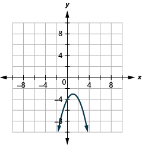
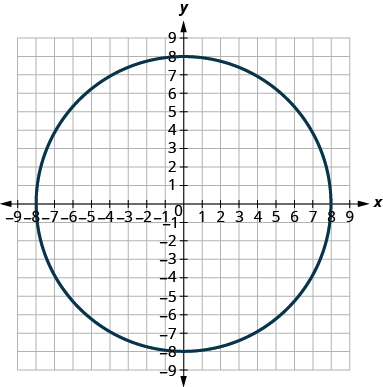

By the end of this section, you will be able to:
* Graph vertical parabolas
* Graph horizontal parabolas
* Solve applications with parabolas

Before you get started, take this readiness quiz.

1.  Graph:
    <math xmlns="http://www.w3.org/1998/Math/MathML"><mrow><mi>y</mi><mo>=</mo><mn>−3</mn><msup><mi>x</mi><mn>2</mn></msup><mo>+</mo><mn>12</mn><mi>x</mi><mo>−</mo><mn>12</mn><mo>.</mo></mrow></math>
    
    * * *
    {: data-type="newline"}
    
    If you missed this problem, review [\[link\]](/m63466#fs-id1169147828812).
2.  Solve by completing the square:
    <math xmlns="http://www.w3.org/1998/Math/MathML"><mrow><msup><mi>x</mi><mn>2</mn></msup><mo>−</mo><mn>6</mn><mi>x</mi><mo>+</mo><mn>6</mn><mo>=</mo><mn>0</mn><mo>.</mo></mrow></math>
    
    * * *
    {: data-type="newline"}
    
    If you missed this problem, review [\[link\]](/m63459#fs-id1167829894368).
3.  Write in standard form:
    <math xmlns="http://www.w3.org/1998/Math/MathML"><mrow><mi>y</mi><mo>=</mo><mn>3</mn><msup><mi>x</mi><mn>2</mn></msup><mo>−</mo><mn>6</mn><mi>x</mi><mo>+</mo><mn>5</mn><mo>.</mo></mrow></math>
    
    * * *
    {: data-type="newline"}
    
    If you missed this problem, review [\[link\]](/m63467#fs-id1169149374763).
{: data-number-style="arabic"}

### Graph Vertical Parabolas

The next conic section we will look at is a **parabola**{: data-type="term"}. We define a parabola as all points in a plane that are the same distance from a fixed point and a fixed line. The fixed point is called the **focus,** and the fixed line is called the **directrix** of the parabola.

Parabola

A **parabola** is all points in a plane that are the same distance from a fixed point and a fixed line. The fixed point is called the **focus,** and the fixed line is called the **directrix** of the parabola.

Previously, we learned to graph vertical parabolas from the general form or the standard form using properties. Those methods will also work here. We will summarize the properties here.

<table summary="This table, titled vertical parabolas, has 3 columns, 5 rows and a header row. The header row labeled the second and third column general form and standard form respectively. General form is y equals ax squared plus bx plus c and standard form is y equals a open parentheses x minus h close parentheses squared plus k. Row one: orientation: general form is a greater than 0, up and a less than 0 down. Standard form is the same. Row 2: Axis of symmetry: general form is x equals minus b upon 2a and standard form is x equals h. Row 3: vertex: general form, substitute x equals minus b upon 2a and solve for y; standard form is point h, k. Row 4: y intercept: general and standard forms, let x be 0. Row 5: x intercept: general and standard forms, let y be 0." class="unnumbered" data-label=""><thead>
<tr valign="top">
<th colspan="3" data-valign="middle" data-align="center">Vertical Parabolas</th>
</tr>
<tr valign="top">
<th data-valign="top" data-align="left" />
<th data-valign="top" data-align="left">General form
<math xmlns="http://www.w3.org/1998/Math/MathML"><mrow><mi>y</mi><mo>=</mo><mi>a</mi><msup><mi>x</mi><mn>2</mn></msup><mo>+</mo><mi>b</mi><mi>x</mi><mo>+</mo><mi>c</mi></mrow></math></th>
<th data-valign="top" data-align="left">Standard form
<math xmlns="http://www.w3.org/1998/Math/MathML"><mrow><mi>y</mi><mo>=</mo><mi>a</mi><msup><mrow><mrow><mo>(</mo><mrow><mi>x</mi><mo>−</mo><mi>h</mi></mrow><mo>)</mo></mrow></mrow><mn>2</mn></msup><mo>+</mo><mi>k</mi></mrow></math>
</th>
</tr>
</thead><tbody>
<tr valign="top">
<td data-valign="top" data-align="left"><strong>Orientation</strong></td>
<td data-valign="middle" data-align="center"><math xmlns="http://www.w3.org/1998/Math/MathML"><mrow><mi>a</mi><mo>&gt;</mo><mn>0</mn></mrow></math> up; <math xmlns="http://www.w3.org/1998/Math/MathML"><mrow><mi>a</mi><mo>&lt;</mo><mn>0</mn></mrow></math> down</td>
<td data-valign="middle" data-align="center"><math xmlns="http://www.w3.org/1998/Math/MathML"><mrow><mi>a</mi><mo>&gt;</mo><mn>0</mn></mrow></math> up; <math xmlns="http://www.w3.org/1998/Math/MathML"><mrow><mi>a</mi><mo>&lt;</mo><mn>0</mn></mrow></math> down</td>
</tr>
<tr valign="top">
<td data-valign="top" data-align="left"><strong>Axis of symmetry</strong></td>
<td data-valign="middle" data-align="center"><math xmlns="http://www.w3.org/1998/Math/MathML"><mrow><mi>x</mi><mo>=</mo><mo>−</mo><mfrac><mi>b</mi><mrow><mn>2</mn><mi>a</mi></mrow></mfrac></mrow></math></td>
<td data-valign="middle" data-align="center"><math xmlns="http://www.w3.org/1998/Math/MathML"><mrow><mi>x</mi><mo>=</mo><mi>h</mi></mrow></math></td>
</tr>
<tr valign="top">
<td data-valign="top" data-align="left"><strong>Vertex</strong></td>
<td data-valign="middle" data-align="center">Substitute <math xmlns="http://www.w3.org/1998/Math/MathML"><mrow><mi>x</mi><mo>=</mo><mo>−</mo><mfrac><mi>b</mi><mrow><mn>2</mn><mi>a</mi></mrow></mfrac></mrow></math> and
solve for <em>y</em>.</td>
<td data-valign="middle" data-align="center"><math xmlns="http://www.w3.org/1998/Math/MathML"><mrow><mrow><mo>(</mo><mrow><mi>h</mi><mo>,</mo><mi>k</mi></mrow><mo>)</mo></mrow></mrow></math></td>
</tr>
<tr valign="top">
<td data-valign="top" data-align="left"><strong><em>y</em>-intercept</strong></td>
<td data-valign="middle" data-align="center">Let <math xmlns="http://www.w3.org/1998/Math/MathML"><mrow><mi>x</mi><mo>=</mo><mn>0</mn></mrow></math></td>
<td data-valign="middle" data-align="center">Let <math xmlns="http://www.w3.org/1998/Math/MathML"><mrow><mi>x</mi><mo>=</mo><mn>0</mn></mrow></math></td>
</tr>
<tr valign="top">
<td data-valign="top" data-align="left"><strong><em>x</em>-intercepts</strong></td>
<td data-valign="middle" data-align="center">Let <math xmlns="http://www.w3.org/1998/Math/MathML"><mrow><mi>y</mi><mo>=</mo><mn>0</mn></mrow></math></td>
<td data-valign="middle" data-align="center">Let <math xmlns="http://www.w3.org/1998/Math/MathML"><mrow><mi>y</mi><mo>=</mo><mn>0</mn></mrow></math></td>
</tr>
</tbody></table>

The graphs show what the parabolas look like when they open up or down. Their position in relation to the *x*- or *y*-axis is merely an example.

To graph a parabola from these forms, we used the following steps.

Graph vertical parabolas
<math xmlns="http://www.w3.org/1998/Math/MathML"><mrow><mo>(</mo><mi>y</mi><mo>=</mo><mi>a</mi><msup><mi>x</mi><mn>2</mn></msup><mo>+</mo><mi>b</mi><mi>x</mi><mo>+</mo><mi>c</mi><mspace width="0.5em" /><mtext>or</mtext><mspace width="0.5em" /><mi>f</mi><mrow><mo>(</mo><mi>x</mi><mo>)</mo></mrow><mo>=</mo><mi>a</mi><msup><mrow><mrow><mo>(</mo><mrow><mi>x</mi><mo>−</mo><mi>h</mi></mrow><mo>)</mo></mrow></mrow><mn>2</mn></msup><mo>+</mo><mi>k</mi><mo>)</mo></mrow></math>
using properties.

1.  Determine whether the parabola opens upward or downward.
2.  Find the axis of symmetry.
3.  Find the vertex.
4.  Find the *y*-intercept. Find the point symmetric to the *y*-intercept across the axis of symmetry.
5.  Find the *x*-intercepts.
6.  Graph the parabola.
{: data-number-style="arabic" .stepwise}

The next example reviews the method of graphing a parabola from the general form of its equation.

Graph <math xmlns="http://www.w3.org/1998/Math/MathML"><mrow><mi>y</mi><mo>=</mo><mtext>−</mtext><msup><mi>x</mi><mn>2</mn></msup><mo>+</mo><mn>6</mn><mi>x</mi><mo>−</mo><mn>8</mn></mrow></math>

 by using properties.

<table class="unnumbered unstyled can-break" summary="The equation is y equals minus x squared plus 6x minus 8. This is of the form y equals ax squared plus bx plus c. Since a is minus 1, the parabola opens downward. To find the axis of symmetry, find x equals minus b upon 2a. Substituting values of b and a, we get x equals 3. This is the axis of symmetry. The vertex is on the line x equals 3. Substituting this value in the equation, we get y equals 1. The vertex is the point 3, 1. The y intercept occurs when x equals 0. Substituting in the equation and simplifying, we get y equals minus 8. The point 0, 8 is three units to the left of the line of symmetry. The point three units to the right of the line of symmetry is 6, negative 8. The x intercept occurs when y equals 0. We substitute this in the original equation and factor the trinomial. We get x intercepts 4, 0 and 2, 0. Graph the parabola." data-label=""><tbody>
<tr valign="top">
<td data-valign="top" data-align="left" />
<td data-valign="top" data-align="left"></td>
</tr>
<tr valign="top">
<td data-valign="top" data-align="left">Since <em>a</em> is <math xmlns="http://www.w3.org/1998/Math/MathML"><mrow><mn>−1</mn><mo>,</mo></mrow></math> the parabola opens downward.</td>
<td data-valign="top" data-align="left" />
</tr>
<tr valign="top">
<td data-valign="top" data-align="center"></td>
<td data-valign="top" data-align="center" />
</tr>
<tr valign="top">
<td data-valign="top" data-align="left">To find the axis of symmetry, find <math xmlns="http://www.w3.org/1998/Math/MathML"><mrow><mi>x</mi><mo>=</mo><mo>−</mo><mfrac><mi>b</mi><mrow><mn>2</mn><mi>a</mi></mrow></mfrac><mo>.</mo></mrow></math></td>
<td data-valign="top" data-align="left"></td>
</tr>
<tr valign="top">
<td data-valign="top" data-align="left" />
<td data-valign="top" data-align="left"></td>
</tr>
<tr valign="top">
<td data-valign="top" data-align="left" />
<td data-valign="top" data-align="left"></td>
</tr>
<tr valign="top">
<td data-valign="top" data-align="left" />
<td data-valign="top" data-align="center">The axis of symmetry is <math xmlns="http://www.w3.org/1998/Math/MathML"><mrow><mi>x</mi><mo>=</mo><mn>3</mn><mo>.</mo></mrow></math></td>
</tr>
<tr valign="top">
<td data-valign="top" data-align="left" />
<td data-valign="top" data-align="left"></td>
</tr>
<tr valign="top">
<td data-valign="top" data-align="left">The vertex is on the line <math xmlns="http://www.w3.org/1998/Math/MathML"><mrow><mi>x</mi><mo>=</mo><mn>3</mn><mo>.</mo></mrow></math></td>
<td data-valign="top" data-align="left"></td>
</tr>
<tr valign="top">
<td data-valign="top" data-align="left">Let <math xmlns="http://www.w3.org/1998/Math/MathML"><mrow><mi>x</mi><mo>=</mo><mn>3</mn><mo>.</mo></mrow></math></td>
<td data-valign="top" data-align="left"></td>
</tr>
<tr valign="top">
<td data-valign="top" data-align="left" />
<td data-valign="top" data-align="left"></td>
</tr>
<tr valign="top">
<td data-valign="top" data-align="left" />
<td data-valign="top" data-align="left"></td>
</tr>
<tr valign="top">
<td data-valign="top" data-align="left" />
<td data-valign="top" data-align="center">The vertex is <math xmlns="http://www.w3.org/1998/Math/MathML"><mrow><mrow><mo>(</mo><mrow><mn>3</mn><mo>,</mo><mn>1</mn></mrow><mo>)</mo></mrow><mo>.</mo></mrow></math></td>
</tr>
<tr valign="top">
<td data-valign="top" data-align="left" />
<td data-valign="top" data-align="left"></td>
</tr>
<tr valign="top">
<td data-valign="top" data-align="left">The <em>y</em>-intercept occurs when <math xmlns="http://www.w3.org/1998/Math/MathML"><mrow><mi>x</mi><mo>=</mo><mn>0</mn><mo>.</mo></mrow></math></td>
<td data-valign="top" data-align="left"></td>
</tr>
<tr valign="top">
<td data-valign="top" data-align="left">Substitute <math xmlns="http://www.w3.org/1998/Math/MathML"><mrow><mi>x</mi><mo>=</mo><mn>0</mn><mo>.</mo></mrow></math></td>
<td data-valign="top" data-align="left"></td>
</tr>
<tr valign="top">
<td data-valign="top" data-align="left">Simplify.</td>
<td data-valign="top" data-align="left"></td>
</tr>
<tr valign="top">
<td data-valign="top" data-align="left" />
<td data-valign="top" data-align="center">The <em>y</em>-intercept is <math xmlns="http://www.w3.org/1998/Math/MathML"><mrow><mrow><mo>(</mo><mrow><mn>0</mn><mo>,</mo><mn>−8</mn></mrow><mo>)</mo><mo>.</mo></mrow></mrow></math></td>
</tr>
<tr valign="top">
<td data-valign="top" data-align="left">The point <math xmlns="http://www.w3.org/1998/Math/MathML"><mrow><mrow><mo>(</mo><mrow><mn>0</mn><mo>,</mo><mn>−8</mn></mrow><mo>)</mo></mrow></mrow></math> is three units to the left of the
line of symmetry. The point three units to the
right of the line of symmetry is <math xmlns="http://www.w3.org/1998/Math/MathML"><mrow><mrow><mo>(</mo><mrow><mn>6</mn><mo>,</mo><mn>−8</mn></mrow><mo>)</mo></mrow><mo>.</mo></mrow></math></td>
<td data-valign="middle" data-align="center">Point symmetric to the <em>y</em>-intercept is <math xmlns="http://www.w3.org/1998/Math/MathML"><mrow><mrow><mo>(</mo><mrow><mn>6</mn><mo>,</mo><mn>−8</mn></mrow><mo>)</mo><mo>.</mo></mrow></mrow></math></td>
</tr>
<tr valign="top">
<td data-valign="top" data-align="left" />
<td data-valign="top" data-align="left"></td>
</tr>
<tr valign="top">
<td data-valign="top" data-align="left">The <em>x</em>-intercept occurs when <math xmlns="http://www.w3.org/1998/Math/MathML"><mrow><mi>y</mi><mo>=</mo><mn>0</mn><mo>.</mo></mrow></math></td>
<td data-valign="top" data-align="left"></td>
</tr>
<tr valign="top">
<td data-valign="top" data-align="left">Let <math xmlns="http://www.w3.org/1998/Math/MathML"><mrow><mi>y</mi><mo>=</mo><mn>0</mn><mo>.</mo></mrow></math></td>
<td data-valign="top" data-align="left"></td>
</tr>
<tr valign="top">
<td data-valign="top" data-align="left">Factor the GCF.</td>
<td data-valign="top" data-align="left"></td>
</tr>
<tr valign="top">
<td data-valign="top" data-align="left">Factor the trinomial.</td>
<td data-valign="top" data-align="left"></td>
</tr>
<tr valign="top">
<td data-valign="top" data-align="left">Solve for <em>x</em>.</td>
<td data-valign="top" data-align="left"></td>
</tr>
<tr valign="top">
<td data-valign="top" data-align="left" />
<td data-valign="top" data-align="center">The <em>x</em>-intercepts are <math xmlns="http://www.w3.org/1998/Math/MathML"><mrow><mrow><mo>(</mo><mrow><mn>4</mn><mo>,</mo><mn>0</mn></mrow><mo>)</mo></mrow><mo>,</mo><mrow><mo>(</mo><mrow><mn>2</mn><mo>,</mo><mn>0</mn></mrow><mo>)</mo><mo>.</mo></mrow></mrow></math></td>
</tr>
<tr valign="top">
<td data-valign="top" data-align="left">Graph the parabola.</td>
<td data-valign="top" data-align="left"></td>
</tr>
</tbody></table>

Graph <math xmlns="http://www.w3.org/1998/Math/MathML"><mrow><mi>y</mi><mo>=</mo><mtext>−</mtext><msup><mi>x</mi><mn>2</mn></msup><mo>+</mo><mn>5</mn><mi>x</mi><mo>−</mo><mn>6</mn></mrow></math>

 by using properties.

  

Graph <math xmlns="http://www.w3.org/1998/Math/MathML"><mrow><mi>y</mi><mo>=</mo><mtext>−</mtext><msup><mi>x</mi><mn>2</mn></msup><mo>+</mo><mn>8</mn><mi>x</mi><mo>−</mo><mn>12</mn></mrow></math>

 by using properties.

  

The next example reviews the method of graphing a **parabola**{: data-type="term" .no-emphasis} from the standard form of its equation, <math xmlns="http://www.w3.org/1998/Math/MathML"><mrow><mi>y</mi><mo>=</mo><mi>a</mi><msup><mrow><mrow><mo>(</mo><mrow><mi>x</mi><mo>−</mo><mi>h</mi></mrow><mo>)</mo></mrow></mrow><mn>2</mn></msup><mo>+</mo><mi>k</mi><mo>.</mo></mrow></math>

Write<math xmlns="http://www.w3.org/1998/Math/MathML"><mrow><mi>y</mi><mo>=</mo><mn>3</mn><msup><mi>x</mi><mn>2</mn></msup><mo>−</mo><mn>6</mn><mi>x</mi><mo>+</mo><mn>5</mn></mrow></math>

 in standard form and then use properties of standard form to graph the equation.

<table class="unnumbered unstyled can-break" summary="The equation is 3 x squared minus 6x plus 5. Rewrite in y equals a open parentheses x minus h close parentheses squared plus k form by completing the square. We rewrite as y equals 3 open parentheses x squared minus 2x plus 1 close parentheses plus 5 minus 3. So y is 3 open parentheses x minus 1 close parentheses squared plus 2. Here, a is 3, h is 1 and k is 2. Since a is 2, the parabola opens upward. The axis of symmetry is x equals 1. The vertex is 1, 2. Find the y intercept by substituting x equal to 0 in the original equation. We get y equal to 5. The y intercept is 0, 5. The point symmetric to it is 2, 5. For finding the x intercept, we substitute y equals 0 in the original equation. We get x equal to 1 plus square root of minus 2 upon 3. The square root of a negative number tells us the solutions are complex numbers. So there are no x intercepts. Graph the parabola." data-label=""><tbody>
<tr valign="top">
<td data-valign="top" data-align="left">Rewrite the function in <math xmlns="http://www.w3.org/1998/Math/MathML"><mrow><mi>y</mi><mo>=</mo><mi>a</mi><msup><mrow><mrow><mo>(</mo><mrow><mi>x</mi><mo>−</mo><mi>h</mi></mrow><mo>)</mo></mrow></mrow><mn>2</mn></msup><mo>+</mo><mi>k</mi></mrow></math> form
by completing the square.</td>
<td data-valign="top" data-align="left"><math xmlns="http://www.w3.org/1998/Math/MathML"><mrow><mi>y</mi><mo>=</mo><mn>3</mn><msup><mi>x</mi><mn>2</mn></msup><mo>−</mo><mn>6</mn><mi>x</mi><mo>+</mo><mn>5</mn></mrow></math></td>
</tr>
<tr valign="top">
<td data-valign="top" data-align="left" />
<td data-valign="top" data-align="left"><math xmlns="http://www.w3.org/1998/Math/MathML"><mrow><mi>y</mi><mo>=</mo><mn>3</mn><mrow><mo>(</mo><mrow><msup><mi>x</mi><mn>2</mn></msup><mo>−</mo><mn>2</mn><mi>x</mi></mrow><mspace width="1.6em" /><mo>)</mo></mrow><mo>+</mo><mn>5</mn></mrow></math></td>
</tr>
<tr valign="top">
<td data-valign="top" data-align="left" />
<td data-valign="top" data-align="left"><math xmlns="http://www.w3.org/1998/Math/MathML"><mrow><mi>y</mi><mo>=</mo><mn>3</mn><mrow><mo>(</mo><mrow><msup><mi>x</mi><mn>2</mn></msup><mo>−</mo><mn>2</mn><mi>x</mi><mo>+</mo><mn>1</mn></mrow><mo>)</mo></mrow><mo>+</mo><mn>5</mn><mo>−</mo><mn>3</mn></mrow></math></td>
</tr>
<tr valign="top">
<td data-valign="top" data-align="left" />
<td data-valign="top" data-align="left"><math xmlns="http://www.w3.org/1998/Math/MathML"><mrow><mi>y</mi><mo>=</mo><mn>3</mn><msup><mrow><mrow><mo>(</mo><mrow><mi>x</mi><mo>−</mo><mn>1</mn></mrow><mo>)</mo></mrow></mrow><mn>2</mn></msup><mo>+</mo><mn>2</mn></mrow></math></td>
</tr>
<tr valign="top">
<td data-valign="top" data-align="left">Identify the constants <em>a, h, k</em>.</td>
<td data-valign="top" data-align="left"><math xmlns="http://www.w3.org/1998/Math/MathML"><mrow><mi>a</mi><mo>=</mo><mn>3</mn></mrow></math>, <math xmlns="http://www.w3.org/1998/Math/MathML"><mrow><mi>h</mi><mo>=</mo><mn>1</mn></mrow></math>, <math xmlns="http://www.w3.org/1998/Math/MathML"><mrow><mi>k</mi><mo>=</mo><mn>2</mn></mrow></math></td>
</tr>
<tr valign="top">
<td data-valign="top" data-align="left">Since <math xmlns="http://www.w3.org/1998/Math/MathML"><mrow><mi>a</mi><mo>=</mo><mn>2</mn><mo>,</mo></mrow></math> the parabola opens upward.</td>
<td data-valign="top" data-align="center" />
</tr>
<tr valign="top">
<td data-valign="top" data-align="center"></td>
<td data-valign="top" data-align="center" />
</tr>
<tr valign="top">
<td data-valign="top" data-align="left">The axis of symmetry is <math xmlns="http://www.w3.org/1998/Math/MathML"><mrow><mi>x</mi><mo>=</mo><mi>h</mi><mo>.</mo></mrow></math></td>
<td data-valign="top" data-align="left">The axis of symmetry is <math xmlns="http://www.w3.org/1998/Math/MathML"><mrow><mi>x</mi><mo>=</mo><mn>1</mn><mo>.</mo></mrow></math></td>
</tr>
<tr valign="top">
<td data-valign="top" data-align="left">The vertex is <math xmlns="http://www.w3.org/1998/Math/MathML"><mrow><mrow><mo>(</mo><mrow><mi>h</mi><mo>,</mo><mi>k</mi></mrow><mo>)</mo></mrow><mo>.</mo></mrow></math></td>
<td data-valign="top" data-align="left">The vertex is <math xmlns="http://www.w3.org/1998/Math/MathML"><mrow><mrow><mo>(</mo><mrow><mn>1</mn><mo>,</mo><mn>2</mn></mrow><mo>)</mo></mrow><mo>.</mo></mrow></math></td>
</tr>
<tr valign="top">
<td data-valign="top" data-align="left">Find the <em>y</em>-intercept by substituting <math xmlns="http://www.w3.org/1998/Math/MathML"><mrow><mi>x</mi><mo>=</mo><mn>0</mn><mo>.</mo></mrow></math></td>
<td data-valign="top" data-align="left"><math xmlns="http://www.w3.org/1998/Math/MathML"><mrow><mi>y</mi><mo>=</mo><mn>3</mn><msup><mrow><mrow><mo>(</mo><mrow><mi>x</mi><mo>−</mo><mn>1</mn></mrow><mo>)</mo></mrow></mrow><mn>2</mn></msup><mo>+</mo><mn>2</mn></mrow></math>
<math xmlns="http://www.w3.org/1998/Math/MathML"><mrow><mi>y</mi><mo>=</mo><mn>3</mn><mo>·</mo><msup><mn>0</mn><mn>2</mn></msup><mo>−</mo><mn>6</mn><mo>·</mo><mn>0</mn><mo>+</mo><mn>5</mn></mrow></math></td>
</tr>
<tr valign="top">
<td data-valign="top" data-align="left" />
<td data-valign="top" data-align="left"><math xmlns="http://www.w3.org/1998/Math/MathML"><mrow><mi>y</mi><mo>=</mo><mn>5</mn></mrow></math></td>
</tr>
<tr valign="top">
<td data-valign="top" data-align="left" />
<td data-valign="top" data-align="left"><em>y</em>-intercept <math xmlns="http://www.w3.org/1998/Math/MathML"><mrow><mrow><mo>(</mo><mrow><mn>0</mn><mo>,</mo><mn>5</mn></mrow><mo>)</mo></mrow></mrow></math></td>
</tr>
<tr valign="top">
<td data-valign="top" data-align="left">Find the point symmetric to <math xmlns="http://www.w3.org/1998/Math/MathML"><mrow><mrow><mo>(</mo><mrow><mn>0</mn><mo>,</mo><mn>5</mn></mrow><mo>)</mo></mrow></mrow></math> across the axis of symmetry.</td>
<td data-valign="top" data-align="left"><math xmlns="http://www.w3.org/1998/Math/MathML"><mrow><mrow><mo>(</mo><mrow><mn>2</mn><mo>,</mo><mn>5</mn></mrow><mo>)</mo></mrow></mrow></math></td>
</tr>
<tr valign="top">
<td data-valign="top" data-align="left">Find the <em>x</em>-intercepts.</td>
<td data-valign="top" data-align="left"><math xmlns="http://www.w3.org/1998/Math/MathML"><mrow><mtable><mtr><mtd columnalign="right"><mi>y</mi></mtd><mtd columnalign="left"><mo>=</mo></mtd><mtd columnalign="left"><mn>3</mn><msup><mrow><mrow><mo>(</mo><mrow><mi>x</mi><mo>−</mo><mn>1</mn></mrow><mo>)</mo></mrow></mrow><mn>2</mn></msup><mo>+</mo><mn>2</mn></mtd></mtr>
<mtr><mtd columnalign="right"><mn>0</mn></mtd><mtd columnalign="left"><mo>=</mo></mtd><mtd columnalign="left"><mn>3</mn><msup><mrow><mo>(</mo><mrow><mi>x</mi><mo>−</mo><mn>1</mn></mrow><mo>)</mo></mrow><mn>2</mn></msup><mo>+</mo><mn>2</mn></mtd></mtr><mtr><mtd columnalign="right"><mo>−</mo><mn>2</mn></mtd><mtd columnalign="left"><mo>=</mo></mtd><mtd columnalign="left"><mn>3</mn><msup><mrow><mo>(</mo><mrow><mi>x</mi><mo>−</mo><mn>1</mn></mrow><mo>)</mo></mrow><mn>2</mn></msup></mtd></mtr><mtr><mtd columnalign="right"><mo>−</mo><mfrac><mn>2</mn><mn>3</mn></mfrac></mtd><mtd columnalign="left"><mo>=</mo></mtd><mtd columnalign="left"><msup><mrow><mo>(</mo><mrow><mi>x</mi><mo>−</mo><mn>1</mn></mrow><mo>)</mo></mrow><mn>2</mn></msup></mtd></mtr><mtr><mtd columnalign="right"><mo>±</mo><msqrt><mrow><mo>−</mo><mfrac><mn>2</mn><mn>3</mn></mfrac></mrow></msqrt></mtd><mtd columnalign="left"><mo>=</mo></mtd><mtd columnalign="left"><mi>x</mi><mo>−</mo><mn>1</mn></mtd></mtr></mtable></mrow></math></td>
</tr>
<tr valign="top">
<td data-valign="top" data-align="left" />
<td data-valign="top" data-align="left">The square root of a negative number
tells us the solutions are complex
numbers. So there are no <em>x</em>-intercepts.</td>
</tr>
<tr valign="top">
<td data-valign="top" data-align="left">Graph the parabola.</td>
<td data-valign="top" data-align="left"></td>
</tr>
</tbody></table>

ⓐ Write <math xmlns="http://www.w3.org/1998/Math/MathML"><mrow><mi>y</mi><mo>=</mo><mn>2</mn><msup><mi>x</mi><mn>2</mn></msup><mo>+</mo><mn>4</mn><mi>x</mi><mo>+</mo><mn>5</mn></mrow></math>

 in standard form and ⓑ use properties of standard form to graph the equation.

ⓐ <math xmlns="http://www.w3.org/1998/Math/MathML"><mrow><mi>y</mi><mo>=</mo><mn>2</mn><msup><mrow><mrow><mo>(</mo><mrow><mi>x</mi><mo>+</mo><mn>1</mn></mrow><mo>)</mo></mrow></mrow><mn>2</mn></msup><mo>+</mo><mn>3</mn></mrow></math>

* * *
{: data-type="newline"}

 ⓑ* * *
{: data-type="newline"}

  

ⓐ Write <math xmlns="http://www.w3.org/1998/Math/MathML"><mrow><mi>y</mi><mo>=</mo><mn>−2</mn><msup><mi>x</mi><mn>2</mn></msup><mo>+</mo><mn>8</mn><mi>x</mi><mo>−</mo><mn>7</mn></mrow></math>

 in standard form and ⓑ use properties of standard form to graph the equation.

ⓐ <math xmlns="http://www.w3.org/1998/Math/MathML"><mrow><mi>y</mi><mo>=</mo><mn>−2</mn><msup><mrow><mrow><mo>(</mo><mrow><mi>x</mi><mo>−</mo><mn>2</mn></mrow><mo>)</mo></mrow></mrow><mn>2</mn></msup><mo>+</mo><mn>1</mn></mrow></math>

* * *
{: data-type="newline"}

 ⓑ* * *
{: data-type="newline"}

  

### Graph Horizontal Parabolas

Our work so far has only dealt with parabolas that open up or down. We are now going to look at horizontal parabolas. These parabolas open either to the left or to the right. If we interchange the *x* and *y* in our previous equations for parabolas, we get the equations for the parabolas that open to the left or to the right.

<table summary="This table, titled horizontal parabolas, has 3 columns, 5 rows and a header row. The header row labeled the second and third column general form and standard form respectively. General form is x equals ay squared plus by plus c and standard form is x equals a open parentheses y minus k close parentheses squared plus h. Row one: orientation: general form is a greater than 0, right and a less than 0 left. Standard form is the same. Row 2: Axis of symmetry: general form is y equals minus b upon 2a and standard form is y equals k. Row 3: vertex: general form, substitute y equals minus b upon 2a and solve for x; standard form is point h, k. Row 4: y intercept: general and standard forms, let x be 0. Row 5: x intercept: general and standard forms, let y be 0."><thead>
<tr valign="top">
<th colspan="3" data-valign="middle" data-align="center">Horizontal Parabolas</th>
</tr>
<tr valign="top">
<th data-valign="top" data-align="left" />
<th data-valign="top" data-align="left">General form
<math xmlns="http://www.w3.org/1998/Math/MathML"><mrow><mi>x</mi><mo>=</mo><mi>a</mi><msup><mi>y</mi><mn>2</mn></msup><mo>+</mo><mi>b</mi><mi>y</mi><mo>+</mo><mi>c</mi></mrow></math></th>
<th data-valign="top" data-align="left">Standard form
<math xmlns="http://www.w3.org/1998/Math/MathML"><mrow><mi>x</mi><mo>=</mo><mi>a</mi><msup><mrow><mrow><mo>(</mo><mrow><mi>y</mi><mo>−</mo><mi>k</mi></mrow><mo>)</mo></mrow></mrow><mn>2</mn></msup><mo>+</mo><mi>h</mi></mrow></math></th>
</tr>
</thead><tbody>
<tr valign="top">
<td data-valign="top" data-align="left"><strong>Orientation</strong></td>
<td data-valign="middle" data-align="center"><math xmlns="http://www.w3.org/1998/Math/MathML"><mrow><mi>a</mi><mo>&gt;</mo><mn>0</mn></mrow></math> right; <math xmlns="http://www.w3.org/1998/Math/MathML"><mrow><mi>a</mi><mo>&lt;</mo><mn>0</mn></mrow></math> left</td>
<td data-valign="middle" data-align="center"><math xmlns="http://www.w3.org/1998/Math/MathML"><mrow><mi>a</mi><mo>&gt;</mo><mn>0</mn></mrow></math> right; <math xmlns="http://www.w3.org/1998/Math/MathML"><mrow><mi>a</mi><mo>&lt;</mo><mn>0</mn></mrow></math> left</td>
</tr>
<tr valign="top">
<td data-valign="top" data-align="left"><strong>Axis of symmetry</strong></td>
<td data-valign="middle" data-align="center"><math xmlns="http://www.w3.org/1998/Math/MathML"><mrow><mi>y</mi><mo>=</mo><mo>−</mo><mfrac><mi>b</mi><mrow><mn>2</mn><mi>a</mi></mrow></mfrac></mrow></math></td>
<td data-valign="middle" data-align="center"><math xmlns="http://www.w3.org/1998/Math/MathML"><mrow><mi>y</mi><mo>=</mo><mi>k</mi></mrow></math></td>
</tr>
<tr valign="top">
<td data-valign="top" data-align="left"><strong>Vertex</strong></td>
<td data-valign="middle" data-align="center">Substitute <math xmlns="http://www.w3.org/1998/Math/MathML"><mrow><mi>y</mi><mo>=</mo><mo>−</mo><mfrac><mi>b</mi><mrow><mn>2</mn><mi>a</mi></mrow></mfrac></mrow></math> and
solve for <em>x</em>.</td>
<td data-valign="middle" data-align="center"><math xmlns="http://www.w3.org/1998/Math/MathML"><mrow><mrow><mo>(</mo><mrow><mi>h</mi><mo>,</mo><mi>k</mi></mrow><mo>)</mo></mrow></mrow></math></td>
</tr>
<tr valign="top">
<td data-valign="top" data-align="left"><strong><em>y</em>-intercepts</strong></td>
<td data-valign="middle" data-align="center">Let <math xmlns="http://www.w3.org/1998/Math/MathML"><mrow><mi>x</mi><mo>=</mo><mn>0</mn></mrow></math></td>
<td data-valign="middle" data-align="center">Let <math xmlns="http://www.w3.org/1998/Math/MathML"><mrow><mi>x</mi><mo>=</mo><mn>0</mn></mrow></math></td>
</tr>
<tr valign="top">
<td data-valign="top" data-align="left"><strong><em>x</em>-intercept</strong></td>
<td data-valign="middle" data-align="center">Let <math xmlns="http://www.w3.org/1998/Math/MathML"><mrow><mi>y</mi><mo>=</mo><mn>0</mn></mrow></math></td>
<td data-valign="middle" data-align="center">Let <math xmlns="http://www.w3.org/1998/Math/MathML"><mrow><mi>y</mi><mo>=</mo><mn>0</mn></mrow></math></td>
</tr>
</tbody></table>

The graphs show what the parabolas look like when they to the left or to the right. Their position in relation to the *x*- or *y*-axis is merely an example.

Looking at these parabolas, do their graphs represent a function? Since both graphs would fail the vertical line test, they do not represent a function.

To graph a **parabola**{: data-type="term" .no-emphasis} that opens to the left or to the right is basically the same as what we did for parabolas that open up or down, with the reversal of the *x* and *y* variables.

Graph horizontal parabolas
<math xmlns="http://www.w3.org/1998/Math/MathML"><mrow><mo>(</mo><mi>x</mi><mo>=</mo><mi>a</mi><msup><mi>y</mi><mn>2</mn></msup><mo>+</mo><mi>b</mi><mi>y</mi><mo>+</mo><mi>c</mi><mspace width="0.5em" /><mtext>or</mtext><mspace width="0.5em" /><mi>x</mi><mo>=</mo><mi>a</mi><msup><mrow><mrow><mo>(</mo><mrow><mi>y</mi><mo>−</mo><mi>k</mi></mrow><mo>)</mo></mrow></mrow><mn>2</mn></msup><mo>+</mo><mi>h</mi><mo>)</mo></mrow></math>
using properties.

1.  Determine whether the parabola opens to the left or to the right.
2.  Find the axis of symmetry.
3.  Find the vertex.
4.  Find the *x*-intercept. Find the point symmetric to the *x*-intercept across the axis of symmetry.
5.  Find the *y*-intercepts.
6.  Graph the parabola.
{: data-number-style="arabic" .stepwise}

Graph <math xmlns="http://www.w3.org/1998/Math/MathML"><mrow><mi>x</mi><mo>=</mo><mn>2</mn><msup><mi>y</mi><mn>2</mn></msup></mrow></math>

 by using properties.

|  |  |
{: valign="top"}| Since <math xmlns="http://www.w3.org/1998/Math/MathML"><mrow><mi>a</mi><mo>=</mo><mn>2</mn><mo>,</mo></mrow></math>

 the parabola opens to the right. |  |
{: valign="top"}|  |  |
{: valign="top"}| To find the axis of symmetry, find <math xmlns="http://www.w3.org/1998/Math/MathML"><mrow><mi>y</mi><mo>=</mo><mo>−</mo><mfrac><mi>b</mi><mrow><mn>2</mn><mi>a</mi></mrow></mfrac><mo>.</mo></mrow></math>

 |  |
{: valign="top"}|  |  |
{: valign="top"}|  |  |
{: valign="top"}|  | The axis of symmetry is <math xmlns="http://www.w3.org/1998/Math/MathML"><mrow><mi>y</mi><mo>=</mo><mn>0</mn><mo>.</mo></mrow></math>

 |
{: valign="top"}| The vertex is on the line<math xmlns="http://www.w3.org/1998/Math/MathML"><mrow><mi>y</mi><mo>=</mo><mn>0</mn><mo>.</mo></mrow></math>

 |  |
{: valign="top"}| Let <math xmlns="http://www.w3.org/1998/Math/MathML"><mrow><mi>y</mi><mo>=</mo><mn>0</mn><mo>.</mo></mrow></math>

 |  |
{: valign="top"}|  |  |
{: valign="top"}|  | The vertex is <math xmlns="http://www.w3.org/1998/Math/MathML"><mrow><mrow><mo>(</mo><mrow><mn>0</mn><mo>,</mo><mn>0</mn></mrow><mo>)</mo></mrow><mo>.</mo></mrow></math>

 |
{: valign="top"}{: .unnumbered .unstyled .can-break summary="The equation is x equals 2y squared. Here, a is 2 and the parabola opens to the right. To find the axis of symmetry, find y equals minus b upon 2a. Substituting values, we get y equal to 0 divided by two times two. Hence y is 0. This is the axis of symmetry. The vertex is on this line. Let y be 0. Substituting in equation, we get x equals 0. The vertex is (0, 0). Since the vertex is (0, 0) both the x- and y-intercepts are the point (0, 0). To graph the parabola we need more points. In this case it is easiest to choose values of y." data-label=""}

Since the vertex is <math xmlns="http://www.w3.org/1998/Math/MathML"><mrow><mrow><mo>(</mo><mrow><mn>0</mn><mo>,</mo><mn>0</mn></mrow><mo>)</mo></mrow><mo>,</mo></mrow></math>

 both the *x*- and *y*-intercepts are the point <math xmlns="http://www.w3.org/1998/Math/MathML"><mrow><mrow><mo>(</mo><mrow><mn>0</mn><mo>,</mo><mn>0</mn></mrow><mo>)</mo></mrow><mo>.</mo></mrow></math>

 To graph the parabola we need more points. In this case it is easiest to choose values of *y*.* * *
{: data-type="newline"}

  
* * *
{: data-type="newline"}

 We also plot the points symmetric to <math xmlns="http://www.w3.org/1998/Math/MathML"><mrow><mrow><mo>(</mo><mrow><mn>2</mn><mo>,</mo><mn>1</mn></mrow><mo>)</mo></mrow></mrow></math>

 and <math xmlns="http://www.w3.org/1998/Math/MathML"><mrow><mrow><mo>(</mo><mrow><mn>8</mn><mo>,</mo><mn>2</mn></mrow><mo>)</mo></mrow></mrow></math>

 across the *y*-axis, the points <math xmlns="http://www.w3.org/1998/Math/MathML"><mrow><mrow><mo>(</mo><mrow><mn>2</mn><mo>,</mo><mn>−1</mn></mrow><mo>)</mo></mrow><mo>,</mo></mrow></math>

<math xmlns="http://www.w3.org/1998/Math/MathML"><mrow><mrow><mo>(</mo><mrow><mn>8</mn><mo>,</mo><mn>−2</mn></mrow><mo>)</mo></mrow><mo>.</mo></mrow></math>

Graph the parabola.

Graph <math xmlns="http://www.w3.org/1998/Math/MathML"><mrow><mi>x</mi><mo>=</mo><msup><mi>y</mi><mn>2</mn></msup></mrow></math>

 by using properties.

  

Graph <math xmlns="http://www.w3.org/1998/Math/MathML"><mrow><mi>x</mi><mo>=</mo><mtext>−</mtext><msup><mi>y</mi><mn>2</mn></msup></mrow></math>

 by using properties.

  

In the next example, the vertex is not the origin.

Graph <math xmlns="http://www.w3.org/1998/Math/MathML"><mrow><mi>x</mi><mo>=</mo><mtext>−</mtext><msup><mi>y</mi><mn>2</mn></msup><mo>+</mo><mn>2</mn><mi>y</mi><mo>+</mo><mn>8</mn></mrow></math>

 by using properties.

<table class="unnumbered unstyled can-break" summary="The equation is minus y squared plus 2y plus 8. Since a is minus 1, the parabola opens to the left. To find the axis of symmetry, find y equals minus b upon 2a. The axis is y equals 1. The vertex is on this line. Substituting y equals 1 in the equation, we get x equal to 9. The vertex is (9, 1). Substituting y equal to 0 in the original equation, we get x intercept (8, 0). The symmetric point is (8, 2). Substituting x equal to 0 in the original equation, we get y intercepts (0, 4) and (0, negative 2). Connect the points to graph the parabola." data-label=""><tbody>
<tr valign="top">
<td data-valign="top" data-align="left" />
<td data-valign="top" data-align="left"></td>
</tr>
<tr valign="top">
<td data-valign="top" data-align="left">Since <math xmlns="http://www.w3.org/1998/Math/MathML"><mrow><mi>a</mi><mo>=</mo><mn>−1</mn><mo>,</mo></mrow></math> the parabola opens to the left.</td>
<td data-valign="top" data-align="left" />
</tr>
<tr valign="top">
<td data-valign="top" data-align="center"></td>
<td data-valign="top" data-align="left" />
</tr>
<tr valign="top">
<td data-valign="top" data-align="left">To find the axis of symmetry, find <math xmlns="http://www.w3.org/1998/Math/MathML"><mrow><mi>y</mi><mo>=</mo><mo>−</mo><mfrac><mi>b</mi><mrow><mn>2</mn><mi>a</mi></mrow></mfrac><mo>.</mo></mrow></math></td>
<td data-valign="top" data-align="left"></td>
</tr>
<tr valign="top">
<td data-valign="top" data-align="left" />
<td data-valign="top" data-align="left"></td>
</tr>
<tr valign="top">
<td data-valign="top" data-align="left" />
<td data-valign="top" data-align="left"></td>
</tr>
<tr valign="top">
<td data-valign="top" data-align="left" />
<td data-valign="top" data-align="center">The axis of symmetry is <math xmlns="http://www.w3.org/1998/Math/MathML"><mrow><mi>y</mi><mo>=</mo><mn>1</mn><mo>.</mo></mrow></math></td>
</tr>
<tr valign="top">
<td data-valign="top" data-align="left">The vertex is on the line<math xmlns="http://www.w3.org/1998/Math/MathML"><mrow><mi>y</mi><mo>=</mo><mn>1</mn><mo>.</mo></mrow></math></td>
<td data-valign="top" data-align="left"></td>
</tr>
<tr valign="top">
<td data-valign="top" data-align="left">Let <math xmlns="http://www.w3.org/1998/Math/MathML"><mrow><mi>y</mi><mo>=</mo><mn>1</mn><mo>.</mo></mrow></math></td>
<td data-valign="top" data-align="left"></td>
</tr>
<tr valign="top">
<td data-valign="top" data-align="left" />
<td data-valign="top" data-align="left"></td>
</tr>
<tr valign="top">
<td data-valign="top" data-align="left" />
<td data-valign="top" data-align="center">The vertex is <math xmlns="http://www.w3.org/1998/Math/MathML"><mrow><mrow><mo>(</mo><mrow><mn>9</mn><mo>,</mo><mn>1</mn></mrow><mo>)</mo></mrow><mo>.</mo></mrow></math></td>
</tr>
<tr valign="top">
<td data-valign="top" data-align="left">The <em>x</em>-intercept occurs when <math xmlns="http://www.w3.org/1998/Math/MathML"><mrow><mi>y</mi><mo>=</mo><mn>0</mn><mo>.</mo></mrow></math></td>
<td data-valign="top" data-align="left"></td>
</tr>
<tr valign="top">
<td data-valign="top" data-align="left" />
<td data-valign="top" data-align="left"></td>
</tr>
<tr valign="top">
<td data-valign="top" data-align="left" />
<td data-valign="top" data-align="left"></td>
</tr>
<tr valign="top">
<td data-valign="top" data-align="left" />
<td data-valign="top" data-align="center">The <em>x</em>-intercept is <math xmlns="http://www.w3.org/1998/Math/MathML"><mrow><mrow><mo>(</mo><mrow><mn>8</mn><mo>,</mo><mn>0</mn></mrow><mo>)</mo></mrow><mo>.</mo></mrow></math></td>
</tr>
<tr valign="top">
<td data-valign="top" data-align="left">The point <math xmlns="http://www.w3.org/1998/Math/MathML"><mrow><mrow><mo>(</mo><mrow><mn>8</mn><mo>,</mo><mn>0</mn></mrow><mo>)</mo></mrow></mrow></math> is one unit below the line of
symmetry. The symmetric point one unit
above the line of symmetry is <math xmlns="http://www.w3.org/1998/Math/MathML"><mrow><mrow><mo>(</mo><mrow><mn>8</mn><mo>,</mo><mn>2</mn></mrow><mo>)</mo></mrow></mrow></math></td>
<td data-valign="top" data-align="center">Symmetric point is <math xmlns="http://www.w3.org/1998/Math/MathML"><mrow><mrow><mo>(</mo><mrow><mn>8</mn><mo>,</mo><mn>2</mn></mrow><mo>)</mo></mrow><mo>.</mo></mrow></math></td>
</tr>
<tr valign="top">
<td data-valign="top" data-align="left">The <em>y</em>-intercept occurs when <math xmlns="http://www.w3.org/1998/Math/MathML"><mrow><mi>x</mi><mo>=</mo><mn>0</mn><mo>.</mo></mrow></math></td>
<td data-valign="top" data-align="left"></td>
</tr>
<tr valign="top">
<td data-valign="top" data-align="left">Substitute <math xmlns="http://www.w3.org/1998/Math/MathML"><mrow><mi>x</mi><mo>=</mo><mn>0</mn><mo>.</mo></mrow></math></td>
<td data-valign="top" data-align="left"></td>
</tr>
<tr valign="top">
<td data-valign="top" data-align="left">Solve.</td>
<td data-valign="top" data-align="left"></td>
</tr>
<tr valign="top">
<td data-valign="top" data-align="left" />
<td data-valign="top" data-align="left"></td>
</tr>
<tr valign="top">
<td data-valign="top" data-align="left" />
<td data-valign="top" data-align="left"></td>
</tr>
<tr valign="top">
<td data-valign="top" data-align="left" />
<td data-valign="top" data-align="center">The <em>y</em>-intercepts are <math xmlns="http://www.w3.org/1998/Math/MathML"><mrow><mrow><mo>(</mo><mrow><mn>0</mn><mo>,</mo><mn>4</mn></mrow><mo>)</mo></mrow></mrow></math> and <math xmlns="http://www.w3.org/1998/Math/MathML"><mrow><mrow><mo>(</mo><mrow><mn>0</mn><mo>,</mo><mn>−2</mn></mrow><mo>)</mo></mrow><mo>.</mo></mrow></math></td>
</tr>
<tr valign="top">
<td data-valign="top" data-align="left">Connect the points to graph the parabola.</td>
<td data-valign="top" data-align="left"></td>
</tr>
</tbody></table>

Graph <math xmlns="http://www.w3.org/1998/Math/MathML"><mrow><mi>x</mi><mo>=</mo><mtext>−</mtext><msup><mi>y</mi><mn>2</mn></msup><mo>−</mo><mn>4</mn><mi>y</mi><mo>+</mo><mn>12</mn></mrow></math>

 by using properties.

  

Graph <math xmlns="http://www.w3.org/1998/Math/MathML"><mrow><mi>x</mi><mo>=</mo><mtext>−</mtext><msup><mi>y</mi><mn>2</mn></msup><mo>+</mo><mn>2</mn><mi>y</mi><mo>−</mo><mn>3</mn></mrow></math>

 by using properties.

  

In [\[link\]](#fs-id1171791485940), we see the relationship between the equation in standard form and the properties of the parabola. The How To box lists the steps for graphing a parabola in the standard form <math xmlns="http://www.w3.org/1998/Math/MathML"><mrow><mi>x</mi><mo>=</mo><mi>a</mi><msup><mrow><mrow><mo>(</mo><mrow><mi>y</mi><mo>−</mo><mi>k</mi></mrow><mo>)</mo></mrow></mrow><mn>2</mn></msup><mo>+</mo><mi>h</mi><mo>.</mo></mrow></math>

 We will use this procedure in the next example.

Graph <math xmlns="http://www.w3.org/1998/Math/MathML"><mrow><mi>x</mi><mo>=</mo><mn>2</mn><msup><mrow><mrow><mo>(</mo><mrow><mi>y</mi><mo>−</mo><mn>2</mn></mrow><mo>)</mo></mrow></mrow><mn>2</mn></msup><mo>+</mo><mn>1</mn></mrow></math>

 using properties.

<table class="unnumbered unstyled can-break" summary="The equation is x equals 2 open parentheses y minus 2 close parentheses squared plus 1. Here, a is 2, h is 1 and k is 2. Since a is 2, the parabola opens to the right. The axis of symmetry is y equals k or y equals 2) and vertex is (h, k) or (1, 2). By substituting y equals 0 in the equation, we find x intercept (9, 0). The point symmetric to this across the axis is (9, 4). By substituting x equals 0 in the equation and simplifying, we arrive at minus 1 equals 2 open parentheses y minus 2 close parentheses squared. A square cannot be negative, so there is no real solution. So there are no y-intercepts. Graph the parabola." data-label=""><tbody>
<tr valign="top">
<td data-valign="top" data-align="left" />
<td data-valign="top" data-align="left"></td>
</tr>
<tr valign="top">
<td data-valign="top" data-align="left">Identify the constants <em>a, h, k</em>.</td>
<td data-valign="top" data-align="center"><math xmlns="http://www.w3.org/1998/Math/MathML"><mrow><mi>a</mi><mo>=</mo><mn>2</mn><mo>,</mo></mrow></math><math xmlns="http://www.w3.org/1998/Math/MathML"><mrow><mi>h</mi><mo>=</mo><mn>1</mn><mo>,</mo></mrow></math><math xmlns="http://www.w3.org/1998/Math/MathML"><mrow><mi>k</mi><mo>=</mo><mn>2</mn></mrow></math></td>
</tr>
<tr valign="top">
<td data-valign="top" data-align="left">Since <math xmlns="http://www.w3.org/1998/Math/MathML"><mrow><mi>a</mi><mo>=</mo><mn>2</mn><mo>,</mo></mrow></math> the parabola opens to the right.</td>
<td data-valign="top" data-align="left" />
</tr>
<tr valign="top">
<td data-valign="top" data-align="center"></td>
<td data-valign="top" data-align="left" />
</tr>
<tr valign="top">
<td data-valign="top" data-align="left">The axis of symmetry is <math xmlns="http://www.w3.org/1998/Math/MathML"><mrow><mi>y</mi><mo>=</mo><mi>k</mi><mo>.</mo></mrow></math></td>
<td data-valign="top" data-align="left"><math xmlns="http://www.w3.org/1998/Math/MathML"><mrow><mspace width="7.5em" /></mrow></math>The axis of symmetry is <math xmlns="http://www.w3.org/1998/Math/MathML"><mrow><mi>y</mi><mo>=</mo><mn>2</mn><mo>.</mo></mrow></math></td>
</tr>
<tr valign="top">
<td data-valign="top" data-align="left">The vertex is <math xmlns="http://www.w3.org/1998/Math/MathML"><mrow><mrow><mo>(</mo><mrow><mi>h</mi><mo>,</mo><mi>k</mi></mrow><mo>)</mo></mrow><mo>.</mo></mrow></math></td>
<td data-valign="top" data-align="left"><math xmlns="http://www.w3.org/1998/Math/MathML"><mrow><mspace width="7.5em" /></mrow></math>The vertex is <math xmlns="http://www.w3.org/1998/Math/MathML"><mrow><mrow><mo>(</mo><mrow><mn>1</mn><mo>,</mo><mn>2</mn></mrow><mo>)</mo></mrow><mo>.</mo></mrow></math></td>
</tr>
<tr valign="top">
<td data-valign="top" data-align="left">Find the <em>x</em>-intercept by substituting <math xmlns="http://www.w3.org/1998/Math/MathML"><mrow><mi>y</mi><mo>=</mo><mn>0</mn><mo>.</mo></mrow></math></td>
<td data-valign="top" data-align="center"><math xmlns="http://www.w3.org/1998/Math/MathML"><mrow><mtable><mtr><mtd columnalign="right"><mi>x</mi></mtd><mtd columnalign="left"><mo>=</mo></mtd><mtd columnalign="left"><mn>2</mn><msup><mrow><mrow><mo>(</mo><mrow><mi>y</mi><mo>−</mo><mn>2</mn></mrow><mo>)</mo></mrow></mrow><mn>2</mn></msup><mo>+</mo><mn>1</mn></mtd></mtr>
<mtr><mtd columnalign="right"><mi>x</mi></mtd><mtd columnalign="left"><mo>=</mo></mtd><mtd columnalign="left"><mn>2</mn><msup><mrow><mrow><mo>(</mo><mrow><mn>0</mn><mo>−</mo><mn>2</mn></mrow><mo>)</mo></mrow></mrow><mn>2</mn></msup><mo>+</mo><mn>1</mn></mtd></mtr>
<mtr><mtd columnalign="right"><mi>x</mi></mtd><mtd columnalign="left"><mo>=</mo></mtd><mtd columnalign="left"><mn>9</mn></mtd></mtr></mtable></mrow></math></td>
</tr>
<tr valign="top">
<td data-valign="top" data-align="left" />
<td data-valign="top" data-align="left"><math xmlns="http://www.w3.org/1998/Math/MathML"><mrow><mspace width="7.5em" /></mrow></math>The <em>x</em>-intercept is <math xmlns="http://www.w3.org/1998/Math/MathML"><mrow><mrow><mo>(</mo><mrow><mn>9</mn><mo>,</mo><mn>0</mn></mrow><mo>)</mo></mrow><mo>.</mo></mrow></math></td>
</tr>
<tr valign="top">
<td data-valign="top" data-align="left">Find the point symmetric to <math xmlns="http://www.w3.org/1998/Math/MathML"><mrow><mrow><mo>(</mo><mrow><mn>9</mn><mo>,</mo><mn>0</mn></mrow><mo>)</mo></mrow></mrow></math> across the
axis of symmetry.</td>
<td data-valign="top" data-align="left"><math xmlns="http://www.w3.org/1998/Math/MathML"><mrow><mrow><mspace width="7.5em" /><mo>(</mo><mrow><mn>9</mn><mo>,</mo><mn>4</mn></mrow><mo>)</mo></mrow></mrow></math></td>
</tr>
<tr valign="top">
<td data-valign="top" data-align="left">Find the <em>y</em>-intercepts. Let <math xmlns="http://www.w3.org/1998/Math/MathML"><mrow><mi>x</mi><mo>=</mo><mn>0</mn><mo>.</mo></mrow></math></td>
<td data-valign="top" data-align="center"><math xmlns="http://www.w3.org/1998/Math/MathML"><mrow><mtable><mtr><mtd columnalign="right"><mi>x</mi></mtd><mtd columnalign="left"><mo>=</mo></mtd><mtd columnalign="left"><mn>2</mn><msup><mrow><mrow><mo>(</mo><mrow><mi>y</mi><mo>−</mo><mn>2</mn></mrow><mo>)</mo></mrow></mrow><mn>2</mn></msup><mo>+</mo><mn>1</mn></mtd></mtr>
<mtr><mtd columnalign="right"><mn>0</mn></mtd><mtd columnalign="left"><mo>=</mo></mtd><mtd columnalign="left"><mn>2</mn><msup><mrow><mrow><mo>(</mo><mrow><mi>y</mi><mo>−</mo><mn>2</mn></mrow><mo>)</mo></mrow></mrow><mn>2</mn></msup><mo>+</mo><mn>1</mn></mtd></mtr>
<mtr><mtd columnalign="right"><mn>−1</mn></mtd><mtd columnalign="left"><mo>=</mo></mtd><mtd columnalign="left"><mn>2</mn><msup><mrow><mrow><mo>(</mo><mrow><mi>y</mi><mo>−</mo><mn>2</mn></mrow><mo>)</mo></mrow></mrow><mn>2</mn></msup></mtd></mtr></mtable></mrow></math></td>
</tr>
<tr valign="top">
<td data-valign="top" data-align="left" />
<td data-valign="top" data-align="left">A square cannot be negative, so there is no real
solution. So there are no <em>y</em>-intercepts.</td>
</tr>
<tr valign="top">
<td data-valign="top" data-align="left">Graph the parabola.</td>
<td data-valign="top" data-align="left"></td>
</tr>
</tbody></table>

Graph <math xmlns="http://www.w3.org/1998/Math/MathML"><mrow><mi>x</mi><mo>=</mo><mn>3</mn><msup><mrow><mrow><mo>(</mo><mrow><mi>y</mi><mo>−</mo><mn>1</mn></mrow><mo>)</mo></mrow></mrow><mn>2</mn></msup><mo>+</mo><mn>2</mn></mrow></math>

 using properties.

  

Graph <math xmlns="http://www.w3.org/1998/Math/MathML"><mrow><mi>x</mi><mo>=</mo><mn>2</mn><msup><mrow><mrow><mo>(</mo><mrow><mi>y</mi><mo>−</mo><mn>3</mn></mrow><mo>)</mo></mrow></mrow><mn>2</mn></msup><mo>+</mo><mn>2</mn></mrow></math>

 using properties.

  

In the next example, we notice the a is negative and so the parabola opens to the left.

Graph <math xmlns="http://www.w3.org/1998/Math/MathML"><mrow><mi>x</mi><mo>=</mo><mn>−4</mn><msup><mrow><mrow><mo>(</mo><mrow><mi>y</mi><mo>+</mo><mn>1</mn></mrow><mo>)</mo></mrow></mrow><mn>2</mn></msup><mo>+</mo><mn>4</mn></mrow></math>

 using properties.

<table class="unnumbered unstyled can-break" summary="The equation is x equals negative 4 open parentheses y plus 1 close parentheses squared plus 4. Here a is negative 4, h is 4 and k is negative 1. Since a is negative 4, the parabola opens to the left. The axis of symmetry is y equals negative 1 and vertex is (4, negative 1). Substituting y equals 0, we get x intercept (0, 0). The symmetric point across the axis is (0, negative 2). Substituting x equals 0, we get y intercepts (0, 0) and (0, negative 2). Graph the parabola." data-label=""><tbody>
<tr valign="top">
<td data-valign="top" data-align="left" />
<td data-valign="top" data-align="left"></td>
</tr>
<tr valign="top">
<td data-valign="top" data-align="left">Identify the constants <em>a, h, k</em>.</td>
<td data-valign="top" data-align="center"><math xmlns="http://www.w3.org/1998/Math/MathML"><mrow><mi>a</mi><mo>=</mo><mn>−4</mn><mo>,</mo></mrow></math><math xmlns="http://www.w3.org/1998/Math/MathML"><mrow><mi>h</mi><mo>=</mo><mn>4</mn><mo>,</mo></mrow></math><math xmlns="http://www.w3.org/1998/Math/MathML"><mrow><mi>k</mi><mo>=</mo><mn>−1</mn></mrow></math></td>
</tr>
<tr valign="top">
<td data-valign="top" data-align="left">Since <math xmlns="http://www.w3.org/1998/Math/MathML"><mrow><mi>a</mi><mo>=</mo><mn>−4</mn><mo>,</mo></mrow></math> the parabola opens to the left.</td>
<td data-valign="top" data-align="left" />
</tr>
<tr valign="top">
<td data-valign="top" data-align="center"></td>
<td data-valign="top" data-align="left" />
</tr>
<tr valign="top">
<td data-valign="top" data-align="left">The axis of symmetry is <math xmlns="http://www.w3.org/1998/Math/MathML"><mrow><mi>y</mi><mo>=</mo><mi>k</mi><mo>.</mo></mrow></math></td>
<td data-valign="top" data-align="left"><math xmlns="http://www.w3.org/1998/Math/MathML"><mrow><mspace width="8em" /></mrow></math>The axis of symmetry is <math xmlns="http://www.w3.org/1998/Math/MathML"><mrow><mi>y</mi><mo>=</mo><mn>−1</mn><mo>.</mo></mrow></math></td>
</tr>
<tr valign="top">
<td data-valign="top" data-align="left">The vertex is <math xmlns="http://www.w3.org/1998/Math/MathML"><mrow><mrow><mo>(</mo><mrow><mi>h</mi><mo>,</mo><mi>k</mi></mrow><mo>)</mo></mrow><mo>.</mo></mrow></math></td>
<td data-valign="top" data-align="left"><math xmlns="http://www.w3.org/1998/Math/MathML"><mrow><mspace width="8em" /></mrow></math>The vertex is <math xmlns="http://www.w3.org/1998/Math/MathML"><mrow><mrow><mo>(</mo><mrow><mn>4</mn><mo>,</mo><mn>−1</mn></mrow><mo>)</mo></mrow><mo>.</mo></mrow></math></td>
</tr>
<tr valign="top">
<td data-valign="top" data-align="left">Find the <em>x</em>-intercept by substituting <math xmlns="http://www.w3.org/1998/Math/MathML"><mrow><mi>y</mi><mo>=</mo><mn>0</mn><mo>.</mo></mrow></math></td>
<td data-valign="top" data-align="center"><math xmlns="http://www.w3.org/1998/Math/MathML"><mrow><mspace width="1.7em" /><mtable><mtr><mtd columnalign="right"><mi>x</mi></mtd><mtd columnalign="left"><mo>=</mo></mtd><mtd columnalign="left"><mn>−4</mn><msup><mrow><mrow><mo>(</mo><mrow><mi>y</mi><mo>+</mo><mn>1</mn></mrow><mo>)</mo></mrow></mrow><mn>2</mn></msup><mo>+</mo><mn>4</mn></mtd></mtr>
<mtr><mtd columnalign="right"><mi>x</mi></mtd><mtd columnalign="left"><mo>=</mo></mtd><mtd columnalign="left"><mn>−4</mn><msup><mrow><mrow><mo>(</mo><mrow><mn>0</mn><mo>+</mo><mn>1</mn></mrow><mo>)</mo></mrow></mrow><mn>2</mn></msup><mo>+</mo><mn>4</mn></mtd></mtr>
<mtr><mtd columnalign="right"><mi>x</mi></mtd><mtd columnalign="left"><mo>=</mo></mtd><mtd columnalign="left"><mn>0</mn></mtd></mtr></mtable></mrow></math></td>
</tr>
<tr valign="top">
<td data-valign="top" data-align="left" />
<td data-valign="top" data-align="left"><math xmlns="http://www.w3.org/1998/Math/MathML"><mrow><mspace width="8em" /></mrow></math>The <em>x</em>-intercept is <math xmlns="http://www.w3.org/1998/Math/MathML"><mrow><mrow><mo>(</mo><mrow><mn>0</mn><mo>,</mo><mn>0</mn></mrow><mo>)</mo></mrow><mo>.</mo></mrow></math></td>
</tr>
<tr valign="top">
<td data-valign="top" data-align="left">Find the point symmetric to <math xmlns="http://www.w3.org/1998/Math/MathML"><mrow><mrow><mo>(</mo><mrow><mn>0</mn><mo>,</mo><mn>0</mn></mrow><mo>)</mo></mrow></mrow></math> across the
axis of symmetry.</td>
<td data-valign="top" data-align="left"><math xmlns="http://www.w3.org/1998/Math/MathML"><mrow><mrow><mspace width="8em" /><mo>(</mo><mrow><mn>0</mn><mo>,</mo><mn>−2</mn></mrow><mo>)</mo></mrow></mrow></math></td>
</tr>
<tr valign="top">
<td data-valign="top" data-align="left">Find the <em>y</em>-intercepts.</td>
<td data-valign="top" data-align="left"><math xmlns="http://www.w3.org/1998/Math/MathML"><mrow><mspace width="8em" /><mi>x</mi><mo>=</mo><mn>−4</mn><msup><mrow><mrow><mo>(</mo><mrow><mi>y</mi><mo>+</mo><mn>1</mn></mrow><mo>)</mo></mrow></mrow><mn>2</mn></msup><mo>+</mo><mn>4</mn></mrow></math></td>
</tr>
<tr valign="top">
<td data-valign="top" data-align="left">Let <math xmlns="http://www.w3.org/1998/Math/MathML"><mrow><mi>x</mi><mo>=</mo><mn>0</mn><mo>.</mo></mrow></math></td>
<td data-valign="top" data-align="center"><math xmlns="http://www.w3.org/1998/Math/MathML"><mrow><mtable><mtr><mtd columnalign="right"><mn>0</mn></mtd><mtd columnalign="left"><mo>=</mo></mtd><mtd columnalign="left"><mn>−4</mn><msup><mrow><mrow><mo>(</mo><mrow><mi>y</mi><mo>+</mo><mn>1</mn></mrow><mo>)</mo></mrow></mrow><mn>2</mn></msup><mo>+</mo><mn>4</mn></mtd></mtr>
<mtr><mtd columnalign="right"><mn>−4</mn></mtd><mtd columnalign="left"><mo>=</mo></mtd><mtd columnalign="left"><mn>−4</mn><msup><mrow><mrow><mo>(</mo><mrow><mi>y</mi><mo>+</mo><mn>1</mn></mrow><mo>)</mo></mrow></mrow><mn>2</mn></msup></mtd></mtr>
<mtr><mtd columnalign="right"><mn>1</mn></mtd><mtd columnalign="left"><mo>=</mo></mtd><mtd columnalign="left"><msup><mrow><mrow><mo>(</mo><mrow><mi>y</mi><mo>+</mo><mn>1</mn></mrow><mo>)</mo></mrow></mrow><mn>2</mn></msup></mtd></mtr>
<mtr><mtd columnalign="right"><mi>y</mi><mo>+</mo><mn>1</mn></mtd><mtd columnalign="left"><mo>=</mo></mtd><mtd columnalign="left"><mo>±</mo><mn>1</mn></mtd></mtr></mtable></mrow></math></td>
</tr>
<tr valign="top">
<td data-valign="top" data-align="left" />
<td data-valign="top" data-align="center"><math xmlns="http://www.w3.org/1998/Math/MathML"><mrow><mi>y</mi><mo>=</mo><mn>−1</mn><mo>+</mo><mn>1</mn><mspace width="1.5em" /><mi>y</mi><mo>=</mo><mn>−1</mn><mo>−</mo><mn>1</mn></mrow></math></td>
</tr>
<tr valign="top">
<td data-valign="top" data-align="left" />
<td data-valign="top" data-align="center"><math xmlns="http://www.w3.org/1998/Math/MathML"><mrow><mi>y</mi><mo>=</mo><mn>0</mn><mspace width="4em" /><mi>y</mi><mo>=</mo><mn>−2</mn></mrow></math></td>
</tr>
<tr valign="top">
<td data-valign="top" data-align="left" />
<td data-valign="top" data-align="left">The <em>y</em>-intercepts are <math xmlns="http://www.w3.org/1998/Math/MathML"><mrow><mrow><mo>(</mo><mrow><mn>0</mn><mo>,</mo><mn>0</mn></mrow><mo>)</mo></mrow></mrow></math> and <math xmlns="http://www.w3.org/1998/Math/MathML"><mrow><mrow><mo>(</mo><mrow><mn>0</mn><mo>,</mo><mn>−2</mn></mrow><mo>)</mo></mrow><mo>.</mo></mrow></math></td>
</tr>
<tr valign="top">
<td data-valign="top" data-align="left">Graph the parabola.</td>
<td data-valign="top" data-align="left"></td>
</tr>
</tbody></table>

Graph <math xmlns="http://www.w3.org/1998/Math/MathML"><mrow><mi>x</mi><mo>=</mo><mn>−4</mn><msup><mrow><mrow><mo>(</mo><mrow><mi>y</mi><mo>+</mo><mn>2</mn></mrow><mo>)</mo></mrow></mrow><mn>2</mn></msup><mo>+</mo><mn>4</mn></mrow></math>

 using properties.

  

Graph <math xmlns="http://www.w3.org/1998/Math/MathML"><mrow><mi>x</mi><mo>=</mo><mn>−2</mn><msup><mrow><mrow><mo>(</mo><mrow><mi>y</mi><mo>+</mo><mn>3</mn></mrow><mo>)</mo></mrow></mrow><mn>2</mn></msup><mo>+</mo><mn>2</mn></mrow></math>

 using properties.

  

The next example requires that we first put the equation in standard form and then use the properties.

Write <math xmlns="http://www.w3.org/1998/Math/MathML"><mrow><mi>x</mi><mo>=</mo><mn>2</mn><msup><mi>y</mi><mn>2</mn></msup><mo>+</mo><mn>12</mn><mi>y</mi><mo>+</mo><mn>17</mn></mrow></math>

 in standard form and then use the properties of the standard form to graph the equation.

<table class="unnumbered unstyled can-break" summary="The equation is x equals 2 y squared plus 12y plus 17. Rewrite in standard form by completing the square x equals 2 open parentheses y squared plus 6y plus 9 close parentheses plus 17 minus 18. This is x equals 2 open parentheses y plus 3 close parentheses squared minus 1. Here a is 2, h is negative 1 and k is negative 3. The axis is y equals negative 3. The vertex is (negative 1, negative 3). By substituting y equals 0, we get the x intercept (17, 0). Its symmetric point across the axis of symmetry is (17, negative 6). By substituting x equals 0 in the equation, we get approximate y values equal to minus 2.3 and minus 3.7. Graph the parabola." data-label=""><tbody>
<tr valign="top">
<td data-valign="top" data-align="left" />
<td data-valign="top" data-align="left"></td>
</tr>
<tr valign="top">
<td data-valign="top" data-align="left">Rewrite the function in
<math xmlns="http://www.w3.org/1998/Math/MathML"><mrow><mi>x</mi><mo>=</mo><mi>a</mi><msup><mrow><mrow><mo>(</mo><mrow><mi>y</mi><mo>−</mo><mi>k</mi></mrow><mo>)</mo></mrow></mrow><mn>2</mn></msup><mo>+</mo><mi>h</mi></mrow></math> form by completing
the square.</td>
<td data-valign="top" data-align="left"></td>
</tr>
<tr valign="top">
<td data-valign="top" data-align="left" />
<td data-valign="top" data-align="left"></td>
</tr>
<tr valign="top">
<td data-valign="top" data-align="left" />
<td data-valign="top" data-align="left"></td>
</tr>
<tr valign="top">
<td data-valign="top" data-align="left" />
<td data-valign="top" data-align="left"></td>
</tr>
<tr valign="top">
<td data-valign="top" data-align="left">Identify the constants <em>a, h, k</em>.</td>
<td data-valign="top" data-align="center"><math xmlns="http://www.w3.org/1998/Math/MathML"><mrow><mi>a</mi><mo>=</mo><mn>2</mn><mo>,</mo><mspace width="1em" /><mi>h</mi><mo>=</mo><mn>−1</mn><mo>,</mo><mspace width="1em" /><mi>k</mi><mo>=</mo><mn>−3</mn></mrow></math></td>
</tr>
<tr valign="top">
<td data-valign="top" data-align="left">Since <math xmlns="http://www.w3.org/1998/Math/MathML"><mrow><mi>a</mi><mo>=</mo><mn>2</mn><mo>,</mo></mrow></math> the parabola opens to
the right.</td>
<td data-valign="top" data-align="left" />
</tr>
<tr valign="top">
<td data-valign="top" data-align="center"></td>
<td data-valign="top" data-align="left" />
</tr>
<tr valign="top">
<td data-valign="top" data-align="left">The axis of symmetry is <math xmlns="http://www.w3.org/1998/Math/MathML"><mrow><mi>y</mi><mo>=</mo><mi>k</mi><mo>.</mo></mrow></math></td>
<td data-valign="top" data-align="left"><math xmlns="http://www.w3.org/1998/Math/MathML"><mrow><mspace width="10.4em" /></mrow></math>The axis of symmetry is <math xmlns="http://www.w3.org/1998/Math/MathML"><mrow><mi>y</mi><mo>=</mo><mn>−3</mn><mo>.</mo></mrow></math></td>
</tr>
<tr valign="top">
<td data-valign="top" data-align="left">The vertex is <math xmlns="http://www.w3.org/1998/Math/MathML"><mrow><mrow><mo>(</mo><mrow><mi>h</mi><mo>,</mo><mi>k</mi></mrow><mo>)</mo></mrow><mo>.</mo></mrow></math></td>
<td data-valign="top" data-align="left"><math xmlns="http://www.w3.org/1998/Math/MathML"><mrow><mspace width="10.4em" /></mrow></math>The vertex is <math xmlns="http://www.w3.org/1998/Math/MathML"><mrow><mrow><mo>(</mo><mrow><mn>−1</mn><mo>,</mo><mn>−3</mn></mrow><mo>)</mo></mrow><mo>.</mo></mrow></math></td>
</tr>
<tr valign="top">
<td data-valign="top" data-align="left">Find the <em>x</em>-intercept by substituting
<math xmlns="http://www.w3.org/1998/Math/MathML"><mrow><mi>y</mi><mo>=</mo><mn>0</mn><mo>.</mo></mrow></math></td>
<td data-valign="top" data-align="center"><math xmlns="http://www.w3.org/1998/Math/MathML"><mrow><mspace width="1.8em" /><mtable><mtr><mtd columnalign="right"><mi>x</mi></mtd><mtd columnalign="left"><mo>=</mo></mtd><mtd columnalign="left"><mn>2</mn><msup><mrow><mrow><mo>(</mo><mrow><mi>y</mi><mo>+</mo><mn>3</mn></mrow><mo>)</mo></mrow></mrow><mn>2</mn></msup><mo>−</mo><mn>1</mn></mtd></mtr>
<mtr><mtd columnalign="right"><mi>x</mi></mtd><mtd columnalign="left"><mo>=</mo></mtd><mtd columnalign="left"><mn>2</mn><msup><mrow><mrow><mo>(</mo><mrow><mn>0</mn><mo>+</mo><mn>3</mn></mrow><mo>)</mo></mrow></mrow><mn>2</mn></msup><mo>−</mo><mn>1</mn></mtd></mtr>
<mtr><mtd columnalign="right"><mi>x</mi></mtd><mtd columnalign="left"><mo>=</mo></mtd><mtd columnalign="left"><mn>17</mn></mtd></mtr></mtable></mrow></math></td>
</tr>
<tr valign="top">
<td data-valign="top" data-align="left" />
<td data-valign="top" data-align="left"><math xmlns="http://www.w3.org/1998/Math/MathML"><mrow><mspace width="10.4em" /></mrow></math>The <em>x</em>-intercept is <math xmlns="http://www.w3.org/1998/Math/MathML"><mrow><mrow><mo>(</mo><mrow><mn>17</mn><mo>,</mo><mn>0</mn></mrow><mo>)</mo></mrow><mo>.</mo></mrow></math></td>
</tr>
<tr valign="top">
<td data-valign="top" data-align="left">Find the point symmetric to <math xmlns="http://www.w3.org/1998/Math/MathML"><mrow><mrow><mo>(</mo><mrow><mn>17</mn><mo>,</mo><mn>0</mn></mrow><mo>)</mo></mrow></mrow></math>
across the axis of symmetry.</td>
<td data-valign="top" data-align="left"><math xmlns="http://www.w3.org/1998/Math/MathML"><mrow><mrow><mspace width="10.4em" /><mo>(</mo><mrow><mn>17</mn><mo>,</mo><mn>−6</mn></mrow><mo>)</mo></mrow></mrow></math></td>
</tr>
<tr valign="top">
<td data-valign="top" data-align="left">Find the <em>y</em>-intercepts.

Let <math xmlns="http://www.w3.org/1998/Math/MathML"><mrow><mi>x</mi><mo>=</mo><mn>0</mn><mo>.</mo></mrow></math></td>
<td data-valign="top" data-align="center"><math xmlns="http://www.w3.org/1998/Math/MathML"><mrow><mtable><mtr><mtd columnalign="right"><mi>x</mi></mtd><mtd columnalign="left"><mo>=</mo></mtd><mtd columnalign="left"><mn>2</mn><msup><mrow><mrow><mo>(</mo><mrow><mi>y</mi><mo>+</mo><mn>3</mn></mrow><mo>)</mo></mrow></mrow><mn>2</mn></msup><mo>−</mo><mn>1</mn></mtd></mtr><mtr><mtd columnalign="right"><mn>0</mn></mtd><mtd columnalign="left"><mo>=</mo></mtd><mtd columnalign="left"><mn>2</mn><msup><mrow><mrow><mo>(</mo><mrow><mi>y</mi><mo>+</mo><mn>3</mn></mrow><mo>)</mo></mrow></mrow><mn>2</mn></msup><mo>−</mo><mn>1</mn></mtd></mtr>
<mtr><mtd columnalign="right"><mn>1</mn></mtd><mtd columnalign="left"><mo>=</mo></mtd><mtd columnalign="left"><mn>2</mn><msup><mrow><mrow><mo>(</mo><mrow><mi>y</mi><mo>+</mo><mn>3</mn></mrow><mo>)</mo></mrow></mrow><mn>2</mn></msup></mtd></mtr>
<mtr><mtd columnalign="right"><mfrac><mn>1</mn><mn>2</mn></mfrac></mtd><mtd columnalign="left"><mo>=</mo></mtd><mtd columnalign="left"><msup><mrow><mrow><mo>(</mo><mrow><mi>y</mi><mo>+</mo><mn>3</mn></mrow><mo>)</mo></mrow></mrow><mn>2</mn></msup></mtd></mtr>
<mtr><mtd columnalign="right"><mi>y</mi><mo>+</mo><mn>3</mn></mtd><mtd columnalign="left"><mo>=</mo></mtd><mtd columnalign="left"><mo>±</mo><msqrt><mrow><mfrac><mn>1</mn><mn>2</mn></mfrac></mrow></msqrt></mtd></mtr>
<mtr><mtd columnalign="right"><mi>y</mi></mtd><mtd columnalign="left"><mo>=</mo></mtd><mtd columnalign="left"><mn>−3</mn><mo>±</mo><mfrac><mrow><msqrt><mn>2</mn></msqrt></mrow><mn>2</mn></mfrac></mtd></mtr></mtable></mrow></math></td>
</tr>
<tr valign="top">
<td data-valign="top" data-align="left" />
<td data-valign="top" data-align="center"><math xmlns="http://www.w3.org/1998/Math/MathML"><mrow><mi>y</mi><mo>=</mo><mn>−3</mn><mo>+</mo><mfrac><mrow><msqrt><mn>2</mn></msqrt></mrow><mn>2</mn></mfrac><mspace width="1em" /><mi>y</mi><mo>=</mo><mn>−3</mn><mo>−</mo><mfrac><mrow><msqrt><mn>2</mn></msqrt></mrow><mn>2</mn></mfrac></mrow></math></td>
</tr>
<tr valign="top">
<td data-valign="top" data-align="left" />
<td data-valign="top" data-align="center"><math xmlns="http://www.w3.org/1998/Math/MathML"><mrow><mi>y</mi><mo>≈</mo><mo>−</mo><mn>2.3</mn><mspace width="2em" /><mi>y</mi><mo>≈</mo><mo>−</mo><mn>3.7</mn></mrow></math></td>
</tr>
<tr valign="top">
<td data-valign="top" data-align="left" />
<td data-valign="top" data-align="left">The <em>y</em>-intercepts are <math xmlns="http://www.w3.org/1998/Math/MathML"><mrow><mrow><mo>(</mo><mrow><mn>0</mn><mo>,</mo><mn>−3</mn><mo>+</mo><mfrac><mrow><msqrt><mn>2</mn></msqrt></mrow><mn>2</mn></mfrac></mrow><mo>)</mo></mrow><mo>,</mo><mrow><mo>(</mo><mrow><mn>0</mn><mo>,</mo><mn>−3</mn><mo>−</mo><mfrac><mrow><msqrt><mn>2</mn></msqrt></mrow><mn>2</mn></mfrac></mrow><mo>)</mo></mrow><mo>.</mo></mrow></math></td>
</tr>
<tr valign="top">
<td data-valign="top" data-align="left">Graph the parabola.</td>
<td data-valign="top" data-align="left"></td>
</tr>
</tbody></table>

ⓐ Write <math xmlns="http://www.w3.org/1998/Math/MathML"><mrow><mi>x</mi><mo>=</mo><mn>3</mn><msup><mi>y</mi><mn>2</mn></msup><mo>+</mo><mn>6</mn><mi>y</mi><mo>+</mo><mn>7</mn></mrow></math>

 in standard form and ⓑ use properties of the standard form to graph the equation.

ⓐ <math xmlns="http://www.w3.org/1998/Math/MathML"><mrow><mi>x</mi><mo>=</mo><mn>3</mn><msup><mrow><mo stretchy="false">(</mo><mi>y</mi><mo>+</mo><mn>1</mn><mo stretchy="false">)</mo></mrow><mn>2</mn></msup><mo>+</mo><mn>4</mn></mrow></math>

* * *
{: data-type="newline"}

 ⓑ* * *
{: data-type="newline"}

  

ⓐ Write <math xmlns="http://www.w3.org/1998/Math/MathML"><mrow><mi>x</mi><mo>=</mo><mn>−4</mn><msup><mi>y</mi><mn>2</mn></msup><mo>−</mo><mn>16</mn><mi>y</mi><mo>−</mo><mn>12</mn></mrow></math>

 in standard form and ⓑ use properties of the standard form to graph the equation.

ⓐ <math xmlns="http://www.w3.org/1998/Math/MathML"><mrow><mi>x</mi><mo>=</mo><mn>−4</mn><msup><mrow><mo stretchy="false">(</mo><mi>y</mi><mo>+</mo><mn>2</mn><mo stretchy="false">)</mo></mrow><mn>2</mn></msup><mo>+</mo><mn>4</mn></mrow></math>

* * *
{: data-type="newline"}

 ⓑ* * *
{: data-type="newline"}

  

### Solve Applications with Parabolas

Many architectural designs incorporate parabolas. It is not uncommon for bridges to be constructed using parabolas as we will see in the next example.

Find the equation of the parabolic arch formed in the foundation of the bridge shown. Write the equation in standard form.

We will first set up a coordinate system and draw the parabola. The graph will give us the information we need to write the equation of the graph in the standard form<math xmlns="http://www.w3.org/1998/Math/MathML"><mrow><mi>y</mi><mo>=</mo><mi>a</mi><msup><mrow><mrow><mo>(</mo><mrow><mi>x</mi><mo>−</mo><mi>h</mi></mrow><mo>)</mo></mrow></mrow><mn>2</mn></msup><mo>+</mo><mi>k</mi><mo>.</mo></mrow></math>

* * *
{: data-type="newline"}

<table class="unnumbered unstyled can-break" summary="Let the lower left side of the bridge be the origin of the coordinate grid at the point (0, 0). Since the base is 20 feet wide the point (20, 0) represents the lower right side. The bridge is 10 feet high at the highest point. The highest point is the vertex of the parabola so the y coordinate of the vertex will be 10. Since the bridge is symmetric, the vertex must fall halfway between the left most point, (0, 0) and the rightmost point (20, 0). From this we know that the x coordinate of the vertex will also be 10. The vertex is 10, 10. So h is 10 and k is 10. Substitute the values into the standard form y equals a open parentheses x minus h close parentheses squared plus k. The value of a is still unknown. To find the value of a use one of the other points on the parabola, point (0, 0). Substituting the values into the equation, we get a equal to minus 1 by 10. Substitute the value for a into the equation. We get y equals minus 1 upon 10 open parentheses x minus 10 close parentheses squared plus 10." data-label=""><tbody>
<tr valign="top">
<td data-valign="top" data-align="left">Let the lower left side of the bridge be the
origin of the coordinate grid at the point <math xmlns="http://www.w3.org/1998/Math/MathML"><mrow><mrow><mo>(</mo><mrow><mn>0</mn><mo>,</mo><mn>0</mn></mrow><mo>)</mo></mrow><mo>.</mo></mrow></math>
Since the base is 20 feet wide the point
<math xmlns="http://www.w3.org/1998/Math/MathML"><mrow><mrow><mo>(</mo><mrow><mn>20</mn><mo>,</mo><mn>0</mn></mrow><mo>)</mo></mrow></mrow></math> represents the lower right side.
The bridge is 10 feet high at the highest
point. The highest point is the vertex of
the parabola so the <em>y</em>-coordinate of the
vertex will be 10.
Since the bridge is symmetric, the vertex
must fall halfway between the left most
point, <math xmlns="http://www.w3.org/1998/Math/MathML"><mrow><mrow><mo>(</mo><mrow><mn>0</mn><mo>,</mo><mn>0</mn></mrow><mo>)</mo></mrow><mo>,</mo></mrow></math> and the rightmost point
<math xmlns="http://www.w3.org/1998/Math/MathML"><mrow><mrow><mo>(</mo><mrow><mn>20</mn><mo>,</mo><mn>0</mn></mrow><mo>)</mo></mrow><mo>.</mo></mrow></math> From this we know that the
<em>x</em>-coordinate of the vertex will also be 10.</td>
<td data-valign="top" data-align="left"></td>
</tr>
<tr valign="top">
<td data-valign="top" data-align="left">Identify the vertex, <math xmlns="http://www.w3.org/1998/Math/MathML"><mrow><mrow><mo>(</mo><mrow><mi>h</mi><mo>,</mo><mi>k</mi></mrow><mo>)</mo></mrow><mo>.</mo></mrow></math></td>
<td data-valign="top" data-align="center"><math xmlns="http://www.w3.org/1998/Math/MathML"><mrow><mrow><mo>(</mo><mrow><mi>h</mi><mo>,</mo><mi>k</mi></mrow><mo>)</mo></mrow><mo>=</mo><mrow><mo>(</mo><mrow><mn>10</mn><mo>,</mo><mn>10</mn></mrow><mo>)</mo></mrow></mrow></math></td>
</tr>
<tr valign="top">
<td data-valign="top" data-align="left" />
<td data-valign="top" data-align="center"><math xmlns="http://www.w3.org/1998/Math/MathML"><mrow><mi>h</mi><mo>=</mo><mn>10</mn><mo>,</mo><mtext> </mtext><mi>k</mi><mo>=</mo><mn>10</mn></mrow></math></td>
</tr>
<tr valign="top">
<td data-valign="top" data-align="left">Substitute the values into the standard form.

The value of <em>a</em> is still unknown. To find
the value of <em>a</em> use one of the other points
on the parabola.</td>
<td data-valign="top" data-align="center"><math xmlns="http://www.w3.org/1998/Math/MathML"><mrow><mspace width="1.3em" /><mtable><mtr><mtd columnalign="right"><mi>y</mi></mtd><mtd columnalign="left"><mo>=</mo></mtd><mtd columnalign="left"><mi>a</mi><msup><mrow><mrow><mo>(</mo><mrow><mi>x</mi><mo>−</mo><mi>h</mi></mrow><mo>)</mo></mrow></mrow><mn>2</mn></msup><mo>+</mo><mi>k</mi></mtd></mtr>
<mtr><mtd columnalign="right"><mi>y</mi></mtd><mtd columnalign="left"><mo>=</mo></mtd><mtd columnalign="left"><mi>a</mi><msup><mrow><mrow><mo>(</mo><mrow><mi>x</mi><mo>−</mo><mn>10</mn></mrow><mo>)</mo></mrow></mrow><mn>2</mn></msup><mo>+</mo><mn>10</mn></mtd></mtr>
<mtr><mtd columnalign="right"><mrow><mo>(</mo><mrow><mi>x</mi><mo>,</mo><mi>y</mi></mrow><mo>)</mo></mrow></mtd><mtd columnalign="left"><mo>=</mo></mtd><mtd columnalign="left"><mrow><mo>(</mo><mrow><mn>0</mn><mo>,</mo><mn>0</mn></mrow><mo>)</mo></mrow></mtd></mtr></mtable></mrow></math></td>
</tr>
<tr valign="top">
<td data-valign="top" data-align="left">Substitute the values of the other point
into the equation.</td>
<td data-valign="top" data-align="center"><math xmlns="http://www.w3.org/1998/Math/MathML"><mrow><mspace width="3.35em" /><mtable><mtr><mtd columnalign="right"><mi>y</mi></mtd><mtd columnalign="left"><mo>=</mo></mtd><mtd columnalign="left"><mi>a</mi><msup><mrow><mrow><mo>(</mo><mrow><mi>x</mi><mo>−</mo><mn>10</mn></mrow><mo>)</mo></mrow></mrow><mn>2</mn></msup><mo>+</mo><mn>10</mn></mtd></mtr>
<mtr><mtd columnalign="right"><mn>0</mn></mtd><mtd columnalign="left"><mo>=</mo></mtd><mtd columnalign="left"><mi>a</mi><msup><mrow><mrow><mo>(</mo><mrow><mn>0</mn><mo>−</mo><mn>10</mn></mrow><mo>)</mo></mrow></mrow><mn>2</mn></msup><mo>+</mo><mn>10</mn></mtd></mtr></mtable></mrow></math></td>
</tr>
<tr valign="top">
<td data-valign="top" data-align="left">Solve for <em>a</em>.</td>
<td data-valign="top" data-align="center"><math xmlns="http://www.w3.org/1998/Math/MathML"><mrow><mspace width="2em" /><mtable><mtr><mtd columnalign="right"><mn>0</mn></mtd><mtd columnalign="left"><mo>=</mo></mtd><mtd columnalign="left"><mi>a</mi><msup><mrow><mrow><mo>(</mo><mrow><mn>0</mn><mo>−</mo><mn>10</mn></mrow><mo>)</mo></mrow></mrow><mn>2</mn></msup><mo>+</mo><mn>10</mn></mtd></mtr>
<mtr><mtd columnalign="right"><mn>−10</mn></mtd><mtd columnalign="left"><mo>=</mo></mtd><mtd columnalign="left"><mi>a</mi><msup><mrow><mo>(</mo><mrow><mn>−10</mn></mrow><mo>)</mo></mrow><mn>2</mn></msup></mtd></mtr><mtr><mtd columnalign="right"><mn>−10</mn></mtd><mtd columnalign="left"><mo>=</mo></mtd><mtd columnalign="left"><mn>100</mn><mi>a</mi></mtd></mtr><mtr><mtd columnalign="right"><mfrac><mrow><mn>−10</mn></mrow><mrow><mn>100</mn></mrow></mfrac></mtd><mtd columnalign="left"><mo>=</mo></mtd><mtd columnalign="left"><mi>a</mi></mtd></mtr><mtr><mtd columnalign="right"><mi>a</mi></mtd><mtd columnalign="left"><mo>=</mo></mtd><mtd columnalign="left"><mo>−</mo><mfrac><mn>1</mn><mrow><mn>10</mn></mrow></mfrac></mtd></mtr></mtable></mrow></math></td>
</tr>
<tr>
<td />
<td data-valign="top" data-align="center"><math xmlns="http://www.w3.org/1998/Math/MathML"><mrow><mi>y</mi><mo>=</mo><mi>a</mi><msup><mrow><mo>(</mo><mrow><mi>x</mi><mo>−</mo><mn>10</mn></mrow><mo>)</mo></mrow><mn>2</mn></msup><mo>+</mo><mn>10</mn></mrow></math></td>
</tr>
<tr valign="top">
<td data-valign="top" data-align="left">Substitute the value for <em>a</em> into the
equation.</td>
<td data-valign="top" data-align="center"><math xmlns="http://www.w3.org/1998/Math/MathML"><mrow><mspace width="1.8em" /><mi>y</mi><mo>=</mo><mo>−</mo><mfrac><mn>1</mn><mrow><mn>10</mn></mrow></mfrac><msup><mrow><mrow><mo>(</mo><mrow><mi>x</mi><mo>−</mo><mn>10</mn></mrow><mo>)</mo></mrow></mrow><mn>2</mn></msup><mo>+</mo><mn>10</mn></mrow></math></td>
</tr>
</tbody></table>

Find the equation of the parabolic arch formed in the foundation of the bridge shown. Write the equation in standard form.

<math xmlns="http://www.w3.org/1998/Math/MathML"><mrow><mi>y</mi><mo>=</mo><mo>−</mo><mfrac><mn>1</mn><mrow><mn>20</mn></mrow></mfrac><msup><mrow><mrow><mo>(</mo><mrow><mi>x</mi><mo>−</mo><mn>20</mn></mrow><mo>)</mo></mrow></mrow><mn>2</mn></msup><mo>+</mo><mn>20</mn></mrow></math>

Find the equation of the parabolic arch formed in the foundation of the bridge shown. Write the equation in standard form.

<math xmlns="http://www.w3.org/1998/Math/MathML"><mrow><mi>y</mi><mo>=</mo><mo>−</mo><mfrac><mn>1</mn><mn>5</mn></mfrac><msup><mi>x</mi><mn>2</mn></msup><mo>+</mo><mn>2</mn><mi>x</mi></mrow></math>

<math xmlns="http://www.w3.org/1998/Math/MathML"><mrow><mi>y</mi><mo>=</mo><mo>−</mo><mfrac><mn>1</mn><mn>5</mn></mfrac><msup><mrow><mrow><mo>(</mo><mrow><mi>x</mi><mo>−</mo><mn>5</mn></mrow><mo>)</mo></mrow></mrow><mn>2</mn></msup><mo>+</mo><mn>5</mn></mrow></math>

Access these online resources for additional instructions and practice with quadratic functions and parabolas.

* [Quadratic Functions][1]
* [Introduction to Conics and Graphing Horizontal Parabolas][2]

### Key Concepts

* **Parabola:** A **parabola** is all points in a plane that are the same distance from a fixed point and a fixed line. The fixed point is called the **focus,** and the fixed line is called the **directrix** of the parabola.
  * * *
  {: data-type="newline"}
  
  <table summary="This table, titled vertical parabolas, has 3 columns, 5 rows and a header row. The header row labeled the second and third column general form and standard form respectively. General form is y equals ax squared plus bx plus c and standard form is y equals a open parentheses x minus h close parentheses squared plus k. Row one: orientation: general form is a greater than 0, up and a less than 0 down. Standard form is the same. Row 2: Axis of symmetry: general form is x equals minus b upon 2a and standard form is x equals h. Row 3: vertex: general form, substitute x equals minus b upon 2a and solve for y; standard form is point h, k. Row 4: y intercept: general and standard forms, let x be 0. Row 5: x intercept: general and standard forms, let y be 0." class="unnumbered" data-label=""><thead>
  <tr valign="top">
  <th colspan="3" data-valign="middle" data-align="center">Vertical Parabolas</th>
  </tr>
  <tr valign="top">
  <th data-valign="top" data-align="left" />
  <th data-valign="top" data-align="left">General form
<math xmlns="http://www.w3.org/1998/Math/MathML"><mrow><mi>y</mi><mo>=</mo><mi>a</mi><msup><mi>x</mi><mn>2</mn></msup><mo>+</mo><mi>b</mi><mi>x</mi><mo>+</mo><mi>c</mi></mrow></math></th>
  <th data-valign="top" data-align="left">Standard form
<math xmlns="http://www.w3.org/1998/Math/MathML"><mrow><mi>y</mi><mo>=</mo><mi>a</mi><msup><mrow><mrow><mo>(</mo><mrow><mi>x</mi><mo>−</mo><mi>h</mi></mrow><mo>)</mo></mrow></mrow><mn>2</mn></msup><mo>+</mo><mi>k</mi></mrow></math></th>
  </tr>
  </thead><tbody>
  <tr valign="top">
  <td data-valign="top" data-align="left"><strong>Orientation</strong></td>
  <td data-valign="middle" data-align="center"><math xmlns="http://www.w3.org/1998/Math/MathML"><mrow><mi>a</mi><mo>&gt;</mo><mn>0</mn></mrow></math> up; <math xmlns="http://www.w3.org/1998/Math/MathML"><mrow><mi>a</mi><mo>&lt;</mo><mn>0</mn></mrow></math> down</td>
  <td data-valign="middle" data-align="center"><math xmlns="http://www.w3.org/1998/Math/MathML"><mrow><mi>a</mi><mo>&gt;</mo><mn>0</mn></mrow></math> up; <math xmlns="http://www.w3.org/1998/Math/MathML"><mrow><mi>a</mi><mo>&lt;</mo><mn>0</mn></mrow></math> down</td>
  </tr>
  <tr valign="top">
  <td data-valign="top" data-align="left"><strong>Axis of symmetry</strong></td>
  <td data-valign="middle" data-align="center"><math xmlns="http://www.w3.org/1998/Math/MathML"><mrow><mi>x</mi><mo>=</mo><mo>−</mo><mfrac><mi>b</mi><mrow><mn>2</mn><mi>a</mi></mrow></mfrac></mrow></math></td>
  <td data-valign="middle" data-align="center"><math xmlns="http://www.w3.org/1998/Math/MathML"><mrow><mi>x</mi><mo>=</mo><mi>h</mi></mrow></math></td>
  </tr>
  <tr valign="top">
  <td data-valign="top" data-align="left"><strong>Vertex</strong></td>
  <td data-valign="middle" data-align="center">Substitute <math xmlns="http://www.w3.org/1998/Math/MathML"><mrow><mi>x</mi><mo>=</mo><mo>−</mo><mfrac><mi>b</mi><mrow><mn>2</mn><mi>a</mi></mrow></mfrac></mrow></math> and
solve for <em>y</em>.</td>
  <td data-valign="middle" data-align="center"><math xmlns="http://www.w3.org/1998/Math/MathML"><mrow><mrow><mo>(</mo><mrow><mi>h</mi><mo>,</mo><mi>k</mi></mrow><mo>)</mo></mrow></mrow></math></td>
  </tr>
  <tr valign="top">
  <td data-valign="top" data-align="left"><strong><em>y</em>- intercept</strong></td>
  <td data-valign="middle" data-align="center">Let <math xmlns="http://www.w3.org/1998/Math/MathML"><mrow><mi>x</mi><mo>=</mo><mn>0</mn></mrow></math></td>
  <td data-valign="middle" data-align="center">Let <math xmlns="http://www.w3.org/1998/Math/MathML"><mrow><mi>x</mi><mo>=</mo><mn>0</mn></mrow></math></td>
  </tr>
  <tr valign="top">
  <td data-valign="top" data-align="left"><strong><em>x</em>-intercepts</strong></td>
  <td data-valign="middle" data-align="center">Let <math xmlns="http://www.w3.org/1998/Math/MathML"><mrow><mi>y</mi><mo>=</mo><mn>0</mn></mrow></math></td>
  <td data-valign="middle" data-align="center">Let <math xmlns="http://www.w3.org/1998/Math/MathML"><mrow><mi>y</mi><mo>=</mo><mn>0</mn></mrow></math></td>
  </tr>
  </tbody></table>
  
  * * *
  {: data-type="newline"}
  
  

  
  

* **How to graph vertical parabolas <math xmlns="http://www.w3.org/1998/Math/MathML"><mrow><mo stretchy="false">(</mo><mi>y</mi><mo>=</mo><mi>a</mi><msup><mi>x</mi><mn>2</mn></msup><mo>+</mo><mi>b</mi><mi>x</mi><mo>+</mo><mi>c</mi></mrow></math>
  
   or <math xmlns="http://www.w3.org/1998/Math/MathML"><mrow><mi>f</mi><mrow><mo>(</mo><mi>x</mi><mo>)</mo></mrow><mo>=</mo><mi>a</mi><msup><mrow><mrow><mo>(</mo><mrow><mi>x</mi><mo>−</mo><mi>h</mi></mrow><mo>)</mo></mrow></mrow><mn>2</mn></msup><mo>+</mo><mi>k</mi><mo stretchy="false">)</mo></mrow></math>
  
   using properties.**
  1.  Determine whether the parabola opens upward or downward.
  2.  Find the axis of symmetry.
  3.  Find the vertex.
  4.  Find the *y*-intercept. Find the point symmetric to the *y*-intercept across the axis of symmetry.
  5.  Find the *x*-intercepts.
  6.  Graph the parabola.
  {: data-number-style="arabic" .stepwise}
  
  * * *
  {: data-type="newline"}
  
  <table summary="This table, titled horizontal parabolas, has 3 columns, 5 rows and a header row. The header row labeled the second and third column general form and standard form respectively. General form is x equals ay squared plus by plus c and standard form is x equals a open parentheses y minus k close parentheses squared plus h. Row one: orientation: general form is a greater than 0, right and a less than 0 left. Standard form is the same. Row 2: Axis of symmetry: general form is y equals minus b upon 2a and standard form is y equals k. Row 3: vertex: general form, substitute y equals minus b upon 2a and solve for x; standard form is point h, k. Row 4: y intercept: general and standard forms, let x be 0. Row 5: x intercept: general and standard forms, let y be 0." class="unnumbered" data-label=""><thead>
  <tr valign="top">
  <th colspan="3" data-valign="middle" data-align="center">Horizontal Parabolas</th>
  </tr>
  <tr valign="top">
  <th data-valign="top" data-align="left" />
  <th data-valign="top" data-align="left">General form
<math xmlns="http://www.w3.org/1998/Math/MathML"><mrow><mi>x</mi><mo>=</mo><mi>a</mi><msup><mi>y</mi><mn>2</mn></msup><mo>+</mo><mi>b</mi><mi>y</mi><mo>+</mo><mi>c</mi></mrow></math></th>
  <th data-valign="top" data-align="left">Standard form
<math xmlns="http://www.w3.org/1998/Math/MathML"><mrow><mi>x</mi><mo>=</mo><mi>a</mi><msup><mrow><mrow><mo>(</mo><mrow><mi>y</mi><mo>−</mo><mi>k</mi></mrow><mo>)</mo></mrow></mrow><mn>2</mn></msup><mo>+</mo><mi>h</mi></mrow></math></th>
  </tr>
  </thead><tbody>   
  <tr valign="top">
  <td data-valign="top" data-align="left"><strong>Orientation</strong></td>
  <td data-valign="middle" data-align="center"><math xmlns="http://www.w3.org/1998/Math/MathML"><mrow><mi>a</mi><mo>&gt;</mo><mn>0</mn></mrow></math> right; <math xmlns="http://www.w3.org/1998/Math/MathML"><mrow><mi>a</mi><mo>&lt;</mo><mn>0</mn></mrow></math> left</td>
  <td data-valign="middle" data-align="center"><math xmlns="http://www.w3.org/1998/Math/MathML"><mrow><mi>a</mi><mo>&gt;</mo><mn>0</mn></mrow></math> right; <math xmlns="http://www.w3.org/1998/Math/MathML"><mrow><mi>a</mi><mo>&lt;</mo><mn>0</mn></mrow></math> left</td>
  </tr>
  <tr valign="top">
  <td data-valign="top" data-align="left"><strong>Axis of symmetry</strong></td>
  <td data-valign="middle" data-align="center"><math xmlns="http://www.w3.org/1998/Math/MathML"><mrow><mi>y</mi><mo>=</mo><mo>−</mo><mfrac><mi>b</mi><mrow><mn>2</mn><mi>a</mi></mrow></mfrac></mrow></math></td>
  <td data-valign="middle" data-align="center"><math xmlns="http://www.w3.org/1998/Math/MathML"><mrow><mi>y</mi><mo>=</mo><mi>k</mi></mrow></math></td>
  </tr>
  <tr valign="top">
  <td data-valign="top" data-align="left"><strong>Vertex</strong></td>
  <td data-valign="middle" data-align="center">Substitute <math xmlns="http://www.w3.org/1998/Math/MathML"><mrow><mi>y</mi><mo>=</mo><mo>−</mo><mfrac><mi>b</mi><mrow><mn>2</mn><mi>a</mi></mrow></mfrac></mrow></math> and
solve for <em>x</em>.</td>
  <td data-valign="middle" data-align="center"><math xmlns="http://www.w3.org/1998/Math/MathML"><mrow><mrow><mo>(</mo><mrow><mi>h</mi><mo>,</mo><mi>k</mi></mrow><mo>)</mo></mrow></mrow></math></td>
  </tr>
  <tr valign="top">
  <td data-valign="top" data-align="left"><strong><em>y</em>-intercepts</strong></td>
  <td data-valign="middle" data-align="center">Let <math xmlns="http://www.w3.org/1998/Math/MathML"><mrow><mi>x</mi><mo>=</mo><mn>0</mn></mrow></math></td>
  <td data-valign="middle" data-align="center">Let <math xmlns="http://www.w3.org/1998/Math/MathML"><mrow><mi>x</mi><mo>=</mo><mn>0</mn></mrow></math></td>
  </tr>
  <tr valign="top">
  <td data-valign="top" data-align="left"><strong><em>x</em>-intercept</strong></td>
  <td data-valign="middle" data-align="center">Let <math xmlns="http://www.w3.org/1998/Math/MathML"><mrow><mi>y</mi><mo>=</mo><mn>0</mn></mrow></math></td>
  <td data-valign="middle" data-align="center">Let <math xmlns="http://www.w3.org/1998/Math/MathML"><mrow><mi>y</mi><mo>=</mo><mn>0</mn></mrow></math></td>
  </tr>
  </tbody></table>
  
  * * *
  {: data-type="newline"}
  
  

  
  

* **How to graph horizontal parabolas <math xmlns="http://www.w3.org/1998/Math/MathML"><mrow><mo stretchy="false">(</mo><mi>x</mi><mo>=</mo><mi>a</mi><msup><mi>y</mi><mn>2</mn></msup><mo>+</mo><mi>b</mi><mi>y</mi><mo>+</mo><mi>c</mi></mrow></math>
  
   or <math xmlns="http://www.w3.org/1998/Math/MathML"><mrow><mi>x</mi><mo>=</mo><mi>a</mi><msup><mrow><mrow><mo>(</mo><mrow><mi>y</mi><mo>−</mo><mi>k</mi></mrow><mo>)</mo></mrow></mrow><mn>2</mn></msup><mo>+</mo><mi>h</mi><mo stretchy="false">)</mo></mrow></math>
  
   using properties.**
  1.  Determine whether the parabola opens to the left or to the right.
  2.  Find the axis of symmetry.
  3.  Find the vertex.
  4.  Find the *x*-intercept. Find the point symmetric to the *x*-intercept across the axis of symmetry.
  5.  Find the *y*-intercepts.
  6.  Graph the parabola.
  {: data-number-style="arabic" .stepwise}
{: data-bullet-style="bullet"}

<section data-depth="1" class="section-exercises" markdown="1">
#### Practice Makes Perfect

**Graph Vertical Parabolas**

In the following exercises, graph each equation by using properties.

<math xmlns="http://www.w3.org/1998/Math/MathML"><mrow><mi>y</mi><mo>=</mo><mtext>−</mtext><msup><mi>x</mi><mn>2</mn></msup><mo>+</mo><mn>4</mn><mi>x</mi><mo>−</mo><mn>3</mn></mrow></math>

  

<math xmlns="http://www.w3.org/1998/Math/MathML"><mrow><mi>y</mi><mo>=</mo><mtext>−</mtext><msup><mi>x</mi><mn>2</mn></msup><mo>+</mo><mn>8</mn><mi>x</mi><mo>−</mo><mn>15</mn></mrow></math>

<math xmlns="http://www.w3.org/1998/Math/MathML"><mrow><mi>y</mi><mo>=</mo><mn>6</mn><msup><mi>x</mi><mn>2</mn></msup><mo>+</mo><mn>2</mn><mi>x</mi><mo>−</mo><mn>1</mn></mrow></math>

  

<math xmlns="http://www.w3.org/1998/Math/MathML"><mrow><mi>y</mi><mo>=</mo><mn>8</mn><msup><mi>x</mi><mn>2</mn></msup><mo>−</mo><mn>10</mn><mi>x</mi><mo>+</mo><mn>3</mn></mrow></math>

In the following exercises, ⓐ write the equation in standard form and ⓑ use properties of the standard form to graph the equation.

<math xmlns="http://www.w3.org/1998/Math/MathML"><mrow><mi>y</mi><mo>=</mo><mtext>−</mtext><msup><mi>x</mi><mn>2</mn></msup><mo>+</mo><mn>2</mn><mi>x</mi><mo>−</mo><mn>4</mn></mrow></math>

ⓐ <math xmlns="http://www.w3.org/1998/Math/MathML"><mrow><mi>y</mi><mo>=</mo><mtext>−</mtext><msup><mrow><mo stretchy="false">(</mo><mi>x</mi><mo>−</mo><mn>1</mn><mo stretchy="false">)</mo></mrow><mn>2</mn></msup><mo>−</mo><mn>3</mn></mrow></math>

* * *
{: data-type="newline"}

 ⓑ* * *
{: data-type="newline"}

  

<math xmlns="http://www.w3.org/1998/Math/MathML"><mrow><mi>y</mi><mo>=</mo><mn>2</mn><msup><mi>x</mi><mn>2</mn></msup><mo>+</mo><mn>4</mn><mi>x</mi><mo>+</mo><mn>6</mn></mrow></math>

<math xmlns="http://www.w3.org/1998/Math/MathML"><mrow><mi>y</mi><mo>=</mo><mn>−2</mn><msup><mi>x</mi><mn>2</mn></msup><mo>−</mo><mn>4</mn><mi>x</mi><mo>−</mo><mn>5</mn></mrow></math>

ⓐ <math xmlns="http://www.w3.org/1998/Math/MathML"><mrow><mi>y</mi><mo>=</mo><mn>−2</mn><msup><mrow><mo stretchy="false">(</mo><mi>x</mi><mo>+</mo><mn>1</mn><mo stretchy="false">)</mo></mrow><mn>2</mn></msup><mo>−</mo><mn>3</mn></mrow></math>

* * *
{: data-type="newline"}

 ⓑ* * *
{: data-type="newline"}

  

<math xmlns="http://www.w3.org/1998/Math/MathML"><mrow><mi>y</mi><mo>=</mo><mn>3</mn><msup><mi>x</mi><mn>2</mn></msup><mo>−</mo><mn>12</mn><mi>x</mi><mo>+</mo><mn>7</mn></mrow></math>

**Graph Horizontal Parabolas**

In the following exercises, graph each equation by using properties.

<math xmlns="http://www.w3.org/1998/Math/MathML"><mrow><mi>x</mi><mo>=</mo><mn>−2</mn><msup><mi>y</mi><mn>2</mn></msup></mrow></math>

  

<math xmlns="http://www.w3.org/1998/Math/MathML"><mrow><mi>x</mi><mo>=</mo><mn>3</mn><msup><mi>y</mi><mn>2</mn></msup></mrow></math>

<math xmlns="http://www.w3.org/1998/Math/MathML"><mrow><mi>x</mi><mo>=</mo><mn>4</mn><msup><mi>y</mi><mn>2</mn></msup></mrow></math>

  

<math xmlns="http://www.w3.org/1998/Math/MathML"><mrow><mi>x</mi><mo>=</mo><mn>−4</mn><msup><mi>y</mi><mn>2</mn></msup></mrow></math>

<math xmlns="http://www.w3.org/1998/Math/MathML"><mrow><mi>x</mi><mo>=</mo><mtext>−</mtext><msup><mi>y</mi><mn>2</mn></msup><mo>−</mo><mn>2</mn><mi>y</mi><mo>+</mo><mn>3</mn></mrow></math>

  

<math xmlns="http://www.w3.org/1998/Math/MathML"><mrow><mi>x</mi><mo>=</mo><mtext>−</mtext><msup><mi>y</mi><mn>2</mn></msup><mo>−</mo><mn>4</mn><mi>y</mi><mo>+</mo><mn>5</mn></mrow></math>

<math xmlns="http://www.w3.org/1998/Math/MathML"><mrow><mi>x</mi><mo>=</mo><msup><mi>y</mi><mn>2</mn></msup><mo>+</mo><mn>6</mn><mi>y</mi><mo>+</mo><mn>8</mn></mrow></math>

  

<math xmlns="http://www.w3.org/1998/Math/MathML"><mrow><mi>x</mi><mo>=</mo><msup><mi>y</mi><mn>2</mn></msup><mo>−</mo><mn>4</mn><mi>y</mi><mo>−</mo><mn>12</mn></mrow></math>

<math xmlns="http://www.w3.org/1998/Math/MathML"><mrow><mi>x</mi><mo>=</mo><msup><mrow><mrow><mo>(</mo><mrow><mi>y</mi><mo>−</mo><mn>2</mn></mrow><mo>)</mo></mrow></mrow><mn>2</mn></msup><mo>+</mo><mn>3</mn></mrow></math>

  

<math xmlns="http://www.w3.org/1998/Math/MathML"><mrow><mi>x</mi><mo>=</mo><msup><mrow><mrow><mo>(</mo><mrow><mi>y</mi><mo>−</mo><mn>1</mn></mrow><mo>)</mo></mrow></mrow><mn>2</mn></msup><mo>+</mo><mn>4</mn></mrow></math>

<math xmlns="http://www.w3.org/1998/Math/MathML"><mrow><mi>x</mi><mo>=</mo><mtext>−</mtext><msup><mrow><mrow><mo>(</mo><mrow><mi>y</mi><mo>−</mo><mn>1</mn></mrow><mo>)</mo></mrow></mrow><mn>2</mn></msup><mo>+</mo><mn>2</mn></mrow></math>

  

<math xmlns="http://www.w3.org/1998/Math/MathML"><mrow><mi>x</mi><mo>=</mo><mtext>−</mtext><msup><mrow><mrow><mo>(</mo><mrow><mi>y</mi><mo>−</mo><mn>4</mn></mrow><mo>)</mo></mrow></mrow><mn>2</mn></msup><mo>+</mo><mn>3</mn></mrow></math>

<math xmlns="http://www.w3.org/1998/Math/MathML"><mrow><mi>x</mi><mo>=</mo><msup><mrow><mrow><mo>(</mo><mrow><mi>y</mi><mo>+</mo><mn>2</mn></mrow><mo>)</mo></mrow></mrow><mn>2</mn></msup><mo>+</mo><mn>1</mn></mrow></math>

  

<math xmlns="http://www.w3.org/1998/Math/MathML"><mrow><mi>x</mi><mo>=</mo><msup><mrow><mrow><mo>(</mo><mrow><mi>y</mi><mo>+</mo><mn>1</mn></mrow><mo>)</mo></mrow></mrow><mn>2</mn></msup><mo>+</mo><mn>2</mn></mrow></math>

<math xmlns="http://www.w3.org/1998/Math/MathML"><mrow><mi>x</mi><mo>=</mo><mtext>−</mtext><msup><mrow><mrow><mo>(</mo><mrow><mi>y</mi><mo>+</mo><mn>3</mn></mrow><mo>)</mo></mrow></mrow><mn>2</mn></msup><mo>+</mo><mn>2</mn></mrow></math>

  

<math xmlns="http://www.w3.org/1998/Math/MathML"><mrow><mi>x</mi><mo>=</mo><mtext>−</mtext><msup><mrow><mrow><mo>(</mo><mrow><mi>y</mi><mo>+</mo><mn>4</mn></mrow><mo>)</mo></mrow></mrow><mn>2</mn></msup><mo>+</mo><mn>3</mn></mrow></math>

<math xmlns="http://www.w3.org/1998/Math/MathML"><mrow><mi>x</mi><mo>=</mo><mn>−3</mn><msup><mrow><mrow><mo>(</mo><mrow><mi>y</mi><mo>−</mo><mn>2</mn></mrow><mo>)</mo></mrow></mrow><mn>2</mn></msup><mo>+</mo><mn>3</mn></mrow></math>

  

<math xmlns="http://www.w3.org/1998/Math/MathML"><mrow><mi>x</mi><mo>=</mo><mn>−2</mn><msup><mrow><mrow><mo>(</mo><mrow><mi>y</mi><mo>−</mo><mn>1</mn></mrow><mo>)</mo></mrow></mrow><mn>2</mn></msup><mo>+</mo><mn>2</mn></mrow></math>

<math xmlns="http://www.w3.org/1998/Math/MathML"><mrow><mi>x</mi><mo>=</mo><mn>4</mn><msup><mrow><mrow><mo>(</mo><mrow><mi>y</mi><mo>+</mo><mn>1</mn></mrow><mo>)</mo></mrow></mrow><mn>2</mn></msup><mo>−</mo><mn>4</mn></mrow></math>

  

<math xmlns="http://www.w3.org/1998/Math/MathML"><mrow><mi>x</mi><mo>=</mo><mn>2</mn><msup><mrow><mrow><mo>(</mo><mrow><mi>y</mi><mo>+</mo><mn>4</mn></mrow><mo>)</mo></mrow></mrow><mn>2</mn></msup><mo>−</mo><mn>2</mn></mrow></math>

In the following exercises, ⓐ write the equation in standard form and ⓑ use properties of the standard form to graph the equation.

<math xmlns="http://www.w3.org/1998/Math/MathML"><mrow><mi>x</mi><mo>=</mo><msup><mi>y</mi><mn>2</mn></msup><mo>+</mo><mn>4</mn><mi>y</mi><mo>−</mo><mn>5</mn></mrow></math>

ⓐ <math xmlns="http://www.w3.org/1998/Math/MathML"><mrow><mi>x</mi><mo>=</mo><msup><mrow><mrow><mo>(</mo><mrow><mi>y</mi><mo>+</mo><mn>2</mn></mrow><mo>)</mo></mrow></mrow><mn>2</mn></msup><mo>−</mo><mn>9</mn></mrow></math>

* * *
{: data-type="newline"}

 ⓑ* * *
{: data-type="newline"}

  

<math xmlns="http://www.w3.org/1998/Math/MathML"><mrow><mi>x</mi><mo>=</mo><msup><mi>y</mi><mn>2</mn></msup><mo>+</mo><mn>2</mn><mi>y</mi><mo>−</mo><mn>3</mn></mrow></math>

<math xmlns="http://www.w3.org/1998/Math/MathML"><mrow><mi>x</mi><mo>=</mo><mn>−2</mn><msup><mi>y</mi><mn>2</mn></msup><mo>−</mo><mn>12</mn><mi>y</mi><mo>−</mo><mn>16</mn></mrow></math>

ⓐ <math xmlns="http://www.w3.org/1998/Math/MathML"><mrow><mi>x</mi><mo>=</mo><mn>−2</mn><msup><mrow><mrow><mo>(</mo><mrow><mi>y</mi><mo>+</mo><mn>3</mn></mrow><mo>)</mo></mrow></mrow><mn>2</mn></msup><mo>+</mo><mn>2</mn></mrow></math>

* * *
{: data-type="newline"}

 ⓑ* * *
{: data-type="newline"}

  

<math xmlns="http://www.w3.org/1998/Math/MathML"><mrow><mi>x</mi><mo>=</mo><mn>−3</mn><msup><mi>y</mi><mn>2</mn></msup><mo>−</mo><mn>6</mn><mi>y</mi><mo>−</mo><mn>5</mn></mrow></math>

**Mixed Practice**

In the following exercises, match each graph to one of the following equations: ⓐ *x*2 + *y*2 = 64 ⓑ *x*2 + *y*2 = 49* * *
{: data-type="newline"}

ⓒ (*x* + 5)2 + (*y* + 2)2 = 4 ⓓ (*x* − 2)2 + (*y* − 3)2 = 9 ⓔ *y* = −*x*2 + 8*x* − 15 ⓕ *y* = 6*x*2 + 2*x* − 1

ⓐ

ⓑ

ⓓ

**Solve Applications with Parabolas**

Write the equation of the parabolic arch formed in the foundation of the bridge shown. Write the equation in standard form.

<math xmlns="http://www.w3.org/1998/Math/MathML"><mrow><mi>y</mi><mo>=</mo><mo>−</mo><mfrac><mn>1</mn><mrow><mn>15</mn></mrow></mfrac><msup><mrow><mrow><mo>(</mo><mrow><mi>x</mi><mo>−</mo><mn>15</mn></mrow><mo>)</mo></mrow></mrow><mn>2</mn></msup><mo>+</mo><mn>15</mn></mrow></math>

Write the equation of the parabolic arch formed in the foundation of the bridge shown. Write the equation in standard form.

Write the equation of the parabolic arch formed in the foundation of the bridge shown. Write the equation in standard form.

<math xmlns="http://www.w3.org/1998/Math/MathML"><mrow><mi>y</mi><mo>=</mo><mo>−</mo><mfrac><mn>1</mn><mrow><mn>10</mn></mrow></mfrac><msup><mrow><mrow><mo>(</mo><mrow><mi>x</mi><mo>−</mo><mn>30</mn></mrow><mo>)</mo></mrow></mrow><mn>2</mn></msup><mo>+</mo><mn>90</mn></mrow></math>

Write the equation of the parabolic arch formed in the foundation of the bridge shown. Write the equation in standard form.

#### Writing Exercises

In your own words, define a parabola.

Answers will vary.

Is the parabola <math xmlns="http://www.w3.org/1998/Math/MathML"><mrow><mi>y</mi><mo>=</mo><msup><mi>x</mi><mn>2</mn></msup></mrow></math>

 a function? Is the parabola <math xmlns="http://www.w3.org/1998/Math/MathML"><mrow><mi>x</mi><mo>=</mo><msup><mi>y</mi><mn>2</mn></msup></mrow></math>

 a function? Explain why or why not.

Write the equation of a parabola that opens up or down in standard form and the equation of a parabola that opens left or right in standard form. Provide a sketch of the parabola for each one, label the vertex and axis of symmetry.

Answers will vary.

Explain in your own words, how you can tell from its equation whether a parabola opens up, down, left or right.

#### Self Check

ⓐ After completing the exercises, use this checklist to evaluate your mastery of the objectives of this section.

ⓑ After reviewing this checklist, what will you do to become confident for all objectives?

</section>

### Glossary
{: data-type="glossary-title"}

parabola
: A parabola is all points in a plane that are the same distance from a fixed point and a fixed line.

[1]: https://openstax.org/l/37quadfunc
[2]: https://openstax.org/l/37conhorizpbola
