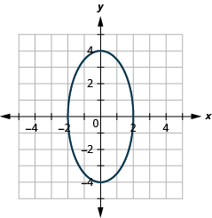
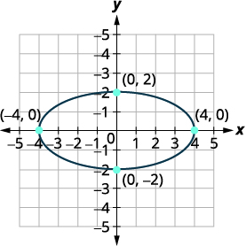
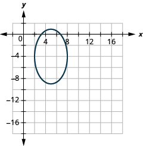
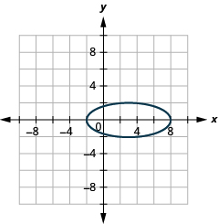
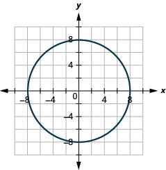
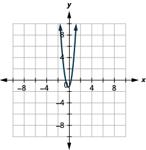

By the end of this section, you will be able to:
* Graph an ellipse with center at the origin
* Find the equation of an ellipse with center at the origin
* Graph an ellipse with center not at the origin
* Solve application with ellipses

Before you get started, take this readiness quiz.

1.  Graph
    <math xmlns="http://www.w3.org/1998/Math/MathML"><mrow><mi>y</mi><mo>=</mo><msup><mrow><mrow><mo>(</mo><mrow><mi>x</mi><mo>−</mo><mn>1</mn></mrow><mo>)</mo></mrow></mrow><mn>2</mn></msup><mo>−</mo><mn>2</mn></mrow></math>
    
    using transformations.
    * * *
    {: data-type="newline"}
    
    If you missed this problem, review [\[link\]](/m63467#fs-id1169148912189).
2.  Complete the square:
    <math xmlns="http://www.w3.org/1998/Math/MathML"><mrow><msup><mi>x</mi><mn>2</mn></msup><mo>−</mo><mn>8</mn><mi>x</mi><mo>=</mo><mn>8</mn><mo>.</mo></mrow></math>
    
    * * *
    {: data-type="newline"}
    
    If you missed this problem, review [\[link\]](/m63459#fs-id1167829894368).
3.  Write in standard form.
    <math xmlns="http://www.w3.org/1998/Math/MathML"><mrow><mi>y</mi><mo>=</mo><mn>2</mn><msup><mi>x</mi><mn>2</mn></msup><mo>−</mo><mn>12</mn><mi>x</mi><mo>+</mo><mn>14</mn></mrow></math>
    
    * * *
    {: data-type="newline"}
    
    If you missed this problem, review [\[link\]](/m63467#fs-id1169149374763).
{: type="1"}

### Graph an Ellipse with Center at the Origin

The next conic section we will look at is an **ellipse**{: data-type="term"}. We define an ellipse as all points in a plane where the sum of the distances from two fixed points is constant. Each of the given points is called a **focus** of the ellipse.

Ellipse

An **ellipse** is all points in a plane where the sum of the distances from two fixed points is constant. Each of the fixed points is called a **focus** of the ellipse.

  

We can draw an ellipse by taking some fixed length of flexible string and attaching the ends to two thumbtacks. We use a pen to pull the string taut and rotate it around the two thumbtacks. The figure that results is an ellipse.

    A line drawn through the foci intersect the ellipse in two points. Each point is called a **vertex** of the ellipse. The segment connecting the vertices is called the **major axis**. The midpoint of the segment is called the **center** of the ellipse. A segment perpendicular to the major axis that passes through the center and intersects the ellipse in two points is called the **minor axis**.

  ![This figure shows two ellipses. In each, two points within the ellipse are labeled foci. A line drawn through the foci intersects the ellipse in two points. Each point is labeled a vertex. In The figure on the left, the segment connecting the vertices is called the major axis. A segment perpendicular to the major axis that passes through its midpoint and intersects the ellipse in two points is labeled minor axis. The major axis is longer than the minor axis. In The figure on the right, the segment through the foci, connecting the vertices is shorter and is labeled minor axis. Its midpoint is labeled center.](../resources/CNX_IntAlg_Figure_11_03_003_img.jpg)  We mentioned earlier that our goal is to connect the geometry of a conic with algebra. Placing the ellipse on a rectangular coordinate system gives us that opportunity. In the figure, we placed the ellipse so the foci <math xmlns="http://www.w3.org/1998/Math/MathML"><mrow><mrow><mo>(</mo><mrow><mrow><mo>(</mo><mrow><mtext>−</mtext><mi>c</mi><mo>,</mo><mn>0</mn></mrow><mo>)</mo></mrow><mo>,</mo><mrow><mo>(</mo><mrow><mi>c</mi><mo>,</mo><mn>0</mn></mrow><mo>)</mo></mrow></mrow><mo>)</mo></mrow></mrow></math>

 are on the *x*-axis and the center is the origin.

  ![The figure on the left shows an ellipse with its center at the origin of the coordinate axes and its foci at points minus (c, 0) and (c, 0). A segment connects (negative c, 0) to a point (x, y) on the ellipse. The segment is labeled d subscript 1. Another segment, labeled d subscript 2 connects (c, 0) to (x, y). The figure on the right shows an ellipse with center at the origin, foci (negative c, 0) and (c, 0) and vertices (negative a, 0) and (a, 0). The point where the ellipse intersects the y axis is labeled (0, b). The segments connecting (0, 0) to (c, 0), (c, 0) to (0, b) and (0, b) to (0, 0) form a tight angled triangle with sides c, a and b respectively. The equation is a squared equals b squared plus c squared.](../resources/CNX_IntAlg_Figure_11_03_004_img.jpg)  The definition states the sum of the distance from the foci to a point <math xmlns="http://www.w3.org/1998/Math/MathML"><mrow><mrow><mo>(</mo><mrow><mi>x</mi><mo>,</mo><mi>y</mi></mrow><mo>)</mo></mrow></mrow></math>

 is constant. So <math xmlns="http://www.w3.org/1998/Math/MathML"><mrow><msub><mi>d</mi><mn>1</mn></msub><mo>+</mo><msub><mi>d</mi><mn>2</mn></msub></mrow></math>

 is a constant that we will call <math xmlns="http://www.w3.org/1998/Math/MathML"><mrow><mn>2</mn><mi>a</mi></mrow></math>

 so, <math xmlns="http://www.w3.org/1998/Math/MathML"><mrow><msub><mi>d</mi><mn>1</mn></msub><mo>+</mo><msub><mi>d</mi><mn>2</mn></msub><mo>=</mo><mn>2</mn><mi>a</mi><mo>.</mo></mrow></math>

 We will use the distance formula to lead us to an algebraic formula for an ellipse.

<math xmlns="http://www.w3.org/1998/Math/MathML"><mrow><mtable> <mtr><mtd columnalign="left"><mtable><mtr /><mtr /><mtr /><mtr /><mtr /><mtr><mtd columnalign="left"><mtext>Use the distance formula to find</mtext><mspace width="0.2em" /><msub><mi>d</mi><mn>1</mn></msub><mo>,</mo><msub><mi>d</mi><mn>2</mn></msub><mo>.</mo></mtd></mtr></mtable></mtd><mtd /><mtd /><mtd columnalign="center"><mtable><mtr><mtd columnalign="center"><msub><mi>d</mi><mn>1</mn></msub></mtd><mtd columnalign="left"><mo>+</mo></mtd><mtd columnalign="center"><msub><mi>d</mi><mn>2</mn></msub></mtd><mtd columnalign="left"><mo>=</mo></mtd><mtd columnalign="left"><mn>2</mn><mi>a</mi></mtd></mtr><mtr /><mtr /><mtr><mtd columnalign="left"><msqrt><mrow><msup><mrow><mrow><mo>(</mo><mrow><mi>x</mi><mo>−</mo><mrow><mo>(</mo><mrow><mtext>−</mtext><mi>c</mi></mrow><mo>)</mo></mrow></mrow><mo>)</mo></mrow></mrow><mn>2</mn></msup><mo>+</mo><msup><mrow><mrow><mo>(</mo><mrow><mi>y</mi><mo>−</mo><mn>0</mn></mrow><mo>)</mo></mrow></mrow><mn>2</mn></msup></mrow></msqrt></mtd><mtd columnalign="left"><mo>+</mo></mtd><mtd columnalign="left"><msqrt><mrow><msup><mrow><mrow><mo>(</mo><mrow><mi>x</mi><mo>−</mo><mi>c</mi></mrow><mo>)</mo></mrow></mrow><mn>2</mn></msup><mo>+</mo><msup><mrow><mrow><mo>(</mo><mrow><mi>y</mi><mo>−</mo><mn>0</mn></mrow><mo>)</mo></mrow></mrow><mn>2</mn></msup></mrow></msqrt></mtd><mtd columnalign="left"><mo>=</mo></mtd><mtd columnalign="left"><mn>2</mn><mi>a</mi></mtd></mtr></mtable></mtd></mtr><mtr /><mtr /> <mtr><mtd columnalign="left"><mtable><mtr><mtd columnalign="left"><mtext>After eliminating radicals and simplifying,</mtext></mtd></mtr><mtr><mtd columnalign="left"><mtext>we get:</mtext></mtd></mtr></mtable></mtd><mtd /><mtd /><mtd columnalign="right"><mfrac><mrow><msup><mi>x</mi><mn>2</mn></msup></mrow><mrow><msup><mi>a</mi><mn>2</mn></msup></mrow></mfrac><mo>+</mo><mfrac><mrow><msup><mi>y</mi><mn>2</mn></msup></mrow><mrow><msup><mi>a</mi><mn>2</mn></msup><mo>−</mo><msup><mi>c</mi><mn>2</mn></msup></mrow></mfrac><mspace width="0.5em" /><mo>=</mo><mspace width="0.5em" /><mn>1</mn><mspace width="0.6em" /></mtd></mtr> <mtr><mtd columnalign="left"><mtable><mtr><mtd columnalign="left"><mtext>To simplify the equation of the ellipse, we</mtext></mtd></mtr><mtr><mtd columnalign="left"><mtext>let</mtext><mspace width="0.2em" /><msup><mi>a</mi><mn>2</mn></msup><mo>−</mo><msup><mi>c</mi><mn>2</mn></msup><mo>=</mo><msup><mi>b</mi><mn>2</mn></msup><mo>.</mo></mtd></mtr></mtable></mtd><mtd /><mtd /><mtd /></mtr> <mtr><mtd columnalign="left"><mtable><mtr><mtd columnalign="left"><mtext>So, the equation of an ellipse centered at the</mtext></mtd></mtr><mtr><mtd columnalign="left"><mtext>origin in standard form is:</mtext></mtd></mtr></mtable></mtd><mtd /><mtd /><mtd columnalign="right"><mfrac><mrow><msup><mi>x</mi><mn>2</mn></msup></mrow><mrow><msup><mi>a</mi><mn>2</mn></msup></mrow></mfrac><mo>+</mo><mfrac><mrow><msup><mi>y</mi><mn>2</mn></msup></mrow><mrow><msup><mi>b</mi><mn>2</mn></msup></mrow></mfrac><mspace width="0.5em" /><mo>=</mo><mspace width="0.5em" /><mn>1</mn><mspace width="0.6em" /></mtd></mtr></mtable></mrow></math>

To graph the ellipse, it will be helpful to know the intercepts. We will find the *x*-intercepts and *y*-intercepts using the formula.

<math xmlns="http://www.w3.org/1998/Math/MathML"><mrow><mtable> <mtr><mtd columnalign="left"> <mtable><mtr><mtd /><mtd /><mtd /><mtd columnalign="left"><mspace width="0.5em" /><mtext mathvariant="bolditalics">y</mtext><mtext mathvariant="bold">-intercepts</mtext></mtd></mtr> <mtr><mtd columnalign="left"><mtable><mtr><mtd columnalign="left"><mtext>Let</mtext><mspace width="0.2em" /><mi>x</mi><mo>=</mo><mn>0</mn><mo>.</mo></mtd></mtr><mtr /><mtr /><mtr /><mtr /><mtr /><mtr /></mtable></mtd><mtd /><mtd /><mtd columnalign="left"><mtable><mtr><mtd columnalign="right"><mfrac><mrow><msup><mi>x</mi><mn>2</mn></msup></mrow><mrow><msup><mi>a</mi><mn>2</mn></msup></mrow></mfrac><mo>+</mo><mfrac><mrow><msup><mi>y</mi><mn>2</mn></msup></mrow><mrow><msup><mi>b</mi><mn>2</mn></msup></mrow></mfrac></mtd><mtd columnalign="left"><mo>=</mo></mtd><mtd columnalign="left"><mn>1</mn></mtd></mtr><mtr><mtd columnalign="right"><mfrac><mrow><msup><mn>0</mn><mn>2</mn></msup></mrow><mrow><msup><mi>a</mi><mn>2</mn></msup></mrow></mfrac><mo>+</mo><mfrac><mrow><msup><mi>y</mi><mn>2</mn></msup></mrow><mrow><msup><mi>b</mi><mn>2</mn></msup></mrow></mfrac></mtd><mtd columnalign="left"><mo>=</mo></mtd><mtd columnalign="left"><mn>1</mn></mtd></mtr><mtr><mtd columnalign="right"><mfrac><mrow><msup><mi>y</mi><mn>2</mn></msup></mrow><mrow><msup><mi>b</mi><mn>2</mn></msup></mrow></mfrac></mtd><mtd columnalign="left"><mo>=</mo></mtd><mtd columnalign="left"><mn>1</mn></mtd></mtr><mtr><mtd columnalign="right"><msup><mi>y</mi><mn>2</mn></msup></mtd><mtd columnalign="left"><mo>=</mo></mtd><mtd columnalign="left"><msup><mi>b</mi><mn>2</mn></msup></mtd></mtr><mtr><mtd columnalign="right"><mi>y</mi></mtd><mtd columnalign="left"><mo>=</mo></mtd><mtd columnalign="left"><mo>±</mo><mi>b</mi></mtd></mtr></mtable></mtd></mtr></mtable></mtd><mtd /><mtd /> <mtd columnalign="left"><mtable><mtr><mtd /><mtd /><mtd /><mtd columnalign="left"><mspace width="0.5em" /><mtext mathvariant="bolditalics">x</mtext><mtext mathvariant="bold">-intercepts</mtext></mtd></mtr><mtr><mtd columnalign="left"><mtable><mtr><mtd columnalign="left"><mtext>Let</mtext><mspace width="0.2em" /><mi>y</mi><mo>=</mo><mn>0</mn><mo>.</mo></mtd></mtr><mtr /><mtr /><mtr /><mtr /><mtr /><mtr /></mtable></mtd><mtd /><mtd /><mtd columnalign="left"><mtable><mtr><mtd columnalign="right"><mfrac><mrow><msup><mi>x</mi><mn>2</mn></msup></mrow><mrow><msup><mi>a</mi><mn>2</mn></msup></mrow></mfrac><mo>+</mo><mfrac><mrow><msup><mi>y</mi><mn>2</mn></msup></mrow><mrow><msup><mi>b</mi><mn>2</mn></msup></mrow></mfrac></mtd><mtd columnalign="left"><mo>=</mo></mtd><mtd columnalign="left"><mn>1</mn></mtd></mtr><mtr><mtd columnalign="right"><mfrac><mrow><msup><mi>x</mi><mn>2</mn></msup></mrow><mrow><msup><mi>a</mi><mn>2</mn></msup></mrow></mfrac><mo>+</mo><mfrac><mrow><msup><mn>0</mn><mn>2</mn></msup></mrow><mrow><msup><mi>b</mi><mn>2</mn></msup></mrow></mfrac></mtd><mtd columnalign="left"><mo>=</mo></mtd><mtd columnalign="left"><mn>1</mn></mtd></mtr><mtr><mtd columnalign="right"><mfrac><mrow><msup><mi>x</mi><mn>2</mn></msup></mrow><mrow><msup><mi>a</mi><mn>2</mn></msup></mrow></mfrac></mtd><mtd columnalign="left"><mo>=</mo></mtd><mtd columnalign="left"><mn>1</mn></mtd></mtr><mtr><mtd columnalign="right"><msup><mi>x</mi><mn>2</mn></msup></mtd><mtd columnalign="left"><mo>=</mo></mtd><mtd columnalign="left"><msup><mi>a</mi><mn>2</mn></msup></mtd></mtr><mtr><mtd columnalign="right"><mi>x</mi></mtd><mtd columnalign="left"><mo>=</mo></mtd><mtd columnalign="left"><mo>±</mo><mi>a</mi></mtd></mtr></mtable></mtd></mtr></mtable></mtd></mtr> <mtr><mtd columnalign="left"><mtext>The</mtext><mspace width="0.2em" /><mi>y</mi><mtext>-intercepts are</mtext><mspace width="0.2em" /><mrow><mo>(</mo><mrow><mn>0</mn><mo>,</mo><mi>b</mi></mrow><mo>)</mo></mrow><mspace width="0.2em" /><mtext>and</mtext><mspace width="0.2em" /><mrow><mo>(</mo><mrow><mn>0</mn><mo>,</mo><mtext>−</mtext><mi>b</mi></mrow><mo>)</mo></mrow><mo>.</mo></mtd><mtd /><mtd /><mtd columnalign="left"><mtext>The</mtext><mspace width="0.2em" /><mi>x</mi><mtext>-intercepts are</mtext><mspace width="0.2em" /><mrow><mo>(</mo><mrow><mi>a</mi><mo>,</mo><mn>0</mn></mrow><mo>)</mo></mrow><mspace width="0.2em" /><mtext>and</mtext><mspace width="0.2em" /><mrow><mo>(</mo><mrow><mtext>−</mtext><mi>a</mi><mo>,</mo><mn>0</mn></mrow><mo>)</mo></mrow><mo>.</mo></mtd></mtr></mtable></mrow></math>

Standard Form of the Equation an Ellipse with Center
<math xmlns="http://www.w3.org/1998/Math/MathML"><mrow><mrow><mo>(</mo><mrow><mn>0</mn><mo>,</mo><mtext>​</mtext><mtext>​</mtext><mn>0</mn></mrow><mo>)</mo></mrow></mrow></math>

The standard form of the equation of an ellipse with center <math xmlns="http://www.w3.org/1998/Math/MathML"><mrow><mrow><mo>(</mo><mrow><mn>0</mn><mo>,</mo><mtext>​</mtext><mtext>​</mtext><mn>0</mn></mrow><mo>)</mo></mrow><mo>,</mo></mrow></math>

 is

<math xmlns="http://www.w3.org/1998/Math/MathML"><mrow><mfrac><mrow><msup><mi>x</mi><mn>2</mn></msup></mrow><mrow><msup><mi>a</mi><mn>2</mn></msup></mrow></mfrac><mo>+</mo><mfrac><mrow><msup><mi>y</mi><mn>2</mn></msup></mrow><mrow><msup><mi>b</mi><mn>2</mn></msup></mrow></mfrac><mo>=</mo><mn>1</mn></mrow></math>

The *x*-intercepts are <math xmlns="http://www.w3.org/1998/Math/MathML"><mrow><mrow><mo>(</mo><mrow><mi>a</mi><mo>,</mo><mn>0</mn></mrow><mo>)</mo></mrow></mrow></math>

 and <math xmlns="http://www.w3.org/1998/Math/MathML"><mrow><mrow><mo>(</mo><mrow><mtext>−</mtext><mi>a</mi><mo>,</mo><mn>0</mn></mrow><mo>)</mo></mrow><mo>.</mo></mrow></math>

The *y*-intercepts are <math xmlns="http://www.w3.org/1998/Math/MathML"><mrow><mrow><mo>(</mo><mrow><mn>0</mn><mo>,</mo><mi>b</mi></mrow><mo>)</mo></mrow></mrow></math>

 and <math xmlns="http://www.w3.org/1998/Math/MathML"><mrow><mrow><mo>(</mo><mrow><mn>0</mn><mo>,</mo><mtext>−</mtext><mi>b</mi></mrow><mo>)</mo></mrow><mo>.</mo></mrow></math>

  

Notice that when the major axis is horizontal, the value of *a* will be greater than the value of *b* and when the major axis is vertical, the value of *b* will be greater than the value of *a*. We will use this information to graph an **ellipse**{: data-type="term" .no-emphasis} that is centered at the origin.

<table summary="."><thead>
<tr valign="top">
<th colspan="3" data-valign="middle" data-align="center">Ellipse with Center <math xmlns="http://www.w3.org/1998/Math/MathML"><mrow><mrow><mo>(</mo><mrow><mn>0</mn><mo>,</mo><mn>0</mn></mrow><mo>)</mo></mrow></mrow></math></th>
</tr>
<tr valign="top">
<th data-valign="middle" data-align="center"><math xmlns="http://www.w3.org/1998/Math/MathML"><mrow><mfrac><mrow><msup><mi>x</mi><mn>2</mn></msup></mrow><mrow><msup><mi>a</mi><mn>2</mn></msup></mrow></mfrac><mo>+</mo><mfrac><mrow><msup><mi>y</mi><mn>2</mn></msup></mrow><mrow><msup><mi>b</mi><mn>2</mn></msup></mrow></mfrac><mo>=</mo><mn>1</mn></mrow></math></th>
<th data-valign="middle" data-align="center"><math xmlns="http://www.w3.org/1998/Math/MathML"><mrow><mi>a</mi><mo>&gt;</mo><mi>b</mi></mrow></math></th>
<th data-valign="middle" data-align="center"><math xmlns="http://www.w3.org/1998/Math/MathML"><mrow><mi>b</mi><mo>&gt;</mo><mi>a</mi></mrow></math></th>
</tr>
</thead><tbody>
<tr valign="top">
<td data-valign="middle" data-align="center"><strong>Major axis</strong></td>
<td data-valign="middle" data-align="center">on the <em>x</em>- axis.</td>
<td data-valign="middle" data-align="center">on the <em>y</em>-axis.</td>
</tr>
<tr valign="top">
<td data-valign="middle" data-align="center"><strong><em>x</em>-intercepts</strong></td>
<td colspan="2" data-valign="middle" data-align="center"><math xmlns="http://www.w3.org/1998/Math/MathML"><mrow><mrow><mo>(</mo><mrow><mtext>−</mtext><mi>a</mi><mo>,</mo><mn>0</mn></mrow><mo>)</mo></mrow><mo>,</mo></mrow></math><math xmlns="http://www.w3.org/1998/Math/MathML"><mrow><mrow><mo>(</mo><mrow><mi>a</mi><mo>,</mo><mn>0</mn></mrow><mo>)</mo></mrow></mrow></math></td>
</tr>
<tr valign="top">
<td data-valign="middle" data-align="center"><strong><em>y</em>-intercepts</strong></td>
<td colspan="2" data-valign="middle" data-align="center"><math xmlns="http://www.w3.org/1998/Math/MathML"><mrow><mrow><mo>(</mo><mrow><mn>0</mn><mo>,</mo><mtext>−</mtext><mi>b</mi></mrow><mo>)</mo></mrow><mo>,</mo></mrow></math><math xmlns="http://www.w3.org/1998/Math/MathML"><mrow><mrow><mo>(</mo><mrow><mn>0</mn><mo>,</mo><mi>b</mi></mrow><mo>)</mo></mrow></mrow></math></td>
</tr>
</tbody></table>

How to Graph an Ellipse with Center (0, 0)

Graph: <math xmlns="http://www.w3.org/1998/Math/MathML"><mrow><mfrac><mrow><msup><mi>x</mi><mn>2</mn></msup></mrow><mn>4</mn></mfrac><mo>+</mo><mfrac><mrow><msup><mi>y</mi><mn>2</mn></msup></mrow><mn>9</mn></mfrac><mo>=</mo><mn>1</mn><mo>.</mo></mrow></math>

          

Graph: <math xmlns="http://www.w3.org/1998/Math/MathML"><mrow><mfrac><mrow><msup><mi>x</mi><mn>2</mn></msup></mrow><mn>4</mn></mfrac><mo>+</mo><mfrac><mrow><msup><mi>y</mi><mn>2</mn></msup></mrow><mrow><mn>16</mn></mrow></mfrac><mo>=</mo><mn>1</mn><mo>.</mo></mrow></math>

  

Graph: <math xmlns="http://www.w3.org/1998/Math/MathML"><mrow><mfrac><mrow><msup><mi>x</mi><mn>2</mn></msup></mrow><mn>9</mn></mfrac><mo>+</mo><mfrac><mrow><msup><mi>y</mi><mn>2</mn></msup></mrow><mrow><mn>16</mn></mrow></mfrac><mo>=</mo><mn>1</mn><mo>.</mo></mrow></math>

  

We summarize the steps for reference.

How to Graph an Ellipse with Center
<math xmlns="http://www.w3.org/1998/Math/MathML"><mrow><mrow><mo>(</mo><mrow><mn>0</mn><mo>,</mo><mn>0</mn></mrow><mo>)</mo><mo>.</mo></mrow></mrow></math>

1.  Write the equation in standard form.
2.  Determine whether the major axis is horizontal or vertical.
3.  Find the endpoints of the major axis.
4.  Find the endpoints of the minor axis
5.  Sketch the ellipse.
{: type="1" .stepwise}

Sometimes our equation will first need to be put in standard form.

Graph <math xmlns="http://www.w3.org/1998/Math/MathML"><mrow><msup><mi>x</mi><mn>2</mn></msup><mo>+</mo><mn>4</mn><msup><mi>y</mi><mn>2</mn></msup><mo>=</mo><mn>16</mn><mo>.</mo></mrow></math>

<table class="unnumbered unstyled can-break" summary="The equation is x squared plus 4 y squared equals 16. We recognize this as the equation of an ellipse since both the x and y terms are squared and have different coefficients. To get the equation in standard form, divide both sides by 16 so that the right side of the equation is equal to 1. Simplify to get x squared upon 16 plus y squared upon 4 equals 1. The equation is in standard form. The ellipse is centered at the origin, (0, 0). Since 16 is greater than 4 and 16 is in the x squared term, the major axis is horizontal. a squared is 16, so a is plus or minus 4. The vertices are (4, 0) and (negative 4, 0). b squared is 4, so b is plus or minus 2. The endpoints of the minor axis are (0, 2) and (0, negative 2). Sketch the ellipse." data-label=""><tbody>
<tr valign="top">
<td data-valign="top" data-align="left">We recognize this as the equation of an
ellipse since both the <em>x</em> and <em>y</em> terms are
squared and have different coefficients.</td>
<td data-valign="top" data-align="center"><math xmlns="http://www.w3.org/1998/Math/MathML"><mrow><mspace width="0.9em" /><msup><mi>x</mi><mn>2</mn></msup><mo>+</mo><mn>4</mn><msup><mi>y</mi><mn>2</mn></msup><mo>=</mo><mn>16</mn></mrow></math></td>
</tr>
<tr valign="top">
<td data-valign="top" data-align="left">To get the equation in standard form, divide
both sides by 16 so that the equation is equal
to 1.</td>
<td data-valign="top" data-align="center"><math xmlns="http://www.w3.org/1998/Math/MathML"><mrow><mspace width="0.61em" /><mfrac><mrow><msup><mi>x</mi><mn>2</mn></msup></mrow><mrow><mn>16</mn></mrow></mfrac><mo>+</mo><mfrac><mrow><mn>4</mn><msup><mi>y</mi><mn>2</mn></msup></mrow><mrow><mn>16</mn></mrow></mfrac><mo>=</mo><mfrac><mrow><mn>16</mn></mrow><mrow><mn>16</mn></mrow></mfrac></mrow></math></td>
</tr>
<tr valign="top">
<td data-valign="top" data-align="left">Simplify.</td>
<td data-valign="top" data-align="center"><math xmlns="http://www.w3.org/1998/Math/MathML"><mrow><mspace width="0.67em" /><mfrac><mrow><msup><mi>x</mi><mn>2</mn></msup></mrow><mrow><mn>16</mn></mrow></mfrac><mo>+</mo><mfrac><mrow><msup><mi>y</mi><mn>2</mn></msup></mrow><mn>4</mn></mfrac><mo>=</mo><mn>1</mn></mrow></math></td>
</tr>
<tr valign="top">
<td data-valign="top" data-align="left">The equation is in standard form.
The ellipse is centered at the origin.</td>
<td data-valign="top" data-align="center">The center is <math xmlns="http://www.w3.org/1998/Math/MathML"><mrow><mrow><mo>(</mo><mrow><mn>0</mn><mo>,</mo><mn>0</mn></mrow><mo>)</mo></mrow><mo>.</mo></mrow></math></td>
</tr>
<tr valign="top">
<td data-valign="top" data-align="left">Since <math xmlns="http://www.w3.org/1998/Math/MathML"><mrow><mn>16</mn><mo>&gt;</mo><mn>4</mn></mrow></math> and 16 is in the <math xmlns="http://www.w3.org/1998/Math/MathML"><mrow><msup><mi>x</mi><mn>2</mn></msup></mrow></math> term,
the major axis is horizontal.</td>
<td data-valign="top" data-align="left" />
</tr>
<tr valign="top">
<td data-valign="top" data-align="left">  <math xmlns="http://www.w3.org/1998/Math/MathML"><mrow><msup><mi>a</mi><mn>2</mn></msup><mo>=</mo><mn>16</mn><mo>,</mo><mi>a</mi><mo>=</mo><mo>±</mo><mn>4</mn></mrow></math>
  <math xmlns="http://www.w3.org/1998/Math/MathML"><mrow><msup><mi>b</mi><mn>2</mn></msup><mo>=</mo><mn>4</mn><mo>,</mo><mspace width="0.55em" /><mi>b</mi><mo>=</mo><mo>±</mo><mn>2</mn></mrow></math></td>
<td data-valign="top" data-align="left">The vertices are <math xmlns="http://www.w3.org/1998/Math/MathML"><mrow><mrow><mo>(</mo><mrow><mn>4</mn><mo>,</mo><mn>0</mn></mrow><mo>)</mo></mrow><mo>,</mo><mrow><mo>(</mo><mrow><mn>−4</mn><mo>,</mo><mn>0</mn></mrow><mo>)</mo></mrow><mo>.</mo></mrow></math>
The endpoints of the minor axis are
<math xmlns="http://www.w3.org/1998/Math/MathML"><mrow><mrow><mo>(</mo><mrow><mn>0</mn><mo>,</mo><mn>2</mn></mrow><mo>)</mo></mrow><mo>,</mo><mrow><mo>(</mo><mrow><mn>0</mn><mo>,</mo><mn>−2</mn></mrow><mo>)</mo></mrow><mo>.</mo></mrow></math></td>
</tr>
<tr valign="top">
<td data-valign="top" data-align="left">Sketch the parabola.</td>
<td data-valign="top" data-align="left"></td>
</tr>
</tbody></table>

Graph <math xmlns="http://www.w3.org/1998/Math/MathML"><mrow><mn>9</mn><msup><mi>x</mi><mn>2</mn></msup><mo>+</mo><mn>16</mn><msup><mi>y</mi><mn>2</mn></msup><mo>=</mo><mn>144</mn><mo>.</mo></mrow></math>

  

Graph <math xmlns="http://www.w3.org/1998/Math/MathML"><mrow><mn>16</mn><msup><mi>x</mi><mn>2</mn></msup><mo>+</mo><mn>25</mn><msup><mi>y</mi><mn>2</mn></msup><mo>=</mo><mn>400</mn><mo>.</mo></mrow></math>

  

### Find the Equation of an Ellipse with Center at the Origin

If we are given the graph of an **ellipse**{: data-type="term" .no-emphasis}, we can find the equation of the ellipse.

Find the equation of the ellipse shown.

  

<math xmlns="http://www.w3.org/1998/Math/MathML"><mrow><mtable> <mtr><mtd columnalign="left"><mtable><mtr><mtd columnalign="left"><mtext>We recognize this as an ellipse that is</mtext></mtd></mtr><mtr><mtd columnalign="left"><mtext>centered at the origin.</mtext></mtd></mtr></mtable></mtd><mtd /><mtd /><mtd /><mtd /><mtd columnalign="right"><mfrac><mrow><msup><mi>x</mi><mn>2</mn></msup></mrow><mrow><msup><mi>a</mi><mn>2</mn></msup></mrow></mfrac><mo>+</mo><mfrac><mrow><msup><mi>y</mi><mn>2</mn></msup></mrow><mrow><msup><mi>b</mi><mn>2</mn></msup></mrow></mfrac><mo>=</mo><mn>1</mn></mtd></mtr> <mtr><mtd columnalign="left"><mtable><mtr><mtd columnalign="left"><mtext>Since the major axis is horizontal and the</mtext></mtd></mtr><mtr><mtd columnalign="left"><mtext>distance from the center to the vertex is 4, we</mtext></mtd></mtr><mtr><mtd columnalign="left"><mtext>know</mtext><mspace width="0.2em" /><mi>a</mi><mo>=</mo><mn>4</mn><mspace width="0.2em" /><mtext>and so</mtext><mspace width="0.2em" /><msup><mi>a</mi><mn>2</mn></msup><mo>=</mo><mn>16</mn><mo>.</mo></mtd></mtr></mtable></mtd><mtd /><mtd /><mtd /><mtd /><mtd columnalign="right"><mfrac><mrow><msup><mi>x</mi><mn>2</mn></msup></mrow><mrow><mn>16</mn></mrow></mfrac><mo>+</mo><mfrac><mrow><msup><mi>y</mi><mn>2</mn></msup></mrow><mrow><msup><mi>b</mi><mn>2</mn></msup></mrow></mfrac><mo>=</mo><mn>1</mn></mtd></mtr> <mtr><mtd columnalign="left"><mtable><mtr><mtd columnalign="left"><mtext>The minor axis is vertical and the distance</mtext></mtd></mtr><mtr><mtd columnalign="left"><mtext>from the center to the ellipse is 3, we know</mtext></mtd></mtr><mtr><mtd columnalign="left"><mi>b</mi><mo>=</mo><mn>3</mn><mspace width="0.2em" /><mtext>and so</mtext><mspace width="0.2em" /><msup><mi>b</mi><mn>2</mn></msup><mo>=</mo><mn>9</mn><mo>.</mo></mtd></mtr></mtable></mtd><mtd /><mtd /><mtd /><mtd /><mtd columnalign="right"><mfrac><mrow><msup><mi>x</mi><mn>2</mn></msup></mrow><mrow><mn>16</mn></mrow></mfrac><mo>+</mo><mfrac><mrow><msup><mi>y</mi><mn>2</mn></msup></mrow><mn>9</mn></mfrac><mo>=</mo><mn>1</mn></mtd></mtr></mtable></mrow></math>

Find the equation of the ellipse shown.

  

<math xmlns="http://www.w3.org/1998/Math/MathML"><mrow><mfrac><mrow><msup><mi>x</mi><mn>2</mn></msup></mrow><mn>4</mn></mfrac><mo>+</mo><mfrac><mrow><msup><mi>y</mi><mn>2</mn></msup></mrow><mrow><mn>25</mn></mrow></mfrac><mo>=</mo><mn>1</mn></mrow></math>

Find the equation of the ellipse shown.

  

<math xmlns="http://www.w3.org/1998/Math/MathML"><mrow><mfrac><mrow><msup><mi>x</mi><mn>2</mn></msup></mrow><mn>9</mn></mfrac><mo>+</mo><mfrac><mrow><msup><mi>y</mi><mn>2</mn></msup></mrow><mn>4</mn></mfrac><mo>=</mo><mn>1</mn></mrow></math>

### Graph an Ellipse with Center Not at the Origin

The ellipses we have looked at so far have all been centered at the origin. We will now look at ellipses whose center is <math xmlns="http://www.w3.org/1998/Math/MathML"><mrow><mrow><mo>(</mo><mrow><mi>h</mi><mo>,</mo><mi>k</mi></mrow><mo>)</mo></mrow><mo>.</mo></mrow></math>

The equation is <math xmlns="http://www.w3.org/1998/Math/MathML"><mrow><mfrac><mrow><msup><mrow><mrow><mo>(</mo><mrow><mi>x</mi><mo>−</mo><mi>h</mi></mrow><mo>)</mo></mrow></mrow><mn>2</mn></msup></mrow><mrow><msup><mi>a</mi><mn>2</mn></msup></mrow></mfrac><mo>+</mo><mfrac><mrow><msup><mrow><mrow><mo>(</mo><mrow><mi>y</mi><mo>−</mo><mi>k</mi></mrow><mo>)</mo></mrow></mrow><mn>2</mn></msup></mrow><mrow><msup><mi>b</mi><mn>2</mn></msup></mrow></mfrac><mo>=</mo><mn>1</mn></mrow></math>

 and when <math xmlns="http://www.w3.org/1998/Math/MathML"><mrow><mi>a</mi><mo>&gt;</mo><mi>b</mi><mo>,</mo></mrow></math>

 the major axis is horizontal so the distance from the center to the vertex is *a*. When <math xmlns="http://www.w3.org/1998/Math/MathML"><mrow><mi>b</mi><mo>&gt;</mo><mi>a</mi><mo>,</mo></mrow></math>

 the major axis is vertical so the distance from the center to the vertex is *b*.

Standard Form of the Equation an Ellipse with Center
<math xmlns="http://www.w3.org/1998/Math/MathML"><mrow><mrow><mo>(</mo><mrow><mi>h</mi><mo>,</mo><mi>k</mi></mrow><mo>)</mo></mrow></mrow></math>

The standard form of the equation of an ellipse with center <math xmlns="http://www.w3.org/1998/Math/MathML"><mrow><mrow><mo>(</mo><mrow><mi>h</mi><mo>,</mo><mi>k</mi></mrow><mo>)</mo></mrow><mo>,</mo></mrow></math>

 is

<math xmlns="http://www.w3.org/1998/Math/MathML"><mrow><mfrac><mrow><msup><mrow><mrow><mo>(</mo><mrow><mi>x</mi><mo>−</mo><mi>h</mi></mrow><mo>)</mo></mrow></mrow><mn>2</mn></msup></mrow><mrow><msup><mi>a</mi><mn>2</mn></msup></mrow></mfrac><mo>+</mo><mfrac><mrow><msup><mrow><mrow><mo>(</mo><mrow><mi>y</mi><mo>−</mo><mi>k</mi></mrow><mo>)</mo></mrow></mrow><mn>2</mn></msup></mrow><mrow><msup><mi>b</mi><mn>2</mn></msup></mrow></mfrac><mo>=</mo><mn>1</mn></mrow></math>

When <math xmlns="http://www.w3.org/1998/Math/MathML"><mrow><mi>a</mi><mo>&gt;</mo><mi>b</mi><mo>,</mo></mrow></math>

 the major axis is horizontal so the distance from the center to the vertex is *a*.

When <math xmlns="http://www.w3.org/1998/Math/MathML"><mrow><mi>b</mi><mo>&gt;</mo><mi>a</mi><mo>,</mo></mrow></math>

 the major axis is vertical so the distance from the center to the vertex is *b*.

Graph: <math xmlns="http://www.w3.org/1998/Math/MathML"><mrow><mfrac><mrow><msup><mrow><mrow><mo>(</mo><mrow><mi>x</mi><mo>−</mo><mn>3</mn></mrow><mo>)</mo></mrow></mrow><mn>2</mn></msup></mrow><mn>9</mn></mfrac><mo>+</mo><mfrac><mrow><msup><mrow><mrow><mo>(</mo><mrow><mi>y</mi><mo>−</mo><mn>1</mn></mrow><mo>)</mo></mrow></mrow><mn>2</mn></msup></mrow><mn>4</mn></mfrac><mo>=</mo><mn>1</mn><mo>.</mo></mrow></math>

<table class="unnumbered unstyled" summary="The equation is open parentheses x minus 3 close parentheses squared upon 9 plus open parentheses y minus 1 close parentheses squared upon 4 equals 1. This is in standard form. The ellipse is centered at (h, k), which is (3, 1). Since 9 is greater than 4 and is in the x squared term, the major axis is horizontal. a squared is 9, so a is plus or minus 3. The distance from the center to the vertices is 3. b squared is 4, so b is plus or minus 2. The distance from the center to the endpoints of the minor axis is 2. Sketch the ellipse with point 3, 3, point 3, negative 3, point 6, 1) and (point 0, 1)." data-label=""><tbody>
<tr valign="top">
<td data-valign="top" data-align="left">The equation is in standard form,
<math xmlns="http://www.w3.org/1998/Math/MathML"><mrow><mfrac><mrow><msup><mrow><mrow><mo>(</mo><mrow><mi>x</mi><mo>−</mo><mi>h</mi></mrow><mo>)</mo></mrow></mrow><mn>2</mn></msup></mrow><mrow><msup><mi>a</mi><mn>2</mn></msup></mrow></mfrac><mo>+</mo><mfrac><mrow><msup><mrow><mrow><mo>(</mo><mrow><mi>y</mi><mo>−</mo><mi>k</mi></mrow><mo>)</mo></mrow></mrow><mn>2</mn></msup></mrow><mrow><msup><mi>b</mi><mn>2</mn></msup></mrow></mfrac><mo>=</mo><mn>1</mn><mo>.</mo></mrow></math></td>
<td data-valign="top" data-align="center"><math xmlns="http://www.w3.org/1998/Math/MathML"><mrow><mfrac><mrow><msup><mrow><mrow><mo>(</mo><mrow><mi>x</mi><mo>−</mo><mn>3</mn></mrow><mo>)</mo></mrow></mrow><mn>2</mn></msup></mrow><mn>9</mn></mfrac><mo>+</mo><mfrac><mrow><msup><mrow><mrow><mo>(</mo><mrow><mi>y</mi><mo>−</mo><mn>1</mn></mrow><mo>)</mo></mrow></mrow><mn>2</mn></msup></mrow><mn>4</mn></mfrac><mo>=</mo><mn>1</mn></mrow></math></td>
</tr>
<tr valign="top">
<td data-valign="top" data-align="left">The ellipse is centered at <math xmlns="http://www.w3.org/1998/Math/MathML"><mrow><mrow><mo>(</mo><mrow><mi>h</mi><mo>,</mo><mi>k</mi></mrow><mo>)</mo></mrow><mo>.</mo></mrow></math></td>
<td data-valign="top" data-align="center">The center is <math xmlns="http://www.w3.org/1998/Math/MathML"><mrow><mrow><mo>(</mo><mrow><mn>3</mn><mo>,</mo><mn>1</mn></mrow><mo>)</mo></mrow><mo>.</mo></mrow></math></td>
</tr>
<tr valign="top">
<td data-valign="top" data-align="left">Since <math xmlns="http://www.w3.org/1998/Math/MathML"><mrow><mn>9</mn><mo>&gt;</mo><mn>4</mn></mrow></math> and 9 is in the <math xmlns="http://www.w3.org/1998/Math/MathML"><mrow><msup><mi>x</mi><mn>2</mn></msup></mrow></math> term,
the major axis is horizontal.</td>
<td data-valign="top" data-align="left" />
</tr>
<tr valign="top">
<td data-valign="top" data-align="left">  <math xmlns="http://www.w3.org/1998/Math/MathML"><mrow><msup><mi>a</mi><mn>2</mn></msup><mo>=</mo><mn>9</mn><mo>,</mo><mspace width="0.25em" /><mi>a</mi><mo>=</mo><mo>±</mo><mn>3</mn></mrow></math>
  <math xmlns="http://www.w3.org/1998/Math/MathML"><mrow><msup><mi>b</mi><mn>2</mn></msup><mo>=</mo><mn>4</mn><mo>,</mo><mspace width="0.25em" /><mi>b</mi><mo>=</mo><mo>±</mo><mn>2</mn></mrow></math></td>
<td data-valign="top" data-align="left">The distance from the center to the vertices is 3.
The distance from the center to the endpoints of the
minor axis is 2.</td>
</tr>
<tr valign="top">
<td data-valign="top" data-align="left">Sketch the ellipse.</td>
<td data-valign="top" data-align="left"></td>
</tr>
</tbody></table>

Graph: <math xmlns="http://www.w3.org/1998/Math/MathML"><mrow><mfrac><mrow><msup><mrow><mrow><mo>(</mo><mrow><mi>x</mi><mo>+</mo><mn>3</mn></mrow><mo>)</mo></mrow></mrow><mn>2</mn></msup></mrow><mn>4</mn></mfrac><mo>+</mo><mfrac><mrow><msup><mrow><mrow><mo>(</mo><mrow><mi>y</mi><mo>−</mo><mn>5</mn></mrow><mo>)</mo></mrow></mrow><mn>2</mn></msup></mrow><mrow><mn>16</mn></mrow></mfrac><mo>=</mo><mn>1</mn><mo>.</mo></mrow></math>

  

Graph: <math xmlns="http://www.w3.org/1998/Math/MathML"><mrow><mfrac><mrow><msup><mrow><mrow><mo>(</mo><mrow><mi>x</mi><mo>−</mo><mn>1</mn></mrow><mo>)</mo></mrow></mrow><mn>2</mn></msup></mrow><mrow><mn>25</mn></mrow></mfrac><mo>+</mo><mfrac><mrow><msup><mrow><mrow><mo>(</mo><mrow><mi>y</mi><mo>+</mo><mn>3</mn></mrow><mo>)</mo></mrow></mrow><mn>2</mn></msup></mrow><mrow><mn>16</mn></mrow></mfrac><mo>=</mo><mn>1</mn><mo>.</mo></mrow></math>

  

If we look at the equations of <math xmlns="http://www.w3.org/1998/Math/MathML"><mrow><mfrac><mrow><msup><mi>x</mi><mn>2</mn></msup></mrow><mn>9</mn></mfrac><mo>+</mo><mfrac><mrow><msup><mi>y</mi><mn>2</mn></msup></mrow><mn>4</mn></mfrac><mo>=</mo><mn>1</mn></mrow></math>

 and <math xmlns="http://www.w3.org/1998/Math/MathML"><mrow><mfrac><mrow><msup><mrow><mrow><mo>(</mo><mrow><mi>x</mi><mo>−</mo><mn>3</mn></mrow><mo>)</mo></mrow></mrow><mn>2</mn></msup></mrow><mn>9</mn></mfrac><mo>+</mo><mfrac><mrow><msup><mrow><mrow><mo>(</mo><mrow><mi>y</mi><mo>−</mo><mn>1</mn></mrow><mo>)</mo></mrow></mrow><mn>2</mn></msup></mrow><mn>4</mn></mfrac><mo>=</mo><mn>1</mn><mo>,</mo></mrow></math>

 we see that they are both ellipses with <math xmlns="http://www.w3.org/1998/Math/MathML"><mrow><mi>a</mi><mo>=</mo><mn>3</mn></mrow></math>

 and <math xmlns="http://www.w3.org/1998/Math/MathML"><mrow><mi>b</mi><mo>=</mo><mn>2</mn><mo>.</mo></mrow></math>

 So they will have the same size and shape. They are different in that they do not have the same center.

  ![The equation in the first figure is x squared upon 9 plus y squared upon 4 equals 1. Here, a is 3 and b is 2. The ellipse is graphed with center at (0, 0). The equation on the right is open parentheses x minus 3 close parentheses squared upon 9 plus open parentheses y minus 1 close parentheses squared upon 4 equals 1. Here, too, a is 3 and b is 2, but the center is (3, 1). The ellipse is shown on the same graph along with the first ellipse. The center is shown to have moved 3 units right and 1 unit up.](../resources/CNX_IntAlg_Figure_11_03_012_img.jpg)  

Notice in the graph above that we could have graphed <math xmlns="http://www.w3.org/1998/Math/MathML"><mrow><mfrac><mrow><msup><mrow><mrow><mo>(</mo><mrow><mi>x</mi><mo>−</mo><mn>3</mn></mrow><mo>)</mo></mrow></mrow><mn>2</mn></msup></mrow><mn>9</mn></mfrac><mo>+</mo><mfrac><mrow><msup><mrow><mrow><mo>(</mo><mrow><mi>y</mi><mo>−</mo><mn>1</mn></mrow><mo>)</mo></mrow></mrow><mn>2</mn></msup></mrow><mn>4</mn></mfrac><mo>=</mo><mn>1</mn></mrow></math>

 by translations. We moved the original ellipse to the right 3 units and then up 1 unit.

    In the next example we will use the translation method to graph the ellipse.

Graph <math xmlns="http://www.w3.org/1998/Math/MathML"><mrow><mfrac><mrow><msup><mrow><mrow><mo>(</mo><mrow><mi>x</mi><mo>+</mo><mn>4</mn></mrow><mo>)</mo></mrow></mrow><mn>2</mn></msup></mrow><mrow><mn>16</mn></mrow></mfrac><mo>+</mo><mfrac><mrow><msup><mrow><mrow><mo>(</mo><mrow><mi>y</mi><mo>−</mo><mn>6</mn></mrow><mo>)</mo></mrow></mrow><mn>2</mn></msup></mrow><mn>9</mn></mfrac><mo>=</mo><mn>1</mn></mrow></math>

 by translation.

This ellipse will have the same size and shape as <math xmlns="http://www.w3.org/1998/Math/MathML"><mrow><mfrac><mrow><msup><mi>x</mi><mn>2</mn></msup></mrow><mrow><mn>16</mn></mrow></mfrac><mo>+</mo><mfrac><mrow><msup><mi>y</mi><mn>2</mn></msup></mrow><mn>9</mn></mfrac><mo>=</mo><mn>1</mn></mrow></math>

 whose center is <math xmlns="http://www.w3.org/1998/Math/MathML"><mrow><mrow><mo>(</mo><mrow><mn>0</mn><mo>,</mo><mn>0</mn></mrow><mo>)</mo></mrow><mo>.</mo></mrow></math>

 We graph this ellipse first.* * *
{: data-type="newline"}

<table class="unnumbered unstyled can-break" summary="The center is 0, 0). Since 16 is greater than 9, the major axis is horizontal. a squared is 16, so a is plus or minus 4. The vertices are (4, 0) and (negative 4, 0). b squared is 9 so b is plus or minus 3. The endpoints of the minor axis are (0, 3) and (0, negative 3). Graph the ellipse. The original equation is in standard form where h is minus 4 and k is 6. The center of the translated ellipse will be (negative 4, 6). We translate the graph of the first ellipse four units to the left and then up 6 units. Verify that the center is (negative 4, 6). The new ellipse has the desired equation." data-label=""><tbody>
<tr valign="top">
<td data-valign="top" data-align="left">The center is <math xmlns="http://www.w3.org/1998/Math/MathML"><mrow><mrow><mo>(</mo><mrow><mn>0</mn><mo>,</mo><mn>0</mn></mrow><mo>)</mo></mrow><mo>.</mo></mrow></math></td>
<td data-valign="top" data-align="center">Center <math xmlns="http://www.w3.org/1998/Math/MathML"><mrow><mrow><mo>(</mo><mrow><mn>0</mn><mo>,</mo><mn>0</mn></mrow><mo>)</mo></mrow></mrow></math></td>
</tr>
<tr valign="top">
<td data-valign="top" data-align="left">Since <math xmlns="http://www.w3.org/1998/Math/MathML"><mrow><mn>16</mn><mo>&gt;</mo><mn>9</mn><mo>,</mo></mrow></math> the major axis is horizontal.</td>
<td data-valign="top" data-align="left" />
</tr>
<tr valign="top">
<td data-valign="top" data-align="left">  <math xmlns="http://www.w3.org/1998/Math/MathML"><mrow><msup><mi>a</mi><mn>2</mn></msup><mo>=</mo><mn>16</mn><mo>,</mo><mi>a</mi><mo>=</mo><mo>±</mo><mn>4</mn></mrow></math>
  <math xmlns="http://www.w3.org/1998/Math/MathML"><mrow><msup><mi>b</mi><mn>2</mn></msup><mo>=</mo><mn>9</mn><mo>,</mo><mspace width="0.5em" /><mi>b</mi><mo>=</mo><mo>±</mo><mn>3</mn></mrow></math></td>
<td data-valign="top" data-align="left">The vertices are <math xmlns="http://www.w3.org/1998/Math/MathML"><mrow><mrow><mo>(</mo><mrow><mn>4</mn><mo>,</mo><mn>0</mn></mrow><mo>)</mo></mrow><mo>,</mo><mrow><mo>(</mo><mrow><mn>−4</mn><mo>,</mo><mn>0</mn></mrow><mo>)</mo></mrow><mo>.</mo></mrow></math>
The endpoints of the minor axis are
<math xmlns="http://www.w3.org/1998/Math/MathML"><mrow><mrow><mo>(</mo><mrow><mn>0</mn><mo>,</mo><mn>3</mn></mrow><mo>)</mo></mrow><mo>,</mo><mrow><mo>(</mo><mrow><mn>0</mn><mo>,</mo><mn>−3</mn></mrow><mo>)</mo></mrow><mo>.</mo></mrow></math></td>
</tr>
<tr valign="top">
<td data-valign="top" data-align="left">Sketch the ellipse.</td>
<td data-valign="top" data-align="left"></td>
</tr>
<tr valign="top">
<td data-valign="top" data-align="left">The original equation is in standard form,
<math xmlns="http://www.w3.org/1998/Math/MathML"><mrow><mfrac><mrow><msup><mrow><mrow><mo>(</mo><mrow><mi>x</mi><mo>−</mo><mi>h</mi></mrow><mo>)</mo></mrow></mrow><mn>2</mn></msup></mrow><mrow><msup><mi>a</mi><mn>2</mn></msup></mrow></mfrac><mo>+</mo><mfrac><mrow><msup><mrow><mrow><mo>(</mo><mrow><mi>y</mi><mo>−</mo><mi>k</mi></mrow><mo>)</mo></mrow></mrow><mn>2</mn></msup></mrow><mrow><msup><mi>b</mi><mn>2</mn></msup></mrow></mfrac><mo>=</mo><mn>1</mn><mo>.</mo></mrow></math></td>
<td data-valign="top" data-align="center"><math xmlns="http://www.w3.org/1998/Math/MathML"><mrow><mfrac><mrow><msup><mrow><mrow><mo>(</mo><mrow><mi>x</mi><mo>−</mo><mrow><mo>(</mo><mrow><mn>−4</mn></mrow><mo>)</mo></mrow></mrow><mo>)</mo></mrow></mrow><mn>2</mn></msup></mrow><mrow><mn>16</mn></mrow></mfrac><mo>+</mo><mfrac><mrow><msup><mrow><mrow><mo>(</mo><mrow><mi>y</mi><mo>−</mo><mn>6</mn></mrow><mo>)</mo></mrow></mrow><mn>2</mn></msup></mrow><mn>9</mn></mfrac><mo>=</mo><mn>1</mn></mrow></math></td>
</tr>
<tr valign="top">
<td data-valign="top" data-align="left">The ellipse is centered at <math xmlns="http://www.w3.org/1998/Math/MathML"><mrow><mrow><mo>(</mo><mrow><mi>h</mi><mo>,</mo><mi>k</mi></mrow><mo>)</mo></mrow><mo>.</mo></mrow></math></td>
<td data-valign="top" data-align="center">The center is <math xmlns="http://www.w3.org/1998/Math/MathML"><mrow><mrow><mo>(</mo><mrow><mn>−4</mn><mo>,</mo><mn>6</mn></mrow><mo>)</mo></mrow><mo>.</mo></mrow></math></td>
</tr>
<tr valign="top">
<td data-valign="top" data-align="left">We translate the graph of <math xmlns="http://www.w3.org/1998/Math/MathML"><mrow><mfrac><mrow><msup><mi>x</mi><mn>2</mn></msup></mrow><mrow><mn>16</mn></mrow></mfrac><mo>+</mo><mfrac><mrow><msup><mi>y</mi><mn>2</mn></msup></mrow><mn>9</mn></mfrac><mo>=</mo><mn>1</mn></mrow></math> four
units to the left and then up 6 units.
Verify that the center is <math xmlns="http://www.w3.org/1998/Math/MathML"><mrow><mrow><mo>(</mo><mrow><mn>−4</mn><mo>,</mo><mn>6</mn></mrow><mo>)</mo></mrow><mo>.</mo></mrow></math>
The new ellipse is the ellipse whose equation
is
<math xmlns="http://www.w3.org/1998/Math/MathML"><mrow><mfrac><mrow><msup><mrow><mrow><mo>(</mo><mrow><mi>x</mi><mo>+</mo><mn>4</mn></mrow><mo>)</mo></mrow></mrow><mn>2</mn></msup></mrow><mrow><mn>16</mn></mrow></mfrac><mo>+</mo><mfrac><mrow><msup><mrow><mrow><mo>(</mo><mrow><mi>y</mi><mo>−</mo><mn>6</mn></mrow><mo>)</mo></mrow></mrow><mn>2</mn></msup></mrow><mn>9</mn></mfrac><mo>=</mo><mn>1</mn><mo>.</mo></mrow></math></td>
<td data-valign="top" data-align="left"></td>
</tr>
</tbody></table>

Graph <math xmlns="http://www.w3.org/1998/Math/MathML"><mrow><mfrac><mrow><msup><mrow><mrow><mo>(</mo><mrow><mi>x</mi><mo>−</mo><mn>5</mn></mrow><mo>)</mo></mrow></mrow><mn>2</mn></msup></mrow><mn>9</mn></mfrac><mo>+</mo><mfrac><mrow><msup><mrow><mrow><mo>(</mo><mrow><mi>y</mi><mo>+</mo><mn>4</mn></mrow><mo>)</mo></mrow></mrow><mn>2</mn></msup></mrow><mn>4</mn></mfrac><mo>=</mo><mn>1</mn></mrow></math>

 by translation.

  

Graph <math xmlns="http://www.w3.org/1998/Math/MathML"><mrow><mfrac><mrow><msup><mrow><mrow><mo>(</mo><mrow><mi>x</mi><mo>+</mo><mn>6</mn></mrow><mo>)</mo></mrow></mrow><mn>2</mn></msup></mrow><mrow><mn>16</mn></mrow></mfrac><mo>+</mo><mfrac><mrow><msup><mrow><mrow><mo>(</mo><mrow><mi>y</mi><mo>+</mo><mn>2</mn></mrow><mo>)</mo></mrow></mrow><mn>2</mn></msup></mrow><mrow><mn>25</mn></mrow></mfrac><mo>=</mo><mn>1</mn></mrow></math>

 by translation.

  

When an equation has both an <math xmlns="http://www.w3.org/1998/Math/MathML"><mrow><msup><mi>x</mi><mn>2</mn></msup></mrow></math>

 and a <math xmlns="http://www.w3.org/1998/Math/MathML"><mrow><msup><mi>y</mi><mn>2</mn></msup></mrow></math>

 with different coefficients, we verify that it is an ellipsis by putting it in standard form. We will then be able to graph the equation.

Write the equation <math xmlns="http://www.w3.org/1998/Math/MathML"><mrow><msup><mi>x</mi><mn>2</mn></msup><mo>+</mo><mn>4</mn><msup><mi>y</mi><mn>2</mn></msup><mo>−</mo><mn>4</mn><mi>x</mi><mo>+</mo><mn>24</mn><mi>y</mi><mo>+</mo><mn>24</mn><mo>=</mo><mn>0</mn></mrow></math>

 in standard form and graph.

We put the equation in standard form by completing the squares in both *x* and *y*.* * *
{: data-type="newline"}

<table class="unnumbered unstyled can-break" summary="Rewrite the equation grouping the x terms and y terms. Make the coefficients of x squared and y squared equal to 1. We get open parentheses x squared minus 4 x plus close parentheses plus 4 open parentheses y squared plus 6y plus close parentheses equals minus 24. Complete the squares by adding 4 to the first term and 9 to the second term. The right side becomes minus 24 plus 4 plus 36. Write as binomial squares open parentheses x minus 2 close parentheses squared plus 4 open parentheses y plus 3 close parentheses squared equals 16. Divide both sides by 16 to get 1 on the right. The equation is in standard form with h equal to 2 and k equal to minus 3. The center is (2, negative 3). Since 16 is greater than 4 and is in the x squared term, the major axis is horizontal. a squared is 16, so a is plus or minus 4. The distance from the center to the vertices is 4. b squared is 4, so b is plus or minus 2. The distance from the center to the endpoints of the minor axis is 2. Graph the ellipse. It will have the points (2, negative 1), (2, negative 5), (6, negative 3) and (negative 2, negative 3)." data-label=""><tbody>
<tr valign="top">
<td data-valign="top" data-align="left" />
<td data-valign="top" data-align="left"><math xmlns="http://www.w3.org/1998/Math/MathML"><mrow><msup><mi>x</mi><mn>2</mn></msup><mo>+</mo><mn>4</mn><msup><mi>y</mi><mn>2</mn></msup><mo>−</mo><mn>4</mn><mi>x</mi><mo>+</mo><mn>24</mn><mi>y</mi><mo>+</mo><mn>24</mn><mo>=</mo><mn>0</mn></mrow></math></td>
</tr>
<tr valign="top">
<td data-valign="top" data-align="left">Rewrite grouping the <em>x</em> terms and <em>y</em> terms.</td>
<td data-valign="top" data-align="left"></td>
</tr>
<tr valign="top">
<td data-valign="top" data-align="left">Make the coefficients of <math xmlns="http://www.w3.org/1998/Math/MathML"><mrow><msup><mi>x</mi><mn>2</mn></msup></mrow></math> and <math xmlns="http://www.w3.org/1998/Math/MathML"><mrow><msup><mi>y</mi><mn>2</mn></msup></mrow></math> equal 1.</td>
<td data-valign="top" data-align="left"></td>
</tr>
<tr valign="top">
<td data-valign="top" data-align="left">Complete the squares.</td>
<td data-valign="top" data-align="left"></td>
</tr>
<tr valign="top">
<td data-valign="top" data-align="left">Write as binomial squares.</td>
<td data-valign="top" data-align="left"></td>
</tr>
<tr valign="top">
<td data-valign="top" data-align="left">Divide both sides by 16 to get 1 on the right.</td>
<td data-valign="top" data-align="left"></td>
</tr>
<tr valign="top">
<td data-valign="top" data-align="left">Simplify.</td>
<td data-valign="top" data-align="left"></td>
</tr>
<tr valign="top">
<td data-valign="top" data-align="left">The equation is in standard form,
<math xmlns="http://www.w3.org/1998/Math/MathML"><mrow><mfrac><mrow><msup><mrow><mrow><mo>(</mo><mrow><mi>x</mi><mo>−</mo><mi>h</mi></mrow><mo>)</mo></mrow></mrow><mn>2</mn></msup></mrow><mrow><msup><mi>a</mi><mn>2</mn></msup></mrow></mfrac><mo>+</mo><mfrac><mrow><msup><mrow><mrow><mo>(</mo><mrow><mi>y</mi><mo>−</mo><mi>k</mi></mrow><mo>)</mo></mrow></mrow><mn>2</mn></msup></mrow><mrow><msup><mi>b</mi><mn>2</mn></msup></mrow></mfrac><mo>=</mo><mn>1</mn></mrow></math></td>
<td data-valign="top" data-align="left"></td>
</tr>
<tr valign="top">
<td data-valign="top" data-align="left">The ellipse is centered at <math xmlns="http://www.w3.org/1998/Math/MathML"><mrow><mrow><mo>(</mo><mrow><mi>h</mi><mo>,</mo><mi>k</mi></mrow><mo>)</mo></mrow><mo>.</mo></mrow></math></td>
<td data-valign="top" data-align="center">The center is <math xmlns="http://www.w3.org/1998/Math/MathML"><mrow><mrow><mo>(</mo><mrow><mn>2</mn><mo>,</mo><mn>−3</mn></mrow><mo>)</mo></mrow><mo>.</mo></mrow></math></td>
</tr>
<tr valign="top">
<td data-valign="top" data-align="left">Since <math xmlns="http://www.w3.org/1998/Math/MathML"><mrow><mn>16</mn><mo>&gt;</mo><mn>4</mn></mrow></math> and 16 is in the <math xmlns="http://www.w3.org/1998/Math/MathML"><mrow><msup><mi>x</mi><mn>2</mn></msup></mrow></math> term,
the major axis is horizontal.
  <math xmlns="http://www.w3.org/1998/Math/MathML"><mrow><msup><mi>a</mi><mn>2</mn></msup><mo>=</mo><mn>16</mn><mo>,</mo><mi>a</mi><mo>=</mo><mo>±</mo><mn>4</mn></mrow></math>
  <math xmlns="http://www.w3.org/1998/Math/MathML"><mrow><msup><mi>b</mi><mn>2</mn></msup><mo>=</mo><mn>4</mn><mo>,</mo><mspace width="0.5em" /><mi>b</mi><mo>=</mo><mo>±</mo><mn>2</mn></mrow></math></td>
<td data-valign="bottom" data-align="left">The distance from the center to the vertices is 4.
The distance from the center to the endpoints of
the minor axis is 2.</td>
</tr>
<tr valign="top">
<td data-valign="top" data-align="left">Sketch the ellipse.</td>
<td data-valign="top" data-align="left"></td>
</tr>
</tbody></table>

ⓐ Write the equation <math xmlns="http://www.w3.org/1998/Math/MathML"><mrow><mn>6</mn><msup><mi>x</mi><mn>2</mn></msup><mo>+</mo><mn>4</mn><msup><mi>y</mi><mn>2</mn></msup><mo>+</mo><mn>12</mn><mi>x</mi><mo>−</mo><mn>32</mn><mi>y</mi><mo>+</mo><mn>34</mn><mo>=</mo><mn>0</mn></mrow></math>

 in standard form and ⓑ graph.

ⓐ <math xmlns="http://www.w3.org/1998/Math/MathML"><mrow><mfrac><mrow><msup><mrow><mrow><mo>(</mo><mrow><mi>x</mi><mo>+</mo><mn>1</mn></mrow><mo>)</mo></mrow></mrow><mn>2</mn></msup></mrow><mn>6</mn></mfrac><mo>+</mo><mfrac><mrow><msup><mrow><mrow><mo>(</mo><mrow><mi>y</mi><mo>−</mo><mn>4</mn></mrow><mo>)</mo></mrow></mrow><mn>2</mn></msup></mrow><mn>9</mn></mfrac><mo>=</mo><mn>1</mn></mrow></math>

* * *
{: data-type="newline"}

 ⓑ* * *
{: data-type="newline"}

  

ⓐ Write the equation <math xmlns="http://www.w3.org/1998/Math/MathML"><mrow><mn>4</mn><msup><mi>x</mi><mn>2</mn></msup><mo>+</mo><msup><mi>y</mi><mn>2</mn></msup><mo>−</mo><mn>16</mn><mi>x</mi><mo>−</mo><mn>6</mn><mi>y</mi><mo>+</mo><mn>9</mn><mo>=</mo><mn>0</mn></mrow></math>

 in standard form and ⓑ graph.

ⓐ <math xmlns="http://www.w3.org/1998/Math/MathML"><mrow><mfrac><mrow><msup><mrow><mrow><mo>(</mo><mrow><mi>x</mi><mo>−</mo><mn>2</mn></mrow><mo>)</mo></mrow></mrow><mn>2</mn></msup></mrow><mn>4</mn></mfrac><mo>+</mo><mfrac><mrow><msup><mrow><mrow><mo>(</mo><mrow><mi>y</mi><mo>−</mo><mn>3</mn></mrow><mo>)</mo></mrow></mrow><mn>2</mn></msup></mrow><mrow><mn>16</mn></mrow></mfrac><mo>=</mo><mn>1</mn></mrow></math>

* * *
{: data-type="newline"}

 ⓑ* * *
{: data-type="newline"}

  

#### Solve Application with Ellipses

The orbits of the planets around the sun follow elliptical paths.

Pluto (a dwarf planet) moves in an elliptical orbit around the Sun. The closest Pluto gets to the Sun is approximately 30 astronomical units (AU) and the furthest is approximately 50 AU. The Sun is one of the foci of the elliptical orbit. Letting the ellipse center at the origin and labeling the axes in AU, the orbit will look like the figure below. Use the graph to write an equation for the elliptical orbit of Pluto.

  

<math xmlns="http://www.w3.org/1998/Math/MathML"><mrow><mtable> <mtr><mtd columnalign="left"><mtable><mtr><mtd columnalign="left"><mtext>We recognize this as an ellipse that is centered at the</mtext></mtd></mtr><mtr><mtd columnalign="left"><mtext>origin.</mtext></mtd></mtr></mtable></mtd><mtd /><mtd /><mtd /><mtd /><mtd columnalign="left"><mspace width="2.1em" /><mfrac><mrow><msup><mi>x</mi><mn>2</mn></msup></mrow><mrow><msup><mi>a</mi><mn>2</mn></msup></mrow></mfrac><mo>+</mo><mfrac><mrow><msup><mi>y</mi><mn>2</mn></msup></mrow><mrow><msup><mi>b</mi><mn>2</mn></msup></mrow></mfrac><mo>=</mo><mn>1</mn></mtd></mtr> <mtr><mtd columnalign="left"><mtable><mtr><mtd columnalign="left"><mtext>Since the major axis is horizontal and the distance from</mtext></mtd></mtr><mtr><mtd columnalign="left"><mtext>the center to the vertex is 40, we know</mtext><mspace width="0.2em" /><mi>a</mi><mo>=</mo><mn>40</mn><mspace width="0.2em" /><mtext>and so</mtext></mtd></mtr><mtr><mtd columnalign="left"><msup><mi>a</mi><mn>2</mn></msup><mo>=</mo><mn>1600</mn><mo>.</mo></mtd></mtr></mtable></mtd><mtd /><mtd /><mtd /><mtd /><mtd columnalign="left"><mspace width="1.1em" /><mfrac><mrow><msup><mi>x</mi><mn>2</mn></msup></mrow><mrow><mn>1600</mn></mrow></mfrac><mo>+</mo><mfrac><mrow><msup><mi>y</mi><mn>2</mn></msup></mrow><mrow><msup><mi>b</mi><mn>2</mn></msup></mrow></mfrac><mo>=</mo><mn>1</mn></mtd></mtr> <mtr><mtd columnalign="left"><mtable><mtr><mtd columnalign="left"><mtext>The minor axis is vertical but the end points aren’t given.</mtext></mtd></mtr><mtr><mtd columnalign="left"><mtext>To find</mtext><mspace width="0.2em" /><mi>b</mi><mspace width="0.2em" /><mtext>we will use the location of the Sun. Since the</mtext></mtd></mtr><mtr><mtd columnalign="left"><mtext>Sun is a focus of the ellipse at the point</mtext><mspace width="0.2em" /><mrow><mo>(</mo><mrow><mn>10</mn><mo>,</mo><mn>0</mn></mrow><mo>)</mo></mrow><mo>,</mo><mspace width="0.2em" /><mtext>we know</mtext></mtd></mtr><mtr><mtd columnalign="left"><mi>c</mi><mo>=</mo><mn>10</mn><mo>.</mo><mspace width="0.2em" /><mtext>Use this to solve for</mtext><mspace width="0.2em" /><msup><mi>b</mi><mn>2</mn></msup><mo>.</mo></mtd></mtr></mtable></mtd><mtd /><mtd /><mtd /><mtd /><mtd columnalign="left"><mspace width="4.4em" /><mtable><mtr><mtd columnalign="left"><msup><mi>b</mi><mn>2</mn></msup><mo>=</mo><msup><mi>a</mi><mn>2</mn></msup><mo>−</mo><msup><mi>c</mi><mn>2</mn></msup></mtd></mtr><mtr><mtd columnalign="left"><msup><mi>b</mi><mn>2</mn></msup><mo>=</mo><msup><mn>40</mn><mn>2</mn></msup><mo>−</mo><msup><mn>10</mn><mn>2</mn></msup></mtd></mtr><mtr><mtd columnalign="left"><msup><mi>b</mi><mn>2</mn></msup><mo>=</mo><mn>1600</mn><mo>−</mo><mn>100</mn></mtd></mtr><mtr><mtd columnalign="left"><msup><mi>b</mi><mn>2</mn></msup><mo>=</mo><mn>1500</mn></mtd></mtr></mtable></mtd></mtr> <mtr><mtd columnalign="left"><mtext>Substitute</mtext><mspace width="0.2em" /><msup><mi>a</mi><mn>2</mn></msup><mspace width="0.2em" /><mtext>and</mtext><mspace width="0.2em" /><msup><mi>b</mi><mn>2</mn></msup><mspace width="0.2em" /><mtext>into the standard form of the ellipse.</mtext></mtd><mtd /><mtd /><mtd /><mtd /><mtd columnalign="left"><mfrac><mrow><msup><mi>x</mi><mn>2</mn></msup></mrow><mrow><mn>1600</mn></mrow></mfrac><mo>+</mo><mfrac><mrow><msup><mi>y</mi><mn>2</mn></msup></mrow><mrow><mn>1500</mn></mrow></mfrac><mo>=</mo><mn>1</mn></mtd></mtr></mtable></mrow></math>

A planet moves in an elliptical orbit around its sun. The closest the planet gets to the sun is approximately 20 AU and the furthest is approximately 30 AU. The sun is one of the foci of the elliptical orbit. Letting the ellipse center at the origin and labeling the axes in AU, the orbit will look like the figure below. Use the graph to write an equation for the elliptical orbit of the planet.

  

<math xmlns="http://www.w3.org/1998/Math/MathML"><mrow><mfrac><mrow><msup><mi>x</mi><mn>2</mn></msup></mrow><mrow><mn>625</mn></mrow></mfrac><mo>+</mo><mfrac><mrow><msup><mi>y</mi><mn>2</mn></msup></mrow><mrow><mn>600</mn></mrow></mfrac><mo>=</mo><mn>1</mn></mrow></math>

A planet moves in an elliptical orbit around its sun. The closest the planet gets to the sun is approximately 20 AU and the furthest is approximately 50 AU. The sun is one of the foci of the elliptical orbit. Letting the ellipse center at the origin and labeling the axes in AU, the orbit will look like the figure below. Use the graph to write an equation for the elliptical orbit of the planet.

  

<math xmlns="http://www.w3.org/1998/Math/MathML"><mrow><mfrac><mrow><msup><mi>x</mi><mn>2</mn></msup></mrow><mrow><mn>1225</mn></mrow></mfrac><mo>+</mo><mfrac><mrow><msup><mi>y</mi><mn>2</mn></msup></mrow><mrow><mn>1000</mn></mrow></mfrac><mo>=</mo><mn>1</mn></mrow></math>

Access these online resources for additional instructions and practice with ellipses.

* [Conic Sections: Graphing Ellipses Part 1][1]
* [Conic Sections: Graphing Ellipses Part 2][2]
* [Equation for Ellipse From Graph][3]
{: data-display="block"}

### Key Concepts

* **Ellipse:** An **ellipse** is all points in a plane where the sum of the distances from two fixed points is constant. Each of the fixed points is called a **focus** of the ellipse.
  * * *
  {: data-type="newline"}
  
   ![This figure shows two ellipses. In each, two points within the ellipse are labeled foci. A line drawn through the foci intersects the ellipse in two points. Each point is labeled a vertex. In The figure on the left, the segment connecting the vertices is called the major axis. A segment perpendicular to the major axis that passes through its midpoint and intersects the ellipse in two points is labeled minor axis. The major axis is longer than the minor axis. In The figure on the right, the segment through the foci, connecting the vertices is shorter and is labeled minor axis. Its midpoint is labeled center.](../resources/CNX_IntAlg_Figure_11_03_020_img.jpg) 
  * * *
  {: data-type="newline"}
  
  If we draw a line through the foci intersects the ellipse in two points—each is called a **vertex** of the ellipse.
  * * *
  {: data-type="newline"}
  
  The segment connecting the vertices is called the **major axis**.
  * * *
  {: data-type="newline"}
  
  The midpoint of the segment is called the **center** of the ellipse.
  * * *
  {: data-type="newline"}
  
  A segment perpendicular to the major axis that passes through the center and intersects the ellipse in two points is called the **minor axis**.
* **Standard Form of the Equation an Ellipse with Center**
  <math xmlns="http://www.w3.org/1998/Math/MathML"><mrow><mrow><mo>(</mo><mrow><mn>0</mn><mo>,</mo><mn>0</mn></mrow><mo>)</mo></mrow><mo>:</mo></mrow></math>
  
  The standard form of the equation of an ellipse with center
  <math xmlns="http://www.w3.org/1998/Math/MathML"><mrow><mrow><mo>(</mo><mrow><mn>0</mn><mo>,</mo><mn>0</mn></mrow><mo>)</mo></mrow><mo>,</mo></mrow></math>
  
  is
  * * *
  {: data-type="newline"}
  
  

  <math xmlns="http://www.w3.org/1998/Math/MathML"><mrow><mfrac><mrow><msup><mi>x</mi><mn>2</mn></msup></mrow><mrow><msup><mi>a</mi><mn>2</mn></msup></mrow></mfrac><mo>+</mo><mfrac><mrow><msup><mi>y</mi><mn>2</mn></msup></mrow><mrow><msup><mi>b</mi><mn>2</mn></msup></mrow></mfrac><mo>=</mo><mn>1</mn></mrow></math>
  

  
  * * *
  {: data-type="newline"}
  
  The *x*-intercepts are
  <math xmlns="http://www.w3.org/1998/Math/MathML"><mrow><mrow><mo>(</mo><mrow><mi>a</mi><mo>,</mo><mn>0</mn></mrow><mo>)</mo></mrow></mrow></math>
  
  and
  <math xmlns="http://www.w3.org/1998/Math/MathML"><mrow><mrow><mo>(</mo><mrow><mtext>−</mtext><mi>a</mi><mo>,</mo><mn>0</mn></mrow><mo>)</mo></mrow><mo>.</mo></mrow></math>
  
  * * *
  {: data-type="newline"}
  
  The *y*-intercepts are
  <math xmlns="http://www.w3.org/1998/Math/MathML"><mrow><mrow><mo>(</mo><mrow><mn>0</mn><mo>,</mo><mi>b</mi></mrow><mo>)</mo></mrow></mrow></math>
  
  and
  <math xmlns="http://www.w3.org/1998/Math/MathML"><mrow><mrow><mo>(</mo><mrow><mn>0</mn><mo>,</mo><mtext>−</mtext><mi>b</mi></mrow><mo>)</mo></mrow><mo>.</mo></mrow></math>

* **How to an Ellipse with Center**
  <math xmlns="http://www.w3.org/1998/Math/MathML"><mrow><mrow><mo>(</mo><mrow><mn>0</mn><mo>,</mo><mn>0</mn></mrow><mo>)</mo></mrow></mrow></math>
  
  1.  Write the equation in standard form.
  2.  Determine whether the major axis is horizontal or vertical.
  3.  Find the endpoints of the major axis.
  4.  Find the endpoints of the minor axis
  5.  Sketch the ellipse.
  {: type="1" .stepwise}

* **Standard Form of the Equation an Ellipse with Center**
  <math xmlns="http://www.w3.org/1998/Math/MathML"><mrow><mrow><mo>(</mo><mrow><mi>h</mi><mo>,</mo><mi>k</mi></mrow><mo>)</mo></mrow><mo>:</mo></mrow></math>
  
  The standard form of the equation of an ellipse with center
  <math xmlns="http://www.w3.org/1998/Math/MathML"><mrow><mrow><mo>(</mo><mrow><mi>h</mi><mo>,</mo><mi>k</mi></mrow><mo>)</mo></mrow><mo>,</mo></mrow></math>
  
  is
  * * *
  {: data-type="newline"}
  
  

  <math xmlns="http://www.w3.org/1998/Math/MathML"><mrow><mfrac><mrow><msup><mrow><mrow><mo>(</mo><mrow><mi>x</mi><mo>−</mo><mi>h</mi></mrow><mo>)</mo></mrow></mrow><mn>2</mn></msup></mrow><mrow><msup><mi>a</mi><mn>2</mn></msup></mrow></mfrac><mo>+</mo><mfrac><mrow><msup><mrow><mrow><mo>(</mo><mrow><mi>y</mi><mo>−</mo><mi>k</mi></mrow><mo>)</mo></mrow></mrow><mn>2</mn></msup></mrow><mrow><msup><mi>b</mi><mn>2</mn></msup></mrow></mfrac><mo>=</mo><mn>1</mn></mrow></math>
  

  
  * * *
  {: data-type="newline"}
  
  When
  <math xmlns="http://www.w3.org/1998/Math/MathML"><mrow><mi>a</mi><mo>&gt;</mo><mi>b</mi><mo>,</mo></mrow></math>
  
  the major axis is horizontal so the distance from the center to the vertex is *a*.
  * * *
  {: data-type="newline"}
  
  When
  <math xmlns="http://www.w3.org/1998/Math/MathML"><mrow><mi>b</mi><mo>&gt;</mo><mi>a</mi><mo>,</mo></mrow></math>
  
  the major axis is vertical so the distance from the center to the vertex is *b*.
{: data-bullet-style="bullet"}

<section data-depth="1" class="section-exercises" markdown="1">
#### Practice Makes Perfect

**Graph an Ellipse with Center at the Origin**

In the following exercises, graph each ellipse.

<math xmlns="http://www.w3.org/1998/Math/MathML"><mrow><mfrac><mrow><msup><mi>x</mi><mn>2</mn></msup></mrow><mn>4</mn></mfrac><mo>+</mo><mfrac><mrow><msup><mi>y</mi><mn>2</mn></msup></mrow><mrow><mn>25</mn></mrow></mfrac><mo>=</mo><mn>1</mn></mrow></math>

  

<math xmlns="http://www.w3.org/1998/Math/MathML"><mrow><mfrac><mrow><msup><mi>x</mi><mn>2</mn></msup></mrow><mn>9</mn></mfrac><mo>+</mo><mfrac><mrow><msup><mi>y</mi><mn>2</mn></msup></mrow><mrow><mn>25</mn></mrow></mfrac><mo>=</mo><mn>1</mn></mrow></math>

<math xmlns="http://www.w3.org/1998/Math/MathML"><mrow><mfrac><mrow><msup><mi>x</mi><mn>2</mn></msup></mrow><mrow><mn>25</mn></mrow></mfrac><mo>+</mo><mfrac><mrow><msup><mi>y</mi><mn>2</mn></msup></mrow><mrow><mn>36</mn></mrow></mfrac><mo>=</mo><mn>1</mn></mrow></math>

  

<math xmlns="http://www.w3.org/1998/Math/MathML"><mrow><mfrac><mrow><msup><mi>x</mi><mn>2</mn></msup></mrow><mrow><mn>16</mn></mrow></mfrac><mo>+</mo><mfrac><mrow><msup><mi>y</mi><mn>2</mn></msup></mrow><mrow><mn>36</mn></mrow></mfrac><mo>=</mo><mn>1</mn></mrow></math>

<math xmlns="http://www.w3.org/1998/Math/MathML"><mrow><mfrac><mrow><msup><mi>x</mi><mn>2</mn></msup></mrow><mrow><mn>36</mn></mrow></mfrac><mo>+</mo><mfrac><mrow><msup><mi>y</mi><mn>2</mn></msup></mrow><mrow><mn>16</mn></mrow></mfrac><mo>=</mo><mn>1</mn></mrow></math>

  

<math xmlns="http://www.w3.org/1998/Math/MathML"><mrow><mfrac><mrow><msup><mi>x</mi><mn>2</mn></msup></mrow><mrow><mn>25</mn></mrow></mfrac><mo>+</mo><mfrac><mrow><msup><mi>y</mi><mn>2</mn></msup></mrow><mn>9</mn></mfrac><mo>=</mo><mn>1</mn></mrow></math>

<math xmlns="http://www.w3.org/1998/Math/MathML"><mrow><msup><mi>x</mi><mn>2</mn></msup><mo>+</mo><mfrac><mrow><msup><mi>y</mi><mn>2</mn></msup></mrow><mn>4</mn></mfrac><mo>=</mo><mn>1</mn></mrow></math>

  

<math xmlns="http://www.w3.org/1998/Math/MathML"><mrow><mfrac><mrow><msup><mi>x</mi><mn>2</mn></msup></mrow><mn>9</mn></mfrac><mo>+</mo><msup><mi>y</mi><mn>2</mn></msup><mo>=</mo><mn>1</mn></mrow></math>

<math xmlns="http://www.w3.org/1998/Math/MathML"><mrow><mn>4</mn><msup><mi>x</mi><mn>2</mn></msup><mo>+</mo><mn>25</mn><msup><mi>y</mi><mn>2</mn></msup><mo>=</mo><mn>100</mn></mrow></math>

  

<math xmlns="http://www.w3.org/1998/Math/MathML"><mrow><mn>16</mn><msup><mi>x</mi><mn>2</mn></msup><mo>+</mo><mn>9</mn><msup><mi>y</mi><mn>2</mn></msup><mo>=</mo><mn>144</mn></mrow></math>

<math xmlns="http://www.w3.org/1998/Math/MathML"><mrow><mn>16</mn><msup><mi>x</mi><mn>2</mn></msup><mo>+</mo><mn>36</mn><msup><mi>y</mi><mn>2</mn></msup><mo>=</mo><mn>576</mn></mrow></math>

  

<math xmlns="http://www.w3.org/1998/Math/MathML"><mrow><mn>9</mn><msup><mi>x</mi><mn>2</mn></msup><mo>+</mo><mn>25</mn><msup><mi>y</mi><mn>2</mn></msup><mo>=</mo><mn>225</mn></mrow></math>

**Find the Equation of an Ellipse with Center at the Origin**

In the following exercises, find the equation of the ellipse shown in the graph.

* * *
{: data-type="newline"}

  

<math xmlns="http://www.w3.org/1998/Math/MathML"><mrow><mfrac><mrow><msup><mi>x</mi><mn>2</mn></msup></mrow><mn>9</mn></mfrac><mo>+</mo><mfrac><mrow><msup><mi>y</mi><mn>2</mn></msup></mrow><mrow><mn>25</mn></mrow></mfrac><mo>=</mo><mn>1</mn></mrow></math>

* * *
{: data-type="newline"}

  

* * *
{: data-type="newline"}

  

<math xmlns="http://www.w3.org/1998/Math/MathML"><mrow><mfrac><mrow><msup><mi>x</mi><mn>2</mn></msup></mrow><mn>9</mn></mfrac><mo>+</mo><mfrac><mrow><msup><mi>y</mi><mn>2</mn></msup></mrow><mrow><mn>16</mn></mrow></mfrac><mo>=</mo><mn>1</mn></mrow></math>

* * *
{: data-type="newline"}

  

**Graph an Ellipse with Center Not at the Origin**

In the following exercises, graph each ellipse.

<math xmlns="http://www.w3.org/1998/Math/MathML"><mrow><mfrac><mrow><msup><mrow><mrow><mo>(</mo><mrow><mi>x</mi><mo>+</mo><mn>1</mn></mrow><mo>)</mo></mrow></mrow><mn>2</mn></msup></mrow><mn>4</mn></mfrac><mo>+</mo><mfrac><mrow><msup><mrow><mrow><mo>(</mo><mrow><mi>y</mi><mo>+</mo><mn>6</mn></mrow><mo>)</mo></mrow></mrow><mn>2</mn></msup></mrow><mrow><mn>25</mn></mrow></mfrac><mo>=</mo><mn>1</mn></mrow></math>

  

<math xmlns="http://www.w3.org/1998/Math/MathML"><mrow><mfrac><mrow><msup><mrow><mrow><mo>(</mo><mrow><mi>x</mi><mo>−</mo><mn>3</mn></mrow><mo>)</mo></mrow></mrow><mn>2</mn></msup></mrow><mrow><mn>25</mn></mrow></mfrac><mo>+</mo><mfrac><mrow><msup><mrow><mrow><mo>(</mo><mrow><mi>y</mi><mo>+</mo><mn>2</mn></mrow><mo>)</mo></mrow></mrow><mn>2</mn></msup></mrow><mn>9</mn></mfrac><mo>=</mo><mn>1</mn></mrow></math>

<math xmlns="http://www.w3.org/1998/Math/MathML"><mrow><mfrac><mrow><msup><mrow><mrow><mo>(</mo><mrow><mi>x</mi><mo>+</mo><mn>4</mn></mrow><mo>)</mo></mrow></mrow><mn>2</mn></msup></mrow><mn>4</mn></mfrac><mo>+</mo><mfrac><mrow><msup><mrow><mrow><mo>(</mo><mrow><mi>y</mi><mo>−</mo><mn>2</mn></mrow><mo>)</mo></mrow></mrow><mn>2</mn></msup></mrow><mn>9</mn></mfrac><mo>=</mo><mn>1</mn></mrow></math>

  

<math xmlns="http://www.w3.org/1998/Math/MathML"><mrow><mfrac><mrow><msup><mrow><mrow><mo>(</mo><mrow><mi>x</mi><mo>−</mo><mn>4</mn></mrow><mo>)</mo></mrow></mrow><mn>2</mn></msup></mrow><mn>9</mn></mfrac><mo>+</mo><mfrac><mrow><msup><mrow><mrow><mo>(</mo><mrow><mi>y</mi><mo>−</mo><mn>1</mn></mrow><mo>)</mo></mrow></mrow><mn>2</mn></msup></mrow><mrow><mn>16</mn></mrow></mfrac><mo>=</mo><mn>1</mn></mrow></math>

In the following exercises, graph each equation by translation.

<math xmlns="http://www.w3.org/1998/Math/MathML"><mrow><mfrac><mrow><msup><mrow><mrow><mo>(</mo><mrow><mi>x</mi><mo>−</mo><mn>3</mn></mrow><mo>)</mo></mrow></mrow><mn>2</mn></msup></mrow><mn>4</mn></mfrac><mo>+</mo><mfrac><mrow><msup><mrow><mrow><mo>(</mo><mrow><mi>y</mi><mo>−</mo><mn>7</mn></mrow><mo>)</mo></mrow></mrow><mn>2</mn></msup></mrow><mrow><mn>25</mn></mrow></mfrac><mo>=</mo><mn>1</mn></mrow></math>

  

<math xmlns="http://www.w3.org/1998/Math/MathML"><mrow><mfrac><mrow><msup><mrow><mrow><mo>(</mo><mrow><mi>x</mi><mo>+</mo><mn>6</mn></mrow><mo>)</mo></mrow></mrow><mn>2</mn></msup></mrow><mrow><mn>16</mn></mrow></mfrac><mo>+</mo><mfrac><mrow><msup><mrow><mrow><mo>(</mo><mrow><mi>y</mi><mo>+</mo><mn>5</mn></mrow><mo>)</mo></mrow></mrow><mn>2</mn></msup></mrow><mn>4</mn></mfrac><mo>=</mo><mn>1</mn></mrow></math>

<math xmlns="http://www.w3.org/1998/Math/MathML"><mrow><mfrac><mrow><msup><mrow><mrow><mo>(</mo><mrow><mi>x</mi><mo>−</mo><mn>5</mn></mrow><mo>)</mo></mrow></mrow><mn>2</mn></msup></mrow><mn>9</mn></mfrac><mo>+</mo><mfrac><mrow><msup><mrow><mrow><mo>(</mo><mrow><mi>y</mi><mo>+</mo><mn>4</mn></mrow><mo>)</mo></mrow></mrow><mn>2</mn></msup></mrow><mrow><mn>25</mn></mrow></mfrac><mo>=</mo><mn>1</mn></mrow></math>

  

<math xmlns="http://www.w3.org/1998/Math/MathML"><mrow><mfrac><mrow><msup><mrow><mrow><mo>(</mo><mrow><mi>x</mi><mo>+</mo><mn>5</mn></mrow><mo>)</mo></mrow></mrow><mn>2</mn></msup></mrow><mrow><mn>36</mn></mrow></mfrac><mo>+</mo><mfrac><mrow><msup><mrow><mrow><mo>(</mo><mrow><mi>y</mi><mo>−</mo><mn>3</mn></mrow><mo>)</mo></mrow></mrow><mn>2</mn></msup></mrow><mrow><mn>16</mn></mrow></mfrac><mo>=</mo><mn>1</mn></mrow></math>

In the following exercises, ⓐ write the equation in standard form and ⓑ graph.

<math xmlns="http://www.w3.org/1998/Math/MathML"><mrow><mn>25</mn><msup><mi>x</mi><mn>2</mn></msup><mo>+</mo><mn>9</mn><msup><mi>y</mi><mn>2</mn></msup><mo>−</mo><mn>100</mn><mi>x</mi><mo>−</mo><mn>54</mn><mi>y</mi><mo>−</mo><mn>44</mn><mo>=</mo><mn>0</mn></mrow></math>

ⓐ <math xmlns="http://www.w3.org/1998/Math/MathML"><mrow><mfrac><mrow><msup><mrow><mrow><mo>(</mo><mrow><mi>x</mi><mo>−</mo><mn>2</mn></mrow><mo>)</mo></mrow></mrow><mn>2</mn></msup></mrow><mn>9</mn></mfrac><mo>+</mo><mfrac><mrow><msup><mrow><mrow><mo>(</mo><mrow><mi>y</mi><mo>−</mo><mn>3</mn></mrow><mo>)</mo></mrow></mrow><mn>2</mn></msup></mrow><mrow><mn>25</mn></mrow></mfrac><mo>=</mo><mn>1</mn></mrow></math>

* * *
{: data-type="newline"}

 ⓑ* * *
{: data-type="newline"}

  

<math xmlns="http://www.w3.org/1998/Math/MathML"><mrow><mn>4</mn><msup><mi>x</mi><mn>2</mn></msup><mo>+</mo><mn>25</mn><msup><mi>y</mi><mn>2</mn></msup><mo>+</mo><mn>8</mn><mi>x</mi><mo>+</mo><mn>100</mn><mi>y</mi><mo>+</mo><mn>4</mn><mo>=</mo><mn>0</mn></mrow></math>

<math xmlns="http://www.w3.org/1998/Math/MathML"><mrow><mn>4</mn><msup><mi>x</mi><mn>2</mn></msup><mo>+</mo><mn>25</mn><msup><mi>y</mi><mn>2</mn></msup><mo>−</mo><mn>24</mn><mi>x</mi><mo>−</mo><mn>64</mn><mo>=</mo><mn>0</mn></mrow></math>

ⓐ <math xmlns="http://www.w3.org/1998/Math/MathML"><mrow><mfrac><mrow><msup><mi>y</mi><mn>2</mn></msup></mrow><mn>4</mn></mfrac><mo>+</mo><mfrac><mrow><msup><mrow><mo stretchy="false">(</mo><mi>x</mi><mo>−</mo><mn>3</mn><mo stretchy="false">)</mo></mrow><mn>2</mn></msup></mrow><mrow><mn>25</mn></mrow></mfrac><mo>=</mo><mn>1</mn></mrow></math>

* * *
{: data-type="newline"}

 ⓑ* * *
{: data-type="newline"}

  

<math xmlns="http://www.w3.org/1998/Math/MathML"><mrow><mn>9</mn><msup><mi>x</mi><mn>2</mn></msup><mo>+</mo><mn>4</mn><msup><mi>y</mi><mn>2</mn></msup><mo>+</mo><mn>56</mn><mi>y</mi><mo>+</mo><mn>160</mn><mo>=</mo><mn>0</mn></mrow></math>

In the following exercises, graph the equation.

<math xmlns="http://www.w3.org/1998/Math/MathML"><mrow><mi>x</mi><mo>=</mo><mn>−2</mn><msup><mrow><mrow><mo>(</mo><mrow><mi>y</mi><mo>−</mo><mn>1</mn></mrow><mo>)</mo></mrow></mrow><mn>2</mn></msup><mo>+</mo><mn>2</mn></mrow></math>

  

<math xmlns="http://www.w3.org/1998/Math/MathML"><mrow><msup><mi>x</mi><mn>2</mn></msup><mo>+</mo><msup><mi>y</mi><mn>2</mn></msup><mo>=</mo><mn>49</mn></mrow></math>

<math xmlns="http://www.w3.org/1998/Math/MathML"><mrow><msup><mrow><mrow><mo>(</mo><mrow><mi>x</mi><mo>+</mo><mn>5</mn></mrow><mo>)</mo></mrow></mrow><mn>2</mn></msup><mo>+</mo><msup><mrow><mrow><mo>(</mo><mrow><mi>y</mi><mo>+</mo><mn>2</mn></mrow><mo>)</mo></mrow></mrow><mn>2</mn></msup><mo>=</mo><mn>4</mn></mrow></math>

  

<math xmlns="http://www.w3.org/1998/Math/MathML"><mrow><mi>y</mi><mo>=</mo><mtext>−</mtext><msup><mi>x</mi><mn>2</mn></msup><mo>+</mo><mn>8</mn><mi>x</mi><mo>−</mo><mn>15</mn></mrow></math>

<math xmlns="http://www.w3.org/1998/Math/MathML"><mrow><mfrac><mrow><msup><mrow><mrow><mo>(</mo><mrow><mi>x</mi><mo>+</mo><mn>3</mn></mrow><mo>)</mo></mrow></mrow><mn>2</mn></msup></mrow><mrow><mn>16</mn></mrow></mfrac><mo>+</mo><mfrac><mrow><msup><mrow><mrow><mo>(</mo><mrow><mi>y</mi><mo>+</mo><mn>1</mn></mrow><mo>)</mo></mrow></mrow><mn>2</mn></msup></mrow><mn>4</mn></mfrac><mo>=</mo><mn>1</mn></mrow></math>

  

<math xmlns="http://www.w3.org/1998/Math/MathML"><mrow><msup><mrow><mrow><mo>(</mo><mrow><mi>x</mi><mo>−</mo><mn>2</mn></mrow><mo>)</mo></mrow></mrow><mn>2</mn></msup><mo>+</mo><msup><mrow><mrow><mo>(</mo><mrow><mi>y</mi><mo>−</mo><mn>3</mn></mrow><mo>)</mo></mrow></mrow><mn>2</mn></msup><mo>=</mo><mn>9</mn></mrow></math>

<math xmlns="http://www.w3.org/1998/Math/MathML"><mrow><mfrac><mrow><msup><mi>x</mi><mn>2</mn></msup></mrow><mrow><mn>25</mn></mrow></mfrac><mo>+</mo><mfrac><mrow><msup><mi>y</mi><mn>2</mn></msup></mrow><mrow><mn>36</mn></mrow></mfrac><mo>=</mo><mn>1</mn></mrow></math>

  

<math xmlns="http://www.w3.org/1998/Math/MathML"><mrow><mi>x</mi><mo>=</mo><mn>4</mn><msup><mrow><mrow><mo>(</mo><mrow><mi>y</mi><mo>+</mo><mn>1</mn></mrow><mo>)</mo></mrow></mrow><mn>2</mn></msup><mo>−</mo><mn>4</mn></mrow></math>

<math xmlns="http://www.w3.org/1998/Math/MathML"><mrow><msup><mi>x</mi><mn>2</mn></msup><mo>+</mo><msup><mi>y</mi><mn>2</mn></msup><mo>=</mo><mn>64</mn></mrow></math>

  

<math xmlns="http://www.w3.org/1998/Math/MathML"><mrow><mfrac><mrow><msup><mi>x</mi><mn>2</mn></msup></mrow><mn>9</mn></mfrac><mo>+</mo><mfrac><mrow><msup><mi>y</mi><mn>2</mn></msup></mrow><mrow><mn>25</mn></mrow></mfrac><mo>=</mo><mn>1</mn></mrow></math>

<math xmlns="http://www.w3.org/1998/Math/MathML"><mrow><mi>y</mi><mo>=</mo><mn>6</mn><msup><mi>x</mi><mn>2</mn></msup><mo>+</mo><mn>2</mn><mi>x</mi><mo>−</mo><mn>1</mn></mrow></math>

  

<math xmlns="http://www.w3.org/1998/Math/MathML"><mrow><mfrac><mrow><msup><mrow><mrow><mo>(</mo><mrow><mi>x</mi><mo>−</mo><mn>2</mn></mrow><mo>)</mo></mrow></mrow><mn>2</mn></msup></mrow><mn>9</mn></mfrac><mo>+</mo><mfrac><mrow><msup><mrow><mrow><mo>(</mo><mrow><mi>y</mi><mo>+</mo><mn>3</mn></mrow><mo>)</mo></mrow></mrow><mn>2</mn></msup></mrow><mrow><mn>25</mn></mrow></mfrac><mo>=</mo><mn>1</mn></mrow></math>

**Solve Application with Ellipses**

A planet moves in an elliptical orbit around its sun. The closest the planet gets to the sun is approximately 10 AU and the furthest is approximately 30 AU. The sun is one of the foci of the elliptical orbit. Letting the ellipse center at the origin and labeling the axes in AU, the orbit will look like the figure below. Use the graph to write an equation for the elliptical orbit of the planet.

  

<math xmlns="http://www.w3.org/1998/Math/MathML"><mrow><mfrac><mrow><msup><mi>x</mi><mn>2</mn></msup></mrow><mrow><mn>400</mn></mrow></mfrac><mo>+</mo><mfrac><mrow><msup><mi>y</mi><mn>2</mn></msup></mrow><mrow><mn>300</mn></mrow></mfrac><mo>=</mo><mn>1</mn></mrow></math>

A planet moves in an elliptical orbit around its sun. The closest the planet gets to the sun is approximately 10 AU and the furthest is approximately 70 AU. The sun is one of the foci of the elliptical orbit. Letting the ellipse center at the origin and labeling the axes in AU, the orbit will look like the figure below. Use the graph to write an equation for the elliptical orbit of the planet.

  

A comet moves in an elliptical orbit around a sun. The closest the comet gets to the sun is approximately 15 AU and the furthest is approximately 85 AU. The sun is one of the foci of the elliptical orbit. Letting the ellipse center at the origin and labeling the axes in AU, the orbit will look like the figure below. Use the graph to write an equation for the elliptical orbit of the comet.

  

<math xmlns="http://www.w3.org/1998/Math/MathML"><mrow><mfrac><mrow><msup><mi>x</mi><mn>2</mn></msup></mrow><mrow><mn>2500</mn></mrow></mfrac><mo>+</mo><mfrac><mrow><msup><mi>y</mi><mn>2</mn></msup></mrow><mrow><mn>1275</mn></mrow></mfrac><mo>=</mo><mn>1</mn></mrow></math>

A comet moves in an elliptical orbit around a sun. The closest the comet gets to the sun is approximately 15 AU and the furthest is approximately 95 AU. The sun is one of the foci of the elliptical orbit. Letting the ellipse center at the origin and labeling the axes in AU, the orbit will look like the figure below. Use the graph to write an equation for the elliptical orbit of the comet.

  

#### Writing Exercises

In your own words, define an ellipse and write the equation of an ellipse centered at the origin in standard form. Draw a sketch of the ellipse labeling the center, vertices and major and minor axes.

Answers will vary.

Explain in your own words how to get the axes from the equation in standard form.

Compare and contrast the graphs of the equations <math xmlns="http://www.w3.org/1998/Math/MathML"><mrow><mfrac><mrow><msup><mi>x</mi><mn>2</mn></msup></mrow><mn>4</mn></mfrac><mo>+</mo><mfrac><mrow><msup><mi>y</mi><mn>2</mn></msup></mrow><mn>9</mn></mfrac><mo>=</mo><mn>1</mn></mrow></math>

 and <math xmlns="http://www.w3.org/1998/Math/MathML"><mrow><mfrac><mrow><msup><mi>x</mi><mn>2</mn></msup></mrow><mn>9</mn></mfrac><mo>+</mo><mfrac><mrow><msup><mi>y</mi><mn>2</mn></msup></mrow><mn>4</mn></mfrac><mo>=</mo><mn>1</mn><mo>.</mo></mrow></math>

Answers will vary.

Explain in your own words, the difference between a vertex and a focus of the ellipse.

#### Self Check

ⓐ After completing the exercises, use this checklist to evaluate your mastery of the objectives of this section.

  
ⓑ What does this checklist tell you about your mastery of this section? What steps will you take to improve?

</section>

### Glossary
{: data-type="glossary-title"}

ellipse
: An ellipse is all points in a plane where the sum of the distances from two fixed points is constant.

[1]: https://openstax.org/l/37graphellipse1
[2]: https://openstax.org/l/37graphellipse2
[3]: https://openstax.org/l/37eqellipse
