

By the end of this section, you will be able to:
* Graph a hyperbola with center at
  <math xmlns="http://www.w3.org/1998/Math/MathML"><mrow><mrow><mo>(</mo><mrow><mn>0</mn><mo>,</mo><mn>0</mn></mrow><mo>)</mo></mrow></mrow></math>

* Graph a hyperbola with center at
  <math xmlns="http://www.w3.org/1998/Math/MathML"><mrow><mrow><mo>(</mo><mrow><mi>h</mi><mo>,</mo><mi>k</mi></mrow><mo>)</mo></mrow></mrow></math>

* Identify conic sections by their equations

Before you get started, take this readiness quiz.

1.  Solve:
    <math xmlns="http://www.w3.org/1998/Math/MathML"><mrow><msup><mi>x</mi><mn>2</mn></msup><mo>=</mo><mn>12</mn><mo>.</mo></mrow></math>
    
    * * *
    {: data-type="newline"}
    
    If you missed this problem, review [\[link\]](/m63400#fs-id1167834228017).
2.  Expand:
    <math xmlns="http://www.w3.org/1998/Math/MathML"><mrow><msup><mrow><mrow><mo>(</mo><mrow><mi>x</mi><mo>−</mo><mn>4</mn></mrow><mo>)</mo></mrow></mrow><mn>2</mn></msup><mo>.</mo></mrow></math>
    
    * * *
    {: data-type="newline"}
    
    If you missed this problem, review [\[link\]](/m63351#fs-id1167836392219).
3.  Graph
    <math xmlns="http://www.w3.org/1998/Math/MathML"><mrow><mi>y</mi><mo>=</mo><mo>−</mo><mfrac><mn>2</mn><mn>3</mn></mfrac><mi>x</mi><mo>.</mo></mrow></math>
    
    * * *
    {: data-type="newline"}
    
    If you missed this problem, review [\[link\]](/m63318#fs-id1167834408393).
{: data-number-style="arabic"}

### Graph a Hyperbola with Center at **(0, 0)**

The last conic section we will look at is called a **hyperbola**{: data-type="term"}. We will see that the equation of a hyperbola looks the same as the equation of an ellipse, except it is a difference rather than a sum. While the equations of an ellipse and a hyperbola are very similar, their graphs are very different.

We define a **hyperbola** as all points in a plane where the difference of their distances from two fixed points is constant. Each of the fixed points is called a **focus** of the hyperbola.

Hyperbola

A **hyperbola** is all points in a plane where the difference of their distances from two fixed points is constant. Each of the fixed points is called a **focus** of the hyperbola.

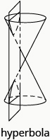

The line through the foci, is called the **transverse axis**. The two points where the transverse axis intersects the hyperbola are each a **vertex** of the hyperbola. The midpoint of the segment joining the foci is called the **center** of the hyperbola. The line perpendicular to the transverse axis that passes through the center is called the **conjugate axis**. Each piece of the graph is called a **branch** of the hyperbola.

![The figure shows two graphs of a hyperbola. The first graph shows the x-axis and y-axis that both run in the negative and positive directions, but at unlabeled intervals. The center of the hyperbola is the origin. The vertices and foci are shown with points that lie on the transverse axis, which is the x-axis. The branches pass through the vertices and open left and right. The y-axis is the conjugate axis. The second graph shows the x-axis and y-axis that both run in the negative and positive directions, but at unlabeled intervals. The center of the hyperbola is the origin. The vertices and foci lie are shown with points that lie on the transverse axis, which is the y-axis. The branches pass through the vertices and open up and down. The x-axis is the conjugate axis.](../resources/CNX_IntAlg_Figure_11_04_002_img.jpg)

Again our goal is to connect the geometry of a conic with algebra. Placing the hyperbola on a rectangular coordinate system gives us that opportunity. In the figure, we placed the hyperbola so the foci <math xmlns="http://www.w3.org/1998/Math/MathML"><mrow><mrow><mo>(</mo><mrow><mrow><mo>(</mo><mrow><mtext>−</mtext><mi>c</mi><mo>,</mo><mn>0</mn></mrow><mo>)</mo></mrow><mo>,</mo><mrow><mo>(</mo><mrow><mi>c</mi><mo>,</mo><mn>0</mn></mrow><mo>)</mo></mrow></mrow><mo>)</mo></mrow></mrow></math>

 are on the *x*-axis and the center is the origin.

![The figure shows the graph of a hyperbola. The graph shows the x-axis and y-axis that both run in the negative and positive directions, but at unlabeled intervals. The center of the hyperbola is the origin. The foci (negative c, 0) and (c, 0) are marked with a point and lie on the x-axis. The vertices are marked with a point and lie on the x-axis. The branches pass through the vertices and open left and right. The distance from (negative c, 0) to a point on the branch (x, y) is marked d sub 1. The distance from (x, y) on the branch to (c, 0) is marked d sub 2.](../resources/CNX_IntAlg_Figure_11_04_003_img.jpg)

The definition states the difference of the distance from the foci to a point <math xmlns="http://www.w3.org/1998/Math/MathML"><mrow><mrow><mo>(</mo><mrow><mi>x</mi><mo>,</mo><mi>y</mi></mrow><mo>)</mo></mrow></mrow></math>

 is constant. So <math xmlns="http://www.w3.org/1998/Math/MathML"><mrow><mrow><mo>\|</mo><mrow><msub><mi>d</mi><mn>1</mn></msub><mo>−</mo><msub><mi>d</mi><mn>2</mn></msub></mrow><mo>\|</mo></mrow></mrow></math>

 is a constant that we will call <math xmlns="http://www.w3.org/1998/Math/MathML"><mrow><mn>2</mn><mi>a</mi></mrow></math>

 so <math xmlns="http://www.w3.org/1998/Math/MathML"><mrow><mrow><mo>\|</mo><mrow><msub><mi>d</mi><mn>1</mn></msub><mo>−</mo><msub><mi>d</mi><mn>2</mn></msub></mrow><mo>\|</mo></mrow><mo>=</mo><mn>2</mn><mi>a</mi><mo>.</mo></mrow></math>

 We will use the distance formula to lead us to an algebraic formula for an ellipse.

<math xmlns="http://www.w3.org/1998/Math/MathML"><mrow><mtable><mtr><mtd /><mtd /><mtd /><mtd columnalign="right"><mspace width="4em" /><mrow><mo>\|</mo><mrow><msub><mi>d</mi><mn>1</mn></msub></mrow><mspace width="3.5em" /><mo>−</mo><mspace width="3.5em" /><msub><mi>d</mi><mn>2</mn></msub><mo>\|</mo><mspace width="3.2em" /><mo>=</mo><mn>2</mn><mi>a</mi></mrow></mtd></mtr><mtr><mtd columnalign="left"><mtext>Use the distance formula to find</mtext><mspace width="0.2em" /><msub><mi>d</mi><mn>1</mn></msub><mo>,</mo><msub><mi>d</mi><mn>2</mn></msub></mtd><mtd /><mtd /><mtd columnalign="right"><mspace width="2em" /><mrow><mo>\|</mo><mrow><msqrt><mrow><msup><mrow><mrow><mo>(</mo><mrow><mi>x</mi><mo>−</mo><mrow><mo>(</mo><mrow><mo>−</mo><mi>c</mi></mrow><mo>)</mo></mrow></mrow><mo>)</mo></mrow></mrow><mn>2</mn></msup><mo>+</mo><msup><mrow><mrow><mo>(</mo><mrow><mi>y</mi><mo>−</mo><mn>0</mn></mrow><mo>)</mo></mrow></mrow><mn>2</mn></msup></mrow></msqrt><mo>−</mo><msqrt><mrow><msup><mrow><mrow><mo>(</mo><mrow><mi>x</mi><mo>−</mo><mi>c</mi></mrow><mo>)</mo></mrow></mrow><mn>2</mn></msup><mo>+</mo><msup><mrow><mrow><mo>(</mo><mrow><mi>y</mi><mo>−</mo><mn>0</mn></mrow><mo>)</mo></mrow></mrow><mn>2</mn></msup></mrow></msqrt></mrow><mspace width="0.2em" /><mo>\|</mo></mrow><mo>=</mo><mn>2</mn><mi>a</mi></mtd></mtr><mtr><mtd columnalign="left"><mtext>Eliminate the radicals.</mtext></mtd><mtd /><mtd /><mtd /></mtr><mtr><mtd columnalign="left"><mtable><mtr><mtd columnalign="left"><mtext>To simplify the equation of the ellipse, we</mtext></mtd></mtr><mtr><mtd columnalign="left"><mtext>let</mtext><mspace width="0.2em" /><msup><mi>c</mi><mn>2</mn></msup><mo>−</mo><msup><mi>a</mi><mn>2</mn></msup><mo>=</mo><msup><mi>b</mi><mn>2</mn></msup><mo>.</mo></mtd></mtr></mtable></mtd><mtd /><mtd /><mtd columnalign="right"><mspace width="2em" /><mfrac><mrow><msup><mi>x</mi><mn>2</mn></msup></mrow><mrow><msup><mi>a</mi><mn>2</mn></msup></mrow></mfrac><mo>+</mo><mfrac><mrow><msup><mi>y</mi><mn>2</mn></msup></mrow><mrow><msup><mi>c</mi><mn>2</mn></msup><mo>−</mo><msup><mi>a</mi><mn>2</mn></msup></mrow></mfrac><mo>=</mo><mn>1</mn><mspace width="0.53em" /></mtd></mtr><mtr><mtd columnalign="left"><mtable><mtr><mtd columnalign="left"><mtext>So, the equation of a hyperbola centered at</mtext></mtd></mtr><mtr><mtd columnalign="left"><mtext>the origin in standard form is:</mtext></mtd></mtr></mtable></mtd><mtd /><mtd /><mtd columnalign="right"><mspace width="2em" /><mfrac><mrow><msup><mi>x</mi><mn>2</mn></msup></mrow><mrow><msup><mi>a</mi><mn>2</mn></msup></mrow></mfrac><mo>−</mo><mfrac><mrow><msup><mi>y</mi><mn>2</mn></msup></mrow><mrow><msup><mi>b</mi><mn>2</mn></msup></mrow></mfrac><mo>=</mo><mn>1</mn><mspace width="0.53em" /></mtd></mtr></mtable></mrow></math>

To graph the hyperbola, it will be helpful to know about the intercepts. We will find the *x*-intercepts and *y*-intercepts using the formula.

<math xmlns="http://www.w3.org/1998/Math/MathML"><mrow><mtable><mtr><mtd columnalign="left"><mtable><mtr><mtd /><mtd /><mtd /><mtd /><mtd /><mtd columnalign="left"><mspace width="5em" /><mtext mathvariant="bolditalics">x</mtext><mtext mathvariant="bold">-intercepts</mtext></mtd><mtd /><mtd /><mtd /><mtd /><mtd /><mtd /><mtd /><mtd /><mtd /><mtd columnalign="left"><mspace width="9em" /><mtext mathvariant="bolditalics">y</mtext><mtext mathvariant="bold">-intercepts</mtext></mtd></mtr></mtable></mtd></mtr> <mtr><mtd columnalign="left"><mtable><mtr><mtd /><mtd /><mtd /><mtd /><mtd /><mtd columnalign="right"><mfrac><mrow><msup><mi>x</mi><mn>2</mn></msup></mrow><mrow><msup><mi>a</mi><mn>2</mn></msup></mrow></mfrac><mo>−</mo><mfrac><mrow><msup><mi>y</mi><mn>2</mn></msup></mrow><mrow><msup><mi>b</mi><mn>2</mn></msup></mrow></mfrac></mtd><mtd columnalign="left"><mo>=</mo></mtd><mtd columnalign="left"><mn>1</mn></mtd><mtd /><mtd /><mtd /><mtd /><mtd /><mtd /><mtd /><mtd /><mtd /><mtd columnalign="right"><mfrac><mrow><msup><mi>x</mi><mn>2</mn></msup></mrow><mrow><msup><mi>a</mi><mn>2</mn></msup></mrow></mfrac><mo>−</mo><mfrac><mrow><msup><mi>y</mi><mn>2</mn></msup></mrow><mrow><msup><mi>b</mi><mn>2</mn></msup></mrow></mfrac></mtd><mtd columnalign="left"><mo>=</mo></mtd><mtd columnalign="left"><mn>1</mn></mtd></mtr> <mtr><mtd columnalign="left"><mtext>Let</mtext><mspace width="0.2em" /><mi>y</mi><mo>=</mo><mn>0</mn><mo>.</mo></mtd><mtd /><mtd /><mtd /><mtd /><mtd columnalign="right"><mfrac><mrow><msup><mi>x</mi><mn>2</mn></msup></mrow><mrow><msup><mi>a</mi><mn>2</mn></msup></mrow></mfrac><mo>−</mo><mfrac><mrow><msup><mn>0</mn><mn>2</mn></msup></mrow><mrow><msup><mi>b</mi><mn>2</mn></msup></mrow></mfrac></mtd><mtd columnalign="left"><mo>=</mo></mtd><mtd columnalign="left"><mn>1</mn></mtd><mtd /><mtd /><mtd /><mtd /><mtd columnalign="left"><mspace width="3em" /><mtext>Let</mtext><mspace width="0.2em" /><mi>x</mi><mo>=</mo><mn>0</mn><mo>.</mo></mtd><mtd /><mtd /><mtd /><mtd /><mtd columnalign="right"><mfrac><mrow><msup><mn>0</mn><mn>2</mn></msup></mrow><mrow><msup><mi>a</mi><mn>2</mn></msup></mrow></mfrac><mo>−</mo><mfrac><mrow><msup><mi>y</mi><mn>2</mn></msup></mrow><mrow><msup><mi>b</mi><mn>2</mn></msup></mrow></mfrac></mtd><mtd columnalign="left"><mo>=</mo></mtd><mtd columnalign="left"><mn>1</mn></mtd></mtr> <mtr><mtd /><mtd /><mtd /><mtd /><mtd /><mtd columnalign="right"><mfrac><mrow><msup><mi>x</mi><mn>2</mn></msup></mrow><mrow><msup><mi>a</mi><mn>2</mn></msup></mrow></mfrac></mtd><mtd columnalign="left"><mo>=</mo></mtd><mtd columnalign="left"><mn>1</mn></mtd><mtd /><mtd /><mtd /><mtd /><mtd /><mtd /><mtd /><mtd /><mtd /><mtd columnalign="right"><mo>−</mo><mfrac><mrow><msup><mi>y</mi><mn>2</mn></msup></mrow><mrow><msup><mi>b</mi><mn>2</mn></msup></mrow></mfrac></mtd><mtd columnalign="left"><mo>=</mo></mtd><mtd columnalign="left"><mn>1</mn></mtd></mtr> <mtr><mtd /><mtd /><mtd /><mtd /><mtd /><mtd columnalign="right"><msup><mi>x</mi><mn>2</mn></msup></mtd><mtd columnalign="left"><mo>=</mo></mtd><mtd columnalign="left"><msup><mi>a</mi><mn>2</mn></msup></mtd><mtd /><mtd /><mtd /><mtd /><mtd /><mtd /><mtd /><mtd /><mtd /><mtd columnalign="right"><msup><mi>y</mi><mn>2</mn></msup></mtd><mtd columnalign="left"><mo>=</mo></mtd><mtd columnalign="left"><mtext>−</mtext><msup><mi>b</mi><mn>2</mn></msup></mtd></mtr> <mtr><mtd /><mtd /><mtd /><mtd /><mtd /><mtd columnalign="right"><mi>x</mi></mtd><mtd columnalign="left"><mo>=</mo></mtd><mtd columnalign="left"><mtext>±</mtext><mi>a</mi></mtd><mtd /><mtd /><mtd /><mtd /><mtd /><mtd /><mtd /><mtd /><mtd /><mtd columnalign="right"><mi>y</mi></mtd><mtd columnalign="left"><mo>=</mo></mtd><mtd columnalign="left"><mtext>±</mtext><msqrt><mrow><mtext>−</mtext><msup><mi>b</mi><mn>2</mn></msup></mrow></msqrt></mtd></mtr></mtable></mtd></mtr> <mtr><mtd columnalign="left"><mtable><mtr><mtd columnalign="left"><mspace width="2em" /><mtext>The</mtext><mspace width="0.2em" /><mi>x</mi><mtext>-intercepts are</mtext><mspace width="0.2em" /><mrow><mo>(</mo><mrow><mi>a</mi><mo>,</mo><mn>0</mn></mrow><mo>)</mo></mrow><mspace width="0.2em" /><mtext>and</mtext><mspace width="0.2em" /><mrow><mo>(</mo><mrow><mtext>−</mtext><mi>a</mi><mo>,</mo><mn>0</mn></mrow><mo>)</mo></mrow><mo>.</mo></mtd><mtd /><mtd /><mtd /><mtd /><mtd columnalign="left"><mspace width="5em" /><mtext>There are no</mtext><mspace width="0.2em" /><mi>y</mi><mtext>-intercepts.</mtext></mtd></mtr></mtable></mtd></mtr></mtable></mrow></math>

The *a*, *b* values in the equation also help us find the asymptotes of the hyperbola. The asymptotes are intersecting straight lines that the branches of the graph approach but never intersect as the *x*, *y* values get larger and larger.

To find the asymptotes, we sketch a rectangle whose sides intersect the *x*-axis at the vertices <math xmlns="http://www.w3.org/1998/Math/MathML"><mrow><mrow><mo>(</mo><mrow><mtext>−</mtext><mi>a</mi><mo>,</mo><mn>0</mn></mrow><mo>)</mo></mrow><mo>,</mo></mrow></math>

 <math xmlns="http://www.w3.org/1998/Math/MathML"><mrow><mrow><mo>(</mo><mrow><mi>a</mi><mo>,</mo><mn>0</mn></mrow><mo>)</mo></mrow></mrow></math>

 and intersect the *y*-axis at <math xmlns="http://www.w3.org/1998/Math/MathML"><mrow><mrow><mo>(</mo><mrow><mn>0</mn><mo>,</mo><mtext>−</mtext><mi>b</mi></mrow><mo>)</mo></mrow><mo>,</mo></mrow></math>

 <math xmlns="http://www.w3.org/1998/Math/MathML"><mrow><mrow><mo>(</mo><mrow><mn>0</mn><mo>,</mo><mi>b</mi></mrow><mo>)</mo></mrow><mo>.</mo></mrow></math>

 The lines containing the diagonals of this rectangle are the asymptotes of the hyperbola. The rectangle and asymptotes are not part of the hyperbola, but they help us graph the hyperbola.

![The figure shows the graph of a hyperbola. The graph shows the x-axis and y-axis that both run in the negative and positive directions, but at unlabeled intervals. The center of the hyperbola is the origin. The vertices are (negative a, 0) and (a, 0) and are marked with a point and lie on the x-axis. The points (0, b) and (0, negative) lie on the on the y-axis. There is a central rectangle who sides intersect the x-axis at the vertices (negative a, 0) and (a, 0) and intersect the y-axis at (0, b) and (0, negative b). The asymptotes are given by y is equal to b divided by a times x and y is equal to negative b divided by a times x and are drawn as the diagonals of the central rectangle. The branches of the hyperbola pass through the vertices, open left and right, and approach the asymptotes.](../resources/CNX_IntAlg_Figure_11_04_004_img.jpg)

The asymptotes pass through the origin and we can evaluate their slope using the rectangle we sketched. They have equations <math xmlns="http://www.w3.org/1998/Math/MathML"><mrow><mi>y</mi><mo>=</mo><mfrac><mi>b</mi><mi>a</mi></mfrac><mi>x</mi></mrow></math>

 and <math xmlns="http://www.w3.org/1998/Math/MathML"><mrow><mi>y</mi><mo>=</mo><mo>−</mo><mfrac><mi>b</mi><mi>a</mi></mfrac><mi>x</mi><mo>.</mo></mrow></math>

There are two equations for hyperbolas, depending whether the transverse axis is vertical or horizontal. We can tell whether the transverse axis is horizontal by looking at the equation. When the equation is in standard form, if the *x*2-term is positive, the transverse axis is horizontal. When the equation is in standard form, if the *y*2-term is positive, the transverse axis is vertical.

The second equations could be derived similarly to what we have done. We will summarize the results here.

Standard Form of the Equation a Hyperbola with Center
<math xmlns="http://www.w3.org/1998/Math/MathML"><mrow><mrow><mo>(</mo><mrow><mn>0</mn><mo>,</mo><mn>0</mn></mrow><mo>)</mo></mrow></mrow></math>

The standard form of the equation of a hyperbola with center <math xmlns="http://www.w3.org/1998/Math/MathML"><mrow><mrow><mo>(</mo><mrow><mn>0</mn><mo>,</mo><mn>0</mn></mrow><mo>)</mo></mrow><mo>,</mo></mrow></math>

 is

<math xmlns="http://www.w3.org/1998/Math/MathML"><mrow><mfrac><mrow><msup><mi>x</mi><mn>2</mn></msup></mrow><mrow><msup><mi>a</mi><mn>2</mn></msup></mrow></mfrac><mo>−</mo><mfrac><mrow><msup><mi>y</mi><mn>2</mn></msup></mrow><mrow><msup><mi>b</mi><mn>2</mn></msup></mrow></mfrac><mo>=</mo><mn>1</mn><mspace width="2em" /><mtext>or</mtext><mspace width="2em" /><mfrac><mrow><msup><mi>y</mi><mn>2</mn></msup></mrow><mrow><msup><mi>a</mi><mn>2</mn></msup></mrow></mfrac><mo>−</mo><mfrac><mrow><msup><mi>x</mi><mn>2</mn></msup></mrow><mrow><msup><mi>b</mi><mn>2</mn></msup></mrow></mfrac><mo>=</mo><mn>1</mn></mrow></math>

![The figure shows the graph of two hyperbolas. The first graph shows the x-axis and y-axis that both run in the negative and positive directions, but at unlabeled intervals. The center of the hyperbola is the origin. The vertices are (negative a, 0) and (a, 0) and are marked with a point and lie on the x-axis. The points (0, b) and (0, negative) lie on the on the y-axis. There is a central rectangle who sides intersect the x-axis at the vertices (negative a, 0) and (a, 0) and intersect the y-axis at (0, b) and (0, negative b). The asymptotes are given by y is equal to b divided by a times x and y is equal to negative b divided by a times x and are drawn as the diagonals of the central rectangle. The branches of the hyperbola pass through the vertices, open left and right, and approach the asymptotes. The second graph shows the x-axis and y-axis that both run in the negative and positive directions, but at unlabeled intervals. The center of the hyperbola is the origin. The vertices are (0, a) and (0, negative a) and are marked with a point and lie on the y-axis. The points (0, b) and (0, negative) lie on the on the y-axis. There is a central rectangle who sides intersect the y-axis at the vertices (0, a) and (0, negative a) and intersect the y-axis at (negative b, 0) and (b, 0). The branches of the hyperbola pass through the vertices, open up and down, and approach the asymptotes.](../resources/CNX_IntAlg_Figure_11_04_005_img.jpg)

Notice that, unlike the equation of an ellipse, the denominator of <math xmlns="http://www.w3.org/1998/Math/MathML"><mrow><msup><mi>x</mi><mn>2</mn></msup></mrow></math>

 is not always <math xmlns="http://www.w3.org/1998/Math/MathML"><mrow><msup><mi>a</mi><mn>2</mn></msup></mrow></math>

 and the denominator of <math xmlns="http://www.w3.org/1998/Math/MathML"><mrow><msup><mi>y</mi><mn>2</mn></msup></mrow></math>

 is not always <math xmlns="http://www.w3.org/1998/Math/MathML"><mrow><msup><mi>b</mi><mn>2</mn></msup><mo>.</mo></mrow></math>

Notice that when the <math xmlns="http://www.w3.org/1998/Math/MathML"><mrow><msup><mi>x</mi><mn>2</mn></msup></mrow></math>

-term is positive, the transverse axis is on the *x*-axis. When the <math xmlns="http://www.w3.org/1998/Math/MathML"><mrow><msup><mi>y</mi><mn>2</mn></msup></mrow></math>

-term is positive, the transverse axis is on the *y*-axis.

<table summary="The table has three columns and eight rows. The first row is a title row and is labeled &#x2018;Standard Forms of the Equation a Hyperbola with Center (0, 0). The second row is a header row with the first column labeled the quantity x squared divided by a squared end quantity minus the quantity y squared divided by b squared is equal to 1 and the second column labeled the quantity y squared divided by a squared end quantity minus the quantity x squared divided by b squared is equal to 1. The rows are labeled &#x2018;Orientation&#x2019;, &#x2018;Vertices&#x2019;, &#x2018;x-intercepts&#x2019;, &#x2018;y-intercepts&#x2019;, &#x2018;Rectangle&#x2019;, and &#x2018;Asymptotes. In row three, the &#x2018;Orientations&#x2019; are &#x2018;transverse axis on the x-axis; opens left and right&#x2019; and &#x2018;transverse axis on the y-axis; opens up and down&#x2019;. In row four, the &#x2018;Vertices&#x2019; are (negative a, 0) and (a, 0) and (0, negative a) and (0, a). In row five, the x-intercepts are (negative a, 0) and (a, 0) and &#x2018;none). In row six, the y-intercepts are &#x2018;none&#x2019; and (0, negative a) and (0, a). In row seven, the rectangle uses (plus or minus a, 0) and (0, plus or minus) and uses (0, plus or minus a) and (plus or minus b, 0). In row eight, the asymptotes are y is equal to b divided by a times x, y is equal to negative b divided by a times x and y is equal to a divided by b times x and y is equal to negative a divided by b times x." class="unnumbered" data-label=""><thead>
<tr valign="top">
<th colspan="3" data-valign="middle" data-align="center">Standard Forms of the Equation a Hyperbola with Center <math xmlns="http://www.w3.org/1998/Math/MathML"><mrow><mrow><mo>(</mo><mrow><mn>0</mn><mo>,</mo><mn>0</mn></mrow><mo>)</mo></mrow></mrow></math></th>
</tr>
<tr valign="top">
<th data-valign="middle" data-align="center" />
<th data-valign="middle" data-align="center"><math xmlns="http://www.w3.org/1998/Math/MathML"><mrow><mfrac><mrow><msup><mi>x</mi><mn>2</mn></msup></mrow><mrow><msup><mi>a</mi><mn>2</mn></msup></mrow></mfrac><mo>−</mo><mfrac><mrow><msup><mi>y</mi><mn>2</mn></msup></mrow><mrow><msup><mi>b</mi><mn>2</mn></msup></mrow></mfrac><mo>=</mo><mn>1</mn></mrow></math></th>
<th data-valign="middle" data-align="center"><math xmlns="http://www.w3.org/1998/Math/MathML"><mrow><mfrac><mrow><msup><mi>y</mi><mn>2</mn></msup></mrow><mrow><msup><mi>a</mi><mn>2</mn></msup></mrow></mfrac><mo>−</mo><mfrac><mrow><msup><mi>x</mi><mn>2</mn></msup></mrow><mrow><msup><mi>b</mi><mn>2</mn></msup></mrow></mfrac><mo>=</mo><mn>1</mn></mrow></math></th>
</tr>
</thead><tbody>
<tr valign="top">
<td data-valign="middle" data-align="center"><strong>Orientation</strong></td>
<td data-valign="middle" data-align="center">Transverse axis on the <em>x</em>-axis.
Opens left and right</td>
<td data-valign="middle" data-align="center">Transverse axis on the <em>y</em>-axis.
Opens up and down</td>
</tr>
<tr valign="top">
<td data-valign="middle" data-align="center"><strong>Vertices</strong></td>
<td data-valign="middle" data-align="center"><math xmlns="http://www.w3.org/1998/Math/MathML"><mrow><mrow><mo>(</mo><mrow><mtext>−</mtext><mi>a</mi><mo>,</mo><mn>0</mn></mrow><mo>)</mo></mrow><mo>,</mo></mrow></math> <math xmlns="http://www.w3.org/1998/Math/MathML"><mrow><mrow><mo>(</mo><mrow><mi>a</mi><mo>,</mo><mn>0</mn></mrow><mo>)</mo></mrow></mrow></math></td>
<td data-valign="middle" data-align="center"><math xmlns="http://www.w3.org/1998/Math/MathML"><mrow><mrow><mo>(</mo><mrow><mn>0</mn><mo>,</mo><mtext>−</mtext><mi>a</mi></mrow><mo>)</mo></mrow><mo>,</mo></mrow></math> <math xmlns="http://www.w3.org/1998/Math/MathML"><mrow><mrow><mo>(</mo><mrow><mn>0</mn><mo>,</mo><mi>a</mi></mrow><mo>)</mo></mrow></mrow></math></td>
</tr>
<tr valign="top">
<td data-valign="middle" data-align="center"><strong><em>x</em>-intercepts</strong></td>
<td data-valign="middle" data-align="center"><math xmlns="http://www.w3.org/1998/Math/MathML"><mrow><mrow><mo>(</mo><mrow><mtext>−</mtext><mi>a</mi><mo>,</mo><mn>0</mn></mrow><mo>)</mo></mrow><mo>,</mo></mrow></math> <math xmlns="http://www.w3.org/1998/Math/MathML"><mrow><mrow><mo>(</mo><mrow><mi>a</mi><mo>,</mo><mn>0</mn></mrow><mo>)</mo></mrow></mrow></math></td>
<td data-valign="middle" data-align="center">none</td>
</tr>
<tr valign="top">
<td data-valign="middle" data-align="center"><strong><em>y</em>-intercepts</strong></td>
<td data-valign="middle" data-align="center">none</td>
<td data-valign="middle" data-align="center"><math xmlns="http://www.w3.org/1998/Math/MathML"><mrow><mrow><mo>(</mo><mrow><mn>0</mn><mo>,</mo><mtext>−</mtext><mi>a</mi></mrow><mo>)</mo></mrow><mo>,</mo></mrow></math> <math xmlns="http://www.w3.org/1998/Math/MathML"><mrow><mrow><mo>(</mo><mrow><mn>0</mn><mo>,</mo><mi>a</mi></mrow><mo>)</mo></mrow></mrow></math></td>
</tr>
<tr valign="top">
<td data-valign="middle" data-align="center"><strong>Rectangle</strong></td>
<td data-valign="middle" data-align="center">Use <math xmlns="http://www.w3.org/1998/Math/MathML"><mrow><mrow><mo>(</mo><mrow><mtext>±</mtext><mi>a</mi><mo>,</mo><mn>0</mn></mrow><mo>)</mo></mrow></mrow></math> <math xmlns="http://www.w3.org/1998/Math/MathML"><mrow><mrow><mo>(</mo><mrow><mn>0</mn><mo>,</mo><mtext>±</mtext><mi>b</mi></mrow><mo>)</mo></mrow></mrow></math></td>
<td data-valign="middle" data-align="center">Use <math xmlns="http://www.w3.org/1998/Math/MathML"><mrow><mrow><mo>(</mo><mrow><mn>0</mn><mo>,</mo><mtext>±</mtext><mi>a</mi></mrow><mo>)</mo></mrow></mrow></math> <math xmlns="http://www.w3.org/1998/Math/MathML"><mrow><mrow><mo>(</mo><mrow><mtext>±</mtext><mi>b</mi><mo>,</mo><mn>0</mn></mrow><mo>)</mo></mrow></mrow></math></td>
</tr>
<tr valign="top">
<td data-valign="middle" data-align="center"><strong>asymptotes</strong></td>
<td data-valign="middle" data-align="center"><math xmlns="http://www.w3.org/1998/Math/MathML"><mrow><mi>y</mi><mo>=</mo><mfrac><mi>b</mi><mi>a</mi></mfrac><mi>x</mi><mo>,</mo></mrow></math> <math xmlns="http://www.w3.org/1998/Math/MathML"><mrow><mi>y</mi><mo>=</mo><mo>−</mo><mfrac><mi>b</mi><mi>a</mi></mfrac><mi>x</mi></mrow></math></td>
<td data-valign="middle" data-align="center"><math xmlns="http://www.w3.org/1998/Math/MathML"><mrow><mi>y</mi><mo>=</mo><mfrac><mi>a</mi><mi>b</mi></mfrac><mi>x</mi><mo>,</mo></mrow></math> <math xmlns="http://www.w3.org/1998/Math/MathML"><mrow><mi>y</mi><mo>=</mo><mo>−</mo><mfrac><mi>a</mi><mi>b</mi></mfrac><mi>x</mi></mrow></math></td>
</tr>
</tbody></table>

We will use these properties to graph hyperbolas.

How to Graph a Hyperbola with Center
<math xmlns="http://www.w3.org/1998/Math/MathML"><mrow><mrow><mo>(</mo><mrow><mn>0</mn><mo>,</mo><mn>0</mn></mrow><mo>)</mo></mrow></mrow></math>

Graph <math xmlns="http://www.w3.org/1998/Math/MathML"><mrow><mfrac><mrow><msup><mi>x</mi><mn>2</mn></msup></mrow><mrow><mn>25</mn></mrow></mfrac><mo>−</mo><mfrac><mrow><msup><mi>y</mi><mn>2</mn></msup></mrow><mn>4</mn></mfrac><mo>=</mo><mn>1</mn><mo>.</mo></mrow></math>

Graph <math xmlns="http://www.w3.org/1998/Math/MathML"><mrow><mfrac><mrow><msup><mi>x</mi><mn>2</mn></msup></mrow><mrow><mn>16</mn></mrow></mfrac><mo>−</mo><mfrac><mrow><msup><mi>y</mi><mn>2</mn></msup></mrow><mn>4</mn></mfrac><mo>=</mo><mn>1</mn><mo>.</mo></mrow></math>

  

Graph <math xmlns="http://www.w3.org/1998/Math/MathML"><mrow><mfrac><mrow><msup><mi>x</mi><mn>2</mn></msup></mrow><mn>9</mn></mfrac><mo>−</mo><mfrac><mrow><msup><mi>y</mi><mn>2</mn></msup></mrow><mrow><mn>16</mn></mrow></mfrac><mo>=</mo><mn>1</mn><mo>.</mo></mrow></math>

  

We summarize the steps for reference.

Graph a hyperbola centered at
<math xmlns="http://www.w3.org/1998/Math/MathML"><mrow><mrow><mo>(</mo><mrow><mn>0</mn><mo>,</mo><mn>0</mn></mrow><mo>)</mo></mrow><mo>.</mo></mrow></math>

1.  Write the equation in standard form.
2.  Determine whether the transverse axis is horizontal or vertical.
3.  Find the vertices.
4.  Sketch the rectangle centered at the origin intersecting one axis at
    <math xmlns="http://www.w3.org/1998/Math/MathML"><mrow><mtext>±</mtext><mi>a</mi></mrow></math>
    
    and the other at
    <math xmlns="http://www.w3.org/1998/Math/MathML"><mrow><mtext>±</mtext><mi>b</mi><mo>.</mo></mrow></math>

5.  Sketch the asymptotes—the lines through the diagonals of the rectangle.
6.  Draw the two branches of the hyperbola.
{: data-number-style="arabic" .stepwise}

Sometimes the equation for a hyperbola needs to be first placed in standard form before we graph it.

Graph <math xmlns="http://www.w3.org/1998/Math/MathML"><mrow><mn>4</mn><msup><mi>y</mi><mn>2</mn></msup><mo>−</mo><mn>16</mn><msup><mi>x</mi><mn>2</mn></msup><mo>=</mo><mn>64</mn><mo>.</mo></mrow></math>

<table class="unnumbered unstyled" summary="4 y squared minus 16 x squared is equal to 64. To write the equation in standard form, divide each term by 64 to make the equation equal to 1. The quantity 4 y divided by 64 end quantity minus 16 x divided by 64 end quantity is equal to the quantity 64 divided by 64. Simplify. The result is the quantity y squared divided by 16 end quantity minus the quantity x squared divided by 4 end quantity is equal to 1. Since the y-squared term is positive, the transverse axis is vertical. Since a squared is equal to 16, then a is equal to plus or minus 4. The vertices lie on the y-axis and are (0, negative a) and (0, a). The vertices are (0, negative 4) and (0, 4). Since b squared is equal to 4, then b is equal to plus or minus 2. Sketch the rectangle intersecting the x-axis at (negative 2, 0) and (2, 0) and the y-axis at the vertices. Sketch the asymptotes through the diagonals of the rectangle. Draw the two branches of the hyperbola. The graph that results is a rectangle that intersects the x-axis at (plus or minus 2, 0) and the y-axis at (0, plus or minus 4), asymptotes that are the diagonals are the rectangle, and branches that pass through the vertices (0, plus or minus 4), and that open up and down." data-label=""><tbody>
<tr valign="top">
<td data-valign="top" data-align="left" />
<td data-valign="top" data-align="center"><math xmlns="http://www.w3.org/1998/Math/MathML"><mrow><mn>4</mn><msup><mi>y</mi><mn>2</mn></msup><mo>−</mo><mn>16</mn><msup><mi>x</mi><mn>2</mn></msup><mo>=</mo><mn>64</mn></mrow></math></td>
</tr>
<tr valign="top">
<td data-valign="top" data-align="left">To write the equation in standard form, divide
each term by 64 to make the equation equal to 1.</td>
<td data-valign="top" data-align="center"><math xmlns="http://www.w3.org/1998/Math/MathML"><mrow><mfrac><mrow><mn>4</mn><msup><mi>y</mi><mn>2</mn></msup></mrow><mrow><mn>64</mn></mrow></mfrac><mo>−</mo><mfrac><mrow><mn>16</mn><msup><mi>x</mi><mn>2</mn></msup></mrow><mrow><mn>64</mn></mrow></mfrac><mo>=</mo><mfrac><mrow><mn>64</mn></mrow><mrow><mn>64</mn></mrow></mfrac></mrow></math></td>
</tr>
<tr valign="top">
<td data-valign="top" data-align="left">Simplify.</td>
<td data-valign="top" data-align="center"><math xmlns="http://www.w3.org/1998/Math/MathML"><mrow><mspace width="1em" /><mfrac><mrow><msup><mi>y</mi><mn>2</mn></msup></mrow><mrow><mn>16</mn></mrow></mfrac><mo>−</mo><mfrac><mrow><msup><mi>x</mi><mn>2</mn></msup></mrow><mn>4</mn></mfrac><mo>=</mo><mn>1</mn></mrow></math></td>
</tr>
<tr valign="top">
<td data-valign="top" data-align="left">Since the <em>y</em>2-term is positive, the transverse axis is vertical.
Since <math xmlns="http://www.w3.org/1998/Math/MathML"><mrow><msup><mi>a</mi><mn>2</mn></msup><mo>=</mo><mn>16</mn></mrow></math> then <math xmlns="http://www.w3.org/1998/Math/MathML"><mrow><mi>a</mi><mo>=</mo><mtext>±</mtext><mn>4</mn><mo>.</mo></mrow></math></td>
<td data-valign="top" data-align="left" />
</tr>
<tr valign="top">
<td data-valign="top" data-align="left">The vertices are on the <em>y</em>-axis, <math xmlns="http://www.w3.org/1998/Math/MathML"><mrow><mrow><mo>(</mo><mrow><mn>0</mn><mo>,</mo><mtext>−</mtext><mi>a</mi></mrow><mo>)</mo></mrow><mo>,</mo></mrow></math> <math xmlns="http://www.w3.org/1998/Math/MathML"><mrow><mrow><mo>(</mo><mrow><mn>0</mn><mo>,</mo><mi>a</mi></mrow><mo>)</mo><mo>.</mo></mrow></mrow></math>
Since <math xmlns="http://www.w3.org/1998/Math/MathML"><mrow><msup><mi>b</mi><mn>2</mn></msup><mo>=</mo><mn>4</mn></mrow></math> then <math xmlns="http://www.w3.org/1998/Math/MathML"><mrow><mi>b</mi><mo>=</mo><mtext>±</mtext><mn>2</mn><mo>.</mo></mrow></math></td>
<td data-valign="top" data-align="center"><math xmlns="http://www.w3.org/1998/Math/MathML"><mrow><mrow><mo>(</mo><mrow><mn>0</mn><mo>,</mo><mn>−4</mn></mrow><mo>)</mo></mrow><mo>,</mo></mrow></math> <math xmlns="http://www.w3.org/1998/Math/MathML"><mrow><mrow><mo>(</mo><mrow><mn>0</mn><mo>,</mo><mn>4</mn></mrow><mo>)</mo></mrow></mrow></math></td>
</tr>
<tr valign="top">
<td data-valign="top" data-align="left">Sketch the rectangle intersecting the <em>x</em>-axis at <math xmlns="http://www.w3.org/1998/Math/MathML"><mrow><mrow><mo>(</mo><mrow><mn>−2</mn><mo>,</mo><mn>0</mn></mrow><mo>)</mo></mrow><mo>,</mo></mrow></math> <math xmlns="http://www.w3.org/1998/Math/MathML"><mrow><mrow><mo>(</mo><mrow><mn>2</mn><mo>,</mo><mn>0</mn></mrow><mo>)</mo></mrow></mrow></math> and the <em>y</em>-axis at the vertices.
Sketch the asymptotes through the diagonals of the rectangle.
Draw the two branches of the hyperbola.</td>
<td data-valign="top" data-align="left">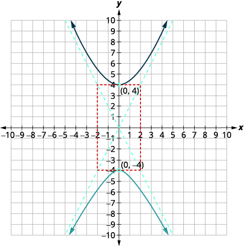</td>
</tr>
</tbody></table>

Graph <math xmlns="http://www.w3.org/1998/Math/MathML"><mrow><mn>4</mn><msup><mi>y</mi><mn>2</mn></msup><mo>−</mo><mn>25</mn><msup><mi>x</mi><mn>2</mn></msup><mo>=</mo><mn>100</mn><mo>.</mo></mrow></math>

  

Graph <math xmlns="http://www.w3.org/1998/Math/MathML"><mrow><mn>25</mn><msup><mi>y</mi><mn>2</mn></msup><mo>−</mo><mn>9</mn><msup><mi>x</mi><mn>2</mn></msup><mo>=</mo><mn>225</mn><mo>.</mo></mrow></math>

  

### Graph a Hyperbola with Center at <math xmlns="http://www.w3.org/1998/Math/MathML"><mrow><mrow><mo>(</mo><mrow><mi>h</mi><mo>,</mo><mi>k</mi></mrow><mo>)</mo></mrow></mrow></math>

Hyperbolas are not always centered at the origin. When a hyperbola is centered at <math xmlns="http://www.w3.org/1998/Math/MathML"><mrow><mrow><mo>(</mo><mrow><mi>h</mi><mo>,</mo><mi>k</mi></mrow><mo>)</mo></mrow></mrow></math>

 the equations changes a bit as reflected in the table.

<table summary="The table has three columns and six rows. The first row is a title row and is labeled &#x2018;Standard Forms of the Equation a Hyperbola with Center (h, k). The second row is a header row with the first column labeled the quantity x minus h squared all divided by a squared end quantity minus the quantity y minus k squared all divided by b squared end quantity is equal to 1 and the second column labeled the quantity y minus k squared all divided by a squared end quantity minus the quantity x minus h squared all divided by b squared end quantity is equal to 1. The rows are labeled &#x2018;Orientation&#x2019;, &#x2018;Center&#x2019;, &#x2018;Vertices&#x2019;, and &#x2018;Rectangle&#x2019;. In row three, the &#x2018;Orientations&#x2019; are &#x2018;transverse axis on the x-axis; opens left and right&#x2019; and &#x2018;transverse axis on the y-axis; opens up and down&#x2019;. In row four, the &#x2018;Centers&#x2019; are both (h, k). In row five, the &#x2018;Vertices&#x2019; are a units to the left and right of the center and a units above and below the center. In row six, the &#x2018;Rectangles&#x2019; are formed by moving a units left or right of the center and b units above or below the center, and by using a units above or below the center and b units left or right of the center." class="unnumbered" data-label=""><thead>
<tr valign="top">
<th colspan="3" data-valign="middle" data-align="center">Standard Forms of the Equation a Hyperbola with Center <math xmlns="http://www.w3.org/1998/Math/MathML"><mrow><mrow><mo>(</mo><mrow><mi>h</mi><mo>,</mo><mi>k</mi></mrow><mo>)</mo></mrow></mrow></math></th>
</tr>
<tr valign="top">
<th data-valign="middle" data-align="center" />
<th data-valign="middle" data-align="center"><math xmlns="http://www.w3.org/1998/Math/MathML"><mrow><mfrac><mrow><msup><mrow><mrow><mo>(</mo><mrow><mi>x</mi><mo>−</mo><mi>h</mi></mrow><mo>)</mo></mrow></mrow><mn>2</mn></msup></mrow><mrow><msup><mi>a</mi><mn>2</mn></msup></mrow></mfrac><mo>−</mo><mfrac><mrow><msup><mrow><mrow><mo>(</mo><mrow><mi>y</mi><mo>−</mo><mi>k</mi></mrow><mo>)</mo></mrow></mrow><mn>2</mn></msup></mrow><mrow><msup><mi>b</mi><mn>2</mn></msup></mrow></mfrac><mo>=</mo><mn>1</mn></mrow></math></th>
<th data-valign="middle" data-align="center"><math xmlns="http://www.w3.org/1998/Math/MathML"><mrow><mfrac><mrow><msup><mrow><mrow><mo>(</mo><mrow><mi>y</mi><mo>−</mo><mi>k</mi></mrow><mo>)</mo></mrow></mrow><mn>2</mn></msup></mrow><mrow><msup><mi>a</mi><mn>2</mn></msup></mrow></mfrac><mo>−</mo><mfrac><mrow><msup><mrow><mrow><mo>(</mo><mrow><mi>x</mi><mo>−</mo><mi>h</mi></mrow><mo>)</mo></mrow></mrow><mn>2</mn></msup></mrow><mrow><msup><mi>b</mi><mn>2</mn></msup></mrow></mfrac><mo>=</mo><mn>1</mn></mrow></math></th>
</tr>
</thead><tbody>
<tr valign="top">
<td data-valign="middle" data-align="center"><strong>Orientation</strong></td>
<td data-valign="middle" data-align="center">Transverse axis is horizontal.
Opens left and right</td>
<td data-valign="middle" data-align="center">Transverse axis is vertical.
Opens up and down</td>
</tr>
<tr valign="top">
<td data-valign="middle" data-align="center"><strong>Center</strong></td>
<td data-valign="middle" data-align="center"><math xmlns="http://www.w3.org/1998/Math/MathML"><mrow><mrow><mo>(</mo><mrow><mi>h</mi><mo>,</mo><mi>k</mi></mrow><mo>)</mo></mrow></mrow></math></td>
<td data-valign="middle" data-align="center"><math xmlns="http://www.w3.org/1998/Math/MathML"><mrow><mrow><mo>(</mo><mrow><mi>h</mi><mo>,</mo><mi>k</mi></mrow><mo>)</mo></mrow></mrow></math></td>
</tr>
<tr valign="top">
<td data-valign="middle" data-align="center"><strong>Vertices</strong></td>
<td data-valign="middle" data-align="center"><em>a</em> units to the left and right of the center</td>
<td data-valign="middle" data-align="center"><em>a</em> units above and below the center</td>
</tr>
<tr valign="top">
<td data-valign="middle" data-align="center"><strong>Rectangle</strong></td>
<td data-valign="middle" data-align="center">Use <em>a</em> units left/right of center
<em>b</em> units above/ below the center</td>
<td data-valign="middle" data-align="center">Use <em>a</em> units above/below the center
<em>b</em> units left/right of center</td>
</tr>
</tbody></table>

How to Graph a Hyperbola with Center
<math xmlns="http://www.w3.org/1998/Math/MathML"><mrow><mrow><mo>(</mo><mrow><mi>h</mi><mo>,</mo><mi>k</mi></mrow><mo>)</mo></mrow></mrow></math>

Graph <math xmlns="http://www.w3.org/1998/Math/MathML"><mrow><mfrac><mrow><msup><mrow><mrow><mo>(</mo><mrow><mi>x</mi><mo>−</mo><mn>1</mn></mrow><mo>)</mo></mrow></mrow><mn>2</mn></msup></mrow><mn>9</mn></mfrac><mo>−</mo><mfrac><mrow><msup><mrow><mrow><mo>(</mo><mrow><mi>y</mi><mo>−</mo><mn>2</mn></mrow><mo>)</mo></mrow></mrow><mn>2</mn></msup></mrow><mrow><mn>16</mn></mrow></mfrac><mo>=</mo><mn>1</mn></mrow></math>

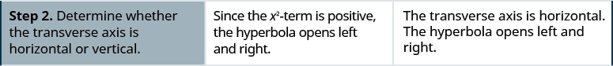

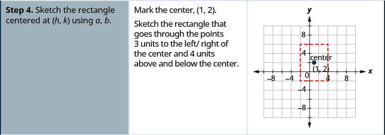

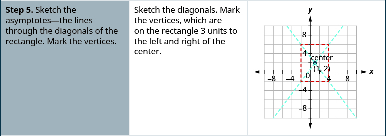

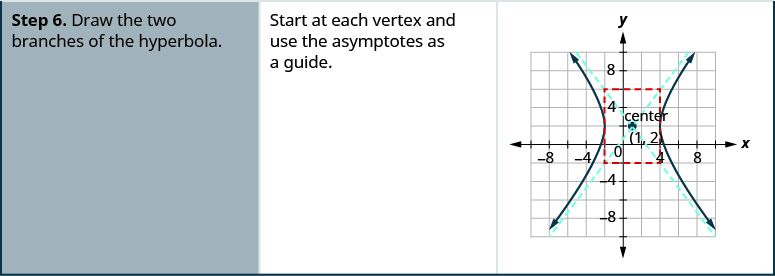

Graph <math xmlns="http://www.w3.org/1998/Math/MathML"><mrow><mfrac><mrow><msup><mrow><mrow><mo>(</mo><mrow><mi>x</mi><mo>−</mo><mn>3</mn></mrow><mo>)</mo></mrow></mrow><mn>2</mn></msup></mrow><mrow><mn>25</mn></mrow></mfrac><mo>−</mo><mfrac><mrow><msup><mrow><mrow><mo>(</mo><mrow><mi>y</mi><mo>−</mo><mn>1</mn></mrow><mo>)</mo></mrow></mrow><mn>2</mn></msup></mrow><mn>9</mn></mfrac><mo>=</mo><mn>1</mn><mo>.</mo></mrow></math>

  

Graph <math xmlns="http://www.w3.org/1998/Math/MathML"><mrow><mfrac><mrow><msup><mrow><mrow><mo>(</mo><mrow><mi>x</mi><mo>−</mo><mn>2</mn></mrow><mo>)</mo></mrow></mrow><mn>2</mn></msup></mrow><mn>4</mn></mfrac><mo>−</mo><mfrac><mrow><msup><mrow><mrow><mo>(</mo><mrow><mi>y</mi><mo>−</mo><mn>2</mn></mrow><mo>)</mo></mrow></mrow><mn>2</mn></msup></mrow><mn>9</mn></mfrac><mo>=</mo><mn>1</mn><mo>.</mo></mrow></math>

  

We summarize the steps for easy reference.

Graph a hyperbola centered at
<math xmlns="http://www.w3.org/1998/Math/MathML"><mrow><mrow><mo>(</mo><mrow><mi>h</mi><mo>,</mo><mi>k</mi></mrow><mo>)</mo></mrow><mo>.</mo></mrow></math>

1.  Write the equation in standard form.
2.  Determine whether the transverse axis is horizontal or vertical.
3.  Find the center and *a, b*.
4.  Sketch the rectangle centered at
    <math xmlns="http://www.w3.org/1998/Math/MathML"><mrow><mrow><mo>(</mo><mrow><mi>h</mi><mo>,</mo><mi>k</mi></mrow><mo>)</mo></mrow></mrow></math>
    
    using *a, b*.
5.  Sketch the asymptotes—the lines through the diagonals of the rectangle. Mark the vertices.
6.  Draw the two branches of the hyperbola.
{: data-number-style="arabic" .stepwise}

Be careful as you identify the center. The standard equation has <math xmlns="http://www.w3.org/1998/Math/MathML"><mrow><mi>x</mi><mo>−</mo><mi>h</mi></mrow></math>

 and <math xmlns="http://www.w3.org/1998/Math/MathML"><mrow><mi>y</mi><mo>−</mo><mi>k</mi></mrow></math>

 with the center as <math xmlns="http://www.w3.org/1998/Math/MathML"><mrow><mrow><mo>(</mo><mrow><mi>h</mi><mo>,</mo><mi>k</mi></mrow><mo>)</mo></mrow><mo>.</mo></mrow></math>

Graph <math xmlns="http://www.w3.org/1998/Math/MathML"><mrow><mfrac><mrow><msup><mrow><mrow><mo>(</mo><mrow><mi>y</mi><mo>+</mo><mn>2</mn></mrow><mo>)</mo></mrow></mrow><mn>2</mn></msup></mrow><mn>9</mn></mfrac><mo>−</mo><mfrac><mrow><msup><mrow><mrow><mo>(</mo><mrow><mi>x</mi><mo>+</mo><mn>1</mn></mrow><mo>)</mo></mrow></mrow><mn>2</mn></msup></mrow><mn>4</mn></mfrac><mo>=</mo><mn>1</mn><mo>.</mo></mrow></math>

<table class="unnumbered unstyled" summary="The quantity y plus 2 squared all divided by 9 end quantity minus the quantity x plus 1 all divided by 4 end quantity is equal to 1. Since the y squared term is positive, the hyperbola opens up and down. The expression y minus k is given by y minus negative 2 and the expression x minus h is given by x minus negative 1. Find the center, (h, k). Find a and b. The center is (negative 1, negative 2) and a is equal to 3 and b is equal to 2. Sketch the rectangle that goes through the points 3 units above and below the center and 2 units to the left and right of the center. Sketch the asymptotes, the lines through the diagonals of the rectangle. One asymptote passes through (negative 3, negative 5) and (1, 1) and the other passes through (negative 3, 1) and (1, negative 5) Mark the vertices. Graph the branches, which pass through the vertices (negative 3, negative 2) and (1, negative 2) and open up and down." data-label=""><tbody>
<tr valign="top">
<td data-valign="top" data-align="left" />
<td data-valign="top" data-align="left"></td>
</tr>
<tr valign="top">
<td data-valign="top" data-align="left">Since the <math xmlns="http://www.w3.org/1998/Math/MathML"><mrow><msup><mi>y</mi><mn>2</mn></msup><mtext>-</mtext></mrow></math>term is positive, the hyperbola
opens up and down.</td>
<td data-valign="top" data-align="left"></td>
</tr>
<tr valign="top">
<td data-valign="top" data-align="left">Find the center, <math xmlns="http://www.w3.org/1998/Math/MathML"><mrow><mrow><mo>(</mo><mrow><mi>h</mi><mo>,</mo><mi>k</mi></mrow><mo>)</mo></mrow><mo>.</mo></mrow></math></td>
<td data-valign="top" data-align="center">Center: <math xmlns="http://www.w3.org/1998/Math/MathML"><mrow><mrow><mo>(</mo><mrow><mn>−1</mn><mo>,</mo><mn>−2</mn></mrow><mo>)</mo></mrow></mrow></math></td>
</tr>
<tr valign="top">
<td data-valign="top" data-align="left">Find <em>a, b</em>.</td>
<td data-valign="top" data-align="center"><math xmlns="http://www.w3.org/1998/Math/MathML"><mrow><mi>a</mi><mo>=</mo><mn>3</mn></mrow></math> <math xmlns="http://www.w3.org/1998/Math/MathML"><mrow><mi>b</mi><mo>=</mo><mn>2</mn></mrow></math></td>
</tr>
<tr valign="top">
<td data-valign="top" data-align="left">Sketch the rectangle that goes through the
points 3 units above and below the center and
2 units to the left/right of the center.
Sketch the asymptotes—the lines through the
diagonals of the rectangle.
Mark the vertices.
Graph the branches.</td>
<td data-valign="top" data-align="left">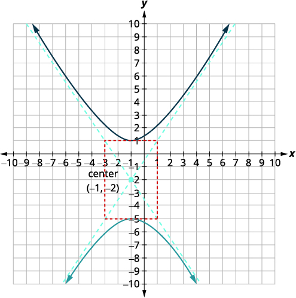</td>
</tr>
</tbody></table>

Graph <math xmlns="http://www.w3.org/1998/Math/MathML"><mrow><mfrac><mrow><msup><mrow><mrow><mo>(</mo><mrow><mi>y</mi><mo>+</mo><mn>3</mn></mrow><mo>)</mo></mrow></mrow><mn>2</mn></msup></mrow><mrow><mn>16</mn></mrow></mfrac><mo>−</mo><mfrac><mrow><msup><mrow><mrow><mo>(</mo><mrow><mi>x</mi><mo>+</mo><mn>2</mn></mrow><mo>)</mo></mrow></mrow><mn>2</mn></msup></mrow><mn>9</mn></mfrac><mo>=</mo><mn>1</mn><mo>.</mo></mrow></math>

  

Graph <math xmlns="http://www.w3.org/1998/Math/MathML"><mrow><mfrac><mrow><msup><mrow><mrow><mo>(</mo><mrow><mi>y</mi><mo>+</mo><mn>2</mn></mrow><mo>)</mo></mrow></mrow><mn>2</mn></msup></mrow><mn>9</mn></mfrac><mo>−</mo><mfrac><mrow><msup><mrow><mrow><mo>(</mo><mrow><mi>x</mi><mo>+</mo><mn>2</mn></mrow><mo>)</mo></mrow></mrow><mn>2</mn></msup></mrow><mn>9</mn></mfrac><mo>=</mo><mn>1</mn><mo>.</mo></mrow></math>

  

Again, sometimes we have to put the equation in standard form as our first step.

Write the equation in standard form and graph <math xmlns="http://www.w3.org/1998/Math/MathML"><mrow><mn>4</mn><msup><mi>x</mi><mn>2</mn></msup><mo>−</mo><mn>9</mn><msup><mi>y</mi><mn>2</mn></msup><mo>−</mo><mn>24</mn><mi>x</mi><mo>−</mo><mn>36</mn><mi>y</mi><mo>−</mo><mn>36</mn><mo>=</mo><mn>0</mn><mo>.</mo></mrow></math>

<table class="unnumbered unstyled can-break" summary="4 x squared minus 9 y squared minus 24 x minus 36 y minus 36 is equal to 0. To get to standard form, complete the squares. 4 times the quantity x squared minus 6 x blank end quantity minus 9 times the quantity y squared plus 4 y blank) end quantity is equal to 36. 4 times the quantity x squared minus 6 x plus 9 end quantity minus 9 times the quantity y squared plus 4 y plus 4 end quantity is equal to 36 plus 36 minus 36. 4 times the quantity x minus 3 squared minus 9 times the quantity y plus 2 squared is equal to 36. Divide each term by 36 to get the constant to be 1. 4 times the quantity x minus 3 squared all divided by 36 minus 9 times the quantity y plus 2 squared all divided by 36 is equal to 36 divided by 36. The result is the quantity x minus 3 squared all divided by 36 minus the quantity y plus 2 squared all divided by 4 is equal to 1. Since the x squared term is positive, the hyperbola opens left and right. Find the center, (h, k). The center is (3, negative 2). Find a and b. a is equal to 3 and b is equal to 4. Sketch the rectangle that goes through the points 3 units to the left and right of the center and 2 units above and below the center. Sketch the asymptotes, the lines through the diagonals of the rectangle. One asymptote passes through (0, 0) and (6, negative 4) and the other passes through (0, negative 4) and (6, 0). Mark the vertices at (0, negative 2) and (6, negative 2). Graph the branches, making sure that they pass through the vertices." data-label=""><tbody>
<tr valign="top">
<td data-valign="top" data-align="left" />
<td data-valign="top" data-align="left"></td>
</tr>
<tr valign="top">
<td data-valign="top" data-align="left">To get to standard form, complete the squares.</td>
<td data-valign="top" data-align="left"></td>
</tr>
<tr valign="top">
<td data-valign="top" data-align="left" />
<td data-valign="top" data-align="left"></td>
</tr>
<tr valign="top">
<td data-valign="top" data-align="left" />
<td data-valign="top" data-align="left"></td>
</tr>
<tr valign="top">
<td data-valign="top" data-align="left">Divide each term by 36 to get the constant to be 1.</td>
<td data-valign="top" data-align="left"></td>
</tr>
<tr valign="top">
<td data-valign="top" data-align="left" />
<td data-valign="top" data-align="left"></td>
</tr>
<tr valign="top">
<td data-valign="top" data-align="left">Since the <math xmlns="http://www.w3.org/1998/Math/MathML"><mrow><msup><mi>x</mi><mn>2</mn></msup><mtext>-</mtext></mrow></math>term is positive, the hyperbola
opens left and right.</td>
<td data-valign="top" data-align="center" />
</tr>
<tr valign="top">
<td data-valign="top" data-align="left">Find the center, <math xmlns="http://www.w3.org/1998/Math/MathML"><mrow><mrow><mo>(</mo><mrow><mi>h</mi><mo>,</mo><mi>k</mi></mrow><mo>)</mo></mrow><mo>.</mo></mrow></math></td>
<td data-valign="top" data-align="center">Center: <math xmlns="http://www.w3.org/1998/Math/MathML"><mrow><mrow><mo>(</mo><mrow><mn>3</mn><mo>,</mo><mn>−2</mn></mrow><mo>)</mo></mrow></mrow></math></td>
</tr>
<tr valign="top">
<td data-valign="top" data-align="left">Find <em>a, b</em>.</td>
<td data-valign="top" data-align="center"><math xmlns="http://www.w3.org/1998/Math/MathML"><mtable><mtr><mtd columnalign="left"><mi>a</mi><mo>=</mo><mn>3</mn></mtd></mtr><mtr><mtd columnalign="left"><mi>b</mi><mo>=</mo><mn>4</mn></mtd></mtr></mtable></math></td>
</tr>
<tr valign="top">
<td data-valign="top" data-align="left">Sketch the rectangle that goes through the
points 3 units to the left/right of the center
and 2 units above and below the center.
Sketch the asymptotes—the lines through the
diagonals of the rectangle.
Mark the vertices.
Graph the branches.</td>
<td data-valign="top" data-align="left">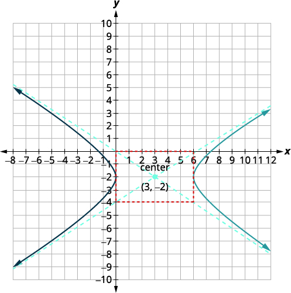</td>
</tr>
</tbody></table>

ⓐ Write the equation in standard form and ⓑ graph <math xmlns="http://www.w3.org/1998/Math/MathML"><mrow><mn>9</mn><msup><mi>x</mi><mn>2</mn></msup><mo>−</mo><mn>16</mn><msup><mi>y</mi><mn>2</mn></msup><mo>+</mo><mn>18</mn><mi>x</mi><mo>+</mo><mn>64</mn><mi>y</mi><mo>−</mo><mn>199</mn><mo>=</mo><mn>0</mn><mo>.</mo></mrow></math>

ⓐ <math xmlns="http://www.w3.org/1998/Math/MathML"><mrow><mfrac><mrow><msup><mrow><mrow><mo>(</mo><mrow><mi>x</mi><mo>+</mo><mn>1</mn></mrow><mo>)</mo></mrow></mrow><mn>2</mn></msup></mrow><mrow><mn>16</mn></mrow></mfrac><mo>−</mo><mfrac><mrow><msup><mrow><mrow><mo>(</mo><mrow><mi>y</mi><mo>−</mo><mn>2</mn></mrow><mo>)</mo></mrow></mrow><mn>2</mn></msup></mrow><mn>9</mn></mfrac><mo>=</mo><mn>1</mn></mrow></math>

* * *
{: data-type="newline"}

 ⓑ* * *
{: data-type="newline"}

  

ⓐ Write the equation in standard form and ⓑ graph <math xmlns="http://www.w3.org/1998/Math/MathML"><mrow><mn>16</mn><msup><mi>x</mi><mn>2</mn></msup><mo>−</mo><mn>25</mn><msup><mi>y</mi><mn>2</mn></msup><mo>+</mo><mn>96</mn><mi>x</mi><mo>−</mo><mn>50</mn><mi>y</mi><mo>−</mo><mn>281</mn><mo>=</mo><mn>0</mn><mo>.</mo></mrow></math>

ⓐ <math xmlns="http://www.w3.org/1998/Math/MathML"><mrow><mfrac><mrow><msup><mrow><mrow><mo>(</mo><mrow><mi>x</mi><mo>+</mo><mn>3</mn></mrow><mo>)</mo></mrow></mrow><mn>2</mn></msup></mrow><mrow><mn>25</mn></mrow></mfrac><mo>−</mo><mfrac><mrow><msup><mrow><mrow><mo>(</mo><mrow><mi>y</mi><mo>+</mo><mn>1</mn></mrow><mo>)</mo></mrow></mrow><mn>2</mn></msup></mrow><mrow><mn>16</mn></mrow></mfrac><mo>=</mo><mn>1</mn></mrow></math>

* * *
{: data-type="newline"}

 ⓑ* * *
{: data-type="newline"}

  

### Identify Conic Sections by their Equations

Now that we have completed our study of the conic sections, we will take a look at the different equations and recognize some ways to identify a conic by its equation. When we are given an equation to graph, it is helpful to identify the conic so we know what next steps to take.

To identify a conic from its equation, it is easier if we put the variable terms on one side of the equation and the constants on the other.

| Conic | Characteristics of <math xmlns="http://www.w3.org/1998/Math/MathML"><mrow><msup><mi>x</mi><mn>2</mn></msup><mtext>-</mtext></mrow></math>

 and <math xmlns="http://www.w3.org/1998/Math/MathML"><mrow><msup><mi>y</mi><mn>2</mn></msup><mtext>-</mtext></mrow></math>

 terms | Example |
{: valign="top"}|----------
| **Parabola** | Either <math xmlns="http://www.w3.org/1998/Math/MathML"><mrow><msup><mi>x</mi><mn>2</mn></msup></mrow></math>

 OR <math xmlns="http://www.w3.org/1998/Math/MathML"><mrow><msup><mi>y</mi><mn>2</mn></msup><mo>.</mo></mrow></math>

 Only one variable is squared. | <math xmlns="http://www.w3.org/1998/Math/MathML"><mrow><mi>x</mi><mo>=</mo><mn>3</mn><msup><mi>y</mi><mn>2</mn></msup><mo>−</mo><mn>2</mn><mi>y</mi><mo>+</mo><mn>1</mn></mrow></math>

 |
{: valign="top"}| **Circle** | <math xmlns="http://www.w3.org/1998/Math/MathML"><mrow><msup><mi>x</mi><mn>2</mn></msup><mtext>-</mtext></mrow></math>

 and <math xmlns="http://www.w3.org/1998/Math/MathML"><mrow><msup><mi>y</mi><mn>2</mn></msup><mtext>-</mtext></mrow></math>

 terms have the same coefficients | <math xmlns="http://www.w3.org/1998/Math/MathML"><mrow><msup><mi>x</mi><mn>2</mn></msup><mo>+</mo><msup><mi>y</mi><mn>2</mn></msup><mo>=</mo><mn>49</mn></mrow></math>

 |
{: valign="top"}| **Ellipse** | <math xmlns="http://www.w3.org/1998/Math/MathML"><mrow><msup><mi>x</mi><mn>2</mn></msup><mtext>-</mtext></mrow></math>

 and <math xmlns="http://www.w3.org/1998/Math/MathML"><mrow><msup><mi>y</mi><mn>2</mn></msup><mtext>-</mtext></mrow></math>

 terms have the **same** sign, different coefficients | <math xmlns="http://www.w3.org/1998/Math/MathML"><mrow><mn>4</mn><msup><mi>x</mi><mn>2</mn></msup><mo>+</mo><mn>25</mn><msup><mi>y</mi><mn>2</mn></msup><mo>=</mo><mn>100</mn></mrow></math>

 |
{: valign="top"}| **Hyperbola** | <math xmlns="http://www.w3.org/1998/Math/MathML"><mrow><msup><mi>x</mi><mn>2</mn></msup><mtext>-</mtext></mrow></math>

 and <math xmlns="http://www.w3.org/1998/Math/MathML"><mrow><msup><mi>y</mi><mn>2</mn></msup><mtext>-</mtext></mrow></math>

 terms have **different** signs, different coefficients | <math xmlns="http://www.w3.org/1998/Math/MathML"><mrow><mn>25</mn><msup><mi>y</mi><mn>2</mn></msup><mo>−</mo><mn>4</mn><msup><mi>x</mi><mn>2</mn></msup><mo>=</mo><mn>100</mn></mrow></math>

 |
{: valign="top"}{: summary="This table has three columns and five rows. The first row is a header row and it labels each column, &#x201C;Conic,&#x201D; &#x201C;Characteristics of x squared and y squared terms,&#x201D; and &#x201C;Example.&#x201D; The first column is a header column and it labels each row &#x201C;Parabola,&#x201D; &#x201C;Circle,&#x201D; &#x201C;Ellipse,&#x201D;, and &#x201C;Hyperbola.&#x201D; In row two, the Parabola is described as having either x squared or y squared and only one variable squared and the example is x is equal to 3 y squared minus 2 y plus 1. In row three, the Circle is described as having x squared and y squared terms with the same coefficients and the example is x squared plus y squared is equal to 49. In row four, the Ellipse is described as having x squared and y squared terms that have the same sign and different coefficients and the example is 4 x squared plus 25 y squared is equal to 100. In row five, the Hyperbola is described as having x squared and y squared terms that have different signs and different coefficients and the example is 25 y squared minus 4 x squared is equal to 100." .unnumbered data-label=""}

Identify the graph of each equation as a circle, parabola, ellipse, or hyperbola.

ⓐ <math xmlns="http://www.w3.org/1998/Math/MathML"><mrow><mn>9</mn><msup><mi>x</mi><mn>2</mn></msup><mo>+</mo><mn>4</mn><msup><mi>y</mi><mn>2</mn></msup><mo>+</mo><mn>56</mn><mi>y</mi><mo>+</mo><mn>160</mn><mo>=</mo><mn>0</mn></mrow></math>

* * *
{: data-type="newline"}

ⓑ <math xmlns="http://www.w3.org/1998/Math/MathML"><mrow><mn>9</mn><msup><mi>x</mi><mn>2</mn></msup><mo>−</mo><mn>16</mn><msup><mi>y</mi><mn>2</mn></msup><mo>+</mo><mn>18</mn><mi>x</mi><mo>+</mo><mn>64</mn><mi>y</mi><mo>−</mo><mn>199</mn><mo>=</mo><mn>0</mn></mrow></math>

* * *
{: data-type="newline"}

ⓒ <math xmlns="http://www.w3.org/1998/Math/MathML"><mrow><msup><mi>x</mi><mn>2</mn></msup><mo>+</mo><msup><mi>y</mi><mn>2</mn></msup><mo>−</mo><mn>6</mn><mi>x</mi><mo>−</mo><mn>8</mn><mi>y</mi><mo>=</mo><mn>0</mn></mrow></math>

* * *
{: data-type="newline"}

ⓓ <math xmlns="http://www.w3.org/1998/Math/MathML"><mrow><mi>y</mi><mo>=</mo><mn>−2</mn><msup><mi>x</mi><mn>2</mn></msup><mo>−</mo><mn>4</mn><mi>x</mi><mo>−</mo><mn>5</mn></mrow></math>

ⓐ* * *
{: data-type="newline"}

 <math xmlns="http://www.w3.org/1998/Math/MathML"><mrow><mtable><mtr><mtd /><mtd /><mtd /><mtd columnalign="center"><mspace width="6em" /><mn>9</mn><msup><mi>x</mi><mn>2</mn></msup><mo>+</mo><mn>4</mn><msup><mi>y</mi><mn>2</mn></msup><mo>+</mo><mn>56</mn><mi>y</mi><mo>+</mo><mn>160</mn><mo>=</mo><mn>0</mn></mtd></mtr><mtr><mtd columnalign="left"><mtable><mtr><mtd columnalign="left"><mtext>The</mtext><mspace width="0.2em" /><msup><mi>x</mi><mn>2</mn></msup><mtext>-</mtext><mspace width="0.2em" /><mtext>and</mtext><mspace width="0.2em" /><msup><mi>y</mi><mn>2</mn></msup><mtext>-terms have the same sign and</mtext></mtd></mtr><mtr><mtd columnalign="left"><mtext>different coefficients.</mtext></mtd></mtr></mtable></mtd><mtd /><mtd /><mtd columnalign="center"><mspace width="6em" /><mtext>Ellipse</mtext></mtd></mtr></mtable></mrow></math>

* * *
{: data-type="newline"}

* * *
{: data-type="newline"}

 ⓑ* * *
{: data-type="newline"}

 <math xmlns="http://www.w3.org/1998/Math/MathML"><mrow><mtable><mtr><mtd /><mtd /><mtd /><mtd columnalign="center"><mspace width="4em" /><mn>9</mn><msup><mi>x</mi><mn>2</mn></msup><mo>−</mo><mn>16</mn><msup><mi>y</mi><mn>2</mn></msup><mo>+</mo><mn>18</mn><mi>x</mi><mo>+</mo><mn>64</mn><mi>y</mi><mo>−</mo><mn>199</mn><mo>=</mo><mn>0</mn></mtd></mtr><mtr><mtd columnalign="left"><mtable><mtr><mtd columnalign="left"><mtext>The</mtext><mspace width="0.2em" /><msup><mi>x</mi><mn>2</mn></msup><mtext>-</mtext><mspace width="0.2em" /><mtext>and</mtext><mspace width="0.2em" /><msup><mi>y</mi><mn>2</mn></msup><mtext>-terms have different signs and</mtext></mtd></mtr><mtr><mtd columnalign="left"><mtext>different coefficients.</mtext></mtd></mtr></mtable></mtd><mtd /><mtd /><mtd columnalign="center"><mspace width="4em" /><mtext>Hyperbola</mtext></mtd></mtr></mtable></mrow></math>

* * *
{: data-type="newline"}

* * *
{: data-type="newline"}

 ⓒ* * *
{: data-type="newline"}

 <math xmlns="http://www.w3.org/1998/Math/MathML"><mrow><mtable><mtr><mtd /><mtd /><mtd /><mtd columnalign="center"><mspace width="5.5em" /><msup><mi>x</mi><mn>2</mn></msup><mo>+</mo><msup><mi>y</mi><mn>2</mn></msup><mo>−</mo><mn>6</mn><mi>x</mi><mo>−</mo><mn>8</mn><mi>y</mi><mo>=</mo><mn>0</mn></mtd></mtr><mtr><mtd columnalign="left"><mtext>The</mtext><mspace width="0.2em" /><msup><mi>x</mi><mn>2</mn></msup><mtext>-</mtext><mspace width="0.2em" /><mtext>and</mtext><mspace width="0.2em" /><msup><mi>y</mi><mn>2</mn></msup><mtext>-terms have the same coefficients.</mtext></mtd><mtd /><mtd /><mtd columnalign="center"><mspace width="5.5em" /><mtext>Circle</mtext></mtd></mtr></mtable></mrow></math>

* * *
{: data-type="newline"}

* * *
{: data-type="newline"}

 ⓓ* * *
{: data-type="newline"}

 <math xmlns="http://www.w3.org/1998/Math/MathML"><mrow><mtable><mtr><mtd /><mtd /><mtd /><mtd columnalign="center"><mspace width="12em" /><mi>y</mi><mo>=</mo><mn>−2</mn><msup><mi>x</mi><mn>2</mn></msup><mo>−</mo><mn>4</mn><mi>x</mi><mo>−</mo><mn>5</mn></mtd></mtr><mtr><mtd columnalign="left"><mtext>Only one variable,</mtext><mspace width="0.2em" /><mi>x</mi><mo>,</mo><mspace width="0.2em" /><mtext>is squared.</mtext></mtd><mtd /><mtd /><mtd columnalign="center"><mspace width="13em" /><mtext>Parabola</mtext></mtd></mtr></mtable></mrow></math>

Identify the graph of each equation as a circle, parabola, ellipse, or hyperbola.

ⓐ <math xmlns="http://www.w3.org/1998/Math/MathML"><mrow><msup><mi>x</mi><mn>2</mn></msup><mo>+</mo><msup><mi>y</mi><mn>2</mn></msup><mo>−</mo><mn>8</mn><mi>x</mi><mo>−</mo><mn>6</mn><mi>y</mi><mo>=</mo><mn>0</mn></mrow></math>

* * *
{: data-type="newline"}

ⓑ <math xmlns="http://www.w3.org/1998/Math/MathML"><mrow><mn>4</mn><msup><mi>x</mi><mn>2</mn></msup><mo>+</mo><mn>25</mn><msup><mi>y</mi><mn>2</mn></msup><mo>=</mo><mn>100</mn></mrow></math>

* * *
{: data-type="newline"}

ⓒ <math xmlns="http://www.w3.org/1998/Math/MathML"><mrow><mi>y</mi><mo>=</mo><mn>6</mn><msup><mi>x</mi><mn>2</mn></msup><mo>+</mo><mn>2</mn><mi>x</mi><mo>−</mo><mn>1</mn></mrow></math>

* * *
{: data-type="newline"}

ⓓ <math xmlns="http://www.w3.org/1998/Math/MathML"><mrow><mn>16</mn><msup><mi>y</mi><mn>2</mn></msup><mo>−</mo><mn>9</mn><msup><mi>x</mi><mn>2</mn></msup><mo>=</mo><mn>144</mn></mrow></math>

ⓐ circle ⓑ ellipse ⓒ parabola ⓓ hyperbola

Identify the graph of each equation as a circle, parabola, ellipse, or hyperbola.

ⓐ <math xmlns="http://www.w3.org/1998/Math/MathML"><mrow><mn>16</mn><msup><mi>x</mi><mn>2</mn></msup><mo>+</mo><mn>9</mn><msup><mi>y</mi><mn>2</mn></msup><mo>=</mo><mn>144</mn></mrow></math>

* * *
{: data-type="newline"}

ⓑ <math xmlns="http://www.w3.org/1998/Math/MathML"><mrow><mi>y</mi><mo>=</mo><mn>2</mn><msup><mi>x</mi><mn>2</mn></msup><mo>+</mo><mn>4</mn><mi>x</mi><mo>+</mo><mn>6</mn></mrow></math>

* * *
{: data-type="newline"}

ⓒ <math xmlns="http://www.w3.org/1998/Math/MathML"><mrow><msup><mi>x</mi><mn>2</mn></msup><mo>+</mo><msup><mi>y</mi><mn>2</mn></msup><mo>+</mo><mn>2</mn><mi>x</mi><mo>+</mo><mn>6</mn><mi>y</mi><mo>+</mo><mn>9</mn><mo>=</mo><mn>0</mn></mrow></math>

* * *
{: data-type="newline"}

ⓓ <math xmlns="http://www.w3.org/1998/Math/MathML"><mrow><mn>4</mn><msup><mi>x</mi><mn>2</mn></msup><mo>−</mo><mn>16</mn><msup><mi>y</mi><mn>2</mn></msup><mo>=</mo><mn>64</mn></mrow></math>

ⓐ ellipse ⓑ parabola ⓒ circle ⓓ hyperbola

Access these online resources for additional instructions and practice with hyperbolas.

* [Graph a Hyperbola with Center at the Origin][1]
* [Graph a Hyperbola with Center not at the Origin][2]
* [Graph a Hyperbola in General Form][3]
* [Identifying Conic Sections in General Form][4]

### Key Concepts

* **Hyperbola:** A **hyperbola** is all points in a plane where the difference of their distances from two fixed points is constant.
  * * *
  {: data-type="newline"}
  
  

  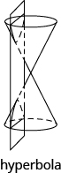
  

  
  * * *
  {: data-type="newline"}
  
  Each of the fixed points is called a **focus** of the hyperbola.
  * * *
  {: data-type="newline"}
  
  The line through the foci, is called the **transverse axis**.
  * * *
  {: data-type="newline"}
  
  The two points where the transverse axis intersects the hyperbola are each a **vertex** of the hyperbola.
  * * *
  {: data-type="newline"}
  
  The midpoint of the segment joining the foci is called the **center** of the hyperbola.
  * * *
  {: data-type="newline"}
  
  The line perpendicular to the transverse axis that passes through the center is called the **conjugate axis**.
  * * *
  {: data-type="newline"}
  
  Each piece of the graph is called a **branch** of the hyperbola.
  * * *
  {: data-type="newline"}
  
  

  ![The figure shows two graphs of a hyperbola. The first graph shows the x-axis and y-axis that both run in the negative and positive directions, but at unlabeled intervals. The center of the hyperbola is the origin. The vertices and foci are shown with points that lie on the transverse axis, which is the x-axis. The branches pass through the vertices and open left and right. The y-axis is the conjugate axis. The second graph shows the x-axis and y-axis that both run in the negative and positive directions, but at unlabeled intervals. The center of the hyperbola is the origin. The vertices and foci lie are shown with points that lie on the transverse axis, which is the y-axis. The branches pass through the vertices and open up and down. The x-axis is the conjugate axis.](../resources/CNX_IntAlg_Figure_11_04_012_img.jpg)
  

  
  * * *
  {: data-type="newline"}
  
  <table summary="The table has three columns and eight rows. The first row is a title row and is labeled &#x2018;Standard Forms of the Equation a Hyperbola with Center (0, 0). The second row is a header row with the first column labeled the quantity x squared divided by a squared end quantity minus the quantity y squared divided by b squared is equal to 1 and the second column labeled the quantity y squared divided by a squared end quantity minus the quantity x squared divided by b squared is equal to 1. The rows are labeled &#x2018;Orientation&#x2019;, &#x2018;Vertices&#x2019;, &#x2018;x-intercepts&#x2019;, &#x2018;y-intercepts&#x2019;, &#x2018;Rectangle&#x2019;, and &#x2018;Asymptotes. In row three, the &#x2018;Orientations&#x2019; are &#x2018;transverse axis on the x-axis; opens left and right&#x2019; and &#x2018;transverse axis on the y-axis; opens up and down&#x2019;. In row four, the &#x2018;Vertices&#x2019; are (negative a, 0) and (a, 0) and (0, negative a) and (0, a). In row five, the x-intercepts are (negative a, 0) and (a, 0) and &#x2018;none). In row six, the y-intercepts are &#x2018;none&#x2019; and (0, negative a) and (0, a). In row seven, the rectangle uses (plus or minus a, 0) and (0, plus or minus) and uses (0, plus or minus a) and (plus or minus b, 0). In row eight, the asymptotes are y is equal to b divided by a times x, y is equal to negative b divided by a times x and y is equal to a divided by b times x and y is equal to negative a divided by b times x." class="unnumbered" data-label=""><thead>
  <tr valign="top">
  <th colspan="3" data-valign="middle" data-align="center">Standard Forms of the Equation a Hyperbola with Center <math xmlns="http://www.w3.org/1998/Math/MathML"><mrow><mrow><mo>(</mo><mrow><mn>0</mn><mo>,</mo><mn>0</mn></mrow><mo>)</mo></mrow></mrow></math></th>
  </tr>
  <tr valign="top">
  <th data-valign="middle" data-align="center" />
  <th data-valign="middle" data-align="center"><math xmlns="http://www.w3.org/1998/Math/MathML"><mrow><mfrac><mrow><msup><mi>x</mi><mn>2</mn></msup></mrow><mrow><msup><mi>a</mi><mn>2</mn></msup></mrow></mfrac><mo>−</mo><mfrac><mrow><msup><mi>y</mi><mn>2</mn></msup></mrow><mrow><msup><mi>b</mi><mn>2</mn></msup></mrow></mfrac><mo>=</mo><mn>1</mn></mrow></math></th>
  <th data-valign="middle" data-align="center"><math xmlns="http://www.w3.org/1998/Math/MathML"><mrow><mfrac><mrow><msup><mi>y</mi><mn>2</mn></msup></mrow><mrow><msup><mi>a</mi><mn>2</mn></msup></mrow></mfrac><mo>−</mo><mfrac><mrow><msup><mi>x</mi><mn>2</mn></msup></mrow><mrow><msup><mi>b</mi><mn>2</mn></msup></mrow></mfrac><mo>=</mo><mn>1</mn></mrow></math></th>
  </tr>
  </thead><tbody>
  <tr valign="top">
  <td data-valign="middle" data-align="center"><strong>Orientation</strong></td>
  <td data-valign="middle" data-align="center">Transverse axis on the <em>x</em>-axis.
Opens left and right</td>
  <td data-valign="middle" data-align="center">Transverse axis on the <em>y</em>-axis.
Opens up and down</td>
  </tr>
  <tr valign="top">
  <td data-valign="middle" data-align="center"><strong>Vertices</strong></td>
  <td data-valign="middle" data-align="center"><math xmlns="http://www.w3.org/1998/Math/MathML"><mrow><mrow><mo>(</mo><mrow><mtext>−</mtext><mi>a</mi><mo>,</mo><mn>0</mn></mrow><mo>)</mo></mrow><mo>,</mo></mrow></math> <math xmlns="http://www.w3.org/1998/Math/MathML"><mrow><mrow><mo>(</mo><mrow><mi>a</mi><mo>,</mo><mn>0</mn></mrow><mo>)</mo></mrow></mrow></math></td>
  <td data-valign="middle" data-align="center"><math xmlns="http://www.w3.org/1998/Math/MathML"><mrow><mrow><mo>(</mo><mrow><mn>0</mn><mo>,</mo><mtext>−</mtext><mi>a</mi></mrow><mo>)</mo></mrow><mo>,</mo></mrow></math> <math xmlns="http://www.w3.org/1998/Math/MathML"><mrow><mrow><mo>(</mo><mrow><mn>0</mn><mo>,</mo><mi>a</mi></mrow><mo>)</mo></mrow></mrow></math></td>
  </tr>
  <tr valign="top">
  <td data-valign="middle" data-align="center"><strong><em>x</em>-intercepts</strong></td>
  <td data-valign="middle" data-align="center"><math xmlns="http://www.w3.org/1998/Math/MathML"><mrow><mrow><mo>(</mo><mrow><mtext>−</mtext><mi>a</mi><mo>,</mo><mn>0</mn></mrow><mo>)</mo></mrow><mo>,</mo></mrow></math> <math xmlns="http://www.w3.org/1998/Math/MathML"><mrow><mrow><mo>(</mo><mrow><mi>a</mi><mo>,</mo><mn>0</mn></mrow><mo>)</mo></mrow></mrow></math></td>
  <td data-valign="middle" data-align="center">none</td>
  </tr>
  <tr valign="top">
  <td data-valign="middle" data-align="center"><strong><em>y</em>-intercepts</strong></td>
  <td data-valign="middle" data-align="center">none</td>
  <td data-valign="middle" data-align="center"><math xmlns="http://www.w3.org/1998/Math/MathML"><mrow><mrow><mo>(</mo><mrow><mn>0</mn><mo>,</mo><mtext>−</mtext><mi>a</mi></mrow><mo>)</mo></mrow></mrow></math>, <math xmlns="http://www.w3.org/1998/Math/MathML"><mrow><mrow><mo>(</mo><mrow><mn>0</mn><mo>,</mo><mi>a</mi></mrow><mo>)</mo></mrow></mrow></math></td>
  </tr>
  <tr valign="top">
  <td data-valign="middle" data-align="center"><strong>Rectangle</strong></td>
  <td data-valign="middle" data-align="center">Use <math xmlns="http://www.w3.org/1998/Math/MathML"><mrow><mrow><mo>(</mo><mrow><mtext>±</mtext><mi>a</mi><mo>,</mo><mn>0</mn></mrow><mo>)</mo></mrow></mrow></math> <math xmlns="http://www.w3.org/1998/Math/MathML"><mrow><mrow><mo>(</mo><mrow><mn>0</mn><mo>,</mo><mtext>±</mtext><mi>b</mi></mrow><mo>)</mo></mrow></mrow></math></td>
  <td data-valign="middle" data-align="center">Use <math xmlns="http://www.w3.org/1998/Math/MathML"><mrow><mrow><mo>(</mo><mrow><mn>0</mn><mo>,</mo><mtext>±</mtext><mi>a</mi></mrow><mo>)</mo></mrow></mrow></math> <math xmlns="http://www.w3.org/1998/Math/MathML"><mrow><mrow><mo>(</mo><mrow><mtext>±</mtext><mi>b</mi><mo>,</mo><mn>0</mn></mrow><mo>)</mo></mrow></mrow></math></td>
  </tr>
  <tr valign="top">
  <td data-valign="middle" data-align="center"><strong>asymptotes</strong></td>
  <td data-valign="middle" data-align="center"><math xmlns="http://www.w3.org/1998/Math/MathML"><mrow><mi>y</mi><mo>=</mo><mfrac><mi>b</mi><mi>a</mi></mfrac><mi>x</mi><mo>,</mo></mrow></math> <math xmlns="http://www.w3.org/1998/Math/MathML"><mrow><mi>y</mi><mo>=</mo><mo>−</mo><mfrac><mi>b</mi><mi>a</mi></mfrac><mi>x</mi></mrow></math></td>
  <td data-valign="middle" data-align="center"><math xmlns="http://www.w3.org/1998/Math/MathML"><mrow><mi>y</mi><mo>=</mo><mfrac><mi>a</mi><mi>b</mi></mfrac><mi>x</mi><mo>,</mo></mrow></math> <math xmlns="http://www.w3.org/1998/Math/MathML"><mrow><mi>y</mi><mo>=</mo><mo>−</mo><mfrac><mi>a</mi><mi>b</mi></mfrac><mi>x</mi></mrow></math></td>
  </tr>
  </tbody></table>

* **How to graph a hyperbola centered at <math xmlns="http://www.w3.org/1998/Math/MathML"><mrow><mrow><mo>(</mo><mrow><mn>0</mn><mo>,</mo><mn>0</mn></mrow><mo>)</mo></mrow><mo>.</mo></mrow></math>
  
  **
  1.  Write the equation in standard form.
  2.  Determine whether the transverse axis is horizontal or vertical.
  3.  Find the vertices.
  4.  Sketch the rectangle centered at the origin intersecting one axis at
      <math xmlns="http://www.w3.org/1998/Math/MathML"><mrow><mtext>±</mtext><mi>a</mi></mrow></math>
      
      and the other at
      <math xmlns="http://www.w3.org/1998/Math/MathML"><mrow><mtext>±</mtext><mi>b</mi><mo>.</mo></mrow></math>
  
  5.  Sketch the asymptotes—the lines through the diagonals of the rectangle.
  6.  Draw the two branches of the hyperbola.
  {: data-number-style="arabic" .stepwise}
  
  * * *
  {: data-type="newline"}
  
  <table summary="The table has three columns and six rows. The first row is a title row and is labeled &#x2018;Standard Forms of the Equation a Hyperbola with Center (h, k). The second row is a header row with the first column labeled the quantity x minus h squared all divided by a squared end quantity minus the quantity y minus k squared all divided by b squared end quantity is equal to 1 and the second column labeled the quantity y minus k squared all divided by a squared end quantity minus the quantity x minus h squared all divided by b squared end quantity is equal to 1. The rows are labeled &#x2018;Orientation&#x2019;, &#x2018;Center&#x2019;, &#x2018;Vertices&#x2019;, and &#x2018;Rectangle&#x2019;. In row three, the &#x2018;Orientations&#x2019; are &#x2018;transverse axis on the x-axis; opens left and right&#x2019; and &#x2018;transverse axis on the y-axis; opens up and down&#x2019;. In row four, the &#x2018;Centers&#x2019; are both (h, k). In row five, the &#x2018;Vertices&#x2019; are a units to the left and right of the center and a units above and below the center. In row six, the &#x2018;Rectangles&#x2019; are formed by moving a units left or right of the center and b units above or below the center, and by using a units above or below the center and b units left or right of the center." class="unnumbered" data-label=""><thead>
  <tr valign="top">
  <th colspan="3" data-valign="middle" data-align="center">Standard Forms of the Equation a Hyperbola with Center <math xmlns="http://www.w3.org/1998/Math/MathML"><mrow><mrow><mo>(</mo><mrow><mi>h</mi><mo>,</mo><mi>k</mi></mrow><mo>)</mo></mrow></mrow></math></th>
  </tr>
  <tr valign="top">
  <th data-valign="middle" data-align="center" />
  <th data-valign="middle" data-align="center"><math xmlns="http://www.w3.org/1998/Math/MathML"><mrow><mfrac><mrow><msup><mrow><mrow><mo>(</mo><mrow><mi>x</mi><mo>−</mo><mi>h</mi></mrow><mo>)</mo></mrow></mrow><mn>2</mn></msup></mrow><mrow><msup><mi>a</mi><mn>2</mn></msup></mrow></mfrac><mo>−</mo><mfrac><mrow><msup><mrow><mrow><mo>(</mo><mrow><mi>y</mi><mo>−</mo><mi>k</mi></mrow><mo>)</mo></mrow></mrow><mn>2</mn></msup></mrow><mrow><msup><mi>b</mi><mn>2</mn></msup></mrow></mfrac><mo>=</mo><mn>1</mn></mrow></math></th>
  <th data-valign="middle" data-align="center"><math xmlns="http://www.w3.org/1998/Math/MathML"><mrow><mfrac><mrow><msup><mrow><mrow><mo>(</mo><mrow><mi>y</mi><mo>−</mo><mi>k</mi></mrow><mo>)</mo></mrow></mrow><mn>2</mn></msup></mrow><mrow><msup><mi>a</mi><mn>2</mn></msup></mrow></mfrac><mo>−</mo><mfrac><mrow><msup><mrow><mrow><mo>(</mo><mrow><mi>x</mi><mo>−</mo><mi>h</mi></mrow><mo>)</mo></mrow></mrow><mn>2</mn></msup></mrow><mrow><msup><mi>b</mi><mn>2</mn></msup></mrow></mfrac><mo>=</mo><mn>1</mn></mrow></math></th>
  </tr>
  </thead><tbody>
  <tr valign="top">
  <td data-valign="middle" data-align="center"><strong>Orientation</strong></td>
  <td data-valign="middle" data-align="center">Transverse axis is horizontal.
Opens left and right</td>
  <td data-valign="middle" data-align="center">Transverse axis is vertical.
Opens up and down</td>
  </tr>
  <tr valign="top">
  <td data-valign="middle" data-align="center"><strong>Center</strong></td>
  <td data-valign="middle" data-align="center"><math xmlns="http://www.w3.org/1998/Math/MathML"><mrow><mrow><mo>(</mo><mrow><mi>h</mi><mo>,</mo><mi>k</mi></mrow><mo>)</mo></mrow></mrow></math></td>
  <td data-valign="middle" data-align="center"><math xmlns="http://www.w3.org/1998/Math/MathML"><mrow><mrow><mo>(</mo><mrow><mi>h</mi><mo>,</mo><mi>k</mi></mrow><mo>)</mo></mrow></mrow></math></td>
  </tr>
  <tr valign="top">
  <td data-valign="middle" data-align="center"><strong>Vertices</strong></td>
  <td data-valign="middle" data-align="center"><em>a</em> units to the left and right of the center</td>
  <td data-valign="middle" data-align="center"><em>a</em> units above and below the center</td>
  </tr>
  <tr valign="top">
  <td data-valign="middle" data-align="center"><strong>Rectangle</strong></td>
  <td data-valign="middle" data-align="center">Use <em>a</em> units left/right of center
<em>b</em> units above/below the center</td>
  <td data-valign="middle" data-align="center">Use <em>a</em> units above/below the center
<em>b</em> units left/right of center</td>
  </tr>
  </tbody></table>

* **How to graph a hyperbola centered at <math xmlns="http://www.w3.org/1998/Math/MathML"><mrow><mrow><mo>(</mo><mrow><mi>h</mi><mo>,</mo><mi>k</mi></mrow><mo>)</mo></mrow><mo>.</mo></mrow></math>
  
  **
  1.  Write the equation in standard form.
  2.  Determine whether the transverse axis is horizontal or vertical.
  3.  Find the center and
      <math xmlns="http://www.w3.org/1998/Math/MathML"><mrow><mi>a</mi><mo>,</mo><mi>b</mi><mo>.</mo></mrow></math>
  
  4.  Sketch the rectangle centered at
      <math xmlns="http://www.w3.org/1998/Math/MathML"><mrow><mrow><mo>(</mo><mrow><mi>h</mi><mo>,</mo><mi>k</mi></mrow><mo>)</mo></mrow></mrow></math>
      
      using
      <math xmlns="http://www.w3.org/1998/Math/MathML"><mrow><mi>a</mi><mo>,</mo><mi>b</mi><mo>.</mo></mrow></math>
  
  5.  Sketch the asymptotes—the lines through the diagonals of the rectangle. Mark the vertices.
  6.  Draw the two branches of the hyperbola.
  {: data-number-style="arabic" .stepwise}
  
  * * *
  {: data-type="newline"}
  
  | Conic | Characteristics of <math xmlns="http://www.w3.org/1998/Math/MathML"><mrow><msup><mi>x</mi><mn>2</mn></msup><mtext>-</mtext></mrow></math>
  
   and <math xmlns="http://www.w3.org/1998/Math/MathML"><mrow><msup><mi>y</mi><mn>2</mn></msup><mtext>-</mtext></mrow></math>
  
   terms | Example |
  {: valign="top"}|----------
  | **Parabola** | Either <math xmlns="http://www.w3.org/1998/Math/MathML"><mrow><msup><mi>x</mi><mn>2</mn></msup></mrow></math>
  
   OR <math xmlns="http://www.w3.org/1998/Math/MathML"><mrow><msup><mi>y</mi><mn>2</mn></msup><mo>.</mo></mrow></math>
  
   Only one variable is squared. | <math xmlns="http://www.w3.org/1998/Math/MathML"><mrow><mi>x</mi><mo>=</mo><mn>3</mn><msup><mi>y</mi><mn>2</mn></msup><mo>−</mo><mn>2</mn><mi>y</mi><mo>+</mo><mn>1</mn></mrow></math>
  
   |
  {: valign="top"}| **Circle** | <math xmlns="http://www.w3.org/1998/Math/MathML"><mrow><msup><mi>x</mi><mn>2</mn></msup><mtext>-</mtext></mrow></math>
  
   and <math xmlns="http://www.w3.org/1998/Math/MathML"><mrow><msup><mi>y</mi><mn>2</mn></msup><mtext>-</mtext></mrow></math>
  
   terms have the same coefficients | <math xmlns="http://www.w3.org/1998/Math/MathML"><mrow><msup><mi>x</mi><mn>2</mn></msup><mo>+</mo><msup><mi>y</mi><mn>2</mn></msup><mo>=</mo><mn>49</mn></mrow></math>
  
   |
  {: valign="top"}| **Ellipse** | <math xmlns="http://www.w3.org/1998/Math/MathML"><mrow><msup><mi>x</mi><mn>2</mn></msup><mtext>-</mtext></mrow></math>
  
   and <math xmlns="http://www.w3.org/1998/Math/MathML"><mrow><msup><mi>y</mi><mn>2</mn></msup><mtext>-</mtext></mrow></math>
  
   terms have the **same** sign, different coefficients | <math xmlns="http://www.w3.org/1998/Math/MathML"><mrow><mn>4</mn><msup><mi>x</mi><mn>2</mn></msup><mo>+</mo><mn>25</mn><msup><mi>y</mi><mn>2</mn></msup><mo>=</mo><mn>100</mn></mrow></math>
  
   |
  {: valign="top"}| **Hyperbola** | <math xmlns="http://www.w3.org/1998/Math/MathML"><mrow><msup><mi>x</mi><mn>2</mn></msup><mtext>-</mtext></mrow></math>
  
   and <math xmlns="http://www.w3.org/1998/Math/MathML"><mrow><msup><mi>y</mi><mn>2</mn></msup><mtext>-</mtext></mrow></math>
  
   terms have **different** signs, different coefficients | <math xmlns="http://www.w3.org/1998/Math/MathML"><mrow><mn>25</mn><msup><mi>y</mi><mn>2</mn></msup><mo>−</mo><mn>4</mn><msup><mi>x</mi><mn>2</mn></msup><mo>=</mo><mn>100</mn></mrow></math>
  
   |
  {: valign="top"}{: summary="This table has three columns and five rows. The first row is a header row and it labels each column, &#x201C;Conic,&#x201D; &#x201C;Characteristics of x squared and y squared terms,&#x201D; and &#x201C;Example.&#x201D; The first column is a header column and it labels each row &#x201C;Parabola,&#x201D; &#x201C;Circle,&#x201D; &#x201C;Ellipse,&#x201D;, and &#x201C;Hyperbola.&#x201D; In row two, the Parabola is described as having either x squared or y squared and only one variable squared and the example is x is equal to 3 y squared minus 2 y plus 1. In row three, the Circle is described as having x squared and y squared terms with the same coefficients and the example is x squared plus y squared is equal to 49. In row four, the Ellipse is described as having x squared and y squared terms that have the same sign and different coefficients and the example is 4 x squared plus 25 y squared is equal to 100. In row five, the Hyperbola is described as having x squared and y squared terms that have different signs and different coefficients and the example is 25 y squared minus 4 x squared is equal to 100." .unnumbered data-label=""}
{: data-bullet-style="bullet"}

<section data-depth="1" class="section-exercises" markdown="1">
#### Practice Makes Perfect

**Graph a Hyperbola with Center at <math xmlns="http://www.w3.org/1998/Math/MathML"><mrow><mrow><mo>(</mo><mrow><mn>0</mn><mo>,</mo><mn>0</mn></mrow><mo>)</mo></mrow></mrow></math>

**

In the following exercises, graph.

<math xmlns="http://www.w3.org/1998/Math/MathML"><mrow><mfrac><mrow><msup><mi>x</mi><mn>2</mn></msup></mrow><mn>9</mn></mfrac><mo>−</mo><mfrac><mrow><msup><mi>y</mi><mn>2</mn></msup></mrow><mn>4</mn></mfrac><mo>=</mo><mn>1</mn></mrow></math>

  

<math xmlns="http://www.w3.org/1998/Math/MathML"><mrow><mfrac><mrow><msup><mi>x</mi><mn>2</mn></msup></mrow><mrow><mn>25</mn></mrow></mfrac><mo>−</mo><mfrac><mrow><msup><mi>y</mi><mn>2</mn></msup></mrow><mn>9</mn></mfrac><mo>=</mo><mn>1</mn></mrow></math>

<math xmlns="http://www.w3.org/1998/Math/MathML"><mrow><mfrac><mrow><msup><mi>x</mi><mn>2</mn></msup></mrow><mrow><mn>16</mn></mrow></mfrac><mo>−</mo><mfrac><mrow><msup><mi>y</mi><mn>2</mn></msup></mrow><mrow><mn>25</mn></mrow></mfrac><mo>=</mo><mn>1</mn></mrow></math>

 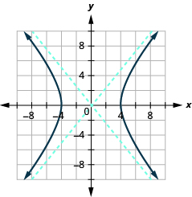 

<math xmlns="http://www.w3.org/1998/Math/MathML"><mrow><mfrac><mrow><msup><mi>x</mi><mn>2</mn></msup></mrow><mn>9</mn></mfrac><mo>−</mo><mfrac><mrow><msup><mi>y</mi><mn>2</mn></msup></mrow><mrow><mn>36</mn></mrow></mfrac><mo>=</mo><mn>1</mn></mrow></math>

<math xmlns="http://www.w3.org/1998/Math/MathML"><mrow><mfrac><mrow><msup><mi>y</mi><mn>2</mn></msup></mrow><mrow><mn>25</mn></mrow></mfrac><mo>−</mo><mfrac><mrow><msup><mi>x</mi><mn>2</mn></msup></mrow><mn>4</mn></mfrac><mo>=</mo><mn>1</mn></mrow></math>

 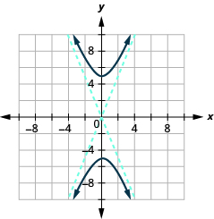 

<math xmlns="http://www.w3.org/1998/Math/MathML"><mrow><mfrac><mrow><msup><mi>y</mi><mn>2</mn></msup></mrow><mrow><mn>36</mn></mrow></mfrac><mo>−</mo><mfrac><mrow><msup><mi>x</mi><mn>2</mn></msup></mrow><mrow><mn>16</mn></mrow></mfrac><mo>=</mo><mn>1</mn></mrow></math>

<math xmlns="http://www.w3.org/1998/Math/MathML"><mrow><mn>16</mn><msup><mi>y</mi><mn>2</mn></msup><mo>−</mo><mn>9</mn><msup><mi>x</mi><mn>2</mn></msup><mo>=</mo><mn>144</mn></mrow></math>

 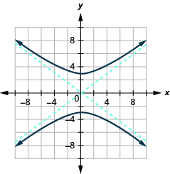 

<math xmlns="http://www.w3.org/1998/Math/MathML"><mrow><mn>25</mn><msup><mi>y</mi><mn>2</mn></msup><mo>−</mo><mn>9</mn><msup><mi>x</mi><mn>2</mn></msup><mo>=</mo><mn>225</mn></mrow></math>

<math xmlns="http://www.w3.org/1998/Math/MathML"><mrow><mn>4</mn><msup><mi>y</mi><mn>2</mn></msup><mo>−</mo><mn>9</mn><msup><mi>x</mi><mn>2</mn></msup><mo>=</mo><mn>36</mn></mrow></math>

 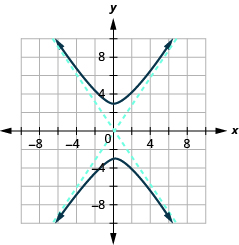 

<math xmlns="http://www.w3.org/1998/Math/MathML"><mrow><mn>16</mn><msup><mi>y</mi><mn>2</mn></msup><mo>−</mo><mn>25</mn><msup><mi>x</mi><mn>2</mn></msup><mo>=</mo><mn>400</mn></mrow></math>

<math xmlns="http://www.w3.org/1998/Math/MathML"><mrow><mn>4</mn><msup><mi>x</mi><mn>2</mn></msup><mo>−</mo><mn>16</mn><msup><mi>y</mi><mn>2</mn></msup><mo>=</mo><mn>64</mn></mrow></math>

 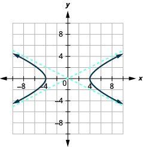 

<math xmlns="http://www.w3.org/1998/Math/MathML"><mrow><mn>9</mn><msup><mi>x</mi><mn>2</mn></msup><mo>−</mo><mn>4</mn><msup><mi>y</mi><mn>2</mn></msup><mo>=</mo><mn>36</mn></mrow></math>

**Graph a Hyperbola with Center at <math xmlns="http://www.w3.org/1998/Math/MathML"><mrow><mrow><mo>(</mo><mrow><mi>h</mi><mo>,</mo><mi>k</mi></mrow><mo>)</mo></mrow></mrow></math>

**

In the following exercises, graph.

<math xmlns="http://www.w3.org/1998/Math/MathML"><mrow><mfrac><mrow><msup><mrow><mrow><mo>(</mo><mrow><mi>x</mi><mo>−</mo><mn>1</mn></mrow><mo>)</mo></mrow></mrow><mn>2</mn></msup></mrow><mrow><mn>16</mn></mrow></mfrac><mo>−</mo><mfrac><mrow><msup><mrow><mrow><mo>(</mo><mrow><mi>y</mi><mo>−</mo><mn>3</mn></mrow><mo>)</mo></mrow></mrow><mn>2</mn></msup></mrow><mn>4</mn></mfrac><mo>=</mo><mn>1</mn></mrow></math>

  

<math xmlns="http://www.w3.org/1998/Math/MathML"><mrow><mfrac><mrow><msup><mrow><mrow><mo>(</mo><mrow><mi>x</mi><mo>−</mo><mn>2</mn></mrow><mo>)</mo></mrow></mrow><mn>2</mn></msup></mrow><mn>4</mn></mfrac><mo>−</mo><mfrac><mrow><msup><mrow><mrow><mo>(</mo><mrow><mi>y</mi><mo>−</mo><mn>3</mn></mrow><mo>)</mo></mrow></mrow><mn>2</mn></msup></mrow><mrow><mn>16</mn></mrow></mfrac><mo>=</mo><mn>1</mn></mrow></math>

<math xmlns="http://www.w3.org/1998/Math/MathML"><mrow><mfrac><mrow><msup><mrow><mrow><mo>(</mo><mrow><mi>y</mi><mo>−</mo><mn>4</mn></mrow><mo>)</mo></mrow></mrow><mn>2</mn></msup></mrow><mn>9</mn></mfrac><mo>−</mo><mfrac><mrow><msup><mrow><mrow><mo>(</mo><mrow><mi>x</mi><mo>−</mo><mn>2</mn></mrow><mo>)</mo></mrow></mrow><mn>2</mn></msup></mrow><mrow><mn>25</mn></mrow></mfrac><mo>=</mo><mn>1</mn></mrow></math>

  

<math xmlns="http://www.w3.org/1998/Math/MathML"><mrow><mfrac><mrow><msup><mrow><mrow><mo>(</mo><mrow><mi>y</mi><mo>−</mo><mn>1</mn></mrow><mo>)</mo></mrow></mrow><mn>2</mn></msup></mrow><mrow><mn>25</mn></mrow></mfrac><mo>−</mo><mfrac><mrow><msup><mrow><mrow><mo>(</mo><mrow><mi>x</mi><mo>−</mo><mn>4</mn></mrow><mo>)</mo></mrow></mrow><mn>2</mn></msup></mrow><mrow><mn>16</mn></mrow></mfrac><mo>=</mo><mn>1</mn></mrow></math>

<math xmlns="http://www.w3.org/1998/Math/MathML"><mrow><mfrac><mrow><msup><mrow><mrow><mo>(</mo><mrow><mi>y</mi><mo>+</mo><mn>4</mn></mrow><mo>)</mo></mrow></mrow><mn>2</mn></msup></mrow><mrow><mn>25</mn></mrow></mfrac><mo>−</mo><mfrac><mrow><msup><mrow><mrow><mo>(</mo><mrow><mi>x</mi><mo>+</mo><mn>1</mn></mrow><mo>)</mo></mrow></mrow><mn>2</mn></msup></mrow><mrow><mn>36</mn></mrow></mfrac><mo>=</mo><mn>1</mn></mrow></math>

  

<math xmlns="http://www.w3.org/1998/Math/MathML"><mrow><mfrac><mrow><msup><mrow><mrow><mo>(</mo><mrow><mi>y</mi><mo>+</mo><mn>1</mn></mrow><mo>)</mo></mrow></mrow><mn>2</mn></msup></mrow><mrow><mn>16</mn></mrow></mfrac><mo>−</mo><mfrac><mrow><msup><mrow><mrow><mo>(</mo><mrow><mi>x</mi><mo>+</mo><mn>1</mn></mrow><mo>)</mo></mrow></mrow><mn>2</mn></msup></mrow><mn>4</mn></mfrac><mo>=</mo><mn>1</mn></mrow></math>

<math xmlns="http://www.w3.org/1998/Math/MathML"><mrow><mfrac><mrow><msup><mrow><mrow><mo>(</mo><mrow><mi>y</mi><mo>−</mo><mn>4</mn></mrow><mo>)</mo></mrow></mrow><mn>2</mn></msup></mrow><mrow><mn>16</mn></mrow></mfrac><mo>−</mo><mfrac><mrow><msup><mrow><mrow><mo>(</mo><mrow><mi>x</mi><mo>+</mo><mn>1</mn></mrow><mo>)</mo></mrow></mrow><mn>2</mn></msup></mrow><mrow><mn>25</mn></mrow></mfrac><mo>=</mo><mn>1</mn></mrow></math>

  

<math xmlns="http://www.w3.org/1998/Math/MathML"><mrow><mfrac><mrow><msup><mrow><mrow><mo>(</mo><mrow><mi>y</mi><mo>+</mo><mn>3</mn></mrow><mo>)</mo></mrow></mrow><mn>2</mn></msup></mrow><mrow><mn>16</mn></mrow></mfrac><mo>−</mo><mfrac><mrow><msup><mrow><mrow><mo>(</mo><mrow><mi>x</mi><mo>−</mo><mn>3</mn></mrow><mo>)</mo></mrow></mrow><mn>2</mn></msup></mrow><mrow><mn>36</mn></mrow></mfrac><mo>=</mo><mn>1</mn></mrow></math>

<math xmlns="http://www.w3.org/1998/Math/MathML"><mrow><mfrac><mrow><msup><mrow><mrow><mo>(</mo><mrow><mi>x</mi><mo>−</mo><mn>3</mn></mrow><mo>)</mo></mrow></mrow><mn>2</mn></msup></mrow><mrow><mn>25</mn></mrow></mfrac><mo>−</mo><mfrac><mrow><msup><mrow><mrow><mo>(</mo><mrow><mi>y</mi><mo>+</mo><mn>2</mn></mrow><mo>)</mo></mrow></mrow><mn>2</mn></msup></mrow><mn>9</mn></mfrac><mo>=</mo><mn>1</mn></mrow></math>

  

<math xmlns="http://www.w3.org/1998/Math/MathML"><mrow><mfrac><mrow><msup><mrow><mrow><mo>(</mo><mrow><mi>x</mi><mo>+</mo><mn>2</mn></mrow><mo>)</mo></mrow></mrow><mn>2</mn></msup></mrow><mn>4</mn></mfrac><mo>−</mo><mfrac><mrow><msup><mrow><mrow><mo>(</mo><mrow><mi>y</mi><mo>−</mo><mn>1</mn></mrow><mo>)</mo></mrow></mrow><mn>2</mn></msup></mrow><mn>9</mn></mfrac><mo>=</mo><mn>1</mn></mrow></math>

In the following exercises, ⓐ write the equation in standard form and ⓑ graph.

<math xmlns="http://www.w3.org/1998/Math/MathML"><mrow><mn>9</mn><msup><mi>x</mi><mn>2</mn></msup><mo>−</mo><mn>4</mn><msup><mi>y</mi><mn>2</mn></msup><mo>−</mo><mn>18</mn><mi>x</mi><mo>+</mo><mn>8</mn><mi>y</mi><mo>−</mo><mn>31</mn><mo>=</mo><mn>0</mn></mrow></math>

ⓐ <math xmlns="http://www.w3.org/1998/Math/MathML"><mrow><mfrac><mrow><msup><mrow><mrow><mo>(</mo><mrow><mi>x</mi><mo>−</mo><mn>1</mn></mrow><mo>)</mo></mrow></mrow><mn>2</mn></msup></mrow><mn>4</mn></mfrac><mo>−</mo><mfrac><mrow><msup><mrow><mrow><mo>(</mo><mrow><mi>y</mi><mo>−</mo><mn>1</mn></mrow><mo>)</mo></mrow></mrow><mn>2</mn></msup></mrow><mn>9</mn></mfrac><mo>=</mo><mn>1</mn></mrow></math>

* * *
{: data-type="newline"}

 ⓑ* * *
{: data-type="newline"}

  

<math xmlns="http://www.w3.org/1998/Math/MathML"><mrow><mn>16</mn><msup><mi>x</mi><mn>2</mn></msup><mo>−</mo><mn>4</mn><msup><mi>y</mi><mn>2</mn></msup><mo>+</mo><mn>64</mn><mi>x</mi><mo>−</mo><mn>24</mn><mi>y</mi><mo>−</mo><mn>36</mn><mo>=</mo><mn>0</mn></mrow></math>

<math xmlns="http://www.w3.org/1998/Math/MathML"><mrow><msup><mi>y</mi><mn>2</mn></msup><mo>−</mo><msup><mi>x</mi><mn>2</mn></msup><mo>−</mo><mn>4</mn><mi>y</mi><mo>+</mo><mn>2</mn><mi>x</mi><mo>−</mo><mn>6</mn><mo>=</mo><mn>0</mn></mrow></math>

ⓐ <math xmlns="http://www.w3.org/1998/Math/MathML"><mrow><mfrac><mrow><msup><mrow><mrow><mo>(</mo><mrow><mi>y</mi><mo>−</mo><mn>2</mn></mrow><mo>)</mo></mrow></mrow><mn>2</mn></msup></mrow><mn>9</mn></mfrac><mo>−</mo><mfrac><mrow><msup><mrow><mrow><mo>(</mo><mrow><mi>x</mi><mo>−</mo><mn>1</mn></mrow><mo>)</mo></mrow></mrow><mn>2</mn></msup></mrow><mn>9</mn></mfrac><mo>=</mo><mn>1</mn></mrow></math>

* * *
{: data-type="newline"}

 ⓑ* * *
{: data-type="newline"}

  

<math xmlns="http://www.w3.org/1998/Math/MathML"><mrow><mn>4</mn><msup><mi>y</mi><mn>2</mn></msup><mo>−</mo><mn>16</mn><msup><mi>x</mi><mn>2</mn></msup><mo>−</mo><mn>24</mn><mi>y</mi><mo>+</mo><mn>96</mn><mi>x</mi><mo>−</mo><mn>172</mn><mo>=</mo><mn>0</mn></mrow></math>

<math xmlns="http://www.w3.org/1998/Math/MathML"><mrow><mn>9</mn><msup><mi>y</mi><mn>2</mn></msup><mo>−</mo><msup><mi>x</mi><mn>2</mn></msup><mo>+</mo><mn>18</mn><mi>y</mi><mo>−</mo><mn>4</mn><mi>x</mi><mo>−</mo><mn>4</mn><mo>=</mo><mn>0</mn></mrow></math>

ⓐ <math xmlns="http://www.w3.org/1998/Math/MathML"><mrow><mfrac><mrow><msup><mrow><mrow><mo>(</mo><mrow><mi>y</mi><mo>+</mo><mn>1</mn></mrow><mo>)</mo></mrow></mrow><mn>2</mn></msup></mrow><mn>1</mn></mfrac><mo>−</mo><mfrac><mrow><msup><mrow><mrow><mo>(</mo><mrow><mi>x</mi><mo>+</mo><mn>2</mn></mrow><mo>)</mo></mrow></mrow><mn>2</mn></msup></mrow><mn>9</mn></mfrac><mo>=</mo><mn>1</mn></mrow></math>

* * *
{: data-type="newline"}

 ⓑ* * *
{: data-type="newline"}

  

**Identify the Graph of each Equation as a Circle, Parabola, Ellipse, or Hyperbola**

In the following exercises, identify the type of graph.

* * *
{: data-type="newline"}

ⓐ <math xmlns="http://www.w3.org/1998/Math/MathML"><mrow><mi>x</mi><mo>=</mo><mtext>−</mtext><msup><mi>y</mi><mn>2</mn></msup><mo>−</mo><mn>2</mn><mi>y</mi><mo>+</mo><mn>3</mn></mrow></math>

* * *
{: data-type="newline"}

ⓑ <math xmlns="http://www.w3.org/1998/Math/MathML"><mrow><mn>9</mn><msup><mi>y</mi><mn>2</mn></msup><mo>−</mo><msup><mi>x</mi><mn>2</mn></msup><mo>+</mo><mn>18</mn><mi>y</mi><mo>−</mo><mn>4</mn><mi>x</mi><mo>−</mo><mn>4</mn><mo>=</mo><mn>0</mn></mrow></math>

* * *
{: data-type="newline"}

ⓒ <math xmlns="http://www.w3.org/1998/Math/MathML"><mrow><mn>9</mn><msup><mi>x</mi><mn>2</mn></msup><mo>+</mo><mn>25</mn><msup><mi>y</mi><mn>2</mn></msup><mo>=</mo><mn>225</mn></mrow></math>

* * *
{: data-type="newline"}

ⓓ <math xmlns="http://www.w3.org/1998/Math/MathML"><mrow><msup><mi>x</mi><mn>2</mn></msup><mo>+</mo><msup><mi>y</mi><mn>2</mn></msup><mo>−</mo><mn>4</mn><mi>x</mi><mo>+</mo><mn>10</mn><mi>y</mi><mo>−</mo><mn>7</mn><mo>=</mo><mn>0</mn></mrow></math>

* * *
{: data-type="newline"}

ⓐ <math xmlns="http://www.w3.org/1998/Math/MathML"><mrow><mi>x</mi><mo>=</mo><mn>−2</mn><msup><mi>y</mi><mn>2</mn></msup><mo>−</mo><mn>12</mn><mi>y</mi><mo>−</mo><mn>16</mn></mrow></math>

* * *
{: data-type="newline"}

ⓑ <math xmlns="http://www.w3.org/1998/Math/MathML"><mrow><msup><mi>x</mi><mn>2</mn></msup><mo>+</mo><msup><mi>y</mi><mn>2</mn></msup><mo>=</mo><mn>9</mn></mrow></math>

* * *
{: data-type="newline"}

ⓒ<math xmlns="http://www.w3.org/1998/Math/MathML"><mrow><mn>16</mn><msup><mi>x</mi><mn>2</mn></msup><mo>−</mo><mn>4</mn><msup><mi>y</mi><mn>2</mn></msup><mo>+</mo><mn>64</mn><mi>x</mi><mo>−</mo><mn>24</mn><mi>y</mi><mo>−</mo><mn>36</mn><mo>=</mo><mn>0</mn></mrow></math>

* * *
{: data-type="newline"}

ⓓ <math xmlns="http://www.w3.org/1998/Math/MathML"><mrow><mn>16</mn><msup><mi>x</mi><mn>2</mn></msup><mo>+</mo><mn>36</mn><msup><mi>y</mi><mn>2</mn></msup><mo>=</mo><mn>576</mn></mrow></math>

ⓐ parabola ⓑ circle ⓒ hyperbola ⓓ ellipse

**Mixed Practice**

In the following exercises, graph each equation.

<math xmlns="http://www.w3.org/1998/Math/MathML"><mrow><mfrac><mrow><msup><mrow><mrow><mo>(</mo><mrow><mi>y</mi><mo>−</mo><mn>3</mn></mrow><mo>)</mo></mrow></mrow><mn>2</mn></msup></mrow><mn>9</mn></mfrac><mo>−</mo><mfrac><mrow><msup><mrow><mrow><mo>(</mo><mrow><mi>x</mi><mo>+</mo><mn>2</mn></mrow><mo>)</mo></mrow></mrow><mn>2</mn></msup></mrow><mrow><mn>16</mn></mrow></mfrac><mo>=</mo><mn>1</mn></mrow></math>

<math xmlns="http://www.w3.org/1998/Math/MathML"><mrow><msup><mi>x</mi><mn>2</mn></msup><mo>+</mo><msup><mi>y</mi><mn>2</mn></msup><mo>−</mo><mn>4</mn><mi>x</mi><mo>+</mo><mn>10</mn><mi>y</mi><mo>−</mo><mn>7</mn><mo>=</mo><mn>0</mn></mrow></math>

 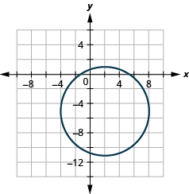 

<math xmlns="http://www.w3.org/1998/Math/MathML"><mrow><mi>y</mi><mo>=</mo><msup><mrow><mrow><mo>(</mo><mrow><mi>x</mi><mo>−</mo><mn>1</mn></mrow><mo>)</mo></mrow></mrow><mn>2</mn></msup><mo>+</mo><mn>2</mn></mrow></math>

<math xmlns="http://www.w3.org/1998/Math/MathML"><mrow><mfrac><mrow><msup><mi>x</mi><mn>2</mn></msup></mrow><mn>9</mn></mfrac><mo>+</mo><mfrac><mrow><msup><mi>y</mi><mn>2</mn></msup></mrow><mrow><mn>25</mn></mrow></mfrac><mo>=</mo><mn>1</mn></mrow></math>

 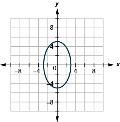 

<math xmlns="http://www.w3.org/1998/Math/MathML"><mrow><msup><mrow><mrow><mo>(</mo><mrow><mi>x</mi><mo>+</mo><mn>2</mn></mrow><mo>)</mo></mrow></mrow><mn>2</mn></msup><mo>+</mo><msup><mrow><mrow><mo>(</mo><mrow><mi>y</mi><mo>−</mo><mn>5</mn></mrow><mo>)</mo></mrow></mrow><mn>2</mn></msup><mo>=</mo><mn>4</mn></mrow></math>

<math xmlns="http://www.w3.org/1998/Math/MathML"><mrow><msup><mi>y</mi><mn>2</mn></msup><mo>−</mo><msup><mi>x</mi><mn>2</mn></msup><mo>−</mo><mn>4</mn><mi>y</mi><mo>+</mo><mn>2</mn><mi>x</mi><mo>−</mo><mn>6</mn><mo>=</mo><mn>0</mn></mrow></math>

  

<math xmlns="http://www.w3.org/1998/Math/MathML"><mrow><mi>x</mi><mo>=</mo><mtext>−</mtext><msup><mi>y</mi><mn>2</mn></msup><mo>−</mo><mn>2</mn><mi>y</mi><mo>+</mo><mn>3</mn></mrow></math>

<math xmlns="http://www.w3.org/1998/Math/MathML"><mrow><mn>16</mn><msup><mi>x</mi><mn>2</mn></msup><mo>+</mo><mn>9</mn><msup><mi>y</mi><mn>2</mn></msup><mo>=</mo><mn>144</mn></mrow></math>

 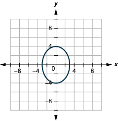 

#### Writing Exercises

In your own words, define a hyperbola and write the equation of a hyperbola centered at the origin in standard form. Draw a sketch of the hyperbola labeling the center, vertices, and asymptotes.

Explain in your own words how to create and use the rectangle that helps graph a hyperbola.

Answers will vary.

Compare and contrast the graphs of the equations <math xmlns="http://www.w3.org/1998/Math/MathML"><mrow><mfrac><mrow><msup><mi>x</mi><mn>2</mn></msup></mrow><mn>4</mn></mfrac><mo>−</mo><mfrac><mrow><msup><mi>y</mi><mn>2</mn></msup></mrow><mn>9</mn></mfrac><mo>=</mo><mn>1</mn></mrow></math>

 and <math xmlns="http://www.w3.org/1998/Math/MathML"><mrow><mfrac><mrow><msup><mi>y</mi><mn>2</mn></msup></mrow><mn>9</mn></mfrac><mo>−</mo><mfrac><mrow><msup><mi>x</mi><mn>2</mn></msup></mrow><mn>4</mn></mfrac><mo>=</mo><mn>1</mn><mo>.</mo></mrow></math>

Explain in your own words, how to distinguish the equation of an ellipse with the equation of a hyperbola.

Answers will vary.

#### Self Check

ⓐ After completing the exercises, use this checklist to evaluate your mastery of the objectives of this section.

ⓑ On a scale of 1-10, how would you rate your mastery of this section in light of your responses on the checklist? How can you improve this?

</section>

### Glossary
{: data-type="glossary-title"}

hyperbola
: A hyperbola is defined as all points in a plane where the difference of their distances from two fixed points is constant.

[1]: https://openstax.org/l/37ghyperborig
[2]: https://openstax.org/l/37ghyperbnorig
[3]: https://openstax.org/l/37ghyperbgen
[4]: https://openstax.org/l/37conicsgen
