

By the end of this section, you will be able to:
* Solve a system of nonlinear equations using graphing
* Solve a system of nonlinear equations using substitution
* Solve a system of nonlinear equations using elimination
* Use a system of nonlinear equations to solve applications

1.  Solve the system by graphing:
    <math xmlns="http://www.w3.org/1998/Math/MathML"><mrow><mrow><mo>{</mo><mtable><mtr><mtd columnalign="left"><mi>x</mi><mo>−</mo><mn>3</mn><mi>y</mi><mo>=</mo><mn>−3</mn></mtd></mtr><mtr><mtd columnalign="left"><mi>x</mi><mo>+</mo><mi>y</mi><mo>=</mo><mn>5</mn></mtd></mtr></mtable></mrow><mo>.</mo></mrow></math>
    
    * * *
    {: data-type="newline"}
    
    If you missed this problem, review [\[link\]](/m63327#fs-id1167834279490).
2.  Solve the system by substitution:
    <math xmlns="http://www.w3.org/1998/Math/MathML"><mrow><mrow><mo>{</mo><mtable><mtr><mtd columnalign="left"><mi>x</mi><mo>−</mo><mn>4</mn><mi>y</mi><mo>=</mo><mn>−4</mn></mtd></mtr><mtr><mtd columnalign="left"><mo>−</mo><mn>3</mn><mi>x</mi><mo>+</mo><mn>4</mn><mi>y</mi><mo>=</mo><mn>0</mn></mtd></mtr></mtable></mrow><mo>.</mo></mrow></math>
    
    * * *
    {: data-type="newline"}
    
    If you missed this problem, review [\[link\]](/m63327#fs-id1167835328722).
3.  Solve the system by elimination:
    <math xmlns="http://www.w3.org/1998/Math/MathML"><mrow><mrow><mo>{</mo><mtable><mtr><mtd columnalign="left"><mn>3</mn><mi>x</mi><mo>−</mo><mn>4</mn><mi>y</mi><mo>=</mo><mn>−9</mn></mtd></mtr><mtr><mtd columnalign="left"><mn>5</mn><mi>x</mi><mo>+</mo><mn>3</mn><mi>y</mi><mo>=</mo><mn>14</mn></mtd></mtr></mtable></mrow><mo>.</mo></mrow></math>
    
    * * *
    {: data-type="newline"}
    
    If you missed this problem, review [\[link\]](/m63327#fs-id1167834121139).
{: type="1"}

### Solve a System of Nonlinear Equations Using Graphing

We learned how to solve systems of linear equations with two variables by graphing, substitution and elimination. We will be using these same methods as we look at nonlinear systems of equations with two equations and two variables. A **system of nonlinear equations** is a system where at least one of the equations is not linear.

For example each of the following systems is a **system of nonlinear equations**{: data-type="term"}.

<math xmlns="http://www.w3.org/1998/Math/MathML"><mrow><mtable><mtr><mtd columnalign="center"><mrow><mo>{</mo><mtable><mtr><mtd columnalign="left"><msup><mi>x</mi><mn>2</mn></msup><mo>+</mo><msup><mi>y</mi><mn>2</mn></msup><mo>=</mo><mn>9</mn></mtd></mtr><mtr><mtd columnalign="left"><msup><mi>x</mi><mn>2</mn></msup><mo>−</mo><mi>y</mi><mo>=</mo><mn>9</mn></mtd></mtr></mtable></mrow></mtd><mtd /><mtd /><mtd columnalign="center"><mspace width="5em" /><mrow><mo>{</mo><mtable><mtr><mtd columnalign="left"><mn>9</mn><msup><mi>x</mi><mn>2</mn></msup><mo>+</mo><msup><mi>y</mi><mn>2</mn></msup><mo>=</mo><mn>9</mn></mtd></mtr><mtr><mtd columnalign="left"><mi>y</mi><mo>=</mo><mn>3</mn><mi>x</mi><mo>−</mo><mn>3</mn></mtd></mtr></mtable></mrow></mtd><mtd /><mtd /><mtd columnalign="center"><mspace width="5em" /><mrow><mo>{</mo><mtable><mtr><mtd columnalign="left"><mi>x</mi><mo>+</mo><mi>y</mi><mo>=</mo><mn>4</mn></mtd></mtr><mtr><mtd columnalign="left"><mi>y</mi><mo>=</mo><msup><mi>x</mi><mn>2</mn></msup><mo>+</mo><mn>2</mn></mtd></mtr></mtable></mrow></mtd></mtr></mtable></mrow></math>

System of Nonlinear Equations

A **system of nonlinear equations** is a system where at least one of the equations is not linear.

Just as with systems of linear equations, a solution of a nonlinear system is an ordered pair that makes both equations true. In a nonlinear system, there may be more than one solution. We will see this as we solve a system of nonlinear equations by graphing.

When we solved systems of linear equations, the solution of the system was the point of intersection of the two lines. With systems of nonlinear equations, the graphs may be circles, parabolas or hyperbolas and there may be several points of intersection, and so several solutions. Once you identify the graphs, visualize the different ways the graphs could intersect and so how many solutions there might be.

To solve systems of nonlinear equations by graphing, we use basically the same steps as with systems of linear equations modified slightly for nonlinear equations. The steps are listed below for reference.

Solve a system of nonlinear equations by graphing.

1.  Identify the graph of each equation. Sketch the possible options for intersection.
2.  Graph the first equation.
3.  Graph the second equation on the same rectangular coordinate system.
4.  Determine whether the graphs intersect.
5.  Identify the points of intersection.
6.  Check that each ordered pair is a solution to both original equations.
{: type="1" .stepwise}

Solve the system by graphing: <math xmlns="http://www.w3.org/1998/Math/MathML"><mrow><mrow><mo>{</mo><mtable><mtr><mtd columnalign="left"><mi>x</mi><mo>−</mo><mi>y</mi><mo>=</mo><mn>−2</mn></mtd></mtr><mtr><mtd columnalign="left"><mi>y</mi><mo>=</mo><msup><mi>x</mi><mn>2</mn></msup></mtd></mtr></mtable></mrow><mo>.</mo></mrow></math>

<table class="unnumbered unstyled can-break" summary="Identify each graph of the system x minus y is equal to negative 2, which is a line, and y is equal to x squared, which is a parabola. Sketch the possible options for intersection of a parabola and a line. When a parabola and a line do not intersect, there the system has 0 solutions. When a parabola and line intersect at a single point, the system has one solution. When a parabola and line intersect at two points, the system has two solutions. Graph the line x minus y is equal to negative two. The slope intercept form of the line is y is equal to x plus 2. Graph the parabola, x squared. On a coordinate plane, the line has a slope of 1 and a y-intercept of 2 and the parabola has a vertex at (0, 0) and opens upward. They appear to be (2, 4) and (negative 1, 1). Check to make sure each solution makes both equations true. For (2, 4), is 2 minus 4 equal to negative 2? Negative is equal to negative 2. For (2, 4), is 4 equal to 2 squared? 4 is equal to 4. For (negative 1, 1), is negative 1 minus 1 equal to negative 2? Negative 2 is equal to negative 2. For (negative 1, 1), is 1 equal to the square of negative 1. 1 is equal to 1. The solutions are (2, 4) and (negative 1, 1)." data-label=""><tbody>
<tr valign="top">
<td data-valign="top" data-align="left">Identify each graph.</td>
<td data-valign="top" data-align="left"><math xmlns="http://www.w3.org/1998/Math/MathML"><mrow><mrow><mo>{</mo><mtable><mtr><mtd columnalign="left"><mi>x</mi><mo>−</mo><mi>y</mi><mo>=</mo><mn>−2</mn></mtd><mtd /><mtd columnalign="left"><mtext>line</mtext></mtd></mtr><mtr><mtd columnalign="left"><mi>y</mi><mo>=</mo><msup><mi>x</mi><mn>2</mn></msup></mtd><mtd /><mtd columnalign="left"><mtext>parabola</mtext></mtd></mtr></mtable></mrow></mrow></math></td>
</tr>
<tr valign="top">
<td data-valign="top" data-align="left">Sketch the possible options for
intersection of a parabola and a line.</td>
<td data-valign="top" data-align="left">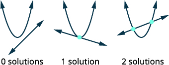</td>
</tr>
<tr valign="top">
<td data-valign="top" data-align="left">Graph the line, <math xmlns="http://www.w3.org/1998/Math/MathML"><mrow><mi>x</mi><mo>−</mo><mi>y</mi><mo>=</mo><mn>−2</mn><mo>.</mo></mrow></math>
Slope-intercept form <math xmlns="http://www.w3.org/1998/Math/MathML"><mrow><mi>y</mi><mo>=</mo><mi>x</mi><mo>+</mo><mn>2</mn><mo>.</mo></mrow></math>
Graph the parabola, <math xmlns="http://www.w3.org/1998/Math/MathML"><mrow><mi>y</mi><mo>=</mo><msup><mi>x</mi><mn>2</mn></msup><mo>.</mo></mrow></math></td>
<td data-valign="top" data-align="left">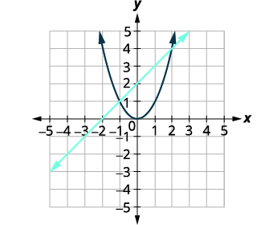</td>
</tr>
<tr valign="top">
<td data-valign="top" data-align="left">Identify the points of intersection.</td>
<td data-valign="top" data-align="left">The points of intersection appear to be <math xmlns="http://www.w3.org/1998/Math/MathML"><mrow><mrow><mo>(</mo><mrow><mn>2</mn><mo>,</mo><mn>4</mn></mrow><mo>)</mo></mrow></mrow></math> and <math xmlns="http://www.w3.org/1998/Math/MathML"><mrow><mrow><mo>(</mo><mrow><mn>−1</mn><mo>,</mo><mn>1</mn></mrow><mo>)</mo></mrow><mo>.</mo></mrow></math></td>
</tr>
<tr valign="top">
<td data-valign="top" data-align="left">Check to make sure each solution makes
both equations true.
<math xmlns="http://www.w3.org/1998/Math/MathML"><mrow><mrow><mo>(</mo><mrow><mn>2</mn><mo>,</mo><mn>4</mn></mrow><mo>)</mo></mrow></mrow></math>

<math xmlns="http://www.w3.org/1998/Math/MathML"><mrow><mspace width="1em" /><mtable><mtr><mtd columnalign="right"><mi>x</mi><mo>−</mo><mi>y</mi></mtd><mtd columnalign="left"><mo>=</mo></mtd><mtd columnalign="left"><mn>−2</mn></mtd><mtd /><mtd /><mtd columnalign="right"><mi>y</mi></mtd><mtd columnalign="left"><mo>=</mo></mtd><mtd columnalign="left"><msup><mi>x</mi><mn>2</mn></msup></mtd></mtr><mtr><mtd columnalign="right"><mn>2</mn><mo>−</mo><mn>4</mn></mtd><mtd columnalign="left"><mover><mo>=</mo><mo>?</mo></mover></mtd><mtd columnalign="left"><mn>−2</mn></mtd><mtd /><mtd /><mtd columnalign="right"><mn>4</mn></mtd><mtd columnalign="left"><mover><mo>=</mo><mo>?</mo></mover></mtd><mtd columnalign="left"><msup><mn>2</mn><mn>2</mn></msup></mtd></mtr><mtr><mtd columnalign="right"><mn>−2</mn></mtd><mtd columnalign="left"><mo>=</mo></mtd><mtd columnalign="left"><mn>−2</mn><mo>✓</mo></mtd><mtd /><mtd /><mtd columnalign="right"><mn>4</mn></mtd><mtd columnalign="left"><mo>=</mo></mtd><mtd columnalign="left"><mn>4</mn><mo>✓</mo></mtd></mtr></mtable></mrow></math>

<math xmlns="http://www.w3.org/1998/Math/MathML"><mrow><mrow><mo>(</mo><mrow><mn>−1</mn><mo>,</mo><mn>1</mn></mrow><mo>)</mo></mrow></mrow></math>

<math xmlns="http://www.w3.org/1998/Math/MathML"><mrow><mspace width="0.3em" /><mtable><mtr><mtd columnalign="right"><mi>x</mi><mo>−</mo><mi>y</mi></mtd><mtd columnalign="left"><mo>=</mo></mtd><mtd columnalign="left"><mn>−2</mn></mtd><mtd /><mtd /><mtd columnalign="right"><mi>y</mi></mtd><mtd columnalign="left"><mo>=</mo></mtd><mtd columnalign="left"><msup><mi>x</mi><mn>2</mn></msup></mtd></mtr><mtr><mtd columnalign="right"><mn>−1</mn><mo>−</mo><mn>1</mn></mtd><mtd columnalign="left"><mover><mo>=</mo><mo>?</mo></mover></mtd><mtd columnalign="left"><mn>−2</mn></mtd><mtd /><mtd /><mtd columnalign="right"><mn>1</mn></mtd><mtd columnalign="left"><mover><mo>=</mo><mo>?</mo></mover></mtd><mtd columnalign="left"><msup><mrow><mrow><mo>(</mo><mrow><mn>−1</mn></mrow><mo>)</mo></mrow></mrow><mn>2</mn></msup></mtd></mtr><mtr><mtd columnalign="right"><mn>−2</mn></mtd><mtd columnalign="left"><mo>=</mo></mtd><mtd columnalign="left"><mn>−2</mn><mo>✓</mo></mtd><mtd /><mtd /><mtd columnalign="right"><mn>1</mn></mtd><mtd columnalign="left"><mo>=</mo></mtd><mtd columnalign="left"><mn>1</mn><mo>✓</mo></mtd></mtr></mtable></mrow></math></td>
<td data-valign="top" data-align="left" />
</tr>
<tr valign="top">
<td data-valign="top" data-align="left" />
<td data-valign="top" data-align="left">The solutions are <math xmlns="http://www.w3.org/1998/Math/MathML"><mrow><mrow><mo>(</mo><mrow><mn>2</mn><mo>,</mo><mn>4</mn></mrow><mo>)</mo></mrow></mrow></math> and <math xmlns="http://www.w3.org/1998/Math/MathML"><mrow><mrow><mo>(</mo><mrow><mn>−1</mn><mo>,</mo><mn>1</mn></mrow><mo>)</mo></mrow><mo>.</mo></mrow></math></td>
</tr>
</tbody></table>

Solve the system by graphing: <math xmlns="http://www.w3.org/1998/Math/MathML"><mrow><mrow><mo>{</mo><mtable><mtr><mtd columnalign="left"><mi>x</mi><mo>+</mo><mi>y</mi><mo>=</mo><mn>4</mn></mtd></mtr><mtr><mtd columnalign="left"><mi>y</mi><mo>=</mo><msup><mi>x</mi><mn>2</mn></msup><mo>+</mo><mn>2</mn></mtd></mtr></mtable></mrow><mo>.</mo></mrow></math>

  

Solve the system by graphing: <math xmlns="http://www.w3.org/1998/Math/MathML"><mrow><mrow><mo>{</mo><mtable><mtr><mtd columnalign="left"><mi>x</mi><mo>−</mo><mi>y</mi><mo>=</mo><mn>−1</mn></mtd></mtr><mtr><mtd columnalign="left"><mi>y</mi><mo>=</mo><mtext>−</mtext><msup><mi>x</mi><mn>2</mn></msup><mo>+</mo><mn>3</mn></mtd></mtr></mtable></mrow><mo>.</mo></mrow></math>

  

To identify the graph of each equation, keep in mind the characteristics of the <math xmlns="http://www.w3.org/1998/Math/MathML"><mrow><msup><mi>x</mi><mn>2</mn></msup></mrow></math>

 and <math xmlns="http://www.w3.org/1998/Math/MathML"><mrow><msup><mi>y</mi><mn>2</mn></msup></mrow></math>

 terms of each conic.

Solve the system by graphing: <math xmlns="http://www.w3.org/1998/Math/MathML"><mrow><mrow><mo>{</mo><mtable><mtr><mtd columnalign="left"><mi>y</mi><mo>=</mo><mn>−1</mn></mtd></mtr><mtr><mtd columnalign="left"><msup><mrow><mo>(</mo><mrow><mi>x</mi><mo>−</mo><mn>2</mn></mrow><mo>)</mo></mrow><mn>2</mn></msup><mo>+</mo><msup><mrow><mo>(</mo><mrow><mi>y</mi><mo>+</mo><mn>3</mn></mrow><mo>)</mo></mrow><mn>2</mn></msup><mo>=</mo><mn>4</mn></mtd></mtr></mtable></mrow><mo>.</mo></mrow></math>

<table class="unnumbered unstyled can-break" summary="Identify each graph of the system y is equal to negative 1, which is a line, and the quantity x minus 2 squared plus the quantity y plus 3 squared is equal to 4, which is a circle. Sketch the possible options for the intersection of a circle and a line. When a circle and a line do not intersect, there the system has 0 solutions. When a circle and line intersect at a single point, the system has one solution. When a circle and line intersect at two points, the system has two solutions. Graph the circle, the quantity x minus 2 squared plus the quantity y plus 3 squared is equal to 4. Its center is (2, negative 3) and it has a radius 2 units. Graph the line, y is equal to negative 1. It is a horizontal line. Identify the points of intersection. The point of intersection appears to be (2, negative 1). Check to make sure the solution makes both equations true. Substitute the coordinates from (2, negative 1) into the quantity x minus 2 squared plus the quantity y plus 3 squared is equal to 4. Is the quantity 2 minus 2 squared plus the quantity negative 1 plus 3 squared equal to 4? Is 0 squared plus 2 squared equal to 4? 4 is equal to 4. Substitute the coordinates from (2, negative 1) into y is equal to negative 1. Negative 1 is equal to negative 1. The solution is (2, negative 1)." data-label=""><tbody>
<tr valign="top">
<td data-valign="top" data-align="left">Identify each graph.</td>
<td data-valign="top" data-align="left"><math xmlns="http://www.w3.org/1998/Math/MathML"><mrow><mrow><mo>{</mo><mtable><mtr><mtd columnalign="left"><mi>y</mi><mo>=</mo><mn>−1</mn></mtd><mtd /><mtd columnalign="left"><mtext>line</mtext></mtd></mtr><mtr><mtd columnalign="left"><msup><mrow><mo>(</mo><mrow><mi>x</mi><mo>−</mo><mn>2</mn></mrow><mo>)</mo></mrow><mn>2</mn></msup><mo>+</mo><msup><mrow><mo>(</mo><mrow><mi>y</mi><mo>+</mo><mn>3</mn></mrow><mo>)</mo></mrow><mn>2</mn></msup><mo>=</mo><mn>4</mn></mtd><mtd /><mtd columnalign="left"><mtext>circle</mtext></mtd></mtr></mtable></mrow></mrow></math></td>
</tr>
<tr valign="top">
<td data-valign="top" data-align="left">Sketch the possible options for the
intersection of a circle and a line.</td>
<td data-valign="top" data-align="left"></td>
</tr>
<tr valign="top">
<td data-valign="top" data-align="left">Graph the circle, <math xmlns="http://www.w3.org/1998/Math/MathML"><mrow><msup><mrow><mrow><mo>(</mo><mrow><mi>x</mi><mo>−</mo><mn>2</mn></mrow><mo>)</mo></mrow></mrow><mn>2</mn></msup><mo>+</mo><msup><mrow><mrow><mo>(</mo><mrow><mi>y</mi><mo>+</mo><mn>3</mn></mrow><mo>)</mo></mrow></mrow><mn>2</mn></msup><mo>=</mo><mn>4</mn></mrow></math>
Center: <math xmlns="http://www.w3.org/1998/Math/MathML"><mrow><mrow><mo>(</mo><mrow><mn>2</mn><mo>,</mo><mn>−3</mn></mrow><mo>)</mo></mrow></mrow></math> radius: 2
Graph the line, <math xmlns="http://www.w3.org/1998/Math/MathML"><mrow><mi>y</mi><mo>=</mo><mn>−1</mn><mo>.</mo></mrow></math>
It is a horizontal line.</td>
<td data-valign="top" data-align="left">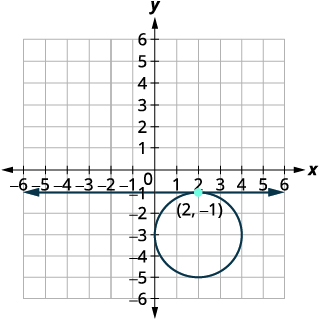</td>
</tr>
<tr valign="top">
<td data-valign="top" data-align="left">Identify the points of intersection.</td>
<td data-valign="top" data-align="left">The point of intersection appears to be <math xmlns="http://www.w3.org/1998/Math/MathML"><mrow><mrow><mo>(</mo><mrow><mn>2</mn><mo>,</mo><mn>−1</mn></mrow><mo>)</mo></mrow><mo>.</mo></mrow></math></td>
</tr>
<tr valign="top">
<td data-valign="top" data-align="left">Check to make sure the solution makes
both equations true.

<math xmlns="http://www.w3.org/1998/Math/MathML"><mrow><mrow><mo>(</mo><mrow><mn>2</mn><mo>,</mo><mn>−1</mn></mrow><mo>)</mo></mrow></mrow></math>

<math xmlns="http://www.w3.org/1998/Math/MathML"><mrow><mtable><mtr><mtd columnalign="right"><msup><mrow><mrow><mo>(</mo><mrow><mi>x</mi><mo>−</mo><mn>2</mn></mrow><mo>)</mo></mrow></mrow><mn>2</mn></msup><mo>+</mo><msup><mrow><mrow><mo>(</mo><mrow><mi>y</mi><mo>+</mo><mn>3</mn></mrow><mo>)</mo></mrow></mrow><mn>2</mn></msup></mtd><mtd columnalign="left"><mo>=</mo></mtd><mtd columnalign="left"><mn>4</mn></mtd><mtd /><mtd /><mtd columnalign="right"><mi>y</mi></mtd><mtd columnalign="left"><mo>=</mo></mtd><mtd columnalign="left"><mn>−1</mn></mtd></mtr><mtr><mtd columnalign="right"><msup><mrow><mrow><mo>(</mo><mrow><mn>2</mn><mo>−</mo><mn>2</mn></mrow><mo>)</mo></mrow></mrow><mn>2</mn></msup><mo>+</mo><msup><mrow><mrow><mo>(</mo><mrow><mn>−1</mn><mo>+</mo><mn>3</mn></mrow><mo>)</mo></mrow></mrow><mn>2</mn></msup></mtd><mtd columnalign="left"><mover><mo>=</mo><mo>?</mo></mover></mtd><mtd columnalign="left"><mn>4</mn></mtd><mtd /><mtd /><mtd columnalign="right"><mn>−1</mn></mtd><mtd columnalign="left"><mo>=</mo></mtd><mtd columnalign="left"><mn>−1</mn><mo>✓</mo></mtd></mtr><mtr><mtd columnalign="right"><msup><mrow><mrow><mo>(</mo><mn>0</mn><mo>)</mo></mrow></mrow><mn>2</mn></msup><mo>+</mo><msup><mrow><mrow><mo>(</mo><mn>2</mn><mo>)</mo></mrow></mrow><mn>2</mn></msup></mtd><mtd columnalign="left"><mover><mo>=</mo><mo>?</mo></mover></mtd><mtd columnalign="left"><mn>4</mn></mtd><mtd /><mtd /><mtd /><mtd /><mtd /></mtr><mtr><mtd columnalign="right"><mn>4</mn></mtd><mtd columnalign="left"><mo>=</mo></mtd><mtd columnalign="left"><mn>4</mn><mo>✓</mo></mtd><mtd /><mtd /><mtd /><mtd /><mtd /></mtr></mtable></mrow></math></td>
<td data-valign="top" data-align="left" />
</tr>
<tr valign="top">
<td data-valign="top" data-align="left" />
<td data-valign="top" data-align="left">The solution is <math xmlns="http://www.w3.org/1998/Math/MathML"><mrow><mrow><mo>(</mo><mrow><mn>2</mn><mo>,</mo><mn>−1</mn></mrow><mo>)</mo></mrow><mo>.</mo></mrow></math></td>
</tr>
</tbody></table>

Solve the system by graphing: <math xmlns="http://www.w3.org/1998/Math/MathML"><mrow><mrow><mo>{</mo><mtable><mtr><mtd columnalign="left"><mi>x</mi><mo>=</mo><mn>−6</mn></mtd></mtr><mtr><mtd columnalign="left"><msup><mrow><mo>(</mo><mrow><mi>x</mi><mo>+</mo><mn>3</mn></mrow><mo>)</mo></mrow><mn>2</mn></msup><mo>+</mo><msup><mrow><mo>(</mo><mrow><mi>y</mi><mo>−</mo><mn>1</mn></mrow><mo>)</mo></mrow><mn>2</mn></msup><mo>=</mo><mn>9</mn></mtd></mtr></mtable></mrow><mo>.</mo></mrow></math>

  

Solve the system by graphing: <math xmlns="http://www.w3.org/1998/Math/MathML"><mrow><mrow><mo>{</mo><mtable><mtr><mtd columnalign="left"><mi>y</mi><mo>=</mo><mn>4</mn></mtd></mtr><mtr><mtd columnalign="left"><msup><mrow><mo>(</mo><mrow><mi>x</mi><mo>−</mo><mn>2</mn></mrow><mo>)</mo></mrow><mn>2</mn></msup><mo>+</mo><msup><mrow><mo>(</mo><mrow><mi>y</mi><mo>+</mo><mn>3</mn></mrow><mo>)</mo></mrow><mn>2</mn></msup><mo>=</mo><mn>4</mn></mtd></mtr></mtable></mrow><mo>.</mo></mrow></math>

  

### Solve a System of Nonlinear Equations Using Substitution

The graphing method works well when the points of intersection are integers and so easy to read off the graph. But more often it is difficult to read the coordinates of the points of intersection. The substitution method is an algebraic method that will work well in many situations. It works especially well when it is easy to solve one of the equations for one of the variables.

The substitution method is very similar to the substitution method that we used for systems of linear equations. The steps are listed below for reference.

Solve a system of nonlinear equations by substitution.

1.  Identify the graph of each equation. Sketch the possible options for intersection.
2.  Solve one of the equations for either variable.
3.  Substitute the expression from Step 2 into the other equation.
4.  Solve the resulting equation.
5.  Substitute each solution in Step 4 into one of the original equations to find the other variable.
6.  Write each solution as an ordered pair.
7.  Check that each ordered pair is a solution to **both** original equations.
{: type="1" .stepwise}

Solve the system by using substitution: <math xmlns="http://www.w3.org/1998/Math/MathML"><mrow><mrow><mo>{</mo><mtable><mtr><mtd columnalign="left"><mn>9</mn><msup><mi>x</mi><mn>2</mn></msup><mo>+</mo><msup><mi>y</mi><mn>2</mn></msup><mo>=</mo><mn>9</mn></mtd></mtr><mtr><mtd columnalign="left"><mi>y</mi><mo>=</mo><mn>3</mn><mi>x</mi><mo>−</mo><mn>3</mn></mtd></mtr></mtable></mrow><mo>.</mo></mrow></math>

<table class="unnumbered unstyled can-break" summary="Identify each graph of the system, 9 x squared plus y squared is equal to 9, which is an ellipse, and y is equal to 3 x minus 3, which is a line. Sketch the possible options for intersection of an ellipse and a line. When an ellipse and a line do not intersect, the system has 0 solutions. When an ellipse and line intersect at a single point, the system has one solution. When an ellipse and line intersect at two points, the system has two solutions. The equation y is equal to 3 x minus 3 is solved for y already. Substitute 3 x minus 3 for y in the equation, 9 x squared plus y squared is equal to 9. Solve the equation for x. 9 x squared plus the quantity 3 x minus 3 end quantity squared is equal to 9. 9 x squared plus 9 x squared minus 18 x plus 9 is equal to 9. 18 x squared minus 18 x is equal to 0. 18 x times the quantity x minus 1) is equal to 0. So, x is equal to 0 or x is equal to 1. Substitute x is equal to 0 and x is equal to 1 into y is equal to 3 x minus 3 to find y. For x is equal to 0, the result is y is equal to 3 times 0 minus 3, which simplifies to y is equal to 3. For x is equal to 1, the result is y is equal to 3 times 1 minus 3, which simplifies to is equal to 0. The ordered pairs are (0, negative 3) and (1, 0). Check both ordered pairs in both equations. Substitute the coordinates in (0, negative 3) in 9 x squared plus y squared is equal to 9. Is 9 times 0 squared plus negative 3 squared equal to 9? Is 0 plus 9 equal to 9? 9 is equal to 9. Substitute the coordinates in (0, negative 3) in y is equal to 3 x minus 3. Is negative 3 equal to 3 times 0 minus 3? Is negative 3 equal to 0 minus 3? Negative 3 is equal to negative 3. Substitute the coordinates in (1, 0) in 9 x squared plus y squared is equal to 9. Is 9 times 1 squared plus 0 squared equal to 9? Is 9 plus 0 equal to 9? 9 is equal to 9. Substitute the coordinates in (1, 0) in y is equal to 3 x minus 3. Is 0 equal to 3 times 1 minus 3? Is 0 equal to 3 minus 3? 0 is equal to 3. The solutions are (0, negative 3) and (1, 0)." data-label=""><tbody>
<tr valign="top">
<td data-valign="top" data-align="left">Identify each graph.</td>
<td data-valign="top" data-align="left"><math xmlns="http://www.w3.org/1998/Math/MathML"><mrow><mrow><mo>{</mo><mtable><mtr><mtd columnalign="left"><mn>9</mn><msup><mi>x</mi><mn>2</mn></msup><mo>+</mo><msup><mi>y</mi><mn>2</mn></msup><mo>=</mo><mn>9</mn></mtd><mtd /><mtd columnalign="left"><mtext>ellipse</mtext></mtd></mtr><mtr><mtd columnalign="left"><mi>y</mi><mo>=</mo><mn>3</mn><mi>x</mi><mo>−</mo><mn>3</mn></mtd><mtd /><mtd columnalign="left"><mtext>line</mtext></mtd></mtr></mtable></mrow></mrow></math></td>
</tr>
<tr valign="top">
<td data-valign="top" data-align="left">Sketch the possible options for intersection of an
ellipse and a line.</td>
<td data-valign="top" data-align="left">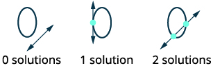</td>
</tr>
<tr valign="top">
<td data-valign="top" data-align="left">The equation <math xmlns="http://www.w3.org/1998/Math/MathML"><mrow><mi>y</mi><mo>=</mo><mn>3</mn><mi>x</mi><mo>−</mo><mn>3</mn></mrow></math> is solved for <em>y</em>.</td>
<td data-valign="top" data-align="left"></td>
</tr>
<tr valign="top">
<td data-valign="top" data-align="left" />
<td data-valign="top" data-align="left"></td>
</tr>
<tr valign="top">
<td data-valign="top" data-align="left">Substitute <math xmlns="http://www.w3.org/1998/Math/MathML"><mrow><mn>3</mn><mi>x</mi><mo>−</mo><mn>3</mn></mrow></math> for <em>y</em> in the first equation.</td>
<td data-valign="top" data-align="left"></td>
</tr>
<tr valign="top">
<td data-valign="top" data-align="left">Solve the equation for <em>x</em>.</td>
<td data-valign="top" data-align="left"></td>
</tr>
<tr valign="top">
<td data-valign="top" data-align="left" />
<td data-valign="top" data-align="left"></td>
</tr>
<tr valign="top">
<td data-valign="top" data-align="left">Substitute <math xmlns="http://www.w3.org/1998/Math/MathML"><mrow><mi>x</mi><mo>=</mo><mn>0</mn></mrow></math> and <math xmlns="http://www.w3.org/1998/Math/MathML"><mrow><mi>x</mi><mo>=</mo><mn>1</mn></mrow></math> into <math xmlns="http://www.w3.org/1998/Math/MathML"><mrow><mi>y</mi><mo>=</mo><mn>3</mn><mi>x</mi><mo>−</mo><mn>3</mn></mrow></math> to find <em>y</em>.</td>
<td data-valign="top" data-align="left"></td>
</tr>
<tr valign="top">
<td data-valign="top" data-align="left" />
<td data-valign="top" data-align="left"></td>
</tr>
<tr valign="top">
<td data-valign="top" data-align="left" />
<td data-valign="top" data-align="left">The ordered pairs are <math xmlns="http://www.w3.org/1998/Math/MathML"><mrow><mrow><mo>(</mo><mrow><mn>0</mn><mo>,</mo><mn>−3</mn></mrow><mo>)</mo></mrow><mo>,</mo></mrow></math> <math xmlns="http://www.w3.org/1998/Math/MathML"><mrow><mrow><mo>(</mo><mrow><mn>1</mn><mo>,</mo><mn>0</mn></mrow><mo>)</mo></mrow><mo>.</mo></mrow></math></td>
</tr>
<tr valign="top">
<td data-valign="top" data-align="left">Check <strong>both</strong> ordered pairs in <strong>both</strong> equations.

<math xmlns="http://www.w3.org/1998/Math/MathML"><mrow><mrow><mo>(</mo><mrow><mn>0</mn><mo>,</mo><mn>−3</mn></mrow><mo>)</mo></mrow></mrow></math>

<math xmlns="http://www.w3.org/1998/Math/MathML"><mrow><mtable><mtr /><mtr><mtd columnalign="right"><mn>9</mn><msup><mi>x</mi><mn>2</mn></msup><mo>+</mo><msup><mi>y</mi><mn>2</mn></msup></mtd><mtd columnalign="left"><mo>=</mo></mtd><mtd columnalign="left"><mn>9</mn></mtd><mtd /><mtd /><mtd /><mtd /><mtd columnalign="right"><mi>y</mi></mtd><mtd columnalign="left"><mo>=</mo></mtd><mtd columnalign="left"><mn>3</mn><mi>x</mi><mo>−</mo><mn>3</mn></mtd></mtr><mtr><mtd columnalign="right"><mn>9</mn><mo>·</mo><msup><mn>0</mn><mn>2</mn></msup><mo>+</mo><msup><mrow><mrow><mo>(</mo><mrow><mn>−3</mn></mrow><mo>)</mo></mrow></mrow><mn>2</mn></msup></mtd><mtd columnalign="left"><mover><mo>=</mo><mo>?</mo></mover></mtd><mtd columnalign="left"><mn>9</mn></mtd><mtd /><mtd /><mtd /><mtd /><mtd columnalign="right"><mn>−3</mn></mtd><mtd columnalign="left"><mover><mo>=</mo><mo>?</mo></mover></mtd><mtd columnalign="left"><mn>3</mn><mo>·</mo><mn>0</mn><mo>−</mo><mn>3</mn></mtd></mtr><mtr><mtd columnalign="right"><mn>0</mn><mo>+</mo><mn>9</mn></mtd><mtd columnalign="left"><mover><mo>=</mo><mo>?</mo></mover></mtd><mtd columnalign="left"><mn>9</mn></mtd><mtd /><mtd /><mtd /><mtd /><mtd columnalign="right"><mn>−3</mn></mtd><mtd columnalign="left"><mover><mo>=</mo><mo>?</mo></mover></mtd><mtd columnalign="left"><mn>0</mn><mo>−</mo><mn>3</mn></mtd></mtr><mtr><mtd columnalign="right"><mn>9</mn></mtd><mtd columnalign="left"><mo>=</mo></mtd><mtd columnalign="left"><mn>9</mn><mo>✓</mo></mtd><mtd /><mtd /><mtd /><mtd /><mtd columnalign="right"><mn>−3</mn></mtd><mtd columnalign="left"><mo>=</mo></mtd><mtd columnalign="left"><mn>−3</mn><mo>✓</mo></mtd></mtr></mtable></mrow></math>

<math xmlns="http://www.w3.org/1998/Math/MathML"><mrow><mrow><mo>(</mo><mrow><mn>1</mn><mo>,</mo><mn>0</mn></mrow><mo>)</mo></mrow></mrow></math>

<math xmlns="http://www.w3.org/1998/Math/MathML"><mrow><mspace width="1.3em" /><mtable><mtr><mtd columnalign="right"><mn>9</mn><msup><mi>x</mi><mn>2</mn></msup><mo>+</mo><msup><mi>y</mi><mn>2</mn></msup></mtd><mtd columnalign="left"><mo>=</mo></mtd><mtd columnalign="left"><mn>9</mn></mtd><mtd /><mtd /><mtd /><mtd /><mtd columnalign="right"><mspace width="0.8em" /><mi>y</mi></mtd><mtd columnalign="left"><mo>=</mo></mtd><mtd columnalign="left"><mn>3</mn><mi>x</mi><mo>−</mo><mn>3</mn></mtd></mtr><mtr><mtd columnalign="right"><mn>9</mn><mo>·</mo><msup><mn>1</mn><mn>2</mn></msup><mo>+</mo><msup><mn>0</mn><mn>2</mn></msup></mtd><mtd columnalign="left"><mover><mo>=</mo><mo>?</mo></mover></mtd><mtd columnalign="left"><mn>9</mn></mtd><mtd /><mtd /><mtd /><mtd /><mtd columnalign="right"><mspace width="0.8em" /><mn>0</mn></mtd><mtd columnalign="left"><mover><mo>=</mo><mo>?</mo></mover></mtd><mtd columnalign="left"><mn>3</mn><mo>·</mo><mn>1</mn><mo>−</mo><mn>3</mn></mtd></mtr><mtr><mtd columnalign="right"><mn>9</mn><mo>+</mo><mn>0</mn></mtd><mtd columnalign="left"><mover><mo>=</mo><mo>?</mo></mover></mtd><mtd columnalign="left"><mn>9</mn></mtd><mtd /><mtd /><mtd /><mtd /><mtd columnalign="right"><mspace width="0.8em" /><mn>0</mn></mtd><mtd columnalign="left"><mover><mo>=</mo><mo>?</mo></mover></mtd><mtd columnalign="left"><mn>3</mn><mo>−</mo><mn>3</mn></mtd></mtr><mtr><mtd columnalign="right"><mn>9</mn></mtd><mtd columnalign="left"><mo>=</mo></mtd><mtd columnalign="left"><mn>9</mn><mo>✓</mo></mtd><mtd /><mtd /><mtd /><mtd /><mtd columnalign="right"><mspace width="0.8em" /><mn>0</mn></mtd><mtd columnalign="left"><mo>=</mo></mtd><mtd columnalign="left"><mn>0</mn><mo>✓</mo></mtd></mtr></mtable></mrow></math></td>
<td data-valign="top" data-align="left" />
</tr>
<tr>
<td data-valign="top" data-align="left" />
<td data-valign="top" data-align="left">The solutions are <math xmlns="http://www.w3.org/1998/Math/MathML"><mrow><mrow><mo>(</mo><mrow><mn>0</mn><mo>,</mo><mn>−3</mn></mrow><mo>)</mo></mrow><mo>,</mo><mrow><mo>(</mo><mrow><mn>1</mn><mo>,</mo><mn>0</mn></mrow><mo>)</mo></mrow><mo>.</mo></mrow></math></td>
</tr>
</tbody></table>

Solve the system by using substitution: <math xmlns="http://www.w3.org/1998/Math/MathML"><mrow><mrow><mo>{</mo><mtable><mtr><mtd columnalign="left"><msup><mi>x</mi><mn>2</mn></msup><mo>+</mo><mn>9</mn><msup><mi>y</mi><mn>2</mn></msup><mo>=</mo><mn>9</mn></mtd></mtr><mtr><mtd columnalign="left"><mi>y</mi><mo>=</mo><mfrac><mn>1</mn><mn>3</mn></mfrac><mi>x</mi><mo>−</mo><mn>3</mn></mtd></mtr></mtable></mrow><mo>.</mo></mrow></math>

No solution

Solve the system by using substitution: <math xmlns="http://www.w3.org/1998/Math/MathML"><mrow><mrow><mo>{</mo><mtable><mtr><mtd columnalign="left"><mn>4</mn><msup><mi>x</mi><mn>2</mn></msup><mo>+</mo><msup><mi>y</mi><mn>2</mn></msup><mo>=</mo><mn>4</mn></mtd></mtr><mtr><mtd columnalign="left"><mi>y</mi><mo>=</mo><mi>x</mi><mo>+</mo><mn>2</mn></mtd></mtr></mtable></mrow><mo>.</mo></mrow></math>

<math xmlns="http://www.w3.org/1998/Math/MathML"><mrow><mrow><mo>(</mo><mrow><mo>−</mo><mfrac><mn>4</mn><mn>5</mn></mfrac><mo>,</mo><mfrac><mn>6</mn><mn>5</mn></mfrac></mrow><mo>)</mo></mrow><mo>,</mo><mrow><mo>(</mo><mrow><mn>0</mn><mo>,</mo><mn>2</mn></mrow><mo>)</mo></mrow></mrow></math>

So far, each system of nonlinear equations has had at least one solution. The next example will show another option.

Solve the system by using substitution: <math xmlns="http://www.w3.org/1998/Math/MathML"><mrow><mrow><mo>{</mo><mtable><mtr><mtd columnalign="left"><msup><mi>x</mi><mn>2</mn></msup><mo>−</mo><mi>y</mi><mo>=</mo><mn>0</mn></mtd></mtr><mtr><mtd columnalign="left"><mi>y</mi><mo>=</mo><mi>x</mi><mo>−</mo><mn>2</mn></mtd></mtr></mtable></mrow><mo>.</mo></mrow></math>

<table class="unnumbered unstyled can-break" summary="Identify each graph of the system, x squared minus y is equal to 0, which is a parabola, and y is equal to x minus 2, which is a line. Sketch the possible options for intersection of a parabola and a line. When a parabola and a line do not intersect, the system has 0 solutions. When a parabola and line intersect at a single point, the system has one solution. When a parabola and line intersect at two points, the system has two solutions. The equation y is equal to x minus 2 is solved for y already. Substitute the expression, x minus 2, for y into the equation x squared minus y is equal to 0. The result is x squared minus the quantity x minus 2 is equal to 0, which simplifies to x squared minus x plus 2 is equal to 0. Solve the equation for x. It doesn&#x2019;t factor easily, so we can check the discriminant, which is given by b squared minus 4 a c. Negative 1 squared minus 4 times 1 times 2 simplifies to negative 7. The discriminant is negative, so there is no real solution. The system has no solution." data-label=""><tbody>
<tr valign="top">
<td data-valign="top" data-align="left">Identify each graph.</td>
<td data-valign="top" data-align="center"><math xmlns="http://www.w3.org/1998/Math/MathML"><mrow><mrow><mo>{</mo><mtable><mtr><mtd columnalign="left"><msup><mi>x</mi><mn>2</mn></msup><mo>−</mo><mi>y</mi><mo>=</mo><mn>0</mn></mtd><mtd /><mtd columnalign="left"><mtext>parabola</mtext></mtd></mtr><mtr><mtd columnalign="left"><mi>y</mi><mo>=</mo><mi>x</mi><mo>−</mo><mn>2</mn></mtd><mtd /><mtd columnalign="left"><mtext>line</mtext></mtd></mtr></mtable></mrow></mrow></math></td>
</tr>
<tr valign="top">
<td data-valign="top" data-align="left">Sketch the possible options for
intersection of a parabola and a line</td>
<td data-valign="top" data-align="left">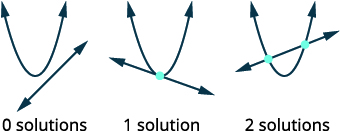</td>
</tr>
<tr valign="top">
<td data-valign="top" data-align="left">The equation <math xmlns="http://www.w3.org/1998/Math/MathML"><mrow><mi>y</mi><mo>=</mo><mi>x</mi><mo>−</mo><mn>2</mn></mrow></math> is solved for <em>y</em>.</td>
<td data-valign="top" data-align="left"></td>
</tr>
<tr valign="top">
<td data-valign="top" data-align="left" />
<td data-valign="top" data-align="left"></td>
</tr>
<tr valign="top">
<td data-valign="top" data-align="left">Substitute <math xmlns="http://www.w3.org/1998/Math/MathML"><mrow><mi>x</mi><mo>−</mo><mn>2</mn></mrow></math> for <em>y</em> in the first equation.</td>
<td data-valign="top" data-align="left"></td>
</tr>
<tr valign="top">
<td data-valign="top" data-align="left">Solve the equation for <em>x</em>.</td>
<td data-valign="top" data-align="left"></td>
</tr>
<tr valign="top">
<td data-valign="top" data-align="left">This doesn’t factor easily, so we can
check the discriminant.</td>
<td data-valign="top" data-align="center" />
</tr>
<tr valign="top">
<td data-valign="top" data-align="left"><math xmlns="http://www.w3.org/1998/Math/MathML"><mtable><mtr><mtd columnalign="center"><msup><mi>b</mi><mn>2</mn></msup><mo>−</mo><mn>4</mn><mi>a</mi><mi>c</mi></mtd></mtr><mtr><mtd columnalign="center"><msup><mrow><mo>(</mo><mrow><mn>−1</mn></mrow><mo>)</mo></mrow><mn>2</mn></msup><mo>−</mo><mn>4</mn><mo>·</mo><mn>1</mn><mo>·</mo><mn>2</mn></mtd></mtr><mtr /><mtr><mtd columnalign="center"><mspace width="0.05em" /><mo>−</mo><mn>7</mn></mtd></mtr></mtable></math></td>
<td data-valign="top" data-align="left">The discriminant is negative, so there is no real solution.
The system has no solution.</td>
</tr>
</tbody></table>

Solve the system by using substitution: <math xmlns="http://www.w3.org/1998/Math/MathML"><mrow><mrow><mo>{</mo><mtable><mtr><mtd columnalign="left"><msup><mi>x</mi><mn>2</mn></msup><mo>−</mo><mi>y</mi><mo>=</mo><mn>0</mn></mtd></mtr><mtr><mtd columnalign="left"><mi>y</mi><mo>=</mo><mn>2</mn><mi>x</mi><mo>−</mo><mn>3</mn></mtd></mtr></mtable></mrow><mo>.</mo></mrow></math>

No solution

Solve the system by using substitution: <math xmlns="http://www.w3.org/1998/Math/MathML"><mrow><mrow><mo>{</mo><mtable><mtr><mtd columnalign="left"><msup><mi>y</mi><mn>2</mn></msup><mo>−</mo><mi>x</mi><mo>=</mo><mn>0</mn></mtd></mtr><mtr><mtd columnalign="left"><mi>y</mi><mo>=</mo><mn>3</mn><mi>x</mi><mo>−</mo><mn>2</mn></mtd></mtr></mtable></mrow><mo>.</mo></mrow></math>

<math xmlns="http://www.w3.org/1998/Math/MathML"><mrow><mrow><mo>(</mo><mrow><mfrac><mn>4</mn><mn>9</mn></mfrac><mo>,</mo><mo>−</mo><mfrac><mn>2</mn><mn>3</mn></mfrac></mrow><mo>)</mo></mrow><mo>,</mo><mrow><mo>(</mo><mrow><mn>1</mn><mo>,</mo><mn>1</mn></mrow><mo>)</mo></mrow></mrow></math>

### Solve a System of Nonlinear Equations Using Elimination

When we studied systems of linear equations, we used the method of elimination to solve the system. We can also use elimination to solve systems of nonlinear equations. It works well when the equations have both variables squared. When using elimination, we try to make the coefficients of one variable to be opposites, so when we add the equations together, that variable is eliminated.

The elimination method is very similar to the elimination method that we used for systems of linear equations. The steps are listed for reference.

Solve a system of equations by elimination.

1.  Identify the graph of each equation. Sketch the possible options for intersection.
2.  Write both equations in standard form.
3.  Make the coefficients of one variable opposites.
    * * *
    {: data-type="newline"}
    
    Decide which variable you will eliminate.
    * * *
    {: data-type="newline"}
    
    Multiply one or both equations so that the coefficients of that variable are opposites.
4.  Add the equations resulting from Step 3 to eliminate one variable.
5.  Solve for the remaining variable.
6.  Substitute each solution from Step 5 into one of the original equations. Then solve for the other variable.
7.  Write each solution as an ordered pair.
8.  Check that each ordered pair is a solution to **both** original equations.
{: type="1" .stepwise}

Solve the system by elimination: <math xmlns="http://www.w3.org/1998/Math/MathML"><mrow><mrow><mo>{</mo><mtable><mtr><mtd columnalign="left"><msup><mi>x</mi><mn>2</mn></msup><mo>+</mo><msup><mi>y</mi><mn>2</mn></msup><mo>=</mo><mn>4</mn></mtd></mtr><mtr><mtd columnalign="left"><msup><mi>x</mi><mn>2</mn></msup><mo>−</mo><mi>y</mi><mo>=</mo><mn>4</mn></mtd></mtr></mtable></mrow><mo>.</mo></mrow></math>

<table class="unnumbered unstyled can-break" summary="Identify each graph of the system, x squared plus y squared is equal to 4, which is a circle, and x squared minus y is equal to 4, which is a parabola. Sketch the possible options for intersection of a circle and a parabola. When a circle and a parabola do not intersect, the system has 0 solutions. When circle and a parabola intersect at a single point, the system has one solution. When a circle and a parabola intersect at two points, the system has two solutions. When a circle and a parabola intersect at three points, the system has three solutions. When a circle and a parabola intersect at four points, the system has four solutions. Both equations are already in standard form. To get opposite coefficients of x squared, we will multiply the second equation by negative 1. The system is now x squared plus y squared is equal to 4 and negative 1 times the quantity x squared minus y is equal to negative 1 times 4. Simplify. The system is now x squared plus y squared is equal to 4 and negative x squared plus y is equal to negative 4. Add the two equations to eliminate x squared. The result is y squared plus y is equal to 0. Solve for y. Write the equation as y times the quantity y plus 1 is equal to 0. The result is y is equal to 0 and y plus 1 is equal to 0, which simplifies to y is equal to negative 1. Substitute y is equal to 0 and y is equal to negative 1 into one of the original equations. For y is equal to 0, x squared minus y is equal to 4 becomes x squared minus 0 is equal to 4. It simplifies to x squared equals 4, and then x is equal to plus or minus 2. For y is equal to negative 1, x squared minus y is equal to 4 becomes x squared minus negative 1 is equal to 4, which simplifies to x squared is equal to 3. The result is x is equal to plus or minus square root of 3. Write each solution as an ordered pair. The ordered pairs are (negative 2, 0), (2, 0), (square root of 3, negative 1), and (negative square root of 3, negative 1). Check that each ordered pair is a solution to both original equations. We will leave the checks for each of the four solutions to you. The solutions are (negative 2, 0), (2, 0), (square root of 3, negative 1), and (negative square root of 3, negative 1)." data-label=""><tbody>
<tr valign="top">
<td data-valign="top" data-align="left">Identify each graph.</td>
<td data-valign="top" data-align="left"></td>
</tr>
<tr valign="top">
<td data-valign="top" data-align="left">Sketch the possible options for
intersection of a circle and a parabola.</td>
<td data-valign="top" data-align="left">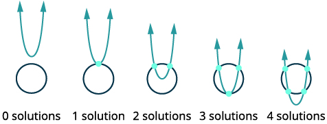</td>
</tr>
<tr valign="top">
<td data-valign="top" data-align="left">Both equations are in standard form.</td>
<td data-valign="top" data-align="left"></td>
</tr>
<tr valign="top">
<td data-valign="top" data-align="left">To get opposite coefficients of <math xmlns="http://www.w3.org/1998/Math/MathML"><mrow><msup><mi>x</mi><mn>2</mn></msup><mo>,</mo></mrow></math>
we will multiply the second equation by <math xmlns="http://www.w3.org/1998/Math/MathML"><mrow><mn>−1</mn><mo>.</mo></mrow></math></td>
<td data-valign="top" data-align="left"></td>
</tr>
<tr valign="top">
<td data-valign="top" data-align="left">Simplify.</td>
<td data-valign="top" data-align="left"></td>
</tr>
<tr valign="top">
<td data-valign="top" data-align="left">Add the two equations to eliminate <math xmlns="http://www.w3.org/1998/Math/MathML"><mrow><msup><mi>x</mi><mn>2</mn></msup><mo>.</mo></mrow></math></td>
<td data-valign="top" data-align="left"></td>
</tr>
<tr valign="top">
<td data-valign="top" data-align="left">Solve for <em>y</em>.</td>
<td data-valign="top" data-align="left"></td>
</tr>
<tr valign="top">
<td data-valign="top" data-align="left" />
<td data-valign="top" data-align="left"></td>
</tr>
<tr valign="top">
<td data-valign="top" data-align="left">Substitute <math xmlns="http://www.w3.org/1998/Math/MathML"><mrow><mi>y</mi><mo>=</mo><mn>0</mn></mrow></math> and <math xmlns="http://www.w3.org/1998/Math/MathML"><mrow><mi>y</mi><mo>=</mo><mn>−1</mn></mrow></math> into one of
the original equations. Then solve for <em>x</em>.</td>
<td data-valign="top" data-align="left"></td>
</tr>
<tr valign="top">
<td data-valign="top" data-align="left" />
<td data-valign="top" data-align="left">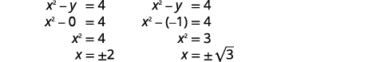</td>
</tr>
<tr valign="top">
<td data-valign="top" data-align="left">Write each solution as an ordered pair.</td>
<td data-valign="top" data-align="center">The ordered pairs are
<math xmlns="http://www.w3.org/1998/Math/MathML"><mrow><mrow><mo>(</mo><mrow><mn>−2</mn><mo>,</mo><mn>0</mn></mrow><mo>)</mo></mrow></mrow></math> <math xmlns="http://www.w3.org/1998/Math/MathML"><mrow><mrow><mo>(</mo><mrow><mn>2</mn><mo>,</mo><mn>0</mn></mrow><mo>)</mo></mrow><mo>.</mo></mrow></math>
<math xmlns="http://www.w3.org/1998/Math/MathML"><mrow><mrow><mo>(</mo><mrow><msqrt><mn>3</mn></msqrt><mo>,</mo><mn>−1</mn></mrow><mo>)</mo></mrow><mrow><mo>(</mo><mrow><mtext>−</mtext><msqrt><mn>3</mn></msqrt><mo>,</mo><mn>−1</mn></mrow><mo>)</mo></mrow></mrow></math></td>
</tr>
<tr valign="top">
<td data-valign="top" data-align="left">Check that each ordered pair is a
solution to <strong>both</strong> original equations.</td>
<td data-valign="top" data-align="center" />
</tr>
<tr valign="top">
<td data-valign="top" data-align="left">We will leave the checks for each of
the four solutions to you.</td>
<td data-valign="top" data-align="center">The solutions are <math xmlns="http://www.w3.org/1998/Math/MathML"><mrow><mrow><mo>(</mo><mrow><mn>−2</mn><mo>,</mo><mn>0</mn></mrow><mo>)</mo></mrow><mo>,</mo></mrow></math> <math xmlns="http://www.w3.org/1998/Math/MathML"><mrow><mrow><mo>(</mo><mrow><mn>2</mn><mo>,</mo><mn>0</mn></mrow><mo>)</mo></mrow><mo>,</mo></mrow></math> <math xmlns="http://www.w3.org/1998/Math/MathML"><mrow><mrow><mo>(</mo><mrow><msqrt><mn>3</mn></msqrt><mo>,</mo><mn>−1</mn></mrow><mo>)</mo></mrow><mo>,</mo></mrow></math> and
<math xmlns="http://www.w3.org/1998/Math/MathML"><mrow><mrow><mo>(</mo><mrow><mtext>−</mtext><msqrt><mn>3</mn></msqrt><mo>,</mo><mn>−1</mn></mrow><mo>)</mo></mrow><mo>.</mo></mrow></math></td>
</tr>
</tbody></table>

Solve the system by elimination: <math xmlns="http://www.w3.org/1998/Math/MathML"><mrow><mrow><mo>{</mo><mtable><mtr><mtd columnalign="left"><msup><mi>x</mi><mn>2</mn></msup><mo>+</mo><msup><mi>y</mi><mn>2</mn></msup><mo>=</mo><mn>9</mn></mtd></mtr><mtr><mtd columnalign="left"><msup><mi>x</mi><mn>2</mn></msup><mo>−</mo><mi>y</mi><mo>=</mo><mn>9</mn></mtd></mtr></mtable></mrow><mo>.</mo></mrow></math>

<math xmlns="http://www.w3.org/1998/Math/MathML"><mrow><mrow><mo>(</mo><mrow><mn>−3</mn><mo>,</mo><mn>0</mn></mrow><mo>)</mo></mrow><mo>,</mo><mrow><mo>(</mo><mrow><mn>3</mn><mo>,</mo><mn>0</mn></mrow><mo>)</mo></mrow><mo>,</mo><mrow><mo>(</mo><mrow><mn>−2</mn><msqrt><mn>2</mn></msqrt><mo>,</mo><mn>−1</mn></mrow><mo>)</mo></mrow><mo>,</mo><mrow><mo>(</mo><mrow><mn>2</mn><msqrt><mn>2</mn></msqrt><mo>,</mo><mn>−1</mn></mrow><mo>)</mo></mrow></mrow></math>

Solve the system by elimination: <math xmlns="http://www.w3.org/1998/Math/MathML"><mrow><mrow><mo>{</mo><mtable><mtr><mtd columnalign="left"><msup><mi>x</mi><mn>2</mn></msup><mo>+</mo><msup><mi>y</mi><mn>2</mn></msup><mo>=</mo><mn>1</mn></mtd></mtr><mtr><mtd columnalign="left"><mo>−</mo><mi>x</mi><mo>+</mo><msup><mi>y</mi><mn>2</mn></msup><mo>=</mo><mn>1</mn></mtd></mtr></mtable></mrow><mo>.</mo></mrow></math>

<math xmlns="http://www.w3.org/1998/Math/MathML"><mrow><mrow><mo>(</mo><mrow><mn>−1</mn><mo>,</mo><mn>0</mn></mrow><mo>)</mo></mrow><mo>,</mo><mrow><mo>(</mo><mrow><mn>0</mn><mo>,</mo><mn>1</mn></mrow><mo>)</mo></mrow><mo>,</mo><mrow><mo>(</mo><mrow><mn>0</mn><mo>,</mo><mn>−1</mn></mrow><mo>)</mo></mrow></mrow></math>

There are also four options when we consider a circle and a hyperbola.

Solve the system by elimination: <math xmlns="http://www.w3.org/1998/Math/MathML"><mrow><mrow><mo>{</mo><mtable><mtr><mtd columnalign="left"><msup><mi>x</mi><mn>2</mn></msup><mo>+</mo><msup><mi>y</mi><mn>2</mn></msup><mo>=</mo><mn>7</mn></mtd></mtr><mtr><mtd columnalign="left"><msup><mi>x</mi><mn>2</mn></msup><mo>−</mo><msup><mi>y</mi><mn>2</mn></msup><mo>=</mo><mn>1</mn></mtd></mtr></mtable></mrow><mo>.</mo></mrow></math>

<table class="unnumbered unstyled can-break" summary="Identify each graph of the system, x squared plus y squared is equal to 7, which is a circle, and x squared minus y squared is equal to 1, which is a hyperbola. Sketch the possible options for intersection of a circle and a hyperbola. When a circle and a hyperbola do not intersect, the system has 0 solutions. When circle and a hyperbola intersect at a single point, the system has one solution. When a circle and a hyperbola intersect at two points, the system has two solutions. When a circle and a hyperbola intersect at three points, the system has three solutions. When a circle and a hyperbola intersect at four points, the system has four solutions. Both equations are already in standard form. The coefficients of y squared are opposite, so we will add the equations. The result is 2 x squared is equal to 8. Simplify. The result is x squared is equal to 4, which further simplifies to x is equal to plus or minus 2. Substitute x is equal to 2 and x is equal to negative 2 into one of the original equations. Then solve for y. For x is equal 2, x squared plus y squared is equal to 7 becomes 2 squared plus y squared is equal to 7. 4 plus y squared is equal to 7, which simplifies to y squared is equal to 3. So, the result is y is equal to plus or minus square root of 3. For x is equal to negative 2, x squared plus y squared is equal to 7 becomes negative 2 squared plus y squared is equal to 7. 4 plus y squared is equal to 7, which simplifies to y squared is equal to 3. The result is y is equal to plus or minus square root of 3. Write each solution as an ordered pair. The ordered pairs are (negative 2, square root of 3), (negative 2, negative square root of 3), (2, square root of 3), and (2, negative square root of 3). Check that the ordered pair is a solution to both original equations. We will leave the checks for each of the four solutions to you. The solutions are (negative 2, square root of 3), (negative 2, negative square root of 3), (2, square root of 3), and (2, negative square root of 3)." data-label=""><tbody>
<tr valign="top">
<td data-valign="top" data-align="left">Identify each graph.</td>
<td data-valign="top" data-align="center"><math xmlns="http://www.w3.org/1998/Math/MathML"><mrow><mrow><mo>{</mo><mtable><mtr><mtd columnalign="left"><msup><mi>x</mi><mn>2</mn></msup><mo>+</mo><msup><mi>y</mi><mn>2</mn></msup><mo>=</mo><mn>7</mn></mtd><mtd /><mtd columnalign="left"><mtext>circle</mtext></mtd></mtr><mtr><mtd columnalign="left"><msup><mi>x</mi><mn>2</mn></msup><mo>−</mo><msup><mi>y</mi><mn>2</mn></msup><mo>=</mo><mn>1</mn></mtd><mtd /><mtd columnalign="left"><mtext>hyperbola</mtext></mtd></mtr></mtable></mrow></mrow></math></td>
</tr>
<tr valign="top">
<td data-valign="top" data-align="left">Sketch the possible options for intersection
of a circle and hyperbola.</td>
<td data-valign="top" data-align="center">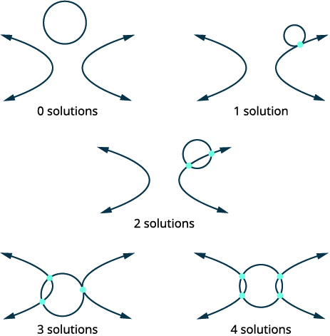</td>
</tr>
<tr valign="top">
<td data-valign="top" data-align="left">Both equations are in standard form.</td>
<td data-valign="top" data-align="center"><math xmlns="http://www.w3.org/1998/Math/MathML"><mrow><mrow><mo>{</mo><mtable><mtr><mtd columnalign="left"><msup><mi>x</mi><mn>2</mn></msup><mo>+</mo><msup><mi>y</mi><mn>2</mn></msup><mo>=</mo><mn>7</mn></mtd></mtr><mtr><mtd columnalign="left"><msup><mi>x</mi><mn>2</mn></msup><mo>−</mo><msup><mi>y</mi><mn>2</mn></msup><mo>=</mo><mn>1</mn></mtd></mtr></mtable></mrow></mrow></math></td>
</tr>
<tr valign="top">
<td data-valign="top" data-align="left">The coefficients of <math xmlns="http://www.w3.org/1998/Math/MathML"><mrow><msup><mi>y</mi><mn>2</mn></msup></mrow></math> are opposite, so we
will add the equations.</td>
<td data-valign="top" data-align="center"><math xmlns="http://www.w3.org/1998/Math/MathML"><mtable><mtr><mtd columnalign="left"><munder accentunder="true"><mrow><mrow><mo>{</mo><mtable><mtr><mtd columnalign="left"><msup><mi>x</mi><mn>2</mn></msup><mo>+</mo><msup><mi>y</mi><mn>2</mn></msup><mo>=</mo><mn>7</mn></mtd></mtr><mtr><mtd columnalign="left"><msup><mi>x</mi><mn>2</mn></msup><mo>−</mo><msup><mi>y</mi><mn>2</mn></msup><mo>=</mo><mn>1</mn></mtd></mtr></mtable></mrow></mrow><mo stretchy="true">\_\_\_\_\_\_\_\_\_\_</mo></munder></mtd></mtr><mtr /><mtr><mtd columnalign="left"><mn>2</mn><msup><mi>x</mi><mn>2</mn></msup><mspace width="2em" /><mo>=</mo><mn>8</mn></mtd></mtr></mtable></math></td>
</tr>
<tr valign="top">
<td data-valign="top" data-align="left">Simplify.</td>
<td data-valign="top" data-align="center"><math xmlns="http://www.w3.org/1998/Math/MathML"><mrow><mtable><mtr><mtd columnalign="right"><msup><mi>x</mi><mn>2</mn></msup></mtd><mtd columnalign="left"><mo>=</mo></mtd><mtd columnalign="left"><mn>4</mn></mtd></mtr><mtr><mtd columnalign="right"><mi>x</mi></mtd><mtd columnalign="left"><mo>=</mo></mtd><mtd columnalign="left"><mtext>±</mtext><mn>2</mn></mtd></mtr></mtable></mrow></math>
<math xmlns="http://www.w3.org/1998/Math/MathML"><mrow><mi>x</mi><mo>=</mo><mn>2</mn><mspace width="1.5em" /><mi>x</mi><mo>=</mo><mn>−2</mn></mrow></math></td>
</tr>
<tr valign="top">
<td data-valign="top" data-align="left">Substitute <math xmlns="http://www.w3.org/1998/Math/MathML"><mrow><mi>x</mi><mo>=</mo><mn>2</mn></mrow></math> and <math xmlns="http://www.w3.org/1998/Math/MathML"><mrow><mi>x</mi><mo>=</mo><mn>−2</mn></mrow></math> into one of the
original equations. Then solve for <em>y</em>.</td>
<td data-valign="top" data-align="center"><math xmlns="http://www.w3.org/1998/Math/MathML"><mrow><mtable><mtr><mtd columnalign="right"><msup><mi>x</mi><mn>2</mn></msup><mo>+</mo><msup><mi>y</mi><mn>2</mn></msup></mtd><mtd columnalign="left"><mo>=</mo></mtd><mtd columnalign="left"><mn>7</mn></mtd><mtd /><mtd /><mtd /><mtd columnalign="right"><msup><mi>x</mi><mn>2</mn></msup><mo>+</mo><msup><mi>y</mi><mn>2</mn></msup></mtd><mtd columnalign="left"><mo>=</mo></mtd><mtd columnalign="left"><mn>7</mn></mtd></mtr><mtr><mtd columnalign="right"><msup><mn>2</mn><mn>2</mn></msup><mo>+</mo><msup><mi>y</mi><mn>2</mn></msup></mtd><mtd columnalign="left"><mo>=</mo></mtd><mtd columnalign="left"><mn>7</mn></mtd><mtd /><mtd /><mtd /><mtd columnalign="right"><msup><mrow><mrow><mo>(</mo><mrow><mn>−2</mn></mrow><mo>)</mo></mrow></mrow><mn>2</mn></msup><mo>+</mo><msup><mi>y</mi><mn>2</mn></msup></mtd><mtd columnalign="left"><mo>=</mo></mtd><mtd columnalign="left"><mn>7</mn></mtd></mtr><mtr><mtd columnalign="right"><mn>4</mn><mo>+</mo><msup><mi>y</mi><mn>2</mn></msup></mtd><mtd columnalign="left"><mo>=</mo></mtd><mtd columnalign="left"><mn>7</mn></mtd><mtd /><mtd /><mtd /><mtd columnalign="right"><mn>4</mn><mo>+</mo><msup><mi>y</mi><mn>2</mn></msup></mtd><mtd columnalign="left"><mo>=</mo></mtd><mtd columnalign="left"><mn>7</mn></mtd></mtr><mtr><mtd columnalign="right"><msup><mi>y</mi><mn>2</mn></msup></mtd><mtd columnalign="left"><mo>=</mo></mtd><mtd columnalign="left"><mn>3</mn></mtd><mtd /><mtd /><mtd /><mtd columnalign="right"><msup><mi>y</mi><mn>2</mn></msup></mtd><mtd columnalign="left"><mo>=</mo></mtd><mtd columnalign="left"><mn>3</mn></mtd></mtr><mtr><mtd columnalign="right"><mi>y</mi></mtd><mtd columnalign="left"><mo>=</mo></mtd><mtd columnalign="left"><mtext>±</mtext><msqrt><mn>3</mn></msqrt></mtd><mtd /><mtd /><mtd /><mtd columnalign="right"><mi>y</mi></mtd><mtd columnalign="left"><mo>=</mo></mtd><mtd columnalign="left"><mtext>±</mtext><msqrt><mn>3</mn></msqrt></mtd></mtr></mtable></mrow></math></td>
</tr>
<tr valign="top">
<td data-valign="top" data-align="left">Write each solution as an ordered pair.</td>
<td data-valign="top" data-align="center">The ordered pairs are <math xmlns="http://www.w3.org/1998/Math/MathML"><mrow><mrow><mo>(</mo><mrow><mn>−2</mn><mo>,</mo><msqrt><mn>3</mn></msqrt></mrow><mo>)</mo></mrow><mo>,</mo></mrow></math> <math xmlns="http://www.w3.org/1998/Math/MathML"><mrow><mrow><mo>(</mo><mrow><mn>−2</mn><mo>,</mo><mtext>−</mtext><msqrt><mn>3</mn></msqrt></mrow><mo>)</mo></mrow><mo>,</mo></mrow></math>
<math xmlns="http://www.w3.org/1998/Math/MathML"><mrow><mrow><mo>(</mo><mrow><mn>2</mn><mo>,</mo><msqrt><mn>3</mn></msqrt></mrow><mo>)</mo></mrow><mo>,</mo></mrow></math> and <math xmlns="http://www.w3.org/1998/Math/MathML"><mrow><mrow><mo>(</mo><mrow><mn>2</mn><mo>,</mo><mtext>−</mtext><msqrt><mn>3</mn></msqrt></mrow><mo>)</mo></mrow><mo>.</mo></mrow></math></td>
</tr>
<tr valign="top">
<td data-valign="top" data-align="left">Check that the ordered pair is a solution to
<strong>both</strong> original equations.</td>
<td data-valign="top" data-align="left" />
</tr>
<tr valign="top">
<td data-valign="top" data-align="left">We will leave the checks for each of the four
solutions to you.</td>
<td data-valign="top" data-align="center">The solutions are <math xmlns="http://www.w3.org/1998/Math/MathML"><mrow><mrow><mo>(</mo><mrow><mn>−2</mn><mo>,</mo><msqrt><mn>3</mn></msqrt></mrow><mo>)</mo></mrow><mo>,</mo></mrow></math> <math xmlns="http://www.w3.org/1998/Math/MathML"><mrow><mrow><mo>(</mo><mrow><mn>−2</mn><mo>,</mo><mtext>−</mtext><msqrt><mn>3</mn></msqrt></mrow><mo>)</mo></mrow><mo>,</mo></mrow></math> <math xmlns="http://www.w3.org/1998/Math/MathML"><mrow><mrow><mo>(</mo><mrow><mn>2</mn><mo>,</mo><msqrt><mn>3</mn></msqrt></mrow><mo>)</mo></mrow><mo>,</mo></mrow></math>
and <math xmlns="http://www.w3.org/1998/Math/MathML"><mrow><mrow><mo>(</mo><mrow><mn>2</mn><mo>,</mo><mtext>−</mtext><msqrt><mn>3</mn></msqrt></mrow><mo>)</mo></mrow><mo>.</mo></mrow></math></td>
</tr>
</tbody></table>

Solve the system by elimination: <math xmlns="http://www.w3.org/1998/Math/MathML"><mrow><mrow><mo>{</mo><mtable><mtr><mtd columnalign="left"><msup><mi>x</mi><mn>2</mn></msup><mo>+</mo><msup><mi>y</mi><mn>2</mn></msup><mo>=</mo><mn>25</mn></mtd></mtr><mtr><mtd columnalign="left"><msup><mi>y</mi><mn>2</mn></msup><mo>−</mo><msup><mi>x</mi><mn>2</mn></msup><mo>=</mo><mn>7</mn></mtd></mtr></mtable></mrow><mo>.</mo></mrow></math>

<math xmlns="http://www.w3.org/1998/Math/MathML"><mrow><mrow><mo>(</mo><mrow><mn>−3</mn><mo>,</mo><mn>−4</mn></mrow><mo>)</mo></mrow><mo>,</mo><mrow><mo>(</mo><mrow><mn>−3</mn><mo>,</mo><mn>4</mn></mrow><mo>)</mo></mrow><mo>,</mo><mrow><mo>(</mo><mrow><mn>3</mn><mo>,</mo><mn>−4</mn></mrow><mo>)</mo></mrow><mo>,</mo><mrow><mo>(</mo><mrow><mn>3</mn><mo>,</mo><mn>4</mn></mrow><mo>)</mo></mrow></mrow></math>

Solve the system by elimination: <math xmlns="http://www.w3.org/1998/Math/MathML"><mrow><mrow><mo>{</mo><mtable><mtr><mtd columnalign="left"><msup><mi>x</mi><mn>2</mn></msup><mo>+</mo><msup><mi>y</mi><mn>2</mn></msup><mo>=</mo><mn>4</mn></mtd></mtr><mtr><mtd columnalign="left"><msup><mi>x</mi><mn>2</mn></msup><mo>−</mo><msup><mi>y</mi><mn>2</mn></msup><mo>=</mo><mn>4</mn></mtd></mtr></mtable></mrow><mo>.</mo></mrow></math>

<math xmlns="http://www.w3.org/1998/Math/MathML"><mrow><mrow><mo>(</mo><mrow><mn>−2</mn><mo>,</mo><mn>0</mn></mrow><mo>)</mo></mrow><mo>,</mo><mrow><mo>(</mo><mrow><mn>2</mn><mo>,</mo><mn>0</mn></mrow><mo>)</mo></mrow></mrow></math>

### Use a System of Nonlinear Equations to Solve Applications

Systems of nonlinear equations can be used to model and solve many applications. We will look at an everyday geometric situation as our example.

The difference of the squares of two numbers is 15. The sum of the numbers is 5. Find the numbers.

<table class="unnumbered unstyled can-break" summary="Identify what we are looking for. We are looking for two different numbers. Define the variables. Let x be equal to the first number. Let y be equal to the second number. Translate the information into a system of equations. The first sentence is &#x2018;The difference of the squares of two numbers is 15.&#x2019; Represent it with x squared minus y squared is equal to 15. The second sentence is &#x2018;The sum of the numbers is 5.&#x2019; Represent it with x plus y is equal to 5. The equations x squared minus y squared is equal to 15 and x plus y is equal to 5 form the system. Solve the system by substitution. Solve the second equation for x. The result is x is equal to 5 minus y. Substitute x into the first equation, x squared minus y squared is equal to 15. It becomes the quantity 5 minus y squared minus y squared is equal to 15. Expand and simplify. The result is the quantity 25 minus 10 y plus y squared end quantity minus y squared is equal to 15. 25 minus 10 y plus y squared minus y squared is equal to 15. 25 minus 10 y is equal to 15. Solve for y. Negative y is equal to negative 10. The result is y is equal to 1. Substitute back into the second equation, x plus y is equal to 5. It becomes x plus 1 is equal to 5, which simplifies to x is equal to 4. The numbers are 1 and 4." data-label=""><tbody>
<tr valign="top">
<td data-valign="top" data-align="left">Identify what we are looking for.</td>
<td data-valign="top" data-align="left">Two different numbers.</td>
</tr>
<tr valign="top">
<td data-valign="top" data-align="left">Define the variables.</td>
<td data-valign="top" data-align="left"><math xmlns="http://www.w3.org/1998/Math/MathML"><mrow><mi>x</mi><mo>=</mo></mrow></math> first number
<math xmlns="http://www.w3.org/1998/Math/MathML"><mrow><mi>y</mi><mo>=</mo></mrow></math> second number</td>
</tr>
<tr valign="top">
<td data-valign="top" data-align="left">Translate the information into a system of
equations.</td>
<td data-valign="top" data-align="left" />
</tr>
<tr valign="top">
<td data-valign="top" data-align="left">First sentence.</td>
<td data-valign="top" data-align="justify">The difference of the squares of two numbers is 15.</td>
</tr>
<tr valign="top">
<td data-valign="top" data-align="left" />
<td data-valign="top" data-align="left"></td>
</tr>
<tr valign="top">
<td data-valign="top" data-align="left">Second sentence.</td>
<td data-valign="top" data-align="left">The sum of the numbers is 5.</td>
</tr>
<tr valign="top">
<td data-valign="top" data-align="left" />
<td data-valign="top" data-align="left"></td>
</tr>
<tr valign="top">
<td data-valign="top" data-align="left">Solve the system by substitution</td>
<td data-valign="top" data-align="left">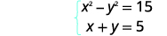</td>
</tr>
<tr valign="top">
<td data-valign="top" data-align="left">Solve the second equation for <em>x</em>.</td>
<td data-valign="top" data-align="left"></td>
</tr>
<tr valign="top">
<td data-valign="top" data-align="left">Substitute <em>x</em> into the first equation.</td>
<td data-valign="top" data-align="left"></td>
</tr>
<tr valign="top">
<td data-valign="top" data-align="left" />
<td data-valign="top" data-align="left"></td>
</tr>
<tr valign="top">
<td data-valign="top" data-align="left">Expand and simplify.</td>
<td data-valign="top" data-align="left"></td>
</tr>
<tr valign="top">
<td data-valign="top" data-align="left" />
<td data-valign="top" data-align="left">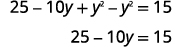</td>
</tr>
<tr valign="top">
<td data-valign="top" data-align="left">Solve for <em>y</em>.</td>
<td data-valign="top" data-align="left"></td>
</tr>
<tr valign="top">
<td data-valign="top" data-align="left" />
<td data-valign="top" data-align="left"></td>
</tr>
<tr valign="top">
<td data-valign="top" data-align="left">Substitute back into the second equation.</td>
<td data-valign="top" data-align="left"></td>
</tr>
<tr valign="top">
<td data-valign="top" data-align="left" />
<td data-valign="top" data-align="left">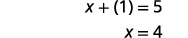</td>
</tr>
<tr valign="top">
<td data-valign="top" data-align="left" />
<td data-valign="top" data-align="center">The numbers are 1 and 4.</td>
</tr>
</tbody></table>

The difference of the squares of two numbers is <math xmlns="http://www.w3.org/1998/Math/MathML"><mrow><mn>−20</mn><mo>.</mo></mrow></math>

 The sum of the numbers is 10. Find the numbers.

4 and 6

The difference of the squares of two numbers is 35. The sum of the numbers is <math xmlns="http://www.w3.org/1998/Math/MathML"><mrow><mn>−1</mn><mo>.</mo></mrow></math>

 Find the numbers.

<math xmlns="http://www.w3.org/1998/Math/MathML"><mrow><mn>−18</mn></mrow></math>

 and 17

Myra purchased a small 25” TV for her kitchen. The size of a TV is measured on the diagonal of the screen. The screen also has an area of 300 square inches. What are the length and width of the TV screen?

<table class="unnumbered unstyled can-break" summary="Identify what we are looking for. We are looking for the length and width of the rectangle. Define the variables. Let x be equal to the width of the rectangle. Let y be equal to the length of the rectangle. Draw a diagram to help visualize the situation. The diagram is a rectangle with the width labeled x, the length labeled y, and its diagonal labeled 25 inches. Translate the information into a system of equations. &#x2018;The diagonal of the right triangle is 25 is represented by the equation x squared plus y squared is equal to 25 squared, which is simplified to x squared plus y squared is equal to 625. &#x2018;The area of the rectangle is 300&#x2019; is represented by the equation x y is equal to 300. The equations form the system x squared plus y squared is equal to 625 and x y is equal to 300. Solve the system using substitution. Solve x y is equal to 300 for x. The result is x is equal to 300 divided by y. Substitute the expression for x into the first equation, x squared plus y squared is equal to 625. The result is the quantity 300 divided by y end quantity squared plus y squared is equal to 625. Simplify. The result is the quantity 90,000 divided by y squared end quantity plus y squared is equal to 625. Multiply each side of the equation by squared to clear the fractions. The result is 90,00 plus y to the fourth power is equal to 625 y squared. Put in standard form. The result is y to the fourth power minus 625 y squared plus 90,000 is equal to 0. Solve by factoring. The factored equation is the quantity y squared minus 225 times the quantity y squared minus 400 is equal to 0. The result is y squared minus 225 is equal to 0 or y squared minus 400 is equal to 0. They simplify to y squared is equal to 225 or y squared is equal to 400. The results are y is equal to plus or minus 15 or y is equal to plus or minus 20. Since y is a side of a rectangle, we discard the negative values and keep y is equal to 15 and y is equal to 20. Substitute back into the second equation, x y is equal to 300. For y is equal to 15, x times 15 is equal to 300, which simplifies to x is equal to 20. For y is equal to 20, x times 20 is equal to 300, which simplifies to x is equal to 15. If the length is 15 inches, the width is 20 inches. If the length s 20 inches, the width is 15 inches." data-label=""><tbody>
<tr valign="top">
<td data-valign="top" data-align="left">Identify what we are looking for.</td>
<td data-valign="top" data-align="left">The length and width of the rectangle</td>
</tr>
<tr valign="top">
<td data-valign="top" data-align="left">Define the variables.</td>
<td data-valign="top" data-align="left">Let <math xmlns="http://www.w3.org/1998/Math/MathML"><mrow><mi>x</mi><mo>=</mo></mrow></math> width of the rectangle
<math xmlns="http://www.w3.org/1998/Math/MathML"><mrow><mspace width="1.5em" /><mi>y</mi><mo>=</mo></mrow></math> length of the rectangle</td>
</tr>
<tr valign="top">
<td data-valign="top" data-align="left">Draw a diagram to help visualize the situation.</td>
<td data-valign="top" data-align="left">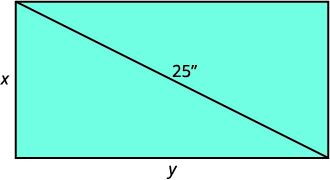</td>
</tr>
<tr valign="top">
<td data-valign="top" data-align="left" />
<td data-valign="top" data-align="center">Area is 300 square inches.</td>
</tr>
<tr valign="top">
<td data-valign="top" data-align="left">Translate the information into a system of
equations.</td>
<td data-valign="top" data-align="left">The diagonal of the right triangle is 25 inches.</td>
</tr>
<tr valign="top">
<td data-valign="top" data-align="left" />
<td data-valign="top" data-align="left"></td>
</tr>
<tr valign="top">
<td data-valign="top" data-align="left" />
<td data-valign="top" data-align="center">The area of the rectangle is 300 square inches.</td>
</tr>
<tr valign="top">
<td data-valign="top" data-align="left" />
<td data-valign="top" data-align="left"></td>
</tr>
<tr valign="top">
<td data-valign="top" data-align="left">Solve the system using substitution.</td>
<td data-valign="top" data-align="left"></td>
</tr>
<tr valign="top">
<td data-valign="top" data-align="left">Solve the second equation for <em>x</em>.</td>
<td data-valign="top" data-align="left"></td>
</tr>
<tr valign="top">
<td data-valign="top" data-align="left">Substitute <em>x</em> into the first equation.</td>
<td data-valign="top" data-align="left"></td>
</tr>
<tr valign="top">
<td data-valign="top" data-align="left" />
<td data-valign="top" data-align="left"></td>
</tr>
<tr valign="top">
<td data-valign="top" data-align="left">Simplify.</td>
<td data-valign="top" data-align="left"></td>
</tr>
<tr valign="top">
<td data-valign="top" data-align="left">Multiply by <math xmlns="http://www.w3.org/1998/Math/MathML"><mrow><msup><mi>y</mi><mn>2</mn></msup></mrow></math> to clear the fractions.</td>
<td data-valign="top" data-align="left"></td>
</tr>
<tr valign="top">
<td data-valign="top" data-align="left">Put in standard form.</td>
<td data-valign="top" data-align="left"></td>
</tr>
<tr valign="top">
<td data-valign="top" data-align="left">Solve by factoring.</td>
<td data-valign="top" data-align="left"></td>
</tr>
<tr valign="top">
<td data-valign="top" data-align="left" />
<td data-valign="top" data-align="left"></td>
</tr>
<tr valign="top">
<td data-valign="top" data-align="left" />
<td data-valign="top" data-align="left"></td>
</tr>
<tr valign="top">
<td data-valign="top" data-align="left">Since <em>y</em> is a side of the rectangle, we discard
the negative values.</td>
<td data-valign="top" data-align="left"></td>
</tr>
<tr valign="top">
<td data-valign="top" data-align="left">Substitute back into the second equation.</td>
<td data-valign="top" data-align="left"></td>
</tr>
<tr valign="top">
<td data-valign="top" data-align="left" />
<td data-valign="top" data-align="left"></td>
</tr>
<tr valign="top">
<td data-valign="top" data-align="left" />
<td data-valign="top" data-align="left">If the length is 15 inches, the width is 20 inches.</td>
</tr>
<tr valign="top">
<td data-valign="top" data-align="left" />
<td data-valign="top" data-align="left">If the length is 20 inches, the width is 15 inches.</td>
</tr>
</tbody></table>

Edgar purchased a small 20” TV for his garage. The size of a TV is measured on the diagonal of the screen. The screen also has an area of 192 square inches. What are the length and width of the TV screen?

If the length is 12 inches, the width is 16 inches. If the length is 16 inches, the width is 12 inches.

The Harper family purchased a small microwave for their family room. The diagonal of the door measures 15 inches. The door also has an area of 108 square inches. What are the length and width of the microwave door?

If the length is 12 inches, the width is 9 inches. If the length is 9 inches, the width is 12 inches.

Access these online resources for additional instructions and practice with solving nonlinear equations.

* [Nonlinear Systems of Equations][1]
* [Solve a System of Nonlinear Equations][2]
* [Solve a System of Nonlinear Equations by Elimination][3]
* [System of Nonlinear Equations – Area and Perimeter Application][4]
{: data-display="block"}

### Key Concepts

* **How to solve a system of nonlinear equations by graphing.**
  1.  Identify the graph of each equation. Sketch the possible options for intersection.
  2.  Graph the first equation.
  3.  Graph the second equation on the same rectangular coordinate system.
  4.  Determine whether the graphs intersect.
  5.  Identify the points of intersection.
  6.  Check that each ordered pair is a solution to both original equations.
  {: type="1" .stepwise}

* **How to solve a system of nonlinear equations by substitution.**
  1.  Identify the graph of each equation. Sketch the possible options for intersection.
      * * *
      {: data-type="newline"}
      
      * * *
      {: data-type="newline"}
      
      * * *
      {: data-type="newline"}
  
  2.  Solve one of the equations for either variable.
  3.  Substitute the expression from Step 2 into the other equation.
  4.  Solve the resulting equation.
  5.  Substitute each solution in Step 4 into one of the original equations to find the other variable.
  6.  Write each solution as an ordered pair.
  7.  Check that each ordered pair is a solution to **both** original equations.
  {: type="1" .stepwise}

* **How to solve a system of equations by elimination.**
  1.  Identify the graph of each equation. Sketch the possible options for intersection.
  2.  Write both equations in standard form.
  3.  Make the coefficients of one variable opposites.
      * * *
      {: data-type="newline"}
      
      Decide which variable you will eliminate.
      * * *
      {: data-type="newline"}
      
      Multiply one or both equations so that the coefficients of that variable are opposites.
  4.  Add the equations resulting from Step 3 to eliminate one variable.
  5.  Solve for the remaining variable.
  6.  Substitute each solution from Step 5 into one of the original equations. Then solve for the other variable.
  7.  Write each solution as an ordered pair.
  8.  Check that each ordered pair is a solution to **both** original equations.
  {: type="1" .stepwise}
{: data-bullet-style="bullet"}

<section data-depth="1" class="section-exercises" markdown="1">
#### Practice Makes Perfect

**Solve a System of Nonlinear Equations Using Graphing**

In the following exercises, solve the system of equations by using graphing.

<math xmlns="http://www.w3.org/1998/Math/MathML"><mrow><mrow><mo>{</mo><mtable><mtr><mtd columnalign="left"><mi>y</mi><mo>=</mo><mn>2</mn><mi>x</mi><mo>+</mo><mn>2</mn></mtd></mtr><mtr><mtd columnalign="left"><mi>y</mi><mo>=</mo><mtext>−</mtext><msup><mi>x</mi><mn>2</mn></msup><mo>+</mo><mn>2</mn></mtd></mtr></mtable></mrow></mrow></math>

<math xmlns="http://www.w3.org/1998/Math/MathML"><mrow><mrow><mo>{</mo><mtable><mtr><mtd columnalign="left"><mi>y</mi><mo>=</mo><mn>6</mn><mi>x</mi><mo>−</mo><mn>4</mn></mtd></mtr><mtr><mtd columnalign="left"><mi>y</mi><mo>=</mo><mn>2</mn><msup><mi>x</mi><mn>2</mn></msup></mtd></mtr></mtable></mrow></mrow></math>

  

<math xmlns="http://www.w3.org/1998/Math/MathML"><mrow><mrow><mo>{</mo><mtable><mtr><mtd columnalign="left"><mi>x</mi><mo>+</mo><mi>y</mi><mo>=</mo><mn>2</mn></mtd></mtr><mtr><mtd columnalign="left"><mi>x</mi><mo>=</mo><msup><mi>y</mi><mn>2</mn></msup></mtd></mtr></mtable></mrow></mrow></math>

<math xmlns="http://www.w3.org/1998/Math/MathML"><mrow><mrow><mo>{</mo><mtable><mtr><mtd columnalign="left"><mi>x</mi><mo>−</mo><mi>y</mi><mo>=</mo><mn>−2</mn></mtd></mtr><mtr><mtd columnalign="left"><mi>x</mi><mo>=</mo><msup><mi>y</mi><mn>2</mn></msup></mtd></mtr></mtable></mrow></mrow></math>

  

<math xmlns="http://www.w3.org/1998/Math/MathML"><mrow><mrow><mo>{</mo><mtable><mtr><mtd columnalign="left"><mi>y</mi><mo>=</mo><mfrac><mn>3</mn><mn>2</mn></mfrac><mi>x</mi><mo>+</mo><mn>3</mn></mtd></mtr><mtr><mtd columnalign="left"><mi>y</mi><mo>=</mo><mtext>−</mtext><msup><mi>x</mi><mn>2</mn></msup><mo>+</mo><mn>2</mn></mtd></mtr></mtable></mrow></mrow></math>

<math xmlns="http://www.w3.org/1998/Math/MathML"><mrow><mrow><mo>{</mo><mtable><mtr><mtd columnalign="left"><mi>y</mi><mo>=</mo><mi>x</mi><mo>−</mo><mn>1</mn></mtd></mtr><mtr><mtd columnalign="left"><mi>y</mi><mo>=</mo><msup><mi>x</mi><mn>2</mn></msup><mo>+</mo><mn>1</mn></mtd></mtr></mtable></mrow></mrow></math>

  

<math xmlns="http://www.w3.org/1998/Math/MathML"><mrow><mrow><mo>{</mo><mtable><mtr><mtd columnalign="left"><mi>x</mi><mo>=</mo><mn>−2</mn></mtd></mtr><mtr><mtd columnalign="left"><msup><mi>x</mi><mn>2</mn></msup><mo>+</mo><msup><mi>y</mi><mn>2</mn></msup><mo>=</mo><mn>4</mn></mtd></mtr></mtable></mrow></mrow></math>

<math xmlns="http://www.w3.org/1998/Math/MathML"><mrow><mrow><mo>{</mo><mtable><mtr><mtd columnalign="left"><mi>y</mi><mo>=</mo><mn>−4</mn></mtd></mtr><mtr><mtd columnalign="left"><msup><mi>x</mi><mn>2</mn></msup><mo>+</mo><msup><mi>y</mi><mn>2</mn></msup><mo>=</mo><mn>16</mn></mtd></mtr></mtable></mrow></mrow></math>

  

<math xmlns="http://www.w3.org/1998/Math/MathML"><mrow><mrow><mo>{</mo><mtable><mtr><mtd columnalign="left"><mi>x</mi><mo>=</mo><mn>2</mn></mtd></mtr><mtr><mtd columnalign="left"><msup><mrow><mo>(</mo><mrow><mi>x</mi><mo>+</mo><mn>2</mn></mrow><mo>)</mo></mrow><mn>2</mn></msup><mo>+</mo><msup><mrow><mo>(</mo><mrow><mi>y</mi><mo>+</mo><mn>3</mn></mrow><mo>)</mo></mrow><mn>2</mn></msup><mo>=</mo><mn>16</mn></mtd></mtr></mtable></mrow></mrow></math>

<math xmlns="http://www.w3.org/1998/Math/MathML"><mrow><mrow><mo>{</mo><mtable><mtr><mtd columnalign="left"><mi>y</mi><mo>=</mo><mn>−1</mn></mtd></mtr><mtr><mtd columnalign="left"><msup><mrow><mo>(</mo><mrow><mi>x</mi><mo>−</mo><mn>2</mn></mrow><mo>)</mo></mrow><mn>2</mn></msup><mo>+</mo><msup><mrow><mo>(</mo><mrow><mi>y</mi><mo>−</mo><mn>4</mn></mrow><mo>)</mo></mrow><mn>2</mn></msup><mo>=</mo><mn>25</mn></mtd></mtr></mtable></mrow></mrow></math>

  

<math xmlns="http://www.w3.org/1998/Math/MathML"><mrow><mrow><mo>{</mo><mtable><mtr><mtd columnalign="left"><mi>y</mi><mo>=</mo><mn>−2</mn><mi>x</mi><mo>+</mo><mn>4</mn></mtd></mtr><mtr><mtd columnalign="left"><mi>y</mi><mo>=</mo><mroot><mi>x</mi><mrow /></mroot><mo>+</mo><mn>1</mn></mtd></mtr></mtable></mrow></mrow></math>

<math xmlns="http://www.w3.org/1998/Math/MathML"><mrow><mrow><mo>{</mo><mtable><mtr><mtd columnalign="left"><mi>y</mi><mo>=</mo><mo>−</mo><mfrac><mn>1</mn><mn>2</mn></mfrac><mi>x</mi><mo>+</mo><mn>2</mn></mtd></mtr><mtr><mtd columnalign="left"><mi>y</mi><mo>=</mo><mroot><mi>x</mi><mrow /></mroot><mo>−</mo><mn>2</mn></mtd></mtr></mtable></mrow></mrow></math>

  

**Solve a System of Nonlinear Equations Using Substitution**

In the following exercises, solve the system of equations by using substitution.

<math xmlns="http://www.w3.org/1998/Math/MathML"><mrow><mrow><mo>{</mo><mtable><mtr><mtd columnalign="left"><msup><mi>x</mi><mn>2</mn></msup><mo>+</mo><mn>4</mn><msup><mi>y</mi><mn>2</mn></msup><mo>=</mo><mn>4</mn></mtd></mtr><mtr><mtd columnalign="left"><mi>y</mi><mo>=</mo><mfrac><mn>1</mn><mn>2</mn></mfrac><mi>x</mi><mo>−</mo><mn>1</mn></mtd></mtr></mtable></mrow></mrow></math>

<math xmlns="http://www.w3.org/1998/Math/MathML"><mrow><mrow><mo>{</mo><mtable><mtr><mtd columnalign="left"><mn>9</mn><msup><mi>x</mi><mn>2</mn></msup><mo>+</mo><msup><mi>y</mi><mn>2</mn></msup><mo>=</mo><mn>9</mn></mtd></mtr><mtr><mtd columnalign="left"><mi>y</mi><mo>=</mo><mn>3</mn><mi>x</mi><mo>+</mo><mn>3</mn></mtd></mtr></mtable></mrow></mrow></math>

<math xmlns="http://www.w3.org/1998/Math/MathML"><mrow><mrow><mo>(</mo><mrow><mn>−1</mn><mo>,</mo><mn>0</mn></mrow><mo>)</mo></mrow><mo>,</mo><mrow><mo>(</mo><mrow><mn>0</mn><mo>,</mo><mn>3</mn></mrow><mo>)</mo></mrow></mrow></math>

<math xmlns="http://www.w3.org/1998/Math/MathML"><mrow><mrow><mo>{</mo><mtable><mtr><mtd columnalign="left"><mn>9</mn><msup><mi>x</mi><mn>2</mn></msup><mo>+</mo><msup><mi>y</mi><mn>2</mn></msup><mo>=</mo><mn>9</mn></mtd></mtr><mtr><mtd columnalign="left"><mi>y</mi><mo>=</mo><mi>x</mi><mo>+</mo><mn>3</mn></mtd></mtr></mtable></mrow></mrow></math>

<math xmlns="http://www.w3.org/1998/Math/MathML"><mrow><mrow><mo>{</mo><mtable><mtr><mtd columnalign="left"><mn>9</mn><msup><mi>x</mi><mn>2</mn></msup><mo>+</mo><mn>4</mn><msup><mi>y</mi><mn>2</mn></msup><mo>=</mo><mn>36</mn></mtd></mtr><mtr><mtd columnalign="left"><mi>x</mi><mo>=</mo><mn>2</mn></mtd></mtr></mtable></mrow></mrow></math>

<math xmlns="http://www.w3.org/1998/Math/MathML"><mrow><mrow><mo>(</mo><mrow><mn>2</mn><mo>,</mo><mn>0</mn></mrow><mo>)</mo></mrow></mrow></math>

<math xmlns="http://www.w3.org/1998/Math/MathML"><mrow><mrow><mo>{</mo><mtable><mtr><mtd columnalign="left"><mn>4</mn><msup><mi>x</mi><mn>2</mn></msup><mo>+</mo><msup><mi>y</mi><mn>2</mn></msup><mo>=</mo><mn>4</mn></mtd></mtr><mtr><mtd columnalign="left"><mi>y</mi><mo>=</mo><mn>4</mn></mtd></mtr></mtable></mrow></mrow></math>

<math xmlns="http://www.w3.org/1998/Math/MathML"><mrow><mrow><mo>{</mo><mtable><mtr><mtd columnalign="left"><msup><mi>x</mi><mn>2</mn></msup><mo>+</mo><msup><mi>y</mi><mn>2</mn></msup><mo>=</mo><mn>169</mn></mtd></mtr><mtr><mtd columnalign="left"><mi>x</mi><mo>=</mo><mn>12</mn></mtd></mtr></mtable></mrow></mrow></math>

<math xmlns="http://www.w3.org/1998/Math/MathML"><mrow><mrow><mo>(</mo><mrow><mn>12</mn><mo>,</mo><mn>−5</mn></mrow><mo>)</mo></mrow><mo>,</mo><mrow><mo>(</mo><mrow><mn>12</mn><mo>,</mo><mn>5</mn></mrow><mo>)</mo></mrow></mrow></math>

<math xmlns="http://www.w3.org/1998/Math/MathML"><mrow><mrow><mo>{</mo><mtable><mtr><mtd columnalign="left"><mn>3</mn><msup><mi>x</mi><mn>2</mn></msup><mo>−</mo><mi>y</mi><mo>=</mo><mn>0</mn></mtd></mtr><mtr><mtd columnalign="left"><mi>y</mi><mo>=</mo><mn>2</mn><mi>x</mi><mo>−</mo><mn>1</mn></mtd></mtr></mtable></mrow></mrow></math>

<math xmlns="http://www.w3.org/1998/Math/MathML"><mrow><mrow><mo>{</mo><mtable><mtr><mtd columnalign="left"><mn>2</mn><msup><mi>y</mi><mn>2</mn></msup><mo>−</mo><mi>x</mi><mo>=</mo><mn>0</mn></mtd></mtr><mtr><mtd columnalign="left"><mi>y</mi><mo>=</mo><mi>x</mi><mo>+</mo><mn>1</mn></mtd></mtr></mtable></mrow></mrow></math>

No solution

<math xmlns="http://www.w3.org/1998/Math/MathML"><mrow><mrow><mo>{</mo><mtable><mtr><mtd columnalign="left"><mi>y</mi><mo>=</mo><msup><mi>x</mi><mn>2</mn></msup><mo>+</mo><mn>3</mn></mtd></mtr><mtr><mtd columnalign="left"><mi>y</mi><mo>=</mo><mi>x</mi><mo>+</mo><mn>3</mn></mtd></mtr></mtable></mrow></mrow></math>

<math xmlns="http://www.w3.org/1998/Math/MathML"><mrow><mrow><mo>{</mo><mtable><mtr><mtd columnalign="left"><mi>y</mi><mo>=</mo><msup><mi>x</mi><mn>2</mn></msup><mo>−</mo><mn>4</mn></mtd></mtr><mtr><mtd columnalign="left"><mi>y</mi><mo>=</mo><mi>x</mi><mo>−</mo><mn>4</mn></mtd></mtr></mtable></mrow></mrow></math>

<math xmlns="http://www.w3.org/1998/Math/MathML"><mrow><mrow><mo>(</mo><mrow><mn>0</mn><mo>,</mo><mn>−4</mn></mrow><mo>)</mo></mrow><mo>,</mo><mrow><mo>(</mo><mrow><mn>1</mn><mo>,</mo><mn>−3</mn></mrow><mo>)</mo></mrow></mrow></math>

<math xmlns="http://www.w3.org/1998/Math/MathML"><mrow><mrow><mo>{</mo><mtable><mtr><mtd columnalign="left"><msup><mi>x</mi><mn>2</mn></msup><mo>+</mo><msup><mi>y</mi><mn>2</mn></msup><mo>=</mo><mn>25</mn></mtd></mtr><mtr><mtd columnalign="left"><mi>x</mi><mo>−</mo><mi>y</mi><mo>=</mo><mn>1</mn></mtd></mtr></mtable></mrow></mrow></math>

<math xmlns="http://www.w3.org/1998/Math/MathML"><mrow><mrow><mo>{</mo><mtable><mtr><mtd columnalign="left"><msup><mi>x</mi><mn>2</mn></msup><mo>+</mo><msup><mi>y</mi><mn>2</mn></msup><mo>=</mo><mn>25</mn></mtd></mtr><mtr><mtd columnalign="left"><mn>2</mn><mi>x</mi><mo>+</mo><mi>y</mi><mo>=</mo><mn>10</mn></mtd></mtr></mtable></mrow></mrow></math>

<math xmlns="http://www.w3.org/1998/Math/MathML"><mrow><mrow><mo>(</mo><mrow><mn>3</mn><mo>,</mo><mn>4</mn></mrow><mo>)</mo></mrow><mo>,</mo><mrow><mo>(</mo><mrow><mn>5</mn><mo>,</mo><mn>0</mn></mrow><mo>)</mo></mrow></mrow></math>

**Solve a System of Nonlinear Equations Using Elimination**

In the following exercises, solve the system of equations by using elimination.

<math xmlns="http://www.w3.org/1998/Math/MathML"><mrow><mrow><mo>{</mo><mtable><mtr><mtd columnalign="left"><msup><mi>x</mi><mn>2</mn></msup><mo>+</mo><msup><mi>y</mi><mn>2</mn></msup><mo>=</mo><mn>16</mn></mtd></mtr><mtr><mtd columnalign="left"><msup><mi>x</mi><mn>2</mn></msup><mo>−</mo><mn>2</mn><mi>y</mi><mo>=</mo><mn>8</mn></mtd></mtr></mtable></mrow></mrow></math>

<math xmlns="http://www.w3.org/1998/Math/MathML"><mrow><mrow><mo>{</mo><mtable><mtr><mtd columnalign="left"><msup><mi>x</mi><mn>2</mn></msup><mo>+</mo><msup><mi>y</mi><mn>2</mn></msup><mo>=</mo><mn>16</mn></mtd></mtr><mtr><mtd columnalign="left"><msup><mi>x</mi><mn>2</mn></msup><mo>−</mo><mi>y</mi><mo>=</mo><mn>4</mn></mtd></mtr></mtable></mrow></mrow></math>

<math xmlns="http://www.w3.org/1998/Math/MathML"><mrow><mrow><mo>(</mo><mrow><mn>0</mn><mo>,</mo><mn>−4</mn></mrow><mo>)</mo></mrow><mo>,</mo><mrow><mo>(</mo><mrow><mtext>−</mtext><msqrt><mn>7</mn></msqrt><mo>,</mo><mn>3</mn></mrow><mo>)</mo></mrow><mo>,</mo><mrow><mo>(</mo><mrow><msqrt><mn>7</mn></msqrt><mo>,</mo><mn>3</mn></mrow><mo>)</mo></mrow></mrow></math>

<math xmlns="http://www.w3.org/1998/Math/MathML"><mrow><mrow><mo>{</mo><mtable><mtr><mtd columnalign="left"><msup><mi>x</mi><mn>2</mn></msup><mo>+</mo><msup><mi>y</mi><mn>2</mn></msup><mo>=</mo><mn>4</mn></mtd></mtr><mtr><mtd columnalign="left"><msup><mi>x</mi><mn>2</mn></msup><mo>+</mo><mn>2</mn><mi>y</mi><mo>=</mo><mn>1</mn></mtd></mtr></mtable></mrow></mrow></math>

<math xmlns="http://www.w3.org/1998/Math/MathML"><mrow><mrow><mo>{</mo><mtable><mtr><mtd columnalign="left"><msup><mi>x</mi><mn>2</mn></msup><mo>+</mo><msup><mi>y</mi><mn>2</mn></msup><mo>=</mo><mn>4</mn></mtd></mtr><mtr><mtd columnalign="left"><msup><mi>x</mi><mn>2</mn></msup><mo>−</mo><mi>y</mi><mo>=</mo><mn>2</mn></mtd></mtr></mtable></mrow></mrow></math>

<math xmlns="http://www.w3.org/1998/Math/MathML"><mrow><mrow><mo>(</mo><mrow><mn>0</mn><mo>,</mo><mn>−2</mn></mrow><mo>)</mo></mrow><mo>,</mo><mrow><mo>(</mo><mrow><mtext>−</mtext><msqrt><mn>3</mn></msqrt><mo>,</mo><mn>1</mn></mrow><mo>)</mo></mrow><mo>,</mo><mrow><mo>(</mo><mrow><msqrt><mn>3</mn></msqrt><mo>,</mo><mn>1</mn></mrow><mo>)</mo></mrow></mrow></math>

<math xmlns="http://www.w3.org/1998/Math/MathML"><mrow><mrow><mo>{</mo><mtable><mtr><mtd columnalign="left"><msup><mi>x</mi><mn>2</mn></msup><mo>+</mo><msup><mi>y</mi><mn>2</mn></msup><mo>=</mo><mn>9</mn></mtd></mtr><mtr><mtd columnalign="left"><msup><mi>x</mi><mn>2</mn></msup><mo>−</mo><mi>y</mi><mo>=</mo><mn>3</mn></mtd></mtr></mtable></mrow></mrow></math>

<math xmlns="http://www.w3.org/1998/Math/MathML"><mrow><mrow><mo>{</mo><mtable><mtr><mtd columnalign="left"><msup><mi>x</mi><mn>2</mn></msup><mo>+</mo><msup><mi>y</mi><mn>2</mn></msup><mo>=</mo><mn>4</mn></mtd></mtr><mtr><mtd columnalign="left"><msup><mi>y</mi><mn>2</mn></msup><mo>−</mo><mi>x</mi><mo>=</mo><mn>2</mn></mtd></mtr></mtable></mrow></mrow></math>

<math xmlns="http://www.w3.org/1998/Math/MathML"><mrow><mrow><mo>(</mo><mrow><mn>−2</mn><mo>,</mo><mn>0</mn></mrow><mo>)</mo></mrow><mo>,</mo><mrow><mo>(</mo><mrow><mn>1</mn><mo>,</mo><mtext>−</mtext><msqrt><mn>3</mn></msqrt></mrow><mo>)</mo></mrow><mo>,</mo><mrow><mo>(</mo><mrow><mn>1</mn><mo>,</mo><msqrt><mn>3</mn></msqrt></mrow><mo>)</mo></mrow></mrow></math>

<math xmlns="http://www.w3.org/1998/Math/MathML"><mrow><mrow><mo>{</mo><mtable><mtr><mtd columnalign="left"><msup><mi>x</mi><mn>2</mn></msup><mo>+</mo><msup><mi>y</mi><mn>2</mn></msup><mo>=</mo><mn>25</mn></mtd></mtr><mtr><mtd columnalign="left"><mn>2</mn><msup><mi>x</mi><mn>2</mn></msup><mo>−</mo><mn>3</mn><msup><mi>y</mi><mn>2</mn></msup><mo>=</mo><mn>5</mn></mtd></mtr></mtable></mrow></mrow></math>

<math xmlns="http://www.w3.org/1998/Math/MathML"><mrow><mrow><mo>{</mo><mtable><mtr><mtd columnalign="left"><msup><mi>x</mi><mn>2</mn></msup><mo>+</mo><msup><mi>y</mi><mn>2</mn></msup><mo>=</mo><mn>20</mn></mtd></mtr><mtr><mtd columnalign="left"><msup><mi>x</mi><mn>2</mn></msup><mo>−</mo><msup><mi>y</mi><mn>2</mn></msup><mo>=</mo><mn>−12</mn></mtd></mtr></mtable></mrow></mrow></math>

<math xmlns="http://www.w3.org/1998/Math/MathML"><mrow><mrow><mo>(</mo><mrow><mn>−2</mn><mo>,</mo><mn>−4</mn></mrow><mo>)</mo></mrow><mo>,</mo><mrow><mo>(</mo><mrow><mn>−2</mn><mo>,</mo><mn>4</mn></mrow><mo>)</mo></mrow><mo>,</mo><mrow><mo>(</mo><mrow><mn>2</mn><mo>,</mo><mn>−4</mn></mrow><mo>)</mo></mrow><mo>,</mo><mrow><mo>(</mo><mrow><mn>2</mn><mo>,</mo><mn>4</mn></mrow><mo>)</mo></mrow></mrow></math>

<math xmlns="http://www.w3.org/1998/Math/MathML"><mrow><mrow><mo>{</mo><mtable><mtr><mtd columnalign="left"><msup><mi>x</mi><mn>2</mn></msup><mo>+</mo><msup><mi>y</mi><mn>2</mn></msup><mo>=</mo><mn>13</mn></mtd></mtr><mtr><mtd columnalign="left"><msup><mi>x</mi><mn>2</mn></msup><mo>−</mo><msup><mi>y</mi><mn>2</mn></msup><mo>=</mo><mn>5</mn></mtd></mtr></mtable></mrow></mrow></math>

<math xmlns="http://www.w3.org/1998/Math/MathML"><mrow><mrow><mo>{</mo><mtable><mtr><mtd columnalign="left"><msup><mi>x</mi><mn>2</mn></msup><mo>+</mo><msup><mi>y</mi><mn>2</mn></msup><mo>=</mo><mn>16</mn></mtd></mtr><mtr><mtd columnalign="left"><msup><mi>x</mi><mn>2</mn></msup><mo>−</mo><msup><mi>y</mi><mn>2</mn></msup><mo>=</mo><mn>16</mn></mtd></mtr></mtable></mrow></mrow></math>

<math xmlns="http://www.w3.org/1998/Math/MathML"><mrow><mrow><mo>(</mo><mrow><mn>−4</mn><mo>,</mo><mn>0</mn></mrow><mo>)</mo></mrow><mo>,</mo><mrow><mo>(</mo><mrow><mn>4</mn><mo>,</mo><mn>0</mn></mrow><mo>)</mo></mrow></mrow></math>

<math xmlns="http://www.w3.org/1998/Math/MathML"><mrow><mrow><mo>{</mo><mtable><mtr><mtd columnalign="left"><mn>4</mn><msup><mi>x</mi><mn>2</mn></msup><mo>+</mo><mn>9</mn><msup><mi>y</mi><mn>2</mn></msup><mo>=</mo><mn>36</mn></mtd></mtr><mtr><mtd columnalign="left"><mn>2</mn><msup><mi>x</mi><mn>2</mn></msup><mo>−</mo><mn>9</mn><msup><mi>y</mi><mn>2</mn></msup><mo>=</mo><mn>18</mn></mtd></mtr></mtable></mrow></mrow></math>

<math xmlns="http://www.w3.org/1998/Math/MathML"><mrow><mrow><mo>{</mo><mtable><mtr><mtd columnalign="left"><msup><mi>x</mi><mn>2</mn></msup><mo>−</mo><msup><mi>y</mi><mn>2</mn></msup><mo>=</mo><mn>3</mn></mtd></mtr><mtr><mtd columnalign="left"><mn>2</mn><msup><mi>x</mi><mn>2</mn></msup><mo>+</mo><msup><mi>y</mi><mn>2</mn></msup><mo>=</mo><mn>6</mn></mtd></mtr></mtable></mrow></mrow></math>

<math xmlns="http://www.w3.org/1998/Math/MathML"><mrow><mrow><mo>(</mo><mrow><mtext>−</mtext><msqrt><mn>3</mn></msqrt><mo>,</mo><mn>0</mn></mrow><mo>)</mo></mrow><mo>,</mo><mrow><mo>(</mo><mrow><msqrt><mn>3</mn></msqrt><mo>,</mo><mn>0</mn></mrow><mo>)</mo></mrow></mrow></math>

<math xmlns="http://www.w3.org/1998/Math/MathML"><mrow><mrow><mo>{</mo><mtable><mtr><mtd columnalign="left"><mn>4</mn><msup><mi>x</mi><mn>2</mn></msup><mo>−</mo><msup><mi>y</mi><mn>2</mn></msup><mo>=</mo><mn>4</mn></mtd></mtr><mtr><mtd columnalign="left"><mn>4</mn><msup><mi>x</mi><mn>2</mn></msup><mo>+</mo><msup><mi>y</mi><mn>2</mn></msup><mo>=</mo><mn>4</mn></mtd></mtr></mtable></mrow></mrow></math>

<math xmlns="http://www.w3.org/1998/Math/MathML"><mrow><mrow><mo>{</mo><mtable><mtr><mtd columnalign="left"><msup><mi>x</mi><mn>2</mn></msup><mo>−</mo><msup><mi>y</mi><mn>2</mn></msup><mo>=</mo><mn>−5</mn></mtd></mtr><mtr><mtd columnalign="left"><mn>3</mn><msup><mi>x</mi><mn>2</mn></msup><mo>+</mo><mn>2</mn><msup><mi>y</mi><mn>2</mn></msup><mo>=</mo><mn>30</mn></mtd></mtr></mtable></mrow></mrow></math>

<math xmlns="http://www.w3.org/1998/Math/MathML"><mrow><mrow><mo>(</mo><mrow><mn>−2</mn><mo>,</mo><mn>−3</mn></mrow><mo>)</mo></mrow><mo>,</mo><mrow><mo>(</mo><mrow><mn>−2</mn><mo>,</mo><mn>3</mn></mrow><mo>)</mo></mrow><mo>,</mo><mrow><mo>(</mo><mrow><mn>2</mn><mo>,</mo><mn>−3</mn></mrow><mo>)</mo></mrow><mo>,</mo><mrow><mo>(</mo><mrow><mn>2</mn><mo>,</mo><mn>3</mn></mrow><mo>)</mo></mrow></mrow></math>

<math xmlns="http://www.w3.org/1998/Math/MathML"><mrow><mrow><mo>{</mo><mtable><mtr><mtd columnalign="left"><msup><mi>x</mi><mn>2</mn></msup><mo>−</mo><msup><mi>y</mi><mn>2</mn></msup><mo>=</mo><mn>1</mn></mtd></mtr><mtr><mtd columnalign="left"><msup><mi>x</mi><mn>2</mn></msup><mo>−</mo><mn>2</mn><mi>y</mi><mo>=</mo><mn>4</mn></mtd></mtr></mtable></mrow></mrow></math>

<math xmlns="http://www.w3.org/1998/Math/MathML"><mrow><mrow><mo>{</mo><mtable><mtr><mtd columnalign="left"><mn>2</mn><msup><mi>x</mi><mn>2</mn></msup><mo>+</mo><msup><mi>y</mi><mn>2</mn></msup><mo>=</mo><mn>11</mn></mtd></mtr><mtr><mtd columnalign="left"><msup><mi>x</mi><mn>2</mn></msup><mo>+</mo><mn>3</mn><msup><mi>y</mi><mn>2</mn></msup><mo>=</mo><mn>28</mn></mtd></mtr></mtable></mrow></mrow></math>

<math xmlns="http://www.w3.org/1998/Math/MathML"><mrow><mrow><mo>(</mo><mrow><mn>−1</mn><mo>,</mo><mn>−3</mn></mrow><mo>)</mo></mrow><mo>,</mo><mrow><mo>(</mo><mrow><mn>−1</mn><mo>,</mo><mn>3</mn></mrow><mo>)</mo></mrow><mo>,</mo><mrow><mo>(</mo><mrow><mn>1</mn><mo>,</mo><mn>−3</mn></mrow><mo>)</mo></mrow><mo>,</mo><mrow><mo>(</mo><mrow><mn>1</mn><mo>,</mo><mn>3</mn></mrow><mo>)</mo></mrow></mrow></math>

**Use a System of Nonlinear Equations to Solve Applications**

In the following exercises, solve the problem using a system of equations.

The sum of two numbers is <math xmlns="http://www.w3.org/1998/Math/MathML"><mrow><mn>−6</mn></mrow></math>

 and the product is 8. Find the numbers.

The sum of two numbers is 11 and the product is <math xmlns="http://www.w3.org/1998/Math/MathML"><mrow><mn>−42</mn><mo>.</mo></mrow></math>

 Find the numbers.

<math xmlns="http://www.w3.org/1998/Math/MathML"><mrow><mn>−3</mn></mrow></math>

 and 14

The sum of the squares of two numbers is 65. The difference of the number is 3. Find the numbers.

The sum of the squares of two numbers is 113. The difference of the number is 1. Find the numbers.

<math xmlns="http://www.w3.org/1998/Math/MathML"><mrow><mn>−7</mn></mrow></math>

 and <math xmlns="http://www.w3.org/1998/Math/MathML"><mrow><mn>−8</mn></mrow></math>

 or 8 and 7

The difference of the squares of two numbers is 15. The difference of twice the square of the first number and the square of the second number is 30. Find the numbers.

The difference of the squares of two numbers is 20. The difference of the square of the first number and twice the square of the second number is 4. Find the numbers.

<math xmlns="http://www.w3.org/1998/Math/MathML"><mrow><mn>−6</mn></mrow></math>

 and <math xmlns="http://www.w3.org/1998/Math/MathML"><mrow><mn>−4</mn></mrow></math>

 or <math xmlns="http://www.w3.org/1998/Math/MathML"><mrow><mn>−6</mn></mrow></math>

 and 4 or 6 and <math xmlns="http://www.w3.org/1998/Math/MathML"><mrow><mn>−4</mn></mrow></math>

 or 6 and 4

The perimeter of a rectangle is 32 inches and its area is 63 square inches. Find the length and width of the rectangle.

The perimeter of a rectangle is 52 cm and its area is 165 <math xmlns="http://www.w3.org/1998/Math/MathML"><mrow><msup><mrow><mtext>cm</mtext></mrow><mn>2</mn></msup><mo>.</mo></mrow></math>

 Find the length and width of the rectangle.

If the length is 11 cm, the width is 15 cm. If the length is 15 cm, the width is 11 cm.

Dion purchased a new microwave. The diagonal of the door measures 17 inches. The door also has an area of 120 square inches. What are the length and width of the microwave door?

Jules purchased a microwave for his kitchen. The diagonal of the front of the microwave measures 26 inches. The front also has an area of 240 square inches. What are the length and width of the microwave?

If the length is 10 inches, the width is 24 inches. If the length is 24 inches, the width is 10 inches.

Roman found a widescreen TV on sale, but isn’t sure if it will fit his entertainment center. The TV is 60”. The size of a TV is measured on the diagonal of the screen and a widescreen has a length that is larger than the width. The screen also has an area of 1728 square inches. His entertainment center has an insert for the TV with a length of 50 inches and width of 40 inches. What are the length and width of the TV screen and will it fit Roman’s entertainment center?

Donnette found a widescreen TV at a garage sale, but isn’t sure if it will fit her entertainment center. The TV is 50”. The size of a TV is measured on the diagonal of the screen and a widescreen has a length that is larger than the width. The screen also has an area of 1200 square inches. Her entertainment center has an insert for the TV with a length of 38 inches and width of 27 inches. What are the length and width of the TV screen and will it fit Donnette’s entertainment center?

The length is 40 inches and the width is 30 inches. The TV will not fit Donnette’s entertainment center.

#### Writing Exercises

In your own words, explain the advantages and disadvantages of solving a system of equations by graphing.

Explain in your own words how to solve a system of equations using substitution.

Answers will vary.

Explain in your own words how to solve a system of equations using elimination.

A circle and a parabola can intersect in ways that would result in 0, 1, 2, 3, or 4 solutions. Draw a sketch of each of the possibilities.

Answers will vary.

#### Self Check

ⓐ After completing the exercises, use this checklist to evaluate your mastery of the objectives of this section.

 ![This table has four columns and five rows. The first row is a header and it labels each column, &#x201C;I can&#x2026;&#x201D;, &#x201C;Confidently,&#x201D; &#x201C;With some help,&#x201D; and &#x201C;No-I don&#x2019;t get it!&#x201D; In row 2, the I can was solve a system of nonlinear equations using graphing. In row 3, the I can solve a system of nonlinear equations using substitution. In row 4, the I can was solve a system of a nonlinear equations using the elimination. In row 5, the I can was use a system of nonlinear equations to solve applications.](../resources/CNX_IntAlg_Figure_11_05_201_img.jpg) 
ⓑ After looking at the checklist, do you think you are well-prepared for the next section? Why or why not?

</section>

<section data-depth="1" class="review-exercises" markdown="1">
#### [Distance and Midpoint Formulas; Circles](/m63435){: .target-chapter}

**Use the Distance Formula**

In the following exercises, find the distance between the points. Round to the nearest tenth if needed.

<math xmlns="http://www.w3.org/1998/Math/MathML"><mrow><mrow><mo>(</mo><mrow><mn>−5</mn><mo>,</mo><mn>1</mn></mrow><mo>)</mo></mrow></mrow></math>

 and <math xmlns="http://www.w3.org/1998/Math/MathML"><mrow><mrow><mo>(</mo><mrow><mn>−1</mn><mo>,</mo><mn>4</mn></mrow><mo>)</mo></mrow></mrow></math>

<math xmlns="http://www.w3.org/1998/Math/MathML"><mrow><mrow><mo>(</mo><mrow><mn>−2</mn><mo>,</mo><mn>5</mn></mrow><mo>)</mo></mrow></mrow></math>

 and <math xmlns="http://www.w3.org/1998/Math/MathML"><mrow><mrow><mo>(</mo><mrow><mn>1</mn><mo>,</mo><mn>5</mn></mrow><mo>)</mo></mrow></mrow></math>

<math xmlns="http://www.w3.org/1998/Math/MathML"><mrow><mi>d</mi><mo>=</mo><mn>3</mn></mrow></math>

<math xmlns="http://www.w3.org/1998/Math/MathML"><mrow><mrow><mo>(</mo><mrow><mn>8</mn><mo>,</mo><mn>2</mn></mrow><mo>)</mo></mrow></mrow></math>

 and <math xmlns="http://www.w3.org/1998/Math/MathML"><mrow><mrow><mo>(</mo><mrow><mn>−7</mn><mo>,</mo><mn>−3</mn></mrow><mo>)</mo></mrow></mrow></math>

<math xmlns="http://www.w3.org/1998/Math/MathML"><mrow><mrow><mo>(</mo><mrow><mn>1</mn><mo>,</mo><mn>−4</mn></mrow><mo>)</mo></mrow></mrow></math>

 and <math xmlns="http://www.w3.org/1998/Math/MathML"><mrow><mrow><mo>(</mo><mrow><mn>5</mn><mo>,</mo><mn>−5</mn></mrow><mo>)</mo></mrow></mrow></math>

<math xmlns="http://www.w3.org/1998/Math/MathML"><mrow><mi>d</mi><mo>=</mo><msqrt><mrow><mn>17</mn></mrow></msqrt><mo>,</mo><mi>d</mi><mo>≈</mo><mn>4.1</mn></mrow></math>

**Use the Midpoint Formula**

In the following exercises, find the midpoint of the line segments whose endpoints are given.

<math xmlns="http://www.w3.org/1998/Math/MathML"><mrow><mrow><mo>(</mo><mrow><mn>−2</mn><mo>,</mo><mn>−6</mn></mrow><mo>)</mo></mrow></mrow></math>

 and <math xmlns="http://www.w3.org/1998/Math/MathML"><mrow><mrow><mo>(</mo><mrow><mn>−4</mn><mo>,</mo><mn>−2</mn></mrow><mo>)</mo></mrow></mrow></math>

<math xmlns="http://www.w3.org/1998/Math/MathML"><mrow><mrow><mo>(</mo><mrow><mn>3</mn><mo>,</mo><mn>7</mn></mrow><mo>)</mo></mrow></mrow></math>

 and <math xmlns="http://www.w3.org/1998/Math/MathML"><mrow><mrow><mo>(</mo><mrow><mn>5</mn><mo>,</mo><mn>1</mn></mrow><mo>)</mo></mrow></mrow></math>

<math xmlns="http://www.w3.org/1998/Math/MathML"><mrow><mrow><mo>(</mo><mrow><mn>4</mn><mo>,</mo><mn>4</mn></mrow><mo>)</mo></mrow></mrow></math>

<math xmlns="http://www.w3.org/1998/Math/MathML"><mrow><mrow><mo>(</mo><mrow><mn>−8</mn><mo>,</mo><mn>−10</mn></mrow><mo>)</mo></mrow></mrow></math>

 and <math xmlns="http://www.w3.org/1998/Math/MathML"><mrow><mrow><mo>(</mo><mrow><mn>9</mn><mo>,</mo><mn>5</mn></mrow><mo>)</mo></mrow></mrow></math>

<math xmlns="http://www.w3.org/1998/Math/MathML"><mrow><mrow><mo>(</mo><mrow><mn>−3</mn><mo>,</mo><mn>2</mn></mrow><mo>)</mo></mrow></mrow></math>

 and <math xmlns="http://www.w3.org/1998/Math/MathML"><mrow><mrow><mo>(</mo><mrow><mn>6</mn><mo>,</mo><mn>−9</mn></mrow><mo>)</mo></mrow></mrow></math>

<math xmlns="http://www.w3.org/1998/Math/MathML"><mrow><mrow><mo>(</mo><mrow><mfrac><mn>3</mn><mn>2</mn></mfrac><mo>,</mo><mo>−</mo><mfrac><mn>7</mn><mn>2</mn></mfrac></mrow><mo>)</mo></mrow></mrow></math>

**Write the Equation of a Circle in Standard Form**

In the following exercises, write the standard form of the equation of the circle with the given information.

radius is 15 and center is <math xmlns="http://www.w3.org/1998/Math/MathML"><mrow><mrow><mo>(</mo><mrow><mn>0</mn><mo>,</mo><mn>0</mn></mrow><mo>)</mo></mrow></mrow></math>

radius is <math xmlns="http://www.w3.org/1998/Math/MathML"><mrow><msqrt><mn>7</mn></msqrt></mrow></math>

 and center is <math xmlns="http://www.w3.org/1998/Math/MathML"><mrow><mrow><mo>(</mo><mrow><mn>0</mn><mo>,</mo><mn>0</mn></mrow><mo>)</mo></mrow></mrow></math>

<math xmlns="http://www.w3.org/1998/Math/MathML"><mrow><msup><mi>x</mi><mn>2</mn></msup><mo>+</mo><msup><mi>y</mi><mn>2</mn></msup><mo>=</mo><mn>7</mn></mrow></math>

radius is 9 and center is <math xmlns="http://www.w3.org/1998/Math/MathML"><mrow><mrow><mo>(</mo><mrow><mn>−3</mn><mo>,</mo><mn>5</mn></mrow><mo>)</mo></mrow></mrow></math>

radius is 7 and center is <math xmlns="http://www.w3.org/1998/Math/MathML"><mrow><mrow><mo>(</mo><mrow><mn>−2</mn><mo>,</mo><mn>−5</mn></mrow><mo>)</mo></mrow></mrow></math>

<math xmlns="http://www.w3.org/1998/Math/MathML"><mrow><msup><mrow><mrow><mo>(</mo><mrow><mi>x</mi><mo>+</mo><mn>2</mn></mrow><mo>)</mo></mrow></mrow><mn>2</mn></msup><mo>+</mo><msup><mrow><mrow><mo>(</mo><mrow><mi>y</mi><mo>+</mo><mn>5</mn></mrow><mo>)</mo></mrow></mrow><mn>2</mn></msup><mo>=</mo><mn>49</mn></mrow></math>

center is <math xmlns="http://www.w3.org/1998/Math/MathML"><mrow><mrow><mo>(</mo><mrow><mn>3</mn><mo>,</mo><mn>6</mn></mrow><mo>)</mo></mrow></mrow></math>

 and a point on the circle is <math xmlns="http://www.w3.org/1998/Math/MathML"><mrow><mrow><mo>(</mo><mrow><mn>3</mn><mo>,</mo><mn>−2</mn></mrow><mo>)</mo></mrow></mrow></math>

center is <math xmlns="http://www.w3.org/1998/Math/MathML"><mrow><mrow><mo>(</mo><mrow><mn>2</mn><mo>,</mo><mn>2</mn></mrow><mo>)</mo></mrow></mrow></math>

 and a point on the circle is <math xmlns="http://www.w3.org/1998/Math/MathML"><mrow><mrow><mo>(</mo><mrow><mn>4</mn><mo>,</mo><mn>4</mn></mrow><mo>)</mo></mrow></mrow></math>

<math xmlns="http://www.w3.org/1998/Math/MathML"><mrow><msup><mrow><mrow><mo>(</mo><mrow><mi>x</mi><mo>−</mo><mn>2</mn></mrow><mo>)</mo></mrow></mrow><mn>2</mn></msup><mo>+</mo><msup><mrow><mrow><mo>(</mo><mrow><mi>y</mi><mo>−</mo><mn>2</mn></mrow><mo>)</mo></mrow></mrow><mn>2</mn></msup><mo>=</mo><mn>8</mn></mrow></math>

**Graph a Circle**

In the following exercises, ⓐ find the center and radius, then ⓑ graph each circle.

<math xmlns="http://www.w3.org/1998/Math/MathML"><mrow><mn>2</mn><msup><mi>x</mi><mn>2</mn></msup><mo>+</mo><mn>2</mn><msup><mi>y</mi><mn>2</mn></msup><mo>=</mo><mn>450</mn></mrow></math>

<math xmlns="http://www.w3.org/1998/Math/MathML"><mrow><mn>3</mn><msup><mi>x</mi><mn>2</mn></msup><mo>+</mo><mn>3</mn><msup><mi>y</mi><mn>2</mn></msup><mo>=</mo><mn>432</mn></mrow></math>

ⓐ radius: 12, center: <math xmlns="http://www.w3.org/1998/Math/MathML"><mrow><mrow><mo>(</mo><mrow><mn>0</mn><mo>,</mo><mn>0</mn></mrow><mo>)</mo></mrow></mrow></math>

* * *
{: data-type="newline"}

 ⓑ* * *
{: data-type="newline"}

 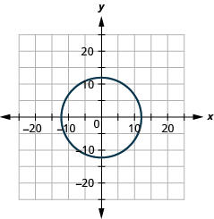 

<math xmlns="http://www.w3.org/1998/Math/MathML"><mrow><msup><mrow><mrow><mo>(</mo><mrow><mi>x</mi><mo>+</mo><mn>3</mn></mrow><mo>)</mo></mrow></mrow><mn>2</mn></msup><mo>+</mo><msup><mrow><mrow><mo>(</mo><mrow><mi>y</mi><mo>−</mo><mn>5</mn></mrow><mo>)</mo></mrow></mrow><mn>2</mn></msup><mo>=</mo><mn>81</mn></mrow></math>

<math xmlns="http://www.w3.org/1998/Math/MathML"><mrow><msup><mrow><mrow><mo>(</mo><mrow><mi>x</mi><mo>+</mo><mn>2</mn></mrow><mo>)</mo></mrow></mrow><mn>2</mn></msup><mo>+</mo><msup><mrow><mrow><mo>(</mo><mrow><mi>y</mi><mo>+</mo><mn>5</mn></mrow><mo>)</mo></mrow></mrow><mn>2</mn></msup><mo>=</mo><mn>49</mn></mrow></math>

ⓐ radius: 7, center: <math xmlns="http://www.w3.org/1998/Math/MathML"><mrow><mrow><mo>(</mo><mrow><mn>−2</mn><mo>,</mo><mn>−5</mn></mrow><mo>)</mo></mrow></mrow></math>

* * *
{: data-type="newline"}

 ⓑ* * *
{: data-type="newline"}

  

<math xmlns="http://www.w3.org/1998/Math/MathML"><mrow><msup><mi>x</mi><mn>2</mn></msup><mo>+</mo><msup><mi>y</mi><mn>2</mn></msup><mo>−</mo><mn>6</mn><mi>x</mi><mo>−</mo><mn>12</mn><mi>y</mi><mo>−</mo><mn>19</mn><mo>=</mo><mn>0</mn></mrow></math>

<math xmlns="http://www.w3.org/1998/Math/MathML"><mrow><msup><mi>x</mi><mn>2</mn></msup><mo>+</mo><msup><mi>y</mi><mn>2</mn></msup><mo>−</mo><mn>4</mn><mi>y</mi><mo>−</mo><mn>60</mn><mo>=</mo><mn>0</mn></mrow></math>

ⓐ radius: 8, center: <math xmlns="http://www.w3.org/1998/Math/MathML"><mrow><mrow><mo>(</mo><mrow><mn>0</mn><mo>,</mo><mn>2</mn></mrow><mo>)</mo></mrow></mrow></math>

* * *
{: data-type="newline"}

 ⓑ* * *
{: data-type="newline"}

 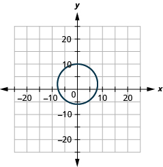 

#### [Parabolas](/m63436){: .target-chapter}

**Graph Vertical Parabolas**

In the following exercises, graph each equation by using its properties.

<math xmlns="http://www.w3.org/1998/Math/MathML"><mrow><mi>y</mi><mo>=</mo><msup><mi>x</mi><mn>2</mn></msup><mo>+</mo><mn>4</mn><mi>x</mi><mo>−</mo><mn>3</mn></mrow></math>

<math xmlns="http://www.w3.org/1998/Math/MathML"><mrow><mi>y</mi><mo>=</mo><mn>2</mn><msup><mi>x</mi><mn>2</mn></msup><mo>+</mo><mn>10</mn><mi>x</mi><mo>+</mo><mn>7</mn></mrow></math>

  

<math xmlns="http://www.w3.org/1998/Math/MathML"><mrow><mi>y</mi><mo>=</mo><mn>−6</mn><msup><mi>x</mi><mn>2</mn></msup><mo>+</mo><mn>12</mn><mi>x</mi><mo>−</mo><mn>1</mn></mrow></math>

<math xmlns="http://www.w3.org/1998/Math/MathML"><mrow><mi>y</mi><mo>=</mo><mtext>−</mtext><msup><mi>x</mi><mn>2</mn></msup><mo>+</mo><mn>10</mn><mi>x</mi></mrow></math>

  

In the following exercises, ⓐ write the equation in standard form, then ⓑ use properties of the standard form to graph the equation.

<math xmlns="http://www.w3.org/1998/Math/MathML"><mrow><mi>y</mi><mo>=</mo><msup><mi>x</mi><mn>2</mn></msup><mo>+</mo><mn>4</mn><mi>x</mi><mo>+</mo><mn>7</mn></mrow></math>

<math xmlns="http://www.w3.org/1998/Math/MathML"><mrow><mi>y</mi><mo>=</mo><mn>2</mn><msup><mi>x</mi><mn>2</mn></msup><mo>−</mo><mn>4</mn><mi>x</mi><mo>−</mo><mn>2</mn></mrow></math>

ⓐ <math xmlns="http://www.w3.org/1998/Math/MathML"><mrow><mi>y</mi><mo>=</mo><mn>2</mn><msup><mrow><mrow><mo>(</mo><mrow><mi>x</mi><mo>−</mo><mn>1</mn></mrow><mo>)</mo></mrow></mrow><mn>2</mn></msup><mo>−</mo><mn>4</mn></mrow></math>

* * *
{: data-type="newline"}

 ⓑ* * *
{: data-type="newline"}

  

<math xmlns="http://www.w3.org/1998/Math/MathML"><mrow><mi>y</mi><mo>=</mo><mn>−3</mn><msup><mi>x</mi><mn>2</mn></msup><mo>−</mo><mn>18</mn><mi>x</mi><mo>−</mo><mn>29</mn></mrow></math>

<math xmlns="http://www.w3.org/1998/Math/MathML"><mrow><mi>y</mi><mo>=</mo><mtext>−</mtext><msup><mi>x</mi><mn>2</mn></msup><mo>+</mo><mn>12</mn><mi>x</mi><mo>−</mo><mn>35</mn></mrow></math>

ⓐ <math xmlns="http://www.w3.org/1998/Math/MathML"><mrow><mi>y</mi><mo>=</mo><mtext>−</mtext><msup><mrow><mrow><mo>(</mo><mrow><mi>x</mi><mo>−</mo><mn>6</mn></mrow><mo>)</mo></mrow></mrow><mn>2</mn></msup><mo>+</mo><mn>1</mn></mrow></math>

* * *
{: data-type="newline"}

 ⓑ* * *
{: data-type="newline"}

  

**Graph Horizontal Parabolas**

In the following exercises, graph each equation by using its properties.

<math xmlns="http://www.w3.org/1998/Math/MathML"><mrow><mi>x</mi><mo>=</mo><mn>2</mn><msup><mi>y</mi><mn>2</mn></msup></mrow></math>

<math xmlns="http://www.w3.org/1998/Math/MathML"><mrow><mi>x</mi><mo>=</mo><mn>2</mn><msup><mi>y</mi><mn>2</mn></msup><mo>+</mo><mn>4</mn><mi>y</mi><mo>+</mo><mn>6</mn></mrow></math>

  

<math xmlns="http://www.w3.org/1998/Math/MathML"><mrow><mi>x</mi><mo>=</mo><mtext>−</mtext><msup><mi>y</mi><mn>2</mn></msup><mo>+</mo><mn>2</mn><mi>y</mi><mo>−</mo><mn>4</mn></mrow></math>

<math xmlns="http://www.w3.org/1998/Math/MathML"><mrow><mi>x</mi><mo>=</mo><mn>−3</mn><msup><mi>y</mi><mn>2</mn></msup></mrow></math>

  

In the following exercises, ⓐ write the equation in standard form, then ⓑ use properties of the standard form to graph the equation.

<math xmlns="http://www.w3.org/1998/Math/MathML"><mrow><mi>x</mi><mo>=</mo><mn>4</mn><msup><mi>y</mi><mn>2</mn></msup><mo>+</mo><mn>8</mn><mi>y</mi></mrow></math>

<math xmlns="http://www.w3.org/1998/Math/MathML"><mrow><mi>x</mi><mo>=</mo><msup><mi>y</mi><mn>2</mn></msup><mo>+</mo><mn>4</mn><mi>y</mi><mo>+</mo><mn>5</mn></mrow></math>

ⓐ <math xmlns="http://www.w3.org/1998/Math/MathML"><mrow><mi>x</mi><mo>=</mo><msup><mrow><mrow><mo>(</mo><mrow><mi>y</mi><mo>+</mo><mn>2</mn></mrow><mo>)</mo></mrow></mrow><mn>2</mn></msup><mo>+</mo><mn>1</mn></mrow></math>

* * *
{: data-type="newline"}

 ⓑ* * *
{: data-type="newline"}

  

<math xmlns="http://www.w3.org/1998/Math/MathML"><mrow><mi>x</mi><mo>=</mo><mtext>−</mtext><msup><mi>y</mi><mn>2</mn></msup><mo>−</mo><mn>6</mn><mi>y</mi><mo>−</mo><mn>7</mn></mrow></math>

<math xmlns="http://www.w3.org/1998/Math/MathML"><mrow><mi>x</mi><mo>=</mo><mn>−2</mn><msup><mi>y</mi><mn>2</mn></msup><mo>+</mo><mn>4</mn><mi>y</mi></mrow></math>

ⓐ <math xmlns="http://www.w3.org/1998/Math/MathML"><mrow><mi>x</mi><mo>=</mo><mn>−2</mn><msup><mrow><mrow><mo>(</mo><mrow><mi>y</mi><mo>−</mo><mn>1</mn></mrow><mo>)</mo></mrow></mrow><mn>2</mn></msup><mo>+</mo><mn>2</mn></mrow></math>

* * *
{: data-type="newline"}

 ⓑ* * *
{: data-type="newline"}

  

**Solve Applications with Parabolas**

In the following exercises, create the equation of the parabolic arch formed in the foundation of the bridge shown. Give the answer in standard form.

 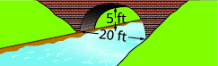 

  

<math xmlns="http://www.w3.org/1998/Math/MathML"><mrow><mi>y</mi><mo>=</mo><mo>−</mo><mfrac><mn>1</mn><mn>9</mn></mfrac><msup><mi>x</mi><mn>2</mn></msup><mo>+</mo><mfrac><mrow><mn>10</mn></mrow><mn>3</mn></mfrac><mi>x</mi></mrow></math>

#### [Ellipses](/m63437){: .target-chapter}

**Graph an Ellipse with Center at the Origin**

In the following exercises, graph each ellipse.

<math xmlns="http://www.w3.org/1998/Math/MathML"><mrow><mfrac><mrow><msup><mi>x</mi><mn>2</mn></msup></mrow><mrow><mn>36</mn></mrow></mfrac><mo>+</mo><mfrac><mrow><msup><mi>y</mi><mn>2</mn></msup></mrow><mrow><mn>25</mn></mrow></mfrac><mo>=</mo><mn>1</mn></mrow></math>

<math xmlns="http://www.w3.org/1998/Math/MathML"><mrow><mfrac><mrow><msup><mi>x</mi><mn>2</mn></msup></mrow><mn>4</mn></mfrac><mo>+</mo><mfrac><mrow><msup><mi>y</mi><mn>2</mn></msup></mrow><mrow><mn>81</mn></mrow></mfrac><mo>=</mo><mn>1</mn></mrow></math>

  

<math xmlns="http://www.w3.org/1998/Math/MathML"><mrow><mn>49</mn><msup><mi>x</mi><mn>2</mn></msup><mo>+</mo><mn>64</mn><msup><mi>y</mi><mn>2</mn></msup><mo>=</mo><mn>3136</mn></mrow></math>

<math xmlns="http://www.w3.org/1998/Math/MathML"><mrow><mn>9</mn><msup><mi>x</mi><mn>2</mn></msup><mo>+</mo><msup><mi>y</mi><mn>2</mn></msup><mo>=</mo><mn>9</mn></mrow></math>

  

**Find the Equation of an Ellipse with Center at the Origin**

In the following exercises, find the equation of the ellipse shown in the graph.

 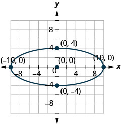 

 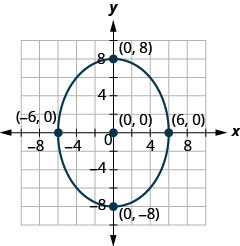 

<math xmlns="http://www.w3.org/1998/Math/MathML"><mrow><mfrac><mrow><msup><mi>x</mi><mn>2</mn></msup></mrow><mrow><mn>36</mn></mrow></mfrac><mo>+</mo><mfrac><mrow><msup><mi>y</mi><mn>2</mn></msup></mrow><mrow><mn>64</mn></mrow></mfrac><mo>=</mo><mn>1</mn></mrow></math>

**Graph an Ellipse with Center Not at the Origin**

In the following exercises, graph each ellipse.

<math xmlns="http://www.w3.org/1998/Math/MathML"><mrow><mfrac><mrow><msup><mrow><mrow><mo>(</mo><mrow><mi>x</mi><mo>−</mo><mn>1</mn></mrow><mo>)</mo></mrow></mrow><mn>2</mn></msup></mrow><mrow><mn>25</mn></mrow></mfrac><mo>+</mo><mfrac><mrow><msup><mrow><mrow><mo>(</mo><mrow><mi>y</mi><mo>−</mo><mn>6</mn></mrow><mo>)</mo></mrow></mrow><mn>2</mn></msup></mrow><mn>4</mn></mfrac><mo>=</mo><mn>1</mn></mrow></math>

<math xmlns="http://www.w3.org/1998/Math/MathML"><mrow><mfrac><mrow><msup><mrow><mrow><mo>(</mo><mrow><mi>x</mi><mo>+</mo><mn>4</mn></mrow><mo>)</mo></mrow></mrow><mn>2</mn></msup></mrow><mrow><mn>16</mn></mrow></mfrac><mo>+</mo><mfrac><mrow><msup><mrow><mrow><mo>(</mo><mrow><mi>y</mi><mo>+</mo><mn>1</mn></mrow><mo>)</mo></mrow></mrow><mn>2</mn></msup></mrow><mn>9</mn></mfrac><mo>=</mo><mn>1</mn></mrow></math>

  

<math xmlns="http://www.w3.org/1998/Math/MathML"><mrow><mfrac><mrow><msup><mrow><mrow><mo>(</mo><mrow><mi>x</mi><mo>−</mo><mn>5</mn></mrow><mo>)</mo></mrow></mrow><mn>2</mn></msup></mrow><mrow><mn>16</mn></mrow></mfrac><mo>+</mo><mfrac><mrow><msup><mrow><mrow><mo>(</mo><mrow><mi>y</mi><mo>+</mo><mn>3</mn></mrow><mo>)</mo></mrow></mrow><mn>2</mn></msup></mrow><mrow><mn>36</mn></mrow></mfrac><mo>=</mo><mn>1</mn></mrow></math>

<math xmlns="http://www.w3.org/1998/Math/MathML"><mrow><mfrac><mrow><msup><mrow><mrow><mo>(</mo><mrow><mi>x</mi><mo>+</mo><mn>3</mn></mrow><mo>)</mo></mrow></mrow><mn>2</mn></msup></mrow><mn>9</mn></mfrac><mo>+</mo><mfrac><mrow><msup><mrow><mrow><mo>(</mo><mrow><mi>y</mi><mo>−</mo><mn>2</mn></mrow><mo>)</mo></mrow></mrow><mn>2</mn></msup></mrow><mrow><mn>25</mn></mrow></mfrac><mo>=</mo><mn>1</mn></mrow></math>

  

In the following exercises, ⓐ write the equation in standard form and ⓑ graph.

<math xmlns="http://www.w3.org/1998/Math/MathML"><mrow><msup><mi>x</mi><mn>2</mn></msup><mo>+</mo><msup><mi>y</mi><mn>2</mn></msup><mo>+</mo><mn>12</mn><mi>x</mi><mo>+</mo><mn>40</mn><mi>y</mi><mo>+</mo><mn>120</mn><mo>=</mo><mn>0</mn></mrow></math>

<math xmlns="http://www.w3.org/1998/Math/MathML"><mrow><mn>25</mn><msup><mi>x</mi><mn>2</mn></msup><mo>+</mo><mn>4</mn><msup><mi>y</mi><mn>2</mn></msup><mo>−</mo><mn>150</mn><mi>x</mi><mo>−</mo><mn>56</mn><mi>y</mi><mo>+</mo><mn>321</mn><mo>=</mo><mn>0</mn></mrow></math>

ⓐ <math xmlns="http://www.w3.org/1998/Math/MathML"><mrow><mfrac><mrow><msup><mrow><mrow><mo>(</mo><mrow><mi>x</mi><mo>−</mo><mn>3</mn></mrow><mo>)</mo></mrow></mrow><mn>2</mn></msup></mrow><mn>4</mn></mfrac><mo>+</mo><mfrac><mrow><msup><mrow><mrow><mo>(</mo><mrow><mi>y</mi><mo>−</mo><mn>7</mn></mrow><mo>)</mo></mrow></mrow><mn>2</mn></msup></mrow><mrow><mn>25</mn></mrow></mfrac><mo>=</mo><mn>1</mn></mrow></math>

* * *
{: data-type="newline"}

 ⓑ* * *
{: data-type="newline"}

  

<math xmlns="http://www.w3.org/1998/Math/MathML"><mrow><mn>25</mn><msup><mi>x</mi><mn>2</mn></msup><mo>+</mo><mn>4</mn><msup><mi>y</mi><mn>2</mn></msup><mo>+</mo><mn>150</mn><mi>x</mi><mo>+</mo><mn>125</mn><mo>=</mo><mn>0</mn></mrow></math>

<math xmlns="http://www.w3.org/1998/Math/MathML"><mrow><mn>4</mn><msup><mi>x</mi><mn>2</mn></msup><mo>+</mo><mn>9</mn><msup><mi>y</mi><mn>2</mn></msup><mo>−</mo><mn>126</mn><mi>x</mi><mo>+</mo><mn>405</mn><mo>=</mo><mn>0</mn></mrow></math>

ⓐ <math xmlns="http://www.w3.org/1998/Math/MathML"><mrow><mfrac><mrow><msup><mi>x</mi><mn>2</mn></msup></mrow><mn>9</mn></mfrac><mo>+</mo><mfrac><mrow><msup><mrow><mrow><mo>(</mo><mrow><mi>y</mi><mo>−</mo><mn>7</mn></mrow><mo>)</mo></mrow></mrow><mn>2</mn></msup></mrow><mn>4</mn></mfrac><mo>=</mo><mn>1</mn></mrow></math>

* * *
{: data-type="newline"}

 ⓑ* * *
{: data-type="newline"}

  

**Solve Applications with Ellipses**

In the following exercises, write the equation of the ellipse described.

A comet moves in an elliptical orbit around a sun. The closest the comet gets to the sun is approximately 10 AU and the furthest is approximately 90 AU. The sun is one of the foci of the elliptical orbit. Letting the ellipse center at the origin and labeling the axes in AU, the orbit will look like the figure below. Use the graph to write an equation for the elliptical orbit of the comet.

  

#### [Hyperbolas](/m63440){: .target-chapter}

**Graph a Hyperbola with Center at <math xmlns="http://www.w3.org/1998/Math/MathML"><mrow><mrow><mo>(</mo><mrow><mn>0</mn><mo>,</mo><mn>0</mn></mrow><mo>)</mo></mrow></mrow></math>

**

In the following exercises, graph.

<math xmlns="http://www.w3.org/1998/Math/MathML"><mrow><mfrac><mrow><msup><mi>x</mi><mn>2</mn></msup></mrow><mrow><mn>25</mn></mrow></mfrac><mo>−</mo><mfrac><mrow><msup><mi>y</mi><mn>2</mn></msup></mrow><mn>9</mn></mfrac><mo>=</mo><mn>1</mn></mrow></math>

  

<math xmlns="http://www.w3.org/1998/Math/MathML"><mrow><mfrac><mrow><msup><mi>y</mi><mn>2</mn></msup></mrow><mrow><mn>49</mn></mrow></mfrac><mo>−</mo><mfrac><mrow><msup><mi>x</mi><mn>2</mn></msup></mrow><mrow><mn>16</mn></mrow></mfrac><mo>=</mo><mn>1</mn></mrow></math>

<math xmlns="http://www.w3.org/1998/Math/MathML"><mrow><mn>9</mn><msup><mi>y</mi><mn>2</mn></msup><mo>−</mo><mn>16</mn><msup><mi>x</mi><mn>2</mn></msup><mo>=</mo><mn>144</mn></mrow></math>

  

<math xmlns="http://www.w3.org/1998/Math/MathML"><mrow><mn>16</mn><msup><mi>x</mi><mn>2</mn></msup><mo>−</mo><mn>4</mn><msup><mi>y</mi><mn>2</mn></msup><mo>=</mo><mn>64</mn></mrow></math>

**Graph a Hyperbola with Center at <math xmlns="http://www.w3.org/1998/Math/MathML"><mrow><mrow><mo>(</mo><mrow><mi>h</mi><mo>,</mo><mi>k</mi></mrow><mo>)</mo></mrow></mrow></math>

**

In the following exercises, graph.

<math xmlns="http://www.w3.org/1998/Math/MathML"><mrow><mfrac><mrow><msup><mrow><mrow><mo>(</mo><mrow><mi>x</mi><mo>+</mo><mn>1</mn></mrow><mo>)</mo></mrow></mrow><mn>2</mn></msup></mrow><mn>4</mn></mfrac><mo>−</mo><mfrac><mrow><msup><mrow><mrow><mo>(</mo><mrow><mi>y</mi><mo>+</mo><mn>1</mn></mrow><mo>)</mo></mrow></mrow><mn>2</mn></msup></mrow><mn>9</mn></mfrac><mo>=</mo><mn>1</mn></mrow></math>

  

<math xmlns="http://www.w3.org/1998/Math/MathML"><mrow><mfrac><mrow><msup><mrow><mrow><mo>(</mo><mrow><mi>x</mi><mo>−</mo><mn>2</mn></mrow><mo>)</mo></mrow></mrow><mn>2</mn></msup></mrow><mn>4</mn></mfrac><mo>−</mo><mfrac><mrow><msup><mrow><mrow><mo>(</mo><mrow><mi>y</mi><mo>−</mo><mn>3</mn></mrow><mo>)</mo></mrow></mrow><mn>2</mn></msup></mrow><mrow><mn>16</mn></mrow></mfrac><mo>=</mo><mn>1</mn></mrow></math>

<math xmlns="http://www.w3.org/1998/Math/MathML"><mrow><mfrac><mrow><msup><mrow><mrow><mo>(</mo><mrow><mi>y</mi><mo>+</mo><mn>2</mn></mrow><mo>)</mo></mrow></mrow><mn>2</mn></msup></mrow><mn>9</mn></mfrac><mo>−</mo><mfrac><mrow><msup><mrow><mrow><mo>(</mo><mrow><mi>x</mi><mo>+</mo><mn>1</mn></mrow><mo>)</mo></mrow></mrow><mn>2</mn></msup></mrow><mn>9</mn></mfrac><mo>=</mo><mn>1</mn></mrow></math>

  

<math xmlns="http://www.w3.org/1998/Math/MathML"><mrow><mfrac><mrow><msup><mrow><mrow><mo>(</mo><mrow><mi>y</mi><mo>−</mo><mn>1</mn></mrow><mo>)</mo></mrow></mrow><mn>2</mn></msup></mrow><mrow><mn>25</mn></mrow></mfrac><mo>−</mo><mfrac><mrow><msup><mrow><mrow><mo>(</mo><mrow><mi>x</mi><mo>−</mo><mn>2</mn></mrow><mo>)</mo></mrow></mrow><mn>2</mn></msup></mrow><mn>9</mn></mfrac><mo>=</mo><mn>1</mn></mrow></math>

In the following exercises, ⓐ write the equation in standard form and ⓑ graph.

<math xmlns="http://www.w3.org/1998/Math/MathML"><mrow><mn>4</mn><msup><mi>x</mi><mn>2</mn></msup><mo>−</mo><mn>16</mn><msup><mi>y</mi><mn>2</mn></msup><mo>+</mo><mn>8</mn><mi>x</mi><mo>+</mo><mn>96</mn><mi>y</mi><mo>−</mo><mn>204</mn><mo>=</mo><mn>0</mn></mrow></math>

ⓐ <math xmlns="http://www.w3.org/1998/Math/MathML"><mrow><mfrac><mrow><msup><mrow><mrow><mo>(</mo><mrow><mi>x</mi><mo>+</mo><mn>1</mn></mrow><mo>)</mo></mrow></mrow><mn>2</mn></msup></mrow><mrow><mn>16</mn></mrow></mfrac><mo>−</mo><mfrac><mrow><msup><mrow><mrow><mo>(</mo><mrow><mi>y</mi><mo>−</mo><mn>3</mn></mrow><mo>)</mo></mrow></mrow><mn>2</mn></msup></mrow><mn>4</mn></mfrac><mo>=</mo><mn>1</mn></mrow></math>

* * *
{: data-type="newline"}

 ⓑ* * *
{: data-type="newline"}

  

<math xmlns="http://www.w3.org/1998/Math/MathML"><mrow><mn>16</mn><msup><mi>x</mi><mn>2</mn></msup><mo>−</mo><mn>4</mn><msup><mi>y</mi><mn>2</mn></msup><mo>−</mo><mn>64</mn><mi>x</mi><mo>−</mo><mn>24</mn><mi>y</mi><mo>−</mo><mn>36</mn><mo>=</mo><mn>0</mn></mrow></math>

<math xmlns="http://www.w3.org/1998/Math/MathML"><mrow><mn>4</mn><msup><mi>y</mi><mn>2</mn></msup><mo>−</mo><mn>16</mn><msup><mi>x</mi><mn>2</mn></msup><mo>+</mo><mn>32</mn><mi>x</mi><mo>−</mo><mn>8</mn><mi>y</mi><mo>−</mo><mn>76</mn><mo>=</mo><mn>0</mn></mrow></math>

ⓐ <math xmlns="http://www.w3.org/1998/Math/MathML"><mrow><mfrac><mrow><msup><mrow><mrow><mo>(</mo><mrow><mi>y</mi><mo>−</mo><mn>1</mn></mrow><mo>)</mo></mrow></mrow><mn>2</mn></msup></mrow><mrow><mn>16</mn></mrow></mfrac><mo>−</mo><mfrac><mrow><msup><mrow><mrow><mo>(</mo><mrow><mi>x</mi><mo>−</mo><mn>1</mn></mrow><mo>)</mo></mrow></mrow><mn>2</mn></msup></mrow><mn>4</mn></mfrac><mo>=</mo><mn>1</mn></mrow></math>

* * *
{: data-type="newline"}

 ⓑ* * *
{: data-type="newline"}

  

<math xmlns="http://www.w3.org/1998/Math/MathML"><mrow><mn>36</mn><msup><mi>y</mi><mn>2</mn></msup><mo>−</mo><mn>16</mn><msup><mi>x</mi><mn>2</mn></msup><mo>−</mo><mn>96</mn><mi>x</mi><mo>+</mo><mn>216</mn><mi>y</mi><mo>−</mo><mn>396</mn><mo>=</mo><mn>0</mn></mrow></math>

**Identify the Graph of each Equation as a Circle, Parabola, Ellipse, or Hyperbola**

In the following exercises, identify the type of graph.

* * *
{: data-type="newline"}

ⓐ <math xmlns="http://www.w3.org/1998/Math/MathML"><mrow><mn>16</mn><msup><mi>y</mi><mn>2</mn></msup><mo>−</mo><mn>9</mn><msup><mi>x</mi><mn>2</mn></msup><mo>−</mo><mn>36</mn><mi>x</mi><mo>−</mo><mn>96</mn><mi>y</mi><mo>−</mo><mn>36</mn><mo>=</mo><mn>0</mn></mrow></math>

* * *
{: data-type="newline"}

ⓑ <math xmlns="http://www.w3.org/1998/Math/MathML"><mrow><msup><mi>x</mi><mn>2</mn></msup><mo>+</mo><msup><mi>y</mi><mn>2</mn></msup><mo>−</mo><mn>4</mn><mi>x</mi><mo>+</mo><mn>10</mn><mi>y</mi><mo>−</mo><mn>7</mn><mo>=</mo><mn>0</mn></mrow></math>

* * *
{: data-type="newline"}

ⓒ <math xmlns="http://www.w3.org/1998/Math/MathML"><mrow><mi>y</mi><mo>=</mo><msup><mi>x</mi><mn>2</mn></msup><mo>−</mo><mn>2</mn><mi>x</mi><mo>+</mo><mn>3</mn></mrow></math>

* * *
{: data-type="newline"}

ⓓ <math xmlns="http://www.w3.org/1998/Math/MathML"><mrow><mn>25</mn><msup><mi>x</mi><mn>2</mn></msup><mo>+</mo><mn>9</mn><msup><mi>y</mi><mn>2</mn></msup><mo>=</mo><mn>225</mn></mrow></math>

ⓐ hyperbola ⓑ circle ⓒ parabola ⓓ ellipse

* * *
{: data-type="newline"}

ⓐ <math xmlns="http://www.w3.org/1998/Math/MathML"><mrow><msup><mi>x</mi><mn>2</mn></msup><mo>+</mo><msup><mi>y</mi><mn>2</mn></msup><mo>+</mo><mn>4</mn><mi>x</mi><mo>−</mo><mn>10</mn><mi>y</mi><mo>+</mo><mn>25</mn><mo>=</mo><mn>0</mn></mrow></math>

* * *
{: data-type="newline"}

ⓑ <math xmlns="http://www.w3.org/1998/Math/MathML"><mrow><msup><mi>y</mi><mn>2</mn></msup><mo>−</mo><msup><mi>x</mi><mn>2</mn></msup><mo>−</mo><mn>4</mn><mi>y</mi><mo>+</mo><mn>2</mn><mi>x</mi><mo>−</mo><mn>6</mn><mo>=</mo><mn>0</mn></mrow></math>

* * *
{: data-type="newline"}

ⓒ <math xmlns="http://www.w3.org/1998/Math/MathML"><mrow><mi>x</mi><mo>=</mo><mo>−</mo><msup><mi>y</mi><mn>2</mn></msup><mo>−</mo><mn>2</mn><mi>y</mi><mo>+</mo><mn>3</mn></mrow></math>

* * *
{: data-type="newline"}

ⓓ <math xmlns="http://www.w3.org/1998/Math/MathML"><mrow><mn>16</mn><msup><mi>x</mi><mn>2</mn></msup><mo>+</mo><mn>9</mn><msup><mi>y</mi><mn>2</mn></msup><mo>=</mo><mn>144</mn></mrow></math>

#### [Solve Systems of Nonlinear Equations](/m63441){: .target-chapter}

**Solve a System of Nonlinear Equations Using Graphing**

In the following exercises, solve the system of equations by using graphing.

<math xmlns="http://www.w3.org/1998/Math/MathML"><mrow><mrow><mo>{</mo><mtable><mtr><mtd columnalign="left"><mn>3</mn><msup><mi>x</mi><mn>2</mn></msup><mo>−</mo><mi>y</mi><mo>=</mo><mn>0</mn></mtd></mtr><mtr><mtd columnalign="left"><mi>y</mi><mo>=</mo><mn>2</mn><mi>x</mi><mo>−</mo><mn>1</mn></mtd></mtr></mtable></mrow></mrow></math>

  

<math xmlns="http://www.w3.org/1998/Math/MathML"><mrow><mrow><mo>{</mo><mtable><mtr><mtd columnalign="left"><mi>y</mi><mo>=</mo><msup><mi>x</mi><mn>2</mn></msup><mo>−</mo><mn>4</mn></mtd></mtr><mtr><mtd columnalign="left"><mi>y</mi><mo>=</mo><mi>x</mi><mo>−</mo><mn>4</mn></mtd></mtr></mtable></mrow></mrow></math>

<math xmlns="http://www.w3.org/1998/Math/MathML"><mrow><mrow><mo>{</mo><mtable><mtr><mtd columnalign="left"><msup><mi>x</mi><mn>2</mn></msup><mo>+</mo><msup><mi>y</mi><mn>2</mn></msup><mo>=</mo><mn>169</mn></mtd></mtr><mtr><mtd columnalign="left"><mi>x</mi><mo>=</mo><mn>12</mn></mtd></mtr></mtable></mrow></mrow></math>

  

<math xmlns="http://www.w3.org/1998/Math/MathML"><mrow><mrow><mo>{</mo><mtable><mtr><mtd columnalign="left"><msup><mi>x</mi><mn>2</mn></msup><mo>+</mo><msup><mi>y</mi><mn>2</mn></msup><mo>=</mo><mn>25</mn></mtd></mtr><mtr><mtd columnalign="left"><mi>y</mi><mo>=</mo><mn>−5</mn></mtd></mtr></mtable></mrow></mrow></math>

**Solve a System of Nonlinear Equations Using Substitution**

In the following exercises, solve the system of equations by using substitution.

<math xmlns="http://www.w3.org/1998/Math/MathML"><mrow><mrow><mo>{</mo><mtable><mtr><mtd columnalign="left"><mi>y</mi><mo>=</mo><msup><mi>x</mi><mn>2</mn></msup><mo>+</mo><mn>3</mn></mtd></mtr><mtr><mtd columnalign="left"><mi>y</mi><mo>=</mo><mn>−2</mn><mi>x</mi><mo>+</mo><mn>2</mn></mtd></mtr></mtable></mrow></mrow></math>

<math xmlns="http://www.w3.org/1998/Math/MathML"><mrow><mrow><mo>(</mo><mrow><mn>−1</mn><mo>,</mo><mn>4</mn></mrow><mo>)</mo></mrow></mrow></math>

<math xmlns="http://www.w3.org/1998/Math/MathML"><mrow><mrow><mo>{</mo><mtable><mtr><mtd columnalign="left"><msup><mi>x</mi><mn>2</mn></msup><mo>+</mo><msup><mi>y</mi><mn>2</mn></msup><mo>=</mo><mn>4</mn></mtd></mtr><mtr><mtd columnalign="left"><mi>x</mi><mo>−</mo><mi>y</mi><mo>=</mo><mn>4</mn></mtd></mtr></mtable></mrow></mrow></math>

<math xmlns="http://www.w3.org/1998/Math/MathML"><mrow><mrow><mo>{</mo><mtable><mtr><mtd columnalign="left"><mn>9</mn><msup><mi>x</mi><mn>2</mn></msup><mo>+</mo><mn>4</mn><msup><mi>y</mi><mn>2</mn></msup><mo>=</mo><mn>36</mn></mtd></mtr><mtr><mtd columnalign="left"><mi>y</mi><mo>−</mo><mi>x</mi><mo>=</mo><mn>5</mn></mtd></mtr></mtable></mrow></mrow></math>

No solution

<math xmlns="http://www.w3.org/1998/Math/MathML"><mrow><mrow><mo>{</mo><mtable><mtr><mtd columnalign="left"><msup><mi>x</mi><mn>2</mn></msup><mo>+</mo><mn>4</mn><msup><mi>y</mi><mn>2</mn></msup><mo>=</mo><mn>4</mn></mtd></mtr><mtr><mtd columnalign="left"><mn>2</mn><mi>x</mi><mo>−</mo><mi>y</mi><mo>=</mo><mn>1</mn></mtd></mtr></mtable></mrow></mrow></math>

**Solve a System of Nonlinear Equations Using Elimination**

In the following exercises, solve the system of equations by using elimination.

<math xmlns="http://www.w3.org/1998/Math/MathML"><mrow><mrow><mo>{</mo><mtable><mtr><mtd columnalign="left"><msup><mi>x</mi><mn>2</mn></msup><mo>+</mo><msup><mi>y</mi><mn>2</mn></msup><mo>=</mo><mn>16</mn></mtd></mtr><mtr><mtd columnalign="left"><msup><mi>x</mi><mn>2</mn></msup><mo>−</mo><mn>2</mn><mi>y</mi><mo>−</mo><mn>1</mn><mo>=</mo><mn>0</mn></mtd></mtr></mtable></mrow></mrow></math>

<math xmlns="http://www.w3.org/1998/Math/MathML"><mrow><mrow><mo>(</mo><mrow><mtext>−</mtext><msqrt><mn>7</mn></msqrt><mo>,</mo><mn>3</mn></mrow><mo>)</mo></mrow><mo>,</mo><mrow><mo>(</mo><mrow><msqrt><mn>7</mn></msqrt><mo>,</mo><mn>3</mn></mrow><mo>)</mo></mrow></mrow></math>

<math xmlns="http://www.w3.org/1998/Math/MathML"><mrow><mrow><mo>{</mo><mtable><mtr><mtd columnalign="left"><msup><mi>x</mi><mn>2</mn></msup><mo>−</mo><msup><mi>y</mi><mn>2</mn></msup><mo>=</mo><mn>5</mn></mtd></mtr><mtr><mtd columnalign="left"><mo>−</mo><mn>2</mn><msup><mi>x</mi><mn>2</mn></msup><mo>−</mo><mn>3</mn><msup><mi>y</mi><mn>2</mn></msup><mo>=</mo><mn>−30</mn></mtd></mtr></mtable></mrow></mrow></math>

<math xmlns="http://www.w3.org/1998/Math/MathML"><mrow><mrow><mo>{</mo><mtable><mtr><mtd columnalign="left"><mn>4</mn><msup><mi>x</mi><mn>2</mn></msup><mo>+</mo><mn>9</mn><msup><mi>y</mi><mn>2</mn></msup><mo>=</mo><mn>36</mn></mtd></mtr><mtr><mtd columnalign="left"><mn>3</mn><msup><mi>y</mi><mn>2</mn></msup><mo>−</mo><mn>4</mn><mi>x</mi><mo>=</mo><mn>12</mn></mtd></mtr></mtable></mrow></mrow></math>

<math xmlns="http://www.w3.org/1998/Math/MathML"><mrow><mrow><mo>(</mo><mrow><mn>−3</mn><mo>,</mo><mn>0</mn></mrow><mo>)</mo></mrow><mo>,</mo><mrow><mo>(</mo><mrow><mn>0</mn><mo>,</mo><mn>−2</mn></mrow><mo>)</mo></mrow><mo>,</mo><mrow><mo>(</mo><mrow><mn>0</mn><mo>,</mo><mn>2</mn></mrow><mo>)</mo></mrow></mrow></math>

<math xmlns="http://www.w3.org/1998/Math/MathML"><mrow><mrow><mo>{</mo><mtable><mtr><mtd columnalign="left"><msup><mi>x</mi><mn>2</mn></msup><mo>+</mo><msup><mi>y</mi><mn>2</mn></msup><mo>=</mo><mn>14</mn></mtd></mtr><mtr><mtd columnalign="left"><msup><mi>x</mi><mn>2</mn></msup><mo>−</mo><msup><mi>y</mi><mn>2</mn></msup><mo>=</mo><mn>16</mn></mtd></mtr></mtable></mrow></mrow></math>

**Use a System of Nonlinear Equations to Solve Applications**

In the following exercises, solve the problem using a system of equations.

The sum of the squares of two numbers is 25. The difference of the numbers is 1. Find the numbers.

<math xmlns="http://www.w3.org/1998/Math/MathML"><mrow><mn>−3</mn></mrow></math>

 and <math xmlns="http://www.w3.org/1998/Math/MathML"><mrow><mn>−4</mn></mrow></math>

 or 4 and 3

The difference of the squares of two numbers is 45. The difference of the square of the first number and twice the square of the second number is 9. Find the numbers.

The perimeter of a rectangle is 58 meters and its area is 210 square meters. Find the length and width of the rectangle.

If the length is 14 inches, the width is 15 inches. If the length is 15 inches, the width is 14 inches.

Colton purchased a larger microwave for his kitchen. The diagonal of the front of the microwave measures 34 inches. The front also has an area of 480 square inches. What are the length and width of the microwave?

</section>

### Practice Test

In the following exercises, find the distance between the points and the midpoint of the line segment with the given endpoints. Round to the nearest tenth as needed.

<math xmlns="http://www.w3.org/1998/Math/MathML"><mrow><mrow><mo>(</mo><mrow><mn>−4</mn><mo>,</mo><mn>−3</mn></mrow><mo>)</mo></mrow></mrow></math>

 and <math xmlns="http://www.w3.org/1998/Math/MathML"><mrow><mrow><mo>(</mo><mrow><mn>−10</mn><mo>,</mo><mn>−11</mn></mrow><mo>)</mo></mrow></mrow></math>

distance: 10, midpoint: <math xmlns="http://www.w3.org/1998/Math/MathML"><mrow><mrow><mo>(</mo><mrow><mn>−7</mn><mo>,</mo><mn>−7</mn></mrow><mo>)</mo></mrow></mrow></math>

<math xmlns="http://www.w3.org/1998/Math/MathML"><mrow><mrow><mo>(</mo><mrow><mn>6</mn><mo>,</mo><mn>8</mn></mrow><mo>)</mo></mrow></mrow></math>

 and <math xmlns="http://www.w3.org/1998/Math/MathML"><mrow><mrow><mo>(</mo><mrow><mn>−5</mn><mo>,</mo><mn>−3</mn></mrow><mo>)</mo></mrow></mrow></math>

In the following exercises, write the standard form of the equation of the circle with the given information.

radius is 11 and center is <math xmlns="http://www.w3.org/1998/Math/MathML"><mrow><mrow><mo>(</mo><mrow><mn>0</mn><mo>,</mo><mn>0</mn></mrow><mo>)</mo></mrow></mrow></math>

<math xmlns="http://www.w3.org/1998/Math/MathML"><mrow><msup><mi>x</mi><mn>2</mn></msup><mo>+</mo><msup><mi>y</mi><mn>2</mn></msup><mo>=</mo><mn>121</mn></mrow></math>

radius is 12 and center is <math xmlns="http://www.w3.org/1998/Math/MathML"><mrow><mrow><mo>(</mo><mrow><mn>10</mn><mo>,</mo><mn>−2</mn></mrow><mo>)</mo></mrow></mrow></math>

center is <math xmlns="http://www.w3.org/1998/Math/MathML"><mrow><mrow><mo>(</mo><mrow><mn>−2</mn><mo>,</mo><mn>3</mn></mrow><mo>)</mo></mrow></mrow></math>

 and a point on the circle is <math xmlns="http://www.w3.org/1998/Math/MathML"><mrow><mrow><mo>(</mo><mrow><mn>2</mn><mo>,</mo><mn>−3</mn></mrow><mo>)</mo></mrow></mrow></math>

<math xmlns="http://www.w3.org/1998/Math/MathML"><mrow><msup><mrow><mrow><mo>(</mo><mrow><mi>x</mi><mo>+</mo><mn>2</mn></mrow><mo>)</mo></mrow></mrow><mn>2</mn></msup><mo>+</mo><msup><mrow><mrow><mo>(</mo><mrow><mi>y</mi><mo>−</mo><mn>3</mn></mrow><mo>)</mo></mrow></mrow><mn>2</mn></msup><mo>=</mo><mn>52</mn></mrow></math>

Find the equation of the ellipse shown in the graph.

 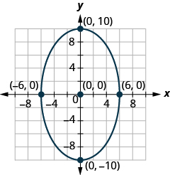 

In the following exercises, ⓐ identify the type of graph of each equation as a circle, parabola, ellipse, or hyperbola, and ⓑ graph the equation.

<math xmlns="http://www.w3.org/1998/Math/MathML"><mrow><mn>4</mn><msup><mi>x</mi><mn>2</mn></msup><mo>+</mo><mn>49</mn><msup><mi>y</mi><mn>2</mn></msup><mo>=</mo><mn>196</mn></mrow></math>

ⓐ ellipse* * *
{: data-type="newline"}

 ⓑ* * *
{: data-type="newline"}

  

<math xmlns="http://www.w3.org/1998/Math/MathML"><mrow><mi>y</mi><mo>=</mo><mn>3</mn><msup><mrow><mo stretchy="false">(</mo><mi>x</mi><mo>−</mo><mn>2</mn><mo stretchy="false">)</mo></mrow><mn>2</mn></msup><mo>−</mo><mn>2</mn></mrow></math>

<math xmlns="http://www.w3.org/1998/Math/MathML"><mrow><mn>3</mn><msup><mi>x</mi><mn>2</mn></msup><mo>+</mo><mn>3</mn><msup><mi>y</mi><mn>2</mn></msup><mo>=</mo><mn>27</mn></mrow></math>

ⓐ circle* * *
{: data-type="newline"}

 ⓑ* * *
{: data-type="newline"}

 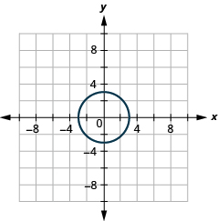 

<math xmlns="http://www.w3.org/1998/Math/MathML"><mrow><mfrac><mrow><msup><mi>y</mi><mn>2</mn></msup></mrow><mrow><mn>100</mn></mrow></mfrac><mo>−</mo><mfrac><mrow><msup><mi>x</mi><mn>2</mn></msup></mrow><mrow><mn>36</mn></mrow></mfrac><mo>=</mo><mn>1</mn></mrow></math>

<math xmlns="http://www.w3.org/1998/Math/MathML"><mrow><mfrac><mrow><msup><mi>x</mi><mn>2</mn></msup></mrow><mrow><mn>16</mn></mrow></mfrac><mo>+</mo><mfrac><mrow><msup><mi>y</mi><mn>2</mn></msup></mrow><mrow><mn>81</mn></mrow></mfrac><mo>=</mo><mn>1</mn></mrow></math>

ⓐ ellipse* * *
{: data-type="newline"}

 ⓑ* * *
{: data-type="newline"}

  

<math xmlns="http://www.w3.org/1998/Math/MathML"><mrow><mi>x</mi><mo>=</mo><mn>2</mn><msup><mi>y</mi><mn>2</mn></msup><mo>+</mo><mn>10</mn><mi>y</mi><mo>+</mo><mn>7</mn></mrow></math>

<math xmlns="http://www.w3.org/1998/Math/MathML"><mrow><mn>64</mn><msup><mi>x</mi><mn>2</mn></msup><mo>−</mo><mn>9</mn><msup><mi>y</mi><mn>2</mn></msup><mo>=</mo><mn>576</mn></mrow></math>

ⓐ hyperbola* * *
{: data-type="newline"}

 ⓑ* * *
{: data-type="newline"}

  

In the following exercises, ⓐ identify the type of graph of each equation as a circle, parabola, ellipse, or hyperbola, ⓑ write the equation in standard form, and ⓒ graph the equation.

<math xmlns="http://www.w3.org/1998/Math/MathML"><mrow><mn>25</mn><msup><mi>x</mi><mn>2</mn></msup><mo>+</mo><mn>64</mn><msup><mi>y</mi><mn>2</mn></msup><mo>+</mo><mn>200</mn><mi>x</mi><mo>−</mo><mn>256</mn><mi>y</mi><mo>−</mo><mn>944</mn><mo>=</mo><mn>0</mn></mrow></math>

<math xmlns="http://www.w3.org/1998/Math/MathML"><mrow><msup><mi>x</mi><mn>2</mn></msup><mo>+</mo><msup><mi>y</mi><mn>2</mn></msup><mo>+</mo><mn>10</mn><mi>x</mi><mo>+</mo><mn>6</mn><mi>y</mi><mo>+</mo><mn>30</mn><mo>=</mo><mn>0</mn></mrow></math>

ⓐ circle* * *
{: data-type="newline"}

 ⓑ <math xmlns="http://www.w3.org/1998/Math/MathML"><mrow><msup><mrow><mrow><mo>(</mo><mrow><mi>x</mi><mo>+</mo><mn>5</mn></mrow><mo>)</mo></mrow></mrow><mn>2</mn></msup><mo>+</mo><msup><mrow><mrow><mo>(</mo><mrow><mi>y</mi><mo>+</mo><mn>3</mn></mrow><mo>)</mo></mrow></mrow><mn>2</mn></msup><mo>=</mo><mn>4</mn></mrow></math>

* * *
{: data-type="newline"}

 ⓒ* * *
{: data-type="newline"}

 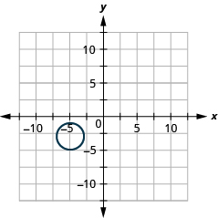 

<math xmlns="http://www.w3.org/1998/Math/MathML"><mrow><mi>x</mi><mo>=</mo><mtext>−</mtext><msup><mi>y</mi><mn>2</mn></msup><mo>+</mo><mn>2</mn><mi>y</mi><mo>−</mo><mn>4</mn></mrow></math>

<math xmlns="http://www.w3.org/1998/Math/MathML"><mrow><mn>9</mn><msup><mi>x</mi><mn>2</mn></msup><mo>−</mo><mn>25</mn><msup><mi>y</mi><mn>2</mn></msup><mo>−</mo><mn>36</mn><mi>x</mi><mo>−</mo><mn>50</mn><mi>y</mi><mo>−</mo><mn>214</mn><mo>=</mo><mn>0</mn></mrow></math>

ⓐ hyperbola* * *
{: data-type="newline"}

 ⓑ <math xmlns="http://www.w3.org/1998/Math/MathML"><mrow><mfrac><mrow><msup><mrow><mrow><mo>(</mo><mrow><mi>x</mi><mo>−</mo><mn>2</mn></mrow><mo>)</mo></mrow></mrow><mn>2</mn></msup></mrow><mrow><mn>25</mn></mrow></mfrac><mo>−</mo><mfrac><mrow><msup><mrow><mrow><mo>(</mo><mrow><mi>y</mi><mo>+</mo><mn>1</mn></mrow><mo>)</mo></mrow></mrow><mn>2</mn></msup></mrow><mn>9</mn></mfrac><mo>=</mo><mn>1</mn></mrow></math>

* * *
{: data-type="newline"}

 ⓒ* * *
{: data-type="newline"}

  

<math xmlns="http://www.w3.org/1998/Math/MathML"><mrow><mi>y</mi><mo>=</mo><msup><mi>x</mi><mn>2</mn></msup><mo>+</mo><mn>6</mn><mi>x</mi><mo>+</mo><mn>8</mn></mrow></math>

Solve the nonlinear system of equations by graphing:* * *
{: data-type="newline"}

<math xmlns="http://www.w3.org/1998/Math/MathML"><mrow><mrow><mo>{</mo><mtable><mtr><mtd columnalign="left"><mn>3</mn><msup><mi>y</mi><mn>2</mn></msup><mo>−</mo><mi>x</mi><mo>=</mo><mn>0</mn></mtd></mtr><mtr><mtd columnalign="left"><mi>y</mi><mo>=</mo><mn>−2</mn><mi>x</mi><mo>−</mo><mn>1</mn></mtd></mtr></mtable></mrow><mo>.</mo></mrow></math>

No solution

Solve the nonlinear system of equations using substitution:* * *
{: data-type="newline"}

<math xmlns="http://www.w3.org/1998/Math/MathML"><mrow><mrow><mo>{</mo><mtable><mtr><mtd columnalign="left"><msup><mi>x</mi><mn>2</mn></msup><mo>+</mo><msup><mi>y</mi><mn>2</mn></msup><mo>=</mo><mn>8</mn></mtd></mtr><mtr><mtd columnalign="left"><mi>y</mi><mo>=</mo><mtext>−</mtext><mi>x</mi><mo>−</mo><mn>4</mn></mtd></mtr></mtable></mrow><mo>.</mo></mrow></math>

Solve the nonlinear system of equations using elimination:* * *
{: data-type="newline"}

<math xmlns="http://www.w3.org/1998/Math/MathML"><mrow><mrow><mo>{</mo><mtable><mtr><mtd columnalign="left"><msup><mi>x</mi><mn>2</mn></msup><mo>+</mo><mn>9</mn><msup><mi>y</mi><mn>2</mn></msup><mo>=</mo><mn>9</mn></mtd></mtr><mtr><mtd columnalign="left"><mn>2</mn><msup><mi>x</mi><mn>2</mn></msup><mo>−</mo><mn>9</mn><msup><mi>y</mi><mn>2</mn></msup><mo>=</mo><mn>18</mn></mtd></mtr></mtable></mrow><mo>.</mo></mrow></math>

<math xmlns="http://www.w3.org/1998/Math/MathML"><mrow><mrow><mo>(</mo><mrow><mn>0</mn><mo>,</mo><mn>−3</mn></mrow><mo>)</mo></mrow><mo>,</mo><mrow><mo>(</mo><mrow><mn>0</mn><mo>,</mo><mn>3</mn></mrow><mo>)</mo></mrow></mrow></math>

Create the equation of the parabolic arch formed in the foundation of the bridge shown. Give the answer in <math xmlns="http://www.w3.org/1998/Math/MathML"><mrow><mi>y</mi><mo>=</mo><mi>a</mi><msup><mi>x</mi><mn>2</mn></msup><mo>+</mo><mi>b</mi><mi>x</mi><mo>+</mo><mi>c</mi></mrow></math>

 form.

 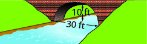 

A comet moves in an elliptical orbit around a sun. The closest the comet gets to the sun is approximately 20 AU and the furthest is approximately 70 AU. The sun is one of the foci of the elliptical orbit. Letting the ellipse center at the origin and labeling the axes in AU, the orbit will look like the figure below. Use the graph to write an equation for the elliptical orbit of the comet.

  

<math xmlns="http://www.w3.org/1998/Math/MathML"><mrow><mfrac><mrow><msup><mi>x</mi><mn>2</mn></msup></mrow><mrow><mn>2025</mn></mrow></mfrac><mo>+</mo><mfrac><mrow><msup><mi>y</mi><mn>2</mn></msup></mrow><mrow><mn>1400</mn></mrow></mfrac><mo>=</mo><mn>1</mn></mrow></math>

The sum of two numbers is 22 and the product is <math xmlns="http://www.w3.org/1998/Math/MathML"><mrow><mn>−240</mn><mo>.</mo></mrow></math>

 Find the numbers.

For her birthday, Olive’s grandparents bought her a new widescreen TV. Before opening it she wants to make sure it will fit her entertainment center. The TV is 55”. The size of a TV is measured on the diagonal of the screen and a widescreen has a length that is larger than the width. The screen also has an area of 1452 square inches. Her entertainment center has an insert for the TV with a length of 50 inches and width of 40 inches. What are the length and width of the TV screen and will it fit Olive’s entertainment center?

The length is 44 inches and the width is 33 inches. The TV will fit Olive’s entertainment center.

### Glossary
{: data-type="glossary-title"}

system of nonlinear equations
: A system of nonlinear equations is a system where at least one of the equations is not linear.

[1]: https://openstax.org/l/37nonsyseq
[2]: https://openstax.org/l/37nonsyseq2
[3]: https://openstax.org/l/37nonsyselim
[4]: https://openstax.org/l/37nonsysapps
