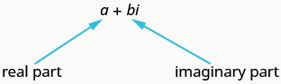
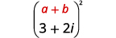
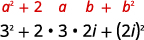
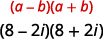
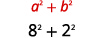
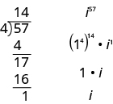
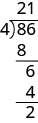
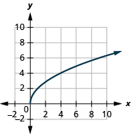

By the end of this section, you will be able to:
* Evaluate the square root of a negative number
* Add and subtract complex numbers
* Multiply complex numbers
* Divide complex numbers
* Simplify powers of
  <math xmlns="http://www.w3.org/1998/Math/MathML"><mrow><mi>i</mi></mrow></math>

Before you get started, take this readiness quiz.

1.  Given the numbers
    <math xmlns="http://www.w3.org/1998/Math/MathML"><mrow><mn>−4</mn><mo>,</mo><mo>−</mo><msqrt><mn>7</mn></msqrt><mo>,</mo><mn>0.</mn><mover accent="true"><mn>5</mn><mo stretchy="true">–</mo></mover><mo>,</mo><mfrac><mn>7</mn><mn>3</mn></mfrac><mo>,</mo><mn>3</mn><mo>,</mo><msqrt><mrow><mn>81</mn></mrow></msqrt><mo>,</mo></mrow></math>
    
    list the ⓐ rational numbers, ⓑ irrational numbers, ⓒ real numbers.
    * * *
    {: data-type="newline"}
    
    If you missed this problem, review [\[link\]](/m63305#fs-id1167836546317).
2.  Multiply:
    <math xmlns="http://www.w3.org/1998/Math/MathML"><mrow><mrow><mo>(</mo><mrow><mi>x</mi><mo>−</mo><mn>3</mn></mrow><mo>)</mo></mrow><mrow><mo>(</mo><mrow><mn>2</mn><mi>x</mi><mo>+</mo><mn>5</mn></mrow><mo>)</mo></mrow><mo>.</mo></mrow></math>
    
    * * *
    {: data-type="newline"}
    
    If you missed this problem, review [\[link\]](/m63351#fs-id1167836544266).
3.  Rationalize the denominator:
    <math xmlns="http://www.w3.org/1998/Math/MathML"><mrow><mfrac><mrow><msqrt><mn>5</mn></msqrt></mrow><mrow><msqrt><mn>5</mn></msqrt><mo>−</mo><msqrt><mn>3</mn></msqrt></mrow></mfrac><mo>.</mo></mrow></math>
    
    * * *
    {: data-type="newline"}
    
    If you missed this problem, review [\[link\]](/m63351#fs-id1167836392219).
{: data-number-style="arabic"}

# Evaluate the Square Root of a Negative Number

Whenever we have a situation where we have a square root of a negative number we say there is no real number that equals that square root. For example, to simplify <math xmlns="http://www.w3.org/1998/Math/MathML"><mrow><msqrt><mrow><mn>−1</mn></mrow></msqrt><mo>,</mo></mrow></math>

 we are looking for a real number *x* so that *x*2 = –1. Since all real numbers squared are positive numbers, there is no real number that equals –1 when squared.

Mathematicians have often expanded their numbers systems as needed. They added 0 to the counting numbers to get the whole numbers. When they needed negative balances, they added negative numbers to get the integers. When they needed the idea of parts of a whole they added fractions and got the rational numbers. Adding the irrational numbers allowed numbers like <math xmlns="http://www.w3.org/1998/Math/MathML"><mrow><msqrt><mn>5</mn></msqrt><mo>.</mo></mrow></math>

 All of these together gave us the real numbers and so far in your study of mathematics, that has been sufficient.

But now we will expand the real numbers to include the square roots of negative numbers. We start by defining the **imaginary unit**{: data-type="term"} <math xmlns="http://www.w3.org/1998/Math/MathML"><mi>i</mi></math>

 as the number whose square is –1.

Imaginary Unit

The **imaginary unit** *i* is the number whose square is –1.

<math xmlns="http://www.w3.org/1998/Math/MathML"><mrow><msup><mi>i</mi><mn>2</mn></msup><mo>=</mo><mn>−1</mn><mspace width="0.2em" /><mtext>or</mtext><mspace width="0.2em" /><mi>i</mi><mo>=</mo><msqrt><mrow><mn>−1</mn></mrow></msqrt></mrow></math>

We will use the imaginary unit to simplify the square roots of negative numbers.

Square Root of a Negative Number

If *b* is a positive real number, then

<math xmlns="http://www.w3.org/1998/Math/MathML"><mrow><msqrt><mrow><mtext>−</mtext><mi>b</mi></mrow></msqrt><mo>=</mo><msqrt><mi>b</mi></msqrt><mspace width="0.2em" /><mi>i</mi></mrow></math>

We will use this definition in the next example. Be careful that it is clear that the *i* is not under the radical. Sometimes you will see this written as <math xmlns="http://www.w3.org/1998/Math/MathML"><mrow><msqrt><mrow><mtext>−</mtext><mi>b</mi></mrow></msqrt><mo>=</mo><mi>i</mi><msqrt><mi>b</mi></msqrt></mrow></math>

 to emphasize the *i* is not under the radical. But the <math xmlns="http://www.w3.org/1998/Math/MathML"><mrow><msqrt><mrow><mtext>−</mtext><mi>b</mi></mrow></msqrt><mo>=</mo><msqrt><mi>b</mi></msqrt><mspace width="0.2em" /><mi>i</mi></mrow></math>

 is considered standard form.

Write each expression in terms of *i* and simplify if possible:

ⓐ <math xmlns="http://www.w3.org/1998/Math/MathML"><mrow><msqrt><mrow><mn>−25</mn></mrow></msqrt></mrow></math>

 ⓑ <math xmlns="http://www.w3.org/1998/Math/MathML"><mrow><msqrt><mrow><mn>−7</mn></mrow></msqrt></mrow></math>

 ⓒ <math xmlns="http://www.w3.org/1998/Math/MathML"><mrow><msqrt><mrow><mn>−12</mn></mrow></msqrt><mo>.</mo></mrow></math>

ⓐ* * *
{: data-type="newline"}

 <math xmlns="http://www.w3.org/1998/Math/MathML"><mrow><mtable><mtr><mtd /><mtd /><mtd /><mtd columnalign="center"><mspace width="8.5em" /><msqrt><mrow><mn>−25</mn></mrow></msqrt></mtd></mtr> <mtr><mtd columnalign="left"><mtable><mtr><mtd columnalign="left"><mtext>Use the definition of the square root of</mtext></mtd></mtr><mtr><mtd columnalign="left"><mtext>negative numbers.</mtext></mtd></mtr></mtable></mtd><mtd /><mtd /><mtd columnalign="center"><mspace width="8.5em" /><msqrt><mrow><mn>25</mn></mrow></msqrt><mspace width="0.2em" /><mi>i</mi></mtd></mtr> <mtr><mtd columnalign="left"><mtext>Simplify.</mtext></mtd><mtd /><mtd /><mtd columnalign="center"><mspace width="8.5em" /><mn>5</mn><mi>i</mi></mtd></mtr></mtable></mrow></math>

ⓑ* * *
{: data-type="newline"}

 <math xmlns="http://www.w3.org/1998/Math/MathML"><mrow><mtable><mtr><mtd /><mtd /><mtd /><mtd columnalign="center"><msqrt><mrow><mn>−7</mn></mrow></msqrt></mtd></mtr> <mtr><mtd columnalign="left"><mtable><mtr><mtd columnalign="left"><mtext>Use the definition of the square root of</mtext></mtd></mtr><mtr><mtd columnalign="left"><mtext>negative numbers.</mtext></mtd></mtr></mtable></mtd><mtd /><mtd /><mtd columnalign="center"><msqrt><mn>7</mn></msqrt><mi>i</mi></mtd></mtr> <mtr><mtd columnalign="left"><mtext>Simplify.</mtext></mtd><mtd /><mtd /><mtd columnalign="center"><mtable><mtr><mtd columnalign="center"><mtext>Be careful that it is clear that</mtext><mspace width="0.2em" /><mi>i</mi><mspace width="0.2em" /><mtext>is not under the</mtext></mtd></mtr><mtr><mtd columnalign="left"><mtext>radical sign.</mtext></mtd></mtr></mtable></mtd></mtr></mtable></mrow></math>

ⓒ* * *
{: data-type="newline"}

 <math xmlns="http://www.w3.org/1998/Math/MathML"><mrow><mtable><mtr><mtd /><mtd /><mtd /><mtd columnalign="center"><mspace width="8.5em" /><msqrt><mrow><mn>−12</mn></mrow></msqrt></mtd></mtr> <mtr><mtd columnalign="left"><mtable><mtr><mtd columnalign="left"><mtext>Use the definition of the square root of</mtext></mtd></mtr><mtr><mtd columnalign="left"><mtext>negative numbers.</mtext></mtd></mtr></mtable></mtd><mtd /><mtd /><mtd columnalign="center"><mspace width="8.5em" /><msqrt><mrow><mn>12</mn></mrow></msqrt><mspace width="0.2em" /><mi>i</mi></mtd></mtr> <mtr><mtd columnalign="left"><mtext>Simplify</mtext><mspace width="0.2em" /><msqrt><mrow><mn>12</mn></mrow></msqrt><mo>.</mo></mtd><mtd /><mtd /><mtd columnalign="center"><mspace width="8.5em" /><mn>2</mn><msqrt><mn>3</mn></msqrt><mspace width="0.2em" /><mi>i</mi></mtd></mtr></mtable></mrow></math>

Write each expression in terms of *i* and simplify if possible:

ⓐ <math xmlns="http://www.w3.org/1998/Math/MathML"><mrow><msqrt><mrow><mn>−81</mn></mrow></msqrt></mrow></math>

 ⓑ <math xmlns="http://www.w3.org/1998/Math/MathML"><mrow><msqrt><mrow><mn>−5</mn></mrow></msqrt></mrow></math>

 ⓒ <math xmlns="http://www.w3.org/1998/Math/MathML"><mrow><msqrt><mrow><mn>−18</mn></mrow></msqrt><mo>.</mo></mrow></math>

ⓐ <math xmlns="http://www.w3.org/1998/Math/MathML"><mrow><mn>9</mn><mi>i</mi></mrow></math>

 ⓑ <math xmlns="http://www.w3.org/1998/Math/MathML"><mrow><msqrt><mn>5</mn></msqrt><mi>i</mi></mrow></math>

 ⓒ <math xmlns="http://www.w3.org/1998/Math/MathML"><mrow><mn>3</mn><msqrt><mn>2</mn></msqrt><mi>i</mi></mrow></math>

Write each expression in terms of *i* and simplify if possible:

ⓐ <math xmlns="http://www.w3.org/1998/Math/MathML"><mrow><msqrt><mrow><mn>−36</mn></mrow></msqrt></mrow></math>

 ⓑ <math xmlns="http://www.w3.org/1998/Math/MathML"><mrow><msqrt><mrow><mn>−3</mn></mrow></msqrt></mrow></math>

 ⓒ <math xmlns="http://www.w3.org/1998/Math/MathML"><mrow><msqrt><mrow><mn>−27</mn></mrow></msqrt><mo>.</mo></mrow></math>

ⓐ <math xmlns="http://www.w3.org/1998/Math/MathML"><mrow><mn>6</mn><mi>i</mi></mrow></math>

 ⓑ <math xmlns="http://www.w3.org/1998/Math/MathML"><mrow><msqrt><mn>3</mn></msqrt><mi>i</mi></mrow></math>

 ⓒ <math xmlns="http://www.w3.org/1998/Math/MathML"><mrow><mn>3</mn><msqrt><mn>3</mn></msqrt><mi>i</mi></mrow></math>

Now that we are familiar with the imaginary number *i*, we can expand the real numbers to include imaginary numbers. The **complex number system**{: data-type="term"} includes the real numbers and the imaginary numbers. A **complex number**{: data-type="term"} is of the form *a* + *bi*, where *a, b* are real numbers. We call *a* the real part and *b* the imaginary part.

Complex Number

A **complex number** is of the form *a* + *bi*, where *a* and *b* are real numbers.

  

A complex number is in standard form when written as <math xmlns="http://www.w3.org/1998/Math/MathML"><mrow><mi>a</mi><mo>+</mo><mi>b</mi><mi>i</mi><mo>,</mo></mrow></math>

 where *a* and *b* are real numbers.

If <math xmlns="http://www.w3.org/1998/Math/MathML"><mrow><mi>b</mi><mo>=</mo><mn>0</mn><mo>,</mo></mrow></math>

 then <math xmlns="http://www.w3.org/1998/Math/MathML"><mrow><mi>a</mi><mo>+</mo><mi>b</mi><mi>i</mi></mrow></math>

 becomes <math xmlns="http://www.w3.org/1998/Math/MathML"><mrow><mi>a</mi><mo>+</mo><mn>0</mn><mo>·</mo><mi>i</mi><mo>=</mo><mi>a</mi><mo>,</mo></mrow></math>

 and is a real number.

If <math xmlns="http://www.w3.org/1998/Math/MathML"><mrow><mi>b</mi><mo>≠</mo><mn>0</mn><mo>,</mo></mrow></math>

 then <math xmlns="http://www.w3.org/1998/Math/MathML"><mrow><mi>a</mi><mo>+</mo><mi>b</mi><mi>i</mi></mrow></math>

 is an imaginary number.

If <math xmlns="http://www.w3.org/1998/Math/MathML"><mrow><mi>a</mi><mo>=</mo><mn>0</mn><mo>,</mo></mrow></math>

 then <math xmlns="http://www.w3.org/1998/Math/MathML"><mrow><mi>a</mi><mo>+</mo><mi>b</mi><mi>i</mi></mrow></math>

 becomes <math xmlns="http://www.w3.org/1998/Math/MathML"><mrow><mn>0</mn><mo>+</mo><mi>b</mi><mi>i</mi><mo>=</mo><mi>b</mi><mi>i</mi><mo>,</mo></mrow></math>

 and is called a pure imaginary number.

We summarize this here.

|  | <math xmlns="http://www.w3.org/1998/Math/MathML"><mrow><mi>a</mi><mo>+</mo><mi>b</mi><mi>i</mi></mrow></math>

 |  |
{: valign="top"}| <math xmlns="http://www.w3.org/1998/Math/MathML"><mrow><mi>b</mi><mo>=</mo><mn>0</mn></mrow></math>

 | <math xmlns="http://www.w3.org/1998/Math/MathML"><mtable><mtr /><mtr><mtd><mi>a</mi><mo>+</mo><mn>0</mn><mo>·</mo><mi>i</mi></mtd></mtr><mtr /><mtr><mtd><mspace width="1.2em" /><mi>a</mi></mtd></mtr></mtable></math>

 | Real number |
{: valign="top"}| <math xmlns="http://www.w3.org/1998/Math/MathML"><mrow><mi>b</mi><mo>≠</mo><mn>0</mn></mrow></math>

 | <math xmlns="http://www.w3.org/1998/Math/MathML"><mrow><mi>a</mi><mo>+</mo><mi>b</mi><mi>i</mi></mrow></math>

 | Imaginary number |
{: valign="top"}| <math xmlns="http://www.w3.org/1998/Math/MathML"><mrow><mi>a</mi><mo>=</mo><mn>0</mn></mrow></math>

 | <math xmlns="http://www.w3.org/1998/Math/MathML"><mtable columnalign="left"><mtr><mtd><mn>0</mn><mo>+</mo><mi>b</mi><mi>i</mi></mtd></mtr><mtr /><mtr /><mtr><mtd><mspace width="0.8em" /><mi>b</mi><mi>i</mi></mtd></mtr></mtable></math>

 | Pure imaginary number |
{: valign="top"}{: .unnumbered summary="The table has four rows and three columns. The first row is a header and the second column entry a plus b i. In the second row is b equals zero, a plus 0 i, and &#x201C;Real number&#x201D;. The third row contains b is not equal to 0, a plus b i, and &#x201C;Imaginary number&#x201D;. The fourth row contains a = 0, 0 plus b i, and &#x201C;Pure imaginary number&#x201D;."}

The standard form of a complex number is <math xmlns="http://www.w3.org/1998/Math/MathML"><mrow><mi>a</mi><mo>+</mo><mi>b</mi><mi>i</mi><mo>,</mo></mrow></math>

 so this explains why the preferred form is <math xmlns="http://www.w3.org/1998/Math/MathML"><mrow><msqrt><mrow><mtext>−</mtext><mi>b</mi></mrow></msqrt><mo>=</mo><msqrt><mi>b</mi></msqrt><mi>i</mi></mrow></math>

 when <math xmlns="http://www.w3.org/1998/Math/MathML"><mrow><mi>b</mi><mo>&gt;</mo><mn>0</mn><mo>.</mo></mrow></math>

The diagram helps us visualize the complex number system. It is made up of both the real numbers and the imaginary numbers.

    # Add or Subtract Complex Numbers

We are now ready to perform the operations of addition, subtraction, multiplication and division on the complex numbers—just as we did with the real numbers.

Adding and subtracting complex numbers is much like adding or subtracting like terms. We add or subtract the real parts and then add or subtract the imaginary parts. Our final result should be in standard form.

Add: <math xmlns="http://www.w3.org/1998/Math/MathML"><mrow><msqrt><mrow><mn>−12</mn></mrow></msqrt><mo>+</mo><msqrt><mrow><mn>−27</mn></mrow></msqrt><mo>.</mo></mrow></math>

<math xmlns="http://www.w3.org/1998/Math/MathML"><mrow><mtable><mtr><mtd /><mtd /><mtd /><mtd columnalign="center"><mspace width="4em" /><msqrt><mrow><mn>−12</mn></mrow></msqrt><mo>+</mo><msqrt><mrow><mn>−27</mn></mrow></msqrt></mtd></mtr> <mtr><mtd columnalign="left"><mtable><mtr><mtd columnalign="left"><mtext>Use the definition of the square root of</mtext></mtd></mtr><mtr><mtd columnalign="left"><mtext>negative numbers.</mtext></mtd></mtr></mtable></mtd><mtd /><mtd /><mtd columnalign="center"><mspace width="4em" /><msqrt><mrow><mn>12</mn></mrow></msqrt><mspace width="0.2em" /><mi>i</mi><mo>+</mo><msqrt><mrow><mn>27</mn></mrow></msqrt><mspace width="0.2em" /><mi>i</mi></mtd></mtr> <mtr><mtd columnalign="left"><mtext>Simplify the square roots.</mtext></mtd><mtd /><mtd /><mtd columnalign="center"><mspace width="4em" /><mn>2</mn><msqrt><mn>3</mn></msqrt><mspace width="0.2em" /><mi>i</mi><mo>+</mo><mn>3</mn><msqrt><mn>3</mn></msqrt><mspace width="0.2em" /><mi>i</mi></mtd></mtr> <mtr><mtd columnalign="left"><mtext>Add.</mtext></mtd><mtd /><mtd /><mtd columnalign="center"><mspace width="4em" /><mn>5</mn><msqrt><mn>3</mn></msqrt><mspace width="0.2em" /><mi>i</mi></mtd></mtr></mtable></mrow></math>

Add: <math xmlns="http://www.w3.org/1998/Math/MathML"><mrow><msqrt><mrow><mn>−8</mn></mrow></msqrt><mo>+</mo><msqrt><mrow><mn>−32</mn></mrow></msqrt><mo>.</mo></mrow></math>

<math xmlns="http://www.w3.org/1998/Math/MathML"><mrow><mn>6</mn><msqrt><mrow><mn>2</mn></mrow></msqrt><mi>i</mi></mrow></math>

Add: <math xmlns="http://www.w3.org/1998/Math/MathML"><mrow><msqrt><mrow><mn>−27</mn></mrow></msqrt><mo>+</mo><msqrt><mrow><mn>−48</mn></mrow></msqrt><mo>.</mo></mrow></math>

<math xmlns="http://www.w3.org/1998/Math/MathML"><mrow><mn>7</mn><msqrt><mn>3</mn></msqrt><mi>i</mi></mrow></math>

Remember to add both the real parts and the imaginary parts in this next example.

Simplify: ⓐ <math xmlns="http://www.w3.org/1998/Math/MathML"><mrow><mrow><mo>(</mo><mrow><mn>4</mn><mo>−</mo><mn>3</mn><mi>i</mi></mrow><mo>)</mo></mrow><mo>+</mo><mrow><mo>(</mo><mrow><mn>5</mn><mo>+</mo><mn>6</mn><mi>i</mi></mrow><mo>)</mo></mrow></mrow></math>

 ⓑ <math xmlns="http://www.w3.org/1998/Math/MathML"><mrow><mrow><mo>(</mo><mrow><mn>2</mn><mo>−</mo><mn>5</mn><mi>i</mi></mrow><mo>)</mo></mrow><mo>−</mo><mrow><mo>(</mo><mrow><mn>5</mn><mo>−</mo><mn>2</mn><mi>i</mi></mrow><mo>)</mo></mrow><mo>.</mo></mrow></math>

ⓐ* * *
{: data-type="newline"}

 <math xmlns="http://www.w3.org/1998/Math/MathML"><mrow><mtable><mtr><mtd /><mtd /><mtd /><mtd columnalign="center"><mspace width="4em" /><mrow><mo>(</mo><mrow><mn>4</mn><mo>−</mo><mn>3</mn><mi>i</mi></mrow><mo>)</mo></mrow><mo>+</mo><mrow><mo>(</mo><mrow><mn>5</mn><mo>+</mo><mn>6</mn><mi>i</mi></mrow><mo>)</mo></mrow></mtd></mtr> <mtr><mtd columnalign="left"><mtable><mtr><mtd columnalign="left"><mtext>Use the Associative Property to put the real</mtext></mtd></mtr><mtr><mtd columnalign="left"><mtext>parts and the imaginary parts together.</mtext></mtd></mtr></mtable></mtd><mtd /><mtd /><mtd columnalign="center"><mspace width="4em" /><mrow><mo>(</mo><mrow><mn>4</mn><mo>+</mo><mn>5</mn></mrow><mo>)</mo></mrow><mo>+</mo><mrow><mo>(</mo><mrow><mn>−3</mn><mi>i</mi><mo>+</mo><mn>6</mn><mi>i</mi></mrow><mo>)</mo></mrow></mtd></mtr> <mtr><mtd columnalign="left"><mtext>Simplify.</mtext></mtd><mtd /><mtd /><mtd columnalign="center"><mspace width="4em" /><mn>9</mn><mo>+</mo><mn>3</mn><mi>i</mi></mtd></mtr></mtable></mrow></math>

ⓑ* * *
{: data-type="newline"}

 <math xmlns="http://www.w3.org/1998/Math/MathML"><mrow><mtable><mtr><mtd /><mtd /><mtd /><mtd columnalign="center"><mspace width="4em" /><mrow><mo>(</mo><mrow><mn>2</mn><mo>−</mo><mn>5</mn><mi>i</mi></mrow><mo>)</mo></mrow><mo>−</mo><mrow><mo>(</mo><mrow><mn>5</mn><mo>−</mo><mn>2</mn><mi>i</mi></mrow><mo>)</mo></mrow></mtd></mtr> <mtr><mtd columnalign="left"><mtext>Distribute.</mtext></mtd><mtd /><mtd /><mtd columnalign="center"><mspace width="4em" /><mn>2</mn><mo>−</mo><mn>5</mn><mi>i</mi><mo>−</mo><mn>5</mn><mo>+</mo><mn>2</mn><mi>i</mi></mtd></mtr> <mtr><mtd columnalign="left"><mtable><mtr><mtd columnalign="left"><mtext>Use the Associative Property to put the real</mtext></mtd></mtr><mtr><mtd columnalign="left"><mtext>parts and the imaginary parts together.</mtext></mtd></mtr></mtable></mtd><mtd /><mtd /><mtd columnalign="center"><mspace width="4em" /><mn>2</mn><mo>−</mo><mn>5</mn><mo>−</mo><mn>5</mn><mi>i</mi><mo>+</mo><mn>2</mn><mi>i</mi></mtd></mtr> <mtr><mtd columnalign="left"><mtext>Simplify.</mtext></mtd><mtd /><mtd /><mtd columnalign="center"><mspace width="4em" /><mn>−3</mn><mo>−</mo><mn>3</mn><mi>i</mi></mtd></mtr></mtable></mrow></math>

Simplify: ⓐ <math xmlns="http://www.w3.org/1998/Math/MathML"><mrow><mrow><mo>(</mo><mrow><mn>2</mn><mo>+</mo><mn>7</mn><mi>i</mi></mrow><mo>)</mo></mrow><mo>+</mo><mrow><mo>(</mo><mrow><mn>4</mn><mo>−</mo><mn>2</mn><mi>i</mi></mrow><mo>)</mo></mrow></mrow></math>

 ⓑ <math xmlns="http://www.w3.org/1998/Math/MathML"><mrow><mrow><mo>(</mo><mrow><mn>8</mn><mo>−</mo><mn>4</mn><mi>i</mi></mrow><mo>)</mo></mrow><mo>−</mo><mrow><mo>(</mo><mrow><mn>2</mn><mo>−</mo><mi>i</mi></mrow><mo>)</mo></mrow><mo>.</mo></mrow></math>

ⓐ <math xmlns="http://www.w3.org/1998/Math/MathML"><mrow><mn>6</mn><mo>+</mo><mn>5</mn><mi>i</mi></mrow></math>

 ⓑ <math xmlns="http://www.w3.org/1998/Math/MathML"><mrow><mn>6</mn><mo>−</mo><mn>3</mn><mi>i</mi></mrow></math>

Simplify: ⓐ <math xmlns="http://www.w3.org/1998/Math/MathML"><mrow><mrow><mo>(</mo><mrow><mn>3</mn><mo>−</mo><mn>2</mn><mi>i</mi></mrow><mo>)</mo></mrow><mo>+</mo><mrow><mo>(</mo><mrow><mn>−5</mn><mo>−</mo><mn>4</mn><mi>i</mi></mrow><mo>)</mo></mrow></mrow></math>

 ⓑ <math xmlns="http://www.w3.org/1998/Math/MathML"><mrow><mrow><mo>(</mo><mrow><mn>4</mn><mo>+</mo><mn>3</mn><mi>i</mi></mrow><mo>)</mo></mrow><mo>−</mo><mrow><mo>(</mo><mrow><mn>2</mn><mo>−</mo><mn>6</mn><mi>i</mi></mrow><mo>)</mo></mrow><mo>.</mo></mrow></math>

ⓐ <math xmlns="http://www.w3.org/1998/Math/MathML"><mrow><mn>−2</mn><mo>−</mo><mn>6</mn><mi>i</mi></mrow></math>

 ⓑ <math xmlns="http://www.w3.org/1998/Math/MathML"><mrow><mn>2</mn><mo>+</mo><mn>9</mn><mi>i</mi></mrow></math>

# Multiply Complex Numbers

Multiplying complex numbers is also much like multiplying expressions with coefficients and variables. There is only one special case we need to consider. We will look at that after we practice in the next two examples.

Multiply: <math xmlns="http://www.w3.org/1998/Math/MathML"><mrow><mn>2</mn><mi>i</mi><mrow><mo>(</mo><mrow><mn>7</mn><mo>−</mo><mn>5</mn><mi>i</mi></mrow><mo>)</mo></mrow><mo>.</mo></mrow></math>

<math xmlns="http://www.w3.org/1998/Math/MathML"><mrow><mtable><mtr><mtd /><mtd /><mtd /><mtd columnalign="center"><mspace width="11em" /><mn>2</mn><mi>i</mi><mrow><mo>(</mo><mrow><mn>7</mn><mo>−</mo><mn>5</mn><mi>i</mi></mrow><mo>)</mo></mrow></mtd></mtr> <mtr><mtd columnalign="left"><mtext>Distribute.</mtext></mtd><mtd /><mtd /><mtd columnalign="center"><mspace width="11em" /><mn>14</mn><mi>i</mi><mo>−</mo><mn>10</mn><msup><mi>i</mi><mn>2</mn></msup></mtd></mtr> <mtr><mtd columnalign="left"><mtext>Simplify</mtext><mspace width="0.2em" /><msup><mi>i</mi><mn>2</mn></msup><mo>.</mo></mtd><mtd /><mtd /><mtd columnalign="center"><mspace width="11em" /><mn>14</mn><mi>i</mi><mo>−</mo><mn>10</mn><mrow><mo>(</mo><mrow><mn>−1</mn></mrow><mo>)</mo></mrow></mtd></mtr> <mtr><mtd columnalign="left"><mtext>Multiply.</mtext></mtd><mtd /><mtd /><mtd columnalign="center"><mspace width="11em" /><mn>14</mn><mi>i</mi><mo>+</mo><mn>10</mn></mtd></mtr> <mtr><mtd columnalign="left"><mtext>Write in standard form.</mtext></mtd><mtd /><mtd /><mtd columnalign="center"><mspace width="11em" /><mn>10</mn><mo>+</mo><mn>14</mn><mi>i</mi></mtd></mtr></mtable></mrow></math>

Multiply: <math xmlns="http://www.w3.org/1998/Math/MathML"><mrow><mn>4</mn><mi>i</mi><mrow><mo>(</mo><mrow><mn>5</mn><mo>−</mo><mn>3</mn><mi>i</mi></mrow><mo>)</mo></mrow><mo>.</mo></mrow></math>

<math xmlns="http://www.w3.org/1998/Math/MathML"><mrow><mn>12</mn><mo>+</mo><mn>20</mn><mi>i</mi></mrow></math>

Multiply: <math xmlns="http://www.w3.org/1998/Math/MathML"><mrow><mn>−3</mn><mi>i</mi><mrow><mo>(</mo><mrow><mn>2</mn><mo>+</mo><mn>4</mn><mi>i</mi></mrow><mo>)</mo></mrow><mo>.</mo></mrow></math>

<math xmlns="http://www.w3.org/1998/Math/MathML"><mrow><mn>12</mn><mo>+</mo><mn>6</mn><mi>i</mi></mrow></math>

In the next example, we multiply the binomials using the **Distributive Property**{: data-type="term" .no-emphasis} or **FOIL**{: data-type="term" .no-emphasis}.

Multiply: <math xmlns="http://www.w3.org/1998/Math/MathML"><mrow><mrow><mo>(</mo><mrow><mn>3</mn><mo>+</mo><mn>2</mn><mi>i</mi></mrow><mo>)</mo></mrow><mrow><mo>(</mo><mrow><mn>4</mn><mo>−</mo><mn>3</mn><mi>i</mi></mrow><mo>)</mo></mrow><mo>.</mo></mrow></math>

<math xmlns="http://www.w3.org/1998/Math/MathML"><mrow><mtable><mtr><mtd /><mtd /><mtd /><mtd columnalign="center"><mspace width="6.5em" /><mrow><mo>(</mo><mrow><mn>3</mn><mo>+</mo><mn>2</mn><mi>i</mi></mrow><mo>)</mo></mrow><mrow><mo>(</mo><mrow><mn>4</mn><mo>−</mo><mn>3</mn><mi>i</mi></mrow><mo>)</mo></mrow></mtd></mtr> <mtr><mtd columnalign="left"><mtext>Use FOIL.</mtext></mtd><mtd /><mtd /><mtd columnalign="center"><mspace width="6.5em" /><mn>12</mn><mo>−</mo><mn>9</mn><mi>i</mi><mo>+</mo><mn>8</mn><mi>i</mi><mo>−</mo><mn>6</mn><msup><mi>i</mi><mn>2</mn></msup></mtd></mtr> <mtr><mtd columnalign="left"><mtext>Simplify</mtext><mspace width="0.2em" /><msup><mi>i</mi><mn>2</mn></msup><mspace width="0.2em" /><mtext>and combine like terms.</mtext></mtd><mtd /><mtd /><mtd columnalign="center"><mspace width="6.5em" /><mn>12</mn><mo>−</mo><mi>i</mi><mo>−</mo><mn>6</mn><mrow><mo>(</mo><mrow><mn>−1</mn></mrow><mo>)</mo></mrow></mtd></mtr> <mtr><mtd columnalign="left"><mtext>Multiply.</mtext></mtd><mtd /><mtd /><mtd columnalign="center"><mspace width="6.5em" /><mn>12</mn><mo>−</mo><mi>i</mi><mo>+</mo><mn>6</mn></mtd></mtr> <mtr><mtd columnalign="left"><mtext>Combine the real parts.</mtext></mtd><mtd /><mtd /><mtd columnalign="center"><mspace width="6.5em" /><mn>18</mn><mo>−</mo><mi>i</mi></mtd></mtr></mtable></mrow></math>

Multiply: <math xmlns="http://www.w3.org/1998/Math/MathML"><mrow><mrow><mo>(</mo><mrow><mn>5</mn><mo>−</mo><mn>3</mn><mi>i</mi></mrow><mo>)</mo></mrow><mrow><mo>(</mo><mrow><mn>−1</mn><mo>−</mo><mn>2</mn><mi>i</mi></mrow><mo>)</mo></mrow><mo>.</mo></mrow></math>

<math xmlns="http://www.w3.org/1998/Math/MathML"><mrow><mn>−11</mn><mo>−</mo><mn>7</mn><mi>i</mi></mrow></math>

Multiply: <math xmlns="http://www.w3.org/1998/Math/MathML"><mrow><mrow><mo>(</mo><mrow><mn>−4</mn><mo>−</mo><mn>3</mn><mi>i</mi></mrow><mo>)</mo></mrow><mrow><mo>(</mo><mrow><mn>2</mn><mo>+</mo><mi>i</mi></mrow><mo>)</mo></mrow><mo>.</mo></mrow></math>

<math xmlns="http://www.w3.org/1998/Math/MathML"><mrow><mn>−5</mn><mo>−</mo><mn>10</mn><mi>i</mi></mrow></math>

In the next example, we could use FOIL or the **Product of Binomial Squares Pattern**{: data-type="term" .no-emphasis}.

Multiply: <math xmlns="http://www.w3.org/1998/Math/MathML"><mrow><msup><mrow><mo stretchy="false">(</mo><mn>3</mn><mo>+</mo><mn>2</mn><mi>i</mi><mo stretchy="false">)</mo></mrow><mn>2</mn></msup></mrow></math>

|  |    |
| Use the Product of Binomial Squares Pattern, <math xmlns="http://www.w3.org/1998/Math/MathML"><mrow><msup><mrow><mrow><mo>(</mo><mrow><mi>a</mi><mo>+</mo><mi>b</mi></mrow><mo>)</mo></mrow></mrow><mn>2</mn></msup><mo>=</mo><msup><mi>a</mi><mn>2</mn></msup><mo>+</mo><mn>2</mn><mi>a</mi><mi>b</mi><mo>+</mo><msup><mi>b</mi><mn>2</mn></msup><mo>.</mo></mrow></math>

 |    |
| Simplify. |    |
| Simplify <math xmlns="http://www.w3.org/1998/Math/MathML"><mrow><msup><mi>i</mi><mn>2</mn></msup><mo>.</mo></mrow></math>

 |    |
| Simplify. |    |
{: .unnumbered .unstyled summary="Use the Binomial Squares Pattern formula the quantity a plus b in parentheses squared equals a squared plus 2 a b plus b squared. Applied to this example we get the expression 3 squared plus 2 times 3 times 2 i plus the quantity 2 i in parentheses squared. Simplifying we get 9 plus 12 i plus 4 i squared. Simplifying further we get 9 plus 12 i plus 4 times negative 1. The final simplified version is 5 plus 12 i." data-label=""}

Multiply using the Binomial Squares pattern: <math xmlns="http://www.w3.org/1998/Math/MathML"><mrow><msup><mrow><mo stretchy="false">(</mo><mn>−2</mn><mo>−</mo><mn>5</mn><mi>i</mi><mo stretchy="false">)</mo></mrow><mn>2</mn></msup><mo>.</mo></mrow></math>

<math xmlns="http://www.w3.org/1998/Math/MathML"><mrow><mn>−21</mn><mo>−</mo><mn>20</mn><mi>i</mi></mrow></math>

Multiply using the Binomial Squares pattern: <math xmlns="http://www.w3.org/1998/Math/MathML"><mrow><msup><mrow><mo stretchy="false">(</mo><mn>−5</mn><mo>+</mo><mn>4</mn><mi>i</mi><mo stretchy="false">)</mo></mrow><mn>2</mn></msup><mo>.</mo></mrow></math>

<math xmlns="http://www.w3.org/1998/Math/MathML"><mrow><mn>9</mn><mo>−</mo><mn>40</mn><mi>i</mi></mrow></math>

Since the square root of a negative number is not a real number, we cannot use the Product Property for Radicals. In order to multiply square roots of negative numbers we should first write them as complex numbers, using <math xmlns="http://www.w3.org/1998/Math/MathML"><mrow><msqrt><mrow><mtext>−</mtext><mi>b</mi></mrow></msqrt><mo>=</mo><msqrt><mi>b</mi></msqrt><mi>i</mi><mo>.</mo></mrow></math>

 This is one place students tend to make errors, so be careful when you see multiplying with a negative square root.

Multiply: <math xmlns="http://www.w3.org/1998/Math/MathML"><mrow><msqrt><mrow><mn>−36</mn></mrow></msqrt><mo>·</mo><msqrt><mrow><mn>−4</mn></mrow></msqrt><mo>.</mo></mrow></math>

To multiply square roots of negative numbers, we first write them as complex numbers.

<math xmlns="http://www.w3.org/1998/Math/MathML"><mrow><mtable><mtr><mtd /><mtd /><mtd /><mtd columnalign="center"><mspace width="4em" /><msqrt><mrow><mn>−36</mn></mrow></msqrt><mo>·</mo><msqrt><mrow><mn>−4</mn></mrow></msqrt></mtd></mtr> <mtr><mtd columnalign="left"><mtext>Write as complex numbers using</mtext><mspace width="0.2em" /><msqrt><mrow><mtext>−</mtext><mi>b</mi></mrow></msqrt><mo>=</mo><msqrt><mi>b</mi></msqrt><mi>i</mi><mo>.</mo></mtd><mtd /><mtd /><mtd columnalign="center"><mspace width="4em" /><msqrt><mrow><mn>36</mn></mrow></msqrt><mspace width="0.2em" /><mi>i</mi><mo>·</mo><msqrt><mn>4</mn></msqrt><mspace width="0.2em" /><mi>i</mi></mtd></mtr> <mtr><mtd columnalign="left"><mtext>Simplify.</mtext></mtd><mtd /><mtd /><mtd columnalign="center"><mspace width="4em" /><mn>6</mn><mi>i</mi><mo>·</mo><mn>2</mn><mi>i</mi></mtd></mtr> <mtr><mtd columnalign="left"><mtext>Multiply.</mtext></mtd><mtd /><mtd /><mtd columnalign="center"><mspace width="4em" /><mn>12</mn><msup><mi>i</mi><mn>2</mn></msup></mtd></mtr> <mtr><mtd columnalign="left"><mtext>Simplify</mtext><mspace width="0.2em" /><msup><mi>i</mi><mn>2</mn></msup><mspace width="0.2em" /><mtext>and multiply.</mtext></mtd><mtd /><mtd /><mtd columnalign="center"><mspace width="4em" /><mn>−12</mn></mtd></mtr></mtable></mrow></math>

Multiply: <math xmlns="http://www.w3.org/1998/Math/MathML"><mrow><msqrt><mrow><mn>−49</mn></mrow></msqrt><mo>·</mo><msqrt><mrow><mn>−4</mn></mrow></msqrt><mo>.</mo></mrow></math>

<math xmlns="http://www.w3.org/1998/Math/MathML"><mrow><mn>−14</mn></mrow></math>

Multiply: <math xmlns="http://www.w3.org/1998/Math/MathML"><mrow><msqrt><mrow><mn>−36</mn></mrow></msqrt><mo>·</mo><msqrt><mrow><mn>−81</mn></mrow></msqrt><mo>.</mo></mrow></math>

<math xmlns="http://www.w3.org/1998/Math/MathML"><mrow><mn>−54</mn></mrow></math>

In the next example, each binomial has a square root of a negative number. Before multiplying, each square root of a negative number must be written as a complex number.

Multiply: <math xmlns="http://www.w3.org/1998/Math/MathML"><mrow><mrow><mo>(</mo><mrow><mn>3</mn><mo>−</mo><msqrt><mrow><mn>−12</mn></mrow></msqrt></mrow><mo>)</mo></mrow><mrow><mo>(</mo><mrow><mn>5</mn><mo>+</mo><msqrt><mrow><mn>−27</mn></mrow></msqrt></mrow><mo>)</mo></mrow><mo>.</mo></mrow></math>

To multiply square roots of negative numbers, we first write them as complex numbers.

<math xmlns="http://www.w3.org/1998/Math/MathML"><mrow><mtable><mtr><mtd /><mtd /><mtd /><mtd columnalign="center"><mspace width="4em" /><mrow><mo>(</mo><mrow><mn>3</mn><mo>−</mo><msqrt><mrow><mn>−12</mn></mrow></msqrt></mrow><mo>)</mo></mrow><mrow><mo>(</mo><mrow><mn>5</mn><mo>+</mo><msqrt><mrow><mn>−27</mn></mrow></msqrt></mrow><mo>)</mo></mrow></mtd></mtr> <mtr><mtd columnalign="left"><mtext>Write as complex numbers using</mtext><mspace width="0.2em" /><msqrt><mrow><mtext>−</mtext><mi>b</mi></mrow></msqrt><mo>=</mo><msqrt><mi>b</mi></msqrt><mi>i</mi><mo>.</mo></mtd><mtd /><mtd /><mtd columnalign="center"><mspace width="4em" /><mrow><mo>(</mo><mrow><mn>3</mn><mo>−</mo><mn>2</mn><msqrt><mn>3</mn></msqrt><mspace width="0.2em" /><mi>i</mi></mrow><mo>)</mo></mrow><mrow><mo>(</mo><mrow><mn>5</mn><mo>+</mo><mn>3</mn><msqrt><mn>3</mn></msqrt><mspace width="0.2em" /><mi>i</mi></mrow><mo>)</mo></mrow></mtd></mtr> <mtr><mtd columnalign="left"><mtext>Use FOIL.</mtext></mtd><mtd /><mtd /><mtd columnalign="center"><mspace width="4em" /><mn>15</mn><mo>+</mo><mn>9</mn><msqrt><mn>3</mn></msqrt><mspace width="0.2em" /><mi>i</mi><mo>−</mo><mn>10</mn><msqrt><mn>3</mn></msqrt><mspace width="0.2em" /><mi>i</mi><mo>−</mo><mn>6</mn><mo>·</mo><mn>3</mn><msup><mi>i</mi><mn>2</mn></msup></mtd></mtr> <mtr><mtd columnalign="left"><mtext>Combine like terms and simplify</mtext><mspace width="0.2em" /><msup><mi>i</mi><mn>2</mn></msup><mo>.</mo></mtd><mtd /><mtd /><mtd columnalign="center"><mspace width="4em" /><mn>15</mn><mo>−</mo><msqrt><mn>3</mn></msqrt><mspace width="0.2em" /><mi>i</mi><mo>−</mo><mn>6</mn><mo>·</mo><mrow><mo>(</mo><mrow><mn>−3</mn></mrow><mo>)</mo></mrow></mtd></mtr> <mtr><mtd columnalign="left"><mtext>Multiply and combine like terms.</mtext></mtd><mtd /><mtd /><mtd columnalign="center"><mspace width="4em" /><mn>33</mn><mo>−</mo><msqrt><mn>3</mn></msqrt><mspace width="0.2em" /><mi>i</mi></mtd></mtr></mtable></mrow></math>

Multiply: <math xmlns="http://www.w3.org/1998/Math/MathML"><mrow><mrow><mo>(</mo><mrow><mn>4</mn><mo>−</mo><msqrt><mrow><mn>−12</mn></mrow></msqrt></mrow><mo>)</mo></mrow><mrow><mo>(</mo><mrow><mn>3</mn><mo>−</mo><msqrt><mrow><mn>−48</mn></mrow></msqrt></mrow><mo>)</mo></mrow><mo>.</mo></mrow></math>

<math xmlns="http://www.w3.org/1998/Math/MathML"><mrow><mn>−12</mn><mo>−</mo><mn>22</mn><msqrt><mn>3</mn></msqrt><mi>i</mi></mrow></math>

Multiply: <math xmlns="http://www.w3.org/1998/Math/MathML"><mrow><mrow><mo>(</mo><mrow><mn>−2</mn><mo>+</mo><msqrt><mrow><mn>−8</mn></mrow></msqrt></mrow><mo>)</mo></mrow><mrow><mo>(</mo><mrow><mn>3</mn><mo>−</mo><msqrt><mrow><mn>−18</mn></mrow></msqrt></mrow><mo>)</mo></mrow><mo>.</mo></mrow></math>

<math xmlns="http://www.w3.org/1998/Math/MathML"><mrow><mn>6</mn><mo>+</mo><mn>12</mn><msqrt><mn>2</mn></msqrt><mi>i</mi></mrow></math>

We first looked at conjugate pairs when we studied polynomials. We said that a pair of binomials that each have the same first term and the same last term, but one is a sum and one is a difference is called a *conjugate pair* and is of the form <math xmlns="http://www.w3.org/1998/Math/MathML"><mrow><mrow><mo>(</mo><mrow><mi>a</mi><mo>−</mo><mi>b</mi></mrow><mo>)</mo></mrow><mo>,</mo><mrow><mo>(</mo><mrow><mi>a</mi><mo>+</mo><mi>b</mi></mrow><mo>)</mo></mrow><mo>.</mo></mrow></math>

A **complex conjugate pair**{: data-type="term"} is very similar. For a complex number of the form <math xmlns="http://www.w3.org/1998/Math/MathML"><mrow><mi>a</mi><mo>+</mo><mi>b</mi><mi>i</mi><mo>,</mo></mrow></math>

 its conjugate is <math xmlns="http://www.w3.org/1998/Math/MathML"><mrow><mi>a</mi><mo>−</mo><mi>b</mi><mi>i</mi><mo>.</mo></mrow></math>

 Notice they have the same first term and the same last term, but one is a sum and one is a difference.

Complex Conjugate Pair

A **complex conjugate pair** is of the form <math xmlns="http://www.w3.org/1998/Math/MathML"><mrow><mi>a</mi><mo>+</mo><mi>b</mi><mi>i</mi><mo>,</mo></mrow></math>

<math xmlns="http://www.w3.org/1998/Math/MathML"><mrow><mi>a</mi><mo>−</mo><mi>b</mi><mi>i</mi><mo>.</mo></mrow></math>

We will multiply a complex conjugate pair in the next example.

Multiply: <math xmlns="http://www.w3.org/1998/Math/MathML"><mrow><mrow><mo>(</mo><mrow><mn>3</mn><mo>−</mo><mn>2</mn><mi>i</mi></mrow><mo>)</mo></mrow><mrow><mo>(</mo><mrow><mn>3</mn><mo>+</mo><mn>2</mn><mi>i</mi></mrow><mo>)</mo></mrow><mo>.</mo></mrow></math>

<math xmlns="http://www.w3.org/1998/Math/MathML"><mrow><mtable><mtr><mtd /><mtd /><mtd /><mtd columnalign="center"><mspace width="4em" /><mrow><mo>(</mo><mrow><mn>3</mn><mo>−</mo><mn>2</mn><mi>i</mi></mrow><mo>)</mo></mrow><mrow><mo>(</mo><mrow><mn>3</mn><mo>+</mo><mn>2</mn><mi>i</mi></mrow><mo>)</mo></mrow></mtd></mtr> <mtr><mtd columnalign="left"><mtext>Use FOIL.</mtext></mtd><mtd /><mtd /><mtd columnalign="center"><mspace width="4em" /><mn>9</mn><mo>+</mo><mn>6</mn><mi>i</mi><mo>−</mo><mn>6</mn><mi>i</mi><mo>−</mo><mn>4</mn><msup><mi>i</mi><mn>2</mn></msup></mtd></mtr> <mtr><mtd columnalign="left"><mtext>Combine like terms and simplify</mtext><mspace width="0.2em" /><msup><mi>i</mi><mn>2</mn></msup><mo>.</mo></mtd><mtd /><mtd /><mtd columnalign="center"><mspace width="4em" /><mn>9</mn><mo>−</mo><mn>4</mn><mrow><mo>(</mo><mrow><mn>−1</mn></mrow><mo>)</mo></mrow></mtd></mtr> <mtr><mtd columnalign="left"><mtext>Multiply and combine like terms.</mtext></mtd><mtd /><mtd /><mtd columnalign="center"><mspace width="4em" /><mn>13</mn></mtd></mtr></mtable></mrow></math>

Multiply: <math xmlns="http://www.w3.org/1998/Math/MathML"><mrow><mrow><mo>(</mo><mrow><mn>4</mn><mo>−</mo><mn>3</mn><mi>i</mi></mrow><mo>)</mo></mrow><mo>·</mo><mrow><mo>(</mo><mrow><mn>4</mn><mo>+</mo><mn>3</mn><mi>i</mi></mrow><mo>)</mo></mrow><mo>.</mo></mrow></math>

25

Multiply: <math xmlns="http://www.w3.org/1998/Math/MathML"><mrow><mrow><mo>(</mo><mrow><mn>−2</mn><mo>+</mo><mn>5</mn><mi>i</mi></mrow><mo>)</mo></mrow><mo>·</mo><mrow><mo>(</mo><mrow><mn>−2</mn><mo>−</mo><mn>5</mn><mi>i</mi></mrow><mo>)</mo></mrow><mo>.</mo></mrow></math>

29

From our study of polynomials, we know the product of conjugates is always of the form <math xmlns="http://www.w3.org/1998/Math/MathML"><mrow><mrow><mo>(</mo><mrow><mi>a</mi><mo>−</mo><mi>b</mi></mrow><mo>)</mo></mrow><mrow><mo>(</mo><mrow><mi>a</mi><mo>+</mo><mi>b</mi></mrow><mo>)</mo></mrow><mo>=</mo><msup><mi>a</mi><mn>2</mn></msup><mo>−</mo><msup><mi>b</mi><mn>2</mn></msup><mo>.</mo></mrow></math>

 The result is called a **difference of squares**{: data-type="term" .no-emphasis}. We can multiply a complex conjugate pair using this pattern.

The last example we used FOIL. Now we will use the **Product of Conjugates Pattern**{: data-type="term" .no-emphasis}.

    Notice this is the same result we found in [\[link\]](#fs-id1169147851512).

When we multiply complex conjugates, the product of the last terms will always have an <math xmlns="http://www.w3.org/1998/Math/MathML"><mrow><msup><mi>i</mi><mn>2</mn></msup></mrow></math>

 which simplifies to <math xmlns="http://www.w3.org/1998/Math/MathML"><mrow><mn>−1</mn><mo>.</mo></mrow></math>

<math xmlns="http://www.w3.org/1998/Math/MathML"><mtable><mtr><mtd columnalign="center"><mrow><mo>(</mo><mrow><mi>a</mi><mo>−</mo><mi>b</mi><mi>i</mi></mrow><mo>)</mo></mrow><mrow><mo>(</mo><mrow><mi>a</mi><mo>+</mo><mi>b</mi><mi>i</mi></mrow><mo>)</mo></mrow></mtd></mtr><mtr><mtd columnalign="center"><msup><mi>a</mi><mn>2</mn></msup><mo>−</mo><msup><mrow><mo>(</mo><mrow><mi>b</mi><mi>i</mi></mrow><mo>)</mo></mrow><mn>2</mn></msup></mtd></mtr><mtr><mtd columnalign="center"><msup><mi>a</mi><mn>2</mn></msup><mo>−</mo><msup><mi>b</mi><mn>2</mn></msup><msup><mi>i</mi><mn>2</mn></msup></mtd></mtr><mtr><mtd columnalign="center"><msup><mi>a</mi><mn>2</mn></msup><mo>−</mo><msup><mi>b</mi><mn>2</mn></msup><mrow><mo>(</mo><mrow><mn>−1</mn></mrow><mo>)</mo></mrow></mtd></mtr><mtr><mtd columnalign="center"><msup><mi>a</mi><mn>2</mn></msup><mo>+</mo><msup><mi>b</mi><mn>2</mn></msup></mtd></mtr></mtable></math>

This leads us to the Product of Complex Conjugates Pattern: <math xmlns="http://www.w3.org/1998/Math/MathML"><mrow><mrow><mo>(</mo><mrow><mi>a</mi><mo>−</mo><mi>b</mi><mi>i</mi></mrow><mo>)</mo></mrow><mrow><mo>(</mo><mrow><mi>a</mi><mo>+</mo><mi>b</mi><mi>i</mi></mrow><mo>)</mo></mrow><mo>=</mo><msup><mi>a</mi><mn>2</mn></msup><mo>+</mo><msup><mi>b</mi><mn>2</mn></msup></mrow></math>

Product of Complex Conjugates

If *a* and *b* are real numbers, then

<math xmlns="http://www.w3.org/1998/Math/MathML"><mrow><mrow><mo>(</mo><mrow><mi>a</mi><mo>−</mo><mi>b</mi><mi>i</mi></mrow><mo>)</mo></mrow><mrow><mo>(</mo><mrow><mi>a</mi><mo>+</mo><mi>b</mi><mi>i</mi></mrow><mo>)</mo></mrow><mo>=</mo><msup><mi>a</mi><mn>2</mn></msup><mo>+</mo><msup><mi>b</mi><mn>2</mn></msup></mrow></math>

Multiply using the Product of Complex Conjugates Pattern: <math xmlns="http://www.w3.org/1998/Math/MathML"><mrow><mo stretchy="false">(</mo><mn>8</mn><mo>−</mo><mn>2</mn><mi>i</mi><mo stretchy="false">)</mo><mo stretchy="false">(</mo><mn>8</mn><mo>+</mo><mn>2</mn><mi>i</mi><mo stretchy="false">)</mo><mo>.</mo></mrow></math>

<table class="unnumbered unstyled can-break" summary="The quantity a minus b i in parentheses times the quantity a plus b i in parentheses is written above the expression showing the product of 8 minus 2 i in parentheses and 8 plus 2 i in parentheses. In the next line a squared plus b squared is written above the expression 8 squared plus the quantity 2 squared. Simplifying we get 64 plus 4. The final result is 68." data-label=""><tbody>
<tr>
<td />
<td data-valign="top" data-align="center">

</td>
</tr>
<tr>
<td data-valign="top" data-align="left">Use the Product of Complex Conjugates Pattern,
<math xmlns="http://www.w3.org/1998/Math/MathML"><mrow><mrow><mo>(</mo><mrow><mi>a</mi><mo>−</mo><mi>b</mi><mi>i</mi></mrow><mo>)</mo></mrow><mrow><mo>(</mo><mrow><mi>a</mi><mo>+</mo><mi>b</mi><mi>i</mi></mrow><mo>)</mo></mrow><mo>=</mo><msup><mi>a</mi><mn>2</mn></msup><mo>+</mo><msup><mi>b</mi><mn>2</mn></msup><mo>.</mo></mrow></math></td>
<td data-valign="top" data-align="center">

</td>
</tr>
<tr>
<td data-valign="top" data-align="left">Simplify the squares.</td>
<td data-valign="top" data-align="center">

</td>
</tr>
<tr>
<td data-valign="top" data-align="left">Add.</td>
<td data-valign="top" data-align="center">

</td>
</tr>
</tbody></table>

Multiply using the Product of Complex Conjugates Pattern: <math xmlns="http://www.w3.org/1998/Math/MathML"><mrow><mo stretchy="false">(</mo><mn>3</mn><mo>−</mo><mn>10</mn><mi>i</mi><mo stretchy="false">)</mo><mo stretchy="false">(</mo><mn>3</mn><mo>+</mo><mn>10</mn><mi>i</mi><mo stretchy="false">)</mo><mo>.</mo></mrow></math>

109

Multiply using the Product of Complex Conjugates Pattern: <math xmlns="http://www.w3.org/1998/Math/MathML"><mrow><mo stretchy="false">(</mo><mn>−5</mn><mo>+</mo><mn>4</mn><mi>i</mi><mo stretchy="false">)</mo><mo stretchy="false">(</mo><mn>−5</mn><mo>−</mo><mn>4</mn><mi>i</mi><mo stretchy="false">)</mo><mo>.</mo></mrow></math>

41

# Divide Complex Numbers

Dividing complex numbers is much like rationalizing a denominator. We want our result to be in standard form with no imaginary numbers in the denominator.

How to Divide Complex Numbers

Divide: <math xmlns="http://www.w3.org/1998/Math/MathML"><mrow><mfrac><mrow><mn>4</mn><mo>+</mo><mn>3</mn><mi>i</mi></mrow><mrow><mn>3</mn><mo>−</mo><mn>4</mn><mi>i</mi></mrow></mfrac><mo>.</mo></mrow></math>

        

Divide: <math xmlns="http://www.w3.org/1998/Math/MathML"><mrow><mfrac><mrow><mn>2</mn><mo>+</mo><mn>5</mn><mi>i</mi></mrow><mrow><mn>5</mn><mo>−</mo><mn>2</mn><mi>i</mi></mrow></mfrac><mo>.</mo></mrow></math>

*i*

Divide: <math xmlns="http://www.w3.org/1998/Math/MathML"><mrow><mfrac><mrow><mn>1</mn><mo>+</mo><mn>6</mn><mi>i</mi></mrow><mrow><mn>6</mn><mo>−</mo><mi>i</mi></mrow></mfrac><mo>.</mo></mrow></math>

*i*

We summarize the steps here.

How to divide complex numbers.

1.  Write both the numerator and denominator in standard form.
2.  Multiply the numerator and denominator by the complex conjugate of the denominator.
3.  Simplify and write the result in standard form.
{: data-number-style="arabic" .stepwise}

Divide, writing the answer in standard form: <math xmlns="http://www.w3.org/1998/Math/MathML"><mrow><mfrac><mrow><mn>−3</mn></mrow><mrow><mn>5</mn><mo>+</mo><mn>2</mn><mi>i</mi></mrow></mfrac><mo>.</mo></mrow></math>

<math xmlns="http://www.w3.org/1998/Math/MathML"><mrow><mtable><mtr><mtd /><mtd /><mtd /><mtd columnalign="center"><mspace width="4em" /><mfrac><mrow><mn>−3</mn></mrow><mrow><mn>5</mn><mo>+</mo><mn>2</mn><mi>i</mi></mrow></mfrac></mtd></mtr> <mtr /><mtr /><mtr><mtd columnalign="left"><mtable><mtr><mtd columnalign="left"><mtext>Multiply the numerator and denominator by the</mtext></mtd></mtr><mtr><mtd columnalign="left"><mtext>complex conjugate of the denominator.</mtext></mtd></mtr></mtable></mtd><mtd /><mtd /><mtd columnalign="center"><mspace width="4em" /><mfrac><mrow><mn>−3</mn><mo stretchy="false">(</mo><mn>5</mn><mo>−</mo><mn>2</mn><mi>i</mi><mo stretchy="false">)</mo></mrow><mrow><mo stretchy="false">(</mo><mn>5</mn><mo>+</mo><mn>2</mn><mi>i</mi><mo stretchy="false">)</mo><mo stretchy="false">(</mo><mn>5</mn><mo>−</mo><mn>2</mn><mi>i</mi><mo stretchy="false">)</mo></mrow></mfrac></mtd></mtr> <mtr /><mtr /><mtr><mtd columnalign="left"><mtable><mtr><mtd columnalign="left"><mtext>Multiply in the numerator and use the Product of</mtext></mtd></mtr><mtr><mtd columnalign="left"><mtext>Complex Conjugates Pattern in the denominator.</mtext></mtd></mtr></mtable></mtd><mtd /><mtd /><mtd columnalign="center"><mspace width="4em" /><mfrac><mrow><mn>−15</mn><mo>+</mo><mn>6</mn><mi>i</mi></mrow><mrow><msup><mn>5</mn><mn>2</mn></msup><mo>+</mo><msup><mn>2</mn><mn>2</mn></msup></mrow></mfrac></mtd></mtr> <mtr /><mtr /><mtr><mtd columnalign="left"><mtext>Simplify.</mtext></mtd><mtd /><mtd /><mtd columnalign="center"><mspace width="4em" /><mfrac><mrow><mn>−15</mn><mo>+</mo><mn>6</mn><mi>i</mi></mrow><mrow><mn>29</mn></mrow></mfrac></mtd></mtr> <mtr /><mtr /><mtr><mtd columnalign="left"><mtext>Write in standard form.</mtext></mtd><mtd /><mtd /><mtd columnalign="center"><mspace width="4em" /><mo>−</mo><mfrac><mrow><mn>15</mn></mrow><mrow><mn>29</mn></mrow></mfrac><mo>+</mo><mfrac><mn>6</mn><mrow><mn>29</mn></mrow></mfrac><mi>i</mi></mtd></mtr></mtable></mrow></math>

Divide, writing the answer in standard form: <math xmlns="http://www.w3.org/1998/Math/MathML"><mrow><mfrac><mn>4</mn><mrow><mn>1</mn><mo>−</mo><mn>4</mn><mi>i</mi></mrow></mfrac><mo>.</mo></mrow></math>

<math xmlns="http://www.w3.org/1998/Math/MathML"><mrow><mfrac><mn>4</mn><mrow><mn>17</mn></mrow></mfrac><mo>+</mo><mfrac><mrow><mn>16</mn></mrow><mrow><mn>17</mn></mrow></mfrac><mi>i</mi></mrow></math>

Divide, writing the answer in standard form: <math xmlns="http://www.w3.org/1998/Math/MathML"><mrow><mfrac><mrow><mn>−2</mn></mrow><mrow><mn>−1</mn><mo>+</mo><mn>2</mn><mi>i</mi></mrow></mfrac><mo>.</mo></mrow></math>

<math xmlns="http://www.w3.org/1998/Math/MathML"><mrow><mfrac><mn>2</mn><mn>5</mn></mfrac><mo>+</mo><mfrac><mn>4</mn><mn>5</mn></mfrac><mi>i</mi></mrow></math>

Be careful as you find the conjugate of the denominator.

Divide: <math xmlns="http://www.w3.org/1998/Math/MathML"><mrow><mfrac><mrow><mn>5</mn><mo>+</mo><mn>3</mn><mi>i</mi></mrow><mrow><mn>4</mn><mi>i</mi></mrow></mfrac><mo>.</mo></mrow></math>

<math xmlns="http://www.w3.org/1998/Math/MathML"><mrow><mtable><mtr><mtd /><mtd /><mtd /><mtd columnalign="center"><mspace width="4em" /><mfrac><mrow><mn>5</mn><mo>+</mo><mn>3</mn><mi>i</mi></mrow><mrow><mn>4</mn><mi>i</mi></mrow></mfrac></mtd></mtr> <mtr><mtd columnalign="left"><mtext>Write the denominator in standard form.</mtext></mtd><mtd /><mtd /><mtd columnalign="center"><mspace width="4em" /><mfrac><mrow><mn>5</mn><mo>+</mo><mn>3</mn><mi>i</mi></mrow><mrow><mn>0</mn><mo>+</mo><mn>4</mn><mi>i</mi></mrow></mfrac></mtd></mtr> <mtr><mtd columnalign="left"><mtable><mtr><mtd columnalign="left"><mtext>Multiply the numerator and denominator by</mtext></mtd></mtr><mtr><mtd columnalign="left"><mtext>the complex conjugate of the denominator.</mtext></mtd></mtr></mtable></mtd><mtd /><mtd /><mtd columnalign="center"><mspace width="4em" /><mfrac><mrow><mrow><mo>(</mo><mrow><mn>5</mn><mo>+</mo><mn>3</mn><mi>i</mi></mrow><mo>)</mo></mrow><mrow><mo>(</mo><mrow><mn>0</mn><mo>−</mo><mn>4</mn><mi>i</mi></mrow><mo>)</mo></mrow></mrow><mrow><mrow><mo>(</mo><mrow><mn>0</mn><mo>+</mo><mn>4</mn><mi>i</mi></mrow><mo>)</mo></mrow><mrow><mo>(</mo><mrow><mn>0</mn><mo>−</mo><mn>4</mn><mi>i</mi></mrow><mo>)</mo></mrow></mrow></mfrac></mtd></mtr> <mtr><mtd columnalign="left"><mtext>Simplify.</mtext></mtd><mtd /><mtd /><mtd columnalign="center"><mspace width="4em" /><mfrac><mrow><mrow><mo>(</mo><mrow><mn>5</mn><mo>+</mo><mn>3</mn><mi>i</mi></mrow><mo>)</mo></mrow><mrow><mo>(</mo><mrow><mn>−4</mn><mi>i</mi></mrow><mo>)</mo></mrow></mrow><mrow><mrow><mo>(</mo><mrow><mn>4</mn><mi>i</mi></mrow><mo>)</mo></mrow><mrow><mo>(</mo><mrow><mn>−4</mn><mi>i</mi></mrow><mo>)</mo></mrow></mrow></mfrac></mtd></mtr> <mtr><mtd columnalign="left"><mtext>Multiply.</mtext></mtd><mtd /><mtd /><mtd columnalign="center"><mspace width="4em" /><mfrac><mrow><mn>−20</mn><mi>i</mi><mo>−</mo><mn>12</mn><msup><mi>i</mi><mn>2</mn></msup></mrow><mrow><mn>−16</mn><msup><mi>i</mi><mn>2</mn></msup></mrow></mfrac></mtd></mtr> <mtr><mtd columnalign="left"><mtext>Simplify the</mtext><mspace width="0.2em" /><msup><mi>i</mi><mn>2</mn></msup><mo>.</mo></mtd><mtd /><mtd /><mtd columnalign="center"><mspace width="4em" /><mfrac><mrow><mn>−20</mn><mi>i</mi><mo>+</mo><mn>12</mn></mrow><mrow><mn>16</mn></mrow></mfrac></mtd></mtr> <mtr><mtd columnalign="left"><mtext>Rewrite in standard form.</mtext></mtd><mtd /><mtd /><mtd columnalign="center"><mspace width="4em" /><mfrac><mrow><mn>12</mn></mrow><mrow><mn>16</mn></mrow></mfrac><mo>−</mo><mfrac><mrow><mn>20</mn></mrow><mrow><mn>16</mn></mrow></mfrac><mi>i</mi></mtd></mtr> <mtr><mtd columnalign="left"><mtext>Simplify the fractions.</mtext></mtd><mtd /><mtd /><mtd columnalign="center"><mspace width="4em" /><mfrac><mn>3</mn><mn>4</mn></mfrac><mo>−</mo><mfrac><mn>5</mn><mn>4</mn></mfrac><mi>i</mi></mtd></mtr></mtable></mrow></math>

Divide: <math xmlns="http://www.w3.org/1998/Math/MathML"><mrow><mfrac><mrow><mn>3</mn><mo>+</mo><mn>3</mn><mi>i</mi></mrow><mrow><mn>2</mn><mi>i</mi></mrow></mfrac><mo>.</mo></mrow></math>

<math xmlns="http://www.w3.org/1998/Math/MathML"><mrow><mfrac><mn>3</mn><mn>2</mn></mfrac><mo>−</mo><mfrac><mn>3</mn><mn>2</mn></mfrac><mi>i</mi></mrow></math>

Divide: <math xmlns="http://www.w3.org/1998/Math/MathML"><mrow><mfrac><mrow><mn>2</mn><mo>+</mo><mn>4</mn><mi>i</mi></mrow><mrow><mn>5</mn><mi>i</mi></mrow></mfrac><mo>.</mo></mrow></math>

<math xmlns="http://www.w3.org/1998/Math/MathML"><mrow><mfrac><mn>4</mn><mn>5</mn></mfrac><mo>−</mo><mfrac><mn>2</mn><mn>5</mn></mfrac><mi>i</mi></mrow></math>

# Simplify Powers of *i*

The powers of <math xmlns="http://www.w3.org/1998/Math/MathML"><mi>i</mi></math>

 make an interesting pattern that will help us simplify higher powers of *i*. Let’s evaluate the powers of <math xmlns="http://www.w3.org/1998/Math/MathML"><mi>i</mi></math>

 to see the pattern.

<math xmlns="http://www.w3.org/1998/Math/MathML"><mtable><mtr><mtd columnalign="center"><msup><mi>i</mi><mn>1</mn></msup></mtd><mtd /><mtd /><mtd columnalign="center"><mspace width="2em" /><msup><mi>i</mi><mn>2</mn></msup></mtd><mtd /><mtd /><mtd columnalign="center"><mspace width="2em" /><msup><mi>i</mi><mn>3</mn></msup></mtd><mtd /><mtd /><mtd columnalign="center"><mspace width="2em" /><msup><mi>i</mi><mn>4</mn></msup></mtd></mtr><mtr><mtd columnalign="center"><mi>i</mi></mtd><mtd /><mtd /><mtd columnalign="center"><mspace width="2em" /><mo>−</mo><mn>1</mn></mtd><mtd /><mtd /><mtd columnalign="center"><mspace width="2em" /><msup><mi>i</mi><mn>2</mn></msup><mo>·</mo><mi>i</mi></mtd><mtd /><mtd /><mtd columnalign="center"><mspace width="2em" /><msup><mi>i</mi><mn>2</mn></msup><mo>·</mo><msup><mi>i</mi><mn>2</mn></msup></mtd></mtr><mtr><mtd /><mtd /><mtd /><mtd /><mtd /><mtd /><mtd columnalign="center"><mspace width="2em" /><mo>−</mo><mn>1</mn><mo>·</mo><mi>i</mi></mtd><mtd /><mtd /><mtd columnalign="center"><mspace width="2em" /><mrow><mo>(</mo><mrow><mn>−1</mn></mrow><mo>)</mo></mrow><mrow><mo>(</mo><mrow><mn>−1</mn></mrow><mo>)</mo></mrow></mtd></mtr> <mtr><mtd /><mtd /><mtd /><mtd /><mtd /><mtd /><mtd columnalign="center"><mspace width="2em" /><mo>−</mo><mi>i</mi></mtd><mtd /><mtd /><mtd columnalign="center"><mspace width="2em" /><mn>1</mn></mtd></mtr> <mtr /><mtr /><mtr><mtd columnalign="center"><msup><mi>i</mi><mn>5</mn></msup></mtd><mtd /><mtd /><mtd columnalign="center"><mspace width="2em" /><msup><mi>i</mi><mn>6</mn></msup></mtd><mtd /><mtd /><mtd columnalign="center"><mspace width="2em" /><msup><mi>i</mi><mn>7</mn></msup></mtd><mtd /><mtd /><mtd columnalign="center"><mspace width="2em" /><msup><mi>i</mi><mn>8</mn></msup></mtd></mtr> <mtr><mtd columnalign="center"><msup><mi>i</mi><mn>4</mn></msup><mo>·</mo><mi>i</mi></mtd><mtd /><mtd /><mtd columnalign="center"><mspace width="2em" /><msup><mi>i</mi><mn>4</mn></msup><mo>·</mo><msup><mi>i</mi><mn>2</mn></msup></mtd><mtd /><mtd /><mtd columnalign="center"><mspace width="2em" /><msup><mi>i</mi><mn>4</mn></msup><mo>·</mo><msup><mi>i</mi><mn>3</mn></msup></mtd><mtd /><mtd /><mtd columnalign="center"><mspace width="2em" /><msup><mi>i</mi><mn>4</mn></msup><mo>·</mo><msup><mi>i</mi><mn>4</mn></msup></mtd></mtr> <mtr><mtd columnalign="center"><mn>1</mn><mo>·</mo><mi>i</mi></mtd><mtd /><mtd /><mtd columnalign="center"><mspace width="2em" /><mn>1</mn><mo>·</mo><msup><mi>i</mi><mn>2</mn></msup></mtd><mtd /><mtd /><mtd columnalign="center"><mspace width="2em" /><mn>1</mn><mo>·</mo><msup><mi>i</mi><mn>3</mn></msup></mtd><mtd /><mtd /><mtd columnalign="center"><mspace width="2em" /><mn>1</mn><mo>·</mo><mn>1</mn></mtd></mtr> <mtr><mtd columnalign="left"><mi>i</mi></mtd><mtd /><mtd /><mtd columnalign="center"><mspace width="2em" /><msup><mi>i</mi><mn>2</mn></msup></mtd><mtd /><mtd /><mtd columnalign="center"><mspace width="2em" /><msup><mi>i</mi><mn>3</mn></msup></mtd><mtd /><mtd /><mtd columnalign="center"><mspace width="2em" /><mn>1</mn></mtd></mtr> <mtr><mtd /><mtd /><mtd /><mtd columnalign="center"><mspace width="2em" /><mo>−</mo><mn>1</mn></mtd><mtd /><mtd /><mtd columnalign="center"><mspace width="2em" /><mo>−</mo><mi>i</mi></mtd></mtr></mtable></math>

We summarize this now.

<math xmlns="http://www.w3.org/1998/Math/MathML"><mrow><mtable><mtr><mtd columnalign="right"><msup><mi>i</mi><mn>1</mn></msup></mtd><mtd columnalign="left"><mo>=</mo></mtd><mtd columnalign="left"><mi>i</mi></mtd><mtd /><mtd /><mtd columnalign="right"><mspace width="3em" /><msup><mi>i</mi><mn>5</mn></msup></mtd><mtd columnalign="left"><mo>=</mo></mtd><mtd columnalign="left"><mi>i</mi></mtd></mtr> <mtr><mtd columnalign="right"><msup><mi>i</mi><mn>2</mn></msup></mtd><mtd columnalign="left"><mo>=</mo></mtd><mtd columnalign="left"><mn>−1</mn></mtd><mtd /><mtd /><mtd columnalign="right"><mspace width="3em" /><msup><mi>i</mi><mn>6</mn></msup></mtd><mtd columnalign="left"><mo>=</mo></mtd><mtd columnalign="left"><mn>−1</mn></mtd></mtr> <mtr><mtd columnalign="right"><msup><mi>i</mi><mn>3</mn></msup></mtd><mtd columnalign="left"><mo>=</mo></mtd><mtd columnalign="left"><mtext>−</mtext><mi>i</mi></mtd><mtd /><mtd /><mtd columnalign="right"><mspace width="3em" /><msup><mi>i</mi><mn>7</mn></msup></mtd><mtd columnalign="left"><mo>=</mo></mtd><mtd columnalign="left"><mtext>−</mtext><mi>i</mi></mtd></mtr> <mtr><mtd columnalign="right"><msup><mi>i</mi><mn>4</mn></msup></mtd><mtd columnalign="left"><mo>=</mo></mtd><mtd columnalign="left"><mn>1</mn></mtd><mtd /><mtd /><mtd columnalign="right"><mspace width="3em" /><msup><mi>i</mi><mn>8</mn></msup></mtd><mtd columnalign="left"><mo>=</mo></mtd><mtd columnalign="left"><mn>1</mn></mtd></mtr></mtable></mrow></math>

If we continued, the pattern would keep repeating in blocks of four. We can use this pattern to help us simplify powers of *i*. Since *i*4 = 1, we rewrite each power, *in*, as a product using *i*4 to a power and another power of *i*.

We rewrite it in the form <math xmlns="http://www.w3.org/1998/Math/MathML"><mrow><msup><mi>i</mi><mi>n</mi></msup><mo>=</mo><msup><mrow><mrow><mo>(</mo><mrow><msup><mi>i</mi><mn>4</mn></msup></mrow><mo>)</mo></mrow></mrow><mi>q</mi></msup><mo>·</mo><msup><mi>i</mi><mi>r</mi></msup><mo>,</mo></mrow></math>

 where the exponent, *q*, is the quotient of *n* divided by 4 and the exponent, *r*, is the remainder from this division. For example, to simplify *i*57, we divide 57 by 4 and we get 14 with a remainder of 1. In other words, <math xmlns="http://www.w3.org/1998/Math/MathML"><mrow><mn>57</mn><mo>=</mo><mn>4</mn><mo>·</mo><mn>14</mn><mo>+</mo><mn>1</mn><mo>.</mo></mrow></math>

 So we write <math xmlns="http://www.w3.org/1998/Math/MathML"><mrow><msup><mi>i</mi><mrow><mn>57</mn></mrow></msup><mo>=</mo><msup><mrow><mrow><mo>(</mo><mrow><msup><mn>1</mn><mn>4</mn></msup></mrow><mo>)</mo></mrow></mrow><mrow><mn>14</mn></mrow></msup><mo>·</mo><msup><mi>i</mi><mn>1</mn></msup></mrow></math>

 and then simplify from there.

    

Simplify: <math xmlns="http://www.w3.org/1998/Math/MathML"><mrow><msup><mi>i</mi><mrow><mn>86</mn></mrow></msup><mo>.</mo></mrow></math>

<math xmlns="http://www.w3.org/1998/Math/MathML"><mrow><mtable><mtr><mtd /><mtd /><mtd /><mtd columnalign="center"><mspace width="4em" /><msup><mi>i</mi><mrow><mn>86</mn></mrow></msup></mtd></mtr> <mtr><mtd columnalign="left"><mtable><mtr><mtd columnalign="left"><mtext>Divide 86 by 4 and rewrite</mtext><mspace width="0.2em" /><msup><mi>i</mi><mrow><mn>86</mn></mrow></msup><mspace width="0.2em" /><mtext>in the</mtext></mtd></mtr><mtr><mtd columnalign="left"><msup><mi>i</mi><mi>n</mi></msup><mo>=</mo><msup><mrow><mrow><mo>(</mo><mrow><msup><mi>i</mi><mn>4</mn></msup></mrow><mo>)</mo></mrow></mrow><mi>q</mi></msup><mo>·</mo><msup><mi>i</mi><mi>r</mi></msup><mspace width="0.2em" /><mtext>form.</mtext></mtd></mtr></mtable></mtd><mtd /><mtd /><mtd columnalign="center"><mspace width="4em" /><msup><mrow><mrow><mo>(</mo><mrow><msup><mn>1</mn><mn>4</mn></msup></mrow><mo>)</mo></mrow></mrow><mrow><mn>21</mn></mrow></msup><mo>·</mo><msup><mi>i</mi><mn>2</mn></msup></mtd></mtr></mtable></mrow></math>

* * *
{: data-type="newline"}

   * * *
{: data-type="newline"}

 <math xmlns="http://www.w3.org/1998/Math/MathML"><mrow><mtable> <mtr><mtd columnalign="left"><mtext>Simplify.</mtext></mtd><mtd /><mtd /><mtd /><mtd /><mtd /><mtd /><mtd /><mtd /><mtd /><mtd /><mtd /><mtd /><mtd columnalign="center"><mspace width="10em" /><msup><mrow><mrow><mo>(</mo><mn>1</mn><mo>)</mo></mrow></mrow><mrow><mn>21</mn></mrow></msup><mo>·</mo><mrow><mo>(</mo><mrow><mn>−1</mn></mrow><mo>)</mo></mrow></mtd></mtr> <mtr><mtd columnalign="left"><mtext>Simplify.</mtext></mtd><mtd /><mtd /><mtd /><mtd /><mtd /><mtd /><mtd /><mtd /><mtd /><mtd /><mtd /><mtd /><mtd columnalign="center"><mspace width="10em" /><mn>–1</mn></mtd></mtr></mtable></mrow></math>

Simplify: <math xmlns="http://www.w3.org/1998/Math/MathML"><mrow><msup><mi>i</mi><mrow><mn>75</mn></mrow></msup><mo>.</mo></mrow></math>

<math xmlns="http://www.w3.org/1998/Math/MathML"><mrow><mtext>−</mtext><mi>i</mi></mrow></math>

Simplify: <math xmlns="http://www.w3.org/1998/Math/MathML"><mrow><msup><mi>i</mi><mrow><mn>92</mn></mrow></msup><mo>.</mo></mrow></math>

<math xmlns="http://www.w3.org/1998/Math/MathML"><mn>1</mn></math>

Access these online resources for additional instruction and practice with the complex number system.

* [Expressing Square Roots of Negative Numbers with i][1]
* [Subtract and Multiply Complex Numbers][2]
* [Dividing Complex Numbers][3]
* [Rewriting Powers of i][4]
{: data-display="block"}

# Key Concepts

* **Square Root of a Negative Number**
  * If *b* is a positive real number, then
    <math xmlns="http://www.w3.org/1998/Math/MathML"><mrow><msqrt><mrow><mtext>−</mtext><mi>b</mi></mrow></msqrt><mo>=</mo><msqrt><mi>b</mi></msqrt><mi>i</mi></mrow></math>
    
    * * *
    {: data-type="newline"}
    
    |  | <math xmlns="http://www.w3.org/1998/Math/MathML"><mrow><mi>a</mi><mo>+</mo><mi>b</mi><mi>i</mi></mrow></math>
    
     |  |
    {: valign="top"}| <math xmlns="http://www.w3.org/1998/Math/MathML"><mrow><mi>b</mi><mo>=</mo><mn>0</mn></mrow></math>
    
     | <math xmlns="http://www.w3.org/1998/Math/MathML"><mtable><mtr /><mtr><mtd><mi>a</mi><mo>+</mo><mn>0</mn><mo>·</mo><mi>i</mi></mtd></mtr><mtr /><mtr><mtd><mspace width="1.2em" /><mi>a</mi></mtd></mtr></mtable></math>
    
     | Real number |
    {: valign="top"}| <math xmlns="http://www.w3.org/1998/Math/MathML"><mrow><mi>b</mi><mo>≠</mo><mn>0</mn></mrow></math>
    
     | <math xmlns="http://www.w3.org/1998/Math/MathML"><mrow><mi>a</mi><mo>+</mo><mi>b</mi><mi>i</mi></mrow></math>
    
     | Imaginary number |
    {: valign="top"}| <math xmlns="http://www.w3.org/1998/Math/MathML"><mrow><mi>a</mi><mo>=</mo><mn>0</mn></mrow></math>
    
     | <math xmlns="http://www.w3.org/1998/Math/MathML"><mtable columnalign="left"><mtr><mtd><mn>0</mn><mo>+</mo><mi>b</mi><mi>i</mi></mtd></mtr><mtr /><mtr /><mtr><mtd><mspace width="0.8em" /><mi>b</mi><mi>i</mi></mtd></mtr></mtable></math>
    
     | Pure imaginary number |
    {: valign="top"}{: summary="The table has four rows and three columns. The first row is a header and the second column entry a plus b i. In the second row is b equals zero, a plus 0 i, and &#x201C;Real number&#x201D;. The third row contains b is not equal to 0, a plus b i, and &#x201C;Imaginary number&#x201D;. The fourth row contains a = 0, 0 plus b i, and &#x201C;Pure imaginary number&#x201D;."}
  
  * A complex number is in **standard form** when written as *a* + *bi*, where *a, b* are real numbers.
    * * *
    {: data-type="newline"}
    
      
  {: data-bullet-style="open-circle"}

* **Product of Complex Conjugates**
  * If *a, b* are real numbers, then
    * * *
    {: data-type="newline"}
    
    <math xmlns="http://www.w3.org/1998/Math/MathML"><mrow><mrow><mo>(</mo><mrow><mi>a</mi><mo>−</mo><mi>b</mi><mi>i</mi></mrow><mo>)</mo></mrow><mrow><mo>(</mo><mrow><mi>a</mi><mo>+</mo><mi>b</mi><mi>i</mi></mrow><mo>)</mo></mrow><mo>=</mo><msup><mi>a</mi><mn>2</mn></msup><mo>+</mo><msup><mi>b</mi><mn>2</mn></msup></mrow></math>
  {: data-bullet-style="open-circle"}

* **How to Divide Complex Numbers**
  1.  Write both the numerator and denominator in standard form.
  2.  Multiply the numerator and denominator by the complex conjugate of the denominator.
  3.  Simplify and write the result in standard form.
  {: data-number-style="arabic" .stepwise}
{: data-bullet-style="bullet"}

<section data-depth="1" class="section-exercises" markdown="1">
## Practice Makes Perfect

**Evaluate the Square Root of a Negative Number**

In the following exercises, write each expression in terms of *i* and simplify if possible.

* * *
{: data-type="newline"}

ⓐ <math xmlns="http://www.w3.org/1998/Math/MathML"><mrow><msqrt><mrow><mn>−16</mn></mrow></msqrt></mrow></math>

* * *
{: data-type="newline"}

ⓑ <math xmlns="http://www.w3.org/1998/Math/MathML"><mrow><msqrt><mrow><mn>−11</mn></mrow></msqrt></mrow></math>

* * *
{: data-type="newline"}

ⓒ <math xmlns="http://www.w3.org/1998/Math/MathML"><mrow><msqrt><mrow><mn>−8</mn></mrow></msqrt></mrow></math>

ⓐ <math xmlns="http://www.w3.org/1998/Math/MathML"><mrow><mn>4</mn><mi>i</mi></mrow></math>

 ⓑ <math xmlns="http://www.w3.org/1998/Math/MathML"><mrow><msqrt><mrow><mn>11</mn></mrow></msqrt><mi>i</mi></mrow></math>

 ⓒ <math xmlns="http://www.w3.org/1998/Math/MathML"><mrow><mn>2</mn><msqrt><mn>2</mn></msqrt><mi>i</mi></mrow></math>

* * *
{: data-type="newline"}

ⓐ <math xmlns="http://www.w3.org/1998/Math/MathML"><mrow><msqrt><mrow><mn>−121</mn></mrow></msqrt></mrow></math>

* * *
{: data-type="newline"}

ⓑ <math xmlns="http://www.w3.org/1998/Math/MathML"><mrow><msqrt><mrow><mn>−1</mn></mrow></msqrt></mrow></math>

* * *
{: data-type="newline"}

ⓒ <math xmlns="http://www.w3.org/1998/Math/MathML"><mrow><msqrt><mrow><mn>−20</mn></mrow></msqrt></mrow></math>

* * *
{: data-type="newline"}

ⓐ <math xmlns="http://www.w3.org/1998/Math/MathML"><mrow><msqrt><mrow><mn>−100</mn></mrow></msqrt></mrow></math>

* * *
{: data-type="newline"}

ⓑ <math xmlns="http://www.w3.org/1998/Math/MathML"><mrow><msqrt><mrow><mn>−13</mn></mrow></msqrt></mrow></math>

* * *
{: data-type="newline"}

ⓒ <math xmlns="http://www.w3.org/1998/Math/MathML"><mrow><msqrt><mrow><mn>−45</mn></mrow></msqrt></mrow></math>

ⓐ <math xmlns="http://www.w3.org/1998/Math/MathML"><mrow><mn>10</mn><mi>i</mi></mrow></math>

 ⓑ <math xmlns="http://www.w3.org/1998/Math/MathML"><mrow><msqrt><mrow><mn>13</mn></mrow></msqrt><mi>i</mi></mrow></math>

 ⓒ <math xmlns="http://www.w3.org/1998/Math/MathML"><mrow><mn>3</mn><msqrt><mn>5</mn></msqrt><mi>i</mi></mrow></math>

* * *
{: data-type="newline"}

ⓐ <math xmlns="http://www.w3.org/1998/Math/MathML"><mrow><msqrt><mrow><mn>−49</mn></mrow></msqrt></mrow></math>

* * *
{: data-type="newline"}

ⓑ <math xmlns="http://www.w3.org/1998/Math/MathML"><mrow><msqrt><mrow><mn>−15</mn></mrow></msqrt></mrow></math>

* * *
{: data-type="newline"}

ⓒ <math xmlns="http://www.w3.org/1998/Math/MathML"><mrow><msqrt><mrow><mn>−75</mn></mrow></msqrt></mrow></math>

**Add or Subtract Complex Numbers** In the following exercises, add or subtract.

<math xmlns="http://www.w3.org/1998/Math/MathML"><mrow><msqrt><mrow><mn>−75</mn></mrow></msqrt><mo>+</mo><msqrt><mrow><mn>−48</mn></mrow></msqrt></mrow></math>

<math xmlns="http://www.w3.org/1998/Math/MathML"><mrow><mn>9</mn><msqrt><mn>3</mn></msqrt><mi>i</mi></mrow></math>

<math xmlns="http://www.w3.org/1998/Math/MathML"><mrow><msqrt><mrow><mn>−12</mn></mrow></msqrt><mo>+</mo><msqrt><mrow><mn>−75</mn></mrow></msqrt></mrow></math>

<math xmlns="http://www.w3.org/1998/Math/MathML"><mrow><msqrt><mrow><mn>−50</mn></mrow></msqrt><mo>+</mo><msqrt><mrow><mn>−18</mn></mrow></msqrt></mrow></math>

<math xmlns="http://www.w3.org/1998/Math/MathML"><mrow><mn>8</mn><msqrt><mn>2</mn></msqrt><mi>i</mi></mrow></math>

<math xmlns="http://www.w3.org/1998/Math/MathML"><mrow><msqrt><mrow><mn>−72</mn></mrow></msqrt><mo>+</mo><msqrt><mrow><mn>−8</mn></mrow></msqrt></mrow></math>

<math xmlns="http://www.w3.org/1998/Math/MathML"><mrow><mrow><mo>(</mo><mrow><mn>1</mn><mo>+</mo><mn>3</mn><mi>i</mi></mrow><mo>)</mo></mrow><mo>+</mo><mrow><mo>(</mo><mrow><mn>7</mn><mo>+</mo><mn>4</mn><mi>i</mi></mrow><mo>)</mo></mrow></mrow></math>

<math xmlns="http://www.w3.org/1998/Math/MathML"><mrow><mn>8</mn><mo>+</mo><mn>7</mn><mi>i</mi></mrow></math>

<math xmlns="http://www.w3.org/1998/Math/MathML"><mrow><mrow><mo>(</mo><mrow><mn>6</mn><mo>+</mo><mn>2</mn><mi>i</mi></mrow><mo>)</mo></mrow><mo>+</mo><mrow><mo>(</mo><mrow><mn>3</mn><mo>−</mo><mn>4</mn><mi>i</mi></mrow><mo>)</mo></mrow></mrow></math>

<math xmlns="http://www.w3.org/1998/Math/MathML"><mrow><mrow><mo>(</mo><mrow><mn>8</mn><mo>−</mo><mi>i</mi></mrow><mo>)</mo></mrow><mo>+</mo><mrow><mo>(</mo><mrow><mn>6</mn><mo>+</mo><mn>3</mn><mi>i</mi></mrow><mo>)</mo></mrow></mrow></math>

<math xmlns="http://www.w3.org/1998/Math/MathML"><mrow><mn>14</mn><mo>+</mo><mn>2</mn><mi>i</mi></mrow></math>

<math xmlns="http://www.w3.org/1998/Math/MathML"><mrow><mrow><mo>(</mo><mrow><mn>7</mn><mo>−</mo><mn>4</mn><mi>i</mi></mrow><mo>)</mo></mrow><mo>+</mo><mrow><mo>(</mo><mrow><mn>−2</mn><mo>−</mo><mn>6</mn><mi>i</mi></mrow><mo>)</mo></mrow></mrow></math>

<math xmlns="http://www.w3.org/1998/Math/MathML"><mrow><mrow><mo>(</mo><mrow><mn>1</mn><mo>−</mo><mn>4</mn><mi>i</mi></mrow><mo>)</mo></mrow><mo>−</mo><mrow><mo>(</mo><mrow><mn>3</mn><mo>−</mo><mn>6</mn><mi>i</mi></mrow><mo>)</mo></mrow></mrow></math>

<math xmlns="http://www.w3.org/1998/Math/MathML"><mrow><mn>−2</mn><mo>+</mo><mn>2</mn><mi>i</mi></mrow></math>

<math xmlns="http://www.w3.org/1998/Math/MathML"><mrow><mrow><mo>(</mo><mrow><mn>8</mn><mo>−</mo><mn>4</mn><mi>i</mi></mrow><mo>)</mo></mrow><mo>−</mo><mrow><mo>(</mo><mrow><mn>3</mn><mo>+</mo><mn>7</mn><mi>i</mi></mrow><mo>)</mo></mrow></mrow></math>

<math xmlns="http://www.w3.org/1998/Math/MathML"><mrow><mrow><mo>(</mo><mrow><mn>6</mn><mo>+</mo><mi>i</mi></mrow><mo>)</mo></mrow><mo>−</mo><mrow><mo>(</mo><mrow><mn>−2</mn><mo>−</mo><mn>4</mn><mi>i</mi></mrow><mo>)</mo></mrow></mrow></math>

<math xmlns="http://www.w3.org/1998/Math/MathML"><mrow><mn>8</mn><mo>+</mo><mn>5</mn><mi>i</mi></mrow></math>

<math xmlns="http://www.w3.org/1998/Math/MathML"><mrow><mrow><mo>(</mo><mrow><mn>−2</mn><mo>+</mo><mn>5</mn><mi>i</mi></mrow><mo>)</mo></mrow><mo>−</mo><mrow><mo>(</mo><mrow><mn>−5</mn><mo>+</mo><mn>6</mn><mi>i</mi></mrow><mo>)</mo></mrow></mrow></math>

<math xmlns="http://www.w3.org/1998/Math/MathML"><mrow><mrow><mo>(</mo><mrow><mn>5</mn><mo>−</mo><msqrt><mrow><mn>−36</mn></mrow></msqrt></mrow><mo>)</mo></mrow><mo>+</mo><mrow><mo>(</mo><mrow><mn>2</mn><mo>−</mo><msqrt><mrow><mn>−49</mn></mrow></msqrt></mrow><mo>)</mo></mrow></mrow></math>

<math xmlns="http://www.w3.org/1998/Math/MathML"><mrow><mn>7</mn><mo>−</mo><mn>13</mn><mi>i</mi></mrow></math>

<math xmlns="http://www.w3.org/1998/Math/MathML"><mrow><mrow><mo>(</mo><mrow><mn>−3</mn><mo>+</mo><msqrt><mrow><mn>−64</mn></mrow></msqrt></mrow><mo>)</mo></mrow><mo>+</mo><mrow><mo>(</mo><mrow><mn>5</mn><mo>−</mo><msqrt><mrow><mn>−16</mn></mrow></msqrt></mrow><mo>)</mo></mrow></mrow></math>

<math xmlns="http://www.w3.org/1998/Math/MathML"><mrow><mrow><mo>(</mo><mrow><mn>−7</mn><mo>−</mo><msqrt><mrow><mn>−50</mn></mrow></msqrt></mrow><mo>)</mo></mrow><mo>−</mo><mrow><mo>(</mo><mrow><mn>−32</mn><mo>−</mo><msqrt><mrow><mn>−18</mn></mrow></msqrt></mrow><mo>)</mo></mrow></mrow></math>

<math xmlns="http://www.w3.org/1998/Math/MathML"><mrow><mn>25</mn><mo>−</mo><mn>2</mn><msqrt><mn>2</mn></msqrt><mi>i</mi></mrow></math>

<math xmlns="http://www.w3.org/1998/Math/MathML"><mrow><mrow><mo>(</mo><mrow><mn>−5</mn><mo>+</mo><msqrt><mrow><mn>−27</mn></mrow></msqrt></mrow><mo>)</mo></mrow><mo>−</mo><mrow><mo>(</mo><mrow><mn>−4</mn><mo>−</mo><msqrt><mrow><mn>−48</mn></mrow></msqrt></mrow><mo>)</mo></mrow></mrow></math>

**Multiply Complex Numbers**

In the following exercises, multiply.

<math xmlns="http://www.w3.org/1998/Math/MathML"><mrow><mn>4</mn><mi>i</mi><mrow><mo>(</mo><mrow><mn>5</mn><mo>−</mo><mn>3</mn><mi>i</mi></mrow><mo>)</mo></mrow></mrow></math>

<math xmlns="http://www.w3.org/1998/Math/MathML"><mrow><mn>12</mn><mo>+</mo><mn>20</mn><mi>i</mi></mrow></math>

<math xmlns="http://www.w3.org/1998/Math/MathML"><mrow><mn>2</mn><mi>i</mi><mrow><mo>(</mo><mrow><mn>−3</mn><mo>+</mo><mn>4</mn><mi>i</mi></mrow><mo>)</mo></mrow></mrow></math>

<math xmlns="http://www.w3.org/1998/Math/MathML"><mrow><mn>−6</mn><mi>i</mi><mrow><mo>(</mo><mrow><mn>−3</mn><mo>−</mo><mn>2</mn><mi>i</mi></mrow><mo>)</mo></mrow></mrow></math>

<math xmlns="http://www.w3.org/1998/Math/MathML"><mrow><mn>−12</mn><mo>+</mo><mn>18</mn><mi>i</mi></mrow></math>

<math xmlns="http://www.w3.org/1998/Math/MathML"><mrow><mtext>−</mtext><mi>i</mi><mrow><mo>(</mo><mrow><mn>6</mn><mo>+</mo><mn>5</mn><mi>i</mi></mrow><mo>)</mo></mrow></mrow></math>

<math xmlns="http://www.w3.org/1998/Math/MathML"><mrow><mrow><mo>(</mo><mrow><mn>4</mn><mo>+</mo><mn>3</mn><mi>i</mi></mrow><mo>)</mo></mrow><mrow><mo>(</mo><mrow><mn>−5</mn><mo>+</mo><mn>6</mn><mi>i</mi></mrow><mo>)</mo></mrow></mrow></math>

<math xmlns="http://www.w3.org/1998/Math/MathML"><mrow><mn>−38</mn><mo>+</mo><mo>+</mo><mn>9</mn><mi>i</mi></mrow></math>

<math xmlns="http://www.w3.org/1998/Math/MathML"><mrow><mrow><mo>(</mo><mrow><mn>−2</mn><mo>−</mo><mn>5</mn><mi>i</mi></mrow><mo>)</mo></mrow><mrow><mo>(</mo><mrow><mn>−4</mn><mo>+</mo><mn>3</mn><mi>i</mi></mrow><mo>)</mo></mrow></mrow></math>

<math xmlns="http://www.w3.org/1998/Math/MathML"><mrow><mrow><mo>(</mo><mrow><mn>−3</mn><mo>+</mo><mn>3</mn><mi>i</mi></mrow><mo>)</mo></mrow><mrow><mo>(</mo><mrow><mn>−2</mn><mo>−</mo><mn>7</mn><mi>i</mi></mrow><mo>)</mo></mrow></mrow></math>

<math xmlns="http://www.w3.org/1998/Math/MathML"><mrow><mn>27</mn><mo>+</mo><mn>15</mn><mi>i</mi></mrow></math>

<math xmlns="http://www.w3.org/1998/Math/MathML"><mrow><mrow><mo>(</mo><mrow><mn>−6</mn><mo>−</mo><mn>2</mn><mi>i</mi></mrow><mo>)</mo></mrow><mrow><mo>(</mo><mrow><mn>−3</mn><mo>−</mo><mn>5</mn><mi>i</mi></mrow><mo>)</mo></mrow></mrow></math>

In the following exercises, multiply using the Product of Binomial Squares Pattern.

<math xmlns="http://www.w3.org/1998/Math/MathML"><mrow><msup><mrow><mrow><mo>(</mo><mrow><mn>3</mn><mo>+</mo><mn>4</mn><mi>i</mi></mrow><mo>)</mo></mrow></mrow><mn>2</mn></msup></mrow></math>

<math xmlns="http://www.w3.org/1998/Math/MathML"><mrow><mn>−7</mn><mo>+</mo><mn>24</mn><mi>i</mi></mrow></math>

<math xmlns="http://www.w3.org/1998/Math/MathML"><mrow><msup><mrow><mrow><mo>(</mo><mrow><mn>−1</mn><mo>+</mo><mn>5</mn><mi>i</mi></mrow><mo>)</mo></mrow></mrow><mn>2</mn></msup></mrow></math>

<math xmlns="http://www.w3.org/1998/Math/MathML"><mrow><msup><mrow><mrow><mo>(</mo><mrow><mn>−2</mn><mo>−</mo><mn>3</mn><mi>i</mi></mrow><mo>)</mo></mrow></mrow><mn>2</mn></msup></mrow></math>

<math xmlns="http://www.w3.org/1998/Math/MathML"><mrow><mn>−5</mn><mo>−</mo><mn>12</mn><mi>i</mi></mrow></math>

<math xmlns="http://www.w3.org/1998/Math/MathML"><mrow><msup><mrow><mrow><mo>(</mo><mrow><mn>−6</mn><mo>−</mo><mn>5</mn><mi>i</mi></mrow><mo>)</mo></mrow></mrow><mn>2</mn></msup></mrow></math>

In the following exercises, multiply.

<math xmlns="http://www.w3.org/1998/Math/MathML"><mrow><msqrt><mrow><mn>−25</mn></mrow></msqrt><mo>·</mo><msqrt><mrow><mn>−36</mn></mrow></msqrt></mrow></math>

<math xmlns="http://www.w3.org/1998/Math/MathML"><mrow><mn>−11</mn></mrow></math>

<math xmlns="http://www.w3.org/1998/Math/MathML"><mrow><msqrt><mrow><mn>−4</mn></mrow></msqrt><mo>·</mo><msqrt><mrow><mn>−16</mn></mrow></msqrt></mrow></math>

<math xmlns="http://www.w3.org/1998/Math/MathML"><mrow><msqrt><mrow><mn>−9</mn></mrow></msqrt><mo>·</mo><msqrt><mrow><mn>−100</mn></mrow></msqrt></mrow></math>

<math xmlns="http://www.w3.org/1998/Math/MathML"><mrow><mn>−30</mn></mrow></math>

<math xmlns="http://www.w3.org/1998/Math/MathML"><mrow><msqrt><mrow><mn>−64</mn></mrow></msqrt><mo>·</mo><msqrt><mrow><mn>−9</mn></mrow></msqrt></mrow></math>

<math xmlns="http://www.w3.org/1998/Math/MathML"><mrow><mrow><mo>(</mo><mrow><mn>−2</mn><mo>−</mo><msqrt><mrow><mn>−27</mn></mrow></msqrt></mrow><mo>)</mo></mrow><mrow><mo>(</mo><mrow><mn>4</mn><mo>−</mo><msqrt><mrow><mn>−48</mn></mrow></msqrt></mrow><mo>)</mo></mrow></mrow></math>

<math xmlns="http://www.w3.org/1998/Math/MathML"><mrow><mn>−44</mn><mo>+</mo><mn>4</mn><msqrt><mn>3</mn></msqrt><mi>i</mi></mrow></math>

<math xmlns="http://www.w3.org/1998/Math/MathML"><mrow><mrow><mo>(</mo><mrow><mn>5</mn><mo>−</mo><msqrt><mrow><mn>−12</mn></mrow></msqrt></mrow><mo>)</mo></mrow><mrow><mo>(</mo><mrow><mn>−3</mn><mo>+</mo><msqrt><mrow><mn>−75</mn></mrow></msqrt></mrow><mo>)</mo></mrow></mrow></math>

<math xmlns="http://www.w3.org/1998/Math/MathML"><mrow><mrow><mo>(</mo><mrow><mn>2</mn><mo>+</mo><msqrt><mrow><mn>−8</mn></mrow></msqrt></mrow><mo>)</mo></mrow><mrow><mo>(</mo><mrow><mn>−4</mn><mo>+</mo><msqrt><mrow><mn>−18</mn></mrow></msqrt></mrow><mo>)</mo></mrow></mrow></math>

<math xmlns="http://www.w3.org/1998/Math/MathML"><mrow><mn>−20</mn><mo>−</mo><mn>2</mn><msqrt><mn>2</mn></msqrt><mi>i</mi></mrow></math>

<math xmlns="http://www.w3.org/1998/Math/MathML"><mrow><mrow><mo>(</mo><mrow><mn>5</mn><mo>+</mo><msqrt><mrow><mn>−18</mn></mrow></msqrt></mrow><mo>)</mo></mrow><mrow><mo>(</mo><mrow><mn>−2</mn><mo>−</mo><msqrt><mrow><mn>−50</mn></mrow></msqrt></mrow><mo>)</mo></mrow></mrow></math>

<math xmlns="http://www.w3.org/1998/Math/MathML"><mrow><mrow><mo>(</mo><mrow><mn>2</mn><mo>−</mo><mi>i</mi></mrow><mo>)</mo></mrow><mrow><mo>(</mo><mrow><mn>2</mn><mo>+</mo><mi>i</mi></mrow><mo>)</mo></mrow></mrow></math>

5

<math xmlns="http://www.w3.org/1998/Math/MathML"><mrow><mrow><mo>(</mo><mrow><mn>4</mn><mo>−</mo><mn>5</mn><mi>i</mi></mrow><mo>)</mo></mrow><mrow><mo>(</mo><mrow><mn>4</mn><mo>+</mo><mn>5</mn><mi>i</mi></mrow><mo>)</mo></mrow></mrow></math>

<math xmlns="http://www.w3.org/1998/Math/MathML"><mrow><mrow><mo>(</mo><mrow><mn>7</mn><mo>−</mo><mn>2</mn><mi>i</mi></mrow><mo>)</mo></mrow><mrow><mo>(</mo><mrow><mn>7</mn><mo>+</mo><mn>2</mn><mi>i</mi></mrow><mo>)</mo></mrow></mrow></math>

53

<math xmlns="http://www.w3.org/1998/Math/MathML"><mrow><mrow><mo>(</mo><mrow><mn>−3</mn><mo>−</mo><mn>8</mn><mi>i</mi></mrow><mo>)</mo></mrow><mrow><mo>(</mo><mrow><mn>−3</mn><mo>+</mo><mn>8</mn><mi>i</mi></mrow><mo>)</mo></mrow></mrow></math>

In the following exercises, multiply using the Product of Complex Conjugates Pattern.

<math xmlns="http://www.w3.org/1998/Math/MathML"><mrow><mrow><mo>(</mo><mrow><mn>7</mn><mo>−</mo><mi>i</mi></mrow><mo>)</mo></mrow><mrow><mo>(</mo><mrow><mn>7</mn><mo>+</mo><mi>i</mi></mrow><mo>)</mo></mrow></mrow></math>

50

<math xmlns="http://www.w3.org/1998/Math/MathML"><mrow><mrow><mo>(</mo><mrow><mn>6</mn><mo>−</mo><mn>5</mn><mi>i</mi></mrow><mo>)</mo></mrow><mrow><mo>(</mo><mrow><mn>6</mn><mo>+</mo><mn>5</mn><mi>i</mi></mrow><mo>)</mo></mrow></mrow></math>

<math xmlns="http://www.w3.org/1998/Math/MathML"><mrow><mrow><mo>(</mo><mrow><mn>9</mn><mo>−</mo><mn>2</mn><mi>i</mi></mrow><mo>)</mo></mrow><mrow><mo>(</mo><mrow><mn>9</mn><mo>+</mo><mn>2</mn><mi>i</mi></mrow><mo>)</mo></mrow></mrow></math>

85

<math xmlns="http://www.w3.org/1998/Math/MathML"><mrow><mrow><mo>(</mo><mrow><mn>−3</mn><mo>−</mo><mn>4</mn><mi>i</mi></mrow><mo>)</mo></mrow><mrow><mo>(</mo><mrow><mn>−3</mn><mo>+</mo><mn>4</mn><mi>i</mi></mrow><mo>)</mo></mrow></mrow></math>

**Divide Complex Numbers**

In the following exercises, divide.

<math xmlns="http://www.w3.org/1998/Math/MathML"><mrow><mfrac><mrow><mn>3</mn><mo>+</mo><mn>4</mn><mi>i</mi></mrow><mrow><mn>4</mn><mo>−</mo><mn>3</mn><mi>i</mi></mrow></mfrac></mrow></math>

*i*

<math xmlns="http://www.w3.org/1998/Math/MathML"><mrow><mfrac><mrow><mn>5</mn><mo>−</mo><mn>2</mn><mi>i</mi></mrow><mrow><mn>2</mn><mo>+</mo><mn>5</mn><mi>i</mi></mrow></mfrac></mrow></math>

<math xmlns="http://www.w3.org/1998/Math/MathML"><mrow><mfrac><mrow><mn>2</mn><mo>+</mo><mi>i</mi></mrow><mrow><mn>3</mn><mo>−</mo><mn>4</mn><mi>i</mi></mrow></mfrac></mrow></math>

<math xmlns="http://www.w3.org/1998/Math/MathML"><mrow><mfrac><mn>2</mn><mrow><mn>25</mn></mrow></mfrac><mo>+</mo><mfrac><mrow><mn>11</mn></mrow><mrow><mn>25</mn></mrow></mfrac><mi>i</mi></mrow></math>

<math xmlns="http://www.w3.org/1998/Math/MathML"><mrow><mfrac><mrow><mn>3</mn><mo>−</mo><mn>2</mn><mi>i</mi></mrow><mrow><mn>6</mn><mo>+</mo><mi>i</mi></mrow></mfrac></mrow></math>

<math xmlns="http://www.w3.org/1998/Math/MathML"><mrow><mfrac><mn>3</mn><mrow><mn>2</mn><mo>−</mo><mn>3</mn><mi>i</mi></mrow></mfrac></mrow></math>

<math xmlns="http://www.w3.org/1998/Math/MathML"><mrow><mfrac><mn>6</mn><mrow><mn>13</mn></mrow></mfrac><mo>+</mo><mfrac><mn>9</mn><mrow><mn>13</mn></mrow></mfrac><mi>i</mi></mrow></math>

<math xmlns="http://www.w3.org/1998/Math/MathML"><mrow><mfrac><mn>2</mn><mrow><mn>4</mn><mo>−</mo><mn>5</mn><mi>i</mi></mrow></mfrac></mrow></math>

<math xmlns="http://www.w3.org/1998/Math/MathML"><mrow><mfrac><mrow><mn>−4</mn></mrow><mrow><mn>3</mn><mo>−</mo><mn>2</mn><mi>i</mi></mrow></mfrac></mrow></math>

<math xmlns="http://www.w3.org/1998/Math/MathML"><mrow><mo>−</mo><mfrac><mrow><mn>12</mn></mrow><mrow><mn>13</mn></mrow></mfrac><mo>−</mo><mfrac><mn>8</mn><mrow><mn>13</mn></mrow></mfrac><mi>i</mi></mrow></math>

<math xmlns="http://www.w3.org/1998/Math/MathML"><mrow><mfrac><mrow><mn>−1</mn></mrow><mrow><mn>3</mn><mo>+</mo><mn>2</mn><mi>i</mi></mrow></mfrac></mrow></math>

<math xmlns="http://www.w3.org/1998/Math/MathML"><mrow><mfrac><mrow><mn>1</mn><mo>+</mo><mn>4</mn><mi>i</mi></mrow><mrow><mn>3</mn><mi>i</mi></mrow></mfrac></mrow></math>

<math xmlns="http://www.w3.org/1998/Math/MathML"><mrow><mfrac><mn>4</mn><mn>3</mn></mfrac><mo>−</mo><mfrac><mn>1</mn><mn>3</mn></mfrac><mi>i</mi></mrow></math>

<math xmlns="http://www.w3.org/1998/Math/MathML"><mrow><mfrac><mrow><mn>4</mn><mo>+</mo><mn>3</mn><mi>i</mi></mrow><mrow><mn>7</mn><mi>i</mi></mrow></mfrac></mrow></math>

<math xmlns="http://www.w3.org/1998/Math/MathML"><mrow><mfrac><mrow><mn>−2</mn><mo>−</mo><mn>3</mn><mi>i</mi></mrow><mrow><mn>4</mn><mi>i</mi></mrow></mfrac></mrow></math>

<math xmlns="http://www.w3.org/1998/Math/MathML"><mrow><mo>−</mo><mfrac><mn>3</mn><mn>4</mn></mfrac><mo>+</mo><mfrac><mn>1</mn><mn>2</mn></mfrac><mi>i</mi></mrow></math>

<math xmlns="http://www.w3.org/1998/Math/MathML"><mrow><mfrac><mrow><mn>−3</mn><mo>−</mo><mn>5</mn><mi>i</mi></mrow><mrow><mn>2</mn><mi>i</mi></mrow></mfrac></mrow></math>

**Simplify Powers of *i***

In the following exercises, simplify.

<math xmlns="http://www.w3.org/1998/Math/MathML"><mrow><msup><mi>i</mi><mrow><mn>41</mn></mrow></msup></mrow></math>

*i*

<math xmlns="http://www.w3.org/1998/Math/MathML"><mrow><msup><mi>i</mi><mrow><mn>39</mn></mrow></msup></mrow></math>

<math xmlns="http://www.w3.org/1998/Math/MathML"><mrow><msup><mi>i</mi><mrow><mn>66</mn></mrow></msup></mrow></math>

<math xmlns="http://www.w3.org/1998/Math/MathML"><mrow><mn>−1</mn></mrow></math>

<math xmlns="http://www.w3.org/1998/Math/MathML"><mrow><msup><mi>i</mi><mrow><mn>48</mn></mrow></msup></mrow></math>

<math xmlns="http://www.w3.org/1998/Math/MathML"><mrow><msup><mi>i</mi><mrow><mn>128</mn></mrow></msup></mrow></math>

1

<math xmlns="http://www.w3.org/1998/Math/MathML"><mrow><msup><mi>i</mi><mrow><mn>162</mn></mrow></msup></mrow></math>

<math xmlns="http://www.w3.org/1998/Math/MathML"><mrow><msup><mi>i</mi><mrow><mn>137</mn></mrow></msup></mrow></math>

*i*

<math xmlns="http://www.w3.org/1998/Math/MathML"><mrow><msup><mi>i</mi><mrow><mn>255</mn></mrow></msup></mrow></math>

## Writing Exercises

Explain the relationship between real numbers and complex numbers.

Answers will vary.

Aniket multiplied as follows and he got the wrong answer. What is wrong with his reasoning?

<math xmlns="http://www.w3.org/1998/Math/MathML"><mtable><mtr><mtd columnalign="center"><msqrt><mrow><mn>−7</mn></mrow></msqrt><mo>·</mo><msqrt><mrow><mn>−7</mn></mrow></msqrt></mtd></mtr><mtr><mtd columnalign="center"><msqrt><mrow><mn>49</mn></mrow></msqrt></mtd></mtr><mtr><mtd columnalign="center"><mn>7</mn></mtd></mtr></mtable></math>

Why is <math xmlns="http://www.w3.org/1998/Math/MathML"><mrow><msqrt><mrow><mn>−64</mn></mrow></msqrt><mo>=</mo><mn>8</mn><mi>i</mi></mrow></math>

 but <math xmlns="http://www.w3.org/1998/Math/MathML"><mrow><mroot><mrow><mn>−64</mn></mrow><mn>3</mn></mroot><mo>=</mo><mn>−4</mn><mo>.</mo></mrow></math>

Answers will vary.

Explain how dividing complex numbers is similar to rationalizing a denominator.

## Self Check

ⓐ After completing the exercises, use this checklist to evaluate your mastery of the objectives of this section.

 ![The table has 4 columns and 4 rows. The first row is a header row with the headers &#x201C;I can&#x2026;&#x201D;, &#x201C;Confidently&#x201D;, &#x201C;With some help.&#x201D;, and &#x201C;No &#x2013; I don&#x2019;t get it!&#x201D;. The first column contains the phrases &#x201C;evaluate the square root of a negative number&#x201D;, &#x201C;add or subtract complex numbers&#x201D;, &#x201C;multiply complex numbers&#x201D;, &#x201C;divide complex numbers&#x201D;, and &#x201C;simplify powers of i&#x201D;. The other columns are left blank so the learner can indicate their level of understanding.](../resources/CNX_IntAlg_Figure_08_08_201_img.jpg) 
ⓑ On a scale of <math xmlns="http://www.w3.org/1998/Math/MathML"><mrow><mn>1</mn><mo>−</mo><mn>10</mn><mo>,</mo></mrow></math>

 how would you rate your mastery of this section in light of your responses on the checklist? How can you improve this?

</section>

<section data-depth="1" class="review-exercises" markdown="1">
## [8.1 Simplify Expressions with Roots](/m63379){: .target-chapter}

**Simplify Expressions with Roots**

In the following exercises, simplify.

ⓐ <math xmlns="http://www.w3.org/1998/Math/MathML"><mrow><msqrt><mrow><mn>225</mn></mrow></msqrt></mrow></math>

 ⓑ <math xmlns="http://www.w3.org/1998/Math/MathML"><mrow><mtext>−</mtext><msqrt><mrow><mn>16</mn></mrow></msqrt></mrow></math>

ⓐ 15 ⓑ <math xmlns="http://www.w3.org/1998/Math/MathML"><mrow><mn>−4</mn></mrow></math>

ⓐ <math xmlns="http://www.w3.org/1998/Math/MathML"><mrow><mtext>−</mtext><msqrt><mrow><mn>169</mn></mrow></msqrt></mrow></math>

 ⓑ <math xmlns="http://www.w3.org/1998/Math/MathML"><mrow><msqrt><mrow><mn>−8</mn></mrow></msqrt></mrow></math>

ⓐ <math xmlns="http://www.w3.org/1998/Math/MathML"><mrow><mroot><mn>8</mn><mn>3</mn></mroot></mrow></math>

 ⓑ <math xmlns="http://www.w3.org/1998/Math/MathML"><mrow><mroot><mrow><mn>81</mn></mrow><mn>4</mn></mroot></mrow></math>

 ⓒ <math xmlns="http://www.w3.org/1998/Math/MathML"><mrow><mroot><mrow><mn>243</mn></mrow><mn>5</mn></mroot></mrow></math>

ⓐ 2 ⓑ 3 ⓒ 3

ⓐ <math xmlns="http://www.w3.org/1998/Math/MathML"><mrow><mroot><mrow><mn>−512</mn></mrow><mn>3</mn></mroot></mrow></math>

 ⓑ <math xmlns="http://www.w3.org/1998/Math/MathML"><mrow><mroot><mrow><mn>−81</mn></mrow><mn>4</mn></mroot></mrow></math>

 ⓒ <math xmlns="http://www.w3.org/1998/Math/MathML"><mrow><mroot><mrow><mn>−1</mn></mrow><mn>5</mn></mroot></mrow></math>

**Estimate and Approximate Roots**

In the following exercises, estimate each root between two consecutive whole numbers.

ⓐ <math xmlns="http://www.w3.org/1998/Math/MathML"><mrow><msqrt><mrow><mn>68</mn></mrow></msqrt></mrow></math>

 ⓑ <math xmlns="http://www.w3.org/1998/Math/MathML"><mrow><mroot><mrow><mn>84</mn></mrow><mn>3</mn></mroot></mrow></math>

ⓐ <math xmlns="http://www.w3.org/1998/Math/MathML"><mrow><mn>8</mn><mo>&lt;</mo><msqrt><mrow><mn>68</mn></mrow></msqrt><mo>&lt;</mo><mn>9</mn></mrow></math>

* * *
{: data-type="newline"}

ⓑ <math xmlns="http://www.w3.org/1998/Math/MathML"><mrow><mn>4</mn><mo>&lt;</mo><mroot><mrow><mn>84</mn></mrow><mn>3</mn></mroot><mo>&lt;</mo><mn>5</mn></mrow></math>

In the following exercises, approximate each root and round to two decimal places.

ⓐ <math xmlns="http://www.w3.org/1998/Math/MathML"><mrow><msqrt><mrow><mn>37</mn></mrow></msqrt></mrow></math>

 ⓑ <math xmlns="http://www.w3.org/1998/Math/MathML"><mrow><mroot><mrow><mn>84</mn></mrow><mrow><mn>3</mn></mrow></mroot></mrow></math>

 ⓒ <math xmlns="http://www.w3.org/1998/Math/MathML"><mrow><mroot><mrow><mn>125</mn></mrow><mrow><mn>4</mn></mrow></mroot></mrow></math>

**Simplify Variable Expressions with Roots**

In the following exercises, simplify using absolute values as necessary.

* * *
{: data-type="newline"}

ⓐ <math xmlns="http://www.w3.org/1998/Math/MathML"><mrow><mroot><mrow><msup><mi>a</mi><mn>3</mn></msup></mrow><mn>3</mn></mroot></mrow></math>

* * *
{: data-type="newline"}

ⓑ <math xmlns="http://www.w3.org/1998/Math/MathML"><mrow><mroot><mrow><msup><mi>b</mi><mrow><mn>7</mn></mrow></msup></mrow><mrow><mn>7</mn></mrow></mroot></mrow></math>

ⓐ *a* ⓑ <math xmlns="http://www.w3.org/1998/Math/MathML"><mrow><mrow><mo>\|</mo><mi>b</mi><mo>\|</mo></mrow></mrow></math>

* * *
{: data-type="newline"}

ⓐ <math xmlns="http://www.w3.org/1998/Math/MathML"><mrow><msqrt><mrow><msup><mi>a</mi><mrow><mn>14</mn></mrow></msup></mrow></msqrt></mrow></math>

* * *
{: data-type="newline"}

ⓑ <math xmlns="http://www.w3.org/1998/Math/MathML"><mrow><msqrt><mrow><msup><mi>w</mi><mrow><mn>24</mn></mrow></msup></mrow></msqrt></mrow></math>

* * *
{: data-type="newline"}

ⓐ <math xmlns="http://www.w3.org/1998/Math/MathML"><mrow><mroot><mrow><msup><mi>m</mi><mn>8</mn></msup></mrow><mn>4</mn></mroot></mrow></math>

* * *
{: data-type="newline"}

ⓑ <math xmlns="http://www.w3.org/1998/Math/MathML"><mrow><mroot><mrow><msup><mi>n</mi><mrow><mn>20</mn></mrow></msup></mrow><mn>5</mn></mroot></mrow></math>

ⓐ <math xmlns="http://www.w3.org/1998/Math/MathML"><mrow><msup><mi>m</mi><mn>2</mn></msup></mrow></math>

 ⓑ <math xmlns="http://www.w3.org/1998/Math/MathML"><mrow><msup><mi>n</mi><mn>4</mn></msup></mrow></math>

* * *
{: data-type="newline"}

ⓐ <math xmlns="http://www.w3.org/1998/Math/MathML"><mrow><msqrt><mrow><mn>121</mn><msup><mi>m</mi><mrow><mn>20</mn></mrow></msup></mrow></msqrt></mrow></math>

* * *
{: data-type="newline"}

ⓑ <math xmlns="http://www.w3.org/1998/Math/MathML"><mrow><mtext>−</mtext><msqrt><mrow><mn>64</mn><msup><mi>a</mi><mn>2</mn></msup></mrow></msqrt></mrow></math>

* * *
{: data-type="newline"}

ⓐ <math xmlns="http://www.w3.org/1998/Math/MathML"><mrow><mroot><mrow><mn>216</mn><msup><mi>a</mi><mn>6</mn></msup></mrow><mn>3</mn></mroot></mrow></math>

* * *
{: data-type="newline"}

ⓑ <math xmlns="http://www.w3.org/1998/Math/MathML"><mrow><mroot><mrow><mn>32</mn><msup><mi>b</mi><mrow><mn>20</mn></mrow></msup></mrow><mn>5</mn></mroot></mrow></math>

ⓐ <math xmlns="http://www.w3.org/1998/Math/MathML"><mrow><mn>6</mn><msup><mi>a</mi><mn>2</mn></msup></mrow></math>

 ⓑ <math xmlns="http://www.w3.org/1998/Math/MathML"><mrow><mn>2</mn><msup><mi>b</mi><mn>4</mn></msup></mrow></math>

* * *
{: data-type="newline"}

ⓐ <math xmlns="http://www.w3.org/1998/Math/MathML"><mrow><msqrt><mrow><mn>144</mn><msup><mi>x</mi><mn>2</mn></msup><msup><mi>y</mi><mn>2</mn></msup></mrow></msqrt></mrow></math>

* * *
{: data-type="newline"}

ⓑ <math xmlns="http://www.w3.org/1998/Math/MathML"><mrow><msqrt><mrow><mn>169</mn><msup><mi>w</mi><mn>8</mn></msup><msup><mi>y</mi><mrow><mn>10</mn></mrow></msup></mrow></msqrt></mrow></math>

* * *
{: data-type="newline"}

ⓒ <math xmlns="http://www.w3.org/1998/Math/MathML"><mrow><mroot><mrow><mn>8</mn><msup><mi>a</mi><mrow><mn>51</mn></mrow></msup><msup><mi>b</mi><mn>6</mn></msup></mrow><mrow><mn>3</mn></mrow></mroot></mrow></math>

## [8.2 Simplify Radical Expressions](/m63396){: .target-chapter}

**Use the Product Property to Simplify Radical Expressions**

In the following exercises, use the Product Property to simplify radical expressions.

<math xmlns="http://www.w3.org/1998/Math/MathML"><mrow><msqrt><mrow><mn>125</mn></mrow></msqrt></mrow></math>

<math xmlns="http://www.w3.org/1998/Math/MathML"><mrow><mn>5</mn><msqrt><mn>5</mn></msqrt></mrow></math>

<math xmlns="http://www.w3.org/1998/Math/MathML"><mrow><msqrt><mrow><mn>675</mn></mrow></msqrt></mrow></math>

ⓐ <math xmlns="http://www.w3.org/1998/Math/MathML"><mrow><mroot><mrow><mn>625</mn></mrow><mn>3</mn></mroot></mrow></math>

 ⓑ <math xmlns="http://www.w3.org/1998/Math/MathML"><mrow><mroot><mrow><mn>128</mn></mrow><mn>6</mn></mroot></mrow></math>

ⓐ <math xmlns="http://www.w3.org/1998/Math/MathML"><mrow><mn>5</mn><mroot><mn>5</mn><mn>3</mn></mroot></mrow></math>

 ⓑ <math xmlns="http://www.w3.org/1998/Math/MathML"><mrow><mn>2</mn><mroot><mn>2</mn><mn>6</mn></mroot></mrow></math>

In the following exercises, simplify using absolute value signs as needed.

* * *
{: data-type="newline"}

ⓐ <math xmlns="http://www.w3.org/1998/Math/MathML"><mrow><msqrt><mrow><msup><mi>a</mi><mrow><mn>23</mn></mrow></msup></mrow></msqrt></mrow></math>

* * *
{: data-type="newline"}

ⓑ <math xmlns="http://www.w3.org/1998/Math/MathML"><mrow><mroot><mrow><msup><mi>b</mi><mn>8</mn></msup></mrow><mn>3</mn></mroot></mrow></math>

* * *
{: data-type="newline"}

ⓒ <math xmlns="http://www.w3.org/1998/Math/MathML"><mrow><mroot><mrow><msup><mi>c</mi><mrow><mn>13</mn></mrow></msup></mrow><mn>8</mn></mroot></mrow></math>

* * *
{: data-type="newline"}

ⓐ <math xmlns="http://www.w3.org/1998/Math/MathML"><mrow><msqrt><mrow><mn>80</mn><msup><mi>s</mi><mrow><mn>15</mn></mrow></msup></mrow></msqrt></mrow></math>

* * *
{: data-type="newline"}

ⓑ <math xmlns="http://www.w3.org/1998/Math/MathML"><mrow><mroot><mrow><mn>96</mn><msup><mi>a</mi><mn>7</mn></msup></mrow><mn>5</mn></mroot></mrow></math>

* * *
{: data-type="newline"}

ⓒ <math xmlns="http://www.w3.org/1998/Math/MathML"><mrow><mroot><mrow><mn>128</mn><msup><mi>b</mi><mn>7</mn></msup></mrow><mn>6</mn></mroot></mrow></math>

ⓐ <math xmlns="http://www.w3.org/1998/Math/MathML"><mrow><mn>4</mn><mrow><mo>\|</mo><mrow><msup><mi>s</mi><mn>7</mn></msup></mrow><mo>\|</mo></mrow><mroot><mrow><mn>5</mn><mi>s</mi></mrow><mrow /></mroot></mrow></math>

 ⓑ <math xmlns="http://www.w3.org/1998/Math/MathML"><mrow><mn>2</mn><mi>a</mi><mroot><mrow><mn>3</mn><msup><mi>a</mi><mn>2</mn></msup></mrow><mn>5</mn></mroot></mrow></math>

* * *
{: data-type="newline"}

ⓒ <math xmlns="http://www.w3.org/1998/Math/MathML"><mrow><mn>2</mn><mrow><mo>\|</mo><mi>b</mi><mo>\|</mo></mrow><mroot><mrow><mn>2</mn><mi>b</mi></mrow><mn>6</mn></mroot></mrow></math>

* * *
{: data-type="newline"}

ⓐ <math xmlns="http://www.w3.org/1998/Math/MathML"><mrow><msqrt><mrow><mn>96</mn><msup><mi>r</mi><mn>3</mn></msup><msup><mi>s</mi><mn>3</mn></msup></mrow></msqrt></mrow></math>

* * *
{: data-type="newline"}

ⓑ <math xmlns="http://www.w3.org/1998/Math/MathML"><mrow><mroot><mrow><mn>80</mn><msup><mi>x</mi><mn>7</mn></msup><msup><mi>y</mi><mn>6</mn></msup></mrow><mrow><mn>3</mn></mrow></mroot></mrow></math>

* * *
{: data-type="newline"}

ⓒ <math xmlns="http://www.w3.org/1998/Math/MathML"><mrow><mroot><mrow><mn>80</mn><msup><mi>x</mi><mn>8</mn></msup><msup><mi>y</mi><mn>9</mn></msup></mrow><mrow><mn>4</mn></mrow></mroot></mrow></math>

* * *
{: data-type="newline"}

ⓐ <math xmlns="http://www.w3.org/1998/Math/MathML"><mrow><mroot><mrow><mn>−32</mn></mrow><mn>5</mn></mroot></mrow></math>

* * *
{: data-type="newline"}

ⓑ <math xmlns="http://www.w3.org/1998/Math/MathML"><mrow><mroot><mrow><mn>−1</mn></mrow><mn>8</mn></mroot></mrow></math>

ⓐ <math xmlns="http://www.w3.org/1998/Math/MathML"><mrow><mn>−2</mn></mrow></math>

 ⓑ not real

* * *
{: data-type="newline"}

ⓐ <math xmlns="http://www.w3.org/1998/Math/MathML"><mrow><mn>8</mn><mo>+</mo><msqrt><mrow><mn>96</mn></mrow></msqrt></mrow></math>

* * *
{: data-type="newline"}

ⓑ <math xmlns="http://www.w3.org/1998/Math/MathML"><mrow><mfrac><mrow><mn>2</mn><mo>+</mo><msqrt><mrow><mn>40</mn></mrow></msqrt></mrow><mn>2</mn></mfrac></mrow></math>

**Use the Quotient Property to Simplify Radical Expressions**

In the following exercises, use the Quotient Property to simplify square roots.

ⓐ <math xmlns="http://www.w3.org/1998/Math/MathML"><mrow><msqrt><mrow><mfrac><mrow><mn>72</mn></mrow><mrow><mn>98</mn></mrow></mfrac></mrow></msqrt></mrow></math>

 ⓑ <math xmlns="http://www.w3.org/1998/Math/MathML"><mrow><mroot><mrow><mfrac><mrow><mn>24</mn></mrow><mrow><mn>81</mn></mrow></mfrac></mrow><mn>3</mn></mroot></mrow></math>

 ⓒ <math xmlns="http://www.w3.org/1998/Math/MathML"><mrow><mroot><mrow><mfrac><mn>6</mn><mrow><mn>96</mn></mrow></mfrac></mrow><mrow><mn>4</mn></mrow></mroot></mrow></math>

ⓐ <math xmlns="http://www.w3.org/1998/Math/MathML"><mrow><mfrac><mn>6</mn><mn>7</mn></mfrac></mrow></math>

 ⓑ <math xmlns="http://www.w3.org/1998/Math/MathML"><mrow><mfrac><mn>2</mn><mn>3</mn></mfrac></mrow></math>

 ⓒ <math xmlns="http://www.w3.org/1998/Math/MathML"><mrow><mfrac><mn>1</mn><mn>2</mn></mfrac></mrow></math>

ⓐ <math xmlns="http://www.w3.org/1998/Math/MathML"><mrow><msqrt><mrow><mfrac><mrow><msup><mi>y</mi><mn>4</mn></msup></mrow><mrow><msup><mi>y</mi><mn>8</mn></msup></mrow></mfrac></mrow></msqrt></mrow></math>

 ⓑ <math xmlns="http://www.w3.org/1998/Math/MathML"><mrow><mroot><mrow><mfrac><mrow><msup><mi>u</mi><mrow><mn>21</mn></mrow></msup></mrow><mrow><msup><mi>u</mi><mrow><mn>11</mn></mrow></msup></mrow></mfrac></mrow><mn>5</mn></mroot></mrow></math>

 ⓒ <math xmlns="http://www.w3.org/1998/Math/MathML"><mrow><mroot><mrow><mfrac><mrow><msup><mi>v</mi><mrow><mn>30</mn></mrow></msup></mrow><mrow><msup><mi>v</mi><mrow><mn>12</mn></mrow></msup></mrow></mfrac></mrow><mn>6</mn></mroot></mrow></math>

<math xmlns="http://www.w3.org/1998/Math/MathML"><mrow><msqrt><mrow><mfrac><mrow><mn>300</mn><msup><mi>m</mi><mn>5</mn></msup></mrow><mrow><mn>64</mn></mrow></mfrac></mrow></msqrt></mrow></math>

<math xmlns="http://www.w3.org/1998/Math/MathML"><mrow><mfrac><mrow><mn>10</mn><msup><mi>m</mi><mn>2</mn></msup><msqrt><mrow><mn>3</mn><mi>m</mi></mrow></msqrt></mrow><mn>8</mn></mfrac></mrow></math>

* * *
{: data-type="newline"}

ⓐ <math xmlns="http://www.w3.org/1998/Math/MathML"><mrow><msqrt><mrow><mfrac><mrow><mn>28</mn><msup><mi>p</mi><mn>7</mn></msup></mrow><mrow><msup><mi>q</mi><mn>2</mn></msup></mrow></mfrac></mrow></msqrt></mrow></math>

* * *
{: data-type="newline"}

ⓑ <math xmlns="http://www.w3.org/1998/Math/MathML"><mrow><mroot><mrow><mfrac><mrow><mn>81</mn><msup><mi>s</mi><mn>8</mn></msup></mrow><mrow><msup><mi>t</mi><mn>3</mn></msup></mrow></mfrac></mrow><mn>3</mn></mroot></mrow></math>

* * *
{: data-type="newline"}

ⓒ <math xmlns="http://www.w3.org/1998/Math/MathML"><mrow><mroot><mrow><mfrac><mrow><mn>64</mn><msup><mi>p</mi><mrow><mn>15</mn></mrow></msup></mrow><mrow><msup><mi>q</mi><mrow><mn>12</mn></mrow></msup></mrow></mfrac></mrow><mn>4</mn></mroot></mrow></math>

* * *
{: data-type="newline"}

ⓐ <math xmlns="http://www.w3.org/1998/Math/MathML"><mrow><msqrt><mrow><mfrac><mrow><mn>27</mn><msup><mi>p</mi><mn>2</mn></msup><mi>q</mi></mrow><mrow><mn>108</mn><msup><mi>p</mi><mn>4</mn></msup><msup><mi>q</mi><mn>3</mn></msup></mrow></mfrac></mrow></msqrt></mrow></math>

* * *
{: data-type="newline"}

ⓑ <math xmlns="http://www.w3.org/1998/Math/MathML"><mrow><mroot><mrow><mfrac><mrow><mn>16</mn><msup><mi>c</mi><mn>5</mn></msup><msup><mi>d</mi><mn>7</mn></msup></mrow><mrow><mn>250</mn><msup><mi>c</mi><mn>2</mn></msup><msup><mi>d</mi><mn>2</mn></msup></mrow></mfrac></mrow><mrow><mn>3</mn></mrow></mroot></mrow></math>

* * *
{: data-type="newline"}

ⓒ <math xmlns="http://www.w3.org/1998/Math/MathML"><mrow><mroot><mrow><mfrac><mrow><mn>2</mn><msup><mi>m</mi><mn>9</mn></msup><msup><mi>n</mi><mn>7</mn></msup></mrow><mrow><mn>128</mn><msup><mi>m</mi><mn>3</mn></msup><mi>n</mi></mrow></mfrac></mrow><mn>6</mn></mroot></mrow></math>

ⓐ <math xmlns="http://www.w3.org/1998/Math/MathML"><mrow><mfrac><mn>1</mn><mrow><mn>2</mn><mrow><mo>\|</mo><mrow><mi>p</mi><mi>q</mi></mrow><mo>\|</mo></mrow></mrow></mfrac></mrow></math>

 ⓑ <math xmlns="http://www.w3.org/1998/Math/MathML"><mrow><mfrac><mrow><mn>2</mn><mi>c</mi><mi>d</mi><mroot><mrow><mn>2</mn><msup><mi>d</mi><mn>2</mn></msup></mrow><mn>5</mn></mroot></mrow><mn>5</mn></mfrac></mrow></math>

* * *
{: data-type="newline"}

ⓒ <math xmlns="http://www.w3.org/1998/Math/MathML"><mrow><mfrac><mrow><mrow><mo>\|</mo><mrow><mi>m</mi><mi>n</mi></mrow><mo>\|</mo></mrow><mroot><mn>2</mn><mn>6</mn></mroot></mrow><mn>2</mn></mfrac></mrow></math>

* * *
{: data-type="newline"}

ⓐ <math xmlns="http://www.w3.org/1998/Math/MathML"><mrow><mfrac><mrow><msqrt><mrow><mn>80</mn><msup><mi>q</mi><mn>5</mn></msup></mrow></msqrt></mrow><mrow><msqrt><mrow><mn>5</mn><mi>q</mi></mrow></msqrt></mrow></mfrac></mrow></math>

* * *
{: data-type="newline"}

ⓑ <math xmlns="http://www.w3.org/1998/Math/MathML"><mrow><mfrac><mrow><mroot><mrow><mo>−</mo><mn>625</mn></mrow><mn>3</mn></mroot></mrow><mrow><mroot><mn>5</mn><mn>3</mn></mroot></mrow></mfrac></mrow></math>

* * *
{: data-type="newline"}

ⓒ <math xmlns="http://www.w3.org/1998/Math/MathML"><mrow><mfrac><mrow><mroot><mrow><mn>80</mn><msup><mi>m</mi><mn>7</mn></msup></mrow><mn>4</mn></mroot></mrow><mrow><mroot><mrow><mn>5</mn><mi>m</mi></mrow><mn>4</mn></mroot></mrow></mfrac></mrow></math>

## [8.3 Simplify Rational Exponents](/m63402){: .target-chapter}

**Simplify expressions with <math xmlns="http://www.w3.org/1998/Math/MathML"><mrow><msup><mi>a</mi><mrow><mfrac><mn>1</mn><mi>n</mi></mfrac></mrow></msup></mrow></math>

**

In the following exercises, write as a radical expression.

ⓐ <math xmlns="http://www.w3.org/1998/Math/MathML"><mrow><msup><mi>r</mi><mrow><mfrac><mn>1</mn><mn>2</mn></mfrac></mrow></msup></mrow></math>

 ⓑ <math xmlns="http://www.w3.org/1998/Math/MathML"><mrow><msup><mi>s</mi><mrow><mfrac><mn>1</mn><mn>3</mn></mfrac></mrow></msup></mrow></math>

 ⓒ <math xmlns="http://www.w3.org/1998/Math/MathML"><mrow><msup><mi>t</mi><mrow><mfrac><mn>1</mn><mn>4</mn></mfrac></mrow></msup></mrow></math>

ⓐ <math xmlns="http://www.w3.org/1998/Math/MathML"><mrow><msqrt><mi>r</mi></msqrt></mrow></math>

 ⓑ <math xmlns="http://www.w3.org/1998/Math/MathML"><mrow><mroot><mi>s</mi><mn>3</mn></mroot></mrow></math>

 ⓒ <math xmlns="http://www.w3.org/1998/Math/MathML"><mrow><mroot><mi>t</mi><mn>4</mn></mroot></mrow></math>

In the following exercises, write with a rational exponent.

ⓐ <math xmlns="http://www.w3.org/1998/Math/MathML"><mrow><msqrt><mrow><mn>21</mn><mi>p</mi></mrow></msqrt></mrow></math>

 ⓑ <math xmlns="http://www.w3.org/1998/Math/MathML"><mrow><mroot><mrow><mn>8</mn><mi>q</mi></mrow><mn>4</mn></mroot></mrow></math>

 ⓒ <math xmlns="http://www.w3.org/1998/Math/MathML"><mrow><mn>4</mn><mroot><mrow><mn>36</mn><mi>r</mi></mrow><mn>6</mn></mroot></mrow></math>

In the following exercises, simplify.

* * *
{: data-type="newline"}

ⓐ <math xmlns="http://www.w3.org/1998/Math/MathML"><mrow><msup><mrow><mn>625</mn></mrow><mrow><mfrac><mn>1</mn><mn>4</mn></mfrac></mrow></msup></mrow></math>

* * *
{: data-type="newline"}

ⓑ <math xmlns="http://www.w3.org/1998/Math/MathML"><mrow><msup><mrow><mn>243</mn></mrow><mrow><mfrac><mn>1</mn><mn>5</mn></mfrac></mrow></msup></mrow></math>

* * *
{: data-type="newline"}

ⓒ <math xmlns="http://www.w3.org/1998/Math/MathML"><mrow><msup><mrow><mn>32</mn></mrow><mrow><mfrac><mn>1</mn><mn>5</mn></mfrac></mrow></msup></mrow></math>

ⓐ 5 ⓑ 3 ⓒ 2

* * *
{: data-type="newline"}

ⓐ <math xmlns="http://www.w3.org/1998/Math/MathML"><mrow><msup><mrow><mrow><mo>(</mo><mrow><mn>−1,000</mn></mrow><mo>)</mo></mrow></mrow><mrow><mfrac><mn>1</mn><mn>3</mn></mfrac></mrow></msup></mrow></math>

* * *
{: data-type="newline"}

ⓑ <math xmlns="http://www.w3.org/1998/Math/MathML"><mrow><mtext>−</mtext><msup><mrow><mn>1,000</mn></mrow><mrow><mfrac><mn>1</mn><mn>3</mn></mfrac></mrow></msup></mrow></math>

* * *
{: data-type="newline"}

ⓒ <math xmlns="http://www.w3.org/1998/Math/MathML"><mrow><msup><mrow><mrow><mo>(</mo><mrow><mn>1,000</mn></mrow><mo>)</mo></mrow></mrow><mrow><mo>−</mo><mfrac><mn>1</mn><mn>3</mn></mfrac></mrow></msup></mrow></math>

* * *
{: data-type="newline"}

ⓐ <math xmlns="http://www.w3.org/1998/Math/MathML"><mrow><msup><mrow><mrow><mo>(</mo><mrow><mn>−32</mn></mrow><mo>)</mo></mrow></mrow><mrow><mfrac><mn>1</mn><mn>5</mn></mfrac></mrow></msup></mrow></math>

* * *
{: data-type="newline"}

ⓑ <math xmlns="http://www.w3.org/1998/Math/MathML"><mrow><msup><mrow><mrow><mo>(</mo><mrow><mn>243</mn></mrow><mo>)</mo></mrow></mrow><mrow><mo>−</mo><mfrac><mn>1</mn><mn>5</mn></mfrac></mrow></msup></mrow></math>

* * *
{: data-type="newline"}

ⓒ <math xmlns="http://www.w3.org/1998/Math/MathML"><mrow><mtext>−</mtext><msup><mrow><mn>125</mn></mrow><mrow><mfrac><mn>1</mn><mn>3</mn></mfrac></mrow></msup></mrow></math>

ⓐ <math xmlns="http://www.w3.org/1998/Math/MathML"><mrow><mn>−2</mn></mrow></math>

 ⓑ <math xmlns="http://www.w3.org/1998/Math/MathML"><mrow><mfrac><mn>1</mn><mn>3</mn></mfrac></mrow></math>

 ⓒ <math xmlns="http://www.w3.org/1998/Math/MathML"><mrow><mn>−5</mn></mrow></math>

**Simplify Expressions with <math xmlns="http://www.w3.org/1998/Math/MathML"><mrow><msup><mi>a</mi><mrow><mfrac><mi>m</mi><mi>n</mi></mfrac></mrow></msup></mrow></math>

**

In the following exercises, write with a rational exponent.

* * *
{: data-type="newline"}

ⓐ <math xmlns="http://www.w3.org/1998/Math/MathML"><mrow><mroot><mrow><msup><mi>r</mi><mn>7</mn></msup></mrow><mn>4</mn></mroot></mrow></math>

* * *
{: data-type="newline"}

ⓑ <math xmlns="http://www.w3.org/1998/Math/MathML"><mrow><msup><mrow><mrow><mo>(</mo><mrow><mroot><mrow><mn>2</mn><mi>p</mi><mi>q</mi></mrow><mn>5</mn></mroot></mrow><mo>)</mo></mrow></mrow><mn>3</mn></msup></mrow></math>

* * *
{: data-type="newline"}

ⓒ <math xmlns="http://www.w3.org/1998/Math/MathML"><mrow><mroot><mrow><msup><mrow><mrow><mo>(</mo><mrow><mfrac><mrow><mn>12</mn><mi>m</mi></mrow><mrow><mn>7</mn><mi>n</mi></mrow></mfrac></mrow><mo>)</mo></mrow></mrow><mn>3</mn></msup></mrow><mn>4</mn></mroot></mrow></math>

In the following exercises, simplify.

* * *
{: data-type="newline"}

ⓐ <math xmlns="http://www.w3.org/1998/Math/MathML"><mrow><msup><mrow><mn>25</mn></mrow><mrow><mfrac><mn>3</mn><mn>2</mn></mfrac></mrow></msup></mrow></math>

* * *
{: data-type="newline"}

ⓑ <math xmlns="http://www.w3.org/1998/Math/MathML"><mrow><msup><mn>9</mn><mrow><mo>−</mo><mfrac><mn>3</mn><mn>2</mn></mfrac></mrow></msup></mrow></math>

* * *
{: data-type="newline"}

ⓒ <math xmlns="http://www.w3.org/1998/Math/MathML"><mrow><msup><mrow><mrow><mo>(</mo><mrow><mn>−64</mn></mrow><mo>)</mo></mrow></mrow><mrow><mfrac><mn>2</mn><mn>3</mn></mfrac></mrow></msup></mrow></math>

ⓐ 125 ⓑ <math xmlns="http://www.w3.org/1998/Math/MathML"><mrow><mfrac><mn>1</mn><mrow><mn>27</mn></mrow></mfrac></mrow></math>

 ⓒ 16

* * *
{: data-type="newline"}

ⓐ <math xmlns="http://www.w3.org/1998/Math/MathML"><mrow><mtext>−</mtext><msup><mrow><mn>64</mn></mrow><mrow><mfrac><mn>3</mn><mn>2</mn></mfrac></mrow></msup></mrow></math>

* * *
{: data-type="newline"}

ⓑ <math xmlns="http://www.w3.org/1998/Math/MathML"><mrow><mtext>−</mtext><msup><mrow><mn>64</mn></mrow><mrow><mo>−</mo><mfrac><mn>3</mn><mn>2</mn></mfrac></mrow></msup></mrow></math>

* * *
{: data-type="newline"}

ⓒ <math xmlns="http://www.w3.org/1998/Math/MathML"><mrow><msup><mrow><mrow><mo>(</mo><mrow><mn>−64</mn></mrow><mo>)</mo></mrow></mrow><mrow><mfrac><mn>3</mn><mn>2</mn></mfrac></mrow></msup></mrow></math>

**Use the Laws of Exponents to Simplify Expressions with Rational Exponents**

In the following exercises, simplify.

* * *
{: data-type="newline"}

ⓐ <math xmlns="http://www.w3.org/1998/Math/MathML"><mrow><msup><mn>6</mn><mrow><mfrac><mn>5</mn><mn>2</mn></mfrac></mrow></msup><mo>·</mo><msup><mn>6</mn><mrow><mfrac><mn>1</mn><mn>2</mn></mfrac></mrow></msup></mrow></math>

* * *
{: data-type="newline"}

ⓑ <math xmlns="http://www.w3.org/1998/Math/MathML"><mrow><msup><mrow><mrow><mo>(</mo><mrow><msup><mi>b</mi><mrow><mn>15</mn></mrow></msup></mrow><mo>)</mo></mrow></mrow><mrow><mfrac><mn>3</mn><mn>5</mn></mfrac></mrow></msup></mrow></math>

* * *
{: data-type="newline"}

ⓒ <math xmlns="http://www.w3.org/1998/Math/MathML"><mrow><mfrac><mrow><msup><mi>w</mi><mrow><mfrac><mn>2</mn><mn>7</mn></mfrac></mrow></msup></mrow><mrow><msup><mi>w</mi><mrow><mfrac><mn>9</mn><mn>7</mn></mfrac></mrow></msup></mrow></mfrac></mrow></math>

ⓐ <math xmlns="http://www.w3.org/1998/Math/MathML"><mrow><msup><mn>6</mn><mn>3</mn></msup></mrow></math>

 ⓑ <math xmlns="http://www.w3.org/1998/Math/MathML"><mrow><msup><mi>b</mi><mn>9</mn></msup></mrow></math>

 ⓒ <math xmlns="http://www.w3.org/1998/Math/MathML"><mrow><mfrac><mn>1</mn><mi>w</mi></mfrac></mrow></math>

* * *
{: data-type="newline"}

ⓐ <math xmlns="http://www.w3.org/1998/Math/MathML"><mrow><mfrac><mrow><msup><mi>a</mi><mrow><mfrac><mn>3</mn><mn>4</mn></mfrac></mrow></msup><mo>·</mo><msup><mi>a</mi><mrow><mo>−</mo><mfrac><mn>1</mn><mn>4</mn></mfrac></mrow></msup></mrow><mrow><msup><mi>a</mi><mrow><mo>−</mo><mfrac><mrow><mn>10</mn></mrow><mn>4</mn></mfrac></mrow></msup></mrow></mfrac></mrow></math>

* * *
{: data-type="newline"}

ⓑ <math xmlns="http://www.w3.org/1998/Math/MathML"><mrow><msup><mrow><mrow><mo>(</mo><mrow><mfrac><mrow><mn>27</mn><mtext>​</mtext><msup><mi>b</mi><mrow><mfrac><mn>2</mn><mn>3</mn></mfrac></mrow></msup><mtext>​</mtext><msup><mi>c</mi><mrow><mo>−</mo><mfrac><mn>5</mn><mn>2</mn></mfrac></mrow></msup></mrow><mrow><msup><mi>b</mi><mrow><mo>−</mo><mfrac><mn>7</mn><mn>3</mn></mfrac></mrow></msup><msup><mi>c</mi><mrow><mfrac><mn>1</mn><mn>2</mn></mfrac></mrow></msup></mrow></mfrac></mrow><mo>)</mo></mrow></mrow><mrow><mfrac><mn>1</mn><mn>3</mn></mfrac></mrow></msup></mrow></math>

## [8.4 Add, Subtract and Multiply Radical Expressions](/m63413){: .target-chapter}

**Add and Subtract Radical Expressions**

In the following exercises, simplify.

* * *
{: data-type="newline"}

ⓐ <math xmlns="http://www.w3.org/1998/Math/MathML"><mrow><mn>7</mn><msqrt><mn>2</mn></msqrt><mo>−</mo><mn>3</mn><msqrt><mn>2</mn></msqrt></mrow></math>

* * *
{: data-type="newline"}

ⓑ <math xmlns="http://www.w3.org/1998/Math/MathML"><mrow><mn>7</mn><mroot><mi>p</mi><mrow><mn>3</mn></mrow></mroot><mo>+</mo><mn>2</mn><mroot><mi>p</mi><mrow><mn>3</mn></mrow></mroot></mrow></math>

* * *
{: data-type="newline"}

ⓒ <math xmlns="http://www.w3.org/1998/Math/MathML"><mrow><mn>5</mn><mroot><mi>x</mi><mn>3</mn></mroot><mo>−</mo><mn>3</mn><mroot><mi>x</mi><mn>3</mn></mroot></mrow></math>

ⓐ <math xmlns="http://www.w3.org/1998/Math/MathML"><mrow><mn>4</mn><msqrt><mn>2</mn></msqrt></mrow></math>

 ⓑ <math xmlns="http://www.w3.org/1998/Math/MathML"><mrow><mn>9</mn><mroot><mi>p</mi><mrow><mn>3</mn></mrow></mroot></mrow></math>

 ⓒ <math xmlns="http://www.w3.org/1998/Math/MathML"><mrow><mn>2</mn><mroot><mi>x</mi><mn>3</mn></mroot></mrow></math>

* * *
{: data-type="newline"}

ⓐ <math xmlns="http://www.w3.org/1998/Math/MathML"><mrow><msqrt><mrow><mn>11</mn><mi>b</mi></mrow></msqrt><mo>−</mo><mn>5</mn><msqrt><mrow><mn>11</mn><mi>b</mi></mrow></msqrt><mo>+</mo><mn>3</mn><msqrt><mrow><mn>11</mn><mi>b</mi></mrow></msqrt></mrow></math>

* * *
{: data-type="newline"}

ⓑ <math xmlns="http://www.w3.org/1998/Math/MathML"><mrow><mn>8</mn><mroot><mrow><mn>11</mn><mi>c</mi><mi>d</mi></mrow><mrow><mn>4</mn></mrow></mroot><mo>+</mo><mn>5</mn><mroot><mrow><mn>11</mn><mi>c</mi><mi>d</mi></mrow><mrow><mn>4</mn></mrow></mroot><mo>−</mo><mn>9</mn><mroot><mrow><mn>11</mn><mi>c</mi><mi>d</mi></mrow><mrow><mn>4</mn></mrow></mroot></mrow></math>

* * *
{: data-type="newline"}

ⓐ <math xmlns="http://www.w3.org/1998/Math/MathML"><mrow><msqrt><mrow><mn>48</mn></mrow></msqrt><mo>+</mo><msqrt><mrow><mn>27</mn></mrow></msqrt></mrow></math>

* * *
{: data-type="newline"}

ⓑ <math xmlns="http://www.w3.org/1998/Math/MathML"><mrow><mroot><mrow><mn>54</mn></mrow><mrow><mn>3</mn></mrow></mroot><mo>+</mo><mroot><mrow><mn>128</mn></mrow><mrow><mn>3</mn></mrow></mroot></mrow></math>

* * *
{: data-type="newline"}

ⓒ <math xmlns="http://www.w3.org/1998/Math/MathML"><mrow><mn>6</mn><mroot><mn>5</mn><mrow><mn>4</mn></mrow></mroot><mo>−</mo><mfrac><mn>3</mn><mn>2</mn></mfrac><mroot><mrow><mn>320</mn></mrow><mrow><mn>4</mn></mrow></mroot></mrow></math>

ⓐ <math xmlns="http://www.w3.org/1998/Math/MathML"><mrow><mn>7</mn><msqrt><mn>3</mn></msqrt></mrow></math>

 ⓑ <math xmlns="http://www.w3.org/1998/Math/MathML"><mrow><mn>7</mn><mroot><mn>2</mn><mn>3</mn></mroot></mrow></math>

 ⓒ <math xmlns="http://www.w3.org/1998/Math/MathML"><mrow><mn>3</mn><mroot><mn>5</mn><mn>4</mn></mroot></mrow></math>

* * *
{: data-type="newline"}

ⓐ <math xmlns="http://www.w3.org/1998/Math/MathML"><mrow><msqrt><mrow><mn>80</mn><msup><mi>c</mi><mn>7</mn></msup></mrow></msqrt><mo>−</mo><msqrt><mrow><mn>20</mn><msup><mi>c</mi><mn>7</mn></msup></mrow></msqrt></mrow></math>

* * *
{: data-type="newline"}

ⓑ <math xmlns="http://www.w3.org/1998/Math/MathML"><mrow><mn>2</mn><mroot><mrow><mn>162</mn><msup><mi>r</mi><mrow><mn>10</mn></mrow></msup></mrow><mn>4</mn></mroot><mo>+</mo><mn>4</mn><mroot><mrow><mn>32</mn><msup><mi>r</mi><mrow><mn>10</mn></mrow></msup></mrow><mn>4</mn></mroot></mrow></math>

<math xmlns="http://www.w3.org/1998/Math/MathML"><mrow><mn>3</mn><msqrt><mrow><mn>75</mn><msup><mi>y</mi><mn>2</mn></msup></mrow></msqrt><mo>+</mo><mn>8</mn><mi>y</mi><msqrt><mrow><mn>48</mn></mrow></msqrt><mo>−</mo><msqrt><mrow><mn>300</mn><msup><mi>y</mi><mn>2</mn></msup></mrow></msqrt></mrow></math>

<math xmlns="http://www.w3.org/1998/Math/MathML"><mrow><mn>37</mn><mi>y</mi><msqrt><mn>3</mn></msqrt></mrow></math>

**Multiply Radical Expressions**

In the following exercises, simplify.

* * *
{: data-type="newline"}

ⓐ <math xmlns="http://www.w3.org/1998/Math/MathML"><mrow><mrow><mo>(</mo><mrow><mn>5</mn><msqrt><mn>6</mn></msqrt></mrow><mo>)</mo></mrow><mrow><mo>(</mo><mrow><mtext>−</mtext><msqrt><mrow><mn>12</mn></mrow></msqrt></mrow><mo>)</mo></mrow></mrow></math>

* * *
{: data-type="newline"}

ⓑ <math xmlns="http://www.w3.org/1998/Math/MathML"><mrow><mrow><mo>(</mo><mrow><mn>−2</mn><mroot><mrow><mn>18</mn></mrow><mn>4</mn></mroot></mrow><mo>)</mo></mrow><mrow><mo>(</mo><mrow><mtext>−</mtext><mroot><mn>9</mn><mn>4</mn></mroot></mrow><mo>)</mo></mrow></mrow></math>

* * *
{: data-type="newline"}

ⓐ <math xmlns="http://www.w3.org/1998/Math/MathML"><mrow><mrow><mo>(</mo><mrow><mn>3</mn><msqrt><mrow><mn>2</mn><msup><mi>x</mi><mn>3</mn></msup></mrow></msqrt></mrow><mo>)</mo></mrow><mrow><mo>(</mo><mrow><mn>7</mn><msqrt><mrow><mn>18</mn><msup><mi>x</mi><mn>2</mn></msup></mrow></msqrt></mrow><mo>)</mo></mrow></mrow></math>

* * *
{: data-type="newline"}

ⓑ <math xmlns="http://www.w3.org/1998/Math/MathML"><mrow><mrow><mo>(</mo><mrow><mn>−6</mn><mroot><mrow><mn>20</mn><msup><mi>a</mi><mn>2</mn></msup></mrow><mn>3</mn></mroot></mrow><mo>)</mo></mrow><mrow><mo>(</mo><mrow><mn>−2</mn><mroot><mrow><mn>16</mn><msup><mi>a</mi><mn>3</mn></msup></mrow><mn>3</mn></mroot></mrow><mo>)</mo></mrow></mrow></math>

ⓐ <math xmlns="http://www.w3.org/1998/Math/MathML"><mrow><mn>126</mn><msup><mi>x</mi><mn>2</mn></msup><msqrt><mn>2</mn></msqrt></mrow></math>

 ⓑ <math xmlns="http://www.w3.org/1998/Math/MathML"><mrow><mn>48</mn><mi>a</mi><mroot><mrow><msup><mi>a</mi><mn>2</mn></msup></mrow><mn>3</mn></mroot></mrow></math>

**Use Polynomial Multiplication to Multiply Radical Expressions**

In the following exercises, multiply.

* * *
{: data-type="newline"}

ⓐ <math xmlns="http://www.w3.org/1998/Math/MathML"><mrow><msqrt><mrow><mn>11</mn></mrow></msqrt><mrow><mo>(</mo><mrow><mn>8</mn><mo>+</mo><mn>4</mn><msqrt><mrow><mn>11</mn></mrow></msqrt></mrow><mo>)</mo></mrow></mrow></math>

* * *
{: data-type="newline"}

ⓑ <math xmlns="http://www.w3.org/1998/Math/MathML"><mrow><mroot><mn>3</mn><mrow><mn>3</mn></mrow></mroot><mrow><mo>(</mo><mrow><mroot><mn>9</mn><mrow><mn>3</mn></mrow></mroot><mo>+</mo><mroot><mrow><mn>18</mn></mrow><mrow><mn>3</mn></mrow></mroot></mrow><mo>)</mo></mrow></mrow></math>

* * *
{: data-type="newline"}

ⓐ <math xmlns="http://www.w3.org/1998/Math/MathML"><mrow><mrow><mo>(</mo><mrow><mn>3</mn><mo>−</mo><mn>2</mn><msqrt><mn>7</mn></msqrt></mrow><mo>)</mo></mrow><mrow><mo>(</mo><mrow><mn>5</mn><mo>−</mo><mn>4</mn><msqrt><mn>7</mn></msqrt></mrow><mo>)</mo></mrow></mrow></math>

* * *
{: data-type="newline"}

ⓑ <math xmlns="http://www.w3.org/1998/Math/MathML"><mrow><mrow><mo>(</mo><mrow><mroot><mi>x</mi><mrow><mn>3</mn></mrow></mroot><mo>−</mo><mn>5</mn></mrow><mo>)</mo></mrow><mrow><mo>(</mo><mrow><mroot><mi>x</mi><mrow><mn>3</mn></mrow></mroot><mo>−</mo><mn>3</mn></mrow><mo>)</mo></mrow></mrow></math>

ⓐ <math xmlns="http://www.w3.org/1998/Math/MathML"><mrow><mn>71</mn><mo>−</mo><mn>22</mn><msqrt><mn>7</mn></msqrt></mrow></math>

* * *
{: data-type="newline"}

ⓑ <math xmlns="http://www.w3.org/1998/Math/MathML"><mrow><mroot><mrow><msup><mi>x</mi><mn>2</mn></msup></mrow><mn>3</mn></mroot><mo>−</mo><mn>8</mn><mroot><mi>x</mi><mn>3</mn></mroot><mo>+</mo><mn>15</mn></mrow></math>

<math xmlns="http://www.w3.org/1998/Math/MathML"><mrow><mrow><mo>(</mo><mrow><mn>2</mn><msqrt><mn>7</mn></msqrt><mo>−</mo><mn>5</mn><msqrt><mrow><mn>11</mn></mrow></msqrt></mrow><mo>)</mo></mrow><mrow><mo>(</mo><mrow><mn>4</mn><msqrt><mn>7</mn></msqrt><mo>+</mo><mn>9</mn><msqrt><mrow><mn>11</mn></mrow></msqrt></mrow><mo>)</mo></mrow></mrow></math>

* * *
{: data-type="newline"}

ⓐ <math xmlns="http://www.w3.org/1998/Math/MathML"><mrow><msup><mrow><mrow><mo>(</mo><mrow><mn>4</mn><mo>+</mo><msqrt><mrow><mn>11</mn></mrow></msqrt></mrow><mo>)</mo></mrow></mrow><mn>2</mn></msup></mrow></math>

* * *
{: data-type="newline"}

ⓑ <math xmlns="http://www.w3.org/1998/Math/MathML"><mrow><msup><mrow><mrow><mo>(</mo><mrow><mn>3</mn><mo>−</mo><mn>2</mn><msqrt><mn>5</mn></msqrt></mrow><mo>)</mo></mrow></mrow><mn>2</mn></msup></mrow></math>

ⓐ <math xmlns="http://www.w3.org/1998/Math/MathML"><mrow><mn>27</mn><mo>+</mo><mn>8</mn><msqrt><mrow><mn>11</mn></mrow></msqrt></mrow></math>

 ⓑ <math xmlns="http://www.w3.org/1998/Math/MathML"><mrow><mn>29</mn><mo>−</mo><mn>12</mn><msqrt><mn>5</mn></msqrt></mrow></math>

<math xmlns="http://www.w3.org/1998/Math/MathML"><mrow><mrow><mo>(</mo><mrow><mn>7</mn><mo>+</mo><msqrt><mrow><mn>10</mn></mrow></msqrt></mrow><mo>)</mo></mrow><mrow><mo>(</mo><mrow><mn>7</mn><mo>−</mo><msqrt><mrow><mn>10</mn></mrow></msqrt></mrow><mo>)</mo></mrow></mrow></math>

<math xmlns="http://www.w3.org/1998/Math/MathML"><mrow><mrow><mo>(</mo><mrow><mroot><mrow><mn>3</mn><mi>x</mi></mrow><mn>3</mn></mroot><mo>+</mo><mn>2</mn></mrow><mo>)</mo></mrow><mrow><mo>(</mo><mrow><mroot><mrow><mn>3</mn><mi>x</mi></mrow><mn>3</mn></mroot><mo>−</mo><mn>2</mn></mrow><mo>)</mo></mrow></mrow></math>

<math xmlns="http://www.w3.org/1998/Math/MathML"><mrow><mroot><mrow><mn>9</mn><msup><mi>x</mi><mn>2</mn></msup></mrow><mn>3</mn></mroot><mo>−</mo><mn>4</mn></mrow></math>

## [8.5 Divide Radical Expressions](/m63418){: .target-chapter}

**Divide Square Roots**

In the following exercises, simplify.

* * *
{: data-type="newline"}

ⓐ <math xmlns="http://www.w3.org/1998/Math/MathML"><mrow><mfrac><mrow><msqrt><mrow><mn>48</mn></mrow></msqrt></mrow><mrow><msqrt><mrow><mn>75</mn></mrow></msqrt></mrow></mfrac></mrow></math>

* * *
{: data-type="newline"}

ⓑ <math xmlns="http://www.w3.org/1998/Math/MathML"><mrow><mfrac><mrow><mroot><mrow><mn>81</mn></mrow><mrow><mn>3</mn></mrow></mroot></mrow><mrow><mroot><mrow><mn>24</mn></mrow><mrow><mn>3</mn></mrow></mroot></mrow></mfrac></mrow></math>

* * *
{: data-type="newline"}

ⓐ <math xmlns="http://www.w3.org/1998/Math/MathML"><mrow><mfrac><mrow><msqrt><mrow><mn>320</mn><mi>m</mi><msup><mi>n</mi><mrow><mn>−5</mn></mrow></msup></mrow></msqrt></mrow><mrow><msqrt><mrow><mn>45</mn><msup><mi>m</mi><mrow><mn>−7</mn></mrow></msup><msup><mi>n</mi><mn>3</mn></msup></mrow></msqrt></mrow></mfrac></mrow></math>

* * *
{: data-type="newline"}

ⓑ <math xmlns="http://www.w3.org/1998/Math/MathML"><mrow><mfrac><mrow><mroot><mrow><mn>16</mn><msup><mi>x</mi><mn>4</mn></msup><msup><mi>y</mi><mrow><mn>−2</mn></mrow></msup></mrow><mrow><mn>3</mn></mrow></mroot></mrow><mrow><mroot><mrow><mn>−54</mn><msup><mi>x</mi><mrow><mn>−2</mn></mrow></msup><msup><mi>y</mi><mn>4</mn></msup></mrow><mrow><mn>3</mn></mrow></mroot></mrow></mfrac></mrow></math>

ⓐ <math xmlns="http://www.w3.org/1998/Math/MathML"><mrow><mfrac><mrow><mn>8</mn><msup><mi>m</mi><mn>4</mn></msup></mrow><mrow><mn>3</mn><msup><mi>n</mi><mn>4</mn></msup></mrow></mfrac></mrow></math>

 ⓑ <math xmlns="http://www.w3.org/1998/Math/MathML"><mrow><mo>−</mo><mfrac><mrow><msup><mi>x</mi><mn>2</mn></msup></mrow><mrow><mn>2</mn><msup><mi>y</mi><mn>2</mn></msup></mrow></mfrac></mrow></math>

**Rationalize a One Term Denominator**

In the following exercises, rationalize the denominator.

ⓐ <math xmlns="http://www.w3.org/1998/Math/MathML"><mrow><mfrac><mn>8</mn><mrow><msqrt><mn>3</mn></msqrt></mrow></mfrac></mrow></math>

 ⓑ <math xmlns="http://www.w3.org/1998/Math/MathML"><mrow><msqrt><mrow><mfrac><mn>7</mn><mrow><mn>40</mn></mrow></mfrac></mrow></msqrt></mrow></math>

 ⓒ <math xmlns="http://www.w3.org/1998/Math/MathML"><mrow><mfrac><mn>8</mn><mrow><msqrt><mrow><mn>2</mn><mi>y</mi></mrow></msqrt></mrow></mfrac></mrow></math>

ⓐ <math xmlns="http://www.w3.org/1998/Math/MathML"><mrow><mfrac><mn>1</mn><mrow><mroot><mrow><mn>11</mn></mrow><mn>3</mn></mroot></mrow></mfrac></mrow></math>

 ⓑ <math xmlns="http://www.w3.org/1998/Math/MathML"><mrow><mroot><mrow><mfrac><mn>7</mn><mrow><mn>54</mn></mrow></mfrac></mrow><mn>3</mn></mroot></mrow></math>

 ⓒ <math xmlns="http://www.w3.org/1998/Math/MathML"><mrow><mfrac><mn>3</mn><mrow><mroot><mrow><mn>3</mn><msup><mi>x</mi><mn>2</mn></msup></mrow><mrow><mn>3</mn></mrow></mroot></mrow></mfrac></mrow></math>

ⓐ <math xmlns="http://www.w3.org/1998/Math/MathML"><mrow><mfrac><mrow><mroot><mrow><mn>121</mn></mrow><mn>3</mn></mroot></mrow><mrow><mn>11</mn></mrow></mfrac></mrow></math>

 ⓑ <math xmlns="http://www.w3.org/1998/Math/MathML"><mrow><mfrac><mrow><mroot><mrow><mn>28</mn></mrow><mn>3</mn></mroot></mrow><mn>6</mn></mfrac></mrow></math>

 ⓒ <math xmlns="http://www.w3.org/1998/Math/MathML"><mrow><mfrac><mrow><mroot><mrow><mn>9</mn><mi>x</mi></mrow><mn>3</mn></mroot></mrow><mi>x</mi></mfrac></mrow></math>

ⓐ <math xmlns="http://www.w3.org/1998/Math/MathML"><mrow><mfrac><mn>1</mn><mrow><mroot><mn>4</mn><mn>4</mn></mroot></mrow></mfrac></mrow></math>

 ⓑ <math xmlns="http://www.w3.org/1998/Math/MathML"><mrow><mroot><mrow><mfrac><mn>9</mn><mrow><mn>32</mn></mrow></mfrac></mrow><mn>4</mn></mroot></mrow></math>

 ⓒ <math xmlns="http://www.w3.org/1998/Math/MathML"><mrow><mfrac><mn>6</mn><mrow><mroot><mrow><mn>9</mn><msup><mi>x</mi><mn>3</mn></msup></mrow><mrow><mn>4</mn></mrow></mroot></mrow></mfrac></mrow></math>

**Rationalize a Two Term Denominator**

In the following exercises, simplify.

<math xmlns="http://www.w3.org/1998/Math/MathML"><mrow><mfrac><mn>7</mn><mrow><mn>2</mn><mo>−</mo><msqrt><mn>6</mn></msqrt></mrow></mfrac></mrow></math>

<math xmlns="http://www.w3.org/1998/Math/MathML"><mrow><mo>−</mo><mfrac><mrow><mn>7</mn><mrow><mo>(</mo><mrow><mn>2</mn><mo>+</mo><msqrt><mn>6</mn></msqrt></mrow><mo>)</mo></mrow></mrow><mn>2</mn></mfrac></mrow></math>

<math xmlns="http://www.w3.org/1998/Math/MathML"><mrow><mfrac><mrow><msqrt><mn>5</mn></msqrt></mrow><mrow><msqrt><mi>n</mi></msqrt><mo>−</mo><msqrt><mn>7</mn></msqrt></mrow></mfrac></mrow></math>

<math xmlns="http://www.w3.org/1998/Math/MathML"><mrow><mfrac><mrow><msqrt><mi>x</mi></msqrt><mo>+</mo><msqrt><mn>8</mn></msqrt></mrow><mrow><msqrt><mi>x</mi></msqrt><mo>−</mo><msqrt><mn>8</mn></msqrt></mrow></mfrac></mrow></math>

<math xmlns="http://www.w3.org/1998/Math/MathML"><mrow><msup><mrow><mfrac><mrow><mrow><mo>(</mo><mrow><msqrt><mi>x</mi></msqrt><mo>+</mo><mn>2</mn><msqrt><mn>2</mn></msqrt></mrow><mo>)</mo></mrow></mrow><mrow><mi>x</mi><mo>−</mo><mn>8</mn></mrow></mfrac></mrow><mn>2</mn></msup></mrow></math>

## [8.6 Solve Radical Equations](/m63429){: .target-chapter}

**Solve Radical Equations**

In the following exercises, solve.

<math xmlns="http://www.w3.org/1998/Math/MathML"><mrow><msqrt><mrow><mn>4</mn><mi>x</mi><mo>−</mo><mn>3</mn></mrow></msqrt><mo>=</mo><mn>7</mn></mrow></math>

<math xmlns="http://www.w3.org/1998/Math/MathML"><mrow><msqrt><mrow><mn>5</mn><mi>x</mi><mo>+</mo><mn>1</mn></mrow></msqrt><mo>=</mo><mn>−3</mn></mrow></math>

no solution

<math xmlns="http://www.w3.org/1998/Math/MathML"><mrow><mroot><mrow><mn>4</mn><mi>x</mi><mo>−</mo><mn>1</mn></mrow><mrow><mn>3</mn></mrow></mroot><mo>=</mo><mn>3</mn></mrow></math>

<math xmlns="http://www.w3.org/1998/Math/MathML"><mrow><msqrt><mrow><mi>u</mi><mo>−</mo><mn>3</mn></mrow></msqrt><mo>+</mo><mn>3</mn><mo>=</mo><mi>u</mi></mrow></math>

<math xmlns="http://www.w3.org/1998/Math/MathML"><mrow><mi>u</mi><mo>=</mo><mn>3</mn><mo>,</mo><mi>u</mi><mo>=</mo><mn>4</mn></mrow></math>

<math xmlns="http://www.w3.org/1998/Math/MathML"><mrow><mroot><mrow><mn>4</mn><mi>x</mi><mo>+</mo><mn>5</mn></mrow><mrow><mn>3</mn></mrow></mroot><mo>−</mo><mn>2</mn><mo>=</mo><mn>−5</mn></mrow></math>

<math xmlns="http://www.w3.org/1998/Math/MathML"><mrow><msup><mrow><mrow><mo>(</mo><mrow><mn>8</mn><mi>x</mi><mo>+</mo><mn>5</mn></mrow><mo>)</mo></mrow></mrow><mrow><mfrac><mn>1</mn><mn>3</mn></mfrac></mrow></msup><mo>+</mo><mn>2</mn><mo>=</mo><mn>−1</mn></mrow></math>

<math xmlns="http://www.w3.org/1998/Math/MathML"><mrow><mi>x</mi><mo>=</mo><mn>−4</mn></mrow></math>

<math xmlns="http://www.w3.org/1998/Math/MathML"><mrow><msqrt><mrow><mi>y</mi><mo>+</mo><mn>4</mn></mrow></msqrt><mo>−</mo><mi>y</mi><mo>+</mo><mn>2</mn><mo>=</mo><mn>0</mn></mrow></math>

<math xmlns="http://www.w3.org/1998/Math/MathML"><mrow><mn>2</mn><msqrt><mrow><mn>8</mn><mi>r</mi><mo>+</mo><mn>1</mn></mrow></msqrt><mo>−</mo><mn>8</mn><mo>=</mo><mn>2</mn></mrow></math>

<math xmlns="http://www.w3.org/1998/Math/MathML"><mrow><mi>r</mi><mo>=</mo><mn>3</mn></mrow></math>

**Solve Radical Equations with Two Radicals**

In the following exercises, solve.

<math xmlns="http://www.w3.org/1998/Math/MathML"><mrow><msqrt><mrow><mn>10</mn><mo>+</mo><mn>2</mn><mi>c</mi></mrow></msqrt><mo>=</mo><msqrt><mrow><mn>4</mn><mi>c</mi><mo>+</mo><mn>16</mn></mrow></msqrt></mrow></math>

<math xmlns="http://www.w3.org/1998/Math/MathML"><mrow><mroot><mrow><mn>2</mn><msup><mi>x</mi><mn>2</mn></msup><mo>+</mo><mn>9</mn><mi>x</mi><mo>−</mo><mn>18</mn></mrow><mn>3</mn></mroot><mo>=</mo><mroot><mrow><msup><mi>x</mi><mn>2</mn></msup><mo>+</mo><mn>3</mn><mi>x</mi><mo>−</mo><mn>2</mn></mrow><mn>3</mn></mroot></mrow></math>

<math xmlns="http://www.w3.org/1998/Math/MathML"><mrow><mi>x</mi><mo>=</mo><mn>−8</mn><mo>,</mo><mi>x</mi><mo>=</mo><mn>2</mn></mrow></math>

<math xmlns="http://www.w3.org/1998/Math/MathML"><mrow><msqrt><mi>r</mi></msqrt><mo>+</mo><mn>6</mn><mo>=</mo><msqrt><mrow><mi>r</mi><mo>+</mo><mn>8</mn></mrow></msqrt></mrow></math>

<math xmlns="http://www.w3.org/1998/Math/MathML"><mrow><msqrt><mrow><mi>x</mi><mo>+</mo><mn>1</mn></mrow></msqrt><mo>−</mo><msqrt><mrow><mi>x</mi><mo>−</mo><mn>2</mn></mrow></msqrt><mo>=</mo><mn>1</mn></mrow></math>

<math xmlns="http://www.w3.org/1998/Math/MathML"><mrow><mi>x</mi><mo>=</mo><mn>3</mn></mrow></math>

**Use Radicals in Applications**

In the following exercises, solve. Round approximations to one decimal place.

**Landscaping** Reed wants to have a square garden plot in his backyard. He has enough compost to cover an area of 75 square feet. Use the formula <math xmlns="http://www.w3.org/1998/Math/MathML"><mrow><mi>s</mi><mo>=</mo><msqrt><mi>A</mi></msqrt></mrow></math>

 to find the length of each side of his garden. Round your answer to the nearest tenth of a foot.

**Accident investigation** An accident investigator measured the skid marks of one of the vehicles involved in an accident. The length of the skid marks was 175 feet. Use the formula <math xmlns="http://www.w3.org/1998/Math/MathML"><mrow><mi>s</mi><mo>=</mo><msqrt><mrow><mn>24</mn><mi>d</mi></mrow></msqrt></mrow></math>

 to find the speed of the vehicle before the brakes were applied. Round your answer to the nearest tenth.

<math xmlns="http://www.w3.org/1998/Math/MathML"><mrow><mn>64.8</mn></mrow></math>

 feet

## [8.7 Radical Functions](/m63430){: .target-chapter}

**Evaluate a Radical Function**

In the following exercises, evaluate each function.

<math xmlns="http://www.w3.org/1998/Math/MathML"><mrow><mi>g</mi><mrow><mo>(</mo><mi>x</mi><mo>)</mo></mrow><mo>=</mo><msqrt><mrow><mn>6</mn><mi>x</mi><mo>+</mo><mn>1</mn></mrow></msqrt><mo>,</mo></mrow></math>

 find* * *
{: data-type="newline"}

ⓐ <math xmlns="http://www.w3.org/1998/Math/MathML"><mrow><mi>g</mi><mrow><mo>(</mo><mn>4</mn><mo>)</mo></mrow></mrow></math>

* * *
{: data-type="newline"}

ⓑ <math xmlns="http://www.w3.org/1998/Math/MathML"><mrow><mi>g</mi><mrow><mo>(</mo><mn>8</mn><mo>)</mo></mrow></mrow></math>

<math xmlns="http://www.w3.org/1998/Math/MathML"><mrow><mi>G</mi><mrow><mo>(</mo><mi>x</mi><mo>)</mo></mrow><mo>=</mo><msqrt><mrow><mn>5</mn><mi>x</mi><mo>−</mo><mn>1</mn></mrow></msqrt><mo>,</mo></mrow></math>

 find* * *
{: data-type="newline"}

ⓐ <math xmlns="http://www.w3.org/1998/Math/MathML"><mrow><mi>G</mi><mrow><mo>(</mo><mn>5</mn><mo>)</mo></mrow></mrow></math>

* * *
{: data-type="newline"}

ⓑ <math xmlns="http://www.w3.org/1998/Math/MathML"><mrow><mi>G</mi><mrow><mo>(</mo><mn>2</mn><mo>)</mo></mrow></mrow></math>

ⓐ <math xmlns="http://www.w3.org/1998/Math/MathML"><mrow><mi>G</mi><mo stretchy="false">(</mo><mn>5</mn><mo stretchy="false">)</mo><mo>=</mo><mn>2</mn><msqrt><mn>6</mn></msqrt></mrow></math>

 ⓑ <math xmlns="http://www.w3.org/1998/Math/MathML"><mrow><mi>G</mi><mo stretchy="false">(</mo><mn>2</mn><mo stretchy="false">)</mo><mo>=</mo><mn>3</mn></mrow></math>

<math xmlns="http://www.w3.org/1998/Math/MathML"><mrow><mi>h</mi><mrow><mo>(</mo><mi>x</mi><mo>)</mo></mrow><mo>=</mo><mroot><mrow><msup><mi>x</mi><mn>2</mn></msup><mo>−</mo><mn>4</mn></mrow><mrow><mn>3</mn></mrow></mroot><mo>,</mo></mrow></math>

 find* * *
{: data-type="newline"}

ⓐ <math xmlns="http://www.w3.org/1998/Math/MathML"><mrow><mi>h</mi><mrow><mo>(</mo><mrow><mn>−2</mn></mrow><mo>)</mo></mrow></mrow></math>

* * *
{: data-type="newline"}

ⓑ <math xmlns="http://www.w3.org/1998/Math/MathML"><mrow><mi>h</mi><mrow><mo>(</mo><mn>6</mn><mo>)</mo></mrow></mrow></math>

For the function* * *
{: data-type="newline"}

<math xmlns="http://www.w3.org/1998/Math/MathML"><mrow><mi>g</mi><mrow><mo>(</mo><mi>x</mi><mo>)</mo></mrow><mo>=</mo><mroot><mrow><mn>4</mn><mo>−</mo><mn>4</mn><mi>x</mi></mrow><mrow><mn>4</mn></mrow></mroot><mo>,</mo></mrow></math>

 find* * *
{: data-type="newline"}

ⓐ <math xmlns="http://www.w3.org/1998/Math/MathML"><mrow><mi>g</mi><mrow><mo>(</mo><mn>1</mn><mo>)</mo></mrow></mrow></math>

* * *
{: data-type="newline"}

ⓑ <math xmlns="http://www.w3.org/1998/Math/MathML"><mrow><mi>g</mi><mrow><mo>(</mo><mrow><mn>−3</mn></mrow><mo>)</mo></mrow></mrow></math>

ⓐ <math xmlns="http://www.w3.org/1998/Math/MathML"><mrow><mi>g</mi><mo stretchy="false">(</mo><mn>1</mn><mo stretchy="false">)</mo><mo>=</mo><mn>0</mn></mrow></math>

 ⓑ <math xmlns="http://www.w3.org/1998/Math/MathML"><mrow><mi>g</mi><mo stretchy="false">(</mo><mn>−3</mn><mo stretchy="false">)</mo><mo>=</mo><mn>2</mn></mrow></math>

**Find the Domain of a Radical Function**

In the following exercises, find the domain of the function and write the domain in interval notation.

<math xmlns="http://www.w3.org/1998/Math/MathML"><mrow><mi>g</mi><mrow><mo>(</mo><mi>x</mi><mo>)</mo></mrow><mo>=</mo><msqrt><mrow><mn>2</mn><mo>−</mo><mn>3</mn><mi>x</mi></mrow></msqrt></mrow></math>

<math xmlns="http://www.w3.org/1998/Math/MathML"><mrow><mi>F</mi><mrow><mo>(</mo><mi>x</mi><mo>)</mo></mrow><mo>=</mo><msqrt><mrow><mfrac><mrow><mi>x</mi><mo>+</mo><mn>3</mn></mrow><mrow><mi>x</mi><mo>−</mo><mn>2</mn></mrow></mfrac></mrow></msqrt></mrow></math>

<math xmlns="http://www.w3.org/1998/Math/MathML"><mrow><mrow><mo>(</mo><mrow><mn>2</mn><mo>,</mo><mi>∞</mi></mrow><mo>)</mo></mrow></mrow></math>

<math xmlns="http://www.w3.org/1998/Math/MathML"><mrow><mi>f</mi><mrow><mo>(</mo><mi>x</mi><mo>)</mo></mrow><mo>=</mo><mroot><mrow><mn>4</mn><msup><mi>x</mi><mn>2</mn></msup><mo>−</mo><mn>16</mn></mrow><mrow><mn>3</mn></mrow></mroot></mrow></math>

<math xmlns="http://www.w3.org/1998/Math/MathML"><mrow><mi>F</mi><mrow><mo>(</mo><mi>x</mi><mo>)</mo></mrow><mo>=</mo><mroot><mrow><mn>10</mn><mo>−</mo><mn>7</mn><mi>x</mi></mrow><mrow><mn>4</mn></mrow></mroot></mrow></math>

<math xmlns="http://www.w3.org/1998/Math/MathML"><mrow><mrow><mo>[</mo><mrow><mfrac><mn>7</mn><mrow><mn>10</mn></mrow></mfrac><mo>,</mo><mi>∞</mi></mrow><mo>)</mo></mrow></mrow></math>

**Graph Radical Functions**

In the following exercises, ⓐ find the domain of the function ⓑ graph the function ⓒ use the graph to determine the range.

<math xmlns="http://www.w3.org/1998/Math/MathML"><mrow><mi>g</mi><mrow><mo>(</mo><mi>x</mi><mo>)</mo></mrow><mo>=</mo><msqrt><mrow><mi>x</mi><mo>+</mo><mn>4</mn></mrow></msqrt></mrow></math>

<math xmlns="http://www.w3.org/1998/Math/MathML"><mrow><mi>g</mi><mrow><mo>(</mo><mi>x</mi><mo>)</mo></mrow><mo>=</mo><mn>2</mn><msqrt><mrow><mi>x</mi></mrow></msqrt></mrow></math>

ⓐ domain: <math xmlns="http://www.w3.org/1998/Math/MathML"><mrow><mrow><mo>[</mo><mrow><mn>0</mn><mo>,</mo><mi>∞</mi></mrow><mo>)</mo></mrow></mrow></math>

* * *
{: data-type="newline"}

 ⓑ* * *
{: data-type="newline"}

  * * *
{: data-type="newline"}

 ⓒ range: <math xmlns="http://www.w3.org/1998/Math/MathML"><mrow><mrow><mo>[</mo><mrow><mn>0</mn><mo>,</mo><mi>∞</mi></mrow><mo>)</mo></mrow></mrow></math>

<math xmlns="http://www.w3.org/1998/Math/MathML"><mrow><mi>f</mi><mrow><mo>(</mo><mi>x</mi><mo>)</mo></mrow><mo>=</mo><mroot><mrow><mi>x</mi><mo>−</mo><mn>1</mn></mrow><mrow><mn>3</mn></mrow></mroot></mrow></math>

<math xmlns="http://www.w3.org/1998/Math/MathML"><mrow><mi>f</mi><mrow><mo>(</mo><mi>x</mi><mo>)</mo></mrow><mo>=</mo><mroot><mi>x</mi><mrow><mn>3</mn></mrow></mroot><mo>+</mo><mn>3</mn></mrow></math>

ⓐ domain: <math xmlns="http://www.w3.org/1998/Math/MathML"><mrow><mrow><mo>(</mo><mrow><mtext>−</mtext><mi>∞</mi><mo>,</mo><mi>∞</mi></mrow><mo>)</mo></mrow></mrow></math>

* * *
{: data-type="newline"}

 ⓑ* * *
{: data-type="newline"}

  * * *
{: data-type="newline"}

 ⓒ range: <math xmlns="http://www.w3.org/1998/Math/MathML"><mrow><mrow><mo>(</mo><mrow><mtext>−</mtext><mi>∞</mi><mo>,</mo><mi>∞</mi></mrow><mo>)</mo></mrow></mrow></math>

## [8.8 The Complex Number System](/m63442){: .target-chapter}

**Evaluate the Square Root of a Negative Number**

In the following exercises, write each expression in terms of *i* and simplify if possible.

* * *
{: data-type="newline"}

ⓐ <math xmlns="http://www.w3.org/1998/Math/MathML"><mrow><msqrt><mrow><mn>−100</mn></mrow></msqrt></mrow></math>

* * *
{: data-type="newline"}

ⓑ <math xmlns="http://www.w3.org/1998/Math/MathML"><mrow><msqrt><mrow><mn>−13</mn></mrow></msqrt></mrow></math>

* * *
{: data-type="newline"}

ⓒ <math xmlns="http://www.w3.org/1998/Math/MathML"><mrow><msqrt><mrow><mn>−45</mn></mrow></msqrt></mrow></math>

**Add or Subtract Complex Numbers**

In the following exercises, add or subtract.

<math xmlns="http://www.w3.org/1998/Math/MathML"><mrow><msqrt><mrow><mn>−50</mn></mrow></msqrt><mo>+</mo><msqrt><mrow><mn>−18</mn></mrow></msqrt></mrow></math>

<math xmlns="http://www.w3.org/1998/Math/MathML"><mrow><mn>8</mn><msqrt><mn>2</mn></msqrt><mi>i</mi></mrow></math>

<math xmlns="http://www.w3.org/1998/Math/MathML"><mrow><mrow><mo>(</mo><mrow><mn>8</mn><mo>−</mo><mi>i</mi></mrow><mo>)</mo></mrow><mo>+</mo><mrow><mo>(</mo><mrow><mn>6</mn><mo>+</mo><mn>3</mn><mi>i</mi></mrow><mo>)</mo></mrow></mrow></math>

<math xmlns="http://www.w3.org/1998/Math/MathML"><mrow><mrow><mo>(</mo><mrow><mn>6</mn><mo>+</mo><mi>i</mi></mrow><mo>)</mo></mrow><mo>−</mo><mrow><mo>(</mo><mrow><mn>−2</mn><mo>−</mo><mn>4</mn><mi>i</mi></mrow><mo>)</mo></mrow></mrow></math>

<math xmlns="http://www.w3.org/1998/Math/MathML"><mrow><mn>8</mn><mo>+</mo><mn>5</mn><mi>i</mi></mrow></math>

<math xmlns="http://www.w3.org/1998/Math/MathML"><mrow><mrow><mo>(</mo><mrow><mn>−7</mn><mo>−</mo><msqrt><mrow><mn>−50</mn></mrow></msqrt></mrow><mo>)</mo></mrow><mo>−</mo><mrow><mo>(</mo><mrow><mn>−32</mn><mo>−</mo><msqrt><mrow><mn>−18</mn></mrow></msqrt></mrow><mo>)</mo></mrow></mrow></math>

**Multiply Complex Numbers**

In the following exercises, multiply.

<math xmlns="http://www.w3.org/1998/Math/MathML"><mrow><mrow><mo>(</mo><mrow><mn>−2</mn><mo>−</mo><mn>5</mn><mi>i</mi></mrow><mo>)</mo></mrow><mrow><mo>(</mo><mrow><mn>−4</mn><mo>+</mo><mn>3</mn><mi>i</mi></mrow><mo>)</mo></mrow></mrow></math>

<math xmlns="http://www.w3.org/1998/Math/MathML"><mrow><mn>23</mn><mo>+</mo><mn>14</mn><mi>i</mi></mrow></math>

<math xmlns="http://www.w3.org/1998/Math/MathML"><mrow><mn>−6</mn><mi>i</mi><mrow><mo>(</mo><mrow><mn>−3</mn><mo>−</mo><mn>2</mn><mi>i</mi></mrow><mo>)</mo></mrow></mrow></math>

<math xmlns="http://www.w3.org/1998/Math/MathML"><mrow><msqrt><mrow><mn>−4</mn></mrow></msqrt><mo>·</mo><msqrt><mrow><mn>−16</mn></mrow></msqrt></mrow></math>

<math xmlns="http://www.w3.org/1998/Math/MathML"><mrow><mn>−6</mn></mrow></math>

<math xmlns="http://www.w3.org/1998/Math/MathML"><mrow><mrow><mo>(</mo><mrow><mn>5</mn><mo>−</mo><msqrt><mrow><mn>−12</mn></mrow></msqrt></mrow><mo>)</mo></mrow><mrow><mo>(</mo><mrow><mn>−3</mn><mo>+</mo><msqrt><mrow><mn>−75</mn></mrow></msqrt></mrow><mo>)</mo></mrow></mrow></math>

In the following exercises, multiply using the Product of Binomial Squares Pattern.

<math xmlns="http://www.w3.org/1998/Math/MathML"><mrow><msup><mrow><mrow><mo>(</mo><mrow><mn>−2</mn><mo>−</mo><mn>3</mn><mi>i</mi></mrow><mo>)</mo></mrow></mrow><mn>2</mn></msup></mrow></math>

<math xmlns="http://www.w3.org/1998/Math/MathML"><mrow><mn>−5</mn><mo>−</mo><mn>12</mn><mi>i</mi></mrow></math>

In the following exercises, multiply using the Product of Complex Conjugates Pattern.

<math xmlns="http://www.w3.org/1998/Math/MathML"><mrow><mrow><mo>(</mo><mrow><mn>9</mn><mo>−</mo><mn>2</mn><mi>i</mi></mrow><mo>)</mo></mrow><mrow><mo>(</mo><mrow><mn>9</mn><mo>+</mo><mn>2</mn><mi>i</mi></mrow><mo>)</mo></mrow></mrow></math>

**Divide Complex Numbers**

In the following exercises, divide.

<math xmlns="http://www.w3.org/1998/Math/MathML"><mrow><mfrac><mrow><mn>2</mn><mo>+</mo><mi>i</mi></mrow><mrow><mn>3</mn><mo>−</mo><mn>4</mn><mi>i</mi></mrow></mfrac></mrow></math>

<math xmlns="http://www.w3.org/1998/Math/MathML"><mrow><mfrac><mn>2</mn><mrow><mn>25</mn></mrow></mfrac><mo>+</mo><mfrac><mrow><mn>11</mn></mrow><mrow><mn>25</mn></mrow></mfrac><mi>i</mi></mrow></math>

<math xmlns="http://www.w3.org/1998/Math/MathML"><mrow><mfrac><mrow><mn>−4</mn></mrow><mrow><mn>3</mn><mo>−</mo><mn>2</mn><mi>i</mi></mrow></mfrac></mrow></math>

**Simplify Powers of *i***

In the following exercises, simplify.

<math xmlns="http://www.w3.org/1998/Math/MathML"><mrow><msup><mi>i</mi><mrow><mn>48</mn></mrow></msup></mrow></math>

1

<math xmlns="http://www.w3.org/1998/Math/MathML"><mrow><msup><mi>i</mi><mrow><mn>255</mn></mrow></msup></mrow></math>

</section>

# Practice Test

In the following exercises, simplify using absolute values as necessary.

<math xmlns="http://www.w3.org/1998/Math/MathML"><mrow><mroot><mrow><mn>125</mn><msup><mi>x</mi><mn>9</mn></msup></mrow><mn>3</mn></mroot></mrow></math>

<math xmlns="http://www.w3.org/1998/Math/MathML"><mrow><mn>5</mn><msup><mi>x</mi><mn>3</mn></msup></mrow></math>

<math xmlns="http://www.w3.org/1998/Math/MathML"><mrow><msqrt><mrow><mn>169</mn><msup><mi>x</mi><mn>8</mn></msup><msup><mi>y</mi><mn>6</mn></msup></mrow></msqrt></mrow></math>

<math xmlns="http://www.w3.org/1998/Math/MathML"><mrow><mroot><mrow><mn>72</mn><msup><mi>x</mi><mn>8</mn></msup><msup><mi>y</mi><mn>4</mn></msup></mrow><mrow><mn>3</mn></mrow></mroot></mrow></math>

<math xmlns="http://www.w3.org/1998/Math/MathML"><mrow><mn>2</mn><msup><mi>x</mi><mn>2</mn></msup><msup><mi>y</mi><mrow /></msup><mroot><mrow><mn>9</mn><msup><mi>x</mi><mn>2</mn></msup><mi>y</mi></mrow><mrow><mn>3</mn></mrow></mroot></mrow></math>

<math xmlns="http://www.w3.org/1998/Math/MathML"><mrow><msqrt><mrow><mfrac><mrow><mn>45</mn><msup><mi>x</mi><mn>3</mn></msup><msup><mi>y</mi><mn>4</mn></msup></mrow><mrow><mn>180</mn><msup><mi>x</mi><mn>5</mn></msup><msup><mi>y</mi><mn>2</mn></msup></mrow></mfrac></mrow></msqrt></mrow></math>

In the following exercises, simplify. Assume all variables are positive.

ⓐ <math xmlns="http://www.w3.org/1998/Math/MathML"><mrow><msup><mrow><mn>216</mn></mrow><mrow><mo>−</mo><mfrac><mn>1</mn><mn>4</mn></mfrac></mrow></msup></mrow></math>

 ⓑ <math xmlns="http://www.w3.org/1998/Math/MathML"><mrow><mtext>−</mtext><msup><mrow><mn>49</mn></mrow><mrow><mfrac><mn>3</mn><mn>2</mn></mfrac></mrow></msup></mrow></math>

ⓐ <math xmlns="http://www.w3.org/1998/Math/MathML"><mrow><mfrac><mn>1</mn><mn>4</mn></mfrac></mrow></math>

 ⓑ <math xmlns="http://www.w3.org/1998/Math/MathML"><mrow><mn>−343</mn></mrow></math>

<math xmlns="http://www.w3.org/1998/Math/MathML"><mrow><msqrt><mrow><mn>−45</mn></mrow></msqrt></mrow></math>

<math xmlns="http://www.w3.org/1998/Math/MathML"><mrow><mfrac><mrow><msup><mi>x</mi><mrow><mo>−</mo><mfrac><mn>1</mn><mn>4</mn></mfrac></mrow></msup><mo>·</mo><msup><mi>x</mi><mrow><mfrac><mn>5</mn><mn>4</mn></mfrac></mrow></msup></mrow><mrow><msup><mi>x</mi><mrow><mo>−</mo><mfrac><mn>3</mn><mn>4</mn></mfrac></mrow></msup></mrow></mfrac></mrow></math>

<math xmlns="http://www.w3.org/1998/Math/MathML"><mrow><msup><mi>x</mi><mrow><mfrac><mn>7</mn><mn>4</mn></mfrac></mrow></msup></mrow></math>

<math xmlns="http://www.w3.org/1998/Math/MathML"><mrow><msup><mrow><mrow><mo>(</mo><mrow><mfrac><mrow><mn>8</mn><mtext>​</mtext><msup><mi>x</mi><mrow><mfrac><mn>2</mn><mn>3</mn></mfrac></mrow></msup><mtext>​</mtext><msup><mi>y</mi><mrow><mo>−</mo><mfrac><mn>5</mn><mn>2</mn></mfrac></mrow></msup></mrow><mrow><msup><mi>x</mi><mrow><mo>−</mo><mfrac><mn>7</mn><mn>3</mn></mfrac></mrow></msup><msup><mi>y</mi><mrow><mfrac><mn>1</mn><mn>2</mn></mfrac></mrow></msup></mrow></mfrac></mrow><mo>)</mo></mrow></mrow><mrow><mfrac><mn>1</mn><mn>3</mn></mfrac></mrow></msup></mrow></math>

<math xmlns="http://www.w3.org/1998/Math/MathML"><mrow><msqrt><mrow><mn>48</mn><msup><mi>x</mi><mn>5</mn></msup></mrow></msqrt><mo>−</mo><msqrt><mrow><mn>75</mn><msup><mi>x</mi><mn>5</mn></msup></mrow></msqrt></mrow></math>

<math xmlns="http://www.w3.org/1998/Math/MathML"><mrow><mtext>−</mtext><msup><mi>x</mi><mn>2</mn></msup><msqrt><mrow><mn>3</mn><mi>x</mi></mrow></msqrt></mrow></math>

<math xmlns="http://www.w3.org/1998/Math/MathML"><mrow><msqrt><mrow><mn>27</mn><msup><mi>x</mi><mn>2</mn></msup></mrow></msqrt><mo>−</mo><mn>4</mn><mi>x</mi><msqrt><mrow><mn>12</mn></mrow></msqrt><mo>+</mo><msqrt><mrow><mn>108</mn><msup><mi>x</mi><mn>2</mn></msup></mrow></msqrt></mrow></math>

<math xmlns="http://www.w3.org/1998/Math/MathML"><mrow><mn>2</mn><msqrt><mrow><mn>12</mn><msup><mi>x</mi><mn>5</mn></msup></mrow></msqrt><mo>·</mo><mn>3</mn><msqrt><mrow><mn>6</mn><msup><mi>x</mi><mn>3</mn></msup></mrow></msqrt></mrow></math>

<math xmlns="http://www.w3.org/1998/Math/MathML"><mrow><mn>36</mn><msup><mi>x</mi><mn>4</mn></msup><msqrt><mn>2</mn></msqrt></mrow></math>

<math xmlns="http://www.w3.org/1998/Math/MathML"><mrow><mroot><mn>4</mn><mrow><mn>3</mn></mrow></mroot><mrow><mo>(</mo><mrow><mroot><mrow><mn>16</mn></mrow><mrow><mn>3</mn></mrow></mroot><mo>−</mo><mroot><mn>6</mn><mrow><mn>3</mn></mrow></mroot></mrow><mo>)</mo></mrow></mrow></math>

<math xmlns="http://www.w3.org/1998/Math/MathML"><mrow><mrow><mo>(</mo><mrow><mn>4</mn><mo>−</mo><mn>3</mn><msqrt><mn>3</mn></msqrt></mrow><mo>)</mo></mrow><mrow><mo>(</mo><mrow><mn>5</mn><mo>+</mo><mn>2</mn><msqrt><mn>3</mn></msqrt></mrow><mo>)</mo></mrow></mrow></math>

<math xmlns="http://www.w3.org/1998/Math/MathML"><mrow><mn>2</mn><mo>−</mo><mn>7</mn><msqrt><mn>3</mn></msqrt></mrow></math>

<math xmlns="http://www.w3.org/1998/Math/MathML"><mrow><mfrac><mrow><mroot><mrow><mn>128</mn></mrow><mrow><mn>3</mn></mrow></mroot></mrow><mrow><mroot><mrow><mn>54</mn></mrow><mrow><mn>3</mn></mrow></mroot></mrow></mfrac></mrow></math>

<math xmlns="http://www.w3.org/1998/Math/MathML"><mrow><mfrac><mrow><msqrt><mrow><mn>245</mn><mi>x</mi><msup><mi>y</mi><mrow><mn>−4</mn></mrow></msup></mrow></msqrt></mrow><mrow><msqrt><mrow><mn>45</mn><msup><mi>x</mi><mrow><mn>−4</mn></mrow></msup><msup><mi>y</mi><mn>3</mn></msup></mrow></msqrt></mrow></mfrac></mrow></math>

<math xmlns="http://www.w3.org/1998/Math/MathML"><mrow><mfrac><mrow><mn>7</mn><msup><mi>x</mi><mn>5</mn></msup></mrow><mrow><mn>3</mn><msup><mi>y</mi><mn>7</mn></msup></mrow></mfrac></mrow></math>

<math xmlns="http://www.w3.org/1998/Math/MathML"><mrow><mfrac><mn>1</mn><mrow><mroot><mn>5</mn><mn>3</mn></mroot></mrow></mfrac></mrow></math>

<math xmlns="http://www.w3.org/1998/Math/MathML"><mrow><mfrac><mn>3</mn><mrow><mn>2</mn><mo>+</mo><msqrt><mn>3</mn></msqrt></mrow></mfrac></mrow></math>

<math xmlns="http://www.w3.org/1998/Math/MathML"><mrow><mn>3</mn><mrow><mo>(</mo><mrow><mn>2</mn><mo>−</mo><msqrt><mn>3</mn></msqrt></mrow><mo>)</mo></mrow></mrow></math>

<math xmlns="http://www.w3.org/1998/Math/MathML"><mrow><msqrt><mrow><mn>−4</mn></mrow></msqrt><mo>·</mo><msqrt><mrow><mn>−9</mn></mrow></msqrt></mrow></math>

<math xmlns="http://www.w3.org/1998/Math/MathML"><mrow><mn>−4</mn><mi>i</mi><mrow><mo>(</mo><mrow><mn>−2</mn><mo>−</mo><mn>3</mn><mi>i</mi></mrow><mo>)</mo></mrow></mrow></math>

<math xmlns="http://www.w3.org/1998/Math/MathML"><mrow><mn>−12</mn><mo>+</mo><mn>8</mn><mi>i</mi></mrow></math>

<math xmlns="http://www.w3.org/1998/Math/MathML"><mrow><mfrac><mrow><mn>4</mn><mo>+</mo><mi>i</mi></mrow><mrow><mn>3</mn><mo>−</mo><mn>2</mn><mi>i</mi></mrow></mfrac></mrow></math>

<math xmlns="http://www.w3.org/1998/Math/MathML"><mrow><msup><mi>i</mi><mrow><mn>172</mn></mrow></msup></mrow></math>

<math xmlns="http://www.w3.org/1998/Math/MathML"><mrow><mtext>−</mtext><mi>i</mi></mrow></math>

In the following exercises, solve.

<math xmlns="http://www.w3.org/1998/Math/MathML"><mrow><msqrt><mrow><mn>2</mn><mi>x</mi><mo>+</mo><mn>5</mn></mrow></msqrt><mo>+</mo><mn>8</mn><mo>=</mo><mn>6</mn></mrow></math>

<math xmlns="http://www.w3.org/1998/Math/MathML"><mrow><msqrt><mrow><mi>x</mi><mo>+</mo><mn>5</mn></mrow></msqrt><mo>+</mo><mn>1</mn><mo>=</mo><mi>x</mi></mrow></math>

<math xmlns="http://www.w3.org/1998/Math/MathML"><mrow><mi>x</mi><mo>=</mo><mn>4</mn></mrow></math>

<math xmlns="http://www.w3.org/1998/Math/MathML"><mrow><mroot><mrow><mn>2</mn><msup><mi>x</mi><mn>2</mn></msup><mo>−</mo><mn>6</mn><mi>x</mi><mo>−</mo><mn>23</mn></mrow><mn>3</mn></mroot><mo>=</mo><mroot><mrow><msup><mi>x</mi><mn>2</mn></msup><mo>−</mo><mn>3</mn><mi>x</mi><mo>+</mo><mn>5</mn></mrow><mn>3</mn></mroot></mrow></math>

In the following exercise, ⓐ find the domain of the function ⓑ graph the function ⓒ use the graph to determine the range.

<math xmlns="http://www.w3.org/1998/Math/MathML"><mrow><mi>g</mi><mrow><mo>(</mo><mi>x</mi><mo>)</mo></mrow><mo>=</mo><msqrt><mrow><mi>x</mi><mo>+</mo><mn>2</mn></mrow></msqrt></mrow></math>

ⓐ domain: <math xmlns="http://www.w3.org/1998/Math/MathML"><mrow><mrow><mo>[</mo><mrow><mn>−2</mn><mo>,</mo><mi>∞</mi></mrow><mo>)</mo></mrow></mrow></math>

* * *
{: data-type="newline"}

 ⓑ* * *
{: data-type="newline"}

  * * *
{: data-type="newline"}

 ⓒ range: <math xmlns="http://www.w3.org/1998/Math/MathML"><mrow><mrow><mo>[</mo><mrow><mn>0</mn><mo>,</mo><mi>∞</mi></mrow><mo>)</mo></mrow></mrow></math>

## Glossary
{: data-type="glossary-title"}

complex conjugate pair
: A complex conjugate pair is of the form *a* + *bi*, *a* – *bi*.
{: .definition}

complex number
: A complex number is of the form *a* + *bi*, where *a* and *b* are real numbers. We call *a* the real part and *b* the imaginary part.
{: .definition}

complex number system
: The complex number system is made up of both the real numbers and the imaginary numbers.
{: .definition}

imaginary unit
: The imaginary unit
  <math xmlns="http://www.w3.org/1998/Math/MathML"><mi>i</mi></math>
  
  is the number whose square is –1. *i*2 = –1 or
  <math xmlns="http://www.w3.org/1998/Math/MathML"><mrow><mi>i</mi><mo>=</mo><msqrt><mrow><mn>−1</mn></mrow></msqrt><mo>.</mo></mrow></math>
{: .definition}

standard form
: A complex number is in standard form when written as
  <math xmlns="http://www.w3.org/1998/Math/MathML"><mrow><mi>a</mi><mo>+</mo><mi>b</mi><mi>i</mi><mo>,</mo></mrow></math>
  
  where *a, b* are real numbers.
{: .definition}

[1]: https://openstax.org/l/37CompNumb1
[2]: https://openstax.org/l/37CompNumb2
[3]: https://openstax.org/l/37CompNumb3
[4]: https://openstax.org/l/37CompNumb4
