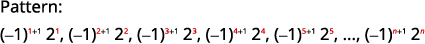
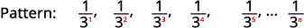
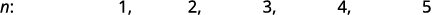

By the end of this section, you will be able to:
* Write the first few terms of a sequence
* Find a formula for the general term (nth term) of a sequence
* Use factorial notation
* Find the partial sum
* Use summation notation to write a sum

Before you get started, take this readiness quiz.

1.  Evaluate
    <math xmlns="http://www.w3.org/1998/Math/MathML"><mrow><mn>2</mn><mi>n</mi><mo>+</mo><mn>3</mn></mrow></math>
    
    for the integers 1, 2, 3, and 4.
    * * *
    {: data-type="newline"}
    
    If you missed this problem, review [\[link\]](/m63302#fs-id1167836530265).
2.  Evaluate
    <math xmlns="http://www.w3.org/1998/Math/MathML"><mrow><msup><mrow><mrow><mo>(</mo><mrow><mn>−1</mn></mrow><mo>)</mo></mrow></mrow><mi>n</mi></msup></mrow></math>
    
    for the integers 1, 2, 3, and 4.
    * * *
    {: data-type="newline"}
    
    If you missed this problem, review [\[link\]](/m63303#fs-id1167834536158).
3.  If
    <math xmlns="http://www.w3.org/1998/Math/MathML"><mrow><mi>f</mi><mrow><mo>(</mo><mi>n</mi><mo>)</mo></mrow><mo>=</mo><msup><mi>n</mi><mn>2</mn></msup><mo>+</mo><mn>2</mn><mo>,</mo></mrow></math>
    
    find
    <math xmlns="http://www.w3.org/1998/Math/MathML"><mrow><mi>f</mi><mrow><mo>(</mo><mn>1</mn><mo>)</mo></mrow><mo>+</mo><mi>f</mi><mrow><mo>(</mo><mn>2</mn><mo>)</mo></mrow><mo>+</mo><mi>f</mi><mrow><mo>(</mo><mn>3</mn><mo>)</mo></mrow><mo>.</mo></mrow></math>
    
    * * *
    {: data-type="newline"}
    
    If you missed this problem, review [\[link\]](/m63324#fs-id1167829859398).
{: type="1"}

### Write the First Few Terms of a Sequence

Let’s look at the function <math xmlns="http://www.w3.org/1998/Math/MathML"><mrow><mi>f</mi><mrow><mo>(</mo><mi>x</mi><mo>)</mo></mrow><mo>=</mo><mn>2</mn><mi>x</mi></mrow></math>

 and evaluate it for just the counting numbers.

<table summary="Table has 2 columns and 8 rows. The first row lists the function f of x equals 2 x. The first column lists values of x 1 through 5 with an ellipsis in the last row. The second column lists values of 2 x with values 2, 4, 6, 8, and 10 with an ellipsis in the last row." class="unnumbered"><tbody>
<tr valign="top">
<td colspan="2" data-valign="middle" data-align="center"><strong><math xmlns="http://www.w3.org/1998/Math/MathML"><mrow><mi>f</mi><mrow><mo>(</mo><mi>x</mi><mo>)</mo></mrow><mo>=</mo><mn>2</mn><mi>x</mi></mrow></math></strong></td>
</tr>
<tr valign="top">
<td data-valign="middle" data-align="center"><strong><math xmlns="http://www.w3.org/1998/Math/MathML"><mi>x</mi></math></strong></td>
<td data-valign="bottom" data-align="center"><strong><math xmlns="http://www.w3.org/1998/Math/MathML"><mrow><mn>2</mn><mi>x</mi></mrow></math></strong></td>
</tr>
<tr valign="top">
<td data-valign="middle" data-align="center">1</td>
<td data-valign="middle" data-align="center">2</td>
</tr>
<tr valign="top">
<td data-valign="middle" data-align="center">2</td>
<td data-valign="middle" data-align="center">4</td>
</tr>
<tr valign="top">
<td data-valign="middle" data-align="center">3</td>
<td data-valign="middle" data-align="center">6</td>
</tr>
<tr valign="top">
<td data-valign="middle" data-align="center">4</td>
<td data-valign="middle" data-align="center">8</td>
</tr>
<tr valign="top">
<td data-valign="middle" data-align="center">5</td>
<td data-valign="middle" data-align="center">10</td>
</tr>
<tr valign="top">
<td data-valign="middle" data-align="center">…</td>
<td data-valign="middle" data-align="center">…</td>
</tr>
</tbody></table>

If we list the function values in order as 2, 4, 6, 8, and 10, … we have a sequence. A **sequence**{: data-type="term"} is a function whose domain is the counting numbers.

Sequences

A **sequence** is a function whose domain is the counting numbers.

A sequence can also be seen as an ordered list of numbers and each number in the list is a *term*. A sequence may have an infinite number of terms or a finite number of terms. Our sequence has three dots (ellipsis) at the end which indicates the list never ends. If the domain is the set of all counting numbers, then the sequence is an **infinite sequence**{: data-type="term"}. Its domain is all counting numbers and there is an infinite number of counting numbers.

<math xmlns="http://www.w3.org/1998/Math/MathML"><mrow><mn>2</mn><mo>,</mo><mn>4</mn><mo>,</mo><mn>6</mn><mo>,</mo><mn>8</mn><mo>,</mo><mn>10</mn><mo>,</mo><mtext>…</mtext><mo>,</mo></mrow></math>

If we limit the domain to a finite number of counting numbers, then the sequence is a **finite sequence**{: data-type="term"}. If we use only the first four counting numbers, 1, 2, 3, 4 our sequence would be the finite sequence,

<math xmlns="http://www.w3.org/1998/Math/MathML"><mrow><mn>2</mn><mo>,</mo><mn>4</mn><mo>,</mo><mn>6</mn><mo>,</mo><mn>8</mn></mrow></math>

Often when working with sequences we do not want to write out all the terms. We want more compact way to show how each term is defined. When we worked with functions, we wrote <math xmlns="http://www.w3.org/1998/Math/MathML"><mrow><mi>f</mi><mrow><mo>(</mo><mi>x</mi><mo>)</mo></mrow><mo>=</mo><mn>2</mn><mi>x</mi></mrow></math>

 and we said the expression <math xmlns="http://www.w3.org/1998/Math/MathML"><mrow><mn>2</mn><mi>x</mi></mrow></math>

 was the rule that defined values in the range. While a sequence is a function, we do not use the usual function notation. Instead of writing the function as <math xmlns="http://www.w3.org/1998/Math/MathML"><mrow><mi>f</mi><mrow><mo>(</mo><mi>x</mi><mo>)</mo></mrow><mo>=</mo><mn>2</mn><mi>x</mi><mo>,</mo></mrow></math>

 we would write it as <math xmlns="http://www.w3.org/1998/Math/MathML"><mrow><msub><mi>a</mi><mi>n</mi></msub><mo>=</mo><mn>2</mn><mi>n</mi><mo>.</mo></mrow></math>

 The <math xmlns="http://www.w3.org/1998/Math/MathML"><mrow><msub><mi>a</mi><mi>n</mi></msub></mrow></math>

 is the *n*th term of the sequence, the term in the *n*th position where *n* is a value in the domain. The formula for writing the *n*th term of the sequence is called the **general term**{: data-type="term"} or formula of the sequence.

General Term of a Sequence

The **general term** of the sequence is found from the formula for writing the *n*th term of the sequence. The *n*th term of the sequence, *an*, is the term in the *n*th position where *n* is a value in the domain.

When we are given the general term of the sequence, we can find the terms by replacing *n* with the counting numbers in order. For <math xmlns="http://www.w3.org/1998/Math/MathML"><mrow><msub><mi>a</mi><mi>n</mi></msub><mo>=</mo><mn>2</mn><mi>n</mi><mo>,</mo></mrow></math>

| **<math xmlns="http://www.w3.org/1998/Math/MathML"><mi>n</mi></math>

** | 1 | 2 | 3 | 4 | 5 | <math xmlns="http://www.w3.org/1998/Math/MathML"><mrow><msub><mi>a</mi><mi>n</mi></msub></mrow></math>

 |
{: valign="top"}| **<math xmlns="http://www.w3.org/1998/Math/MathML"><mrow><msub><mi>a</mi><mi>n</mi></msub></mrow></math>

** | <math xmlns="http://www.w3.org/1998/Math/MathML"><mtable><mtr><mtd columnalign="left"><mn>2</mn><mo>·</mo><mn>1</mn></mtd></mtr><mtr><mtd columnalign="center"><mn>2</mn></mtd></mtr></mtable></math>

 | <math xmlns="http://www.w3.org/1998/Math/MathML"><mtable><mtr><mtd columnalign="left"><mn>2</mn><mo>·</mo><mn>2</mn></mtd></mtr><mtr><mtd columnalign="center"><mn>4</mn></mtd></mtr></mtable></math>

 | <math xmlns="http://www.w3.org/1998/Math/MathML"><mtable><mtr><mtd columnalign="left"><mn>2</mn><mo>·</mo><mn>3</mn></mtd></mtr><mtr><mtd columnalign="center"><mn>6</mn></mtd></mtr></mtable></math>

 | <math xmlns="http://www.w3.org/1998/Math/MathML"><mtable><mtr><mtd columnalign="left"><mn>2</mn><mo>·</mo><mn>4</mn></mtd></mtr><mtr><mtd columnalign="center"><mn>8</mn></mtd></mtr></mtable></math>

 | <math xmlns="http://www.w3.org/1998/Math/MathML"><mtable><mtr><mtd columnalign="left"><mn>2</mn><mo>·</mo><mn>5</mn></mtd></mtr><mtr><mtd columnalign="center"><mn>10</mn></mtd></mtr></mtable></math>

 | 2*n* |
{: valign="top"}{: summary="Table has 2 rows and 7 columns. The first row lists values of n from 1 through 5 with the last value as a sub n. The second row lists values of a sub n with mutiples of 2, from 2 through 10 with the last value as 2n. Below the table are values a sub 1, a sub 2, a sub 3, a sub 4, a sub 5, and a sub n followed by the values 2, 4, 6, 8, and 10." .unnumbered}

<math xmlns="http://www.w3.org/1998/Math/MathML"><mtable><mtr><mtd columnalign="right"><msub><mi>a</mi><mn>1</mn></msub><mo>,</mo></mtd><mtd columnalign="right"><msub><mi>a</mi><mn>2</mn></msub><mo>,</mo></mtd><mtd columnalign="right"><msub><mi>a</mi><mn>3</mn></msub><mo>,</mo></mtd><mtd columnalign="right"><msub><mi>a</mi><mn>4</mn></msub><mo>,</mo></mtd><mtd columnalign="left"><msub><mi>a</mi><mn>5</mn></msub><mtext>,</mtext><mspace width="0.2em" /><mtext>…</mtext><mtext>,</mtext></mtd><mtd columnalign="left"><msub><mi>a</mi><mi>n</mi></msub><mtext>,</mtext><mspace width="0.2em" /><mtext>…</mtext></mtd></mtr><mtr><mtd columnalign="right"><mn>2</mn><mo>,</mo></mtd><mtd columnalign="right"><mn>4</mn><mo>,</mo></mtd><mtd columnalign="right"><mn>6</mn><mo>,</mo></mtd><mtd columnalign="right"><mn>8</mn><mo>,</mo></mtd><mtd columnalign="left"><mn>10</mn><mtext>,</mtext><mspace width="0.2em" /><mtext>…</mtext></mtd><mtd /></mtr></mtable></math>

To find the values of a sequence, we substitute in the counting numbers in order into the general term of the sequence.

Write the first five terms of the sequence whose general term is <math xmlns="http://www.w3.org/1998/Math/MathML"><mrow><msub><mi>a</mi><mi>n</mi></msub><mo>=</mo><mn>4</mn><mi>n</mi><mo>−</mo><mn>3</mn><mo>.</mo></mrow></math>

We substitute the values 1, 2, 3, 4, and 5 into the formula, <math xmlns="http://www.w3.org/1998/Math/MathML"><mrow><msub><mi>a</mi><mi>n</mi></msub><mo>=</mo><mn>4</mn><mi>n</mi><mo>−</mo><mn>3</mn><mo>,</mo></mrow></math>

 in order.

  
The first five terms of the sequence are 1, 5, 9, 13, and 17.

Write the first five terms of the sequence whose general term is <math xmlns="http://www.w3.org/1998/Math/MathML"><mrow><msub><mi>a</mi><mi>n</mi></msub><mo>=</mo><mn>3</mn><mi>n</mi><mo>−</mo><mn>4</mn><mo>.</mo></mrow></math>

<math xmlns="http://www.w3.org/1998/Math/MathML"><mrow><mn>−1</mn><mo>,</mo><mn>2</mn><mo>,</mo><mn>5</mn><mo>,</mo><mn>8</mn><mo>,</mo><mn>11</mn></mrow></math>

Write the first five terms of the sequence whose general term is <math xmlns="http://www.w3.org/1998/Math/MathML"><mrow><msub><mi>a</mi><mi>n</mi></msub><mo>=</mo><mn>2</mn><mi>n</mi><mo>−</mo><mn>5</mn><mo>.</mo></mrow></math>

<math xmlns="http://www.w3.org/1998/Math/MathML"><mrow><mn>−3</mn><mo>,</mo><mn>−1</mn><mo>,</mo><mn>1</mn><mo>,</mo><mn>3</mn><mo>,</mo><mn>5</mn></mrow></math>

For some sequences, the variable is an exponent.

Write the first five terms of the sequence whose general term is <math xmlns="http://www.w3.org/1998/Math/MathML"><mrow><msub><mi>a</mi><mi>n</mi></msub><mo>=</mo><msup><mn>2</mn><mi>n</mi></msup><mo>+</mo><mn>1</mn><mo>.</mo></mrow></math>

We substitute the values 1, 2, 3, 4, and 5 into the formula, <math xmlns="http://www.w3.org/1998/Math/MathML"><mrow><msub><mi>a</mi><mi>n</mi></msub><mo>=</mo><msup><mn>2</mn><mi>n</mi></msup><mo>+</mo><mn>1</mn><mo>,</mo></mrow></math>

 in order.

 ![This figure shows three rows and five columns. The first row reads &#x201C;nth term equals 2 to the nth power plus 1&#x201D; written five times. The second row reads, &#x201C;a sub 1 equals 2 times 1 plus 1, a sub 2 equals 2 to the power of 2 plus 1, a sub 3 equals 2 to the power 3 plus 1, a sub 4 equals 2 to the power of 4 plus 1, a sub 5 equals 2 to the power 5 plus 1&#x201D;. The last row reads &#x201C;a sub 1 equals 3, a sub 2 equals 5, a sub 3 equals 9, a sub 4 equals 17, a sub 5 equals 33&#x201D;.](../resources/CNX_IntAlg_Figure_12_01_002_img.jpg) 
The first five terms of the sequence are 3, 5, 9, 17, and 33.

Write the first five terms of the sequence whose general term is <math xmlns="http://www.w3.org/1998/Math/MathML"><mrow><msub><mi>a</mi><mi>n</mi></msub><mo>=</mo><msup><mn>3</mn><mi>n</mi></msup><mo>+</mo><mn>4</mn><mo>.</mo></mrow></math>

<math xmlns="http://www.w3.org/1998/Math/MathML"><mrow><mn>7</mn><mo>,</mo><mn>13</mn><mo>,</mo><mn>31</mn><mo>,</mo><mn>85</mn><mo>,</mo><mn>247</mn></mrow></math>

Write the first five terms of the sequence whose general term is <math xmlns="http://www.w3.org/1998/Math/MathML"><mrow><msub><mi>a</mi><mi>n</mi></msub><mo>=</mo><msup><mn>2</mn><mi>n</mi></msup><mo>−</mo><mn>5</mn><mo>.</mo></mrow></math>

<math xmlns="http://www.w3.org/1998/Math/MathML"><mrow><mn>−3</mn><mo>,</mo><mn>−1</mn><mo>,</mo><mn>3</mn><mo>,</mo><mn>11</mn><mo>,</mo><mn>27</mn></mrow></math>

It is not uncommon to see the expressions <math xmlns="http://www.w3.org/1998/Math/MathML"><mrow><msup><mrow><mrow><mo>(</mo><mrow><mn>−1</mn></mrow><mo>)</mo></mrow></mrow><mi>n</mi></msup></mrow></math>

 or <math xmlns="http://www.w3.org/1998/Math/MathML"><mrow><msup><mrow><mrow><mo>(</mo><mrow><mn>−1</mn></mrow><mo>)</mo></mrow></mrow><mrow><mi>n</mi><mo>+</mo><mn>1</mn></mrow></msup></mrow></math>

 in the general term for a sequence. If we evaluate each of these expressions for a few values, we see that this expression alternates the sign for the terms.

| **<math xmlns="http://www.w3.org/1998/Math/MathML"><mi>n</mi></math>

** | **1** | **2** | **3** | **4** | **5** |
{: valign="top"}| **<math xmlns="http://www.w3.org/1998/Math/MathML"><mrow><msup><mrow><mrow><mo>(</mo><mrow><mo>−</mo><mn>1</mn></mrow><mo>)</mo></mrow></mrow><mi>n</mi></msup></mrow></math>

** | <math xmlns="http://www.w3.org/1998/Math/MathML"><mtable><mtr><mtd columnalign="center"><msup><mrow><mo>(</mo><mrow><mn>−1</mn></mrow><mo>)</mo></mrow><mn>1</mn></msup></mtd></mtr><mtr /><mtr><mtd columnalign="center"><mn>−1</mn></mtd></mtr></mtable></math>

 | <math xmlns="http://www.w3.org/1998/Math/MathML"><mtable><mtr><mtd columnalign="center"><msup><mrow><mo>(</mo><mrow><mn>−1</mn></mrow><mo>)</mo></mrow><mn>2</mn></msup></mtd></mtr><mtr /><mtr><mtd columnalign="center"><mn>1</mn></mtd></mtr></mtable></math>

 | <math xmlns="http://www.w3.org/1998/Math/MathML"><mtable><mtr><mtd columnalign="center"><msup><mrow><mo>(</mo><mrow><mn>−1</mn></mrow><mo>)</mo></mrow><mn>3</mn></msup></mtd></mtr><mtr /><mtr><mtd columnalign="center"><mn>−1</mn></mtd></mtr></mtable></math>

 | <math xmlns="http://www.w3.org/1998/Math/MathML"><mtable><mtr><mtd columnalign="center"><msup><mrow><mo>(</mo><mrow><mn>−1</mn></mrow><mo>)</mo></mrow><mn>4</mn></msup></mtd></mtr><mtr /><mtr><mtd columnalign="center"><mn>1</mn></mtd></mtr></mtable></math>

 | <math xmlns="http://www.w3.org/1998/Math/MathML"><mtable><mtr><mtd columnalign="center"><msup><mrow><mo>(</mo><mrow><mn>−1</mn></mrow><mo>)</mo></mrow><mn>5</mn></msup></mtd></mtr><mtr /><mtr><mtd columnalign="center"><mn>−1</mn></mtd></mtr></mtable></math>

 |
{: valign="top"}| <strong><math xmlns="http://www.w3.org/1998/Math/MathML"><mrow><msup><mrow><mrow><mo>(</mo><mrow><mn>−1</mn></mrow><mo>)</mo></mrow></mrow><mrow><mi>n</mi><mo>+</mo><mn>1</mn></mrow></msup></mrow></math> </strong> | <math xmlns="http://www.w3.org/1998/Math/MathML"><mtable><mtr><mtd columnalign="center"><msup><mrow><mo>(</mo><mrow><mn>−1</mn></mrow><mo>)</mo></mrow><mrow><mn>1</mn><mo>+</mo><mn>1</mn></mrow></msup></mtd></mtr><mtr /><mtr><mtd columnalign="center"><mn>1</mn></mtd></mtr></mtable></math>

 | <math xmlns="http://www.w3.org/1998/Math/MathML"><mtable><mtr><mtd columnalign="center"><msup><mrow><mo>(</mo><mrow><mn>−1</mn></mrow><mo>)</mo></mrow><mrow><mn>2</mn><mo>+</mo><mn>1</mn></mrow></msup></mtd></mtr><mtr /><mtr><mtd columnalign="center"><mn>−1</mn></mtd></mtr></mtable></math>

 | <math xmlns="http://www.w3.org/1998/Math/MathML"><mtable><mtr><mtd columnalign="center"><msup><mrow><mo>(</mo><mrow><mn>−1</mn></mrow><mo>)</mo></mrow><mrow><mn>3</mn><mo>+</mo><mn>1</mn></mrow></msup></mtd></mtr><mtr /><mtr><mtd columnalign="center"><mn>1</mn></mtd></mtr></mtable></math>

 | <math xmlns="http://www.w3.org/1998/Math/MathML"><mtable><mtr><mtd columnalign="center"><msup><mrow><mo>(</mo><mrow><mn>−1</mn></mrow><mo>)</mo></mrow><mrow><mn>4</mn><mo>+</mo><mn>1</mn></mrow></msup></mtd></mtr><mtr /><mtr><mtd columnalign="center"><mn>−1</mn></mtd></mtr></mtable></math>

 | <math xmlns="http://www.w3.org/1998/Math/MathML"><mtable><mtr><mtd columnalign="center"><msup><mrow><mo>(</mo><mrow><mn>−1</mn></mrow><mo>)</mo></mrow><mrow><mn>5</mn><mo>+</mo><mn>1</mn></mrow></msup></mtd></mtr><mtr /><mtr><mtd columnalign="center"><mn>1</mn></mtd></mtr></mtable></math>

 |
{: valign="top"}{: summary="Table shows 6 columns and 3 rows. The first row lists values of n from 1 to 5. The second row lists values of negative 1 to the power of n as negative 1, 1, negative 1, 1, and negative 1. The third row lists values of negative 1 to the power of n plus 1 as 1 negative 1, 1, negative 1, and 1. Below the table are values a sub 1, a sub 2, a sub 3, a sub 4, a sub 5, and a sub n followed by ellipsis. Below are the values negative 1, 1, negative 1, 1, and negative 1. Below that are the numbers 1 negative 1, 1, negative 1, and 1." .unnumbered}

<math xmlns="http://www.w3.org/1998/Math/MathML"><mrow><mtable><mtr><mtd columnalign="right"><msub><mi>a</mi><mn>1</mn></msub><mo>,</mo></mtd><mtd columnalign="right"><msub><mi>a</mi><mn>2</mn></msub><mo>,</mo></mtd><mtd columnalign="right"><msub><mi>a</mi><mn>3</mn></msub><mo>,</mo></mtd><mtd columnalign="right"><msub><mi>a</mi><mn>4</mn></msub><mo>,</mo></mtd><mtd columnalign="right"><msub><mi>a</mi><mn>5</mn></msub><mtext>,</mtext><mspace width="0.2em" /><mtext>…</mtext><mtext>,</mtext></mtd><mtd columnalign="right"><msub><mi>a</mi><mi>n</mi></msub><mtext>,</mtext><mspace width="0.2em" /><mtext>…</mtext></mtd></mtr><mtr><mtd columnalign="right"><mn>−1</mn><mo>,</mo></mtd><mtd columnalign="right"><mn>1</mn><mo>,</mo></mtd><mtd columnalign="right"><mn>−1</mn><mo>,</mo></mtd><mtd columnalign="right"><mn>1</mn><mo>,</mo></mtd><mtd columnalign="left"><mn>−1</mn><mtext>…</mtext></mtd><mtd /></mtr><mtr><mtd columnalign="right"><mn>1</mn><mo>,</mo></mtd><mtd columnalign="right"><mn>−1</mn><mo>,</mo></mtd><mtd columnalign="right"><mn>1</mn><mo>,</mo></mtd><mtd columnalign="right"><mn>−1</mn><mo>,</mo></mtd><mtd columnalign="left"><mspace width="0.6em" /><mn>1</mn><mtext>…</mtext></mtd><mtd /></mtr></mtable></mrow></math>

The terms in the next example will alternate signs as a result of the powers of <math xmlns="http://www.w3.org/1998/Math/MathML"><mrow><mn>−1</mn><mo>.</mo></mrow></math>

Write the first five terms of the sequence whose general term is <math xmlns="http://www.w3.org/1998/Math/MathML"><mrow><msub><mi>a</mi><mi>n</mi></msub><mo>=</mo><msup><mrow><mrow><mo>(</mo><mrow><mn>−1</mn></mrow><mo>)</mo></mrow></mrow><mi>n</mi></msup><msup><mi>n</mi><mn>3</mn></msup><mo>.</mo></mrow></math>

We substitute the values 1, 2, 3, 4, and 5 into the formula, <math xmlns="http://www.w3.org/1998/Math/MathML"><mrow><msub><mi>a</mi><mi>n</mi></msub><mo>=</mo><msup><mrow><mrow><mo>(</mo><mrow><mn>−1</mn></mrow><mo>)</mo></mrow></mrow><mi>n</mi></msup><msup><mi>n</mi><mn>3</mn></msup><mo>,</mo></mrow></math>

 in order.

 ![This figure shows three rows and five columns. The first row reads &#x201C;nth term equals negative 1 to the nth power times n cubed&#x201D; written five times. The second row reads a sub 1 equals negative 1 to the power of 1 times g times 1 cubed, a sub 2 equals negative 1 squared time g times 2 cubed, a sub 3 equals negative 1 cubed times g times 23 cubed, a sub 4 equals negative 1 to the power of 4 times g times 4 cubed, a sub 5 equals negative 1 to the power of 5 times g times 5 cubed. The last row reads, &#x201C;a sub 1 equals negative 1, a sub 2 equals 8, a sub 3 equals negative 27, a sub 4 equals 64, and a sub 5 equals negative 125.](../resources/CNX_IntAlg_Figure_12_01_003_img.jpg)
The first five terms of the sequence are <math xmlns="http://www.w3.org/1998/Math/MathML"><mrow><mn>−1</mn><mo>,</mo><mn>8</mn><mo>,</mo><mn>−27</mn><mo>,</mo><mn>64</mn><mo>,</mo></mrow></math>

 and <math xmlns="http://www.w3.org/1998/Math/MathML"><mrow><mn>−125</mn><mo>.</mo></mrow></math>

Write the first five terms of the sequence whose general term is <math xmlns="http://www.w3.org/1998/Math/MathML"><mrow><msub><mi>a</mi><mi>n</mi></msub><mo>=</mo><msup><mrow><mrow><mo>(</mo><mrow><mn>−1</mn></mrow><mo>)</mo></mrow></mrow><mi>n</mi></msup><msup><mi>n</mi><mn>2</mn></msup><mo>.</mo></mrow></math>

<math xmlns="http://www.w3.org/1998/Math/MathML"><mrow><mn>−1</mn><mo>,</mo><mn>4</mn><mo>,</mo><mn>−9</mn><mo>,</mo><mn>16</mn><mo>,</mo><mn>−25</mn></mrow></math>

Write the first five terms of the sequence whose general term is <math xmlns="http://www.w3.org/1998/Math/MathML"><mrow><msub><mi>a</mi><mi>n</mi></msub><mo>=</mo><msup><mrow><mrow><mo>(</mo><mrow><mn>−1</mn></mrow><mo>)</mo></mrow></mrow><mrow><mi>n</mi><mo>+</mo><mn>1</mn></mrow></msup><msup><mi>n</mi><mn>3</mn></msup><mo>.</mo></mrow></math>

<math xmlns="http://www.w3.org/1998/Math/MathML"><mrow><mn>1</mn><mo>,</mo><mn>−8</mn><mo>,</mo><mn>27</mn><mo>,</mo><mn>−64</mn><mo>,</mo><mn>125</mn></mrow></math>

### Find a Formula for the General Term (*n*th Term) of a Sequence

Sometimes we have a few terms of a sequence and it would be helpful to know the general term or *n*th term. To find the general term, we look for patterns in the terms. Often the patterns involve multiples or powers. We also look for a pattern in the signs of the terms.

Find a general term for the sequence whose first five terms are shown.

<math xmlns="http://www.w3.org/1998/Math/MathML"><mrow><mn>4</mn><mo>,</mo><mn>8</mn><mo>,</mo><mn>12</mn><mo>,</mo><mn>16</mn><mo>,</mo><mn>20</mn><mtext>,</mtext><mspace width="0.2em" /><mo>…</mo></mrow></math>

|  |   |
|  |   |
| We look for a pattern in the terms. |   |
| The numbers are all multiples of 4. |   |
|  | The general term of the sequence is <math xmlns="http://www.w3.org/1998/Math/MathML"><mrow><msub><mi>a</mi><mi>n</mi></msub><mo>=</mo><mn>4</mn><mi>n</mi><mo>.</mo></mrow></math>

 |
{: summary="This figure shows five rows. The first row reads, &#x201C;4&#x201D;, &#x201C;8&#x201D;, &#x201C;12&#x201D;, &#x201C;16&#x201D;, &#x201C;20&#x201D;, and an &#x201C;ellipsis&#x201D;. The second row reads &#x201C;n&#x201D;, &#x201C;1&#x201D;, &#x201C;2&#x201D;, &#x201C;3&#x201D;, &#x201C;4&#x201D;, &#x201C;5&#x201D;, and an &#x201C;ellipsis&#x201D;. The third row reads &#x201C;We look for a pattern in terms&#x201D;, &#x201C;Terms&#x201D;, &#x201C;4&#x201D;, &#x201C;8&#x201D;, &#x201C;12&#x201D;, &#x201C;16&#x201D;, &#x201C;20&#x201D;, and an &#x201C;ellipsis&#x201D;. The four row reads, &#x201C;The numbers are all multiples of 4&#x201D;, &#x201C;Pattern&#x201D;, &#x201C;4 times g times 1&#x201D;, &#x201C;4 times g times 3&#x201D;, 4 times g times 4&#x201D;, &#x201C;4 times g times 5&#x201D;, and an &#x201C;ellipsis&#x201D;, &#x201C;4 times g times n&#x201D;. The last row reads &#x201C;The general term of the sequence is a nth term equals 4 times n&#x201D;." .unnumbered .unstyled data-label=""}

Find a general term for the sequence whose first five terms are shown.

<math xmlns="http://www.w3.org/1998/Math/MathML"><mrow><mn>3</mn><mo>,</mo><mn>6</mn><mo>,</mo><mn>9</mn><mo>,</mo><mn>12</mn><mo>,</mo><mn>15</mn><mo>,</mo><mtext>…</mtext></mrow></math>

<math xmlns="http://www.w3.org/1998/Math/MathML"><mrow><msub><mi>a</mi><mi>n</mi></msub><mo>=</mo><mn>3</mn><mi>n</mi></mrow></math>

Find a general term for the sequence whose first five terms are shown.

<math xmlns="http://www.w3.org/1998/Math/MathML"><mrow><mn>5</mn><mo>,</mo><mn>10</mn><mo>,</mo><mn>15</mn><mo>,</mo><mn>20</mn><mo>,</mo><mn>25</mn><mo>,</mo><mtext>…</mtext></mrow></math>

<math xmlns="http://www.w3.org/1998/Math/MathML"><mrow><msub><mi>a</mi><mi>n</mi></msub><mo>=</mo><mn>5</mn><mi>n</mi></mrow></math>

Find a general term for the sequence whose first five terms are shown.

<math xmlns="http://www.w3.org/1998/Math/MathML"><mrow><mn>2</mn><mo>,</mo><mn>−4</mn><mo>,</mo><mn>8</mn><mo>,</mo><mn>−16</mn><mo>,</mo><mn>32</mn><mo>,</mo><mtext>…</mtext></mrow></math>

<table summary="This figure shows six rows. The first row reads, &#x201C;2&#x201D;, &#x201C;negative 4&#x201D;, &#x201C;8&#x201D;, &#x201C;negative 16&#x201D;, &#x201C;32&#x201D;, and an &#x201C;ellipsis&#x201D;. The second row reads &#x201C;n&#x201D;, &#x201C;1&#x201D;, &#x201C;2&#x201D;, &#x201C;3&#x201D;, &#x201C;4&#x201D;, &#x201C;5&#x201D;, &#x201C;ellipsis&#x201D;, &#x201C;n&#x201D;. The third row reads &#x201C;We look for a pattern in the terms&#x201D;, &#x201C;Terms 2,&#x201D; &#x201C;negative 4&#x201D;, &#x201C;8&#x201D;, &#x201C;negative 16&#x201D;, &#x201C;32&#x201D;, and an &#x201C;ellipsis&#x201D;. The fourth row reads &#x201C;The numbers are powers of 2&#x201D;, and &#x201C;Pattern&#x201D;. The fifth row reads &#x201C;the signs are alternating with even n negative&#x201D;, &#x201C;negative 1 to the power of 1 plus 1 times 2 to the power of 1, negative 1 to the power of 2 plus 1 times 2 to the power of 2, negative 1 to the power of 3 plus 1 times 2 to the power of 3, negative 1 to the power of 4 plus 1 times 2 to the power of 1, negative 1 to the power of 5 plus 1 times 2 to the power of 5, ellipsis, negative 1 to the power of n plus 1 times 2 to then power of n. The last row reads, &#x201C;The general term of the sequence is a sub n equals negative 1 to the power of n plus 1 times 2 to the power of n." class="unnumbered unstyled" data-label=""><tbody>
<tr>
<td />
<td data-align="left">

</td>
</tr>
<tr>
<td />
<td data-align="left">

</td>
</tr>
<tr>
<td data-align="left">We look for a pattern in the terms.</td>
<td data-align="left">

</td>
</tr>
<tr>
<td data-align="left">The numbers are powers of 2. The signs are
alternating, with even <math xmlns="http://www.w3.org/1998/Math/MathML"><mi>n</mi></math> negative.</td>
<td data-align="left">

</td>
</tr>
<tr>
<td />
<td data-align="left">The general term of the sequence is <math xmlns="http://www.w3.org/1998/Math/MathML"><mrow><msub><mi>a</mi><mi>n</mi></msub><mo>=</mo><msup><mrow><mrow><mo>(</mo><mrow><mn>−1</mn></mrow><mo>)</mo></mrow></mrow><mrow><mi>n</mi><mo>+</mo><mn>1</mn></mrow></msup><msup><mn>2</mn><mi>n</mi></msup><mo>.</mo></mrow></math>
</td>
</tr>
</tbody></table>

Find a general term for the sequence whose first five terms are shown.

<math xmlns="http://www.w3.org/1998/Math/MathML"><mrow><mn>−3</mn><mo>,</mo><mn>9</mn><mo>,</mo><mn>−27</mn><mo>,</mo><mn>81</mn><mo>,</mo><mn>−243</mn><mtext>,</mtext><mspace width="0.2em" /><mtext>…</mtext></mrow></math>

<math xmlns="http://www.w3.org/1998/Math/MathML"><mrow><msub><mi>a</mi><mi>n</mi></msub><mo>=</mo><msup><mrow><mrow><mo>(</mo><mrow><mn>−1</mn></mrow><mo>)</mo></mrow></mrow><mi>n</mi></msup><msup><mn>3</mn><mi>n</mi></msup></mrow></math>

Find a general term for the sequence whose first five terms are shown

<math xmlns="http://www.w3.org/1998/Math/MathML"><mrow><mn>1</mn><mo>,</mo><mn>−4</mn><mo>,</mo><mn>9</mn><mo>,</mo><mn>−16</mn><mo>,</mo><mn>25</mn><mtext>,</mtext><mspace width="0.2em" /><mtext>…</mtext></mrow></math>

<math xmlns="http://www.w3.org/1998/Math/MathML"><mrow><msub><mi>a</mi><mi>n</mi></msub><mo>=</mo><msup><mrow><mrow><mo>(</mo><mrow><mn>−1</mn></mrow><mo>)</mo></mrow></mrow><mrow><mi>n</mi><mo>+</mo><mn>1</mn></mrow></msup><msup><mi>n</mi><mn>2</mn></msup></mrow></math>

Find a general term for the sequence whose first five terms are shown.

<math xmlns="http://www.w3.org/1998/Math/MathML"><mrow><mfrac><mn>1</mn><mn>3</mn></mfrac><mo>,</mo><mfrac><mn>1</mn><mn>9</mn></mfrac><mo>,</mo><mfrac><mn>1</mn><mrow><mn>27</mn></mrow></mfrac><mo>,</mo><mfrac><mn>1</mn><mrow><mn>81</mn></mrow></mfrac><mo>,</mo><mfrac><mn>1</mn><mrow><mn>243</mn></mrow></mfrac><mo>,</mo><mtext>…</mtext></mrow></math>

|  |   |
|  |   |
| We look for a pattern in the terms. |   |
| The numerators are all 1. |   |
| The denominators are powers of 3. | The general term of the sequence is <math xmlns="http://www.w3.org/1998/Math/MathML"><mrow><msub><mi>a</mi><mi>n</mi></msub><mo>=</mo><mfrac><mn>1</mn><mrow><msup><mn>3</mn><mi>n</mi></msup></mrow></mfrac><mo>.</mo></mrow></math>

 |
{: summary="This figure shows five rows. The first row reads, &#x201C;one-third&#x201D;, &#x201C;one-ninth&#x201D;, &#x201C;one-twenty-seventh&#x201D;, &#x201C;1 divided by 81&#x201D;, &#x201C;1 divided by 243&#x201D;, and an ellipsis. The second row reads, &#x201C;n&#x201D;, &#x201C;1&#x201D;, &#x201C;2&#x201D;, &#x201C;3&#x201D;, &#x201C;4&#x201D;, &#x201C;5&#x201D; and an ellipsis, &#x201C;n&#x201D;. The third row reads &#x201C;We look for a pattern in the terms&#x201D;, &#x201C;Terms&#x201D;, &#x201C;one-third&#x201D;, &#x201C;one-ninth&#x201D;, &#x201C;one-twenty-seventh&#x201D;, &#x201C;1 divided by 81&#x201D;, &#x201C;1 divided by 243&#x201D;, and an ellipsis. The fourth row reads, &#x201C;The numerators are all at 1&#x201D;, &#x201C;Pattern&#x201D;, &#x201C;one-third to the power of 1 times 9, one-third to the power of 2 times 9, one-third to the power of 3 times 4 times 9, one-third to the power of 3 times 5 times 9, ellipsis, one-third to the power of n&#x201D;. The fifth row reads, &#x201C;The denominators are powers of 3. The general term of the sequence is a sub n equals one-third to the power of n&#x201D;." .unnumbered .unstyled data-label=""}

Find a general term for the sequence whose first five terms are shown.

<math xmlns="http://www.w3.org/1998/Math/MathML"><mrow><mfrac><mn>1</mn><mn>2</mn></mfrac><mo>,</mo><mfrac><mn>1</mn><mn>4</mn></mfrac><mo>,</mo><mfrac><mn>1</mn><mn>8</mn></mfrac><mo>,</mo><mfrac><mn>1</mn><mrow><mn>16</mn></mrow></mfrac><mo>,</mo><mfrac><mn>1</mn><mrow><mn>32</mn></mrow></mfrac><mo>,</mo><mtext>…</mtext></mrow></math>

<math xmlns="http://www.w3.org/1998/Math/MathML"><mrow><msub><mi>a</mi><mi>n</mi></msub><mo>=</mo><mfrac><mn>1</mn><mrow><msup><mn>2</mn><mi>n</mi></msup></mrow></mfrac></mrow></math>

Find a general term for the sequence whose first five terms are shown.

<math xmlns="http://www.w3.org/1998/Math/MathML"><mrow><mfrac><mn>1</mn><mn>1</mn></mfrac><mo>,</mo><mfrac><mn>1</mn><mn>4</mn></mfrac><mo>,</mo><mfrac><mn>1</mn><mn>9</mn></mfrac><mo>,</mo><mfrac><mn>1</mn><mrow><mn>16</mn></mrow></mfrac><mo>,</mo><mfrac><mn>1</mn><mrow><mn>25</mn></mrow></mfrac><mo>,</mo><mtext>…</mtext></mrow></math>

<math xmlns="http://www.w3.org/1998/Math/MathML"><mrow><msub><mi>a</mi><mi>n</mi></msub><mo>=</mo><mfrac><mn>1</mn><mrow><msup><mi>n</mi><mn>2</mn></msup></mrow></mfrac></mrow></math>

### Use Factorial Notation

Sequences often have terms that are products of consecutive integers. We indicate these products with a special notation called *factorial notation*. For example,<math xmlns="http://www.w3.org/1998/Math/MathML"><mrow><mn>5</mn><mo>!</mo></mrow></math>

, read 5 factorial, means <math xmlns="http://www.w3.org/1998/Math/MathML"><mrow><mn>5</mn><mo>·</mo><mn>4</mn><mo>·</mo><mn>3</mn><mo>·</mo><mn>2</mn><mo>·</mo><mn>1</mn><mo>.</mo></mrow></math>

 The exclamation point is not punctuation here; it indicates the **factorial notation**{: data-type="term"}.

Factorial Notation

If *n* is a positive integer, then <math xmlns="http://www.w3.org/1998/Math/MathML"><mrow><mi>n</mi><mo>!</mo></mrow></math>

 is

<math xmlns="http://www.w3.org/1998/Math/MathML"><mrow><mi>n</mi><mo>!</mo><mo>=</mo><mi>n</mi><mrow><mo>(</mo><mrow><mi>n</mi><mo>−</mo><mn>1</mn></mrow><mo>)</mo></mrow><mrow><mo>(</mo><mrow><mi>n</mi><mo>−</mo><mn>2</mn></mrow><mo>)</mo></mrow><mo>…</mo></mrow></math>

We define <math xmlns="http://www.w3.org/1998/Math/MathML"><mrow><mn>0</mn><mo>!</mo></mrow></math>

 as 1, so <math xmlns="http://www.w3.org/1998/Math/MathML"><mrow><mn>0</mn><mo>!</mo><mo>=</mo><mn>1</mn><mo>.</mo></mrow></math>

The values of <math xmlns="http://www.w3.org/1998/Math/MathML"><mrow><mi>n</mi><mo>!</mo></mrow></math>

 for the first 5 positive integers are shown.

<math xmlns="http://www.w3.org/1998/Math/MathML"><mrow><mtable><mtr><mtd columnalign="center"><mn>1</mn><mo>!</mo></mtd><mtd /><mtd /><mtd columnalign="center"><mspace width="2em" /><mn>2</mn><mo>!</mo></mtd><mtd /><mtd /><mtd columnalign="center"><mspace width="2em" /><mn>3</mn><mo>!</mo></mtd><mtd /><mtd /><mtd columnalign="center"><mspace width="2em" /><mn>4</mn><mo>!</mo></mtd><mtd /><mtd /><mtd columnalign="center"><mspace width="2em" /><mn>5</mn><mo>!</mo></mtd></mtr><mtr><mtd columnalign="center"><mn>1</mn></mtd><mtd /><mtd /><mtd columnalign="center"><mspace width="2em" /><mn>2</mn><mo>⋅</mo><mn>1</mn></mtd><mtd /><mtd /><mtd columnalign="center"><mspace width="2em" /><mn>3</mn><mo>⋅</mo><mn>2</mn><mo>⋅</mo><mn>1</mn></mtd><mtd /><mtd /><mtd columnalign="center"><mspace width="2em" /><mn>4</mn><mo>⋅</mo><mn>3</mn><mo>⋅</mo><mn>2</mn><mo>⋅</mo><mn>1</mn></mtd><mtd /><mtd /><mtd columnalign="center"><mspace width="2em" /><mn>5</mn><mo>⋅</mo><mn>4</mn><mo>⋅</mo><mn>3</mn><mo>⋅</mo><mn>2</mn><mo>⋅</mo><mn>1</mn></mtd></mtr><mtr><mtd columnalign="center"><mn>1</mn></mtd><mtd /><mtd /><mtd columnalign="center"><mspace width="2em" /><mn>2</mn></mtd><mtd /><mtd /><mtd columnalign="center"><mspace width="2em" /><mn>6</mn></mtd><mtd /><mtd /><mtd columnalign="center"><mspace width="2em" /><mn>24</mn></mtd><mtd /><mtd /><mtd columnalign="center"><mspace width="2em" /><mn>120</mn></mtd></mtr></mtable></mrow></math>

Write the first five terms of the sequence whose general term is <math xmlns="http://www.w3.org/1998/Math/MathML"><mrow><msub><mi>a</mi><mi>n</mi></msub><mo>=</mo><mfrac><mn>1</mn><mrow><mi>n</mi><mo>!</mo></mrow></mfrac></mrow></math>

.

We substitute the values 1, 2, 3, 4, 5 into the formula, <math xmlns="http://www.w3.org/1998/Math/MathML"><mrow><msub><mi>a</mi><mi>n</mi></msub><mo>=</mo><mfrac><mn>1</mn><mrow><mi>n</mi><mo>!</mo></mrow></mfrac><mo>,</mo></mrow></math>

 in order.

 ![This figure shows four rows and five columns. The first row reads, &#x201C;nth term equals one divided by n factorial&#x201D; written five times. The second row reads &#x201C;a sub 1 equals one divided by 1 factorial, a sub 2 equals 1 divided by 2 factorial, a sub 3 equals 1 divided by 3 factorial, a sub 4 equals 1 divided by 4 factorial, a sub 5 equals 1 divided by 5 factorial&#x201D;. The third row reads &#x201C;a sub 1 equals 1 divided 1&#x201D;, &#x201C;a sub 2 equals 1 divided by 2 times g times 1&#x201D;, &#x201C;a sub 3 equals 1 divided by 3 times g times 2 g times 1&#x201D;, &#x201C;a sub 4 equals 1 divided 4 times g times 3 times g times 2 times g times 1&#x201D;, &#x201C;a sub 5 equals 1 divided by 5 g times 4 times g times 3 times g times 2 times g times 1&#x201D;, &#x201C;a sub 1 equals 1, a sub 2 equals one-half&#x201D;, &#x201C;a sub 3 equals one-sixth&#x201D;, &#x201C;a sub 4 equals 1 divided by 24&#x201D;, &#x201C;a sub 5 equals 1 divided by 120&#x201D;.](../resources/CNX_IntAlg_Figure_12_01_004_img.jpg)
The first five terms of the sequence are <math xmlns="http://www.w3.org/1998/Math/MathML"><mrow><mn>1</mn><mo>,</mo><mfrac><mn>1</mn><mn>2</mn></mfrac><mo>,</mo><mfrac><mn>1</mn><mn>6</mn></mfrac><mo>,</mo><mfrac><mn>1</mn><mrow><mn>24</mn></mrow></mfrac><mo>,</mo><mfrac><mn>1</mn><mrow><mn>120</mn></mrow></mfrac><mo>.</mo></mrow></math>

Write the first five terms of the sequence whose general term is <math xmlns="http://www.w3.org/1998/Math/MathML"><mrow><msub><mi>a</mi><mi>n</mi></msub><mo>=</mo><mfrac><mn>2</mn><mrow><mi>n</mi><mo>!</mo></mrow></mfrac><mo>.</mo></mrow></math>

<math xmlns="http://www.w3.org/1998/Math/MathML"><mrow><mn>2</mn><mo>,</mo><mn>1</mn><mo>,</mo><mfrac><mn>1</mn><mn>3</mn></mfrac><mo>,</mo><mfrac><mn>1</mn><mrow><mn>12</mn></mrow></mfrac><mo>,</mo><mfrac><mn>1</mn><mrow><mn>60</mn></mrow></mfrac></mrow></math>

Write the first five terms of the sequence whose general term is <math xmlns="http://www.w3.org/1998/Math/MathML"><mrow><msub><mi>a</mi><mi>n</mi></msub><mo>=</mo><mfrac><mn>3</mn><mrow><mi>n</mi><mo>!</mo></mrow></mfrac><mo>.</mo></mrow></math>

<math xmlns="http://www.w3.org/1998/Math/MathML"><mrow><mn>3</mn><mo>,</mo><mfrac><mn>3</mn><mn>2</mn></mfrac><mo>,</mo><mfrac><mn>1</mn><mn>2</mn></mfrac><mo>,</mo><mfrac><mn>1</mn><mn>8</mn></mfrac><mo>,</mo><mfrac><mn>1</mn><mrow><mn>40</mn></mrow></mfrac></mrow></math>

When there is a fraction with factorials in the numerator and denominator, we line up the factors vertically to make our calculations easier.

Write the first five terms of the sequence whose general term is <math xmlns="http://www.w3.org/1998/Math/MathML"><mrow><msub><mi>a</mi><mi>n</mi></msub><mo>=</mo><mfrac><mrow><mrow><mo>(</mo><mrow><mi>n</mi><mo>+</mo><mn>1</mn></mrow><mo>)</mo></mrow><mo>!</mo></mrow><mrow><mrow><mo>(</mo><mrow><mi>n</mi><mo>−</mo><mn>1</mn></mrow><mo>)</mo></mrow><mo>!</mo></mrow></mfrac><mo>.</mo></mrow></math>

We substitute the values 1, 2, 3, 4, 5 into the formula, <math xmlns="http://www.w3.org/1998/Math/MathML"><mrow><msub><mi>a</mi><mi>n</mi></msub><mo>=</mo><mfrac><mrow><mrow><mo>(</mo><mrow><mi>n</mi><mo>+</mo><mn>1</mn></mrow><mo>)</mo></mrow><mo>!</mo></mrow><mrow><mrow><mo>(</mo><mrow><mi>n</mi><mo>−</mo><mn>1</mn></mrow><mo>)</mo></mrow><mo>!</mo></mrow></mfrac><mo>,</mo></mrow></math>

 in order.

 ![This figure shows five columns and five rows. The first row shows the sequence &#x201C;nth term equals n plus 1 times factorial divided by n minus 1 times factorial&#x201D; written five times. The second row is &#x201C;a sub 1 equals 1 plus 1 times factorial divided by 1 minus 1 times factorial&#x201D;, &#x201C;a sub 2 equals 2 plus 1 times factorial divided by 2 minus 1 times factorial&#x201D;, &#x201C;a sub 3 equals 3 plus 1 times factorial divided by 3 minus 1 times factorial&#x201D;, &#x201C;a sub 4 equals 4 plus 1 times factorial divided by 4 minus 1 times factorial&#x201D;, &#x201C;a sub 5 equals 5 plus 1 times factorial divided by 5 minus 1 times factorial&#x201D;. The third row reads &#x201C;a sub 1 equals 2 times factorial divided by 0 times factorial&#x201D;, &#x201C;a sub 2 equals 3 times factorial divided by 1 times factorial&#x201D;, &#x201C;a sub 3 equals 4 times factorial divided by 2 times factorial&#x201D;, &#x201C;a sub 3 equals 4 times factorial divided by 2 times factorial&#x201D;, &#x201C;a sub 4 equals 5 times factorial divided by 3 times factorial&#x201D;, &#x201C;a sub 5 equals 6 times factorial divided by 4 times factorial&#x201D;. The fourth row reads, &#x201C;a sub 1 equals 2 times g time 1 divided by 1&#x201D;, &#x201C;a sub 2 equals 3 times g times 2 times g times 1 divided by 1&#x201D;, &#x201C;a sub 3 equals 4 times g times 3 times g times 2 times g times 1 divided by 2 times g times 1&#x201D;, &#x201C;a sub 4 equals 5 times g times 4 times g times 3 times g times 2 times g times 1 divided by 3 g times 2 times g times 1&#x201D;, and &#x201C;a sub 5 equals 6 times g times 5 times g times 4 times g times 3 times g times 2 times g times 1 divided by 4 times g times 3 times g times 2 times g times 1&#x201D;. The fifth row reads &#x201C;a sub 1 equals 2&#x201D;, &#x201C;a sub 2 equals 6&#x201D;, &#x201C;a sub 3 equals 12&#x201D;, &#x201C;a sub 4 equals 20&#x201D;, &#x201C;a sub 5 equals 30&#x201D;.](../resources/CNX_IntAlg_Figure_12_01_005_img.jpg)
The first five terms of the sequence are 2, 6, 12, 20, and 30.

Write the first five terms of the sequence whose general term is <math xmlns="http://www.w3.org/1998/Math/MathML"><mrow><msub><mi>a</mi><mi>n</mi></msub><mo>=</mo><mfrac><mrow><mrow><mo>(</mo><mrow><mi>n</mi><mo>−</mo><mn>1</mn></mrow><mo>)</mo></mrow><mo>!</mo></mrow><mrow><mrow><mo>(</mo><mrow><mi>n</mi><mo>+</mo><mn>1</mn></mrow><mo>)</mo></mrow><mo>!</mo></mrow></mfrac><mo>.</mo></mrow></math>

<math xmlns="http://www.w3.org/1998/Math/MathML"><mrow><mfrac><mn>1</mn><mn>2</mn></mfrac><mo>,</mo><mfrac><mn>1</mn><mn>6</mn></mfrac><mo>,</mo><mfrac><mn>1</mn><mrow><mn>12</mn></mrow></mfrac><mo>,</mo><mfrac><mn>1</mn><mrow><mn>20</mn></mrow></mfrac><mo>,</mo><mfrac><mn>1</mn><mrow><mn>30</mn></mrow></mfrac></mrow></math>

Write the first five terms of the sequence whose general term is <math xmlns="http://www.w3.org/1998/Math/MathML"><mrow><msub><mi>a</mi><mi>n</mi></msub><mo>=</mo><mfrac><mrow><mi>n</mi><mo>!</mo></mrow><mrow><mrow><mo>(</mo><mrow><mi>n</mi><mo>+</mo><mn>1</mn></mrow><mo>)</mo></mrow><mo>!</mo></mrow></mfrac><mo>.</mo></mrow></math>

<math xmlns="http://www.w3.org/1998/Math/MathML"><mrow><mfrac><mn>1</mn><mn>2</mn></mfrac><mo>,</mo><mfrac><mn>1</mn><mn>3</mn></mfrac><mo>,</mo><mfrac><mn>1</mn><mn>4</mn></mfrac><mo>,</mo><mfrac><mn>1</mn><mn>5</mn></mfrac><mo>,</mo><mfrac><mn>1</mn><mn>6</mn></mfrac></mrow></math>

### Find the Partial Sum

Sometimes in applications, rather than just list the terms, it is important for us to add the terms of a sequence. Rather than just connect the terms with plus signs, we can use **summation notation**{: data-type="term"}.

For example, <math xmlns="http://www.w3.org/1998/Math/MathML"><mrow><msub><mi>a</mi><mn>1</mn></msub><mo>+</mo><msub><mi>a</mi><mn>2</mn></msub><mo>+</mo><msub><mi>a</mi><mn>3</mn></msub><mo>+</mo><msub><mi>a</mi><mn>4</mn></msub><mo>+</mo><msub><mi>a</mi><mn>5</mn></msub></mrow></math>

 can be written as <math xmlns="http://www.w3.org/1998/Math/MathML"><mrow><mstyle displaystyle="true"><munderover><mo>∑</mo><mrow><mi>i</mi><mo>=</mo><mn>1</mn></mrow><mn>5</mn></munderover><mrow><msub><mi>a</mi><mi>i</mi></msub></mrow></mstyle><mo>.</mo></mrow></math>

 We read this as “the sum of *a* sub *i* from *i* equals one to five.” The symbol <math xmlns="http://www.w3.org/1998/Math/MathML"><mrow><mstyle displaystyle="true"><mo>∑</mo> <mrow /></mstyle></mrow></math>

 means to add and the *i* is the index of summation. The 1 tells us where to start (initial value) and the 5 tells us where to end (terminal value).

Summation Notation

The sum of the first *n* terms of a sequence whose *n*th term is <math xmlns="http://www.w3.org/1998/Math/MathML"><mrow><msub><mi>a</mi><mi>n</mi></msub></mrow></math>

 is written in summation notation as:

<math xmlns="http://www.w3.org/1998/Math/MathML"><mrow><mstyle displaystyle="true"><munderover><mo>∑</mo><mrow><mi>i</mi><mo>=</mo><mn>1</mn></mrow><mi>n</mi></munderover><mrow><msub><mi>a</mi><mi>i</mi></msub></mrow></mstyle><mo>=</mo><msub><mi>a</mi><mn>1</mn></msub><mo>+</mo><msub><mi>a</mi><mn>2</mn></msub><mo>+</mo><msub><mi>a</mi><mn>3</mn></msub><mo>+</mo><msub><mi>a</mi><mn>4</mn></msub><mo>+</mo><msub><mi>a</mi><mn>5</mn></msub><mo>+</mo><mo>…</mo><mo>+</mo><msub><mi>a</mi><mi>n</mi></msub></mrow></math>

The *i* is the index of summation and the 1 tells us where to start and the *n* tells us where to end.

When we add a finite number of terms, we call the sum a **partial sum**{: data-type="term"}.

Expand the partial sum and find its value: <math xmlns="http://www.w3.org/1998/Math/MathML"><mrow><mstyle displaystyle="true"><munderover><mo>∑</mo><mrow><mi>i</mi><mo>=</mo><mn>1</mn></mrow><mn>5</mn></munderover><mrow><mn>2</mn><mi>i</mi></mrow></mstyle><mo>.</mo></mrow></math>

<math xmlns="http://www.w3.org/1998/Math/MathML"><mrow><mtable><mtr><mtd /><mtd /><mtd /><mtd columnalign="center"><mstyle displaystyle="true"><munderover><mo>∑</mo><mrow><mi>i</mi><mo>=</mo><mn>1</mn></mrow><mn>5</mn></munderover><mrow><mn>2</mn><mi>i</mi></mrow></mstyle></mtd></mtr><mtr /><mtr /><mtr><mtd columnalign="left"><mtext>We substitute the values 1, 2, 3, 4, 5 in order.</mtext></mtd><mtd /><mtd /><mtd columnalign="center"><mn>2</mn><mo>·</mo><mn>1</mn><mo>+</mo><mn>2</mn><mo>·</mo><mn>2</mn><mo>+</mo><mn>2</mn><mo>·</mo><mn>3</mn><mo>+</mo><mn>2</mn><mo>·</mo><mn>4</mn><mo>+</mo><mn>2</mn><mo>·</mo><mn>5</mn></mtd></mtr><mtr /><mtr /><mtr><mtd columnalign="left"><mtext>Simplify.</mtext></mtd><mtd /><mtd /><mtd columnalign="center"><mn>2</mn><mo>+</mo><mn>4</mn><mo>+</mo><mn>6</mn><mo>+</mo><mn>8</mn><mo>+</mo><mn>10</mn></mtd></mtr><mtr /><mtr /><mtr><mtd columnalign="left"><mtext>Add.</mtext></mtd><mtd /><mtd /><mtd columnalign="center"><mn>30</mn></mtd></mtr><mtr><mtd /><mtd /><mtd /><mtd columnalign="center"><mstyle displaystyle="true"><munderover><mo>∑</mo><mrow><mi>i</mi><mo>=</mo><mn>1</mn></mrow><mn>5</mn></munderover><mrow><mn>2</mn><mi>i</mi></mrow></mstyle><mo>=</mo><mn>30</mn></mtd></mtr></mtable></mrow></math>

Expand the partial sum and find its value: <math xmlns="http://www.w3.org/1998/Math/MathML"><mrow><mstyle displaystyle="true"><munderover><mo>∑</mo><mrow><mi>i</mi><mo>=</mo><mn>1</mn></mrow><mn>5</mn></munderover><mrow><mn>3</mn><mi>i</mi></mrow></mstyle><mo>.</mo></mrow></math>

45

Expand the partial sum and find its value: <math xmlns="http://www.w3.org/1998/Math/MathML"><mrow><mstyle displaystyle="true"><munderover><mo>∑</mo><mrow><mi>i</mi><mo>=</mo><mn>1</mn></mrow><mn>5</mn></munderover><mrow><mn>4</mn><mi>i</mi></mrow></mstyle><mo>.</mo></mrow></math>

60

The index does not always have to be *i* we can use any letter, but *i* and *k* are commonly used. The index does not have to start with 1 either—it can start and end with any positive integer.

Expand the partial sum and find its value: <math xmlns="http://www.w3.org/1998/Math/MathML"><mrow><mstyle displaystyle="true"><munderover><mo>∑</mo><mrow><mi>k</mi><mo>=</mo><mn>0</mn></mrow><mn>3</mn></munderover><mrow><mfrac><mn>1</mn><mrow><mi>k</mi><mo>!</mo></mrow></mfrac></mrow></mstyle><mo>.</mo></mrow></math>

<math xmlns="http://www.w3.org/1998/Math/MathML"><mrow><mtable><mtr><mtd /><mtd /><mtd /><mtd columnalign="center"><mstyle displaystyle="true"><munderover><mo>∑</mo><mrow><mi>k</mi><mo>=</mo><mn>0</mn></mrow><mn>3</mn></munderover><mrow><mfrac><mn>1</mn><mrow><mi>k</mi><mo>!</mo></mrow></mfrac></mrow></mstyle></mtd></mtr><mtr><mtd columnalign="left"><mtext>We substitute the values 0, 1, 2, 3, in order.</mtext></mtd><mtd /><mtd /><mtd columnalign="center"><mfrac><mn>1</mn><mrow><mn>0</mn><mo>!</mo></mrow></mfrac><mo>+</mo><mfrac><mn>1</mn><mrow><mn>1</mn><mo>!</mo></mrow></mfrac><mo>+</mo><mfrac><mn>1</mn><mrow><mn>2</mn><mo>!</mo></mrow></mfrac><mo>+</mo><mfrac><mn>1</mn><mrow><mn>3</mn><mo>!</mo></mrow></mfrac></mtd></mtr><mtr><mtd columnalign="left"><mtext>Evaluate the factorials.</mtext></mtd><mtd /><mtd /><mtd columnalign="center"><mfrac><mn>1</mn><mn>1</mn></mfrac><mo>+</mo><mfrac><mn>1</mn><mn>1</mn></mfrac><mo>+</mo><mfrac><mn>1</mn><mn>2</mn></mfrac><mo>+</mo><mfrac><mn>1</mn><mn>6</mn></mfrac></mtd></mtr><mtr><mtd columnalign="left"><mtext>Simplify.</mtext></mtd><mtd /><mtd /><mtd columnalign="center"><mn>1</mn><mo>+</mo><mn>1</mn><mo>+</mo><mfrac><mn>3</mn><mn>6</mn></mfrac><mo>+</mo><mfrac><mn>1</mn><mn>6</mn></mfrac></mtd></mtr><mtr><mtd columnalign="left"><mtext>Simplify.</mtext></mtd><mtd /><mtd /><mtd columnalign="center"><mfrac><mn>16</mn><mn>6</mn></mfrac></mtd></mtr><mtr><mtd columnalign="left"><mtext>Simplify.</mtext></mtd><mtd /><mtd /><mtd columnalign="center"><mfrac><mn>8</mn><mn>3</mn></mfrac></mtd></mtr><mtr><mtd /><mtd /><mtd /><mtd columnalign="center"><mstyle displaystyle="true"><munderover><mo>∑</mo><mrow><mi>k</mi><mo>=</mo><mn>0</mn></mrow><mn>3</mn></munderover><mrow><mfrac><mn>1</mn><mrow><mi>k</mi><mo>!</mo></mrow></mfrac></mrow></mstyle><mo>=</mo><mfrac><mn>8</mn><mn>3</mn></mfrac></mtd></mtr></mtable></mrow></math>

Expand the partial sum and find its value: <math xmlns="http://www.w3.org/1998/Math/MathML"><mrow><mstyle displaystyle="true"><munderover><mo>∑</mo><mrow><mi>k</mi><mo>=</mo><mn>0</mn></mrow><mn>3</mn></munderover><mrow><mfrac><mn>2</mn><mrow><mi>k</mi><mo>!</mo></mrow></mfrac></mrow></mstyle><mo>.</mo></mrow></math>

<math xmlns="http://www.w3.org/1998/Math/MathML"><mrow><mfrac><mn>16</mn><mn>3</mn></mfrac></mrow></math>

Expand the partial sum and find its value: <math xmlns="http://www.w3.org/1998/Math/MathML"><mrow><mstyle displaystyle="true"><munderover><mo>∑</mo><mrow><mi>k</mi><mo>=</mo><mn>0</mn></mrow><mn>3</mn></munderover><mrow><mfrac><mn>3</mn><mrow><mi>k</mi><mo>!</mo></mrow></mfrac></mrow></mstyle><mo>.</mo></mrow></math>

8

### Use Summation Notation to Write a Sum

In the last two examples, we went from summation notation to writing out the sum. Now we will start with a sum and change it to summation notation. This is very similar to finding the general term of a sequence. We will need to look at the terms and find a pattern. Often the patterns involve multiples or powers.

Write the sum using summation notation: <math xmlns="http://www.w3.org/1998/Math/MathML"><mrow><mn>1</mn><mo>+</mo><mfrac><mn>1</mn><mn>2</mn></mfrac><mo>+</mo><mfrac><mn>1</mn><mn>3</mn></mfrac><mo>+</mo><mfrac><mn>1</mn><mn>4</mn></mfrac><mo>+</mo><mfrac><mn>1</mn><mn>5</mn></mfrac><mo>.</mo></mrow></math>

<math xmlns="http://www.w3.org/1998/Math/MathML"><mrow><mtable><mtr><mtd /><mtd /><mtd /><mtd columnalign="center"><mspace width="5.5em" /><mn>1</mn><mo>+</mo><mfrac><mn>1</mn><mn>2</mn></mfrac><mo>+</mo><mfrac><mn>1</mn><mn>3</mn></mfrac><mo>+</mo><mfrac><mn>1</mn><mn>4</mn></mfrac><mo>+</mo><mfrac><mn>1</mn><mn>5</mn></mfrac></mtd></mtr><mtr><mtd /><mtd /><mtd /><mtd columnalign="center"><mspace width="1.5em" /><mi>n</mi><mtext>:</mtext><mspace width="1em" /><mn>1</mn><mo>,</mo><mn>2</mn><mo>,</mo><mn>3</mn><mo>,</mo><mn>4</mn><mo>,</mo><mn>5</mn></mtd></mtr><mtr><mtd columnalign="left"><mtext>We look for a pattern in the terms.</mtext></mtd><mtd /><mtd /><mtd columnalign="center"><mtext>Terms:</mtext><mspace width="1em" /><mn>1</mn><mo>,</mo><mfrac><mn>1</mn><mn>2</mn></mfrac><mo>,</mo><mfrac><mn>1</mn><mn>3</mn></mfrac><mo>,</mo><mfrac><mn>1</mn><mn>4</mn></mfrac><mo>,</mo><mfrac><mn>1</mn><mn>5</mn></mfrac></mtd></mtr><mtr><mtd columnalign="left"><mtext>The numerators are all one.</mtext></mtd><mtd /><mtd /><mtd columnalign="center"><mspace width="2.5em" /><mtext>Pattern:</mtext><mspace width="1em" /><mfrac><mn>1</mn><mn>1</mn></mfrac><mo>,</mo><mfrac><mn>1</mn><mn>2</mn></mfrac><mo>,</mo><mfrac><mn>1</mn><mn>3</mn></mfrac><mo>,</mo><mfrac><mn>1</mn><mn>4</mn></mfrac><mo>,</mo><mfrac><mn>1</mn><mn>5</mn></mfrac><mo>,</mo><mo>…</mo><mfrac><mn>1</mn><mi>n</mi></mfrac></mtd></mtr><mtr><mtd columnalign="left"><mtext>The denominators are the counting numbers</mtext></mtd><mtd /><mtd /><mtd /></mtr><mtr><mtd columnalign="left"><mtext>from one to five.</mtext></mtd><mtd /><mtd /><mtd columnalign="center"><mtext>The sum written in summation notation is</mtext></mtd></mtr><mtr><mtd /><mtd /><mtd /><mtd columnalign="center"><mn>1</mn><mo>+</mo><mfrac><mn>1</mn><mn>2</mn></mfrac><mo>+</mo><mfrac><mn>1</mn><mn>3</mn></mfrac><mo>+</mo><mfrac><mn>1</mn><mn>4</mn></mfrac><mo>+</mo><mfrac><mn>1</mn><mn>5</mn></mfrac><mo>=</mo><mstyle displaystyle="true"><munderover><mo>∑</mo><mrow><mi>n</mi><mo>=</mo><mn>1</mn></mrow><mn>5</mn></munderover><mrow><mfrac><mn>1</mn><mi>n</mi></mfrac></mrow></mstyle><mo>.</mo></mtd></mtr></mtable></mrow></math>

Write the sum using summation notation: <math xmlns="http://www.w3.org/1998/Math/MathML"><mrow><mfrac><mn>1</mn><mn>2</mn></mfrac><mo>+</mo><mfrac><mn>1</mn><mn>4</mn></mfrac><mo>+</mo><mfrac><mn>1</mn><mn>8</mn></mfrac><mo>+</mo><mfrac><mn>1</mn><mrow><mn>16</mn></mrow></mfrac><mo>+</mo><mfrac><mn>1</mn><mrow><mn>32</mn></mrow></mfrac><mo>.</mo></mrow></math>

<math xmlns="http://www.w3.org/1998/Math/MathML"><mrow><mstyle displaystyle="true"><munderover><mo>∑</mo><mrow><mi>n</mi><mo>=</mo><mn>1</mn></mrow><mn>5</mn></munderover><mrow><mfrac><mn>1</mn><mrow><msup><mn>2</mn><mi>n</mi></msup></mrow></mfrac></mrow></mstyle></mrow></math>

Write the sum using summation notation: <math xmlns="http://www.w3.org/1998/Math/MathML"><mrow><mn>1</mn><mo>+</mo><mfrac><mn>1</mn><mn>4</mn></mfrac><mo>+</mo><mfrac><mn>1</mn><mn>9</mn></mfrac><mo>+</mo><mfrac><mn>1</mn><mrow><mn>16</mn></mrow></mfrac><mo>+</mo><mfrac><mn>1</mn><mrow><mn>25</mn></mrow></mfrac><mo>.</mo></mrow></math>

<math xmlns="http://www.w3.org/1998/Math/MathML"><mrow><mstyle displaystyle="true"><munderover><mo>∑</mo><mrow><mi>n</mi><mo>=</mo><mn>1</mn></mrow><mn>5</mn></munderover><mrow><mfrac><mn>1</mn><mrow><msup><mi>n</mi><mn>2</mn></msup></mrow></mfrac></mrow></mstyle></mrow></math>

When the terms of a sum have negative coefficients, we must carefully analyze the pattern of the signs.

Write the sum using summation notation: <math xmlns="http://www.w3.org/1998/Math/MathML"><mrow><mn>−1</mn><mo>+</mo><mn>8</mn><mo>−</mo><mn>27</mn><mo>+</mo><mn>64</mn><mo>−</mo><mn>125</mn><mo>.</mo></mrow></math>

<table summary="This figure shows a table with seven columns and six rows.  The first row reads the summation notation as &#x201C;negative 1 plus 8 minus 27 plus 64 minus 125&#x201D;.  The second row reads &#x201C;n&#x201D;, then &#x201C;1&#x201D;, &#x201C;2&#x201D;, &#x201C;3&#x201D;, &#x201C;4&#x201D; and &#x201C;5&#x201D;.  The third row reads, &#x201C;We look for a pattern in the terms&#x201D;, &#x201C;Terms&#x201D;, &#x201C;-1&#x201D;, &#x201C;negative 8&#x201D;, &#x201C;negative 27&#x201D;, &#x201C;64&#x201D;, and &#x201C;negative 125&#x201D;.  The fourth row reads, &#x201C;The signs of the terms alternate, and the odd terms are negative&#x201D;, &#x201C;Pattern&#x201D;, &#x201C;negative 1 times the power of 1 times g times 1, negative 1 squared times g times 8, negative 1 cubed times g times 27, negative 1 to the power of 4 times g times 64, negative 1 to the power of 5 times g times 125.  The fifth row reads, &#x201C;The numbers are the cubes of the counting numbers from 1 to 5&#x201D;, &#x201C;Pattern&#x201D;, &#x201C;negative 1 to the power of 1 times g times l cubed, negative 1 to the power of 2, times g times 2 cubed, negative 1 to the power of 3 times g times 3 cubed, negative 1 to the power of 4 times g times 4 cubed, negative 1 to the power of 5 times g times 5 cubed&#x201D;.  The sixth row reads  &#x201C;Pattern is negative 1 to the power of n times g times n to the power of 3.  The seventh row is &#x201C;The sum written as summation notation is negative 1 plus 8 minus 27 plus 64 minus 124 equals the sum of a sub i from i equals 1 to 5 times negative 1 to the power of n times g times n to the power of 3.&#x201D;" class="unnumbered unstyled" data-label=""><tbody>
<tr>
<td />
<td data-align="left">

</td>
</tr>
<tr valign="top">
<td />
<td data-align="left">

</td>
</tr>
<tr>
<td data-align="left">We look for a pattern in the terms.</td>
<td data-align="left">

</td>
</tr>
<tr>
<td data-align="left">The signs of the terms alternate,
and the odd terms are negative.</td>
<td data-align="left">

</td>
</tr>
<tr>
<td data-align="left">The numbers are the cubes of the
counting numbers from one to five.</td>
<td data-align="left">

</td>
</tr>
<tr>
<td />
<td data-align="left">

</td>
</tr>
<tr>
<td />
<td data-align="left">The sum written in summation notation is</td>
</tr>
<tr>
<td />
<td data-align="left"><math xmlns="http://www.w3.org/1998/Math/MathML"><mrow><mo>−</mo><mn>1</mn><mo>+</mo><mn>8</mn><mo>−</mo><mn>27</mn><mo>+</mo><mn>64</mn><mo>−</mo><mn>125</mn><mo>=</mo><mstyle displaystyle="true"><munderover><mo>∑</mo><mrow><mi>n</mi><mo>=</mo><mn>1</mn></mrow><mn>5</mn></munderover><mrow><msup><mrow><mrow><mo>(</mo><mrow><mo>−</mo><mn>1</mn></mrow><mo>)</mo></mrow></mrow><mi>n</mi></msup><mo>⋅</mo><msup><mi>n</mi><mn>3</mn></msup></mrow></mstyle></mrow></math>
</td>
</tr>
</tbody></table>

Write each sum using summation notation: <math xmlns="http://www.w3.org/1998/Math/MathML"><mrow><mn>1</mn><mo>−</mo><mn>4</mn><mo>+</mo><mn>9</mn><mo>−</mo><mn>16</mn><mo>+</mo><mn>25</mn><mo>.</mo></mrow></math>

<math xmlns="http://www.w3.org/1998/Math/MathML"><mrow><mstyle displaystyle="true"><munderover><mo>∑</mo><mrow><mi>n</mi><mo>=</mo><mn>1</mn></mrow><mn>5</mn></munderover><mrow><msup><mrow><mo stretchy="false">(</mo><mn>−1</mn><mo stretchy="false">)</mo></mrow><mrow><mi>n</mi><mo>+</mo><mn>1</mn></mrow></msup><msup><mi>n</mi><mn>2</mn></msup></mrow></mstyle></mrow></math>

Write each sum using summation notation: <math xmlns="http://www.w3.org/1998/Math/MathML"><mrow><mn>−2</mn><mo>+</mo><mn>4</mn><mo>−</mo><mn>6</mn><mo>+</mo><mn>8</mn><mo>−</mo><mn>10</mn><mo>.</mo></mrow></math>

<math xmlns="http://www.w3.org/1998/Math/MathML"><mrow><mstyle displaystyle="true"><munderover><mo>∑</mo><mrow><mi>n</mi><mo>=</mo><mn>1</mn></mrow><mn>5</mn></munderover><mrow><msup><mrow><mo stretchy="false">(</mo><mn>−1</mn><mo stretchy="false">)</mo></mrow><mi>n</mi></msup><mn>2</mn><mi>n</mi></mrow></mstyle></mrow></math>

Access this online resource for additional instruction and practice with sequences.

* [Series and Sequences-Finding Patterns][1]
{: data-display="block"}

### Key Concepts

* **Factorial Notation**
  * * *
  {: data-type="newline"}
  
  If *n* is a positive integer, then
  <math xmlns="http://www.w3.org/1998/Math/MathML"><mrow><mi>n</mi><mo>!</mo></mrow></math>
  
  is
  * * *
  {: data-type="newline"}
  
  

  <math xmlns="http://www.w3.org/1998/Math/MathML"><mrow><mi>n</mi><mo>!</mo><mo>=</mo><mi>n</mi><mrow><mo>(</mo><mrow><mi>n</mi><mo>−</mo><mn>1</mn></mrow><mo>)</mo></mrow><mrow><mo>(</mo><mrow><mi>n</mi><mo>−</mo><mn>2</mn></mrow><mo>)</mo></mrow><mo>…</mo><mrow><mo>(</mo><mn>3</mn><mo>)</mo></mrow><mrow><mo>(</mo><mn>2</mn><mo>)</mo></mrow><mrow><mo>(</mo><mn>1</mn><mo>)</mo></mrow><mo>.</mo></mrow></math>
  

  
  * * *
  {: data-type="newline"}
  
  We define
  <math xmlns="http://www.w3.org/1998/Math/MathML"><mrow><mn>0</mn><mo>!</mo></mrow></math>
  
  as 1, so
  <math xmlns="http://www.w3.org/1998/Math/MathML"><mrow><mn>0</mn><mo>!</mo><mo>=</mo><mn>1</mn></mrow></math>

* **Summation Notation**
  * * *
  {: data-type="newline"}
  
  The sum of the first *n* terms of a sequence whose *n*th term
  <math xmlns="http://www.w3.org/1998/Math/MathML"><mrow><msub><mi>a</mi><mi>n</mi></msub></mrow></math>
  
  is written in summation notation as:
  * * *
  {: data-type="newline"}
  
  

  <math xmlns="http://www.w3.org/1998/Math/MathML"><mrow><mstyle displaystyle="true"><munderover><mo>∑</mo><mrow><mi>i</mi><mo>=</mo><mn>1</mn></mrow><mi>n</mi></munderover><mrow><msub><mi>a</mi><mi>i</mi></msub></mrow></mstyle><mo>=</mo><msub><mi>a</mi><mn>1</mn></msub><mo>+</mo><msub><mi>a</mi><mn>2</mn></msub><mo>+</mo><msub><mi>a</mi><mn>3</mn></msub><mo>+</mo><msub><mi>a</mi><mn>4</mn></msub><mo>+</mo><msub><mi>a</mi><mn>5</mn></msub><mo>+</mo><mo>…</mo><mo>+</mo><msub><mi>a</mi><mi>n</mi></msub></mrow></math>
  

  
  * * *
  {: data-type="newline"}
  
  The *i* is the index of summation and the 1 tells us where to start and the *n* tells us where to end.
{: data-bullet-style="bullet"}

<section data-depth="1" class="section-exercises" markdown="1">
#### Practice Makes Perfect

**Write the First Few Terms of a Sequence**

In the following exercises, write the first five terms of the sequence whose general term is given.

<math xmlns="http://www.w3.org/1998/Math/MathML"><mrow><msub><mi>a</mi><mi>n</mi></msub><mo>=</mo><mn>2</mn><mi>n</mi><mo>−</mo><mn>7</mn></mrow></math>

<math xmlns="http://www.w3.org/1998/Math/MathML"><mrow><mn>−5</mn><mo>,</mo><mn>−3</mn><mo>,</mo><mn>−1</mn><mo>,</mo><mn>1</mn><mo>,</mo><mn>3</mn></mrow></math>

<math xmlns="http://www.w3.org/1998/Math/MathML"><mrow><msub><mi>a</mi><mi>n</mi></msub><mo>=</mo><mn>5</mn><mi>n</mi><mo>−</mo><mn>1</mn></mrow></math>

<math xmlns="http://www.w3.org/1998/Math/MathML"><mrow><msub><mi>a</mi><mi>n</mi></msub><mo>=</mo><mn>3</mn><mi>n</mi><mo>+</mo><mn>1</mn></mrow></math>

<math xmlns="http://www.w3.org/1998/Math/MathML"><mrow><mn>4</mn><mo>,</mo><mn>7</mn><mo>,</mo><mn>10</mn><mo>,</mo><mn>13</mn><mo>,</mo><mn>16</mn></mrow></math>

<math xmlns="http://www.w3.org/1998/Math/MathML"><mrow><msub><mi>a</mi><mi>n</mi></msub><mo>=</mo><mn>4</mn><mi>n</mi><mo>+</mo><mn>2</mn></mrow></math>

<math xmlns="http://www.w3.org/1998/Math/MathML"><mrow><msub><mi>a</mi><mi>n</mi></msub><mo>=</mo><msup><mn>2</mn><mi>n</mi></msup><mo>+</mo><mn>3</mn></mrow></math>

<math xmlns="http://www.w3.org/1998/Math/MathML"><mrow><mn>5</mn><mo>,</mo><mn>7</mn><mo>,</mo><mn>11</mn><mo>,</mo><mn>19</mn><mo>,</mo><mn>35</mn></mrow></math>

<math xmlns="http://www.w3.org/1998/Math/MathML"><mrow><msub><mi>a</mi><mi>n</mi></msub><mo>=</mo><msup><mn>3</mn><mi>n</mi></msup><mo>−</mo><mn>1</mn></mrow></math>

<math xmlns="http://www.w3.org/1998/Math/MathML"><mrow><msub><mi>a</mi><mi>n</mi></msub><mo>=</mo><msup><mn>3</mn><mi>n</mi></msup><mo>−</mo><mn>2</mn><mi>n</mi></mrow></math>

<math xmlns="http://www.w3.org/1998/Math/MathML"><mrow><mn>1</mn><mo>,</mo><mn>5</mn><mo>,</mo><mn>21</mn><mo>,</mo><mn>73</mn><mo>,</mo><mn>233</mn></mrow></math>

<math xmlns="http://www.w3.org/1998/Math/MathML"><mrow><msub><mi>a</mi><mi>n</mi></msub><mo>=</mo><msup><mn>2</mn><mi>n</mi></msup><mo>−</mo><mn>3</mn><mi>n</mi></mrow></math>

<math xmlns="http://www.w3.org/1998/Math/MathML"><mrow><msub><mi>a</mi><mi>n</mi></msub><mo>=</mo><mfrac><mrow><msup><mn>2</mn><mi>n</mi></msup></mrow><mrow><msup><mi>n</mi><mn>2</mn></msup></mrow></mfrac></mrow></math>

<math xmlns="http://www.w3.org/1998/Math/MathML"><mrow><mn>2</mn><mo>,</mo><mn>1</mn><mo>,</mo><mfrac><mn>8</mn><mn>9</mn></mfrac><mo>,</mo><mn>1</mn><mo>,</mo><mfrac><mrow><mn>32</mn></mrow><mrow><mn>25</mn></mrow></mfrac></mrow></math>

<math xmlns="http://www.w3.org/1998/Math/MathML"><mrow><msub><mi>a</mi><mi>n</mi></msub><mo>=</mo><mfrac><mrow><msup><mn>3</mn><mi>n</mi></msup></mrow><mrow><msup><mi>n</mi><mn>3</mn></msup></mrow></mfrac></mrow></math>

<math xmlns="http://www.w3.org/1998/Math/MathML"><mrow><msub><mi>a</mi><mi>n</mi></msub><mo>=</mo><mfrac><mrow><mn>4</mn><mi>n</mi><mo>−</mo><mn>2</mn></mrow><mrow><msup><mn>2</mn><mi>n</mi></msup></mrow></mfrac></mrow></math>

<math xmlns="http://www.w3.org/1998/Math/MathML"><mrow><mn>1</mn><mo>,</mo><mfrac><mn>3</mn><mn>2</mn></mfrac><mo>,</mo><mfrac><mn>5</mn><mn>4</mn></mfrac><mo>,</mo><mfrac><mn>7</mn><mn>8</mn></mfrac><mo>,</mo><mfrac><mn>9</mn><mrow><mn>16</mn></mrow></mfrac></mrow></math>

<math xmlns="http://www.w3.org/1998/Math/MathML"><mrow><msub><mi>a</mi><mi>n</mi></msub><mo>=</mo><mfrac><mrow><mn>3</mn><mi>n</mi><mo>+</mo><mn>3</mn></mrow><mrow><msup><mn>3</mn><mi>n</mi></msup></mrow></mfrac></mrow></math>

<math xmlns="http://www.w3.org/1998/Math/MathML"><mrow><msub><mi>a</mi><mi>n</mi></msub><mo>=</mo><msup><mrow><mrow><mo>(</mo><mrow><mn>−1</mn></mrow><mo>)</mo></mrow></mrow><mi>n</mi></msup><mo>·</mo><mn>2</mn><mi>n</mi></mrow></math>

<math xmlns="http://www.w3.org/1998/Math/MathML"><mrow><mn>−2</mn><mo>,</mo><mn>4</mn><mo>,</mo><mn>−6</mn><mo>,</mo><mn>8</mn><mo>,</mo><mn>−10</mn></mrow></math>

<math xmlns="http://www.w3.org/1998/Math/MathML"><mrow><msub><mi>a</mi><mi>n</mi></msub><mo>=</mo><msup><mrow><mrow><mo>(</mo><mrow><mn>−1</mn></mrow><mo>)</mo></mrow></mrow><mi>n</mi></msup><mo>·</mo><mn>3</mn><mi>n</mi></mrow></math>

<math xmlns="http://www.w3.org/1998/Math/MathML"><mrow><msub><mi>a</mi><mi>n</mi></msub><mo>=</mo><msup><mrow><mrow><mo>(</mo><mrow><mn>−1</mn></mrow><mo>)</mo></mrow></mrow><mrow><mi>n</mi><mo>+</mo><mn>1</mn></mrow></msup><msup><mi>n</mi><mn>2</mn></msup></mrow></math>

<math xmlns="http://www.w3.org/1998/Math/MathML"><mrow><mn>1</mn><mo>,</mo><mn>−4</mn><mo>,</mo><mn>9</mn><mo>,</mo><mn>−16</mn><mo>,</mo><mn>25</mn></mrow></math>

<math xmlns="http://www.w3.org/1998/Math/MathML"><mrow><msub><mi>a</mi><mi>n</mi></msub><mo>=</mo><msup><mrow><mrow><mo>(</mo><mrow><mn>−1</mn></mrow><mo>)</mo></mrow></mrow><mrow><mi>n</mi><mo>+</mo><mn>1</mn></mrow></msup><msup><mi>n</mi><mn>4</mn></msup></mrow></math>

<math xmlns="http://www.w3.org/1998/Math/MathML"><mrow><msub><mi>a</mi><mi>n</mi></msub><mo>=</mo><mfrac><mrow><msup><mrow><mrow><mo>(</mo><mrow><mn>−1</mn></mrow><mo>)</mo></mrow></mrow><mrow><mi>n</mi><mo>+</mo><mn>1</mn></mrow></msup></mrow><mrow><msup><mi>n</mi><mn>2</mn></msup></mrow></mfrac></mrow></math>

<math xmlns="http://www.w3.org/1998/Math/MathML"><mrow><mn>1</mn><mo>,</mo><mo>−</mo><mfrac><mn>1</mn><mn>4</mn></mfrac><mo>,</mo><mfrac><mn>1</mn><mn>9</mn></mfrac><mo>,</mo><mo>−</mo><mfrac><mn>1</mn><mrow><mn>16</mn></mrow></mfrac><mo>,</mo><mfrac><mn>1</mn><mrow><mn>25</mn></mrow></mfrac></mrow></math>

<math xmlns="http://www.w3.org/1998/Math/MathML"><mrow><msub><mi>a</mi><mi>n</mi></msub><mo>=</mo><mfrac><mrow><msup><mrow><mrow><mo>(</mo><mrow><mn>−1</mn></mrow><mo>)</mo></mrow></mrow><mrow><mi>n</mi><mo>+</mo><mn>1</mn></mrow></msup></mrow><mrow><mn>2</mn><mi>n</mi></mrow></mfrac></mrow></math>

**Find a Formula for the General Term (*n*th Term) of a Sequence**

In the following exercises, find a general term for the sequence whose first five terms are shown.

<math xmlns="http://www.w3.org/1998/Math/MathML"><mrow><mn>8</mn><mo>,</mo><mn>16</mn><mo>,</mo><mn>24</mn><mo>,</mo><mn>32</mn><mo>,</mo><mn>40</mn><mo>,</mo><mtext>…</mtext></mrow></math>

<math xmlns="http://www.w3.org/1998/Math/MathML"><mrow><msub><mi>a</mi><mi>n</mi></msub><mo>=</mo><mn>8</mn><mi>n</mi></mrow></math>

<math xmlns="http://www.w3.org/1998/Math/MathML"><mrow><mn>7</mn><mo>,</mo><mn>14</mn><mo>,</mo><mn>21</mn><mo>,</mo><mn>28</mn><mo>,</mo><mn>35</mn><mo>,</mo><mtext>…</mtext></mrow></math>

<math xmlns="http://www.w3.org/1998/Math/MathML"><mrow><mn>6</mn><mo>,</mo><mn>7</mn><mo>,</mo><mn>8</mn><mo>,</mo><mn>9</mn><mo>,</mo><mn>10</mn><mo>,</mo><mtext>…</mtext></mrow></math>

<math xmlns="http://www.w3.org/1998/Math/MathML"><mrow><msub><mi>a</mi><mi>n</mi></msub><mo>=</mo><mi>n</mi><mo>+</mo><mn>5</mn></mrow></math>

<math xmlns="http://www.w3.org/1998/Math/MathML"><mrow><mn>−3</mn><mo>,</mo><mn>−2</mn><mo>,</mo><mn>−1</mn><mo>,</mo><mn>0</mn><mo>,</mo><mn>1</mn><mo>,</mo><mtext>…</mtext></mrow></math>

<math xmlns="http://www.w3.org/1998/Math/MathML"><mrow><msup><mi>e</mi><mn>3</mn></msup><mo>,</mo><msup><mi>e</mi><mn>4</mn></msup><mo>,</mo><msup><mi>e</mi><mn>5</mn></msup><mo>,</mo><msup><mi>e</mi><mn>6</mn></msup><mo>,</mo><msup><mi>e</mi><mn>7</mn></msup><mo>,</mo><mtext>…</mtext></mrow></math>

<math xmlns="http://www.w3.org/1998/Math/MathML"><mrow><msub><mi>a</mi><mi>n</mi></msub><mo>=</mo><msup><mi>e</mi><mrow><mi>n</mi><mo>+</mo><mn>2</mn></mrow></msup></mrow></math>

<math xmlns="http://www.w3.org/1998/Math/MathML"><mrow><mfrac><mn>1</mn><mrow><msup><mi>e</mi><mn>2</mn></msup></mrow></mfrac><mo>,</mo><mfrac><mn>1</mn><mi>e</mi></mfrac><mo>,</mo><mn>1</mn><mo>,</mo><mi>e</mi><mo>,</mo><msup><mi>e</mi><mn>2</mn></msup><mo>,</mo><mtext>…</mtext></mrow></math>

<math xmlns="http://www.w3.org/1998/Math/MathML"><mrow><mn>−5</mn><mo>,</mo><mn>10</mn><mo>,</mo><mn>−15</mn><mo>,</mo><mn>20</mn><mo>,</mo><mn>−25</mn><mo>,</mo><mtext>…</mtext></mrow></math>

<math xmlns="http://www.w3.org/1998/Math/MathML"><mrow><msub><mi>a</mi><mi>n</mi></msub><mo>=</mo><msup><mrow><mo stretchy="false">(</mo><mn>−1</mn><mo stretchy="false">)</mo></mrow><mi>n</mi></msup><mn>5</mn><mi>n</mi></mrow></math>

<math xmlns="http://www.w3.org/1998/Math/MathML"><mrow><mn>−6</mn><mo>,</mo><mn>11</mn><mo>,</mo><mn>−16</mn><mo>,</mo><mn>21</mn><mo>,</mo><mn>−26</mn><mo>,</mo><mtext>…</mtext></mrow></math>

<math xmlns="http://www.w3.org/1998/Math/MathML"><mrow><mn>−1</mn><mo>,</mo><mn>8</mn><mo>,</mo><mn>−27</mn><mo>,</mo><mn>64</mn><mo>,</mo><mn>−125</mn><mo>,</mo><mtext>…</mtext></mrow></math>

<math xmlns="http://www.w3.org/1998/Math/MathML"><mrow><msub><mi>a</mi><mi>n</mi></msub><mo>=</mo><msup><mrow><mo stretchy="false">(</mo><mn>−1</mn><mo stretchy="false">)</mo></mrow><mi>n</mi></msup><msup><mi>n</mi><mn>3</mn></msup></mrow></math>

<math xmlns="http://www.w3.org/1998/Math/MathML"><mrow><mn>2</mn><mo>,</mo><mn>−5</mn><mo>,</mo><mn>10</mn><mo>,</mo><mn>−17</mn><mo>,</mo><mn>26</mn><mo>,</mo><mtext>…</mtext></mrow></math>

<math xmlns="http://www.w3.org/1998/Math/MathML"><mrow><mn>−2</mn><mo>,</mo><mn>4</mn><mo>,</mo><mn>−6</mn><mo>,</mo><mn>8</mn><mo>,</mo><mn>−10</mn><mo>,</mo><mtext>…</mtext></mrow></math>

<math xmlns="http://www.w3.org/1998/Math/MathML"><mrow><msub><mi>a</mi><mi>n</mi></msub><mo>=</mo><msup><mrow><mo stretchy="false">(</mo><mn>−1</mn><mo stretchy="false">)</mo></mrow><mi>n</mi></msup><mn>2</mn><mi>n</mi></mrow></math>

<math xmlns="http://www.w3.org/1998/Math/MathML"><mrow><mn>1</mn><mo>,</mo><mn>−3</mn><mo>,</mo><mn>5</mn><mo>,</mo><mn>−7</mn><mo>,</mo><mn>9</mn><mo>,</mo><mtext>…</mtext></mrow></math>

<math xmlns="http://www.w3.org/1998/Math/MathML"><mrow><mfrac><mn>1</mn><mn>4</mn></mfrac><mo>,</mo><mfrac><mn>1</mn><mrow><mn>16</mn></mrow></mfrac><mo>,</mo><mfrac><mn>1</mn><mrow><mn>64</mn></mrow></mfrac><mo>,</mo><mfrac><mn>1</mn><mrow><mn>256</mn></mrow></mfrac><mo>,</mo><mfrac><mn>1</mn><mrow><mn>1,024</mn></mrow></mfrac><mo>,</mo><mtext>…</mtext></mrow></math>

<math xmlns="http://www.w3.org/1998/Math/MathML"><mrow><msub><mi>a</mi><mi>n</mi></msub><mo>=</mo><mfrac><mn>1</mn><mrow><msup><mn>4</mn><mi>n</mi></msup></mrow></mfrac></mrow></math>

<math xmlns="http://www.w3.org/1998/Math/MathML"><mrow><mfrac><mn>1</mn><mn>1</mn></mfrac><mo>,</mo><mfrac><mn>1</mn><mn>8</mn></mfrac><mo>,</mo><mfrac><mn>1</mn><mrow><mn>27</mn></mrow></mfrac><mo>,</mo><mfrac><mn>1</mn><mrow><mn>64</mn></mrow></mfrac><mo>,</mo><mfrac><mn>1</mn><mrow><mn>125</mn></mrow></mfrac><mo>,</mo><mtext>…</mtext></mrow></math>

<math xmlns="http://www.w3.org/1998/Math/MathML"><mrow><mo>−</mo><mfrac><mn>1</mn><mn>2</mn></mfrac><mo>,</mo><mo>−</mo><mfrac><mn>2</mn><mn>3</mn></mfrac><mo>,</mo><mo>−</mo><mfrac><mn>3</mn><mn>4</mn></mfrac><mo>,</mo><mo>−</mo><mfrac><mn>4</mn><mn>5</mn></mfrac><mo>,</mo><mo>−</mo><mfrac><mn>5</mn><mn>6</mn></mfrac><mo>,</mo><mtext>…</mtext></mrow></math>

<math xmlns="http://www.w3.org/1998/Math/MathML"><mrow><msub><mi>a</mi><mi>n</mi></msub><mo>=</mo><mo>−</mo><mfrac><mi>n</mi><mrow><mi>n</mi><mo>+</mo><mn>1</mn></mrow></mfrac></mrow></math>

<math xmlns="http://www.w3.org/1998/Math/MathML"><mrow><mn>−2</mn><mo>,</mo><mo>−</mo><mfrac><mn>3</mn><mn>2</mn></mfrac><mo>,</mo><mo>−</mo><mfrac><mn>4</mn><mn>3</mn></mfrac><mo>,</mo><mo>−</mo><mfrac><mn>5</mn><mn>4</mn></mfrac><mo>,</mo><mo>−</mo><mfrac><mn>6</mn><mn>5</mn></mfrac><mo>,</mo><mtext>…</mtext></mrow></math>

<math xmlns="http://www.w3.org/1998/Math/MathML"><mrow><mo>−</mo><mfrac><mn>5</mn><mn>2</mn></mfrac><mo>,</mo><mo>−</mo><mfrac><mn>5</mn><mn>4</mn></mfrac><mo>,</mo><mo>−</mo><mfrac><mn>5</mn><mn>8</mn></mfrac><mo>,</mo><mo>−</mo><mfrac><mn>5</mn><mrow><mn>16</mn></mrow></mfrac><mo>,</mo><mo>−</mo><mfrac><mn>5</mn><mrow><mn>32</mn></mrow></mfrac><mo>,</mo><mtext>…</mtext></mrow></math>

<math xmlns="http://www.w3.org/1998/Math/MathML"><mrow><mo>−</mo><mfrac><mn>5</mn><mrow><msup><mn>2</mn><mi>n</mi></msup></mrow></mfrac></mrow></math>

<math xmlns="http://www.w3.org/1998/Math/MathML"><mrow><mn>4</mn><mo>,</mo><mfrac><mn>1</mn><mn>2</mn></mfrac><mo>,</mo><mfrac><mn>4</mn><mrow><mn>27</mn></mrow></mfrac><mo>,</mo><mfrac><mn>4</mn><mrow><mn>64</mn></mrow></mfrac><mo>,</mo><mfrac><mn>4</mn><mrow><mn>125</mn></mrow></mfrac><mo>,</mo><mtext>…</mtext></mrow></math>

**Use Factorial Notation**

In the following exercises, using factorial notation, write the first five terms of the sequence whose general term is given.

<math xmlns="http://www.w3.org/1998/Math/MathML"><mrow><msub><mi>a</mi><mi>n</mi></msub><mo>=</mo><mfrac><mn>4</mn><mrow><mi>n</mi><mo>!</mo></mrow></mfrac></mrow></math>

<math xmlns="http://www.w3.org/1998/Math/MathML"><mrow><mn>4</mn><mo>,</mo><mn>2</mn><mo>,</mo><mfrac><mn>2</mn><mn>3</mn></mfrac><mo>,</mo><mfrac><mn>1</mn><mn>6</mn></mfrac><mo>,</mo><mfrac><mn>1</mn><mrow><mn>30</mn></mrow></mfrac></mrow></math>

<math xmlns="http://www.w3.org/1998/Math/MathML"><mrow><msub><mi>a</mi><mi>n</mi></msub><mo>=</mo><mfrac><mn>5</mn><mrow><mi>n</mi><mo>!</mo></mrow></mfrac></mrow></math>

<math xmlns="http://www.w3.org/1998/Math/MathML"><mrow><msub><mi>a</mi><mi>n</mi></msub><mo>=</mo><mn>3</mn><mi>n</mi><mo>!</mo></mrow></math>

<math xmlns="http://www.w3.org/1998/Math/MathML"><mrow><mn>3</mn><mo>,</mo><mn>6</mn><mo>,</mo><mn>18</mn><mo>,</mo><mn>72</mn><mo>,</mo><mn>360</mn></mrow></math>

<math xmlns="http://www.w3.org/1998/Math/MathML"><mrow><msub><mi>a</mi><mi>n</mi></msub><mo>=</mo><mn>2</mn><mi>n</mi><mo>!</mo></mrow></math>

<math xmlns="http://www.w3.org/1998/Math/MathML"><mrow><msub><mi>a</mi><mi>n</mi></msub><mo>=</mo><mrow><mo>(</mo><mrow><mn>2</mn><mi>n</mi></mrow><mo>)</mo></mrow><mo>!</mo></mrow></math>

<math xmlns="http://www.w3.org/1998/Math/MathML"><mrow><mn>2</mn><mo>,</mo><mn>24</mn><mo>,</mo><mn>720</mn><mo>,</mo><mn>40320</mn><mo>,</mo><mn>3628800</mn></mrow></math>

<math xmlns="http://www.w3.org/1998/Math/MathML"><mrow><msub><mi>a</mi><mi>n</mi></msub><mo>=</mo><mrow><mo>(</mo><mrow><mn>3</mn><mi>n</mi></mrow><mo>)</mo></mrow><mo>!</mo></mrow></math>

<math xmlns="http://www.w3.org/1998/Math/MathML"><mrow><msub><mi>a</mi><mi>n</mi></msub><mo>=</mo><mfrac><mrow><mrow><mo>(</mo><mrow><mi>n</mi><mo>−</mo><mn>1</mn></mrow><mo>)</mo></mrow><mo>!</mo></mrow><mrow><mrow><mo>(</mo><mi>n</mi><mo>)</mo></mrow><mo>!</mo></mrow></mfrac></mrow></math>

<math xmlns="http://www.w3.org/1998/Math/MathML"><mrow><mn>1</mn><mo>,</mo><mfrac><mn>1</mn><mn>2</mn></mfrac><mo>,</mo><mfrac><mn>1</mn><mn>3</mn></mfrac><mo>,</mo><mfrac><mn>1</mn><mn>4</mn></mfrac><mo>,</mo><mfrac><mn>1</mn><mn>5</mn></mfrac></mrow></math>

<math xmlns="http://www.w3.org/1998/Math/MathML"><mrow><msub><mi>a</mi><mi>n</mi></msub><mo>=</mo><mfrac><mrow><mi>n</mi><mo>!</mo></mrow><mrow><mrow><mo>(</mo><mrow><mi>n</mi><mo>+</mo><mn>1</mn></mrow><mo>)</mo></mrow><mo>!</mo></mrow></mfrac></mrow></math>

<math xmlns="http://www.w3.org/1998/Math/MathML"><mrow><msub><mi>a</mi><mi>n</mi></msub><mo>=</mo><mfrac><mrow><mi>n</mi><mo>!</mo></mrow><mrow><msup><mi>n</mi><mtext>2</mtext></msup></mrow></mfrac></mrow></math>

<math xmlns="http://www.w3.org/1998/Math/MathML"><mrow><mn>1</mn><mo>,</mo><mfrac><mn>1</mn><mn>2</mn></mfrac><mo>,</mo><mfrac><mn>2</mn><mn>3</mn></mfrac><mo>,</mo><mfrac><mn>3</mn><mn>2</mn></mfrac><mo>,</mo><mfrac><mrow><mn>24</mn></mrow><mn>5</mn></mfrac></mrow></math>

<math xmlns="http://www.w3.org/1998/Math/MathML"><mrow><msub><mi>a</mi><mi>n</mi></msub><mo>=</mo><mfrac><mrow><msup><mi>n</mi><mtext>2</mtext></msup></mrow><mrow><mi>n</mi><mo>!</mo></mrow></mfrac></mrow></math>

<math xmlns="http://www.w3.org/1998/Math/MathML"><mrow><msub><mi>a</mi><mi>n</mi></msub><mo>=</mo><mfrac><mrow><mrow><mo>(</mo><mrow><mi>n</mi><mo>+</mo><mn>1</mn></mrow><mo>)</mo></mrow><mo>!</mo></mrow><mrow><msup><mi>n</mi><mn>2</mn></msup></mrow></mfrac></mrow></math>

<math xmlns="http://www.w3.org/1998/Math/MathML"><mrow><mn>2</mn><mo>,</mo><mfrac><mn>3</mn><mn>2</mn></mfrac><mo>,</mo><mfrac><mn>8</mn><mn>3</mn></mfrac><mo>,</mo><mfrac><mrow><mn>15</mn></mrow><mn>2</mn></mfrac><mo>,</mo><mfrac><mrow><mn>144</mn></mrow><mn>5</mn></mfrac></mrow></math>

<math xmlns="http://www.w3.org/1998/Math/MathML"><mrow><msub><mi>a</mi><mi>n</mi></msub><mo>=</mo><mfrac><mrow><mrow><mo>(</mo><mrow><mi>n</mi><mo>+</mo><mn>1</mn></mrow><mo>)</mo></mrow><mo>!</mo></mrow><mrow><mn>2</mn><mi>n</mi></mrow></mfrac></mrow></math>

**Find the Partial Sum**

In the following exercises, expand the partial sum and find its value.

<math xmlns="http://www.w3.org/1998/Math/MathML"><mrow><mstyle displaystyle="true"><munderover><mo>∑</mo><mrow><mi>i</mi><mo>=</mo><mn>1</mn></mrow><mn>5</mn></munderover><mrow><msup><mi>i</mi><mn>2</mn></msup></mrow></mstyle></mrow></math>

<math xmlns="http://www.w3.org/1998/Math/MathML"><mrow><mn>1</mn><mo>+</mo><mn>4</mn><mo>+</mo><mn>9</mn><mo>+</mo><mn>16</mn><mo>+</mo><mn>25</mn><mo>=</mo><mn>55</mn></mrow></math>

<math xmlns="http://www.w3.org/1998/Math/MathML"><mrow><mstyle displaystyle="true"><munderover><mo>∑</mo><mrow><mi>i</mi><mo>=</mo><mn>1</mn></mrow><mn>5</mn></munderover><mrow><msup><mi>i</mi><mn>3</mn></msup></mrow></mstyle></mrow></math>

<math xmlns="http://www.w3.org/1998/Math/MathML"><mrow><mstyle displaystyle="true"><munderover><mo>∑</mo><mrow><mi>i</mi><mo>=</mo><mn>1</mn></mrow><mn>6</mn></munderover><mrow><mo stretchy="false">(</mo><mn>2</mn><mi>i</mi></mrow></mstyle><mo>+</mo><mn>3</mn><mo stretchy="false">)</mo></mrow></math>

<math xmlns="http://www.w3.org/1998/Math/MathML"><mrow><mn>5</mn><mo>+</mo><mn>7</mn><mo>+</mo><mn>9</mn><mo>+</mo><mn>11</mn><mo>+</mo><mn>13</mn><mo>+</mo><mn>15</mn><mo>=</mo><mn>60</mn></mrow></math>

<math xmlns="http://www.w3.org/1998/Math/MathML"><mrow><mstyle displaystyle="true"><munderover><mo>∑</mo><mrow><mi>i</mi><mo>=</mo><mn>1</mn></mrow><mn>6</mn></munderover><mrow><mo stretchy="false">(</mo><mn>3</mn><mi>i</mi></mrow></mstyle><mo>−</mo><mn>2</mn><mo stretchy="false">)</mo></mrow></math>

<math xmlns="http://www.w3.org/1998/Math/MathML"><mrow><mstyle displaystyle="true"><munderover><mo>∑</mo><mrow><mi>i</mi><mo>=</mo><mn>1</mn></mrow><mn>4</mn></munderover><mrow><msup><mn>2</mn><mi>i</mi></msup></mrow></mstyle></mrow></math>

<math xmlns="http://www.w3.org/1998/Math/MathML"><mrow><mn>2</mn><mo>+</mo><mn>4</mn><mo>+</mo><mn>8</mn><mo>+</mo><mn>16</mn><mo>=</mo><mn>30</mn></mrow></math>

<math xmlns="http://www.w3.org/1998/Math/MathML"><mrow><mstyle displaystyle="true"><munderover><mo>∑</mo><mrow><mi>i</mi><mo>=</mo><mn>1</mn></mrow><mn>4</mn></munderover><mrow><msup><mn>3</mn><mi>i</mi></msup></mrow></mstyle></mrow></math>

<math xmlns="http://www.w3.org/1998/Math/MathML"><mrow><mstyle displaystyle="true"><munderover><mo>∑</mo><mrow><mi>k</mi><mo>=</mo><mn>0</mn></mrow><mn>3</mn></munderover><mrow><mfrac><mn>4</mn><mrow><mi>k</mi><mo>!</mo></mrow></mfrac></mrow></mstyle></mrow></math>

<math xmlns="http://www.w3.org/1998/Math/MathML"><mrow><mn>4</mn><mo>+</mo><mn>4</mn><mo>+</mo><mn>3</mn><mo>+</mo><mfrac><mn>2</mn><mn>3</mn></mfrac><mo>=</mo><mn>11</mn><mfrac><mn>2</mn><mn>3</mn></mfrac></mrow></math>

<math xmlns="http://www.w3.org/1998/Math/MathML"><mrow><mstyle displaystyle="true"><munderover><mo>∑</mo><mrow><mi>k</mi><mo>=</mo><mn>0</mn></mrow><mn>4</mn></munderover><mrow><mo>−</mo><mfrac><mn>1</mn><mrow><mi>k</mi><mo>!</mo></mrow></mfrac></mrow></mstyle></mrow></math>

<math xmlns="http://www.w3.org/1998/Math/MathML"><mrow><mstyle displaystyle="true"><munderover><mo>∑</mo><mrow><mi>k</mi><mo>=</mo><mn>1</mn></mrow><mn>5</mn></munderover><mrow><mi>k</mi><mrow><mo>(</mo><mrow><mi>k</mi><mo>+</mo><mn>1</mn></mrow><mo>)</mo></mrow></mrow></mstyle></mrow></math>

<math xmlns="http://www.w3.org/1998/Math/MathML"><mrow><mn>2</mn><mo>+</mo><mn>6</mn><mo>+</mo><mn>12</mn><mo>+</mo><mn>20</mn><mo>+</mo><mn>30</mn><mo>=</mo><mn>70</mn></mrow></math>

<math xmlns="http://www.w3.org/1998/Math/MathML"><mrow><mstyle displaystyle="true"><munderover><mo>∑</mo><mrow><mi>k</mi><mo>=</mo><mn>1</mn></mrow><mn>5</mn></munderover><mrow><mi>k</mi><mrow><mo>(</mo><mrow><mn>2</mn><mi>k</mi><mo>−</mo><mn>3</mn></mrow><mo>)</mo></mrow></mrow></mstyle></mrow></math>

<math xmlns="http://www.w3.org/1998/Math/MathML"><mrow><mstyle displaystyle="true"><munderover><mo>∑</mo><mrow><mi>n</mi><mo>=</mo><mn>1</mn></mrow><mn>5</mn></munderover><mrow><mfrac><mi>n</mi><mrow><mi>n</mi><mo>+</mo><mn>1</mn></mrow></mfrac></mrow></mstyle></mrow></math>

<math xmlns="http://www.w3.org/1998/Math/MathML"><mrow><mfrac><mn>1</mn><mn>2</mn></mfrac><mo>+</mo><mfrac><mn>2</mn><mn>3</mn></mfrac><mo>+</mo><mfrac><mn>3</mn><mn>4</mn></mfrac><mo>+</mo><mfrac><mn>4</mn><mn>5</mn></mfrac><mo>+</mo><mfrac><mn>5</mn><mn>6</mn></mfrac><mo>=</mo><mfrac><mrow><mn>71</mn></mrow><mrow><mn>20</mn></mrow></mfrac></mrow></math>

<math xmlns="http://www.w3.org/1998/Math/MathML"><mrow><mstyle displaystyle="true"><munderover><mo>∑</mo><mrow><mi>n</mi><mo>=</mo><mn>1</mn></mrow><mn>4</mn></munderover><mrow><mfrac><mi>n</mi><mrow><mi>n</mi><mo>+</mo><mn>2</mn></mrow></mfrac></mrow></mstyle></mrow></math>

**Use Summation Notation to write a Sum**

In the following exercises, write each sum using summation notation.

<math xmlns="http://www.w3.org/1998/Math/MathML"><mrow><mfrac><mn>1</mn><mn>3</mn></mfrac><mo>+</mo><mfrac><mn>1</mn><mn>9</mn></mfrac><mo>+</mo><mfrac><mn>1</mn><mrow><mn>27</mn></mrow></mfrac><mo>+</mo><mfrac><mn>1</mn><mrow><mn>81</mn></mrow></mfrac><mo>+</mo><mfrac><mn>1</mn><mrow><mn>243</mn></mrow></mfrac></mrow></math>

<math xmlns="http://www.w3.org/1998/Math/MathML"><mrow><mstyle displaystyle="true"><munderover><mo>∑</mo><mrow><mi>n</mi><mo>=</mo><mn>1</mn></mrow><mn>5</mn></munderover><mrow><mfrac><mn>1</mn><mrow><msup><mn>3</mn><mi>n</mi></msup></mrow></mfrac></mrow></mstyle></mrow></math>

<math xmlns="http://www.w3.org/1998/Math/MathML"><mrow><mfrac><mn>1</mn><mn>4</mn></mfrac><mo>+</mo><mfrac><mn>1</mn><mrow><mn>16</mn></mrow></mfrac><mo>+</mo><mfrac><mn>1</mn><mrow><mn>64</mn></mrow></mfrac><mo>+</mo><mfrac><mn>1</mn><mrow><mn>256</mn></mrow></mfrac></mrow></math>

<math xmlns="http://www.w3.org/1998/Math/MathML"><mrow><mn>1</mn><mo>+</mo><mfrac><mn>1</mn><mn>8</mn></mfrac><mo>+</mo><mfrac><mn>1</mn><mrow><mn>27</mn></mrow></mfrac><mo>+</mo><mfrac><mn>1</mn><mrow><mn>64</mn></mrow></mfrac><mo>+</mo><mfrac><mn>1</mn><mrow><mn>125</mn></mrow></mfrac></mrow></math>

<math xmlns="http://www.w3.org/1998/Math/MathML"><mrow><mstyle displaystyle="true"><munderover><mo>∑</mo><mrow><mi>n</mi><mo>=</mo><mn>1</mn></mrow><mn>5</mn></munderover><mrow><mfrac><mn>1</mn><mrow><msup><mi>n</mi><mn>3</mn></msup></mrow></mfrac></mrow></mstyle></mrow></math>

<math xmlns="http://www.w3.org/1998/Math/MathML"><mrow><mfrac><mn>1</mn><mn>5</mn></mfrac><mo>+</mo><mfrac><mn>1</mn><mrow><mn>25</mn></mrow></mfrac><mo>+</mo><mfrac><mn>1</mn><mrow><mn>125</mn></mrow></mfrac><mo>+</mo><mfrac><mn>1</mn><mrow><mn>625</mn></mrow></mfrac></mrow></math>

<math xmlns="http://www.w3.org/1998/Math/MathML"><mrow><mn>2</mn><mo>+</mo><mn>1</mn><mo>+</mo><mfrac><mn>2</mn><mn>3</mn></mfrac><mo>+</mo><mfrac><mn>1</mn><mn>2</mn></mfrac><mo>+</mo><mfrac><mn>2</mn><mn>5</mn></mfrac></mrow></math>

<math xmlns="http://www.w3.org/1998/Math/MathML"><mrow><mstyle displaystyle="true"><munderover><mo>∑</mo><mrow><mi>n</mi><mo>=</mo><mn>1</mn></mrow><mn>5</mn></munderover><mrow><mfrac><mn>2</mn><mi>n</mi></mfrac></mrow></mstyle></mrow></math>

<math xmlns="http://www.w3.org/1998/Math/MathML"><mrow><mn>3</mn><mo>+</mo><mfrac><mn>3</mn><mn>2</mn></mfrac><mo>+</mo><mn>1</mn><mo>+</mo><mfrac><mn>3</mn><mn>4</mn></mfrac><mo>+</mo><mfrac><mn>3</mn><mn>5</mn></mfrac><mo>+</mo><mfrac><mn>1</mn><mn>2</mn></mfrac></mrow></math>

<math xmlns="http://www.w3.org/1998/Math/MathML"><mrow><mn>3</mn><mo>−</mo><mn>6</mn><mo>+</mo><mn>9</mn><mo>−</mo><mn>12</mn><mo>+</mo><mn>15</mn></mrow></math>

<math xmlns="http://www.w3.org/1998/Math/MathML"><mrow><mstyle displaystyle="true"><munderover><mo>∑</mo><mrow><mi>n</mi><mo>=</mo><mn>1</mn></mrow><mn>5</mn></munderover><mrow><msup><mrow><mo stretchy="false">(</mo><mn>−1</mn><mo stretchy="false">)</mo></mrow><mrow><mi>n</mi><mo>+</mo><mn>1</mn></mrow></msup><mn>3</mn><mi>n</mi></mrow></mstyle></mrow></math>

<math xmlns="http://www.w3.org/1998/Math/MathML"><mrow><mn>−5</mn><mo>+</mo><mn>10</mn><mo>−</mo><mn>15</mn><mo>+</mo><mn>20</mn><mo>−</mo><mn>25</mn></mrow></math>

<math xmlns="http://www.w3.org/1998/Math/MathML"><mrow><mn>−2</mn><mo>+</mo><mn>4</mn><mo>−</mo><mn>6</mn><mo>+</mo><mn>8</mn><mo>−</mo><mn>10</mn><mo>+</mo><mo>…</mo><mo>+</mo><mn>20</mn></mrow></math>

<math xmlns="http://www.w3.org/1998/Math/MathML"><mrow><mstyle displaystyle="true"><munderover><mo>∑</mo><mrow><mi>n</mi><mo>=</mo><mn>1</mn></mrow><mrow><mn>10</mn></mrow></munderover><mrow><msup><mrow><mo stretchy="false">(</mo><mn>−1</mn><mo stretchy="false">)</mo></mrow><mi>n</mi></msup><mn>2</mn><mi>n</mi></mrow></mstyle></mrow></math>

<math xmlns="http://www.w3.org/1998/Math/MathML"><mrow><mn>1</mn><mo>−</mo><mn>3</mn><mo>+</mo><mn>5</mn><mo>−</mo><mn>7</mn><mo>+</mo><mn>9</mn><mo>+</mo><mo>…</mo><mo>+</mo><mn>21</mn></mrow></math>

<math xmlns="http://www.w3.org/1998/Math/MathML"><mrow><mn>14</mn><mo>+</mo><mn>16</mn><mo>+</mo><mn>18</mn><mo>+</mo><mn>20</mn><mo>+</mo><mn>22</mn><mo>+</mo><mn>24</mn><mo>+</mo><mn>26</mn></mrow></math>

<math xmlns="http://www.w3.org/1998/Math/MathML"><mrow><mstyle displaystyle="true"><munderover><mo>∑</mo><mrow><mi>n</mi><mo>=</mo><mn>1</mn></mrow><mn>7</mn></munderover><mrow><mo stretchy="false">(</mo><mn>2</mn><mi>n</mi><mo>+</mo><mn>12</mn><mo stretchy="false">)</mo></mrow></mstyle></mrow></math>

<math xmlns="http://www.w3.org/1998/Math/MathML"><mrow><mn>9</mn><mo>+</mo><mn>11</mn><mo>+</mo><mn>13</mn><mo>+</mo><mn>15</mn><mo>+</mo><mn>17</mn><mo>+</mo><mn>19</mn><mo>+</mo><mn>21</mn></mrow></math>

#### Writing Exercises

In your own words, explain how to write the terms of a sequence when you know the formula. Show an example to illustrate your explanation.

Answers will vary.

Which terms of the sequence are negative when the *n*th term of the sequence is <math xmlns="http://www.w3.org/1998/Math/MathML"><mrow><msub><mi>a</mi><mi>n</mi></msub><mo>=</mo><msup><mrow><mrow><mo>(</mo><mrow><mn>−1</mn></mrow><mo>)</mo></mrow></mrow><mi>n</mi></msup><mrow><mo>(</mo><mrow><mi>n</mi><mo>+</mo><mn>2</mn></mrow><mo>)</mo></mrow><mo>?</mo></mrow></math>

In your own words, explain what is meant by <math xmlns="http://www.w3.org/1998/Math/MathML"><mrow><mi>n</mi><mo>!</mo></mrow></math>

 Show some examples to illustrate your explanation.

Answers will vary.

Explain what each part of the notation <math xmlns="http://www.w3.org/1998/Math/MathML"><mrow><mstyle displaystyle="true"><munderover><mo>∑</mo><mrow><mi>k</mi><mo>=</mo><mn>1</mn></mrow><mrow><mn>12</mn></mrow></munderover><mrow><mn>2</mn><mi>k</mi></mrow></mstyle></mrow></math>

 means.

#### Self Check

ⓐ After completing the exercises, use this checklist to evaluate your mastery of the objectives of this section.

 ![This figure shows a table with four columns and six rows. The first row is the header row and labels each column, &#x201C;I can&#x201D;, &#x201C;Confidently&#x201D;, &#x201C;With some help&#x201D;, and &#x201C;No I don&#x2019;t get it!&#x201D;. The first row in the second column reads, &#x201C;Write the first few terms of a sequence&#x201D;, the third row, first column reads, &#x201C;Find a Formula for the nth Term of a Sequence&#x201D;, the fourth row first column reads &#x201C;Use Factorial Notation, the fifth row, first column reads, Find the partial sum&#x201D;, and the last row, first column reads, &#x201C;Use Summation Notation to write a Sum&#x201D;. The remaining three columns and rows are blank.](../resources/CNX_IntAlg_Figure_12_01_201_img.jpg)
ⓑ If most of your checks were:

…confidently. Congratulations! You have achieved the objectives in this section. Reflect on the study skills you used so that you can continue to use them. What did you do to become confident of your ability to do these things? Be specific.

…with some help. This must be addressed quickly because topics you do not master become potholes in your road to success. In math, every topic builds upon previous work. It is important to make sure you have a strong foundation before you move on. Who can you ask for help? Your fellow classmates and instructor are good resources. Is there a place on campus where math tutors are available? Can your study skills be improved?

…no - I don’t get it! This is a warning sign and you must not ignore it. You should get help right away or you will quickly be overwhelmed. See your instructor as soon as you can to discuss your situation. Together you can come up with a plan to get you the help you need.

</section>

### Glossary
{: data-type="glossary-title"}

finite sequence
: A sequence with a domain that is limited to a finite number of counting numbers.
^

general term of a sequence
: The general term of the sequence is the formula for writing the *n*th term of the sequence. The *n*th term of the sequence,
  <math xmlns="http://www.w3.org/1998/Math/MathML"><mrow><msub><mi>a</mi><mi>n</mi></msub><mo>,</mo></mrow></math>
  
  is the term in the *n*th position where *n* is a value in the domain.
^

infinite sequence
: A sequence whose domain is all counting numbers and there is an infinite number of counting numbers.
^

partial sum
: When we add a finite number of terms of a sequence, we call the sum a partial sum.
^

sequence
: A sequence is a function whose domain is the counting numbers.

[1]: https://openstax.org/l/37serseqfindpat
