

By the end of this section, you will be able to:
* Determine if a sequence is arithmetic
* Find the general term (
  <math xmlns="http://www.w3.org/1998/Math/MathML"><mi>n</mi></math>
  
  th term) of an arithmetic sequence
* Find the sum of the first
  <math xmlns="http://www.w3.org/1998/Math/MathML"><mi>n</mi></math>
  
  terms of an arithmetic sequence

Before you get started, take this readiness quiz.

1.  Evaluate
    <math xmlns="http://www.w3.org/1998/Math/MathML"><mrow><mn>4</mn><mi>n</mi><mo>−</mo><mn>1</mn></mrow></math>
    
    for the integers 1, 2, 3, and 4.
    * * *
    {: data-type="newline"}
    
    If you missed this problem, review [\[link\]](/m63302#fs-id1167836530265).
2.  Solve the system of equations:
    <math xmlns="http://www.w3.org/1998/Math/MathML"><mrow><mrow><mo>{</mo><mtable columnalign="left"><mtr><mtd><mi>x</mi><mo>+</mo><mi>y</mi><mo>=</mo><mn>7</mn></mtd></mtr><mtr><mtd><mn>3</mn><mi>x</mi><mo>+</mo><mn>4</mn><mi>y</mi><mo>=</mo><mn>23</mn></mtd></mtr></mtable></mrow><mo>.</mo></mrow></math>
    
    * * *
    {: data-type="newline"}
    
    If you missed this problem, review [\[link\]](/m63327#fs-id1167834121139).
3.  If
    <math xmlns="http://www.w3.org/1998/Math/MathML"><mrow><mi>f</mi><mrow><mo>(</mo><mi>n</mi><mo>)</mo></mrow><mo>=</mo><mfrac><mi>n</mi><mn>2</mn></mfrac><mrow><mo>(</mo><mrow><mn>3</mn><mi>n</mi><mo>+</mo><mn>5</mn></mrow><mo>)</mo></mrow><mo>,</mo></mrow></math>
    
    find
    <math xmlns="http://www.w3.org/1998/Math/MathML"><mrow><mi>f</mi><mrow><mo>(</mo><mn>1</mn><mo>)</mo></mrow><mo>+</mo><mi>f</mi><mrow><mo>(</mo><mrow><mn>20</mn></mrow><mo>)</mo></mrow><mo>.</mo></mrow></math>
    
    * * *
    {: data-type="newline"}
    
    If you missed this problem, review [\[link\]](/m63324#fs-id1167829859398).
{: type="1"}

### Determine if a Sequence is Arithmetic

The last section introduced sequences and now we will look at two specific types of sequences that each have special properties. In this section we will look at arithmetic sequences and in the next section, geometric sequences.

An **arithmetic sequence**{: data-type="term"} is a sequence where the difference between consecutive terms is constant. The difference between consecutive terms in an arithmetic sequence, <math xmlns="http://www.w3.org/1998/Math/MathML"><mrow><msub><mi>a</mi><mi>n</mi></msub><mo>−</mo><msub><mi>a</mi><mrow><mi>n</mi><mo>−</mo><mn>1</mn></mrow></msub><mo>,</mo></mrow></math>

 is *d*, the **common difference**{: data-type="term"}, for *n* greater than or equal to two.

Arithmetic Sequence

An **arithmetic sequence** is a sequence where the difference between consecutive terms is always the same.

The difference between consecutive terms, <math xmlns="http://www.w3.org/1998/Math/MathML"><mrow><msub><mi>a</mi><mi>n</mi></msub><mo>−</mo><msub><mi>a</mi><mrow><mi>n</mi><mo>−</mo><mn>1</mn></mrow></msub><mo>,</mo></mrow></math>

 is *d*, the **common difference**, for *n* greater than or equal to two.

    In each of these sequences, the difference between consecutive terms is constant, and so the sequence is arithmetic.

Determine if each sequence is arithmetic. If so, indicate the common difference.

ⓐ <math xmlns="http://www.w3.org/1998/Math/MathML"><mrow><mn>5</mn><mo>,</mo><mn>9</mn><mo>,</mo><mn>13</mn><mo>,</mo><mn>17</mn><mo>,</mo><mn>21</mn><mo>,</mo><mn>25</mn><mtext>,</mtext><mspace width="0.2em" /><mtext>…</mtext></mrow></math>

ⓑ <math xmlns="http://www.w3.org/1998/Math/MathML"><mrow><mn>4</mn><mo>,</mo><mn>9</mn><mo>,</mo><mn>12</mn><mo>,</mo><mn>17</mn><mo>,</mo><mn>20</mn><mo>,</mo><mn>25</mn><mtext>,</mtext><mspace width="0.2em" /><mtext>…</mtext></mrow></math>

ⓒ <math xmlns="http://www.w3.org/1998/Math/MathML"><mrow><mn>10</mn><mo>,</mo><mn>3</mn><mo>,</mo><mn>−4</mn><mo>,</mo><mn>−11</mn><mo>,</mo><mn>−18</mn><mo>,</mo><mn>−25</mn><mtext>,</mtext><mspace width="0.2em" /><mtext>…</mtext></mrow></math>

To determine if the sequence is arithmetic, we find the difference of the consecutive terms shown.

ⓐ* * *
{: data-type="newline"}

 <math xmlns="http://www.w3.org/1998/Math/MathML"><mrow><mtable><mtr><mtd columnalign="left"><mtable><mtr /><mtr /><mtr /><mtr /><mtr><mtd columnalign="left"><mtext>Find the difference of</mtext></mtd></mtr><mtr><mtd columnalign="left"><mtext>the consecutive terms.</mtext></mtd></mtr></mtable></mtd><mtd /><mtd /><mtd /><mtd /><mtd columnalign="center"><mtable><mtr><mtd columnalign="center"><mn>5</mn><mo>,</mo></mtd><mtd /><mtd columnalign="center"><mspace width="1em" /><mn>9</mn><mo>,</mo></mtd><mtd /><mtd columnalign="center"><mspace width="1em" /><mn>13</mn><mo>,</mo></mtd><mtd /><mtd columnalign="center"><mspace width="1em" /><mn>17</mn></mtd><mtd /><mtd columnalign="center"><mspace width="1em" /><mn>21</mn><mo>,</mo></mtd><mtd columnalign="center"><mspace width="0.6em" /><mn>25</mn><mo>,</mo><mo>…</mo></mtd></mtr><mtr /><mtr /> <mtr><mtd columnalign="center"><mn>9</mn><mo>−</mo><mn>5</mn></mtd><mtd /><mtd columnalign="center"><mspace width="1em" /><mn>13</mn><mo>−</mo><mn>9</mn></mtd><mtd /><mtd columnalign="center"><mspace width="1em" /><mn>17</mn><mo>−</mo><mn>13</mn></mtd><mtd /><mtd columnalign="center"><mspace width="1em" /><mn>21</mn><mo>−</mo><mn>17</mn></mtd><mtd /><mtd columnalign="center"><mspace width="1em" /><mn>25</mn><mo>−</mo><mn>21</mn></mtd><mtd /><mtd /></mtr> <mtr><mtd columnalign="center"><mn>4</mn></mtd><mtd /><mtd columnalign="center"><mspace width="1em" /><mn>4</mn></mtd><mtd /><mtd columnalign="center"><mspace width="1em" /><mn>4</mn></mtd><mtd /><mtd columnalign="center"><mspace width="1em" /><mn>4</mn></mtd><mtd /><mtd columnalign="center"><mspace width="1em" /><mn>4</mn></mtd><mtd /><mtd /></mtr></mtable></mtd></mtr><mtr /><mtr /> <mtr><mtd /><mtd /><mtd /><mtd /><mtd /><mtd columnalign="left"><mtext>The sequence is arithmetic. The common difference is</mtext><mspace width="0.2em" /><mi>d</mi><mo>=</mo><mn>4</mn><mtext>.</mtext></mtd></mtr></mtable></mrow></math>

ⓑ* * *
{: data-type="newline"}

 <math xmlns="http://www.w3.org/1998/Math/MathML"><mrow><mtable><mtr><mtd columnalign="left"><mtable><mtr /><mtr /><mtr /><mtr /><mtr><mtd columnalign="left"><mtext>Find the difference of</mtext></mtd></mtr><mtr><mtd columnalign="left"><mtext>the consecutive terms.</mtext></mtd></mtr></mtable></mtd><mtd /><mtd /><mtd /><mtd /><mtd columnalign="center"><mtable><mtr><mtd columnalign="center"><mn>4</mn><mo>,</mo></mtd><mtd /><mtd columnalign="center"><mspace width="1em" /><mn>9</mn><mo>,</mo></mtd><mtd /><mtd columnalign="center"><mspace width="1em" /><mn>12</mn><mo>,</mo></mtd><mtd /><mtd columnalign="center"><mspace width="1em" /><mn>17</mn></mtd><mtd /><mtd columnalign="center"><mspace width="1em" /><mn>20</mn><mo>,</mo></mtd><mtd columnalign="center"><mspace width="0.6em" /><mn>25</mn><mo>,</mo><mo>…</mo></mtd></mtr><mtr /><mtr /> <mtr><mtd columnalign="center"><mn>9</mn><mo>−</mo><mn>4</mn></mtd><mtd /><mtd columnalign="center"><mspace width="1em" /><mn>12</mn><mo>−</mo><mn>9</mn></mtd><mtd /><mtd columnalign="center"><mspace width="1em" /><mn>17</mn><mo>−</mo><mn>12</mn></mtd><mtd /><mtd columnalign="center"><mspace width="1em" /><mn>20</mn><mo>−</mo><mn>17</mn></mtd><mtd /><mtd columnalign="center"><mspace width="1em" /><mn>25</mn><mo>−</mo><mn>20</mn></mtd><mtd /><mtd /></mtr> <mtr><mtd columnalign="center"><mn>2</mn></mtd><mtd /><mtd columnalign="center"><mspace width="1em" /><mn>3</mn></mtd><mtd /><mtd columnalign="center"><mspace width="1em" /><mn>5</mn></mtd><mtd /><mtd columnalign="center"><mspace width="1em" /><mn>3</mn></mtd><mtd /><mtd columnalign="center"><mspace width="1em" /><mn>5</mn></mtd><mtd /><mtd /></mtr></mtable></mtd></mtr><mtr /><mtr /> <mtr><mtd /><mtd /><mtd /><mtd /><mtd /><mtd columnalign="left"><mtable><mtr><mtd columnalign="left"><mtext>The sequence is not arithmetic as all the differences between</mtext></mtd></mtr><mtr><mtd columnalign="left"><mtext>the consecutive terms are not the same.</mtext></mtd></mtr><mtr><mtd columnalign="left"><mtext>There is no common difference.</mtext></mtd></mtr></mtable></mtd></mtr></mtable></mrow></math>

ⓒ* * *
{: data-type="newline"}

 <math xmlns="http://www.w3.org/1998/Math/MathML"><mrow><mtable><mtr><mtd columnalign="left"><mtable><mtr /><mtr /><mtr /><mtr /><mtr><mtd columnalign="left"><mtext>Find the difference of</mtext></mtd></mtr><mtr><mtd columnalign="left"><mtext>the consecutive terms.</mtext></mtd></mtr></mtable></mtd><mtd /><mtd /><mtd /><mtd /><mtd columnalign="center"><mtable><mtr><mtd columnalign="center"><mn>10</mn><mo>,</mo></mtd><mtd /><mtd columnalign="center"><mspace width="1em" /><mn>3</mn><mo>,</mo></mtd><mtd /><mtd columnalign="center"><mspace width="1em" /><mn>−4</mn><mo>,</mo></mtd><mtd /><mtd columnalign="center"><mspace width="1em" /><mn>−11</mn></mtd><mtd /><mtd columnalign="center"><mspace width="1em" /><mn>−18</mn><mo>,</mo></mtd><mtd columnalign="center"><mspace width="0.6em" /><mn>−25</mn><mo>,</mo><mo>…</mo></mtd><mtd /></mtr><mtr /><mtr /> <mtr><mtd columnalign="center"><mn>3</mn><mo>−</mo><mn>10</mn></mtd><mtd /><mtd columnalign="center"><mspace width="1em" /><mn>−4</mn><mo>−</mo><mn>3</mn></mtd><mtd /><mtd columnalign="center"><mspace width="1em" /><mn>−11</mn><mo>−</mo><mo stretchy="false">(</mo><mn>−4</mn><mo stretchy="false">)</mo></mtd><mtd /><mtd columnalign="center"><mspace width="1em" /><mn>−18</mn><mo>−</mo><mo stretchy="false">(</mo><mn>−11</mn><mo stretchy="false">)</mo></mtd><mtd /><mtd columnalign="center"><mspace width="1em" /><mn>−25</mn><mo>−</mo><mo stretchy="false">(</mo><mn>−18</mn><mo stretchy="false">)</mo></mtd><mtd /><mtd /></mtr> <mtr><mtd columnalign="center"><mn>−7</mn></mtd><mtd /><mtd columnalign="center"><mspace width="1em" /><mn>−7</mn></mtd><mtd /><mtd columnalign="center"><mspace width="1em" /><mn>−7</mn></mtd><mtd /><mtd columnalign="center"><mspace width="1em" /><mn>−7</mn></mtd><mtd /><mtd columnalign="center"><mspace width="1em" /><mn>−7</mn></mtd><mtd /><mtd /></mtr></mtable></mtd></mtr><mtr /><mtr /> <mtr><mtd /><mtd /><mtd /><mtd /><mtd /><mtd columnalign="left"><mtext>The sequence is arithmetic. The common difference is</mtext><mspace width="0.2em" /><mi>d</mi><mo>=</mo><mn>−7</mn><mtext>.</mtext></mtd></mtr></mtable></mrow></math>

Determine if each sequence is arithmetic. If so, indicate the common difference.

ⓐ <math xmlns="http://www.w3.org/1998/Math/MathML"><mrow><mn>9</mn><mo>,</mo><mn>20</mn><mo>,</mo><mn>31</mn><mo>,</mo><mn>42</mn><mo>,</mo><mn>53</mn><mo>,</mo><mn>64</mn><mtext>,</mtext><mspace width="0.2em" /><mtext>…</mtext></mrow></math>

 ⓑ <math xmlns="http://www.w3.org/1998/Math/MathML"><mrow><mn>12</mn><mo>,</mo><mn>6</mn><mo>,</mo><mn>0</mn><mo>,</mo><mn>−6</mn><mo>,</mo><mn>−12</mn><mo>,</mo><mn>−18</mn><mtext>,</mtext><mspace width="0.2em" /><mtext>…</mtext></mrow></math>

 ⓒ <math xmlns="http://www.w3.org/1998/Math/MathML"><mrow><mn>7</mn><mo>,</mo><mn>1</mn><mo>,</mo><mn>10</mn><mo>,</mo><mn>4</mn><mo>,</mo><mn>13</mn><mo>,</mo><mn>7</mn><mtext>,</mtext><mspace width="0.2em" /><mtext>…</mtext></mrow></math>

ⓐ The sequence is arithmetic with common difference <math xmlns="http://www.w3.org/1998/Math/MathML"><mrow><mi>d</mi><mo>=</mo><mn>11</mn></mrow></math>

. ⓑ The sequence is arithmetic with common difference <math xmlns="http://www.w3.org/1998/Math/MathML"><mrow><mi>d</mi><mo>=</mo><mn>−6</mn></mrow></math>

.* * *
{: data-type="newline"}

ⓒ The sequence is not arithmetic as all the differences between the consecutive terms are not the same.

Determine if each sequence is arithmetic. If so, indicate the common difference.

ⓐ <math xmlns="http://www.w3.org/1998/Math/MathML"><mrow><mn>−4</mn><mo>,</mo><mn>4</mn><mo>,</mo><mn>2</mn><mo>,</mo><mn>10</mn><mo>,</mo><mn>8</mn><mo>,</mo><mn>16</mn><mtext>,</mtext><mspace width="0.2em" /><mtext>…</mtext></mrow></math>

 ⓑ <math xmlns="http://www.w3.org/1998/Math/MathML"><mrow><mn>−3</mn><mo>,</mo><mn>−1</mn><mo>,</mo><mn>1</mn><mo>,</mo><mn>3</mn><mo>,</mo><mn>5</mn><mo>,</mo><mn>7</mn><mtext>,</mtext><mspace width="0.2em" /><mtext>…</mtext></mrow></math>

 ⓒ <math xmlns="http://www.w3.org/1998/Math/MathML"><mrow><mn>7</mn><mo>,</mo><mn>2</mn><mo>,</mo><mn>−3</mn><mo>,</mo><mn>−8</mn><mo>,</mo><mn>−13</mn><mo>,</mo><mn>−18</mn><mtext>,</mtext><mspace width="0.2em" /><mtext>…</mtext></mrow></math>

ⓐ The sequence is not arithmetic as all the differences between the consecutive terms are not the same. ⓑ The sequence is arithmetic with common difference <math xmlns="http://www.w3.org/1998/Math/MathML"><mrow><mi>d</mi><mo>=</mo><mn>2</mn><mo>.</mo></mrow></math>

* * *
{: data-type="newline"}

ⓒ The sequence is arithmetic with common difference <math xmlns="http://www.w3.org/1998/Math/MathML"><mrow><mi>d</mi><mo>=</mo><mn>−5</mn><mo>.</mo></mrow></math>

If we know the first term, <math xmlns="http://www.w3.org/1998/Math/MathML"><mrow><msub><mi>a</mi><mn>1</mn></msub><mo>,</mo></mrow></math>

 and the common difference, *d*, we can list a finite number of terms of the sequence.

Write the first five terms of the sequence where the first term is 5 and the common difference is <math xmlns="http://www.w3.org/1998/Math/MathML"><mrow><mi>d</mi><mo>=</mo><mn>−6</mn><mo>.</mo></mrow></math>

We start with the first term and add the common difference. Then we add the common difference to that result to get the next term, and so on.

<math xmlns="http://www.w3.org/1998/Math/MathML"><mrow><mtable><mtr><mtd columnalign="center"><msub><mi>a</mi><mn>1</mn></msub></mtd><mtd /><mtd /><mtd columnalign="center"><msub><mi>a</mi><mn>2</mn></msub></mtd><mtd /><mtd /><mtd columnalign="center"><msub><mi>a</mi><mn>3</mn></msub></mtd><mtd /><mtd /><mtd columnalign="center"><msub><mi>a</mi><mn>4</mn></msub></mtd><mtd /><mtd /><mtd columnalign="center"><msub><mi>a</mi><mn>5</mn></msub></mtd><mtd /><mtd /></mtr><mtr><mtd columnalign="center"><mn>5</mn></mtd><mtd /><mtd /><mtd columnalign="center"><mn>5</mn><mo>+</mo><mrow><mo>(</mo><mrow><mn>−6</mn></mrow><mo>)</mo></mrow></mtd><mtd /><mtd /><mtd columnalign="center"><mn>−1</mn><mo>+</mo><mrow><mo>(</mo><mrow><mn>−6</mn></mrow><mo>)</mo></mrow></mtd><mtd /><mtd /><mtd columnalign="center"><mn>−7</mn><mo>+</mo><mrow><mo>(</mo><mrow><mn>−6</mn></mrow><mo>)</mo></mrow></mtd><mtd /><mtd /><mtd columnalign="center"><mn>−13</mn><mo>+</mo><mrow><mo>(</mo><mrow><mn>−6</mn></mrow><mo>)</mo></mrow></mtd></mtr><mtr><mtd /><mtd /><mtd /><mtd columnalign="center"><mo>−1</mo></mtd><mtd /><mtd /><mtd columnalign="center"><mo>−7</mo></mtd><mtd /><mtd /><mtd columnalign="center"><mo>−13</mo></mtd><mtd /><mtd /><mtd columnalign="center"><mo>−19</mo></mtd></mtr></mtable></mrow></math>

The sequence is <math xmlns="http://www.w3.org/1998/Math/MathML"><mrow><mn>5</mn><mo>,</mo><mn>−1</mn><mo>,</mo><mn>−7</mn><mo>,</mo><mn>−13</mn><mo>,</mo><mn>−19</mn><mtext>,</mtext><mspace width="0.2em" /><mtext>…</mtext></mrow></math>

Write the first five terms of the sequence where the first term is 7 and the common difference is <math xmlns="http://www.w3.org/1998/Math/MathML"><mrow><mi>d</mi><mo>=</mo><mn>−4</mn><mo>.</mo></mrow></math>

<math xmlns="http://www.w3.org/1998/Math/MathML"><mrow><mn>7</mn><mo>,</mo><mn>3</mn><mo>,</mo><mn>−1</mn><mo>,</mo><mn>−5</mn><mo>,</mo><mn>−9</mn><mtext>,</mtext><mspace width="0.2em" /><mtext>…</mtext></mrow></math>

Write the first five terms of the sequence where the first term is 11 and the common difference is <math xmlns="http://www.w3.org/1998/Math/MathML"><mrow><mi>d</mi><mo>=</mo><mn>−8</mn><mo>.</mo></mrow></math>

<math xmlns="http://www.w3.org/1998/Math/MathML"><mrow><mn>11</mn><mo>,</mo><mn>3</mn><mo>,</mo><mn>−5</mn><mo>,</mo><mn>−13</mn><mo>,</mo><mn>−21</mn><mtext>,</mtext><mspace width="0.2em" /><mtext>…</mtext></mrow></math>

### Find the General Term (*n*th Term) of an Arithmetic Sequence

Just as we found a formula for the general term of a sequence, we can also find a formula for the general term of an arithmetic sequence.

Let’s write the first few terms of a sequence where the first term is <math xmlns="http://www.w3.org/1998/Math/MathML"><mrow><msub><mi>a</mi><mn>1</mn></msub></mrow></math>

 and the common difference is *d*. We will then look for a pattern.

As we look for a pattern we see that each term starts with <math xmlns="http://www.w3.org/1998/Math/MathML"><mrow><msub><mi>a</mi><mn>1</mn></msub></mrow></math>

.

  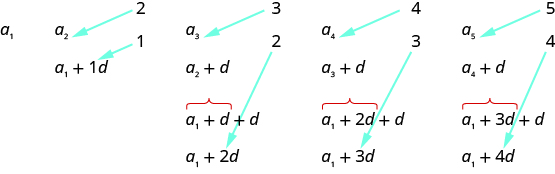  The first term adds 0*d* to the <math xmlns="http://www.w3.org/1998/Math/MathML"><mrow><msub><mi>a</mi><mn>1</mn></msub></mrow></math>

, the second term adds 1*d*, the third term adds 2*d*, the fourth term adds 3*d*, and the fifth term adds 4*d*. The number of *d*s that were added to <math xmlns="http://www.w3.org/1998/Math/MathML"><mrow><msub><mi>a</mi><mn>1</mn></msub></mrow></math>

 is one less than the number of the term. This leads us to the following

<math xmlns="http://www.w3.org/1998/Math/MathML"><mrow><msub><mi>a</mi><mi>n</mi></msub><mo>=</mo><msub><mi>a</mi><mn>1</mn></msub><mo>+</mo><mrow><mo>(</mo><mrow><mi>n</mi><mo>−</mo><mn>1</mn></mrow><mo>)</mo></mrow><mi>d</mi></mrow></math>

General Term (*n*th term) of an Arithmetic Sequence

The general term of an arithmetic sequence with first term <math xmlns="http://www.w3.org/1998/Math/MathML"><mrow><msub><mi>a</mi><mn>1</mn></msub></mrow></math>

 and the common difference *d* is

<math xmlns="http://www.w3.org/1998/Math/MathML"><mrow><msub><mi>a</mi><mi>n</mi></msub><mo>=</mo><msub><mi>a</mi><mn>1</mn></msub><mo>+</mo><mrow><mo>(</mo><mrow><mi>n</mi><mo>−</mo><mn>1</mn></mrow><mo>)</mo></mrow><mi>d</mi></mrow></math>

We will use this formula in the next example to find the 15th term of a sequence.

Find the fifteenth term of a sequence where the first term is 3 and the common difference is 6.

<math xmlns="http://www.w3.org/1998/Math/MathML"><mrow><mtable><mtr><mtd columnalign="left"><mtext>To find the fifteenth term,</mtext><mspace width="0.2em" /><msub><mi>a</mi><mrow><mn>15</mn></mrow></msub><mo>,</mo><mspace width="0.2em" /><mtext>use the</mtext></mtd><mtd /><mtd /><mtd columnalign="center"><mspace width="3em" /><msub><mi>a</mi><mi>n</mi></msub><mo>=</mo><msub><mi>a</mi><mn>1</mn></msub><mo>+</mo><mrow><mo>(</mo><mrow><mi>n</mi><mo>−</mo><mn>1</mn></mrow><mo>)</mo></mrow><mi>d</mi></mtd></mtr><mtr><mtd columnalign="left"><mtext>formula with</mtext><mspace width="0.2em" /><msub><mi>a</mi><mn>1</mn></msub><mo>=</mo><mn>3</mn><mspace width="0.2em" /><mtext>and</mtext><mspace width="0.2em" /><mi>d</mi><mo>=</mo><mn>6</mn><mtext>.</mtext></mtd><mtd /><mtd /><mtd /></mtr><mtr /><mtr /> <mtr><mtd columnalign="left"><mtext>Substitute in the values.</mtext></mtd><mtd /><mtd /><mtd columnalign="center"><mspace width="3em" /><msub><mi>a</mi><mrow><mn>15</mn></mrow></msub><mo>=</mo><mn>3</mn><mo>+</mo><mrow><mo>(</mo><mrow><mn>15</mn><mo>−</mo><mn>1</mn></mrow><mo>)</mo></mrow><mn>6</mn></mtd></mtr><mtr /><mtr /><mtr><mtd columnalign="left"><mtext>Simplify.</mtext></mtd><mtd /><mtd /><mtd columnalign="center"><mspace width="3em" /><msub><mi>a</mi><mrow><mn>15</mn></mrow></msub><mo>=</mo><mn>3</mn><mo>+</mo><mrow><mo>(</mo><mrow><mn>14</mn></mrow><mo>)</mo></mrow><mn>6</mn></mtd></mtr><mtr /><mtr /><mtr><mtd /><mtd /><mtd /><mtd columnalign="center"><mspace width="3em" /><msub><mi>a</mi><mrow><mn>15</mn></mrow></msub><mo>=</mo><mn>87</mn></mtd></mtr></mtable></mrow></math>

Find the twenty-seventh term of a sequence where the first term is 7 and the common difference is 9.

241

Find the eighteenth term of a sequence where the first term is 13 and the common difference is <math xmlns="http://www.w3.org/1998/Math/MathML"><mrow><mn>−7</mn></mrow></math>

.

<math xmlns="http://www.w3.org/1998/Math/MathML"><mrow><mn>−106</mn></mrow></math>

Sometimes we do not know the first term and we must use other given information to find it before we find the requested term.

Find the twelfth term of a sequence where the seventh term is 10 and the common difference is <math xmlns="http://www.w3.org/1998/Math/MathML"><mrow><mn>−2</mn></mrow></math>

. Give the formula for the general term.

<math xmlns="http://www.w3.org/1998/Math/MathML"><mtable><mtr><mtd columnalign="left"><mtext>To first find the first term,</mtext><mspace width="0.2em" /><msub><mi>a</mi><mn>1</mn></msub><mo>,</mo><mspace width="0.2em" /><mtext>use the</mtext></mtd><mtd /><mtd /><mtd columnalign="left"><mspace width="3em" /><msub><mi>a</mi><mi>n</mi></msub><mo>=</mo><msub><mi>a</mi><mn>1</mn></msub><mo>+</mo><mrow><mo>(</mo><mrow><mi>n</mi><mo>−</mo><mn>1</mn></mrow><mo>)</mo></mrow><mi>d</mi></mtd></mtr> <mtr><mtd columnalign="left"><mtext>formula with</mtext><mspace width="0.2em" /><msub><mi>a</mi><mn>7</mn></msub><mo>=</mo><mn>10</mn><mo>,</mo><mi>n</mi><mo>=</mo><mn>7</mn><mo>,</mo><mspace width="0.2em" /><mtext>and</mtext><mspace width="0.2em" /><mi>d</mi><mo>=</mo><mn>−2</mn><mo>.</mo></mtd><mtd /><mtd /><mtd /></mtr> <mtr><mtd columnalign="left"><mtext>Substitute in the values.</mtext></mtd><mtd /><mtd /><mtd columnalign="left"><mspace width="3em" /><mn>10</mn><mo>=</mo><msub><mi>a</mi><mn>1</mn></msub><mo>+</mo><mrow><mo>(</mo><mrow><mn>7</mn><mo>−</mo><mn>1</mn></mrow><mo>)</mo></mrow><mrow><mo>(</mo><mrow><mn>−2</mn></mrow><mo>)</mo></mrow></mtd></mtr> <mtr><mtd columnalign="left"><mtext>Simplify.</mtext></mtd><mtd /><mtd /><mtd columnalign="left"><mspace width="3em" /><mn>10</mn><mo>=</mo><msub><mi>a</mi><mn>1</mn></msub><mo>+</mo><mrow><mo>(</mo><mn>6</mn><mo>)</mo></mrow><mrow><mo>(</mo><mrow><mn>−2</mn></mrow><mo>)</mo></mrow></mtd></mtr> <mtr><mtd /><mtd /><mtd /><mtd columnalign="left"><mspace width="3em" /><mn>10</mn><mo>=</mo><msub><mi>a</mi><mn>1</mn></msub><mo>−</mo><mn>12</mn></mtd></mtr> <mtr><mtd /><mtd /><mtd /><mtd columnalign="left"><mspace width="3em" /><msub><mi>a</mi><mn>1</mn></msub><mo>=</mo><mn>22</mn></mtd></mtr><mtr /><mtr /> <mtr><mtd columnalign="left"><mtext>Find the twelfth term,</mtext><mspace width="0.2em" /><msub><mi>a</mi><mrow><mn>12</mn></mrow></msub><mo>,</mo><mspace width="0.2em" /><mtext>using the</mtext></mtd><mtd /><mtd /><mtd columnalign="left"><mspace width="3em" /><msub><mi>a</mi><mi>n</mi></msub><mo>=</mo><msub><mi>a</mi><mn>1</mn></msub><mo>+</mo><mrow><mo>(</mo><mrow><mi>n</mi><mo>−</mo><mn>1</mn></mrow><mo>)</mo></mrow><mi>d</mi></mtd></mtr> <mtr><mtd columnalign="left"><mtext>formula with</mtext><mspace width="0.2em" /><msub><mi>a</mi><mn>1</mn></msub><mo>=</mo><mn>22</mn><mo>,</mo><mi>n</mi><mo>=</mo><mn>12</mn><mo>,</mo><mspace width="0.2em" /><mtext>and</mtext><mspace width="0.2em" /><mi>d</mi><mo>=</mo><mn>−2</mn><mtext>.</mtext></mtd><mtd /><mtd /><mtd /></mtr> <mtr><mtd columnalign="left"><mtext>Substitute in the values.</mtext></mtd><mtd /><mtd /><mtd columnalign="left"><mspace width="3em" /><msub><mi>a</mi><mrow><mn>12</mn></mrow></msub><mo>=</mo><mn>22</mn><mo>+</mo><mrow><mo>(</mo><mrow><mn>12</mn><mo>−</mo><mn>1</mn></mrow><mo>)</mo></mrow><mrow><mo>(</mo><mrow><mn>−2</mn></mrow><mo>)</mo></mrow></mtd></mtr> <mtr><mtd columnalign="left"><mtext>Simplify.</mtext></mtd><mtd /><mtd /><mtd columnalign="left"><mspace width="3em" /><msub><mi>a</mi><mrow><mn>12</mn></mrow></msub><mo>=</mo><mn>22</mn><mo>+</mo><mrow><mo>(</mo><mrow><mn>11</mn></mrow><mo>)</mo></mrow><mrow><mo>(</mo><mrow><mn>−2</mn></mrow><mo>)</mo></mrow></mtd></mtr> <mtr><mtd /><mtd /><mtd /><mtd columnalign="left"><mspace width="3em" /><msub><mi>a</mi><mrow><mn>12</mn></mrow></msub><mo>=</mo><mn>0</mn></mtd></mtr> <mtr><mtd /><mtd /><mtd /><mtd columnalign="left"><mspace width="3em" /><mtext>The twelfth term of the sequence is 0,</mtext><mspace width="0.2em" /><msub><mi>a</mi><mrow><mn>12</mn></mrow></msub><mo>=</mo><mn>0</mn><mo>.</mo></mtd></mtr><mtr /><mtr /> <mtr><mtd columnalign="left"><mtext>To find the general term, substitute</mtext></mtd><mtd /><mtd /><mtd columnalign="left"><mspace width="3em" /><msub><mi>a</mi><mi>n</mi></msub><mo>=</mo><msub><mi>a</mi><mn>1</mn></msub><mo>+</mo><mrow><mo>(</mo><mrow><mi>n</mi><mo>−</mo><mn>1</mn></mrow><mo>)</mo></mrow><mi>d</mi></mtd></mtr> <mtr><mtd columnalign="left"><mtext>the values into the formula.</mtext></mtd><mtd /><mtd /><mtd /></mtr> <mtr><mtd /><mtd /><mtd /><mtd columnalign="left"><mspace width="3em" /><msub><mi>a</mi><mi>n</mi></msub><mo>=</mo><mn>22</mn><mo>+</mo><mrow><mo>(</mo><mrow><mi>n</mi><mo>−</mo><mn>1</mn></mrow><mo>)</mo></mrow><mrow><mo>(</mo><mrow><mn>−2</mn></mrow><mo>)</mo></mrow></mtd></mtr> <mtr><mtd /><mtd /><mtd /><mtd columnalign="left"><mspace width="3em" /><msub><mi>a</mi><mi>n</mi></msub><mo>=</mo><mn>22</mn><mo>−</mo><mn>2</mn><mi>n</mi><mo>+</mo><mn>2</mn></mtd></mtr> <mtr><mtd /><mtd /><mtd /><mtd columnalign="left"><mspace width="3em" /><mtext>The general term is</mtext><mspace width="0.2em" /><msub><mi>a</mi><mi>n</mi></msub><mo>=</mo><mn>−2</mn><mi>n</mi><mo>+</mo><mn>24</mn><mo>.</mo></mtd></mtr></mtable></math>

Find the eleventh term of a sequence where the ninth term is 8 and the common difference is <math xmlns="http://www.w3.org/1998/Math/MathML"><mrow><mn>−3</mn><mo>.</mo></mrow></math>

 Give the formula for the general term.

<math xmlns="http://www.w3.org/1998/Math/MathML"><mrow><msub><mi>a</mi><mrow><mn>11</mn></mrow></msub><mo>=</mo><mn>2</mn><mo>.</mo></mrow></math>

 The general term is <math xmlns="http://www.w3.org/1998/Math/MathML"><mrow><msub><mi>a</mi><mi>n</mi></msub><mo>=</mo><mn>−3</mn><mi>n</mi><mo>+</mo><mn>35</mn><mo>.</mo></mrow></math>

Find the nineteenth term of a sequence where the fifth term is 1 and the common difference is <math xmlns="http://www.w3.org/1998/Math/MathML"><mrow><mn>−4</mn><mo>.</mo></mrow></math>

 Give the formula for the general term.

<math xmlns="http://www.w3.org/1998/Math/MathML"><mrow><msub><mi>a</mi><mrow><mn>19</mn></mrow></msub><mo>=</mo><mn>−55</mn><mo>.</mo></mrow></math>

 The general term is <math xmlns="http://www.w3.org/1998/Math/MathML"><mrow><msub><mi>a</mi><mi>n</mi></msub><mo>=</mo><mn>−4</mn><mi>n</mi><mo>+</mo><mn>21</mn><mo>.</mo></mrow></math>

Sometimes the information given leads us to two equations in two unknowns. We then use our methods for solving systems of equations to find the values needed.

Find the first term and common difference of a sequence where the fifth term is 19 and the eleventh term is 37. Give the formula for the general term.

Since we know two terms, we can make a system of equations using the formula for the general term.

<table summary="The formula nth term equals a 1 plus n minus 1 times d. We know the value of a 5 and a 11 because a 5 equals a 1 plus 5 minus 1 times d, and a 11 equals a 1 plus 11 minus 1 times d. We know that 19 equals a sub 1 plus 5 minus 1 times d, and 37 equals a sub 1 plus 11 minus 1 times, so we then substitute in the values a sub 5 equals 19 and a sub 11 equals 37.  Simplify to get 19 equals a sub 1 plus 4 d, and 37 equals a sub 1 plus 10 d.  Next we prepare to eliminate the a sub 1 term by multiplying the top equation by negative 1 to get 18 equals 6 d, and 3 equals d.   Next, substitute d equals 3 back into the first equation to get 19 equals a sub 1 plus 4 times g 3, then solve for a sub 1 to get 19 equals a sub 1 plus 12, then 7 equals a.  Use the formula with a sub 1 equals 7 and d equals 3.  We then substitute in the values to get a sub n equals 7 plus the sum of n minus 1 times 3.  Simplify to get a sub n equals 7 plus 3 n minus 3, then a sub n equals 3 n plus 4.  The first term is a sub 1 equals 7 and the common difference is d equals 3.  The general term of the sequence is a sub n equals 3 n plus 4." class="unnumbered unstyled" data-label=""><tbody>
<tr>
<td />
<td />
<td data-align="left">

</td>
</tr>
<tr>
<td data-valign="top" data-align="left">We know the value of <math xmlns="http://www.w3.org/1998/Math/MathML"><mrow><msub><mi>a</mi><mn>5</mn></msub></mrow></math> and <math xmlns="http://www.w3.org/1998/Math/MathML"><mrow><msub><mi>a</mi><mrow><mn>11</mn></mrow></msub><mo>,</mo></mrow></math> so we will use <math xmlns="http://www.w3.org/1998/Math/MathML"><mrow><mi>n</mi><mo>=</mo><mn>5</mn></mrow></math> and <math xmlns="http://www.w3.org/1998/Math/MathML"><mrow><mi>n</mi><mo>=</mo><mn>11</mn><mo>.</mo></mrow></math></td>
<td />
<td data-valign="top" data-align="left">
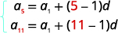

</td>
</tr>
<tr>
<td data-valign="top" data-align="left">Substitute in the values, <math xmlns="http://www.w3.org/1998/Math/MathML"><mrow><msub><mi>a</mi><mn>5</mn></msub><mo>=</mo><mn>19</mn></mrow></math> and <math xmlns="http://www.w3.org/1998/Math/MathML"><mrow><msub><mi>a</mi><mrow><mn>11</mn></mrow></msub><mo>=</mo><mn>37</mn><mo>.</mo></mrow></math></td>
<td />
<td data-valign="top" data-align="left">
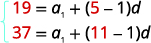

</td>
</tr>
<tr>
<td data-valign="top" data-align="left">Simplify.</td>
<td />
<td data-valign="top" data-align="left">
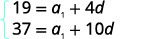

</td>
</tr>
<tr>
<td data-valign="top" data-align="left">Prepare to eliminate the <math xmlns="http://www.w3.org/1998/Math/MathML"><mrow><msub><mi>a</mi><mn>1</mn></msub></mrow></math> term by multiplying the top equation by <math xmlns="http://www.w3.org/1998/Math/MathML"><mrow><mn>−1</mn><mo>.</mo></mrow></math>
Add the equations.</td>
<td />
<td data-valign="top" data-align="left">

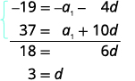

</td>
</tr>
<tr>
<td data-valign="top" data-align="left">
Substituting <math xmlns="http://www.w3.org/1998/Math/MathML"><mrow><mi>d</mi><mo>=</mo><mn>3</mn></mrow></math> back into the first equation.</td>
<td />
<td data-valign="top" data-align="left">

</td>
</tr>
<tr>
<td data-valign="top" data-align="left">Solve for <math xmlns="http://www.w3.org/1998/Math/MathML"><mrow><msub><mi>a</mi><mn>1</mn></msub><mo>.</mo></mrow></math></td>
<td />
<td data-valign="top" data-align="left">

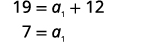

</td>
</tr>
<tr>
<td data-valign="top" data-align="left">
Use the formula with <math xmlns="http://www.w3.org/1998/Math/MathML"><mrow><msub><mi>a</mi><mn>1</mn></msub><mo>=</mo><mn>7</mn></mrow></math> and <math xmlns="http://www.w3.org/1998/Math/MathML"><mrow><mi>d</mi><mo>=</mo><mn>3</mn><mo>.</mo></mrow></math></td>
<td />
<td data-valign="top" data-align="left">

</td>
</tr>
<tr>
<td data-valign="top" data-align="left">Substitute in the values.</td>
<td />
<td data-valign="top" data-align="left">

</td>
</tr>
<tr>
<td data-valign="top" data-align="left">Simplify.</td>
<td><math xmlns="http://www.w3.org/1998/Math/MathML"><mrow><mspace width="2.5em" /></mrow></math></td>
<td data-valign="top" data-align="left">

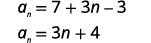

</td>
</tr>
<tr>
<td />
<td colspan="2" data-valign="top" data-align="center">The first term is <math xmlns="http://www.w3.org/1998/Math/MathML"><mrow><msub><mi>a</mi><mn>1</mn></msub><mo>=</mo><mn>7</mn><mo>.</mo></mrow></math>
The common difference is <math xmlns="http://www.w3.org/1998/Math/MathML"><mrow><mi>d</mi><mo>=</mo><mn>3</mn><mo>.</mo></mrow></math></td>
</tr>
<tr>
<td />
<td colspan="2" data-valign="top" data-align="center">
The general term of the sequence is <math xmlns="http://www.w3.org/1998/Math/MathML"><mrow><msub><mi>a</mi><mi>n</mi></msub><mo>=</mo><mn>3</mn><mi>n</mi><mo>+</mo><mn>4</mn><mo>.</mo></mrow></math>

</td>
</tr>
</tbody></table>

Find the first term and common difference of a sequence where the fourth term is 17 and the thirteenth term is 53. Give the formula for the general term.

<math xmlns="http://www.w3.org/1998/Math/MathML"><mrow><msub><mi>a</mi><mn>1</mn></msub><mo>=</mo><mn>5</mn><mo>,</mo></mrow></math>

<math xmlns="http://www.w3.org/1998/Math/MathML"><mrow><mi>d</mi><mo>=</mo><mn>4</mn><mo>.</mo></mrow></math>

 The general term is <math xmlns="http://www.w3.org/1998/Math/MathML"><mrow><msub><mi>a</mi><mi>n</mi></msub><mo>=</mo><mn>4</mn><mi>n</mi><mo>+</mo><mn>1</mn><mo>.</mo></mrow></math>

Find the first term and common difference of a sequence where the third term is 2 and the twelfth term is <math xmlns="http://www.w3.org/1998/Math/MathML"><mrow><mn>−25</mn><mo>.</mo></mrow></math>

 Give the formula for the general term.

<math xmlns="http://www.w3.org/1998/Math/MathML"><mrow><msub><mi>a</mi><mn>1</mn></msub><mo>=</mo><mn>8</mn><mo>,</mo></mrow></math>

<math xmlns="http://www.w3.org/1998/Math/MathML"><mrow><mi>d</mi><mo>=</mo><mn>−3</mn><mo>.</mo></mrow></math>

 The general term is <math xmlns="http://www.w3.org/1998/Math/MathML"><mrow><msub><mi>a</mi><mi>n</mi></msub><mo>=</mo><mn>−3</mn><mi>n</mi><mo>+</mo><mn>11</mn><mo>.</mo></mrow></math>

### Find the Sum of the First *n* Terms of an Arithmetic Sequence

As with the general sequences, it is often useful to find the sum of an arithmetic sequence. The sum, <math xmlns="http://www.w3.org/1998/Math/MathML"><mrow><msub><mi>S</mi><mi>n</mi></msub><mo>,</mo></mrow></math>

 of the first <math xmlns="http://www.w3.org/1998/Math/MathML"><mi>n</mi></math>

 terms of any arithmetic sequence is written as <math xmlns="http://www.w3.org/1998/Math/MathML"><mrow><msub><mi>S</mi><mi>n</mi></msub><mo>=</mo><msub><mi>a</mi><mn>1</mn></msub><mo>+</mo><msub><mi>a</mi><mn>2</mn></msub><mo>+</mo><msub><mi>a</mi><mn>3</mn></msub><mo>+</mo><mn>...</mn><mo>+</mo><msub><mi>a</mi><mi>n</mi></msub><mo>.</mo></mrow></math>

 To find the sum by merely adding all the terms can be tedious. So we can also develop a formula to find the sum of a sequence using the first and last term of the sequence.

We can develop this new formula by first writing the sum by starting with the first term, <math xmlns="http://www.w3.org/1998/Math/MathML"><mrow><msub><mi>a</mi><mn>1</mn></msub><mo>,</mo></mrow></math>

 and keep adding a *d* to get the next term as:

<math xmlns="http://www.w3.org/1998/Math/MathML"><mrow><msub><mi>S</mi><mi>n</mi></msub><mo>=</mo><msub><mi>a</mi><mn>1</mn></msub><mo>+</mo><mo stretchy="false">(</mo><msub><mi>a</mi><mn>1</mn></msub><mo>+</mo><mi>d</mi><mo stretchy="false">)</mo><mo>+</mo><mo stretchy="false">(</mo><msub><mi>a</mi><mn>1</mn></msub><mo>+</mo><mn>2</mn><mi>d</mi><mo stretchy="false">)</mo><mo>+</mo><mo>…</mo><mo>+</mo><msub><mi>a</mi><mi>n</mi></msub><mo>.</mo></mrow></math>

We can also reverse the order of the terms and write the sum by starting with <math xmlns="http://www.w3.org/1998/Math/MathML"><mrow><msub><mi>a</mi><mi>n</mi></msub></mrow></math>

 and keep subtracting *d* to get the next term as

<math xmlns="http://www.w3.org/1998/Math/MathML"><mrow><msub><mi>S</mi><mi>n</mi></msub><mo>=</mo><msub><mi>a</mi><mi>n</mi></msub><mo>+</mo><mo stretchy="false">(</mo><msub><mi>a</mi><mi>n</mi></msub><mo>–</mo><mi>d</mi><mo stretchy="false">)</mo><mo>+</mo><mo stretchy="false">(</mo><msub><mi>a</mi><mi>n</mi></msub><mo>–</mo><mn>2</mn><mi>d</mi><mo stretchy="false">)</mo><mo>+</mo><mo>…</mo><mo>+</mo><msub><mi>a</mi><mn>1</mn></msub><mo>.</mo></mrow></math>

If we add these two expressions for the sum of the first *n* terms of an arithmetic sequence, we can derive a formula for the sum of the first *n* terms of any arithmetic series.

<math xmlns="http://www.w3.org/1998/Math/MathML"><mtable><mtr><mtd columnalign="left"><munder accentunder="true"><mrow><mtable><mtr><mtd columnalign="right"><msub><mi>S</mi><mi>n</mi></msub></mtd><mtd columnalign="left"><mo>=</mo></mtd><mtd columnalign="left"><msub><mi>a</mi><mn>1</mn></msub></mtd><mtd columnalign="left"><mspace width="1.9em" /><mo>+</mo></mtd><mtd columnalign="left"><mo stretchy="false">(</mo><msub><mi>a</mi><mn>1</mn></msub><mo>+</mo><mi>d</mi><mo stretchy="false">)</mo></mtd><mtd columnalign="left"><mo>+</mo></mtd><mtd columnalign="left"><mo stretchy="false">(</mo><msub><mi>a</mi><mn>1</mn></msub><mo>+</mo><mn>2</mn><mi>d</mi><mo stretchy="false">)</mo></mtd><mtd columnalign="left"><mo>+</mo></mtd><mtd columnalign="left"><mo>…</mo></mtd><mtd columnalign="left"><mo>+</mo></mtd><mtd columnalign="left"><msub><mi>a</mi><mi>n</mi></msub></mtd></mtr><mtr><mtd columnalign="left"><mo>+</mo><msub><mi>S</mi><mi>n</mi></msub></mtd><mtd columnalign="left"><mo>=</mo></mtd><mtd columnalign="left"><msub><mi>a</mi><mi>n</mi></msub></mtd><mtd columnalign="left"><mspace width="1.9em" /><mo>+</mo></mtd><mtd columnalign="left"><mo stretchy="false">(</mo><msub><mi>a</mi><mi>n</mi></msub><mo>−</mo><mi>d</mi><mo stretchy="false">)</mo></mtd><mtd columnalign="left"><mo>+</mo></mtd><mtd columnalign="left"><mo stretchy="false">(</mo><msub><mi>a</mi><mi>n</mi></msub><mo>−</mo><mn>2</mn><mi>d</mi><mo stretchy="false">)</mo></mtd><mtd columnalign="left"><mo>+</mo></mtd><mtd columnalign="left"><mo>…</mo></mtd><mtd columnalign="left"><mo>+</mo></mtd><mtd columnalign="left"><msub><mi>a</mi><mn>1</mn></msub></mtd></mtr></mtable></mrow><mtext>\_\_\_\_\_\_\_\_\_\_\_\_\_\_\_\_\_\_\_\_\_\_\_\_\_\_\_\_\_\_\_\_\_\_\_\_\_\_\_\_\_\_\_\_\_\_\_\_\_\_\_\_\_\_\_\_\_</mtext></munder></mtd></mtr><mtr /><mtr><mtd columnalign="left"><mspace width="1.8em" /><mn>2</mn><msub><mi>S</mi><mi>n</mi></msub><mspace width="0.6em" /><mo>=</mo><mspace width="0.2em" /><mrow><mo>(</mo><mrow><msub><mi>a</mi><mn>1</mn></msub><mo>+</mo><msub><mi>a</mi><mi>n</mi></msub></mrow><mo>)</mo></mrow><mo>+</mo><mspace width="0.05em" /><mrow><mo>(</mo><mrow><msub><mi>a</mi><mn>1</mn></msub><mo>+</mo><msub><mi>a</mi><mi>n</mi></msub></mrow><mo>)</mo></mrow><mspace width="0.5em" /><mo>+</mo><mspace width="0.5em" /><mrow><mo>(</mo><mrow><msub><mi>a</mi><mn>1</mn></msub><mo>+</mo><msub><mi>a</mi><mi>n</mi></msub></mrow><mo>)</mo></mrow><mspace width="0.6em" /><mo>+</mo><mspace width="0.5em" /><mo>…</mo><mspace width="0.5em" /><mo>+</mo><mspace width="0.5em" /><mrow><mo>(</mo><mrow><msub><mi>a</mi><mn>1</mn></msub><mo>+</mo><msub><mi>a</mi><mi>n</mi></msub></mrow><mo>)</mo></mrow></mtd></mtr></mtable></math>

Because there are *n* sums of <math xmlns="http://www.w3.org/1998/Math/MathML"><mrow><mrow><mo>(</mo><mrow><msub><mi>a</mi><mn>1</mn></msub><mo>+</mo><msub><mi>a</mi><mi>n</mi></msub></mrow><mo>)</mo></mrow></mrow></math>

 on the right side of the equation, we rewrite the right side as <math xmlns="http://www.w3.org/1998/Math/MathML"><mrow><mi>n</mi><mrow><mo>(</mo><mrow><msub><mi>a</mi><mn>1</mn></msub><mo>+</mo><msub><mi>a</mi><mi>n</mi></msub></mrow><mo>)</mo></mrow><mo>.</mo></mrow></math>

<math xmlns="http://www.w3.org/1998/Math/MathML"><mrow><mn>2</mn><msub><mi>S</mi><mi>n</mi></msub><mo>=</mo><mi>n</mi><mo stretchy="false">(</mo><msub><mi>a</mi><mn>1</mn></msub><mo>+</mo><msub><mi>a</mi><mi>n</mi></msub><mo stretchy="false">)</mo></mrow></math>

We divide by two to solve for <math xmlns="http://www.w3.org/1998/Math/MathML"><mrow><msub><mi>S</mi><mi>n</mi></msub><mo>.</mo></mrow></math>

<math xmlns="http://www.w3.org/1998/Math/MathML"><mrow><msub><mi>S</mi><mi>n</mi></msub><mo>=</mo><mfrac><mi>n</mi><mn>2</mn></mfrac><mo stretchy="false">(</mo><msub><mi>a</mi><mn>1</mn></msub><mo>+</mo><msub><mi>a</mi><mi>n</mi></msub><mo stretchy="false">)</mo></mrow></math>

This give us a general formula for the sum of the first *n* terms of an arithmetic sequence.

Sum of the First *n* Terms of an Arithmetic Sequence

The sum, <math xmlns="http://www.w3.org/1998/Math/MathML"><mrow><msub><mi>S</mi><mi>n</mi></msub><mo>,</mo></mrow></math>

 of the first *n* terms of an arithmetic sequence is

<math xmlns="http://www.w3.org/1998/Math/MathML"><mrow><msub><mi>S</mi><mi>n</mi></msub><mo>=</mo><mfrac><mi>n</mi><mn>2</mn></mfrac><mo stretchy="false">(</mo><msub><mi>a</mi><mn>1</mn></msub><mo>+</mo><msub><mi>a</mi><mi>n</mi></msub><mo stretchy="false">)</mo></mrow></math>

where <math xmlns="http://www.w3.org/1998/Math/MathML"><mrow><msub><mi>a</mi><mn>1</mn></msub></mrow></math>

 is the first term and <math xmlns="http://www.w3.org/1998/Math/MathML"><mrow><msub><mi>a</mi><mi>n</mi></msub></mrow></math>

 is the *n*th term.

We apply this formula in the next example where the first few terms of the sequence are given.

Find the sum of the first 30 terms of the arithmetic sequence: 8, 13, 18, 23, 28, …

To find the sum, we will use the formula <math xmlns="http://www.w3.org/1998/Math/MathML"><mrow><msub><mi>S</mi><mi>n</mi></msub><mo>=</mo><mfrac><mi>n</mi><mn>2</mn></mfrac><mo stretchy="false">(</mo><msub><mi>a</mi><mn>1</mn></msub><mo>+</mo><msub><mi>a</mi><mi>n</mi></msub><mo stretchy="false">)</mo><mo>.</mo></mrow></math>

 We know <math xmlns="http://www.w3.org/1998/Math/MathML"><mrow><msub><mi>a</mi><mn>1</mn></msub><mo>=</mo><mn>8</mn></mrow></math>

, <math xmlns="http://www.w3.org/1998/Math/MathML"><mrow><mi>d</mi><mo>=</mo><mn>5</mn></mrow></math>

 and <math xmlns="http://www.w3.org/1998/Math/MathML"><mrow><mi>n</mi><mo>=</mo><mn>30</mn><mo>,</mo></mrow></math>

 but we need to find <math xmlns="http://www.w3.org/1998/Math/MathML"><mrow><msub><mi>a</mi><mi>n</mi></msub></mrow></math>

 in order to use the sum formula.

<math xmlns="http://www.w3.org/1998/Math/MathML"><mrow><mtable><mtr><mtd /><mtd /><mtd /><mtd columnalign="right"><msub><mi>a</mi><mi>n</mi></msub></mtd><mtd columnalign="left"><mo>=</mo></mtd><mtd columnalign="left"><msub><mi>a</mi><mn>1</mn></msub><mo>+</mo><mrow><mo>(</mo><mrow><mi>n</mi><mo>−</mo><mn>1</mn></mrow><mo>)</mo></mrow><mi>d</mi></mtd></mtr> <mtr><mtd columnalign="left"><mtext>Find</mtext><mspace width="0.2em" /><msub><mi>a</mi><mi>n</mi></msub><mspace width="0.2em" /><mtext>where</mtext><mspace width="0.2em" /><msub><mi>a</mi><mn>1</mn></msub><mo>=</mo><mn>8</mn><mo>,</mo><mi>d</mi><mo>=</mo><mn>5</mn><mspace width="0.2em" /><mtext>and</mtext><mspace width="0.2em" /><mi>n</mi><mo>=</mo><mn>30</mn><mo>.</mo></mtd><mtd /><mtd /><mtd columnalign="right"><msub><mi>a</mi><mrow><mn>30</mn></mrow></msub></mtd><mtd columnalign="left"><mo>=</mo></mtd><mtd columnalign="left"><mn>8</mn><mo>+</mo><mrow><mo>(</mo><mrow><mn>30</mn><mo>−</mo><mn>1</mn></mrow><mo>)</mo></mrow><mn>5</mn></mtd></mtr> <mtr><mtd columnalign="left"><mtext>Simplify.</mtext></mtd><mtd /><mtd /><mtd columnalign="right"><msub><mi>a</mi><mrow><mn>30</mn></mrow></msub></mtd><mtd columnalign="left"><mo>=</mo></mtd><mtd columnalign="left"><mn>8</mn><mo>+</mo><mrow><mo>(</mo><mrow><mn>29</mn></mrow><mo>)</mo></mrow><mn>5</mn></mtd></mtr> <mtr><mtd /><mtd /><mtd /><mtd columnalign="right"><msub><mi>a</mi><mrow><mn>30</mn></mrow></msub></mtd><mtd columnalign="left"><mo>=</mo></mtd><mtd columnalign="left"><mn>153</mn></mtd></mtr><mtr /><mtr /> <mtr><mtd columnalign="left"><mtable><mtr><mtd columnalign="left"><mtext>Knowing</mtext><mspace width="0.2em" /><msub><mi>a</mi><mn>1</mn></msub><mo>=</mo><mn>8</mn><mo>,</mo><mi>n</mi><mo>=</mo><mn>30</mn><mo>,</mo><mspace width="0.2em" /><mtext>and</mtext><mspace width="0.2em" /><msub><mi>a</mi><mrow><mn>30</mn></mrow></msub><mo>=</mo><mn>153</mn><mo>,</mo></mtd></mtr> <mtr><mtd columnalign="left"><mtext>use the sum formula.</mtext></mtd></mtr></mtable></mtd><mtd /><mtd /><mtd columnalign="right"><msub><mi>S</mi><mi>n</mi></msub></mtd><mtd columnalign="left"><mo>=</mo></mtd><mtd columnalign="left"><mfrac><mi>n</mi><mn>2</mn></mfrac><mo stretchy="false">(</mo><msub><mi>a</mi><mn>1</mn></msub><mo>+</mo><msub><mi>a</mi><mi>n</mi></msub><mo stretchy="false">)</mo></mtd></mtr> <mtr><mtd columnalign="left"><mtext>Substitute in the values.</mtext></mtd><mtd /><mtd /><mtd columnalign="right"><msub><mi>S</mi><mrow><mn>30</mn></mrow></msub></mtd><mtd columnalign="left"><mo>=</mo></mtd><mtd columnalign="left"><mfrac><mrow><mn>30</mn></mrow><mn>2</mn></mfrac><mo stretchy="false">(</mo><mn>8</mn><mo>+</mo><mn>153</mn><mo stretchy="false">)</mo></mtd></mtr> <mtr><mtd columnalign="left"><mtext>Simplify.</mtext></mtd><mtd /><mtd /><mtd columnalign="right"><msub><mi>S</mi><mrow><mn>30</mn></mrow></msub></mtd><mtd columnalign="left"><mo>=</mo></mtd><mtd columnalign="left"><mn>15</mn><mo stretchy="false">(</mo><mn>161</mn><mo stretchy="false">)</mo></mtd></mtr> <mtr><mtd columnalign="left"><mtext>Simplify.</mtext></mtd><mtd /><mtd /><mtd columnalign="right"><msub><mi>S</mi><mrow><mn>30</mn></mrow></msub></mtd><mtd columnalign="left"><mo>=</mo></mtd><mtd columnalign="left"><mn>2,415</mn></mtd></mtr></mtable></mrow></math>

Find the sum of the first 30 terms of the arithmetic sequence: 5, 9, 13, 17, 21, …

1,890

Find the sum of the first 30 terms of the arithmetic sequence: 7, 10, 13, 16, 19, …

1,515

In the next example, we are given the general term for the sequence and are asked to find the sum of the first 50 terms.

Find the sum of the first 50 terms of the arithmetic sequence whose general term is <math xmlns="http://www.w3.org/1998/Math/MathML"><mrow><msub><mi>a</mi><mi>n</mi></msub><mo>=</mo><mn>3</mn><mi>n</mi><mo>−</mo><mn>4</mn><mo>.</mo></mrow></math>

To find the sum, we will use the formula <math xmlns="http://www.w3.org/1998/Math/MathML"><mrow><msub><mi>S</mi><mi>n</mi></msub><mo>=</mo><mfrac><mi>n</mi><mn>2</mn></mfrac><mo stretchy="false">(</mo><msub><mi>a</mi><mn>1</mn></msub><mo>+</mo><msub><mi>a</mi><mi>n</mi></msub><mo stretchy="false">)</mo><mo>.</mo></mrow></math>

 We know <math xmlns="http://www.w3.org/1998/Math/MathML"><mrow><mi>n</mi><mo>=</mo><mn>50</mn><mo>,</mo></mrow></math>

 but we need to find <math xmlns="http://www.w3.org/1998/Math/MathML"><mrow><msub><mi>a</mi><mn>1</mn></msub></mrow></math>

 and <math xmlns="http://www.w3.org/1998/Math/MathML"><mrow><msub><mi>a</mi><mi>n</mi></msub></mrow></math>

 in order to use the sum formula.

|  |  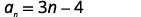  |
| Find <math xmlns="http://www.w3.org/1998/Math/MathML"><mrow><msub><mi>a</mi><mn>1</mn></msub><mo>,</mo></mrow></math>

 by substituting <math xmlns="http://www.w3.org/1998/Math/MathML"><mrow><mi>n</mi><mo>=</mo><mn>1</mn><mo>.</mo></mrow></math>

 |  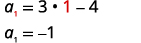  |
| Find <math xmlns="http://www.w3.org/1998/Math/MathML"><mrow><msub><mi>a</mi><mi>n</mi></msub></mrow></math>

 by substituting <math xmlns="http://www.w3.org/1998/Math/MathML"><mrow><mi>n</mi><mo>=</mo><mn>50</mn><mo>.</mo></mrow></math>

 |  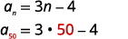  |
| Simplify. |  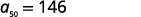  |
| Knowing <math xmlns="http://www.w3.org/1998/Math/MathML"><mrow><mi>n</mi><mo>=</mo><mn>50</mn><mo>,</mo></mrow></math>

<math xmlns="http://www.w3.org/1998/Math/MathML"><mrow><msub><mi>a</mi><mn>1</mn></msub><mo>=</mo><mn>−1</mn><mo>,</mo></mrow></math>

 and <math xmlns="http://www.w3.org/1998/Math/MathML"><mrow><msub><mi>a</mi><mrow><mn>50</mn></mrow></msub><mo>=</mo><mn>146</mn></mrow></math>

 use the sum formula. |  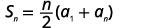  |
| Substitute in the values. |  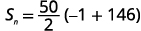  |
| Simplify. |    |
| Simplify. |    |
{: summary="This figure shows how we find the sum of the formula a sub n equals 3 times n minus 4. First we find a sub 1 by substituting n equals 1 to get a sub 1 equals 3 times g times 1 minus 4. We then get a sub 1 equals negative 1. Next we find a sub n by substituting n equals 50 into the formula a sub n equals 3 n minus 4. We get a sub 50 equals 3 times g times 50 minus 4. Simplify to get a sub 50 equals 146. Knowing that n equals 50, a sub 1 equals negative 1, and a sub 50 equals 146, use the sum formula to get s sub n equals n divided by 2 times a sub 1 plus a sub n. Substitute the values to get s sub 50 equals 50 divided by 2 times negative 1 plus 146, and simplify to s sub 50 equals 25 times 145. Simplify again to get 3625." .unnumbered .unstyled data-label=""}

Find the sum of the first 50 terms of the arithmetic sequence whose general term is <math xmlns="http://www.w3.org/1998/Math/MathML"><mrow><msub><mi>a</mi><mi>n</mi></msub><mo>=</mo><mn>2</mn><mi>n</mi><mo>−</mo><mn>5</mn><mo>.</mo></mrow></math>

2,300

Find the sum of the first 50 terms of the arithmetic sequence whose general term is <math xmlns="http://www.w3.org/1998/Math/MathML"><mrow><msub><mi>a</mi><mi>n</mi></msub><mo>=</mo><mn>4</mn><mi>n</mi><mo>+</mo><mn>3</mn><mo>.</mo></mrow></math>

5,250

In the next example we are given the sum in summation notation. To add all the terms would be tedious, so we extract the information needed to use the formula to find the sum of the first *n* terms.

Find the sum: <math xmlns="http://www.w3.org/1998/Math/MathML"><mrow><mstyle displaystyle="true"><munderover><mo>∑</mo><mrow><mi>i</mi><mo>=</mo><mn>1</mn></mrow><mrow><mn>25</mn></mrow></munderover><mrow><mo stretchy="false">(</mo><mn>4</mn><mi>i</mi><mo>+</mo><mn>7</mn><mo stretchy="false">)</mo></mrow></mstyle><mo>.</mo></mrow></math>

To find the sum, we will use the formula <math xmlns="http://www.w3.org/1998/Math/MathML"><mrow><msub><mi>S</mi><mi>n</mi></msub><mo>=</mo><mfrac><mi>n</mi><mn>2</mn></mfrac><mo stretchy="false">(</mo><msub><mi>a</mi><mn>1</mn></msub><mo>+</mo><msub><mi>a</mi><mi>n</mi></msub><mo stretchy="false">)</mo><mo>.</mo></mrow></math>

 We know <math xmlns="http://www.w3.org/1998/Math/MathML"><mrow><mi>n</mi><mo>=</mo><mn>25</mn><mo>,</mo></mrow></math>

 but we need to find <math xmlns="http://www.w3.org/1998/Math/MathML"><mrow><msub><mi>a</mi><mn>1</mn></msub></mrow></math>

 and <math xmlns="http://www.w3.org/1998/Math/MathML"><mrow><msub><mi>a</mi><mi>n</mi></msub></mrow></math>

 in order to use the sum formula.

<table summary="This figure shows how to expand the summation notation the sum of 4 sub i plus 7 from i equals 1 to 25. We simplify to equal 11 plus 15 plus 19 plus ellipsis plus 107. Next identify a sub 1 which equals 11 and a sub 25 equals 107. Knowing that n equals 25, a sub 1 equals 11, and a sub 25 equals 107, use the sum formula to get s sub n equals n divided by 2 times a sub 1 plus a sub n. Substitute the values to get s sub 25 equals 25 divided by 2 times 11 plus 107, and simplify to 25 divided by 2 times 118. Simplify again to get 1475." class="unnumbered unstyled" data-label=""><tbody>
<tr>
<td data-align="left">Expand the summation notation.</td>
<td data-align="left">

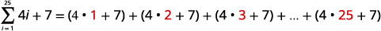

</td>
</tr>
<tr>
<td data-align="left">Simplify.</td>
<td data-align="left">

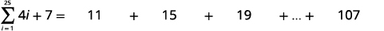

</td>
</tr>
<tr>
<td data-align="left">Identify <math xmlns="http://www.w3.org/1998/Math/MathML"><mrow><msub><mi>a</mi><mn>1</mn></msub><mo>.</mo></mrow></math></td>
<td data-align="left">

</td>
</tr>
<tr>
<td data-align="left">Identify <math xmlns="http://www.w3.org/1998/Math/MathML"><mrow><msub><mi>a</mi><mrow><mn>25</mn></mrow></msub><mo>.</mo></mrow></math></td>
<td data-align="left">

</td>
</tr>
<tr>
<td data-align="left">Knowing <math xmlns="http://www.w3.org/1998/Math/MathML"><mrow><mi>n</mi><mo>=</mo><mn>25</mn><mo>,</mo></mrow></math><math xmlns="http://www.w3.org/1998/Math/MathML"><mrow><msub><mi>a</mi><mn>1</mn></msub><mo>=</mo><mn>11</mn><mo>,</mo></mrow></math> and <math xmlns="http://www.w3.org/1998/Math/MathML"><mrow><msub><mi>a</mi><mrow><mn>25</mn></mrow></msub><mo>=</mo><mn>107</mn></mrow></math>
use the sum formula.</td>
<td data-align="left">

</td>
</tr>
<tr>
<td data-align="left">Substitute in the values.</td>
<td data-align="left">

</td>
</tr>
<tr>
<td data-align="left">Simplify.</td>
<td data-align="left">

</td>
</tr>
<tr>
<td data-align="left">Simplify.</td>
<td data-align="left">

</td>
</tr>
</tbody></table>

Find the sum: <math xmlns="http://www.w3.org/1998/Math/MathML"><mrow><mstyle displaystyle="true"><munderover><mo>∑</mo><mrow><mi>i</mi><mo>=</mo><mn>1</mn></mrow><mrow><mn>30</mn></mrow></munderover><mrow><mo stretchy="false">(</mo><mn>6</mn><mi>i</mi><mo>−</mo><mn>4</mn></mrow></mstyle><mo stretchy="false">)</mo><mo>.</mo></mrow></math>

2,670

Find the sum: <math xmlns="http://www.w3.org/1998/Math/MathML"><mrow><mstyle displaystyle="true"><munderover><mo>∑</mo><mrow><mi>i</mi><mo>=</mo><mn>1</mn></mrow><mrow><mn>35</mn></mrow></munderover><mrow><mo stretchy="false">(</mo><mn>5</mn><mi>i</mi><mo>−</mo><mn>3</mn></mrow></mstyle><mo stretchy="false">)</mo><mo>.</mo></mrow></math>

3,045

Access these online resources for additional instruction and practice with arithmetic sequences

* [Arithmetic Sequences][1]
* [Arithmetic Sequences: A Formula for the ‘n-th’ Term][2]
* [Arithmetic Series][3]
{: data-display="block"}

### Key Concepts

* **General Term (*n*th term) of an Arithmetic Sequence**
  * * *
  {: data-type="newline"}
  
  The general term of an arithmetic sequence with first term
  <math xmlns="http://www.w3.org/1998/Math/MathML"><mrow><msub><mi>a</mi><mn>1</mn></msub></mrow></math>
  
  and the common difference *d* is
  * * *
  {: data-type="newline"}
  
  

  <math xmlns="http://www.w3.org/1998/Math/MathML"><mrow><msub><mi>a</mi><mi>n</mi></msub><mo>=</mo><msub><mi>a</mi><mn>1</mn></msub><mo>+</mo><mrow><mo>(</mo><mrow><mi>n</mi><mo>−</mo><mn>1</mn></mrow><mo>)</mo></mrow><mi>d</mi></mrow></math>
  

* **Sum of the First *n* Terms of an Arithmetic Sequence**
  * * *
  {: data-type="newline"}
  
  The sum,
  <math xmlns="http://www.w3.org/1998/Math/MathML"><mrow><msub><mi>S</mi><mi>n</mi></msub><mo>,</mo></mrow></math>
  
  of the first *n* terms of an arithmetic sequence, where
  <math xmlns="http://www.w3.org/1998/Math/MathML"><mrow><msub><mi>a</mi><mn>1</mn></msub></mrow></math>
  
  is the first term and
  <math xmlns="http://www.w3.org/1998/Math/MathML"><mrow><msub><mi>a</mi><mi>n</mi></msub></mrow></math>
  
  is the *n*th term is
  * * *
  {: data-type="newline"}
  
  

  <math xmlns="http://www.w3.org/1998/Math/MathML"><mrow><msub><mi>S</mi><mi>n</mi></msub><mo>=</mo><mfrac><mi>n</mi><mn>2</mn></mfrac><mo stretchy="false">(</mo><msub><mi>a</mi><mn>1</mn></msub><mo>+</mo><msub><mi>a</mi><mi>n</mi></msub><mo stretchy="false">)</mo></mrow></math>
  

{: data-bullet-style="bullet"}

<section data-depth="1" class="section-exercises" markdown="1">
#### Practice Makes Perfect

**Determine if a Sequence is Arithmetic**

In the following exercises, determine if each sequence is arithmetic, and if so, indicate the common difference.

<math xmlns="http://www.w3.org/1998/Math/MathML"><mrow><mn>4</mn><mo>,</mo><mn>12</mn><mo>,</mo><mn>20</mn><mo>,</mo><mn>28</mn><mo>,</mo><mn>36</mn><mo>,</mo><mn>44</mn><mtext>,</mtext><mspace width="0.2em" /><mtext>…</mtext></mrow></math>

The sequence is arithmetic with common difference <math xmlns="http://www.w3.org/1998/Math/MathML"><mrow><mi>d</mi><mo>=</mo><mn>8</mn><mo>.</mo></mrow></math>

<math xmlns="http://www.w3.org/1998/Math/MathML"><mrow><mn>−7</mn><mo>,</mo><mn>−2</mn><mo>,</mo><mn>3</mn><mo>,</mo><mn>8</mn><mo>,</mo><mn>13</mn><mo>,</mo><mn>18</mn><mtext>,</mtext><mspace width="0.2em" /><mtext>…</mtext></mrow></math>

<math xmlns="http://www.w3.org/1998/Math/MathML"><mrow><mn>−15</mn><mo>,</mo><mn>−16</mn><mo>,</mo><mn>3</mn><mo>,</mo><mn>12</mn><mo>,</mo><mn>21</mn><mo>,</mo><mn>30</mn><mtext>,</mtext><mspace width="0.2em" /><mtext>…</mtext></mrow></math>

The sequence is not arithmetic.

<math xmlns="http://www.w3.org/1998/Math/MathML"><mrow><mn>11</mn><mo>,</mo><mn>5</mn><mo>,</mo><mn>−1</mn><mo>,</mo><mn>−7</mn><mo>−</mo><mn>13</mn><mo>,</mo><mn>−19</mn><mtext>,</mtext><mspace width="0.2em" /><mtext>…</mtext></mrow></math>

<math xmlns="http://www.w3.org/1998/Math/MathML"><mrow><mn>8</mn><mo>,</mo><mn>5</mn><mo>,</mo><mn>2</mn><mo>,</mo><mn>−1</mn><mo>,</mo><mn>−4</mn><mo>,</mo><mn>−7</mn><mtext>,</mtext><mspace width="0.2em" /><mtext>…</mtext></mrow></math>

The sequence is arithmetic with common difference <math xmlns="http://www.w3.org/1998/Math/MathML"><mrow><mi>d</mi><mo>=</mo><mn>−3</mn><mo>.</mo></mrow></math>

<math xmlns="http://www.w3.org/1998/Math/MathML"><mrow><mn>15</mn><mo>,</mo><mn>5</mn><mo>,</mo><mn>−5</mn><mo>,</mo><mn>−15</mn><mo>,</mo><mn>−25</mn><mo>,</mo><mn>−35</mn><mtext>,</mtext><mspace width="0.2em" /><mtext>…</mtext></mrow></math>

In the following exercises, write the first five terms of each sequence with the given first term and common difference.

<math xmlns="http://www.w3.org/1998/Math/MathML"><mrow><msub><mi>a</mi><mn>1</mn></msub><mo>=</mo><mn>11</mn></mrow></math>

 and <math xmlns="http://www.w3.org/1998/Math/MathML"><mrow><mi>d</mi><mo>=</mo><mn>7</mn></mrow></math>

<math xmlns="http://www.w3.org/1998/Math/MathML"><mrow><mn>11</mn><mo>,</mo><mn>18</mn><mo>,</mo><mn>25</mn><mo>,</mo><mn>32</mn><mo>,</mo><mn>39</mn></mrow></math>

<math xmlns="http://www.w3.org/1998/Math/MathML"><mrow><msub><mi>a</mi><mn>1</mn></msub><mo>=</mo><mn>18</mn></mrow></math>

 and <math xmlns="http://www.w3.org/1998/Math/MathML"><mrow><mi>d</mi><mo>=</mo><mn>9</mn></mrow></math>

<math xmlns="http://www.w3.org/1998/Math/MathML"><mrow><msub><mi>a</mi><mn>1</mn></msub><mo>=</mo><mn>−7</mn></mrow></math>

 and <math xmlns="http://www.w3.org/1998/Math/MathML"><mrow><mi>d</mi><mo>=</mo><mn>4</mn></mrow></math>

<math xmlns="http://www.w3.org/1998/Math/MathML"><mrow><mn>−7</mn><mo>,</mo><mn>−3</mn><mo>,</mo><mn>1</mn><mo>,</mo><mn>5</mn><mo>,</mo><mn>9</mn></mrow></math>

<math xmlns="http://www.w3.org/1998/Math/MathML"><mrow><msub><mi>a</mi><mn>1</mn></msub><mo>=</mo><mn>−8</mn></mrow></math>

 and <math xmlns="http://www.w3.org/1998/Math/MathML"><mrow><mi>d</mi><mo>=</mo><mn>5</mn></mrow></math>

<math xmlns="http://www.w3.org/1998/Math/MathML"><mrow><msub><mi>a</mi><mn>1</mn></msub><mo>=</mo><mn>14</mn></mrow></math>

 and <math xmlns="http://www.w3.org/1998/Math/MathML"><mrow><mi>d</mi><mo>=</mo><mn>−9</mn></mrow></math>

<math xmlns="http://www.w3.org/1998/Math/MathML"><mrow><mn>14</mn><mo>,</mo><mn>5</mn><mo>,</mo><mn>−4</mn><mo>,</mo><mn>−13</mn><mo>,</mo><mn>−22</mn></mrow></math>

<math xmlns="http://www.w3.org/1998/Math/MathML"><mrow><msub><mi>a</mi><mn>1</mn></msub><mo>=</mo><mn>−3</mn></mrow></math>

 and <math xmlns="http://www.w3.org/1998/Math/MathML"><mrow><mi>d</mi><mo>=</mo><mn>−3</mn></mrow></math>

**Find the General Term (*n*th Term) of an Arithmetic Sequence**

In the following exercises, find the term described using the information provided.

Find the twenty-first term of a sequence where the first term is three and the common difference is eight.

<math xmlns="http://www.w3.org/1998/Math/MathML"><mrow><mn>163</mn></mrow></math>

Find the twenty-third term of a sequence where the first term is six and the common difference is four.

Find the thirtieth term of a sequence where the first term is <math xmlns="http://www.w3.org/1998/Math/MathML"><mrow><mn>−14</mn></mrow></math>

 and the common difference is five.

<math xmlns="http://www.w3.org/1998/Math/MathML"><mrow><mn>131</mn></mrow></math>

Find the fortieth term of a sequence where the first term is <math xmlns="http://www.w3.org/1998/Math/MathML"><mrow><mn>−19</mn></mrow></math>

 and the common difference is seven.

Find the sixteenth term of a sequence where the first term is 11 and the common difference is <math xmlns="http://www.w3.org/1998/Math/MathML"><mrow><mn>−6</mn><mo>.</mo></mrow></math>

<math xmlns="http://www.w3.org/1998/Math/MathML"><mrow><mn>−79</mn></mrow></math>

Find the fourteenth term of a sequence where the first term is eight and the common difference is <math xmlns="http://www.w3.org/1998/Math/MathML"><mrow><mn>−3</mn><mo>.</mo></mrow></math>

Find the twentieth term of a sequence where the fifth term is <math xmlns="http://www.w3.org/1998/Math/MathML"><mrow><mn>−4</mn></mrow></math>

 and the common difference is <math xmlns="http://www.w3.org/1998/Math/MathML"><mrow><mn>−2</mn><mo>.</mo></mrow></math>

 Give the formula for the general term.

<math xmlns="http://www.w3.org/1998/Math/MathML"><mrow><msub><mi>a</mi><mrow><mn>20</mn></mrow></msub><mo>=</mo><mn>−34</mn><mo>.</mo></mrow></math>

 The general term is <math xmlns="http://www.w3.org/1998/Math/MathML"><mrow><msub><mi>a</mi><mi>n</mi></msub><mo>=</mo><mn>−2</mn><mi>n</mi><mo>+</mo><mn>6</mn><mo>.</mo></mrow></math>

Find the thirteenth term of a sequence where the sixth term is <math xmlns="http://www.w3.org/1998/Math/MathML"><mrow><mn>−1</mn></mrow></math>

 and the common difference is <math xmlns="http://www.w3.org/1998/Math/MathML"><mrow><mn>−4</mn><mo>.</mo></mrow></math>

 Give the formula for the general term.

Find the eleventh term of a sequence where the third term is 19 and the common difference is five. Give the formula for the general term.

<math xmlns="http://www.w3.org/1998/Math/MathML"><mrow><msub><mi>a</mi><mrow><mn>11</mn></mrow></msub><mo>=</mo><mn>59</mn><mo>.</mo></mrow></math>

 The general term is <math xmlns="http://www.w3.org/1998/Math/MathML"><mrow><msub><mi>a</mi><mi>n</mi></msub><mo>=</mo><mn>5</mn><mi>n</mi><mo>+</mo><mn>4</mn><mo>.</mo></mrow></math>

Find the fifteenth term of a sequence where the tenth term is 17 and the common difference is seven. Give the formula for the general term.

Find the eighth term of a sequence where the seventh term is <math xmlns="http://www.w3.org/1998/Math/MathML"><mrow><mn>−8</mn></mrow></math>

 and the common difference is <math xmlns="http://www.w3.org/1998/Math/MathML"><mrow><mn>−5</mn><mo>.</mo></mrow></math>

 Give the formula for the general term.

<math xmlns="http://www.w3.org/1998/Math/MathML"><mrow><msub><mi>a</mi><mn>8</mn></msub><mo>=</mo><mn>−13</mn><mo>.</mo></mrow></math>

 The general term is <math xmlns="http://www.w3.org/1998/Math/MathML"><mrow><msub><mi>a</mi><mi>n</mi></msub><mo>=</mo><mn>−5</mn><mi>n</mi><mo>+</mo><mn>27</mn><mo>.</mo></mrow></math>

Find the fifteenth term of a sequence where the tenth term is <math xmlns="http://www.w3.org/1998/Math/MathML"><mrow><mn>−11</mn></mrow></math>

 and the common difference is <math xmlns="http://www.w3.org/1998/Math/MathML"><mrow><mn>−3</mn><mo>.</mo></mrow></math>

 Give the formula for the general term.

In the following exercises, find the first term and common difference of the sequence with the given terms. Give the formula for the general term.

The second term is 14 and the thirteenth term is 47.

<math xmlns="http://www.w3.org/1998/Math/MathML"><mrow><msub><mi>a</mi><mn>1</mn></msub><mo>=</mo><mn>11</mn><mo>,</mo></mrow></math>

<math xmlns="http://www.w3.org/1998/Math/MathML"><mrow><mi>d</mi><mo>=</mo><mn>3</mn><mo>.</mo></mrow></math>

 The general term is <math xmlns="http://www.w3.org/1998/Math/MathML"><mrow><msub><mi>a</mi><mi>n</mi></msub><mo>=</mo><mn>3</mn><mi>n</mi><mo>+</mo><mn>8</mn><mo>.</mo></mrow></math>

The third term is 18 and the fourteenth term is 73.

The second term is 13 and the tenth term is <math xmlns="http://www.w3.org/1998/Math/MathML"><mrow><mn>−51</mn><mo>.</mo></mrow></math>

<math xmlns="http://www.w3.org/1998/Math/MathML"><mrow><msub><mi>a</mi><mn>1</mn></msub><mo>=</mo><mn>21</mn><mo>,</mo></mrow></math>

<math xmlns="http://www.w3.org/1998/Math/MathML"><mrow><mi>d</mi><mo>=</mo><mn>−8</mn><mo>.</mo></mrow></math>

 The general term is <math xmlns="http://www.w3.org/1998/Math/MathML"><mrow><msub><mi>a</mi><mi>n</mi></msub><mo>=</mo><mn>−8</mn><mi>n</mi><mo>+</mo><mn>29</mn><mo>.</mo></mrow></math>

The third term is four and the tenth term is <math xmlns="http://www.w3.org/1998/Math/MathML"><mrow><mn>−38</mn></mrow></math>

.

The fourth term is <math xmlns="http://www.w3.org/1998/Math/MathML"><mrow><mn>−6</mn></mrow></math>

 and the fifteenth term is 27.

<math xmlns="http://www.w3.org/1998/Math/MathML"><mrow><msub><mi>a</mi><mn>1</mn></msub><mo>=</mo><mn>−15</mn><mo>,</mo></mrow></math>

<math xmlns="http://www.w3.org/1998/Math/MathML"><mrow><mi>d</mi><mo>=</mo><mn>3</mn><mo>.</mo></mrow></math>

 The general term is <math xmlns="http://www.w3.org/1998/Math/MathML"><mrow><msub><mi>a</mi><mi>n</mi></msub><mo>=</mo><mn>3</mn><mi>n</mi><mo>−</mo><mn>18</mn><mo>.</mo></mrow></math>

The third term is <math xmlns="http://www.w3.org/1998/Math/MathML"><mrow><mn>−13</mn></mrow></math>

 and the seventeenth term is 15.

**Find the Sum of the First *n* Terms of an Arithmetic Sequence**

In the following exercises, find the sum of the first 30 terms of each arithmetic sequence.

<math xmlns="http://www.w3.org/1998/Math/MathML"><mrow><mn>11</mn><mo>,</mo><mn>14</mn><mo>,</mo><mn>17</mn><mo>,</mo><mn>20</mn><mo>,</mo><mn>23</mn><mtext>,</mtext><mspace width="0.2em" /><mtext>…</mtext></mrow></math>

1,635

<math xmlns="http://www.w3.org/1998/Math/MathML"><mrow><mn>12</mn><mo>,</mo><mn>18</mn><mo>,</mo><mn>24</mn><mo>,</mo><mn>30</mn><mo>,</mo><mn>36</mn><mtext>,</mtext><mspace width="0.2em" /><mtext>…</mtext></mrow></math>

<math xmlns="http://www.w3.org/1998/Math/MathML"><mrow><mn>8</mn><mo>,</mo><mn>5</mn><mo>,</mo><mn>2</mn><mo>,</mo><mn>−1</mn><mo>,</mo><mn>−4</mn><mtext>,</mtext><mspace width="0.2em" /><mtext>…</mtext></mrow></math>

<math xmlns="http://www.w3.org/1998/Math/MathML"><mrow><mn>−1</mn><mo>,</mo><mn>065</mn></mrow></math>

<math xmlns="http://www.w3.org/1998/Math/MathML"><mrow><mn>16</mn><mo>,</mo><mn>10</mn><mo>,</mo><mn>4</mn><mo>,</mo><mn>−2</mn><mo>,</mo><mn>−8</mn><mtext>,</mtext><mspace width="0.2em" /><mtext>…</mtext></mrow></math>

<math xmlns="http://www.w3.org/1998/Math/MathML"><mrow><mn>−17</mn><mo>,</mo><mn>−15</mn><mo>,</mo><mn>−13</mn><mo>,</mo><mn>−11</mn><mo>,</mo><mn>−9</mn><mtext>,</mtext><mspace width="0.2em" /><mtext>…</mtext></mrow></math>

360

<math xmlns="http://www.w3.org/1998/Math/MathML"><mrow><mn>−15</mn><mo>,</mo><mn>−12</mn><mo>,</mo><mn>−9</mn><mo>,</mo><mn>−6</mn><mo>,</mo><mn>−3</mn><mtext>,</mtext><mspace width="0.2em" /><mtext>…</mtext></mrow></math>

In the following exercises, find the sum of the first 50 terms of the arithmetic sequence whose general term is given.

<math xmlns="http://www.w3.org/1998/Math/MathML"><mrow><msub><mi>a</mi><mi>n</mi></msub><mo>=</mo><mn>5</mn><mi>n</mi><mo>−</mo><mn>1</mn></mrow></math>

6,325

<math xmlns="http://www.w3.org/1998/Math/MathML"><mrow><msub><mi>a</mi><mi>n</mi></msub><mo>=</mo><mn>2</mn><mi>n</mi><mo>+</mo><mn>7</mn></mrow></math>

<math xmlns="http://www.w3.org/1998/Math/MathML"><mrow><msub><mi>a</mi><mi>n</mi></msub><mo>=</mo><mn>−3</mn><mi>n</mi><mo>+</mo><mn>5</mn></mrow></math>

–3,575

<math xmlns="http://www.w3.org/1998/Math/MathML"><mrow><msub><mi>a</mi><mi>n</mi></msub><mo>=</mo><mn>−4</mn><mi>n</mi><mo>+</mo><mn>3</mn></mrow></math>

In the following exercises, find each sum.

<math xmlns="http://www.w3.org/1998/Math/MathML"><mrow><mstyle displaystyle="true"><munderover><mo>∑</mo><mrow><mi>i</mi><mo>=</mo><mn>1</mn></mrow><mrow><mn>40</mn></mrow></munderover><mrow><mo stretchy="false">(</mo><mn>8</mn><mi>i</mi><mo>−</mo><mn>7</mn></mrow></mstyle><mo stretchy="false">)</mo></mrow></math>

6,280

<math xmlns="http://www.w3.org/1998/Math/MathML"><mrow><mstyle displaystyle="true"><munderover><mo>∑</mo><mrow><mi>i</mi><mo>=</mo><mn>1</mn></mrow><mrow><mn>45</mn></mrow></munderover><mrow><mo stretchy="false">(</mo><mn>7</mn><mi>i</mi><mo>−</mo><mn>5</mn></mrow></mstyle><mo stretchy="false">)</mo></mrow></math>

<math xmlns="http://www.w3.org/1998/Math/MathML"><mrow><mstyle displaystyle="true"><munderover><mo>∑</mo><mrow><mi>i</mi><mo>=</mo><mn>1</mn></mrow><mrow><mn>50</mn></mrow></munderover><mrow><mo stretchy="false">(</mo><mn>3</mn><mi>i</mi><mo>+</mo><mn>6</mn></mrow></mstyle><mo stretchy="false">)</mo></mrow></math>

4,125

<math xmlns="http://www.w3.org/1998/Math/MathML"><mrow><mstyle displaystyle="true"><munderover><mo>∑</mo><mrow><mi>i</mi><mo>=</mo><mn>1</mn></mrow><mrow><mn>25</mn></mrow></munderover><mrow><mo stretchy="false">(</mo><mn>4</mn><mi>i</mi><mo>+</mo><mn>3</mn></mrow></mstyle><mo stretchy="false">)</mo></mrow></math>

<math xmlns="http://www.w3.org/1998/Math/MathML"><mrow><mstyle displaystyle="true"><munderover><mo>∑</mo><mrow><mi>i</mi><mo>=</mo><mn>1</mn></mrow><mrow><mn>35</mn></mrow></munderover><mrow><mo stretchy="false">(</mo><mn>−6</mn><mi>i</mi></mrow></mstyle><mo>−</mo><mn>2</mn><mo stretchy="false">)</mo></mrow></math>

<math xmlns="http://www.w3.org/1998/Math/MathML"><mrow><mn>−3,850</mn></mrow></math>

<math xmlns="http://www.w3.org/1998/Math/MathML"><mrow><mstyle displaystyle="true"><munderover><mo>∑</mo><mrow><mi>i</mi><mo>=</mo><mn>1</mn></mrow><mrow><mn>30</mn></mrow></munderover><mrow><mo stretchy="false">(</mo><mn>−5</mn><mi>i</mi><mo>+</mo><mn>1</mn></mrow></mstyle><mo stretchy="false">)</mo></mrow></math>

#### Writing Exercises

In your own words, explain how to determine whether a sequence is arithmetic.

Answers will vary.

In your own words, explain how the first two terms are used to find the tenth term. Show an example to illustrate your explanation.

In your own words, explain how to find the general term of an arithmetic sequence.

Answers will vary.

In your own words, explain how to find the sum of the first <math xmlns="http://www.w3.org/1998/Math/MathML"><mi>n</mi></math>

 terms of an arithmetic sequence without adding all the terms.

#### Self Check

ⓐ After completing the exercises, use this checklist to evaluate your mastery of the objectives of this section.

  
ⓑ After reviewing this checklist, what will you do to become confident for all objectives?

</section>

### Glossary
{: data-type="glossary-title"}

arithmetic sequence
: An arithmetic sequence is a sequence where the difference between consecutive terms is constant.
^

common difference
: The difference between consecutive terms in an arithmetic sequence,
  <math xmlns="http://www.w3.org/1998/Math/MathML"><mrow><msub><mi>a</mi><mi>n</mi></msub><mo>−</mo><msub><mi>a</mi><mrow><mi>n</mi><mo>−</mo><mn>1</mn></mrow></msub><mo>,</mo></mrow></math>
  
  is *d*, the common difference, for *n* greater than or equal to two.

[1]: https://openstax.org/l/37ArithSequenc
[2]: https://openstax.org/l/37AritSeqnthter
[3]: https://openstax.org/l/37ArithSeries
