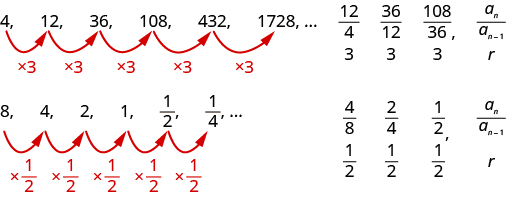
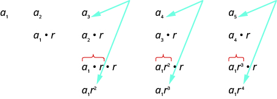
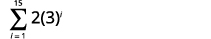
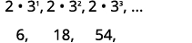
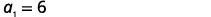
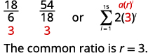
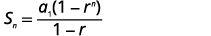
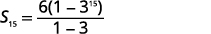
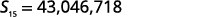

By the end of this section, you will be able to:
* Determine if a sequence is geometric
* Find the general term (nth term) of a geometric sequence
* Find the sum of the first
  <math xmlns="http://www.w3.org/1998/Math/MathML"><mi>n</mi></math>
  
  terms of a geometric sequence
* Find the sum of an infinite geometric series
* Apply geometric sequences and series in the real world

Before you get started, take this readiness quiz.**

1.  Simplify:
    <math xmlns="http://www.w3.org/1998/Math/MathML"><mrow><mfrac><mrow><mn>24</mn></mrow><mrow><mn>32</mn></mrow></mfrac><mo>.</mo></mrow></math>
    
    * * *
    {: data-type="newline"}
    
    If you missed this problem, review [\[link\]](/m63304#fs-id1167836620030).
2.  Evaluate: ⓐ
    <math xmlns="http://www.w3.org/1998/Math/MathML"><mrow><msup><mn>3</mn><mn>4</mn></msup></mrow></math>
    
    ⓑ
    <math xmlns="http://www.w3.org/1998/Math/MathML"><mrow><msup><mrow><mrow><mo>(</mo><mrow><mfrac><mn>1</mn><mn>2</mn></mfrac></mrow><mo>)</mo></mrow></mrow><mn>4</mn></msup><mo>.</mo></mrow></math>
    
    * * *
    {: data-type="newline"}
    
    If you missed this problem, review [\[link\]](/m63303#fs-id1167834536158).
3.  If
    <math xmlns="http://www.w3.org/1998/Math/MathML"><mrow><mi>f</mi><mrow><mo>(</mo><mi>x</mi><mo>)</mo></mrow><mo>=</mo><mn>4</mn><mo>·</mo><msup><mn>3</mn><mi>x</mi></msup><mo>,</mo></mrow></math>
    
    find ⓐ
    <math xmlns="http://www.w3.org/1998/Math/MathML"><mrow><mi>f</mi><mrow><mo>(</mo><mn>1</mn><mo>)</mo></mrow></mrow></math>
    
    ⓑ
    <math xmlns="http://www.w3.org/1998/Math/MathML"><mrow><mi>f</mi><mrow><mo>(</mo><mn>2</mn><mo>)</mo></mrow></mrow></math>
    
    ⓒ
    <math xmlns="http://www.w3.org/1998/Math/MathML"><mrow><mi>f</mi><mrow><mo>(</mo><mn>3</mn><mo>)</mo></mrow><mo>.</mo></mrow></math>
    
    * * *
    {: data-type="newline"}
    
    If you missed this problem, review [\[link\]](/m63324#fs-id1167829859398).
{: type="1"}

### Determine if a Sequence is Geometric

We are now ready to look at the second special type of sequence, the geometric sequence.

A sequence is called a **geometric sequence**{: data-type="term"} if the ratio between consecutive terms is always the same. The ratio between consecutive terms in a geometric sequence is *r*, the **common ratio**{: data-type="term"}, where *n* is greater than or equal to two.

Geometric Sequence

A **geometric sequence** is a sequence where the ratio between consecutive terms is always the same.

The ratio between consecutive terms, <math xmlns="http://www.w3.org/1998/Math/MathML"><mrow><mfrac><mrow><msub><mi>a</mi><mi>n</mi></msub></mrow><mrow><msub><mi>a</mi><mrow><mi>n</mi><mo>−</mo><mn>1</mn></mrow></msub></mrow></mfrac><mo>,</mo></mrow></math>

 is *r*, the **common ratio**. *n* is greater than or equal to two.

Consider these sequences.

    

Determine if each sequence is geometric. If so, indicate the common ratio.

ⓐ <math xmlns="http://www.w3.org/1998/Math/MathML"><mrow><mn>4</mn><mo>,</mo><mn>8</mn><mo>,</mo><mn>16</mn><mo>,</mo><mn>32</mn><mo>,</mo><mn>64</mn><mo>,</mo><mn>128</mn><mtext>,</mtext><mspace width="0.2em" /><mtext>…</mtext></mrow></math>

ⓑ <math xmlns="http://www.w3.org/1998/Math/MathML"><mrow><mn>−2</mn><mo>,</mo><mn>6</mn><mo>,</mo><mn>−12</mn><mo>,</mo><mn>36</mn><mo>,</mo><mn>−72</mn><mo>,</mo><mn>216</mn><mtext>,</mtext><mspace width="0.2em" /><mtext>…</mtext></mrow></math>

ⓒ <math xmlns="http://www.w3.org/1998/Math/MathML"><mrow><mn>27</mn><mo>,</mo><mn>9</mn><mo>,</mo><mn>3</mn><mo>,</mo><mn>1</mn><mo>,</mo><mfrac><mn>1</mn><mn>3</mn></mfrac><mo>,</mo><mfrac><mn>1</mn><mn>9</mn></mfrac><mtext>,</mtext><mspace width="0.2em" /><mtext>…</mtext></mrow></math>

To determine if the sequence is geometric, we find the ratio of the consecutive terms shown.

ⓐ* * *
{: data-type="newline"}

 <math xmlns="http://www.w3.org/1998/Math/MathML"><mrow><mtable><mtr><mtd columnalign="left"><mtable><mtr /><mtr /><mtr /><mtr /><mtr><mtd columnalign="left"><mtext>Find the ratio of</mtext></mtd></mtr><mtr><mtd columnalign="left"><mtext>the consecutive terms.</mtext></mtd></mtr></mtable></mtd><mtd /><mtd /><mtd columnalign="left"><mspace width="7em" /><mtable><mtr><mtd columnalign="center"><mn>4</mn><mo>,</mo></mtd><mtd /><mtd columnalign="center"><mn>8</mn><mo>,</mo></mtd><mtd /><mtd columnalign="center"><mn>16</mn><mo>,</mo></mtd><mtd /><mtd columnalign="center"><mn>32</mn><mo>,</mo></mtd><mtd /><mtd columnalign="center"><mn>64</mn><mo>,</mo></mtd><mtd /><mtd columnalign="center"><mn>128</mn><mo>,</mo><mtext>…</mtext></mtd></mtr><mtr /><mtr /> <mtr><mtd columnalign="center"><mfrac><mn>8</mn><mn>4</mn></mfrac></mtd><mtd /><mtd columnalign="center"><mfrac><mrow><mn>16</mn></mrow><mn>8</mn></mfrac></mtd><mtd /><mtd columnalign="center"><mfrac><mrow><mn>32</mn></mrow><mrow><mn>16</mn></mrow></mfrac></mtd><mtd /><mtd columnalign="center"><mfrac><mrow><mn>64</mn></mrow><mrow><mn>32</mn></mrow></mfrac></mtd><mtd /><mtd columnalign="center"><mfrac><mrow><mn>128</mn></mrow><mrow><mn>64</mn></mrow></mfrac></mtd><mtd /><mtd /></mtr> <mtr><mtd columnalign="center"><mn>2</mn></mtd><mtd /><mtd columnalign="center"><mn>2</mn></mtd><mtd /><mtd columnalign="center"><mn>2</mn></mtd><mtd /><mtd columnalign="center"><mn>2</mn></mtd><mtd /><mtd columnalign="center"><mn>2</mn></mtd><mtd /><mtd /></mtr></mtable></mtd></mtr><mtr /><mtr /> <mtr><mtd /><mtd /><mtd /><mtd columnalign="left"><mspace width="3em" /><mtext>The sequence is geometric. The common ratio is</mtext><mspace width="0.2em" /><mi>r</mi><mo>=</mo><mn>2</mn><mo>.</mo></mtd></mtr></mtable></mrow></math>

ⓑ* * *
{: data-type="newline"}

 <math xmlns="http://www.w3.org/1998/Math/MathML"><mrow><mtable><mtr><mtd columnalign="left"><mtable><mtr /><mtr /><mtr /><mtr /><mtr><mtd columnalign="left"><mtext>Find the ratio of</mtext></mtd></mtr><mtr><mtd columnalign="left"><mtext>the consecutive terms.</mtext></mtd></mtr></mtable></mtd><mtd /><mtd /><mtd columnalign="left"><mspace width="7em" /><mtable><mtr><mtd columnalign="center"><mn>−2</mn><mo>,</mo></mtd><mtd /><mtd columnalign="center"><mn>6</mn><mo>,</mo></mtd><mtd /><mtd columnalign="center"><mn>−12</mn><mo>,</mo></mtd><mtd /><mtd columnalign="center"><mn>36</mn><mo>,</mo></mtd><mtd /><mtd columnalign="center"><mn>−72</mn><mo>,</mo></mtd><mtd /><mtd columnalign="center"><mn>216</mn><mo>,</mo><mtext>…</mtext></mtd></mtr><mtr /><mtr /> <mtr><mtd columnalign="center"><mfrac><mrow><mn>6</mn></mrow><mrow><mn>−2</mn></mrow></mfrac></mtd><mtd /><mtd columnalign="center"><mfrac><mrow><mn>−12</mn></mrow><mrow><mn>6</mn></mrow></mfrac></mtd><mtd /><mtd columnalign="center"><mfrac><mrow><mn>36</mn></mrow><mrow><mn>−12</mn></mrow></mfrac></mtd><mtd /><mtd columnalign="center"><mfrac><mrow><mn>−72</mn></mrow><mrow><mn>36</mn></mrow></mfrac></mtd><mtd /><mtd columnalign="center"><mfrac><mrow><mn>216</mn></mrow><mrow><mn>−72</mn></mrow></mfrac></mtd></mtr> <mtr><mtd columnalign="center"><mn>−3</mn></mtd><mtd /><mtd columnalign="center"><mn>−2</mn></mtd><mtd /><mtd columnalign="center"><mn>−3</mn></mtd><mtd /><mtd columnalign="center"><mn>−2</mn></mtd><mtd /><mtd columnalign="center"><mn>−3</mn></mtd><mtd /><mtd /></mtr></mtable></mtd></mtr><mtr /><mtr /> <mtr><mtd /><mtd /><mtd /><mtd columnalign="left"><mspace width="3em" /><mtext>The sequence is not geometric. There is no common ratio.</mtext></mtd></mtr></mtable></mrow></math>

ⓒ* * *
{: data-type="newline"}

 <math xmlns="http://www.w3.org/1998/Math/MathML"><mrow><mtable><mtr><mtd /><mtd /><mtd /><mtd columnalign="left"><mspace width="9em" /><mn>27</mn><mo>,</mo><mn>9</mn><mo>,</mo><mn>3</mn><mo>,</mo><mn>1</mn><mo>,</mo><mfrac><mn>1</mn><mn>3</mn></mfrac><mo>,</mo><mfrac><mn>1</mn><mn>9</mn></mfrac><mtext>,</mtext><mspace width="0.2em" /><mtext>…</mtext></mtd></mtr><mtr /><mtr /> <mtr><mtd columnalign="left"><mtable><mtr><mtd columnalign="left"><mtext>Find the ratio of</mtext></mtd></mtr><mtr><mtd columnalign="left"><mtext>the consecutive terms.</mtext></mtd></mtr><mtr /><mtr /><mtr /><mtr /></mtable></mtd><mtd /><mtd /><mtd columnalign="left"><mspace width="9em" /><mtable><mtr><mtd columnalign="left"><mfrac><mn>9</mn><mrow><mn>27</mn></mrow></mfrac></mtd><mtd columnalign="left"><mfrac><mn>3</mn><mn>9</mn></mfrac></mtd><mtd columnalign="left"><mfrac><mn>1</mn><mn>3</mn></mfrac></mtd><mtd columnalign="left"><mfrac><mrow><mfrac><mn>1</mn><mn>3</mn></mfrac></mrow><mn>1</mn></mfrac></mtd><mtd columnalign="left"><mfrac><mrow><mfrac><mn>1</mn><mn>9</mn></mfrac></mrow><mrow><mfrac><mn>1</mn><mn>3</mn></mfrac></mrow></mfrac></mtd></mtr><mtr /><mtr /><mtr><mtd columnalign="left"><mfrac><mn>1</mn><mn>3</mn></mfrac></mtd><mtd columnalign="left"><mfrac><mn>1</mn><mn>3</mn></mfrac></mtd><mtd columnalign="left"><mfrac><mn>1</mn><mn>3</mn></mfrac></mtd><mtd columnalign="left"><mfrac><mn>1</mn><mn>3</mn></mfrac></mtd><mtd columnalign="left"><mfrac><mn>1</mn><mn>3</mn></mfrac></mtd></mtr></mtable></mtd></mtr><mtr /><mtr /><mtr><mtd /><mtd /><mtd /><mtd columnalign="left"><mspace width="3em" /><mtext>The sequence is geometric. The common ratio is</mtext><mspace width="0.2em" /><mi>r</mi><mo>=</mo><mfrac><mn>1</mn><mn>3</mn></mfrac><mo>.</mo></mtd></mtr></mtable></mrow></math>

Determine if each sequence is geometric. If so indicate the common ratio.

ⓐ <math xmlns="http://www.w3.org/1998/Math/MathML"><mrow><mn>7</mn><mo>,</mo><mn>21</mn><mo>,</mo><mn>63</mn><mo>,</mo><mn>189</mn><mo>,</mo><mn>567</mn><mo>,</mo><mn>1,701</mn><mtext>,</mtext><mspace width="0.2em" /><mtext>…</mtext></mrow></math>

ⓑ <math xmlns="http://www.w3.org/1998/Math/MathML"><mrow><mn>64</mn><mo>,</mo><mn>16</mn><mo>,</mo><mn>4</mn><mo>,</mo><mn>1</mn><mo>,</mo><mfrac><mn>1</mn><mn>4</mn></mfrac><mo>,</mo><mfrac><mn>1</mn><mrow><mn>16</mn></mrow></mfrac><mtext>,</mtext><mspace width="0.2em" /><mtext>…</mtext></mrow></math>

ⓒ <math xmlns="http://www.w3.org/1998/Math/MathML"><mrow><mn>2</mn><mo>,</mo><mn>4</mn><mo>,</mo><mn>12</mn><mo>,</mo><mn>48</mn><mo>,</mo><mn>240</mn><mo>,</mo><mn>1,440</mn><mtext>,</mtext><mspace width="0.2em" /><mtext>…</mtext></mrow></math>

ⓐ The sequence is geometric with common ratio <math xmlns="http://www.w3.org/1998/Math/MathML"><mrow><mi>r</mi><mo>=</mo><mn>3</mn><mo>.</mo></mrow></math>

 ⓑ The sequence is geometric with common ratio <math xmlns="http://www.w3.org/1998/Math/MathML"><mrow><mi>d</mi><mo>=</mo><mfrac><mn>1</mn><mn>4</mn></mfrac><mo>.</mo></mrow></math>

 ⓒ The sequence is not geometric. There is no common ratio.

Determine if each sequence is geometric. If so indicate the common ratio.

ⓐ <math xmlns="http://www.w3.org/1998/Math/MathML"><mrow><mn>−150</mn><mo>,</mo><mn>−30</mn><mo>,</mo><mn>−15</mn><mo>,</mo><mn>−5</mn><mo>,</mo><mo>−</mo><mfrac><mn>5</mn><mn>2</mn></mfrac><mo>,</mo><mn>0</mn><mtext>,</mtext><mspace width="0.2em" /><mtext>…</mtext></mrow></math>

ⓑ <math xmlns="http://www.w3.org/1998/Math/MathML"><mrow><mn>5</mn><mo>,</mo><mn>10</mn><mo>,</mo><mn>20</mn><mo>,</mo><mn>40</mn><mo>,</mo><mn>80</mn><mo>,</mo><mn>160</mn><mtext>,</mtext><mspace width="0.2em" /><mtext>…</mtext></mrow></math>

ⓒ <math xmlns="http://www.w3.org/1998/Math/MathML"><mrow><mn>8</mn><mo>,</mo><mn>4</mn><mo>,</mo><mn>2</mn><mo>,</mo><mn>1</mn><mo>,</mo><mfrac><mn>1</mn><mn>2</mn></mfrac><mo>,</mo><mfrac><mn>1</mn><mn>4</mn></mfrac><mtext>,</mtext><mspace width="0.2em" /><mtext>…</mtext></mrow></math>

ⓐ The sequence is not geometric. There is no common ratio. ⓑ The sequence is geometric with common ratio <math xmlns="http://www.w3.org/1998/Math/MathML"><mrow><mi>r</mi><mo>=</mo><mn>2</mn><mo>.</mo></mrow></math>

 ⓒ The sequence is geometric with common ratio <math xmlns="http://www.w3.org/1998/Math/MathML"><mrow><mi>r</mi><mo>=</mo><mfrac><mn>1</mn><mn>2</mn></mfrac><mo>.</mo></mrow></math>

If we know the first term, <math xmlns="http://www.w3.org/1998/Math/MathML"><mrow><msub><mi>a</mi><mn>1</mn></msub><mo>,</mo></mrow></math>

 and the common ratio, *r*, we can list a finite number of terms of the sequence.

Write the first five terms of the sequence where the first term is 3 and the common ratio is <math xmlns="http://www.w3.org/1998/Math/MathML"><mrow><mi>r</mi><mo>=</mo><mn>−2</mn><mo>.</mo></mrow></math>

We start with the first term and multiply it by the common ratio. Then we multiply that result by the common ratio to get the next term, and so on.

<math xmlns="http://www.w3.org/1998/Math/MathML"><mrow><mtable><mtr><mtd columnalign="center"><msub><mi>a</mi><mn>1</mn></msub></mtd><mtd /><mtd /><mtd columnalign="center"><msub><mi>a</mi><mn>2</mn></msub></mtd><mtd /><mtd /><mtd columnalign="center"><msub><mi>a</mi><mn>3</mn></msub></mtd><mtd /><mtd /><mtd columnalign="center"><msub><mi>a</mi><mn>4</mn></msub></mtd><mtd /><mtd /><mtd columnalign="center"><msub><mi>a</mi><mn>5</mn></msub></mtd></mtr> <mtr><mtd columnalign="center"><mn>3</mn></mtd><mtd /><mtd /><mtd columnalign="center"><mn>3</mn><mo>·</mo><mrow><mo>(</mo><mrow><mn>−2</mn></mrow><mo>)</mo></mrow></mtd><mtd /><mtd /><mtd columnalign="center"><mo /><mn>−6</mn><mo>·</mo><mrow><mo>(</mo><mrow><mn>−2</mn></mrow><mo>)</mo></mrow></mtd><mtd /><mtd /><mtd columnalign="center"><mo /><mn>12</mn><mo>·</mo><mrow><mo>(</mo><mrow><mn>−2</mn></mrow><mo>)</mo></mrow></mtd><mtd /><mtd /><mtd columnalign="center"><mo /><mn>−24</mn><mo>·</mo><mrow><mo>(</mo><mrow><mn>−2</mn></mrow><mo>)</mo></mrow></mtd></mtr> <mtr><mtd /><mtd /><mtd /><mtd columnalign="center"><mn>−6</mn></mtd><mtd /><mtd /><mtd columnalign="center"><mn>12</mn></mtd><mtd /><mtd /><mtd columnalign="center"><mn>−24</mn></mtd><mtd /><mtd /><mtd columnalign="center"><mn>48</mn></mtd></mtr></mtable></mrow></math>

The sequence is <math xmlns="http://www.w3.org/1998/Math/MathML"><mrow><mn>3</mn><mo>,</mo><mn>−6</mn><mo>,</mo><mn>12</mn><mo>,</mo><mn>−24</mn><mo>,</mo><mn>48</mn><mtext>,</mtext><mspace width="0.2em" /><mtext>…</mtext></mrow></math>

Write the first five terms of the sequence where the first term is 7 and the common ratio is <math xmlns="http://www.w3.org/1998/Math/MathML"><mrow><mi>r</mi><mo>=</mo><mn>−3</mn><mo>.</mo></mrow></math>

<math xmlns="http://www.w3.org/1998/Math/MathML"><mrow><mn>7</mn><mo>,</mo><mn>−21</mn><mo>,</mo><mn>63</mn><mo>,</mo><mn>−189</mn><mo>,</mo><mn>567</mn></mrow></math>

Write the first five terms of the sequence where the first term is 6 and the common ratio is <math xmlns="http://www.w3.org/1998/Math/MathML"><mrow><mi>r</mi><mo>=</mo><mn>−4</mn><mo>.</mo></mrow></math>

<math xmlns="http://www.w3.org/1998/Math/MathML"><mrow><mn>6</mn><mo>,</mo><mn>−24</mn><mo>,</mo><mn>96</mn><mo>,</mo><mn>−384</mn><mo>,</mo><mn>1536</mn></mrow></math>

### Find the General Term (*n*th Term) of a Geometric Sequence

Just as we found a formula for the general term of a sequence and an arithmetic sequence, we can also find a formula for the general term of a geometric sequence.

Let’s write the first few terms of the sequence where the first term is <math xmlns="http://www.w3.org/1998/Math/MathML"><mrow><msub><mi>a</mi><mn>1</mn></msub></mrow></math>

 and the common ratio is *r*. We will then look for a pattern.

    As we look for a pattern in the five terms above, we see that each of the terms starts with <math xmlns="http://www.w3.org/1998/Math/MathML"><mrow><msub><mi>a</mi><mn>1</mn></msub><mo>.</mo></mrow></math>

The first term, <math xmlns="http://www.w3.org/1998/Math/MathML"><mrow><msub><mi>a</mi><mn>1</mn></msub><mo>,</mo></mrow></math>

 is not multiplied by any *r*. In the second term, the <math xmlns="http://www.w3.org/1998/Math/MathML"><mrow><msub><mi>a</mi><mn>1</mn></msub></mrow></math>

 is multiplied by *r*. In the third term, the <math xmlns="http://www.w3.org/1998/Math/MathML"><mrow><msub><mi>a</mi><mn>1</mn></msub></mrow></math>

 is multiplied by *r* two times (<math xmlns="http://www.w3.org/1998/Math/MathML"><mrow><mi>r</mi><mo>·</mo><mi>r</mi></mrow></math>

 or <math xmlns="http://www.w3.org/1998/Math/MathML"><mrow><msup><mi>r</mi><mn>2</mn></msup></mrow></math>

). In the fourth term, the <math xmlns="http://www.w3.org/1998/Math/MathML"><mrow><msub><mi>a</mi><mn>1</mn></msub></mrow></math>

 is multiplied by *r* three times (<math xmlns="http://www.w3.org/1998/Math/MathML"><mrow><mi>r</mi><mo>·</mo><mi>r</mi><mo>·</mo><mi>r</mi></mrow></math>

 or <math xmlns="http://www.w3.org/1998/Math/MathML"><mrow><msup><mi>r</mi><mn>3</mn></msup></mrow></math>

) and in the fifth term, the <math xmlns="http://www.w3.org/1998/Math/MathML"><mrow><msub><mi>a</mi><mn>1</mn></msub></mrow></math>

 is multiplied by *r* four times. In each term, the number of times <math xmlns="http://www.w3.org/1998/Math/MathML"><mrow><msub><mi>a</mi><mn>1</mn></msub></mrow></math>

 is multiplied by *r* is one less than the number of the term. This leads us to the following

<math xmlns="http://www.w3.org/1998/Math/MathML"><mrow><msub><mi>a</mi><mi>n</mi></msub><mo>=</mo><msub><mi>a</mi><mn>1</mn></msub><msup><mi>r</mi><mrow><mi>n</mi><mo>−</mo><mn>1</mn></mrow></msup></mrow></math>

General Term (*n*th term) of a Geometric Sequence

The general term of a geometric sequence with first term <math xmlns="http://www.w3.org/1998/Math/MathML"><mrow><msub><mi>a</mi><mn>1</mn></msub></mrow></math>

 and the common ratio *r* is

<math xmlns="http://www.w3.org/1998/Math/MathML"><mrow><msub><mi>a</mi><mi>n</mi></msub><mo>=</mo><msub><mi>a</mi><mn>1</mn></msub><msup><mi>r</mi><mrow><mi>n</mi><mo>−</mo><mn>1</mn></mrow></msup></mrow></math>

We will use this formula in the next example to find the fourteenth term of a sequence.

Find the fourteenth term of a sequence where the first term is 64 and the common ratio is <math xmlns="http://www.w3.org/1998/Math/MathML"><mrow><mi>r</mi><mo>=</mo><mfrac><mn>1</mn><mn>2</mn></mfrac><mo>.</mo></mrow></math>

<math xmlns="http://www.w3.org/1998/Math/MathML"><mrow><mtable><mtr><mtd columnalign="left"><mtext>To find the fourteenth term,</mtext><mspace width="0.2em" /><msub><mi>a</mi><mrow><mn>14</mn></mrow></msub><mo>,</mo></mtd><mtd /><mtd /><mtd columnalign="left"><mspace width="4em" /><msub><mi>a</mi><mi>n</mi></msub><mo>=</mo><msub><mi>a</mi><mn>1</mn></msub><msup><mi>r</mi><mrow><mi>n</mi><mo>−</mo><mn>1</mn></mrow></msup></mtd></mtr> <mtr><mtd columnalign="left"><mtext>use the formula with</mtext><mspace width="0.2em" /><msub><mi>a</mi><mn>1</mn></msub><mo>=</mo><mn>64</mn><mspace width="0.2em" /><mtext>and</mtext><mspace width="0.2em" /><mi>r</mi><mo>=</mo><mfrac><mn>1</mn><mn>2</mn></mfrac><mo>.</mo></mtd><mtd /><mtd /><mtd /></mtr> <mtr><mtd columnalign="left"><mtext>Substitute in the values.</mtext></mtd><mtd /><mtd /><mtd columnalign="left"><mspace width="4em" /><msub><mi>a</mi><mrow><mn>14</mn></mrow></msub><mo>=</mo><mn>64</mn><msup><mrow><mrow><mo>(</mo><mrow><mfrac><mn>1</mn><mn>2</mn></mfrac></mrow><mo>)</mo></mrow></mrow><mrow><mn>14</mn><mo>−</mo><mn>1</mn></mrow></msup></mtd></mtr><mtr /><mtr /> <mtr><mtd columnalign="left"><mtext>Simplify.</mtext></mtd><mtd /><mtd /><mtd columnalign="left"><mspace width="4em" /><msub><mi>a</mi><mrow><mn>14</mn></mrow></msub><mo>=</mo><mn>64</mn><msup><mrow><mrow><mo>(</mo><mrow><mfrac><mn>1</mn><mn>2</mn></mfrac></mrow><mo>)</mo></mrow></mrow><mrow><mn>13</mn></mrow></msup></mtd></mtr><mtr /><mtr /> <mtr><mtd /><mtd /><mtd /><mtd columnalign="left"><mspace width="4em" /><msub><mi>a</mi><mrow><mn>14</mn></mrow></msub><mo>=</mo><mfrac><mn>1</mn><mrow><mn>128</mn></mrow></mfrac></mtd></mtr></mtable></mrow></math>

Find the thirteenth term of a sequence where the first term is 81 and the common ratio is <math xmlns="http://www.w3.org/1998/Math/MathML"><mrow><mi>r</mi><mo>=</mo><mfrac><mn>1</mn><mn>3</mn></mfrac><mo>.</mo></mrow></math>

<math xmlns="http://www.w3.org/1998/Math/MathML"><mrow><mfrac><mn>1</mn><mrow><mn>6,561</mn></mrow></mfrac></mrow></math>

Find the twelfth term of a sequence where the first term is 256 and the common ratio is <math xmlns="http://www.w3.org/1998/Math/MathML"><mrow><mi>r</mi><mo>=</mo><mfrac><mn>1</mn><mn>4</mn></mfrac><mo>.</mo></mrow></math>

<math xmlns="http://www.w3.org/1998/Math/MathML"><mrow><mfrac><mn>1</mn><mrow><mn>16,384</mn></mrow></mfrac></mrow></math>

Sometimes we do not know the common ratio and we must use the given information to find it before we find the requested term.

Find the twelfth term of the sequence 3, 6, 12, 24, 48, 96, … Find the general term for the sequence.

To find the twelfth term, we use the formula, <math xmlns="http://www.w3.org/1998/Math/MathML"><mrow><msub><mi>a</mi><mi>n</mi></msub><mo>=</mo><msub><mi>a</mi><mn>1</mn></msub><msup><mi>r</mi><mrow><mi>n</mi><mo>−</mo><mn>1</mn></mrow></msup><mo>,</mo></mrow></math>

 and so we need to first determine <math xmlns="http://www.w3.org/1998/Math/MathML"><mrow><msub><mi>a</mi><mn>1</mn></msub></mrow></math>

 and the common ratio *r*.

<math xmlns="http://www.w3.org/1998/Math/MathML"><mrow><mtable><mtr><mtd /><mtd /><mtd /><mtd columnalign="left"><mspace width="3em" /><mn>3</mn><mo>,</mo><mn>6</mn><mo>,</mo><mn>12</mn><mo>,</mo><mn>24</mn><mo>,</mo><mn>48</mn><mo>,</mo><mn>96</mn><mtext>,</mtext><mspace width="0.2em" /><mtext>…</mtext></mtd></mtr> <mtr><mtd columnalign="left"><mtext>The first term is three.</mtext></mtd><mtd /><mtd /><mtd columnalign="left"><mspace width="3em" /><msub><mi>a</mi><mn>1</mn></msub><mo>=</mo><mn>3</mn></mtd></mtr><mtr /><mtr /> <mtr><mtd columnalign="left"><mtext>Find the common ratio.</mtext></mtd><mtd /><mtd /><mtd columnalign="left"><mspace width="3em" /><mtable><mtr><mtd columnalign="left"><mfrac><mn>6</mn><mn>3</mn></mfrac></mtd><mtd columnalign="left"><mfrac><mrow><mn>12</mn></mrow><mn>6</mn></mfrac></mtd><mtd columnalign="left"><mfrac><mrow><mn>24</mn></mrow><mrow><mn>12</mn></mrow></mfrac></mtd><mtd columnalign="left"><mfrac><mrow><mn>48</mn></mrow><mrow><mn>24</mn></mrow></mfrac></mtd><mtd columnalign="left"><mfrac><mrow><mn>96</mn></mrow><mrow><mn>48</mn></mrow></mfrac></mtd></mtr><mtr><mtd columnalign="left"><mn>2</mn></mtd><mtd columnalign="left"><mn>2</mn></mtd><mtd columnalign="left"><mn>2</mn></mtd><mtd columnalign="left"><mn>2</mn></mtd><mtd columnalign="left"><mn>2</mn></mtd></mtr></mtable></mtd></mtr> <mtr><mtd /><mtd /><mtd /><mtd columnalign="left"><mspace width="3em" /><mtext>The common ratio is</mtext><mspace width="0.2em" /><mi>r</mi><mo>=</mo><mn>2</mn><mo>.</mo></mtd></mtr><mtr /><mtr /> <mtr><mtd columnalign="left"><mtext>To find the twelfth term,</mtext><mspace width="0.2em" /><msub><mi>a</mi><mrow><mn>12</mn></mrow></msub><mo>,</mo><mspace width="0.2em" /><mtext>use the</mtext></mtd><mtd /><mtd /><mtd columnalign="left"><mspace width="3em" /><msub><mi>a</mi><mi>n</mi></msub><mo>=</mo><msub><mi>a</mi><mn>1</mn></msub><msup><mi>r</mi><mrow><mi>n</mi><mo>−</mo><mn>1</mn></mrow></msup></mtd></mtr> <mtr><mtd columnalign="left"><mtext>formula with</mtext><mspace width="0.2em" /><msub><mi>a</mi><mn>1</mn></msub><mo>=</mo><mn>3</mn><mspace width="0.2em" /><mtext>and</mtext><mspace width="0.2em" /><mi>r</mi><mo>=</mo><mn>2</mn><mo>.</mo></mtd><mtd /><mtd /><mtd /></mtr> <mtr><mtd columnalign="left"><mtext>Substitute in the values.</mtext></mtd><mtd /><mtd /><mtd columnalign="left"><mspace width="3em" /><msub><mi>a</mi><mrow><mn>12</mn></mrow></msub><mo>=</mo><mn>3</mn><mo>·</mo><msup><mn>2</mn><mrow><mn>12</mn><mo>−</mo><mn>1</mn></mrow></msup></mtd></mtr> <mtr><mtd columnalign="left"><mtext>Simplify.</mtext></mtd><mtd /><mtd /><mtd columnalign="left"><mspace width="3em" /><msub><mi>a</mi><mrow><mn>12</mn></mrow></msub><mo>=</mo><mn>3</mn><mo>·</mo><msup><mn>2</mn><mrow><mn>11</mn></mrow></msup></mtd></mtr> <mtr><mtd /><mtd /><mtd /><mtd columnalign="left"><mspace width="3em" /><msub><mi>a</mi><mrow><mn>12</mn></mrow></msub><mo>=</mo><mn>6,144</mn></mtd></mtr><mtr /><mtr /> <mtr><mtd columnalign="left"><mtext>Find the general term.</mtext></mtd><mtd /><mtd /><mtd columnalign="left"><mspace width="3em" /><msub><mi>a</mi><mi>n</mi></msub><mo>=</mo><msub><mi>a</mi><mn>1</mn></msub><msup><mi>r</mi><mrow><mi>n</mi><mo>−</mo><mn>1</mn></mrow></msup></mtd></mtr> <mtr><mtd columnalign="left"><mtext>We use the formula with</mtext><mspace width="0.2em" /><msub><mi>a</mi><mn>1</mn></msub><mo>=</mo><mn>3</mn><mspace width="0.2em" /><mtext>and</mtext><mspace width="0.2em" /><mi>r</mi><mo>=</mo><mn>2</mn><mo>.</mo></mtd><mtd /><mtd /><mtd columnalign="left"><mspace width="3em" /><msub><mi>a</mi><mi>n</mi></msub><mo>=</mo><mn>3</mn><msup><mrow><mrow><mo>(</mo><mrow><mn>2</mn></mrow><mo>)</mo></mrow></mrow><mrow><mi>n</mi><mo>−</mo><mn>1</mn></mrow></msup></mtd></mtr></mtable></mrow></math>

Find the ninth term of the sequence 6, 18, 54, 162, 486, 1,458, … Then find the general term for the sequence.

<math xmlns="http://www.w3.org/1998/Math/MathML"><mrow><msub><mi>a</mi><mn>9</mn></msub><mo>=</mo><mn>39,366</mn><mo>.</mo></mrow></math>

 The general term is <math xmlns="http://www.w3.org/1998/Math/MathML"><mrow><msub><mi>a</mi><mi>n</mi></msub><mo>=</mo><mn>6</mn><msup><mrow><mo stretchy="false">(</mo><mn>3</mn><mo stretchy="false">)</mo></mrow><mrow><mi>n</mi><mo>−</mo><mn>1</mn></mrow></msup><mo>.</mo></mrow></math>

Find the eleventh term of the sequence 7, 14, 28, 56, 112, 224, … Then find the general term for the sequence.

<math xmlns="http://www.w3.org/1998/Math/MathML"><mrow><msub><mi>a</mi><mrow><mn>11</mn></mrow></msub><mo>=</mo><mn>7,168</mn><mo>.</mo></mrow></math>

 The general term is <math xmlns="http://www.w3.org/1998/Math/MathML"><mrow><msub><mi>a</mi><mi>n</mi></msub><mo>=</mo><mn>7</mn><msup><mrow><mo stretchy="false">(</mo><mn>2</mn><mo stretchy="false">)</mo></mrow><mrow><mi>n</mi><mo>−</mo><mn>1</mn></mrow></msup><mo>.</mo></mrow></math>

### Find the Sum of the First *n* Terms of a Geometric Sequence

We found the sum of both general sequences and arithmetic sequence. We will now do the same for geometric sequences. The sum,<math xmlns="http://www.w3.org/1998/Math/MathML"><mrow><msub><mi>S</mi><mi>n</mi></msub><mo>,</mo></mrow></math>

 of the first *n* terms of a geometric sequence is written as <math xmlns="http://www.w3.org/1998/Math/MathML"><mrow><msub><mi>S</mi><mi>n</mi></msub><mo>=</mo><msub><mi>a</mi><mn>1</mn></msub><mo>+</mo><msub><mi>a</mi><mn>2</mn></msub><mo>+</mo><msub><mi>a</mi><mn>3</mn></msub><mo>+</mo><mn>...</mn><mo>+</mo><msub><mi>a</mi><mi>n</mi></msub><mo>.</mo></mrow></math>

 We can write this sum by starting with the first term, <math xmlns="http://www.w3.org/1998/Math/MathML"><mrow><msub><mi>a</mi><mn>1</mn></msub><mo>,</mo></mrow></math>

 and keep multiplying by *r* to get the next term as:

<math xmlns="http://www.w3.org/1998/Math/MathML"><mrow><msub><mi>S</mi><mi>n</mi></msub><mo>=</mo><msub><mi>a</mi><mn>1</mn></msub><mo>+</mo><msub><mi>a</mi><mn>1</mn></msub><mi>r</mi><mo>+</mo><msub><mi>a</mi><mn>1</mn></msub><msup><mi>r</mi><mn>2</mn></msup><mo>+</mo><mn>...</mn><mo>+</mo><msub><mi>a</mi><mn>1</mn></msub><msup><mi>r</mi><mrow><mi>n</mi><mo>−</mo><mn>1</mn></mrow></msup></mrow></math>

Let’s also multiply both sides of the equation by *r*.

<math xmlns="http://www.w3.org/1998/Math/MathML"><mrow><mi>r</mi><msub><mi>S</mi><mi>n</mi></msub><mo>=</mo><msub><mi>a</mi><mn>1</mn></msub><mi>r</mi><mo>+</mo><msub><mi>a</mi><mn>1</mn></msub><msup><mi>r</mi><mn>2</mn></msup><mo>+</mo><msub><mi>a</mi><mn>1</mn></msub><msup><mi>r</mi><mn>3</mn></msup><mo>+</mo><mn>...</mn><mo>+</mo><msub><mi>a</mi><mn>1</mn></msub><msup><mi>r</mi><mi>n</mi></msup></mrow></math>

Next, we subtract these equations. We will see that when we subtract, all but the first term of the top equation and the last term of the bottom equation subtract to zero.

<math xmlns="http://www.w3.org/1998/Math/MathML"><mrow><mtable><mtr><mtd /><mtd /><mtd /><mtd columnalign="center"><mtable><mtr><mtd columnalign="left"><munder accentunder="true"><mrow><mtable><mtr><mtd columnalign="right"><mspace width="2.2em" /><msub><mi>S</mi><mi>n</mi></msub></mtd><mtd columnalign="left"><mo>=</mo></mtd><mtd columnalign="left"><msub><mi>a</mi><mn>1</mn></msub><mo>+</mo><msub><mi>a</mi><mn>1</mn></msub><mi>r</mi><mo>+</mo><msub><mi>a</mi><mn>1</mn></msub><msup><mi>r</mi><mn>2</mn></msup><mo>+</mo><msub><mi>a</mi><mn>1</mn></msub><msup><mi>r</mi><mn>3</mn></msup><mo>+</mo><mo>…</mo><mo>+</mo><msub><mi>a</mi><mn>1</mn></msub><msup><mi>r</mi><mrow><mi>n</mi><mo>−</mo><mn>1</mn></mrow></msup></mtd></mtr><mtr><mtd columnalign="right"><mspace width="2.2em" /><mi>r</mi><msub><mi>S</mi><mi>n</mi></msub></mtd><mtd columnalign="left"><mo>=</mo></mtd><mtd columnalign="left"><mspace width="2.1em" /><msub><mi>a</mi><mn>1</mn></msub><mi>r</mi><mo>+</mo><msub><mi>a</mi><mn>1</mn></msub><msup><mi>r</mi><mn>2</mn></msup><mo>+</mo><msub><mi>a</mi><mn>1</mn></msub><msup><mi>r</mi><mn>3</mn></msup><mo>+</mo><mo>…</mo><mo>+</mo><msub><mi>a</mi><mn>1</mn></msub><msup><mi>r</mi><mrow><mi>n</mi><mo>−</mo><mn>1</mn></mrow></msup><mo>+</mo><msub><mi>a</mi><mn>1</mn></msub><msup><mi>r</mi><mi>n</mi></msup></mtd></mtr></mtable></mrow><mtext>\_\_\_\_\_\_\_\_\_\_\_\_\_\_\_\_\_\_\_\_\_\_\_\_\_\_\_\_\_\_\_\_\_\_\_\_\_\_\_\_\_\_\_\_\_\_\_\_\_\_\_\_</mtext></munder></mtd></mtr><mtr /><mtr><mtd columnalign="left"><msub><mi>S</mi><mi>n</mi></msub><mo>−</mo><mi>r</mi><msub><mi>S</mi><mi>n</mi></msub><mspace width="0.5em" /><mo>=</mo><mspace width="0.5em" /><msub><mi>a</mi><mn>1</mn></msub><mspace width="16.2em" /><msub><mtext mathvariant="italic">−a</mtext><mn>1</mn></msub><msup><mi>r</mi><mi>n</mi></msup></mtd></mtr></mtable></mtd></mtr><mtr /><mtr /><mtr><mtd columnalign="left"><mtext>We factor both sides.</mtext></mtd><mtd /><mtd /><mtd columnalign="center"><msub><mi>S</mi><mi>n</mi></msub><mrow><mo>(</mo><mrow><mn>1</mn><mo>−</mo><mi>r</mi></mrow><mo>)</mo></mrow><mo>=</mo><msub><mi>a</mi><mn>1</mn></msub><mrow><mo>(</mo><mrow><mn>1</mn><mo>−</mo><msup><mi>r</mi><mi>n</mi></msup></mrow><mo>)</mo></mrow></mtd></mtr><mtr /><mtr /> <mtr><mtd columnalign="left"><mtable><mtr><mtd columnalign="left"><mtext>To obtain the formula for</mtext><mspace width="0.2em" /><msub><mi>S</mi><mi>n</mi></msub><mo>,</mo></mtd></mtr> <mtr><mtd columnalign="left"><mtext>divide both sides by</mtext><mspace width="0.2em" /><mo stretchy="false">(</mo><mn>1</mn><mo>−</mo><mi>r</mi><mo stretchy="false">)</mo><mo>.</mo></mtd></mtr></mtable></mtd><mtd /><mtd /><mtd columnalign="center"><mspace width="2.7em" /><msub><mi>S</mi><mi>n</mi></msub><mo>=</mo><mfrac><mrow><msub><mi>a</mi><mn>1</mn></msub><mrow><mo>(</mo><mrow><mn>1</mn><mo>−</mo><msup><mi>r</mi><mi>n</mi></msup></mrow><mo>)</mo></mrow></mrow><mrow><mn>1</mn><mo>−</mo><mi>r</mi></mrow></mfrac></mtd></mtr></mtable></mrow></math>

Sum of the First *n* Terms of a Geometric Series

The sum, <math xmlns="http://www.w3.org/1998/Math/MathML"><mrow><msub><mi>S</mi><mi>n</mi></msub><mo>,</mo></mrow></math>

 of the first *n* terms of a geometric sequence is

<math xmlns="http://www.w3.org/1998/Math/MathML"><mrow><msub><mi>S</mi><mi>n</mi></msub><mo>=</mo><mfrac><mrow><msub><mi>a</mi><mn>1</mn></msub><mrow><mo>(</mo><mrow><mn>1</mn><mo>−</mo><msup><mi>r</mi><mi>n</mi></msup></mrow><mo>)</mo></mrow></mrow><mrow><mn>1</mn><mo>−</mo><mi>r</mi></mrow></mfrac></mrow></math>

where <math xmlns="http://www.w3.org/1998/Math/MathML"><mrow><msub><mi>a</mi><mn>1</mn></msub></mrow></math>

 is the first term and *r* is the common ratio, and *r* is not equal to one.

We apply this formula in the next example where the first few terms of the sequence are given. Notice the sum of a geometric sequence typically gets very large when the common ratio is greater than one.

Find the sum of the first 20 terms of the geometric sequence 7, 14, 28, 56, 112, 224, …

To find the sum, we will use the formula <math xmlns="http://www.w3.org/1998/Math/MathML"><mrow><msub><mi>S</mi><mi>n</mi></msub><mo>=</mo><mfrac><mrow><msub><mi>a</mi><mn>1</mn></msub><mrow><mo>(</mo><mrow><mn>1</mn><mo>−</mo><msup><mi>r</mi><mi>n</mi></msup></mrow><mo>)</mo></mrow></mrow><mrow><mn>1</mn><mo>−</mo><mi>r</mi></mrow></mfrac><mo>.</mo></mrow></math>

 We know <math xmlns="http://www.w3.org/1998/Math/MathML"><mrow><msub><mi>a</mi><mn>1</mn></msub><mo>=</mo><mn>7</mn><mo>,</mo></mrow></math>

<math xmlns="http://www.w3.org/1998/Math/MathML"><mrow><mi>r</mi><mo>=</mo><mn>2</mn><mo>,</mo></mrow></math>

 and <math xmlns="http://www.w3.org/1998/Math/MathML"><mrow><mi>n</mi><mo>=</mo><mn>20</mn><mo>.</mo></mrow></math>

<math xmlns="http://www.w3.org/1998/Math/MathML"><mrow><mtable><mtr><mtd columnalign="left"><mtable><mtr><mtd columnalign="left"><mtext>Knowing</mtext><mspace width="0.2em" /><msub><mi>a</mi><mn>1</mn></msub><mo>=</mo><mn>7</mn><mo>,</mo><mi>r</mi><mo>=</mo><mn>2</mn><mo>,</mo><mspace width="0.2em" /><mtext>and</mtext><mspace width="0.2em" /><mi>n</mi><mo>=</mo><mn>20</mn><mo>,</mo></mtd></mtr><mtr><mtd columnalign="left"><mtext>use the sum formula.</mtext></mtd></mtr></mtable></mtd><mtd /><mtd /><mtd columnalign="left"><mspace width="4em" /><msub><mi>S</mi><mi>n</mi></msub><mo>=</mo><mfrac><mrow><msub><mi>a</mi><mn>1</mn></msub><mrow><mo>(</mo><mrow><mn>1</mn><mo>−</mo><msup><mi>r</mi><mi>n</mi></msup></mrow><mo>)</mo></mrow></mrow><mrow><mn>1</mn><mo>−</mo><mi>r</mi></mrow></mfrac></mtd></mtr> <mtr><mtd columnalign="left"><mtext>Substitute in the values.</mtext></mtd><mtd /><mtd /><mtd columnalign="left"><mspace width="4em" /><msub><mi>S</mi><mrow><mn>20</mn></mrow></msub><mo>=</mo><mfrac><mrow><mn>7</mn><mrow><mo>(</mo><mrow><mn>1</mn><mo>−</mo><msup><mn>2</mn><mrow><mn>20</mn></mrow></msup></mrow><mo>)</mo></mrow></mrow><mrow><mn>1</mn><mo>−</mo><mn>2</mn></mrow></mfrac></mtd></mtr> <mtr><mtd columnalign="left"><mtext>Simplify.</mtext></mtd><mtd /><mtd /><mtd columnalign="left"><mspace width="4em" /><msub><mi>S</mi><mrow><mn>20</mn></mrow></msub><mo>=</mo><mn>7,340,025</mn></mtd></mtr></mtable></mrow></math>

Find the sum of the first 20 terms of the geometric sequence 3, 6, 12, 24, 48, 96, …

<math xmlns="http://www.w3.org/1998/Math/MathML"><mrow><mn>3,145,725</mn></mrow></math>

Find the sum of the first 20 terms of the geometric sequence 6, 18, 54, 162, 486, 1,458, …

<math xmlns="http://www.w3.org/1998/Math/MathML"><mrow><mn>10,460,353,200</mn></mrow></math>

In the next example, we are given the sum in summation notation. While adding all the terms might be possible, most often it is easiest to use the formula to find the sum of the first *n* terms.

To use the formula, we need *r*. We can find it by writing out the first few terms of the sequence and find their ratio. Another option is to realize that in summation notation, a sequence is written in the form <math xmlns="http://www.w3.org/1998/Math/MathML"><mrow><mstyle displaystyle="true"><munderover><mo>∑</mo><mrow><mi>i</mi><mo>=</mo><mn>1</mn></mrow><mi>k</mi></munderover><mrow><mi>a</mi><msup><mrow><mrow><mo>(</mo><mi>r</mi><mo>)</mo></mrow></mrow><mi>i</mi></msup></mrow></mstyle><mo>,</mo></mrow></math>

 where *r* is the common ratio.

Find the sum: <math xmlns="http://www.w3.org/1998/Math/MathML"><mrow><mstyle displaystyle="true"><munderover><mo>∑</mo><mrow><mi>i</mi><mo>=</mo><mn>1</mn></mrow><mrow><mn>15</mn></mrow></munderover><mrow><mn>2</mn><msup><mrow><mrow><mo>(</mo><mn>3</mn><mo>)</mo></mrow></mrow><mi>i</mi></msup></mrow></mstyle><mo>.</mo></mrow></math>

To find the sum, we will use the formula <math xmlns="http://www.w3.org/1998/Math/MathML"><mrow><msub><mi>S</mi><mi>n</mi></msub><mo>=</mo><mfrac><mrow><msub><mi>a</mi><mn>1</mn></msub><mrow><mo>(</mo><mrow><mn>1</mn><mo>−</mo><msup><mi>r</mi><mi>n</mi></msup></mrow><mo>)</mo></mrow></mrow><mrow><mn>1</mn><mo>−</mo><mi>r</mi></mrow></mfrac><mo>,</mo></mrow></math>

 which requires <math xmlns="http://www.w3.org/1998/Math/MathML"><mrow><msub><mi>a</mi><mn>1</mn></msub></mrow></math>

 and *r*. We will write out a few of the terms, so we can get the needed information.

<table summary="To find the sum of 2 times 3 to the power of i from 1 to 15, we write out the first few terms as 2 times g times 3 to the power of 1, 2 times g times 3 to the power of 2, 2 times g times 3 to the power of 3, ellipsis, 6, 18, 54. Next, identify a which equals 6. Then find the common ratio of r equals 3, by dividing 18 by 6, 54 divided by 18 or the sum of 2 times 3 i from i equals 1 to 15. Knowing that a equals 6 and r equals 3 and n equals 15, we use the sum formula of s sub n equals a sub 1 times 1 minus r to the power of n divided by 1 minus r. Next we substitute the values to get s sub 15 times 6 times 1 minus 3 to the power of 15 divided by 1 minus 3, and simplify to s sub 15 equals 43,046,718." class="unnumbered unstyled" data-label=""><tbody>
<tr>
<td />
<td data-align="left">

</td>
</tr>
<tr>
<td data-valign="top" data-align="left">Write out the first few terms.</td>
<td data-align="left">

</td>
</tr>
<tr valign="top">
<td data-valign="top" data-align="left">Identify <math xmlns="http://www.w3.org/1998/Math/MathML"><mrow><msub><mi>a</mi><mn>1</mn></msub></mrow></math>.</td>
<td data-valign="top" data-align="left">

</td>
</tr>
<tr valign="top">
<td data-valign="top" data-align="left">
Find the common ratio.</td>
<td data-valign="top" data-align="left">

</td>
</tr>
<tr valign="top">
<td data-valign="top" data-align="left">
Knowing <math xmlns="http://www.w3.org/1998/Math/MathML"><mrow><msub><mi>a</mi><mn>1</mn></msub><mo>=</mo><mn>6</mn><mo>,</mo></mrow></math><math xmlns="http://www.w3.org/1998/Math/MathML"><mrow><mi>r</mi><mo>=</mo><mn>3</mn><mo>,</mo></mrow></math> and <math xmlns="http://www.w3.org/1998/Math/MathML"><mrow><mi>n</mi><mo>=</mo><mn>15</mn><mo>,</mo></mrow></math>
use the sum formula.</td>
<td data-valign="top" data-align="left">

</td>
</tr>
<tr valign="top">
<td data-valign="top" data-align="left">Substitute in the values.</td>
<td data-valign="top" data-align="left">

</td>
</tr>
<tr valign="top">
<td data-valign="top" data-align="left">Simplify.</td>
<td data-valign="top" data-align="left">

</td>
</tr>
</tbody></table>

Find the sum: <math xmlns="http://www.w3.org/1998/Math/MathML"><mrow><mstyle displaystyle="true"><munderover><mo>∑</mo><mrow><mi>i</mi><mo>=</mo><mn>1</mn></mrow><mrow><mn>15</mn></mrow></munderover><mrow><mn>6</mn><msup><mrow><mrow><mo>(</mo><mn>2</mn><mo>)</mo></mrow></mrow><mi>i</mi></msup></mrow></mstyle><mo>.</mo></mrow></math>

<math xmlns="http://www.w3.org/1998/Math/MathML"><mrow><mn>393,204</mn></mrow></math>

Find the sum: <math xmlns="http://www.w3.org/1998/Math/MathML"><mrow><mstyle displaystyle="true"><munderover><mo>∑</mo><mrow><mi>i</mi><mo>=</mo><mn>1</mn></mrow><mrow><mn>10</mn></mrow></munderover><mrow><mn>5</mn><msup><mrow><mrow><mo>(</mo><mn>2</mn><mo>)</mo></mrow></mrow><mi>i</mi></msup></mrow></mstyle><mo>.</mo></mrow></math>

<math xmlns="http://www.w3.org/1998/Math/MathML"><mrow><mn>10,230</mn></mrow></math>

### Find the Sum of an Infinite Geometric Series

If we take a geometric sequence and add the terms, we have a sum that is called a geometric series. An **infinite geometric series**{: data-type="term"} is an infinite sum whose first term is <math xmlns="http://www.w3.org/1998/Math/MathML"><mrow><msub><mi>a</mi><mn>1</mn></msub></mrow></math>

 and common ratio is *r* and is written

<math xmlns="http://www.w3.org/1998/Math/MathML"><mrow><msub><mi>a</mi><mn>1</mn></msub><mo>+</mo><msub><mi>a</mi><mn>1</mn></msub><mi>r</mi><mo>+</mo><msub><mi>a</mi><mn>1</mn></msub><msup><mi>r</mi><mn>2</mn></msup><mo>+</mo><mo>…</mo><mo>+</mo><msub><mi>a</mi><mn>1</mn></msub><msup><mi>r</mi><mrow><mi>n</mi><mo>−</mo><mn>1</mn></mrow></msup><mo>+</mo><mo>…</mo></mrow></math>

Infinite Geometric Series

An **infinite geometric series** is an infinite sum whose first term is <math xmlns="http://www.w3.org/1998/Math/MathML"><mrow><msub><mi>a</mi><mn>1</mn></msub></mrow></math>

 and common ratio is *r* and is written

<math xmlns="http://www.w3.org/1998/Math/MathML"><mrow><msub><mi>a</mi><mn>1</mn></msub><mo>+</mo><msub><mi>a</mi><mn>1</mn></msub><mi>r</mi><mo>+</mo><msub><mi>a</mi><mn>1</mn></msub><msup><mi>r</mi><mn>2</mn></msup><mo>+</mo><mo>…</mo><mo>+</mo><msub><mi>a</mi><mn>1</mn></msub><msup><mi>r</mi><mrow><mi>n</mi><mo>−</mo><mn>1</mn></mrow></msup><mo>+</mo><mo>…</mo></mrow></math>

We know how to find the sum of the first *n* terms of a geometric series using the formula, <math xmlns="http://www.w3.org/1998/Math/MathML"><mrow><msub><mi>S</mi><mi>n</mi></msub><mo>=</mo><mfrac><mrow><msub><mi>a</mi><mn>1</mn></msub><mrow><mo>(</mo><mrow><mn>1</mn><mo>−</mo><msup><mi>r</mi><mi>n</mi></msup></mrow><mo>)</mo></mrow></mrow><mrow><mn>1</mn><mo>−</mo><mi>r</mi></mrow></mfrac><mo>.</mo></mrow></math>

 But how do we find the sum of an infinite sum?

Let’s look at the infinite geometric series <math xmlns="http://www.w3.org/1998/Math/MathML"><mrow><mn>3</mn><mo>+</mo><mn>6</mn><mo>+</mo><mn>12</mn><mo>+</mo><mn>24</mn><mo>+</mo><mn>48</mn><mo>+</mo><mn>96</mn><mo>+</mo><mo>…</mo><mo>.</mo></mrow></math>

 Each term gets larger and larger so it makes sense that the sum of the infinite number of terms gets larger. Let’s look at a few partial sums for this series. We see <math xmlns="http://www.w3.org/1998/Math/MathML"><mrow><msub><mi>a</mi><mn>1</mn></msub><mo>=</mo><mn>3</mn></mrow></math>

 and <math xmlns="http://www.w3.org/1998/Math/MathML"><mrow><mi>r</mi><mo>=</mo><mn>2</mn></mrow></math>

<math xmlns="http://www.w3.org/1998/Math/MathML"><mrow><mtable><mtr><mtd columnalign="right"><msub><mi>S</mi><mi>n</mi></msub></mtd><mtd columnalign="left"><mo>=</mo></mtd><mtd columnalign="left"><mfrac><mrow><msub><mi>a</mi><mn>1</mn></msub><mrow><mo>(</mo><mrow><mn>1</mn><mo>−</mo><msup><mi>r</mi><mi>n</mi></msup></mrow><mo>)</mo></mrow></mrow><mrow><mn>1</mn><mo>−</mo><mi>r</mi></mrow></mfrac></mtd><mtd /><mtd /><mtd columnalign="right"><mspace width="2em" /><msub><mi>S</mi><mi>n</mi></msub></mtd><mtd columnalign="left"><mo>=</mo></mtd><mtd columnalign="left"><mfrac><mrow><msub><mi>a</mi><mn>1</mn></msub><mrow><mo>(</mo><mrow><mn>1</mn><mo>−</mo><msup><mi>r</mi><mi>n</mi></msup></mrow><mo>)</mo></mrow></mrow><mrow><mn>1</mn><mo>−</mo><mi>r</mi></mrow></mfrac></mtd><mtd /><mtd /><mtd columnalign="right"><mspace width="2em" /><msub><mi>S</mi><mi>n</mi></msub></mtd><mtd columnalign="left"><mo>=</mo></mtd><mtd columnalign="left"><mfrac><mrow><msub><mi>a</mi><mn>1</mn></msub><mrow><mo>(</mo><mrow><mn>1</mn><mo>−</mo><msup><mi>r</mi><mi>n</mi></msup></mrow><mo>)</mo></mrow></mrow><mrow><mn>1</mn><mo>−</mo><mi>r</mi></mrow></mfrac></mtd></mtr> <mtr><mtd columnalign="right"><msub><mi>S</mi><mrow><mn>10</mn></mrow></msub></mtd><mtd columnalign="left"><mo>=</mo></mtd><mtd columnalign="left"><mfrac><mrow><mn>3</mn><mrow><mo>(</mo><mrow><mn>1</mn><mo>−</mo><msup><mn>2</mn><mrow><mn>10</mn></mrow></msup></mrow><mo>)</mo></mrow></mrow><mrow><mn>1</mn><mo>−</mo><mn>2</mn></mrow></mfrac></mtd><mtd /><mtd /><mtd columnalign="right"><mspace width="2em" /><msub><mi>S</mi><mrow><mn>30</mn></mrow></msub></mtd><mtd columnalign="left"><mo>=</mo></mtd><mtd columnalign="left"><mfrac><mrow><mn>3</mn><mrow><mo>(</mo><mrow><mn>1</mn><mo>−</mo><msup><mn>2</mn><mrow><mn>30</mn></mrow></msup></mrow><mo>)</mo></mrow></mrow><mrow><mn>1</mn><mo>−</mo><mn>2</mn></mrow></mfrac></mtd><mtd /><mtd /><mtd columnalign="right"><mspace width="2em" /><msub><mi>S</mi><mrow><mn>50</mn></mrow></msub></mtd><mtd columnalign="left"><mo>=</mo></mtd><mtd columnalign="left"><mfrac><mrow><mn>3</mn><mrow><mo>(</mo><mrow><mn>1</mn><mo>−</mo><msup><mn>2</mn><mrow><mn>50</mn></mrow></msup></mrow><mo>)</mo></mrow></mrow><mrow><mn>1</mn><mo>−</mo><mn>2</mn></mrow></mfrac></mtd></mtr> <mtr><mtd columnalign="right"><msub><mi>S</mi><mrow><mn>10</mn></mrow></msub></mtd><mtd columnalign="left"><mo>=</mo></mtd><mtd columnalign="left"><mn>3,069</mn></mtd><mtd /><mtd /><mtd columnalign="right"><mspace width="2em" /><msub><mi>S</mi><mrow><mn>30</mn></mrow></msub></mtd><mtd columnalign="left"><mo>=</mo></mtd><mtd columnalign="left"><mn>3,221,225,469</mn></mtd><mtd /><mtd /><mtd columnalign="right"><mspace width="2em" /><msub><mi>S</mi><mrow><mn>50</mn></mrow></msub></mtd><mtd columnalign="left"><mo>≈</mo></mtd><mtd columnalign="left"><mn>3.38</mn><mspace width="0.2em" /><mo>×</mo><mspace width="0.2em" /><msup><mrow><mn>10</mn></mrow><mrow><mn>15</mn></mrow></msup></mtd></mtr></mtable></mrow></math>

As *n* gets larger and larger, the sum gets larger and larger. This is true when <math xmlns="http://www.w3.org/1998/Math/MathML"><mrow><mrow><mo>\|</mo><mi>r</mi><mo>\|</mo></mrow><mo>≥</mo><mn>1</mn></mrow></math>

 and we call the series divergent. We cannot find a sum of an infinite geometric series when <math xmlns="http://www.w3.org/1998/Math/MathML"><mrow><mrow><mo>\|</mo><mi>r</mi><mo>\|</mo></mrow><mo>≥</mo><mn>1</mn><mo>.</mo></mrow></math>

Let’s look at an infinite geometric series whose common ratio is a fraction less than one,* * *
{: data-type="newline"}

<math xmlns="http://www.w3.org/1998/Math/MathML"><mrow><mfrac><mn>1</mn><mn>2</mn></mfrac><mo>+</mo><mfrac><mn>1</mn><mn>4</mn></mfrac><mo>+</mo><mfrac><mn>1</mn><mn>8</mn></mfrac><mo>+</mo><mfrac><mn>1</mn><mrow><mn>16</mn></mrow></mfrac><mo>+</mo><mfrac><mn>1</mn><mrow><mn>32</mn></mrow></mfrac><mo>+</mo><mfrac><mn>1</mn><mrow><mn>64</mn></mrow></mfrac><mo>+</mo><mo>…</mo></mrow></math>

. Here the terms get smaller and smaller as *n* gets larger. Let’s look at a few finite sums for this series. We see <math xmlns="http://www.w3.org/1998/Math/MathML"><mrow><msub><mi>a</mi><mn>1</mn></msub><mo>=</mo><mfrac><mn>1</mn><mn>2</mn></mfrac></mrow></math>

 and <math xmlns="http://www.w3.org/1998/Math/MathML"><mrow><mi>r</mi><mo>=</mo><mfrac><mn>1</mn><mn>2</mn></mfrac><mo>.</mo></mrow></math>

<math xmlns="http://www.w3.org/1998/Math/MathML"><mrow><mtable><mtr><mtd columnalign="right"><msub><mi>S</mi><mi>n</mi></msub></mtd><mtd columnalign="left"><mo>=</mo></mtd><mtd columnalign="left"><mfrac><mrow><msub><mi>a</mi><mn>1</mn></msub><mrow><mo>(</mo><mrow><mn>1</mn><mo>−</mo><msup><mi>r</mi><mi>n</mi></msup></mrow><mo>)</mo></mrow></mrow><mrow><mn>1</mn><mo>−</mo><mi>r</mi></mrow></mfrac></mtd><mtd /><mtd /><mtd columnalign="right"><mspace width="2em" /><msub><mi>S</mi><mi>n</mi></msub></mtd><mtd columnalign="left"><mo>=</mo></mtd><mtd columnalign="left"><mfrac><mrow><msub><mi>a</mi><mn>1</mn></msub><mrow><mo>(</mo><mrow><mn>1</mn><mo>−</mo><msup><mi>r</mi><mi>n</mi></msup></mrow><mo>)</mo></mrow></mrow><mrow><mn>1</mn><mo>−</mo><mi>r</mi></mrow></mfrac></mtd><mtd /><mtd /><mtd columnalign="right"><mspace width="2em" /><msub><mi>S</mi><mi>n</mi></msub></mtd><mtd columnalign="left"><mo>=</mo></mtd><mtd columnalign="left"><mfrac><mrow><msub><mi>a</mi><mn>1</mn></msub><mrow><mo>(</mo><mrow><mn>1</mn><mo>−</mo><msup><mi>r</mi><mi>n</mi></msup></mrow><mo>)</mo></mrow></mrow><mrow><mn>1</mn><mo>−</mo><mi>r</mi></mrow></mfrac></mtd></mtr><mtr /><mtr /> <mtr><mtd columnalign="right"><msub><mi>S</mi><mrow><mn>10</mn></mrow></msub></mtd><mtd columnalign="right"><mo>=</mo></mtd><mtd columnalign="left"><mfrac><mrow><mfrac><mn>1</mn><mn>2</mn></mfrac><mrow><mo>(</mo><mrow><mn>1</mn><mo>−</mo><msup><mrow><mrow><mo>(</mo><mrow><mfrac><mn>1</mn><mn>2</mn></mfrac></mrow><mo>)</mo></mrow></mrow><mrow><mn>10</mn></mrow></msup></mrow><mo>)</mo></mrow></mrow><mrow><mn>1</mn><mo>−</mo><mfrac><mn>1</mn><mn>2</mn></mfrac></mrow></mfrac></mtd><mtd /><mtd /><mtd columnalign="right"><mspace width="2em" /><msub><mi>S</mi><mrow><mn>20</mn></mrow></msub></mtd><mtd columnalign="left"><mo>=</mo></mtd><mtd columnalign="left"><mfrac><mrow><mfrac><mn>1</mn><mn>2</mn></mfrac><mrow><mo>(</mo><mrow><mn>1</mn><mo>−</mo><msup><mrow><mrow><mo>(</mo><mrow><mfrac><mn>1</mn><mn>2</mn></mfrac></mrow><mo>)</mo></mrow></mrow><mrow><mn>20</mn></mrow></msup></mrow><mo>)</mo></mrow></mrow><mrow><mn>1</mn><mo>−</mo><mfrac><mn>1</mn><mn>2</mn></mfrac></mrow></mfrac></mtd><mtd /><mtd /><mtd columnalign="right"><mspace width="2em" /><msub><mi>S</mi><mrow><mn>30</mn></mrow></msub></mtd><mtd columnalign="left"><mo>=</mo></mtd><mtd columnalign="left"><mfrac><mrow><mfrac><mn>1</mn><mn>2</mn></mfrac><mrow><mo>(</mo><mrow><mn>1</mn><mo>−</mo><msup><mrow><mrow><mo>(</mo><mrow><mfrac><mn>1</mn><mn>2</mn></mfrac></mrow><mo>)</mo></mrow></mrow><mrow><mn>30</mn></mrow></msup></mrow><mo>)</mo></mrow></mrow><mrow><mn>1</mn><mo>−</mo><mfrac><mn>1</mn><mn>2</mn></mfrac></mrow></mfrac></mtd></mtr><mtr /><mtr /> <mtr><mtd columnalign="right"><msub><mi>S</mi><mrow><mn>10</mn></mrow></msub></mtd><mtd columnalign="left"><mo>≈</mo></mtd><mtd columnalign="left"><mn>.9990234375</mn></mtd><mtd /><mtd /><mtd columnalign="right"><mspace width="2em" /><msub><mi>S</mi><mrow><mn>20</mn></mrow></msub></mtd><mtd columnalign="left"><mo>≈</mo></mtd><mtd columnalign="left"><mn>0.9999990463</mn></mtd><mtd /><mtd /><mtd columnalign="right"><mspace width="2em" /><msub><mi>S</mi><mrow><mn>30</mn></mrow></msub></mtd><mtd columnalign="left"><mo>≈</mo></mtd><mtd columnalign="left"><mn>0.9999999991</mn></mtd></mtr></mtable></mrow></math>

Notice the sum gets larger and larger but also gets closer and closer to one. When <math xmlns="http://www.w3.org/1998/Math/MathML"><mrow><mrow><mo>\|</mo><mi>r</mi><mo>\|</mo></mrow><mo>&lt;</mo><mn>1</mn><mo>,</mo></mrow></math>

 the expression <math xmlns="http://www.w3.org/1998/Math/MathML"><mrow><msup><mi>r</mi><mi>n</mi></msup></mrow></math>

 gets smaller and smaller. In this case, we call the series convergent. As *n* approaches infinity, (gets infinitely large), <math xmlns="http://www.w3.org/1998/Math/MathML"><mrow><msup><mi>r</mi><mi>n</mi></msup></mrow></math>

 gets closer and closer to zero. In our sum formula, we can replace the <math xmlns="http://www.w3.org/1998/Math/MathML"><mrow><msup><mi>r</mi><mi>n</mi></msup></mrow></math>

 with zero and then we get a formula for the sum, *S*, for an infinite geometric series when <math xmlns="http://www.w3.org/1998/Math/MathML"><mrow><mrow><mo>\|</mo><mi>r</mi><mo>\|</mo></mrow><mo>&lt;</mo><mn>1</mn><mo>.</mo></mrow></math>

<math xmlns="http://www.w3.org/1998/Math/MathML"><mtable><mtr><mtd columnalign="right"><msub><mi>S</mi><mi>n</mi></msub></mtd><mtd columnalign="left"><mo>=</mo></mtd><mtd columnalign="left"><mfrac><mrow><msub><mi>a</mi><mn>1</mn></msub><mrow><mo>(</mo><mrow><mn>1</mn><mo>−</mo><msup><mi>r</mi><mi>n</mi></msup></mrow><mo>)</mo></mrow></mrow><mrow><mn>1</mn><mo>−</mo><mi>r</mi></mrow></mfrac></mtd></mtr><mtr><mtd columnalign="right"><msub><mi>S</mi><mrow /></msub></mtd><mtd columnalign="left"><mo>=</mo></mtd><mtd columnalign="left"><mfrac><mrow><msub><mi>a</mi><mn>1</mn></msub><mrow><mo>(</mo><mrow><mn>1</mn><mo>−</mo><mn>0</mn></mrow><mo>)</mo></mrow></mrow><mrow><mn>1</mn><mo>−</mo><mi>r</mi></mrow></mfrac></mtd></mtr><mtr><mtd columnalign="right"><msub><mi>S</mi><mrow /></msub></mtd><mtd columnalign="left"><mo>=</mo></mtd><mtd columnalign="left"><mfrac><mrow><msub><mi>a</mi><mn>1</mn></msub></mrow><mrow><mn>1</mn><mo>−</mo><mi>r</mi></mrow></mfrac></mtd></mtr></mtable></math>

This formula gives us the sum of the infinite geometric sequence. Notice the *S* does not have the subscript *n* as in <math xmlns="http://www.w3.org/1998/Math/MathML"><mrow><msub><mi>S</mi><mi>n</mi></msub></mrow></math>

 as we are not adding a finite number of terms.

Sum of an Infinite Geometric Series

For an infinite geometric series whose first term is <math xmlns="http://www.w3.org/1998/Math/MathML"><mrow><msub><mi>a</mi><mn>1</mn></msub></mrow></math>

 and common ratio *r*,

<math xmlns="http://www.w3.org/1998/Math/MathML"><mrow><mspace width="1.5em" /><mtext>If</mtext><mspace width="0.2em" /><mrow><mo>\|</mo><mi>r</mi><mo>\|</mo></mrow><mo>&lt;</mo><mn>1</mn><mo>,</mo><mspace width="0.2em" /><mtext>the sum is</mtext></mrow></math>

<math xmlns="http://www.w3.org/1998/Math/MathML"><mrow><msub><mi>S</mi><mrow /></msub><mo>=</mo><mfrac><mrow><msub><mi>a</mi><mn>1</mn></msub></mrow><mrow><mn>1</mn><mo>−</mo><mi>r</mi></mrow></mfrac></mrow></math>

<math xmlns="http://www.w3.org/1998/Math/MathML"><mrow><mspace width="1.5em" /><mtext>If</mtext><mspace width="0.2em" /><mrow><mo>\|</mo><mi>r</mi><mo>\|</mo></mrow><mo>≥</mo><mn>1</mn><mo>,</mo><mspace width="0.2em" /><mtext>the infinite geometric series does not have a sum. We say the series diverges.</mtext></mrow></math>

Find the sum of the infinite geometric series <math xmlns="http://www.w3.org/1998/Math/MathML"><mrow><mn>54</mn><mo>+</mo><mn>18</mn><mo>+</mo><mn>6</mn><mo>+</mo><mn>2</mn><mo>+</mo><mfrac><mn>2</mn><mn>3</mn></mfrac><mo>+</mo><mfrac><mn>2</mn><mn>9</mn></mfrac><mo>+</mo><mo>…</mo></mrow></math>

To find the sum, we first have to verify that the common ratio <math xmlns="http://www.w3.org/1998/Math/MathML"><mrow><mrow><mo>\|</mo><mi>r</mi><mo>\|</mo></mrow><mo>&lt;</mo><mn>1</mn></mrow></math>

 and then we can use the sum formula <math xmlns="http://www.w3.org/1998/Math/MathML"><mrow><msub><mi>S</mi><mrow /></msub><mo>=</mo><mfrac><mrow><msub><mi>a</mi><mn>1</mn></msub></mrow><mrow><mn>1</mn><mo>−</mo><mi>r</mi></mrow></mfrac><mo>.</mo></mrow></math>

<math xmlns="http://www.w3.org/1998/Math/MathML"><mrow><mtable><mtr><mtd columnalign="left"><mtext>Find the common ratio.</mtext></mtd><mtd /><mtd /><mtd columnalign="right"><mspace width="3em" /><mi>r</mi></mtd><mtd columnalign="left"><mo>=</mo></mtd><mtd columnalign="left"><mfrac><mrow><mn>18</mn></mrow><mrow><mn>54</mn></mrow></mfrac></mtd><mtd columnalign="left"><mi>r</mi></mtd><mtd columnalign="left"><mo>=</mo></mtd><mtd columnalign="left"><mfrac><mn>6</mn><mrow><mn>18</mn></mrow></mfrac><mo>…</mo></mtd></mtr> <mtr><mtd /><mtd /><mtd /><mtd columnalign="right"><mspace width="3em" /><mi>r</mi></mtd><mtd columnalign="left"><mo>=</mo></mtd><mtd columnalign="left"><mfrac><mn>1</mn><mn>3</mn></mfrac></mtd><mtd columnalign="right"><mi>r</mi></mtd><mtd columnalign="left"><mo>=</mo></mtd><mtd columnalign="left"><mfrac><mn>1</mn><mn>3</mn></mfrac><mspace width="1.5em" /><mrow><mo>\|</mo><mi>r</mi><mo>\|</mo></mrow><mo>&lt;</mo><mn>1</mn></mtd></mtr><mtr /><mtr /> <mtr><mtd columnalign="left"><mtext>Identify</mtext><mspace width="0.2em" /><msub><mi>a</mi><mn>1</mn></msub><mo>.</mo></mtd><mtd /><mtd /><mtd columnalign="right"><mspace width="3em" /><msub><mi>a</mi><mn>1</mn></msub></mtd><mtd columnalign="left"><mo>=</mo></mtd><mtd columnalign="left"><mn>54</mn></mtd><mtd /><mtd /><mtd /></mtr><mtr /><mtr /> <mtr><mtd columnalign="left"><mtable><mtr><mtd columnalign="left"><mtext>Knowing</mtext><mspace width="0.2em" /><msub><mi>a</mi><mn>1</mn></msub><mo>=</mo><mn>54</mn><mo>,</mo><mi>r</mi><mo>=</mo><mfrac><mn>1</mn><mn>3</mn></mfrac><mo>,</mo></mtd></mtr><mtr><mtd columnalign="left"><mtext>use the sum formula.</mtext></mtd></mtr></mtable></mtd><mtd /><mtd /><mtd columnalign="right"><mspace width="3em" /><msub><mi>S</mi><mrow /></msub></mtd><mtd columnalign="left"><mo>=</mo></mtd><mtd columnalign="left"><mfrac><mrow><msub><mi>a</mi><mn>1</mn></msub></mrow><mrow><mn>1</mn><mo>−</mo><mi>r</mi></mrow></mfrac></mtd><mtd /><mtd /><mtd /></mtr><mtr /><mtr /> <mtr><mtd columnalign="left"><mtext>Substitute in the values.</mtext></mtd><mtd /><mtd /><mtd columnalign="right"><mspace width="3em" /><msub><mi>S</mi><mrow /></msub></mtd><mtd columnalign="left"><mo>=</mo></mtd><mtd columnalign="left"><mfrac><mrow><mn>54</mn></mrow><mrow><mn>1</mn><mo>−</mo><mfrac><mn>1</mn><mn>3</mn></mfrac></mrow></mfrac></mtd><mtd /><mtd /><mtd /></mtr><mtr /><mtr /> <mtr><mtd columnalign="left"><mtext>Simplify.</mtext></mtd><mtd /><mtd /><mtd columnalign="right"><mspace width="3em" /><msub><mi>S</mi><mrow /></msub></mtd><mtd columnalign="left"><mo>=</mo></mtd><mtd columnalign="left"><mn>81</mn></mtd><mtd /><mtd /><mtd /></mtr></mtable></mrow></math>

Find the sum of the infinite geometric series <math xmlns="http://www.w3.org/1998/Math/MathML"><mrow><mn>48</mn><mo>+</mo><mn>24</mn><mo>+</mo><mn>12</mn><mo>+</mo><mn>6</mn><mo>+</mo><mn>3</mn><mo>+</mo><mfrac><mn>3</mn><mn>2</mn></mfrac><mo>+</mo><mo>…</mo></mrow></math>

96

Find the sum of the infinite geometric series <math xmlns="http://www.w3.org/1998/Math/MathML"><mrow><mn>64</mn><mo>+</mo><mn>16</mn><mo>+</mo><mn>4</mn><mo>+</mo><mn>1</mn><mo>+</mo><mfrac><mn>1</mn><mn>4</mn></mfrac><mo>+</mo><mfrac><mn>1</mn><mrow><mn>16</mn></mrow></mfrac><mo>+</mo><mo>…</mo></mrow></math>

<math xmlns="http://www.w3.org/1998/Math/MathML"><mrow><mfrac><mrow><mn>256</mn></mrow><mn>3</mn></mfrac></mrow></math>

An interesting use of infinite geometric series is to write a repeating decimal as a fraction.

Write the repeating decimal <math xmlns="http://www.w3.org/1998/Math/MathML"><mrow><mn>0.</mn><mover><mn>5</mn><mo>–</mo></mover></mrow></math>

 as a fraction.

<math xmlns="http://www.w3.org/1998/Math/MathML"><mrow><mtable><mtr /><mtr /><mtr><mtd columnalign="left"><mtext>Rewrite the</mtext><mspace width="0.2em" /><mn>0.</mn><mover><mn>5</mn><mo>–</mo></mover><mspace width="0.2em" /><mtext>showing the repeating five.</mtext></mtd><mtd /><mtd /><mtd columnalign="left"><mspace width="1.2em" /><mn>0.5555555555555</mn><mtext>…</mtext></mtd></mtr><mtr><mtd columnalign="left"><mtext>Use place value to rewrite this as a sum.</mtext></mtd><mtd /><mtd /><mtd columnalign="left"><mspace width="1em" /><mn>0.5</mn><mo>+</mo><mn>0.05</mn><mo>+</mo><mn>0.005</mn><mo>+</mo><mn>0.0005</mn><mo>+</mo><mo>...</mo></mtd></mtr> <mtr><mtd columnalign="left"><mtext>This is an infinite geometric series.</mtext></mtd><mtd /><mtd /><mtd /></mtr> <mtr><mtd columnalign="left"><mtext>Find the common ratio.</mtext></mtd><mtd /><mtd /><mtd columnalign="left"><mspace width="1.2em" /><mi>r</mi><mo>=</mo><mfrac><mrow><mn>0.05</mn></mrow><mrow><mn>0.5</mn></mrow></mfrac><mspace width="1.2em" /><mi>r</mi><mo>=</mo><mfrac><mrow><mn>0.005</mn></mrow><mrow><mn>0.05</mn></mrow></mfrac><mo>…</mo></mtd></mtr> <mtr><mtd /><mtd /><mtd /><mtd columnalign="left"><mspace width="1.2em" /><mi>r</mi><mo>=</mo><mn>0.1</mn><mspace width="1.7em" /><mi>r</mi><mo>=</mo><mn>0.1</mn><mspace width="1.5em" /><mrow><mo>\|</mo><mi>r</mi><mo>\|</mo></mrow><mo>&lt;</mo><mn>1</mn></mtd></mtr><mtr /><mtr /> <mtr><mtd columnalign="left"><mtext>Identify</mtext><mspace width="0.2em" /><msub><mi>a</mi><mn>1</mn></msub><mo>.</mo></mtd><mtd /><mtd /><mtd columnalign="left"><mspace width="0.7em" /><msub><mi>a</mi><mn>1</mn></msub><mo>=</mo><mn>0.5</mn></mtd></mtr><mtr /><mtr /> <mtr><mtd columnalign="left"><mtable><mtr><mtd columnalign="left"><mtext>Knowing</mtext><mspace width="0.2em" /><msub><mi>a</mi><mn>1</mn></msub><mo>=</mo><mn>0.5</mn><mo>,</mo><mi>r</mi><mo>=</mo><mn>0.1</mn><mo>,</mo></mtd></mtr><mtr><mtd columnalign="left"><mtext>use the sum formula.</mtext></mtd></mtr></mtable></mtd><mtd /><mtd /><mtd columnalign="left"><mspace width="1em" /><msub><mi>S</mi><mrow /></msub><mo>=</mo><mfrac><mrow><msub><mi>a</mi><mn>1</mn></msub></mrow><mrow><mn>1</mn><mo>−</mo><mi>r</mi></mrow></mfrac></mtd></mtr><mtr /><mtr /> <mtr><mtd columnalign="left"><mtext>Substitute in the values.</mtext></mtd><mtd /><mtd /><mtd columnalign="left"><mspace width="1em" /><msub><mi>S</mi><mrow /></msub><mo>=</mo><mfrac><mrow><mn>0.5</mn></mrow><mrow><mn>1</mn><mo>−</mo><mn>0.1</mn></mrow></mfrac></mtd></mtr><mtr /><mtr /> <mtr><mtd columnalign="left"><mtext>Simplify.</mtext></mtd><mtd /><mtd /><mtd columnalign="left"><mspace width="1em" /><msub><mi>S</mi><mrow /></msub><mo>=</mo><mfrac><mrow><mn>0.5</mn></mrow><mrow><mn>0.9</mn></mrow></mfrac></mtd></mtr><mtr /><mtr /> <mtr><mtd columnalign="left"><mtext>Multiply numerator and denominator by 10.</mtext></mtd><mtd /><mtd /><mtd columnalign="left"><mspace width="1em" /><msub><mi>S</mi><mrow /></msub><mo>=</mo><mfrac><mn>5</mn><mn>9</mn></mfrac></mtd></mtr><mtr /><mtr /> <mtr><mtd columnalign="left"><mtext>We are asked to find the fraction form.</mtext></mtd><mtd /><mtd /><mtd columnalign="left"><mn>0.</mn><mover><mn>5</mn><mo>–</mo></mover><mo>=</mo><mfrac><mn>5</mn><mn>9</mn></mfrac></mtd></mtr></mtable></mrow></math>

Write the repeating decimal <math xmlns="http://www.w3.org/1998/Math/MathML"><mrow><mn>0.</mn><mover><mn>4</mn><mo>–</mo></mover></mrow></math>

 as a fraction.

<math xmlns="http://www.w3.org/1998/Math/MathML"><mrow><mfrac><mn>4</mn><mn>9</mn></mfrac></mrow></math>

Write the repeating decimal <math xmlns="http://www.w3.org/1998/Math/MathML"><mrow><mn>0.</mn><mover><mn>8</mn><mo>–</mo></mover></mrow></math>

 as a fraction.

<math xmlns="http://www.w3.org/1998/Math/MathML"><mrow><mfrac><mn>8</mn><mn>9</mn></mfrac></mrow></math>

### Apply Geometric Sequences and Series in the Real World

One application of geometric sequences has to do with consumer spending. If a tax rebate is given to each household, the effect on the economy is many times the amount of the individual rebate.

The government has decided to give a $1,000 tax rebate to each household in order to stimulate the economy. The government statistics say that each household will spend 80% of the rebate in goods and services. The businesses and individuals who benefitted from that 80% will then spend 80% of what they received and so on. The result is called the multiplier effect. What is the total effect of the rebate on the economy?

Every time money goes into the economy, 80% of it is spent and is then in the economy to be spent. Again, 80% of this money is spent in the economy again. This situation continues and so leads us to an infinite geometric series.

<math xmlns="http://www.w3.org/1998/Math/MathML"><mrow><mn>1000</mn><mo>+</mo><mn>1000</mn><mrow><mo>(</mo><mrow><mn>0.8</mn></mrow><mo>)</mo></mrow><mo>+</mo><mn>1000</mn><msup><mrow><mrow><mo>(</mo><mrow><mn>0.8</mn></mrow><mo>)</mo></mrow></mrow><mn>2</mn></msup><mo>+</mo><mo>…</mo></mrow></math>

Here the first term is 1,000, <math xmlns="http://www.w3.org/1998/Math/MathML"><mrow><msub><mi>a</mi><mn>1</mn></msub><mo>=</mo><mn>1000</mn><mo>.</mo></mrow></math>

 The common ratio is <math xmlns="http://www.w3.org/1998/Math/MathML"><mrow><mn>0.8</mn><mo>,</mo></mrow></math>

<math xmlns="http://www.w3.org/1998/Math/MathML"><mrow><mi>r</mi><mo>=</mo><mn>0.8</mn><mo>.</mo></mrow></math>

 We can evaluate this sum since <math xmlns="http://www.w3.org/1998/Math/MathML"><mrow><mn>0.8</mn><mo>&lt;</mo><mn>1</mn><mo>.</mo></mrow></math>

 We use the formula for the sum on an infinite geometric series.

<math xmlns="http://www.w3.org/1998/Math/MathML"><mrow><mtable><mtr><mtd /><mtd /><mtd /><mtd columnalign="right"><mspace width="3em" /><msub><mi>S</mi><mrow /></msub></mtd><mtd columnalign="left"><mo>=</mo></mtd><mtd columnalign="left"><mfrac><mrow><msub><mi>a</mi><mn>1</mn></msub></mrow><mrow><mn>1</mn><mo>−</mo><mi>r</mi></mrow></mfrac></mtd></mtr> <mtr><mtd columnalign="left"><mtext>Substitute in the values,</mtext><mspace width="0.2em" /><msub><mi>a</mi><mn>1</mn></msub><mo>=</mo><mn>1,000</mn><mspace width="0.2em" /><mtext>and</mtext><mspace width="0.2em" /><mi>r</mi><mo>=</mo><mn>0.8</mn><mo>.</mo></mtd><mtd /><mtd /><mtd columnalign="right"><mspace width="3em" /><msub><mi>S</mi><mrow /></msub></mtd><mtd columnalign="left"><mo>=</mo></mtd><mtd columnalign="left"><mfrac><mrow><mn>1,000</mn></mrow><mrow><mn>1</mn><mo>−</mo><mn>0.8</mn></mrow></mfrac></mtd></mtr> <mtr><mtd columnalign="left"><mtext>Evaluate.</mtext></mtd><mtd /><mtd /><mtd columnalign="right"><mspace width="3em" /><msub><mi>S</mi><mrow /></msub></mtd><mtd columnalign="left"><mo>=</mo></mtd><mtd columnalign="left"><mn>5,000</mn></mtd></mtr></mtable></mrow></math>

The total effect of the $1,000 received by each household will be a $5,000 growth in the economy.

What is the total effect on the economy of a government tax rebate of $1,000 to each household in order to stimulate the economy if each household will spend 90% of the rebate in goods and services?

<math xmlns="http://www.w3.org/1998/Math/MathML"><mrow><mtext>$</mtext><mn>10,000</mn></mrow></math>

What is the total effect on the economy of a government tax rebate of $500 to each household in order to stimulate the economy if each household will spend 85% of the rebate in goods and services?

<math xmlns="http://www.w3.org/1998/Math/MathML"><mrow><mtext>$</mtext><mn>3</mn><mo>,</mo><mn>333.33</mn></mrow></math>

We have looked at a compound interest formula where a principal, *P*, is invested at an interest rate, *r*, for *t* years. The new balance, *A*, is <math xmlns="http://www.w3.org/1998/Math/MathML"><mrow><mi>A</mi><mo>=</mo><mi>P</mi><msup><mrow><mrow><mo>(</mo><mrow><mn>1</mn><mo>+</mo><mfrac><mi>r</mi><mi>n</mi></mfrac></mrow><mo>)</mo></mrow></mrow><mrow><mi>n</mi><mi>t</mi></mrow></msup></mrow></math>

 when interest is compounded *n* times a year. This formula applies when a lump sum was invested upfront and tells us the value after a certain time period.

An **annuity**{: data-type="term"} is an investment that is a sequence of equal periodic deposits. We will be looking at annuities that pay the interest at the time of the deposits. As we develop the formula for the value of an annuity, we are going to let <math xmlns="http://www.w3.org/1998/Math/MathML"><mrow><mi>n</mi><mo>=</mo><mn>1</mn><mo>.</mo></mrow></math>

 That means there is one deposit per year.

<math xmlns="http://www.w3.org/1998/Math/MathML"><mrow><mtable><mtr><mtd /><mtd /><mtd /><mtd columnalign="right"><mspace width="4em" /><mi>A</mi></mtd><mtd columnalign="left"><mo>=</mo></mtd><mtd columnalign="left"><mi>P</mi><msup><mrow><mrow><mo>(</mo><mrow><mn>1</mn><mo>+</mo><mfrac><mi>r</mi><mi>n</mi></mfrac></mrow><mo>)</mo></mrow></mrow><mrow><mi>n</mi><mi>t</mi></mrow></msup></mtd></mtr> <mtr><mtd columnalign="left"><mtext>Let</mtext><mspace width="0.2em" /><mi>n</mi><mo>=</mo><mn>1</mn><mo>.</mo></mtd><mtd /><mtd /><mtd columnalign="right"><mspace width="4em" /><mi>A</mi></mtd><mtd columnalign="left"><mo>=</mo></mtd><mtd columnalign="left"><mi>P</mi><msup><mrow><mrow><mo>(</mo><mrow><mn>1</mn><mo>+</mo><mfrac><mi>r</mi><mn>1</mn></mfrac></mrow><mo>)</mo></mrow></mrow><mrow><mn>1</mn><mi>t</mi></mrow></msup></mtd></mtr> <mtr><mtd columnalign="left"><mtext>Simplify.</mtext></mtd><mtd /><mtd /><mtd columnalign="right"><mspace width="4em" /><mi>A</mi></mtd><mtd columnalign="left"><mo>=</mo></mtd><mtd columnalign="left"><mi>P</mi><msup><mrow><mrow><mo>(</mo><mrow><mn>1</mn><mo>+</mo><mi>r</mi></mrow><mo>)</mo></mrow></mrow><mi>t</mi></msup></mtd></mtr></mtable></mrow></math>

Suppose *P* dollars is invested at the end of each year. One year later that deposit is worth <math xmlns="http://www.w3.org/1998/Math/MathML"><mrow><mi>P</mi><msup><mrow><mrow><mo>(</mo><mrow><mn>1</mn><mo>+</mo><mi>r</mi></mrow><mo>)</mo></mrow></mrow><mn>1</mn></msup></mrow></math>

 dollars, and another year later it is worth <math xmlns="http://www.w3.org/1998/Math/MathML"><mrow><mi>P</mi><msup><mrow><mrow><mo>(</mo><mrow><mn>1</mn><mo>+</mo><mi>r</mi></mrow><mo>)</mo></mrow></mrow><mn>2</mn></msup></mrow></math>

 dollars. After *t* years, it will be worth <math xmlns="http://www.w3.org/1998/Math/MathML"><mrow><mi>A</mi><mo>=</mo><mi>P</mi><msup><mrow><mrow><mo>(</mo><mrow><mn>1</mn><mo>+</mo><mi>r</mi></mrow><mo>)</mo></mrow></mrow><mi>t</mi></msup></mrow></math>

 dollars.

<table summary="This figure shows a table with four rows and four columns. The first row is the header row, beginning at the second column and reads &#x201C;End of year 1&#x201D;, &#x201C;End of year 2,&#x201D; and &#x201C;End of year 3&#x201D;. In the first column, second row, the &#x201C;first deposit P at end of year one&#x201D; is P, the amount 1 year later is P times 1 plus r, Amount 2 years later is P times 1 plus 2 squared. The &#x201C;2nd deposit P at end of year 2&#x201D; is P, and the amount 1 year later is P times 1 plus 2, and the &#x201C;3rd deposit P at end of year 3&#x201D; is P." class="unnumbered"><thead>
<tr valign="top">
<th />
<th data-valign="top" data-align="left">End of year 1</th>
<th data-valign="top" data-align="left">End of year 2</th>
<th data-valign="top" data-align="left">End of year 3</th>
</tr>
</thead><tbody>
<tr valign="top">
<td data-valign="top" data-align="left">First Deposit <em>P</em>
@ end of year 1</td>
<td data-valign="middle" data-align="center"><em>P</em></td>
<td data-valign="middle" data-align="center">Amount 1 year later
<math xmlns="http://www.w3.org/1998/Math/MathML"><mrow><mi>P</mi><msup><mrow><mrow><mo>(</mo><mrow><mn>1</mn><mo>+</mo><mi>r</mi></mrow><mo>)</mo></mrow></mrow><mn>1</mn></msup></mrow></math></td>
<td data-valign="middle" data-align="center">Amount 2 years later

<math xmlns="http://www.w3.org/1998/Math/MathML"><mrow><mi>P</mi><msup><mrow><mrow><mo>(</mo><mrow><mn>1</mn><mo>+</mo><mi>r</mi></mrow><mo>)</mo></mrow></mrow><mn>2</mn></msup></mrow></math></td>
</tr>
<tr valign="top">
<td data-valign="top" data-align="left">2nd Deposit <em>P</em>
@ end of year 2</td>
<td />
<td data-valign="middle" data-align="center"><em>P</em></td>
<td data-valign="middle" data-align="center">Amount 1 year later
<math xmlns="http://www.w3.org/1998/Math/MathML"><mrow><mi>P</mi><msup><mrow><mrow><mo>(</mo><mrow><mn>1</mn><mo>+</mo><mi>r</mi></mrow><mo>)</mo></mrow></mrow><mn>1</mn></msup></mrow></math></td>
</tr>
<tr valign="top">
<td data-valign="top" data-align="left">3rd Deposit <em>P</em>
@ end of year 3</td>
<td />
<td />
<td data-valign="middle" data-align="center"><em>P</em></td>
</tr>
</tbody></table>

After three years, the value of the annuity is

    This a sum of the terms of a geometric sequence where the first term is *P* and the common ratio is <math xmlns="http://www.w3.org/1998/Math/MathML"><mrow><mn>1</mn><mo>+</mo><mi>r</mi><mo>.</mo></mrow></math>

 We substitute these values into the sum formula. Be careful, we have two different uses of *r*. The *r* in the sum formula is the common ratio of the sequence. In this case, that is <math xmlns="http://www.w3.org/1998/Math/MathML"><mrow><mn>1</mn><mo>+</mo><mi>r</mi></mrow></math>

 where *r* is the interest rate.

<math xmlns="http://www.w3.org/1998/Math/MathML"><mrow><mtable><mtr><mtd /><mtd /><mtd /><mtd columnalign="right"><mspace width="4em" /><msub><mi>S</mi><mi>t</mi></msub></mtd><mtd columnalign="left"><mo>=</mo></mtd><mtd columnalign="left"><mfrac><mrow><msub><mi>a</mi><mn>1</mn></msub><mrow><mo>(</mo><mrow><mn>1</mn><mo>−</mo><msup><mi>r</mi><mi>t</mi></msup></mrow><mo>)</mo></mrow></mrow><mrow><mn>1</mn><mo>−</mo><mi>r</mi></mrow></mfrac></mtd></mtr> <mtr><mtd columnalign="left"><mtext>Substitute in the values.</mtext></mtd><mtd /><mtd /><mtd columnalign="right"><mspace width="4em" /><msub><mi>S</mi><mi>t</mi></msub></mtd><mtd columnalign="left"><mo>=</mo></mtd><mtd columnalign="left"><mfrac><mrow><mi>P</mi><mrow><mo>(</mo><mrow><mn>1</mn><mo>−</mo><msup><mrow><mrow><mo>(</mo><mrow><mn>1</mn><mo>+</mo><mi>r</mi></mrow><mo>)</mo></mrow></mrow><mi>t</mi></msup></mrow><mo>)</mo></mrow></mrow><mrow><mn>1</mn><mo>−</mo><mrow><mo>(</mo><mrow><mn>1</mn><mo>+</mo><mi>r</mi></mrow><mo>)</mo></mrow></mrow></mfrac></mtd></mtr> <mtr><mtd columnalign="left"><mtext>Simplify.</mtext></mtd><mtd /><mtd /><mtd columnalign="right"><mspace width="4em" /><msub><mi>S</mi><mi>t</mi></msub></mtd><mtd columnalign="left"><mo>=</mo></mtd><mtd columnalign="left"><mfrac><mrow><mi>P</mi><mrow><mo>(</mo><mrow><mn>1</mn><mo>−</mo><msup><mrow><mrow><mo>(</mo><mrow><mn>1</mn><mo>+</mo><mi>r</mi></mrow><mo>)</mo></mrow></mrow><mi>t</mi></msup></mrow><mo>)</mo></mrow></mrow><mrow><mtext>−</mtext><mi>r</mi></mrow></mfrac></mtd></mtr> <mtr><mtd /><mtd /><mtd /><mtd columnalign="right"><mspace width="4em" /><msub><mi>S</mi><mi>t</mi></msub></mtd><mtd columnalign="left"><mo>=</mo></mtd><mtd columnalign="left"><mfrac><mrow><mi>P</mi><mrow><mo>(</mo><mrow><msup><mrow><mrow><mo>(</mo><mrow><mn>1</mn><mo>+</mo><mi>r</mi></mrow><mo>)</mo></mrow></mrow><mi>t</mi></msup><mo>−</mo><mn>1</mn></mrow><mo>)</mo></mrow></mrow><mrow><mi>r</mi></mrow></mfrac></mtd></mtr></mtable></mrow></math>

Remember our premise was that one deposit was made at the end of each year.

We can adapt this formula for *n* deposits made per year and the interest is compounded *n* times a year.

Value of an Annuity with Interest Compounded
<math xmlns="http://www.w3.org/1998/Math/MathML"><mi>n</mi></math>
Times a Year

For a principal, *P*, invested at the end of a compounding period, with an interest rate, *r*, which is compounded *n* times a year, the new balance, *A,* after *t* years, is

<math xmlns="http://www.w3.org/1998/Math/MathML"><mrow><msub><mi>A</mi><mi>t</mi></msub><mo>=</mo><mfrac><mrow><mi>P</mi><mrow><mo>(</mo><mrow><msup><mrow><mrow><mo>(</mo><mrow><mn>1</mn><mo>+</mo><mfrac><mi>r</mi><mi>n</mi></mfrac></mrow><mo>)</mo></mrow></mrow><mrow><mi>n</mi><mi>t</mi></mrow></msup><mo>−</mo><mn>1</mn></mrow><mo>)</mo></mrow></mrow><mrow><mfrac><mi>r</mi><mi>n</mi></mfrac></mrow></mfrac></mrow></math>

New parents decide to invest $100 per month in an annuity for their baby daughter. The account will pay 5% interest per year which is compounded monthly. How much will be in the child’s account at her eighteenth birthday?

To find the Annuity formula, <math xmlns="http://www.w3.org/1998/Math/MathML"><mrow><msub><mi>A</mi><mi>t</mi></msub><mo>=</mo><mfrac><mrow><mi>P</mi><mrow><mo>(</mo><mrow><msup><mrow><mrow><mo>(</mo><mrow><mn>1</mn><mo>+</mo><mfrac><mi>r</mi><mi>n</mi></mfrac></mrow><mo>)</mo></mrow></mrow><mrow><mi>n</mi><mi>t</mi></mrow></msup><mo>−</mo><mn>1</mn></mrow><mo>)</mo></mrow></mrow><mrow><mfrac><mi>r</mi><mi>n</mi></mfrac></mrow></mfrac><mo>,</mo></mrow></math>

 we need to identify *P*, *r*, *n*, and *t*.

<math xmlns="http://www.w3.org/1998/Math/MathML"><mrow><mtable><mtr><mtd columnalign="left"><mtext>Identify</mtext><mspace width="0.2em" /><mi>P</mi><mtext>,</mtext><mspace width="0.2em" /><mtext>the amount invested each month.</mtext></mtd><mtd /><mtd /><mtd columnalign="left"><mspace width="2em" /><mi>P</mi><mo>=</mo><mn>100</mn></mtd></mtr><mtr /><mtr /> <mtr><mtd columnalign="left"><mtext>Identify</mtext><mspace width="0.2em" /><mi>r</mi><mtext>,</mtext><mspace width="0.2em" /><mtext>the annual interest rate, in decimal form.</mtext></mtd><mtd /><mtd /><mtd columnalign="left"><mspace width="2em" /><mi>r</mi><mo>=</mo><mn>0.05</mn></mtd></mtr><mtr /><mtr /> <mtr><mtd columnalign="left"><mtable><mtr><mtd columnalign="left"><mtext>Identify</mtext><mspace width="0.2em" /><mi>n</mi><mtext>,</mtext><mspace width="0.2em" /><mtext>the number of times the deposit</mtext></mtd></mtr><mtr><mtd columnalign="left"><mtext>will be made and the interest compounded</mtext></mtd></mtr><mtr><mtd columnalign="left"><mtext>each year.</mtext></mtd></mtr></mtable></mtd><mtd /><mtd /><mtd columnalign="left"><mspace width="2em" /><mi>n</mi><mo>=</mo><mn>12</mn></mtd></mtr><mtr /><mtr /> <mtr><mtd columnalign="left"><mtext>Identify</mtext><mspace width="0.2em" /><mi>t</mi><mtext>,</mtext><mspace width="0.2em" /><mtext>the number of years.</mtext></mtd><mtd /><mtd /><mtd columnalign="left"><mspace width="2em" /><mi>t</mi><mo>=</mo><mn>18</mn></mtd></mtr><mtr /><mtr /><mtr><mtd columnalign="left"><mtable><mtr><mtd columnalign="left"><mtext>Knowing</mtext><mspace width="0.2em" /><mi>P</mi><mo>=</mo><mn>100</mn><mo>,</mo><mi>r</mi><mo>=</mo><mn>0.05</mn><mo>,</mo><mi>n</mi><mo>=</mo><mn>12</mn><mspace width="0.2em" /><mtext>and</mtext></mtd></mtr><mtr><mtd columnalign="left"><mi>t</mi><mo>=</mo><mn>18</mn><mo>,</mo><mspace width="0.2em" /><mtext>use the sum formula.</mtext></mtd></mtr></mtable></mtd><mtd /><mtd /><mtd columnalign="left"><mspace width="2em" /><msub><mi>A</mi><mi>t</mi></msub><mo>=</mo><mfrac><mrow><mi>P</mi><mrow><mo>(</mo><mrow><msup><mrow><mrow><mo>(</mo><mrow><mn>1</mn><mo>+</mo><mfrac><mi>r</mi><mi>n</mi></mfrac></mrow><mo>)</mo></mrow></mrow><mrow><mi>n</mi><mi>t</mi></mrow></msup><mo>−</mo><mn>1</mn></mrow><mo>)</mo></mrow></mrow><mrow><mfrac><mi>r</mi><mi>n</mi></mfrac></mrow></mfrac></mtd></mtr><mtr /><mtr /> <mtr><mtd columnalign="left"><mtext>Substitute in the values.</mtext></mtd><mtd /><mtd /><mtd columnalign="left"><mspace width="2em" /><msub><mi>A</mi><mi>t</mi></msub><mo>=</mo><mfrac><mrow><mn>100</mn><mrow><mo>(</mo><mrow><msup><mrow><mrow><mo>(</mo><mrow><mn>1</mn><mo>+</mo><mfrac><mrow><mn>0.05</mn></mrow><mrow><mn>12</mn></mrow></mfrac></mrow><mo>)</mo></mrow></mrow><mrow><mn>12</mn><mo>·</mo><mn>18</mn></mrow></msup><mo>−</mo><mn>1</mn></mrow><mo>)</mo></mrow></mrow><mrow><mfrac><mrow><mn>0.05</mn></mrow><mrow><mn>12</mn></mrow></mfrac></mrow></mfrac></mtd></mtr><mtr /><mtr /> <mtr><mtd columnalign="left"><mtable><mtr><mtd columnalign="left"><mtext>Use the calculator to evaluate. Be sure to</mtext></mtd></mtr><mtr><mtd columnalign="left"><mtext>use parentheses as needed.</mtext></mtd></mtr></mtable></mtd><mtd /><mtd /><mtd columnalign="left"><mspace width="2em" /><msub><mi>A</mi><mi>t</mi></msub><mo>=</mo><mn>34,920.20</mn></mtd></mtr> <mtr><mtd /><mtd /><mtd /><mtd columnalign="left"><mspace width="2em" /><mtext>The child will have</mtext><mspace width="0.2em" /><mtext>$</mtext><mn>34,920.20</mn><mspace width="0.2em" /><mtext>when she turns 18.</mtext></mtd></mtr></mtable></mrow></math>

New grandparents decide to invest $200 per month in an annuity for their grandson. The account will pay 5% interest per year which is compounded monthly. How much will be in the child’s account at his twenty-first birthday?

<math xmlns="http://www.w3.org/1998/Math/MathML"><mrow><mtext>$</mtext><mn>88,868.36</mn></mrow></math>

Arturo just got his first full-time job after graduating from college at age 27. He decided to invest $200 per month in an IRA (an annuity). The interest on the annuity is 8%, which is compounded monthly. How much will be in the Arturo’s account when he retires at his sixty-seventh birthday?

<math xmlns="http://www.w3.org/1998/Math/MathML"><mrow><mtext>$</mtext><mn>698,201.57</mn></mrow></math>

Access these online resources for additional instruction and practice with sequences.

* [Geometric Sequences][1]
* [Geometric Series][2]
* [Future Value Annuities and Geometric Series][3]
* [Application of a Geometric Series: Tax Rebate][4]
{: data-display="block"}

### Key Concepts

* **General Term (*n*th term) of a Geometric Sequence:** The general term of a geometric sequence with first term
  <math xmlns="http://www.w3.org/1998/Math/MathML"><mrow><msub><mi>a</mi><mn>1</mn></msub></mrow></math>
  
  and the common ratio *r* is
  * * *
  {: data-type="newline"}
  
  

  <math xmlns="http://www.w3.org/1998/Math/MathML"><mrow><msub><mi>a</mi><mi>n</mi></msub><mo>=</mo><msub><mi>a</mi><mn>1</mn></msub><msup><mi>r</mi><mrow><mi>n</mi><mo>−</mo><mn>1</mn></mrow></msup></mrow></math>
  

* **Sum of the First *n* Terms of a Geometric Series:** The sum,
  <math xmlns="http://www.w3.org/1998/Math/MathML"><mrow><msub><mi>S</mi><mi>n</mi></msub><mo>,</mo></mrow></math>
  
  of the *n* terms of a geometric sequence is
  * * *
  {: data-type="newline"}
  
  

  <math xmlns="http://www.w3.org/1998/Math/MathML"><mrow><msub><mi>S</mi><mi>n</mi></msub><mo>=</mo><mfrac><mrow><msub><mi>a</mi><mn>1</mn></msub><mrow><mo>(</mo><mrow><mn>1</mn><mo>−</mo><msup><mi>r</mi><mi>n</mi></msup></mrow><mo>)</mo></mrow></mrow><mrow><mn>1</mn><mo>−</mo><mi>r</mi></mrow></mfrac></mrow></math>
  

  
  * * *
  {: data-type="newline"}
  
  where
  <math xmlns="http://www.w3.org/1998/Math/MathML"><mrow><msub><mi>a</mi><mn>1</mn></msub></mrow></math>
  
  is the first term and *r* is the common ratio.
* **Infinite Geometric Series:** An infinite geometric series is an infinite sum whose first term is
  <math xmlns="http://www.w3.org/1998/Math/MathML"><mrow><msub><mi>a</mi><mn>1</mn></msub></mrow></math>
  
  and common ratio is *r* and is written
  * * *
  {: data-type="newline"}
  
  

  <math xmlns="http://www.w3.org/1998/Math/MathML"><mrow><msub><mi>a</mi><mn>1</mn></msub><mo>+</mo><msub><mi>a</mi><mn>1</mn></msub><mi>r</mi><mo>+</mo><msub><mi>a</mi><mn>1</mn></msub><msup><mi>r</mi><mn>2</mn></msup><mo>+</mo><mo>…</mo><mo>+</mo><msub><mi>a</mi><mn>1</mn></msub><msup><mi>r</mi><mrow><mi>n</mi><mo>−</mo><mn>1</mn></mrow></msup><mo>+</mo><mo>…</mo></mrow></math>
  

* **Sum of an Infinite Geometric Series:** For an infinite geometric series whose first term is
  <math xmlns="http://www.w3.org/1998/Math/MathML"><mrow><msub><mi>a</mi><mn>1</mn></msub></mrow></math>
  
  and common ratio *r*,
  * * *
  {: data-type="newline"}
  
  <math xmlns="http://www.w3.org/1998/Math/MathML"><mrow><mtable><mtr /><mtr /><mtr><mtd columnalign="left"><mspace width="1.5em" /><mtext>If</mtext><mspace width="0.2em" /><mrow><mo>\|</mo><mi>r</mi><mo>\|</mo></mrow><mo>&lt;</mo><mn>1</mn><mo>,</mo><mspace width="0.2em" /><mtext>the sum is</mtext></mtd></mtr> <mtr /><mtr><mtd columnalign="left"><mspace width="5em" /><msub><mi>S</mi><mrow /></msub><mo>=</mo><mfrac><mrow><msub><mi>a</mi><mn>1</mn></msub></mrow><mrow><mn>1</mn><mo>−</mo><mi>r</mi></mrow></mfrac></mtd></mtr> <mtr><mtd columnalign="left"><mspace width="1.5em" /><mtext>We say the series converges.</mtext></mtd></mtr> <mtr><mtd columnalign="left"><mspace width="1.5em" /><mtext>If</mtext><mspace width="0.2em" /><mrow><mo>\|</mo><mi>r</mi><mo>\|</mo></mrow><mo>≥</mo><mn>1</mn><mo>,</mo><mspace width="0.2em" /><mtext>the infinite geometric series does not have a sum. We say the series diverges.</mtext></mtd></mtr></mtable></mrow></math>

* **Value of an Annuity with Interest Compounded**
  <math xmlns="http://www.w3.org/1998/Math/MathML"><mi>n</mi></math>
  
  **Times a Year:** For a principal, *P*, invested at the end of a compounding period, with an interest rate, *r*, which is compounded *n* times a year, the new balance, *A*, after *t* years, is
  * * *
  {: data-type="newline"}
  
  

  <math xmlns="http://www.w3.org/1998/Math/MathML"><mrow><msub><mi>A</mi><mi>t</mi></msub><mo>=</mo><mfrac><mrow><mi>P</mi><mrow><mo>(</mo><mrow><msup><mrow><mrow><mo>(</mo><mrow><mn>1</mn><mo>+</mo><mfrac><mi>r</mi><mi>n</mi></mfrac></mrow><mo>)</mo></mrow></mrow><mrow><mi>n</mi><mi>t</mi></mrow></msup><mo>−</mo><mn>1</mn></mrow><mo>)</mo></mrow></mrow><mrow><mfrac><mi>r</mi><mi>n</mi></mfrac></mrow></mfrac></mrow></math>
  

{: data-bullet-style="bullet"}

<section data-depth="1" class="section-exercises" markdown="1">
#### Practice Makes Perfect

**Determine if a Sequence is Geometric**

In the following exercises, determine if the sequence is geometric, and if so, indicate the common ratio.

<math xmlns="http://www.w3.org/1998/Math/MathML"><mrow><mn>3</mn><mo>,</mo><mn>12</mn><mo>,</mo><mn>48</mn><mo>,</mo><mn>192</mn><mo>,</mo><mn>768</mn><mo>,</mo><mn>3072</mn><mtext>,</mtext><mspace width="0.2em" /><mtext>…</mtext></mrow></math>

The sequence is geometric with common ratio <math xmlns="http://www.w3.org/1998/Math/MathML"><mrow><mi>r</mi><mo>=</mo><mn>4</mn><mo>.</mo></mrow></math>

<math xmlns="http://www.w3.org/1998/Math/MathML"><mrow><mn>2</mn><mo>,</mo><mn>10</mn><mo>,</mo><mn>50</mn><mo>,</mo><mn>250</mn><mo>,</mo><mn>1250</mn><mo>,</mo><mn>6250</mn><mtext>,</mtext><mspace width="0.2em" /><mtext>…</mtext></mrow></math>

<math xmlns="http://www.w3.org/1998/Math/MathML"><mrow><mn>48</mn><mo>,</mo><mn>24</mn><mo>,</mo><mn>12</mn><mo>,</mo><mn>6</mn><mo>,</mo><mn>3</mn><mo>,</mo><mfrac><mn>3</mn><mn>2</mn></mfrac><mtext>,</mtext><mspace width="0.2em" /><mtext>…</mtext></mrow></math>

The sequence is geometric with common ratio <math xmlns="http://www.w3.org/1998/Math/MathML"><mrow><mi>r</mi><mo>=</mo><mfrac><mn>1</mn><mn>2</mn></mfrac><mo>.</mo></mrow></math>

<math xmlns="http://www.w3.org/1998/Math/MathML"><mrow><mn>54</mn><mo>,</mo><mn>18</mn><mo>,</mo><mn>6</mn><mo>,</mo><mn>2</mn><mo>,</mo><mfrac><mn>2</mn><mn>3</mn></mfrac><mo>,</mo><mfrac><mn>2</mn><mn>9</mn></mfrac><mtext>,</mtext><mspace width="0.2em" /><mtext>…</mtext></mrow></math>

<math xmlns="http://www.w3.org/1998/Math/MathML"><mrow><mn>−3</mn><mo>,</mo><mn>6</mn><mo>,</mo><mn>−12</mn><mo>,</mo><mn>24</mn><mo>,</mo><mn>−48</mn><mo>,</mo><mn>96</mn><mtext>,</mtext><mspace width="0.2em" /><mtext>…</mtext></mrow></math>

The sequence is not geometric. There is no common ratio.

<math xmlns="http://www.w3.org/1998/Math/MathML"><mrow><mn>2</mn><mo>,</mo><mn>−6</mn><mo>,</mo><mn>18</mn><mo>,</mo><mn>−54</mn><mo>,</mo><mn>162</mn><mo>,</mo><mn>−486</mn><mtext>,</mtext><mspace width="0.2em" /><mtext>…</mtext></mrow></math>

In the following exercises, determine if each sequence is arithmetic, geometric or neither. If arithmetic, indicate the common difference. If geometric, indicate the common ratio.

<math xmlns="http://www.w3.org/1998/Math/MathML"><mrow><mn>48</mn><mo>,</mo><mn>24</mn><mo>,</mo><mn>12</mn><mo>,</mo><mn>6</mn><mo>,</mo><mn>3</mn><mo>,</mo><mfrac><mn>3</mn><mn>2</mn></mfrac><mtext>,</mtext><mspace width="0.2em" /><mtext>…</mtext></mrow></math>

The sequence is geometric with common ratio <math xmlns="http://www.w3.org/1998/Math/MathML"><mrow><mi>r</mi><mo>=</mo><mfrac><mn>1</mn><mn>2</mn></mfrac><mo>.</mo></mrow></math>

<math xmlns="http://www.w3.org/1998/Math/MathML"><mrow><mn>12</mn><mo>,</mo><mn>6</mn><mo>,</mo><mn>0</mn><mo>,</mo><mn>−6</mn><mo>,</mo><mn>−12</mn><mo>,</mo><mn>−18</mn><mtext>,</mtext><mspace width="0.2em" /><mtext>…</mtext></mrow></math>

<math xmlns="http://www.w3.org/1998/Math/MathML"><mrow><mn>−7</mn><mo>,</mo><mn>−2</mn><mo>,</mo><mn>3</mn><mo>,</mo><mn>8</mn><mo>,</mo><mn>13</mn><mo>,</mo><mn>18</mn><mtext>,</mtext><mspace width="0.2em" /><mtext>…</mtext></mrow></math>

The sequence is arithmetic with common difference <math xmlns="http://www.w3.org/1998/Math/MathML"><mrow><mi>d</mi><mo>=</mo><mn>5</mn><mo>.</mo></mrow></math>

<math xmlns="http://www.w3.org/1998/Math/MathML"><mrow><mn>5</mn><mo>,</mo><mn>9</mn><mo>,</mo><mn>13</mn><mo>,</mo><mn>17</mn><mo>,</mo><mn>21</mn><mtext>,</mtext><mspace width="0.2em" /><mtext>…</mtext></mrow></math>

<math xmlns="http://www.w3.org/1998/Math/MathML"><mrow><mfrac><mn>1</mn><mn>2</mn></mfrac><mo>,</mo><mfrac><mn>1</mn><mn>4</mn></mfrac><mo>,</mo><mfrac><mn>1</mn><mn>8</mn></mfrac><mo>,</mo><mfrac><mn>1</mn><mrow><mn>16</mn></mrow></mfrac><mo>,</mo><mfrac><mn>1</mn><mrow><mn>32</mn></mrow></mfrac><mo>,</mo><mfrac><mn>1</mn><mrow><mn>64</mn></mrow></mfrac><mtext>,</mtext><mspace width="0.2em" /><mtext>…</mtext></mrow></math>

The sequence is geometric with common ratio <math xmlns="http://www.w3.org/1998/Math/MathML"><mrow><mi>r</mi><mo>=</mo><mfrac><mn>1</mn><mn>2</mn></mfrac><mo>.</mo></mrow></math>

<math xmlns="http://www.w3.org/1998/Math/MathML"><mrow><mn>4</mn><mo>,</mo><mn>8</mn><mo>,</mo><mn>12</mn><mo>,</mo><mn>24</mn><mo>,</mo><mn>48</mn><mo>,</mo><mn>96</mn><mtext>,</mtext><mspace width="0.2em" /><mtext>…</mtext></mrow></math>

In the following exercises, write the first five terms of each geometric sequence with the given first term and common ratio.

<math xmlns="http://www.w3.org/1998/Math/MathML"><mrow><msub><mi>a</mi><mn>1</mn></msub><mo>=</mo><mn>4</mn></mrow></math>

 and <math xmlns="http://www.w3.org/1998/Math/MathML"><mrow><mi>r</mi><mo>=</mo><mn>3</mn></mrow></math>

<math xmlns="http://www.w3.org/1998/Math/MathML"><mrow><mn>4</mn><mo>,</mo><mn>12</mn><mo>,</mo><mn>36</mn><mo>,</mo><mn>108</mn><mo>,</mo><mn>324</mn></mrow></math>

<math xmlns="http://www.w3.org/1998/Math/MathML"><mrow><msub><mi>a</mi><mn>1</mn></msub><mo>=</mo><mn>9</mn></mrow></math>

 and <math xmlns="http://www.w3.org/1998/Math/MathML"><mrow><mi>r</mi><mo>=</mo><mn>2</mn></mrow></math>

<math xmlns="http://www.w3.org/1998/Math/MathML"><mrow><msub><mi>a</mi><mn>1</mn></msub><mo>=</mo><mn>−4</mn></mrow></math>

 and <math xmlns="http://www.w3.org/1998/Math/MathML"><mrow><mi>r</mi><mo>=</mo><mn>−2</mn></mrow></math>

<math xmlns="http://www.w3.org/1998/Math/MathML"><mrow><mn>−4</mn><mo>,</mo><mn>8</mn><mo>,</mo><mn>−16</mn><mo>,</mo><mn>32</mn><mo>,</mo><mn>−64</mn></mrow></math>

<math xmlns="http://www.w3.org/1998/Math/MathML"><mrow><msub><mi>a</mi><mn>1</mn></msub><mo>=</mo><mn>−5</mn></mrow></math>

 and <math xmlns="http://www.w3.org/1998/Math/MathML"><mrow><mi>r</mi><mo>=</mo><mn>−3</mn></mrow></math>

<math xmlns="http://www.w3.org/1998/Math/MathML"><mrow><msub><mi>a</mi><mn>1</mn></msub><mo>=</mo><mn>27</mn></mrow></math>

 and <math xmlns="http://www.w3.org/1998/Math/MathML"><mrow><mi>r</mi><mo>=</mo><mfrac><mn>1</mn><mn>3</mn></mfrac></mrow></math>

<math xmlns="http://www.w3.org/1998/Math/MathML"><mrow><mn>27</mn><mo>,</mo><mn>9</mn><mo>,</mo><mn>3</mn><mo>,</mo><mn>1</mn><mo>,</mo><mfrac><mn>1</mn><mn>3</mn></mfrac></mrow></math>

<math xmlns="http://www.w3.org/1998/Math/MathML"><mrow><msub><mi>a</mi><mn>1</mn></msub><mo>=</mo><mn>64</mn></mrow></math>

 and <math xmlns="http://www.w3.org/1998/Math/MathML"><mrow><mi>r</mi><mo>=</mo><mfrac><mn>1</mn><mn>4</mn></mfrac></mrow></math>

**Find the General Term (*n*th Term) of a Geometric Sequence**

In the following exercises, find the indicated term of a sequence where the first term and the common ratio is given.

Find <math xmlns="http://www.w3.org/1998/Math/MathML"><mrow><msub><mi>a</mi><mrow><mn>11</mn></mrow></msub></mrow></math>

 given <math xmlns="http://www.w3.org/1998/Math/MathML"><mrow><msub><mi>a</mi><mn>1</mn></msub><mo>=</mo><mn>8</mn></mrow></math>

 and <math xmlns="http://www.w3.org/1998/Math/MathML"><mrow><mi>r</mi><mo>=</mo><mn>3</mn><mo>.</mo></mrow></math>

<math xmlns="http://www.w3.org/1998/Math/MathML"><mrow><mn>472,392</mn></mrow></math>

Find <math xmlns="http://www.w3.org/1998/Math/MathML"><mrow><msub><mi>a</mi><mrow><mn>13</mn></mrow></msub></mrow></math>

 given <math xmlns="http://www.w3.org/1998/Math/MathML"><mrow><msub><mi>a</mi><mn>1</mn></msub><mo>=</mo><mn>7</mn></mrow></math>

 and <math xmlns="http://www.w3.org/1998/Math/MathML"><mrow><mi>r</mi><mo>=</mo><mn>2</mn><mo>.</mo></mrow></math>

Find <math xmlns="http://www.w3.org/1998/Math/MathML"><mrow><msub><mi>a</mi><mrow><mn>10</mn></mrow></msub></mrow></math>

 given <math xmlns="http://www.w3.org/1998/Math/MathML"><mrow><msub><mi>a</mi><mn>1</mn></msub><mo>=</mo><mn>−6</mn></mrow></math>

 and <math xmlns="http://www.w3.org/1998/Math/MathML"><mrow><mi>r</mi><mo>=</mo><mn>−2</mn><mo>.</mo></mrow></math>

3,072

Find <math xmlns="http://www.w3.org/1998/Math/MathML"><mrow><msub><mi>a</mi><mrow><mn>15</mn></mrow></msub></mrow></math>

 given <math xmlns="http://www.w3.org/1998/Math/MathML"><mrow><msub><mi>a</mi><mn>1</mn></msub><mo>=</mo><mn>−4</mn></mrow></math>

 and <math xmlns="http://www.w3.org/1998/Math/MathML"><mrow><mi>r</mi><mo>=</mo><mn>−3</mn><mo>.</mo></mrow></math>

Find <math xmlns="http://www.w3.org/1998/Math/MathML"><mrow><msub><mi>a</mi><mrow><mn>10</mn></mrow></msub></mrow></math>

 given <math xmlns="http://www.w3.org/1998/Math/MathML"><mrow><msub><mi>a</mi><mn>1</mn></msub><mo>=</mo><mn>100,000</mn></mrow></math>

 and <math xmlns="http://www.w3.org/1998/Math/MathML"><mrow><mi>r</mi><mo>=</mo><mn>0.1</mn><mo>.</mo></mrow></math>

<math xmlns="http://www.w3.org/1998/Math/MathML"><mrow><mn>0.0001</mn></mrow></math>

Find <math xmlns="http://www.w3.org/1998/Math/MathML"><mrow><msub><mi>a</mi><mn>8</mn></msub></mrow></math>

 given <math xmlns="http://www.w3.org/1998/Math/MathML"><mrow><msub><mi>a</mi><mn>1</mn></msub><mo>=</mo><mn>1,000,000</mn></mrow></math>

 and <math xmlns="http://www.w3.org/1998/Math/MathML"><mrow><mi>r</mi><mo>=</mo><mn>0.01</mn><mo>.</mo></mrow></math>

In the following exercises, find the indicated term of the given sequence. Find the general term for the sequence.

Find <math xmlns="http://www.w3.org/1998/Math/MathML"><mrow><msub><mi>a</mi><mn>9</mn></msub></mrow></math>

 of the sequence, <math xmlns="http://www.w3.org/1998/Math/MathML"><mrow><mn>9</mn><mo>,</mo><mn>18</mn><mo>,</mo><mn>36</mn><mo>,</mo><mn>72</mn><mo>,</mo><mn>144</mn><mo>,</mo><mn>288</mn><mtext>,</mtext><mspace width="0.2em" /><mtext>…</mtext></mrow></math>

<math xmlns="http://www.w3.org/1998/Math/MathML"><mrow><msub><mi>a</mi><mn>9</mn></msub><mo>=</mo><mn>2,304</mn><mo>.</mo></mrow></math>

 The general term is <math xmlns="http://www.w3.org/1998/Math/MathML"><mrow><msub><mi>a</mi><mi>n</mi></msub><mo>=</mo><mn>9</mn><msup><mrow><mo stretchy="false">(</mo><mn>2</mn><mo stretchy="false">)</mo></mrow><mrow><mi>n</mi><mo>−</mo><mn>1</mn></mrow></msup><mo>.</mo></mrow></math>

Find <math xmlns="http://www.w3.org/1998/Math/MathML"><mrow><msub><mi>a</mi><mrow><mn>12</mn></mrow></msub></mrow></math>

 of the sequence, <math xmlns="http://www.w3.org/1998/Math/MathML"><mrow><mn>5</mn><mo>,</mo><mn>15</mn><mo>,</mo><mn>45</mn><mo>,</mo><mn>135</mn><mo>,</mo><mn>405</mn><mo>,</mo><mn>1215</mn><mtext>,</mtext><mspace width="0.2em" /><mtext>…</mtext></mrow></math>

Find <math xmlns="http://www.w3.org/1998/Math/MathML"><mrow><msub><mi>a</mi><mrow><mn>15</mn></mrow></msub></mrow></math>

 of the sequence, <math xmlns="http://www.w3.org/1998/Math/MathML"><mrow><mn>−486</mn><mo>,</mo><mn>162</mn><mo>,</mo><mn>−54</mn><mo>,</mo><mn>18</mn><mo>,</mo><mn>−6</mn><mo>,</mo><mn>2</mn><mtext>,</mtext><mspace width="0.2em" /><mtext>…</mtext></mrow></math>

<math xmlns="http://www.w3.org/1998/Math/MathML"><mrow><msub><mi>a</mi><mrow><mn>15</mn></mrow></msub><mo>=</mo><mo>−</mo><mfrac><mn>2</mn><mrow><mn>19</mn><mo>,</mo><mn>683</mn></mrow></mfrac><mo>.</mo></mrow></math>

 The general term is <math xmlns="http://www.w3.org/1998/Math/MathML"><mrow><msub><mi>a</mi><mi>n</mi></msub><mo>=</mo><mn>−486</mn><msup><mrow><mrow><mo>(</mo><mrow><mo>−</mo><mfrac><mn>1</mn><mn>3</mn></mfrac></mrow><mo>)</mo></mrow></mrow><mrow><mi>n</mi><mo>−</mo><mn>1</mn></mrow></msup><mo>.</mo></mrow></math>

Find <math xmlns="http://www.w3.org/1998/Math/MathML"><mrow><msub><mi>a</mi><mrow><mn>16</mn></mrow></msub></mrow></math>

 of the sequence, <math xmlns="http://www.w3.org/1998/Math/MathML"><mrow><mn>224</mn><mo>,</mo><mn>−112</mn><mo>,</mo><mn>56</mn><mo>,</mo><mn>−28</mn><mo>,</mo><mn>14</mn><mo>,</mo><mn>−7</mn><mtext>,</mtext><mspace width="0.2em" /><mtext>…</mtext></mrow></math>

Find <math xmlns="http://www.w3.org/1998/Math/MathML"><mrow><msub><mi>a</mi><mrow><mn>10</mn></mrow></msub></mrow></math>

 of the sequence, <math xmlns="http://www.w3.org/1998/Math/MathML"><mrow><mn>1</mn><mo>,</mo><mn>0.1</mn><mo>,</mo><mn>0.01</mn><mo>,</mo><mn>0.001</mn><mo>,</mo><mn>0.0001</mn><mo>,</mo><mn>0.00001</mn><mtext>,</mtext><mspace width="0.2em" /><mtext>…</mtext></mrow></math>

<math xmlns="http://www.w3.org/1998/Math/MathML"><mrow><msub><mi>a</mi><mrow><mn>10</mn></mrow></msub><mo>=</mo><mn>0.000000001</mn><mo>.</mo></mrow></math>

 The general term is <math xmlns="http://www.w3.org/1998/Math/MathML"><mrow><msub><mi>a</mi><mi>n</mi></msub><mo>=</mo><msup><mrow><mo stretchy="false">(</mo><mn>0.1</mn><mo stretchy="false">)</mo></mrow><mrow><mi>n</mi><mo>−</mo><mn>1</mn></mrow></msup><mo>.</mo></mrow></math>

Find <math xmlns="http://www.w3.org/1998/Math/MathML"><mrow><msub><mi>a</mi><mn>9</mn></msub></mrow></math>

 of the sequence, <math xmlns="http://www.w3.org/1998/Math/MathML"><mrow><mn>1000</mn><mo>,</mo><mn>100</mn><mo>,</mo><mn>10</mn><mo>,</mo><mn>1</mn><mo>,</mo><mn>0.1</mn><mo>,</mo><mn>0.01</mn><mtext>,</mtext><mspace width="0.2em" /><mtext>…</mtext></mrow></math>

**Find the Sum of the First *n* terms of a Geometric Sequence**

In the following exercises, find the sum of the first fifteen terms of each geometric sequence.

<math xmlns="http://www.w3.org/1998/Math/MathML"><mrow><mn>8</mn><mo>,</mo><mn>24</mn><mo>,</mo><mn>72</mn><mo>,</mo><mn>216</mn><mo>,</mo><mn>648</mn><mo>,</mo><mn>1944</mn><mtext>,</mtext><mspace width="0.2em" /><mtext>…</mtext></mrow></math>

<math xmlns="http://www.w3.org/1998/Math/MathML"><mrow><mn>57,395,624</mn></mrow></math>

<math xmlns="http://www.w3.org/1998/Math/MathML"><mrow><mn>7</mn><mo>,</mo><mn>14</mn><mo>,</mo><mn>28</mn><mo>,</mo><mn>56</mn><mo>,</mo><mn>112</mn><mo>,</mo><mn>224</mn><mtext>,</mtext><mspace width="0.2em" /><mtext>…</mtext></mrow></math>

<math xmlns="http://www.w3.org/1998/Math/MathML"><mrow><mn>−6</mn><mo>,</mo><mn>12</mn><mo>,</mo><mn>−24</mn><mo>,</mo><mn>48</mn><mo>,</mo><mn>−96</mn><mo>,</mo><mn>192</mn><mtext>,</mtext><mspace width="0.2em" /><mtext>…</mtext></mrow></math>

<math xmlns="http://www.w3.org/1998/Math/MathML"><mrow><mn>−65,538</mn></mrow></math>

<math xmlns="http://www.w3.org/1998/Math/MathML"><mrow><mn>−4</mn><mo>,</mo><mn>12</mn><mo>,</mo><mn>−36</mn><mo>,</mo><mn>108</mn><mo>,</mo><mn>−324</mn><mo>,</mo><mn>972</mn><mtext>,</mtext><mspace width="0.2em" /><mtext>…</mtext></mrow></math>

<math xmlns="http://www.w3.org/1998/Math/MathML"><mrow><mn>81</mn><mo>,</mo><mn>27</mn><mo>,</mo><mn>9</mn><mo>,</mo><mn>3</mn><mo>,</mo><mn>1</mn><mo>,</mo><mfrac><mn>1</mn><mn>3</mn></mfrac><mtext>,</mtext><mspace width="0.2em" /><mtext>…</mtext></mrow></math>

<math xmlns="http://www.w3.org/1998/Math/MathML"><mrow><mfrac><mrow><mn>7,174,453</mn></mrow><mrow><mn>59,049</mn></mrow></mfrac><mo>≈</mo><mn>121.5</mn></mrow></math>

<math xmlns="http://www.w3.org/1998/Math/MathML"><mrow><mn>256</mn><mo>,</mo><mn>64</mn><mo>,</mo><mn>16</mn><mo>,</mo><mn>4</mn><mo>,</mo><mn>1</mn><mo>,</mo><mfrac><mn>1</mn><mn>4</mn></mfrac><mo>,</mo><mfrac><mn>1</mn><mrow><mn>16</mn></mrow></mfrac><mtext>,</mtext><mspace width="0.2em" /><mtext>…</mtext></mrow></math>

In the following exercises, find the sum of the geometric sequence.

<math xmlns="http://www.w3.org/1998/Math/MathML"><mrow><mstyle displaystyle="true"><munderover><mo>∑</mo><mrow><mi>i</mi><mo>=</mo><mn>1</mn></mrow><mrow><mn>15</mn></mrow></munderover><mrow><msup><mrow><mrow><mo>(</mo><mn>2</mn><mo>)</mo></mrow></mrow><mi>i</mi></msup></mrow></mstyle></mrow></math>

<math xmlns="http://www.w3.org/1998/Math/MathML"><mrow><mn>65,534</mn></mrow></math>

<math xmlns="http://www.w3.org/1998/Math/MathML"><mrow><mstyle displaystyle="true"><munderover><mo>∑</mo><mrow><mi>i</mi><mo>=</mo><mn>1</mn></mrow><mrow><mn>10</mn></mrow></munderover><mrow><msup><mrow><mrow><mo>(</mo><mn>3</mn><mo>)</mo></mrow></mrow><mi>i</mi></msup></mrow></mstyle></mrow></math>

<math xmlns="http://www.w3.org/1998/Math/MathML"><mrow><mstyle displaystyle="true"><munderover><mo>∑</mo><mrow><mi>i</mi><mo>=</mo><mn>1</mn></mrow><mn>9</mn></munderover><mrow><mn>4</mn><msup><mrow><mrow><mo>(</mo><mn>2</mn><mo>)</mo></mrow></mrow><mi>i</mi></msup></mrow></mstyle></mrow></math>

<math xmlns="http://www.w3.org/1998/Math/MathML"><mrow><mn>4088</mn></mrow></math>

<math xmlns="http://www.w3.org/1998/Math/MathML"><mrow><mstyle displaystyle="true"><munderover><mo>∑</mo><mrow><mi>i</mi><mo>=</mo><mn>1</mn></mrow><mn>8</mn></munderover><mrow><mn>5</mn><msup><mrow><mrow><mo>(</mo><mn>3</mn><mo>)</mo></mrow></mrow><mi>i</mi></msup></mrow></mstyle></mrow></math>

<math xmlns="http://www.w3.org/1998/Math/MathML"><mrow><mstyle displaystyle="true"><munderover><mo>∑</mo><mrow><mi>i</mi><mo>=</mo><mn>1</mn></mrow><mrow><mn>10</mn></mrow></munderover><mrow><mn>9</mn><msup><mrow><mrow><mo>(</mo><mrow><mfrac><mn>1</mn><mn>3</mn></mfrac></mrow><mo>)</mo></mrow></mrow><mi>i</mi></msup></mrow></mstyle></mrow></math>

<math xmlns="http://www.w3.org/1998/Math/MathML"><mrow><mfrac><mrow><mn>29,524</mn></mrow><mrow><mn>6561</mn></mrow></mfrac><mo>≈</mo><mn>4.5</mn></mrow></math>

<math xmlns="http://www.w3.org/1998/Math/MathML"><mrow><mstyle displaystyle="true"><munderover><mo>∑</mo><mrow><mi>i</mi><mo>=</mo><mn>1</mn></mrow><mrow><mn>15</mn></mrow></munderover><mrow><mn>4</mn><msup><mrow><mrow><mo>(</mo><mrow><mfrac><mn>1</mn><mn>2</mn></mfrac></mrow><mo>)</mo></mrow></mrow><mi>i</mi></msup></mrow></mstyle></mrow></math>

**Find the Sum of an Infinite Geometric Series**

In the following exercises, find the sum of each infinite geometric series.

<math xmlns="http://www.w3.org/1998/Math/MathML"><mrow><mn>1</mn><mo>+</mo><mfrac><mn>1</mn><mn>3</mn></mfrac><mo>+</mo><mfrac><mn>1</mn><mn>9</mn></mfrac><mo>+</mo><mfrac><mn>1</mn><mrow><mn>27</mn></mrow></mfrac><mo>+</mo><mfrac><mn>1</mn><mrow><mn>81</mn></mrow></mfrac><mo>+</mo><mfrac><mn>1</mn><mrow><mn>243</mn></mrow></mfrac><mo>+</mo><mfrac><mn>1</mn><mrow><mn>729</mn></mrow></mfrac><mo>+</mo><mo>…</mo></mrow></math>

<math xmlns="http://www.w3.org/1998/Math/MathML"><mrow><mfrac><mn>3</mn><mn>2</mn></mfrac></mrow></math>

<math xmlns="http://www.w3.org/1998/Math/MathML"><mrow><mn>1</mn><mo>+</mo><mfrac><mn>1</mn><mn>2</mn></mfrac><mo>+</mo><mfrac><mn>1</mn><mn>4</mn></mfrac><mo>+</mo><mfrac><mn>1</mn><mn>8</mn></mfrac><mo>+</mo><mfrac><mn>1</mn><mrow><mn>16</mn></mrow></mfrac><mo>+</mo><mfrac><mn>1</mn><mrow><mn>32</mn></mrow></mfrac><mo>+</mo><mfrac><mn>1</mn><mrow><mn>64</mn></mrow></mfrac><mo>+</mo><mo>…</mo></mrow></math>

<math xmlns="http://www.w3.org/1998/Math/MathML"><mrow><mn>6</mn><mo>−</mo><mn>2</mn><mo>+</mo><mfrac><mn>2</mn><mn>3</mn></mfrac><mo>−</mo><mfrac><mn>2</mn><mn>9</mn></mfrac><mo>+</mo><mfrac><mn>2</mn><mrow><mn>27</mn></mrow></mfrac><mo>−</mo><mfrac><mn>2</mn><mrow><mn>81</mn></mrow></mfrac><mo>+</mo><mo>…</mo></mrow></math>

<math xmlns="http://www.w3.org/1998/Math/MathML"><mrow><mfrac><mn>9</mn><mn>2</mn></mfrac></mrow></math>

<math xmlns="http://www.w3.org/1998/Math/MathML"><mrow><mn>−4</mn><mo>+</mo><mn>2</mn><mo>−</mo><mn>1</mn><mo>+</mo><mfrac><mn>1</mn><mn>2</mn></mfrac><mo>−</mo><mfrac><mn>1</mn><mn>4</mn></mfrac><mo>+</mo><mfrac><mn>1</mn><mn>8</mn></mfrac><mo>−</mo><mo>…</mo></mrow></math>

<math xmlns="http://www.w3.org/1998/Math/MathML"><mrow><mn>6</mn><mo>+</mo><mn>12</mn><mo>+</mo><mn>24</mn><mo>+</mo><mn>48</mn><mo>+</mo><mn>96</mn><mo>+</mo><mn>192</mn><mo>+</mo><mo>…</mo></mrow></math>

no sum as <math xmlns="http://www.w3.org/1998/Math/MathML"><mrow><mi>r</mi><mo>≥</mo><mn>1</mn></mrow></math>

<math xmlns="http://www.w3.org/1998/Math/MathML"><mrow><mn>5</mn><mo>+</mo><mn>15</mn><mo>+</mo><mn>45</mn><mo>+</mo><mn>135</mn><mo>+</mo><mn>405</mn><mo>+</mo><mn>1215</mn><mo>+</mo><mo>…</mo></mrow></math>

<math xmlns="http://www.w3.org/1998/Math/MathML"><mrow><mn>1,024</mn><mo>+</mo><mn>512</mn><mo>+</mo><mn>256</mn><mo>+</mo><mn>128</mn><mo>+</mo><mn>64</mn><mo>+</mo><mn>32</mn><mo>+</mo><mo>…</mo></mrow></math>

2,048

<math xmlns="http://www.w3.org/1998/Math/MathML"><mrow><mn>6,561</mn><mo>+</mo><mn>2187</mn><mo>+</mo><mn>729</mn><mo>+</mo><mn>243</mn><mo>+</mo><mn>81</mn><mo>+</mo><mn>27</mn><mo>+</mo><mo>…</mo></mrow></math>

In the following exercises, write each repeating decimal as a fraction.

<math xmlns="http://www.w3.org/1998/Math/MathML"><mrow><mn>0.</mn><mover accent="true"><mn>3</mn><mo>–</mo></mover></mrow></math>

<math xmlns="http://www.w3.org/1998/Math/MathML"><mrow><mfrac><mn>1</mn><mn>3</mn></mfrac></mrow></math>

<math xmlns="http://www.w3.org/1998/Math/MathML"><mrow><mn>0.</mn><mover accent="true"><mn>6</mn><mo>–</mo></mover></mrow></math>

<math xmlns="http://www.w3.org/1998/Math/MathML"><mrow><mn>0.</mn><mover accent="true"><mn>7</mn><mo>–</mo></mover></mrow></math>

<math xmlns="http://www.w3.org/1998/Math/MathML"><mrow><mfrac><mn>7</mn><mn>9</mn></mfrac></mrow></math>

<math xmlns="http://www.w3.org/1998/Math/MathML"><mrow><mn>0.</mn><mover accent="true"><mn>2</mn><mo>–</mo></mover></mrow></math>

<math xmlns="http://www.w3.org/1998/Math/MathML"><mrow><mn>0.</mn><mover accent="true"><mrow><mn>45</mn></mrow><mo>—</mo></mover></mrow></math>

<math xmlns="http://www.w3.org/1998/Math/MathML"><mrow><mfrac><mn>5</mn><mrow><mn>11</mn></mrow></mfrac></mrow></math>

<math xmlns="http://www.w3.org/1998/Math/MathML"><mrow><mn>0.</mn><mover accent="true"><mrow><mn>27</mn></mrow><mo>—</mo></mover></mrow></math>

**Apply Geometric Sequences and Series in the Real World**

In the following exercises, solve the problem.

Find the total effect on the economy of each government tax rebate to each household in order to stimulate the economy if each household will spend the indicated percent of the rebate in goods and services.

|  | Tax rebate to each household | Percent spent on goods and services | Total Effect on the economy |
{: valign="top"}|----------
| ⓐ | <math xmlns="http://www.w3.org/1998/Math/MathML"><mrow><mtext>$</mtext><mn>1,000</mn></mrow></math>

 | <math xmlns="http://www.w3.org/1998/Math/MathML"><mrow><mn>85</mn><mtext>%</mtext></mrow></math>

 |  |
{: valign="top"}| ⓑ | <math xmlns="http://www.w3.org/1998/Math/MathML"><mrow><mtext>$</mtext><mn>1,000</mn></mrow></math>

 | <math xmlns="http://www.w3.org/1998/Math/MathML"><mrow><mn>85</mn><mtext>%</mtext></mrow></math>

 |  |
{: valign="top"}| ⓒ | <math xmlns="http://www.w3.org/1998/Math/MathML"><mrow><mtext>$</mtext><mn>1,500</mn></mrow></math>

 | <math xmlns="http://www.w3.org/1998/Math/MathML"><mrow><mn>90</mn><mtext>%</mtext></mrow></math>

 |  |
{: valign="top"}| ⓓ | <math xmlns="http://www.w3.org/1998/Math/MathML"><mrow><mtext>$</mtext><mn>1,500</mn></mrow></math>

 | <math xmlns="http://www.w3.org/1998/Math/MathML"><mrow><mn>80</mn><mtext>%</mtext></mrow></math>

 |  |
{: valign="top"}{: .unnumbered summary="."}

ⓐ <math xmlns="http://www.w3.org/1998/Math/MathML"><mrow><mtext>$</mtext><mn>6666.67</mn></mrow></math>

 ⓑ <math xmlns="http://www.w3.org/1998/Math/MathML"><mrow><mtext>$</mtext><mn>4000</mn></mrow></math>

 ⓒ <math xmlns="http://www.w3.org/1998/Math/MathML"><mrow><mtext>$</mtext><mn>15,000</mn></mrow></math>

 ⓒ <math xmlns="http://www.w3.org/1998/Math/MathML"><mrow><mtext>$</mtext><mn>7500</mn></mrow></math>

New grandparents decide to invest <math xmlns="http://www.w3.org/1998/Math/MathML"><mrow><mtext>$</mtext><mn>100</mn></mrow></math>

 per month in an annuity for their grandchild. The account will pay <math xmlns="http://www.w3.org/1998/Math/MathML"><mrow><mn>6</mn><mtext>%</mtext></mrow></math>

 interest per year which is compounded monthly (12 times a year). How much will be in the child’s account at their twenty-first birthday?

Berenice just got her first full-time job after graduating from college at age 30. She decided to invest <math xmlns="http://www.w3.org/1998/Math/MathML"><mrow><mtext>$</mtext><mn>500</mn></mrow></math>

 per quarter in an IRA (an annuity). The interest on the annuity is <math xmlns="http://www.w3.org/1998/Math/MathML"><mrow><mn>7</mn><mtext>%</mtext></mrow></math>

 which is compounded quarterly (4 times a year). How much will be in the Berenice’s account when she retires at age 65?

<math xmlns="http://www.w3.org/1998/Math/MathML"><mrow><mtext>$</mtext><mn>295,581.88</mn></mrow></math>

Alice wants to purchase a home in about five years. She is depositing <math xmlns="http://www.w3.org/1998/Math/MathML"><mrow><mtext>$</mtext><mn>500</mn></mrow></math>

 a month into an annuity that earns <math xmlns="http://www.w3.org/1998/Math/MathML"><mrow><mn>5</mn><mtext>%</mtext></mrow></math>

 per year that is compounded monthly (12 times a year). How much will Alice have for her down payment in five years?

Myra just got her first full-time job after graduating from college. She plans to get a master’s degree, and so is depositing <math xmlns="http://www.w3.org/1998/Math/MathML"><mrow><mtext>$</mtext><mn>2,500</mn></mrow></math>

 a year from her year-end bonus into an annuity. The annuity pays <math xmlns="http://www.w3.org/1998/Math/MathML"><mrow><mn>6.5</mn><mtext>%</mtext></mrow></math>

 per year and is compounded yearly. How much will she have saved in five years to pursue her master’s degree?

<math xmlns="http://www.w3.org/1998/Math/MathML"><mrow><mtext>$</mtext><mn>14,234.10</mn></mrow></math>

#### Writing Exercises

In your own words, explain how to determine whether a sequence is geometric.

In your own words, explain how to find the general term of a geometric sequence.

Answers will vary.

In your own words, explain the difference between a geometric sequence and a geometric series.

In your own words, explain how to determine if an infinite geometric series has a sum and how to find it.

Answers will vary.

#### Self Check

 ![This figure shows seven rows and four columns. The first row is the header row and reads, &#x201C;I can&#x201D;, &#x201C;Confidently&#x201D;, &#x201C;With some help&#x201D;, and &#x201C;No, I don&#x2019;t get it. The first column reads, &#x201C;Determine if a sequence is geometric&#x201D;, &#x201C;Find the general term (nth term) of a&#x201D;, &#x201C;Geometric sequence&#x201D;, &#x201C;Find the sum of an Infinite geometric series&#x201D;, Use geometric sequences to solve applications&#x201D;. The remaining columns are blank.](../resources/CNX_IntAlg_Figure_12_03_201_img.jpg) 
ⓐ After completing the exercises, use this checklist to evaluate your mastery of the objectives of this section.

ⓑ What does this checklist tell you about your mastery of this section? What steps will you take to improve?

</section>

### Glossary
{: data-type="glossary-title"}

annuity
: An annuity is an investment that is a sequence of equal periodic deposits.
^

common ratio
: The ratio between consecutive terms in a geometric sequence,
  <math xmlns="http://www.w3.org/1998/Math/MathML"><mrow><mfrac><mrow><msub><mi>a</mi><mi>n</mi></msub></mrow><mrow><msub><mi>a</mi><mrow><mi>n</mi><mo>−</mo><mn>1</mn></mrow></msub></mrow></mfrac><mo>,</mo></mrow></math>
  
  is *r*, the common ratio, where *r* greater than or equal to two.
^

geometric sequence
: A geometric sequence is a sequence where the ratio between consecutive terms is always the same
^

infinite geometric series
: An infinite geometric series is an infinite sum infinite geometric sequence.

[1]: https://openstax.org/l/37GeomSequence
[2]: https://openstax.org/l/37GeometricSer
[3]: https://openstax.org/l/37FutValAnnGeoS
[4]: https://openstax.org/l/37AppGeomSerTax
