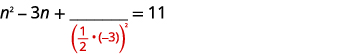

By the end of this section, you will be able to:
* Complete the square of a binomial expression
* Solve quadratic equations of the form
  <math xmlns="http://www.w3.org/1998/Math/MathML"><mrow><msup><mrow><mi>x</mi></mrow><mrow><mn>2</mn></mrow></msup><mo>+</mo><mi>b</mi><mi>x</mi><mo>+</mo><mi>c</mi><mo>=</mo><mn>0</mn></mrow></math>
  
  by completing the square
* Solve quadratic equations of the form
  <math xmlns="http://www.w3.org/1998/Math/MathML"><mrow><msup><mrow><mi>a</mi><mi>x</mi></mrow><mrow><mn>2</mn></mrow></msup><mo>+</mo><mi>b</mi><mi>x</mi><mo>+</mo><mi>c</mi><mo>=</mo><mn>0</mn></mrow></math>
  
  by completing the square

Before you get started, take this readiness quiz.

1.  Expand:
    <math xmlns="http://www.w3.org/1998/Math/MathML"><mrow><msup><mrow><mrow><mo>(</mo><mrow><mi>x</mi><mo>+</mo><mn>9</mn></mrow><mo>)</mo></mrow></mrow><mn>2</mn></msup><mo>.</mo></mrow></math>
    
    * * *
    {: data-type="newline"}
    
    If you missed this problem, review [\[link\]](/m63351#fs-id1167836392219).
2.  Factor
    <math xmlns="http://www.w3.org/1998/Math/MathML"><mrow><msup><mi>y</mi><mn>2</mn></msup><mo>−</mo><mn>14</mn><mi>y</mi><mo>+</mo><mn>49</mn><mo>.</mo></mrow></math>
    
    * * *
    {: data-type="newline"}
    
    If you missed this problem, review [\[link\]](/m63358#fs-id1167836732680).
3.  Factor
    <math xmlns="http://www.w3.org/1998/Math/MathML"><mrow><mn>5</mn><msup><mi>n</mi><mn>2</mn></msup><mo>+</mo><mn>40</mn><mi>n</mi><mo>+</mo><mn>80</mn><mo>.</mo></mrow></math>
    
    * * *
    {: data-type="newline"}
    
    If you missed this problem, review [\[link\]](/m63358#fs-id1167836415146).
{: type="1"}

So far we have solved quadratic equations by factoring and using the Square Root Property. In this section, we will solve quadratic equations by a process called **completing the square**{: data-type="term"}, which is important for our work on conics later.

### Complete the Square of a Binomial Expression

In the last section, we were able to use the **Square Root Property**{: data-type="term" .no-emphasis} to solve the equation (*y* − 7)2 = 12 because the left side was a perfect square.

<math xmlns="http://www.w3.org/1998/Math/MathML"><mtable><mtr><mtd columnalign="right"><msup><mrow><mo>(</mo><mrow><mi>y</mi><mo>−</mo><mn>7</mn></mrow><mo>)</mo></mrow><mn>2</mn></msup></mtd><mtd columnalign="left"><mo>=</mo></mtd><mtd columnalign="left"><mn>12</mn></mtd></mtr><mtr><mtd columnalign="right"><mi>y</mi><mo>−</mo><mn>7</mn></mtd><mtd columnalign="left"><mo>=</mo></mtd><mtd columnalign="left"><mo>±</mo><msqrt><mrow><mn>12</mn></mrow></msqrt></mtd></mtr><mtr><mtd columnalign="right"><mi>y</mi><mo>−</mo><mn>7</mn></mtd><mtd columnalign="left"><mo>=</mo></mtd><mtd columnalign="left"><mo>±</mo><mn>2</mn><msqrt><mn>3</mn></msqrt></mtd></mtr><mtr><mtd columnalign="right"><mi>y</mi></mtd><mtd columnalign="left"><mo>=</mo></mtd><mtd columnalign="left"><mn>7</mn><mo>±</mo><mn>2</mn><msqrt><mn>3</mn></msqrt></mtd></mtr></mtable></math>

We also solved an equation in which the left side was a perfect square trinomial, but we had to rewrite it the form <math xmlns="http://www.w3.org/1998/Math/MathML"><mrow><msup><mrow><mrow><mo>(</mo><mrow><mi>x</mi><mo>−</mo><mi>k</mi></mrow><mo>)</mo></mrow></mrow><mn>2</mn></msup></mrow></math>

 in order to use the Square Root Property.

<math xmlns="http://www.w3.org/1998/Math/MathML"><mtable><mtr><mtd columnalign="right"><msup><mi>x</mi><mn>2</mn></msup><mo>−</mo><mn>10</mn><mi>x</mi><mo>+</mo><mn>25</mn></mtd><mtd columnalign="left"><mo>=</mo></mtd><mtd columnalign="left"><mn>18</mn></mtd></mtr><mtr><mtd columnalign="right"><msup><mrow><mo>(</mo><mrow><mi>x</mi><mo>−</mo><mn>5</mn></mrow><mo>)</mo></mrow><mn>2</mn></msup></mtd><mtd columnalign="left"><mo>=</mo></mtd><mtd columnalign="left"><mn>18</mn></mtd></mtr></mtable></math>

What happens if the variable is not part of a perfect square? Can we use algebra to make a perfect square?

Let’s look at two examples to help us recognize the patterns.

<math xmlns="http://www.w3.org/1998/Math/MathML"><mrow><mtable><mtr><mtd columnalign="center"><msup><mrow><mrow><mo>(</mo><mrow><mi>x</mi><mo>+</mo><mn>9</mn></mrow><mo>)</mo></mrow></mrow><mn>2</mn></msup></mtd><mtd /><mtd /><mtd columnalign="center"><mspace width="3em" /><msup><mrow><mrow><mo>(</mo><mrow><mi>y</mi><mo>−</mo><mn>7</mn></mrow><mo>)</mo></mrow></mrow><mn>2</mn></msup></mtd></mtr> <mtr><mtd columnalign="center"><mrow><mo>(</mo><mrow><mi>x</mi><mo>+</mo><mn>9</mn></mrow><mo>)</mo></mrow><mrow><mo>(</mo><mrow><mi>x</mi><mo>+</mo><mn>9</mn></mrow><mo>)</mo></mrow></mtd><mtd /><mtd /><mtd columnalign="center"><mspace width="3em" /><mrow><mo>(</mo><mrow><mi>y</mi><mo>−</mo><mn>7</mn></mrow><mo>)</mo></mrow><mrow><mo>(</mo><mrow><mi>y</mi><mo>−</mo><mn>7</mn></mrow><mo>)</mo></mrow></mtd></mtr> <mtr><mtd columnalign="center"><msup><mi>x</mi><mn>2</mn></msup><mo>+</mo><mn>9</mn><mi>x</mi><mo>+</mo><mn>9</mn><mi>x</mi><mo>+</mo><mn>81</mn></mtd><mtd /><mtd /><mtd columnalign="center"><mspace width="3em" /><msup><mi>y</mi><mn>2</mn></msup><mo>−</mo><mn>7</mn><mi>y</mi><mo>−</mo><mn>7</mn><mi>y</mi><mo>+</mo><mn>49</mn></mtd></mtr> <mtr><mtd columnalign="center"><msup><mi>x</mi><mn>2</mn></msup><mo>+</mo><mn>18</mn><mi>x</mi><mo>+</mo><mn>81</mn></mtd><mtd /><mtd /><mtd columnalign="center"><mspace width="3em" /><msup><mi>y</mi><mn>2</mn></msup><mo>−</mo><mn>14</mn><mi>y</mi><mo>+</mo><mn>49</mn></mtd></mtr></mtable></mrow></math>

We restate the patterns here for reference.

Binomial Squares Pattern

If *a* and *b* are real numbers,

  

We can use this pattern to “make” a perfect square.

We will start with the expression *x*2 + 6*x*. Since there is a plus sign between the two terms, we will use the (*a* + *b*)2 pattern, *a*2 + 2*ab* + *b*2 = (*a* + *b*)2.

    We ultimately need to find the last term of this trinomial that will make it a perfect square trinomial. To do that we will need to find *b*. But first we start with determining *a*. Notice that the first term of *x*2 + 6*x* is a square, *x*2. This tells us that *a* = *x*.

    What number, *b,* when multiplied with 2*x* gives 6*x*? It would have to be 3, which is <math xmlns="http://www.w3.org/1998/Math/MathML"><mrow><mfrac><mn>1</mn><mn>2</mn></mfrac><mrow><mo>(</mo><mn>6</mn><mo>)</mo></mrow><mo>.</mo></mrow></math>

 So *b* = 3.

    Now to complete the perfect square trinomial, we will find the last term by squaring *b*, which is 32 = 9.

    We can now factor.

    So we found that adding 9 to *x*2 + 6*x* ‘completes the square’, and we write it as (*x* + 3)2.

Complete a square of
<math xmlns="http://www.w3.org/1998/Math/MathML"><mrow><msup><mrow><mi>x</mi></mrow><mrow><mn>2</mn></mrow></msup><mo>+</mo><mi>b</mi><mi>x</mi><mo>.</mo></mrow></math>

1.  Identify *b*, the coefficient of *x*.
2.  Find
    <math xmlns="http://www.w3.org/1998/Math/MathML"><mrow><msup><mrow><mrow><mo>(</mo><mrow><mfrac><mn>1</mn><mn>2</mn></mfrac><mi>b</mi></mrow><mo>)</mo></mrow></mrow><mn>2</mn></msup><mo>,</mo></mrow></math>
    
    the number to complete the square.
3.  Add the
    <math xmlns="http://www.w3.org/1998/Math/MathML"><mrow><msup><mrow><mrow><mo>(</mo><mrow><mfrac><mn>1</mn><mn>2</mn></mfrac><mi>b</mi></mrow><mo>)</mo></mrow></mrow><mn>2</mn></msup></mrow></math>
    
    to *x*2 + *bx*.
4.  Factor the perfect square trinomial, writing it as a binomial squared.
{: type="1" .stepwise}

Complete the square to make a perfect square trinomial. Then write the result as a binomial squared.

ⓐ <math xmlns="http://www.w3.org/1998/Math/MathML"><mrow><msup><mi>x</mi><mn>2</mn></msup><mo>−</mo><mn>26</mn><mi>x</mi></mrow></math>

 ⓑ <math xmlns="http://www.w3.org/1998/Math/MathML"><mrow><msup><mi>y</mi><mn>2</mn></msup><mo>−</mo><mn>9</mn><mi>y</mi></mrow></math>

 ⓒ <math xmlns="http://www.w3.org/1998/Math/MathML"><mrow><msup><mi>n</mi><mn>2</mn></msup><mo>+</mo><mfrac><mn>1</mn><mn>2</mn></mfrac><mi>n</mi></mrow></math>

ⓐ* * *
{: data-type="newline"}

<table class="unnumbered unstyled" summary="The expression x squared minus b x is shown above the expression x squared minus 26 x. Note that the coefficient of x is negative 26. To complete the square, find the square of one half times b. Substitute negative 26 for b, rewriting the expression as the square of one half times negative 26. Simplifying the product gives the square of negative 13, and evaluating the square gives 169. Add 169 to the binomial to complete the square so that the expression becomes x squared minus 26 x plus 169. Factor the resulting perfect square trinomial, writing it as the square of x minus 26, a binomial squared." data-label=""><tbody>
<tr>
<td />
<td data-valign="top" data-align="center">

</td>
</tr>
<tr>
<td data-valign="top" data-align="left">The coefficient of <math xmlns="http://www.w3.org/1998/Math/MathML"><mi>x</mi></math> is −26.</td>
<td />
</tr>
<tr>
<td data-valign="top" data-align="left"><math xmlns="http://www.w3.org/1998/Math/MathML"><mtable><mtr /><mtr /><mtr /><mtr><mtd columnalign="center"><mtext>Find</mtext><mspace width="0.2em" /><msup><mrow><mo>(</mo><mfrac><mn>1</mn><mn>2</mn></mfrac><mi>b</mi><mo>)</mo></mrow><mn>2</mn></msup><mo>.</mo></mtd></mtr><mtr><mtd columnalign="center"><msup><mrow><mo>(</mo><mfrac><mn>1</mn><mn>2</mn></mfrac><mo>·</mo><mo stretchy="false">(</mo><mn>−26</mn><mo stretchy="false">)</mo><mo>)</mo></mrow><mn>2</mn></msup></mtd></mtr><mtr><mtd columnalign="center"><msup><mrow><mo stretchy="false">(</mo><mn>13</mn><mo stretchy="false">)</mo></mrow><mn>2</mn></msup></mtd></mtr><mtr><mtd columnalign="center"><mn>169</mn></mtd></mtr></mtable></math></td>
<td />
</tr>
<tr>
<td data-valign="top" data-align="left">Add 169 to the binomial to complete the square.</td>
<td data-valign="top" data-align="center">

</td>
</tr>
<tr>
<td data-valign="top" data-align="left">Factor the perfect square trinomial, writing it as
a binomial squared.</td>
<td data-valign="top" data-align="center">

</td>
</tr>
</tbody></table>
ⓑ* * *
{: data-type="newline"}

<table class="unnumbered unstyled" summary="The expression x squared minus b x is shown above the expression y squared minus 9 y. Note that the coefficient of y is negative 9. To complete the square, find the square of one half times b. Substitute negative 9 for b, rewriting the expression as the square of one half times negative 9. Simplifying the product gives the square of negative nine halves, and evaluating the square gives eighty-one fourths. Add eighty-one fourths to the binomial to complete the square so that the expression becomes y squared minus 9 y plus eighty-one fourths. Factor the resulting perfect square trinomial, writing it as the square of y minus nine halves, a binomial squared." data-label=""><tbody>
<tr>
<td />
<td data-valign="top" data-align="center">

</td>
</tr>
<tr>
<td data-valign="top" data-align="left">The coefficient of <math xmlns="http://www.w3.org/1998/Math/MathML"><mi>y</mi></math> is <math xmlns="http://www.w3.org/1998/Math/MathML"><mrow><mn>−9</mn></mrow></math>.</td>
<td />
</tr>
<tr>
<td data-valign="top" data-align="left"><math xmlns="http://www.w3.org/1998/Math/MathML"><mtable><mtr /><mtr /><mtr /><mtr><mtd columnalign="center"><mtext>Find</mtext><mspace width="0.2em" /><msup><mrow><mo>(</mo><mfrac><mn>1</mn><mn>2</mn></mfrac><mi>b</mi><mo>)</mo></mrow><mn>2</mn></msup><mo>.</mo></mtd></mtr><mtr><mtd columnalign="center"><msup><mrow><mo>(</mo><mfrac><mn>1</mn><mn>2</mn></mfrac><mo>·</mo><mo stretchy="false">(</mo><mn>−9</mn><mo stretchy="false">)</mo><mo>)</mo></mrow><mn>2</mn></msup></mtd></mtr><mtr><mtd columnalign="center"><msup><mrow><mo>(</mo><mtext>−</mtext><mfrac><mn>9</mn><mn>2</mn></mfrac><mo>)</mo></mrow><mn>2</mn></msup></mtd></mtr><mtr><mtd columnalign="center"><mfrac><mn>81</mn><mn>4</mn></mfrac></mtd></mtr></mtable></math></td>
<td />
</tr>
<tr>
<td data-valign="top" data-align="left">Add <math xmlns="http://www.w3.org/1998/Math/MathML"><mrow><mfrac><mrow><mn>81</mn></mrow><mn>4</mn></mfrac></mrow></math> to the binomial to complete the square.</td>
<td data-valign="top" data-align="center">

</td>
</tr>
<tr>
<td data-valign="top" data-align="left">Factor the perfect square trinomial, writing it as
a binomial squared.</td>
<td data-valign="top" data-align="center">

</td>
</tr>
</tbody></table>
ⓒ* * *
{: data-type="newline"}

|  |    |
| The coefficient of <math xmlns="http://www.w3.org/1998/Math/MathML"><mi>n</mi></math>

 is <math xmlns="http://www.w3.org/1998/Math/MathML"><mrow><mfrac><mn>1</mn><mn>2</mn></mfrac><mo>.</mo></mrow></math>

 |  |
| <math xmlns="http://www.w3.org/1998/Math/MathML"><mtable><mtr /><mtr /><mtr /><mtr><mtd columnalign="center"><mtext>Find</mtext><mspace width="0.2em" /><msup><mrow><mo>(</mo><mfrac><mn>1</mn><mn>2</mn></mfrac><mi>b</mi><mo>)</mo></mrow><mn>2</mn></msup><mo>.</mo></mtd></mtr><mtr><mtd columnalign="center"><msup><mrow><mo>(</mo><mfrac><mn>1</mn><mn>2</mn></mfrac><mo>·</mo><mfrac><mn>1</mn><mn>2</mn></mfrac><mo>)</mo></mrow><mn>2</mn></msup></mtd></mtr><mtr><mtd columnalign="center"><msup><mrow><mo>(</mo><mfrac><mn>1</mn><mn>4</mn></mfrac><mo>)</mo></mrow><mn>2</mn></msup></mtd></mtr><mtr><mtd columnalign="center"><mfrac><mn>1</mn><mn>16</mn></mfrac></mtd></mtr></mtable></math>

 |  |
| Add <math xmlns="http://www.w3.org/1998/Math/MathML"><mrow><mfrac><mn>1</mn><mrow><mn>16</mn></mrow></mfrac></mrow></math>

 to the binomial to complete the square. |    |
| Rewrite as a binomial square. |    |
{: .unnumbered .unstyled .can-break summary="The expression x squared plus b x is shown above the expression n squared plus one-half n. The coefficient of n is one half. To complete the square, find the square of one half times b. Substitute the coefficient of n, b equals one half to get the square of one half times one half. Simplify the product, one fourth squared. Find the square to get the constant value one sixteenth. This number completes the square, yielding the expression n squared plus one-half n plus one sixteenth. Rewrite as a binomial square, the square of n plus one fourth." data-label=""}

Complete the square to make a perfect square trinomial. Then write the result as a binomial squared.

ⓐ <math xmlns="http://www.w3.org/1998/Math/MathML"><mrow><msup><mi>a</mi><mn>2</mn></msup><mo>−</mo><mn>20</mn><mi>a</mi></mrow></math>

 ⓑ <math xmlns="http://www.w3.org/1998/Math/MathML"><mrow><msup><mi>m</mi><mn>2</mn></msup><mo>−</mo><mn>5</mn><mi>m</mi></mrow></math>

 ⓒ <math xmlns="http://www.w3.org/1998/Math/MathML"><mrow><msup><mi>p</mi><mn>2</mn></msup><mo>+</mo><mfrac><mn>1</mn><mn>4</mn></mfrac><mi>p</mi></mrow></math>

ⓐ <math xmlns="http://www.w3.org/1998/Math/MathML"><mrow><msup><mrow><mrow><mo>(</mo><mrow><mi>a</mi><mo>−</mo><mn>10</mn></mrow><mo>)</mo></mrow></mrow><mn>2</mn></msup></mrow></math>

 ⓑ <math xmlns="http://www.w3.org/1998/Math/MathML"><mrow><msup><mrow><mrow><mo>(</mo><mrow><mi>b</mi><mo>−</mo><mfrac><mn>5</mn><mn>2</mn></mfrac></mrow><mo>)</mo></mrow></mrow><mn>2</mn></msup></mrow></math>

* * *
{: data-type="newline"}

ⓒ <math xmlns="http://www.w3.org/1998/Math/MathML"><mrow><msup><mrow><mrow><mo>(</mo><mrow><mi>p</mi><mo>+</mo><mfrac><mn>1</mn><mn>8</mn></mfrac></mrow><mo>)</mo></mrow></mrow><mn>2</mn></msup></mrow></math>

Complete the square to make a perfect square trinomial. Then write the result as a binomial squared.

ⓐ <math xmlns="http://www.w3.org/1998/Math/MathML"><mrow><msup><mi>b</mi><mn>2</mn></msup><mo>−</mo><mn>4</mn><mi>b</mi></mrow></math>

 ⓑ <math xmlns="http://www.w3.org/1998/Math/MathML"><mrow><msup><mi>n</mi><mn>2</mn></msup><mo>+</mo><mn>13</mn><mi>n</mi></mrow></math>

 ⓒ <math xmlns="http://www.w3.org/1998/Math/MathML"><mrow><msup><mi>q</mi><mn>2</mn></msup><mo>−</mo><mfrac><mn>2</mn><mn>3</mn></mfrac><mi>q</mi></mrow></math>

ⓐ <math xmlns="http://www.w3.org/1998/Math/MathML"><mrow><msup><mrow><mrow><mo>(</mo><mrow><mi>b</mi><mo>−</mo><mn>2</mn></mrow><mo>)</mo></mrow></mrow><mn>2</mn></msup></mrow></math>

 ⓑ <math xmlns="http://www.w3.org/1998/Math/MathML"><mrow><msup><mrow><mrow><mo>(</mo><mrow><mi>n</mi><mo>+</mo><mfrac><mrow><mn>13</mn></mrow><mn>2</mn></mfrac></mrow><mo>)</mo></mrow></mrow><mn>2</mn></msup></mrow></math>

* * *
{: data-type="newline"}

ⓒ <math xmlns="http://www.w3.org/1998/Math/MathML"><mrow><msup><mrow><mrow><mo>(</mo><mrow><mi>q</mi><mo>−</mo><mfrac><mn>1</mn><mn>3</mn></mfrac></mrow><mo>)</mo></mrow></mrow><mn>2</mn></msup></mrow></math>

### Solve Quadratic Equations of the Form *x*2 + *bx* + *c* = 0 by Completing the Square

In solving equations, we must always do the same thing to both sides of the equation. This is true, of course, when we solve a **quadratic equation**{: data-type="term" .no-emphasis} by **completing the square**{: data-type="term" .no-emphasis} too. When we add a term to one side of the equation to make a perfect square trinomial, we must also add the same term to the other side of the equation.

For example, if we start with the equation *x*2 + 6*x* = 40, and we want to complete the square on the left, we will add 9 to both sides of the equation.

|  |    |
|  |    |
|  |    |
| Add 9 to both sides to complete the square. |    |
{: .unnumbered .unstyled summary="Start with the equation x squared plus 6 x equals 40. In the next step, insert spaces to use when completed the square. Write the equation as x squared plus 6 x plus space equals 40 plus space. Complete the square, inserting 9 into each space so that the equation becomes x squared plus 6 x plus 9 equals 40 plus 9. Factor the expression on the left side of the equation and simplify on the right to yield the square of x plus 3 equals 49." data-label=""}

Now the equation is in the form to solve using the **Square Root Property**{: data-type="term" .no-emphasis}! Completing the square is a way to transform an equation into the form we need to be able to use the Square Root Property.

How to Solve a Quadratic Equation of the Form
<math xmlns="http://www.w3.org/1998/Math/MathML"><mrow><msup><mrow><mi>x</mi></mrow><mrow><mn>2</mn></mrow></msup><mo>+</mo><mi>b</mi><mi>x</mi><mo>+</mo><mi>c</mi><mo>=</mo><mn>0</mn></mrow></math>
by Completing the Square

Solve by completing the square: <math xmlns="http://www.w3.org/1998/Math/MathML"><mrow><msup><mi>x</mi><mn>2</mn></msup><mo>+</mo><mn>8</mn><mi>x</mi><mo>=</mo><mn>48</mn><mo>.</mo></mrow></math>

                ![Finally, step 6, check the solutions. Put each answer in the original equation to check. First substitute x equals 4. We need to show that 4 squared plus 8 times 4 equals 48. Simplify. The expression 4 squared plus 8 times 4 is equivalent to 16 plus 32, or 48. X equals 4 is a solution. Next substitute x equals negative 12 into the original equation, x squared plus 8 x equals 48. The square of negative 12 plus 8 times negative 12 equals 144 minus 96, or 48. X equals negative 12 is also a solution.](../resources/CNX_IntAlg_Figure_09_02_009f_img.jpg) 

Solve by completing the square: <math xmlns="http://www.w3.org/1998/Math/MathML"><mrow><msup><mi>x</mi><mn>2</mn></msup><mo>+</mo><mn>4</mn><mi>x</mi><mo>=</mo><mn>5</mn><mo>.</mo></mrow></math>

<math xmlns="http://www.w3.org/1998/Math/MathML"><mrow><mi>x</mi><mo>=</mo><mn>−5</mn><mo>,</mo><mi>x</mi><mo>=</mo><mn>−1</mn></mrow></math>

Solve by completing the square: <math xmlns="http://www.w3.org/1998/Math/MathML"><mrow><msup><mi>y</mi><mn>2</mn></msup><mo>−</mo><mn>10</mn><mi>y</mi><mo>=</mo><mn>−9</mn><mo>.</mo></mrow></math>

<math xmlns="http://www.w3.org/1998/Math/MathML"><mrow><mi>y</mi><mo>=</mo><mn>1</mn><mo>,</mo><mi>y</mi><mo>=</mo><mn>9</mn></mrow></math>

The steps to solve a quadratic equation by completing the square are listed here.

Solve a quadratic equation of the form
<math xmlns="http://www.w3.org/1998/Math/MathML"><mrow><msup><mrow><mi>x</mi></mrow><mrow><mn>2</mn></mrow></msup><mo>+</mo><mi>b</mi><mi>x</mi><mo>+</mo><mi>c</mi><mo>=</mo><mn>0</mn></mrow></math>
by completing the square.

1.  Isolate the variable terms on one side and the constant terms on the other.
2.  Find
    <math xmlns="http://www.w3.org/1998/Math/MathML"><mrow><msup><mrow><mrow><mo>(</mo><mrow><mfrac><mn>1</mn><mn>2</mn></mfrac><mspace width="0.2em" /><mo>·</mo><mspace width="0.2em" /><mi>b</mi></mrow><mo>)</mo></mrow></mrow><mn>2</mn></msup><mo>,</mo></mrow></math>
    
    the number needed to complete the square. Add it to both sides of the equation.
3.  Factor the perfect square trinomial, writing it as a binomial squared on the left and simplify by adding the terms on the right
4.  Use the Square Root Property.
5.  Simplify the radical and then solve the two resulting equations.
6.  Check the solutions.
{: type="1" .stepwise}

When we solve an equation by completing the square, the answers will not always be integers.

Solve by completing the square: <math xmlns="http://www.w3.org/1998/Math/MathML"><mrow><msup><mi>x</mi><mn>2</mn></msup><mo>+</mo><mn>4</mn><mi>x</mi><mo>=</mo><mn>−21</mn><mo>.</mo></mrow></math>

<table class="unnumbered unstyled" summary="In the equation x squared plus 4 x equals negative 21, the variable terms are on the left side of the equation and the constant term is on the right. To complete the square, take half of the coefficient of x, 4, and square it. The square of the product one half times 4 is 4, so add 4 to both sides. The equation becomes x squared plus 4 x plus 4 equals negative 21 plus 4. Factor the perfect square trinomial on the left and add the values on the right to yield the square of the sum x plus 2 equals negative 17. Use the Square Root Property. The equation becomes x plus 2 equals the positive or negative square root of negative 17. Simplify using complex numbers. X plus 2 equals positive or negative square root 17 times I. Subtract 2 from each side of the equation. X equals negative 2 plus or minus square root 17 I. Rewrite to show two solutions. x equals negative 2 plus square root 17 I and x equals negative 2 minus square root 17 I. We leave the check to you." data-label=""><tbody>
<tr>
<td />
<td />
<td data-valign="top" data-align="center">

</td>
</tr>
<tr>
<td colspan="2" data-valign="top" data-align="left">The variable terms are on the left side.

Take half of 4 and square it.</td>
<td data-valign="top" data-align="left">

</td>
</tr>
<tr>
<td colspan="2" data-valign="top" data-align="left"><math xmlns="http://www.w3.org/1998/Math/MathML"><mrow><msup><mrow><mo>(</mo><mfrac><mn>1</mn><mn>2</mn></mfrac><mo stretchy="false">(</mo><mn>4</mn><mo stretchy="false">)</mo><mo>)</mo></mrow><mn>2</mn></msup><mo>=</mo><mn>4</mn></mrow></math></td>
<td />
</tr>
<tr>
<td colspan="2" data-valign="top" data-align="left">Add 4 to both sides.</td>
<td data-valign="top" data-align="center">

</td>
</tr>
<tr>
<td colspan="2" data-valign="top" data-align="left">Factor the perfect square trinomial,
writing it as a binomial squared.</td>
<td data-valign="top" data-align="center">

</td>
</tr>
<tr>
<td colspan="2" data-valign="top" data-align="left">Use the Square Root Property.</td>
<td data-valign="top" data-align="center">

</td>
</tr>
<tr>
<td colspan="2" data-valign="top" data-align="left">Simplify using complex numbers.</td>
<td data-valign="top" data-align="center">

</td>
</tr>
<tr>
<td colspan="2" data-valign="top" data-align="left">Subtract 2 from each side.</td>
<td data-valign="top" data-align="center">

</td>
</tr>
<tr>
<td colspan="2" data-valign="top" data-align="left">Rewrite to show two solutions.</td>
<td data-valign="top" data-align="center">

</td>
</tr>
<tr>
<td colspan="2" data-valign="top" data-align="left">We leave the check to you.</td>
<td />
</tr>
</tbody></table>

Solve by completing the square: <math xmlns="http://www.w3.org/1998/Math/MathML"><mrow><msup><mi>y</mi><mn>2</mn></msup><mo>−</mo><mn>10</mn><mi>y</mi><mo>=</mo><mn>−35</mn><mo>.</mo></mrow></math>

<math xmlns="http://www.w3.org/1998/Math/MathML"><mrow><mi>y</mi><mo>=</mo><mn>5</mn><mo>+</mo><msqrt><mrow><mn>15</mn></mrow></msqrt><mi>i</mi><mo>,</mo><mspace width="0.2em" /><mtext /><mspace width="0.2em" /><mi>y</mi><mo>=</mo><mn>5</mn><mo>−</mo><msqrt><mrow><mn>15</mn></mrow></msqrt><mi>i</mi></mrow></math>

Solve by completing the square: <math xmlns="http://www.w3.org/1998/Math/MathML"><mrow><msup><mi>z</mi><mn>2</mn></msup><mo>+</mo><mn>8</mn><mi>z</mi><mo>=</mo><mn>−19</mn><mo>.</mo></mrow></math>

<math xmlns="http://www.w3.org/1998/Math/MathML"><mrow><mi>z</mi><mo>=</mo><mn>−4</mn><mo>+</mo><msqrt><mn>3</mn></msqrt><mi>i</mi><mo>,</mo><mspace width="0.2em" /><mtext>z</mtext><mo>=</mo><mn>−4</mn><mo>−</mo><msqrt><mn>3</mn></msqrt><mi>i</mi></mrow></math>

In the previous example, our solutions were complex numbers. In the next example, the solutions will be irrational numbers.

Solve by completing the square: <math xmlns="http://www.w3.org/1998/Math/MathML"><mrow><msup><mi>y</mi><mn>2</mn></msup><mo>−</mo><mn>18</mn><mi>y</mi><mo>=</mo><mn>−6</mn><mo>.</mo></mrow></math>

<table class="unnumbered unstyled can-break" summary="In the equation y squared minus 18 y equals negative 6, the variable terms are on the left side of the equation and the constant term is on the right. To complete the square, take half of the coefficient of y, &#x2212;18, and square it. The square of the product one half times negative 18 is 81, so add 81 to both sides. The equation becomes y squared minus 18 y plus 81 equals negative 6 plus 81. Factor the perfect square trinomial on the left and add the values on the right to yield the square of the difference y minus 9 equals 75. Use the Square Root Property. The equation becomes y minus 9 equals the positive or negative square root of 75. Simplify the radical. Y minus 9 equals positive or negative 5 square root 3. Add 9 to each side of the equation. y equals 9 plus or minus 5 square root 3. Check. Substitute 9 plus 5 square root 3 into the original equation, y squared minus 18 y equals negative 6. The expression on the left becomes the square of 9 plus 5 square root 3 minus 18 times the sum 9 plus 5 square root 3. We need to show that this expression equals negative 6. Expanding the square and multiplying yields 81 plus 90 square root 3 plus 75 minus 162 minus 90 square root 3, which equals negative 6. Next substitute 9 minus 5 square root 3 into the original equation, y squared minus 18 y equals negative 6. The expression on the left becomes the square of 9 minus 5 square root 3 minus 18 times the sum 9 minus 5 square root 3. We need to show that this expression equals negative 6. Expanding the square and multiplying yields 81 minus 90 square root 3 plus 75 minus 162 plus 90 square root 3, which equals negative 6." data-label=""><tbody>
<tr>
<td />
<td data-valign="top" data-align="center">

</td>
</tr>
<tr>
<td data-valign="top" data-align="left">The variable terms are on the left side.

Take half of <math xmlns="http://www.w3.org/1998/Math/MathML"><mrow><mn>−18</mn></mrow></math> and square it.</td>
<td />
</tr>
<tr>
<td data-valign="top" data-align="left"><math xmlns="http://www.w3.org/1998/Math/MathML"><mrow><msup><mrow><mo>(</mo><mfrac><mn>1</mn><mn>2</mn></mfrac><mo stretchy="false">(</mo><mn>−18</mn><mo stretchy="false">)</mo><mo>)</mo></mrow><mn>2</mn></msup><mo>=</mo><mn>81</mn></mrow></math></td>
<td data-valign="top" data-align="left">

</td>
</tr>
<tr>
<td data-valign="top" data-align="left">Add 81 to both sides.</td>
<td data-valign="top" data-align="center">

</td>
</tr>
<tr>
<td data-valign="top" data-align="left">Factor the perfect square trinomial,
writing it as a binomial squared.</td>
<td data-valign="top" data-align="center">

</td>
</tr>
<tr>
<td data-valign="top" data-align="left">Use the Square Root Property.</td>
<td data-valign="top" data-align="center">

</td>
</tr>
<tr>
<td data-valign="top" data-align="left">Simplify the radical.</td>
<td data-valign="top" data-align="center">

</td>
</tr>
<tr>
<td data-valign="top" data-align="left">Solve for <math xmlns="http://www.w3.org/1998/Math/MathML"><mi>y</mi></math>.</td>
<td data-valign="top" data-align="center">

</td>
</tr>
<tr>
<td colspan="2" data-valign="top" data-align="left">Check.

</td>
</tr>
</tbody></table>
Another way to check this would be to use a calculator. Evaluate <math xmlns="http://www.w3.org/1998/Math/MathML"><mrow><msup><mi>y</mi><mn>2</mn></msup><mo>−</mo><mn>18</mn><mi>y</mi></mrow></math>

for both of the solutions. The answer should be <math xmlns="http://www.w3.org/1998/Math/MathML"><mrow><mn>−6</mn><mo>.</mo></mrow></math>

Solve by completing the square: <math xmlns="http://www.w3.org/1998/Math/MathML"><mrow><msup><mi>x</mi><mn>2</mn></msup><mo>−</mo><mn>16</mn><mi>x</mi><mo>=</mo><mn>−16</mn><mo>.</mo></mrow></math>

<math xmlns="http://www.w3.org/1998/Math/MathML"><mrow><mi>x</mi><mo>=</mo><mn>8</mn><mo>+</mo><mn>4</mn><msqrt><mn>3</mn></msqrt><mo>,</mo><mspace width="0.2em" /><mtext /><mspace width="0.2em" /><mi>x</mi><mo>=</mo><mn>8</mn><mo>−</mo><mn>4</mn><msqrt><mn>3</mn></msqrt></mrow></math>

Solve by completing the square: <math xmlns="http://www.w3.org/1998/Math/MathML"><mrow><msup><mi>y</mi><mn>2</mn></msup><mo>+</mo><mn>8</mn><mi>y</mi><mo>=</mo><mn>11</mn><mo>.</mo></mrow></math>

<math xmlns="http://www.w3.org/1998/Math/MathML"><mrow><mi>y</mi><mo>=</mo><mn>−4</mn><mo>+</mo><mn>3</mn><msqrt><mn>3</mn></msqrt><mo>,</mo><mspace width="0.2em" /><mtext>y</mtext><mo>=</mo><mn>−4</mn><mo>−</mo><mn>3</mn><msqrt><mn>3</mn></msqrt></mrow></math>

We will start the next example by isolating the variable terms on the left side of the equation.

Solve by completing the square: <math xmlns="http://www.w3.org/1998/Math/MathML"><mrow><msup><mi>x</mi><mn>2</mn></msup><mo>+</mo><mn>10</mn><mi>x</mi><mo>+</mo><mn>4</mn><mo>=</mo><mn>15</mn><mo>.</mo></mrow></math>

<table class="unnumbered unstyled can-break" summary="Rewrite the original equation, x squared plus 10 x plus 4 equals 15 to isolate the variables on the left side. Subtract 4 from each side of the equation. X square plus 10 x equals 11. To complete the square, take half of the coefficient of x, 10, and square it. The square of the product one half times 10 is 25, so add 25 to both sides. The equation becomes x squared plus 10 x plus 25 equals 11 plus 25. Factor the perfect square trinomial on the left and add the values on the right to yield the square of the sum x plus 5 equals 36. Use the Square Root Property. The equation becomes x plus 5 equals the positive or negative square root of 36. Simplify the radical. X plus 5 equals positive or negative 6. Subtract 5 from each side of the equation. X equals negative 5 plus or minus 6. Rewrite to show 2 solutions, x equals negative 5 plus 6, or 1 and x equals negative 5 minus 6 or negative 11. Check. Substitute 1 into the original equation, x squared plus 10 x plus 4 equals 15. The expression on the left becomes 1 squared plus 10 times 1 plus 4. We need to show that this expression equals 15. Simplifying gives 1 plus 10 plus 4, or 15. Next substitute negative 11 into the original equation x squared plus 10 x plus 4 equals 15. The expression on the left becomes negative 11 squared plus 10 times negative 11 plus 4. We need to show that this expression equals 15. Simplifying gives 121 minus 110 plus 4, or 15." data-label=""><tbody>
<tr>
<td />
<td data-valign="top" data-align="left">

</td>
</tr>
<tr>
<td data-valign="top" data-align="left">Isolate the variable terms on the left side.
Subtract 4 to get the constant terms on the right side.</td>
<td data-valign="top" data-align="left">

</td>
</tr>
<tr>
<td data-valign="top" data-align="left">Take half of 10 and square it.</td>
<td />
</tr>
<tr>
<td data-valign="top" data-align="left"><math xmlns="http://www.w3.org/1998/Math/MathML"><mrow><msup><mrow><mo>(</mo><mfrac><mn>1</mn><mn>2</mn></mfrac><mo stretchy="false">(</mo><mn>10</mn><mo stretchy="false">)</mo><mo>)</mo></mrow><mn>2</mn></msup><mo>=</mo><mn>25</mn></mrow></math></td>
<td data-valign="top" data-align="left">

</td>
</tr>
<tr>
<td data-valign="top" data-align="left">Add 25 to both sides.</td>
<td data-valign="top" data-align="left">

</td>
</tr>
<tr>
<td data-valign="top" data-align="left">Factor the perfect square trinomial, writing it as
a binomial squared.</td>
<td data-valign="top" data-align="left">

</td>
</tr>
<tr>
<td data-valign="top" data-align="left">Use the Square Root Property.</td>
<td data-valign="top" data-align="left">

</td>
</tr>
<tr>
<td data-valign="top" data-align="left">Simplify the radical.</td>
<td data-valign="top" data-align="left">

</td>
</tr>
<tr>
<td data-valign="top" data-align="left">Solve for <em>x</em>.</td>
<td data-valign="top" data-align="left">

</td>
</tr>
<tr>
<td data-valign="top" data-align="left">Rewrite to show two solutions.</td>
<td data-valign="top" data-align="left">

</td>
</tr>
<tr>
<td data-valign="top" data-align="left">Solve the equations.</td>
<td data-valign="top" data-align="left">

</td>
</tr>
<tr>
<td data-valign="top" data-align="left">Check:

</td>
</tr>
</tbody></table>

Solve by completing the square: <math xmlns="http://www.w3.org/1998/Math/MathML"><mrow><msup><mi>a</mi><mn>2</mn></msup><mo>+</mo><mn>4</mn><mi>a</mi><mo>+</mo><mn>9</mn><mo>=</mo><mn>30</mn><mo>.</mo></mrow></math>

<math xmlns="http://www.w3.org/1998/Math/MathML"><mrow><mi>a</mi><mo>=</mo><mn>−7</mn><mo>,</mo><mi>a</mi><mo>=</mo><mn>3</mn></mrow></math>

Solve by completing the square: <math xmlns="http://www.w3.org/1998/Math/MathML"><mrow><msup><mi>b</mi><mn>2</mn></msup><mo>+</mo><mn>8</mn><mi>b</mi><mo>−</mo><mn>4</mn><mo>=</mo><mn>16</mn><mo>.</mo></mrow></math>

<math xmlns="http://www.w3.org/1998/Math/MathML"><mrow><mi>b</mi><mo>=</mo><mn>−10</mn><mo>,</mo><mi>b</mi><mo>=</mo><mn>2</mn></mrow></math>

To solve the next equation, we must first collect all the variable terms on the left side of the equation. Then we proceed as we did in the previous examples.

Solve by completing the square: <math xmlns="http://www.w3.org/1998/Math/MathML"><mrow><msup><mi>n</mi><mn>2</mn></msup><mo>=</mo><mn>3</mn><mi>n</mi><mo>+</mo><mn>11</mn><mo>.</mo></mrow></math>

<table class="unnumbered unstyled can-break" summary="Rewrite the equation n squared equals 3 n plus 11 to isolate the variable terms on the left side of the equation. Subtract 3 n from both sides of the equation. N squared minus 3 n equals 11. To complete the square, take half of the coefficient of n, negative 3, and square it. The square of the product one half times negative 3 is 9 divided by 4, so add nine fourths to both sides. The equation becomes n squared minus 3 n plus 9 fourths equals 11 plus 9 fourths. Factor the perfect square trinomial on the left, writing it as a binomial squared. On the right, express 11 as a fraction with denominator 4. The square of the difference n minus 3 halves equals 44 fourths plus 9 fourths. Add the fractions on the right side. The square of the difference n minus 3 halves equals 53 fourths Use the Square Root Property. The equation becomes n minus 3 halves equals the positive or negative square root of 53 fourths. Simplify the radical. N minus 3 halves equals positive or negative square root 35 divided by 2. Add 3 halves to both sides of the equation to solve for n. n equals 3 halves plus or minus square root 53 divided by 2. Rewrite to show two solutions. n equals three halves plus square root 53 divided by 2 and n equals three halves minus square root 53 divided by 2. We leave the check to you." data-label=""><tbody>
<tr>
<td />
<td />
<td data-valign="top" data-align="left">

</td>
</tr>
<tr>
<td colspan="2" data-valign="top" data-align="left">Subtract <math xmlns="http://www.w3.org/1998/Math/MathML"><mrow><mn>3</mn><mi>n</mi></mrow></math> to get the variable terms on the left side.</td>
<td data-valign="top" data-align="left">

</td>
</tr>
<tr>
<td colspan="2" data-valign="top" data-align="left">Take half of <math xmlns="http://www.w3.org/1998/Math/MathML"><mrow><mn>−3</mn></mrow></math> and square it.</td>
<td />
</tr>
<tr>
<td colspan="2" data-valign="top" data-align="left"><math xmlns="http://www.w3.org/1998/Math/MathML"><mrow><msup><mrow><mo>(</mo><mfrac><mn>1</mn><mn>2</mn></mfrac><mo stretchy="false">(</mo><mn>−3</mn><mo stretchy="false">)</mo><mo>)</mo></mrow><mn>2</mn></msup><mo>=</mo><mfrac><mn>9</mn><mn>4</mn></mfrac></mrow></math></td>
<td data-valign="top" data-align="left">

</td>
</tr>
<tr>
<td colspan="2" data-valign="top" data-align="left">Add <math xmlns="http://www.w3.org/1998/Math/MathML"><mrow><mfrac><mn>9</mn><mn>4</mn></mfrac></mrow></math> to both sides.</td>
<td data-valign="top" data-align="left">

</td>
</tr>
<tr>
<td colspan="2" data-valign="top" data-align="left">Factor the perfect square trinomial, writing it as
a binomial squared.</td>
<td data-valign="top" data-align="left">

</td>
</tr>
<tr>
<td colspan="2" data-valign="top" data-align="left">Add the fractions on the right side.</td>
<td data-valign="top" data-align="left">

</td>
</tr>
<tr>
<td colspan="2" data-valign="top" data-align="left">Use the Square Root Property.</td>
<td data-valign="top" data-align="left">

</td>
</tr>
<tr>
<td colspan="2" data-valign="top" data-align="left">Simplify the radical.</td>
<td data-valign="top" data-align="left">

</td>
</tr>
<tr>
<td colspan="2" data-valign="top" data-align="left">Solve for <em>n</em>.</td>
<td data-valign="top" data-align="left">

</td>
</tr>
<tr>
<td colspan="2" data-valign="top" data-align="left">Rewrite to show two solutions.</td>
<td data-valign="top" data-align="left">

</td>
</tr>
<tr>
<td colspan="2" data-valign="top" data-align="left">Check:

We leave the check for you!</td>
<td />
</tr>
</tbody></table>

Solve by completing the square: <math xmlns="http://www.w3.org/1998/Math/MathML"><mrow><msup><mi>p</mi><mn>2</mn></msup><mo>=</mo><mn>5</mn><mi>p</mi><mo>+</mo><mn>9</mn><mo>.</mo></mrow></math>

<math xmlns="http://www.w3.org/1998/Math/MathML"><mrow><mi>p</mi><mo>=</mo><mfrac><mn>5</mn><mn>2</mn></mfrac><mo>+</mo><mfrac><mrow><msqrt><mrow><mn>61</mn></mrow></msqrt></mrow><mn>2</mn></mfrac><mo>,</mo><mspace width="0.2em" /><mtext /><mspace width="0.2em" /><mi>p</mi><mo>=</mo><mfrac><mn>5</mn><mn>2</mn></mfrac><mo>−</mo><mfrac><mrow><msqrt><mrow><mn>61</mn></mrow></msqrt></mrow><mn>2</mn></mfrac></mrow></math>

Solve by completing the square: <math xmlns="http://www.w3.org/1998/Math/MathML"><mrow><msup><mi>q</mi><mn>2</mn></msup><mo>=</mo><mn>7</mn><mi>q</mi><mo>−</mo><mn>3</mn><mo>.</mo></mrow></math>

<math xmlns="http://www.w3.org/1998/Math/MathML"><mrow><mi>q</mi><mo>=</mo><mfrac><mn>7</mn><mn>2</mn></mfrac><mo>+</mo><mfrac><mrow><msqrt><mrow><mn>37</mn></mrow></msqrt></mrow><mn>2</mn></mfrac><mo>,</mo><mspace width="0.2em" /><mtext>q</mtext><mo>=</mo><mfrac><mn>7</mn><mn>2</mn></mfrac><mo>−</mo><mfrac><mrow><msqrt><mrow><mn>37</mn></mrow></msqrt></mrow><mn>2</mn></mfrac></mrow></math>

Notice that the left side of the next equation is in factored form. But the right side is not zero. So, we cannot use the **Zero Product Property**{: data-type="term" .no-emphasis} since it says “If <math xmlns="http://www.w3.org/1998/Math/MathML"><mrow><mi>a</mi><mspace width="0.2em" /><mo>·</mo><mspace width="0.2em" /><mi>b</mi><mo>=</mo><mn>0</mn><mo>,</mo></mrow></math>

 then *a* = 0 or *b* = 0.” Instead, we multiply the factors and then put the equation into standard form to solve by completing the square.

Solve by completing the square: <math xmlns="http://www.w3.org/1998/Math/MathML"><mrow><mrow><mo>(</mo><mrow><mi>x</mi><mo>−</mo><mn>3</mn></mrow><mo>)</mo></mrow><mrow><mo>(</mo><mrow><mi>x</mi><mo>+</mo><mn>5</mn></mrow><mo>)</mo></mrow><mo>=</mo><mn>9</mn><mo>.</mo></mrow></math>

<table class="unnumbered unstyled can-break" summary="Write the equation. The product of x minus 3 and x plus 5 equals 9. Multiply the binomials on the left. X squared plus 2 x minus 15 equals 9. Add 15 to isolate the constant terms on the right. X squared plus 2 x equals 24. To complete the square, take half of the coefficient of x, 2, and square it. The square of the product one half times 2 is 1, so add 1 to both sides. X squared plus 2 x plus 1 equals 24 plus 1. Factor the perfect square trinomial to write it as a binomial squared. The square of x plus 1 equals 25. Use the Square Root Property. X plus 1 equals the positive or negative square root of 25. Solve for x. x equals negative 1 plus or minus 5. Rewrite to show 2 solutions. x equals negative 1 plus 5, or 4. X equals negative 1 minus 5, or negative 6. We leave the check of solutions for you!" data-label=""><tbody>
<tr>
<td />
<td />
<td />
<td data-valign="top" data-align="left">

</td>
</tr>
<tr>
<td colspan="2" data-valign="top" data-align="left">We multiply the binomials on the left.</td>
<td />
<td data-valign="top" data-align="left">

</td>
</tr>
<tr>
<td colspan="2" data-valign="top" data-align="left">Add 15 to isolate the constant terms on the right.</td>
<td />
<td data-valign="top" data-align="left">

</td>
</tr>
<tr>
<td colspan="2" data-valign="top" data-align="left">Take half of 2 and square it.</td>
<td />
<td />
</tr>
<tr>
<td colspan="2" data-valign="top" data-align="left"><math xmlns="http://www.w3.org/1998/Math/MathML"><mrow><msup><mrow><mo>(</mo><mfrac><mn>1</mn><mn>2</mn></mfrac><mo>·</mo><mo stretchy="false">(</mo><mn>2</mn><mo stretchy="false">)</mo><mo>)</mo></mrow><mn>2</mn></msup><mo>=</mo><mn>1</mn></mrow></math></td>
<td />
<td data-valign="top" data-align="left">

</td>
</tr>
<tr>
<td colspan="2" data-valign="top" data-align="left">Add 1 to both sides.</td>
<td />
<td data-valign="top" data-align="left">

</td>
</tr>
<tr>
<td colspan="2" data-valign="top" data-align="left">Factor the perfect square trinomial, writing it as
a binomial squared.</td>
<td />
<td data-valign="top" data-align="left">

</td>
</tr>
<tr>
<td colspan="2" data-valign="top" data-align="left">Use the Square Root Property.</td>
<td />
<td data-valign="top" data-align="left">

</td>
</tr>
<tr>
<td colspan="2" data-valign="top" data-align="left">Solve for <em>x</em>.</td>
<td />
<td data-valign="top" data-align="left">

</td>
</tr>
<tr>
<td colspan="2" data-valign="top" data-align="left">Rewrite to show two solutions.</td>
<td colspan="2" data-valign="top" data-align="center">

</td>
</tr>
<tr>
<td colspan="2" data-valign="top" data-align="left">Simplify.</td>
<td colspan="2" data-valign="top" data-align="center">

</td></tr>
<tr>
<td colspan="2" data-valign="top" data-align="left">Check:

We leave the check for you!</td>
<td />
<td />
</tr>
</tbody></table>

Solve by completing the square: <math xmlns="http://www.w3.org/1998/Math/MathML"><mrow><mrow><mo>(</mo><mrow><mi>c</mi><mo>−</mo><mn>2</mn></mrow><mo>)</mo></mrow><mrow><mo>(</mo><mrow><mi>c</mi><mo>+</mo><mn>8</mn></mrow><mo>)</mo></mrow><mo>=</mo><mn>11</mn><mo>.</mo></mrow></math>

<math xmlns="http://www.w3.org/1998/Math/MathML"><mrow><mi>c</mi><mo>=</mo><mn>−9</mn><mo>,</mo><mi>c</mi><mo>=</mo><mn>3</mn></mrow></math>

Solve by completing the square: <math xmlns="http://www.w3.org/1998/Math/MathML"><mrow><mrow><mo>(</mo><mrow><mi>d</mi><mo>−</mo><mn>7</mn></mrow><mo>)</mo></mrow><mrow><mo>(</mo><mrow><mi>d</mi><mo>+</mo><mn>3</mn></mrow><mo>)</mo></mrow><mo>=</mo><mn>56</mn><mo>.</mo></mrow></math>

<math xmlns="http://www.w3.org/1998/Math/MathML"><mrow><mi>d</mi><mo>=</mo><mn>11</mn><mo>,</mo><mi>d</mi><mo>=</mo><mn>−7</mn></mrow></math>

### Solve Quadratic Equations of the Form *ax*2 + *bx* + *c* = 0 by Completing the Square

The process of **completing the square**{: data-type="term" .no-emphasis} works best when the coefficient of *x*2 is 1, so the left side of the equation is of the form *x*2 + *bx* + *c*. If the *x*2 term has a coefficient other than 1, we take some preliminary steps to make the coefficient equal to 1.

Sometimes the coefficient can be factored from all three terms of the trinomial. This will be our strategy in the next example.

Solve by completing the square: <math xmlns="http://www.w3.org/1998/Math/MathML"><mrow><mn>3</mn><msup><mi>x</mi><mn>2</mn></msup><mo>−</mo><mn>12</mn><mi>x</mi><mo>−</mo><mn>15</mn><mo>=</mo><mn>0</mn><mo>.</mo></mrow></math>

To complete the square, we need the coefficient of <math xmlns="http://www.w3.org/1998/Math/MathML"><mrow><msup><mi>x</mi><mn>2</mn></msup></mrow></math>

 to be one. If we factor out the coefficient of <math xmlns="http://www.w3.org/1998/Math/MathML"><mrow><msup><mi>x</mi><mn>2</mn></msup></mrow></math>

 as a common factor, we can continue with solving the equation by completing the square.

<table class="unnumbered unstyled can-break" summary="Write the equation 3 x squared minus 12 x minus 15 equals 0. Factor out the greatest common factor. 3 times the expression x squared minus 4 x minus 5 equals 0. Divide both sides by 3 to isolate the trinomial. 3 times the expression x squared minus 4 x minus 5 divided by 3 equals 0 divided by 3. Simplify. x squared minus 4 x minus 5 equals 0. Add 5 to get the constant terms on the right side. X squared minus 4 x equals 5. To complete the square, take half of the coefficient of x, 4, and square it. The square of the product one half times 4 is 4, so add 4 to both sides. X squared minus 4 x plus 4 equals 5 plus 4. Factor the perfect square trinomial to write it as a binomial squared. The square of x minus 2 equals 9. Use the Square Root Property. X minus 2 equals the positive or negative square root of 9. Solve for x. x equals 2 plus or minus 3. Rewrite to show 2 solutions. x equals 2 plus 3, or 5. X equals 2 minus 3, or negative 1. Check the solutions by substituting each value into the original equation. Substitute x equals 5 into the equation 3 x squared minus 12 x minus 15 equals 0. The left side becomes 3 times the square of 5 minus 12 times 5 minus 15. We need to show that this equals 0. Simplifying yields 75 minus 60 minus 15 which is equal to 0. 5 is a solution. Substitute x equals negative 1 into the equation 3 x squared minus 12 x minus 15 equals 0. The left side becomes 3 times the square of negative 1 minus 12 times negative 1 minus 15. We need to show that this equals 0. Simplifying yields 3 plus 12 minus 15 which is equal to 0. Negative 1 is a solution." data-label=""><tbody>
<tr>
<td />
<td data-valign="top" data-align="left">

</td>
</tr>
<tr>
<td data-valign="top" data-align="left">Factor out the greatest common factor.</td>
<td data-valign="top" data-align="left">

</td>
</tr>
<tr>
<td data-valign="top" data-align="left">Divide both sides by 3 to isolate the trinomial
with coefficient 1.</td>
<td data-valign="top" data-align="left">

</td>
</tr>
<tr>
<td data-valign="top" data-align="left">Simplify.</td>
<td data-valign="top" data-align="left">

</td>
</tr>
<tr>
<td data-valign="top" data-align="left">Add 5 to get the constant terms on the right side.</td>
<td data-valign="top" data-align="left">

</td>
</tr>
<tr>
<td data-valign="top" data-align="left">Take half of 4 and square it.</td>
<td />
</tr>
<tr>
<td data-valign="top" data-align="left"><math xmlns="http://www.w3.org/1998/Math/MathML"><mrow><msup><mrow><mo>(</mo><mfrac><mn>1</mn><mn>2</mn></mfrac><mo stretchy="false">(</mo><mn>−4</mn><mo stretchy="false">)</mo><mo>)</mo></mrow><mn>2</mn></msup><mo>=</mo><mn>4</mn></mrow></math></td>
<td data-valign="top" data-align="left">

</td>
</tr>
<tr>
<td data-valign="top" data-align="left">Add 4 to both sides.</td>
<td data-valign="top" data-align="left">

</td>
</tr>
<tr>
<td data-valign="top" data-align="left">Factor the perfect square trinomial, writing it
as a binomial squared.</td>
<td data-valign="top" data-align="left">

</td>
</tr>
<tr>
<td data-valign="top" data-align="left">Use the Square Root Property.</td>
<td data-valign="top" data-align="left">

</td>
</tr>
<tr>
<td data-valign="top" data-align="left">Solve for <em>x</em>.</td>
<td data-valign="top" data-align="left">

</td>
</tr>
<tr>
<td data-valign="top" data-align="left">Rewrite to show two solutions.</td>
<td data-valign="top" data-align="left">

</td>
</tr>
<tr>
<td data-valign="top" data-align="left">Simplify.</td>
<td data-valign="top" data-align="left">

</td>
</tr>
<tr>
<td data-valign="top" data-align="left">Check:

</td>
<td />
</tr>
</tbody></table>

Solve by completing the square: <math xmlns="http://www.w3.org/1998/Math/MathML"><mrow><mn>2</mn><msup><mi>m</mi><mn>2</mn></msup><mo>+</mo><mn>16</mn><mi>m</mi><mo>+</mo><mn>14</mn><mo>=</mo><mn>0</mn><mo>.</mo></mrow></math>

<math xmlns="http://www.w3.org/1998/Math/MathML"><mrow><mi>m</mi><mo>=</mo><mn>−7</mn><mo>,</mo><mi>m</mi><mo>=</mo><mn>−1</mn></mrow></math>

Solve by completing the square: <math xmlns="http://www.w3.org/1998/Math/MathML"><mrow><mn>4</mn><msup><mi>n</mi><mn>2</mn></msup><mo>−</mo><mn>24</mn><mi>n</mi><mo>−</mo><mn>56</mn><mo>=</mo><mn>8</mn><mo>.</mo></mrow></math>

<math xmlns="http://www.w3.org/1998/Math/MathML"><mrow><mi>n</mi><mo>=</mo><mn>−2</mn><mo>,</mo><mi>n</mi><mo>=</mo><mn>8</mn></mrow></math>

To complete the square, the coefficient of the *x*2 must be 1. When the **leading coefficient**{: data-type="term" .no-emphasis} is not a factor of all the terms, we will divide both sides of the equation by the leading coefficient! This will give us a fraction for the second coefficient. We have already seen how to complete the square with fractions in this section.

Solve by completing the square: <math xmlns="http://www.w3.org/1998/Math/MathML"><mrow><mn>2</mn><msup><mi>x</mi><mn>2</mn></msup><mo>−</mo><mn>3</mn><mi>x</mi><mo>=</mo><mn>20</mn><mo>.</mo></mrow></math>

To complete the square we need the coefficient of <math xmlns="http://www.w3.org/1998/Math/MathML"><mrow><msup><mi>x</mi><mn>2</mn></msup></mrow></math>

 to be one. We will divide both sides of the equation by the coefficient of *x*2. Then we can continue with solving the equation by completing the square.

<table class="unnumbered unstyled" summary="The equation 2 x squared minus 3 x equals 20 has the x terms isolated on the left side of the equation. Divide both sides by 2 to get the leading coefficient of x squared to be 1. The quotient 2 x squared minus 3 x divided by 2 equals 20 divided by 2. Simplify. x squared minus 3 halves x equals 10. To complete the square, take half of the coefficient of x, negative 3 halves, and square it. The square of the product one half times negative 3 halves is 9 sixteenths, so add 9 sixteenths to both sides. X squared minus 3 halves x plus 9 sixteenths equals 10 plus 9 sixteenths. Factor the perfect square trinomial to write it as a binomial squared and express the terms on the right as fractions with a common denominator. The square of x minus 3 fourths equals 160 divided by 16 plus 9 divided by 16. Add the fractions on the right. The square of x minus 3 fourths equals 169 divided by 16. Use the Square Root Property. X minus 3 fourths equals the positive or negative square root of 169 sixteenths. Simplify the radical. X minus 3 fourths equals positive or negative 13 fourths. Solve for x. x equals 3 fourths plus or minus 13 fourths. Rewrite to show 2 solutions. x equals 3 plus 13 fourths, or 4. x equals 3 minus 13 fourths, or negative 5 halves. We leave the check of the solutions for you!" data-label=""><tbody>
<tr>
<td />
<td />
<td data-valign="top" data-align="left">

</td>
</tr>
<tr>
<td colspan="2" data-valign="top" data-align="left">Divide both sides by 2 to get the
coefficient of <math xmlns="http://www.w3.org/1998/Math/MathML"><mrow><msup><mi>x</mi><mn>2</mn></msup></mrow></math> to be 1.</td>
<td data-valign="top" data-align="left">

</td>
</tr>
<tr>
<td colspan="2" data-valign="top" data-align="left">Simplify.</td>
<td data-valign="top" data-align="left">

</td>
</tr>
<tr>
<td colspan="2" data-valign="top" data-align="left">Take half of <math xmlns="http://www.w3.org/1998/Math/MathML"><mrow><mo>−</mo><mfrac><mn>3</mn><mn>2</mn></mfrac></mrow></math> and square it.</td>
<td />
</tr>
<tr>
<td colspan="2" data-valign="top" data-align="left"><math xmlns="http://www.w3.org/1998/Math/MathML"><mrow><msup><mrow><mo>(</mo><mfrac><mn>1</mn><mn>2</mn></mfrac><mo>(</mo><mo>−</mo><mfrac><mn>3</mn><mn>2</mn></mfrac><mo>)</mo><mo>)</mo></mrow><mn>2</mn></msup><mo>=</mo><mfrac><mn>9</mn><mn>16</mn></mfrac></mrow></math></td>
<td data-valign="top" data-align="left">

</td>
</tr>
<tr>
<td colspan="2" data-valign="top" data-align="left">Add <math xmlns="http://www.w3.org/1998/Math/MathML"><mrow><mfrac><mn>9</mn><mrow><mn>16</mn></mrow></mfrac></mrow></math> to both sides.</td>
<td data-valign="top" data-align="left">

</td>
</tr>
<tr>
<td colspan="2" data-valign="top" data-align="left">Factor the perfect square trinomial,
writing it as a binomial squared.</td>
<td data-valign="top" data-align="left">

</td>
</tr>
<tr>
<td colspan="2" data-valign="top" data-align="left">Add the fractions on the right side.</td>
<td data-valign="top" data-align="left">

</td>
</tr>
<tr>
<td colspan="2" data-valign="top" data-align="left">Use the Square Root Property.</td>
<td data-valign="top" data-align="left">

</td>
</tr>
<tr>
<td colspan="2" data-valign="top" data-align="left">Simplify the radical.</td>
<td data-valign="top" data-align="left">

</td>
</tr>
<tr>
<td colspan="2" data-valign="top" data-align="left">Solve for <em>x</em>.</td>
<td data-valign="top" data-align="left">

</td>
</tr>
<tr>
<td colspan="2" data-valign="top" data-align="left">Rewrite to show two solutions.</td>
<td data-valign="top" data-align="left">

</td>
</tr>
<tr>
<td colspan="2" data-valign="top" data-align="left">Simplify.</td>
<td data-valign="top" data-align="left">

</td>
</tr>
<tr>
<td colspan="2" data-valign="top" data-align="left">Check:

We leave the check for you!</td>
<td />
</tr>
</tbody></table>

Solve by completing the square: <math xmlns="http://www.w3.org/1998/Math/MathML"><mrow><mn>3</mn><msup><mi>r</mi><mn>2</mn></msup><mo>−</mo><mn>2</mn><mi>r</mi><mo>=</mo><mn>21</mn><mo>.</mo></mrow></math>

<math xmlns="http://www.w3.org/1998/Math/MathML"><mrow><mi>r</mi><mo>=</mo><mo>−</mo><mfrac><mn>7</mn><mn>3</mn></mfrac><mo>,</mo><mi>r</mi><mo>=</mo><mn>3</mn></mrow></math>

Solve by completing the square: <math xmlns="http://www.w3.org/1998/Math/MathML"><mrow><mn>4</mn><msup><mi>t</mi><mn>2</mn></msup><mo>+</mo><mn>2</mn><mi>t</mi><mo>=</mo><mn>20</mn><mo>.</mo></mrow></math>

<math xmlns="http://www.w3.org/1998/Math/MathML"><mrow><mi>t</mi><mo>=</mo><mo>−</mo><mfrac><mn>5</mn><mn>2</mn></mfrac><mo>,</mo><mi>t</mi><mo>=</mo><mn>2</mn></mrow></math>

Now that we have seen that the coefficient of *x*2 must be 1 for us to complete the square, we update our procedure for solving a **quadratic equation**{: data-type="term" .no-emphasis} by completing the square to include equations of the form *ax*2 + *bx* + *c* = 0.

Solve a quadratic equation of the form
<math xmlns="http://www.w3.org/1998/Math/MathML"><mrow><mi>a</mi><msup><mrow><mi>x</mi></mrow><mrow><mn>2</mn></mrow></msup><mo>+</mo><mi>b</mi><mi>x</mi><mo>+</mo><mi>c</mi><mo>=</mo><mn>0</mn></mrow></math>
by completing the square.

1.  Divide by
    <math xmlns="http://www.w3.org/1998/Math/MathML"><mi>a</mi></math>
    
    to make the coefficient of *x*2 term 1.
2.  Isolate the variable terms on one side and the constant terms on the other.
3.  Find
    <math xmlns="http://www.w3.org/1998/Math/MathML"><mrow><msup><mrow><mrow><mo>(</mo><mrow><mfrac><mn>1</mn><mn>2</mn></mfrac><mspace width="0.2em" /><mo>·</mo><mspace width="0.2em" /><mi>b</mi></mrow><mo>)</mo></mrow></mrow><mn>2</mn></msup><mo>,</mo></mrow></math>
    
    the number needed to complete the square. Add it to both sides of the equation.
4.  Factor the perfect square trinomial, writing it as a binomial squared on the left and simplify by adding the terms on the right
5.  Use the Square Root Property.
6.  Simplify the radical and then solve the two resulting equations.
7.  Check the solutions.
{: type="1" .stepwise}

Solve by completing the square: <math xmlns="http://www.w3.org/1998/Math/MathML"><mrow><mn>3</mn><msup><mi>x</mi><mn>2</mn></msup><mo>+</mo><mn>2</mn><mi>x</mi><mo>=</mo><mn>4</mn><mo>.</mo></mrow></math>

Again, our first step will be to make the coefficient of *x*2 one. By dividing both sides of the equation by the coefficient of *x*2, we can then continue with solving the equation by completing the square.

<table class="unnumbered unstyled can-break" summary="The equation 3 x squared plus 2 x equals 4 has the x terms isolated on the left side of the equation. Divide both sides by 3 to get the leading coefficient of x squared to be 1. The quotient 3 x squared plus 2 x divided by 3 equals 4 divided by 3. Simplify. x squared plus 2 thirds x equals 4 thirds. To complete the square, take half of the coefficient of x, 2 thirds, and square it. The square of the product one half times 2 thirds is 1 ninth, so add 1 ninth to both sides. X squared plus 2 thirds x plus 1 ninth equals 4 thirds plus 1 ninth. Factor the perfect square trinomial to write it as a binomial squared and express the terms on the right as fractions with a common denominator. The square of x plus 1 thirds equals 12 divided by 9 plus 1 divided by 9. Add the fractions on the right and use the Square Root Property. X plus 1 third equals the positive or negative square root of 13 ninths. sixteenths. Simplify the radical. X plus 1 third equals positive or negative square root 13 divided by 3. Solve for x. x equals negative 1 thirds plus or minus square root 13 thirds. Rewrite to show 2 solutions. x equals negative 1 thirds plus square root 13 thirds, x equals negative 1 thirds minus square root 13 thirds. We leave the check of the solutions for you!" data-label=""><tbody>
<tr>
<td />
<td />
<td data-valign="top" data-align="left">

</td>
</tr>
<tr>
<td colspan="2" data-valign="top" data-align="left">Divide both sides by 3 to make the
coefficient of <math xmlns="http://www.w3.org/1998/Math/MathML"><mrow><msup><mi>x</mi><mn>2</mn></msup></mrow></math> equal 1.</td>
<td data-valign="top" data-align="left">

</td>
</tr>
<tr>
<td colspan="2" data-valign="top" data-align="left">Simplify.</td>
<td data-valign="top" data-align="left">

</td>
</tr>
<tr>
<td colspan="2" data-valign="top" data-align="left">Take half of <math xmlns="http://www.w3.org/1998/Math/MathML"><mrow><mfrac><mn>2</mn><mn>3</mn></mfrac></mrow></math> and square it.</td>
<td />
</tr>
<tr>
<td colspan="2" data-valign="top" data-align="left"><math xmlns="http://www.w3.org/1998/Math/MathML"><mrow><msup><mrow><mo>(</mo><mfrac><mn>1</mn><mn>2</mn></mfrac><mo>·</mo><mfrac><mn>2</mn><mn>3</mn></mfrac><mo>)</mo></mrow><mn>2</mn></msup><mo>=</mo><mfrac><mn>1</mn><mn>9</mn></mfrac></mrow></math></td>
<td data-valign="top" data-align="left">

</td>
</tr>
<tr>
<td colspan="2" data-valign="top" data-align="left">Add <math xmlns="http://www.w3.org/1998/Math/MathML"><mrow><mfrac><mn>1</mn><mn>9</mn></mfrac></mrow></math> to both sides.</td>
<td data-valign="top" data-align="left">

</td>
</tr>
<tr>
<td colspan="2" data-valign="top" data-align="left">Factor the perfect square trinomial, writing it as
a binomial squared.</td>
<td data-valign="top" data-align="left">

</td>
</tr>
<tr>
<td colspan="2" data-valign="top" data-align="left">Use the Square Root Property.</td>
<td data-valign="top" data-align="left">

</td>
</tr>
<tr>
<td colspan="2" data-valign="top" data-align="left">Simplify the radical.</td>
<td data-valign="top" data-align="left">

</td>
</tr>
<tr>
<td colspan="2" data-valign="top" data-align="left">Solve for <em>x</em> .</td>
<td data-valign="top" data-align="left">

</td>
</tr>
<tr>
<td colspan="2" data-valign="top" data-align="left">Rewrite to show two solutions.</td>
<td data-valign="top" data-align="left">

</td>
</tr>
<tr>
<td colspan="2" data-valign="top" data-align="left">Check:

We leave the check for you!</td>
<td />
</tr>
</tbody></table>

Solve by completing the square: <math xmlns="http://www.w3.org/1998/Math/MathML"><mrow><mn>4</mn><msup><mi>x</mi><mn>2</mn></msup><mo>+</mo><mn>3</mn><mi>x</mi><mo>=</mo><mn>2</mn><mo>.</mo></mrow></math>

<math xmlns="http://www.w3.org/1998/Math/MathML"><mrow><mi>x</mi><mo>=</mo><mo>−</mo><mfrac><mn>3</mn><mn>8</mn></mfrac><mo>+</mo><mfrac><mrow><msqrt><mrow><mn>41</mn></mrow></msqrt></mrow><mn>8</mn></mfrac><mo>,</mo><mspace width="0.2em" /><mtext /><mspace width="0.2em" /><mi>x</mi><mo>=</mo><mo>−</mo><mfrac><mn>3</mn><mn>8</mn></mfrac><mo>−</mo><mfrac><mrow><msqrt><mrow><mn>41</mn></mrow></msqrt></mrow><mn>8</mn></mfrac></mrow></math>

Solve by completing the square: <math xmlns="http://www.w3.org/1998/Math/MathML"><mrow><mn>3</mn><msup><mi>y</mi><mn>2</mn></msup><mo>−</mo><mn>10</mn><mi>y</mi><mo>=</mo><mn>−5</mn><mo>.</mo></mrow></math>

<math xmlns="http://www.w3.org/1998/Math/MathML"><mrow><mi>y</mi><mo>=</mo><mfrac><mn>5</mn><mn>3</mn></mfrac><mo>+</mo><mfrac><mrow><msqrt><mrow><mn>10</mn></mrow></msqrt></mrow><mn>3</mn></mfrac><mo>,</mo><mspace width="0.2em" /><mtext /><mspace width="0.2em" /><mi>y</mi><mo>=</mo><mfrac><mn>5</mn><mn>3</mn></mfrac><mo>−</mo><mfrac><mrow><msqrt><mrow><mn>10</mn></mrow></msqrt></mrow><mn>3</mn></mfrac></mrow></math>

Access these online resources for additional instruction and practice with completing the square.

* [Completing Perfect Square Trinomials][1]
* [Completing the Square 1][2]
* [Completing the Square to Solve Quadratic Equations][3]
* [Completing the Square to Solve Quadratic Equations: More Examples][4]
* [Completing the Square 4][5]
{: data-display="block"}

### Key Concepts

* Binomial Squares Pattern
  * * *
  {: data-type="newline"}
  
  If *a* and *b* are real numbers,
  * * *
  {: data-type="newline"}
  
    
* How to Complete a Square
  1.  Identify *b*, the coefficient of *x*.
  2.  Find
      <math xmlns="http://www.w3.org/1998/Math/MathML"><mrow><msup><mrow><mrow><mo>(</mo><mrow><mfrac><mn>1</mn><mn>2</mn></mfrac><mi>b</mi></mrow><mo>)</mo></mrow></mrow><mn>2</mn></msup><mo>,</mo></mrow></math>
      
      the number to complete the square.
  3.  Add the
      <math xmlns="http://www.w3.org/1998/Math/MathML"><mrow><msup><mrow><mrow><mo>(</mo><mrow><mfrac><mn>1</mn><mn>2</mn></mfrac><mi>b</mi></mrow><mo>)</mo></mrow></mrow><mn>2</mn></msup></mrow></math>
      
      to *x*2 + *bx*
  4.  Rewrite the trinomial as a binomial square
  {: type="1" .stepwise}

* How to solve a quadratic equation of the form *ax*2 + *bx* + *c* = 0 by completing the square.
  1.  Divide by *a* to make the coefficient of *x*2 term 1.
  2.  Isolate the variable terms on one side and the constant terms on the other.
  3.  Find
      <math xmlns="http://www.w3.org/1998/Math/MathML"><mrow><msup><mrow><mrow><mo>(</mo><mrow><mfrac><mn>1</mn><mn>2</mn></mfrac><mspace width="0.2em" /><mo>·</mo><mspace width="0.2em" /><mi>b</mi></mrow><mo>)</mo></mrow></mrow><mn>2</mn></msup><mo>,</mo></mrow></math>
      
      the number needed to complete the square. Add it to both sides of the equation.
  4.  Factor the perfect square trinomial, writing it as a binomial squared on the left and simplify by adding the terms on the right.
  5.  Use the Square Root Property.
  6.  Simplify the radical and then solve the two resulting equations.
  7.  Check the solutions.
  {: type="1" .stepwise}
{: data-bullet-style="bullet"}

<section data-depth="1" class="section-exercises" markdown="1">
#### Practice Makes Perfect

**Complete the Square of a Binomial Expression**

In the following exercises, complete the square to make a perfect square trinomial. Then write the result as a binomial squared.

* * *
{: data-type="newline"}

ⓐ <math xmlns="http://www.w3.org/1998/Math/MathML"><mrow><msup><mi>m</mi><mn>2</mn></msup><mo>−</mo><mn>24</mn><mi>m</mi></mrow></math>

* * *
{: data-type="newline"}

ⓑ <math xmlns="http://www.w3.org/1998/Math/MathML"><mrow><msup><mi>x</mi><mn>2</mn></msup><mo>−</mo><mn>11</mn><mi>x</mi></mrow></math>

* * *
{: data-type="newline"}

ⓒ <math xmlns="http://www.w3.org/1998/Math/MathML"><mrow><msup><mi>p</mi><mn>2</mn></msup><mo>−</mo><mfrac><mn>1</mn><mn>3</mn></mfrac><mi>p</mi></mrow></math>

ⓐ <math xmlns="http://www.w3.org/1998/Math/MathML"><mrow><msup><mrow><mrow><mo>(</mo><mrow><mi>m</mi><mo>−</mo><mn>12</mn></mrow><mo>)</mo></mrow></mrow><mn>2</mn></msup></mrow></math>

 ⓑ <math xmlns="http://www.w3.org/1998/Math/MathML"><mrow><msup><mrow><mrow><mo>(</mo><mrow><mi>x</mi><mo>−</mo><mfrac><mrow><mn>11</mn></mrow><mn>2</mn></mfrac></mrow><mo>)</mo></mrow></mrow><mn>2</mn></msup></mrow></math>

* * *
{: data-type="newline"}

ⓒ <math xmlns="http://www.w3.org/1998/Math/MathML"><mrow><msup><mrow><mrow><mo>(</mo><mrow><mi>p</mi><mo>−</mo><mfrac><mn>1</mn><mn>6</mn></mfrac></mrow><mo>)</mo></mrow></mrow><mn>2</mn></msup></mrow></math>

* * *
{: data-type="newline"}

ⓐ <math xmlns="http://www.w3.org/1998/Math/MathML"><mrow><msup><mi>n</mi><mn>2</mn></msup><mo>−</mo><mn>16</mn><mi>n</mi></mrow></math>

* * *
{: data-type="newline"}

ⓑ <math xmlns="http://www.w3.org/1998/Math/MathML"><mrow><msup><mi>y</mi><mn>2</mn></msup><mo>+</mo><mn>15</mn><mi>y</mi></mrow></math>

* * *
{: data-type="newline"}

ⓒ <math xmlns="http://www.w3.org/1998/Math/MathML"><mrow><msup><mi>q</mi><mn>2</mn></msup><mo>+</mo><mfrac><mn>3</mn><mn>4</mn></mfrac><mi>q</mi></mrow></math>

* * *
{: data-type="newline"}

ⓐ <math xmlns="http://www.w3.org/1998/Math/MathML"><mrow><msup><mi>p</mi><mn>2</mn></msup><mo>−</mo><mn>22</mn><mi>p</mi></mrow></math>

* * *
{: data-type="newline"}

ⓑ <math xmlns="http://www.w3.org/1998/Math/MathML"><mrow><msup><mi>y</mi><mn>2</mn></msup><mo>+</mo><mn>5</mn><mi>y</mi></mrow></math>

* * *
{: data-type="newline"}

ⓒ <math xmlns="http://www.w3.org/1998/Math/MathML"><mrow><msup><mi>m</mi><mn>2</mn></msup><mo>+</mo><mfrac><mn>2</mn><mn>5</mn></mfrac><mi>m</mi></mrow></math>

ⓐ <math xmlns="http://www.w3.org/1998/Math/MathML"><mrow><msup><mrow><mrow><mo>(</mo><mrow><mi>p</mi><mo>−</mo><mn>11</mn></mrow><mo>)</mo></mrow></mrow><mn>2</mn></msup></mrow></math>

 ⓑ <math xmlns="http://www.w3.org/1998/Math/MathML"><mrow><msup><mrow><mrow><mo>(</mo><mrow><mi>y</mi><mo>+</mo><mfrac><mn>5</mn><mn>2</mn></mfrac></mrow><mo>)</mo></mrow></mrow><mn>2</mn></msup></mrow></math>

* * *
{: data-type="newline"}

ⓒ <math xmlns="http://www.w3.org/1998/Math/MathML"><mrow><msup><mrow><mrow><mo>(</mo><mrow><mi>m</mi><mo>+</mo><mfrac><mn>1</mn><mn>5</mn></mfrac></mrow><mo>)</mo></mrow></mrow><mn>2</mn></msup></mrow></math>

* * *
{: data-type="newline"}

ⓐ <math xmlns="http://www.w3.org/1998/Math/MathML"><mrow><msup><mi>q</mi><mn>2</mn></msup><mo>−</mo><mn>6</mn><mi>q</mi></mrow></math>

* * *
{: data-type="newline"}

ⓑ <math xmlns="http://www.w3.org/1998/Math/MathML"><mrow><msup><mi>x</mi><mn>2</mn></msup><mo>−</mo><mn>7</mn><mi>x</mi></mrow></math>

* * *
{: data-type="newline"}

ⓒ <math xmlns="http://www.w3.org/1998/Math/MathML"><mrow><msup><mi>n</mi><mn>2</mn></msup><mo>−</mo><mfrac><mn>2</mn><mn>3</mn></mfrac><mi>n</mi></mrow></math>

**Solve Quadratic Equations of the form *x*2 + *bx* + *c* = 0 by Completing the Square**

In the following exercises, solve by completing the square.

5\. <math xmlns="http://www.w3.org/1998/Math/MathML"><mrow><msup><mi>u</mi><mn>2</mn></msup><mo>+</mo><mn>2</mn><mi>u</mi><mo>=</mo><mn>3</mn></mrow></math>

<math xmlns="http://www.w3.org/1998/Math/MathML"><mrow><mi>u</mi><mo>=</mo><mn>−3</mn><mo>,</mo><mi>u</mi><mo>=</mo><mn>1</mn></mrow></math>

<math xmlns="http://www.w3.org/1998/Math/MathML"><mrow><msup><mi>z</mi><mn>2</mn></msup><mo>+</mo><mn>12</mn><mi>z</mi><mo>=</mo><mn>−11</mn></mrow></math>

<math xmlns="http://www.w3.org/1998/Math/MathML"><mrow><msup><mi>x</mi><mn>2</mn></msup><mo>−</mo><mn>20</mn><mi>x</mi><mo>=</mo><mn>21</mn></mrow></math>

<math xmlns="http://www.w3.org/1998/Math/MathML"><mrow><mi>x</mi><mo>=</mo><mn>−1</mn><mo>,</mo><mi>x</mi><mo>=</mo><mn>21</mn></mrow></math>

<math xmlns="http://www.w3.org/1998/Math/MathML"><mrow><msup><mi>y</mi><mn>2</mn></msup><mo>−</mo><mn>2</mn><mi>y</mi><mo>=</mo><mn>8</mn></mrow></math>

<math xmlns="http://www.w3.org/1998/Math/MathML"><mrow><msup><mi>m</mi><mn>2</mn></msup><mo>+</mo><mn>4</mn><mi>m</mi><mo>=</mo><mn>−44</mn></mrow></math>

<math xmlns="http://www.w3.org/1998/Math/MathML"><mrow><mi>m</mi><mo>=</mo><mn>−2</mn><mo>±</mo><mn>2</mn><msqrt><mrow><mn>10</mn></mrow></msqrt><mi>i</mi></mrow></math>

<math xmlns="http://www.w3.org/1998/Math/MathML"><mrow><msup><mi>n</mi><mn>2</mn></msup><mo>−</mo><mn>2</mn><mi>n</mi><mo>=</mo><mn>−3</mn></mrow></math>

<math xmlns="http://www.w3.org/1998/Math/MathML"><mrow><msup><mi>r</mi><mn>2</mn></msup><mo>+</mo><mn>6</mn><mi>r</mi><mo>=</mo><mn>−11</mn></mrow></math>

<math xmlns="http://www.w3.org/1998/Math/MathML"><mrow><mi>r</mi><mo>=</mo><mn>−3</mn><mo>±</mo><msqrt><mn>2</mn></msqrt><mi>i</mi></mrow></math>

<math xmlns="http://www.w3.org/1998/Math/MathML"><mrow><msup><mi>t</mi><mn>2</mn></msup><mo>−</mo><mn>14</mn><mi>t</mi><mo>=</mo><mn>−50</mn></mrow></math>

<math xmlns="http://www.w3.org/1998/Math/MathML"><mrow><msup><mi>a</mi><mn>2</mn></msup><mo>−</mo><mn>10</mn><mi>a</mi><mo>=</mo><mn>−5</mn></mrow></math>

<math xmlns="http://www.w3.org/1998/Math/MathML"><mrow><mi>a</mi><mo>=</mo><mn>5</mn><mo>±</mo><mn>2</mn><msqrt><mn>5</mn></msqrt></mrow></math>

<math xmlns="http://www.w3.org/1998/Math/MathML"><mrow><msup><mi>b</mi><mn>2</mn></msup><mo>+</mo><mn>6</mn><mi>b</mi><mo>=</mo><mn>41</mn></mrow></math>

<math xmlns="http://www.w3.org/1998/Math/MathML"><mrow><msup><mi>x</mi><mn>2</mn></msup><mo>+</mo><mn>5</mn><mi>x</mi><mo>=</mo><mn>2</mn></mrow></math>

<math xmlns="http://www.w3.org/1998/Math/MathML"><mrow><mi>x</mi><mo>=</mo><mo>−</mo><mfrac><mn>5</mn><mn>2</mn></mfrac><mo>±</mo><mfrac><mrow><msqrt><mrow><mn>33</mn></mrow></msqrt></mrow><mn>2</mn></mfrac></mrow></math>

<math xmlns="http://www.w3.org/1998/Math/MathML"><mrow><msup><mi>y</mi><mn>2</mn></msup><mo>−</mo><mn>3</mn><mi>y</mi><mo>=</mo><mn>2</mn></mrow></math>

<math xmlns="http://www.w3.org/1998/Math/MathML"><mrow><msup><mi>u</mi><mn>2</mn></msup><mo>−</mo><mn>14</mn><mi>u</mi><mo>+</mo><mn>12</mn><mo>=</mo><mn>1</mn></mrow></math>

<math xmlns="http://www.w3.org/1998/Math/MathML"><mrow><mi>u</mi><mo>=</mo><mn>1</mn><mo>,</mo><mi>u</mi><mo>=</mo><mn>13</mn></mrow></math>

<math xmlns="http://www.w3.org/1998/Math/MathML"><mrow><msup><mi>z</mi><mn>2</mn></msup><mo>+</mo><mn>2</mn><mi>z</mi><mo>−</mo><mn>5</mn><mo>=</mo><mn>2</mn></mrow></math>

<math xmlns="http://www.w3.org/1998/Math/MathML"><mrow><msup><mi>r</mi><mn>2</mn></msup><mo>−</mo><mn>4</mn><mi>r</mi><mo>−</mo><mn>3</mn><mo>=</mo><mn>9</mn></mrow></math>

<math xmlns="http://www.w3.org/1998/Math/MathML"><mrow><mi>r</mi><mo>=</mo><mn>−2</mn><mo>,</mo><mi>r</mi><mo>=</mo><mn>6</mn></mrow></math>

<math xmlns="http://www.w3.org/1998/Math/MathML"><mrow><msup><mi>t</mi><mn>2</mn></msup><mo>−</mo><mn>10</mn><mi>t</mi><mo>−</mo><mn>6</mn><mo>=</mo><mn>5</mn></mrow></math>

<math xmlns="http://www.w3.org/1998/Math/MathML"><mrow><msup><mi>v</mi><mn>2</mn></msup><mo>=</mo><mn>9</mn><mi>v</mi><mo>+</mo><mn>2</mn></mrow></math>

<math xmlns="http://www.w3.org/1998/Math/MathML"><mrow><mi>v</mi><mo>=</mo><mfrac><mn>9</mn><mn>2</mn></mfrac><mo>±</mo><mfrac><mrow><msqrt><mrow><mn>89</mn></mrow></msqrt></mrow><mn>2</mn></mfrac></mrow></math>

<math xmlns="http://www.w3.org/1998/Math/MathML"><mrow><msup><mi>w</mi><mn>2</mn></msup><mo>=</mo><mn>5</mn><mi>w</mi><mo>−</mo><mn>1</mn></mrow></math>

<math xmlns="http://www.w3.org/1998/Math/MathML"><mrow><msup><mi>x</mi><mn>2</mn></msup><mo>−</mo><mn>5</mn><mo>=</mo><mn>10</mn><mi>x</mi></mrow></math>

<math xmlns="http://www.w3.org/1998/Math/MathML"><mrow><mi>x</mi><mo>=</mo><mn>5</mn><mo>±</mo><msqrt><mrow><mn>30</mn></mrow></msqrt></mrow></math>

<math xmlns="http://www.w3.org/1998/Math/MathML"><mrow><msup><mi>y</mi><mn>2</mn></msup><mo>−</mo><mn>14</mn><mo>=</mo><mn>6</mn><mi>y</mi></mrow></math>

<math xmlns="http://www.w3.org/1998/Math/MathML"><mrow><mrow><mo>(</mo><mrow><mi>x</mi><mo>+</mo><mn>6</mn></mrow><mo>)</mo></mrow><mrow><mo>(</mo><mrow><mi>x</mi><mo>−</mo><mn>2</mn></mrow><mo>)</mo></mrow><mo>=</mo><mn>9</mn></mrow></math>

<math xmlns="http://www.w3.org/1998/Math/MathML"><mrow><mi>x</mi><mo>=</mo><mn>−7</mn><mo>,</mo><mi>x</mi><mo>=</mo><mn>3</mn></mrow></math>

<math xmlns="http://www.w3.org/1998/Math/MathML"><mrow><mrow><mo>(</mo><mrow><mi>y</mi><mo>+</mo><mn>9</mn></mrow><mo>)</mo></mrow><mrow><mo>(</mo><mrow><mi>y</mi><mo>+</mo><mn>7</mn></mrow><mo>)</mo></mrow><mo>=</mo><mn>80</mn></mrow></math>

<math xmlns="http://www.w3.org/1998/Math/MathML"><mrow><mrow><mo>(</mo><mrow><mi>x</mi><mo>+</mo><mn>2</mn></mrow><mo>)</mo></mrow><mrow><mo>(</mo><mrow><mi>x</mi><mo>+</mo><mn>4</mn></mrow><mo>)</mo></mrow><mo>=</mo><mn>3</mn></mrow></math>

<math xmlns="http://www.w3.org/1998/Math/MathML"><mrow><mi>x</mi><mo>=</mo><mn>−5</mn><mo>,</mo><mi>x</mi><mo>=</mo><mn>−1</mn></mrow></math>

<math xmlns="http://www.w3.org/1998/Math/MathML"><mrow><mrow><mo>(</mo><mrow><mi>x</mi><mo>−</mo><mn>2</mn></mrow><mo>)</mo></mrow><mrow><mo>(</mo><mrow><mi>x</mi><mo>−</mo><mn>6</mn></mrow><mo>)</mo></mrow><mo>=</mo><mn>5</mn></mrow></math>

**Solve Quadratic Equations of the form *ax*2 + *bx* + *c* = 0 by Completing the Square**

In the following exercises, solve by completing the square.

<math xmlns="http://www.w3.org/1998/Math/MathML"><mrow><mn>3</mn><msup><mi>m</mi><mn>2</mn></msup><mo>+</mo><mn>30</mn><mi>m</mi><mo>−</mo><mn>27</mn><mo>=</mo><mn>6</mn></mrow></math>

<math xmlns="http://www.w3.org/1998/Math/MathML"><mrow><mi>m</mi><mo>=</mo><mn>−11</mn><mo>,</mo><mi>m</mi><mo>=</mo><mn>1</mn></mrow></math>

<math xmlns="http://www.w3.org/1998/Math/MathML"><mrow><mn>2</mn><msup><mi>x</mi><mn>2</mn></msup><mo>−</mo><mn>14</mn><mi>x</mi><mo>+</mo><mn>12</mn><mo>=</mo><mn>0</mn></mrow></math>

<math xmlns="http://www.w3.org/1998/Math/MathML"><mrow><mn>2</mn><msup><mi>n</mi><mn>2</mn></msup><mo>+</mo><mn>4</mn><mi>n</mi><mo>=</mo><mn>26</mn></mrow></math>

<math xmlns="http://www.w3.org/1998/Math/MathML"><mrow><mi>n</mi><mo>=</mo><mn>1</mn><mo>±</mo><mn>2</mn><msqrt><mn>3</mn></msqrt></mrow></math>

<math xmlns="http://www.w3.org/1998/Math/MathML"><mrow><mn>5</mn><msup><mi>x</mi><mn>2</mn></msup><mo>+</mo><mn>20</mn><mi>x</mi><mo>=</mo><mn>15</mn></mrow></math>

<math xmlns="http://www.w3.org/1998/Math/MathML"><mrow><mn>2</mn><msup><mi>c</mi><mn>2</mn></msup><mo>+</mo><mi>c</mi><mo>=</mo><mn>6</mn></mrow></math>

<math xmlns="http://www.w3.org/1998/Math/MathML"><mrow><mi>c</mi><mo>=</mo><mn>−2</mn><mo>,</mo><mi>c</mi><mo>=</mo><mfrac><mn>3</mn><mn>2</mn></mfrac></mrow></math>

<math xmlns="http://www.w3.org/1998/Math/MathML"><mrow><mn>3</mn><msup><mi>d</mi><mn>2</mn></msup><mo>−</mo><mn>4</mn><mi>d</mi><mo>=</mo><mn>15</mn></mrow></math>

<math xmlns="http://www.w3.org/1998/Math/MathML"><mrow><mn>2</mn><msup><mi>x</mi><mn>2</mn></msup><mo>+</mo><mn>7</mn><mi>x</mi><mo>−</mo><mn>15</mn><mo>=</mo><mn>0</mn></mrow></math>

<math xmlns="http://www.w3.org/1998/Math/MathML"><mrow><mi>x</mi><mo>=</mo><mn>−5</mn><mo>,</mo><mi>x</mi><mo>=</mo><mfrac><mn>3</mn><mn>2</mn></mfrac></mrow></math>

<math xmlns="http://www.w3.org/1998/Math/MathML"><mrow><mn>3</mn><msup><mi>x</mi><mn>2</mn></msup><mo>−</mo><mn>14</mn><mi>x</mi><mo>+</mo><mn>8</mn><mo>=</mo><mn>0</mn></mrow></math>

<math xmlns="http://www.w3.org/1998/Math/MathML"><mrow><mn>2</mn><msup><mi>p</mi><mn>2</mn></msup><mo>+</mo><mn>7</mn><mi>p</mi><mo>=</mo><mn>14</mn></mrow></math>

<math xmlns="http://www.w3.org/1998/Math/MathML"><mrow><mi>p</mi><mo>=</mo><mo>−</mo><mfrac><mn>7</mn><mn>4</mn></mfrac><mo>±</mo><mfrac><mrow><msqrt><mrow><mn>161</mn></mrow></msqrt></mrow><mn>4</mn></mfrac></mrow></math>

<math xmlns="http://www.w3.org/1998/Math/MathML"><mrow><mn>3</mn><msup><mi>q</mi><mn>2</mn></msup><mo>−</mo><mn>5</mn><mi>q</mi><mo>=</mo><mn>9</mn></mrow></math>

<math xmlns="http://www.w3.org/1998/Math/MathML"><mrow><mn>5</mn><msup><mi>x</mi><mn>2</mn></msup><mo>−</mo><mn>3</mn><mi>x</mi><mo>=</mo><mn>−10</mn></mrow></math>

<math xmlns="http://www.w3.org/1998/Math/MathML"><mrow><mi>x</mi><mo>=</mo><mfrac><mn>3</mn><mrow><mn>10</mn></mrow></mfrac><mo>±</mo><mfrac><mrow><msqrt><mrow><mn>191</mn></mrow></msqrt></mrow><mrow><mn>10</mn></mrow></mfrac><mi>i</mi></mrow></math>

<math xmlns="http://www.w3.org/1998/Math/MathML"><mrow><mn>7</mn><msup><mi>x</mi><mn>2</mn></msup><mo>+</mo><mn>4</mn><mi>x</mi><mo>=</mo><mn>−3</mn></mrow></math>

#### Writing Exercises

Solve the equation <math xmlns="http://www.w3.org/1998/Math/MathML"><mrow><msup><mi>x</mi><mn>2</mn></msup><mo>+</mo><mn>10</mn><mi>x</mi><mo>=</mo><mn>−25</mn></mrow></math>

ⓐ by using the Square Root Property

ⓑ by Completing the Square

ⓒ Which method do you prefer? Why?

Answers will vary.

Solve the equation <math xmlns="http://www.w3.org/1998/Math/MathML"><mrow><msup><mi>y</mi><mn>2</mn></msup><mo>+</mo><mn>8</mn><mi>y</mi><mo>=</mo><mn>48</mn></mrow></math>

 by completing the square and explain all your steps.

#### Self Check

ⓐ After completing the exercises, use this checklist to evaluate your mastery of the objectives of this section.

 ![This table provides a checklist to evaluate mastery of the objectives of this section. Choose how would you respond to the statement &#x201C;I can complete the square of a binomial expression.&#x201D; &#x201C;Confidently,&#x201D; &#x201C;with some help,&#x201D; or &#x201C;No, I don&#x2019;t get it.&#x201D; Choose how would you respond to the statement &#x201C;I can solve quadratic equations of the form x squared plus b times x plus c equals 0 by completing the square.&#x201D; &#x201C;Confidently,&#x201D; &#x201C;with some help,&#x201D; or &#x201C;No, I don&#x2019;t get it.&#x201D; Choose how would you respond to the statement &#x201C;I can solve quadratic equations of the form a times x squared plus b times x plus c equals 0 by completing the square.&#x201D; &#x201C;Confidently,&#x201D; &#x201C;with some help,&#x201D; or &#x201C;No, I don&#x2019;t get it.&#x201D;](../resources/CNX_IntAlg_Figure_09_02_201_img.jpg) 
ⓑ After reviewing this checklist, what will you do to become confident for all objectives?

</section>

[1]: https://openstax.org/l/37CompTheSq1
[2]: https://openstax.org/l/37CompTheSq2
[3]: https://openstax.org/l/37CompTheSq3
[4]: https://openstax.org/l/37CompTheSq4
[5]: https://openstax.org/l/37CompTheSq5
