

By the end of this section, you will be able to:
* Use Pascal’s Triangle to expand a binomial
* Evaluate a binomial coefficient
* Use the Binomial Theorem to expand a binomial

Before you get started, take this readiness quiz.**

1.  Simplify:
    <math xmlns="http://www.w3.org/1998/Math/MathML"><mrow><mfrac><mrow><mn>7</mn><mo>·</mo><mn>6</mn><mo>·</mo><mn>5</mn><mo>·</mo><mn>4</mn></mrow><mrow><mn>4</mn><mo>·</mo><mn>3</mn><mo>·</mo><mn>2</mn><mo>·</mo><mn>1</mn></mrow></mfrac><mo>.</mo></mrow></math>
    
    * * *
    {: data-type="newline"}
    
    If you missed this problem, review [\[link\]](/m63304#fs-id1167836390100).
2.  Expand:
    <math xmlns="http://www.w3.org/1998/Math/MathML"><mrow><msup><mrow><mrow><mo>(</mo><mrow><mn>3</mn><mi>x</mi><mo>+</mo><mn>5</mn></mrow><mo>)</mo></mrow></mrow><mn>2</mn></msup><mo>.</mo></mrow></math>
    
    * * *
    {: data-type="newline"}
    
    If you missed this problem, review [\[link\]](/m63351#fs-id1167836392219).
3.  Expand:
    <math xmlns="http://www.w3.org/1998/Math/MathML"><mrow><msup><mrow><mrow><mo>(</mo><mrow><mi>x</mi><mo>−</mo><mi>y</mi></mrow><mo>)</mo></mrow></mrow><mn>2</mn></msup><mo>.</mo></mrow></math>
    
    * * *
    {: data-type="newline"}
    
    If you missed this problem, review [\[link\]](/m63351#fs-id1167836392219).
{: data-number-style="arabic"}

### Use Pascal’s Triangle to Expand a Binomial

In our previous work, we have squared binomials either by using FOIL or by using the Binomial Squares Pattern. We can also say that we expanded <math xmlns="http://www.w3.org/1998/Math/MathML"><mrow><msup><mrow><mrow><mo>(</mo><mrow><mi>a</mi><mo>+</mo><mi>b</mi></mrow><mo>)</mo></mrow></mrow><mn>2</mn></msup><mo>.</mo></mrow></math>

<math xmlns="http://www.w3.org/1998/Math/MathML"><mrow><msup><mrow><mrow><mo>(</mo><mrow><mi>a</mi><mo>+</mo><mi>b</mi></mrow><mo>)</mo></mrow></mrow><mn>2</mn></msup><mo>=</mo><msup><mi>a</mi><mn>2</mn></msup><mo>+</mo><mn>2</mn><mi>a</mi><mi>b</mi><mo>+</mo><msup><mi>b</mi><mn>2</mn></msup></mrow></math>

To expand <math xmlns="http://www.w3.org/1998/Math/MathML"><mrow><msup><mrow><mrow><mo>(</mo><mrow><mi>a</mi><mo>+</mo><mi>b</mi></mrow><mo>)</mo></mrow></mrow><mn>3</mn></msup><mo>,</mo></mrow></math>

 we recognize that this is <math xmlns="http://www.w3.org/1998/Math/MathML"><mrow><msup><mrow><mrow><mo>(</mo><mrow><mi>a</mi><mo>+</mo><mi>b</mi></mrow><mo>)</mo></mrow></mrow><mn>2</mn></msup><mrow><mo>(</mo><mrow><mi>a</mi><mo>+</mo><mi>b</mi></mrow><mo>)</mo></mrow></mrow></math>

 and multiply.

<math xmlns="http://www.w3.org/1998/Math/MathML"><mrow> <mtable><mtr><mtd columnalign="center"><msup><mrow><mrow><mo>(</mo><mrow><mi>a</mi><mo>+</mo><mi>b</mi></mrow><mo>)</mo></mrow></mrow><mn>3</mn></msup></mtd></mtr> <mtr><mtd columnalign="center"><msup><mrow><mrow><mo>(</mo><mrow><mi>a</mi><mo>+</mo><mi>b</mi></mrow><mo>)</mo></mrow></mrow><mn>2</mn></msup><mrow><mo>(</mo><mrow><mi>a</mi><mo>+</mo><mi>b</mi></mrow><mo>)</mo></mrow></mtd></mtr> <mtr><mtd columnalign="center"><mrow><mo>(</mo><mrow><msup><mi>a</mi><mn>2</mn></msup><mo>+</mo><mn>2</mn><mi>a</mi><mi>b</mi><mo>+</mo><msup><mi>b</mi><mn>2</mn></msup></mrow><mo>)</mo></mrow><mrow><mo>(</mo><mrow><mi>a</mi><mo>+</mo><mi>b</mi></mrow><mo>)</mo></mrow></mtd></mtr> <mtr><mtd columnalign="center"><msup><mi>a</mi><mn>3</mn></msup><mo>+</mo><mn>2</mn><msup><mi>a</mi><mn>2</mn></msup><mi>b</mi><mo>+</mo><mi>a</mi><msup><mi>b</mi><mn>2</mn></msup><mo>+</mo><msup><mi>a</mi><mn>2</mn></msup><mi>b</mi><mo>+</mo><mn>2</mn><mi>a</mi><msup><mi>b</mi><mn>2</mn></msup><mo>+</mo><msup><mi>b</mi><mn>3</mn></msup></mtd></mtr> <mtr><mtd columnalign="center"><msup><mi>a</mi><mn>3</mn></msup><mo>+</mo><mn>3</mn><msup><mi>a</mi><mn>2</mn></msup><mi>b</mi><mo>+</mo><mn>3</mn><mi>a</mi><msup><mi>b</mi><mn>2</mn></msup><mo>+</mo><msup><mi>b</mi><mn>3</mn></msup></mtd></mtr> <mtr><mtd columnalign="center"><msup><mrow><mrow><mo>(</mo><mrow><mi>a</mi><mo>+</mo><mi>b</mi></mrow><mo>)</mo></mrow></mrow><mn>3</mn></msup><mo>=</mo><msup><mi>a</mi><mn>3</mn></msup><mo>+</mo><mn>3</mn><msup><mi>a</mi><mn>2</mn></msup><mi>b</mi><mo>+</mo><mn>3</mn><mi>a</mi><msup><mi>b</mi><mn>2</mn></msup><mo>+</mo><msup><mi>b</mi><mn>3</mn></msup></mtd></mtr></mtable></mrow></math>

To find a method that is less tedious that will work for higher expansions like <math xmlns="http://www.w3.org/1998/Math/MathML"><mrow><msup><mrow><mrow><mo>(</mo><mrow><mi>a</mi><mo>+</mo><mi>b</mi></mrow><mo>)</mo></mrow></mrow><mn>7</mn></msup><mo>,</mo></mrow></math>

 we again look for patterns in some expansions.

|  | Number of terms | First term | Last term |
{: valign="top"}|----------
| <math xmlns="http://www.w3.org/1998/Math/MathML"><mrow><msup><mrow><mrow><mo>(</mo><mrow><mi>a</mi><mo>+</mo><mi>b</mi></mrow><mo>)</mo></mrow></mrow><mn>1</mn></msup><mo>=</mo><mi>a</mi><mo>+</mo><mi>b</mi></mrow></math>

 | 2 | <math xmlns="http://www.w3.org/1998/Math/MathML"><mrow><msup><mi>a</mi><mn>1</mn></msup></mrow></math>

 | <math xmlns="http://www.w3.org/1998/Math/MathML"><mrow><msup><mi>b</mi><mn>1</mn></msup></mrow></math>

 |
{: valign="top"}| <math xmlns="http://www.w3.org/1998/Math/MathML"><mrow><msup><mrow><mrow><mo>(</mo><mrow><mi>a</mi><mo>+</mo><mi>b</mi></mrow><mo>)</mo></mrow></mrow><mn>2</mn></msup><mo>=</mo><msup><mi>a</mi><mn>2</mn></msup><mo>+</mo><mn>2</mn><mi>a</mi><mi>b</mi><mo>+</mo><msup><mi>b</mi><mn>2</mn></msup></mrow></math>

 | 3 | <math xmlns="http://www.w3.org/1998/Math/MathML"><mrow><msup><mi>a</mi><mn>2</mn></msup></mrow></math>

 | <math xmlns="http://www.w3.org/1998/Math/MathML"><mrow><msup><mi>b</mi><mn>2</mn></msup></mrow></math>

 |
{: valign="top"}| <math xmlns="http://www.w3.org/1998/Math/MathML"><mrow><msup><mrow><mo stretchy="false">(</mo><mi>a</mi><mo>+</mo><mi>b</mi><mo stretchy="false">)</mo></mrow><mn>3</mn></msup><mo>=</mo><msup><mi>a</mi><mn>3</mn></msup><mo>+</mo><mn>3</mn><msup><mi>a</mi><mn>2</mn></msup><mi>b</mi><mo>+</mo><mn>3</mn><mi>a</mi><msup><mi>b</mi><mn>2</mn></msup><mo>+</mo><msup><mi>b</mi><mn>3</mn></msup></mrow></math>

 | 4 | <math xmlns="http://www.w3.org/1998/Math/MathML"><mrow><msup><mi>a</mi><mn>3</mn></msup></mrow></math>

 | <math xmlns="http://www.w3.org/1998/Math/MathML"><mrow><msup><mi>b</mi><mn>3</mn></msup></mrow></math>

 |
{: valign="top"}| <math xmlns="http://www.w3.org/1998/Math/MathML"><mrow><msup><mrow><mo stretchy="false">(</mo><mi>a</mi><mo>+</mo><mi>b</mi><mo stretchy="false">)</mo></mrow><mn>4</mn></msup><mo>=</mo><msup><mi>a</mi><mn>4</mn></msup><mo>+</mo><mn>4</mn><msup><mi>a</mi><mn>3</mn></msup><mi>b</mi><mo>+</mo><mn>6</mn><msup><mi>a</mi><mn>2</mn></msup><msup><mi>b</mi><mn>2</mn></msup><mo>+</mo><mn>4</mn><mi>a</mi><msup><mi>b</mi><mn>3</mn></msup><mo>+</mo><msup><mi>b</mi><mn>4</mn></msup></mrow></math>

 | 5 | <math xmlns="http://www.w3.org/1998/Math/MathML"><mrow><msup><mi>a</mi><mn>4</mn></msup></mrow></math>

 | <math xmlns="http://www.w3.org/1998/Math/MathML"><mrow><msup><mi>b</mi><mn>4</mn></msup></mrow></math>

 |
{: valign="top"}| <math xmlns="http://www.w3.org/1998/Math/MathML"><mrow><msup><mrow><mo stretchy="false">(</mo><mi>a</mi><mo>+</mo><mi>b</mi><mo stretchy="false">)</mo></mrow><mn>5</mn></msup><mo>=</mo><msup><mi>a</mi><mn>5</mn></msup><mo>+</mo><mn>5</mn><msup><mi>a</mi><mn>4</mn></msup><mi>b</mi><mo>+</mo><mn>10</mn><msup><mi>a</mi><mn>3</mn></msup><msup><mi>b</mi><mn>2</mn></msup><mo>+</mo><mn>10</mn><msup><mi>a</mi><mn>2</mn></msup><msup><mi>b</mi><mn>3</mn></msup><mo>+</mo><mn>5</mn><mi>a</mi><msup><mi>b</mi><mn>4</mn></msup><mo>+</mo><msup><mi>b</mi><mn>5</mn></msup></mrow></math>

 | 6 | <math xmlns="http://www.w3.org/1998/Math/MathML"><mrow><msup><mi>a</mi><mn>5</mn></msup></mrow></math>

 | <math xmlns="http://www.w3.org/1998/Math/MathML"><mrow><msup><mi>b</mi><mn>5</mn></msup></mrow></math>

 |
{: valign="top"}| <math xmlns="http://www.w3.org/1998/Math/MathML"><mrow><msup><mrow><mrow><mo>(</mo><mrow><mi>a</mi><mo>+</mo><mi>b</mi></mrow><mo>)</mo></mrow></mrow><mi>n</mi></msup></mrow></math>

 | *n* | <math xmlns="http://www.w3.org/1998/Math/MathML"><mrow><msup><mi>a</mi><mi>n</mi></msup></mrow></math>

 | <math xmlns="http://www.w3.org/1998/Math/MathML"><mrow><msup><mi>b</mi><mi>n</mi></msup></mrow></math>

 |
{: valign="top"}{: summary="No Summary" .unnumbered data-label=""}

Notice the first and last terms show only one variable. Recall that <math xmlns="http://www.w3.org/1998/Math/MathML"><mrow><msup><mi>a</mi><mn>0</mn></msup><mo>=</mo><mn>1</mn><mo>,</mo></mrow></math>

 so we could rewrite the first and last terms to include both variables. For example, we could expand <math xmlns="http://www.w3.org/1998/Math/MathML"><mrow><msup><mrow><mrow><mo>(</mo><mrow><mi>a</mi><mo>+</mo><mi>b</mi></mrow><mo>)</mo></mrow></mrow><mn>3</mn></msup></mrow></math>

 to show each term with both variables.

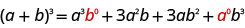

Generally, we don’t show the zero exponents, just as we usually write *x* rather than 1*x*.

Patterns in the expansion of
<math xmlns="http://www.w3.org/1998/Math/MathML"><mrow><msup><mrow><mrow><mo>(</mo><mrow><mi>a</mi><mo>+</mo><mi>b</mi></mrow><mo>)</mo></mrow></mrow><mi>n</mi></msup></mrow></math>

* The number of terms is
  <math xmlns="http://www.w3.org/1998/Math/MathML"><mrow><mi>n</mi><mo>+</mo><mn>1</mn><mo>.</mo></mrow></math>

* The first term is
  <math xmlns="http://www.w3.org/1998/Math/MathML"><mrow><msup><mi>a</mi><mi>n</mi></msup></mrow></math>
  
  and the last term is
  <math xmlns="http://www.w3.org/1998/Math/MathML"><mrow><msup><mi>b</mi><mi>n</mi></msup><mo>.</mo></mrow></math>

* The exponents on *a* decrease by one on each term going left to right.
* The exponents on *b* increase by one on each term going left to right.
* The sum of the exponents on any term is *n*.
{: data-bullet-style="bullet"}

Let’s look at an example to highlight the last three patterns.

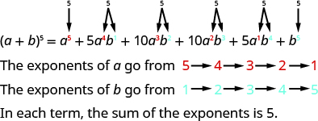

From the patterns we identified, we see the variables in the expansion of <math xmlns="http://www.w3.org/1998/Math/MathML"><mrow><msup><mrow><mrow><mo>(</mo><mrow><mi>a</mi><mo>+</mo><mi>b</mi></mrow><mo>)</mo></mrow></mrow><mi>n</mi></msup><mo>,</mo></mrow></math>

 would be

<math xmlns="http://www.w3.org/1998/Math/MathML"><mrow><msup><mrow><mo stretchy="false">(</mo><mi>a</mi><mo>+</mo><mi>b</mi><mo stretchy="false">)</mo></mrow><mi>n</mi></msup><mo>=</mo><msup><mi>a</mi><mi>n</mi></msup><mo>+</mo><mo stretchy="true">\_\_\_</mo><msup><mi>a</mi><mrow><mi>n</mi><mo>−</mo><mn>1</mn></mrow></msup><msup><mi>b</mi><mn>1</mn></msup><mo>+</mo><mo stretchy="true">\_\_\_</mo><msup><mi>a</mi><mrow><mi>n</mi><mo>−</mo><mn>2</mn></mrow></msup><msup><mi>b</mi><mn>2</mn></msup><mo>+</mo><mn>...</mn><mo>+</mo><mo stretchy="true">\_\_\_</mo><msup><mi>a</mi><mn>1</mn></msup><msup><mi>b</mi><mrow><mi>n</mi><mo>−</mo><mn>1</mn></mrow></msup><mo>+</mo><msup><mi>b</mi><mi>n</mi></msup><mo>.</mo></mrow></math>

To find the coefficients of the terms, we write our expansions again focusing on the coefficients. We rewrite the coefficients to the right forming an array of coefficients.

![A plus b to the power of 0 equals 1. The top level of Pascal&#x2019;s Triangle is 1. A plus b to the power of 1 equals 1 a plus 1 b. The second level of Pascal&#x2019;s Triangle is 1, 1. A plus b to the power of 2 equals 1 a to the power of 2 plus 2 a b plus 1 b to the power of 2. The third level of Pascal&#x2019;s Triangle is 1, 2, 1. A plus b to the power of 3 equals 1 a to the power of 3 plus 3 a to the power of 2 b plus 3 a b to the power of 2 plus 1 b to the power of 3. The fourth level of Pascal&#x2019;s Triangle is 1,3,3,1. A plus b to the power of 4 equals 1 a to the power of 4 plus 4 a to the power of 3 b plus 6 a to the power of 2 b to the power of 2 plus 4 a b to the power of 3 plus 1 b to the power of 4. The fifth level of Pascal&#x2019;s Triangle is 1, 4, 6, 4, 1. A plus b to the power of 5 equals 1 a to the power of 5 plus 5 a to the power of 4 b plus 10 a to the power of 3 b to the power of 2 plus 10 a to the power of 2 b to the power of 3. The sixth row of the Pascal&#x2019;s Triangle is 1, 5, 10, 10, 5, 1.](../resources/CNX_IntAlg_Figure_12_04_002_img.jpg)

The array to the right is called **Pascal’s Triangle**{: data-type="term"}. Notice each number in the array is the sum of the two closest numbers in the row above. We can find the next row by starting and ending with one and then adding two adjacent numbers.

This triangle gives the coefficients of the terms when we expand binomials.

Pascal’s Triangle

In the next example, we will use this triangle and the patterns we recognized to expand the binomial.

Use Pascal’s Triangle to expand <math xmlns="http://www.w3.org/1998/Math/MathML"><mrow><msup><mrow><mrow><mo>(</mo><mrow><mi>x</mi><mo>+</mo><mi>y</mi></mrow><mo>)</mo></mrow></mrow><mn>6</mn></msup><mo>.</mo></mrow></math>

We know the variables for this expansion will follow the pattern we identified. The nonzero exponents of *x* will start at six and decrease to one. The nonzero exponents of *y* will start at one and increase to six. The sum of the exponents in each term will be six. In our pattern, <math xmlns="http://www.w3.org/1998/Math/MathML"><mrow><mi>a</mi><mo>=</mo><mi>x</mi></mrow></math>

 and <math xmlns="http://www.w3.org/1998/Math/MathML"><mrow><mi>b</mi><mo>=</mo><mi>y</mi><mo>.</mo></mrow></math>

<math xmlns="http://www.w3.org/1998/Math/MathML"><mtable><mtr><mtd columnalign="left"><msup><mrow><mo stretchy="false">(</mo><mi>a</mi><mo>+</mo><mi>b</mi><mo stretchy="false">)</mo></mrow><mrow><mi>n</mi></mrow></msup><mo>=</mo><msup><mi>a</mi><mi>n</mi></msup><mo>+</mo><mo stretchy="true">\_\_\_</mo><msup><mi>a</mi><mrow><mi>n</mi><mo>−</mo><mn>1</mn></mrow></msup><msup><mi>b</mi><mn>1</mn></msup><mo>+</mo><mo stretchy="true">\_\_\_</mo><msup><mi>a</mi><mrow><mi>n</mi><mo>−</mo><mn>2</mn></mrow></msup><msup><mi>b</mi><mn>2</mn></msup><mo>+</mo><mn>...</mn><mo>+</mo><mo stretchy="true">\_\_\_</mo><msup><mi>a</mi><mn>1</mn></msup><msup><mi>b</mi><mrow><mi>n</mi><mo>−</mo><mn>1</mn></mrow></msup><mo>+</mo><msup><mi>b</mi><mi>n</mi></msup></mtd></mtr><mtr><mtd columnalign="left"><msup><mrow><mo stretchy="false">(</mo><mi>x</mi><mo>+</mo><mi>y</mi><mo stretchy="false">)</mo></mrow><mrow><mn>6</mn></mrow></msup><mo>=</mo><msup><mrow><mi>x</mi></mrow><mrow><mn>6</mn></mrow></msup><mo>+</mo><mo stretchy="true">\_\_\_</mo><msup><mrow><mi>x</mi></mrow><mrow><mn>5</mn></mrow></msup><msup><mrow><mi>y</mi></mrow><mrow><mn>1</mn></mrow></msup><mo>+</mo><mo stretchy="true">\_\_\_</mo><msup><mrow><mi>x</mi></mrow><mrow><mn>4</mn></mrow></msup><msup><mi>y</mi><mn>2</mn></msup><mo>+</mo><mo stretchy="true">\_\_\_</mo><msup><mi>x</mi><mn>3</mn></msup><msup><mi>y</mi><mn>3</mn></msup><mo>+</mo><mo stretchy="true">\_\_\_</mo><msup><mi>x</mi><mn>2</mn></msup><msup><mi>y</mi><mn>4</mn></msup><mo>+</mo><mo stretchy="true">\_\_\_</mo><msup><mi>x</mi><mn>1</mn></msup><msup><mi>y</mi><mn>5</mn></msup><mo>+</mo><msup><mi>y</mi><mn>6</mn></msup></mtd></mtr></mtable></math>

* * *
{: data-type="newline"}

![This figure shows a plus b to the power of n equals a to the power of n plus a to the power if n minus 1 b to the power of 1 plus a to the power of n minus 2 b to the power if 2 plus ellipsis plus a to the power of 1 b to the power of n minus 1 plus b to the power of n. The next figure shows x plus y to the power of 6 equals x to the power of 6 plus x to the power of 5 y to the power of 1 plus x to the power of 4 y to the power of 2 plus x to the power of 3 y to the power of 3 plus x to the power of 2 y to the power of 4 plus x to the power of 1 y to the power of 5 plus y to the power of 6.](../resources/CNX_IntAlg_Figure_12_04_004_img.jpg)

Use Pascal’s Triangle to expand <math xmlns="http://www.w3.org/1998/Math/MathML"><mrow><msup><mrow><mrow><mo>(</mo><mrow><mi>x</mi><mo>+</mo><mi>y</mi></mrow><mo>)</mo></mrow></mrow><mn>5</mn></msup><mo>.</mo></mrow></math>

<math xmlns="http://www.w3.org/1998/Math/MathML"><mrow><msup><mi>x</mi><mn>5</mn></msup><mo>+</mo><mn>5</mn><msup><mi>x</mi><mn>4</mn></msup><mi>y</mi><mo>+</mo><mn>10</mn><msup><mi>x</mi><mn>3</mn></msup><msup><mi>y</mi><mn>2</mn></msup><mo>+</mo><mn>10</mn><msup><mi>x</mi><mn>2</mn></msup><msup><mi>y</mi><mn>3</mn></msup></mrow></math>

* * *
{: data-type="newline"}

<math xmlns="http://www.w3.org/1998/Math/MathML"><mrow><mo>+</mo><mn>5</mn><mi>x</mi><msup><mi>y</mi><mn>4</mn></msup><mo>+</mo><msup><mi>y</mi><mn>5</mn></msup></mrow></math>

Use Pascal’s Triangle to expand <math xmlns="http://www.w3.org/1998/Math/MathML"><mrow><msup><mrow><mrow><mo>(</mo><mrow><mi>p</mi><mo>+</mo><mi>q</mi></mrow><mo>)</mo></mrow></mrow><mn>7</mn></msup><mo>.</mo></mrow></math>

<math xmlns="http://www.w3.org/1998/Math/MathML"><mrow><msup><mi>p</mi><mn>7</mn></msup><mo>+</mo><mn>7</mn><msup><mi>p</mi><mn>6</mn></msup><mi>q</mi><mo>+</mo><mn>21</mn><msup><mi>p</mi><mn>5</mn></msup><msup><mi>q</mi><mn>2</mn></msup><mo>+</mo><mn>35</mn><msup><mi>p</mi><mn>4</mn></msup><msup><mi>q</mi><mn>3</mn></msup></mrow></math>

* * *
{: data-type="newline"}

<math xmlns="http://www.w3.org/1998/Math/MathML"><mrow><mo>+</mo><mn>35</mn><msup><mi>p</mi><mn>3</mn></msup><msup><mi>q</mi><mn>4</mn></msup><mo>+</mo><mn>21</mn><msup><mi>p</mi><mn>2</mn></msup><msup><mi>q</mi><mn>5</mn></msup><mo>+</mo><mn>7</mn><mi>p</mi><msup><mi>q</mi><mn>6</mn></msup><mo>+</mo><msup><mi>q</mi><mn>7</mn></msup></mrow></math>

In the next example we want to expand a binomial with one variable and one constant. We need to identify the *a* and *b* to carefully apply the pattern.

Use Pascal’s Triangle to expand <math xmlns="http://www.w3.org/1998/Math/MathML"><mrow><msup><mrow><mrow><mo>(</mo><mrow><mi>x</mi><mo>+</mo><mn>3</mn></mrow><mo>)</mo></mrow></mrow><mn>5</mn></msup><mo>.</mo></mrow></math>

We identify the *a* and *b* of the pattern.

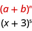

In our pattern, <math xmlns="http://www.w3.org/1998/Math/MathML"><mrow><mi>a</mi><mo>=</mo><mi>x</mi></mrow></math>

 and <math xmlns="http://www.w3.org/1998/Math/MathML"><mrow><mi>b</mi><mo>=</mo><mn>3</mn><mo>.</mo></mrow></math>

We know the variables for this expansion will follow the pattern we identified. The sum of the exponents in each term will be five.

<math xmlns="http://www.w3.org/1998/Math/MathML"><mtable><mtr><mtd><msup><mrow><mo stretchy="false">(</mo><mi>a</mi><mo>+</mo><mi>b</mi><mo stretchy="false">)</mo></mrow><mrow><mi>n</mi></mrow></msup><mo>=</mo><msup><mi>a</mi><mi>n</mi></msup><mo>+</mo><mo stretchy="true">\_\_\_</mo><msup><mi>a</mi><mrow><mi>n</mi><mo>−</mo><mn>1</mn></mrow></msup><msup><mi>b</mi><mn>1</mn></msup><mo>+</mo><mo stretchy="true">\_\_\_</mo><msup><mi>a</mi><mrow><mi>n</mi><mo>−</mo><mn>2</mn></mrow></msup><msup><mi>b</mi><mn>2</mn></msup><mo>+</mo><mn>...</mn><mo>+</mo><mo stretchy="true">\_\_\_</mo><msup><mi>a</mi><mn>1</mn></msup><msup><mi>b</mi><mrow><mi>n</mi><mo>−</mo><mn>1</mn></mrow></msup><mo>+</mo><msup><mi>b</mi><mi>n</mi></msup></mtd></mtr><mtr><mtd><msup><mrow><mo stretchy="false">(</mo><mi>x</mi><mo>+</mo><mn>3</mn><mo stretchy="false">)</mo></mrow><mrow><mn>5</mn></mrow></msup><mo>=</mo><msup><mrow><mi>x</mi></mrow><mn>5</mn></msup><mo>+</mo><mo stretchy="true">\_\_\_</mo><msup><mi>x</mi><mn>4</mn></msup><mo>·</mo><msup><mn>3</mn><mn>1</mn></msup><mo>+</mo><mo stretchy="true">\_\_\_</mo><msup><mi>x</mi><mn>3</mn></msup><mo>·</mo><msup><mn>3</mn><mn>2</mn></msup><mo>+</mo><mo stretchy="true">\_\_\_</mo><msup><mi>x</mi><mn>2</mn></msup><mo>·</mo><msup><mn>3</mn><mn>3</mn></msup><mo>+</mo><mo stretchy="true">\_\_\_</mo><msup><mi>x</mi><mn>1</mn></msup><mo>·</mo><msup><mn>3</mn><mn>4</mn></msup><mo>+</mo><msup><mn>3</mn><mn>5</mn></msup></mtd></mtr></mtable></math>

* * *
{: data-type="newline"}

![This figure shows Pascal&#x2019;s Triangle. The first level is 1. The second level is 1, 1. The third level is 1, 2, 1. The fourth level is 1, 3, 3, 1. The fifth level is 1, 4, 6, 4, 1. The sixth level is 1, 5, 10, 10, 5, 1. The seventh level is 1, 6, 15, 20, 15, 6, 1. This figure shows X plus 3 to the power of 5 equals 1 x to the power of 5 g 3 x to the power of 4 plus 10 g 9 x to the power of 3 plus 10 g 27 x to the power of 2 plus 5 g 81 x to the power of 1 plus 1 g 243. Then, x plus 3 to the power of 5 equals x to the power of 5 plus 15 x to the power of 4 plus 90 x to the power of 3 plus 270 x to the power of 2 plus 405 plus 243.](../resources/CNX_IntAlg_Figure_12_04_006_img.jpg)

Use Pascal’s Triangle to expand <math xmlns="http://www.w3.org/1998/Math/MathML"><mrow><msup><mrow><mrow><mo>(</mo><mrow><mi>x</mi><mo>+</mo><mn>2</mn></mrow><mo>)</mo></mrow></mrow><mn>4</mn></msup><mo>.</mo></mrow></math>

<math xmlns="http://www.w3.org/1998/Math/MathML"><mrow><msup><mi>x</mi><mn>4</mn></msup><mo>+</mo><mn>8</mn><msup><mi>x</mi><mn>3</mn></msup><mo>+</mo><mn>24</mn><msup><mi>x</mi><mn>2</mn></msup><mo>+</mo><mn>32</mn><mi>x</mi><mo>+</mo><mn>16</mn></mrow></math>

Use Pascal’s Triangle to expand <math xmlns="http://www.w3.org/1998/Math/MathML"><mrow><msup><mrow><mrow><mo>(</mo><mrow><mi>x</mi><mo>+</mo><mn>1</mn></mrow><mo>)</mo></mrow></mrow><mn>6</mn></msup><mo>.</mo></mrow></math>

<math xmlns="http://www.w3.org/1998/Math/MathML"><mrow><msup><mi>x</mi><mn>6</mn></msup><mo>+</mo><mn>6</mn><msup><mi>x</mi><mn>5</mn></msup><mo>+</mo><mn>15</mn><msup><mi>x</mi><mn>4</mn></msup><mo>+</mo><mn>20</mn><msup><mi>x</mi><mn>3</mn></msup><mo>+</mo><mn>15</mn><msup><mi>x</mi><mn>2</mn></msup></mrow></math>

* * *
{: data-type="newline"}

<math xmlns="http://www.w3.org/1998/Math/MathML"><mrow><mo>+</mo><mn>6</mn><mi>x</mi><mo>+</mo><mn>1</mn></mrow></math>

In the next example, the binomial is a difference and the first term has a constant times the variable. Once we identify the *a* and *b* of the pattern, we must once again carefully apply the pattern.

Use Pascal’s Triangle to expand <math xmlns="http://www.w3.org/1998/Math/MathML"><mrow><msup><mrow><mrow><mo>(</mo><mrow><mn>3</mn><mi>x</mi><mo>−</mo><mn>2</mn></mrow><mo>)</mo></mrow></mrow><mn>4</mn></msup><mo>.</mo></mrow></math>

We identify the *a* and *b* of the pattern.

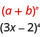

In our pattern, <math xmlns="http://www.w3.org/1998/Math/MathML"><mrow><mi>a</mi><mo>=</mo><mn>3</mn><mi>x</mi></mrow></math>

 and <math xmlns="http://www.w3.org/1998/Math/MathML"><mrow><mi>b</mi><mo>=</mo><mn>−2</mn><mo>.</mo></mrow></math>

* * *
{: data-type="newline"}

<math xmlns="http://www.w3.org/1998/Math/MathML"><mtable><mtr><mtd columnalign="left"><msup><mrow><mo stretchy="false">(</mo><mi>a</mi><mo>+</mo><mi>b</mi><mo stretchy="false">)</mo></mrow><mrow><mi>n</mi></mrow></msup><mo>=</mo><msup><mi>a</mi><mi>n</mi></msup><mo>+</mo><mo stretchy="true">\_\_\_</mo><msup><mi>a</mi><mrow><mi>n</mi><mo>−</mo><mn>1</mn></mrow></msup><msup><mi>b</mi><mn>1</mn></msup><mo>+</mo><mo stretchy="true">\_\_\_</mo><msup><mi>a</mi><mrow><mi>n</mi><mo>−</mo><mn>2</mn></mrow></msup><msup><mi>b</mi><mn>2</mn></msup><mo>+</mo><mn>...</mn><mo>+</mo><mo stretchy="true">\_\_\_</mo><msup><mi>a</mi><mn>1</mn></msup><msup><mi>b</mi><mrow><mi>n</mi><mo>−</mo><mn>1</mn></mrow></msup><mo>+</mo><msup><mi>b</mi><mi>n</mi></msup></mtd></mtr><mtr><mtd columnalign="left"><msup><mrow><mo stretchy="false">(</mo><mn>3</mn><mi>x</mi><mo>−</mo><mn>2</mn><mo stretchy="false">)</mo></mrow><mrow><mn>4</mn></mrow></msup><mo>=</mo><mn>1</mn><mo>·</mo><msup><mo stretchy="false">(</mo><mn>3</mn><mi>x</mi><mo stretchy="false">)</mo><mn>4</mn></msup><mo>+</mo><mn>4</mn><msup><mrow><mo>(</mo><mrow><mn>3</mn><mi>x</mi></mrow><mo>)</mo></mrow><mn>3</mn></msup><msup><mrow><mo>(</mo><mrow><mn>−2</mn></mrow><mo>)</mo></mrow><mn>1</mn></msup><mo>+</mo><mn>6</mn><msup><mrow><mo>(</mo><mrow><mn>3</mn><mi>x</mi></mrow><mo>)</mo></mrow><mn>2</mn></msup><msup><mrow><mo>(</mo><mrow><mn>−2</mn></mrow><mo>)</mo></mrow><mn>2</mn></msup><mo>+</mo><mn>4</mn><msup><mrow><mo>(</mo><mrow><mn>3</mn><mi>x</mi></mrow><mo>)</mo></mrow><mn>1</mn></msup><msup><mrow><mo>(</mo><mrow><mn>−2</mn></mrow><mo>)</mo></mrow><mn>3</mn></msup><mo>+</mo><mn>1</mn><mo>·</mo><msup><mrow><mo>(</mo><mrow><mn>−2</mn></mrow><mo>)</mo></mrow><mn>4</mn></msup></mtd></mtr><mtr><mtd columnalign="left"><msup><mrow><mo stretchy="false">(</mo><mn>3</mn><mi>x</mi><mo>−</mo><mn>2</mn><mo stretchy="false">)</mo></mrow><mrow><mn>4</mn></mrow></msup><mo>=</mo><mn>81</mn><msup><mi>x</mi><mn>4</mn></msup><mo>+</mo><mn>4</mn><mrow><mo>(</mo><mrow><mn>27</mn><msup><mi>x</mi><mn>3</mn></msup></mrow><mo>)</mo></mrow><mrow><mo>(</mo><mrow><mn>−2</mn></mrow><mo>)</mo></mrow><mo>+</mo><mn>6</mn><mrow><mo>(</mo><mrow><mn>9</mn><msup><mi>x</mi><mn>2</mn></msup></mrow><mo>)</mo></mrow><mrow><mo>(</mo><mn>4</mn><mo>)</mo></mrow><mo>+</mo><mn>4</mn><mrow><mo>(</mo><mrow><mn>3</mn><mi>x</mi></mrow><mo>)</mo></mrow><mrow><mo>(</mo><mrow><mn>−8</mn></mrow><mo>)</mo></mrow><mo>+</mo><mn>1</mn><mo>·</mo><mn>16</mn></mtd></mtr><mtr><mtd columnalign="left"><msup><mrow><mo stretchy="false">(</mo><mn>3</mn><mi>x</mi><mo>−</mo><mn>2</mn><mo stretchy="false">)</mo></mrow><mrow><mn>4</mn></mrow></msup><mo>=</mo><mn>81</mn><msup><mi>x</mi><mn>4</mn></msup><mo>−</mo><mn>216</mn><msup><mi>x</mi><mn>3</mn></msup><mo>+</mo><mn>216</mn><msup><mi>x</mi><mn>2</mn></msup><mo>−</mo><mn>96</mn><mi>x</mi><mo>+</mo><mn>16</mn></mtd></mtr></mtable></math>

Use Pascal’s Triangle to expand <math xmlns="http://www.w3.org/1998/Math/MathML"><mrow><msup><mrow><mrow><mo>(</mo><mrow><mn>2</mn><mi>x</mi><mo>−</mo><mn>3</mn></mrow><mo>)</mo></mrow></mrow><mn>4</mn></msup><mo>.</mo></mrow></math>

<math xmlns="http://www.w3.org/1998/Math/MathML"><mrow><mn>16</mn><msup><mi>x</mi><mn>4</mn></msup><mo>−</mo><mn>96</mn><msup><mi>x</mi><mn>3</mn></msup><mo>+</mo><mn>216</mn><msup><mi>x</mi><mn>2</mn></msup><mo>−</mo><mn>216</mn><mi>x</mi><mo>+</mo><mn>81</mn></mrow></math>

Use Pascal’s Triangle to expand <math xmlns="http://www.w3.org/1998/Math/MathML"><mrow><msup><mrow><mrow><mo>(</mo><mrow><mn>2</mn><mi>x</mi><mo>−</mo><mn>1</mn></mrow><mo>)</mo></mrow></mrow><mn>6</mn></msup><mo>.</mo></mrow></math>

<math xmlns="http://www.w3.org/1998/Math/MathML"><mrow><mn>64</mn><msup><mi>x</mi><mn>6</mn></msup><mo>−</mo><mn>192</mn><msup><mi>x</mi><mn>5</mn></msup><mo>+</mo><mn>240</mn><msup><mi>x</mi><mn>4</mn></msup><mo>−</mo><mn>160</mn><msup><mi>x</mi><mn>3</mn></msup></mrow></math>

* * *
{: data-type="newline"}

<math xmlns="http://www.w3.org/1998/Math/MathML"><mrow><mo>+</mo><mn>60</mn><msup><mi>x</mi><mn>2</mn></msup><mo>−</mo><mn>12</mn><mi>x</mi><mo>+</mo><mn>1</mn></mrow></math>

### Evaluate a Binomial Coefficient

While Pascal’s Triangle is one method to expand a binomial, we will also look at another method. Before we get to that, we need to introduce some more **factorial notation**{: data-type="term" .no-emphasis}. This notation is not only used to expand binomials, but also in the study and use of probability.

To find the coefficients of the terms of expanded binomials, we will need to be able to evaluate the notation <math xmlns="http://www.w3.org/1998/Math/MathML"><mrow><mrow><mo>(</mo><mtable><mtr><mtd columnalign="left"><mi>n</mi></mtd></mtr><mtr><mtd columnalign="left"><mi>r</mi></mtd></mtr></mtable><mo>)</mo></mrow></mrow></math>

 which is called a **binomial coefficient**{: data-type="term" .no-emphasis}. We read <math xmlns="http://www.w3.org/1998/Math/MathML"><mrow><mrow><mo>(</mo><mtable><mtr><mtd columnalign="left"><mi>n</mi></mtd></mtr><mtr><mtd columnalign="left"><mi>r</mi></mtd></mtr></mtable><mo>)</mo></mrow></mrow></math>

 as “*n* choose *r*” or “*n* taken *r* at a time”.

Binomial Coefficient
<math xmlns="http://www.w3.org/1998/Math/MathML"><mrow><mrow><mo>(</mo><mtable><mtr><mtd columnalign="left"><mi>n</mi></mtd></mtr><mtr><mtd columnalign="left"><mi>r</mi></mtd></mtr></mtable><mo>)</mo></mrow></mrow></math>

A binomial coefficient <math xmlns="http://www.w3.org/1998/Math/MathML"><mrow><mrow><mo>(</mo><mtable><mtr><mtd columnalign="left"><mi>n</mi></mtd></mtr><mtr><mtd columnalign="left"><mi>r</mi></mtd></mtr></mtable><mo>)</mo></mrow><mo>,</mo></mrow></math>

 where *r* and *n* are integers with <math xmlns="http://www.w3.org/1998/Math/MathML"><mrow><mn>0</mn><mo>≤</mo><mi>r</mi><mo>≤</mo><mi>n</mi><mo>,</mo></mrow></math>

 is defined as

<math xmlns="http://www.w3.org/1998/Math/MathML"><mrow><mrow><mo>(</mo><mtable><mtr><mtd columnalign="left"><mi>n</mi></mtd></mtr><mtr><mtd columnalign="left"><mi>r</mi></mtd></mtr></mtable><mo>)</mo></mrow><mo>=</mo><mfrac><mrow><mi>n</mi><mo>!</mo></mrow><mrow><mi>r</mi><mo>!</mo><mrow><mo>(</mo><mrow><mi>n</mi><mo>−</mo><mi>r</mi></mrow><mo>)</mo></mrow><mo>!</mo></mrow></mfrac></mrow></math>

We read <math xmlns="http://www.w3.org/1998/Math/MathML"><mrow><mrow><mo>(</mo><mtable><mtr><mtd columnalign="left"><mi>n</mi></mtd></mtr><mtr><mtd columnalign="left"><mi>r</mi></mtd></mtr></mtable><mo>)</mo></mrow></mrow></math>

 as “*n* choose *r*” or “*n* taken *r* at a time”.

Evaluate: ⓐ <math xmlns="http://www.w3.org/1998/Math/MathML"><mrow><mrow><mo>(</mo><mtable><mtr><mtd columnalign="left"><mn>5</mn></mtd></mtr><mtr><mtd columnalign="left"><mn>1</mn></mtd></mtr></mtable><mo>)</mo></mrow></mrow></math>

 ⓑ <math xmlns="http://www.w3.org/1998/Math/MathML"><mrow><mrow><mo>(</mo><mtable><mtr><mtd columnalign="left"><mn>7</mn></mtd></mtr><mtr><mtd columnalign="left"><mn>7</mn></mtd></mtr></mtable><mo>)</mo></mrow></mrow></math>

 ⓒ <math xmlns="http://www.w3.org/1998/Math/MathML"><mrow><mrow><mo>(</mo><mtable><mtr><mtd columnalign="left"><mn>4</mn></mtd></mtr><mtr><mtd columnalign="left"><mn>0</mn></mtd></mtr></mtable><mo>)</mo></mrow></mrow></math>

 ⓓ <math xmlns="http://www.w3.org/1998/Math/MathML"><mrow><mrow><mo>(</mo><mtable><mtr><mtd columnalign="left"><mn>8</mn></mtd></mtr><mtr><mtd columnalign="left"><mn>5</mn></mtd></mtr></mtable><mo>)</mo></mrow><mo>.</mo></mrow></math>

ⓐ We will use the definition of a binomial coefficient, <math xmlns="http://www.w3.org/1998/Math/MathML"><mrow><mrow><mo>(</mo><mtable><mtr><mtd columnalign="left"><mi>n</mi></mtd></mtr><mtr><mtd columnalign="left"><mi>r</mi></mtd></mtr></mtable><mo>)</mo></mrow><mo>=</mo><mfrac><mrow><mi>n</mi><mo>!</mo></mrow><mrow><mi>r</mi><mo>!</mo><mrow><mo>(</mo><mrow><mi>n</mi><mo>−</mo><mi>r</mi></mrow><mo>)</mo></mrow><mo>!</mo></mrow></mfrac><mo>.</mo></mrow></math>

<math xmlns="http://www.w3.org/1998/Math/MathML"><mrow><mtable> <mtr><mtd /><mtd /><mtd /><mtd columnalign="center"><mspace width="4em" /><mrow><mo>(</mo><mtable><mtr><mtd columnalign="left"><mn>5</mn></mtd></mtr><mtr><mtd columnalign="left"><mn>1</mn></mtd></mtr></mtable><mo>)</mo></mrow></mtd></mtr><mtr /><mtr /> <mtr><mtd columnalign="left"><mtable><mtr><mtd columnalign="left"><mtext>Use the definition,</mtext><mrow><mo>(</mo><mtable><mtr><mtd columnalign="left"><mi>n</mi></mtd></mtr><mtr><mtd columnalign="left"><mi>r</mi></mtd></mtr></mtable><mo>)</mo></mrow><mo>=</mo><mfrac><mrow><mi>n</mi><mo>!</mo></mrow><mrow><mi>r</mi><mo>!</mo><mrow><mo>(</mo><mrow><mi>n</mi><mo>−</mo><mi>r</mi></mrow><mo>)</mo></mrow><mo>!</mo></mrow></mfrac><mo>,</mo><mtext>where</mtext></mtd></mtr><mtr><mtd columnalign="left"><mi>n</mi><mo>=</mo><mn>5</mn><mo>,</mo><mi>r</mi><mo>=</mo><mn>1</mn><mo>.</mo></mtd></mtr></mtable></mtd><mtd /><mtd /><mtd columnalign="center"><mspace width="4em" /><mfrac><mrow><mn>5</mn><mo>!</mo></mrow><mrow><mn>1</mn><mo>!</mo><mrow><mo>(</mo><mrow><mn>5</mn><mo>−</mo><mn>1</mn></mrow><mo>)</mo></mrow><mo>!</mo></mrow></mfrac></mtd></mtr><mtr /><mtr /> <mtr><mtd columnalign="left"><mtext>Simplify.</mtext></mtd><mtd /><mtd /><mtd columnalign="center"><mspace width="4em" /><mfrac><mrow><mn>5</mn><mo>!</mo></mrow><mrow><mn>1</mn><mo>!</mo><mrow><mo>(</mo><mn>4</mn><mo>)</mo></mrow><mo>!</mo></mrow></mfrac></mtd></mtr><mtr /><mtr /> <mtr><mtd columnalign="left"><mtext>Rewrite</mtext><mspace width="0.2em" /><mn>5</mn><mo>!</mo><mspace width="0.2em" /><mtext>as</mtext><mspace width="0.2em" /><mn>5</mn><mo>·</mo><mn>4</mn><mo>!</mo></mtd><mtd /><mtd /><mtd columnalign="center"><mspace width="4em" /><mfrac><mrow><mn>5</mn><mo>·</mo><mn>4</mn><mo>!</mo></mrow><mrow><mn>1</mn><mo>!</mo><mo>·</mo><mn>4</mn><mo>!</mo></mrow></mfrac></mtd></mtr><mtr /><mtr /> <mtr><mtd columnalign="left"><mtext>Simplify, by removing common factors.</mtext></mtd><mtd /><mtd /><mtd columnalign="center"><mspace width="4em" /><mfrac><mrow><mn>5</mn><mo>·</mo><menclose notation="updiagonalstrike"><mrow><mn>4</mn><mo>!</mo></mrow></menclose></mrow><mrow><mn>1</mn><mo>·</mo><menclose notation="updiagonalstrike"><mrow><mn>4</mn><mo>!</mo></mrow></menclose></mrow></mfrac></mtd></mtr><mtr /><mtr /> <mtr><mtd columnalign="left"><mtext>Simplify.</mtext></mtd><mtd /><mtd /><mtd columnalign="center"><mspace width="4em" /><mn>5</mn></mtd></mtr><mtr /><mtr /> <mtr><mtd /><mtd /><mtd /><mtd columnalign="center"><mspace width="4em" /><mrow><mo>(</mo><mtable><mtr><mtd columnalign="left"><mn>5</mn></mtd></mtr><mtr><mtd columnalign="left"><mn>1</mn></mtd></mtr></mtable><mo>)</mo></mrow><mo>=</mo><mn>5</mn></mtd></mtr></mtable></mrow></math>

ⓑ

<math xmlns="http://www.w3.org/1998/Math/MathML"><mrow><mtable> <mtr><mtd /><mtd /><mtd /><mtd columnalign="center"><mspace width="4em" /><mrow><mo>(</mo><mtable><mtr><mtd columnalign="left"><mn>7</mn></mtd></mtr><mtr><mtd columnalign="left"><mn>7</mn></mtd></mtr></mtable><mo>)</mo></mrow></mtd></mtr><mtr /><mtr /> <mtr><mtd columnalign="left"><mtable><mtr><mtd columnalign="left"><mtext>Use the definition,</mtext><mspace width="0.2em" /><mrow><mo>(</mo><mtable><mtr><mtd columnalign="left"><mi>n</mi></mtd></mtr><mtr><mtd columnalign="left"><mi>r</mi></mtd></mtr></mtable><mo>)</mo></mrow><mo>=</mo><mfrac><mrow><mi>n</mi><mo>!</mo></mrow><mrow><mi>r</mi><mo>!</mo><mrow><mo>(</mo><mrow><mi>n</mi><mo>−</mo><mi>r</mi></mrow><mo>)</mo></mrow><mo>!</mo></mrow></mfrac><mo>,</mo><mtext>where</mtext></mtd></mtr><mtr><mtd columnalign="left"><mi>n</mi><mo>=</mo><mn>7</mn><mo>,</mo><mi>r</mi><mo>=</mo><mn>7</mn><mo>.</mo></mtd></mtr></mtable></mtd><mtd /><mtd /><mtd columnalign="center"><mspace width="4em" /><mfrac><mrow><mn>7</mn><mo>!</mo></mrow><mrow><mn>7</mn><mo>!</mo><mrow><mo>(</mo><mrow><mn>7</mn><mo>−</mo><mn>7</mn></mrow><mo>)</mo></mrow><mo>!</mo></mrow></mfrac></mtd></mtr><mtr /><mtr /> <mtr><mtd columnalign="left"><mtext>Simplify.</mtext></mtd><mtd /><mtd /><mtd columnalign="center"><mspace width="4em" /><mfrac><mrow><mn>7</mn><mo>!</mo></mrow><mrow><mn>7</mn><mo>!</mo><mrow><mo>(</mo><mn>0</mn><mo>)</mo></mrow><mo>!</mo></mrow></mfrac></mtd></mtr><mtr /><mtr /> <mtr><mtd columnalign="left"><mtext>Simplify. Remember</mtext><mspace width="0.2em" /><mn>0</mn><mo>!</mo><mo>=</mo><mn>1</mn><mo>.</mo></mtd><mtd /><mtd /><mtd columnalign="center"><mspace width="4em" /><mn>1</mn></mtd></mtr><mtr /><mtr /> <mtr><mtd /><mtd /><mtd /><mtd columnalign="center"><mspace width="4em" /><mrow><mo>(</mo><mtable><mtr><mtd columnalign="left"><mn>7</mn></mtd></mtr><mtr><mtd columnalign="left"><mn>7</mn></mtd></mtr></mtable><mo>)</mo></mrow><mo>=</mo><mn>1</mn></mtd></mtr></mtable></mrow></math>

ⓒ

<math xmlns="http://www.w3.org/1998/Math/MathML"><mrow><mtable> <mtr><mtd /><mtd /><mtd /><mtd columnalign="center"><mspace width="4em" /><mrow><mo>(</mo><mtable><mtr><mtd columnalign="left"><mn>4</mn></mtd></mtr><mtr><mtd columnalign="left"><mn>0</mn></mtd></mtr></mtable><mo>)</mo></mrow></mtd></mtr><mtr /><mtr /> <mtr><mtd columnalign="left"><mtable><mtr><mtd columnalign="left"><mtext>Use the definition,</mtext><mspace width="0.2em" /><mrow><mo>(</mo><mtable><mtr><mtd columnalign="left"><mi>n</mi></mtd></mtr><mtr><mtd columnalign="left"><mi>r</mi></mtd></mtr></mtable><mo>)</mo></mrow><mo>=</mo><mfrac><mrow><mi>n</mi><mo>!</mo></mrow><mrow><mi>r</mi><mo>!</mo><mrow><mo>(</mo><mrow><mi>n</mi><mo>−</mo><mi>r</mi></mrow><mo>)</mo></mrow><mo>!</mo></mrow></mfrac><mo>,</mo><mtext>where</mtext></mtd></mtr><mtr><mtd columnalign="left"><mi>n</mi><mo>=</mo><mn>4</mn><mo>,</mo><mi>r</mi><mo>=</mo><mn>0</mn><mo>.</mo></mtd></mtr></mtable></mtd><mtd /><mtd /><mtd columnalign="center"><mspace width="4em" /><mfrac><mrow><mn>4</mn><mo>!</mo></mrow><mrow><mn>0</mn><mo>!</mo><mrow><mo>(</mo><mrow><mn>4</mn><mo>−</mo><mn>0</mn></mrow><mo>)</mo></mrow><mo>!</mo></mrow></mfrac></mtd></mtr><mtr /><mtr /> <mtr><mtd columnalign="left"><mtext>Simplify.</mtext></mtd><mtd /><mtd /><mtd columnalign="center"><mspace width="4em" /><mfrac><mrow><mn>4</mn><mo>!</mo></mrow><mrow><mn>0</mn><mo>!</mo><mrow><mo>(</mo><mn>4</mn><mo>)</mo></mrow><mo>!</mo></mrow></mfrac></mtd></mtr><mtr /><mtr /> <mtr><mtd columnalign="left"><mtext>Simplify.</mtext></mtd><mtd /><mtd /><mtd columnalign="center"><mspace width="4em" /><mn>1</mn></mtd></mtr><mtr /><mtr /> <mtr><mtd /><mtd /><mtd /><mtd columnalign="center"><mspace width="4em" /><mrow><mo>(</mo><mtable><mtr><mtd columnalign="left"><mn>4</mn></mtd></mtr><mtr><mtd columnalign="left"><mn>0</mn></mtd></mtr></mtable><mo>)</mo></mrow><mo>=</mo><mn>1</mn></mtd></mtr></mtable></mrow></math>

ⓓ

<math xmlns="http://www.w3.org/1998/Math/MathML"><mrow><mtable> <mtr><mtd /><mtd /><mtd /><mtd columnalign="center"><mspace width="1.5em" /><mrow><mo>(</mo><mtable><mtr><mtd columnalign="left"><mn>8</mn></mtd></mtr><mtr><mtd columnalign="left"><mn>5</mn></mtd></mtr></mtable><mo>)</mo></mrow></mtd></mtr><mtr /><mtr /> <mtr><mtd columnalign="left"><mtable><mtr><mtd columnalign="left"><mtext>Use the definition,</mtext><mspace width="0.2em" /><mrow><mo>(</mo><mtable><mtr><mtd columnalign="left"><mi>n</mi></mtd></mtr><mtr><mtd columnalign="left"><mi>r</mi></mtd></mtr></mtable><mo>)</mo></mrow><mo>=</mo><mfrac><mrow><mi>n</mi><mo>!</mo></mrow><mrow><mi>r</mi><mo>!</mo><mrow><mo>(</mo><mrow><mi>n</mi><mo>−</mo><mi>r</mi></mrow><mo>)</mo></mrow><mo>!</mo></mrow></mfrac><mo>,</mo><mtext>where</mtext></mtd></mtr><mtr><mtd columnalign="left"><mi>n</mi><mo>=</mo><mn>8</mn><mo>,</mo><mi>r</mi><mo>=</mo><mn>5</mn><mo>.</mo></mtd></mtr></mtable></mtd><mtd /><mtd /><mtd columnalign="center"><mspace width="1.5em" /><mfrac><mrow><mn>8</mn><mo>!</mo></mrow><mrow><mn>5</mn><mo>!</mo><mrow><mo>(</mo><mrow><mn>8</mn><mo>−</mo><mn>5</mn></mrow><mo>)</mo></mrow><mo>!</mo></mrow></mfrac></mtd></mtr><mtr /><mtr /> <mtr><mtd columnalign="left"><mtext>Simplify.</mtext></mtd><mtd /><mtd /><mtd columnalign="center"><mspace width="1.5em" /><mfrac><mrow><mn>8</mn><mo>!</mo></mrow><mrow><mn>5</mn><mo>!</mo><mrow><mo>(</mo><mn>3</mn><mo>)</mo></mrow><mo>!</mo></mrow></mfrac></mtd></mtr><mtr /><mtr /> <mtr><mtd columnalign="left"><mtext>Rewrite</mtext><mspace width="0.2em" /><mn>8</mn><mo>!</mo><mspace width="0.2em" /><mtext>as</mtext><mspace width="0.2em" /><mn>8</mn><mo>·</mo><mn>7</mn><mo>·</mo><mn>6</mn><mo>·</mo><mn>5</mn><mo>!</mo><mspace width="0.2em" /><mtext>and remove common factors.</mtext></mtd><mtd /><mtd /><mtd columnalign="center"><mspace width="1.5em" /><mfrac><mrow><mn>8</mn><mo>·</mo><mn>7</mn><mo>·</mo><menclose notation="updiagonalstrike"><mrow><mn>6</mn></mrow></menclose><mo>·</mo><menclose notation="updiagonalstrike"><mrow><mn>5</mn><mo>!</mo></mrow></menclose></mrow><mrow><menclose notation="updiagonalstrike"><mrow><mn>5</mn><mo>!</mo></mrow></menclose><mo>·</mo><menclose notation="updiagonalstrike"><mn>3</mn></menclose><mo>·</mo><menclose notation="updiagonalstrike"><mn>2</mn></menclose><mo>·</mo><mn>1</mn></mrow></mfrac></mtd></mtr><mtr /><mtr /> <mtr><mtd columnalign="left"><mtext>Simplify.</mtext></mtd><mtd /><mtd /><mtd columnalign="center"><mspace width="1.5em" /><mn>56</mn></mtd></mtr><mtr /><mtr /> <mtr><mtd /><mtd /><mtd /><mtd columnalign="center"><mspace width="1.5em" /><mrow><mo>(</mo><mtable><mtr><mtd columnalign="left"><mn>8</mn></mtd></mtr><mtr><mtd columnalign="left"><mn>5</mn></mtd></mtr></mtable><mo>)</mo></mrow><mo>=</mo><mn>56</mn></mtd></mtr></mtable></mrow></math>

Evaluate each binomial coefficient:

ⓐ <math xmlns="http://www.w3.org/1998/Math/MathML"><mrow><mrow><mo>(</mo><mtable><mtr><mtd columnalign="left"><mn>6</mn></mtd></mtr><mtr><mtd columnalign="left"><mn>1</mn></mtd></mtr></mtable><mo>)</mo></mrow></mrow></math>

 ⓑ <math xmlns="http://www.w3.org/1998/Math/MathML"><mrow><mrow><mo>(</mo><mtable><mtr><mtd columnalign="left"><mn>8</mn></mtd></mtr><mtr><mtd columnalign="left"><mn>8</mn></mtd></mtr></mtable><mo>)</mo></mrow></mrow></math>

 ⓒ <math xmlns="http://www.w3.org/1998/Math/MathML"><mrow><mrow><mo>(</mo><mtable><mtr><mtd columnalign="left"><mn>5</mn></mtd></mtr><mtr><mtd columnalign="left"><mn>0</mn></mtd></mtr></mtable><mo>)</mo></mrow></mrow></math>

 ⓓ <math xmlns="http://www.w3.org/1998/Math/MathML"><mrow><mrow><mo>(</mo><mtable><mtr><mtd columnalign="left"><mn>7</mn></mtd></mtr><mtr><mtd columnalign="left"><mn>3</mn></mtd></mtr></mtable><mo>)</mo></mrow><mo>.</mo></mrow></math>

ⓐ 6 ⓑ 1 ⓒ 1 ⓓ 35

Evaluate each binomial coefficient:

ⓐ <math xmlns="http://www.w3.org/1998/Math/MathML"><mrow><mrow><mo>(</mo><mtable><mtr><mtd columnalign="left"><mn>2</mn></mtd></mtr><mtr><mtd columnalign="left"><mn>1</mn></mtd></mtr></mtable><mo>)</mo></mrow></mrow></math>

 ⓑ <math xmlns="http://www.w3.org/1998/Math/MathML"><mrow><mrow><mo>(</mo><mtable><mtr><mtd columnalign="left"><mn>11</mn></mtd></mtr><mtr><mtd columnalign="left"><mn>11</mn></mtd></mtr></mtable><mo>)</mo></mrow></mrow></math>

 ⓒ <math xmlns="http://www.w3.org/1998/Math/MathML"><mrow><mrow><mo>(</mo><mtable><mtr><mtd columnalign="left"><mn>9</mn></mtd></mtr><mtr><mtd columnalign="left"><mn>0</mn></mtd></mtr></mtable><mo>)</mo></mrow></mrow></math>

 ⓓ <math xmlns="http://www.w3.org/1998/Math/MathML"><mrow><mrow><mo>(</mo><mtable><mtr><mtd columnalign="left"><mn>6</mn></mtd></mtr><mtr><mtd columnalign="left"><mn>5</mn></mtd></mtr></mtable><mo>)</mo></mrow><mo>.</mo></mrow></math>

ⓐ 2 ⓑ 1 ⓒ 1 ⓓ 6

In the previous example, parts (a), (b), (c) demonstrate some special properties of binomial coefficients.

Properties of Binomial Coefficients

<math xmlns="http://www.w3.org/1998/Math/MathML"><mrow><mrow><mo>(</mo><mtable><mtr><mtd columnalign="left"><mi>n</mi></mtd></mtr><mtr><mtd columnalign="left"><mn>1</mn></mtd></mtr></mtable><mo>)</mo></mrow><mo>=</mo><mi>n</mi><mspace width="4em" /><mrow><mo>(</mo><mtable><mtr><mtd columnalign="left"><mi>n</mi></mtd></mtr><mtr><mtd columnalign="left"><mi>n</mi></mtd></mtr></mtable><mo>)</mo></mrow><mo>=</mo><mn>1</mn><mspace width="4em" /><mrow><mo>(</mo><mtable><mtr><mtd columnalign="left"><mi>n</mi></mtd></mtr><mtr><mtd columnalign="left"><mn>0</mn></mtd></mtr></mtable><mo>)</mo></mrow><mo>=</mo><mn>1</mn></mrow></math>

### Use the Binomial Theorem to Expand a Binomial

We are now ready to use the alternate method of expanding binomials. The **Binomial Theorem**{: data-type="term"} uses the same pattern for the variables, but uses the binomial coefficient for the coefficient of each term.

Binomial Theorem

For any real numbers *a* and *b*, and positive integer *n*,

<math xmlns="http://www.w3.org/1998/Math/MathML"><mrow><msup><mrow><mo stretchy="false">(</mo><mi>a</mi><mo>+</mo><mi>b</mi><mo stretchy="false">)</mo></mrow><mi>n</mi></msup><mo>=</mo><mrow><mo>(</mo><mtable><mtr><mtd columnalign="left"><mi>n</mi></mtd></mtr><mtr><mtd columnalign="left"><mn>0</mn></mtd></mtr></mtable><mo>)</mo></mrow><msup><mi>a</mi><mi>n</mi></msup><mo>+</mo><mrow><mo>(</mo><mtable><mtr><mtd columnalign="left"><mi>n</mi></mtd></mtr><mtr><mtd columnalign="left"><mn>1</mn></mtd></mtr></mtable><mo>)</mo></mrow><msup><mi>a</mi><mrow><mi>n</mi><mo>−</mo><mn>1</mn></mrow></msup><msup><mi>b</mi><mn>1</mn></msup><mo>+</mo><mrow><mo>(</mo><mtable><mtr><mtd columnalign="left"><mi>n</mi></mtd></mtr><mtr><mtd columnalign="left"><mn>2</mn></mtd></mtr></mtable><mo>)</mo></mrow><msup><mi>a</mi><mrow><mi>n</mi><mo>−</mo><mn>2</mn></mrow></msup><msup><mi>b</mi><mn>2</mn></msup><mo>+</mo><mn>...</mn><mo>+</mo><mrow><mo>(</mo><mtable><mtr><mtd columnalign="left"><mi>n</mi></mtd></mtr><mtr><mtd columnalign="left"><mi>r</mi></mtd></mtr></mtable><mo>)</mo></mrow><msup><mi>a</mi><mrow><mi>n</mi><mo>−</mo><mi>r</mi></mrow></msup><msup><mi>b</mi><mi>r</mi></msup><mo>+</mo><mn>...</mn><mo>+</mo><mrow><mo>(</mo><mtable><mtr><mtd columnalign="left"><mi>n</mi></mtd></mtr><mtr><mtd columnalign="left"><mi>n</mi></mtd></mtr></mtable><mo>)</mo></mrow><msup><mi>b</mi><mi>n</mi></msup></mrow></math>

Use the Binomial Theorem to expand <math xmlns="http://www.w3.org/1998/Math/MathML"><mrow><msup><mrow><mrow><mo>(</mo><mrow><mi>p</mi><mo>+</mo><mi>q</mi></mrow><mo>)</mo></mrow></mrow><mn>4</mn></msup><mo>.</mo></mrow></math>

We identify the *a* and *b* of the pattern.

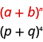

In our pattern, <math xmlns="http://www.w3.org/1998/Math/MathML"><mrow><mi>a</mi><mo>=</mo><mi>p</mi></mrow></math>

 and <math xmlns="http://www.w3.org/1998/Math/MathML"><mrow><mi>b</mi><mo>=</mo><mi>q</mi><mo>.</mo></mrow></math>

We use the Binomial Theorem.

<math xmlns="http://www.w3.org/1998/Math/MathML"><mrow><msup><mrow><mo stretchy="false">(</mo><mi>a</mi><mo>+</mo><mi>b</mi><mo stretchy="false">)</mo></mrow><mi>n</mi></msup><mo>=</mo><mrow><mo>(</mo><mtable><mtr><mtd columnalign="left"><mi>n</mi></mtd></mtr><mtr><mtd columnalign="left"><mn>0</mn></mtd></mtr></mtable><mo>)</mo></mrow><msup><mi>a</mi><mi>n</mi></msup><mo>+</mo><mrow><mo>(</mo><mtable><mtr><mtd columnalign="left"><mi>n</mi></mtd></mtr><mtr><mtd columnalign="left"><mn>1</mn></mtd></mtr></mtable><mo>)</mo></mrow><msup><mi>a</mi><mrow><mi>n</mi><mo>−</mo><mn>1</mn></mrow></msup><msup><mi>b</mi><mn>1</mn></msup><mo>+</mo><mrow><mo>(</mo><mtable><mtr><mtd columnalign="left"><mi>n</mi></mtd></mtr><mtr><mtd columnalign="left"><mn>2</mn></mtd></mtr></mtable><mo>)</mo></mrow><msup><mi>a</mi><mrow><mi>n</mi><mo>−</mo><mn>2</mn></mrow></msup><msup><mi>b</mi><mn>2</mn></msup><mo>+</mo><mn>...</mn><mo>+</mo><mrow><mo>(</mo><mtable><mtr><mtd columnalign="left"><mi>n</mi></mtd></mtr><mtr><mtd columnalign="left"><mi>r</mi></mtd></mtr></mtable><mo>)</mo></mrow><msup><mi>a</mi><mrow><mi>n</mi><mo>−</mo><mi>r</mi></mrow></msup><msup><mi>b</mi><mi>r</mi></msup><mo>+</mo><mn>...</mn><mo>+</mo><mrow><mo>(</mo><mtable><mtr><mtd columnalign="left"><mi>n</mi></mtd></mtr><mtr><mtd columnalign="left"><mi>n</mi></mtd></mtr></mtable><mo>)</mo></mrow><msup><mi>b</mi><mi>n</mi></msup></mrow></math>

Substitute in the values <math xmlns="http://www.w3.org/1998/Math/MathML"><mrow><mi>a</mi><mo>=</mo><mi>p</mi><mo>,</mo></mrow></math>

<math xmlns="http://www.w3.org/1998/Math/MathML"><mrow><mi>b</mi><mo>=</mo><mi>q</mi></mrow></math>

 and <math xmlns="http://www.w3.org/1998/Math/MathML"><mrow><mi>n</mi><mo>=</mo><mn>4</mn><mo>.</mo></mrow></math>

<math xmlns="http://www.w3.org/1998/Math/MathML"><mrow><msup><mrow><mo stretchy="false">(</mo><mi>p</mi><mo>+</mo><mi>q</mi><mo stretchy="false">)</mo></mrow><mn>4</mn></msup><mo>=</mo><mrow><mo>(</mo><mtable><mtr><mtd columnalign="left"><mn>4</mn></mtd></mtr><mtr><mtd columnalign="left"><mn>0</mn></mtd></mtr></mtable><mo>)</mo></mrow><msup><mi>p</mi><mn>4</mn></msup><mo>+</mo><mrow><mo>(</mo><mtable><mtr><mtd columnalign="left"><mn>4</mn></mtd></mtr><mtr><mtd columnalign="left"><mn>1</mn></mtd></mtr></mtable><mo>)</mo></mrow><msup><mi>p</mi><mrow><mn>4</mn><mo>−</mo><mn>1</mn></mrow></msup><msup><mi>q</mi><mn>1</mn></msup><mo>+</mo><mrow><mo>(</mo><mtable><mtr><mtd columnalign="left"><mn>4</mn></mtd></mtr><mtr><mtd columnalign="left"><mn>2</mn></mtd></mtr></mtable><mo>)</mo></mrow><msup><mi>p</mi><mrow><mn>4</mn><mo>−</mo><mn>2</mn></mrow></msup><msup><mi>q</mi><mn>2</mn></msup><mo>+</mo><mrow><mo>(</mo><mtable><mtr><mtd columnalign="left"><mn>4</mn></mtd></mtr><mtr><mtd columnalign="left"><mn>3</mn></mtd></mtr></mtable><mo>)</mo></mrow><msup><mi>p</mi><mrow><mn>4</mn><mo>−</mo><mn>3</mn></mrow></msup><msup><mi>q</mi><mn>3</mn></msup><mo>+</mo><mrow><mo>(</mo><mtable><mtr><mtd columnalign="left"><mn>4</mn></mtd></mtr><mtr><mtd columnalign="left"><mn>4</mn></mtd></mtr></mtable><mo>)</mo></mrow><msup><mi>q</mi><mn>4</mn></msup></mrow></math>

Simplify the exponents.

<math xmlns="http://www.w3.org/1998/Math/MathML"><mrow><msup><mrow><mo stretchy="false">(</mo><mi>p</mi><mo>+</mo><mi>q</mi><mo stretchy="false">)</mo></mrow><mn>4</mn></msup><mo>=</mo><mrow><mo>(</mo><mtable><mtr><mtd columnalign="left"><mn>4</mn></mtd></mtr><mtr><mtd columnalign="left"><mn>0</mn></mtd></mtr></mtable><mo>)</mo></mrow><msup><mi>p</mi><mn>4</mn></msup><mo>+</mo><mrow><mo>(</mo><mtable><mtr><mtd columnalign="left"><mn>4</mn></mtd></mtr><mtr><mtd columnalign="left"><mn>1</mn></mtd></mtr></mtable><mo>)</mo></mrow><msup><mi>p</mi><mn>3</mn></msup><msup><mi>q</mi><mrow /></msup><mo>+</mo><mrow><mo>(</mo><mtable><mtr><mtd columnalign="left"><mn>4</mn></mtd></mtr><mtr><mtd columnalign="left"><mn>2</mn></mtd></mtr></mtable><mo>)</mo></mrow><msup><mi>p</mi><mn>2</mn></msup><msup><mi>q</mi><mn>2</mn></msup><mo>+</mo><mrow><mo>(</mo><mtable><mtr><mtd columnalign="left"><mn>4</mn></mtd></mtr><mtr><mtd columnalign="left"><mn>3</mn></mtd></mtr></mtable><mo>)</mo></mrow><msup><mi>p</mi><mrow /></msup><msup><mi>q</mi><mn>3</mn></msup><mo>+</mo><mrow><mo>(</mo><mtable><mtr><mtd columnalign="left"><mn>4</mn></mtd></mtr><mtr><mtd columnalign="left"><mn>4</mn></mtd></mtr></mtable><mo>)</mo></mrow><msup><mi>q</mi><mn>4</mn></msup></mrow></math>

Evaluate the coefficients. Remember, <math xmlns="http://www.w3.org/1998/Math/MathML"><mrow><mrow><mo>(</mo><mtable><mtr><mtd columnalign="left"><mi>n</mi></mtd></mtr><mtr><mtd columnalign="left"><mn>1</mn></mtd></mtr></mtable><mo>)</mo></mrow><mo>=</mo><mi>n</mi><mo>,</mo></mrow></math>

<math xmlns="http://www.w3.org/1998/Math/MathML"><mrow><mrow><mo>(</mo><mtable><mtr><mtd columnalign="left"><mi>n</mi></mtd></mtr><mtr><mtd columnalign="left"><mi>n</mi></mtd></mtr></mtable><mo>)</mo></mrow><mo>=</mo><mn>1</mn><mo>,</mo></mrow></math>

<math xmlns="http://www.w3.org/1998/Math/MathML"><mrow><mrow><mo>(</mo><mtable><mtr><mtd columnalign="left"><mi>n</mi></mtd></mtr><mtr><mtd columnalign="left"><mn>0</mn></mtd></mtr></mtable><mo>)</mo></mrow><mo>=</mo><mn>1</mn><mo>.</mo></mrow></math>

<math xmlns="http://www.w3.org/1998/Math/MathML"><mtable><mtr><mtd columnalign="left"><msup><mrow><mo stretchy="false">(</mo><mi>p</mi><mo>+</mo><mi>q</mi><mo stretchy="false">)</mo></mrow><mrow><mn>4</mn></mrow></msup><mo>=</mo><mn>1</mn><msup><mi>p</mi><mn>4</mn></msup><mo>+</mo><mn>4</mn><msup><mi>p</mi><mn>3</mn></msup><msup><mi>q</mi><mn>1</mn></msup><mo>+</mo><mfrac><mrow><mn>4</mn><mo>!</mo></mrow><mrow><mn>2</mn><mo>!</mo><mrow><mo>(</mo><mn>2</mn><mo>)</mo></mrow><mo>!</mo></mrow></mfrac><msup><mi>p</mi><mn>2</mn></msup><msup><mi>q</mi><mn>2</mn></msup><mo>+</mo><mfrac><mrow><mn>4</mn><mo>!</mo></mrow><mrow><mn>3</mn><mo>!</mo><mrow><mo>(</mo><mrow><mn>4</mn><mo>−</mo><mn>3</mn></mrow><mo>)</mo></mrow><mo>!</mo></mrow></mfrac><msup><mi>p</mi><mn>1</mn></msup><msup><mi>q</mi><mn>3</mn></msup><mo>+</mo><mn>1</mn><msup><mi>q</mi><mn>4</mn></msup></mtd></mtr><mtr><mtd columnalign="left"><msup><mrow><mo stretchy="false">(</mo><mi>p</mi><mo>+</mo><mi>q</mi><mo stretchy="false">)</mo></mrow><mrow><mn>4</mn></mrow></msup><mo>=</mo><msup><mi>p</mi><mn>4</mn></msup><mo>+</mo><mn>4</mn><msup><mi>p</mi><mn>3</mn></msup><msup><mi>q</mi><mrow /></msup><mo>+</mo><mn>6</mn><msup><mi>p</mi><mn>2</mn></msup><msup><mi>q</mi><mn>2</mn></msup><mo>+</mo><mn>4</mn><msup><mi>p</mi><mrow /></msup><msup><mi>q</mi><mn>3</mn></msup><mo>+</mo><msup><mi>q</mi><mn>4</mn></msup></mtd></mtr></mtable></math>

Use the Binomial Theorem to expand <math xmlns="http://www.w3.org/1998/Math/MathML"><mrow><msup><mrow><mrow><mo>(</mo><mrow><mi>x</mi><mo>+</mo><mi>y</mi></mrow><mo>)</mo></mrow></mrow><mn>5</mn></msup><mo>.</mo></mrow></math>

<math xmlns="http://www.w3.org/1998/Math/MathML"><mrow><msup><mi>x</mi><mn>5</mn></msup><mo>+</mo><mn>5</mn><msup><mi>x</mi><mn>4</mn></msup><mi>y</mi><mo>+</mo><mn>10</mn><msup><mi>x</mi><mn>3</mn></msup><msup><mi>y</mi><mn>2</mn></msup><mo>+</mo><mn>10</mn><msup><mi>x</mi><mn>2</mn></msup><msup><mi>y</mi><mn>3</mn></msup></mrow></math>

* * *
{: data-type="newline"}

<math xmlns="http://www.w3.org/1998/Math/MathML"><mrow><mo>+</mo><mn>5</mn><mi>x</mi><msup><mi>y</mi><mn>4</mn></msup><mo>+</mo><msup><mi>y</mi><mn>5</mn></msup></mrow></math>

Use the Binomial Theorem to expand <math xmlns="http://www.w3.org/1998/Math/MathML"><mrow><msup><mrow><mrow><mo>(</mo><mrow><mi>m</mi><mo>+</mo><mi>n</mi></mrow><mo>)</mo></mrow></mrow><mn>6</mn></msup><mo>.</mo></mrow></math>

<math xmlns="http://www.w3.org/1998/Math/MathML"><mrow><msup><mi>m</mi><mn>6</mn></msup><mo>+</mo><mn>6</mn><msup><mi>m</mi><mn>5</mn></msup><mi>n</mi><mo>+</mo><mn>15</mn><msup><mi>m</mi><mn>4</mn></msup><msup><mi>n</mi><mn>2</mn></msup><mo>+</mo><mn>20</mn><msup><mi>m</mi><mn>3</mn></msup><msup><mi>n</mi><mn>3</mn></msup></mrow></math>

* * *
{: data-type="newline"}

<math xmlns="http://www.w3.org/1998/Math/MathML"><mrow><mo>+</mo><mn>15</mn><msup><mi>m</mi><mn>2</mn></msup><msup><mi>n</mi><mn>4</mn></msup><mo>+</mo><mn>6</mn><mi>m</mi><msup><mi>n</mi><mn>5</mn></msup><mo>+</mo><msup><mi>n</mi><mn>6</mn></msup></mrow></math>

Notice that when we expanded <math xmlns="http://www.w3.org/1998/Math/MathML"><mrow><msup><mrow><mrow><mo>(</mo><mrow><mi>p</mi><mo>+</mo><mi>q</mi></mrow><mo>)</mo></mrow></mrow><mn>4</mn></msup></mrow></math>

 in the last example, using the Binomial Theorem, we got the same coefficients we would get from using **Pascal’s Triangle**{: data-type="term" .no-emphasis}.

![The figure above is P plus q to the power of 4 equals 4 choose 0 times p to the power of 4 plus 4 choose 1 times p to the power of 3 q plus 4 choose 2 times p to the power of 2 q to the power of 2 plus 4 choose 3 times p q to the power of 3 plus 4 choose 4 times q to the power of 4. P plus q to the power of 4 equals p to the power of 4 p to the power of 3 q plus 6 p to the power of 2 q to the power of 2 plus 4 p q to the power of 3 plus q to the power of 4. This figure on the right shows Pascal&#x2019;s Triangle. The first level is 1. The second level is 1, 1. The third level is 1, 2, 1. The fourth level is 1, 3, 3, 1. The fifth level is 1, 4, 6, 4, 1. The sixth level is 1, 5, 10, 10, 5, 1. The seventh level is 1, 6, 15, 20, 15, 6, 1.](../resources/CNX_IntAlg_Figure_12_04_014_img.jpg)

The next example, the binomial is a difference. When the binomial is a difference, we must be careful in identifying the values we will use in the pattern.

Use the Binomial Theorem to expand <math xmlns="http://www.w3.org/1998/Math/MathML"><mrow><msup><mrow><mrow><mo>(</mo><mrow><mi>x</mi><mo>−</mo><mn>2</mn></mrow><mo>)</mo></mrow></mrow><mn>5</mn></msup><mo>.</mo></mrow></math>

We identify the *a* and *b* of the pattern.

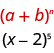

In our pattern, <math xmlns="http://www.w3.org/1998/Math/MathML"><mrow><mi>a</mi><mo>=</mo><mi>x</mi></mrow></math>

 and <math xmlns="http://www.w3.org/1998/Math/MathML"><mrow><mi>b</mi><mo>=</mo><mn>−2</mn><mo>.</mo></mrow></math>

We use the Binomial Theorem.

<math xmlns="http://www.w3.org/1998/Math/MathML"><mrow><msup><mrow><mo stretchy="false">(</mo><mi>a</mi><mo>+</mo><mi>b</mi><mo stretchy="false">)</mo></mrow><mi>n</mi></msup><mo>=</mo><mrow><mo>(</mo><mtable><mtr><mtd columnalign="left"><mi>n</mi></mtd></mtr><mtr><mtd columnalign="left"><mn>0</mn></mtd></mtr></mtable><mo>)</mo></mrow><msup><mi>a</mi><mi>n</mi></msup><mo>+</mo><mrow><mo>(</mo><mtable><mtr><mtd columnalign="left"><mi>n</mi></mtd></mtr><mtr><mtd columnalign="left"><mn>1</mn></mtd></mtr></mtable><mo>)</mo></mrow><msup><mi>a</mi><mrow><mi>n</mi><mo>−</mo><mn>1</mn></mrow></msup><msup><mi>b</mi><mn>1</mn></msup><mo>+</mo><mrow><mo>(</mo><mtable><mtr><mtd columnalign="left"><mi>n</mi></mtd></mtr><mtr><mtd columnalign="left"><mn>2</mn></mtd></mtr></mtable><mo>)</mo></mrow><msup><mi>a</mi><mrow><mi>n</mi><mo>−</mo><mn>2</mn></mrow></msup><msup><mi>b</mi><mn>2</mn></msup><mo>+</mo><mn>...</mn><mo>+</mo><mrow><mo>(</mo><mtable><mtr><mtd columnalign="left"><mi>n</mi></mtd></mtr><mtr><mtd columnalign="left"><mi>r</mi></mtd></mtr></mtable><mo>)</mo></mrow><msup><mi>a</mi><mrow><mi>n</mi><mo>−</mo><mi>r</mi></mrow></msup><msup><mi>b</mi><mi>r</mi></msup><mo>+</mo><mn>...</mn><mo>+</mo><mrow><mo>(</mo><mtable><mtr><mtd columnalign="left"><mi>n</mi></mtd></mtr><mtr><mtd columnalign="left"><mi>n</mi></mtd></mtr></mtable><mo>)</mo></mrow><msup><mi>b</mi><mi>n</mi></msup></mrow></math>

Substitute in the values <math xmlns="http://www.w3.org/1998/Math/MathML"><mrow><mi>a</mi><mo>=</mo><mi>x</mi><mo>,</mo></mrow></math>

<math xmlns="http://www.w3.org/1998/Math/MathML"><mrow><mi>b</mi><mo>=</mo><mn>−2</mn><mo>,</mo></mrow></math>

 and <math xmlns="http://www.w3.org/1998/Math/MathML"><mrow><mi>n</mi><mo>=</mo><mn>5</mn><mo>.</mo></mrow></math>

<math xmlns="http://www.w3.org/1998/Math/MathML"><mrow><msup><mrow><mo stretchy="false">(</mo><mi>x</mi><mo>−</mo><mn>2</mn><mo stretchy="false">)</mo></mrow><mn>5</mn></msup><mo>=</mo><mrow><mo>(</mo><mtable><mtr><mtd columnalign="left"><mn>5</mn></mtd></mtr><mtr><mtd columnalign="left"><mn>0</mn></mtd></mtr></mtable><mo>)</mo></mrow><msup><mi>x</mi><mn>5</mn></msup><mo>+</mo><mrow><mo>(</mo><mtable><mtr><mtd columnalign="left"><mn>5</mn></mtd></mtr><mtr><mtd columnalign="left"><mn>1</mn></mtd></mtr></mtable><mo>)</mo></mrow><msup><mi>x</mi><mrow><mn>5</mn><mo>−</mo><mn>1</mn></mrow></msup><msup><mrow><mrow><mo>(</mo><mrow><mn>−2</mn></mrow><mo>)</mo></mrow></mrow><mn>1</mn></msup><mo>+</mo><mrow><mo>(</mo><mtable><mtr><mtd columnalign="left"><mn>5</mn></mtd></mtr><mtr><mtd columnalign="left"><mn>2</mn></mtd></mtr></mtable><mo>)</mo></mrow><msup><mi>x</mi><mrow><mn>5</mn><mo>−</mo><mn>2</mn></mrow></msup><msup><mrow><mrow><mo>(</mo><mrow><mn>−2</mn></mrow><mo>)</mo></mrow></mrow><mn>2</mn></msup><mo>+</mo><mrow><mo>(</mo><mtable><mtr><mtd columnalign="left"><mn>5</mn></mtd></mtr><mtr><mtd columnalign="left"><mn>3</mn></mtd></mtr></mtable><mo>)</mo></mrow><msup><mi>x</mi><mrow><mn>5</mn><mo>−</mo><mn>3</mn></mrow></msup><msup><mrow><mrow><mo>(</mo><mrow><mn>−2</mn></mrow><mo>)</mo></mrow></mrow><mn>3</mn></msup><mo>+</mo><mrow><mo>(</mo><mtable><mtr><mtd columnalign="left"><mn>5</mn></mtd></mtr><mtr><mtd columnalign="left"><mn>4</mn></mtd></mtr></mtable><mo>)</mo></mrow><msup><mi>x</mi><mrow><mn>5</mn><mo>−</mo><mn>4</mn></mrow></msup><msup><mrow><mrow><mo>(</mo><mrow><mn>−2</mn></mrow><mo>)</mo></mrow></mrow><mn>4</mn></msup><mo>+</mo><mrow><mo>(</mo><mtable><mtr><mtd columnalign="left"><mn>5</mn></mtd></mtr><mtr><mtd columnalign="left"><mn>5</mn></mtd></mtr></mtable><mo>)</mo></mrow><msup><mrow><mrow><mo>(</mo><mrow><mn>−2</mn></mrow><mo>)</mo></mrow></mrow><mn>5</mn></msup></mrow></math>

Simplify the exponents and evaluate the coefficients. Remember,<math xmlns="http://www.w3.org/1998/Math/MathML"><mrow><mrow><mo>(</mo><mtable><mtr><mtd columnalign="left"><mi>n</mi></mtd></mtr><mtr><mtd columnalign="left"><mn>1</mn></mtd></mtr></mtable><mo>)</mo></mrow><mo>=</mo><mi>n</mi><mo>,</mo></mrow></math>

<math xmlns="http://www.w3.org/1998/Math/MathML"><mrow><mrow><mo>(</mo><mtable><mtr><mtd columnalign="left"><mi>n</mi></mtd></mtr><mtr><mtd columnalign="left"><mi>n</mi></mtd></mtr></mtable><mo>)</mo></mrow><mo>=</mo><mn>1</mn><mo>,</mo></mrow></math>

<math xmlns="http://www.w3.org/1998/Math/MathML"><mrow><mrow><mo>(</mo><mtable><mtr><mtd columnalign="left"><mi>n</mi></mtd></mtr><mtr><mtd columnalign="left"><mn>0</mn></mtd></mtr></mtable><mo>)</mo></mrow><mo>=</mo><mn>1</mn><mo>.</mo></mrow></math>

<math xmlns="http://www.w3.org/1998/Math/MathML"><mtable><mtr /><mtr /><mtr><mtd columnalign="left"><msup><mrow><mo stretchy="false">(</mo><mi>x</mi><mo>−</mo><mn>2</mn><mo stretchy="false">)</mo></mrow><mrow><mn>5</mn></mrow></msup><mo>=</mo><mrow><mo>(</mo><mtable><mtr><mtd columnalign="left"><mn>5</mn></mtd></mtr><mtr><mtd columnalign="left"><mn>0</mn></mtd></mtr></mtable><mo>)</mo></mrow><msup><mi>x</mi><mn>5</mn></msup><mo>+</mo><mrow><mo>(</mo><mtable><mtr><mtd columnalign="left"><mn>5</mn></mtd></mtr><mtr><mtd columnalign="left"><mn>1</mn></mtd></mtr></mtable><mo>)</mo></mrow><msup><mi>x</mi><mn>4</mn></msup><msup><mrow><mo>(</mo><mrow><mn>−2</mn></mrow><mo>)</mo></mrow><mrow /></msup><mo>+</mo><mrow><mo>(</mo><mtable><mtr><mtd columnalign="left"><mn>5</mn></mtd></mtr><mtr><mtd columnalign="left"><mn>2</mn></mtd></mtr></mtable><mo>)</mo></mrow><msup><mi>x</mi><mn>3</mn></msup><msup><mrow><mo>(</mo><mrow><mn>−2</mn></mrow><mo>)</mo></mrow><mn>2</mn></msup><mo>+</mo><mrow><mo>(</mo><mtable><mtr><mtd columnalign="left"><mn>5</mn></mtd></mtr><mtr><mtd columnalign="left"><mn>3</mn></mtd></mtr></mtable><mo>)</mo></mrow><msup><mi>x</mi><mn>2</mn></msup><msup><mrow><mo>(</mo><mrow><mn>−2</mn></mrow><mo>)</mo></mrow><mn>3</mn></msup><mo>+</mo><mrow><mo>(</mo><mtable><mtr><mtd columnalign="left"><mn>5</mn></mtd></mtr><mtr><mtd columnalign="left"><mn>4</mn></mtd></mtr></mtable><mo>)</mo></mrow><mi>x</mi><msup><mrow><mo>(</mo><mrow><mn>−2</mn></mrow><mo>)</mo></mrow><mn>4</mn></msup><mo>+</mo><mrow><mo>(</mo><mtable><mtr><mtd columnalign="left"><mn>5</mn></mtd></mtr><mtr><mtd columnalign="left"><mn>5</mn></mtd></mtr></mtable><mo>)</mo></mrow><msup><mrow><mo>(</mo><mrow><mn>−2</mn></mrow><mo>)</mo></mrow><mn>5</mn></msup></mtd></mtr><mtr><mtd columnalign="left"><msup><mrow><mo stretchy="false">(</mo><mi>x</mi><mo>−</mo><mn>2</mn><mo stretchy="false">)</mo></mrow><mrow><mn>5</mn></mrow></msup><mo>=</mo><mn>1</mn><msup><mi>x</mi><mn>5</mn></msup><mo>+</mo><mn>5</mn><mrow><mo>(</mo><mrow><mn>−2</mn></mrow><mo>)</mo></mrow><msup><mi>x</mi><mn>4</mn></msup><mo>+</mo><mfrac><mrow><mn>5</mn><mo>!</mo></mrow><mrow><mn>2</mn><mo>!</mo><mo>·</mo><mn>3</mn><mo>!</mo></mrow></mfrac><msup><mrow><mo>(</mo><mrow><mn>−2</mn></mrow><mo>)</mo></mrow><mn>2</mn></msup><msup><mi>x</mi><mn>3</mn></msup><mo>+</mo><mfrac><mrow><mn>5</mn><mo>!</mo></mrow><mrow><mn>3</mn><mo>!</mo><mo>·</mo><mn>2</mn><mo>!</mo></mrow></mfrac><msup><mrow><mo>(</mo><mrow><mn>−2</mn></mrow><mo>)</mo></mrow><mn>3</mn></msup><msup><mi>x</mi><mn>2</mn></msup><mo>+</mo><mfrac><mrow><mn>5</mn><mo>!</mo></mrow><mrow><mn>4</mn><mo>!</mo><mo>·</mo><mn>1</mn><mo>!</mo></mrow></mfrac><msup><mrow><mo>(</mo><mrow><mn>−2</mn></mrow><mo>)</mo></mrow><mn>4</mn></msup><mi>x</mi><mo>+</mo><mn>1</mn><msup><mrow><mo>(</mo><mrow><mn>−2</mn></mrow><mo>)</mo></mrow><mn>5</mn></msup></mtd></mtr><mtr><mtd columnalign="left"><msup><mrow><mo stretchy="false">(</mo><mi>x</mi><mo>−</mo><mn>2</mn><mo stretchy="false">)</mo></mrow><mrow><mn>5</mn></mrow></msup><mo>=</mo><msup><mi>x</mi><mn>5</mn></msup><mo>+</mo><mn>5</mn><mrow><mo>(</mo><mrow><mn>−2</mn></mrow><mo>)</mo></mrow><msup><mi>x</mi><mn>4</mn></msup><mo>+</mo><mn>10</mn><mo>·</mo><mn>4</mn><mo>·</mo><msup><mi>x</mi><mn>3</mn></msup><mo>+</mo><mn>10</mn><mrow><mo>(</mo><mrow><mn>−8</mn></mrow><mo>)</mo></mrow><msup><mi>x</mi><mn>2</mn></msup><mo>+</mo><mn>5</mn><mo>·</mo><mn>16</mn><mo>·</mo><mi>x</mi><mo>+</mo><mn>1</mn><mrow><mo>(</mo><mrow><mn>−32</mn></mrow><mo>)</mo></mrow></mtd></mtr><mtr><mtd columnalign="left"><msup><mrow><mo stretchy="false">(</mo><mi>x</mi><mo>−</mo><mn>2</mn><mo stretchy="false">)</mo></mrow><mrow><mn>5</mn></mrow></msup><mo>=</mo><msup><mi>x</mi><mn>5</mn></msup><mo>−</mo><mn>10</mn><msup><mi>x</mi><mn>4</mn></msup><mo>+</mo><mn>40</mn><msup><mi>x</mi><mn>3</mn></msup><mo>−</mo><mn>80</mn><msup><mi>x</mi><mn>2</mn></msup><mo>+</mo><mn>80</mn><mi>x</mi><mo>−</mo><mn>32</mn></mtd></mtr></mtable></math>

Use the Binomial Theorem to expand <math xmlns="http://www.w3.org/1998/Math/MathML"><mrow><msup><mrow><mrow><mo>(</mo><mrow><mi>x</mi><mo>−</mo><mn>3</mn></mrow><mo>)</mo></mrow></mrow><mn>5</mn></msup><mo>.</mo></mrow></math>

<math xmlns="http://www.w3.org/1998/Math/MathML"><mrow><msup><mi>x</mi><mn>5</mn></msup><mo>−</mo><mn>15</mn><msup><mi>x</mi><mn>4</mn></msup><mo>+</mo><mn>90</mn><msup><mi>x</mi><mn>3</mn></msup><mo>−</mo><mn>270</mn><msup><mi>x</mi><mn>2</mn></msup></mrow></math>

* * *
{: data-type="newline"}

<math xmlns="http://www.w3.org/1998/Math/MathML"><mrow><mo>+</mo><mn>405</mn><mi>x</mi><mo>−</mo><mn>243</mn></mrow></math>

Use the Binomial Theorem to expand <math xmlns="http://www.w3.org/1998/Math/MathML"><mrow><msup><mrow><mrow><mo>(</mo><mrow><mi>y</mi><mo>−</mo><mn>1</mn></mrow><mo>)</mo></mrow></mrow><mn>6</mn></msup><mo>.</mo></mrow></math>

<math xmlns="http://www.w3.org/1998/Math/MathML"><mrow><msup><mi>y</mi><mn>6</mn></msup><mo>−</mo><mn>6</mn><msup><mi>y</mi><mn>5</mn></msup><mo>+</mo><mn>15</mn><msup><mi>y</mi><mn>4</mn></msup><mo>−</mo><mn>20</mn><msup><mi>y</mi><mn>3</mn></msup><mo>+</mo><mn>15</mn><msup><mi>y</mi><mn>2</mn></msup></mrow></math>

* * *
{: data-type="newline"}

<math xmlns="http://www.w3.org/1998/Math/MathML"><mrow><mo>−</mo><mn>6</mn><mi>y</mi><mo>+</mo><mn>1</mn></mrow></math>

Things can get messy when both terms have a coefficient and a variable.

Use the Binomial Theorem to expand <math xmlns="http://www.w3.org/1998/Math/MathML"><mrow><msup><mrow><mrow><mo>(</mo><mrow><mn>2</mn><mi>x</mi><mo>−</mo><mn>3</mn><mi>y</mi></mrow><mo>)</mo></mrow></mrow><mn>4</mn></msup><mo>.</mo></mrow></math>

We identify the *a* and *b* of the pattern.

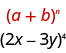

In our pattern, <math xmlns="http://www.w3.org/1998/Math/MathML"><mrow><mi>a</mi><mo>=</mo><mn>2</mn><mi>x</mi></mrow></math>

 and <math xmlns="http://www.w3.org/1998/Math/MathML"><mrow><mi>b</mi><mo>=</mo><mn>−3</mn><mi>y</mi><mo>.</mo></mrow></math>

We use the Binomial Theorem.

<math xmlns="http://www.w3.org/1998/Math/MathML"><mrow><msup><mrow><mo stretchy="false">(</mo><mi>a</mi><mo>+</mo><mi>b</mi><mo stretchy="false">)</mo></mrow><mi>n</mi></msup><mo>=</mo><mrow><mo>(</mo><mtable><mtr><mtd columnalign="left"><mi>n</mi></mtd></mtr><mtr><mtd columnalign="left"><mn>0</mn></mtd></mtr></mtable><mo>)</mo></mrow><msup><mi>a</mi><mi>n</mi></msup><mo>+</mo><mrow><mo>(</mo><mtable><mtr><mtd columnalign="left"><mi>n</mi></mtd></mtr><mtr><mtd columnalign="left"><mn>1</mn></mtd></mtr></mtable><mo>)</mo></mrow><msup><mi>a</mi><mrow><mi>n</mi><mo>−</mo><mn>1</mn></mrow></msup><msup><mi>b</mi><mn>1</mn></msup><mo>+</mo><mrow><mo>(</mo><mtable><mtr><mtd columnalign="left"><mi>n</mi></mtd></mtr><mtr><mtd columnalign="left"><mn>2</mn></mtd></mtr></mtable><mo>)</mo></mrow><msup><mi>a</mi><mrow><mi>n</mi><mo>−</mo><mn>2</mn></mrow></msup><msup><mi>b</mi><mn>2</mn></msup><mo>+</mo><mn>...</mn><mo>+</mo><mrow><mo>(</mo><mtable><mtr><mtd columnalign="left"><mi>n</mi></mtd></mtr><mtr><mtd columnalign="left"><mi>r</mi></mtd></mtr></mtable><mo>)</mo></mrow><msup><mi>a</mi><mrow><mi>n</mi><mo>−</mo><mi>r</mi></mrow></msup><msup><mi>b</mi><mi>r</mi></msup><mo>+</mo><mn>...</mn><mo>+</mo><mrow><mo>(</mo><mtable><mtr><mtd columnalign="left"><mi>n</mi></mtd></mtr><mtr><mtd columnalign="left"><mi>n</mi></mtd></mtr></mtable><mo>)</mo></mrow><msup><mi>b</mi><mi>n</mi></msup></mrow></math>

Substitute in the values <math xmlns="http://www.w3.org/1998/Math/MathML"><mrow><mi>a</mi><mo>=</mo><mn>2</mn><mi>x</mi><mo>,</mo></mrow></math>

<math xmlns="http://www.w3.org/1998/Math/MathML"><mrow><mi>b</mi><mo>=</mo><mn>−3</mn><mi>y</mi></mrow></math>

 and <math xmlns="http://www.w3.org/1998/Math/MathML"><mrow><mi>n</mi><mo>=</mo><mn>4</mn><mo>.</mo></mrow></math>

<math xmlns="http://www.w3.org/1998/Math/MathML"><mrow><msup><mrow><mo stretchy="false">(</mo><mn>2</mn><mi>x</mi><mo>−</mo><mn>3</mn><mi>y</mi><mo stretchy="false">)</mo></mrow><mn>4</mn></msup><mo>=</mo><mrow><mo>(</mo><mtable><mtr><mtd columnalign="left"><mn>4</mn></mtd></mtr><mtr><mtd columnalign="left"><mn>0</mn></mtd></mtr></mtable><mo>)</mo></mrow><msup><mrow><mrow><mo>(</mo><mrow><mn>2</mn><mi>x</mi></mrow><mo>)</mo></mrow></mrow><mn>4</mn></msup><mo>+</mo><mrow><mo>(</mo><mtable><mtr><mtd columnalign="left"><mn>4</mn></mtd></mtr><mtr><mtd columnalign="left"><mn>1</mn></mtd></mtr></mtable><mo>)</mo></mrow><msup><mrow><mrow><mo>(</mo><mrow><mn>2</mn><mi>x</mi></mrow><mo>)</mo></mrow></mrow><mrow><mn>4</mn><mo>−</mo><mn>1</mn></mrow></msup><msup><mrow><mrow><mo>(</mo><mrow><mn>−3</mn><mi>y</mi></mrow><mo>)</mo></mrow></mrow><mn>1</mn></msup><mo>+</mo><mrow><mo>(</mo><mtable><mtr><mtd columnalign="left"><mn>4</mn></mtd></mtr><mtr><mtd columnalign="left"><mn>2</mn></mtd></mtr></mtable><mo>)</mo></mrow><msup><mrow><mrow><mo>(</mo><mrow><mn>2</mn><mi>x</mi></mrow><mo>)</mo></mrow></mrow><mrow><mn>4</mn><mo>−</mo><mn>2</mn></mrow></msup><msup><mrow><mrow><mo>(</mo><mrow><mn>−3</mn><mi>y</mi></mrow><mo>)</mo></mrow></mrow><mn>2</mn></msup><mo>+</mo><mrow><mo>(</mo><mtable><mtr><mtd columnalign="left"><mn>4</mn></mtd></mtr><mtr><mtd columnalign="left"><mn>3</mn></mtd></mtr></mtable><mo>)</mo></mrow><msup><mrow><mrow><mo>(</mo><mrow><mn>2</mn><mi>x</mi></mrow><mo>)</mo></mrow></mrow><mrow><mn>4</mn><mo>−</mo><mn>3</mn></mrow></msup><msup><mrow><mrow><mo>(</mo><mrow><mn>−3</mn><mi>y</mi></mrow><mo>)</mo></mrow></mrow><mn>3</mn></msup><mo>+</mo><mrow><mo>(</mo><mtable><mtr><mtd columnalign="left"><mn>4</mn></mtd></mtr><mtr><mtd columnalign="left"><mn>4</mn></mtd></mtr></mtable><mo>)</mo></mrow><msup><mrow><mrow><mo>(</mo><mrow><mn>−3</mn><mi>y</mi></mrow><mo>)</mo></mrow></mrow><mn>4</mn></msup></mrow></math>

Simplify the exponents.

<math xmlns="http://www.w3.org/1998/Math/MathML"><mrow><msup><mrow><mo stretchy="false">(</mo><mn>2</mn><mi>x</mi><mo>−</mo><mn>3</mn><mi>y</mi><mo stretchy="false">)</mo></mrow><mn>4</mn></msup><mo>=</mo><mrow><mo>(</mo><mtable><mtr><mtd columnalign="left"><mn>4</mn></mtd></mtr><mtr><mtd columnalign="left"><mn>0</mn></mtd></mtr></mtable><mo>)</mo></mrow><msup><mrow><mrow><mo>(</mo><mrow><mn>2</mn><mi>x</mi></mrow><mo>)</mo></mrow></mrow><mn>4</mn></msup><mo>+</mo><mrow><mo>(</mo><mtable><mtr><mtd columnalign="left"><mn>4</mn></mtd></mtr><mtr><mtd columnalign="left"><mn>1</mn></mtd></mtr></mtable><mo>)</mo></mrow><msup><mrow><mrow><mo>(</mo><mrow><mn>2</mn><mi>x</mi></mrow><mo>)</mo></mrow></mrow><mn>3</mn></msup><msup><mrow><mrow><mo>(</mo><mrow><mn>−3</mn><mi>y</mi></mrow><mo>)</mo></mrow></mrow><mn>1</mn></msup><mo>+</mo><mrow><mo>(</mo><mtable><mtr><mtd columnalign="left"><mn>4</mn></mtd></mtr><mtr><mtd columnalign="left"><mn>2</mn></mtd></mtr></mtable><mo>)</mo></mrow><msup><mrow><mrow><mo>(</mo><mrow><mn>2</mn><mi>x</mi></mrow><mo>)</mo></mrow></mrow><mn>2</mn></msup><msup><mrow><mrow><mo>(</mo><mrow><mn>−3</mn><mi>y</mi></mrow><mo>)</mo></mrow></mrow><mn>2</mn></msup><mo>+</mo><mrow><mo>(</mo><mtable><mtr><mtd columnalign="left"><mn>4</mn></mtd></mtr><mtr><mtd columnalign="left"><mn>3</mn></mtd></mtr></mtable><mo>)</mo></mrow><msup><mrow><mrow><mo>(</mo><mrow><mn>2</mn><mi>x</mi></mrow><mo>)</mo></mrow></mrow><mn>1</mn></msup><msup><mrow><mrow><mo>(</mo><mrow><mn>−3</mn><mi>y</mi></mrow><mo>)</mo></mrow></mrow><mn>3</mn></msup><mo>+</mo><mrow><mo>(</mo><mtable><mtr><mtd columnalign="left"><mn>4</mn></mtd></mtr><mtr><mtd columnalign="left"><mn>4</mn></mtd></mtr></mtable><mo>)</mo></mrow><msup><mrow><mrow><mo>(</mo><mrow><mn>−3</mn><mi>y</mi></mrow><mo>)</mo></mrow></mrow><mn>4</mn></msup></mrow></math>

Evaluate the coefficients. Remember, <math xmlns="http://www.w3.org/1998/Math/MathML"><mrow><mrow><mo>(</mo><mtable><mtr><mtd columnalign="left"><mi>n</mi></mtd></mtr><mtr><mtd columnalign="left"><mn>1</mn></mtd></mtr></mtable><mo>)</mo></mrow><mo>=</mo><mi>n</mi><mo>,</mo><mspace width="0.5em" /><mrow><mo>(</mo><mtable><mtr><mtd columnalign="left"><mi>n</mi></mtd></mtr><mtr><mtd columnalign="left"><mi>n</mi></mtd></mtr></mtable><mo>)</mo></mrow><mo>=</mo><mn>1</mn><mo>,</mo><mspace width="0.5em" /><mrow><mo>(</mo><mtable><mtr><mtd columnalign="left"><mi>n</mi></mtd></mtr><mtr><mtd columnalign="left"><mn>0</mn></mtd></mtr></mtable><mo>)</mo></mrow><mo>=</mo><mn>1</mn><mo>.</mo></mrow></math>

<math xmlns="http://www.w3.org/1998/Math/MathML"><mrow><msup><mrow><mo stretchy="false">(</mo><mn>2</mn><mi>x</mi><mo>−</mo><mn>3</mn><mi>y</mi><mo stretchy="false">)</mo></mrow><mn>4</mn></msup><mo>=</mo><mn>1</mn><msup><mrow><mrow><mo>(</mo><mrow><mn>2</mn><mi>x</mi></mrow><mo>)</mo></mrow></mrow><mn>4</mn></msup><mo>+</mo><mn>4</mn><msup><mrow><mrow><mo>(</mo><mrow><mn>2</mn><mi>x</mi></mrow><mo>)</mo></mrow></mrow><mn>3</mn></msup><msup><mrow><mrow><mo>(</mo><mrow><mn>−3</mn><mi>y</mi></mrow><mo>)</mo></mrow></mrow><mn>1</mn></msup><mo>+</mo><mfrac><mrow><mn>4</mn><mo>!</mo></mrow><mrow><mn>2</mn><mo>!</mo><mrow><mo>(</mo><mn>2</mn><mo>)</mo></mrow><mo>!</mo></mrow></mfrac><msup><mrow><mrow><mo>(</mo><mrow><mn>2</mn><mi>x</mi></mrow><mo>)</mo></mrow></mrow><mn>2</mn></msup><msup><mrow><mrow><mo>(</mo><mrow><mn>−3</mn><mi>y</mi></mrow><mo>)</mo></mrow></mrow><mn>2</mn></msup><mo>+</mo><mfrac><mrow><mn>4</mn><mo>!</mo></mrow><mrow><mn>3</mn><mo>!</mo><mrow><mo>(</mo><mrow><mn>4</mn><mo>−</mo><mn>3</mn></mrow><mo>)</mo></mrow><mo>!</mo></mrow></mfrac><msup><mrow><mrow><mo>(</mo><mrow><mn>2</mn><mi>x</mi></mrow><mo>)</mo></mrow></mrow><mn>1</mn></msup><msup><mrow><mrow><mo>(</mo><mrow><mn>−3</mn><mi>y</mi></mrow><mo>)</mo></mrow></mrow><mn>3</mn></msup><mo>+</mo><mn>1</mn><msup><mrow><mrow><mo>(</mo><mrow><mn>−3</mn><mi>y</mi></mrow><mo>)</mo></mrow></mrow><mn>4</mn></msup></mrow></math>

<math xmlns="http://www.w3.org/1998/Math/MathML"><mrow><msup><mrow><mo stretchy="false">(</mo><mn>2</mn><mi>x</mi><mo>−</mo><mn>3</mn><mi>y</mi><mo stretchy="false">)</mo></mrow><mn>4</mn></msup><mo>=</mo><mn>16</mn><msup><mi>x</mi><mn>4</mn></msup><mo>+</mo><mn>4</mn><mo>·</mo><mn>8</mn><msup><mi>x</mi><mn>3</mn></msup><mrow><mo>(</mo><mrow><mn>−3</mn><mi>y</mi></mrow><mo>)</mo></mrow><mo>+</mo><mn>6</mn><mrow><mo>(</mo><mrow><mn>4</mn><msup><mi>x</mi><mn>2</mn></msup></mrow><mo>)</mo></mrow><mrow><mo>(</mo><mrow><mn>9</mn><msup><mi>y</mi><mn>2</mn></msup></mrow><mo>)</mo></mrow><mo>+</mo><mn>4</mn><mrow><mo>(</mo><mrow><mn>2</mn><mi>x</mi></mrow><mo>)</mo></mrow><mrow><mo>(</mo><mrow><mn>−27</mn><msup><mi>y</mi><mn>3</mn></msup></mrow><mo>)</mo></mrow><mo>+</mo><mn>81</mn><msup><mi>y</mi><mn>4</mn></msup></mrow></math>

<math xmlns="http://www.w3.org/1998/Math/MathML"><mrow><msup><mrow><mo stretchy="false">(</mo><mn>2</mn><mi>x</mi><mo>−</mo><mn>3</mn><mi>y</mi><mo stretchy="false">)</mo></mrow><mn>4</mn></msup><mo>=</mo><mn>16</mn><msup><mi>x</mi><mn>4</mn></msup><mo>−</mo><mn>96</mn><msup><mi>x</mi><mn>3</mn></msup><mi>y</mi><mo>+</mo><mn>21</mn><mn>6</mn><msup><mi>x</mi><mn>2</mn></msup><msup><mi>y</mi><mn>2</mn></msup><mo>−</mo><mn>216</mn><mi>x</mi><msup><mi>y</mi><mn>3</mn></msup><mo>+</mo><mn>81</mn><msup><mi>y</mi><mn>4</mn></msup></mrow></math>

Use the Binomial Theorem to expand <math xmlns="http://www.w3.org/1998/Math/MathML"><mrow><msup><mrow><mrow><mo>(</mo><mrow><mn>3</mn><mi>x</mi><mo>−</mo><mn>2</mn><mi>y</mi></mrow><mo>)</mo></mrow></mrow><mn>5</mn></msup><mo>.</mo></mrow></math>

<math xmlns="http://www.w3.org/1998/Math/MathML"><mrow><mn>243</mn><msup><mi>x</mi><mn>5</mn></msup><mo>−</mo><mn>810</mn><msup><mi>x</mi><mn>4</mn></msup><mi>y</mi><mo>+</mo><mn>1080</mn><msup><mi>x</mi><mn>3</mn></msup><msup><mi>y</mi><mn>2</mn></msup></mrow></math>

* * *
{: data-type="newline"}

<math xmlns="http://www.w3.org/1998/Math/MathML"><mrow><mo>−</mo><mn>720</mn><msup><mi>x</mi><mn>2</mn></msup><msup><mi>y</mi><mn>3</mn></msup><mo>+</mo><mn>240</mn><mi>x</mi><msup><mi>y</mi><mn>4</mn></msup><mo>−</mo><mn>32</mn><msup><mi>y</mi><mn>5</mn></msup></mrow></math>

Use the Binomial Theorem to expand <math xmlns="http://www.w3.org/1998/Math/MathML"><mrow><msup><mrow><mrow><mo>(</mo><mrow><mn>4</mn><mi>x</mi><mo>−</mo><mn>3</mn><mi>y</mi></mrow><mo>)</mo></mrow></mrow><mn>4</mn></msup><mo>.</mo></mrow></math>

<math xmlns="http://www.w3.org/1998/Math/MathML"><mrow><mn>256</mn><msup><mi>x</mi><mn>4</mn></msup><mo>−</mo><mn>768</mn><msup><mi>x</mi><mn>3</mn></msup><mi>y</mi><mo>+</mo><mn>864</mn><msup><mi>x</mi><mn>2</mn></msup><msup><mi>y</mi><mn>2</mn></msup></mrow></math>

* * *
{: data-type="newline"}

<math xmlns="http://www.w3.org/1998/Math/MathML"><mrow><mo>−</mo><mn>432</mn><mi>x</mi><msup><mi>y</mi><mn>3</mn></msup><mo>+</mo><mn>81</mn><msup><mi>y</mi><mn>4</mn></msup></mrow></math>

The real beauty of the Binomial Theorem is that it gives a formula for any particular term of the expansion without having to compute the whole sum. Let’s look for a pattern in the **Binomial Theorem**{: data-type="term" .no-emphasis}.

Notice, that in each case the exponent on the *b* is one less than the number of the term. The <math xmlns="http://www.w3.org/1998/Math/MathML"><mrow><mrow><mo>(</mo><mrow><mi>r</mi><mo>+</mo><mn>1</mn></mrow><mo>)</mo></mrow><mi>s</mi><mi>t</mi></mrow></math>

 term is the term where the exponent of *b* is *r*. So we can use the format of the <math xmlns="http://www.w3.org/1998/Math/MathML"><mrow><mrow><mo>(</mo><mrow><mi>r</mi><mo>+</mo><mn>1</mn></mrow><mo>)</mo></mrow><mi>s</mi><mi>t</mi></mrow></math>

 term to find the value of a specific term.

Find a Specific Term in a Binomial Expansion

The <math xmlns="http://www.w3.org/1998/Math/MathML"><mrow><msup><mrow><mo>(</mo><mrow><mi>r</mi><mo>+</mo><mn>1</mn></mrow><mo>)</mo></mrow><mrow><mi>s</mi><mi>t</mi></mrow></msup></mrow></math>

 term in the expansion of <math xmlns="http://www.w3.org/1998/Math/MathML"><mrow><msup><mrow><mrow><mo>(</mo><mrow><mi>a</mi><mo>+</mo><mi>b</mi></mrow><mo>)</mo></mrow></mrow><mi>n</mi></msup></mrow></math>

 is

<math xmlns="http://www.w3.org/1998/Math/MathML"><mrow><mrow><mo>(</mo><mtable><mtr><mtd columnalign="left"><mi>n</mi></mtd></mtr><mtr><mtd columnalign="left"><mi>r</mi></mtd></mtr></mtable><mo>)</mo></mrow><msup><mi>a</mi><mrow><mi>n</mi><mo>−</mo><mi>r</mi></mrow></msup><msup><mi>b</mi><mi>r</mi></msup></mrow></math>

Find the fourth term of <math xmlns="http://www.w3.org/1998/Math/MathML"><mrow><msup><mrow><mrow><mo>(</mo><mrow><mi>x</mi><mo>+</mo><mi>y</mi></mrow><mo>)</mo></mrow></mrow><mn>7</mn></msup><mo>.</mo></mrow></math>

<table class="unnumbered unstyled" summary="X plus y to the power of 7. N choose r times a to the power of n minus r b to the power of r. 7 choose 3 times a to the power of 7 minus 3 b to the power of 3. Use n choose r equals n factorial divided by r factorial times n minus r times factorial to get 7 factorial divided by 3 factorial 4 factorial times a to the power of 7 minus 3 b to the power of 3. Simplify 7 g 6 g 5 g 4 factorial divided by 4 factorial g 3 g 2 g 1 times a to the power of 4 b to the power of 3. Simplify to 35 a to the power of 4 b to the power of 3." data-label=""><tbody>
<tr valign="top">
<td data-valign="bottom" data-align="left">In our pattern, <math xmlns="http://www.w3.org/1998/Math/MathML"><mrow><mi>n</mi><mo>=</mo><mn>7</mn><mo>,</mo><mspace width="0.2em" /><mi>a</mi><mo>=</mo><mi>x</mi></mrow></math> and <math xmlns="http://www.w3.org/1998/Math/MathML"><mrow><mi>b</mi><mo>=</mo><mi>y</mi><mo>.</mo></mrow></math></td>
<td data-valign="top" data-align="left">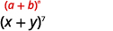</td>
</tr>
<tr valign="top">
<td data-valign="top" data-align="left">We are looking for the fourth term.
<math xmlns="http://www.w3.org/1998/Math/MathML"><mrow><mspace width="1em" /><mtable><mtr><mtd columnalign="right"><mtext>Since</mtext><mspace width="0.2em" /><mi>r</mi><mo>+</mo><mn>1</mn></mtd><mtd columnalign="left"><mo>=</mo></mtd><mtd columnalign="left"><mn>4</mn><mo>,</mo></mtd></mtr><mtr><mtd columnalign="right"><mtext>then</mtext><mspace width="0.2em" /><mi>r</mi></mtd><mtd columnalign="left"><mo>=</mo></mtd><mtd columnalign="left"><mn>3</mn><mo>.</mo></mtd></mtr></mtable></mrow></math></td>
<td data-valign="top" data-align="left" />
</tr>
<tr valign="top">
<td data-valign="top" data-align="left">Write the formula.</td>
<td data-valign="top" data-align="left">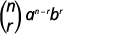</td>
</tr>
<tr valign="top">
<td data-valign="top" data-align="left">Substitute in the values, <math xmlns="http://www.w3.org/1998/Math/MathML"><mrow><mi>n</mi><mo>=</mo><mn>7</mn><mo>,</mo></mrow></math><math xmlns="http://www.w3.org/1998/Math/MathML"><mrow><mi>r</mi><mo>=</mo><mn>3</mn><mo>,</mo></mrow></math><math xmlns="http://www.w3.org/1998/Math/MathML"><mrow><mi>a</mi><mo>=</mo><mi>x</mi><mo>,</mo></mrow></math> and <math xmlns="http://www.w3.org/1998/Math/MathML"><mrow><mi>b</mi><mo>=</mo><mi>y</mi><mo>.</mo></mrow></math></td>
<td data-valign="top" data-align="left">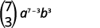</td>
</tr>
<tr valign="top">
<td data-valign="top" data-align="left"></td>
<td data-valign="top" data-align="left">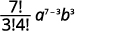</td>
</tr>
<tr valign="top">
<td data-valign="top" data-align="left">Simplify.</td>
<td data-valign="top" data-align="left">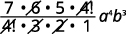</td>
</tr>
<tr valign="top">
<td data-valign="top" data-align="left">Simplify.</td>
<td data-valign="top" data-align="left"></td>
</tr>
</tbody></table>

Find the third term of <math xmlns="http://www.w3.org/1998/Math/MathML"><mrow><msup><mrow><mrow><mo>(</mo><mrow><mi>x</mi><mo>+</mo><mi>y</mi></mrow><mo>)</mo></mrow></mrow><mn>6</mn></msup><mo>.</mo></mrow></math>

<math xmlns="http://www.w3.org/1998/Math/MathML"><mrow><mn>15</mn><msup><mi>x</mi><mn>4</mn></msup><msup><mi>y</mi><mn>2</mn></msup></mrow></math>

Find the fifth term of <math xmlns="http://www.w3.org/1998/Math/MathML"><mrow><msup><mrow><mrow><mo>(</mo><mrow><mi>a</mi><mo>+</mo><mi>b</mi></mrow><mo>)</mo></mrow></mrow><mn>8</mn></msup><mo>.</mo></mrow></math>

<math xmlns="http://www.w3.org/1998/Math/MathML"><mrow><mn>8</mn><mi>a</mi><msup><mi>b</mi><mn>7</mn></msup></mrow></math>

Find the coefficient of the <math xmlns="http://www.w3.org/1998/Math/MathML"><mrow><msup><mi>x</mi><mn>6</mn></msup></mrow></math>

 term of <math xmlns="http://www.w3.org/1998/Math/MathML"><mrow><msup><mrow><mrow><mo>(</mo><mrow><mi>x</mi><mo>+</mo><mn>3</mn></mrow><mo>)</mo></mrow></mrow><mn>9</mn></msup><mo>.</mo></mrow></math>

<table class="unnumbered unstyled" summary="This figure shows how we identify a plus b to the power of n, in the pattern x plus 3 to the power of 9. N choose r times a to the power of n minus r b to the power r. 9 choose 3 times x to the power of 9 minus 3 g 3 to the power of 3. The figure shows two equations on the right and the left. The left reads use n choose r equals n factorial divided by r factorial times n minus r times factorial. The right reads 9 factorial divided by 3 factorial 6 factorial x to the power of 9 minus 3 g 3 to the power of 3. Simplify to 9 g 7 g 6 factorial divided by 3 g 2 g 1 g 6 factorial times x to the power of 6 g 27. Simplify to 9 g 27 g x to the power of 6. Simplify to 243 x to the power of 6." data-label=""><tbody>
<tr valign="top">
<td data-valign="bottom" data-align="left">In our pattern, then <math xmlns="http://www.w3.org/1998/Math/MathML"><mrow><mi>n</mi><mo>=</mo><mn>9</mn><mo>,</mo></mrow></math><math xmlns="http://www.w3.org/1998/Math/MathML"><mrow><mi>a</mi><mo>=</mo><mi>x</mi><mo>,</mo></mrow></math> and <math xmlns="http://www.w3.org/1998/Math/MathML"><mrow><mi>b</mi><mo>=</mo><mn>3</mn><mo>.</mo></mrow></math></td>
<td data-valign="top" data-align="left">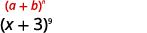</td>
</tr>
<tr valign="top">
<td data-valign="top" data-align="left">We are looking for the coefficient of the <math xmlns="http://www.w3.org/1998/Math/MathML"><mrow><msup><mi>x</mi><mn>6</mn></msup></mrow></math> term.
    Since <math xmlns="http://www.w3.org/1998/Math/MathML"><mrow><mi>a</mi><mo>=</mo><mi>x</mi><mo>,</mo></mrow></math> and <math xmlns="http://www.w3.org/1998/Math/MathML"><mrow><msup><mi>x</mi><mrow><mn>9</mn><mo>−</mo><mi>r</mi></mrow></msup><mo>=</mo><msup><mi>x</mi><mn>6</mn></msup><mo>,</mo></mrow></math> we know <math xmlns="http://www.w3.org/1998/Math/MathML"><mrow><mi>r</mi><mo>=</mo><mn>3</mn><mo>.</mo></mrow></math></td>
<td data-valign="top" data-align="left" />
</tr>
<tr valign="top">
<td data-valign="top" data-align="left">Write the formula.</td>
<td data-valign="top" data-align="left">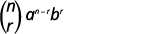</td>
</tr>
<tr valign="top">
<td data-valign="top" data-align="left">Substitute in the values, <math xmlns="http://www.w3.org/1998/Math/MathML"><mrow><mi>n</mi><mo>=</mo><mn>9</mn><mo>,</mo></mrow></math><math xmlns="http://www.w3.org/1998/Math/MathML"><mrow><mi>r</mi><mo>=</mo><mn>3</mn><mo>,</mo></mrow></math><math xmlns="http://www.w3.org/1998/Math/MathML"><mrow><mi>a</mi><mo>=</mo><mi>x</mi><mo>,</mo></mrow></math> and <math xmlns="http://www.w3.org/1998/Math/MathML"><mrow><mi>b</mi><mo>=</mo><mn>3</mn><mo>.</mo></mrow></math></td>
<td data-valign="top" data-align="left">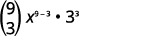</td>
</tr>
<tr valign="top">
<td data-valign="top" data-align="left">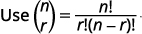</td>
<td data-valign="top" data-align="left">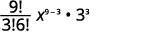</td>
</tr>
<tr valign="top">
<td data-valign="top" data-align="left">Simplify.</td>
<td data-valign="top" data-align="left">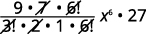</td>
</tr>
<tr valign="top">
<td data-valign="top" data-align="left">Simplify.</td>
<td data-valign="top" data-align="left"></td>
</tr>
<tr valign="top">
<td data-valign="top" data-align="left">Simplify.</td>
<td data-valign="top" data-align="left">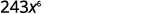</td>
</tr>
<tr valign="top">
<td data-valign="top" data-align="left" />
<td data-valign="top" data-align="left">The coefficient of the <math xmlns="http://www.w3.org/1998/Math/MathML"><mrow><msup><mi>x</mi><mn>6</mn></msup></mrow></math> term is 243.</td>
</tr>
</tbody></table>

Find the coefficient of the <math xmlns="http://www.w3.org/1998/Math/MathML"><mrow><msup><mi>x</mi><mn>5</mn></msup></mrow></math>

 term of <math xmlns="http://www.w3.org/1998/Math/MathML"><mrow><msup><mrow><mrow><mo>(</mo><mrow><mi>x</mi><mo>+</mo><mn>4</mn></mrow><mo>)</mo></mrow></mrow><mn>8</mn></msup><mo>.</mo></mrow></math>

7,168

Find the coefficient of the <math xmlns="http://www.w3.org/1998/Math/MathML"><mrow><msup><mi>x</mi><mn>4</mn></msup></mrow></math>

 term of <math xmlns="http://www.w3.org/1998/Math/MathML"><mrow><msup><mrow><mrow><mo>(</mo><mrow><mi>x</mi><mo>+</mo><mn>2</mn></mrow><mo>)</mo></mrow></mrow><mn>7</mn></msup><mo>.</mo></mrow></math>

280

Access these online resources for additional instruction and practice with sequences.

* [Binomial Expansion Using Pascal’s Triangle][1]
* [Binomial Coefficients][2]

### Key Concepts

* **Patterns in the expansion of**
  <math xmlns="http://www.w3.org/1998/Math/MathML"><mrow><msup><mrow><mrow><mstyle mathvariant="bold"><mo>(</mo><mrow><mi>a</mi><mo>+</mo><mi>b</mi></mrow><mo>)</mo></mstyle></mrow></mrow><mi>n</mi></msup></mrow></math>
  
  * The number of terms is
    <math xmlns="http://www.w3.org/1998/Math/MathML"><mrow><mi>n</mi><mo>+</mo><mn>1</mn><mo>.</mo></mrow></math>
  
  * The first term is
    <math xmlns="http://www.w3.org/1998/Math/MathML"><mrow><msup><mi>a</mi><mi>n</mi></msup></mrow></math>
    
    and the last term is
    <math xmlns="http://www.w3.org/1998/Math/MathML"><mrow><msup><mi>b</mi><mi>n</mi></msup><mo>.</mo></mrow></math>
  
  * The exponents on *a* decrease by one on each term going left to right.
  * The exponents on *b* increase by one on each term going left to right.
  * The sum of the exponents on any term is *n*.
  {: data-bullet-style="bullet"}

* **Pascal’s Triangle**
  

  
  

* **Binomial Coefficient**
  <math xmlns="http://www.w3.org/1998/Math/MathML"><mrow><mrow><mstyle mathvariant="bold"><mo>(</mo></mstyle><mtable><mtr><mtd columnalign="left"><mstyle mathvariant="bold"><mi>n</mi></mstyle></mtd></mtr><mtr><mtd columnalign="left"><mstyle mathvariant="bold"><mi>r</mi></mstyle></mtd></mtr></mtable><mstyle mathvariant="bold"><mo>)</mo></mstyle></mrow></mrow></math>
  
  **\:** A binomial coefficient
  <math xmlns="http://www.w3.org/1998/Math/MathML"><mrow><mrow><mo>(</mo><mtable><mtr><mtd columnalign="left"><mi>n</mi></mtd></mtr><mtr><mtd columnalign="left"><mi>r</mi></mtd></mtr></mtable><mo>)</mo></mrow><mo>,</mo></mrow></math>
  
  where *r* and *n* are integers with
  <math xmlns="http://www.w3.org/1998/Math/MathML"><mrow><mn>0</mn><mo>≤</mo><mi>r</mi><mo>≤</mo><mi>n</mi><mo>,</mo></mrow></math>
  
  is defined as
  * * *
  {: data-type="newline"}
  
  

  <math xmlns="http://www.w3.org/1998/Math/MathML"><mrow><mrow><mo>(</mo><mtable><mtr><mtd columnalign="left"><mi>n</mi></mtd></mtr><mtr><mtd columnalign="left"><mi>r</mi></mtd></mtr></mtable><mo>)</mo></mrow><mo>=</mo><mfrac><mrow><mi>n</mi><mo>!</mo></mrow><mrow><mi>r</mi><mo>!</mo><mrow><mo>(</mo><mrow><mi>n</mi><mo>−</mo><mi>r</mi></mrow><mo>)</mo></mrow><mo>!</mo></mrow></mfrac></mrow></math>
  

  
  * * *
  {: data-type="newline"}
  
  We read
  <math xmlns="http://www.w3.org/1998/Math/MathML"><mrow><mrow><mo>(</mo><mtable><mtr><mtd columnalign="left"><mi>n</mi></mtd></mtr><mtr><mtd columnalign="left"><mi>r</mi></mtd></mtr></mtable><mo>)</mo></mrow></mrow></math>
  
  as “*n* choose *r*” or “*n* taken *r* at a time”.
* **Properties of Binomial Coefficients**
  * * *
  {: data-type="newline"}
  
  <math xmlns="http://www.w3.org/1998/Math/MathML"><mrow><mtable> <mtr><mtd columnalign="center"><mrow><mo>(</mo><mtable><mtr><mtd columnalign="left"><mi>n</mi></mtd></mtr><mtr><mtd columnalign="left"><mn>1</mn></mtd></mtr></mtable><mo>)</mo></mrow><mo>=</mo><mi>n</mi></mtd><mtd /><mtd /><mtd /><mtd columnalign="center"><mrow><mo>(</mo><mtable><mtr><mtd columnalign="left"><mi>n</mi></mtd></mtr><mtr><mtd columnalign="left"><mi>n</mi></mtd></mtr></mtable><mo>)</mo></mrow><mo>=</mo><mn>1</mn></mtd><mtd /><mtd /><mtd /><mtd columnalign="center"><mrow><mo>(</mo><mtable><mtr><mtd columnalign="left"><mi>n</mi></mtd></mtr><mtr><mtd columnalign="left"><mn>0</mn></mtd></mtr></mtable><mo>)</mo></mrow><mo>=</mo><mn>1</mn></mtd></mtr></mtable></mrow></math>

* **Binomial Theorem:** For any real numbers *a*, *b*, and positive integer *n*,
  * * *
  {: data-type="newline"}
  
  

  <math xmlns="http://www.w3.org/1998/Math/MathML"><mrow><msup><mrow><mo stretchy="false">(</mo><mi>a</mi><mo>+</mo><mi>b</mi><mo stretchy="false">)</mo></mrow><mi>n</mi></msup><mo>=</mo><mrow><mo>(</mo><mtable><mtr><mtd columnalign="left"><mi>n</mi></mtd></mtr><mtr><mtd columnalign="left"><mn>0</mn></mtd></mtr></mtable><mo>)</mo></mrow><msup><mi>a</mi><mi>n</mi></msup><mo>+</mo><mrow><mo>(</mo><mtable><mtr><mtd columnalign="left"><mi>n</mi></mtd></mtr><mtr><mtd columnalign="left"><mn>1</mn></mtd></mtr></mtable><mo>)</mo></mrow><msup><mi>a</mi><mrow><mi>n</mi><mo>−</mo><mn>1</mn></mrow></msup><msup><mi>b</mi><mn>1</mn></msup><mo>+</mo><mrow><mo>(</mo><mtable><mtr><mtd columnalign="left"><mi>n</mi></mtd></mtr><mtr><mtd columnalign="left"><mn>2</mn></mtd></mtr></mtable><mo>)</mo></mrow><msup><mi>a</mi><mrow><mi>n</mi><mo>−</mo><mn>2</mn></mrow></msup><msup><mi>b</mi><mn>2</mn></msup><mo>+</mo><mn>...</mn><mo>+</mo><mrow><mo>(</mo><mtable><mtr><mtd columnalign="left"><mi>n</mi></mtd></mtr><mtr><mtd columnalign="left"><mi>r</mi></mtd></mtr></mtable><mo>)</mo></mrow><msup><mi>a</mi><mrow><mi>n</mi><mo>−</mo><mi>r</mi></mrow></msup><msup><mi>b</mi><mi>r</mi></msup><mo>+</mo><mn>...</mn><mo>+</mo><mrow><mo>(</mo><mtable><mtr><mtd columnalign="left"><mi>n</mi></mtd></mtr><mtr><mtd columnalign="left"><mi>n</mi></mtd></mtr></mtable><mo>)</mo></mrow><msup><mi>b</mi><mi>n</mi></msup></mrow></math>
  

{: data-bullet-style="bullet"}

<section data-depth="1" class="section-exercises" markdown="1">
#### Practice Makes Perfect

**Use Pascal’s Triangle to Expand a Binomial**

In the following exercises, expand each binomial using Pascal’s Triangle.

<math xmlns="http://www.w3.org/1998/Math/MathML"><mrow><msup><mrow><mrow><mo>(</mo><mrow><mi>x</mi><mo>+</mo><mi>y</mi></mrow><mo>)</mo></mrow></mrow><mn>4</mn></msup></mrow></math>

<math xmlns="http://www.w3.org/1998/Math/MathML"><mrow><msup><mrow><mrow><mo>(</mo><mrow><mi>a</mi><mo>+</mo><mi>b</mi></mrow><mo>)</mo></mrow></mrow><mn>8</mn></msup></mrow></math>

<math xmlns="http://www.w3.org/1998/Math/MathML"><mrow><msup><mi>a</mi><mn>8</mn></msup><mo>+</mo><mn>8</mn><msup><mi>a</mi><mn>7</mn></msup><mi>b</mi><mo>+</mo><mn>28</mn><msup><mi>a</mi><mn>6</mn></msup><msup><mi>b</mi><mn>2</mn></msup><mo>+</mo><mn>56</mn><msup><mi>a</mi><mn>5</mn></msup><msup><mi>b</mi><mn>3</mn></msup></mrow></math>

* * *
{: data-type="newline"}

<math xmlns="http://www.w3.org/1998/Math/MathML"><mrow><mo>+</mo><mn>70</mn><msup><mi>a</mi><mn>4</mn></msup><msup><mi>b</mi><mn>4</mn></msup><mo>+</mo><mn>56</mn><msup><mi>a</mi><mn>3</mn></msup><msup><mi>b</mi><mn>5</mn></msup><mo>+</mo><mn>28</mn><msup><mi>a</mi><mn>2</mn></msup><msup><mi>b</mi><mn>6</mn></msup></mrow></math>

* * *
{: data-type="newline"}

<math xmlns="http://www.w3.org/1998/Math/MathML"><mrow><mo>+</mo><mn>8</mn><mi>a</mi><msup><mi>b</mi><mn>7</mn></msup><mo>+</mo><msup><mi>b</mi><mn>8</mn></msup></mrow></math>

<math xmlns="http://www.w3.org/1998/Math/MathML"><mrow><msup><mrow><mrow><mo>(</mo><mrow><mi>m</mi><mo>+</mo><mi>n</mi></mrow><mo>)</mo></mrow></mrow><mrow><mn>10</mn></mrow></msup></mrow></math>

<math xmlns="http://www.w3.org/1998/Math/MathML"><mrow><msup><mrow><mrow><mo>(</mo><mrow><mi>p</mi><mo>+</mo><mi>q</mi></mrow><mo>)</mo></mrow></mrow><mn>9</mn></msup></mrow></math>

<math xmlns="http://www.w3.org/1998/Math/MathML"><mrow><msup><mi>p</mi><mn>9</mn></msup><mo>+</mo><mn>9</mn><msup><mi>p</mi><mn>8</mn></msup><mi>q</mi><mo>+</mo><mn>36</mn><msup><mi>p</mi><mn>7</mn></msup><msup><mi>q</mi><mn>2</mn></msup><mo>+</mo><mn>84</mn><msup><mi>p</mi><mn>6</mn></msup><msup><mi>q</mi><mn>3</mn></msup></mrow></math>

* * *
{: data-type="newline"}

<math xmlns="http://www.w3.org/1998/Math/MathML"><mrow><mo>+</mo><mn>126</mn><msup><mi>p</mi><mn>5</mn></msup><msup><mi>q</mi><mn>4</mn></msup><mo>+</mo><mn>126</mn><msup><mi>p</mi><mn>4</mn></msup><msup><mi>q</mi><mn>5</mn></msup><mo>+</mo><mn>84</mn><msup><mi>p</mi><mn>3</mn></msup><msup><mi>q</mi><mn>6</mn></msup></mrow></math>

* * *
{: data-type="newline"}

<math xmlns="http://www.w3.org/1998/Math/MathML"><mrow><mo>+</mo><mn>36</mn><msup><mi>p</mi><mn>2</mn></msup><msup><mi>q</mi><mn>7</mn></msup><mo>+</mo><mn>9</mn><mi>p</mi><msup><mi>q</mi><mn>8</mn></msup><mo>+</mo><msup><mi>q</mi><mn>9</mn></msup></mrow></math>

<math xmlns="http://www.w3.org/1998/Math/MathML"><mrow><msup><mrow><mrow><mo>(</mo><mrow><mi>x</mi><mo>−</mo><mi>y</mi></mrow><mo>)</mo></mrow></mrow><mn>5</mn></msup></mrow></math>

<math xmlns="http://www.w3.org/1998/Math/MathML"><mrow><msup><mrow><mrow><mo>(</mo><mrow><mi>a</mi><mo>−</mo><mi>b</mi></mrow><mo>)</mo></mrow></mrow><mn>6</mn></msup></mrow></math>

<math xmlns="http://www.w3.org/1998/Math/MathML"><mrow><msup><mi>a</mi><mn>6</mn></msup><mo>−</mo><mn>6</mn><msup><mi>a</mi><mn>5</mn></msup><mi>b</mi><mo>+</mo><mn>15</mn><msup><mi>a</mi><mn>4</mn></msup><msup><mi>b</mi><mn>2</mn></msup><mo>−</mo><mn>20</mn><msup><mi>a</mi><mn>3</mn></msup><msup><mi>b</mi><mn>3</mn></msup></mrow></math>

* * *
{: data-type="newline"}

<math xmlns="http://www.w3.org/1998/Math/MathML"><mrow><mo>+</mo><mn>15</mn><msup><mi>a</mi><mn>2</mn></msup><msup><mi>b</mi><mn>4</mn></msup><mo>−</mo><mn>6</mn><mi>a</mi><msup><mi>b</mi><mn>5</mn></msup><mo>+</mo><msup><mi>b</mi><mn>6</mn></msup></mrow></math>

<math xmlns="http://www.w3.org/1998/Math/MathML"><mrow><msup><mrow><mrow><mo>(</mo><mrow><mi>x</mi><mo>+</mo><mn>4</mn></mrow><mo>)</mo></mrow></mrow><mn>4</mn></msup></mrow></math>

<math xmlns="http://www.w3.org/1998/Math/MathML"><mrow><msup><mrow><mrow><mo>(</mo><mrow><mi>x</mi><mo>+</mo><mn>5</mn></mrow><mo>)</mo></mrow></mrow><mn>3</mn></msup></mrow></math>

<math xmlns="http://www.w3.org/1998/Math/MathML"><mrow><msup><mi>x</mi><mn>3</mn></msup><mo>+</mo><mn>15</mn><msup><mi>x</mi><mn>2</mn></msup><mo>+</mo><mn>75</mn><mi>x</mi><mo>+</mo><mn>125</mn></mrow></math>

<math xmlns="http://www.w3.org/1998/Math/MathML"><mrow><msup><mrow><mrow><mo>(</mo><mrow><mi>y</mi><mo>+</mo><mn>2</mn></mrow><mo>)</mo></mrow></mrow><mn>5</mn></msup></mrow></math>

<math xmlns="http://www.w3.org/1998/Math/MathML"><mrow><msup><mrow><mrow><mo>(</mo><mrow><mi>y</mi><mo>+</mo><mn>1</mn></mrow><mo>)</mo></mrow></mrow><mn>7</mn></msup></mrow></math>

<math xmlns="http://www.w3.org/1998/Math/MathML"><mrow><msup><mi>y</mi><mn>7</mn></msup><mo>+</mo><mn>7</mn><msup><mi>y</mi><mn>6</mn></msup><mo>+</mo><mn>21</mn><msup><mi>y</mi><mn>5</mn></msup><mo>+</mo><mn>35</mn><msup><mi>y</mi><mn>4</mn></msup><mo>+</mo><mn>35</mn><msup><mi>y</mi><mn>3</mn></msup></mrow></math>

* * *
{: data-type="newline"}

<math xmlns="http://www.w3.org/1998/Math/MathML"><mrow><mo>+</mo><mn>21</mn><msup><mi>y</mi><mn>2</mn></msup><mo>+</mo><mn>7</mn><mi>y</mi><mo>+</mo><mn>1</mn></mrow></math>

<math xmlns="http://www.w3.org/1998/Math/MathML"><mrow><msup><mrow><mrow><mo>(</mo><mrow><mi>z</mi><mo>−</mo><mn>3</mn></mrow><mo>)</mo></mrow></mrow><mn>5</mn></msup></mrow></math>

<math xmlns="http://www.w3.org/1998/Math/MathML"><mrow><msup><mrow><mrow><mo>(</mo><mrow><mi>z</mi><mo>−</mo><mn>2</mn></mrow><mo>)</mo></mrow></mrow><mn>6</mn></msup></mrow></math>

<math xmlns="http://www.w3.org/1998/Math/MathML"><mrow><msup><mi>z</mi><mn>6</mn></msup><mo>−</mo><mn>12</mn><msup><mi>z</mi><mn>5</mn></msup><mo>+</mo><mn>60</mn><msup><mi>z</mi><mn>4</mn></msup><mo>−</mo><mn>160</mn><msup><mi>z</mi><mn>3</mn></msup><mo>+</mo><mn>240</mn><msup><mi>z</mi><mn>2</mn></msup></mrow></math>

* * *
{: data-type="newline"}

<math xmlns="http://www.w3.org/1998/Math/MathML"><mrow><mo>−</mo><mn>192</mn><mi>z</mi><mo>+</mo><mn>64</mn></mrow></math>

<math xmlns="http://www.w3.org/1998/Math/MathML"><mrow><msup><mrow><mrow><mo>(</mo><mrow><mn>4</mn><mi>x</mi><mo>−</mo><mn>1</mn></mrow><mo>)</mo></mrow></mrow><mn>3</mn></msup></mrow></math>

<math xmlns="http://www.w3.org/1998/Math/MathML"><mrow><msup><mrow><mrow><mo>(</mo><mrow><mn>3</mn><mi>x</mi><mo>−</mo><mn>1</mn></mrow><mo>)</mo></mrow></mrow><mn>5</mn></msup></mrow></math>

<math xmlns="http://www.w3.org/1998/Math/MathML"><mrow><mn>243</mn><msup><mi>x</mi><mn>5</mn></msup><mo>−</mo><mn>405</mn><msup><mi>x</mi><mn>4</mn></msup><mo>+</mo><mn>270</mn><msup><mi>x</mi><mn>3</mn></msup><mo>−</mo><mn>90</mn><msup><mi>x</mi><mn>2</mn></msup></mrow></math>

* * *
{: data-type="newline"}

<math xmlns="http://www.w3.org/1998/Math/MathML"><mrow><mo>+</mo><mn>15</mn><mi>x</mi><mo>−</mo><mn>1</mn></mrow></math>

<math xmlns="http://www.w3.org/1998/Math/MathML"><mrow><msup><mrow><mrow><mo>(</mo><mrow><mn>3</mn><mi>x</mi><mo>−</mo><mn>4</mn></mrow><mo>)</mo></mrow></mrow><mn>4</mn></msup></mrow></math>

<math xmlns="http://www.w3.org/1998/Math/MathML"><mrow><msup><mrow><mrow><mo>(</mo><mrow><mn>3</mn><mi>x</mi><mo>−</mo><mn>5</mn></mrow><mo>)</mo></mrow></mrow><mn>3</mn></msup></mrow></math>

<math xmlns="http://www.w3.org/1998/Math/MathML"><mrow><mn>27</mn><msup><mi>x</mi><mn>3</mn></msup><mo>−</mo><mn>135</mn><msup><mi>x</mi><mn>2</mn></msup><mo>+</mo><mn>225</mn><mi>x</mi><mo>−</mo><mn>125</mn></mrow></math>

<math xmlns="http://www.w3.org/1998/Math/MathML"><mrow><msup><mrow><mrow><mo>(</mo><mrow><mn>2</mn><mi>x</mi><mo>+</mo><mn>3</mn><mi>y</mi></mrow><mo>)</mo></mrow></mrow><mn>3</mn></msup></mrow></math>

<math xmlns="http://www.w3.org/1998/Math/MathML"><mrow><msup><mrow><mrow><mo>(</mo><mrow><mn>3</mn><mi>x</mi><mo>+</mo><mn>5</mn><mi>y</mi></mrow><mo>)</mo></mrow></mrow><mn>3</mn></msup></mrow></math>

<math xmlns="http://www.w3.org/1998/Math/MathML"><mrow><mn>27</mn><msup><mi>x</mi><mn>3</mn></msup><mo>+</mo><mn>135</mn><msup><mi>x</mi><mn>2</mn></msup><mi>y</mi><mo>+</mo><mn>225</mn><mi>x</mi><msup><mi>y</mi><mn>2</mn></msup><mo>+</mo><mn>125</mn><msup><mi>y</mi><mn>3</mn></msup></mrow></math>

**Evaluate a Binomial Coefficient**

In the following exercises, evaluate.

ⓐ <math xmlns="http://www.w3.org/1998/Math/MathML"><mrow><mrow><mo>(</mo><mtable><mtr><mtd columnalign="left"><mn>8</mn></mtd></mtr><mtr><mtd columnalign="left"><mn>1</mn></mtd></mtr></mtable><mo>)</mo></mrow></mrow></math>

 ⓑ <math xmlns="http://www.w3.org/1998/Math/MathML"><mrow><mrow><mo>(</mo><mtable><mtr><mtd columnalign="left"><mn>10</mn></mtd></mtr><mtr><mtd columnalign="left"><mn>10</mn></mtd></mtr></mtable><mo>)</mo></mrow></mrow></math>

 ⓒ <math xmlns="http://www.w3.org/1998/Math/MathML"><mrow><mrow><mo>(</mo><mtable><mtr><mtd columnalign="left"><mn>6</mn></mtd></mtr><mtr><mtd columnalign="left"><mn>0</mn></mtd></mtr></mtable><mo>)</mo></mrow></mrow></math>

 ⓓ <math xmlns="http://www.w3.org/1998/Math/MathML"><mrow><mrow><mo>(</mo><mtable><mtr><mtd columnalign="left"><mn>9</mn></mtd></mtr><mtr><mtd columnalign="left"><mn>3</mn></mtd></mtr></mtable><mo>)</mo></mrow></mrow></math>

ⓐ <math xmlns="http://www.w3.org/1998/Math/MathML"><mrow><mrow><mo>(</mo><mtable><mtr><mtd columnalign="left"><mn>7</mn></mtd></mtr><mtr><mtd columnalign="left"><mn>1</mn></mtd></mtr></mtable><mo>)</mo></mrow></mrow></math>

 ⓑ <math xmlns="http://www.w3.org/1998/Math/MathML"><mrow><mrow><mo>(</mo><mtable><mtr><mtd columnalign="left"><mn>4</mn></mtd></mtr><mtr><mtd columnalign="left"><mn>4</mn></mtd></mtr></mtable><mo>)</mo></mrow></mrow></math>

 ⓒ <math xmlns="http://www.w3.org/1998/Math/MathML"><mrow><mrow><mo>(</mo><mtable><mtr><mtd columnalign="left"><mn>3</mn></mtd></mtr><mtr><mtd columnalign="left"><mn>0</mn></mtd></mtr></mtable><mo>)</mo></mrow></mrow></math>

 ⓓ <math xmlns="http://www.w3.org/1998/Math/MathML"><mrow><mrow><mo>(</mo><mtable><mtr><mtd columnalign="left"><mn>10</mn></mtd></mtr><mtr><mtd columnalign="left"><mn>8</mn></mtd></mtr></mtable><mo>)</mo></mrow></mrow></math>

ⓐ 7 ⓑ 1 ⓒ 1 ⓓ 45

ⓐ <math xmlns="http://www.w3.org/1998/Math/MathML"><mrow><mrow><mo>(</mo><mtable><mtr><mtd columnalign="left"><mn>3</mn></mtd></mtr><mtr><mtd columnalign="left"><mn>1</mn></mtd></mtr></mtable><mo>)</mo></mrow></mrow></math>

 ⓑ <math xmlns="http://www.w3.org/1998/Math/MathML"><mrow><mrow><mo>(</mo><mtable><mtr><mtd columnalign="left"><mn>9</mn></mtd></mtr><mtr><mtd columnalign="left"><mn>9</mn></mtd></mtr></mtable><mo>)</mo></mrow></mrow></math>

 ⓒ <math xmlns="http://www.w3.org/1998/Math/MathML"><mrow><mrow><mo>(</mo><mtable><mtr><mtd columnalign="left"><mn>7</mn></mtd></mtr><mtr><mtd columnalign="left"><mn>0</mn></mtd></mtr></mtable><mo>)</mo></mrow></mrow></math>

 ⓓ <math xmlns="http://www.w3.org/1998/Math/MathML"><mrow><mrow><mo>(</mo><mtable><mtr><mtd columnalign="left"><mn>5</mn></mtd></mtr><mtr><mtd columnalign="left"><mn>3</mn></mtd></mtr></mtable><mo>)</mo></mrow></mrow></math>

ⓐ <math xmlns="http://www.w3.org/1998/Math/MathML"><mrow><mrow><mo>(</mo><mtable><mtr><mtd columnalign="left"><mn>4</mn></mtd></mtr><mtr><mtd columnalign="left"><mn>1</mn></mtd></mtr></mtable><mo>)</mo></mrow></mrow></math>

 ⓑ <math xmlns="http://www.w3.org/1998/Math/MathML"><mrow><mrow><mo>(</mo><mtable><mtr><mtd columnalign="left"><mn>5</mn></mtd></mtr><mtr><mtd columnalign="left"><mn>5</mn></mtd></mtr></mtable><mo>)</mo></mrow></mrow></math>

 ⓒ <math xmlns="http://www.w3.org/1998/Math/MathML"><mrow><mrow><mo>(</mo><mtable><mtr><mtd columnalign="left"><mn>8</mn></mtd></mtr><mtr><mtd columnalign="left"><mn>0</mn></mtd></mtr></mtable><mo>)</mo></mrow></mrow></math>

 ⓓ <math xmlns="http://www.w3.org/1998/Math/MathML"><mrow><mrow><mo>(</mo><mtable><mtr><mtd columnalign="left"><mn>11</mn></mtd></mtr><mtr><mtd columnalign="left"><mn>9</mn></mtd></mtr></mtable><mo>)</mo></mrow></mrow></math>

ⓐ 4 ⓑ 1 ⓒ 1 ⓓ 55

**Use the Binomial Theorem to Expand a Binomial**

In the following exercises, expand each binomial.

<math xmlns="http://www.w3.org/1998/Math/MathML"><mrow><msup><mrow><mrow><mo>(</mo><mrow><mi>x</mi><mo>+</mo><mi>y</mi></mrow><mo>)</mo></mrow></mrow><mn>3</mn></msup></mrow></math>

<math xmlns="http://www.w3.org/1998/Math/MathML"><mrow><msup><mrow><mrow><mo>(</mo><mrow><mi>m</mi><mo>+</mo><mi>n</mi></mrow><mo>)</mo></mrow></mrow><mn>5</mn></msup></mrow></math>

<math xmlns="http://www.w3.org/1998/Math/MathML"><mrow><msup><mi>m</mi><mn>5</mn></msup><mo>+</mo><mn>5</mn><msup><mi>m</mi><mn>4</mn></msup><mi>n</mi><mo>+</mo><mn>10</mn><msup><mi>m</mi><mn>3</mn></msup><msup><mi>n</mi><mn>2</mn></msup><mo>+</mo><mn>10</mn><msup><mi>m</mi><mn>2</mn></msup><msup><mi>n</mi><mn>3</mn></msup></mrow></math>

* * *
{: data-type="newline"}

<math xmlns="http://www.w3.org/1998/Math/MathML"><mrow><mo>+</mo><mn>5</mn><mi>m</mi><msup><mi>n</mi><mn>4</mn></msup><mo>+</mo><msup><mi>n</mi><mn>5</mn></msup></mrow></math>

<math xmlns="http://www.w3.org/1998/Math/MathML"><mrow><msup><mrow><mrow><mo>(</mo><mrow><mi>a</mi><mo>+</mo><mi>b</mi></mrow><mo>)</mo></mrow></mrow><mn>6</mn></msup></mrow></math>

<math xmlns="http://www.w3.org/1998/Math/MathML"><mrow><msup><mrow><mrow><mo>(</mo><mrow><mi>s</mi><mo>+</mo><mi>t</mi></mrow><mo>)</mo></mrow></mrow><mn>7</mn></msup></mrow></math>

<math xmlns="http://www.w3.org/1998/Math/MathML"><mrow><msup><mi>s</mi><mn>7</mn></msup><mo>+</mo><mn>7</mn><msup><mi>s</mi><mn>6</mn></msup><mi>t</mi><mo>+</mo><mn>21</mn><msup><mi>s</mi><mn>5</mn></msup><msup><mi>t</mi><mn>2</mn></msup><mo>+</mo><mn>35</mn><msup><mi>s</mi><mn>4</mn></msup><msup><mi>t</mi><mn>3</mn></msup></mrow></math>

* * *
{: data-type="newline"}

<math xmlns="http://www.w3.org/1998/Math/MathML"><mrow><mo>+</mo><mn>35</mn><msup><mi>s</mi><mn>3</mn></msup><msup><mi>t</mi><mn>4</mn></msup><mo>+</mo><mn>21</mn><msup><mi>s</mi><mn>2</mn></msup><msup><mi>t</mi><mn>5</mn></msup><mo>+</mo><mn>7</mn><mi>s</mi><msup><mi>t</mi><mn>6</mn></msup><mo>+</mo><msup><mi>t</mi><mn>7</mn></msup></mrow></math>

<math xmlns="http://www.w3.org/1998/Math/MathML"><mrow><msup><mrow><mrow><mo>(</mo><mrow><mi>x</mi><mo>−</mo><mn>2</mn></mrow><mo>)</mo></mrow></mrow><mn>4</mn></msup></mrow></math>

<math xmlns="http://www.w3.org/1998/Math/MathML"><mrow><msup><mrow><mrow><mo>(</mo><mrow><mi>y</mi><mo>−</mo><mn>3</mn></mrow><mo>)</mo></mrow></mrow><mn>4</mn></msup></mrow></math>

<math xmlns="http://www.w3.org/1998/Math/MathML"><mrow><msup><mi>y</mi><mn>4</mn></msup><mo>−</mo><mn>12</mn><msup><mi>y</mi><mn>3</mn></msup><mo>+</mo><mn>54</mn><msup><mi>y</mi><mn>2</mn></msup><mo>−</mo><mn>108</mn><mi>y</mi><mo>+</mo><mn>81</mn></mrow></math>

<math xmlns="http://www.w3.org/1998/Math/MathML"><mrow><msup><mrow><mrow><mo>(</mo><mrow><mi>p</mi><mo>−</mo><mn>1</mn></mrow><mo>)</mo></mrow></mrow><mn>5</mn></msup></mrow></math>

<math xmlns="http://www.w3.org/1998/Math/MathML"><mrow><msup><mrow><mrow><mo>(</mo><mrow><mi>q</mi><mo>−</mo><mn>4</mn></mrow><mo>)</mo></mrow></mrow><mn>3</mn></msup></mrow></math>

<math xmlns="http://www.w3.org/1998/Math/MathML"><mrow><msup><mi>q</mi><mn>3</mn></msup><mo>−</mo><mn>12</mn><msup><mi>q</mi><mn>2</mn></msup><mo>+</mo><mn>48</mn><mi>q</mi><mo>−</mo><mn>64</mn></mrow></math>

<math xmlns="http://www.w3.org/1998/Math/MathML"><mrow><msup><mrow><mrow><mo>(</mo><mrow><mn>3</mn><mi>x</mi><mo>−</mo><mi>y</mi></mrow><mo>)</mo></mrow></mrow><mn>5</mn></msup></mrow></math>

<math xmlns="http://www.w3.org/1998/Math/MathML"><mrow><msup><mrow><mrow><mo>(</mo><mrow><mn>5</mn><mi>x</mi><mo>−</mo><mn>2</mn><mi>y</mi></mrow><mo>)</mo></mrow></mrow><mn>4</mn></msup></mrow></math>

<math xmlns="http://www.w3.org/1998/Math/MathML"><mrow><mn>625</mn><msup><mi>x</mi><mn>4</mn></msup><mo>−</mo><mn>1000</mn><msup><mi>x</mi><mn>3</mn></msup><mi>y</mi><mo>+</mo><mn>600</mn><msup><mi>x</mi><mn>2</mn></msup><msup><mi>y</mi><mn>2</mn></msup></mrow></math>

* * *
{: data-type="newline"}

<math xmlns="http://www.w3.org/1998/Math/MathML"><mrow><mo>−</mo><mn>160</mn><mi>x</mi><msup><mi>y</mi><mn>3</mn></msup><mo>+</mo><mn>16</mn><msup><mi>y</mi><mn>4</mn></msup></mrow></math>

<math xmlns="http://www.w3.org/1998/Math/MathML"><mrow><msup><mrow><mrow><mo>(</mo><mrow><mn>2</mn><mi>x</mi><mo>+</mo><mn>5</mn><mi>y</mi></mrow><mo>)</mo></mrow></mrow><mn>4</mn></msup></mrow></math>

<math xmlns="http://www.w3.org/1998/Math/MathML"><mrow><msup><mrow><mrow><mo>(</mo><mrow><mn>3</mn><mi>x</mi><mo>+</mo><mn>4</mn><mi>y</mi></mrow><mo>)</mo></mrow></mrow><mn>5</mn></msup></mrow></math>

<math xmlns="http://www.w3.org/1998/Math/MathML"><mrow><mn>243</mn><msup><mi>x</mi><mn>5</mn></msup><mo>+</mo><mn>1620</mn><msup><mi>x</mi><mn>4</mn></msup><mi>y</mi><mo>+</mo><mn>4320</mn><msup><mi>x</mi><mn>3</mn></msup><msup><mi>y</mi><mn>2</mn></msup></mrow></math>

* * *
{: data-type="newline"}

<math xmlns="http://www.w3.org/1998/Math/MathML"><mrow><mo>+</mo><mn>5760</mn><msup><mi>x</mi><mn>2</mn></msup><msup><mi>y</mi><mn>3</mn></msup><mo>+</mo><mn>3840</mn><mi>x</mi><msup><mi>y</mi><mn>4</mn></msup><mo>+</mo><mn>1024</mn><msup><mi>y</mi><mn>5</mn></msup></mrow></math>

In the following exercises, find the indicated term in the expansion of the binomial.

Sixth term of <math xmlns="http://www.w3.org/1998/Math/MathML"><mrow><msup><mrow><mrow><mo>(</mo><mrow><mi>x</mi><mo>+</mo><mi>y</mi></mrow><mo>)</mo></mrow></mrow><mrow><mn>10</mn></mrow></msup></mrow></math>

Fifth term of <math xmlns="http://www.w3.org/1998/Math/MathML"><mrow><msup><mrow><mrow><mo>(</mo><mrow><mi>a</mi><mo>+</mo><mi>b</mi></mrow><mo>)</mo></mrow></mrow><mn>9</mn></msup></mrow></math>

<math xmlns="http://www.w3.org/1998/Math/MathML"><mrow><mn>126</mn><msup><mi>a</mi><mn>5</mn></msup><msup><mi>b</mi><mn>4</mn></msup></mrow></math>

Fourth term of <math xmlns="http://www.w3.org/1998/Math/MathML"><mrow><msup><mrow><mrow><mo>(</mo><mrow><mi>x</mi><mo>−</mo><mi>y</mi></mrow><mo>)</mo></mrow></mrow><mn>8</mn></msup></mrow></math>

Seventh term of <math xmlns="http://www.w3.org/1998/Math/MathML"><mrow><msup><mrow><mrow><mo>(</mo><mrow><mi>x</mi><mo>−</mo><mi>y</mi></mrow><mo>)</mo></mrow></mrow><mrow><mn>11</mn></mrow></msup></mrow></math>

<math xmlns="http://www.w3.org/1998/Math/MathML"><mrow><mn>462</mn><msup><mi>x</mi><mn>5</mn></msup><msup><mi>y</mi><mn>6</mn></msup></mrow></math>

In the following exercises, find the coefficient of the indicated term in the expansion of the binomial.

<math xmlns="http://www.w3.org/1998/Math/MathML"><mrow><msup><mi>y</mi><mn>3</mn></msup></mrow></math>

 term of <math xmlns="http://www.w3.org/1998/Math/MathML"><mrow><msup><mrow><mrow><mo>(</mo><mrow><mi>y</mi><mo>+</mo><mn>5</mn></mrow><mo>)</mo></mrow></mrow><mn>4</mn></msup></mrow></math>

<math xmlns="http://www.w3.org/1998/Math/MathML"><mrow><msup><mi>x</mi><mn>6</mn></msup></mrow></math>

 term of <math xmlns="http://www.w3.org/1998/Math/MathML"><mrow><msup><mrow><mrow><mo>(</mo><mrow><mi>x</mi><mo>+</mo><mn>2</mn></mrow><mo>)</mo></mrow></mrow><mn>8</mn></msup></mrow></math>

112

<math xmlns="http://www.w3.org/1998/Math/MathML"><mrow><msup><mi>x</mi><mn>5</mn></msup></mrow></math>

 term of <math xmlns="http://www.w3.org/1998/Math/MathML"><mrow><msup><mrow><mrow><mo>(</mo><mrow><mi>x</mi><mo>−</mo><mn>4</mn></mrow><mo>)</mo></mrow></mrow><mn>6</mn></msup></mrow></math>

<math xmlns="http://www.w3.org/1998/Math/MathML"><mrow><msup><mi>x</mi><mn>7</mn></msup></mrow></math>

 term of <math xmlns="http://www.w3.org/1998/Math/MathML"><mrow><msup><mrow><mrow><mo>(</mo><mrow><mi>x</mi><mo>−</mo><mn>3</mn></mrow><mo>)</mo></mrow></mrow><mn>9</mn></msup></mrow></math>

324

<math xmlns="http://www.w3.org/1998/Math/MathML"><mrow><msup><mi>a</mi><mn>4</mn></msup><msup><mi>b</mi><mn>2</mn></msup></mrow></math>

 term of <math xmlns="http://www.w3.org/1998/Math/MathML"><mrow><msup><mrow><mrow><mo>(</mo><mrow><mn>2</mn><mi>a</mi><mo>+</mo><mi>b</mi></mrow><mo>)</mo></mrow></mrow><mn>6</mn></msup></mrow></math>

<math xmlns="http://www.w3.org/1998/Math/MathML"><mrow><msup><mi>p</mi><mn>5</mn></msup><msup><mi>q</mi><mn>4</mn></msup></mrow></math>

 term of <math xmlns="http://www.w3.org/1998/Math/MathML"><mrow><msup><mrow><mrow><mo>(</mo><mrow><mn>3</mn><mi>p</mi><mo>+</mo><mi>q</mi></mrow><mo>)</mo></mrow></mrow><mn>9</mn></msup></mrow></math>

30,618

#### Writing Exercises

In your own words explain how to find the rows of the Pascal’s Triangle. Write the first five rows of Pascal’s Triangle.

In your own words, explain the pattern of exponents for each variable in the expansion of.

Answers will vary.

In your own words, explain the difference between <math xmlns="http://www.w3.org/1998/Math/MathML"><mrow><msup><mrow><mrow><mo>(</mo><mrow><mi>a</mi><mo>+</mo><mi>b</mi></mrow><mo>)</mo></mrow></mrow><mi>n</mi></msup></mrow></math>

 and <math xmlns="http://www.w3.org/1998/Math/MathML"><mrow><msup><mrow><mrow><mo>(</mo><mrow><mi>a</mi><mo>−</mo><mi>b</mi></mrow><mo>)</mo></mrow></mrow><mi>n</mi></msup><mo>.</mo></mrow></math>

In your own words, explain how to find a specific term in the expansion of a binomial without expanding the whole thing. Use an example to help explain.

Answers will vary.

#### Self Check

ⓐ After completing the exercises, use this checklist to evaluate your mastery of the objectives of this section.

ⓑ On a scale of 1-10, how would you rate your mastery of this section in light of your responses on the checklist? How can you improve this?

</section>

<section data-depth="1" class="review-exercises" markdown="1">
#### [Sequences](/m63447){: .target-chapter}

**Write the First Few Terms of a Sequence**

In the following exercises, write the first five terms of the sequence whose general term is given.

<math xmlns="http://www.w3.org/1998/Math/MathML"><mrow><msub><mi>a</mi><mi>n</mi></msub><mo>=</mo><mn>7</mn><mi>n</mi><mo>−</mo><mn>5</mn></mrow></math>

<math xmlns="http://www.w3.org/1998/Math/MathML"><mrow><msub><mi>a</mi><mi>n</mi></msub><mo>=</mo><msup><mn>3</mn><mi>n</mi></msup><mo>+</mo><mn>4</mn></mrow></math>

<math xmlns="http://www.w3.org/1998/Math/MathML"><mrow><mn>7</mn><mo>,</mo><mn>13</mn><mo>,</mo><mn>31</mn><mo>,</mo><mn>85</mn><mo>,</mo><mn>247</mn></mrow></math>

<math xmlns="http://www.w3.org/1998/Math/MathML"><mrow><msub><mi>a</mi><mi>n</mi></msub><mo>=</mo><msup><mn>2</mn><mi>n</mi></msup><mo>+</mo><mi>n</mi></mrow></math>

<math xmlns="http://www.w3.org/1998/Math/MathML"><mrow><msub><mi>a</mi><mi>n</mi></msub><mo>=</mo><mfrac><mrow><mn>2</mn><mi>n</mi><mo>+</mo><mn>1</mn></mrow><mrow><msup><mn>4</mn><mi>n</mi></msup></mrow></mfrac></mrow></math>

<math xmlns="http://www.w3.org/1998/Math/MathML"><mrow><mfrac><mn>3</mn><mn>4</mn></mfrac><mo>,</mo><mfrac><mn>5</mn><mrow><mn>16</mn></mrow></mfrac><mo>,</mo><mfrac><mn>7</mn><mrow><mn>64</mn></mrow></mfrac><mo>,</mo><mfrac><mn>9</mn><mrow><mn>256</mn></mrow></mfrac><mo>,</mo><mfrac><mrow><mn>11</mn></mrow><mrow><mn>1024</mn></mrow></mfrac></mrow></math>

<math xmlns="http://www.w3.org/1998/Math/MathML"><mrow><msub><mi>a</mi><mi>n</mi></msub><mo>=</mo><mfrac><mrow><msup><mrow><mrow><mo>(</mo><mrow><mn>−1</mn></mrow><mo>)</mo></mrow></mrow><mi>n</mi></msup></mrow><mrow><msup><mi>n</mi><mn>2</mn></msup></mrow></mfrac></mrow></math>

**Find a Formula for the General Term (*n*th Term) of a Sequence**

In the following exercises, find a general term for the sequence whose first five terms are shown.

<math xmlns="http://www.w3.org/1998/Math/MathML"><mrow><mn>9</mn><mo>,</mo><mn>18</mn><mo>,</mo><mn>27</mn><mo>,</mo><mn>36</mn><mo>,</mo><mn>45</mn><mo>,</mo><mtext>…</mtext></mrow></math>

<math xmlns="http://www.w3.org/1998/Math/MathML"><mrow><msub><mi>a</mi><mi>n</mi></msub><mo>=</mo><mn>9</mn><mi>n</mi></mrow></math>

<math xmlns="http://www.w3.org/1998/Math/MathML"><mrow><mn>−5</mn><mo>,</mo><mn>−4</mn><mo>,</mo><mn>−3</mn><mo>,</mo><mn>−2</mn><mo>,</mo><mn>−1</mn><mo>,</mo><mtext>…</mtext></mrow></math>

<math xmlns="http://www.w3.org/1998/Math/MathML"><mrow><mfrac><mn>1</mn><mrow><msup><mi>e</mi><mn>3</mn></msup></mrow></mfrac><mo>,</mo><mfrac><mn>1</mn><mrow><msup><mi>e</mi><mn>2</mn></msup></mrow></mfrac><mo>,</mo><mfrac><mn>1</mn><mi>e</mi></mfrac><mo>,</mo><mn>1</mn><mo>,</mo><mi>e</mi><mo>,</mo><mtext>…</mtext></mrow></math>

<math xmlns="http://www.w3.org/1998/Math/MathML"><mrow><msub><mi>a</mi><mi>n</mi></msub><mo>=</mo><msup><mi>e</mi><mrow><mi>n</mi><mo>−</mo><mn>4</mn></mrow></msup></mrow></math>

<math xmlns="http://www.w3.org/1998/Math/MathML"><mrow><mn>1</mn><mo>,</mo><mn>−8</mn><mo>,</mo><mn>27</mn><mo>,</mo><mn>−64</mn><mo>,</mo><mn>125</mn><mo>,</mo><mtext>…</mtext></mrow></math>

<math xmlns="http://www.w3.org/1998/Math/MathML"><mrow><mo>−</mo><mfrac><mn>1</mn><mn>3</mn></mfrac><mo>,</mo><mo>−</mo><mfrac><mn>1</mn><mn>2</mn></mfrac><mo>,</mo><mo>−</mo><mfrac><mn>3</mn><mn>5</mn></mfrac><mo>,</mo><mo>−</mo><mfrac><mn>2</mn><mn>3</mn></mfrac><mo>,</mo><mo>−</mo><mfrac><mn>5</mn><mn>7</mn></mfrac><mo>,</mo><mtext>…</mtext></mrow></math>

<math xmlns="http://www.w3.org/1998/Math/MathML"><mrow><msub><mi>a</mi><mi>n</mi></msub><mo>=</mo><mo>−</mo><mfrac><mi>n</mi><mrow><mi>n</mi><mo>+</mo><mn>2</mn></mrow></mfrac></mrow></math>

**Use Factorial Notation**

In the following exercises, using factorial notation, write the first five terms of the sequence whose general term is given.

<math xmlns="http://www.w3.org/1998/Math/MathML"><mrow><msub><mi>a</mi><mi>n</mi></msub><mo>=</mo><mn>4</mn><mi>n</mi><mo>!</mo></mrow></math>

<math xmlns="http://www.w3.org/1998/Math/MathML"><mrow><msub><mi>a</mi><mi>n</mi></msub><mo>=</mo><mfrac><mrow><mi>n</mi><mo>!</mo></mrow><mrow><mo stretchy="false">(</mo><mi>n</mi><mo>+</mo><mn>2</mn><mo stretchy="false">)</mo><mtext>!</mtext></mrow></mfrac></mrow></math>

<math xmlns="http://www.w3.org/1998/Math/MathML"><mrow><mfrac><mn>1</mn><mn>6</mn></mfrac><mo>,</mo><mfrac><mn>1</mn><mrow><mn>12</mn></mrow></mfrac><mo>,</mo><mfrac><mn>1</mn><mrow><mn>20</mn></mrow></mfrac><mo>,</mo><mfrac><mn>1</mn><mrow><mn>30</mn></mrow></mfrac><mo>,</mo><mfrac><mn>1</mn><mrow><mn>42</mn></mrow></mfrac></mrow></math>

<math xmlns="http://www.w3.org/1998/Math/MathML"><mrow><msub><mi>a</mi><mi>n</mi></msub><mo>=</mo><mfrac><mrow><mo stretchy="false">(</mo><mi>n</mi><mo>−</mo><mn>1</mn><mo stretchy="false">)</mo><mo>!</mo></mrow><mrow><msup><mrow><mo stretchy="false">(</mo><mi>n</mi><mo>+</mo><mn>1</mn><mo stretchy="false">)</mo></mrow><mtext>2</mtext></msup></mrow></mfrac></mrow></math>

**Find the Partial Sum**

In the following exercises, expand the partial sum and find its value.

<math xmlns="http://www.w3.org/1998/Math/MathML"><mrow><mstyle displaystyle="true"><munderover><mo>∑</mo><mrow><mi>i</mi><mo>=</mo><mn>1</mn></mrow><mn>7</mn></munderover><mrow><mo stretchy="false">(</mo><mn>2</mn><mi>i</mi></mrow></mstyle><mo>−</mo><mn>5</mn><mo stretchy="false">)</mo></mrow></math>

<math xmlns="http://www.w3.org/1998/Math/MathML"><mrow><mn>−3</mn><mo>+</mo><mo stretchy="false">(</mo><mn>−1</mn><mo stretchy="false">)</mo><mo>+</mo><mn>1</mn><mo>+</mo><mn>3</mn><mo>+</mo><mn>5</mn></mrow></math>

* * *
{: data-type="newline"}

<math xmlns="http://www.w3.org/1998/Math/MathML"><mrow><mo>+</mo><mn>7</mn><mo>+</mo><mn>9</mn><mo>=</mo><mn>21</mn></mrow></math>

<math xmlns="http://www.w3.org/1998/Math/MathML"><mrow><mstyle displaystyle="true"><munderover><mo>∑</mo><mrow><mi>i</mi><mo>=</mo><mn>1</mn></mrow><mn>3</mn></munderover><mrow><msup><mn>5</mn><mi>i</mi></msup></mrow></mstyle></mrow></math>

<math xmlns="http://www.w3.org/1998/Math/MathML"><mrow><mstyle displaystyle="true"><munderover><mo>∑</mo><mrow><mi>k</mi><mo>=</mo><mn>0</mn></mrow><mn>4</mn></munderover><mrow><mfrac><mn>4</mn><mrow><mi>k</mi><mo>!</mo></mrow></mfrac></mrow></mstyle></mrow></math>

<math xmlns="http://www.w3.org/1998/Math/MathML"><mrow><mn>4</mn><mo>+</mo><mn>4</mn><mo>+</mo><mn>2</mn><mo>+</mo><mfrac><mn>2</mn><mn>3</mn></mfrac><mo>+</mo><mfrac><mn>1</mn><mn>6</mn></mfrac><mo>=</mo><mfrac><mrow><mn>65</mn></mrow><mn>6</mn></mfrac></mrow></math>

<math xmlns="http://www.w3.org/1998/Math/MathML"><mrow><mstyle displaystyle="true"><munderover><mo>∑</mo><mrow><mi>k</mi><mo>=</mo><mn>1</mn></mrow><mn>4</mn></munderover><mrow><mo stretchy="false">(</mo><mi>k</mi><mo>+</mo><mn>1</mn><mo stretchy="false">)</mo><mrow><mo>(</mo><mrow><mn>2</mn><mi>k</mi><mo>+</mo><mn>1</mn></mrow><mo>)</mo></mrow></mrow></mstyle></mrow></math>

**Use Summation Notation to write a Sum**

In the following exercises, write each sum using summation notation.

<math xmlns="http://www.w3.org/1998/Math/MathML"><mrow><mo>−</mo><mfrac><mn>1</mn><mn>3</mn></mfrac><mo>+</mo><mfrac><mn>1</mn><mn>9</mn></mfrac><mo>−</mo><mfrac><mn>1</mn><mrow><mn>27</mn></mrow></mfrac><mo>+</mo><mfrac><mn>1</mn><mrow><mn>81</mn></mrow></mfrac><mo>−</mo><mfrac><mn>1</mn><mrow><mn>243</mn></mrow></mfrac></mrow></math>

<math xmlns="http://www.w3.org/1998/Math/MathML"><mrow><mstyle displaystyle="true"><munderover><mo>∑</mo><mrow><mi>n</mi><mo>=</mo><mn>1</mn></mrow><mn>5</mn></munderover><mrow><msup><mrow><mo stretchy="false">(</mo><mn>−1</mn><mo stretchy="false">)</mo></mrow><mi>n</mi></msup><mfrac><mn>1</mn><mrow><msup><mn>3</mn><mi>n</mi></msup></mrow></mfrac></mrow></mstyle></mrow></math>

<math xmlns="http://www.w3.org/1998/Math/MathML"><mrow><mn>4</mn><mo>−</mo><mn>8</mn><mo>+</mo><mn>12</mn><mo>−</mo><mn>16</mn><mo>+</mo><mn>20</mn><mo>−</mo><mn>24</mn></mrow></math>

<math xmlns="http://www.w3.org/1998/Math/MathML"><mrow><mn>4</mn><mo>+</mo><mn>2</mn><mo>+</mo><mfrac><mn>4</mn><mn>3</mn></mfrac><mo>+</mo><mn>1</mn><mo>+</mo><mfrac><mn>4</mn><mn>5</mn></mfrac></mrow></math>

<math xmlns="http://www.w3.org/1998/Math/MathML"><mrow><mstyle displaystyle="true"><munderover><mo>∑</mo><mrow><mi>n</mi><mo>=</mo><mn>1</mn></mrow><mn>5</mn></munderover><mrow><mfrac><mn>4</mn><mi>n</mi></mfrac></mrow></mstyle></mrow></math>

#### [Arithmetic Sequences](/m63448){: .target-chapter}

**Determine if a Sequence is Arithmetic**

In the following exercises, determine if each sequence is arithmetic, and if so, indicate the common difference.

<math xmlns="http://www.w3.org/1998/Math/MathML"><mrow><mn>1</mn><mo>,</mo><mn>2</mn><mo>,</mo><mn>4</mn><mo>,</mo><mn>8</mn><mo>,</mo><mn>16</mn><mo>,</mo><mn>32</mn><mo>,</mo><mtext>…</mtext></mrow></math>

<math xmlns="http://www.w3.org/1998/Math/MathML"><mrow><mn>−7</mn><mo>,</mo><mn>−1</mn><mo>,</mo><mn>5</mn><mo>,</mo><mn>11</mn><mo>,</mo><mn>17</mn><mo>,</mo><mn>23</mn><mo>,</mo><mtext>…</mtext></mrow></math>

The sequence is arithmetic with common difference <math xmlns="http://www.w3.org/1998/Math/MathML"><mrow><mi>d</mi><mo>=</mo><mn>6</mn><mo>.</mo></mrow></math>

<math xmlns="http://www.w3.org/1998/Math/MathML"><mrow><mn>13</mn><mo>,</mo><mn>9</mn><mo>,</mo><mn>5</mn><mo>,</mo><mn>1</mn><mo>,</mo><mn>−3</mn><mo>,</mo><mn>−7</mn><mo>,</mo><mtext>…</mtext></mrow></math>

In the following exercises, write the first five terms of each arithmetic sequence with the given first term and common difference.

<math xmlns="http://www.w3.org/1998/Math/MathML"><mrow><msub><mi>a</mi><mn>1</mn></msub><mo>=</mo><mn>5</mn></mrow></math>

 and <math xmlns="http://www.w3.org/1998/Math/MathML"><mrow><mi>d</mi><mo>=</mo><mn>3</mn></mrow></math>

<math xmlns="http://www.w3.org/1998/Math/MathML"><mrow><mn>5</mn><mo>,</mo><mn>8</mn><mo>,</mo><mn>11</mn><mo>,</mo><mn>14</mn><mo>,</mo><mn>17</mn></mrow></math>

<math xmlns="http://www.w3.org/1998/Math/MathML"><mrow><msub><mi>a</mi><mn>1</mn></msub><mo>=</mo><mn>8</mn></mrow></math>

 and <math xmlns="http://www.w3.org/1998/Math/MathML"><mrow><mi>d</mi><mo>=</mo><mn>−2</mn></mrow></math>

<math xmlns="http://www.w3.org/1998/Math/MathML"><mrow><msub><mi>a</mi><mn>1</mn></msub><mo>=</mo><mn>−13</mn></mrow></math>

 and <math xmlns="http://www.w3.org/1998/Math/MathML"><mrow><mi>d</mi><mo>=</mo><mn>6</mn></mrow></math>

<math xmlns="http://www.w3.org/1998/Math/MathML"><mrow><mn>−13</mn><mo>,</mo><mn>−7</mn><mo>,</mo><mn>−1</mn><mo>,</mo><mn>5</mn><mo>,</mo><mn>11</mn></mrow></math>

**Find the General Term (*n*th Term) of an Arithmetic Sequence**

In the following exercises, find the term described using the information provided.

Find the twenty-fifth term of a sequence where the first term is five and the common difference is three.

Find the thirtieth term of a sequence where the first term is 16 and the common difference is <math xmlns="http://www.w3.org/1998/Math/MathML"><mrow><mn>−5</mn><mo>.</mo></mrow></math>

<math xmlns="http://www.w3.org/1998/Math/MathML"><mrow><mn>−129</mn></mrow></math>

Find the seventeenth term of a sequence where the first term is <math xmlns="http://www.w3.org/1998/Math/MathML"><mrow><mn>−21</mn></mrow></math>

 and the common difference is two.

In the following exercises, find the indicated term and give the formula for the general term.

Find the eighteenth term of a sequence where the fifth term is <math xmlns="http://www.w3.org/1998/Math/MathML"><mrow><mn>12</mn></mrow></math>

 and the common difference is seven.

<math xmlns="http://www.w3.org/1998/Math/MathML"><mrow><msub><mi>a</mi><mrow><mn>18</mn></mrow></msub><mo>=</mo><mn>103</mn><mo>.</mo></mrow></math>

 The general term is <math xmlns="http://www.w3.org/1998/Math/MathML"><mrow><msub><mi>a</mi><mi>n</mi></msub><mo>=</mo><mn>7</mn><mi>n</mi><mo>−</mo><mn>23</mn><mo>.</mo></mrow></math>

Find the twenty-first term of a sequence where the seventh term is <math xmlns="http://www.w3.org/1998/Math/MathML"><mrow><mn>14</mn></mrow></math>

 and the common difference is <math xmlns="http://www.w3.org/1998/Math/MathML"><mrow><mn>−3</mn><mo>.</mo></mrow></math>

In the following exercises, find the first term and common difference of the sequence with the given terms. Give the formula for the general term.

The fifth term is 17 and the fourteenth term is 53.

<math xmlns="http://www.w3.org/1998/Math/MathML"><mrow><msub><mi>a</mi><mn>1</mn></msub><mo>=</mo><mn>1</mn><mo>,</mo></mrow></math>

<math xmlns="http://www.w3.org/1998/Math/MathML"><mrow><mi>d</mi><mo>=</mo><mn>4</mn><mo>.</mo></mrow></math>

 The general term is <math xmlns="http://www.w3.org/1998/Math/MathML"><mrow><msub><mi>a</mi><mi>n</mi></msub><mo>=</mo><mn>4</mn><mi>n</mi><mo>−</mo><mn>3</mn><mo>.</mo></mrow></math>

The third term is <math xmlns="http://www.w3.org/1998/Math/MathML"><mrow><mn>−26</mn></mrow></math>

 and the sixteenth term is <math xmlns="http://www.w3.org/1998/Math/MathML"><mrow><mn>−91</mn><mo>.</mo></mrow></math>

.

**Find the Sum of the First *n* Terms of an Arithmetic Sequence**

In the following exercises, find the sum of the first 30 terms of each arithmetic sequence.

<math xmlns="http://www.w3.org/1998/Math/MathML"><mrow><mn>7</mn><mo>,</mo><mn>4</mn><mo>,</mo><mn>1</mn><mo>,</mo><mn>−2</mn><mo>,</mo><mn>−5</mn><mo>,</mo><mtext>…</mtext></mrow></math>

<math xmlns="http://www.w3.org/1998/Math/MathML"><mrow><mn>−430</mn></mrow></math>

<math xmlns="http://www.w3.org/1998/Math/MathML"><mrow><mn>1</mn><mo>,</mo><mn>6</mn><mo>,</mo><mn>11</mn><mo>,</mo><mn>16</mn><mo>,</mo><mn>21</mn><mo>,</mo><mtext>…</mtext></mrow></math>

In the following exercises, find the sum of the first fifteen terms of the arithmetic sequence whose general term is given.

<math xmlns="http://www.w3.org/1998/Math/MathML"><mrow><msub><mi>a</mi><mi>n</mi></msub><mo>=</mo><mn>4</mn><mi>n</mi><mo>+</mo><mn>7</mn></mrow></math>

<math xmlns="http://www.w3.org/1998/Math/MathML"><mrow><mn>585</mn></mrow></math>

<math xmlns="http://www.w3.org/1998/Math/MathML"><mrow><msub><mi>a</mi><mi>n</mi></msub><mo>=</mo><mn>−2</mn><mi>n</mi><mo>+</mo><mn>19</mn></mrow></math>

In the following exercises, find each sum.

<math xmlns="http://www.w3.org/1998/Math/MathML"><mrow><mstyle displaystyle="true"><munderover><mo>∑</mo><mrow><mi>i</mi><mo>=</mo><mn>1</mn></mrow><mrow><mn>50</mn></mrow></munderover><mrow><mo stretchy="false">(</mo><mn>4</mn><mi>i</mi><mo>−</mo><mn>5</mn></mrow></mstyle><mo stretchy="false">)</mo></mrow></math>

<math xmlns="http://www.w3.org/1998/Math/MathML"><mrow><mn>4850</mn></mrow></math>

<math xmlns="http://www.w3.org/1998/Math/MathML"><mrow><mstyle displaystyle="true"><munderover><mo>∑</mo><mrow><mi>i</mi><mo>=</mo><mn>1</mn></mrow><mrow><mn>30</mn></mrow></munderover><mrow><mo stretchy="false">(</mo><mn>−3</mn><mi>i</mi><mo>−</mo><mn>7</mn></mrow></mstyle><mo stretchy="false">)</mo></mrow></math>

<math xmlns="http://www.w3.org/1998/Math/MathML"><mrow><mstyle displaystyle="true"><munderover><mo>∑</mo><mrow><mi>i</mi><mo>=</mo><mn>1</mn></mrow><mrow><mn>35</mn></mrow></munderover><mrow><mo stretchy="false">(</mo><mi>i</mi><mo>+</mo><mn>10</mn></mrow></mstyle><mo stretchy="false">)</mo></mrow></math>

<math xmlns="http://www.w3.org/1998/Math/MathML"><mrow><mn>980</mn></mrow></math>

#### [Geometric Sequences and Series](/m63451){: .target-chapter}

**Determine if a Sequence is Geometric**

In the following exercises, determine if the sequence is geometric, and if so, indicate the common ratio.

<math xmlns="http://www.w3.org/1998/Math/MathML"><mrow><mn>3</mn><mo>,</mo><mn>12</mn><mo>,</mo><mn>48</mn><mo>,</mo><mn>192</mn><mo>,</mo><mn>768</mn><mo>,</mo><mn>3072</mn><mo>,</mo><mtext>…</mtext></mrow></math>

<math xmlns="http://www.w3.org/1998/Math/MathML"><mrow><mn>5</mn><mo>,</mo><mn>10</mn><mo>,</mo><mn>15</mn><mo>,</mo><mn>20</mn><mo>,</mo><mn>25</mn><mo>,</mo><mn>30</mn><mo>,</mo><mtext>…</mtext></mrow></math>

The sequence is not geometric.

<math xmlns="http://www.w3.org/1998/Math/MathML"><mrow><mn>112</mn><mo>,</mo><mn>56</mn><mo>,</mo><mn>28</mn><mo>,</mo><mn>14</mn><mo>,</mo><mn>7</mn><mo>,</mo><mfrac><mn>7</mn><mn>2</mn></mfrac><mo>,</mo><mtext>…</mtext></mrow></math>

<math xmlns="http://www.w3.org/1998/Math/MathML"><mrow><mn>9</mn><mo>,</mo><mn>−18</mn><mo>,</mo><mn>36</mn><mo>,</mo><mn>−72</mn><mo>,</mo><mn>144</mn><mo>,</mo><mn>−288</mn><mo>,</mo><mtext>…</mtext></mrow></math>

The sequence is geometric with common ratio <math xmlns="http://www.w3.org/1998/Math/MathML"><mrow><mi>r</mi><mo>=</mo><mn>−2</mn><mo>.</mo></mrow></math>

In the following exercises, write the first five terms of each geometric sequence with the given first term and common ratio.

<math xmlns="http://www.w3.org/1998/Math/MathML"><mrow><msub><mi>a</mi><mn>1</mn></msub><mo>=</mo><mn>−3</mn></mrow></math>

 and <math xmlns="http://www.w3.org/1998/Math/MathML"><mrow><mi>r</mi><mo>=</mo><mn>5</mn></mrow></math>

<math xmlns="http://www.w3.org/1998/Math/MathML"><mrow><msub><mi>a</mi><mn>1</mn></msub><mo>=</mo><mn>128</mn></mrow></math>

 and <math xmlns="http://www.w3.org/1998/Math/MathML"><mrow><mi>r</mi><mo>=</mo><mfrac><mn>1</mn><mn>4</mn></mfrac></mrow></math>

<math xmlns="http://www.w3.org/1998/Math/MathML"><mrow><mn>128</mn><mo>,</mo><mn>32</mn><mo>,</mo><mn>8</mn><mo>,</mo><mn>2</mn><mo>,</mo><mfrac><mn>1</mn><mn>2</mn></mfrac></mrow></math>

<math xmlns="http://www.w3.org/1998/Math/MathML"><mrow><msub><mi>a</mi><mn>1</mn></msub><mo>=</mo><mn>5</mn></mrow></math>

 and <math xmlns="http://www.w3.org/1998/Math/MathML"><mrow><mi>r</mi><mo>=</mo><mn>−3</mn></mrow></math>

**Find the General Term (*n*th Term) of a Geometric Sequence**

In the following exercises, find the indicated term of a sequence where the first term and the common ratio is given.

Find <math xmlns="http://www.w3.org/1998/Math/MathML"><mrow><msub><mi>a</mi><mn>9</mn></msub></mrow></math>

 given <math xmlns="http://www.w3.org/1998/Math/MathML"><mrow><msub><mi>a</mi><mn>1</mn></msub><mo>=</mo><mn>6</mn></mrow></math>

 and <math xmlns="http://www.w3.org/1998/Math/MathML"><mrow><mi>r</mi><mo>=</mo><mn>2</mn><mo>.</mo></mrow></math>

<math xmlns="http://www.w3.org/1998/Math/MathML"><mrow><mn>1,536</mn></mrow></math>

Find <math xmlns="http://www.w3.org/1998/Math/MathML"><mrow><msub><mi>a</mi><mrow><mn>11</mn></mrow></msub></mrow></math>

 given <math xmlns="http://www.w3.org/1998/Math/MathML"><mrow><msub><mi>a</mi><mn>1</mn></msub><mo>=</mo><mn>10,000,000</mn></mrow></math>

 and <math xmlns="http://www.w3.org/1998/Math/MathML"><mrow><mi>r</mi><mo>=</mo><mn>0.1</mn><mo>.</mo></mrow></math>

In the following exercises, find the indicated term of the given sequence. Find the general term of the sequence.

Find <math xmlns="http://www.w3.org/1998/Math/MathML"><mrow><msub><mi>a</mi><mrow><mn>12</mn></mrow></msub></mrow></math>

 of the sequence, <math xmlns="http://www.w3.org/1998/Math/MathML"><mrow><mn>6</mn><mo>,</mo><mn>−24</mn><mo>,</mo><mn>96</mn><mo>,</mo><mn>−384</mn><mo>,</mo><mn>1536</mn><mo>,</mo><mn>−6144</mn><mo>,</mo><mtext>…</mtext></mrow></math>

<math xmlns="http://www.w3.org/1998/Math/MathML"><mrow><msub><mi>a</mi><mrow><mn>12</mn></mrow></msub><mo>=</mo><mn>−25</mn><mo>,</mo><mn>165</mn><mo>,</mo><mn>824</mn><mo>.</mo></mrow></math>

 The general term is <math xmlns="http://www.w3.org/1998/Math/MathML"><mrow><msub><mi>a</mi><mi>n</mi></msub><mo>=</mo><mn>6</mn><msup><mrow><mo stretchy="false">(</mo><mn>−4</mn><mo stretchy="false">)</mo></mrow><mrow><mi>n</mi><mo>−</mo><mn>1</mn></mrow></msup><mo>.</mo></mrow></math>

Find <math xmlns="http://www.w3.org/1998/Math/MathML"><mrow><msub><mi>a</mi><mn>9</mn></msub></mrow></math>

 of the sequence, <math xmlns="http://www.w3.org/1998/Math/MathML"><mrow><mn>4374</mn><mo>,</mo><mn>1458</mn><mo>,</mo><mn>486</mn><mo>,</mo><mn>162</mn><mo>,</mo><mn>54</mn><mo>,</mo><mn>18</mn><mo>,</mo><mtext>…</mtext></mrow></math>

**Find the Sum of the First *n* terms of a Geometric Sequence**

In the following exercises, find the sum of the first fifteen terms of each geometric sequence.

<math xmlns="http://www.w3.org/1998/Math/MathML"><mrow><mn>−4</mn><mo>,</mo><mn>8</mn><mo>,</mo><mn>−16</mn><mo>,</mo><mn>32</mn><mo>,</mo><mn>−64</mn><mo>,</mo><mn>128</mn><mtext>…</mtext></mrow></math>

5,460

<math xmlns="http://www.w3.org/1998/Math/MathML"><mrow><mn>3</mn><mo>,</mo><mn>12</mn><mo>,</mo><mn>48</mn><mo>,</mo><mn>192</mn><mo>,</mo><mn>768</mn><mo>,</mo><mn>3072</mn><mtext>…</mtext></mrow></math>

<math xmlns="http://www.w3.org/1998/Math/MathML"><mrow><mn>3125</mn><mo>,</mo><mn>625</mn><mo>,</mo><mn>125</mn><mo>,</mo><mn>25</mn><mo>,</mo><mn>5</mn><mo>,</mo><mn>1</mn><mtext>…</mtext></mrow></math>

<math xmlns="http://www.w3.org/1998/Math/MathML"><mrow><mo>≈</mo><mn>3906.25</mn></mrow></math>

In the following exercises, find the sum

<math xmlns="http://www.w3.org/1998/Math/MathML"><mrow><mstyle displaystyle="true"><munderover><mo>∑</mo><mrow><mi>i</mi><mo>=</mo><mn>1</mn></mrow><mn>8</mn></munderover><mrow><mn>7</mn><msup><mrow><mrow><mo>(</mo><mn>3</mn><mo>)</mo></mrow></mrow><mi>i</mi></msup></mrow></mstyle></mrow></math>

<math xmlns="http://www.w3.org/1998/Math/MathML"><mrow><mstyle displaystyle="true"><munderover><mo>∑</mo><mrow><mi>i</mi><mo>=</mo><mn>1</mn></mrow><mn>6</mn></munderover><mrow><mn>24</mn><msup><mrow><mrow><mo>(</mo><mrow><mfrac><mn>1</mn><mn>2</mn></mfrac></mrow><mo>)</mo></mrow></mrow><mi>i</mi></msup></mrow></mstyle></mrow></math>

<math xmlns="http://www.w3.org/1998/Math/MathML"><mrow><mfrac><mrow><mn>189</mn></mrow><mn>8</mn></mfrac><mo>=</mo><mn>23.625</mn></mrow></math>

**Find the Sum of an Infinite Geometric Series**

In the following exercises, find the sum of each infinite geometric series.

<math xmlns="http://www.w3.org/1998/Math/MathML"><mrow><mn>1</mn><mo>−</mo><mfrac><mn>1</mn><mn>3</mn></mfrac><mo>+</mo><mfrac><mn>1</mn><mn>9</mn></mfrac><mo>−</mo><mfrac><mn>1</mn><mrow><mn>27</mn></mrow></mfrac><mo>+</mo><mfrac><mn>1</mn><mrow><mn>81</mn></mrow></mfrac><mo>−</mo><mfrac><mn>1</mn><mrow><mn>243</mn></mrow></mfrac><mo>+</mo><mfrac><mn>1</mn><mrow><mn>729</mn></mrow></mfrac><mo>−</mo><mtext>…</mtext></mrow></math>

<math xmlns="http://www.w3.org/1998/Math/MathML"><mrow><mn>49</mn><mo>+</mo><mn>7</mn><mo>+</mo><mn>1</mn><mo>+</mo><mfrac><mn>1</mn><mn>7</mn></mfrac><mo>+</mo><mfrac><mn>1</mn><mrow><mn>49</mn></mrow></mfrac><mo>+</mo><mfrac><mn>1</mn><mrow><mn>343</mn></mrow></mfrac><mo>+</mo><mtext>…</mtext></mrow></math>

<math xmlns="http://www.w3.org/1998/Math/MathML"><mrow><mfrac><mrow><mn>343</mn></mrow><mn>6</mn></mfrac><mo>≈</mo><mn>57.167</mn></mrow></math>

In the following exercises, write each repeating decimal as a fraction.

<math xmlns="http://www.w3.org/1998/Math/MathML"><mrow><mn>0.</mn><mover accent="true"><mn>8</mn><mo>–</mo></mover></mrow></math>

<math xmlns="http://www.w3.org/1998/Math/MathML"><mrow><mn>0.</mn><mover accent="true"><mrow><mn>36</mn></mrow><mo>—</mo></mover></mrow></math>

<math xmlns="http://www.w3.org/1998/Math/MathML"><mrow><mfrac><mn>4</mn><mrow><mn>11</mn></mrow></mfrac></mrow></math>

**Apply Geometric Sequences and Series in the Real World**

In the following exercises, solve the problem.

What is the total effect on the economy of a government tax rebate of <math xmlns="http://www.w3.org/1998/Math/MathML"><mrow><mtext>$</mtext><mn>360</mn></mrow></math>

 to each household in order to stimulate the economy if each household will spend <math xmlns="http://www.w3.org/1998/Math/MathML"><mrow><mn>60</mn><mi>%</mi></mrow></math>

 of the rebate in goods and services?

Adam just got his first full-time job after graduating from high school at age 17. He decided to invest <math xmlns="http://www.w3.org/1998/Math/MathML"><mrow><mtext>$</mtext><mn>300</mn></mrow></math>

 per month in an IRA (an annuity). The interest on the annuity is <math xmlns="http://www.w3.org/1998/Math/MathML"><mrow><mn>7</mn><mi>%</mi></mrow></math>

 which is compounded monthly. How much will be in Adam’s account when he retires at his sixty-seventh birthday?

<math xmlns="http://www.w3.org/1998/Math/MathML"><mrow><mtext>$</mtext><mn>1,634,421.27</mn></mrow></math>

#### [Binomial Theorem](/m63462){: .target-chapter}

**Use Pascal’s Triangle to Expand a Binomial**

In the following exercises, expand each binomial using Pascal’s Triangle.

<math xmlns="http://www.w3.org/1998/Math/MathML"><mrow><msup><mrow><mrow><mo>(</mo><mrow><mi>a</mi><mo>+</mo><mi>b</mi></mrow><mo>)</mo></mrow></mrow><mn>7</mn></msup></mrow></math>

<math xmlns="http://www.w3.org/1998/Math/MathML"><mrow><msup><mrow><mrow><mo>(</mo><mrow><mi>x</mi><mo>−</mo><mi>y</mi></mrow><mo>)</mo></mrow></mrow><mn>4</mn></msup></mrow></math>

<math xmlns="http://www.w3.org/1998/Math/MathML"><mrow><msup><mi>x</mi><mn>4</mn></msup><mo>−</mo><mn>4</mn><msup><mi>x</mi><mn>3</mn></msup><mi>y</mi><mo>+</mo><mn>6</mn><msup><mi>x</mi><mn>2</mn></msup><msup><mi>y</mi><mn>2</mn></msup><mo>−</mo><mn>4</mn><mi>x</mi><msup><mi>y</mi><mn>3</mn></msup><mo>+</mo><msup><mi>y</mi><mn>4</mn></msup></mrow></math>

<math xmlns="http://www.w3.org/1998/Math/MathML"><mrow><msup><mrow><mrow><mo>(</mo><mrow><mi>x</mi><mo>+</mo><mn>6</mn></mrow><mo>)</mo></mrow></mrow><mn>3</mn></msup></mrow></math>

<math xmlns="http://www.w3.org/1998/Math/MathML"><mrow><msup><mrow><mrow><mo>(</mo><mrow><mn>2</mn><mi>y</mi><mo>−</mo><mn>3</mn></mrow><mo>)</mo></mrow></mrow><mn>5</mn></msup></mrow></math>

<math xmlns="http://www.w3.org/1998/Math/MathML"><mrow><mn>32</mn><msup><mi>y</mi><mn>5</mn></msup><mo>−</mo><mn>240</mn><msup><mi>y</mi><mn>4</mn></msup><mo>+</mo><mn>720</mn><msup><mi>y</mi><mn>3</mn></msup><mo>−</mo><mn>1080</mn><msup><mi>y</mi><mn>2</mn></msup></mrow></math>

* * *
{: data-type="newline"}

<math xmlns="http://www.w3.org/1998/Math/MathML"><mrow><mo>+</mo><mn>810</mn><mi>y</mi><mo>−</mo><mn>243</mn></mrow></math>

<math xmlns="http://www.w3.org/1998/Math/MathML"><mrow><msup><mrow><mrow><mo>(</mo><mrow><mn>7</mn><mi>x</mi><mo>+</mo><mn>2</mn><mi>y</mi></mrow><mo>)</mo></mrow></mrow><mn>3</mn></msup></mrow></math>

**Evaluate a Binomial Coefficient**

In the following exercises, evaluate.

* * *
{: data-type="newline"}

ⓐ <math xmlns="http://www.w3.org/1998/Math/MathML"><mrow><mrow><mo>(</mo><mtable><mtr><mtd columnalign="left"><mn>11</mn></mtd></mtr><mtr><mtd columnalign="left"><mn>1</mn></mtd></mtr></mtable><mo>)</mo></mrow></mrow></math>

* * *
{: data-type="newline"}

ⓑ <math xmlns="http://www.w3.org/1998/Math/MathML"><mrow><mrow><mo>(</mo><mtable><mtr><mtd columnalign="left"><mn>12</mn></mtd></mtr><mtr><mtd columnalign="left"><mn>12</mn></mtd></mtr></mtable><mo>)</mo></mrow></mrow></math>

* * *
{: data-type="newline"}

ⓒ <math xmlns="http://www.w3.org/1998/Math/MathML"><mrow><mrow><mo>(</mo><mtable><mtr><mtd columnalign="left"><mn>13</mn></mtd></mtr><mtr><mtd columnalign="left"><mn>0</mn></mtd></mtr></mtable><mo>)</mo></mrow></mrow></math>

* * *
{: data-type="newline"}

ⓓ <math xmlns="http://www.w3.org/1998/Math/MathML"><mrow><mrow><mo>(</mo><mtable><mtr><mtd columnalign="left"><mn>8</mn></mtd></mtr><mtr><mtd columnalign="left"><mn>3</mn></mtd></mtr></mtable><mo>)</mo></mrow></mrow></math>

ⓐ 11 ⓑ 1 ⓒ 1 ⓓ 56

* * *
{: data-type="newline"}

ⓐ <math xmlns="http://www.w3.org/1998/Math/MathML"><mrow><mrow><mo>(</mo><mtable><mtr><mtd columnalign="left"><mn>7</mn></mtd></mtr><mtr><mtd columnalign="left"><mn>1</mn></mtd></mtr></mtable><mo>)</mo></mrow></mrow></math>

* * *
{: data-type="newline"}

ⓑ <math xmlns="http://www.w3.org/1998/Math/MathML"><mrow><mrow><mo>(</mo><mtable><mtr><mtd columnalign="left"><mn>5</mn></mtd></mtr><mtr><mtd columnalign="left"><mn>5</mn></mtd></mtr></mtable><mo>)</mo></mrow></mrow></math>

* * *
{: data-type="newline"}

ⓒ <math xmlns="http://www.w3.org/1998/Math/MathML"><mrow><mrow><mo>(</mo><mtable><mtr><mtd columnalign="left"><mn>9</mn></mtd></mtr><mtr><mtd columnalign="left"><mn>0</mn></mtd></mtr></mtable><mo>)</mo></mrow></mrow></math>

* * *
{: data-type="newline"}

ⓓ <math xmlns="http://www.w3.org/1998/Math/MathML"><mrow><mrow><mo>(</mo><mtable><mtr><mtd columnalign="left"><mn>9</mn></mtd></mtr><mtr><mtd columnalign="left"><mn>5</mn></mtd></mtr></mtable><mo>)</mo></mrow></mrow></math>

* * *
{: data-type="newline"}

ⓐ <math xmlns="http://www.w3.org/1998/Math/MathML"><mrow><mrow><mo>(</mo><mtable><mtr><mtd columnalign="left"><mn>1</mn></mtd></mtr><mtr><mtd columnalign="left"><mn>1</mn></mtd></mtr></mtable><mo>)</mo></mrow></mrow></math>

* * *
{: data-type="newline"}

ⓑ <math xmlns="http://www.w3.org/1998/Math/MathML"><mrow><mrow><mo>(</mo><mtable><mtr><mtd columnalign="left"><mn>15</mn></mtd></mtr><mtr><mtd columnalign="left"><mn>15</mn></mtd></mtr></mtable><mo>)</mo></mrow></mrow></math>

* * *
{: data-type="newline"}

ⓒ <math xmlns="http://www.w3.org/1998/Math/MathML"><mrow><mrow><mo>(</mo><mtable><mtr><mtd columnalign="left"><mn>4</mn></mtd></mtr><mtr><mtd columnalign="left"><mn>0</mn></mtd></mtr></mtable><mo>)</mo></mrow></mrow></math>

* * *
{: data-type="newline"}

ⓓ <math xmlns="http://www.w3.org/1998/Math/MathML"><mrow><mrow><mo>(</mo><mtable><mtr><mtd columnalign="left"><mn>11</mn></mtd></mtr><mtr><mtd columnalign="left"><mn>2</mn></mtd></mtr></mtable><mo>)</mo></mrow></mrow></math>

ⓐ 1 ⓑ 1 ⓒ 1 ⓓ 55

**Use the Binomial Theorem to Expand a Binomial**

In the following exercises, expand each binomial, using the Binomial Theorem.

<math xmlns="http://www.w3.org/1998/Math/MathML"><mrow><msup><mrow><mrow><mo>(</mo><mrow><mi>p</mi><mo>+</mo><mi>q</mi></mrow><mo>)</mo></mrow></mrow><mn>6</mn></msup></mrow></math>

<math xmlns="http://www.w3.org/1998/Math/MathML"><mrow><msup><mrow><mrow><mo>(</mo><mrow><mi>t</mi><mo>−</mo><mn>1</mn></mrow><mo>)</mo></mrow></mrow><mn>9</mn></msup></mrow></math>

<math xmlns="http://www.w3.org/1998/Math/MathML"><mrow><msup><mi>t</mi><mn>9</mn></msup><mo>−</mo><mn>9</mn><msup><mi>t</mi><mn>8</mn></msup><mo>+</mo><mn>36</mn><msup><mi>t</mi><mn>7</mn></msup><mo>−</mo><mn>84</mn><msup><mi>t</mi><mn>6</mn></msup><mo>+</mo><mn>126</mn><msup><mi>t</mi><mn>5</mn></msup></mrow></math>

* * *
{: data-type="newline"}

<math xmlns="http://www.w3.org/1998/Math/MathML"><mrow><mo>−</mo><mn>126</mn><msup><mi>t</mi><mn>4</mn></msup><mo>+</mo><mn>84</mn><msup><mi>t</mi><mn>3</mn></msup><mo>−</mo><mn>36</mn><msup><mi>t</mi><mn>2</mn></msup><mo>+</mo><mn>9</mn><mi>t</mi><mo>−</mo><mn>1</mn></mrow></math>

<math xmlns="http://www.w3.org/1998/Math/MathML"><mrow><msup><mrow><mrow><mo>(</mo><mrow><mn>2</mn><mi>x</mi><mo>+</mo><mn>1</mn></mrow><mo>)</mo></mrow></mrow><mn>4</mn></msup></mrow></math>

<math xmlns="http://www.w3.org/1998/Math/MathML"><mrow><msup><mrow><mrow><mo>(</mo><mrow><mn>4</mn><mi>x</mi><mo>+</mo><mn>3</mn><mi>y</mi></mrow><mo>)</mo></mrow></mrow><mn>4</mn></msup></mrow></math>

<math xmlns="http://www.w3.org/1998/Math/MathML"><mrow><mn>256</mn><msup><mi>x</mi><mn>4</mn></msup><mo>+</mo><mn>768</mn><msup><mi>x</mi><mn>3</mn></msup><mi>y</mi><mo>+</mo><mn>864</mn><msup><mi>x</mi><mn>2</mn></msup><msup><mi>y</mi><mn>2</mn></msup></mrow></math>

* * *
{: data-type="newline"}

<math xmlns="http://www.w3.org/1998/Math/MathML"><mrow><mo>+</mo><mn>432</mn><mi>x</mi><msup><mi>y</mi><mn>3</mn></msup><mo>+</mo><mn>81</mn><msup><mi>y</mi><mn>4</mn></msup></mrow></math>

<math xmlns="http://www.w3.org/1998/Math/MathML"><mrow><msup><mrow><mrow><mo>(</mo><mrow><mi>x</mi><mo>−</mo><mn>3</mn><mi>y</mi></mrow><mo>)</mo></mrow></mrow><mn>5</mn></msup></mrow></math>

In the following exercises, find the indicated term in the expansion of the binomial.

Seventh term of <math xmlns="http://www.w3.org/1998/Math/MathML"><mrow><msup><mrow><mrow><mo>(</mo><mrow><mi>a</mi><mo>+</mo><mi>b</mi></mrow><mo>)</mo></mrow></mrow><mn>9</mn></msup></mrow></math>

<math xmlns="http://www.w3.org/1998/Math/MathML"><mrow><mn>84</mn><msup><mi>a</mi><mn>6</mn></msup><msup><mi>b</mi><mn>3</mn></msup></mrow></math>

Third term of <math xmlns="http://www.w3.org/1998/Math/MathML"><mrow><msup><mrow><mrow><mo>(</mo><mrow><mi>x</mi><mo>−</mo><mi>y</mi></mrow><mo>)</mo></mrow></mrow><mn>7</mn></msup></mrow></math>

In the following exercises, find the coefficient of the indicated term in the expansion of the binomial.

<math xmlns="http://www.w3.org/1998/Math/MathML"><mrow><msup><mi>y</mi><mn>4</mn></msup></mrow></math>

 term of <math xmlns="http://www.w3.org/1998/Math/MathML"><mrow><msup><mrow><mrow><mo>(</mo><mrow><mi>y</mi><mo>+</mo><mn>3</mn></mrow><mo>)</mo></mrow></mrow><mn>6</mn></msup></mrow></math>

135

<math xmlns="http://www.w3.org/1998/Math/MathML"><mrow><msup><mi>x</mi><mn>5</mn></msup></mrow></math>

 term of <math xmlns="http://www.w3.org/1998/Math/MathML"><mrow><msup><mrow><mrow><mo>(</mo><mrow><mi>x</mi><mo>−</mo><mn>2</mn></mrow><mo>)</mo></mrow></mrow><mn>8</mn></msup></mrow></math>

<math xmlns="http://www.w3.org/1998/Math/MathML"><mrow><msup><mi>a</mi><mn>3</mn></msup><msup><mi>b</mi><mn>4</mn></msup></mrow></math>

 term of <math xmlns="http://www.w3.org/1998/Math/MathML"><mrow><msup><mrow><mrow><mo>(</mo><mrow><mn>2</mn><mi>a</mi><mo>+</mo><mi>b</mi></mrow><mo>)</mo></mrow></mrow><mn>7</mn></msup></mrow></math>

280

</section>

### Practice Test

In the following exercises, write the first five terms of the sequence whose general term is given.

<math xmlns="http://www.w3.org/1998/Math/MathML"><mrow><msub><mi>a</mi><mi>n</mi></msub><mo>=</mo><mfrac><mrow><mn>5</mn><mi>n</mi><mo>−</mo><mn>3</mn></mrow><mrow><msup><mn>3</mn><mi>n</mi></msup></mrow></mfrac></mrow></math>

<math xmlns="http://www.w3.org/1998/Math/MathML"><mrow><msub><mi>a</mi><mi>n</mi></msub><mo>=</mo><mfrac><mrow><mo stretchy="false">(</mo><mi>n</mi><mo>+</mo><mn>2</mn><mo stretchy="false">)</mo><mo>!</mo></mrow><mrow><mo stretchy="false">(</mo><mi>n</mi><mo>+</mo><mn>3</mn><mo stretchy="false">)</mo><mtext>!</mtext></mrow></mfrac></mrow></math>

<math xmlns="http://www.w3.org/1998/Math/MathML"><mrow><mfrac><mn>1</mn><mn>4</mn></mfrac><mo>,</mo><mfrac><mn>1</mn><mn>5</mn></mfrac><mo>,</mo><mfrac><mn>1</mn><mn>6</mn></mfrac><mo>,</mo><mfrac><mn>1</mn><mn>7</mn></mfrac><mo>,</mo><mfrac><mn>1</mn><mn>8</mn></mfrac></mrow></math>

Find a general term for the sequence, <math xmlns="http://www.w3.org/1998/Math/MathML"><mrow><mo>−</mo><mfrac><mn>2</mn><mn>3</mn></mfrac><mo>,</mo><mo>−</mo><mfrac><mn>4</mn><mn>5</mn></mfrac><mo>,</mo><mo>−</mo><mfrac><mn>6</mn><mn>7</mn></mfrac><mo>,</mo><mo>−</mo><mfrac><mn>8</mn><mn>9</mn></mfrac><mo>,</mo><mo>−</mo><mfrac><mrow><mn>10</mn></mrow><mrow><mn>11</mn></mrow></mfrac><mo>,</mo><mtext>…</mtext></mrow></math>

Expand the partial sum and find its value. <math xmlns="http://www.w3.org/1998/Math/MathML"><mrow><mstyle displaystyle="true"><munderover><mo>∑</mo><mrow><mi>i</mi><mo>=</mo><mn>1</mn></mrow><mn>4</mn></munderover><mrow><msup><mrow><mo stretchy="false">(</mo><mn>−4</mn><mo stretchy="false">)</mo></mrow><mi>i</mi></msup></mrow></mstyle></mrow></math>

<math xmlns="http://www.w3.org/1998/Math/MathML"><mrow><mn>−4</mn><mo>+</mo><mn>16</mn><mo>−</mo><mn>64</mn><mo>+</mo><mn>256</mn><mo>=</mo><mn>204</mn></mrow></math>

Write the following using summation notation. <math xmlns="http://www.w3.org/1998/Math/MathML"><mrow><mn>−1</mn><mo>+</mo><mfrac><mn>1</mn><mn>4</mn></mfrac><mo>−</mo><mfrac><mn>1</mn><mn>9</mn></mfrac><mo>+</mo><mfrac><mn>1</mn><mrow><mn>16</mn></mrow></mfrac><mo>−</mo><mfrac><mn>1</mn><mrow><mn>25</mn></mrow></mfrac></mrow></math>

Write the first five terms of the arithmetic sequence with the given first term and common difference. <math xmlns="http://www.w3.org/1998/Math/MathML"><mrow><msub><mi>a</mi><mn>1</mn></msub><mo>=</mo><mn>−13</mn></mrow></math>

 and <math xmlns="http://www.w3.org/1998/Math/MathML"><mrow><mi>d</mi><mo>=</mo><mn>3</mn></mrow></math>

<math xmlns="http://www.w3.org/1998/Math/MathML"><mrow><mn>−13</mn><mo>,</mo><mn>−10</mn><mo>,</mo><mn>−7</mn><mo>,</mo><mn>−4</mn><mo>,</mo><mn>−1</mn></mrow></math>

Find the twentieth term of an arithmetic sequence where the first term is two and the common difference is <math xmlns="http://www.w3.org/1998/Math/MathML"><mrow><mn>−7</mn><mo>.</mo></mrow></math>

Find the twenty-third term of an arithmetic sequence whose seventh term is <math xmlns="http://www.w3.org/1998/Math/MathML"><mrow><mn>11</mn></mrow></math>

 and common difference is three. Then find a formula for the general term.

<math xmlns="http://www.w3.org/1998/Math/MathML"><mrow><msub><mi>a</mi><mrow><mn>23</mn></mrow></msub><mo>=</mo><mn>59</mn><mo>.</mo></mrow></math>

 The general term is <math xmlns="http://www.w3.org/1998/Math/MathML"><mrow><msub><mi>a</mi><mi>n</mi></msub><mo>=</mo><mn>3</mn><mi>n</mi><mo>−</mo><mn>10</mn><mo>.</mo></mrow></math>

Find the first term and common difference of an arithmetic sequence whose ninth term is <math xmlns="http://www.w3.org/1998/Math/MathML"><mrow><mn>−1</mn></mrow></math>

 and the sixteenth term is <math xmlns="http://www.w3.org/1998/Math/MathML"><mrow><mn>−15</mn><mo>.</mo></mrow></math>

 Then find a formula for the general term.

Find the sum of the first 25 terms of the arithmetic sequence, <math xmlns="http://www.w3.org/1998/Math/MathML"><mrow><mn>5</mn><mo>,</mo><mn>9</mn><mo>,</mo><mn>13</mn><mo>,</mo><mn>17</mn><mo>,</mo><mn>21</mn><mo>,</mo><mtext>…</mtext></mrow></math>

<math xmlns="http://www.w3.org/1998/Math/MathML"><mrow><mn>1,325</mn></mrow></math>

Find the sum of the first 50 terms of the arithmetic sequence whose general term is <math xmlns="http://www.w3.org/1998/Math/MathML"><mrow><msub><mi>a</mi><mi>n</mi></msub><mo>=</mo><mn>−3</mn><mi>n</mi><mo>+</mo><mn>100</mn><mo>.</mo></mrow></math>

Find the sum. <math xmlns="http://www.w3.org/1998/Math/MathML"><mrow><mstyle displaystyle="true"><munderover><mo>∑</mo><mrow><mi>i</mi><mo>=</mo><mn>1</mn></mrow><mrow><mn>40</mn></mrow></munderover><mrow><mo stretchy="false">(</mo><mn>5</mn><mi>i</mi><mo>−</mo><mn>21</mn></mrow></mstyle><mo stretchy="false">)</mo></mrow></math>

<math xmlns="http://www.w3.org/1998/Math/MathML"><mrow><mn>3,260</mn></mrow></math>

In the following exercises, determine if the sequence is arithmetic, geometric, or neither. If arithmetic, then find the common difference. If geometric, then find the common ratio.

<math xmlns="http://www.w3.org/1998/Math/MathML"><mrow><mn>14</mn><mo>,</mo><mn>3</mn><mo>,</mo><mn>−8</mn><mo>,</mo><mn>−19</mn><mo>,</mo><mn>−30</mn><mo>,</mo><mn>−41</mn><mo>,</mo><mtext>…</mtext></mrow></math>

<math xmlns="http://www.w3.org/1998/Math/MathML"><mrow><mn>324</mn><mo>,</mo><mn>108</mn><mo>,</mo><mn>36</mn><mo>,</mo><mn>12</mn><mo>,</mo><mn>4</mn><mo>,</mo><mfrac><mn>4</mn><mn>3</mn></mfrac><mo>,</mo><mtext>…</mtext></mrow></math>

The sequence is geometric with common ratio <math xmlns="http://www.w3.org/1998/Math/MathML"><mrow><mi>r</mi><mo>=</mo><mfrac><mn>1</mn><mn>3</mn></mfrac><mo>.</mo></mrow></math>

Write the first five terms of the geometric sequence with the given first term and common ratio. <math xmlns="http://www.w3.org/1998/Math/MathML"><mrow><msub><mi>a</mi><mn>1</mn></msub><mo>=</mo><mn>6</mn></mrow></math>

 and <math xmlns="http://www.w3.org/1998/Math/MathML"><mrow><mi>r</mi><mo>=</mo><mn>−2</mn></mrow></math>

In the geometric sequence whose first term and common ratio are <math xmlns="http://www.w3.org/1998/Math/MathML"><mrow><msub><mi>a</mi><mn>1</mn></msub><mo>=</mo><mn>5</mn></mrow></math>

 and <math xmlns="http://www.w3.org/1998/Math/MathML"><mrow><mi>r</mi><mo>=</mo><mn>4</mn><mo>,</mo></mrow></math>

 find <math xmlns="http://www.w3.org/1998/Math/MathML"><mrow><msub><mi>a</mi><mrow><mn>11</mn></mrow></msub><mo>.</mo></mrow></math>

<math xmlns="http://www.w3.org/1998/Math/MathML"><mrow><mn>5,242,880</mn></mrow></math>

Find <math xmlns="http://www.w3.org/1998/Math/MathML"><mrow><msub><mi>a</mi><mrow><mn>10</mn></mrow></msub></mrow></math>

 of the geometric sequence, <math xmlns="http://www.w3.org/1998/Math/MathML"><mrow><mn>1250</mn><mo>,</mo><mn>250</mn><mo>,</mo><mn>50</mn><mo>,</mo><mn>10</mn><mo>,</mo><mn>2</mn><mo>,</mo><mfrac><mn>2</mn><mn>5</mn></mfrac><mo>,</mo><mtext>…</mtext><mtext>.</mtext></mrow></math>

 Then find a formula for the general term.

Find the sum of the first thirteen terms of the geometric sequence, <math xmlns="http://www.w3.org/1998/Math/MathML"><mrow><mn>2</mn><mo>,</mo><mn>−6</mn><mo>,</mo><mn>18</mn><mo>,</mo><mn>−54</mn><mo>,</mo><mn>162</mn><mo>,</mo><mn>−486</mn><mtext>…</mtext></mrow></math>

<math xmlns="http://www.w3.org/1998/Math/MathML"><mrow><mn>797,162</mn></mrow></math>

In the following exercises, find the sum.

<math xmlns="http://www.w3.org/1998/Math/MathML"><mrow><mstyle displaystyle="true"><munderover><mo>∑</mo><mrow><mi>i</mi><mo>=</mo><mn>1</mn></mrow><mn>9</mn></munderover><mrow><mn>5</mn><msup><mrow><mrow><mo>(</mo><mn>2</mn><mo>)</mo></mrow></mrow><mi>i</mi></msup></mrow></mstyle></mrow></math>

<math xmlns="http://www.w3.org/1998/Math/MathML"><mrow><mn>1</mn><mo>−</mo><mfrac><mn>1</mn><mn>5</mn></mfrac><mo>+</mo><mfrac><mn>1</mn><mrow><mn>25</mn></mrow></mfrac><mo>−</mo><mfrac><mn>1</mn><mrow><mn>125</mn></mrow></mfrac><mo>+</mo><mfrac><mn>1</mn><mrow><mn>625</mn></mrow></mfrac><mo>−</mo><mfrac><mn>1</mn><mrow><mn>3125</mn></mrow></mfrac><mo>+</mo><mtext>…</mtext></mrow></math>

<math xmlns="http://www.w3.org/1998/Math/MathML"><mrow><mfrac><mn>5</mn><mn>6</mn></mfrac></mrow></math>

Write the repeating decimal as a fraction. <math xmlns="http://www.w3.org/1998/Math/MathML"><mrow><mn>0.</mn><mover accent="true"><mrow><mn>81</mn></mrow><mo>—</mo></mover></mrow></math>

Dave just got his first full-time job after graduating from high school at age 18. He decided to invest $450 per month in an IRA (an annuity). The interest on the annuity is 6% which is compounded monthly. How much will be in Adam’s account when he retires at his sixty-fifth birthday?

<math xmlns="http://www.w3.org/1998/Math/MathML"><mrow><mtext>$</mtext><mn>1,409,344.19</mn></mrow></math>

Expand the binomial using Pascal’s Triangle. <math xmlns="http://www.w3.org/1998/Math/MathML"><mrow><msup><mrow><mrow><mo>(</mo><mrow><mi>m</mi><mo>−</mo><mn>2</mn><mi>n</mi></mrow><mo>)</mo></mrow></mrow><mn>5</mn></msup></mrow></math>

Evaluate each binomial coefficient. ⓐ <math xmlns="http://www.w3.org/1998/Math/MathML"><mrow><mrow><mo>(</mo><mtable><mtr><mtd columnalign="left"><mn>8</mn></mtd></mtr><mtr><mtd columnalign="left"><mn>1</mn></mtd></mtr></mtable><mo>)</mo></mrow></mrow></math>

* * *
{: data-type="newline"}

ⓑ <math xmlns="http://www.w3.org/1998/Math/MathML"><mrow><mrow><mo>(</mo><mtable><mtr><mtd columnalign="left"><mn>16</mn></mtd></mtr><mtr><mtd columnalign="left"><mn>16</mn></mtd></mtr></mtable><mo>)</mo></mrow></mrow></math>

 ⓒ <math xmlns="http://www.w3.org/1998/Math/MathML"><mrow><mrow><mo>(</mo><mtable><mtr><mtd columnalign="left"><mn>12</mn></mtd></mtr><mtr><mtd columnalign="left"><mn>0</mn></mtd></mtr></mtable><mo>)</mo></mrow></mrow></math>

 ⓓ <math xmlns="http://www.w3.org/1998/Math/MathML"><mrow><mrow><mo>(</mo><mtable><mtr><mtd columnalign="left"><mn>10</mn></mtd></mtr><mtr><mtd columnalign="left"><mn>6</mn></mtd></mtr></mtable><mo>)</mo></mrow></mrow></math>

ⓐ 8 ⓑ 1 ⓒ 1 ⓓ 210

Expand the binomial using the Binomial Theorem. <math xmlns="http://www.w3.org/1998/Math/MathML"><mrow><msup><mrow><mrow><mo>(</mo><mrow><mn>4</mn><mi>x</mi><mo>+</mo><mn>5</mn><mi>y</mi></mrow><mo>)</mo></mrow></mrow><mn>3</mn></msup></mrow></math>

[1]: https://openstax.org/l/37binexpanpastr
[2]: https://openstax.org/l/37binocoeffic
