

By the end of this section, you will be able to:
* Solve quadratic equations using the Quadratic Formula
* Use the discriminant to predict the number and type of solutions of a quadratic equation
* Identify the most appropriate method to use to solve a quadratic equation

Before you get started, take this readiness quiz.**

1.  Evaluate
    <math xmlns="http://www.w3.org/1998/Math/MathML"><mrow><msup><mi>b</mi><mn>2</mn></msup><mo>−</mo><mn>4</mn><mi>a</mi><mi>b</mi></mrow></math>
    
    when
    <math xmlns="http://www.w3.org/1998/Math/MathML"><mrow><mi>a</mi><mo>=</mo><mn>3</mn></mrow></math>
    
    and
    <math xmlns="http://www.w3.org/1998/Math/MathML"><mrow><mi>b</mi><mo>=</mo><mn>−2</mn><mo>.</mo></mrow></math>
    
    * * *
    {: data-type="newline"}
    
    If you missed this problem, review [\[link\]](/m63303#fs-id1167832053133).
2.  Simplify:
    <math xmlns="http://www.w3.org/1998/Math/MathML"><mrow><msqrt><mrow><mn>108</mn></mrow></msqrt><mo>.</mo></mrow></math>
    
    * * *
    {: data-type="newline"}
    
    If you missed this problem, review [\[link\]](/m63396#fs-id1169144556679).
3.  Simplify:
    <math xmlns="http://www.w3.org/1998/Math/MathML"><mrow><msqrt><mrow><mn>50</mn></mrow></msqrt><mo>.</mo></mrow></math>
    
    * * *
    {: data-type="newline"}
    
    If you missed this problem, review [\[link\]](/m63442#fs-id1169145730176).
{: type="1"}

### Solve Quadratic Equations Using the Quadratic Formula

When we solved quadratic equations in the last section by completing the square, we took the same steps every time. By the end of the exercise set, you may have been wondering ‘isn’t there an easier way to do this?’ The answer is ‘yes’. Mathematicians look for patterns when they do things over and over in order to make their work easier. In this section we will derive and use a formula to find the solution of a quadratic equation.

We have already seen how to solve a formula for a specific variable ‘in general’, so that we would do the algebraic steps only once, and then use the new formula to find the value of the specific variable. Now we will go through the steps of completing the square using the general form of a quadratic equation to solve a quadratic equation for *x.*

We start with the standard form of a quadratic equation and solve it for *x* by completing the square.

<table class="unnumbered unstyled can-break" summary="To develop the Quadratic Formula, start with the standard form of a quadratic equation, a times x squared plus b times x plus c equals 0. Remember that a is not equal to zero. Isolate the variable terms on one side. The new equation is a times x squared plus b x equals negative c. Make the leading coefficient 1 by dividing both sides of the equation by a. We now have the quotient a times x squared divided by a plus the product of the quotient b divided by a and x equals negative c divided by a. Simplified, this becomes x squared plus b divided by a times x equals negative c divided by a. Complete the square on the left side of the equation. Find the square of one half times the quotient b divided by a which simplifies to b squared divided by the product 4 times a squared. Add this value to both sides of the equation. X squared plus b divided by a times x plus b squared divided by the product 4 a squared equals negative c divided by a plus the quotient b squared divided by the product 4 times a squared. Factor the perfect square trinomial on the left side of the equation. The square of x plus the quotient b divided by 2 a equals the quotient negative c divided by a plus the quotient b squared divided by the product 4 times a squared. Find the common denominator of the right side of the equation and write equivalent fractions using the common denominator. Multiply the term negative c divided by a on the right side of the equation by the fraction 4 a divided by 4 a. Rearrange terms on the right side of the equation, and it becomes the square of the sum x plus the quotient b divided by 2 a equals the quotient b squared divided by the product 4 times a squared plus the quotient negative c times 4 a divided by a times 4 a. Combining to one fraction, the square of the sum x plus the quotient b divided by 2 a equals the quotient of the difference b squared minus 4 a c divided by 4 a squared. Use the Square Root Property. X plus the quotient b divded by 2 a equals the positive or negative square root of the quotient of the difference b squared minus 4 a c divided by 4 a squared. Simplify the radical. X plus the quotient b divded by 2 a equals the positive or negative quotient of the square root of the difference b squared minus 4 a c divided by 2 a. Add negative b divided by 2 a to both sides of the equation. So x equals negative b divided by the product 2 a plus or minus the quotient of the square root of the difference b squared minus 4 a c divided by 2 a. Combine the terms on the right side of the equation to get the final form of the Quadratic Formula. X equals the quotient negative b plus or minus the square root of the difference b squared minus 4 a c divided by 2 a." data-label=""><tbody>
<tr>
<td />
<td data-valign="top" data-align="center">

</td>
</tr>
<tr>
<td data-valign="top" data-align="left">Isolate the variable terms on one side.</td>
<td data-valign="top" data-align="center">

</td>
</tr>
<tr>
<td data-valign="top" data-align="left">Make the coefficient of <math xmlns="http://www.w3.org/1998/Math/MathML"><mrow><msup><mi>x</mi><mn>2</mn></msup></mrow></math> equal to 1, by
dividing by <em>a</em>.</td>
<td data-valign="top" data-align="center">

</td>
</tr>
<tr>
<td data-valign="top" data-align="left">Simplify.</td>
<td data-valign="top" data-align="center">

</td>
</tr>
<tr>
<td data-valign="top" data-align="left">To complete the square, find <math xmlns="http://www.w3.org/1998/Math/MathML"><mrow><msup><mrow><mrow><mo>(</mo><mrow><mfrac><mn>1</mn><mn>2</mn></mfrac><mo>·</mo><mfrac><mi>b</mi><mi>a</mi></mfrac></mrow><mo>)</mo></mrow></mrow><mn>2</mn></msup></mrow></math> and add it to both sides of the equation.</td>
<td />
</tr>
<tr>
<td data-valign="top" data-align="left"><math xmlns="http://www.w3.org/1998/Math/MathML"><mrow><msup><mrow><mrow><mo>(</mo><mrow><mfrac><mn>1</mn><mn>2</mn></mfrac><mfrac><mi>b</mi><mi>a</mi></mfrac></mrow><mo>)</mo></mrow></mrow><mn>2</mn></msup><mo>=</mo><mfrac><mrow><msup><mi>b</mi><mn>2</mn></msup></mrow><mrow><mn>4</mn><msup><mi>a</mi><mn>2</mn></msup></mrow></mfrac></mrow></math></td>
<td data-valign="top" data-align="center">

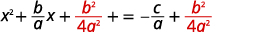

</td>
</tr>
<tr>
<td data-valign="top" data-align="left">The left side is a perfect square, factor it.</td>
<td data-valign="top" data-align="center">

</td>
</tr>
<tr>
<td data-valign="top" data-align="left">Find the common denominator of the right
side and write equivalent fractions with
the common denominator.</td>
<td data-valign="top" data-align="center">

</td>
</tr>
<tr>
<td data-valign="top" data-align="left">Simplify.</td>
<td data-valign="top" data-align="center">

</td>
</tr>
<tr>
<td data-valign="top" data-align="left">Combine to one fraction.</td>
<td data-valign="top" data-align="center">

</td>
</tr>
<tr>
<td data-valign="top" data-align="left">Use the square root property.</td>
<td data-valign="top" data-align="center">

</td>
</tr>
<tr>
<td data-valign="top" data-align="left">Simplify the radical.</td>
<td data-valign="top" data-align="center">

</td>
</tr>
<tr>
<td data-valign="top" data-align="left">Add <math xmlns="http://www.w3.org/1998/Math/MathML"><mrow><mo>−</mo><mfrac><mi>b</mi><mrow><mn>2</mn><mi>a</mi></mrow></mfrac></mrow></math> to both sides of the equation.</td>
<td data-valign="top" data-align="center">
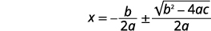

</td>
</tr>
<tr>
<td data-valign="top" data-align="left">Combine the terms on the right side.</td>
<td data-valign="top" data-align="center">
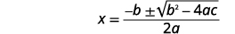

</td>
</tr>
<tr>
<td />
<td data-valign="top" data-align="left">This equation is the Quadratic Formula.</td>
</tr>
</tbody></table>

Quadratic Formula

The solutions to a **quadratic equation**{: data-type="term" .no-emphasis} of the form *ax*2 + *bx* + *c* = 0, where <math xmlns="http://www.w3.org/1998/Math/MathML"><mrow><mi>a</mi><mo>≠</mo><mn>0</mn></mrow></math>

 are given by the formula:

<math xmlns="http://www.w3.org/1998/Math/MathML"><mrow><mi>x</mi><mo>=</mo><mfrac><mrow><mtext>−</mtext><mi>b</mi><mo>±</mo><msqrt><mrow><msup><mi>b</mi><mn>2</mn></msup><mo>−</mo><mn>4</mn><mi>a</mi><mi>c</mi></mrow></msqrt></mrow><mrow><mn>2</mn><mi>a</mi></mrow></mfrac></mrow></math>

To use the **Quadratic Formula**{: data-type="term" .no-emphasis}, we substitute the values of *a*, *b*, and *c* from the standard form into the expression on the right side of the formula. Then we simplify the expression. The result is the pair of solutions to the quadratic equation.

Notice the formula is an equation. Make sure you use both sides of the equation.

How to Solve a Quadratic Equation Using the Quadratic Formula

Solve by using the Quadratic Formula: <math xmlns="http://www.w3.org/1998/Math/MathML"><mrow><mn>2</mn><msup><mi>x</mi><mn>2</mn></msup><mo>+</mo><mn>9</mn><mi>x</mi><mo>−</mo><mn>5</mn><mo>=</mo><mn>0</mn><mo>.</mo></mrow></math>

       ![In step 3, simplify the fraction and solve for x. x equals the quotient negative 9 plus or minus the square root of the difference 81 minus negative 40 divided by 4. Simplify the radicand. x equals the quotient negative 9 plus or minus the square root of 121 divided by 4. Simplify the square root. x equals the quotient negative 9 plus or minus 11 divided by 4. Separate into two equations. The first equation is x equals the quotient negative 9 plus 11 divided by 4 which simplifies to 2 divided by 4. The first solution is x equals one half. The second equation is x equals the quotient negative 9 minus 11 divided by 4 which simplifies to negative 20 divided by 4. The second solution is x equals negative 5.](../resources/CNX_IntAlg_Figure_09_03_002c_img.jpg)   ![The fourth, and final, step is to check the solution. Put each answer into the original equation to check. First, substitute x equals one half into the original equation, 2 x squared plus 9 x minus 5 equals 0. This yields 2 times the square of one half plus nine times one half minus 5. We need to show that this expression equals 0. Simplify the square. 2 times one fourth plus nine times one half minus 5 equals one half plus 9 halves minus 5, or 10 halves minus 5. 5 minus 5 equals 0, so x equals one half is indeed a solution. Next substitute x = negative 5 into the equation 2 x squared plus 9 x minus 5 equals 0. This yields 2 times the square of negative 5 plus 9 times negative 5 minus 5. We need to show that this expression equals 0. Simplify the square. 2 times 25 plus nine times negative 5 minus 5 equals 50 minus 45 minus 5, or 0. x equals negative 5 is a solution as well.](../resources/CNX_IntAlg_Figure_09_03_002d_img.jpg) 

Solve by using the Quadratic Formula: <math xmlns="http://www.w3.org/1998/Math/MathML"><mrow><mn>3</mn><msup><mi>y</mi><mn>2</mn></msup><mo>−</mo><mn>5</mn><mi>y</mi><mo>+</mo><mn>2</mn><mo>=</mo><mn>0</mn></mrow></math>

.

<math xmlns="http://www.w3.org/1998/Math/MathML"><mrow><mi>y</mi><mo>=</mo><mn>1</mn><mo>,</mo><mi>y</mi><mo>=</mo><mfrac><mn>2</mn><mn>3</mn></mfrac></mrow></math>

Solve by using the Quadratic Formula: <math xmlns="http://www.w3.org/1998/Math/MathML"><mrow><mn>4</mn><msup><mi>z</mi><mn>2</mn></msup><mo>+</mo><mn>2</mn><mi>z</mi><mo>−</mo><mn>6</mn><mo>=</mo><mn>0</mn></mrow></math>

.

<math xmlns="http://www.w3.org/1998/Math/MathML"><mrow><mi>z</mi><mo>=</mo><mn>1</mn><mo>,</mo><mi>z</mi><mo>=</mo><mo>−</mo><mfrac><mn>3</mn><mn>2</mn></mfrac></mrow></math>

Solve a quadratic equation using the quadratic formula.

1.  Write the quadratic equation in standard form, *ax*2 + *bx* + *c* = 0. Identify the values of *a*, *b*, and *c*.
2.  Write the Quadratic Formula. Then substitute in the values of *a*, *b*, and *c*.
3.  Simplify.
4.  Check the solutions.
{: type="1" .stepwise}

If you say the formula as you write it in each problem, you’ll have it memorized in no time! And remember, the Quadratic Formula is an EQUATION. Be sure you start with “*x* =”.

Solve by using the Quadratic Formula: <math xmlns="http://www.w3.org/1998/Math/MathML"><mrow><msup><mi>x</mi><mn>2</mn></msup><mo>−</mo><mn>6</mn><mi>x</mi><mo>=</mo><mn>−5</mn><mo>.</mo></mrow></math>

<table class="unnumbered unstyled" summary="Write the equation x squared minus 6 x equals negative 5 in standard form by adding 5 to both sides of the equation. X squared minus 6 x plus 5 equals 0. Identify the values of a, b, and c. The coefficient of x squared is a = 1. The coefficient of x is b equals negative 6. The constant term is c equals 5. Write the quadratic formula, x equals the quotient negative b plus or minus the square root of the difference b squared minus 4 a c divided by 2 a. Then substitute the values for a, b, and c. x equals the quotient of the expression the opposite of negative 6 plus or minus the square root of the difference negative 6 squared minus the product 4 times 1 times 5 divided by the product 2 times 1. Simplify. X equals the quotient of the expression 6 plus or minus the square root of the difference 36 minus 20 divided by 2. This further simplifies to the quotient of 6 plus or minus square root 16 and 2, so x equals the quotient of 6 plus or minus 4 and 2. Rewrite to show two solutions The first is x equals the quotient 6 plus 4 divided by 2, or 10 divided by 2 which equals 5. The second solution is the quotient 6 minus 4 divided by 2, or 2 divided by 2 which equals 1. Check the solutions in the original equation. Substitute x equals 5 into the original equation, x squared minus 6 x plus 5 equals zero to get 5 squared minus 6 times 5 plus 5 on the left side of the equation we must show that this equals 0. Simplifying the expression yields 25 minus 30 plus 5, or 0. So x equals 5 is a solution. Next check x equals 1 in the original equation. X squared minus 6 x plus 5 becomes 1 squared minus 6 times 1 plus 5. We must show this equals 0. 1 minus 6 plus 5 does equal 0, so x = 1 is a solution." data-label=""><tbody>
<tr>
<td />
<td data-valign="top" data-align="left">

</td>
</tr>
<tr>
<td data-valign="top" data-align="left">Write the equation in standard form by adding
5 to each side.</td>
<td data-valign="top" data-align="left">

</td>
</tr>
<tr>
<td data-valign="top" data-align="left">This equation is now in standard form.</td>
<td data-valign="top" data-align="left">

</td>
</tr>
<tr>
<td data-valign="top" data-align="left">Identify the values of <math xmlns="http://www.w3.org/1998/Math/MathML"><mrow><mi>a</mi><mo>,</mo><mtext> </mtext><mtext> </mtext><mi>b</mi><mo>,</mo><mtext> </mtext><mtext> </mtext><mi>c</mi><mo>.</mo></mrow></math></td>
<td data-valign="top" data-align="left">

</td>
</tr>
<tr>
<td data-valign="top" data-align="left">Write the Quadratic Formula.</td>
<td data-valign="top" data-align="left">

</td>
</tr>
<tr>
<td data-valign="top" data-align="left">Then substitute in the values of <math xmlns="http://www.w3.org/1998/Math/MathML"><mrow><mi>a</mi><mo>,</mo><mtext> </mtext><mtext> </mtext><mi>b</mi><mo>,</mo><mtext> </mtext><mtext> </mtext><mi>c</mi><mo>.</mo></mrow></math></td>
<td data-valign="top" data-align="left">

</td>
</tr>
<tr>
<td data-valign="top" data-align="left">Simplify.</td>
<td data-valign="top" data-align="left">

</td>
</tr>
<tr>
<td data-valign="top" data-align="left">Rewrite to show two solutions.</td>
<td data-valign="top" data-align="left">

</td>
</tr>
<tr>
<td data-valign="top" data-align="left">Simplify.</td>
<td data-valign="top" data-align="left">

</td>
</tr>
<tr>
<td />
<td data-valign="top" data-align="left">

</td>
</tr>
<tr>
<td data-valign="top" data-align="left">Check:

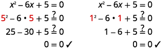

</td>
<td />
</tr>
</tbody></table>

Solve by using the Quadratic Formula: <math xmlns="http://www.w3.org/1998/Math/MathML"><mrow><msup><mi>a</mi><mn>2</mn></msup><mo>−</mo><mn>2</mn><mi>a</mi><mo>=</mo><mn>15</mn></mrow></math>

.

<math xmlns="http://www.w3.org/1998/Math/MathML"><mrow><mi>a</mi><mo>=</mo><mn>−3</mn><mo>,</mo><mi>a</mi><mo>=</mo><mn>5</mn></mrow></math>

Solve by using the Quadratic Formula: <math xmlns="http://www.w3.org/1998/Math/MathML"><mrow><msup><mi>b</mi><mn>2</mn></msup><mo>+</mo><mn>24</mn><mo>=</mo><mn>−10</mn><mi>b</mi></mrow></math>

.

<math xmlns="http://www.w3.org/1998/Math/MathML"><mrow><mi>b</mi><mo>=</mo><mn>−6</mn><mo>,</mo><mi>b</mi><mo>=</mo><mn>−4</mn></mrow></math>

When we solved quadratic equations by using the Square Root Property, we sometimes got answers that had radicals. That can happen, too, when using the **Quadratic Formula**{: data-type="term" .no-emphasis}. If we get a **radical**{: data-type="term" .no-emphasis} as a solution, the final answer must have the radical in its simplified form.

Solve by using the Quadratic Formula: <math xmlns="http://www.w3.org/1998/Math/MathML"><mrow><mn>2</mn><msup><mi>x</mi><mn>2</mn></msup><mo>+</mo><mn>10</mn><mi>x</mi><mo>+</mo><mn>11</mn><mo>=</mo><mn>0</mn><mo>.</mo></mrow></math>

<table class="unnumbered unstyled" summary="The equation 2x squared plus 10 x plus 11 equals 0 is already in standard form. Identify the values of a, b, and c. The coefficient of x squared is a = 2. The coefficient of x is b equals 10. The constant term is c equals 11. Write the quadratic formula, x equals the quotient negative b plus or minus the square root of the expression b squared minus 4 a c divided by 2 a. Then substitute the values for a, b, and c. x equals the quotient of the difference negative 10 plus or minus the square root of the difference 10 squared minus the product 4 times 2 times 11 divided by the product 2 times 2. Simplify. X equals the quotient of the expression negative 10 plus or minus the square root of the difference 100 minus 88 divided by 4. This further simplifies to the quotient negative 10 plus or minus square root 12 divided by 4. Simplify the radical. x equals the quotient negative 10 plus or minus 2 times the square root of 3 divided by 2. Factor out the common factor in the numerator. X equals the quotient of 2 times the expression negative 5 plus or minus 2 square root 3 and 4. Remove the common factor to yield x equals the quotient negative 5 plus or minus square root 3 divided by 2. Rewrite to show two solutions The first solution is x equals the quotient of negative 5 plus square root 3 and 2. The second is x equals the quotient of negative 5 minus square root 3 and 2. Remember to check the solutions in the original equation. We leave that to you!" data-label=""><tbody>
<tr>
<td />
<td data-valign="top" data-align="center">
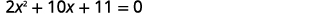

</td>
</tr>
<tr>
<td data-valign="top" data-align="left">This equation is in standard form.</td>
<td data-valign="top" data-align="center">
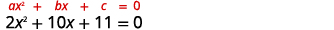

</td>
</tr>
<tr>
<td data-valign="top" data-align="left">Identify the values of <em>a</em>, <em>b</em>, and <em>c</em>.</td>
<td data-valign="top" data-align="center">

</td>
</tr>
<tr>
<td data-valign="top" data-align="left">Write the Quadratic Formula.</td>
<td data-valign="top" data-align="center">

</td>
</tr>
<tr>
<td data-valign="top" data-align="left">Then substitute in the values of <em>a</em>, <em>b</em>, and <em>c</em>.</td>
<td data-valign="top" data-align="center">
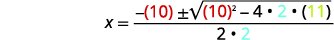

</td>
</tr>
<tr>
<td data-valign="top" data-align="left">Simplify.</td>
<td data-valign="top" data-align="center">

</td>
</tr>
<tr>
<td />
<td data-valign="top" data-align="center">

</td>
</tr>
<tr>
<td data-valign="top" data-align="left">Simplify the radical.</td>
<td data-valign="top" data-align="center">

</td>
</tr>
<tr>
<td data-valign="top" data-align="left">Factor out the common factor in the numerator.</td>
<td data-valign="top" data-align="center">

</td>
</tr>
<tr>
<td data-valign="top" data-align="left">Remove the common factors.</td>
<td data-valign="top" data-align="center">

</td>
</tr>
<tr>
<td data-valign="top" data-align="left">Rewrite to show two solutions.</td>
<td data-valign="top" data-align="center">

</td>
</tr>
<tr>
<td data-valign="top" data-align="left">Check:

We leave the check for you!</td>
<td />
</tr>
</tbody></table>

Solve by using the Quadratic Formula: <math xmlns="http://www.w3.org/1998/Math/MathML"><mrow><mn>3</mn><msup><mi>m</mi><mn>2</mn></msup><mo>+</mo><mn>12</mn><mi>m</mi><mo>+</mo><mn>7</mn><mo>=</mo><mn>0</mn></mrow></math>

.

<math xmlns="http://www.w3.org/1998/Math/MathML"><mrow><mi>m</mi><mo>=</mo><mfrac><mrow><mn>−6</mn><mo>+</mo><msqrt><mrow><mn>15</mn></mrow></msqrt></mrow><mn>3</mn></mfrac><mo>,</mo><mi>m</mi><mo>=</mo><mfrac><mrow><mn>−6</mn><mo>−</mo><msqrt><mrow><mn>15</mn></mrow></msqrt></mrow><mn>3</mn></mfrac></mrow></math>

Solve by using the Quadratic Formula: <math xmlns="http://www.w3.org/1998/Math/MathML"><mrow><mn>5</mn><msup><mi>n</mi><mn>2</mn></msup><mo>+</mo><mn>4</mn><mi>n</mi><mo>−</mo><mn>4</mn><mo>=</mo><mn>0</mn></mrow></math>

.

<math xmlns="http://www.w3.org/1998/Math/MathML"><mrow><mi>n</mi><mo>=</mo><mfrac><mrow><mn>−2</mn><mo>+</mo><mn>2</mn><msqrt><mn>6</mn></msqrt></mrow><mn>5</mn></mfrac><mo>,</mo><mi>n</mi><mo>=</mo><mfrac><mrow><mn>−2</mn><mo>−</mo><mn>2</mn><msqrt><mn>6</mn></msqrt></mrow><mn>5</mn></mfrac></mrow></math>

When we substitute *a*, *b*, and *c* into the Quadratic Formula and the **radicand**{: data-type="term" .no-emphasis} is negative, the quadratic equation will have imaginary or complex solutions. We will see this in the next example.

Solve by using the Quadratic Formula: <math xmlns="http://www.w3.org/1998/Math/MathML"><mrow><mn>3</mn><msup><mi>p</mi><mn>2</mn></msup><mo>+</mo><mn>2</mn><mi>p</mi><mo>+</mo><mn>9</mn><mo>=</mo><mn>0</mn><mo>.</mo></mrow></math>

|  |  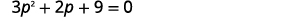  |
| This equation is in standard form |  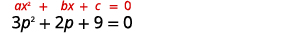  |
| Identify the values of <math xmlns="http://www.w3.org/1998/Math/MathML"><mrow><mi>a</mi><mo>,</mo><mi>b</mi><mo>,</mo><mi>c</mi><mo>.</mo></mrow></math>

 |    |
| Write the Quadratic Formula. |    |
| Then substitute in the values of <math xmlns="http://www.w3.org/1998/Math/MathML"><mrow><mi>a</mi><mo>,</mo><mi>b</mi><mo>,</mo><mi>c</mi></mrow></math>

. |  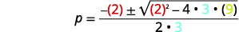  |
| Simplify. |    |
|  |    |
| Simplify the radical using complex numbers. |    |
| Simplify the radical. |    |
| Factor the common factor in the numerator. |    |
| Remove the common factors. |    |
| Rewrite in standard <math xmlns="http://www.w3.org/1998/Math/MathML"><mrow><mi>a</mi><mo>+</mo><mi>b</mi><mi>i</mi></mrow></math>

 form. |    |
| Write as two solutions. |  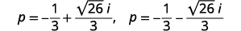  |
{: .unnumbered .unstyled .can-break summary="The equation 3 p squared plus 2 p plus 9 equals 0 is already in standard form. Identify the values of a, b, and c. The coefficient of p squared is a = 3. The coefficient of p is b equals 2. The constant term is c equals 9. Write the quadratic formula, p equals the quotient negative b plus or minus the square root of the difference b squared minus 4 a c divided by 2 a. Then substitute the values for a, b, and c. p equals the quotient of the expression negative 2 plus or minus the square root of the difference 4 squared minus the product 4 times 3 times 9 divided by the product 2 times 3. Simplify. P equals the quotient of the expression negative 2 plus or minus the square root of the difference 4 minus 108 divided by 6. This further simplifies to p equals the quotient negative 2 plus or minus the square root of negative 104 divided by 6. Simplify the radical using complex numbers. p equals the quotient negative 2 plus or minus square root 104 times I divided by 6. Simplify the radical. p equals the quotient negative 2 plus or minus 2 times square root 104 times I divided by 6. Factor the common factor in the numerator. P equals the quotient of 2 times the expression negative 1 plus or minus square root 26 times I divided by 6. Remove the common factor to yield p equals the quotient negative 1 plus or minus square root 26 times I divided by 3. Rewrite in standard a plus b I form. P equals negative one third plus or minus square root 26 divided by 3 times I. Write as show two solutions The first solution is p equals negative one third plus square root 26 thirds I. The second is p equals negative one third minus square root 26 thirds I." data-label=""}

Solve by using the Quadratic Formula: <math xmlns="http://www.w3.org/1998/Math/MathML"><mrow><mn>4</mn><msup><mi>a</mi><mn>2</mn></msup><mo>−</mo><mn>2</mn><mi>a</mi><mo>+</mo><mn>8</mn><mo>=</mo><mn>0</mn></mrow></math>

.

<math xmlns="http://www.w3.org/1998/Math/MathML"><mrow><mi>a</mi><mo>=</mo><mfrac><mn>1</mn><mn>4</mn></mfrac><mo>+</mo><mfrac><mrow><msqrt><mrow><mn>31</mn></mrow></msqrt></mrow><mn>4</mn></mfrac><mi>i</mi><mo>,</mo><mspace width="0.2em" /><mtext /><mspace width="0.2em" /><mi>a</mi><mo>=</mo><mfrac><mn>1</mn><mn>4</mn></mfrac><mo>−</mo><mfrac><mrow><msqrt><mrow><mn>31</mn></mrow></msqrt></mrow><mn>4</mn></mfrac><mi>i</mi></mrow></math>

Solve by using the Quadratic Formula: <math xmlns="http://www.w3.org/1998/Math/MathML"><mrow><mn>5</mn><msup><mi>b</mi><mn>2</mn></msup><mo>+</mo><mn>2</mn><mi>b</mi><mo>+</mo><mn>4</mn><mo>=</mo><mn>0</mn></mrow></math>

.

<math xmlns="http://www.w3.org/1998/Math/MathML"><mrow><mi>b</mi><mo>=</mo><mo>−</mo><mfrac><mn>1</mn><mn>5</mn></mfrac><mo>+</mo><mfrac><mrow><msqrt><mrow><mn>19</mn></mrow></msqrt></mrow><mn>5</mn></mfrac><mi>i</mi><mo>,</mo><mspace width="0.2em" /><mtext /><mspace width="0.2em" /><mi>b</mi><mo>=</mo><mo>−</mo><mfrac><mn>1</mn><mn>5</mn></mfrac><mo>−</mo><mfrac><mrow><msqrt><mrow><mn>19</mn></mrow></msqrt></mrow><mn>5</mn></mfrac><mi>i</mi></mrow></math>

Remember, to use the Quadratic Formula, the equation must be written in standard form, *ax*2 + *bx* + *c* = 0. Sometimes, we will need to do some algebra to get the equation into standard form before we can use the Quadratic Formula.

Solve by using the Quadratic Formula: <math xmlns="http://www.w3.org/1998/Math/MathML"><mrow><mi>x</mi><mrow><mo>(</mo><mrow><mi>x</mi><mo>+</mo><mn>6</mn></mrow><mo>)</mo></mrow><mo>+</mo><mn>4</mn><mo>=</mo><mn>0</mn><mo>.</mo></mrow></math>

Our first step is to get the equation in standard form.

<table class="unnumbered unstyled can-break" summary="Distribute to rewrite the equation x times the sum of x and 6 plus 4 equals 0 in standard form. The equation becomes x squared plus 6 x plus 4 equals 0. Identify the values of a, b, and c. The coefficient of x squared is a = 1. The coefficient of x is b equals 6. The constant term is c equals 4. Write the quadratic formula, x equals the quotient negative b plus or minus the square root of the difference b squared minus 4 a c divided by 2 a. Then substitute the values for a, b, and c. x equals the quotient of the expression negative 6 plus or minus the square root of the difference 6 squared minus the product 4 times 1 times 4 divided by the product 2 times 1. Simplify. X equals the quotient of the expression negative 6 plus or minus the square root of the difference 36 minus 16 divided by 2. This further simplifies to the quotient of negative 6 plus or minus square root 20 and 2. Simplify the radical. X equals the quotient negative 6 plus or minus 2 square root 5 divided by 2. Factor the common factor in the numerator. X equals the quotient 2 times the expression negative 3 plus or minus 2 square root 5 divided by 2. Remove the common factor, and x equals negative 3 plus or minus 2 square root 5. Rewrite to show two solutions, x equals negative 3 plus 2 square root 5 and x equals negative 3 minus 2 square root 5. Remember to check the solutions in the original equation. We leave that to you!" data-label=""><tbody>
<tr>
<td />
<td data-valign="top" data-align="center">

</td>
</tr>
<tr>
<td data-valign="top" data-align="left">Distribute to get the equation in standard form.</td>
<td data-valign="top" data-align="center">

</td>
</tr>
<tr>
<td data-valign="top" data-align="left">This equation is now in standard form</td>
<td data-valign="top" data-align="center">

</td>
</tr>
<tr>
<td data-valign="top" data-align="left">Identify the values of <math xmlns="http://www.w3.org/1998/Math/MathML"><mrow><mi>a</mi><mo>,</mo><mi>b</mi><mo>,</mo><mi>c</mi><mo>.</mo></mrow></math></td>
<td data-valign="top" data-align="center">
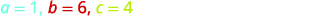

</td>
</tr>
<tr>
<td data-valign="top" data-align="left">Write the Quadratic Formula.</td>
<td data-valign="top" data-align="center">

</td>
</tr>
<tr>
<td data-valign="top" data-align="left">Then substitute in the values of <math xmlns="http://www.w3.org/1998/Math/MathML"><mrow><mi>a</mi><mo>,</mo><mi>b</mi><mo>,</mo><mi>c</mi></mrow></math>.</td>
<td data-valign="top" data-align="center">
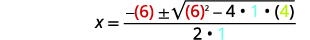

</td>
</tr>
<tr>
<td data-valign="top" data-align="left">Simplify.</td>
<td data-valign="top" data-align="center">

</td>
</tr>
<tr>
<td />
<td data-valign="top" data-align="center">

</td>
</tr>
<tr>
<td data-valign="top" data-align="left">Simplify the radical.</td>
<td data-valign="top" data-align="center">

</td>
</tr>
<tr>
<td data-valign="top" data-align="left">Factor the common factor in the numerator.</td>
<td data-valign="top" data-align="center">

</td>
</tr>
<tr>
<td data-valign="top" data-align="left">Remove the common factors.</td>
<td data-valign="top" data-align="center">

</td>
</tr>
<tr>
<td data-valign="top" data-align="left">Write as two solutions.</td>
<td data-valign="top" data-align="center">

</td>
</tr>
<tr>
<td data-valign="top" data-align="left">Check:

We leave the check for you!</td>
<td />
</tr>
</tbody></table>

Solve by using the Quadratic Formula: <math xmlns="http://www.w3.org/1998/Math/MathML"><mrow><mi>x</mi><mrow><mo>(</mo><mrow><mi>x</mi><mo>+</mo><mn>2</mn></mrow><mo>)</mo></mrow><mo>−</mo><mn>5</mn><mo>=</mo><mn>0</mn><mo>.</mo></mrow></math>

<math xmlns="http://www.w3.org/1998/Math/MathML"><mrow><mi>x</mi><mo>=</mo><mn>−1</mn><mo>+</mo><msqrt><mn>6</mn></msqrt><mo>,</mo><mi>x</mi><mo>=</mo><mn>−1</mn><mo>−</mo><msqrt><mn>6</mn></msqrt></mrow></math>

Solve by using the Quadratic Formula: <math xmlns="http://www.w3.org/1998/Math/MathML"><mrow><mn>3</mn><mi>y</mi><mrow><mo>(</mo><mrow><mi>y</mi><mo>−</mo><mn>2</mn></mrow><mo>)</mo></mrow><mo>−</mo><mn>3</mn><mo>=</mo><mn>0</mn><mo>.</mo></mrow></math>

<math xmlns="http://www.w3.org/1998/Math/MathML"><mrow><mi>y</mi><mo>=</mo><mn>1</mn><mo>+</mo><msqrt><mn>2</mn></msqrt><mo>,</mo><mi>y</mi><mo>=</mo><mn>1</mn><mo>−</mo><msqrt><mn>2</mn></msqrt></mrow></math>

When we solved linear equations, if an equation had too many fractions we cleared the fractions by multiplying both sides of the equation by the LCD. This gave us an equivalent equation—without fractions— to solve. We can use the same strategy with quadratic equations.

Solve by using the Quadratic Formula: <math xmlns="http://www.w3.org/1998/Math/MathML"><mrow><mfrac><mn>1</mn><mn>2</mn></mfrac><msup><mi>u</mi><mn>2</mn></msup><mo>+</mo><mfrac><mn>2</mn><mn>3</mn></mfrac><mi>u</mi><mo>=</mo><mfrac><mn>1</mn><mn>3</mn></mfrac><mo>.</mo></mrow></math>

Our first step is to clear the fractions.

<table class="unnumbered unstyled can-break" summary="Write the original equation, one half u squared plus two thirds u equals one third. Multiply both sides of the equation by the LCD, 6, to clear the fractions. 6 times the sum one half u squared plus two thirds u equals 6 times one third. Multiply to yield 3 u squared plus 4 u equals 2. Subtract 2 from both sides of the equation to write it in standard form. 3 u squared plus 4 u minus 2 equals 0. Identify the values of a, b, and c. The coefficient of u squared is a = 3. The coefficient of u is b equals 4. The constant term is c equals negative 2. Write the quadratic formula, x equals the quotient negative b plus or minus the square root of the difference b squared minus 4 a c divided by 2 a. Then substitute the values for a, b, and c. u equals the quotient of the expression negative 4 plus or minus the square root of the difference 4 squared minus the product 4 times 3 times negative 2 divided by the product 2 times 3. Simplify. u equals the quotient of the expression negative 4 plus or minus the square root of the sum 16 plus 24 divided by 6. This further simplifies to the quotient of negative 4 plus or minus square root 40 and 6. Simplify the radical. U equals the quotient of the expression negative 4 plus or minus 2 square root 10 and 6. Factor the common factor in the numerator. U equals the quotient of 2 times the expression negative 2 plus or minus square root 10 and 6. Remove the common factor yielding u equals the quotient of negative 2 plus or minus square root 10 and 3. Rewrite to show two solutions. u equals the quotient negative 2 plus square root 10 divided by 3 and u equals the quotient negative 2 minus square root 10 divided by 3 Check the solutions in the original equation. We leave that to you!" data-label=""><tbody>
<tr>
<td />
<td data-valign="top" data-align="center">
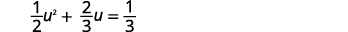

</td>
</tr>
<tr>
<td data-valign="top" data-align="left">Multiply both sides by the LCD, 6, to clear the fractions.</td>
<td data-valign="top" data-align="center">
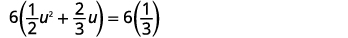

</td>
</tr>
<tr>
<td data-valign="top" data-align="left">Multiply.</td>
<td data-valign="top" data-align="center">

</td>
</tr>
<tr>
<td data-valign="top" data-align="left">Subtract 2 to get the equation in standard form.</td>
<td data-valign="top" data-align="center">
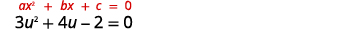

</td>
</tr>
<tr>
<td data-valign="top" data-align="left">Identify the values of <em>a</em>, <em>b</em>, and <em>c</em>.</td>
<td data-valign="top" data-align="center">

</td>
</tr>
<tr>
<td data-valign="top" data-align="left">Write the Quadratic Formula.</td>
<td data-valign="top" data-align="center">

</td>
</tr>
<tr>
<td data-valign="top" data-align="left">Then substitute in the values of <em>a</em>, <em>b</em>, and <em>c</em>.</td>
<td data-valign="top" data-align="center">

</td>
</tr>
<tr>
<td data-valign="top" data-align="left">Simplify.</td>
<td data-valign="top" data-align="center">

</td>
</tr>
<tr>
<td />
<td data-valign="top" data-align="center">

</td>
</tr>
<tr>
<td data-valign="top" data-align="left">Simplify the radical.</td>
<td data-valign="top" data-align="center">

</td>
</tr>
<tr>
<td data-valign="top" data-align="left">Factor the common factor in the numerator.</td>
<td data-valign="top" data-align="center">

</td>
</tr>
<tr>
<td data-valign="top" data-align="left">Remove the common factors.</td>
<td data-valign="top" data-align="center">

</td>
</tr>
<tr>
<td data-valign="top" data-align="left">Rewrite to show two solutions.</td>
<td data-valign="top" data-align="center">
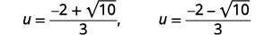

</td>
</tr>
<tr>
<td data-valign="top" data-align="left">Check:

We leave the check for you!</td>
<td />
</tr>
</tbody></table>

Solve by using the Quadratic Formula: <math xmlns="http://www.w3.org/1998/Math/MathML"><mrow><mfrac><mn>1</mn><mn>4</mn></mfrac><msup><mi>c</mi><mn>2</mn></msup><mo>−</mo><mfrac><mn>1</mn><mn>3</mn></mfrac><mi>c</mi><mo>=</mo><mfrac><mn>1</mn><mrow><mn>12</mn></mrow></mfrac></mrow></math>

.

<math xmlns="http://www.w3.org/1998/Math/MathML"><mrow><mi>c</mi><mo>=</mo><mfrac><mrow><mn>2</mn><mo>+</mo><msqrt><mn>7</mn></msqrt></mrow><mn>3</mn></mfrac><mo>,</mo><mspace width="0.2em" /><mtext /><mspace width="0.2em" /><mi>c</mi><mo>=</mo><mfrac><mrow><mn>2</mn><mo>−</mo><msqrt><mn>7</mn></msqrt></mrow><mn>3</mn></mfrac></mrow></math>

Solve by using the Quadratic Formula: <math xmlns="http://www.w3.org/1998/Math/MathML"><mrow><mfrac><mn>1</mn><mn>9</mn></mfrac><msup><mi>d</mi><mn>2</mn></msup><mo>−</mo><mfrac><mn>1</mn><mn>2</mn></mfrac><mi>d</mi><mo>=</mo><mo>−</mo><mfrac><mn>1</mn><mn>3</mn></mfrac></mrow></math>

.

<math xmlns="http://www.w3.org/1998/Math/MathML"><mrow><mi>d</mi><mo>=</mo><mfrac><mrow><mn>9</mn><mo>+</mo><msqrt><mrow><mn>33</mn></mrow></msqrt></mrow><mn>4</mn></mfrac><mo>,</mo><mspace width="0.2em" /><mtext>d</mtext><mo>=</mo><mfrac><mrow><mn>9</mn><mo>−</mo><msqrt><mrow><mn>33</mn></mrow></msqrt></mrow><mn>4</mn></mfrac></mrow></math>

Think about the equation (*x* − 3)2 = 0. We know from the **Zero Product Property**{: data-type="term" .no-emphasis} that this equation has only one solution,* * *
{: data-type="newline"}

*x* = 3.

We will see in the next example how using the **Quadratic Formula**{: data-type="term" .no-emphasis} to solve an equation whose standard form is a perfect square **trinomial**{: data-type="term" .no-emphasis} equal to 0 gives just one solution. Notice that once the radicand is simplified it becomes 0 , which leads to only one solution.

Solve by using the Quadratic Formula: <math xmlns="http://www.w3.org/1998/Math/MathML"><mrow><mn>4</mn><msup><mi>x</mi><mn>2</mn></msup><mo>−</mo><mn>20</mn><mi>x</mi><mo>=</mo><mn>−25</mn><mo>.</mo></mrow></math>

<table class="unnumbered unstyled can-break" summary="Write the equation 4 x squared minus 20 x equals negative 25 in standard form by adding 25 to both sides of the equation. 4 x squared minus 20 x plus 25 equals 0. Identify the values of a, b, and c. The coefficient of x squared is a = 4. The coefficient of x is b equals negative 20. The constant term is c equals 25. Write the quadratic formula, x equals the quotient negative b plus or minus the square root of the difference b squared minus 4 a c divided by 2 a. Then substitute the values for a, b, and c. x equals the quotient of the expression the opposite of negative 20 plus or minus the square root of the difference negative 20 squared minus the product 4 times 4 times 25 divided by the product 2 times 4. Simplify. X equals the quotient of the expression 20 plus or minus the square root of the difference 400 minus 400 divided by 8. This further simplifies to the quotient of 20 plus or minus 0 and 2, so x equals 20 divided by 8 or 5 halves. We leave it to you to check the solution in the original equation." data-label=""><tbody>
<tr>
<td />
<td data-valign="top" data-align="center">

</td>
</tr>
<tr>
<td data-valign="top" data-align="left">Add 25 to get the equation in standard form.</td>
<td data-valign="top" data-align="center">
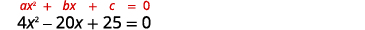

</td>
</tr>
<tr>
<td data-valign="top" data-align="left">Identify the values of <em>a</em>, <em>b</em>, and <em>c</em>.</td>
<td data-valign="top" data-align="center">

</td>
</tr>
<tr>
<td data-valign="top" data-align="left">Write the quadratic formula.</td>
<td data-valign="top" data-align="center">

</td>
</tr>
<tr>
<td data-valign="top" data-align="left">Then substitute in the values of <em>a</em>, <em>b</em>, and <em>c</em>.</td>
<td data-valign="top" data-align="center">
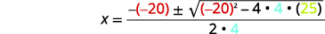

</td>
</tr>
<tr>
<td data-valign="top" data-align="left">Simplify.</td>
<td data-valign="top" data-align="center">

</td>
</tr>
<tr>
<td />
<td data-valign="top" data-align="center">

</td>
</tr>
<tr>
<td data-valign="top" data-align="left">Simplify the radical.</td>
<td data-valign="top" data-align="center">

</td>
</tr>
<tr>
<td data-valign="top" data-align="left">Simplify the fraction.</td>
<td data-valign="top" data-align="center">

</td>
</tr>
<tr>
<td data-valign="top" data-align="left">Check:

We leave the check for you!</td>
<td />
</tr>
</tbody></table>
Did you recognize that 4*x*2 − 20*x* + 25 is a perfect square trinomial. It is equivalent to (2*x* − 5)2? If you solve* * *
{: data-type="newline"}

4*x*2 − 20*x* + 25 = 0 by factoring and then using the Square Root Property, do you get the same result?

Solve by using the Quadratic Formula: <math xmlns="http://www.w3.org/1998/Math/MathML"><mrow><msup><mi>r</mi><mn>2</mn></msup><mo>+</mo><mn>10</mn><mi>r</mi><mo>+</mo><mn>25</mn><mo>=</mo><mn>0</mn><mo>.</mo></mrow></math>

<math xmlns="http://www.w3.org/1998/Math/MathML"><mrow><mi>r</mi><mo>=</mo><mn>−5</mn></mrow></math>

Solve by using the Quadratic Formula: <math xmlns="http://www.w3.org/1998/Math/MathML"><mrow><mn>25</mn><msup><mi>t</mi><mn>2</mn></msup><mo>−</mo><mn>40</mn><mi>t</mi><mo>=</mo><mn>−16</mn><mo>.</mo></mrow></math>

<math xmlns="http://www.w3.org/1998/Math/MathML"><mrow><mi>t</mi><mo>=</mo><mfrac><mn>4</mn><mn>5</mn></mfrac></mrow></math>

### Use the Discriminant to Predict the Number and Type of Solutions of a Quadratic Equation

When we solved the quadratic equations in the previous examples, sometimes we got two real solutions, one real solution, and sometimes two complex solutions. Is there a way to predict the number and type of solutions to a quadratic equation without actually solving the equation?

Yes, the expression under the radical of the Quadratic Formula makes it easy for us to determine the number and type of solutions. This expression is called the **discriminant**{: data-type="term"}.

Discriminant

 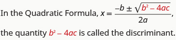 

Let’s look at the discriminant of the equations in some of the examples and the number and type of solutions to those quadratic equations.

<table class="unnumbered" summary="This table has four columns and four rows. The first row is a header row and labels the columns &#x201C;Quadratic Equation (in standard form)&#x201D;, &#x201C;Discriminant b squared minus 4 a c&#x201D;, &#x201C;Value of the Discriminant&#x201D;, and &#x201C;Number and Type of solutions&#x201D;. The second row has the quadratic equation 2 x squared plus 9 x minus 5 equals 0. The discriminant is 9 squared minus the expression 4 times 2 times negative 5, which equals 121. The value of 121 is positive, and there are 2 real solutions. The third row has the quadratic equation 4 x squared minus 20 x plus 25 equals 0. The discriminant is negative twenty squared minus the expression 4 times 4 times 25, which equals 0. The value is 0, and there is 1 real solution. The fourth row has the quadratic equation 3 p squared plus 2 p plus 9 equals 0. The discriminant is 2 squared minus the expression 4 times 3 times 9, which equals negative 104. Th value of negative 104 is negative, and there are 2 complex solutions."><thead>
<tr>
<th data-valign="middle" data-align="center">Quadratic Equation
(in standard form)</th>
<th data-valign="middle" data-align="center">Discriminant
<math xmlns="http://www.w3.org/1998/Math/MathML"><mrow><msup><mi>b</mi><mn>2</mn></msup><mo>−</mo><mn>4</mn><mi>a</mi><mi>c</mi></mrow></math></th>
<th data-valign="middle" data-align="center">Value of the Discriminant</th>
<th data-valign="middle" data-align="center">Number and Type of solutions</th>
</tr>
</thead><tbody>
<tr>
<td data-valign="middle" data-align="left"><math xmlns="http://www.w3.org/1998/Math/MathML"><mrow><mn>2</mn><msup><mi>x</mi><mn>2</mn></msup><mo>+</mo><mn>9</mn><mi>x</mi><mo>−</mo><mn>5</mn><mo>=</mo><mn>0</mn></mrow></math></td>
<td data-valign="middle" data-align="center"><math xmlns="http://www.w3.org/1998/Math/MathML"><mtable><mtr><mtd columnalign="center"><msup><mn>9</mn><mn>2</mn></msup><mo>−</mo><mn>4</mn><mo>·</mo><mn>2</mn><mrow><mo>(</mo><mrow><mn>−5</mn></mrow><mo>)</mo></mrow></mtd></mtr><mtr><mtd columnalign="center"><mn>121</mn></mtd></mtr></mtable></math></td>
<td data-valign="middle" data-align="center">+</td>
<td data-valign="middle" data-align="left">2 real</td>
</tr>
<tr>
<td data-valign="middle" data-align="left"><math xmlns="http://www.w3.org/1998/Math/MathML"><mrow><mn>4</mn><msup><mi>x</mi><mn>2</mn></msup><mo>−</mo><mn>20</mn><mi>x</mi><mo>+</mo><mn>25</mn><mo>=</mo><mn>0</mn></mrow></math></td>
<td data-valign="middle" data-align="center"><math xmlns="http://www.w3.org/1998/Math/MathML"><mtable><mtr><mtd columnalign="center"><msup><mrow><mo>(</mo><mrow><mn>−20</mn></mrow><mo>)</mo></mrow><mn>2</mn></msup><mo>−</mo><mn>4</mn><mo>·</mo><mn>4</mn><mo>·</mo><mn>25</mn></mtd></mtr><mtr><mtd columnalign="center"><mn>0</mn></mtd></mtr></mtable></math></td>
<td data-valign="middle" data-align="center">0</td>
<td data-valign="middle" data-align="left">1 real</td>
</tr>
<tr>
<td data-valign="middle" data-align="left"><math xmlns="http://www.w3.org/1998/Math/MathML"><mrow><mn>3</mn><msup><mi>p</mi><mn>2</mn></msup><mo>+</mo><mn>2</mn><mi>p</mi><mo>+</mo><mn>9</mn><mo>=</mo><mn>0</mn></mrow></math></td>
<td data-valign="middle" data-align="center"><math xmlns="http://www.w3.org/1998/Math/MathML"><mtable><mtr><mtd columnalign="center"><msup><mn>2</mn><mn>2</mn></msup><mo>−</mo><mn>4</mn><mo>·</mo><mn>3</mn><mo>·</mo><mn>9</mn></mtd></mtr><mtr /><mtr><mtd columnalign="center"><mo>−</mo><mn>104</mn></mtd></mtr></mtable></math></td>
<td data-valign="middle" data-align="center">−</td>
<td data-valign="middle" data-align="left">2 complex</td>
</tr>
</tbody></table>

    

Using the Discriminant, *b*2 − 4*ac*, to Determine the Number and Type of Solutions of a Quadratic Equation

For a quadratic equation of the form *ax*2 + *bx* + *c* = 0, <math xmlns="http://www.w3.org/1998/Math/MathML"><mrow><mi>a</mi><mo>≠</mo><mn>0</mn><mo>,</mo></mrow></math>

* If *b*2 − 4*ac* &gt; 0, the equation has 2 real solutions.
* if *b*2 − 4*ac* = 0, the equation has 1 real solution.
* if *b*2 − 4*ac* &lt; 0, the equation has 2 complex solutions.
{: data-bullet-style="bullet"}

Determine the number of solutions to each quadratic equation.

ⓐ <math xmlns="http://www.w3.org/1998/Math/MathML"><mrow><mn>3</mn><msup><mi>x</mi><mn>2</mn></msup><mo>+</mo><mn>7</mn><mi>x</mi><mo>−</mo><mn>9</mn><mo>=</mo><mn>0</mn></mrow></math>

 ⓑ <math xmlns="http://www.w3.org/1998/Math/MathML"><mrow><mn>5</mn><msup><mi>n</mi><mn>2</mn></msup><mo>+</mo><mi>n</mi><mo>+</mo><mn>4</mn><mo>=</mo><mn>0</mn></mrow></math>

 ⓒ <math xmlns="http://www.w3.org/1998/Math/MathML"><mrow><mn>9</mn><msup><mi>y</mi><mn>2</mn></msup><mo>−</mo><mn>6</mn><mi>y</mi><mo>+</mo><mn>1</mn><mo>=</mo><mn>0</mn><mo>.</mo></mrow></math>

To determine the number of solutions of each quadratic equation, we will look at its discriminant.

ⓐ* * *
{: data-type="newline"}

 <math xmlns="http://www.w3.org/1998/Math/MathML"><mrow><mtable><mtr><mtd /><mtd /><mtd /><mtd columnalign="center"><mn>3</mn><msup><mi>x</mi><mn>2</mn></msup><mo>+</mo><mn>7</mn><mi>x</mi><mo>−</mo><mn>9</mn><mo>=</mo><mn>0</mn></mtd></mtr> <mtr><mtd columnalign="left"><mtable><mtr><mtd columnalign="left"><mtext>The equation is in standard form, identify</mtext></mtd></mtr><mtr><mtd columnalign="left"><mi>a</mi><mo>,</mo><mi>b</mi><mo>,</mo><mspace width="0.2em" /><mtext>and</mtext><mspace width="0.2em" /><mi>c</mi><mo>.</mo></mtd></mtr></mtable></mtd><mtd /><mtd /><mtd columnalign="center"><mi>a</mi><mo>=</mo><mn>3</mn><mo>,</mo><mspace width="0.5em" /><mi>b</mi><mo>=</mo><mn>7</mn><mo>,</mo><mspace width="0.2em" /><mi>c</mi><mo>=</mo><mn>−9</mn></mtd></mtr> <mtr><mtd columnalign="left"><mtext>Write the discriminant.</mtext></mtd><mtd /><mtd /><mtd columnalign="center"><msup><mi>b</mi><mn>2</mn></msup><mo>−</mo><mn>4</mn><mi>a</mi><mi>c</mi></mtd></mtr> <mtr><mtd columnalign="left"><mtext>Substitute in the values of</mtext><mspace width="0.2em" /><mi>a</mi><mo>,</mo><mi>b</mi><mo>,</mo><mspace width="0.2em" /><mtext>and</mtext><mspace width="0.2em" /><mi>c</mi><mo>.</mo></mtd><mtd /><mtd /><mtd columnalign="center"><msup><mrow><mrow><mo>(</mo><mn>7</mn><mo>)</mo></mrow></mrow><mn>2</mn></msup><mo>−</mo><mn>4</mn><mo>·</mo><mn>3</mn><mo>·</mo><mrow><mo>(</mo><mrow><mn>−9</mn></mrow><mo>)</mo></mrow></mtd></mtr> <mtr><mtd columnalign="left"><mtext>Simplify.</mtext></mtd><mtd /><mtd /><mtd columnalign="center"><mn>49</mn><mo>+</mo><mn>108</mn></mtd></mtr> <mtr><mtd /><mtd /><mtd /><mtd columnalign="center"><mn>157</mn></mtd></mtr></mtable></mrow></math>

Since the discriminant is positive, there are 2 real solutions to the equation.

ⓑ* * *
{: data-type="newline"}

 <math xmlns="http://www.w3.org/1998/Math/MathML"><mrow><mtable><mtr><mtd /><mtd /><mtd /><mtd columnalign="center"><mn>5</mn><msup><mi>n</mi><mn>2</mn></msup><mo>+</mo><mi>n</mi><mo>+</mo><mn>4</mn><mo>=</mo><mn>0</mn></mtd></mtr> <mtr><mtd columnalign="left"><mtable><mtr><mtd columnalign="left"><mtext>The equation is in standard form, identify</mtext></mtd></mtr><mtr><mtd columnalign="left"><mi>a</mi><mo>,</mo><mi>b</mi><mo>,</mo><mspace width="0.2em" /><mtext>and</mtext><mspace width="0.2em" /><mi>c</mi><mo>.</mo></mtd></mtr></mtable></mtd><mtd /><mtd /><mtd columnalign="center"><mi>a</mi><mo>=</mo><mn>5</mn><mo>,</mo><mspace width="0.5em" /><mi>b</mi><mo>=</mo><mn>1</mn><mo>,</mo><mspace width="0.5em" /><mi>c</mi><mo>=</mo><mn>4</mn></mtd></mtr> <mtr><mtd columnalign="left"><mtext>Write the discriminant.</mtext></mtd><mtd /><mtd /><mtd columnalign="center"><msup><mi>b</mi><mn>2</mn></msup><mo>−</mo><mn>4</mn><mi>a</mi><mi>c</mi></mtd></mtr> <mtr><mtd columnalign="left"><mtext>Substitute in the values of</mtext><mspace width="0.2em" /><mi>a</mi><mo>,</mo><mi>b</mi><mo>,</mo><mspace width="0.2em" /><mtext>and</mtext><mspace width="0.2em" /><mi>c</mi><mo>.</mo></mtd><mtd /><mtd /><mtd columnalign="center"><msup><mrow><mrow><mo>(</mo><mn>1</mn><mo>)</mo></mrow></mrow><mn>2</mn></msup><mo>−</mo><mn>4</mn><mo>·</mo><mn>5</mn><mo>·</mo><mn>4</mn></mtd></mtr> <mtr><mtd columnalign="left"><mtext>Simplify.</mtext></mtd><mtd /><mtd /><mtd columnalign="center"><mn>1</mn><mo>−</mo><mn>80</mn></mtd></mtr> <mtr><mtd /><mtd /><mtd /><mtd columnalign="center"><mn>−79</mn></mtd></mtr></mtable></mrow></math>

Since the discriminant is negative, there are 2 complex solutions to the equation.

ⓒ* * *
{: data-type="newline"}

 <math xmlns="http://www.w3.org/1998/Math/MathML"><mrow><mtable><mtr><mtd /><mtd /><mtd /><mtd columnalign="center"><mn>9</mn><msup><mi>y</mi><mn>2</mn></msup><mo>−</mo><mn>6</mn><mi>y</mi><mo>+</mo><mn>1</mn><mo>=</mo><mn>0</mn></mtd></mtr> <mtr><mtd columnalign="left"><mtable><mtr><mtd columnalign="left"><mtext>The equation is in standard form, identify</mtext></mtd></mtr><mtr><mtd columnalign="left"><mi>a</mi><mo>,</mo><mi>b</mi><mo>,</mo><mspace width="0.2em" /><mtext>and</mtext><mspace width="0.2em" /><mi>c</mi><mo>.</mo></mtd></mtr></mtable></mtd><mtd /><mtd /><mtd columnalign="center"><mi>a</mi><mo>=</mo><mn>9</mn><mo>,</mo><mi>b</mi><mo>=</mo><mn>−6</mn><mo>,</mo><mi>c</mi><mo>=</mo><mn>1</mn></mtd></mtr> <mtr><mtd columnalign="left"><mtext>Write the discriminant.</mtext></mtd><mtd /><mtd /><mtd columnalign="center"><msup><mi>b</mi><mn>2</mn></msup><mo>−</mo><mn>4</mn><mi>a</mi><mi>c</mi></mtd></mtr> <mtr><mtd columnalign="left"><mtext>Substitute in the values of</mtext><mspace width="0.2em" /><mi>a</mi><mo>,</mo><mi>b</mi><mo>,</mo><mspace width="0.2em" /><mtext>and</mtext><mspace width="0.2em" /><mi>c</mi><mo>.</mo></mtd><mtd /><mtd /><mtd columnalign="center"><msup><mrow><mrow><mo>(</mo><mrow><mn>−6</mn></mrow><mo>)</mo></mrow></mrow><mn>2</mn></msup><mo>−</mo><mn>4</mn><mo>·</mo><mn>9</mn><mo>·</mo><mn>1</mn></mtd></mtr> <mtr><mtd columnalign="left"><mtext>Simplify.</mtext></mtd><mtd /><mtd /><mtd columnalign="center"><mn>36</mn><mo>−</mo><mn>36</mn></mtd></mtr> <mtr><mtd /><mtd /><mtd /><mtd columnalign="center"><mn>0</mn></mtd></mtr></mtable></mrow></math>

Since the discriminant is 0, there is 1 real solution to the equation.

Determine the numberand type of solutions to each quadratic equation.

ⓐ <math xmlns="http://www.w3.org/1998/Math/MathML"><mrow><mn>8</mn><msup><mi>m</mi><mn>2</mn></msup><mo>−</mo><mn>3</mn><mi>m</mi><mo>+</mo><mn>6</mn><mo>=</mo><mn>0</mn></mrow></math>

 ⓑ <math xmlns="http://www.w3.org/1998/Math/MathML"><mrow><mn>5</mn><msup><mi>z</mi><mn>2</mn></msup><mo>+</mo><mn>6</mn><mi>z</mi><mo>−</mo><mn>2</mn><mo>=</mo><mn>0</mn></mrow></math>

 ⓒ <math xmlns="http://www.w3.org/1998/Math/MathML"><mrow><mn>9</mn><msup><mi>w</mi><mn>2</mn></msup><mo>+</mo><mn>24</mn><mi>w</mi><mo>+</mo><mn>16</mn><mo>=</mo><mn>0</mn><mo>.</mo></mrow></math>

ⓐ 2 complex solutions; ⓑ 2 real solutions; ⓒ 1 real solution

Determine the number and type of solutions to each quadratic equation.

ⓐ <math xmlns="http://www.w3.org/1998/Math/MathML"><mrow><msup><mi>b</mi><mn>2</mn></msup><mo>+</mo><mn>7</mn><mi>b</mi><mo>−</mo><mn>13</mn><mo>=</mo><mn>0</mn></mrow></math>

 ⓑ <math xmlns="http://www.w3.org/1998/Math/MathML"><mrow><mn>5</mn><msup><mi>a</mi><mn>2</mn></msup><mo>−</mo><mn>6</mn><mi>a</mi><mo>+</mo><mn>10</mn><mo>=</mo><mn>0</mn></mrow></math>

 ⓒ <math xmlns="http://www.w3.org/1998/Math/MathML"><mrow><mn>4</mn><msup><mi>r</mi><mn>2</mn></msup><mo>−</mo><mn>20</mn><mi>r</mi><mo>+</mo><mn>25</mn><mo>=</mo><mn>0</mn><mo>.</mo></mrow></math>

ⓐ 2 real solutions; ⓑ 2 complex solutions; ⓒ 1 real solution

### Identify the Most Appropriate Method to Use to Solve a Quadratic Equation

We summarize the four methods that we have used to solve quadratic equations below.

Methods for Solving Quadratic Equations

1.  Factoring
2.  Square Root Property
3.  Completing the Square
4.  Quadratic Formula
{: type="1"}

Given that we have four methods to use to solve a quadratic equation, how do you decide which one to use? Factoring is often the quickest method and so we try it first. If the equation is <math xmlns="http://www.w3.org/1998/Math/MathML"><mrow><mi>a</mi><msup><mi>x</mi><mn>2</mn></msup><mo>=</mo><mi>k</mi></mrow></math>

 or <math xmlns="http://www.w3.org/1998/Math/MathML"><mrow><mi>a</mi><msup><mrow><mo stretchy="false">(</mo><mi>x</mi><mo>−</mo><mi>h</mi><mo stretchy="false">)</mo></mrow><mn>2</mn></msup><mo>=</mo><mi>k</mi></mrow></math>

 we use the Square Root Property. For any other equation, it is probably best to use the Quadratic Formula. Remember, you can solve any quadratic equation by using the Quadratic Formula, but that is not always the easiest method.

What about the method of Completing the Square? Most people find that method cumbersome and prefer not to use it. We needed to include it in the list of methods because we completed the square in general to derive the Quadratic Formula. You will also use the process of Completing the Square in other areas of algebra.

Identify the most appropriate method to solve a quadratic equation.

1.  Try **Factoring** first. If the quadratic factors easily, this method is very quick.
2.  Try the **Square Root Property** next. If the equation fits the form
    <math xmlns="http://www.w3.org/1998/Math/MathML"><mrow><mi>a</mi><msup><mrow><mi>x</mi></mrow><mrow><mn>2</mn></mrow></msup><mo>=</mo><mi>k</mi></mrow></math>
    
    or
    <math xmlns="http://www.w3.org/1998/Math/MathML"><mrow><mi>a</mi><msup><mrow><mo stretchy="false">(</mo><mi>x</mi><mo>−</mo><mi>h</mi><mo stretchy="false">)</mo></mrow><mrow><mn>2</mn></mrow></msup><mo>=</mo><mi>k</mi><mo>,</mo></mrow></math>
    
    it can easily be solved by using the Square Root Property.
3.  Use the **Quadratic Formula**. Any other quadratic equation is best solved by using the Quadratic Formula.
{: type="1" .stepwise}

The next example uses this strategy to decide how to solve each quadratic equation.

Identify the most appropriate method to use to solve each quadratic equation.

ⓐ <math xmlns="http://www.w3.org/1998/Math/MathML"><mrow><mn>5</mn><msup><mi>z</mi><mn>2</mn></msup><mo>=</mo><mn>17</mn></mrow></math>

 ⓑ <math xmlns="http://www.w3.org/1998/Math/MathML"><mrow><mn>4</mn><msup><mi>x</mi><mn>2</mn></msup><mo>−</mo><mn>12</mn><mi>x</mi><mo>+</mo><mn>9</mn><mo>=</mo><mn>0</mn></mrow></math>

 ⓒ <math xmlns="http://www.w3.org/1998/Math/MathML"><mrow><mn>8</mn><msup><mi>u</mi><mn>2</mn></msup><mo>+</mo><mn>6</mn><mi>u</mi><mo>=</mo><mn>11</mn><mo>.</mo></mrow></math>

ⓐ* * *
{: data-type="newline"}

 <math xmlns="http://www.w3.org/1998/Math/MathML"><mrow><mtable><mtr /><mtr /><mtr /><mtr><mtd columnalign="center"><mspace width="2em" /><mn>5</mn><msup><mi>z</mi><mn>2</mn></msup><mo>=</mo><mn>17</mn></mtd></mtr></mtable></mrow></math>

Since the equation is in the <math xmlns="http://www.w3.org/1998/Math/MathML"><mrow><mi>a</mi><msup><mi>x</mi><mn>2</mn></msup><mo>=</mo><mi>k</mi><mo>,</mo></mrow></math>

 the most appropriate method is to use the Square Root Property.

ⓑ* * *
{: data-type="newline"}

 <math xmlns="http://www.w3.org/1998/Math/MathML"><mrow><mtable><mtr /><mtr /><mtr /><mtr><mtd columnalign="center"><mspace width="3.5em" /><mn>4</mn><msup><mi>x</mi><mn>2</mn></msup><mo>−</mo><mn>12</mn><mi>x</mi><mo>+</mo><mn>9</mn><mo>=</mo><mn>0</mn></mtd></mtr></mtable></mrow></math>

We recognize that the left side of the equation is a perfect square trinomial, and so factoring will be the most appropriate method.

ⓒ* * *
{: data-type="newline"}

 <math xmlns="http://www.w3.org/1998/Math/MathML"><mrow><mtable><mtr><mtd /><mtd /><mtd /><mtd /><mtd /><mtd /><mtd /><mtd columnalign="right"><mn>8</mn><msup><mi>u</mi><mn>2</mn></msup><mo>+</mo><mn>6</mn><mi>u</mi></mtd><mtd columnalign="left"><mo>=</mo></mtd><mtd columnalign="left"><mn>11</mn></mtd></mtr> <mtr><mtd columnalign="left"><mtext>Put the equation in standard form.</mtext></mtd><mtd /><mtd /><mtd /><mtd /><mtd /><mtd /><mtd columnalign="right"><mn>8</mn><msup><mi>u</mi><mn>2</mn></msup><mo>+</mo><mn>6</mn><mi>u</mi><mo>−</mo><mn>11</mn></mtd><mtd columnalign="left"><mo>=</mo></mtd><mtd columnalign="left"><mn>0</mn></mtd></mtr></mtable></mrow></math>

While our first thought may be to try factoring, thinking about all the possibilities for trial and error method leads us to choose the Quadratic Formula as the most appropriate method.

Identify the most appropriate method to use to solve each quadratic equation.

ⓐ <math xmlns="http://www.w3.org/1998/Math/MathML"><mrow><msup><mi>x</mi><mn>2</mn></msup><mo>+</mo><mn>6</mn><mi>x</mi><mo>+</mo><mn>8</mn><mo>=</mo><mn>0</mn></mrow></math>

 ⓑ <math xmlns="http://www.w3.org/1998/Math/MathML"><mrow><msup><mrow><mrow><mo>(</mo><mrow><mi>n</mi><mo>−</mo><mn>3</mn></mrow><mo>)</mo></mrow></mrow><mn>2</mn></msup><mo>=</mo><mn>16</mn></mrow></math>

 ⓒ <math xmlns="http://www.w3.org/1998/Math/MathML"><mrow><mn>5</mn><msup><mi>p</mi><mn>2</mn></msup><mo>−</mo><mn>6</mn><mi>p</mi><mo>=</mo><mn>9</mn><mo>.</mo></mrow></math>

ⓐ factoring; ⓑ Square Root Property; ⓒ Quadratic Formula

Identify the most appropriate method to use to solve each quadratic equation.

ⓐ <math xmlns="http://www.w3.org/1998/Math/MathML"><mrow><mn>8</mn><msup><mi>a</mi><mn>2</mn></msup><mo>+</mo><mn>3</mn><mi>a</mi><mo>−</mo><mn>9</mn><mo>=</mo><mn>0</mn></mrow></math>

 ⓑ <math xmlns="http://www.w3.org/1998/Math/MathML"><mrow><mn>4</mn><msup><mi>b</mi><mn>2</mn></msup><mo>+</mo><mn>4</mn><mi>b</mi><mo>+</mo><mn>1</mn><mo>=</mo><mn>0</mn></mrow></math>

 ⓒ <math xmlns="http://www.w3.org/1998/Math/MathML"><mrow><mn>5</mn><msup><mi>c</mi><mn>2</mn></msup><mo>=</mo><mn>125</mn><mo>.</mo></mrow></math>

ⓐ Quadratic Forumula;* * *
{: data-type="newline"}

ⓑ Factoring or Square Root Property ⓒ Square Root Property

Access these online resources for additional instruction and practice with using the Quadratic Formula.

* [Using the Quadratic Formula][1]
* [Solve a Quadratic Equation Using the Quadratic Formula with Complex Solutions][2]
* [Discriminant in Quadratic Formula][3]
{: data-display="block"}

### Key Concepts

* Quadratic Formula
  * The solutions to a quadratic equation of the form *ax*2 + *bx* + *c* = 0,
    <math xmlns="http://www.w3.org/1998/Math/MathML"><mrow><mi>a</mi><mo>≠</mo><mn>0</mn></mrow></math>
    
    are given by the formula:
    * * *
    {: data-type="newline"}
    
    

    <math xmlns="http://www.w3.org/1998/Math/MathML"><mrow><mi>x</mi><mo>=</mo><mfrac><mrow><mtext>−</mtext><mi>b</mi><mo>±</mo><msqrt><mrow><msup><mi>b</mi><mn>2</mn></msup><mo>−</mo><mn>4</mn><mi>a</mi><mi>c</mi></mrow></msqrt></mrow><mrow><mn>2</mn><mi>a</mi></mrow></mfrac></mrow></math>
    

  {: data-bullet-style="open-circle"}

* How to solve a quadratic equation using the Quadratic Formula.
  1.  Write the quadratic equation in standard form, *ax*2 + *bx* + *c* = 0. Identify the values of *a*, *b*, *c*.
  2.  Write the Quadratic Formula. Then substitute in the values of *a*, *b*, *c*.
  3.  Simplify.
  4.  Check the solutions.
  {: type="1" .stepwise}

* Using the Discriminant, *b*2 − 4*ac*, to Determine the Number and Type of Solutions of a Quadratic Equation
  * For a quadratic equation of the form *ax*2 + *bx* + *c* = 0,
    <math xmlns="http://www.w3.org/1998/Math/MathML"><mrow><mi>a</mi><mo>≠</mo><mn>0</mn><mo>,</mo></mrow></math>
    
    * If *b*2 − 4*ac* &gt; 0, the equation has 2 real solutions.
    * if *b*2 − 4*ac* = 0, the equation has 1 real solution.
    * if *b*2 − 4*ac* &lt; 0, the equation has 2 complex solutions.
    {: data-bullet-style="bullet"}
  {: data-bullet-style="open-circle"}

* Methods to Solve Quadratic Equations:
  * Factoring
  * Square Root Property
  * Completing the Square
  * Quadratic Formula
  {: data-bullet-style="open-circle"}

* How to identify the most appropriate method to solve a quadratic equation.
  1.  Try Factoring first. If the quadratic factors easily, this method is very quick.
  2.  Try the **Square Root Property** next. If the equation fits the form *ax*2 = *k* or *a*(*x* − *h*)2 = *k*, it can easily be solved by using the Square Root Property.
  3.  Use the **Quadratic Formula.** Any other quadratic equation is best solved by using the Quadratic Formula.
  {: type="1" .stepwise}
{: data-bullet-style="bullet"}

<section data-depth="1" class="section-exercises" markdown="1">
#### Practice Makes Perfect

**Solve Quadratic Equations Using the Quadratic Formula**

In the following exercises, solve by using the Quadratic Formula.

<math xmlns="http://www.w3.org/1998/Math/MathML"><mrow><mn>4</mn><msup><mi>m</mi><mn>2</mn></msup><mo>+</mo><mi>m</mi><mo>−</mo><mn>3</mn><mo>=</mo><mn>0</mn></mrow></math>

<math xmlns="http://www.w3.org/1998/Math/MathML"><mrow><mi>m</mi><mo>=</mo><mn>−1</mn><mo>,</mo><mi>m</mi><mo>=</mo><mfrac><mn>3</mn><mn>4</mn></mfrac></mrow></math>

<math xmlns="http://www.w3.org/1998/Math/MathML"><mrow><mn>4</mn><msup><mi>n</mi><mn>2</mn></msup><mo>−</mo><mn>9</mn><mi>n</mi><mo>+</mo><mn>5</mn><mo>=</mo><mn>0</mn></mrow></math>

<math xmlns="http://www.w3.org/1998/Math/MathML"><mrow><mn>2</mn><msup><mi>p</mi><mn>2</mn></msup><mo>−</mo><mn>7</mn><mi>p</mi><mo>+</mo><mn>3</mn><mo>=</mo><mn>0</mn></mrow></math>

<math xmlns="http://www.w3.org/1998/Math/MathML"><mrow><mi>p</mi><mo>=</mo><mfrac><mn>1</mn><mn>3</mn></mfrac><mo>,</mo><mi>p</mi><mo>=</mo><mn>2</mn></mrow></math>

<math xmlns="http://www.w3.org/1998/Math/MathML"><mrow><mn>3</mn><msup><mi>q</mi><mn>2</mn></msup><mo>+</mo><mn>8</mn><mi>q</mi><mo>−</mo><mn>3</mn><mo>=</mo><mn>0</mn></mrow></math>

<math xmlns="http://www.w3.org/1998/Math/MathML"><mrow><msup><mi>p</mi><mn>2</mn></msup><mo>+</mo><mn>7</mn><mi>p</mi><mo>+</mo><mn>12</mn><mo>=</mo><mn>0</mn></mrow></math>

<math xmlns="http://www.w3.org/1998/Math/MathML"><mrow><mi>p</mi><mo>=</mo><mn>−4</mn><mo>,</mo><mi>p</mi><mo>=</mo><mn>−3</mn></mrow></math>

<math xmlns="http://www.w3.org/1998/Math/MathML"><mrow><msup><mi>q</mi><mn>2</mn></msup><mo>+</mo><mn>3</mn><mi>q</mi><mo>−</mo><mn>18</mn><mo>=</mo><mn>0</mn></mrow></math>

<math xmlns="http://www.w3.org/1998/Math/MathML"><mrow><msup><mi>r</mi><mn>2</mn></msup><mo>−</mo><mn>8</mn><mi>r</mi><mo>=</mo><mn>33</mn></mrow></math>

<math xmlns="http://www.w3.org/1998/Math/MathML"><mrow><mi>r</mi><mo>=</mo><mn>−3</mn><mo>,</mo><mi>r</mi><mo>=</mo><mn>11</mn></mrow></math>

<math xmlns="http://www.w3.org/1998/Math/MathML"><mrow><msup><mi>t</mi><mn>2</mn></msup><mo>+</mo><mn>13</mn><mi>t</mi><mo>=</mo><mn>−40</mn></mrow></math>

<math xmlns="http://www.w3.org/1998/Math/MathML"><mrow><mn>3</mn><msup><mi>u</mi><mn>2</mn></msup><mo>+</mo><mn>7</mn><mi>u</mi><mo>−</mo><mn>2</mn><mo>=</mo><mn>0</mn></mrow></math>

<math xmlns="http://www.w3.org/1998/Math/MathML"><mrow><mi>u</mi><mo>=</mo><mfrac><mrow><mn>−7</mn><mo>±</mo><msqrt><mrow><mn>73</mn></mrow></msqrt></mrow><mn>6</mn></mfrac></mrow></math>

<math xmlns="http://www.w3.org/1998/Math/MathML"><mrow><mn>2</mn><msup><mi>p</mi><mn>2</mn></msup><mo>+</mo><mn>8</mn><mi>p</mi><mo>+</mo><mn>5</mn><mo>=</mo><mn>0</mn></mrow></math>

<math xmlns="http://www.w3.org/1998/Math/MathML"><mrow><mn>2</mn><msup><mi>a</mi><mn>2</mn></msup><mo>−</mo><mn>6</mn><mi>a</mi><mo>+</mo><mn>3</mn><mo>=</mo><mn>0</mn></mrow></math>

<math xmlns="http://www.w3.org/1998/Math/MathML"><mrow><mi>a</mi><mo>=</mo><mfrac><mrow><mn>3</mn><mo>±</mo><msqrt><mn>3</mn></msqrt></mrow><mn>2</mn></mfrac></mrow></math>

<math xmlns="http://www.w3.org/1998/Math/MathML"><mrow><mn>5</mn><msup><mi>b</mi><mn>2</mn></msup><mo>+</mo><mn>2</mn><mi>b</mi><mo>−</mo><mn>4</mn><mo>=</mo><mn>0</mn></mrow></math>

<math xmlns="http://www.w3.org/1998/Math/MathML"><mrow><msup><mi>x</mi><mn>2</mn></msup><mo>+</mo><mn>8</mn><mi>x</mi><mo>−</mo><mn>4</mn><mo>=</mo><mn>0</mn></mrow></math>

<math xmlns="http://www.w3.org/1998/Math/MathML"><mrow><mi>x</mi><mo>=</mo><mn>−4</mn><mo>±</mo><mn>2</mn><msqrt><mn>5</mn></msqrt></mrow></math>

<math xmlns="http://www.w3.org/1998/Math/MathML"><mrow><msup><mi>y</mi><mn>2</mn></msup><mo>+</mo><mn>4</mn><mi>y</mi><mo>−</mo><mn>4</mn><mo>=</mo><mn>0</mn></mrow></math>

<math xmlns="http://www.w3.org/1998/Math/MathML"><mrow><mn>3</mn><msup><mi>y</mi><mn>2</mn></msup><mo>+</mo><mn>5</mn><mi>y</mi><mo>−</mo><mn>2</mn><mo>=</mo><mn>0</mn></mrow></math>

<math xmlns="http://www.w3.org/1998/Math/MathML"><mrow><mi>y</mi><mo>=</mo><mo>−</mo><mfrac><mn>2</mn><mn>3</mn></mfrac><mo>,</mo><mi>y</mi><mo>=</mo><mn>−1</mn></mrow></math>

<math xmlns="http://www.w3.org/1998/Math/MathML"><mrow><mn>6</mn><msup><mi>x</mi><mn>2</mn></msup><mo>+</mo><mn>2</mn><mi>x</mi><mo>−</mo><mn>20</mn><mo>=</mo><mn>0</mn></mrow></math>

<math xmlns="http://www.w3.org/1998/Math/MathML"><mrow><mn>2</mn><msup><mi>x</mi><mn>2</mn></msup><mo>+</mo><mn>3</mn><mi>x</mi><mo>+</mo><mn>3</mn><mo>=</mo><mn>0</mn></mrow></math>

<math xmlns="http://www.w3.org/1998/Math/MathML"><mrow><mi>x</mi><mo>=</mo><mo>−</mo><mfrac><mn>3</mn><mn>4</mn></mfrac><mo>±</mo><mfrac><mrow><msqrt><mrow><mn>15</mn></mrow></msqrt></mrow><mn>4</mn></mfrac><mi>i</mi></mrow></math>

<math xmlns="http://www.w3.org/1998/Math/MathML"><mrow><mn>2</mn><msup><mi>x</mi><mn>2</mn></msup><mo>−</mo><mi>x</mi><mo>+</mo><mn>1</mn><mo>=</mo><mn>0</mn></mrow></math>

<math xmlns="http://www.w3.org/1998/Math/MathML"><mrow><mn>8</mn><msup><mi>x</mi><mn>2</mn></msup><mo>−</mo><mn>6</mn><mi>x</mi><mo>+</mo><mn>2</mn><mo>=</mo><mn>0</mn></mrow></math>

<math xmlns="http://www.w3.org/1998/Math/MathML"><mrow><mi>x</mi><mo>=</mo><mfrac><mn>3</mn><mn>8</mn></mfrac><mo>±</mo><mfrac><mrow><msqrt><mn>7</mn></msqrt></mrow><mn>8</mn></mfrac><mi>i</mi></mrow></math>

<math xmlns="http://www.w3.org/1998/Math/MathML"><mrow><mn>8</mn><msup><mi>x</mi><mn>2</mn></msup><mo>−</mo><mn>4</mn><mi>x</mi><mo>+</mo><mn>1</mn><mo>=</mo><mn>0</mn></mrow></math>

<math xmlns="http://www.w3.org/1998/Math/MathML"><mrow><mrow><mo>(</mo><mrow><mi>v</mi><mo>+</mo><mn>1</mn></mrow><mo>)</mo></mrow><mrow><mo>(</mo><mrow><mi>v</mi><mo>−</mo><mn>5</mn></mrow><mo>)</mo></mrow><mo>−</mo><mn>4</mn><mo>=</mo><mn>0</mn></mrow></math>

<math xmlns="http://www.w3.org/1998/Math/MathML"><mrow><mi>v</mi><mo>=</mo><mn>2</mn><mo>±</mo><mn>2</mn><msqrt><mn>2</mn></msqrt></mrow></math>

<math xmlns="http://www.w3.org/1998/Math/MathML"><mrow><mrow><mo>(</mo><mrow><mi>x</mi><mo>+</mo><mn>1</mn></mrow><mo>)</mo></mrow><mrow><mo>(</mo><mrow><mi>x</mi><mo>−</mo><mn>3</mn></mrow><mo>)</mo></mrow><mo>=</mo><mn>2</mn></mrow></math>

<math xmlns="http://www.w3.org/1998/Math/MathML"><mrow><mrow><mo>(</mo><mrow><mi>y</mi><mo>+</mo><mn>4</mn></mrow><mo>)</mo></mrow><mrow><mo>(</mo><mrow><mi>y</mi><mo>−</mo><mn>7</mn></mrow><mo>)</mo></mrow><mo>=</mo><mn>18</mn></mrow></math>

<math xmlns="http://www.w3.org/1998/Math/MathML"><mrow><mi>y</mi><mo>=</mo><mn>−4</mn><mo>,</mo><mi>y</mi><mo>=</mo><mn>7</mn></mrow></math>

<math xmlns="http://www.w3.org/1998/Math/MathML"><mrow><mrow><mo>(</mo><mrow><mi>x</mi><mo>+</mo><mn>2</mn></mrow><mo>)</mo></mrow><mrow><mo>(</mo><mrow><mi>x</mi><mo>+</mo><mn>6</mn></mrow><mo>)</mo></mrow><mo>=</mo><mn>21</mn></mrow></math>

<math xmlns="http://www.w3.org/1998/Math/MathML"><mrow><mfrac><mn>1</mn><mn>3</mn></mfrac><msup><mi>m</mi><mn>2</mn></msup><mo>+</mo><mfrac><mn>1</mn><mrow><mn>12</mn></mrow></mfrac><mi>m</mi><mo>=</mo><mfrac><mn>1</mn><mn>4</mn></mfrac></mrow></math>

<math xmlns="http://www.w3.org/1998/Math/MathML"><mrow><mi>m</mi><mo>=</mo><mn>−1</mn><mo>,</mo><mi>m</mi><mo>=</mo><mfrac><mn>3</mn><mn>4</mn></mfrac></mrow></math>

<math xmlns="http://www.w3.org/1998/Math/MathML"><mrow><mfrac><mn>1</mn><mn>3</mn></mfrac><msup><mi>n</mi><mn>2</mn></msup><mo>+</mo><mi>n</mi><mo>=</mo><mo>−</mo><mfrac><mn>1</mn><mn>2</mn></mfrac></mrow></math>

<math xmlns="http://www.w3.org/1998/Math/MathML"><mrow><mfrac><mn>3</mn><mn>4</mn></mfrac><msup><mi>b</mi><mn>2</mn></msup><mo>+</mo><mfrac><mn>1</mn><mn>2</mn></mfrac><mi>b</mi><mo>=</mo><mfrac><mn>3</mn><mn>8</mn></mfrac></mrow></math>

<math xmlns="http://www.w3.org/1998/Math/MathML"><mrow><mi>b</mi><mo>=</mo><mfrac><mrow><mn>−2</mn><mo>±</mo><msqrt><mrow><mn>11</mn></mrow></msqrt></mrow><mn>6</mn></mfrac></mrow></math>

<math xmlns="http://www.w3.org/1998/Math/MathML"><mrow><mfrac><mn>1</mn><mn>9</mn></mfrac><msup><mi>c</mi><mn>2</mn></msup><mo>+</mo><mfrac><mn>2</mn><mn>3</mn></mfrac><mi>c</mi><mo>=</mo><mn>3</mn></mrow></math>

<math xmlns="http://www.w3.org/1998/Math/MathML"><mrow><mn>16</mn><msup><mi>c</mi><mn>2</mn></msup><mo>+</mo><mn>24</mn><mi>c</mi><mo>+</mo><mn>9</mn><mo>=</mo><mn>0</mn></mrow></math>

<math xmlns="http://www.w3.org/1998/Math/MathML"><mrow><mi>c</mi><mo>=</mo><mo>−</mo><mfrac><mn>3</mn><mn>4</mn></mfrac></mrow></math>

<math xmlns="http://www.w3.org/1998/Math/MathML"><mrow><mn>25</mn><msup><mi>d</mi><mn>2</mn></msup><mo>−</mo><mn>60</mn><mi>d</mi><mo>+</mo><mn>36</mn><mo>=</mo><mn>0</mn></mrow></math>

<math xmlns="http://www.w3.org/1998/Math/MathML"><mrow><mn>25</mn><msup><mi>q</mi><mn>2</mn></msup><mo>+</mo><mn>30</mn><mi>q</mi><mo>+</mo><mn>9</mn><mo>=</mo><mn>0</mn></mrow></math>

<math xmlns="http://www.w3.org/1998/Math/MathML"><mrow><mi>q</mi><mo>=</mo><mo>−</mo><mfrac><mn>3</mn><mn>5</mn></mfrac></mrow></math>

<math xmlns="http://www.w3.org/1998/Math/MathML"><mrow><mn>16</mn><msup><mi>y</mi><mn>2</mn></msup><mo>+</mo><mn>8</mn><mi>y</mi><mo>+</mo><mn>1</mn><mo>=</mo><mn>0</mn></mrow></math>

**Use the Discriminant to Predict the Number of Solutions of a Quadratic Equation**

In the following exercises, determine the number of solutions for each quadratic equation.

* * *
{: data-type="newline"}

ⓐ <math xmlns="http://www.w3.org/1998/Math/MathML"><mrow><mn>4</mn><msup><mi>x</mi><mn>2</mn></msup><mo>−</mo><mn>5</mn><mi>x</mi><mo>+</mo><mn>16</mn><mo>=</mo><mn>0</mn></mrow></math>

* * *
{: data-type="newline"}

ⓑ <math xmlns="http://www.w3.org/1998/Math/MathML"><mrow><mn>36</mn><msup><mi>y</mi><mn>2</mn></msup><mo>+</mo><mn>36</mn><mi>y</mi><mo>+</mo><mn>9</mn><mo>=</mo><mn>0</mn></mrow></math>

* * *
{: data-type="newline"}

ⓒ <math xmlns="http://www.w3.org/1998/Math/MathML"><mrow><mn>6</mn><msup><mi>m</mi><mn>2</mn></msup><mo>+</mo><mn>3</mn><mi>m</mi><mo>−</mo><mn>5</mn><mo>=</mo><mn>0</mn></mrow></math>

ⓐ <math xmlns="http://www.w3.org/1998/Math/MathML"><mrow><mtext>no real solutions</mtext></mrow></math>

 ⓑ <math xmlns="http://www.w3.org/1998/Math/MathML"><mn>1</mn></math>

* * *
{: data-type="newline"}

ⓒ <math xmlns="http://www.w3.org/1998/Math/MathML"><mn>2</mn></math>

* * *
{: data-type="newline"}

ⓐ <math xmlns="http://www.w3.org/1998/Math/MathML"><mrow><mn>9</mn><msup><mi>v</mi><mn>2</mn></msup><mo>−</mo><mn>15</mn><mi>v</mi><mo>+</mo><mn>25</mn><mo>=</mo><mn>0</mn></mrow></math>

* * *
{: data-type="newline"}

ⓑ <math xmlns="http://www.w3.org/1998/Math/MathML"><mrow><mn>100</mn><msup><mi>w</mi><mn>2</mn></msup><mo>+</mo><mn>60</mn><mi>w</mi><mo>+</mo><mn>9</mn><mo>=</mo><mn>0</mn></mrow></math>

* * *
{: data-type="newline"}

ⓒ <math xmlns="http://www.w3.org/1998/Math/MathML"><mrow><mn>5</mn><msup><mi>c</mi><mn>2</mn></msup><mo>+</mo><mn>7</mn><mi>c</mi><mo>−</mo><mn>10</mn><mo>=</mo><mn>0</mn></mrow></math>

* * *
{: data-type="newline"}

ⓐ <math xmlns="http://www.w3.org/1998/Math/MathML"><mrow><msup><mi>r</mi><mn>2</mn></msup><mo>+</mo><mn>12</mn><mi>r</mi><mo>+</mo><mn>36</mn><mo>=</mo><mn>0</mn></mrow></math>

* * *
{: data-type="newline"}

ⓑ <math xmlns="http://www.w3.org/1998/Math/MathML"><mrow><mn>8</mn><msup><mi>t</mi><mn>2</mn></msup><mo>−</mo><mn>11</mn><mi>t</mi><mo>+</mo><mn>5</mn><mo>=</mo><mn>0</mn></mrow></math>

* * *
{: data-type="newline"}

ⓒ <math xmlns="http://www.w3.org/1998/Math/MathML"><mrow><mn>3</mn><msup><mi>v</mi><mn>2</mn></msup><mo>−</mo><mn>5</mn><mi>v</mi><mo>−</mo><mn>1</mn><mo>=</mo><mn>0</mn></mrow></math>

ⓐ <math xmlns="http://www.w3.org/1998/Math/MathML"><mn>1</mn></math>

 ⓑ <math xmlns="http://www.w3.org/1998/Math/MathML"><mrow><mtext>no real solutions</mtext></mrow></math>

* * *
{: data-type="newline"}

ⓒ <math xmlns="http://www.w3.org/1998/Math/MathML"><mn>2</mn></math>

* * *
{: data-type="newline"}

ⓐ <math xmlns="http://www.w3.org/1998/Math/MathML"><mrow><mn>25</mn><msup><mi>p</mi><mn>2</mn></msup><mo>+</mo><mn>10</mn><mi>p</mi><mo>+</mo><mn>1</mn><mo>=</mo><mn>0</mn></mrow></math>

* * *
{: data-type="newline"}

ⓑ <math xmlns="http://www.w3.org/1998/Math/MathML"><mrow><mn>7</mn><msup><mi>q</mi><mn>2</mn></msup><mo>−</mo><mn>3</mn><mi>q</mi><mo>−</mo><mn>6</mn><mo>=</mo><mn>0</mn></mrow></math>

* * *
{: data-type="newline"}

ⓒ <math xmlns="http://www.w3.org/1998/Math/MathML"><mrow><mn>7</mn><msup><mi>y</mi><mn>2</mn></msup><mo>+</mo><mn>2</mn><mi>y</mi><mo>+</mo><mn>8</mn><mo>=</mo><mn>0</mn></mrow></math>

**Identify the Most Appropriate Method to Use to Solve a Quadratic Equation**

In the following exercises, identify the most appropriate method (Factoring, Square Root, or Quadratic Formula) to use to solve each quadratic equation. Do not solve.

* * *
{: data-type="newline"}

ⓐ <math xmlns="http://www.w3.org/1998/Math/MathML"><mrow><msup><mi>x</mi><mn>2</mn></msup><mo>−</mo><mn>5</mn><mi>x</mi><mo>−</mo><mn>24</mn><mo>=</mo><mn>0</mn></mrow></math>

* * *
{: data-type="newline"}

ⓑ <math xmlns="http://www.w3.org/1998/Math/MathML"><mrow><msup><mrow><mrow><mo>(</mo><mrow><mi>y</mi><mo>+</mo><mn>5</mn></mrow><mo>)</mo></mrow></mrow><mn>2</mn></msup><mo>=</mo><mn>12</mn></mrow></math>

* * *
{: data-type="newline"}

ⓒ <math xmlns="http://www.w3.org/1998/Math/MathML"><mrow><mn>14</mn><msup><mi>m</mi><mn>2</mn></msup><mo>+</mo><mn>3</mn><mi>m</mi><mo>=</mo><mn>11</mn></mrow></math>

ⓐ <math xmlns="http://www.w3.org/1998/Math/MathML"><mrow><mtext>factor</mtext></mrow></math>

 ⓑ <math xmlns="http://www.w3.org/1998/Math/MathML"><mrow><mtext>square root</mtext></mrow></math>

* * *
{: data-type="newline"}

ⓒ <math xmlns="http://www.w3.org/1998/Math/MathML"><mrow><mtext>Quadratic Formula</mtext></mrow></math>

* * *
{: data-type="newline"}

ⓐ <math xmlns="http://www.w3.org/1998/Math/MathML"><mrow><msup><mrow><mrow><mo>(</mo><mrow><mn>8</mn><mi>v</mi><mo>+</mo><mn>3</mn></mrow><mo>)</mo></mrow></mrow><mn>2</mn></msup><mo>=</mo><mn>81</mn></mrow></math>

* * *
{: data-type="newline"}

ⓑ <math xmlns="http://www.w3.org/1998/Math/MathML"><mrow><msup><mi>w</mi><mn>2</mn></msup><mo>−</mo><mn>9</mn><mi>w</mi><mo>−</mo><mn>22</mn><mo>=</mo><mn>0</mn></mrow></math>

* * *
{: data-type="newline"}

ⓒ <math xmlns="http://www.w3.org/1998/Math/MathML"><mrow><mn>4</mn><msup><mi>n</mi><mn>2</mn></msup><mo>−</mo><mn>10</mn><mo>=</mo><mn>6</mn></mrow></math>

* * *
{: data-type="newline"}

ⓐ <math xmlns="http://www.w3.org/1998/Math/MathML"><mrow><mn>6</mn><msup><mi>a</mi><mn>2</mn></msup><mo>+</mo><mn>14</mn><mo>=</mo><mn>20</mn></mrow></math>

* * *
{: data-type="newline"}

ⓑ <math xmlns="http://www.w3.org/1998/Math/MathML"><mrow><msup><mrow><mrow><mo>(</mo><mrow><mi>x</mi><mo>−</mo><mfrac><mn>1</mn><mn>4</mn></mfrac></mrow><mo>)</mo></mrow></mrow><mn>2</mn></msup><mo>=</mo><mfrac><mn>5</mn><mrow><mn>16</mn></mrow></mfrac></mrow></math>

* * *
{: data-type="newline"}

ⓒ <math xmlns="http://www.w3.org/1998/Math/MathML"><mrow><msup><mi>y</mi><mn>2</mn></msup><mo>−</mo><mn>2</mn><mi>y</mi><mo>=</mo><mn>8</mn></mrow></math>

ⓐ <math xmlns="http://www.w3.org/1998/Math/MathML"><mrow><mtext>Quadratic Formula</mtext></mrow></math>

* * *
{: data-type="newline"}

ⓑ <math xmlns="http://www.w3.org/1998/Math/MathML"><mrow><mtext>square root</mtext></mrow></math>

 ⓒ <math xmlns="http://www.w3.org/1998/Math/MathML"><mrow><mtext>factor</mtext></mrow></math>

* * *
{: data-type="newline"}

ⓐ <math xmlns="http://www.w3.org/1998/Math/MathML"><mrow><mn>8</mn><msup><mi>b</mi><mn>2</mn></msup><mo>+</mo><mn>15</mn><mi>b</mi><mo>=</mo><mn>4</mn></mrow></math>

* * *
{: data-type="newline"}

ⓑ <math xmlns="http://www.w3.org/1998/Math/MathML"><mrow><mfrac><mn>5</mn><mn>9</mn></mfrac><msup><mi>v</mi><mn>2</mn></msup><mo>−</mo><mfrac><mn>2</mn><mn>3</mn></mfrac><mi>v</mi><mo>=</mo><mn>1</mn></mrow></math>

* * *
{: data-type="newline"}

ⓒ <math xmlns="http://www.w3.org/1998/Math/MathML"><mrow><msup><mrow><mrow><mo>(</mo><mrow><mi>w</mi><mo>+</mo><mfrac><mn>4</mn><mn>3</mn></mfrac></mrow><mo>)</mo></mrow></mrow><mn>2</mn></msup><mo>=</mo><mfrac><mn>2</mn><mn>9</mn></mfrac></mrow></math>

#### Writing Exercises

Solve the equation <math xmlns="http://www.w3.org/1998/Math/MathML"><mrow><msup><mi>x</mi><mn>2</mn></msup><mo>+</mo><mn>10</mn><mi>x</mi><mo>=</mo><mn>120</mn></mrow></math>

ⓐ by completing the square

ⓑ using the Quadratic Formula

ⓒ Which method do you prefer? Why?

Answers will vary.

Solve the equation <math xmlns="http://www.w3.org/1998/Math/MathML"><mrow><mn>12</mn><msup><mi>y</mi><mn>2</mn></msup><mo>+</mo><mn>23</mn><mi>y</mi><mo>=</mo><mn>24</mn></mrow></math>

ⓐ by completing the square

ⓑ using the Quadratic Formula

ⓒ Which method do you prefer? Why?

#### Self Check

ⓐ After completing the exercises, use this checklist to evaluate your mastery of the objectives of this section.

 ![This table provides a checklist to evaluate mastery of the objectives of this section. Choose how would you respond to the statement &#x201C;I can solve quadratic equations using the quadratic formula.&#x201D; &#x201C;Confidently,&#x201D; &#x201C;with some help,&#x201D; or &#x201C;No, I don&#x2019;t get it.&#x201D; Choose how would you respond to the statement &#x201C;I can use the discriminant to predict the number of solutions of a quadratic equation.&#x201D; &#x201C;Confidently,&#x201D; &#x201C;with some help,&#x201D; or &#x201C;No, I don&#x2019;t get it.&#x201D; Choose how would you respond to the statement &#x201C;I can identify the most appropriate method to use to solve a quadratic equation.&#x201D; &#x201C;Confidently,&#x201D; &#x201C;with some help,&#x201D; or &#x201C;No, I don&#x2019;t get it.&#x201D;](../resources/CNX_IntAlg_Figure_09_03_201_img.jpg) 
ⓑ What does this checklist tell you about your mastery of this section? What steps will you take to improve?

</section>

### Glossary
{: data-type="glossary-title"}

discriminant
: In the Quadratic Formula,
  <math xmlns="http://www.w3.org/1998/Math/MathML"><mrow><mi>x</mi><mo>=</mo><mfrac><mrow><mtext>−</mtext><mi>b</mi><mo>±</mo><msqrt><mrow><msup><mi>b</mi><mn>2</mn></msup><mo>−</mo><mn>4</mn><mi>a</mi><mi>c</mi></mrow></msqrt></mrow><mrow><mn>2</mn><mi>a</mi></mrow></mfrac><mo>,</mo></mrow></math>
  
  the quantity *b*2 − 4*ac* is called the discriminant.

[1]: https://openstax.org/l/37QuadForm1
[2]: https://openstax.org/l/37QuadForm2
[3]: https://openstax.org/l/37QuadForm3
