

By the end of this section, you will be able to:
* Solve equations in quadratic form

Before you get started, take this readiness quiz.

1.  Factor by substitution:
    <math xmlns="http://www.w3.org/1998/Math/MathML"><mrow><msup><mi>y</mi><mn>4</mn></msup><mo>−</mo><msup><mi>y</mi><mn>2</mn></msup><mo>−</mo><mn>20</mn><mo>.</mo></mrow></math>
    
    * * *
    {: data-type="newline"}
    
    If you missed this problem, review [\[link\]](/m63358#fs-id1167829908071).
2.  Factor by substitution:
    <math xmlns="http://www.w3.org/1998/Math/MathML"><mrow><msup><mrow><mrow><mo>(</mo><mrow><mi>y</mi><mo>−</mo><mn>4</mn></mrow><mo>)</mo></mrow></mrow><mn>2</mn></msup><mo>+</mo><mn>8</mn><mrow><mo>(</mo><mrow><mi>y</mi><mo>−</mo><mn>4</mn></mrow><mo>)</mo></mrow><mo>+</mo><mn>15</mn><mo>.</mo></mrow></math>
    
    * * *
    {: data-type="newline"}
    
    If you missed this problem, review [\[link\]](/m63358#fs-id1167836320647).
3.  Simplify: ⓐ
    <math xmlns="http://www.w3.org/1998/Math/MathML"><mrow><msup><mi>x</mi><mrow><mfrac><mn>1</mn><mn>2</mn></mfrac></mrow></msup><mo>·</mo><msup><mi>x</mi><mrow><mfrac><mn>1</mn><mn>4</mn></mfrac></mrow></msup></mrow></math>
    
    ⓑ
    <math xmlns="http://www.w3.org/1998/Math/MathML"><mrow><msup><mrow><mrow><mo>(</mo><mrow><msup><mi>x</mi><mrow><mfrac><mn>1</mn><mn>3</mn></mfrac></mrow></msup></mrow><mo>)</mo></mrow></mrow><mn>2</mn></msup></mrow></math>
    
    ⓒ
    <math xmlns="http://www.w3.org/1998/Math/MathML"><mrow><msup><mrow><mrow><mo>(</mo><mrow><msup><mi>x</mi><mrow><mn>−1</mn></mrow></msup></mrow><mo>)</mo></mrow></mrow><mn>2</mn></msup><mo>.</mo></mrow></math>
    
    * * *
    {: data-type="newline"}
    
    If you missed this problem, review [\[link\]](/m63402#fs-id1169147740829).
{: data-number-style="arabic"}

# Solve Equations in Quadratic Form

Sometimes when we factored trinomials, the trinomial did not appear to be in the *ax*2 + *bx* + *c* form. So we factored by substitution allowing us to make it fit the *ax*2 + *bx* + *c* form. We used the standard <math xmlns="http://www.w3.org/1998/Math/MathML"><mi>u</mi></math>

 for the substitution.

To factor the expression *x*4 − 4*x*2 − 5, we noticed the variable part of the middle term is *x*2 and its square, *x*4, is the variable part of the first term. (We know <math xmlns="http://www.w3.org/1998/Math/MathML"><mrow><msup><mrow><mrow><mo>(</mo><mrow><msup><mi>x</mi><mn>2</mn></msup></mrow><mo>)</mo></mrow></mrow><mn>2</mn></msup><mo>=</mo><msup><mi>x</mi><mn>4</mn></msup><mo>.</mo></mrow></math>

) So we let *u* = *x*2 and factored.

|  |    |
|  |  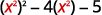  |
| Let <math xmlns="http://www.w3.org/1998/Math/MathML"><mrow><mi>u</mi><mo>=</mo><msup><mi>x</mi><mn>2</mn></msup></mrow></math>

 and substitute. |    |
| Factor the trinomial. |  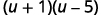  |
| Replace *u* with <math xmlns="http://www.w3.org/1998/Math/MathML"><mrow><msup><mi>x</mi><mn>2</mn></msup></mrow></math>

. |  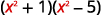  |
{: .unnumbered .unstyled summary="Start with the expression x to the fourth power minus 4 x squared minus 5. Rewrite the expression as the square of x squared minus 4 times x squared minus 5. Let u equal x squared and substitute u into the expression to yield u squared minus 4 u minus 5. Factor the trinomial as the product of u plus 1 and u minus 5. Replace u with x squared to get the product of x squared plus 1 and x squared minus 5." data-label=""}

Similarly, sometimes an equation is not in the *ax*2 + *bx* + *c* = 0 form but looks much like a quadratic equation. Then, we can often make a thoughtful substitution that will allow us to make it fit the *ax*2 + *bx* + *c* = 0 form. If we can make it fit the form, we can then use all of our methods to solve quadratic equations.

Notice that in the quadratic equation *ax*2 + *bx* + *c* = 0, the middle term has a variable, *x*, and its square, *x*2, is the variable part of the first term. Look for this relationship as you try to find a substitution.

Again, we will use the standard *u* to make a substitution that will put the equation in quadratic form. If the substitution gives us an equation of the form *ax*2 + *bx* + *c* = 0, we say the original equation was of **quadratic form**{: data-type="term"}.

The next example shows the steps for solving an equation in quadratic form.

How to Solve Equations in Quadratic Form

Solve: <math xmlns="http://www.w3.org/1998/Math/MathML"><mrow><mn>6</mn><msup><mi>x</mi><mn>4</mn></msup><mo>−</mo><mn>7</mn><msup><mi>x</mi><mn>2</mn></msup><mo>+</mo><mn>2</mn><mo>=</mo><mn>0</mn></mrow></math>

 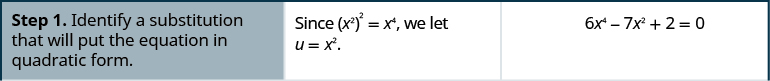         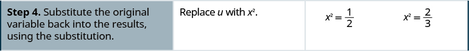      ![In step 6, check your solutions. We will show one check here, x equals square root 2 divided by 2. Substitute this value into the original equation. 6 times the fourth power of the quotient square root 2 divided by 2 minus 7 times the square of the quotient square root of 2 divided by 2 plus 2. Does this expression equal 0? Simplify the powers. 6 times four sixteenths minus 7 times two fourths plus 2. Simplify terms. Three halves minus seven halves plus four halves equals zero. Square root 2 divided by 2 is a solution. We leave the other checks to you!](../resources/CNX_IntAlg_Figure_09_04_002f_img.jpg) 

Solve: <math xmlns="http://www.w3.org/1998/Math/MathML"><mrow><msup><mi>x</mi><mn>4</mn></msup><mo>−</mo><mn>6</mn><msup><mi>x</mi><mn>2</mn></msup><mo>+</mo><mn>8</mn><mo>=</mo><mn>0</mn></mrow></math>

.

<math xmlns="http://www.w3.org/1998/Math/MathML"><mrow><mi>x</mi><mo>=</mo><msqrt><mn>2</mn></msqrt><mo>,</mo><mi>x</mi><mo>=</mo><mtext>−</mtext><msqrt><mn>2</mn></msqrt><mo>,</mo><mi>x</mi><mo>=</mo><mn>2</mn><mo>,</mo><mi>x</mi><mo>=</mo><mn>−2</mn></mrow></math>

Solve: <math xmlns="http://www.w3.org/1998/Math/MathML"><mrow><msup><mi>x</mi><mn>4</mn></msup><mo>−</mo><mn>11</mn><msup><mi>x</mi><mn>2</mn></msup><mo>+</mo><mn>28</mn><mo>=</mo><mn>0</mn></mrow></math>

.

<math xmlns="http://www.w3.org/1998/Math/MathML"><mrow><mi>x</mi><mo>=</mo><msqrt><mn>7</mn></msqrt><mo>,</mo><mi>x</mi><mo>=</mo><mtext>−</mtext><msqrt><mn>7</mn></msqrt><mo>,</mo><mi>x</mi><mo>=</mo><mn>2</mn><mo>,</mo><mi>x</mi><mo>=</mo><mn>−2</mn></mrow></math>

We summarize the steps to solve an equation in quadratic form.

Solve equations in quadratic form.

1.  Identify a substitution that will put the equation in quadratic form.
2.  Rewrite the equation with the substitution to put it in quadratic form.
3.  Solve the quadratic equation for *u*.
4.  Substitute the original variable back into the results, using the substitution.
5.  Solve for the original variable.
6.  Check the solutions.
{: data-number-style="arabic" .stepwise}

In the next example, the binomial in the middle term, (*x* − 2) is squared in the first term. If we let *u* = *x* − 2 and substitute, our trinomial will be in *ax*2 + *bx* + *c* form.

Solve: <math xmlns="http://www.w3.org/1998/Math/MathML"><mrow><msup><mrow><mrow><mo>(</mo><mrow><mi>x</mi><mo>−</mo><mn>2</mn></mrow><mo>)</mo></mrow></mrow><mn>2</mn></msup><mo>+</mo><mn>7</mn><mrow><mo>(</mo><mrow><mi>x</mi><mo>−</mo><mn>2</mn></mrow><mo>)</mo></mrow><mo>+</mo><mn>12</mn><mo>=</mo><mn>0</mn><mo>.</mo></mrow></math>

<table class="unnumbered unstyled" summary="Write the equation. The square of x minus 2 plus 7 times the expression x minus 2 plus 12 equals zero. Prepare for the substitution by viewing x &#x2212; 2 as a variable. Let u equal x minus 2 and substitute. The equation becomes u squared plus 7 u plus 12 equals 0. Factor the expression on the left side of the equation. The product of u plus 3 and u plus 4 equals 0. By the Zero Product Property, u plus 3 equals 0 or u plus 4 equals 0. So u equals negative 3 or u equals negative 4. Replace u with x minus 2 and solve for x. If u equals negative 3, then x minus 2 equals negative 3 and x equals negative 1. If u equals negative 4, then x minus 2 equals negative 4 and x equals negative 2. Check the solutions. Start with x equals negative one. Substitute negative one for x in the left-hand side of the original equation to get square of negative one minus two plus seven times the expression negative one minus two plus twelve. We need to show that this expression equals zero. Simplify to yield the square of negative three plus seven times negative three plus twelve, or nine minus twenty-one plus twelve which equals zero. X equals negative one is a solution. Next, check x equals negative two. Substitute negative two for x in the left-hand side of the original equation to get square of negative two minus two plus seven times the expression negative two minus two plus twelve. We need to show that this expression equals zero. Simplify to yield the square of negative four plus seven times negative four plus twelve, or sixteen minus twenty-eight plus twelve which equals zero. X equals negative two is a solution." data-label=""><tbody>
<tr>
<td />
<td data-valign="top" data-align="left">

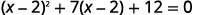

</td>
</tr>
<tr>
<td data-valign="top" data-align="left">Prepare for the substitution.</td>
<td data-valign="top" data-align="left">

</td>
</tr>
<tr>
<td data-valign="top" data-align="left">Let <math xmlns="http://www.w3.org/1998/Math/MathML"><mrow><mi>u</mi><mo>=</mo><mi>x</mi><mo>−</mo><mn>2</mn></mrow></math> and substitute.</td>
<td data-valign="top" data-align="left">

</td>
</tr>
<tr>
<td data-valign="top" data-align="left">Solve by factoring.</td>
<td data-valign="top" data-align="left">

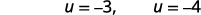

</td>
</tr>
<tr>
<td data-valign="top" data-align="left">Replace <math xmlns="http://www.w3.org/1998/Math/MathML"><mi>u</mi></math> with <math xmlns="http://www.w3.org/1998/Math/MathML"><mrow><mi>x</mi><mo>−</mo><mn>2</mn><mo>.</mo></mrow></math></td>
<td data-valign="top" data-align="left">

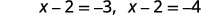

</td>
</tr>
<tr>
<td data-valign="top" data-align="left">Solve for <math xmlns="http://www.w3.org/1998/Math/MathML"><mi>x</mi><mo>.</mo></math></td>
<td data-valign="top" data-align="left">

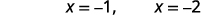

</td>
</tr>
<tr>
<td data-valign="top" data-align="left">Check:

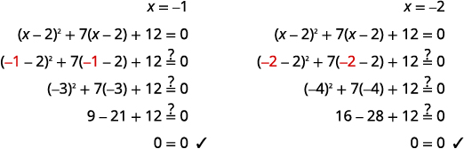

</td>
<td />
</tr>
</tbody></table>

Solve: <math xmlns="http://www.w3.org/1998/Math/MathML"><mrow><msup><mrow><mrow><mo>(</mo><mrow><mi>x</mi><mo>−</mo><mn>5</mn></mrow><mo>)</mo></mrow></mrow><mn>2</mn></msup><mo>+</mo><mn>6</mn><mrow><mo>(</mo><mrow><mi>x</mi><mo>−</mo><mn>5</mn></mrow><mo>)</mo></mrow><mo>+</mo><mn>8</mn><mo>=</mo><mn>0</mn><mo>.</mo></mrow></math>

<math xmlns="http://www.w3.org/1998/Math/MathML"><mrow><mi>x</mi><mo>=</mo><mn>3</mn><mo>,</mo><mi>x</mi><mo>=</mo><mn>1</mn></mrow></math>

Solve: <math xmlns="http://www.w3.org/1998/Math/MathML"><mrow><msup><mrow><mrow><mo>(</mo><mrow><mi>y</mi><mo>−</mo><mn>4</mn></mrow><mo>)</mo></mrow></mrow><mn>2</mn></msup><mo>+</mo><mn>8</mn><mrow><mo>(</mo><mrow><mi>y</mi><mo>−</mo><mn>4</mn></mrow><mo>)</mo></mrow><mo>+</mo><mn>15</mn><mo>=</mo><mn>0</mn><mo>.</mo></mrow></math>

<math xmlns="http://www.w3.org/1998/Math/MathML"><mrow><mi>y</mi><mo>=</mo><mn>−1</mn><mo>,</mo><mi>y</mi><mo>=</mo><mn>1</mn></mrow></math>

In the next example, we notice that <math xmlns="http://www.w3.org/1998/Math/MathML"><mrow><msup><mrow><mrow><mo>(</mo><mrow><msqrt><mi>x</mi></msqrt></mrow><mo>)</mo></mrow></mrow><mn>2</mn></msup><mo>=</mo><mi>x</mi><mo>.</mo></mrow></math>

 Also, remember that when we square both sides of an equation, we may introduce extraneous roots. Be sure to check your answers!

Solve: <math xmlns="http://www.w3.org/1998/Math/MathML"><mrow><mi>x</mi><mo>−</mo><mn>3</mn><msqrt><mi>x</mi></msqrt><mo>+</mo><mn>2</mn><mo>=</mo><mn>0</mn><mo>.</mo></mrow></math>

The <math xmlns="http://www.w3.org/1998/Math/MathML"><mrow><msqrt><mi>x</mi></msqrt></mrow></math>

 in the middle term, is squared in the first term <math xmlns="http://www.w3.org/1998/Math/MathML"><mrow><msup><mrow><mrow><mo>(</mo><mrow><msqrt><mi>x</mi></msqrt></mrow><mo>)</mo></mrow></mrow><mn>2</mn></msup><mo>=</mo><mi>x</mi><mo>.</mo></mrow></math>

 If we let <math xmlns="http://www.w3.org/1998/Math/MathML"><mrow><mi>u</mi><mo>=</mo><msqrt><mi>x</mi></msqrt></mrow></math>

 and substitute, our trinomial will be in *ax*2 + *bx* + *c* = 0 form.

<table class="unnumbered unstyled" summary="Write the equation. The x minus 3 times the square root of x plus 2 equals zero. Rewrite the x as the square of square root x to prepare for the substitution. Let u equal square root x and substitute. The equation becomes u squared minus 3 u plus 2 equals 0. Factor the expression on the left side of the equation. The product of u minus 3 and u minus 1 equals 0. By the Zero Product Property, u minus 2 equals 0 or u minus 1 equals 0. So u equals 1 or u equals 1. Replace u with square root x and solve for x by squaring both sides. If u equals 2, then square root x equals 2 and x equals 4. If u equals 1, then square root x equals 1 and x equals 1. Check the solutions. Start with x equals 4. Substitute 4 for x in the left-hand side of the original equation to get 4 minus 3 times square root 4 plus 2. We need to show that this expression equals zero. Simplify to yield 4 minus 6 plus 2 which equals zero. X equals 4 is a solution. Next, check x equals 1. Substitute 1 for x in the left-hand side of the original equation to get 1 minus 3 times square root 1 plus 2. We need to show that this expression equals zero. Simplify to yield 1 minus 3 plus 2 which equals zero. X equals 1 is a solution." data-label=""><tbody>
<tr>
<td />
<td data-valign="top" data-align="left">

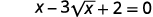

</td>
</tr>
<tr>
<td data-valign="top" data-align="left">Rewrite the trinomial to prepare for the substitution.</td>
<td data-valign="top" data-align="left">

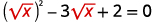

</td>
</tr>
<tr>
<td data-valign="top" data-align="left">Let <math xmlns="http://www.w3.org/1998/Math/MathML"><mrow><mi>u</mi><mo>=</mo><msqrt><mi>x</mi></msqrt></mrow></math> and substitute.</td> <td data-valign="top" data-align="left">

</td>
</tr>
<tr>
<td data-valign="top" data-align="left">Solve by factoring.</td>
<td data-valign="top" data-align="left">

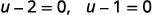

</td>
</tr>
<tr>
<td data-valign="top" data-align="left">Replace <em>u</em> with <math xmlns="http://www.w3.org/1998/Math/MathML"><mrow><msqrt><mi>x</mi></msqrt><mo>.</mo></mrow></math></td>
<td data-valign="top" data-align="left">

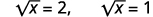

</td>
</tr>
<tr>
<td data-valign="top" data-align="left">Solve for <em>x</em>, by squaring both sides.</td>
<td data-valign="top" data-align="left">

</td>
</tr>
<tr>
<td data-valign="top" data-align="left">Check:

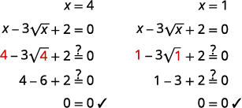

</td>
<td />
</tr>
</tbody></table>

Solve: <math xmlns="http://www.w3.org/1998/Math/MathML"><mrow><mi>x</mi><mo>−</mo><mn>7</mn><msqrt><mi>x</mi></msqrt><mo>+</mo><mn>12</mn><mo>=</mo><mn>0</mn><mo>.</mo></mrow></math>

<math xmlns="http://www.w3.org/1998/Math/MathML"><mrow><mi>x</mi><mo>=</mo><mn>9</mn><mo>,</mo><mi>x</mi><mo>=</mo><mn>16</mn></mrow></math>

Solve: <math xmlns="http://www.w3.org/1998/Math/MathML"><mrow><mi>x</mi><mo>−</mo><mn>6</mn><msqrt><mi>x</mi></msqrt><mo>+</mo><mn>8</mn><mo>=</mo><mn>0</mn><mo>.</mo></mrow></math>

<math xmlns="http://www.w3.org/1998/Math/MathML"><mrow><mi>x</mi><mo>=</mo><mn>4</mn><mo>,</mo><mi>x</mi><mo>=</mo><mn>16</mn></mrow></math>

Substitutions for rational exponents can also help us solve an equation in quadratic form. Think of the properties of exponents as you begin the next example.

Solve: <math xmlns="http://www.w3.org/1998/Math/MathML"><mrow><msup><mi>x</mi><mrow><mfrac><mn>2</mn><mn>3</mn></mfrac></mrow></msup><mo>−</mo><mn>2</mn><msup><mi>x</mi><mrow><mfrac><mn>1</mn><mn>3</mn></mfrac></mrow></msup><mo>−</mo><mn>24</mn><mo>=</mo><mn>0</mn><mo>.</mo></mrow></math>

The <math xmlns="http://www.w3.org/1998/Math/MathML"><mrow><msup><mi>x</mi><mrow><mfrac><mn>1</mn><mn>3</mn></mfrac></mrow></msup></mrow></math>

 in the middle term is squared in the first term <math xmlns="http://www.w3.org/1998/Math/MathML"><mrow><msup><mrow><mrow><mo>(</mo><mrow><msup><mi>x</mi><mrow><mfrac><mn>1</mn><mn>3</mn></mfrac></mrow></msup></mrow><mo>)</mo></mrow></mrow><mn>2</mn></msup><mo>=</mo><msup><mi>x</mi><mrow><mfrac><mn>2</mn><mn>3</mn></mfrac></mrow></msup><mo>.</mo></mrow></math>

 If we let <math xmlns="http://www.w3.org/1998/Math/MathML"><mrow><mi>u</mi><mo>=</mo><msup><mi>x</mi><mrow><mfrac><mn>1</mn><mn>3</mn></mfrac></mrow></msup></mrow></math>

 and substitute, our trinomial will be in *ax*2 + *bx* + *c* = 0 form.

<table class="unnumbered unstyled can-break" summary="Write the equation. X to the two-thirds power minus 2 times x to the one-third power minus 24 equals zero. Rewrite x to the two-thirds power as the square of x to the one-third power to prepare for the substitution. Let u equal the one-third power of x and substitute. The equation becomes u squared minus 2 u minus 24 equals 0. Factor the expression on the left side of the equation. The product of u minus 6 and u plus 4 equals 0. By the Zero Product Property, u minus 6 equals 0 or u plus 4 equals 0. So u equals 6 or u equals negative 4. Replace u with x to the one-third power and solve for x by cubing both sides. If u equals 6, then x to the one-third power equals 6, so x equals 6 cubed, or 216. If u equals negative 4, then x to the one-third power equals negative 4, so x equals the cube of negative 4, or negative 64. Check the solutions. Start with x equals 216. Substitute 216 for x in the left-hand side of the original equation to get 216 to the two-thirds power minus 2 times 216 to the one-third power minus 24. We need to show that this expression equals zero. Simplify to yield 36 minus 12 minus 24 which equals zero. X equals 216 is a solution. Next, check x equals negative 64. Substitute negative 64 for x in the left-hand side of the original equation to get negative 4 to the two-thirds power minus 2 times negative 4 to the one-third power minus 24. We need to show that this expression equals zero. Simplify to yield 16 plus 8 minus 24 which equals zero. X equals negative 64 is a solution." data-label=""><tbody>
<tr>
<td />
<td data-valign="top" data-align="left">

</td>
</tr>
<tr>
<td data-valign="top" data-align="left">Rewrite the trinomial to prepare for the substitution.</td>
<td data-valign="top" data-align="left">

</td>
</tr>
<tr>
<td data-valign="top" data-align="left">Let <math xmlns="http://www.w3.org/1998/Math/MathML"><mrow><mi>u</mi><mo>=</mo><msup><mi>x</mi><mrow><mfrac><mn>1</mn><mn>3</mn></mfrac></mrow></msup></mrow></math> and substitute.</td>
<td data-valign="top" data-align="left">

</td>
</tr>
<tr>
<td data-valign="top" data-align="left">Solve by factoring.</td>
<td data-valign="top" data-align="left">

</td>
</tr>
<tr>
<td data-valign="middle" data-align="left">Replace <em>u</em> with <math xmlns="http://www.w3.org/1998/Math/MathML"><mrow><msup><mi>x</mi><mrow><mfrac><mn>1</mn><mn>3</mn></mfrac></mrow></msup><mo>.</mo></mrow></math></td>
<td data-valign="middle" data-align="left">

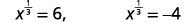

</td>
</tr>
<tr>
<td data-valign="top" data-align="left">Solve for <math xmlns="http://www.w3.org/1998/Math/MathML"><mi>x</mi></math> by cubing both sides.</td>
<td data-valign="top" data-align="left">

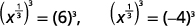

</td>
</tr>
<tr>
<td data-valign="top" data-align="left">Check:

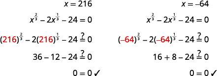

</td>
<td />
</tr>
</tbody></table>

Solve: <math xmlns="http://www.w3.org/1998/Math/MathML"><mrow><msup><mi>x</mi><mrow><mfrac><mn>2</mn><mn>3</mn></mfrac></mrow></msup><mo>−</mo><mn>5</mn><msup><mi>x</mi><mrow><mfrac><mn>1</mn><mn>3</mn></mfrac></mrow></msup><mo>−</mo><mn>14</mn><mo>=</mo><mn>0</mn><mo>.</mo></mrow></math>

<math xmlns="http://www.w3.org/1998/Math/MathML"><mrow><mi>x</mi><mo>=</mo><mn>−8</mn><mo>,</mo><mi>x</mi><mo>=</mo><mn>343</mn></mrow></math>

Solve: <math xmlns="http://www.w3.org/1998/Math/MathML"><mrow><msup><mi>x</mi><mrow><mfrac><mn>1</mn><mn>2</mn></mfrac></mrow></msup><mo>+</mo><mn>8</mn><msup><mi>x</mi><mrow><mfrac><mn>1</mn><mn>4</mn></mfrac></mrow></msup><mo>+</mo><mn>15</mn><mo>=</mo><mn>0</mn><mo>.</mo></mrow></math>

<math xmlns="http://www.w3.org/1998/Math/MathML"><mrow><mi>x</mi><mo>=</mo><mn>81</mn><mo>,</mo><mi>x</mi><mo>=</mo><mn>625</mn></mrow></math>

In the next example, we need to keep in mind the definition of a negative exponent as well as the properties of exponents.

Solve: <math xmlns="http://www.w3.org/1998/Math/MathML"><mrow><mn>3</mn><msup><mi>x</mi><mrow><mn>−2</mn></mrow></msup><mo>−</mo><mn>7</mn><msup><mi>x</mi><mrow><mn>−1</mn></mrow></msup><mo>+</mo><mn>2</mn><mo>=</mo><mn>0</mn><mo>.</mo></mrow></math>

The <math xmlns="http://www.w3.org/1998/Math/MathML"><mrow><msup><mi>x</mi><mrow><mn>−1</mn></mrow></msup></mrow></math>

 in the middle term is squared in the first term <math xmlns="http://www.w3.org/1998/Math/MathML"><mrow><msup><mrow><mrow><mo>(</mo><mrow><msup><mi>x</mi><mrow><mn>−1</mn></mrow></msup></mrow><mo>)</mo></mrow></mrow><mn>2</mn></msup><mo>=</mo><msup><mi>x</mi><mrow><mn>−2</mn></mrow></msup><mo>.</mo></mrow></math>

 If we let <math xmlns="http://www.w3.org/1998/Math/MathML"><mrow><mi>u</mi><mo>=</mo><msup><mi>x</mi><mrow><mn>−1</mn></mrow></msup></mrow></math>

 and substitute, our trinomial will be in *ax*2 + *bx* + *c* = 0 form.

<table class="unnumbered unstyled can-break" summary="Write the equation. Three times x to the negative two power minus 7 times x to the negative one power plus 2 equals zero. Rewrite x to the negative two power as the square of x to the negative one power to prepare for the substitution. Let u equal the x to the negative one power and substitute. The equation becomes 3 u squared minus 7 u plus 2 equals 0. Factor the expression on the left side of the equation. The product of 3 u minus 1 and u minus 2 equals 0. By the Zero Product Property, 3 u minus 1 equals 0 or u minus 2 equals 0. So u equals one third or u equals 2. Replace u with x to the negative one power and solve for x by taking the reciprocal. If u equals one third, then x to the negative one power equals one third, so x equals 3. If u equals 2, then x to the negative one power equals 2, so x equals one half. Check the solutions. Start with x equals 3. Substitute 3 for x in the left-hand side of the original equation to get 3 times 3 to the negative 2 power minus 7 times 3 to the negative one power plus 2. We need to show that this expression equals zero. Simplify to yield 3 times one ninth minus 7 times one third plus 2 which equals one third minus seven thirds plus six thirds, or 0. X equals 3 is a solution. Next, check x equals one half. Substitute one half for x in the left-hand side of the original equation to get 3 times one half to the negative 2 power minus 7 times one half to the negative one power plus 2. We need to show that this expression equals zero. Simplify to yield 3 times 4 minus 7 times 2 plus 2 which equals 12 minus 14 plus 2, or 0. X equals one half is a solution." data-label=""><tbody>
<tr>
<td />
<td />
<td data-valign="top" data-align="left">

</td>
</tr>
<tr>
<td data-valign="top" data-align="left">Rewrite the trinomial to prepare for the substitution.</td>
<td />
<td data-valign="top" data-align="left">

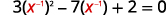

</td>
</tr>
<tr>
<td data-valign="middle" data-align="left">Let <math xmlns="http://www.w3.org/1998/Math/MathML"><mrow><mi>u</mi><mo>=</mo><msup><mrow><mi>x</mi></mrow><mrow><mn>−1</mn></mrow></msup></mrow></math> and substitute.</td>
<td />
<td data-valign="middle" data-align="left">

</td>
</tr>
<tr>
<td data-valign="top" data-align="left">Solve by factoring.</td>
<td />
<td data-valign="top" data-align="left">

</td>
</tr>
<tr>
<td data-valign="top" data-align="left" />
<td />
<td data-valign="top" data-align="left">

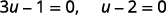
</td>
</tr>
<tr>
<td data-valign="top" data-align="left" />
<td />
<td data-valign="top" data-align="left">
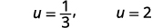

</td>
</tr>
<tr>
<td data-valign="top" data-align="left">Replace <em>u</em> with <math xmlns="http://www.w3.org/1998/Math/MathML"><mrow><msup><mrow><mi>x</mi></mrow><mrow><mn>−1</mn></mrow></msup><mo>.</mo></mrow></math></td>
<td />
<td data-valign="top" data-align="left">

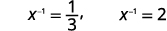

</td>
</tr>
<tr>
<td data-valign="top" data-align="left">Solve for <math xmlns="http://www.w3.org/1998/Math/MathML"><mi>x</mi></math> by taking the reciprocal since <math xmlns="http://www.w3.org/1998/Math/MathML"><mrow><msup><mi>x</mi><mrow><mo>−</mo><mn>1</mn></mrow></msup><mo>=</mo><mfrac><mn>1</mn><mi>x</mi></mfrac><mo>.</mo></mrow></math></td>
<td />
<td data-valign="top" data-align="left">

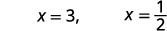

</td>
</tr>
<tr>
<td data-valign="top" data-align="left">Check:

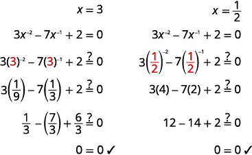

</td>
<td />
<td />
</tr>
</tbody></table>

Solve: <math xmlns="http://www.w3.org/1998/Math/MathML"><mrow><mn>8</mn><msup><mi>x</mi><mrow><mn>−2</mn></mrow></msup><mo>−</mo><mn>10</mn><msup><mi>x</mi><mrow><mn>−1</mn></mrow></msup><mo>+</mo><mn>3</mn><mo>=</mo><mn>0</mn><mo>.</mo></mrow></math>

<math xmlns="http://www.w3.org/1998/Math/MathML"><mrow><mi>x</mi><mo>=</mo><mfrac><mn>4</mn><mn>3</mn></mfrac><mi>x</mi><mo>=</mo><mn>2</mn></mrow></math>

Solve: <math xmlns="http://www.w3.org/1998/Math/MathML"><mrow><mn>6</mn><msup><mi>x</mi><mrow><mn>−2</mn></mrow></msup><mo>−</mo><mn>23</mn><msup><mi>x</mi><mrow><mn>−1</mn></mrow></msup><mo>+</mo><mn>20</mn><mo>=</mo><mn>0</mn><mo>.</mo></mrow></math>

<math xmlns="http://www.w3.org/1998/Math/MathML"><mrow><mi>x</mi><mo>=</mo><mfrac><mn>2</mn><mn>5</mn></mfrac><mo>,</mo><mi>x</mi><mo>=</mo><mfrac><mn>3</mn><mn>4</mn></mfrac></mrow></math>

Access this online resource for additional instruction and practice with solving quadratic equations.

* [Solving Equations in Quadratic Form][1]
{: data-display="block"}

# Key Concepts

* How to solve equations in quadratic form.
  1.  Identify a substitution that will put the equation in quadratic form.
  2.  Rewrite the equation with the substitution to put it in quadratic form.
  3.  Solve the quadratic equation for *u*.
  4.  Substitute the original variable back into the results, using the substitution.
  5.  Solve for the original variable.
  6.  Check the solutions.
  {: data-number-style="arabic" .stepwise}
{: data-bullet-style="bullet"}

<section data-depth="1" class="section-exercises" markdown="1">
## Practice Makes Perfect

**Solve Equations in Quadratic Form**

In the following exercises, solve.

<math xmlns="http://www.w3.org/1998/Math/MathML"><mrow><msup><mi>x</mi><mn>4</mn></msup><mo>−</mo><mn>7</mn><msup><mi>x</mi><mn>2</mn></msup><mo>+</mo><mn>12</mn><mo>=</mo><mn>0</mn></mrow></math>

<math xmlns="http://www.w3.org/1998/Math/MathML"><mrow><mi>x</mi><mo>=</mo><mo>±</mo><msqrt><mn>3</mn></msqrt><mo>,</mo><mi>x</mi><mo>=</mo><mo>±</mo><mn>2</mn></mrow></math>

<math xmlns="http://www.w3.org/1998/Math/MathML"><mrow><msup><mi>x</mi><mn>4</mn></msup><mo>−</mo><mn>9</mn><msup><mi>x</mi><mn>2</mn></msup><mo>+</mo><mn>18</mn><mo>=</mo><mn>0</mn></mrow></math>

<math xmlns="http://www.w3.org/1998/Math/MathML"><mrow><msup><mi>x</mi><mn>4</mn></msup><mo>−</mo><mn>13</mn><msup><mi>x</mi><mn>2</mn></msup><mo>−</mo><mn>30</mn><mo>=</mo><mn>0</mn></mrow></math>

<math xmlns="http://www.w3.org/1998/Math/MathML"><mrow><mi>x</mi><mo>=</mo><mo>±</mo><msqrt><mrow><mn>15</mn></mrow></msqrt><mo>,</mo><mi>x</mi><mo>=</mo><mo>±</mo><msqrt><mn>2</mn></msqrt><mi>i</mi></mrow></math>

<math xmlns="http://www.w3.org/1998/Math/MathML"><mrow><msup><mi>x</mi><mn>4</mn></msup><mo>+</mo><mn>5</mn><msup><mi>x</mi><mn>2</mn></msup><mo>−</mo><mn>36</mn><mo>=</mo><mn>0</mn></mrow></math>

<math xmlns="http://www.w3.org/1998/Math/MathML"><mrow><mn>2</mn><msup><mi>x</mi><mn>4</mn></msup><mo>−</mo><mn>5</mn><msup><mi>x</mi><mn>2</mn></msup><mo>+</mo><mn>3</mn><mo>=</mo><mn>0</mn></mrow></math>

<math xmlns="http://www.w3.org/1998/Math/MathML"><mrow><mi>x</mi><mo>=</mo><mo>±</mo><mn>1</mn><mo>,</mo><mi>x</mi><mo>=</mo><mfrac><mrow><mo>±</mo><msqrt><mn>6</mn></msqrt></mrow><mn>2</mn></mfrac></mrow></math>

<math xmlns="http://www.w3.org/1998/Math/MathML"><mrow><mn>4</mn><msup><mi>x</mi><mn>4</mn></msup><mo>−</mo><mn>5</mn><msup><mi>x</mi><mn>2</mn></msup><mo>+</mo><mn>1</mn><mo>=</mo><mn>0</mn></mrow></math>

<math xmlns="http://www.w3.org/1998/Math/MathML"><mrow><mn>2</mn><msup><mi>x</mi><mn>4</mn></msup><mo>−</mo><mn>7</mn><msup><mi>x</mi><mn>2</mn></msup><mo>+</mo><mn>3</mn><mo>=</mo><mn>0</mn></mrow></math>

<math xmlns="http://www.w3.org/1998/Math/MathML"><mrow><mi>x</mi><mo>=</mo><mo>±</mo><msqrt><mn>3</mn></msqrt><mo>,</mo><mi>x</mi><mo>=</mo><mo>±</mo><mfrac><mrow><msqrt><mn>2</mn></msqrt></mrow><mn>2</mn></mfrac></mrow></math>

<math xmlns="http://www.w3.org/1998/Math/MathML"><mrow><mn>3</mn><msup><mi>x</mi><mn>4</mn></msup><mo>−</mo><mn>14</mn><msup><mi>x</mi><mn>2</mn></msup><mo>+</mo><mn>8</mn><mo>=</mo><mn>0</mn></mrow></math>

<math xmlns="http://www.w3.org/1998/Math/MathML"><mrow><msup><mrow><mrow><mo>(</mo><mrow><mi>x</mi><mo>−</mo><mn>3</mn></mrow><mo>)</mo></mrow></mrow><mn>2</mn></msup><mo>−</mo><mn>5</mn><mrow><mo>(</mo><mrow><mi>x</mi><mo>−</mo><mn>3</mn></mrow><mo>)</mo></mrow><mo>−</mo><mn>36</mn><mo>=</mo><mn>0</mn></mrow></math>

<math xmlns="http://www.w3.org/1998/Math/MathML"><mrow><mi>x</mi><mo>=</mo><mn>−1</mn><mo>,</mo><mi>x</mi><mo>=</mo><mn>12</mn></mrow></math>

<math xmlns="http://www.w3.org/1998/Math/MathML"><mrow><msup><mrow><mrow><mo>(</mo><mrow><mi>x</mi><mo>+</mo><mn>2</mn></mrow><mo>)</mo></mrow></mrow><mn>2</mn></msup><mo>−</mo><mn>3</mn><mrow><mo>(</mo><mrow><mi>x</mi><mo>+</mo><mn>2</mn></mrow><mo>)</mo></mrow><mo>−</mo><mn>54</mn><mo>=</mo><mn>0</mn></mrow></math>

<math xmlns="http://www.w3.org/1998/Math/MathML"><mrow><msup><mrow><mrow><mo>(</mo><mrow><mn>3</mn><mi>y</mi><mo>+</mo><mn>2</mn></mrow><mo>)</mo></mrow></mrow><mn>2</mn></msup><mo>+</mo><mrow><mo>(</mo><mrow><mn>3</mn><mi>y</mi><mo>+</mo><mn>2</mn></mrow><mo>)</mo></mrow><mo>−</mo><mn>6</mn><mo>=</mo><mn>0</mn></mrow></math>

<math xmlns="http://www.w3.org/1998/Math/MathML"><mrow><mi>x</mi><mo>=</mo><mo>−</mo><mfrac><mn>5</mn><mn>3</mn></mfrac><mo>,</mo><mi>x</mi><mo>=</mo><mn>0</mn></mrow></math>

<math xmlns="http://www.w3.org/1998/Math/MathML"><mrow><msup><mrow><mrow><mo>(</mo><mrow><mn>5</mn><mi>y</mi><mo>−</mo><mn>1</mn></mrow><mo>)</mo></mrow></mrow><mn>2</mn></msup><mo>+</mo><mn>3</mn><mrow><mo>(</mo><mrow><mn>5</mn><mi>y</mi><mo>−</mo><mn>1</mn></mrow><mo>)</mo></mrow><mo>−</mo><mn>28</mn><mo>=</mo><mn>0</mn></mrow></math>

<math xmlns="http://www.w3.org/1998/Math/MathML"><mrow><msup><mrow><mrow><mo>(</mo><mrow><msup><mi>x</mi><mn>2</mn></msup><mo>+</mo><mn>1</mn></mrow><mo>)</mo></mrow></mrow><mn>2</mn></msup><mo>−</mo><mn>5</mn><mrow><mo>(</mo><mrow><msup><mi>x</mi><mn>2</mn></msup><mo>+</mo><mn>1</mn></mrow><mo>)</mo></mrow><mo>+</mo><mn>4</mn><mo>=</mo><mn>0</mn></mrow></math>

<math xmlns="http://www.w3.org/1998/Math/MathML"><mrow><mi>x</mi><mo>=</mo><mn>0</mn><mo>,</mo><mi>x</mi><mo>=</mo><mo>±</mo><msqrt><mn>3</mn></msqrt></mrow></math>

<math xmlns="http://www.w3.org/1998/Math/MathML"><mrow><msup><mrow><mrow><mo>(</mo><mrow><msup><mi>x</mi><mn>2</mn></msup><mo>−</mo><mn>4</mn></mrow><mo>)</mo></mrow></mrow><mn>2</mn></msup><mo>−</mo><mn>4</mn><mrow><mo>(</mo><mrow><msup><mi>x</mi><mn>2</mn></msup><mo>−</mo><mn>4</mn></mrow><mo>)</mo></mrow><mo>+</mo><mn>3</mn><mo>=</mo><mn>0</mn></mrow></math>

<math xmlns="http://www.w3.org/1998/Math/MathML"><mrow><mn>2</mn><msup><mrow><mrow><mo>(</mo><mrow><msup><mi>x</mi><mn>2</mn></msup><mo>−</mo><mn>5</mn></mrow><mo>)</mo></mrow></mrow><mn>2</mn></msup><mo>−</mo><mn>5</mn><mrow><mo>(</mo><mrow><msup><mi>x</mi><mn>2</mn></msup><mo>−</mo><mn>5</mn></mrow><mo>)</mo></mrow><mo>+</mo><mn>2</mn><mo>=</mo><mn>0</mn></mrow></math>

<math xmlns="http://www.w3.org/1998/Math/MathML"><mrow><mi>x</mi><mo>=</mo><mo>±</mo><mfrac><mrow><mn>11</mn></mrow><mn>2</mn></mfrac><mo>,</mo><mi>x</mi><mo>=</mo><mo>±</mo><mfrac><mrow><msqrt><mrow><mn>22</mn></mrow></msqrt></mrow><mn>2</mn></mfrac></mrow></math>

<math xmlns="http://www.w3.org/1998/Math/MathML"><mrow><mn>2</mn><msup><mrow><mrow><mo>(</mo><mrow><msup><mi>x</mi><mn>2</mn></msup><mo>−</mo><mn>5</mn></mrow><mo>)</mo></mrow></mrow><mn>2</mn></msup><mo>−</mo><mn>7</mn><mrow><mo>(</mo><mrow><msup><mi>x</mi><mn>2</mn></msup><mo>−</mo><mn>5</mn></mrow><mo>)</mo></mrow><mo>+</mo><mn>6</mn><mo>=</mo><mn>0</mn></mrow></math>

<math xmlns="http://www.w3.org/1998/Math/MathML"><mrow><mi>x</mi><mo>−</mo><msqrt><mi>x</mi></msqrt><mo>−</mo><mn>20</mn><mo>=</mo><mn>0</mn></mrow></math>

<math xmlns="http://www.w3.org/1998/Math/MathML"><mrow><mi>x</mi><mo>=</mo><mn>25</mn></mrow></math>

<math xmlns="http://www.w3.org/1998/Math/MathML"><mrow><mi>x</mi><mo>−</mo><mn>8</mn><msqrt><mi>x</mi></msqrt><mo>+</mo><mn>15</mn><mo>=</mo><mn>0</mn></mrow></math>

<math xmlns="http://www.w3.org/1998/Math/MathML"><mrow><mi>x</mi><mo>+</mo><mn>6</mn><msqrt><mi>x</mi></msqrt><mo>−</mo><mn>16</mn><mo>=</mo><mn>0</mn></mrow></math>

<math xmlns="http://www.w3.org/1998/Math/MathML"><mrow><mi>x</mi><mo>=</mo><mn>4</mn></mrow></math>

<math xmlns="http://www.w3.org/1998/Math/MathML"><mrow><mi>x</mi><mo>+</mo><mn>4</mn><msqrt><mi>x</mi></msqrt><mo>−</mo><mn>21</mn><mo>=</mo><mn>0</mn></mrow></math>

<math xmlns="http://www.w3.org/1998/Math/MathML"><mrow><mn>6</mn><mi>x</mi><mo>+</mo><msqrt><mi>x</mi></msqrt><mo>−</mo><mn>2</mn><mo>=</mo><mn>0</mn></mrow></math>

<math xmlns="http://www.w3.org/1998/Math/MathML"><mrow><mi>x</mi><mo>=</mo><mfrac><mn>1</mn><mn>4</mn></mfrac></mrow></math>

<math xmlns="http://www.w3.org/1998/Math/MathML"><mrow><mn>6</mn><mi>x</mi><mo>+</mo><msqrt><mi>x</mi></msqrt><mo>−</mo><mn>1</mn><mo>=</mo><mn>0</mn></mrow></math>

<math xmlns="http://www.w3.org/1998/Math/MathML"><mrow><mn>10</mn><mi>x</mi><mo>−</mo><mn>17</mn><msqrt><mi>x</mi></msqrt><mo>+</mo><mn>3</mn><mo>=</mo><mn>0</mn></mrow></math>

<math xmlns="http://www.w3.org/1998/Math/MathML"><mrow><mi>x</mi><mo>=</mo><mfrac><mn>1</mn><mrow><mn>25</mn></mrow></mfrac></mrow></math>

<math xmlns="http://www.w3.org/1998/Math/MathML"><mrow><mn>12</mn><mi>x</mi><mo>+</mo><mn>5</mn><msqrt><mi>x</mi></msqrt><mo>−</mo><mn>3</mn><mo>=</mo><mn>0</mn></mrow></math>

<math xmlns="http://www.w3.org/1998/Math/MathML"><mrow><msup><mi>x</mi><mrow><mfrac><mn>2</mn><mn>3</mn></mfrac></mrow></msup><mo>+</mo><mn>9</mn><msup><mi>x</mi><mrow><mfrac><mn>1</mn><mn>3</mn></mfrac></mrow></msup><mo>+</mo><mn>8</mn><mo>=</mo><mn>0</mn></mrow></math>

<math xmlns="http://www.w3.org/1998/Math/MathML"><mrow><mi>x</mi><mo>=</mo><mn>−1</mn><mo>,</mo><mi>x</mi><mo>=</mo><mn>−512</mn></mrow></math>

<math xmlns="http://www.w3.org/1998/Math/MathML"><mrow><msup><mi>x</mi><mrow><mfrac><mn>2</mn><mn>3</mn></mfrac></mrow></msup><mo>−</mo><mn>3</mn><msup><mi>x</mi><mrow><mfrac><mn>1</mn><mn>3</mn></mfrac></mrow></msup><mo>=</mo><mn>28</mn></mrow></math>

<math xmlns="http://www.w3.org/1998/Math/MathML"><mrow><msup><mi>x</mi><mrow><mfrac><mn>2</mn><mn>3</mn></mfrac></mrow></msup><mo>+</mo><mn>4</mn><msup><mi>x</mi><mrow><mfrac><mn>1</mn><mn>3</mn></mfrac></mrow></msup><mo>=</mo><mn>12</mn></mrow></math>

<math xmlns="http://www.w3.org/1998/Math/MathML"><mrow><mi>x</mi><mo>=</mo><mn>8</mn><mo>,</mo><mi>x</mi><mo>=</mo><mn>−216</mn></mrow></math>

<math xmlns="http://www.w3.org/1998/Math/MathML"><mrow><msup><mi>x</mi><mrow><mfrac><mn>2</mn><mn>3</mn></mfrac></mrow></msup><mo>−</mo><mn>11</mn><msup><mi>x</mi><mrow><mfrac><mn>1</mn><mn>3</mn></mfrac></mrow></msup><mo>+</mo><mn>30</mn><mo>=</mo><mn>0</mn></mrow></math>

<math xmlns="http://www.w3.org/1998/Math/MathML"><mrow><mn>6</mn><msup><mi>x</mi><mrow><mfrac><mn>2</mn><mn>3</mn></mfrac></mrow></msup><mo>−</mo><msup><mi>x</mi><mrow><mfrac><mn>1</mn><mn>3</mn></mfrac></mrow></msup><mo>=</mo><mn>12</mn></mrow></math>

<math xmlns="http://www.w3.org/1998/Math/MathML"><mrow><mi>x</mi><mo>=</mo><mfrac><mrow><mn>27</mn></mrow><mn>8</mn></mfrac><mo>,</mo><mi>x</mi><mo>=</mo><mo>−</mo><mfrac><mrow><mn>64</mn></mrow><mrow><mn>27</mn></mrow></mfrac></mrow></math>

<math xmlns="http://www.w3.org/1998/Math/MathML"><mrow><mn>3</mn><msup><mi>x</mi><mrow><mfrac><mn>2</mn><mn>3</mn></mfrac></mrow></msup><mo>−</mo><mn>10</mn><msup><mi>x</mi><mrow><mfrac><mn>1</mn><mn>3</mn></mfrac></mrow></msup><mo>=</mo><mn>8</mn></mrow></math>

<math xmlns="http://www.w3.org/1998/Math/MathML"><mrow><mn>8</mn><msup><mi>x</mi><mrow><mfrac><mn>2</mn><mn>3</mn></mfrac></mrow></msup><mo>−</mo><mn>43</mn><msup><mi>x</mi><mrow><mfrac><mn>1</mn><mn>3</mn></mfrac></mrow></msup><mo>+</mo><mn>15</mn><mo>=</mo><mn>0</mn></mrow></math>

<math xmlns="http://www.w3.org/1998/Math/MathML"><mrow><mi>x</mi><mo>=</mo><mn>27</mn><mo>,</mo><mi>x</mi><mo>=</mo><mn>64,000</mn></mrow></math>

<math xmlns="http://www.w3.org/1998/Math/MathML"><mrow><mn>20</mn><msup><mi>x</mi><mrow><mfrac><mn>2</mn><mn>3</mn></mfrac></mrow></msup><mo>−</mo><mn>23</mn><msup><mi>x</mi><mrow><mfrac><mn>1</mn><mn>3</mn></mfrac></mrow></msup><mo>+</mo><mn>6</mn><mo>=</mo><mn>0</mn></mrow></math>

<math xmlns="http://www.w3.org/1998/Math/MathML"><mrow><mi>x</mi><mo>+</mo><mn>8</mn><msup><mi>x</mi><mrow><mfrac><mn>1</mn><mn>2</mn></mfrac></mrow></msup><mo>+</mo><mn>7</mn><mo>=</mo><mn>0</mn></mrow></math>

<math xmlns="http://www.w3.org/1998/Math/MathML"><mrow><mi>x</mi><mo>=</mo><mn>1</mn><mo>,</mo><mi>x</mi><mo>=</mo><mn>49</mn></mrow></math>

<math xmlns="http://www.w3.org/1998/Math/MathML"><mrow><mn>2</mn><mi>x</mi><mo>−</mo><mn>7</mn><msup><mi>x</mi><mrow><mfrac><mn>1</mn><mn>2</mn></mfrac></mrow></msup><mo>=</mo><mn>15</mn></mrow></math>

<math xmlns="http://www.w3.org/1998/Math/MathML"><mrow><mn>6</mn><msup><mi>x</mi><mrow><mn>−2</mn></mrow></msup><mo>+</mo><mn>13</mn><msup><mi>x</mi><mrow><mn>−1</mn></mrow></msup><mo>+</mo><mn>5</mn><mo>=</mo><mn>0</mn></mrow></math>

<math xmlns="http://www.w3.org/1998/Math/MathML"><mrow><mi>x</mi><mo>=</mo><mn>−2</mn><mo>,</mo><mi>x</mi><mo>=</mo><mo>−</mo><mfrac><mn>3</mn><mn>5</mn></mfrac></mrow></math>

<math xmlns="http://www.w3.org/1998/Math/MathML"><mrow><mn>15</mn><msup><mi>x</mi><mrow><mn>−2</mn></mrow></msup><mo>−</mo><mn>26</mn><msup><mi>x</mi><mrow><mn>−1</mn></mrow></msup><mo>+</mo><mn>8</mn><mo>=</mo><mn>0</mn></mrow></math>

<math xmlns="http://www.w3.org/1998/Math/MathML"><mrow><mn>8</mn><msup><mi>x</mi><mrow><mn>−2</mn></mrow></msup><mo>−</mo><mn>2</mn><msup><mi>x</mi><mrow><mn>−1</mn></mrow></msup><mo>−</mo><mn>3</mn><mo>=</mo><mn>0</mn></mrow></math>

<math xmlns="http://www.w3.org/1998/Math/MathML"><mrow><mi>x</mi><mo>=</mo><mn>−2</mn><mo>,</mo><mi>x</mi><mo>=</mo><mfrac><mn>4</mn><mn>3</mn></mfrac></mrow></math>

<math xmlns="http://www.w3.org/1998/Math/MathML"><mrow><mn>15</mn><msup><mi>x</mi><mrow><mn>−2</mn></mrow></msup><mo>−</mo><mn>4</mn><msup><mi>x</mi><mrow><mn>−1</mn></mrow></msup><mo>−</mo><mn>4</mn><mo>=</mo><mn>0</mn></mrow></math>

## Writing Exercises

Explain how to recognize an equation in quadratic form.

Answers will vary.

Explain the procedure for solving an equation in quadratic form.

## Self Check

ⓐ After completing the exercises, use this checklist to evaluate your mastery of the objectives of this section.

  
ⓑ On a scale of 1-10, how would you rate your mastery of this section in light of your responses on the checklist? How can you improve this?

</section>

[1]: https://openstax.org/l/37QuadForm4
