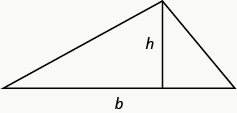
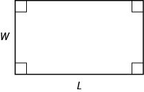

By the end of this section, you will be able to:
* Solve applications modeled by quadratic equations

Before you get started, take this readiness quiz.

1.  The sum of two consecutive odd numbers is −100. Find the numbers.
    * * *
    {: data-type="newline"}
    
    If you missed this problem, review [\[link\]](/m63309#fs-id1167836296968).
2.  Solve:
    <math xmlns="http://www.w3.org/1998/Math/MathML"><mrow><mfrac><mn>2</mn><mrow><mi>x</mi><mo>+</mo><mn>1</mn></mrow></mfrac><mo>+</mo><mfrac><mn>1</mn><mrow><mi>x</mi><mo>−</mo><mn>1</mn></mrow></mfrac><mo>=</mo><mfrac><mn>1</mn><mrow><msup><mi>x</mi><mn>2</mn></msup><mo>−</mo><mn>1</mn></mrow></mfrac><mo>.</mo></mrow></math>
    
    * * *
    {: data-type="newline"}
    
    If you missed this problem, review [\[link\]](/m63380#fs-id1167834183995).
3.  Find the length of the hypotenuse of a right triangle with legs 5 inches and 12 inches.
    * * *
    {: data-type="newline"}
    
    If you missed this problem, review [\[link\]](/m63310#fs-id1167832054640).
{: type="1"}

### Solve Applications Modeled by Quadratic Equations

We solved some applications that are modeled by quadratic equations earlier, when the only method we had to solve them was factoring. Now that we have more methods to solve quadratic equations, we will take another look at applications.

Let’s first summarize the methods we now have to solve quadratic equations.

Methods to Solve Quadratic Equations

1.  Factoring
2.  Square Root Property
3.  Completing the Square
4.  Quadratic Formula
{: type="1"}

As you solve each equation, choose the method that is most convenient for you to work the problem. As a reminder, we will copy our usual Problem-Solving Strategy here so we can follow the steps.

Use a Problem-Solving Strategy.

1.  **Read** the problem. Make sure all the words and ideas are understood.
2.  **Identify** what we are looking for.
3.  **Name** what we are looking for. Choose a variable to represent that quantity.
4.  **Translate** into an equation. It may be helpful to restate the problem in one sentence with all the important information. Then, translate the English sentence into an algebraic equation.
5.  **Solve** the equation using algebra techniques.
6.  **Check** the answer in the problem and make sure it makes sense.
7.  **Answer** the question with a complete sentence
{: type="1" .stepwise}

We have solved number applications that involved consecutive even and odd integers, by modeling the situation with linear equations. Remember, we noticed each even integer is 2 more than the number preceding it. If we call the first one *n*, then the next one is *n* + 2. The next one would be *n* + 2 + 2 or *n* + 4. This is also true when we use odd integers. One set of even integers and one set of odd integers are shown below.

<math xmlns="http://www.w3.org/1998/Math/MathML"><mrow><mtable><mtr><mtd /><mtd /><mtd /><mtd columnalign="center"><mtext mathvariant="bold">Consecutive even integers</mtext></mtd><mtd columnalign="center"><mspace width="3em" /></mtd><mtd /><mtd /><mtd /><mtd /><mtd columnalign="center"><mtext mathvariant="bold">Consecutive odd integers</mtext></mtd></mtr> <mtr><mtd /><mtd /><mtd /><mtd columnalign="center"><mn>64</mn><mo>,</mo><mn>66</mn><mo>,</mo><mn>68</mn></mtd><mtd columnalign="center"><mspace width="3em" /></mtd><mtd /><mtd /><mtd /><mtd /><mtd columnalign="center"><mn>77</mn><mo>,</mo><mn>79</mn><mo>,</mo><mn>81</mn></mtd></mtr> <mtr><mtd columnalign="center"><mi>n</mi></mtd><mtd /><mtd /><mtd columnalign="left"><msup><mrow><mn>1</mn></mrow><mrow><mtext>st</mtext></mrow></msup><mspace width="0.2em" /><mtext>even integer</mtext></mtd><mtd /><mtd /><mtd columnalign="center"><mspace width="3em" /><mi>n</mi></mtd><mtd /><mtd /><mtd columnalign="left"><msup><mrow><mn>1</mn></mrow><mrow><mtext>st</mtext></mrow></msup><mspace width="0.2em" /><mtext>odd integer</mtext></mtd></mtr> <mtr><mtd columnalign="center"><mi>n</mi><mo>+</mo><mn>2</mn></mtd><mtd /><mtd /><mtd columnalign="left"><msup><mrow><mn>2</mn></mrow><mrow><mtext>nd</mtext></mrow></msup><mspace width="0.2em" /><mtext>consecutive even integer</mtext></mtd><mtd /><mtd /><mtd columnalign="center"><mspace width="3em" /><mi>n</mi><mo>+</mo><mn>2</mn></mtd><mtd /><mtd /><mtd columnalign="left"><msup><mrow><mn>2</mn></mrow><mrow><mtext>nd</mtext></mrow></msup><mspace width="0.2em" /><mtext>consecutive odd integer</mtext></mtd></mtr> <mtr><mtd columnalign="center"><mi>n</mi><mo>+</mo><mn>4</mn></mtd><mtd /><mtd /><mtd columnalign="left"><msup><mrow><mn>3</mn></mrow><mrow><mtext>rd</mtext></mrow></msup><mspace width="0.2em" /><mtext>consecutive even integer</mtext></mtd><mtd /><mtd /><mtd columnalign="center"><mspace width="3em" /><mi>n</mi><mo>+</mo><mn>4</mn></mtd><mtd /><mtd /><mtd columnalign="left"><msup><mrow><mn>3</mn></mrow><mrow><mtext>rd</mtext></mrow></msup><mspace width="0.2em" /><mtext>consecutive odd integer</mtext></mtd></mtr></mtable></mrow></math>

Some applications of odd or even consecutive integers are modeled by quadratic equations. The notation above will be helpful as you name the variables.

The product of two consecutive odd integers is 195. Find the integers.

<math xmlns="http://www.w3.org/1998/Math/MathML"><mrow><mtable><mtr><mtd columnalign="left"><mtable><mtr><mtd columnalign="left"><mtext mathvariant="bold">Step 1. Read</mtext><mspace width="0.2em" /><mtext>the problem.</mtext></mtd><mtd /><mtd /><mtd /></mtr> <mtr><mtd columnalign="left"><mtext mathvariant="bold">Step 2. Identify</mtext><mspace width="0.2em" /><mtext>what we are looking for.</mtext></mtd><mtd /><mtd /><mtd columnalign="left"><mtext>We are looking for two consecutive odd integers.</mtext></mtd></mtr> <mtr><mtd columnalign="left"><mtext mathvariant="bold">Step 3. Name</mtext><mspace width="0.2em" /><mtext>what we are looking for.</mtext></mtd><mtd /><mtd /><mtd columnalign="left"><mtext>Let</mtext><mspace width="0.2em" /><mi>n</mi><mo>=</mo><mspace width="0.2em" /><mtext>the first odd integer.</mtext></mtd></mtr> <mtr><mtd /><mtd /><mtd /><mtd columnalign="left"><mi>n</mi><mo>+</mo><mn>2</mn><mo>=</mo><mspace width="0.2em" /><mtext>the next odd integer</mtext></mtd></mtr> <mtr><mtd columnalign="left"><mtable><mtr><mtd columnalign="left"><mtext mathvariant="bold">Step 4. Translate</mtext><mspace width="0.2em" /><mtext>into an equation. State</mtext></mtd></mtr> <mtr><mtd columnalign="left"><mtext>the problem in one sentence.</mtext></mtd></mtr></mtable></mtd><mtd /><mtd /><mtd columnalign="left"><mtext>“The product of two consecutive odd integers is 195.”</mtext></mtd></mtr> <mtr><mtd /><mtd /><mtd /><mtd columnalign="left"><mtable><mtr><mtd columnalign="left"><mtext>The product of the first odd integer and</mtext></mtd></mtr><mtr><mtd columnalign="left"><mtext>the second odd integer is 195.</mtext></mtd></mtr></mtable></mtd></mtr> <mtr><mtd columnalign="left"><mtable><mtr /><mtr><mtd columnalign="left"><mtext>Translate into an equation.</mtext></mtd></mtr><mtr /><mtr><mtd columnalign="left"><mtext mathvariant="bold">Step 5. Solve</mtext><mspace width="0.2em" /><mtext>the equation. Distribute.</mtext></mtd></mtr><mtr><mtd columnalign="left"><mtext>Write the equation in standard form.</mtext></mtd></mtr><mtr><mtd columnalign="left"><mtext>Factor.</mtext></mtd></mtr><mtr /><mtr><mtd columnalign="left"><mtext>Use the Zero Product Property.</mtext></mtd></mtr><mtr><mtd columnalign="left"><mtext>Solve each equation.</mtext></mtd></mtr></mtable></mtd><mtd /><mtd /><mtd columnalign="left"><mtable><mtr><mtd columnalign="right"><mtable><mtr><mtd columnalign="right"><mi>n</mi><mrow><mo>(</mo><mrow><mi>n</mi><mo>+</mo><mn>2</mn></mrow><mo>)</mo></mrow></mtd><mtd columnalign="left"><mo>=</mo></mtd><mtd columnalign="left"><mn>195</mn></mtd></mtr> <mtr><mtd columnalign="right"><msup><mi>n</mi><mn>2</mn></msup><mo>+</mo><mn>2</mn><mi>n</mi></mtd><mtd columnalign="left"><mo>=</mo></mtd><mtd columnalign="left"><mn>195</mn></mtd></mtr> <mtr><mtd columnalign="right"><msup><mi>n</mi><mn>2</mn></msup><mo>+</mo><mn>2</mn><mi>n</mi><mo>−</mo><mn>195</mn></mtd><mtd columnalign="left"><mo>=</mo></mtd><mtd columnalign="left"><mn>0</mn></mtd></mtr> <mtr><mtd columnalign="right"><mrow><mo>(</mo><mrow><mi>n</mi><mo>+</mo><mn>15</mn></mrow><mo>)</mo></mrow><mrow><mo>(</mo><mrow><mi>n</mi><mo>−</mo><mn>13</mn></mrow><mo>)</mo></mrow></mtd><mtd columnalign="left"><mo>=</mo></mtd><mtd columnalign="left"><mn>0</mn></mtd></mtr></mtable></mtd></mtr> <mtr><mtd columnalign="left"><mspace width="2em" /><mtable><mtr /><mtr /><mtr><mtd columnalign="left"><mi>n</mi><mo>+</mo><mn>15</mn><mo>=</mo><mn>0</mn><mspace width="0.5em" /><mi>n</mi><mo>−</mo><mn>13</mn><mo>=</mo><mn>0</mn></mtd></mtr><mtr><mtd columnalign="center"><mi>n</mi><mo>=</mo><mn>−15</mn><mo>,</mo><mspace width="0.5em" /><mi>n</mi><mo>=</mo><mn>13</mn></mtd></mtr></mtable></mtd></mtr></mtable></mtd></mtr></mtable></mtd></mtr> <mtr><mtd columnalign="left"><mtable><mtr><mtd columnalign="left"><mtext>There are two values of</mtext><mspace width="0.2em" /><mi>n</mi><mspace width="0.2em" /><mtext>that are solutions. This will give us two pairs of consecutive odd integers</mtext></mtd></mtr><mtr><mtd columnalign="left"><mtext>for our solution.</mtext></mtd></mtr></mtable></mtd></mtr> <mtr><mtd columnalign="center"><mtable><mtr /><mtr><mtd columnalign="center"><mtext>First odd integer</mtext><mspace width="0.2em" /><mi>n</mi><mo>=</mo><mn>13</mn></mtd><mtd /><mtd /><mtd columnalign="center"><mtext>First odd integer</mtext><mspace width="0.2em" /><mi>n</mi><mo>=</mo><mn>−15</mn></mtd></mtr> <mtr><mtd columnalign="center"><mtext>next odd integer</mtext><mspace width="0.2em" /><mi>n</mi><mo>+</mo><mn>2</mn></mtd><mtd /><mtd /><mtd columnalign="center"><mtext>next odd integer</mtext><mspace width="0.2em" /><mi>n</mi><mo>+</mo><mn>2</mn></mtd></mtr> <mtr><mtd columnalign="center"><mspace width="5.95em" /><mn>13</mn><mo>+</mo><mn>2</mn></mtd><mtd /><mtd /><mtd columnalign="center"><mspace width="5.7em" /><mo>−</mo><mn>15</mn><mo>+</mo><mn>2</mn></mtd></mtr> <mtr><mtd columnalign="center"><mspace width="5.4em" /><mn>15</mn></mtd><mtd /><mtd /><mtd columnalign="center"><mspace width="5em" /><mn>−13</mn></mtd></mtr></mtable></mtd></mtr> <mtr><mtd columnalign="left"><mtext mathvariant="bold">Step 6. Check</mtext><mspace width="0.2em" /><mtext>the answer.</mtext></mtd></mtr> <mtr><mtd columnalign="left"><mtext>Do these pairs work?</mtext></mtd></mtr> <mtr><mtd columnalign="left"><mtext>Are they consecutive odd integers?</mtext></mtd></mtr> <mtr><mtd columnalign="left"><mtable><mtr><mtd columnalign="right"><mn>13</mn><mo>,</mo><mn>15</mn></mtd><mtd /><mtd /><mtd columnalign="left"><mtext>yes</mtext></mtd></mtr><mtr><mtd columnalign="left"><mo>−</mo><mn>13</mn><mo>,</mo><mn>−15</mn></mtd><mtd /><mtd /><mtd columnalign="left"><mtext>yes</mtext></mtd></mtr></mtable></mtd></mtr> <mtr><mtd columnalign="left"><mtext>Is their product 195?</mtext></mtd></mtr> <mtr><mtd columnalign="left"><mtable><mtr><mtd columnalign="right"><mn>13</mn><mo>·</mo><mn>15</mn></mtd><mtd columnalign="left"><mo>=</mo></mtd><mtd columnalign="left"><mn>195</mn></mtd><mtd /><mtd /><mtd columnalign="left"><mtext>yes</mtext></mtd></mtr> <mtr><mtd columnalign="left"><mo>−</mo><mn>13</mn><mrow><mo>(</mo><mrow><mn>−15</mn></mrow><mo>)</mo></mrow></mtd><mtd columnalign="left"><mo>=</mo></mtd><mtd columnalign="left"><mn>195</mn></mtd><mtd /><mtd /><mtd columnalign="left"><mtext>yes</mtext></mtd></mtr></mtable></mtd></mtr> <mtr><mtd columnalign="left"><mtable><mtr><mtd columnalign="left"><mtext mathvariant="bold">Step 7. Answer</mtext><mspace width="0.2em" /><mtext>the question.</mtext><mspace width="7em" /><mtext>Two consecutive odd integers whose product is</mtext></mtd><mtd /><mtd /><mtd /></mtr> <mtr /><mtr /><mtr><mtd columnalign="left"><mspace width="19em" /><mtext>195 are 13, 15 and</mtext><mspace width="0.2em" /><mn>−13</mn><mo>,</mo><mn>−15</mn><mo>.</mo></mtd><mtd /><mtd /><mtd /></mtr></mtable></mtd></mtr></mtable></mrow></math>

The product of two consecutive odd integers is 99. Find the integers.

The two consecutive odd integers whose product is 99 are 9, 11, and −9, −11

The product of two consecutive even integers is 168. Find the integers.

The two consecutive even integers whose product is 128 are 12, 14 and −12, −14.

We will use the formula for the area of a triangle to solve the next example.

Area of a Triangle

For a triangle with base, *b*, and height, *h*, the area, *A*, is given by the formula <math xmlns="http://www.w3.org/1998/Math/MathML"><mrow><mi>A</mi><mo>=</mo><mfrac><mn>1</mn><mn>2</mn></mfrac><mi>b</mi><mi>h</mi><mo>.</mo></mrow></math>

  

Recall that when we solve geometric applications, it is helpful to draw the figure.

An architect is designing the entryway of a restaurant. She wants to put a triangular window above the doorway. Due to energy restrictions, the window can only have an area of 120 square feet and the architect wants the base to be 4 feet more than twice the height. Find the base and height of the window.

<table class="unnumbered unstyled can-break" summary="Step 1. Read the problem. Draw a picture. Image of a trangle. The horizontal base side is labeled 2 h plus 4, and a line segment labeled h is perpendicular to the base, connecting it to the opposite vertex. Step 2. Identify what we are looking for. We are looking for the base and height. Step 3. Name what we are looking for. Let h equal the height of the triangle. Let 2 h plus 4 equal the base of the triangle. Step 4. Translate into an equation. We know the area. Write the formula for the area of a triangle. A equals one half b times h. Step 5. Solve the equation. 120 equals one half times the sum 2 h plus 4 time h. Substitute in the values and distribute. 120 equals h sqared plus 2 h. this is a quadratic equation, rewrite it in standard form. H squared plus 2 h minus 120 equals 0. Factor. The product of h minus 10 and h plus 12 equals 0. Use the Zero Product Property. H &#x2013; 10 equals 0 or h plus 12 equals 0. Simplify. H equals 10 or h equals negative 12. Since h is the height of a window, a value of h equals negative 12 does not make sense. The height of the triangle is h equals 10. The base of the triangle is 2 h plus 4, or 2 times 10 plus 4 which equals 24. Step 6. Check the answer. Does a triangle with height 10 and base 24 have area 120? Yes. Step 7. Answer the question. The height of the triangular window is 10 feet and the base is 24 feet."><tbody>
<tr>
<td data-valign="top" data-align="left"><strong>Step 1. Read</strong> the problem.
Draw a picture.</td>
<td />
<td data-valign="top" data-align="left">

</td>
</tr>
<tr>
<td data-valign="top" data-align="left"><strong>Step 2. Identify</strong> what we are looking for.</td>
<td />
<td data-valign="top" data-align="left">We are looking for the base and height.</td>
</tr>
<tr>
<td data-valign="top" data-align="left"><strong>Step 3. Name</strong> what we are looking for.</td>
<td />
<td data-valign="top" data-align="left">Let <em>h</em> = the height of the triangle.
2<em>h</em> + 4 = the base of the triangle</td>
</tr>
<tr>
<td data-valign="top" data-align="left"><strong>Step 4. Translate</strong> into an equation.
We know the area. Write the
formula for the area of a triangle.</td>
<td />
<td data-valign="top" data-align="left"><math xmlns="http://www.w3.org/1998/Math/MathML"><mrow><mspace width="7.35em" /><mi>A</mi><mo>=</mo><mfrac><mn>1</mn><mn>2</mn></mfrac><mi>b</mi><mi>h</mi></mrow></math></td>
</tr>
<tr>
<td data-valign="top" data-align="left"><strong>Step 5. Solve</strong> the equation.
Substitute in the values.</td>
<td />
<td data-valign="top" data-align="left"><math xmlns="http://www.w3.org/1998/Math/MathML"><mrow><mspace width="6.5em" /><mn>120</mn><mo>=</mo><mfrac><mn>1</mn><mn>2</mn></mfrac><mo stretchy="false">(</mo><mn>2</mn><mi>h</mi><mo>+</mo><mn>4</mn><mo stretchy="false">)</mo><mi>h</mi></mrow></math></td>
</tr>
<tr>
<td data-valign="top" data-align="left">Distribute.</td>
<td />
<td data-valign="top" data-align="left"><math xmlns="http://www.w3.org/1998/Math/MathML"><mrow><mspace width="6.5em" /><mn>120</mn><mo>=</mo><msup><mi>h</mi><mn>2</mn></msup><mo>+</mo><mn>2</mn><mi>h</mi></mrow></math></td>
</tr>
<tr>
<td data-valign="top" data-align="left">This is a quadratic equation, rewrite it in standard form.</td>
<td />
<td data-valign="top" data-align="left"><math xmlns="http://www.w3.org/1998/Math/MathML"><mrow><mspace width="2.3em" /><msup><mi>h</mi><mn>2</mn></msup><mo>+</mo><mn>2</mn><mi>h</mi><mo>−</mo><mn>120</mn><mo>=</mo><mn>0</mn></mrow></math></td>
</tr>
<tr>
<td data-valign="top" data-align="left">Factor.</td>
<td />
<td data-valign="top" data-align="left"><math xmlns="http://www.w3.org/1998/Math/MathML"><mrow><mspace width="1.4em" /><mo stretchy="false">(</mo><mi>h</mi><mo>−</mo><mn>10</mn><mo stretchy="false">)</mo><mo stretchy="false">(</mo><mi>h</mi><mo>+</mo><mn>12</mn><mo stretchy="false">)</mo><mo>=</mo><mn>0</mn></mrow></math></td>
</tr>
<tr>
<td data-valign="top" data-align="left">Use the Zero Product Property.</td>
<td />
<td data-valign="top" data-align="left"><math xmlns="http://www.w3.org/1998/Math/MathML"><mrow><mi>h</mi><mo>−</mo><mn>10</mn><mo>=</mo><mn>0</mn><mspace width="1em" /><mi>h</mi><mo>+</mo><mn>12</mn><mo>=</mo><mn>0</mn></mrow></math></td>
</tr>
<tr>
<td data-valign="top" data-align="left">Simplify.</td>
<td />
<td data-valign="top" data-align="left"><math xmlns="http://www.w3.org/1998/Math/MathML"><mrow><mspace width="2.2em" /><mi>h</mi><mo>=</mo><mn>10</mn><mo>,</mo><mspace width="1.9em" /><menclose notation="updiagonalstrike"><mrow><mi>h</mi><mo>=</mo><mo>−</mo><mn>12</mn></mrow></menclose></mrow></math></td>
</tr>
<tr>
<td colspan="3" data-valign="top" data-align="center">Since <em>h</em> is the height of a window, a value of <em>h</em> = −12 does not make sense.</td>
</tr>
<tr>
<td colspan="3" data-valign="top" data-align="center">The height of the triangle <math xmlns="http://www.w3.org/1998/Math/MathML"><mrow><mi>h</mi><mo>=</mo><mn>10</mn><mo>.</mo></mrow></math></td>
</tr>
<tr>
<td colspan="3" data-valign="top" data-align="center">The base of the triangle <math xmlns="http://www.w3.org/1998/Math/MathML"><mrow><mn>2</mn><mi>h</mi><mo>+</mo><mn>4</mn><mo>.</mo></mrow></math>
<math xmlns="http://www.w3.org/1998/Math/MathML"><mrow><mspace width="9em" /><mn>2</mn><mo>·</mo><mn>10</mn><mo>+</mo><mn>4</mn></mrow></math>
<math xmlns="http://www.w3.org/1998/Math/MathML"><mrow><mspace width="9.4em" /><mn>24</mn></mrow></math></td>
</tr>
<tr>
<td data-valign="top" data-align="left"><strong>Step 6. Check</strong> the answer.
Does a triangle with height 10 and base 24 have area 120? Yes.</td>
<td />
<td />
</tr>
<tr>
<td data-valign="top" data-align="left"><strong>Step 7. Answer</strong> the question.</td>
<td />
<td data-valign="top" data-align="left">The height of the triangular window is 10 feet and the base is 24 feet.</td></tr>
</tbody></table>

Find the base and height of a triangle whose base is four inches more than six times its height and has an area of 456 square inches.

The height of the triangle is 12 inches and the base is 76 inches.

If a triangle that has an area of 110 square feet has a base that is two feet less than twice the height, what is the length of its base and height?

The height of the triangle is 11 feet and the base is 20 feet.

In the two preceding examples, the number in the radical in the **Quadratic Formula**{: data-type="term" .no-emphasis} was a perfect square and so the solutions were rational numbers. If we get an irrational number as a solution to an application problem, we will use a calculator to get an approximate value.

We will use the formula for the area of a rectangle to solve the next example.

Area of a Rectangle

For a rectangle with length, *L*, and width, *W*, the area, *A*, is given by the formula *A* = *LW*.

  

Mike wants to put 150 square feet of artificial turf in his front yard. This is the maximum area of artificial turf allowed by his homeowners association. He wants to have a rectangular area of turf with length one foot less than 3 times the width. Find the length and width. Round to the nearest tenth of a foot.

<table class="unnumbered unstyled can-break" summary="Step 1. Read the problem. Draw a picture. Image shows a rectangle. The longer, horizontal side is labeled 3 w minus 1 and the shorter, vertical side is labeled w. Step 2. Identify what we are looking for. We are looking for the length and width. Step 3. Name what we are looking for. Let w equal the width of the rectangle. Let 3 w minus 1 equal the length of the rectangle. Step 4. Translate into an equation. We know the area. Write the formula for the area of a rectangle. A equals L times W. Step 5. Solve the equation. Substitute in the values. 150 equals the product 3 w minus 1 times w. Distribute. 150 equals 3 w sqared minus 2. This is a quadratic equation, rewrite it in standard form, a x squared plus b x plus c equals 0. 3 w squared minus w minus 150 equals 0. Solve the equation using the Quadratic Formula. Identify the a, b, and c values. A equals 3, b equals negative 1, and c equals negative 150. Write the quadratic formula. W equals the quotient negative b plus or minus the square root of the difference b squared minus 4 a c divided by 2 a. Substitute the values of a, b, and c. w equals the quotient of the expression the opposite of negative 1 plus or minus the square root of the difference negative 1 squared minus the product 4 times 3 times negative 150 divided by the product 2 times 3. Simplify. w equals the quotient of the expression 1 plus or minus the square root of the sum 1 plus 1800 divided by 3. This further simplifies to the quotient of 1 plus or minus square root 1801 and 6. Rewrite to show two solutions. w equals the quotient 1 plus square root 1801 divided by 6 and w equals the quotient 1 minus square root 1801 divided by 6. Approximate the answers using a calculator . w is approximately 7.2 or w is approximately negative 6.9. we eliminate the negative solution for the width. Width is approximately 7.2 and length is 3 w minus 1, approximately 3 times 7.2 minus 1, or approximately 20.6. Step 6. Check the answer. Make sure that the answers make sense. Since the answers are approximate, the area will not come out exactly to 150. Step 7. Answer the question. The width of the rectangle is approximately 7.2 feet and the length 20.6 feet."><tbody>
<tr>
<td data-valign="top" data-align="left">Step 1. <strong>Read</strong> the problem.

Draw a picture.</td>
<td data-valign="top" data-align="left">

</td>
</tr>
<tr>
<td data-valign="top" data-align="left">Step 2. <strong>Identify</strong> what we are looking for.</td>
<td data-valign="top" data-align="left">We are looking for the length and width.</td>
</tr>
<tr>
<td data-valign="top" data-align="left">Step 3. <strong>Name</strong> what we are looking for.</td>
<td data-valign="top" data-align="left">Let <math xmlns="http://www.w3.org/1998/Math/MathML"><mrow><mspace width="0.5em" /><mi>w</mi><mo>=</mo></mrow></math> the width of the rectangle.

<math xmlns="http://www.w3.org/1998/Math/MathML"><mrow><mn>3</mn><mi>w</mi><mo>−</mo><mn>1</mn><mo>=</mo></mrow></math> the length of the rectangle</td>
</tr>
<tr>
<td data-valign="top" data-align="left">Step 4. <strong>Translate</strong> into an equation.

We know the area. Write the formula for the area of a rectangle.</td>
<td data-valign="bottom" data-align="left">

</td>
</tr>
<tr>
<td data-valign="top" data-align="left">Step 5. <strong>Solve</strong> the equation. Substitute in the values.</td>
<td data-valign="top" data-align="right">

</td>
</tr>
<tr>
<td data-valign="top" data-align="left">Distribute.</td>
<td data-valign="top" data-align="right">

</td>
</tr>
<tr>
<td data-valign="top" data-align="left">This is a quadratic equation; rewrite it in standard form.

Solve the equation using the Quadratic Formula.</td>
<td data-valign="top" data-align="right">

</td>
</tr>
<tr>
<td data-valign="top" data-align="left">Identify the <math xmlns="http://www.w3.org/1998/Math/MathML"><mrow><mi>a</mi><mo>,</mo><mi>b</mi><mo>,</mo><mi>c</mi></mrow></math> values.</td>
<td data-valign="top" data-align="right">

</td>
</tr>
<tr>
<td data-valign="top" data-align="left">Write the Quadratic Formula.</td>
<td data-valign="top" data-align="right">

</td>
</tr>
<tr>
<td data-valign="top" data-align="left">Then substitute in the values of <math xmlns="http://www.w3.org/1998/Math/MathML"><mrow><mi>a</mi><mo>,</mo><mi>b</mi><mo>,</mo><mi>c</mi></mrow></math>.</td>
<td data-valign="top" data-align="right">

</td>
</tr>
<tr>
<td data-valign="top" data-align="left">Simplify.</td>
<td data-valign="top" data-align="right">

</td>
</tr>
<tr>
<td data-valign="top" data-align="left">Rewrite to show two solutions.</td>
<td data-valign="top" data-align="right">

</td>
</tr>
<tr>
<td data-valign="top" data-align="left">Approximate the answers using a calculator.

We eliminate the negative solution for the width.</td>
<td data-valign="top" data-align="right">

</td>
</tr>
<tr>
<td data-valign="top" data-align="left">Step 6. <strong>Check</strong> the answer.
Make sure that the answers make sense. Since the
answers are approximate, the area will not come
out exactly to 150.</td>
<td />
</tr>
<tr>
<td data-valign="top" data-align="left">Step 7. <strong>Answer</strong> the question.</td>
<td data-valign="top" data-align="left">The width of the rectangle is
approximately 7.2 feet and the
length is approximately 20.6 feet.</td>
</tr>
</tbody></table>

The length of a 200 square foot rectangular vegetable garden is four feet less than twice the width. Find the length and width of the garden, to the nearest tenth of a foot.

The length of the garden is approximately 18 feet and the width 11 feet.

A rectangular tablecloth has an area of 80 square feet. The width is 5 feet shorter than the length.What are the length and width of the tablecloth to the nearest tenth of a foot.?

The length of the tablecloth is approximatel 11.8 feet and the width 6.8 feet.

The **Pythagorean Theorem**{: data-type="term" .no-emphasis} gives the relation between the legs and hypotenuse of a right triangle. We will use the Pythagorean Theorem to solve the next example.

Pythagorean Theorem

In any right triangle, where *a* and *b* are the lengths of the legs, and *c* is the length of the hypotenuse, *a*2 + *b*2 = *c*2.

  

Rene is setting up a holiday light display. He wants to make a ‘tree’ in the shape of two right triangles, as shown below, and has two 10-foot strings of lights to use for the sides. He will attach the lights to the top of a pole and to two stakes on the ground. He wants the height of the pole to be the same as the distance from the base of the pole to each stake. How tall should the pole be?

<table class="unnumbered unstyled can-break" summary="Step 1. Read the problem. Draw a picture. The image shows two right triangles positioned side-by-side so that they share a vertical leg. Their horizontal legs connect to form one line segment. The hypotenuses of the triangles represent the light strings that are staked to the ground. One hypotenuse is labeled 10. Step 2. Identify what we are looking for. We are looking for the height of the pole. Step 3. Name what we are looking for. The distance from the base of the pole to either stake is the same as the height of the pole. Let x equal the height of the pole, and let x also represent the distance from pole to stake. We can draw one of the right triangles. It has a horizontal and a vertical leg, each labeled x. The hypotenuse is labeled 10. Step 4. Translate into an equation. We can use the Pythagorean Theorem to solve for x. Write the Pythagorean Theorem, a squared plus b squared equals c squared. Step 5. Solve the equation. Substitute. X squared plus x squared equals 10 squared. Simplify. 2 x squared equals 100. Divide by 2 to isolate the variable. 2 x squared divided by 2 equals 100 divided by 2. Simplify. X squared equals 50. Use the Square Root Property. X equals the positive or negative square root of 50. Simplify the radical. X equals positive or negative 5 times square root 2. Rewrite to show 2 solutions. x equals 5 square root 2 or x equals negative 5 square root 2. We can disregard the negative solution because x represents distance. If we approximate this number to the nearest tenth with a calculator, we find x is approximately 7.1. Step 6. Check the answer. Check on your own in the Pythagorean Theorem. Step 7. Answer the question. The pole should be about 7.1 feet tall." data-label=""><tbody>
<tr>
<td data-valign="top" data-align="left"><strong>Step 1. Read</strong> the problem. Draw a picture.</td>
<td data-valign="top" data-align="left">

</td>
</tr>
<tr>
<td data-valign="top" data-align="left"><strong>Step 2. Identify</strong> what we are looking for.</td>
<td data-valign="top" data-align="left">We are looking for the height of the pole.</td>
</tr>
<tr>
<td data-valign="top" data-align="left"><strong>Step 3. Name</strong> what we are looking for.</td>
<td data-valign="top" data-align="left">The distance from the base of the pole to either stake is the same as the height of the pole.

Let <math xmlns="http://www.w3.org/1998/Math/MathML"><mrow><mi>x</mi><mo>=</mo></mrow></math> the height of the pole.

<math xmlns="http://www.w3.org/1998/Math/MathML"><mrow><mspace width="1.5em" /><mi>x</mi><mo>=</mo></mrow></math> the distance from pole to stake

Each side is a right triangle. We draw a picture of one of them.

</td>
</tr>
<tr>
<td data-valign="top" data-align="left"><strong>Step 4. Translate</strong> into an equation.

We can use the Pythagorean Theorem to solve for <em>x</em>.

Write the Pythagorean Theorem.</td>
<td data-valign="bottom" data-align="center"><math xmlns="http://www.w3.org/1998/Math/MathML"><mrow><msup><mi>a</mi><mn>2</mn></msup><mo>+</mo><msup><mi>b</mi><mn>2</mn></msup><mo>=</mo><msup><mi>c</mi><mn>2</mn></msup></mrow></math></td>
</tr>
<tr>
<td data-valign="top" data-align="left"><strong>Step 5. Solve</strong> the equation. Substitute.</td>
<td data-valign="top" data-align="center"><math xmlns="http://www.w3.org/1998/Math/MathML"><mrow><mspace width="0.5em" /><msup><mi>x</mi><mn>2</mn></msup><mo>+</mo><msup><mi>x</mi><mn>2</mn></msup><mo>=</mo><msup><mrow><mn>10</mn></mrow><mn>2</mn></msup></mrow></math></td>
</tr>
<tr>
<td data-valign="top" data-align="left">Simplify.</td>
<td data-valign="top" data-align="center"><math xmlns="http://www.w3.org/1998/Math/MathML"><mrow><mspace width="2em" /><mn>2</mn><msup><mi>x</mi><mn>2</mn></msup><mo>=</mo><mn>100</mn></mrow></math></td>
</tr>
<tr>
<td data-valign="top" data-align="left">Divide by 2 to isolate the variable.</td>
<td data-valign="top" data-align="center"><math xmlns="http://www.w3.org/1998/Math/MathML"><mrow><mspace width="2em" /><mfrac><mrow><mn>2</mn><msup><mi>x</mi><mn>2</mn></msup></mrow><mn>2</mn></mfrac><mo>=</mo><mfrac><mrow><mn>100</mn></mrow><mn>2</mn></mfrac></mrow></math></td>
</tr>
<tr>
<td data-valign="top" data-align="left">Simplify.</td>
<td data-valign="top" data-align="center"><math xmlns="http://www.w3.org/1998/Math/MathML"><mrow><mspace width="2em" /><msup><mi>x</mi><mn>2</mn></msup><mo>=</mo><mn>50</mn></mrow></math></td>
</tr>
<tr>
<td data-valign="top" data-align="left">Use the Square Root Property.</td>
<td data-valign="top" data-align="center"><math xmlns="http://www.w3.org/1998/Math/MathML"><mrow><mspace width="4.2em" /><mi>x</mi><mo>=</mo><mo>±</mo><msqrt><mrow><mn>50</mn></mrow></msqrt></mrow></math></td>
</tr>
<tr>
<td data-valign="top" data-align="left">Simplify the radical.</td>
<td data-valign="top" data-align="center"><math xmlns="http://www.w3.org/1998/Math/MathML"><mrow><mspace width="4.2em" /><mi>x</mi><mo>=</mo><mo>±</mo><mn>5</mn><msqrt><mn>2</mn></msqrt></mrow></math></td>
</tr>
<tr>
<td data-valign="top" data-align="left">Rewrite to show two solutions.</td>
<td data-valign="top" data-align="center"><math xmlns="http://www.w3.org/1998/Math/MathML"><mrow><mi>x</mi><mo>=</mo><mn>5</mn><msqrt><mn>2</mn></msqrt><mo>,</mo><mspace width="0.5em" /><menclose notation="updiagonalstrike"><mrow><mi>x</mi><mo>=</mo><mn>−5</mn><msqrt><mn>2</mn></msqrt></mrow></menclose></mrow></math></td>
</tr>
<tr>
<td />
<td data-valign="top" data-align="center">If we approximate this number to the
nearest tenth with a calculator, we find
<math xmlns="http://www.w3.org/1998/Math/MathML"><mrow><mi>x</mi><mo>≈</mo><mn>7.1</mn></mrow></math>.</td>
</tr>
<tr>
<td data-valign="top" data-align="left"><strong>Step 6. Check</strong> the answer.

Check on your own in the Pythagorean Theorem.</td>
<td />
</tr>
<tr>
<td data-valign="top" data-align="left"><strong>Step 7. Answer</strong> the question.</td>
<td data-valign="top" data-align="center">The pole should be about 7.1 feet tall.</td>
</tr>
</tbody></table>

The sun casts a shadow from a flag pole. The height of the flag pole is three times the length of its shadow. The distance between the end of the shadow and the top of the flag pole is 20 feet. Find the length of the shadow and the length of the flag pole. Round to the nearest tenth.

The length of the flag pole’s shadow is approximately 6.3 feet and the height of the flag pole is 18.9 feet.

The distance between opposite corners of a rectangular field is four more than the width of the field. The length of the field is twice its width. Find the distance between the opposite corners. Round to the nearest tenth.

The distance between the opposite corners is approximately 7.2 feet.

The height of a projectile shot upward from the ground is modeled by a quadratic equation. The initial velocity, *v*0, propels the object up until gravity causes the object to fall back down.

Projectile motion

The height in feet, *h* , of an object shot upwards into the air with initial velocity, <math xmlns="http://www.w3.org/1998/Math/MathML"><mrow><msub><mi>v</mi><mn>0</mn></msub></mrow></math>

, after <math xmlns="http://www.w3.org/1998/Math/MathML"><mi>t</mi></math>

 seconds is given by the formula

<math xmlns="http://www.w3.org/1998/Math/MathML"><mrow><mi>h</mi><mo>=</mo><mn>−16</mn><msup><mi>t</mi><mn>2</mn></msup><mo>+</mo><msub><mi>v</mi><mn>0</mn></msub><mi>t</mi></mrow></math>

We can use this formula to find how many seconds it will take for a firework to reach a specific height.

A firework is shot upwards with initial velocity 130 feet per second. How many seconds will it take to reach a height of 260 feet? Round to the nearest tenth of a second.

<table class="unnumbered unstyled can-break" summary="Step 1. Read the problem. Step 2. Identify what we are looking for. We are looking for the number of seconds, which is time. Step 3. Name what we are looking for. Let t equal the number of seconds. Step 4. Translate into an equation. Use the formula h equals negative 16 t squared plus v sub 0 t. Step 5. Solve the equation. We know the velocity v sub 0 is 130 feet per second. The height is 260 feet. Substitute the values. 260 equals negative 16 t squared plus 130 t. This is a quadratic equation, so write it in standard form, a x squared plus b x plus c equals 0. 16 t squared minus 130 t plus 260 equals 0. Solve the equation using the Quadratic Formula. Identify the values of a, b, and c. a equals 16, b equals negative 130, and c equals 260. Write the Quadratic Formula. t equals the quotient negative b plus or minus the square root of the difference b squared minus 4 a c divided by 2 a. Then substitute in the values of a, b, and c. t equals the quotient of the expression the opposite of negative 130 plus or minus the square root of the difference negative 130 squared minus the product 4 times 16 times 260 divided by the product 2 times 16. Simplify. t equals the quotient of the expression 130 plus or minus the square root of the difference 16,900 minus 16,640 divided by 32. This further simplifies to the quotient of 130 plus or minus square root 260 and 32. Rewrite to show two solutions The first is t equals the quotient 130 plus square root 260 divided by 32. The second solution is t equals the quotient 130 minus square root 260 divided by 32. Approximate the answer with a calculator. T is approximately 4.6 sections, or t is approximately 3.6 seconds. Step 6. Check the answer. The check is left to you. Step 7. Answer the question. The firework will go up and then fall back down. As the firework goes up, it will reach 260 feet after approximately 3.6 seconds. It will also pass that height on the way down at 4.6 seconds. An image shows the arc of a firework ascending, then descending to explode." data-label=""><tbody>
<tr>
<td data-valign="top" data-align="left"><strong>Step 1. Read</strong> the problem.</td>
<td />
</tr>
<tr>
<td data-valign="top" data-align="left"><strong>Step 2. Identify</strong> what we are looking for.</td>
<td data-valign="top" data-align="left">We are looking for the number of
seconds, which is time.</td>
</tr>
<tr>
<td data-valign="top" data-align="left"><strong>Step 3. Name</strong> what we are looking for.</td>
<td data-valign="top" data-align="left">Let <math xmlns="http://www.w3.org/1998/Math/MathML"><mrow><mi>t</mi><mo>=</mo></mrow></math> the number of seconds.</td>
</tr>
<tr>
<td data-valign="top" data-align="left"><strong>Step 4. Translate</strong> into an equation. Use the formula.</td>
<td data-valign="top" data-align="center">

</td>
</tr>
<tr>
<td data-valign="top" data-align="left"><strong>Step 5. Solve</strong> the equation.

We know the velocity <math xmlns="http://www.w3.org/1998/Math/MathML"><mrow><msub><mi>v</mi><mn>0</mn></msub></mrow></math> is 130 feet per second.

The height is 260 feet. Substitute the values.</td>
<td data-valign="top" data-align="center">

</td>
</tr>
<tr>
<td data-valign="top" data-align="left">This is a quadratic equation, rewrite it in standard form.
Solve the equation using the Quadratic Formula.</td>
<td data-valign="top" data-align="center">

</td>
</tr>
<tr>
<td data-valign="top" data-align="left">Identify the values of <math xmlns="http://www.w3.org/1998/Math/MathML"><mrow><mi>a</mi><mo>,</mo><mi>b</mi><mo>,</mo><mi>c</mi><mo>.</mo></mrow></math></td>
<td data-valign="top" data-align="center">

</td>
</tr>
<tr>
<td data-valign="top" data-align="left">Write the Quadratic Formula.</td>
<td data-valign="top" data-align="center">

</td>
</tr>
<tr>
<td data-valign="top" data-align="left">Then substitute in the values of <math xmlns="http://www.w3.org/1998/Math/MathML"><mrow><mi>a</mi><mo>,</mo><mi>b</mi><mo>,</mo><mi>c</mi></mrow></math>.</td>
<td data-valign="top" data-align="center">

</td>
</tr>
<tr>
<td data-valign="top" data-align="left">Simplify.</td>
<td data-valign="top" data-align="center">

</td>
</tr>
<tr>
<td data-valign="top" data-align="left">Rewrite to show two solutions.</td>
<td data-valign="top" data-align="center">

</td>
</tr>
<tr>
<td data-valign="top" data-align="left">Approximate the answer with a calculator.</td>
<td data-valign="top" data-align="center">

</td>
</tr>
<tr>
<td data-valign="top" data-align="left"><strong>Step 6. Check</strong> the answer.

The check is left to you.</td>
<td />
</tr>
<tr>
<td data-valign="top" data-align="left"><strong>Step 7. Answer</strong> the question.</td>
<td data-valign="top" data-align="left">The firework will go up and then fall back
down. As the firework goes up, it will
reach 260 feet after approximately 3.6
seconds. It will also pass that height on
the way down at 4.6 seconds.</td>
</tr>
</tbody></table>

An arrow is shot from the ground into the air at an initial speed of 108 ft/s. Use the formula *h* = −16*t*2 + *v*0*t* to determine when the arrow will be 180 feet from the ground. Round the nearest tenth.

The arrow will reach 180 feet on its way up after 3 seconds and again on its way down after approximately 3.8 seconds.

A man throws a ball into the air with a velocity of 96 ft/s. Use the formula *h* = −16*t*2 + *v*0*t* to determine when the height of the ball will be 48 feet. Round to the nearest tenth.

The ball will reach 48 feet on its way up after approximately .6 second and again on its way down after approximately 5.4 seconds.

We have solved uniform motion problems using the formula *D* = *rt* in previous chapters. We used a table like the one below to organize the information and lead us to the equation.

    The formula *D* = *rt* assumes we know *r* and *t* and use them to find *D*. If we know *D* and *r* and need to find *t*, we would solve the equation for *t* and get the formula <math xmlns="http://www.w3.org/1998/Math/MathML"><mrow><mi>t</mi><mo>=</mo><mfrac><mi>D</mi><mi>r</mi></mfrac><mo>.</mo></mrow></math>

Some uniform motion problems are also modeled by quadratic equations.

Professor Smith just returned from a conference that was 2,000 miles east of his home. His total time in the airplane for the round trip was 9 hours. If the plane was flying at a rate of 450 miles per hour, what was the speed of the jet stream?

This is a uniform motion situation. A diagram will help us visualize the situation.* * *
{: data-type="newline"}

* * *
{: data-type="newline"}

  
We fill in the chart to organize the information.

<math xmlns="http://www.w3.org/1998/Math/MathML"><mrow><mtable><mtr><mtd columnalign="left"><mtext>We are looking for the speed of the jet stream.</mtext></mtd><mtd /><mtd /><mtd /><mtd /><mtd columnalign="left"><mtext>Let</mtext><mspace width="0.2em" /><mi>r</mi><mo>=</mo><mspace width="0.2em" /><mtext>the speed of the jet stream.</mtext></mtd></mtr></mtable></mrow></math>

When the plane flies with the wind, the wind increases its speed and so the rate is 450 + *r*.

When the plane flies against the wind, the wind decreases its speed and the rate is 450 − *r*.

<table class="unnumbered unstyled can-break" summary="Use a table to organize your work. The table has three rows and four columns. The top row has headings Rate, Time, and Distance expressed in the equation Rate times Time equals Distance. The second row is labeled &#x201C;Headwind,&#x201D; and the third row is labeled &#x201C;Tailwind.&#x201D; Write the rates in the second column. The headwind rate is 450 minus r. The tailwind rate is 450 + r. Write the distances in the fourth column. The headwind distance and tailwind distance are both 2000. Since D equals r times t, we solve for t and get equals D divided by r. We divide the distance by the rate in each row, and place the expression in the time column, the third column. The headwind time is 2000 divided by the difference 450 minus 4. The tailwind time is 2000 divided by the sum 450 plus r. We know the times add to 9 and so we write our equation. 2000 divided by the difference 450 minus 4 plus 2000 divided by the sum 450 plus r equals 9. We multiply both sides be the LCD. The product of the difference 450 minus 4 and the sum 450 plus 4 and the sum 2000 divided by the difference 450 minus 4 plus 2000 divided by the sum 450 plus r equals 9 equals 9 times the difference 450 minus 4 times the sum 450 plus 4. Simplify. 2000 times the sum 450 plus 4 plus 2000 times the difference 450 minus 4 equals 9 times the difference 450 minus 4 times the sum 450 plus 4. Factor the 2000. 2000 times the expression 450 plus 4 plus 450 minus r equals 9 times the difference 450 squared minus r squared. 2000 times 900 equals 9 times the difference 450 squared minus r squared Divide by 9. 2000 times 100 equals 450 squared minus r squared. Simplify 200,000 equals 202,500 minus r squared. Negative 2500 equals negative r squared. 50 equals r, the speed of the jet stream. Check: Is 50 mph a reasonable speed for the jet stream? Yes. If the plane is traveling 450 mph and the wind is 50 mph, the tailwind speed is 450 plus 50 equals 500 miles per hour and the time is 2000 divided by 500 which equals 4 hours. The headwind speed is 450 minus 50 equals 400 mph. The time is 2000 divided by 400 which equals 5 hours. The times add to 9 hours, so it checks. The speed of the jet stream was 50 mph." data-label=""><tbody>
<tr>
<td data-valign="top" data-align="left">Write in the rates.

Write in the distances.
Since
<math xmlns="http://www.w3.org/1998/Math/MathML"><mrow><mi>D</mi><mo>=</mo><mi>r</mi><mo>·</mo><mi>t</mi></mrow></math>,
we solve for
<math xmlns="http://www.w3.org/1998/Math/MathML"><mi>t</mi></math> and get <math xmlns="http://www.w3.org/1998/Math/MathML"><mrow><mi>t</mi><mo>=</mo><mfrac><mi>D</mi><mi>r</mi></mfrac></mrow></math>.
We divide the distance by
the rate in each row, and
place the expression in the
time column.</td>
<td data-valign="middle" data-align="center">

</td>
</tr>
<tr>
<td data-valign="top" data-align="left">We know the times add to 9
and so we write our equation.</td>
<td data-valign="top" data-align="center"><math xmlns="http://www.w3.org/1998/Math/MathML"><mrow><mfrac><mrow><mn>2000</mn></mrow><mrow><mn>450</mn><mo>−</mo><mi>r</mi></mrow></mfrac><mo>+</mo><mfrac><mrow><mn>2000</mn></mrow><mrow><mn>450</mn><mo>+</mo><mi>r</mi></mrow></mfrac><mo>=</mo><mn>9</mn><mspace width="4.6em" /></mrow></math></td>
</tr>
<tr>
<td data-valign="top" data-align="left">We multiply both sides by the LCD.</td>
<td data-valign="top" data-align="left"><math xmlns="http://www.w3.org/1998/Math/MathML"><mrow><mrow><mo>(</mo><mrow><mn>450</mn><mo>−</mo><mi>r</mi></mrow><mo>)</mo></mrow><mrow><mo>(</mo><mrow><mn>450</mn><mo>+</mo><mi>r</mi></mrow><mo>)</mo></mrow><mrow><mo>(</mo><mrow><mfrac><mrow><mn>2000</mn></mrow><mrow><mn>450</mn><mo>−</mo><mi>r</mi></mrow></mfrac><mo>+</mo><mfrac><mrow><mn>2000</mn></mrow><mrow><mn>450</mn><mo>+</mo><mi>r</mi></mrow></mfrac></mrow><mo>)</mo></mrow><mo>=</mo><mtext> </mtext><mn>9</mn><mrow><mo>(</mo><mrow><mn>450</mn><mo>−</mo><mi>r</mi></mrow><mo>)</mo></mrow><mrow><mo>(</mo><mrow><mn>450</mn><mo>+</mo><mi>r</mi></mrow><mo>)</mo><mspace width="5.2em" /></mrow></mrow></math></td>
</tr>
<tr>
<td data-valign="top" data-align="left">Simplify.</td>
<td data-valign="top" data-align="left"><math xmlns="http://www.w3.org/1998/Math/MathML"><mrow><mspace width="3em" /><mn>2000</mn><mrow><mo>(</mo><mrow><mn>450</mn><mo>+</mo><mi>r</mi></mrow><mo>)</mo></mrow><mo>+</mo><mn>2000</mn><mrow><mo>(</mo><mrow><mn>450</mn><mo>−</mo><mi>r</mi></mrow><mo>)</mo></mrow><mo>=</mo><mtext> </mtext><mn>9</mn><mrow><mo>(</mo><mrow><mn>450</mn><mo>−</mo><mi>r</mi></mrow><mo>)</mo></mrow><mrow><mo>(</mo><mrow><mn>450</mn><mo>+</mo><mi>r</mi></mrow><mo>)</mo></mrow></mrow></math></td>
</tr>
<tr>
<td data-valign="top" data-align="left">Factor the 2,000.</td>
<td data-valign="top" data-align="left"><math xmlns="http://www.w3.org/1998/Math/MathML"><mrow><mspace width="5.75em" /><mn>2000</mn><mrow><mo>(</mo><mrow><mn>450</mn><mo>+</mo><mi>r</mi><mo>+</mo><mn>450</mn><mo>−</mo><mi>r</mi></mrow><mo>)</mo></mrow><mo>=</mo><mtext> </mtext><mn>9</mn><mrow><mo>(</mo><mrow><msup><mrow><mn>450</mn></mrow><mn>2</mn></msup><mo>−</mo><msup><mi>r</mi><mn>2</mn></msup></mrow><mo>)</mo></mrow></mrow></math></td>
</tr>
<tr>
<td data-valign="top" data-align="left">Solve.</td>
<td data-valign="top" data-align="left"><math xmlns="http://www.w3.org/1998/Math/MathML"><mrow><mspace width="11.4em" /><mn>2000</mn><mrow><mo>(</mo><mrow><mn>900</mn></mrow><mo>)</mo></mrow><mo>=</mo><mtext> </mtext><mn>9</mn><mrow><mo>(</mo><mrow><msup><mrow><mn>450</mn></mrow><mn>2</mn></msup><mo>−</mo><msup><mi>r</mi><mn>2</mn></msup></mrow><mo>)</mo></mrow></mrow></math></td>
</tr>
<tr>
<td data-valign="top" data-align="left">Divide by 9.</td>
<td data-valign="top" data-align="left"><math xmlns="http://www.w3.org/1998/Math/MathML"><mrow><mspace width="11.4em" /><mn>2000</mn><mrow><mo>(</mo><mrow><mn>100</mn></mrow><mo>)</mo></mrow><mo>=</mo><mtext> </mtext><msup><mrow><mn>450</mn></mrow><mn>2</mn></msup><mo>−</mo><msup><mi>r</mi><mn>2</mn></msup></mrow></math></td>
</tr>
<tr>
<td data-valign="top" data-align="left">Simplify.</td>
<td data-valign="top" data-align="left"><math xmlns="http://www.w3.org/1998/Math/MathML"><mrow><mspace width="12.6em" /><mn>200000</mn><mo>=</mo><mtext> </mtext><mn>202500</mn><mo>−</mo><msup><mi>r</mi><mn>2</mn></msup></mrow></math>
<math xmlns="http://www.w3.org/1998/Math/MathML"><mrow><mspace width="12.95em" /><mn>−2500</mn><mo>=</mo><mo>−</mo><msup><mi>r</mi><mn>2</mn></msup></mrow></math>
<math xmlns="http://www.w3.org/1998/Math/MathML"><mrow><mspace width="14.6em" /><mn>50</mn><mo>=</mo><mi>r</mi><mspace width="0.5em" /><mtext>The speed of the jet stream.</mtext></mrow></math></td>
</tr>
<tr>
<td data-valign="top" data-align="left">Check:

Is 50 mph a reasonable speed for the jet stream? Yes.

If the plane is traveling 450 mph and the wind is 50 mph,

Tailwind <math xmlns="http://www.w3.org/1998/Math/MathML"><mrow><mn>450</mn><mo>+</mo><mn>50</mn><mo>=</mo><mn>500</mn><mspace width="0.2em" /><mtext>mph</mtext><mspace width="1.5em" /><mfrac><mrow><mn>2000</mn></mrow><mrow><mn>500</mn></mrow></mfrac><mo>=</mo><mn>4</mn><mspace width="0.2em" /><mtext>hours</mtext></mrow></math>

Headwind <math xmlns="http://www.w3.org/1998/Math/MathML"><mrow><mn>450</mn><mo>−</mo><mn>50</mn><mo>=</mo><mtext>400 mph</mtext><mspace width="1.5em" /><mfrac><mrow><mn>2000</mn></mrow><mrow><mn>400</mn></mrow></mfrac><mo>=</mo><mtext>5 hours</mtext></mrow></math>
The times add to 9 hours, so it checks.</td>
<td />
</tr>
<tr>
<td />
<td data-valign="top" data-align="left">The speed of the jet stream was 50 mph.</td>
</tr>
</tbody></table>

MaryAnne just returned from a visit with her grandchildren back east . The trip was 2400 miles from her home and her total time in the airplane for the round trip was 10 hours. If the plane was flying at a rate of 500 miles per hour, what was the speed of the jet stream?

The speed of the jet stream was 100 mph.

Gerry just returned from a cross country trip. The trip was 3000 miles from his home and his total time in the airplane for the round trip was 11 hours. If the plane was flying at a rate of 550 miles per hour, what was the speed of the jet stream?

The speed of the jet stream was 50 mph.

Work applications can also be modeled by quadratic equations. We will set them up using the same methods we used when we solved them with rational equations.We’ll use a similar scenario now.

The weekly gossip magazine has a big story about the presidential election and the editor wants the magazine to be printed as soon as possible. She has asked the printer to run an extra printing press to get the printing done more quickly. Press #1 takes 12 hours more than Press #2 to do the job and when both presses are running they can print the job in 8 hours. How long does it take for each press to print the job alone?

This is a work problem. A chart will help us organize the information.

We are looking for how many hours it would take each press separately to complete the job.

<table class="unnumbered unstyled can-break" summary="Use a table to organize your work. The table has four rows and three columns. The first row is a header row and it labels the second column &#x201C;Number of hours needed to complete the job. It labels the third column &#x201C;Part of job completed per hour.&#x201D; Row 2 records the information for Press number 1. It takes x plus 12 hours to complete the job, so the part of job completed per hour is 1 divided by the sum x plus 12. Row 3 records the information for Press number 2. It takes x hours to complete the job, so the part of job completed per hour is 1 divided x. Row 4 records the information for both presses together. It takes 8 hours to complete the job, so the part of job completed per hour is one eighth. The part completed by Press number 1 plus the part completed by Press number 2 equals the amount completed together. Translate to an equation. 1 divided by the sum x plus 12 plus 1 divided by x equals one eighth. Solve. Multiply by the LCD, 8 times x times the sum x plus 12. The new equation is 8 x times the sum x plus 12 times the sum 1 divided by the sum x plus 12 plus 1 divided by x equals one eighth times 8 x times the sum x plus 12. Simplify 8 x plus 8 times the sum x plus 12 equals x times the sum x plus 12. 8 x plus 8 x plus 96 equals x squared plus 12 x. 0 equals x squared minus 4 x minus 96. Solve. 0 equals the product x minus 12 times x plus 8. X minus 12 equals 0 or x plus 8 equals 0. So x equals 12 hours or x equals negative 8 hours. Since the idea of negative hours does not make sense, we use the value x equals 12. The time for press number 1 equals x plus 12, 12 plus 12 equals 24 hours. The time for press number 2 equals x, or 12 hours. Write our sentence answer. Press number 1 would take 24 hours and Press number 2 would take 12 hours to do the job alone." data-label=""><tbody>
<tr>
<td data-valign="top" data-align="left">Let <math xmlns="http://www.w3.org/1998/Math/MathML"><mrow><mi>x</mi><mo>=</mo></mrow></math> the number of hours for Press #2
to complete the job.
Enter the hours per job for Press #1,
Press #2, and when they work together.</td>
<td data-valign="top" data-align="left">

</td>
</tr>
<tr>
<td data-valign="top" data-align="left">The part completed by Press #1 plus the part
completed by Press #2 equals the
amount completed together.
Translate to an equation.</td>
<td data-valign="top" data-align="left">

</td>
</tr>
<tr>
<td data-valign="top" data-align="left">Solve.</td>
<td data-valign="top" data-align="left">

</td>
</tr>
<tr>
<td data-valign="top" data-align="left">Multiply by the LCD, <math xmlns="http://www.w3.org/1998/Math/MathML"><mrow><mn>8</mn><mi>x</mi><mrow><mo>(</mo><mrow><mi>x</mi><mo>+</mo><mn>12</mn></mrow><mo>)</mo></mrow></mrow></math>.</td>
<td data-valign="top" data-align="left">

</td>
</tr>
<tr>
<td data-valign="top" data-align="left">Simplify.</td>
<td data-valign="top" data-align="left">

</td>
</tr>
<tr>
<td data-valign="top" data-align="left">Solve.</td>
<td data-valign="top" data-align="left">

</td>
</tr>
<tr>
<td data-valign="top" data-align="left">Since the idea of negative hours does not make sense, we use the value <math xmlns="http://www.w3.org/1998/Math/MathML"><mrow><mi>x</mi><mo>=</mo><mn>12</mn></mrow></math>.</td>
<td data-valign="top" data-align="left">

</td>
</tr>
<tr>
<td data-valign="top" data-align="left">Write our sentence answer.</td>
<td data-valign="top" data-align="left">Press #1 would take 24 hours and
Press #2 would take 12 hours to do the job alone.</td>
</tr>
</tbody></table>

The weekly news magazine has a big story naming the Person of the Year and the editor wants the magazine to be printed as soon as possible. She has asked the printer to run an extra printing press to get the printing done more quickly. Press #1 takes 6 hours more than Press #2 to do the job and when both presses are running they can print the job in 4 hours. How long does it take for each press to print the job alone?

Press #1 would take 12 hours, and Press #2 would take 6 hours to do the job alone.

Erlinda is having a party and wants to fill her hot tub. If she only uses the red hose it takes 3 hours more than if she only uses the green hose. If she uses both hoses together, the hot tub fills in 2 hours. How long does it take for each hose to fill the hot tub?

The red hose take 6 hours and the green hose take 3 hours alone.

Access these online resources for additional instruction and practice with solving applications modeled by quadratic equations.

* [Word Problems Involving Quadratic Equations][1]
* [Quadratic Equation Word Problems][2]
* [Applying the Quadratic Formula][3]
{: data-display="block"}

### Key Concepts

* Methods to Solve Quadratic Equations
  * Factoring
  * Square Root Property
  * Completing the Square
  * Quadratic Formula
  {: data-bullet-style="open-circle"}

* How to use a Problem-Solving Strategy.
  1.  **Read** the problem. Make sure all the words and ideas are understood.
  2.  **Identify** what we are looking for.
  3.  **Name** what we are looking for. Choose a variable to represent that quantity.
  4.  **Translate** into an equation. It may be helpful to restate the problem in one sentence with all the important information. Then, translate the English sentence into an algebra equation.
  5.  **Solve** the equation using good algebra techniques.
  6.  **Check** the answer in the problem and make sure it makes sense.
  7.  **Answer** the question with a complete sentence.
  {: type="1" .stepwise}

* Area of a Triangle
  * For a triangle with base, *b*, and height, *h*, the area, *A*, is given by the formula
    <math xmlns="http://www.w3.org/1998/Math/MathML"><mrow><mi>A</mi><mo>=</mo><mfrac><mn>1</mn><mn>2</mn></mfrac><mi>b</mi><mi>h</mi><mo>.</mo></mrow></math>
    
    * * *
    {: data-type="newline"}
    
      
  {: data-bullet-style="open-circle"}

* Area of a Rectangle
  * For a rectangle with length, *L*, and width, *W*, the area, *A*, is given by the formula *A* = *LW*.
    * * *
    {: data-type="newline"}
    
      
  {: data-bullet-style="open-circle"}

* Pythagorean Theorem
  * In any right triangle, where *a* and *b* are the lengths of the legs, and *c* is the length of the hypotenuse, *a*2 + *b*2 = *c*2.
    * * *
    {: data-type="newline"}
    
      
  {: data-bullet-style="open-circle"}

* Projectile motion
  * The height in feet, *h*, of an object shot upwards into the air with initial velocity, *v*0, after *t* seconds is given by the formula *h* = −16*t*2 + *v*0*t*.
  {: data-bullet-style="open-circle"}
{: data-bullet-style="bullet"}

<section data-depth="1" class="section-exercises" markdown="1">
#### Practice Makes Pefect

**Solve Applications Modeled by Quadratic Equations**

In the following exercises, solve using any method.

The product of two consecutive odd numbers is 255. Find the numbers.

Two consecutive odd numbers whose product is 255 are 15 and 17, and −15 and −17.

The product of two consecutive even numbers is 360. Find the numbers.

The product of two consecutive even numbers is 624. Find the numbers.

The first and second consecutive odd numbers are 24 and 26, and −26 and −24.

The product of two consecutive odd numbers is 1,023. Find the numbers.

The product of two consecutive odd numbers is 483. Find the numbers.

Two consecutive odd numbers whose product is 483 are 21 and 23, and −21 and −23.

The product of two consecutive even numbers is 528. Find the numbers.

In the following exercises, solve using any method. Round your answers to the nearest tenth, if needed.

A triangle with area 45 square inches has a height that is two less than four times the base Find the base and height of the triangle.

The width of the triangle is 5 inches and the height is 18 inches.

The base of a triangle is six more than twice the height. The area of the triangle is 88 square yards. Find the base and height of the triangle.

The area of a triangular flower bed in the park has an area of 120 square feet. The base is 4 feet longer that twice the height. What are the base and height of the triangle?

The base is 24 feet and the height of the triangle is 10 feet.

A triangular banner for the basketball championship hangs in the gym. It has an area of 75 square feet. What is the length of the base and height , if the base is two-thirds of the height?

The length of a rectangular driveway is five feet more than three times the width. The area is 50 square feet. Find the length and width of the driveway.

The length of the driveway is 15.0 feet and the width is 3.3 feet.

A rectangular lawn has area 140 square yards. Its width that is six less than twice the length. What are the length and width of the lawn?

A rectangular table for the dining room has a surface area of 24 square feet. The length is two more feet than twice the width of the table. Find the length and width of the table.

The length of table is 8 feet and the width is 3 feet.

The new computer has a surface area of 168 square inches. If the the width is 5.5 inches less that the length, what are the dimensions of the computer?

The hypotenuse of a right triangle is twice the length of one of its legs. The length of the other leg is three feet. Find the lengths of the three sides of the triangle.

The length of the legs of the right triangle are 3.2 and 9.6 cm.

The hypotenuse of a right triangle is 10 cm long. One of the triangle’s legs is three times as the length of the other leg . Round to the nearest tenth. Find the lengths of the three sides of the triangle.

A rectangular garden will be divided into two plots by fencing it on the diagonal. The diagonal distance from one corner of the garden to the opposite corner is five yards longer than the width of the garden. The length of the garden is three times the width. Find the length of the diagonal of the garden.

  

The length of the diagonal fencing is 7.3 yards.

Nautical flags are used to represent letters of the alphabet. The flag for the letter, O consists of a yellow right triangle and a red right triangle which are sewn together along their hypotenuse to form a square. The hypotenuse of the two triangles is three inches longer than a side of the flag. Find the length of the side of the flag.

  

Gerry plans to place a 25-foot ladder against the side of his house to clean his gutters. The bottom of the ladder will be 5 feet from the house.How for up the side of the house will the ladder reach?

The ladder will reach 24.5 feet on the side of the house.

John has a 10-foot piece of rope that he wants to use to support his 8-foot tree. How far from the base of the tree should he secure the rope?

A firework rocket is shot upward at a rate of 640 ft/sec. Use the projectile formula *h* = −16*t*2 + *v*0*t* to determine when the height of the firework rocket will be 1200 feet.

The arrow will reach 400 feet on its way up in 2.8 seconds and on the way down in 11 seconds.

An arrow is shot vertically upward at a rate of 220 feet per second. Use the projectile formula *h* = −16*t*2 + *v*0*t*, to determine when height of the arrow will be 400 feet.

A bullet is fired straight up from a BB gun with initial velocity 1120 feet per second at an initial height of 8 feet. Use the formula *h* = −16*t*2 + *v*0*t* + 8 to determine how many seconds it will take for the bullet to hit the ground. (That is, when will *h* = 0?)

The bullet will take 70 seconds to hit the ground.

A stone is dropped from a 196-foot platform. Use the formula *h* = −16*t*2 + *v*0*t* + 196 to determine how many seconds it will take for the stone to hit the ground. (Since the stone is dropped, *v*0= 0.)

The businessman took a small airplane for a quick flight up the coast for a lunch meeting and then returned home. The plane flew a total of 4 hours and each way the trip was 200 miles. What was the speed of the wind that affected the plane which was flying at a speed of 120 mph?

The speed of the wind was 49 mph.

The couple took a small airplane for a quick flight up to the wine country for a romantic dinner and then returned home. The plane flew a total of 5 hours and each way the trip was 300 miles. If the plane was flying at 125 mph, what was the speed of the wind that affected the plane?

Roy kayaked up the river and then back in a total time of 6 hours. The trip was 4 miles each way and the current was difficult. If Roy kayaked at a speed of 5 mph, what was the speed of the current?

The speed of the current was 4.3 mph.

Rick paddled up the river, spent the night camping, and and then paddled back. He spent 10 hours paddling and the campground was 24 miles away. If Rick kayaked at a speed of 5 mph, what was the speed of the current?

Two painters can paint a room in 2 hours if they work together. The less experienced painter takes 3 hours more than the more experienced painter to finish the job. How long does it take for each painter to paint the room individually?

The less experienced painter takes 6 hours and the experienced painter takes 3 hours to do the job alone.

Two gardeners can do the weekly yard maintenance in 8 minutes if they work together. The older gardener takes 12 minutes more than the younger gardener to finish the job by himself. How long does it take for each gardener to do the weekly yard maintainence individually?

It takes two hours for two machines to manufacture 10,000 parts. If Machine #1 can do the job alone in one hour less than Machine #2 can do the job, how long does it take for each machine to manufacture 10,000 parts alone?

Machine #1 takes 3.6 hours and Machine #2 takes 4.6 hours to do the job alone.

Sully is having a party and wants to fill his swimming pool. If he only uses his hose it takes 2 hours more than if he only uses his neighbor’s hose. If he uses both hoses together, the pool fills in 4 hours. How long does it take for each hose to fill the hot tub?

#### Writing Exercises

Make up a problem involving the product of two consecutive odd integers.

ⓐ Start by choosing two consecutive odd integers. What are your integers?

ⓑ What is the product of your integers?

ⓒ Solve the equation *n*(*n* + 2) = *p*, where *p* is the product you found in part (b).

ⓓ Did you get the numbers you started with?

Answers will vary.

Make up a problem involving the product of two consecutive even integers.

ⓐ Start by choosing two consecutive even integers. What are your integers?

ⓑ What is the product of your integers?

ⓒ Solve the equation *n*(*n* + 2) = *p*, where *p* is the product you found in part (b).

ⓓ Did you get the numbers you started with?

#### Self Check

ⓐ After completing the exercises, use this checklist to evaluate your mastery of the objectives of this section.

  
ⓑ After looking at the checklist, do you think you are well-prepared for the next section? Why or why not?

</section>

[1]: https://openstax.org/l/37QuadForm5
[2]: https://openstax.org/l/37QuadForm6
[3]: https://openstax.org/l/37QuadForm7
