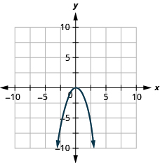
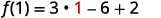
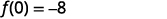
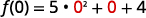
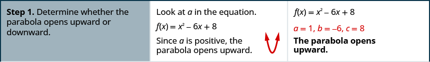
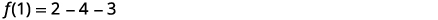
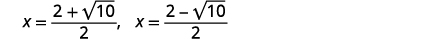

By the end of this section, you will be able to:
* Recognize the graph of a quadratic function
* Find the axis of symmetry and vertex of a parabola
* Find the intercepts of a parabola
* Graph quadratic functions using properties
* Solve maximum and minimum applications

Before you get started, take this readiness quiz.

1.  Graph the function
    <math xmlns="http://www.w3.org/1998/Math/MathML"><mrow><mi>f</mi><mrow><mo>(</mo><mi>x</mi><mo>)</mo></mrow><mo>=</mo><msup><mi>x</mi><mn>2</mn></msup></mrow></math>
    
    by plotting points.
    * * *
    {: data-type="newline"}
    
    If you missed this problem, review [\[link\]](/m63325#fs-id1167836683384).
2.  Solve:
    <math xmlns="http://www.w3.org/1998/Math/MathML"><mrow><mn>2</mn><msup><mi>x</mi><mn>2</mn></msup><mo>+</mo><mn>3</mn><mi>x</mi><mo>−</mo><mn>2</mn><mo>=</mo><mn>0</mn><mo>.</mo></mrow></math>
    
    * * *
    {: data-type="newline"}
    
    If you missed this problem, review [\[link\]](/m63362#fs-id1167836625705).
3.  Evaluate
    <math xmlns="http://www.w3.org/1998/Math/MathML"><mrow><mo>−</mo><mfrac><mi>b</mi><mrow><mn>2</mn><mi>a</mi></mrow></mfrac></mrow></math>
    
    when *a* = 3 and *b* = −6.
    * * *
    {: data-type="newline"}
    
    If you missed this problem, review [\[link\]](/m63303#fs-id1167832053133).
{: type="1"}

### Recognize the Graph of a Quadratic Function

Previously we very briefly looked at the function <math xmlns="http://www.w3.org/1998/Math/MathML"><mrow><mi>f</mi><mo stretchy="false">(</mo><mi>x</mi><mo stretchy="false">)</mo><mo>=</mo><msup><mi>x</mi><mn>2</mn></msup></mrow></math>

, which we called the square function. It was one of the first non-linear functions we looked at. Now we will graph functions of the form <math xmlns="http://www.w3.org/1998/Math/MathML"><mrow><mi>f</mi><mrow><mo>(</mo><mi>x</mi><mo>)</mo></mrow><mo>=</mo><mi>a</mi><msup><mi>x</mi><mn>2</mn></msup><mo>+</mo><mi>b</mi><mi>x</mi><mo>+</mo><mi>c</mi></mrow></math>

 if <math xmlns="http://www.w3.org/1998/Math/MathML"><mrow><mi>a</mi><mo>≠</mo><mn>0</mn><mo>.</mo></mrow></math>

 We call this kind of function a quadratic function.

Quadratic Function

A **quadratic function**{: data-type="term"}, where *a*, *b*, and *c* are real numbers and <math xmlns="http://www.w3.org/1998/Math/MathML"><mrow><mi>a</mi><mo>≠</mo><mn>0</mn><mo>,</mo></mrow></math>

 is a function of the form

<math xmlns="http://www.w3.org/1998/Math/MathML"><mrow><mi>f</mi><mrow><mo>(</mo><mi>x</mi><mo>)</mo></mrow><mo>=</mo><mi>a</mi><msup><mi>x</mi><mn>2</mn></msup><mo>+</mo><mi>b</mi><mi>x</mi><mo>+</mo><mi>c</mi></mrow></math>

We graphed the quadratic function <math xmlns="http://www.w3.org/1998/Math/MathML"><mrow><mi>f</mi><mo stretchy="false">(</mo><mi>x</mi><mo stretchy="false">)</mo><mo>=</mo><msup><mi>x</mi><mn>2</mn></msup></mrow></math>

 by plotting points.

  ![This figure shows an upward-opening parabola graphed on the x y-coordinate plane. The x-axis of the plane runs from negative 4 to 4. The y-axis of the plane runs from negative 2 to 6. The parabola has a vertex at (0, 0) and also passes through the points (-2, 4), (-1, 1), (1, 1), and (2, 4). To the right of the graph is a table of values with 3 columns. The first row is a header row and labels each column, &#x201C;x&#x201D;, &#x201C;f of x equals x squared&#x201D;, and &#x201C;the order pair x, f of x.&#x201D; In row 2, x equals negative 3, f of x equals x squared is 9 and the ordered pair x, f of x is the ordered pair negative 3, 9. In row 3, x equals negative 2, f of x equals x squared is 4 and the ordered pair x, f of x is the ordered pair negative 2, 4. In row 4, x equals negative 1, f of x equals x squared is 1 and the ordered pair x, f of x is the ordered pair negative 1, 1. In row 5, x equals 0, f of x equals x squared is 0 and the ordered pair x, f of x is the ordered pair 0, 0. In row 6, x equals 1, f of x equals x squared is 1 and the ordered pair x, f of x is the ordered pair 1, 1. In row 7, x equals 2, f of x equals x squared is 4 and the ordered pair x, f of x is the ordered pair 2, 4. In row 8, x equals 3, f of x equals x squared is 9 and the ordered pair x, f of x is the ordered pair 3, 9.](../resources/CNX_IntAlg_Figure_09_06_001_img.jpg)  Every quadratic function has a graph that looks like this. We call this figure a **parabola**{: data-type="term"}.

Let’s practice graphing a parabola by plotting a few points.

Graph <math xmlns="http://www.w3.org/1998/Math/MathML"><mrow><mi>f</mi><mrow><mo>(</mo><mi>x</mi><mo>)</mo></mrow><mo>=</mo><msup><mi>x</mi><mn>2</mn></msup><mo>−</mo><mn>1</mn><mo>.</mo></mrow></math>

We will graph the function by plotting points.

<table class="unnumbered unstyled" summary="Choose integer values for x, substitute them into the equation and simplify to find f of x. Record the values of the ordered pairs in the chart. The table of values for the function f of x equals x squared minus 1 has 2 columns. The first column is labeled x and the second column is labeled f of x. When x equals 0, f of x equals negative 1. When x equals 1, f of x equals 0. When x equals negative 1, f of x equals 0. When x equals 2, f of x equals 3. When x equals negative 2, f of x equals 3. Plot the points, and then connect them with a smooth curve. The result will be the graph of the function f of x equals negative 1. The figure shows an upward-opening parabola graphed on the x y-coordinate plane. The x-axis of the plane runs from negative 10 to 10. The y-axis of the plane runs from negative 10 to 10. The points identified in the table are plotted." data-label=""><tbody>
<tr valign="top">
<td data-valign="top" data-align="left">Choose integer values for <em>x</em>,
substitute them into the equation
and simplify to find <math xmlns="http://www.w3.org/1998/Math/MathML"><mrow><mi>f</mi><mrow><mo>(</mo><mi>x</mi><mo>)</mo></mrow></mrow></math>.

Record the values of the ordered pairs in the chart.</td>
<td data-valign="top" data-align="left"></td>
</tr>
<tr valign="top">
<td data-valign="top" data-align="left">Plot the points, and then connect
them with a smooth curve. The
result will be the graph of the
function <math xmlns="http://www.w3.org/1998/Math/MathML"><mrow><mi>f</mi><mrow><mo>(</mo><mi>x</mi><mo>)</mo></mrow><mo>=</mo><msup><mi>x</mi><mn>2</mn></msup><mo>−</mo><mn>1</mn></mrow></math>.</td>
<td data-valign="top" data-align="left"></td>
</tr>
</tbody></table>

Graph <math xmlns="http://www.w3.org/1998/Math/MathML"><mrow><mi>f</mi><mrow><mo>(</mo><mi>x</mi><mo>)</mo></mrow><mo>=</mo><mtext>−</mtext><msup><mi>x</mi><mn>2</mn></msup><mo>.</mo></mrow></math>

.

  

Graph <math xmlns="http://www.w3.org/1998/Math/MathML"><mrow><mi>f</mi><mrow><mo>(</mo><mi>x</mi><mo>)</mo></mrow><mo>=</mo><msup><mi>x</mi><mn>2</mn></msup><mo>+</mo><mn>1</mn><mo>.</mo></mrow></math>

  

All graphs of quadratic functions of the form *f* (*x*) = *ax*2 + *bx* + *c* are parabolas that open upward or downward. See [\[link\]](#CNX_IntAlg_Figure_09_06_003).

 ![This image shows 2 graphs side-by-side. The graph on the left shows an upward-opening parabola graphed on the x y-coordinate plane. The x-axis of the plane runs from negative 10 to 10. The y-axis of the plane runs from negative 10 to 10. The parabola has a vertex at (negative 2, negative 1) and passes through the points (negative 4, 3) and (0, 3). The general form for the equation of this graph is f of x equals a x squared plus b x plus c. The equation of this parabola is x squared plus 4 x plus 3. The leading coefficient, a, is greater than 0, so this parabola opens upward.The graph on the right shows an downward-opening parabola graphed on the x y-coordinate plane. The x-axis of the plane runs from negative 10 to 10. The y-axis of the plane runs from negative 10 to 10. The parabola has a vertex at (2, 7) and passes through the points (0, 3) and (4, 3). The general form for the equation of this graph is f of x equals a x squared plus b x plus c. The equation of this parabola is negative x squared plus 4 x plus 3. The leading coefficient, a, is less than 0, so this parabola opens downward.](../resources/CNX_IntAlg_Figure_09_06_003.jpg){: #CNX_IntAlg_Figure_09_06_003}

Notice that the only difference in the two functions is the negative sign before the quadratic term (*x*2 in the equation of the graph in [\[link\]](#CNX_IntAlg_Figure_09_06_003)). When the quadratic term, is positive, the parabola opens upward, and when the quadratic term is negative, the parabola opens downward.

Parabola Orientation

For the graph of the quadratic function *f* (*x*) = *ax*2 + *bx* + *c*, if

  

Determine whether each parabola opens upward or downward:

ⓐ <math xmlns="http://www.w3.org/1998/Math/MathML"><mrow><mi>f</mi><mrow><mo>(</mo><mi>x</mi><mo>)</mo></mrow><mo>=</mo><mn>−3</mn><msup><mi>x</mi><mn>2</mn></msup><mo>+</mo><mn>2</mn><mi>x</mi><mo>−</mo><mn>4</mn></mrow></math>

 ⓑ <math xmlns="http://www.w3.org/1998/Math/MathML"><mrow><mi>f</mi><mrow><mo>(</mo><mi>x</mi><mo>)</mo></mrow><mo>=</mo><mn>6</mn><msup><mi>x</mi><mn>2</mn></msup><mo>+</mo><mn>7</mn><mi>x</mi><mo>−</mo><mn>9</mn><mo>.</mo></mrow></math>

ⓐ* * *
{: data-type="newline"}

| Find the value of “*a*”. |  |
{: valign="top"}|  | Since the “*a*” is negative, the parabola will open downward. |
{: valign="top"}{: .unnumbered .unstyled summary="The standard form of a quadratic equation is f of x equals a x squared plus b x plus c. This function is f of x equals negative 3 x squared plus 2 x minus 4. Find the value of a, the coefficient of x squared. For this function, a equals negative 3. Since a is negative, the parabola will open downward." data-label=""}

ⓑ* * *
{: data-type="newline"}

| Find the value of “*a*”. |  |
{: valign="top"}|  | Since the “*a*” is positive, the parabola will open upward. |
{: valign="top"}{: .unnumbered .unstyled summary="The standard form of a quadratic equation is f of x equals a x squared plus b x plus c. This function is f of x equals negative 6 x squared plus 7 x minus 9. Find the value of a, the coefficient of x squared. For this function, a equals 6. Since a is positive, the parabola will open upward." data-label=""}

Determine whether the graph of each function is a parabola that opens upward or downward:

ⓐ <math xmlns="http://www.w3.org/1998/Math/MathML"><mrow><mi>f</mi><mrow><mo>(</mo><mi>x</mi><mo>)</mo></mrow><mo>=</mo><mn>2</mn><msup><mi>x</mi><mn>2</mn></msup><mo>+</mo><mn>5</mn><mi>x</mi><mo>−</mo><mn>2</mn></mrow></math>

 ⓑ <math xmlns="http://www.w3.org/1998/Math/MathML"><mrow><mi>f</mi><mrow><mo>(</mo><mi>x</mi><mo>)</mo></mrow><mo>=</mo><mn>−3</mn><msup><mi>x</mi><mn>2</mn></msup><mo>−</mo><mn>4</mn><mi>x</mi><mo>+</mo><mn>7</mn><mo>.</mo></mrow></math>

ⓐ up; ⓑ down

Determine whether the graph of each function is a parabola that opens upward or downward:

ⓐ <math xmlns="http://www.w3.org/1998/Math/MathML"><mrow><mi>f</mi><mrow><mo>(</mo><mi>x</mi><mo>)</mo></mrow><mo>=</mo><mn>−2</mn><msup><mi>x</mi><mn>2</mn></msup><mo>−</mo><mn>2</mn><mi>x</mi><mo>−</mo><mn>3</mn></mrow></math>

 ⓑ <math xmlns="http://www.w3.org/1998/Math/MathML"><mrow><mi>f</mi><mrow><mo>(</mo><mi>x</mi><mo>)</mo></mrow><mo>=</mo><mn>5</mn><msup><mi>x</mi><mn>2</mn></msup><mo>−</mo><mn>2</mn><mi>x</mi><mo>−</mo><mn>1</mn><mo>.</mo></mrow></math>

ⓐ down; ⓑ up

### Find the Axis of Symmetry and Vertex of a Parabola

Look again at [\[link\]](#CNX_IntAlg_Figure_09_06_003). Do you see that we could fold each parabola in half and then one side would lie on top of the other? The ‘fold line’ is a line of symmetry. We call it the **axis of symmetry**{: data-type="term"} of the parabola.

We show the same two graphs again with the axis of symmetry. See [\[link\]](#CNX_IntAlg_Figure_09_06_007).

 ![This image shows 2 graphs side-by-side. The graph on the left shows an upward-opening parabola and a dashed vertical line graphed on the x y-coordinate plane. The x-axis of the plane runs from negative 10 to 10. The y-axis of the plane runs from negative 10 to 10. The parabola has a vertex at (negative 2, negative 1) and passes through the points (negative 4, 3) and (0, 3). The equation of this parabola is x squared plus 4 x plus 3. The vertical line passes through the point (negative 2, 0) and has the equation x equals negative 2. The graph on the right shows an downward-opening parabola and a dashed vertical line graphed on the x y-coordinate plane. The x-axis of the plane runs from negative 10 to 10. The y-axis of the plane runs from negative 10 to 10. The parabola has a vertex at (2, 7) and passes through the points (0, 3) and (4, 3). The equation of this parabola is negative x squared plus 4 x plus 3. The vertical line passes through the point (2, 0) and has the equation x equals 2.](../resources/CNX_IntAlg_Figure_09_06_007.jpg){: #CNX_IntAlg_Figure_09_06_007}

The equation of the axis of symmetry can be derived by using the Quadratic Formula. We will omit the derivation here and proceed directly to using the result. The equation of the axis of symmetry of the graph of *f* (*x*) = *ax*2 + *bx* + *c* is <math xmlns="http://www.w3.org/1998/Math/MathML"><mrow><mi>x</mi><mo>=</mo><mo>−</mo><mfrac><mi>b</mi><mrow><mn>2</mn><mi>a</mi></mrow></mfrac><mo>.</mo></mrow></math>

So to find the equation of symmetry of each of the parabolas we graphed above, we will substitute into the formula <math xmlns="http://www.w3.org/1998/Math/MathML"><mrow><mi>x</mi><mo>=</mo><mo>−</mo><mfrac><mi>b</mi><mrow><mn>2</mn><mi>a</mi></mrow></mfrac><mo>.</mo></mrow></math>

  ![Compare the function f of x equals x squared plus 4 x plus 3 to the standard form of a quadratic function, f of x equals a x squared plus b x plus c. The axis of symmetry is the line x equals negative b divided by the product 2 a. Substituting for b and a yields x equals negative 4 divided by the product 2 times 1. The axis of symmetry equals negative 2. Next, compare the function f of x equals negative x squared plus 4 x plus 3 to the standard form of a quadratic function, f of x equals a x squared plus b x plus c. The axis of symmetry is the line x equals negative b divided by the product 2 a. Substituting for b and a yields x equals negative 4 divided by the product 2 times negative 1. The axis of symmetry equals 2.](../resources/CNX_IntAlg_Figure_09_06_008_img.jpg)  Notice that these are the equations of the dashed blue lines on the graphs.

The point on the parabola that is the lowest (parabola opens up), or the highest (parabola opens down), lies on the axis of symmetry. This point is called the **vertex**{: data-type="term"} of the parabola.

We can easily find the coordinates of the vertex, because we know it is on the axis of symmetry. This means its* * *
{: data-type="newline"}

*x*-coordinate is <math xmlns="http://www.w3.org/1998/Math/MathML"><mrow><mo>−</mo><mfrac><mi>b</mi><mrow><mn>2</mn><mi>a</mi></mrow></mfrac><mo>.</mo></mrow></math>

 To find the *y*-coordinate of the vertex we substitute the value of the *x*-coordinate into the quadratic function.

  ![For the function f of x equals x squared plus 4 x plus 3, the axis of symmetry is x equals negative 2. The vertex is the point on the parabola with x-coordinate negative 2. Substitute x equals negative 2 into the function f of x equals x squared plus 4 x plus 3. F of x equals the square of negative 2 plus 4 times negative 2 plus 3, so f of x equals negative 1. The vertex is the point (negative 2, negative 1). For the function f of x equals negative x squared plus 4 x plus 3, the axis of symmetry is x equals 2. The vertex is the point on the parabola with x-coordinate 2. Substitute x equals 2 into the function f of x equals x squared plus 4 x plus 3. F of x equals 2 squared plus 4 times 2 plus 3, so f of x equals 7. The vertex is the point (2, 7).](../resources/CNX_IntAlg_Figure_09_06_009_img.jpg)  

Axis of Symmetry and Vertex of a Parabola

The graph of the function *f* (*x*) = *ax*2 + *bx* + *c* is a parabola where:

* the axis of symmetry is the vertical line
  <math xmlns="http://www.w3.org/1998/Math/MathML"><mrow><mi>x</mi><mo>=</mo><mo>−</mo><mfrac><mi>b</mi><mrow><mn>2</mn><mi>a</mi></mrow></mfrac><mo>.</mo></mrow></math>

* the vertex is a point on the axis of symmetry, so its *x*-coordinate is
  <math xmlns="http://www.w3.org/1998/Math/MathML"><mrow><mo>−</mo><mfrac><mi>b</mi><mrow><mn>2</mn><mi>a</mi></mrow></mfrac><mo>.</mo></mrow></math>

* the *y*-coordinate of the vertex is found by substituting
  <math xmlns="http://www.w3.org/1998/Math/MathML"><mrow><mi>x</mi><mo>=</mo><mo>−</mo><mfrac><mi>b</mi><mrow><mn>2</mn><mi>a</mi></mrow></mfrac></mrow></math>
  
  into the quadratic equation.
{: data-bullet-style="bullet"}

For the graph of <math xmlns="http://www.w3.org/1998/Math/MathML"><mrow><mi>f</mi><mrow><mo>(</mo><mi>x</mi><mo>)</mo></mrow><mo>=</mo><mn>3</mn><msup><mi>x</mi><mn>2</mn></msup><mo>−</mo><mn>6</mn><mi>x</mi><mo>+</mo><mn>2</mn></mrow></math>

 find:

ⓐ the axis of symmetry ⓑ the vertex.

ⓐ* * *
{: data-type="newline"}

<table class="unnumbered unstyled can-break" summary="Compare the function f of x equals 3 x squared minus 6 x plus 2 to the standard form of a quadratic function f of x equals a x squared plus b x plus c. The axis of symmetry is the vertical line x equals negative b divided by the product 2 a. Substitute the values a equals 3 and b equals negative 6 into the equation of the line of symmetry. X equals negative 6 divided by the product 2 times 3. Simplify. The axis of symmetry is the line x equals 1." data-label=""><tbody>
<tr valign="top">
<td data-valign="top" data-align="left" />
<td data-valign="top" data-align="left"></td>
</tr>
<tr valign="top">
<td data-valign="top" data-align="left">The axis of symmetry is the vertical line
<math xmlns="http://www.w3.org/1998/Math/MathML"><mrow><mi>x</mi><mo>=</mo><mo>−</mo><mfrac><mi>b</mi><mrow><mn>2</mn><mi>a</mi></mrow></mfrac></mrow></math>.</td>
<td data-valign="top" data-align="left" />
</tr>
<tr valign="top">
<td data-valign="top" data-align="left">Substitute the values of <math xmlns="http://www.w3.org/1998/Math/MathML"><mrow><mi>a</mi><mo>,</mo><mi>b</mi></mrow></math> into the
equation.</td>
<td data-valign="top" data-align="left"></td>
</tr>
<tr valign="top">
<td data-valign="top" data-align="left">Simplify.</td>
<td data-valign="top" data-align="left"></td>
</tr>
<tr valign="top">
<td data-valign="top" data-align="left" />
<td data-valign="top" data-align="left">The axis of symmetry is the line <math xmlns="http://www.w3.org/1998/Math/MathML"><mrow><mi>x</mi><mo>=</mo><mn>1</mn></mrow></math>.</td>
</tr>
</tbody></table>
ⓑ* * *
{: data-type="newline"}

<table class="unnumbered unstyled" summary="Write the function f of x equals 3 x squared minus 6 x plus 2. The vertex is a point on the line of symmetry, so its x-coordinate will be x equals 1. Find f of 1. F of 1 equals 3 times 1 squared minus 6 times 1 plus 2. Simplify f of 1 equals 3 times 1 minus 6 plus 2, which equals negative 1. This result is the y-coordinate. The vertex is the point (1, negative 1)." data-label=""><tbody>
<tr valign="top">
<td data-valign="top" data-align="left" />
<td data-valign="top" data-align="left"></td>
</tr>
<tr valign="top">
<td data-valign="top" data-align="left">The vertex is a point on the line of
symmetry, so its <em>x</em>-coordinate will be
<math xmlns="http://www.w3.org/1998/Math/MathML"><mrow><mi>x</mi><mo>=</mo><mn>1</mn></mrow></math>.
Find <math xmlns="http://www.w3.org/1998/Math/MathML"><mrow><mi>f</mi><mrow><mo>(</mo><mn>1</mn><mo>)</mo></mrow></mrow></math>.</td>
<td data-valign="bottom" data-align="left"></td>
</tr>
<tr valign="top">
<td data-valign="top" data-align="left">Simplify.</td>
<td data-valign="top" data-align="left"></td>
</tr>
<tr valign="top">
<td data-valign="top" data-align="left">The result is the <em>y</em>-coordinate.</td>
<td data-valign="top" data-align="left"></td>
</tr>
<tr valign="top">
<td data-valign="top" data-align="left" />
<td data-valign="top" data-align="left">The vertex is <math xmlns="http://www.w3.org/1998/Math/MathML"><mrow><mrow><mo>(</mo><mrow><mn>1</mn><mo>,</mo><mn>−1</mn></mrow><mo>)</mo></mrow></mrow></math>.</td>
</tr>
</tbody></table>

For the graph of <math xmlns="http://www.w3.org/1998/Math/MathML"><mrow><mi>f</mi><mrow><mo>(</mo><mi>x</mi><mo>)</mo></mrow><mo>=</mo><mn>2</mn><msup><mi>x</mi><mn>2</mn></msup><mo>−</mo><mn>8</mn><mi>x</mi><mo>+</mo><mn>1</mn></mrow></math>

 find:

ⓐ the axis of symmetry ⓑ the vertex.

ⓐ <math xmlns="http://www.w3.org/1998/Math/MathML"><mrow><mi>x</mi><mo>=</mo><mn>2</mn><mo>;</mo></mrow></math>

 ⓑ <math xmlns="http://www.w3.org/1998/Math/MathML"><mrow><mrow><mo>(</mo><mrow><mn>2</mn><mo>,</mo></mrow></mrow><mrow> <mrow><mn>−7</mn></mrow><mo>)</mo></mrow></mrow></math>

For the graph of <math xmlns="http://www.w3.org/1998/Math/MathML"><mrow><mi>f</mi><mrow><mo>(</mo><mi>x</mi><mo>)</mo></mrow><mo>=</mo><mn>2</mn><msup><mi>x</mi><mn>2</mn></msup><mo>−</mo><mn>4</mn><mi>x</mi><mo>−</mo><mn>3</mn></mrow></math>

 find:

ⓐ the axis of symmetry ⓑ the vertex.

ⓐ <math xmlns="http://www.w3.org/1998/Math/MathML"><mrow><mi>x</mi><mo>=</mo><mn>1</mn><mo>;</mo></mrow></math>

 ⓑ <math xmlns="http://www.w3.org/1998/Math/MathML"><mrow><mrow><mo>(</mo><mrow><mn>1</mn><mo>,</mo><mrow> <mrow><mn>−5</mn></mrow><mo>)</mo></mrow></mrow></mrow></mrow></math>

### Find the Intercepts of a Parabola

When we graphed linear equations, we often used the *x*- and *y*-intercepts to help us graph the lines. Finding the coordinates of the intercepts will help us to graph parabolas, too.

Remember, at the *y*-intercept the value of *x* is zero. So to find the *y*-intercept, we substitute *x* = 0 into the function.

Let’s find the *y*-intercepts of the two parabolas shown in [\[link\]](#CNX_IntAlg_Figure_09_06_012).

 ![This image shows 2 graphs side-by-side. The graph on the left shows an upward-opening parabola and a dashed vertical line graphed on the x y-coordinate plane. The x-axis of the plane runs from negative 10 to 10. The y-axis of the plane runs from negative 10 to 10. The parabola has a vertex at (negative 2, negative 1) and passes through the points (negative 4, 3) and (0, 3). The vertical line is an axis of symmetry for the parabola, and passes through the point (negative 2, 0). It has the equation x equals negative 2. The equation of this parabola is x squared plus 4 x plus 3. When x equals 0, f of 0 equals 0 squared plus 4 times 0 plus 3. F of 0 equals 3. The y-intercept of the graph is the point (0, 3). The graph on the right shows an downward-opening parabola and a dashed vertical line graphed on the x y-coordinate plane. The x-axis of the plane runs from negative 10 to 10. The y-axis of the plane runs from negative 10 to 10. The parabola has a vertex at (2, 7) and passes through the points (0, 3) and (4, 3). The vertical line is an axis of symmetry for the parabola and passes through the point (2, 0). It has the equation x equals 2. The equation of this parabola is negative x squared plus 4 x plus 3. When x equals 0, f of 0 equals negative 0 squared plus 4 times 0 plus 3. F of 0 equals 3. The y-intercept of the graph is the point (0, 3).](../resources/CNX_IntAlg_Figure_09_06_012.jpg){: #CNX_IntAlg_Figure_09_06_012}

An *x*-intercept results when the value of *f* (*x*) is zero. To find an *x*-intercept, we let *f* (*x*) = 0. In other words, we will need to solve the equation 0 = *ax*2 + *bx* + *c* for *x*.

<math xmlns="http://www.w3.org/1998/Math/MathML"><mtable><mtr><mtd columnalign="right"><mi>f</mi><mrow><mo>(</mo><mi>x</mi><mo>)</mo></mrow></mtd><mtd columnalign="left"><mo>=</mo></mtd><mtd columnalign="left"><mi>a</mi><msup><mi>x</mi><mn>2</mn></msup><mo>+</mo><mi>b</mi><mi>x</mi><mo>+</mo><mi>c</mi></mtd></mtr><mtr><mtd columnalign="right"><mn>0</mn></mtd><mtd columnalign="left"><mo>=</mo></mtd><mtd columnalign="left"><mi>a</mi><msup><mi>x</mi><mn>2</mn></msup><mo>+</mo><mi>b</mi><mi>x</mi><mo>+</mo><mi>c</mi></mtd></mtr></mtable></math>

Solving quadratic equations like this is exactly what we have done earlier in this chapter!

We can now find the *x*-intercepts of the two parabolas we looked at. First we will find the *x*-intercepts of the parabola whose function is *f* (*x*) = *x*2 + 4*x* + 3.

|  |  |
{: valign="top"}| Let <math xmlns="http://www.w3.org/1998/Math/MathML"><mrow><mi>f</mi><mrow><mo>(</mo><mi>x</mi><mo>)</mo></mrow><mo>=</mo><mn>0</mn></mrow></math>

. |  |
{: valign="top"}| Factor. |  |
{: valign="top"}| Use the Zero Product Property. |  |
{: valign="top"}| Solve. |  |
{: valign="top"}|  | The *x*-intercepts are <math xmlns="http://www.w3.org/1998/Math/MathML"><mrow><mrow><mo>(</mo><mrow><mn>−1</mn><mo>,</mo><mn>0</mn></mrow><mo>)</mo></mrow></mrow></math>

 and <math xmlns="http://www.w3.org/1998/Math/MathML"><mrow><mrow><mo>(</mo><mrow><mn>−3</mn><mo>,</mo><mn>0</mn></mrow><mo>)</mo></mrow></mrow></math>

. |
{: valign="top"}{: .unnumbered .unstyled summary="F of x equals x squared plus 4 x plus 3. Let f of x equal 0. 0 equals x squared plus 4 x plus 3. Factor. 0 equals the product of x plus 1 and x plus 3. Use the Zero Product Property. Then x plus 1 equals 0 or x plus 3 equals 0. Solve. X equals negative 1 or x equals negative 3. The x-intercepts are the points (negative 1, 0) and (negative 3, 0)." data-label=""}

Now we will find the *x*-intercepts of the parabola whose function is *f* (*x*) = *−x*2 + 4*x* + 3.

<table class="unnumbered unstyled can-break" summary="F of x equals negative x squared plus 4 x plus 3. Let f of x equal 0. 0 equals negative x squared plus 4 x plus 3. The quadratic does not factor, so we use the Quadratic Formula. X equals the quotient negative b plus or minus the square root of the difference b squared minus 4 a c divided by 2 a. a equals negative 1, b equals 4, and c equals 3. X equals the quotient negative 4 plus or minus the square root of the difference 4 squared minus the product 4 times negative 1 times 3 divided by the product 2 times negative 1. Simplify x equals the quotient negative 4 plus or minus square root 28 divided by negative 2. X equals the quotient negative 4 plus or minus square root 28 divided by negative 2. X equals the quotient negative 4 plus or minus 2 square root 7 divided by negative 2. X equals the quotient of the product negative 2 times the expression 2 plus or minus square root 7 divided by negative 2. X equals 2 plus or minus square root 7. The intercepts are the points (2 plus square root 7, 0) and (2 minus square root 7, 0)." data-label=""><tbody>
<tr valign="top">
<td data-valign="top" data-align="left" />
<td data-valign="top" data-align="left"></td>
</tr>
<tr valign="top">
<td data-valign="top" data-align="left">Let <math xmlns="http://www.w3.org/1998/Math/MathML"><mrow><mi>f</mi><mrow><mo>(</mo><mi>x</mi><mo>)</mo></mrow><mo>=</mo><mn>0</mn></mrow></math>.</td>
<td data-valign="top" data-align="left"></td>
</tr>
<tr valign="top">
<td data-valign="top" data-align="left">This quadratic does not factor, so
we use the Quadratic Formula.</td>
<td data-valign="top" data-align="left"></td>
</tr>
<tr valign="top">
<td data-valign="top" data-align="left"><math xmlns="http://www.w3.org/1998/Math/MathML"><mrow><mi>a</mi><mo>=</mo><mn>−1</mn><mo>,</mo><mi>b</mi><mo>=</mo><mn>4</mn><mo>,</mo><mi>c</mi><mo>=</mo><mn>3</mn></mrow></math></td>
<td data-valign="top" data-align="left"></td>
</tr>
<tr valign="top">
<td data-valign="top" data-align="left">Simplify.</td>
<td data-valign="top" data-align="left"></td>
</tr>
<tr valign="top">
<td data-valign="top" data-align="left" />
<td data-valign="top" data-align="left"></td>
</tr>
<tr valign="top">
<td data-valign="top" data-align="left" />
<td data-valign="top" data-align="left"></td>
</tr>
<tr valign="top">
<td data-valign="top" data-align="left" />
<td data-valign="top" data-align="left"></td>
</tr>
<tr valign="top">
<td data-valign="top" data-align="left" />
<td data-valign="top" data-align="left">The <em>x</em>-intercepts are <math xmlns="http://www.w3.org/1998/Math/MathML"><mrow><mrow><mo>(</mo><mrow><mn>2</mn><mo>+</mo><msqrt><mn>7</mn></msqrt><mo>,</mo><mn>0</mn></mrow><mo>)</mo></mrow></mrow></math> and
<math xmlns="http://www.w3.org/1998/Math/MathML"><mrow><mrow><mo>(</mo><mrow><mn>2</mn><mo>−</mo><msqrt><mn>7</mn></msqrt><mo>,</mo><mn>0</mn></mrow><mo>)</mo></mrow></mrow></math>.</td>
</tr>
</tbody></table>

We will use the decimal approximations of the *x*-intercepts, so that we can locate these points on the graph,

<math xmlns="http://www.w3.org/1998/Math/MathML"><mrow><mtable><mtr><mtd columnalign="left"><mrow><mo>(</mo><mrow><mn>2</mn><mo>+</mo><msqrt><mn>7</mn></msqrt><mo>,</mo><mn>0</mn></mrow><mo>)</mo></mrow><mo>≈</mo><mrow><mo>(</mo><mrow><mn>4.6</mn><mo>,</mo><mn>0</mn></mrow><mo>)</mo></mrow></mtd><mtd /><mtd /><mtd /><mtd /><mtd columnalign="left"><mrow><mo>(</mo><mrow><mn>2</mn><mo>−</mo><msqrt><mn>7</mn></msqrt><mo>,</mo><mn>0</mn></mrow><mo>)</mo></mrow><mo>≈</mo><mrow><mo>(</mo><mrow><mn>−0.6</mn><mo>,</mo><mn>0</mn></mrow><mo>)</mo></mrow></mtd></mtr></mtable></mrow></math>

Do these results agree with our graphs? See [\[link\]](#CNX_IntAlg_Figure_09_06_015).

 ![This image shows 2 graphs side-by-side. The graph on the left shows the upward-opening parabola defined by the function f of x equals x squared plus 4 x plus 3 and a dashed vertical line, x equals negative 2, graphed on the x y-coordinate plane. The x-axis of the plane runs from negative 10 to 10. The y-axis of the plane runs from negative 10 to 10. The parabola has a vertex at (negative 2, negative 1). The y-intercept is (0, 3) and the x-intercepts are (negative 1, 0) and (negative 3, 0). The graph on the right shows the downward-opening parabola defined by the function f of x equals negative x squared plus 4 x plus 3 and a dashed vertical line, x equals 2, graphed on the x y-coordinate plane. The x-axis of the plane runs from negative 10 to 10. The y-axis of the plane runs from negative 10 to 10. The parabola has a vertex at (2, 7). The y-intercept is (0, 3) and the x-intercepts are (2 plus square root 7, 0), approximately (4.6, 0) and (2 minus square root, 0), approximately (negative 0.6, 0).](../resources/CNX_IntAlg_Figure_09_06_015.jpg){: #CNX_IntAlg_Figure_09_06_015}

Find the Intercepts of a Parabola

To find the intercepts of a parabola whose function is <math xmlns="http://www.w3.org/1998/Math/MathML"><mrow><mi>f</mi><mrow><mo>(</mo><mi>x</mi><mo>)</mo></mrow><mo>=</mo><mi>a</mi><msup><mi>x</mi><mn>2</mn></msup><mo>+</mo><mi>b</mi><mi>x</mi><mo>+</mo><mi>c</mi><mo>:</mo></mrow></math>

<math xmlns="http://www.w3.org/1998/Math/MathML"><mrow><mtable><mtr><mtd columnalign="center"><mtext mathvariant="bold-italic">y</mtext><mtext mathvariant="bold">-intercept</mtext></mtd><mtd /><mtd /><mtd /><mtd /><mtd columnalign="center"><mtext mathvariant="bold-italic">x</mtext><mtext mathvariant="bold">-intercepts</mtext></mtd></mtr><mtr><mtd columnalign="center"><mtext>Let</mtext><mspace width="0.2em" /><mi>x</mi><mo>=</mo><mn>0</mn><mspace width="0.2em" /><mtext>and solve for</mtext><mspace width="0.2em" /><mi>f</mi><mrow><mo>(</mo><mi>x</mi><mo>)</mo></mrow><mo>.</mo></mtd><mtd /><mtd /><mtd /><mtd /><mtd columnalign="center"><mtext>Let</mtext><mspace width="0.2em" /><mi>f</mi><mrow><mo>(</mo><mi>x</mi><mo>)</mo></mrow><mo>=</mo><mn>0</mn><mspace width="0.2em" /><mtext>and solve for</mtext><mspace width="0.2em" /><mi>x</mi><mo>.</mo></mtd></mtr></mtable></mrow></math>

Find the intercepts of the parabola whose function is <math xmlns="http://www.w3.org/1998/Math/MathML"><mrow><mi>f</mi><mrow><mo>(</mo><mi>x</mi><mo>)</mo></mrow><mo>=</mo><msup><mi>x</mi><mn>2</mn></msup><mo>−</mo><mn>2</mn><mi>x</mi><mo>−</mo><mn>8</mn><mo>.</mo></mrow></math>

<table class="unnumbered unstyled can-break" summary="To find the y-intercept, let x equal 0 and solve for f of x. f of x equals x squared minus 2 x minus 8. F of 0 equals 0 squared minus 2 times 0 minus 8 which simplifies to yield f of 0 equals negative 8. When x equals 0, then f of 0 equals negative 8. The y-intercept is the point (0, negative 8). To find the x-intercept, let f of x equal 0 and solve for x. f of x equals x squared minus 2 x minus 8. 0 equals x squared minus 2 x minus 8. Solve by factoring. 0 equals the product of x minus 4 and x plus 2. 0 equals x minus 4 or 0 equals x plus 2. So x equals 4 or x equals negative 2. When f of x equals 0, then x equals 4 or x equals negative 2. The x-intercepts are the points (4, 0) and (negative 2, 0)." data-label=""><tbody>
<tr valign="top">
<td data-valign="top" data-align="left">To find the <strong><em>y</em>-</strong>intercept, let <math xmlns="http://www.w3.org/1998/Math/MathML"><mrow><mi>x</mi><mo>=</mo><mn>0</mn></mrow></math> and
solve for <math xmlns="http://www.w3.org/1998/Math/MathML"><mrow><mi>f</mi><mrow><mo>(</mo><mi>x</mi><mo>)</mo></mrow></mrow></math>.</td>
<td />
<td data-valign="top" data-align="left"></td>
</tr>
<tr valign="top">
<td data-valign="top" data-align="left" />
<td />
<td data-valign="top" data-align="left"></td>
</tr>
<tr valign="top">
<td data-valign="top" data-align="left" />
<td />
<td data-valign="top" data-align="left"></td>
</tr>
<tr valign="top">
<td data-valign="top" data-align="left" />
<td colspan="2" data-valign="top" data-align="left">When <math xmlns="http://www.w3.org/1998/Math/MathML"><mrow><mi>x</mi><mo>=</mo><mn>0</mn></mrow></math>, then <math xmlns="http://www.w3.org/1998/Math/MathML"><mrow><mi>f</mi><mrow><mo>(</mo><mn>0</mn><mo>)</mo></mrow><mo>=</mo><mn>−8</mn></mrow></math>.
The <em>y</em><strong>-</strong>intercept is the point <math xmlns="http://www.w3.org/1998/Math/MathML"><mrow><mrow><mo>(</mo><mrow><mn>0</mn><mo>,</mo><mn>−8</mn></mrow><mo>)</mo></mrow></mrow></math>.</td>
</tr>
<tr valign="top">
<td colspan="2" data-valign="top" data-align="left">To find the <strong><em>x</em>-</strong>intercept, let <math xmlns="http://www.w3.org/1998/Math/MathML"><mrow><mi>f</mi><mrow><mo>(</mo><mi>x</mi><mo>)</mo></mrow><mo>=</mo><mn>0</mn></mrow></math> and
solve for <math xmlns="http://www.w3.org/1998/Math/MathML"><mi>x</mi></math>.</td>
<td data-valign="top" data-align="left"></td>
</tr>
<tr valign="top">
<td data-valign="top" data-align="left" />
<td />
<td data-valign="top" data-align="left"></td>
</tr>
<tr valign="top">
<td data-valign="top" data-align="left">Solve by factoring.</td>
<td />
<td data-valign="top" data-align="left"></td>
</tr>
<tr valign="top">
<td data-valign="top" data-align="left" />
<td colspan="2" data-valign="top" data-align="center"></td>
</tr>
<tr valign="top">
<td data-valign="top" data-align="left" />
<td colspan="2" data-valign="top" data-align="center"></td>
</tr>
<tr valign="top">
<td data-valign="top" data-align="left" />
<td colspan="2" data-valign="top" data-align="left">When <math xmlns="http://www.w3.org/1998/Math/MathML"><mrow><mi>f</mi><mrow><mo>(</mo><mi>x</mi><mo>)</mo></mrow><mo>=</mo><mn>0</mn></mrow></math>, then <math xmlns="http://www.w3.org/1998/Math/MathML"><mrow><mi>x</mi><mo>=</mo><mn>4</mn><mspace width="0.2em" /><mtext>or</mtext><mspace width="0.2em" /><mi>x</mi><mo>=</mo><mn>−2</mn></mrow></math>.
The <em>x</em><strong>-</strong>intercepts are the points <math xmlns="http://www.w3.org/1998/Math/MathML"><mrow><mrow><mo>(</mo><mrow><mn>4</mn><mo>,</mo><mn>0</mn></mrow><mo>)</mo></mrow></mrow></math> and
<math xmlns="http://www.w3.org/1998/Math/MathML"><mrow><mrow><mo>(</mo><mrow><mn>−2</mn><mo>,</mo><mn>0</mn></mrow><mo>)</mo></mrow></mrow></math>.</td>
</tr>
</tbody></table>

Find the intercepts of the parabola whose function is <math xmlns="http://www.w3.org/1998/Math/MathML"><mrow><mi>f</mi><mrow><mo>(</mo><mi>x</mi><mo>)</mo></mrow><mo>=</mo><msup><mi>x</mi><mn>2</mn></msup><mo>+</mo><mn>2</mn><mi>x</mi><mo>−</mo><mn>8</mn><mo>.</mo></mrow></math>

*y*-intercept: <math xmlns="http://www.w3.org/1998/Math/MathML"><mrow><mrow><mo>(</mo><mrow><mn>0</mn><mo>,</mo><mrow> <mrow><mn>−8</mn></mrow><mo>)</mo></mrow></mrow></mrow></mrow></math>

 *x*-intercepts <math xmlns="http://www.w3.org/1998/Math/MathML"><mrow><mrow><mo>(</mo><mrow><mn>−4</mn><mo>,</mo><mrow><mn>0</mn><mo>)</mo></mrow></mrow></mrow><mo>,</mo><mrow><mo>(</mo><mrow><mn>2</mn><mo>,</mo><mrow><mn>0</mn><mo>)</mo></mrow></mrow></mrow></mrow></math>

Find the intercepts of the parabola whose function is <math xmlns="http://www.w3.org/1998/Math/MathML"><mrow><mi>f</mi><mrow><mo>(</mo><mi>x</mi><mo>)</mo></mrow><mo>=</mo><msup><mi>x</mi><mn>2</mn></msup><mo>−</mo><mn>4</mn><mi>x</mi><mo>−</mo><mn>12</mn><mo>.</mo></mrow></math>

*y*-intercept: <math xmlns="http://www.w3.org/1998/Math/MathML"><mrow><mrow><mo>(</mo><mrow><mn>0</mn><mo>,</mo><mrow> <mrow><mn>−12</mn></mrow><mo>)</mo></mrow></mrow></mrow></mrow></math>

 *x*-intercepts <math xmlns="http://www.w3.org/1998/Math/MathML"><mrow><mrow><mo>(</mo><mrow><mn>−2</mn><mo>,</mo><mrow><mn>0</mn><mo>)</mo></mrow></mrow></mrow><mo>,</mo><mrow><mo>(</mo><mrow><mn>6</mn><mo>,</mo><mrow><mn>0</mn><mo>)</mo></mrow></mrow></mrow></mrow></math>

In this chapter, we have been solving quadratic equations of the form *ax*2 + *bx* + *c* = 0. We solved for *x* and the results were the solutions to the equation.

We are now looking at quadratic functions of the form *f* (*x*) = *ax*2 + *bx* + *c*. The graphs of these functions are parabolas. The *x*{::}**-**intercepts of the parabolas occur where *f* (*x*) = 0.

For example:

<math xmlns="http://www.w3.org/1998/Math/MathML"><mrow><mtable><mtr><mtd columnalign="center"><mtext mathvariant="bold">Quadratic equation</mtext></mtd><mtd /><mtd /><mtd /><mtd /><mtd /><mtd /><mtd /><mtd columnalign="center"><mspace width="4em" /><mtext mathvariant="bold">Quadratic function</mtext></mtd></mtr> <mtr><mtd columnalign="center"><mtable><mtr /><mtr><mtd columnalign="right"><msup><mi>x</mi><mn>2</mn></msup><mo>−</mo><mn>2</mn><mi>x</mi><mo>−</mo><mn>15</mn></mtd><mtd columnalign="left"><mo>=</mo></mtd><mtd columnalign="left"><mn>0</mn></mtd></mtr><mtr><mtd columnalign="right"><mrow><mo>(</mo><mrow><mi>x</mi><mo>−</mo><mn>5</mn></mrow><mo>)</mo></mrow><mrow><mo>(</mo><mrow><mi>x</mi><mo>+</mo><mn>3</mn></mrow><mo>)</mo></mrow></mtd><mtd columnalign="left"><mo>=</mo></mtd><mtd columnalign="left"><mn>0</mn></mtd></mtr><mtr><mtd columnalign="right"><mi>x</mi><mo>−</mo><mn>5</mn><mo>=</mo><mn>0</mn><mspace width="0.8em" /><mi>x</mi><mo>+</mo><mn>3</mn></mtd><mtd columnalign="left"><mo>=</mo></mtd><mtd columnalign="left"><mn>0</mn></mtd></mtr><mtr><mtd columnalign="right"><mi>x</mi><mo>=</mo><mn>5</mn><mspace width="2.3em" /><mi>x</mi></mtd><mtd columnalign="left"><mo>=</mo></mtd><mtd columnalign="left"><mn>−3</mn></mtd></mtr></mtable></mtd><mtd /><mtd /><mtd /><mtd columnalign="center"><mtable><mtr><mtd columnalign="center"><mtext>Let</mtext><mspace width="0.2em" /><mi>f</mi><mrow><mo>(</mo><mi>x</mi><mo>)</mo></mrow><mo>=</mo><mn>0</mn><mo>.</mo></mtd></mtr><mtr /><mtr /></mtable></mtd><mtd /><mtd /><mtd /><mtd columnalign="center"><mspace width="4em" /><mtable><mtr><mtd columnalign="right"><mi>f</mi><mrow><mo>(</mo><mi>x</mi><mo>)</mo></mrow></mtd><mtd columnalign="left"><mo>=</mo></mtd><mtd columnalign="left"><msup><mi>x</mi><mn>2</mn></msup><mo>−</mo><mn>2</mn><mi>x</mi><mo>−</mo><mn>15</mn></mtd></mtr><mtr><mtd columnalign="right"><mn>0</mn></mtd><mtd columnalign="left"><mo>=</mo></mtd><mtd columnalign="left"><msup><mi>x</mi><mn>2</mn></msup><mo>−</mo><mn>2</mn><mi>x</mi><mo>−</mo><mn>15</mn></mtd></mtr><mtr><mtd columnalign="right"><mn>0</mn></mtd><mtd columnalign="left"><mo>=</mo></mtd><mtd columnalign="left"><mrow><mo>(</mo><mrow><mi>x</mi><mo>−</mo><mn>5</mn></mrow><mo>)</mo></mrow><mrow><mo>(</mo><mrow><mi>x</mi><mo>+</mo><mn>3</mn></mrow><mo>)</mo></mrow></mtd></mtr><mtr><mtd columnalign="right"><mi>x</mi><mo>−</mo><mn>5</mn></mtd><mtd columnalign="left"><mo>=</mo></mtd><mtd columnalign="left"><mn>0</mn><mspace width="0.8em" /><mi>x</mi><mo>+</mo><mn>3</mn><mo>=</mo><mn>0</mn></mtd></mtr><mtr><mtd columnalign="right"><mi>x</mi></mtd><mtd columnalign="left"><mo>=</mo></mtd><mtd columnalign="left"><mn>5</mn><mspace width="2.3em" /><mi>x</mi><mo>=</mo><mn>−3</mn></mtd></mtr></mtable></mtd></mtr><mtr><mtd /><mtd /><mtd /><mtd /><mtd /><mtd /><mtd /><mtd /><mtd columnalign="center"><mspace width="4em" /><mrow><mo>(</mo><mrow><mn>5</mn><mo>,</mo><mn>0</mn></mrow><mo>)</mo></mrow><mspace width="0.2em" /><mtext>and</mtext><mspace width="0.2em" /><mrow><mo>(</mo><mrow><mn>−3</mn><mo>,</mo><mn>0</mn></mrow><mo>)</mo></mrow></mtd></mtr><mtr><mtd /><mtd /><mtd /><mtd /><mtd /><mtd /><mtd /><mtd /><mtd columnalign="center"><mspace width="4em" /><mi>x</mi><mtext>-intercepts</mtext></mtd></mtr></mtable></mrow></math>

The solutions of the quadratic function are the *x* values of the *x*{::}**-**intercepts.

Earlier, we saw that quadratic equations have 2, 1, or 0 solutions. The graphs below show examples of parabolas for these three cases. Since the solutions of the functions give the *x*{::}**-**intercepts of the graphs, the number of *x*{::}**-**intercepts is the same as the number of solutions.

Previously, we used the **discriminant**{: data-type="term" .no-emphasis} to determine the number of solutions of a quadratic function of the form <math xmlns="http://www.w3.org/1998/Math/MathML"><mrow><mi>a</mi><msup><mrow><mi>x</mi></mrow><mrow><mn>2</mn></mrow></msup><mo>+</mo><mi>b</mi><mi>x</mi><mo>+</mo><mi>c</mi><mo>=</mo><mn>0</mn><mo>.</mo></mrow></math>

 Now we can use the discriminant to tell us how many *x*-intercepts there are on the graph.

  ![This image shows three graphs side-by-side. The graph on the left shows an upward-opening parabola graphed on the x y-coordinate plane. The vertex of the parabola lies below the x-axis and the parabola crosses the x-axis at two different points. If b squared minus 4 a c is greater than 0, then the quadratic equation a x squared plus b x plus c equals 0 has two solutions, and the graph of the parabola has 2 x-intercepts. The graph in the middle shows a downward-opening parabola graphed on the x y-coordinate plane. The vertex of the parabola lies on the x-axis, the only point of intersection between the parabola and the x-axis. If b squared minus 4 a c equals 0, then the quadratic equation a x squared plus b x plus c equals 0 has one solution, and the graph of the parabola has 1 x-intercept. The graph on the right shows an upward-opening parabola graphed on the x y-coordinate plane. The vertex of the parabola lies above the x-axis and the parabola does not cross the x-axis. If b squared minus 4 a c is less than 0, then the quadratic equation a x squared plus b x plus c equals 0 has no solutions, and the graph of the parabola has no x-intercepts.](../resources/CNX_IntAlg_Figure_09_06_017_img.jpg)  Before you to find the values of the *x*-intercepts, you may want to evaluate the discriminant so you know how many solutions to expect.

Find the intercepts of the parabola for the function <math xmlns="http://www.w3.org/1998/Math/MathML"><mrow><mi>f</mi><mrow><mo>(</mo><mi>x</mi><mo>)</mo></mrow><mo>=</mo><mn>5</mn><msup><mi>x</mi><mn>2</mn></msup><mo>+</mo><mi>x</mi><mo>+</mo><mn>4</mn><mo>.</mo></mrow></math>

<table class="unnumbered unstyled" summary="F of x equals 5 x squared plus x plus 4. To find the y-intercept, let x equal 0 and solve for f of x. f of 0 equals 5 times the square of 0 plus 0 plus 4, so f of 0 equals 4. When x equals 0, f of 0 equals 4. The y-intercept is the point (0, 4). To find the x-intercept, let f of x equal 0 and solve for x. f of x equals 5 x squared plus x plus 4. 0 equals 5 x squared plus x plus 4. Find the value of the discriminant to predict the number of solutions which is also the number of x-intercepts. B squared minus 4 a c equals 1 squared minus 4 times 5 times 4. This simplifies to 1 minus 80, or negative 79. Since the value of the discriminant is negative, there is no real solution to the equation. There are no x-intercepts." data-label=""><tbody>
<tr valign="top">
<td data-valign="top" data-align="left" />
<td data-valign="top" data-align="left"></td>
</tr>
<tr valign="top">
<td data-valign="top" data-align="left">To find the <em>y</em>-intercept, let <math xmlns="http://www.w3.org/1998/Math/MathML"><mrow><mi>x</mi><mo>=</mo><mn>0</mn></mrow></math> and
solve for <math xmlns="http://www.w3.org/1998/Math/MathML"><mrow><mi>f</mi><mrow><mo>(</mo><mi>x</mi><mo>)</mo></mrow></mrow></math>.</td>
<td data-valign="bottom" data-align="left"></td>
</tr>
<tr valign="top">
<td data-valign="top" data-align="left" />
<td data-valign="top" data-align="left"></td>
</tr>
<tr valign="top">
<td data-valign="top" data-align="left" />
<td data-valign="top" data-align="left">When <math xmlns="http://www.w3.org/1998/Math/MathML"><mrow><mi>x</mi><mo>=</mo><mn>0</mn></mrow></math>, then <math xmlns="http://www.w3.org/1998/Math/MathML"><mrow><mi>f</mi><mrow><mo>(</mo><mn>0</mn><mo>)</mo></mrow><mo>=</mo><mn>4</mn></mrow></math>.
The <em>y</em>-intercept is the point <math xmlns="http://www.w3.org/1998/Math/MathML"><mrow><mrow><mo>(</mo><mrow><mn>0</mn><mo>,</mo><mn>4</mn></mrow><mo>)</mo></mrow></mrow></math>.</td>
</tr>
<tr valign="top">
<td data-valign="top" data-align="left">To find the <em>x</em>-intercept, let <math xmlns="http://www.w3.org/1998/Math/MathML"><mrow><mi>f</mi><mrow><mo>(</mo><mi>x</mi><mo>)</mo></mrow><mo>=</mo><mn>0</mn></mrow></math> and
solve for <math xmlns="http://www.w3.org/1998/Math/MathML"><mi>x</mi></math>.</td>
<td data-valign="top" data-align="left"></td>
</tr>
<tr valign="top">
<td data-valign="top" data-align="left" />
<td data-valign="top" data-align="left"></td>
</tr>
<tr valign="top">
<td data-valign="top" data-align="left">Find the value of the discriminant to
predict the number of solutions which is
also the number of <em>x</em>-intercepts.</td>
<td data-valign="top" data-align="left" />
</tr>
<tr valign="top">
<td data-valign="top" data-align="left"><math xmlns="http://www.w3.org/1998/Math/MathML"><mtable><mtr><mtd columnalign="center"><msup><mi>b</mi><mn>2</mn></msup><mo>−</mo><mn>4</mn><mi>a</mi><mi>c</mi></mtd></mtr><mtr><mtd columnalign="center"><msup><mn>1</mn><mn>2</mn></msup><mo>−</mo><mn>4</mn><mo>·</mo><mn>5</mn><mo>·</mo><mn>4</mn></mtd></mtr><mtr><mtd columnalign="center"><mn>1</mn><mo>−</mo><mn>80</mn></mtd></mtr><mtr><mtd columnalign="center"><mn>−79</mn></mtd></mtr></mtable></math></td>
<td data-valign="top" data-align="left" />
</tr>
<tr valign="top">
<td data-valign="top" data-align="left" />
<td data-valign="top" data-align="left">Since the value of the discriminant is
negative, there is no real solution to the
equation.
There are no <em>x</em>-intercepts.</td>
</tr>
</tbody></table>

Find the intercepts of the parabola whose function is <math xmlns="http://www.w3.org/1998/Math/MathML"><mrow><mi>f</mi><mrow><mo>(</mo><mi>x</mi><mo>)</mo></mrow><mo>=</mo><mn>3</mn><msup><mi>x</mi><mn>2</mn></msup><mo>+</mo><mn>4</mn><mi>x</mi><mo>+</mo><mn>4</mn><mo>.</mo></mrow></math>

*y*-intercept: <math xmlns="http://www.w3.org/1998/Math/MathML"><mrow><mrow><mo>(</mo><mrow><mn>0</mn><mo>,</mo><mrow> <mn>4</mn><mo>)</mo></mrow></mrow></mrow></mrow></math>

 no *x*-intercept

Find the intercepts of the parabola whose function is <math xmlns="http://www.w3.org/1998/Math/MathML"><mrow><mi>f</mi><mrow><mo>(</mo><mi>x</mi><mo>)</mo></mrow><mo>=</mo><msup><mi>x</mi><mn>2</mn></msup><mo>−</mo><mn>4</mn><mi>x</mi><mo>−</mo><mn>5</mn><mo>.</mo></mrow></math>

*y*-intercept: <math xmlns="http://www.w3.org/1998/Math/MathML"><mrow><mrow><mo>(</mo><mrow><mn>0</mn><mo>,</mo><mrow> <mrow><mn>−5</mn></mrow><mo>)</mo></mrow></mrow></mrow></mrow></math>

 *x*-intercepts <math xmlns="http://www.w3.org/1998/Math/MathML"><mrow><mrow><mo>(</mo><mrow><mn>−1</mn><mo>,</mo><mrow> <mn>0</mn><mo>)</mo></mrow></mrow></mrow><mo>,</mo><mrow><mo>(</mo><mrow><mn>5</mn><mo>,</mo><mrow> <mn>0</mn><mo>)</mo></mrow></mrow></mrow></mrow></math>

### Graph Quadratic Functions Using Properties

Now we have all the pieces we need in order to graph a quadratic function. We just need to put them together. In the next example we will see how to do this.

How to Graph a Quadratic Function Using Properties

Graph *f* (*x*) = *x*2 −6*x* + 8 by using its properties.

       ![Step 4. Find the y-intercept. Find the point symmetric to the y-intercept across the axis of symmetry. We first find f of 0 to find the y-intercept. F of x equals x squared plus 6 x plus 8, so f of 0 equals 0 squared plus 6 times 0 plus 8. F of 0 equals 8. The y-intercept is the point (0, 8). We use the axis of symmetry to find a point symmetric to the y-intercept. The y-intercept is 3 units left of the axis of symmetry, x equals 3. A point 3 units to the right of the axis of symmetry has x-value 6. The point symmetric to the y-intercept is the point (6, 8).](../resources/CNX_IntAlg_Figure_09_06_019d_img.jpg)    ![The final step, step 6, is to graph the parabola. We graph the vertex, intercepts, and the point symmetric to the y-intercept. We connect these 5 points to sketch the parabola. An image shows an upward-opening parabola graphed on the x y-coordinate plane. The x-axis of the plane runs from negative 2 to 10. The y-axis of the plane runs from negative 3 to 7. The parabola has a vertex at (3, negative 1). Other points plotted include the x-intercepts, (2, 0) and (4, 0), the y-intercept, (0, 8), and the point (6, 8) that is symmetric to the y-intercept across the axis of symmetry.](../resources/CNX_IntAlg_Figure_09_06_019f_img.jpg) 

Graph *f* (*x*) = *x*2 + 2*x* − 8 by using its properties.

  

Graph *f* (*x*) = *x*2 − 8*x* + 12 by using its properties.

  

We list the steps to take in order to graph a quadratic function here.

To graph a quadratic function using properties.

1.  Determine whether the parabola opens upward or downward.
2.  Find the equation of the axis of symmetry.
3.  Find the vertex.
4.  Find the *y*-intercept. Find the point symmetric to the *y*-intercept across the axis of symmetry.
5.  Find the *x*-intercepts. Find additional points if needed.
6.  Graph the parabola.
{: type="1" .stepwise}

We were able to find the *x*-intercepts in the last example by factoring. We find the *x*-intercepts in the next example by factoring, too.

Graph *f* (*x*) = *x*2 + 6*x* − 9 by using its properties.

<table class="unnumbered unstyled can-break" summary="Compare the equation f of x equals negative x squared plus 6 x minus 9 to the standard form of a quadratic equation f of x equals a x squared plus b x plus c. The equation is in standard form, with y on one side. Since a equals negative 1, the parabola opens downward. An image shows a downward parabola shape. To find the axis of symmetry, find x equals negative b divided by the product 2 a. Substitute values to yield x equals negative 6 divded by the product 2 times negative 1. This simplifies to x equals 3. The axis of symmetry is x equals 3. A graph shows an x y-coordinate grid. X values range from negative 10 to 10 and y values ranges from negative 10 to 10. The vertical line x equals 3 is graphed on the grid. The vertex is on the line x equals 3. To find the vertex, find f of 3. F of x equals negative x squared plus 6 x minus 9. F of 3 equals negative 3 squared plus 6 times 3 minus 9. F of 3 equals negative 9 plus 18 minus 9. F of 3 equals 0. The vertex is the point (3, 0). A new graph is shown that adds the plotted point (3, 0) to the previous image. The y-intercept occurs when x equals 0. Find f of 0 by substituting x equals 0 into the function. F of x equals negative x squared plus 6 x minus 9. F of 0 equals negative 0 squared plus 6 times 0 minus 9. F of 0 equals negative 9. The y-intercept equals the point (0, negative 9). The point (0, negative 9) is three units to the left of the line of symmetry. The point three units to the right of the line of symmetry is (6, negative 9). This point is symmetric to the y-intercept across the axis of symmetry. An updated graph is shown that adds the plotted points (0, negative 9) and (6, negative 9) to the previous image. The x-intercept occurs when f of x equals 0. Set f of x equal to 0. 0 equals negative x squared plus 6 x minus 9. Factor the GCF. 0 equals the opposite of the expression x squared minus 6 x plus 9. Factor the trinomial. 0 equals the opposite of the square of the difference x minus 3. Solve for x. x equals 3. Connect the points to graph the parabola. A final graph is displayed. A graph shows an x y-coordinate grid. X values range from negative 10 to 10 and y values ranges from negative 10 to 10. The vertical line x equals 3 is graphed on the grid. The points (3, 0), (0, negative 9) and (6, negative 9) are plotted and connected to show a downward-opening parabola." data-label=""><tbody>
<tr valign="top">
<td data-valign="top" data-align="left" />
<td data-valign="top" data-align="left"></td>
</tr>
<tr valign="top">
<td data-valign="top" data-align="left">Since <em>a</em> is <math xmlns="http://www.w3.org/1998/Math/MathML"><mrow><mn>−1</mn></mrow></math>, the parabola opens downward.</td>
<td data-valign="top" data-align="left" />
</tr>
<tr valign="top">
<td data-valign="top" data-align="right"></td>
<td data-valign="top" data-align="left" />
</tr>
<tr valign="top">
<td data-valign="top" data-align="left">To find the equation of the axis of symmetry, use
<math xmlns="http://www.w3.org/1998/Math/MathML"><mrow><mi>x</mi><mo>=</mo><mo>−</mo><mfrac><mi>b</mi><mrow><mn>2</mn><mi>a</mi></mrow></mfrac></mrow></math>.</td>
<td data-valign="top" data-align="left"></td>
</tr>
<tr valign="top">
<td data-valign="top" data-align="left" />
<td data-valign="top" data-align="left"></td>
</tr>
<tr valign="top">
<td data-valign="top" data-align="left" />
<td data-valign="top" data-align="left"></td>
</tr>
<tr valign="top">
<td data-valign="top" data-align="left" />
<td data-valign="top" data-align="left">The axis of symmetry is <math xmlns="http://www.w3.org/1998/Math/MathML"><mrow><mi>x</mi><mo>=</mo><mn>3</mn></mrow></math>.
The vertex is on the line <math xmlns="http://www.w3.org/1998/Math/MathML"><mrow><mi>x</mi><mo>=</mo><mn>3</mn></mrow></math>.</td>
</tr>
<tr valign="top">
<td data-valign="top" data-align="left" />
<td data-valign="top" data-align="left"></td>
</tr>
<tr valign="top">
<td data-valign="top" data-align="left">Find <math xmlns="http://www.w3.org/1998/Math/MathML"><mrow><mi>f</mi><mo stretchy="false">(</mo><mn>3</mn><mo stretchy="false">)</mo></mrow></math>.</td>
<td data-valign="top" data-align="left"></td>
</tr>
<tr valign="top">
<td data-valign="top" data-align="left" />
<td data-valign="top" data-align="left"></td>
</tr>
<tr valign="top">
<td data-valign="top" data-align="left" />
<td data-valign="top" data-align="left"></td>
</tr>
<tr valign="top">
<td data-valign="top" data-align="left" />
<td data-valign="top" data-align="left"></td>
</tr>
<tr valign="top">
<td data-valign="top" data-align="left" />
<td data-valign="top" data-align="left">The vertex is <math xmlns="http://www.w3.org/1998/Math/MathML"><mrow><mrow><mo>(</mo><mrow><mn>3</mn><mo>,</mo><mn>0</mn></mrow><mo>)</mo><mo>.</mo></mrow></mrow></math></td>
</tr>
<tr valign="top">
<td data-valign="top" data-align="left" />
<td data-valign="top" data-align="left"></td>
</tr>
<tr valign="top">
<td data-valign="top" data-align="left">The <em>y</em>-intercept occurs when <math xmlns="http://www.w3.org/1998/Math/MathML"><mrow><mi>x</mi><mo>=</mo><mn>0</mn></mrow></math>. Find <math xmlns="http://www.w3.org/1998/Math/MathML"><mrow><mi>f</mi><mo stretchy="false">(</mo><mn>0</mn><mo stretchy="false">)</mo></mrow></math>.</td>
<td data-valign="top" data-align="left"></td>
</tr>
<tr valign="top">
<td data-valign="top" data-align="left">Substitute <math xmlns="http://www.w3.org/1998/Math/MathML"><mrow><mi>x</mi><mo>=</mo><mn>0</mn></mrow></math>.</td>
<td data-valign="top" data-align="left"></td>
</tr>
<tr valign="top">
<td data-valign="top" data-align="left">Simplify.</td>
<td data-valign="top" data-align="left"></td>
</tr>
<tr valign="top">
<td data-valign="top" data-align="left" />
<td data-valign="top" data-align="left">The <em>y</em>-intercept is <math xmlns="http://www.w3.org/1998/Math/MathML"><mrow><mrow><mo>(</mo><mrow><mn>0</mn><mo>,</mo><mn>−9</mn></mrow><mo>)</mo><mo>.</mo></mrow></mrow></math></td>
</tr>
<tr valign="top">
<td data-valign="top" data-align="left">The point <math xmlns="http://www.w3.org/1998/Math/MathML"><mrow><mrow><mo>(</mo><mrow><mn>0</mn><mo>,</mo><mn>−9</mn></mrow><mo>)</mo></mrow></mrow></math> is three units to the left of the line of symmetry. The point three units to the right of the line of symmetry is <math xmlns="http://www.w3.org/1998/Math/MathML"><mrow><mrow><mo>(</mo><mrow><mn>6</mn><mo>,</mo><mn>−9</mn></mrow><mo>)</mo></mrow></mrow></math>.</td>
<td data-valign="top" data-align="left"></td>
</tr>
<tr valign="top">
<td data-valign="top" data-align="left" />
<td data-valign="top" data-align="left">Point symmetric to the <em>y</em>-intercept is <math xmlns="http://www.w3.org/1998/Math/MathML"><mrow><mrow><mo>(</mo><mrow><mn>6</mn><mo>,</mo><mn>−9</mn></mrow><mo>)</mo></mrow></mrow></math></td>
</tr>
<tr valign="top">
<td data-valign="top" data-align="left">The <em>x</em>-intercept occurs when <math xmlns="http://www.w3.org/1998/Math/MathML"><mrow><mi>f</mi><mo stretchy="false">(</mo><mi>x</mi><mo stretchy="false">)</mo><mo>=</mo><mn>0</mn></mrow></math>.</td>
<td data-valign="top" data-align="left"></td>
</tr>
<tr valign="top">
<td data-valign="top" data-align="left">Find <math xmlns="http://www.w3.org/1998/Math/MathML"><mrow><mi>f</mi><mo stretchy="false">(</mo><mi>x</mi><mo stretchy="false">)</mo><mo>=</mo><mn>0</mn></mrow></math>.</td>
<td data-valign="top" data-align="left"></td>
</tr>
<tr valign="top">
<td data-valign="top" data-align="left">Factor the GCF.</td>
<td data-valign="top" data-align="left"></td>
</tr>
<tr valign="top">
<td data-valign="top" data-align="left">Factor the trinomial.</td>
<td data-valign="top" data-align="left"></td>
</tr>
<tr valign="top">
<td data-valign="top" data-align="left">Solve for <em>x</em>.</td>
<td data-valign="top" data-align="left"></td>
</tr>
<tr valign="top">
<td data-valign="top" data-align="left">Connect the points to graph the parabola.</td>
<td data-valign="top" data-align="left"></td>
</tr>
</tbody></table>

Graph *f* (*x*) = 3*x*2 + 12*x* − 12 by using its properties.

  

Graph *f* (*x*) = 4*x*2 + 24*x* + 36 by using its properties.

  

For the graph of *f* (*x*) = −*x*2 + 6*x* − 9, the vertex and the *x*-intercept were the same point. Remember how the discriminant determines the number of solutions of a quadratic equation? The discriminant of the equation 0 = −*x*2 + 6*x* − 9 is 0, so there is only one solution. That means there is only one *x*-intercept, and it is the vertex of the parabola.

How many *x*-intercepts would you expect to see on the graph of *f* (*x*) = *x*2 + 4*x* + 5?

Graph *f* (*x*) = *x*2 + 4*x* + 5 by using its properties.

<table class="unnumbered unstyled can-break" summary="Compare the equation f of x equals x squared plus 4 x plus 5 to the standard form of a quadratic equation f of x equals a x squared plus b x plus c. Since a is 1, the parabola opens upward. An image shows an upward parabola shape. To find the axis of symmetry, find x equals negative b divided by the product 2 a. Substitute values to yield x equals negative 4 divded by the product 2 times 1. This simplifies to x equals negative 2. The axis of symmetry is x equals negative 2. A graph shows an x y-coordinate grid. X values range from negative 10 to 10 and y values ranges from negative 10 to 10. The vertical line x equals negative 2 is graphed on the grid. The vertex is on the line x equals negative 2. To find the vertex, find f of negative 2. F of x equals x squared plus 4 x plus 5. F of negative 2 equals negative 2 squared plus 4 times negative 2 plus 5. F of negative 2 equals 4 minus 8 plus 5. F of negative 2 equals 1. The vertex is the point (negative 2, 1). A new graph is shown that adds the plotted point (negative 2, 1) to the previous image. The y-intercept occurs when x equals 0. Find f of 0 by substituting x equals 0 into the function. F of 0 equals 5. The y-intercept equals the point (0, 5). The point (negative 4, 5) is 2 units to the left of the line of symmetry. The point 2 units to the right of the line of symmetry is (0, 5). The point (negative 4, 5) is symmetric to the y-intercept across the axis of symmetry. An updated graph is shown that adds the plotted points (0, 5) and (negative 4, 5) to the previous image. The x-intercept occurs when f of x equals 0. Set f of x equal to 0. 0 equals x squared plus 4 x plus 5. Test the discriminant. B squared minus 4 a c equals 4 squared minus the product 4 times1 times 5. This expression simplifies to 16 minus 20, or negative 4. Since the value of the discriminant is negative, there is no real-number solution and so no x-intercept. Connect the points to graph the parabola. You may want to choose two more points for greater accuracy.A final graph is displayed. A graph shows an x y-coordinate grid. X values range from negative 10 to 10 and y values ranges from negative 10 to 10. The vertical line x equals negative 2 is graphed on the grid. The points (negative 2, 1), (negative 4, 5) and (0, 5) are plotted and connected to show an upward-opening parabola." data-label=""><tbody>
<tr valign="top">
<td data-valign="top" data-align="left" />
<td data-valign="top" data-align="left"></td>
</tr>
<tr valign="top">
<td data-valign="top" data-align="left">Since <em>a</em> is 1, the parabola opens upward.</td>
<td data-valign="top" data-align="right" />
</tr>
<tr valign="top">
<td data-valign="top" data-align="right"></td>
<td data-valign="top" data-align="right" />
</tr>
<tr valign="top">
<td data-valign="top" data-align="left">To find the axis of symmetry, find <math xmlns="http://www.w3.org/1998/Math/MathML"><mrow><mi>x</mi><mo>=</mo><mo>−</mo><mfrac><mi>b</mi><mrow><mn>2</mn><mi>a</mi></mrow></mfrac></mrow></math>.</td>
<td data-valign="top" data-align="left"></td>
</tr>
<tr valign="top">
<td data-valign="top" data-align="left" />
<td data-valign="top" data-align="left"></td>
</tr>
<tr valign="top">
<td data-valign="top" data-align="left" />
<td data-valign="top" data-align="left"></td>
</tr>
<tr valign="top">
<td data-valign="top" data-align="left" />
<td data-valign="top" data-align="left">The equation of the axis of symmetry is <math xmlns="http://www.w3.org/1998/Math/MathML"><mrow><mi>x</mi><mo>=</mo><mn>−2</mn></mrow></math>.</td>
</tr>
<tr valign="top">
<td data-valign="top" data-align="left" />
<td data-valign="top" data-align="left"></td>
</tr>
<tr valign="top">
<td data-valign="top" data-align="left">The vertex is on the line <math xmlns="http://www.w3.org/1998/Math/MathML"><mrow><mi>x</mi><mo>=</mo><mn>−2</mn><mo>.</mo></mrow></math></td>
<td data-valign="top" data-align="right" />
</tr>
<tr valign="top">
<td data-valign="top" data-align="left">Find <math xmlns="http://www.w3.org/1998/Math/MathML"><mrow><mi>f</mi><mo stretchy="false">(</mo><mi>x</mi><mo stretchy="false">)</mo></mrow></math> when <math xmlns="http://www.w3.org/1998/Math/MathML"><mrow><mi>x</mi><mo>=</mo><mn>−2</mn><mo>.</mo></mrow></math></td>
<td data-valign="top" data-align="left"></td>
</tr>
<tr valign="top">
<td data-valign="top" data-align="left" />
<td data-valign="top" data-align="left"></td>
</tr>
<tr valign="top">
<td data-valign="top" data-align="left" />
<td data-valign="top" data-align="left"></td>
</tr>
<tr valign="top">
<td data-valign="top" data-align="left" />
<td data-valign="top" data-align="left"></td>
</tr>
<tr valign="top">
<td data-valign="top" data-align="left" />
<td data-valign="top" data-align="left">The vertex is <math xmlns="http://www.w3.org/1998/Math/MathML"><mrow><mo stretchy="false">(</mo><mn>−2</mn><mo>,</mo><mn>1</mn><mo stretchy="false">)</mo></mrow></math>.</td>
</tr>
<tr valign="top">
<td data-valign="top" data-align="left" />
<td data-valign="top" data-align="left"></td>
</tr>
<tr valign="top">
<td data-valign="top" data-align="left">The <em>y</em>-intercept occurs when <math xmlns="http://www.w3.org/1998/Math/MathML"><mrow><mi>x</mi><mo>=</mo><mn>0</mn></mrow></math>.</td>
<td data-valign="top" data-align="left"></td>
</tr>
<tr valign="top">
<td data-valign="top" data-align="left">Find <math xmlns="http://www.w3.org/1998/Math/MathML"><mrow><mi>f</mi><mo stretchy="false">(</mo><mn>0</mn><mo stretchy="false">)</mo><mo>.</mo></mrow></math></td>
<td data-valign="top" data-align="left"></td>
</tr>
<tr valign="top">
<td data-valign="top" data-align="left">Simplify.</td>
<td data-valign="top" data-align="left"></td>
</tr>
<tr valign="top">
<td data-valign="top" data-align="left" />
<td data-valign="top" data-align="left">The <em>y</em>-intercept is <math xmlns="http://www.w3.org/1998/Math/MathML"><mrow><mrow><mo>(</mo><mrow><mn>0</mn><mo>,</mo><mn>5</mn></mrow><mo>)</mo></mrow></mrow></math>.</td>
</tr>
<tr valign="top">
<td data-valign="top" data-align="left">The point <math xmlns="http://www.w3.org/1998/Math/MathML"><mrow><mrow><mo>(</mo><mrow><mn>−4</mn><mo>,</mo><mn>5</mn></mrow><mo>)</mo></mrow></mrow></math> is two units to the left of the line of
symmetry.
The point two units to the right of the line of
symmetry is <math xmlns="http://www.w3.org/1998/Math/MathML"><mrow><mrow><mo>(</mo><mrow><mn>0</mn><mo>,</mo><mn>5</mn></mrow><mo>)</mo></mrow></mrow></math>.</td>
<td data-valign="top" data-align="left"></td>
</tr>
<tr valign="top">
<td data-valign="top" data-align="left" />
<td data-valign="top" data-align="left">Point symmetric to the <em>y</em>-intercept is <math xmlns="http://www.w3.org/1998/Math/MathML"><mrow><mo stretchy="false">(</mo><mn>−4</mn><mo>,</mo><mn>5</mn><mo stretchy="false">)</mo></mrow></math>.</td>
</tr>
<tr valign="top">
<td data-valign="top" data-align="left">The <em>x</em>-intercept occurs when <math xmlns="http://www.w3.org/1998/Math/MathML"><mrow><mi>f</mi><mo stretchy="false">(</mo><mi>x</mi><mo stretchy="false">)</mo><mo>=</mo><mn>0</mn></mrow></math>.</td>
<td data-valign="top" data-align="left"></td>
</tr>
<tr valign="top">
<td data-valign="top" data-align="left">Find <math xmlns="http://www.w3.org/1998/Math/MathML"><mrow><mi>f</mi><mrow><mo>(</mo><mi>x</mi><mo>)</mo></mrow><mo>=</mo><mn>0</mn></mrow></math>.</td>
<td data-valign="top" data-align="left"></td>
</tr>
<tr valign="top">
<td data-valign="top" data-align="left">Test the discriminant.</td>
<td data-valign="top" data-align="left" />
</tr>
<tr valign="top">
<td data-valign="top" data-align="left" />
<td data-valign="top" data-align="left"></td>
</tr>
<tr valign="top">
<td data-valign="top" data-align="left" />
<td data-valign="top" data-align="left"></td>
</tr>
<tr valign="top">
<td data-valign="top" data-align="left" />
<td data-valign="top" data-align="left"></td>
</tr>
<tr valign="top">
<td data-valign="top" data-align="left" />
<td data-valign="top" data-align="left"></td>
</tr>
<tr valign="top">
<td data-valign="top" data-align="left">Since the value of the discriminant is negative, there is
no real solution and so no <em>x</em>-intercept.</td>
<td data-valign="top" data-align="left" />
</tr>
<tr valign="top">
<td data-valign="top" data-align="left">Connect the points to graph the parabola. You may
want to choose two more points for greater accuracy.</td>
<td data-valign="top" data-align="left"></td>
</tr>
</tbody></table>

Graph *f* (*x*) = *x*2 − 2*x* + 3 by using its properties.

* * *
{: data-type="newline"}

  

Graph *f* (*x*) = −3*x*2 − 6*x* − 4 by using its properties.

* * *
{: data-type="newline"}

  

Finding the *y*-intercept by finding *f* (0) is easy, isn’t it? Sometimes we need to use the **Quadratic Formula**{: data-type="term" .no-emphasis} to find the *x*-intercepts.

Graph *f* (*x*) = 2*x*2 − 4*x* − 3 by using its properties.

<table class="unnumbered unstyled can-break" summary="Compare the equation f of x equals 2 x squared minus 4 x minus 3 to the standard form of a quadratic equation f of x equals a x squared plus b x plus c. The equation has y on one side. Since a is 2, the parabola opens upward. An image shows an upward parabola shape. To find the axis of symmetry, find x equals negative b divided by the product 2 a. Substitute values to yield x equals the opposite of negative 4 divded by the product 2 times 2. This simplifies to x equals 1. The axis of symmetry is x equals 1. The vertex is on the line x equals 1. To find the vertex, find f of 1. F of x equals 2 x squared minus 4 x minus 3. F of 1 equals 2 times 1squared minus 4 times 1 minus 3. F of 1 equals 2 minus 4 minus 3. F of 1 equals negative 5. The vertex is the point (1, negative 5). The y-intercept occurs when x equals 0. Find f of 0 by substituting x equals 0 into the function. F of 0 equals 2 times 0 squared minus 4 times 0 minus 3. F of 0 equals negative 3. The y-intercept is the point (0, negative 3). The point (0, negative 3) is 1 unit to the left of the line of symmetry. The point 1 unit to the right of the line of symmetry is (2, negative 3). The point (2, negative 3) is symmetric to the y-intercept across the axis of symmetry. The x-intercept occurs when y equals 0. Set f of x equal to 0. 0 equals 2 x squared minus 4 x minus 3. Use the Quadratic Formula, x equals the quotient negative b plus or minus the square root of the difference b squared minus 4 a c divided by 2 a. Substitute the values for a, b, and c. X equals the quotient of the expression the opposite of negative 4 plus or minus the square root of the difference negative 4 squared minus the product 4 times 2 times negative 3 divided by the product 2 times 2. Simplify. X equals the quotient of the expression 4 plus or minus the square root of the sum 16 plus 24 divided by 4. Simplify inside the radical to get the quotient of 4 plus or minus square root 40 and 4. Simplify the radical. X equals the quotient of the expression 4 plus or minus 2 square root 10 and 4. Factor the GCF. X equalasa the quotient of the product 2 times the expression 2 plus or minus square root 10 divided by 4. Remove common factors. x equals the quotient of 2 plus or minus square root 10 and 2. Write as two equations. The first is x equals the quotient 2 plus square root 10 divided by 2, approximately 2.5. The second solution is x equals the quotient 2 minus square root 10 divided by 2, approximately negative 0.6. The approximate values of the x-intercepts are (2.5, 0) and (negative 0.6, 0). Graph the parabola using the points found. A graph shows an x y-coordinate grid. X values range from negative 10 to 10 and y values ranges from negative 10 to 10. The vertical line x equals 1is graphed on the grid. The points (0, negative 3), (1, negative 5) and (2, negative 3) are plotted and connected to show an upward-opening parabola." data-label=""><tbody>
<tr valign="top">
<td data-valign="top" data-align="left" />
<td data-valign="top" data-align="left"></td>
</tr>
<tr valign="top">
<td data-valign="top" data-align="left">Since <em>a</em> is 2, the parabola opens upward. </td>
<td data-valign="top" data-align="right" />
</tr>
<tr valign="top">
<td data-valign="top" data-align="left">To find the equation of the axis of symmetry, use
<math xmlns="http://www.w3.org/1998/Math/MathML"><mrow><mi>x</mi><mo>=</mo><mo>−</mo><mfrac><mi>b</mi><mrow><mn>2</mn><mi>a</mi></mrow></mfrac></mrow></math>.</td>
<td data-valign="top" data-align="left"></td>
</tr>
<tr valign="top">
<td data-valign="top" data-align="left" />
<td data-valign="top" data-align="left"></td>
</tr>
<tr valign="top">
<td data-valign="top" data-align="left" />
<td data-valign="top" data-align="left"></td>
</tr>
<tr valign="top">
<td data-valign="top" data-align="left" />
<td data-valign="top" data-align="left"><strong>The equation of the axis of</strong>
<strong>symmetry is <math xmlns="http://www.w3.org/1998/Math/MathML"><mrow><mi>x</mi><mo>=</mo><mn>1</mn><mo>.</mo></mrow></math></strong></td>
</tr>
<tr valign="top">
<td data-valign="top" data-align="left">The vertex is on the line <math xmlns="http://www.w3.org/1998/Math/MathML"><mrow><mi>x</mi><mo>=</mo><mn>1</mn></mrow></math>.</td>
<td data-valign="top" data-align="left"></td>
</tr>
<tr valign="top">
<td data-valign="top" data-align="left">Find <math xmlns="http://www.w3.org/1998/Math/MathML"><mrow><mi>f</mi><mrow><mo>(</mo><mn>1</mn><mo>)</mo></mrow></mrow></math>.</td>
<td data-valign="top" data-align="left"></td>
</tr>
<tr valign="top">
<td data-valign="top" data-align="left" />
<td data-valign="top" data-align="left"></td>
</tr>
<tr valign="top">
<td data-valign="top" data-align="left" />
<td data-valign="top" data-align="left"></td>
</tr>
<tr valign="top">
<td data-valign="top" data-align="left" />
<td data-valign="top" data-align="left"><strong>The vertex is</strong> <math xmlns="http://www.w3.org/1998/Math/MathML"><mrow><mstyle mathvariant="bold"><mrow><mo>(</mo><mrow><mn>1</mn><mo>,</mo><mn>−5</mn></mrow><mo>)</mo></mrow></mstyle><mo>.</mo></mrow></math></td>
</tr>  
<tr valign="top">
<td data-valign="top" data-align="left">The <em>y</em>-intercept occurs when <math xmlns="http://www.w3.org/1998/Math/MathML"><mrow><mi>x</mi><mo>=</mo><mn>0</mn></mrow></math>.</td>
<td data-valign="top" data-align="left"></td>
</tr>
<tr valign="top">
<td data-valign="top" data-align="left">Find <math xmlns="http://www.w3.org/1998/Math/MathML"><mrow><mi>f</mi><mo stretchy="false">(</mo><mn>0</mn><mo stretchy="false">)</mo></mrow></math>.</td>
<td data-valign="top" data-align="left"></td>
</tr>
<tr valign="top">
<td data-valign="top" data-align="left">Simplify.</td>
<td data-valign="top" data-align="left"></td>
</tr>
<tr valign="top">
<td data-valign="top" data-align="left" />
<td data-valign="top" data-align="left"><strong>The <em>y</em>-intercept is</strong> <math xmlns="http://www.w3.org/1998/Math/MathML"><mrow><mstyle mathvariant="bold"><mrow><mo>(</mo><mrow><mn>0</mn><mo>,</mo><mn>−3</mn></mrow><mo>)</mo></mrow><mo>.</mo></mstyle></mrow></math></td>
</tr>
<tr valign="top">
<td data-valign="top" data-align="left">The point <math xmlns="http://www.w3.org/1998/Math/MathML"><mrow><mrow><mo>(</mo><mrow><mn>0</mn><mo>,</mo><mn>−3</mn></mrow><mo>)</mo></mrow></mrow></math> is one unit to the left of the line of
symmetry.</td>
<td data-valign="top" data-align="left"><strong>Point symmetric to the</strong>
<strong><em>y</em>-intercept is</strong> <math xmlns="http://www.w3.org/1998/Math/MathML"><mrow><mstyle mathvariant="bold"><mrow><mo>(</mo><mrow><mn>2</mn><mo>,</mo><mn>−3</mn></mrow><mo>)</mo></mrow></mstyle></mrow></math></td>
</tr>
<tr valign="top">
<td data-valign="top" data-align="left">The point one unit to the right of the line of
symmetry is <math xmlns="http://www.w3.org/1998/Math/MathML"><mrow><mrow><mo>(</mo><mrow><mn>2</mn><mo>,</mo><mn>−3</mn></mrow><mo>)</mo></mrow></mrow></math>.</td>
<td data-valign="top" data-align="left" />
</tr>
<tr valign="top">
<td data-valign="top" data-align="left">The <em>x</em>-intercept occurs when <math xmlns="http://www.w3.org/1998/Math/MathML"><mrow><mi>y</mi><mo>=</mo><mn>0</mn></mrow></math>.</td>
<td data-valign="top" data-align="left"></td>
</tr>
<tr valign="top">
<td data-valign="top" data-align="left">Find <math xmlns="http://www.w3.org/1998/Math/MathML"><mrow><mi>f</mi><mo stretchy="false">(</mo><mi>x</mi><mo stretchy="false">)</mo><mo>=</mo><mn>0</mn></mrow></math>.</td>
<td data-valign="top" data-align="left"></td>
</tr>
<tr valign="top">
<td data-valign="top" data-align="left">Use the Quadratic Formula.</td>
<td data-valign="top" data-align="left"></td>
</tr>
<tr valign="top">
<td data-valign="top" data-align="left">Substitute in the values of <math xmlns="http://www.w3.org/1998/Math/MathML"><mi>a</mi><mo>,</mo><mi>b</mi><mo>,</mo></math> and <math xmlns="http://www.w3.org/1998/Math/MathML"><mi>c</mi><mo>.</mo></math></td>
<td data-valign="top" data-align="left"></td>
</tr>
<tr valign="top">
<td data-valign="top" data-align="left">Simplify.</td>
<td data-valign="top" data-align="left"></td>
</tr>
<tr valign="top">
<td data-valign="top" data-align="left">Simplify inside the radical.</td>
<td data-valign="top" data-align="left"></td>
</tr>
<tr valign="top">
<td data-valign="top" data-align="left">Simplify the radical.</td>
<td data-valign="top" data-align="left"></td>
</tr>
<tr valign="top">
<td data-valign="top" data-align="left">Factor the GCF.</td>
<td data-valign="top" data-align="left"></td>
</tr>
<tr valign="top">
<td data-valign="top" data-align="left">Remove common factors.</td>
<td data-valign="top" data-align="left"></td>
</tr>
<tr valign="top">
<td data-valign="top" data-align="left">Write as two equations.</td>
<td data-valign="top" data-align="left"></td>
</tr>
<tr valign="top">
<td data-valign="top" data-align="left">Approximate the values.</td>
<td data-valign="top" data-align="left"></td>
</tr>
<tr valign="top">
<td data-valign="top" data-align="left" />
<td data-valign="top" data-align="left"><strong>The approximate values of the</strong>
<strong><em>x</em>-intercepts are</strong> <math xmlns="http://www.w3.org/1998/Math/MathML"><mrow><mstyle mathvariant="bold"><mrow><mo>(</mo><mrow><mn>2.5</mn><mo>,</mo><mn>0</mn></mrow><mo>)</mo></mrow></mstyle></mrow></math> <strong>and</strong>
<math xmlns="http://www.w3.org/1998/Math/MathML"><mrow><mstyle mathvariant="bold"><mrow><mo>(</mo><mrow><mn>−0.6</mn><mo>,</mo><mn>0</mn></mrow><mo>)</mo></mrow><mo>.</mo></mstyle></mrow></math></td>
</tr>
<tr valign="top">
<td data-valign="top" data-align="left">Graph the parabola using the points found.</td>
<td data-valign="top" data-align="left"></td>
</tr>
</tbody></table>

Graph *f* (*x*) = 5*x*2 + 10*x* + 3 by using its properties.

  

Graph *f* (*x*) = −3*x*2 − 6*x* + 5 by using its properties.

  

### Solve Maximum and Minimum Applications

Knowing that the **vertex**{: data-type="term" .no-emphasis} of a parabola is the lowest or highest point of the parabola gives us an easy way to determine the minimum or maximum value of a quadratic function. The *y*-coordinate of the vertex is the **minimum**{: data-type="term" .no-emphasis} value of a parabola that opens upward. It is the **maximum**{: data-type="term" .no-emphasis} value of a parabola that opens downward. See [\[link\]](#CNX_IntAlg_Figure_09_06_023).

 {: #CNX_IntAlg_Figure_09_06_023}

Minimum or Maximum Values of a Quadratic Function

The ***y*-coordinate of the vertex** of the graph of a quadratic function is the

* *minimum* value of the quadratic equation if the parabola opens *upward*.
* *maximum* value of the quadratic equation if the parabola opens *downward*.
{: data-bullet-style="bullet"}

Find the minimum or maximum value of the quadratic function <math xmlns="http://www.w3.org/1998/Math/MathML"><mrow><mi>f</mi><mrow><mo>(</mo><mi>x</mi><mo>)</mo></mrow><mo>=</mo><msup><mi>x</mi><mn>2</mn></msup><mo>+</mo><mn>2</mn><mi>x</mi><mo>−</mo><mn>8</mn><mo>.</mo></mrow></math>

<table class="unnumbered unstyled can-break" summary="Start with the function f of x equals x squared plus 2 x minus 8. Since a is positive, the parabola opens upward. The quadratic equation has a minimum. To find the axis of symmetry, find x equals negative b divided by the product 2 a. Substitute values to yield x equals negative 2 divded by the product 2 times 1. This simplifies to x equals negative 1. The axis of symmetry is x equals negative 1. The vertex is on the line x equals negative 1. To find the vertex, find f of negative 1. F of x equals x squared plus 2 x minus 8. F of negative 1 equals negative 1squared plus 2 times negative 1 minus 8. F of negative 1 equals 1 minus 2 minus 8. F of negative 1 equals negative 9. The vertex is the point (negative 1, negative 9). Since the parabola has a minimum, the y-coordinate of the vertex is the minimum y-value of the quadratic equation. The minimum value of the quadratic is negative 9 and it occurs when x = negative 1. Show the graph to verify the result. A graph shows an x y-coordinate grid. X values range from negative 10 to 10 and y values ranges from negative 10 to 10. The vertical line x equals negative 1 is graphed on the grid. The graph shows an upward-opening parabola with vertex (negative 1, negative 9)." data-label=""><tbody>
<tr valign="top">
<td data-valign="top" data-align="left" />
<td data-valign="top" data-align="left"></td>
</tr>
<tr valign="top">
<td data-valign="top" data-align="left">Since <em>a</em> is positive, the parabola opens upward.
The quadratic equation has a minimum.</td>
<td data-valign="top" data-align="right" />
</tr>
<tr valign="top">
<td data-valign="top" data-align="left">Find the equation of the axis of symmetry.</td>
<td data-valign="top" data-align="left"></td>
</tr>
<tr valign="top">
<td data-valign="top" data-align="left" />
<td data-valign="top" data-align="left"></td>
</tr>
<tr valign="top">
<td data-valign="top" data-align="left" />
<td data-valign="top" data-align="left"></td>
</tr>
<tr valign="top">
<td data-valign="top" data-align="left" />
<td data-valign="top" data-align="left">The equation of the axis of
symmetry is <math xmlns="http://www.w3.org/1998/Math/MathML"><mrow><mi>x</mi><mo>=</mo><mn>−1</mn></mrow></math>.</td>
</tr>
<tr valign="top">
<td data-valign="top" data-align="left">The vertex is on the line <math xmlns="http://www.w3.org/1998/Math/MathML"><mrow><mi>x</mi><mo>=</mo><mn>−1</mn></mrow></math>.</td>
<td data-valign="top" data-align="left"></td>
</tr>
<tr valign="top">
<td data-valign="top" data-align="left">Find <math xmlns="http://www.w3.org/1998/Math/MathML"><mrow><mi>f</mi><mrow><mo>(</mo><mrow><mn>−1</mn></mrow><mo>)</mo></mrow></mrow></math>.</td>
<td data-valign="top" data-align="left"></td>
</tr>
<tr valign="top">
<td data-valign="top" data-align="left" />
<td data-valign="top" data-align="left"></td>
</tr>
<tr valign="top">
<td data-valign="top" data-align="left" />
<td data-valign="top" data-align="left"></td>
</tr>
<tr valign="top">
<td data-valign="top" data-align="left" />
<td data-valign="top" data-align="left">The vertex is <math xmlns="http://www.w3.org/1998/Math/MathML"><mrow><mrow><mo>(</mo><mrow><mn>−1</mn><mo>,</mo><mn>−9</mn></mrow><mo>)</mo></mrow></mrow></math>.</td>
</tr>
<tr valign="top">
<td data-valign="top" data-align="left">Since the parabola has a minimum, the <em>y</em>-coordinate of
the vertex is the minimum <em>y</em>-value of the quadratic
equation.
The minimum value of the quadratic is <math xmlns="http://www.w3.org/1998/Math/MathML"><mrow><mn>−9</mn></mrow></math> and it
occurs when <math xmlns="http://www.w3.org/1998/Math/MathML"><mrow><mi>x</mi><mo>=</mo><mn>−1</mn></mrow></math>.</td>
<td data-valign="top" data-align="right" />
</tr>
<tr valign="top">
<td data-valign="top" data-align="left" />
<td data-valign="top" data-align="left"></td>
</tr>
<tr valign="top">
<td data-valign="top" data-align="left">Show the graph to verify the result.</td>
<td data-valign="top" data-align="left" />
</tr>
</tbody></table>

Find the maximum or minimum value of the quadratic function <math xmlns="http://www.w3.org/1998/Math/MathML"><mrow><mi>f</mi><mrow><mo>(</mo><mi>x</mi><mo>)</mo></mrow><mo>=</mo><msup><mi>x</mi><mn>2</mn></msup><mo>−</mo><mn>8</mn><mi>x</mi><mo>+</mo><mn>12</mn><mo>.</mo></mrow></math>

The minimum value of the quadratic function is −4 and it occurs when *x* = 4.

Find the maximum or minimum value of the quadratic function <math xmlns="http://www.w3.org/1998/Math/MathML"><mrow><mi>f</mi><mrow><mo>(</mo><mi>x</mi><mo>)</mo></mrow><mo>=</mo><mn>−4</mn><msup><mi>x</mi><mn>2</mn></msup><mo>+</mo><mn>16</mn><mi>x</mi><mo>−</mo><mn>11</mn><mo>.</mo></mrow></math>

The maximum value of the quadratic function is 5 and it occurs when *x* = 2.

We have used the formula

<math xmlns="http://www.w3.org/1998/Math/MathML"><mrow><mi>h</mi><mrow><mo>(</mo><mi>t</mi><mo>)</mo></mrow><mo>=</mo><mn>−16</mn><msup><mi>t</mi><mn>2</mn></msup><mo>+</mo><msub><mi>v</mi><mn>0</mn></msub><mi>t</mi><mo>+</mo><msub><mi>h</mi><mn>0</mn></msub></mrow></math>

to calculate the height in feet, *h* , of an object shot upwards into the air with initial velocity, *v*0, after *t* seconds .

This formula is a quadratic function, so its graph is a parabola. By solving for the coordinates of the vertex (*t, h*), we can find how long it will take the object to reach its maximum height. Then we can calculate the maximum height.

The quadratic equation *h*(*t*) = −16*t*2 + 176*t* + 4 models the height of a volleyball hit straight upwards with velocity 176 feet per second from a height of 4 feet.

ⓐ How many seconds will it take the volleyball to reach its maximum height? ⓑ Find the maximum height of the volleyball.

<math xmlns="http://www.w3.org/1998/Math/MathML"><mrow><mtable><mtr><mtd /><mtd /><mtd /><mtd columnalign="left"><mspace width="4em" /><mi>h</mi><mrow><mo>(</mo><mi>t</mi><mo>)</mo></mrow><mo>=</mo><mn>−16</mn><msup><mi>t</mi><mn>2</mn></msup><mo>+</mo><mn>176</mn><mi>t</mi><mo>+</mo><mn>4</mn></mtd></mtr><mtr><mtd columnalign="left"><mtable><mtr><mtd columnalign="left"><mtext>Since</mtext><mspace width="0.2em" /><mi>a</mi><mspace width="0.2em" /><mtext>is negative, the parabola opens</mtext></mtd></mtr><mtr><mtd columnalign="left"><mtext>downward.</mtext></mtd></mtr><mtr><mtd columnalign="left"><mtext>The quadratic function has a maximum.</mtext></mtd></mtr></mtable></mtd><mtd /><mtd /><mtd /></mtr></mtable></mrow></math>

ⓐ* * *
{: data-type="newline"}

 <math xmlns="http://www.w3.org/1998/Math/MathML"><mrow><mtable><mtr><mtd columnalign="left"><mtext>Find the equation of the axis of symmetry.</mtext></mtd><mtd /><mtd /><mtd columnalign="left"><mspace width="4em" /><mi>t</mi><mo>=</mo><mo>−</mo><mfrac><mi>b</mi><mrow><mn>2</mn><mi>a</mi></mrow></mfrac></mtd></mtr> <mtr><mtd /><mtd /><mtd /><mtd columnalign="left"><mspace width="4em" /><mi>t</mi><mo>=</mo><mo>−</mo><mfrac><mrow><mn>176</mn></mrow><mrow><mn>2</mn><mrow><mo>(</mo><mrow><mn>−16</mn></mrow><mo>)</mo></mrow></mrow></mfrac></mtd></mtr> <mtr><mtd /><mtd /><mtd /><mtd columnalign="left"><mspace width="4em" /><mi>t</mi><mo>=</mo><mn>5.5</mn></mtd></mtr> <mtr><mtd /><mtd /><mtd /><mtd columnalign="left"><mspace width="4em" /><mtable><mtr><mtd columnalign="left"><mtext>The equation of the axis of symmetry is</mtext></mtd></mtr><mtr><mtd columnalign="left"><mi>t</mi><mo>=</mo><mn>5.5</mn><mo>.</mo></mtd></mtr></mtable></mtd></mtr> <mtr><mtd columnalign="left"><mtext>The vertex is on the line</mtext><mspace width="0.2em" /><mi>t</mi><mo>=</mo><mn>5.5</mn><mo>.</mo></mtd><mtd /><mtd /><mtd columnalign="left"><mspace width="4em" /><mtable><mtr><mtd columnalign="left"><mtext>The maximum occurs when</mtext><mspace width="0.2em" /><mi>t</mi><mo>=</mo><mn>5.5</mn></mtd></mtr><mtr><mtd columnalign="left"><mtext>seconds.</mtext></mtd></mtr></mtable></mtd></mtr></mtable></mrow></math>

ⓑ* * *
{: data-type="newline"}

 <math xmlns="http://www.w3.org/1998/Math/MathML"><mrow><mtable><mtr><mtd columnalign="left"><mtext>Find</mtext><mspace width="0.2em" /><mi>h</mi><mrow><mo>(</mo><mrow><mn>5.5</mn></mrow><mo>)</mo></mrow><mo>.</mo></mtd><mtd /><mtd /><mtd /><mtd /><mtd columnalign="left"><mspace width="9em" /><mi>h</mi><mrow><mo>(</mo><mi>t</mi><mo>)</mo></mrow><mo>=</mo><mn>−16</mn><msup><mi>t</mi><mn>2</mn></msup><mo>+</mo><mn>176</mn><mi>t</mi><mo>+</mo><mn>4</mn></mtd></mtr> <mtr><mtd /><mtd /><mtd /><mtd /><mtd /><mtd columnalign="left"><mspace width="9em" /><mi>h</mi><mrow><mo>(</mo><mi>t</mi><mo>)</mo></mrow><mo>=</mo><mn>−16</mn><msup><mrow><mrow><mo>(</mo><mrow><mn>5.5</mn></mrow><mo>)</mo></mrow></mrow><mn>2</mn></msup><mo>+</mo><mn>176</mn><mrow><mo>(</mo><mrow><mn>5.5</mn></mrow><mo>)</mo></mrow><mo>+</mo><mn>4</mn></mtd></mtr> <mtr><mtd columnalign="left"><mtext>Use a calculator to simplify.</mtext></mtd><mtd /><mtd /><mtd /><mtd /><mtd columnalign="left"><mspace width="9em" /><mi>h</mi><mrow><mo>(</mo><mi>t</mi><mo>)</mo></mrow><mo>=</mo><mn>488</mn></mtd></mtr> <mtr><mtd /><mtd /><mtd /><mtd /><mtd /><mtd columnalign="left"><mspace width="9em" /><mtext>The vertex is</mtext><mspace width="0.2em" /><mrow><mo>(</mo><mrow><mn>5.5</mn><mo>,</mo><mn>488</mn></mrow><mo>)</mo></mrow><mo>.</mo></mtd></mtr></mtable></mrow></math>

Since the parabola has a maximum, the *h*-coordinate of the vertex is the maximum value of the quadratic function.

The maximum value of the quadratic is 488 feet and it occurs when *t* = 5.5 seconds.

After 5.5 seconds, the volleyball will reach its maximum height of 488 feet.

Solve, rounding answers to the nearest tenth.

The quadratic function *h*(*t*) = −16*t*2 + 128*t* + 32 is used to find the height of a stone thrown upward from a height of 32 feet at a rate of 128 ft/sec. How long will it take for the stone to reach its maximum height? What is the maximum height?

It will take 4 seconds for the stone to reach its maximum height of 288 feet.

A path of a toy rocket thrown upward from the ground at a rate of 208 ft/sec is modeled by the quadratic function of *h*(*t*) = −16*t*2 + 208*t*. When will the rocket reach its maximum height? What will be the maximum height?

It will 6.5 seconds for the rocket to reach its maximum height of 676 feet.

Access these online resources for additional instruction and practice with graphing quadratic functions using properties.

* [Quadratic Functions: Axis of Symmetry and Vertex][1]
* [Finding x- and y-intercepts of a Quadratic Function][2]
* [Graphing Quadratic Functions][3]
* [Solve Maxiumum or Minimum Applications][4]
* [Quadratic Applications: Minimum and Maximum][5]
{: data-display="block"}

### Key Concepts

* Parabola Orientation
  * For the graph of the quadratic function
    <math xmlns="http://www.w3.org/1998/Math/MathML"><mrow><mi>f</mi><mrow><mo>(</mo><mi>x</mi><mo>)</mo></mrow><mo>=</mo><mi>a</mi><msup><mi>x</mi><mn>2</mn></msup><mo>+</mo><mi>b</mi><mi>x</mi><mo>+</mo><mi>c</mi><mo>,</mo></mrow></math>
    
    if
    * *a* &gt; 0, the parabola opens upward.
    * *a* &lt; 0, the parabola opens downward.
    {: data-bullet-style="bullet"}
  {: data-bullet-style="bullet"}

* Axis of Symmetry and Vertex of a Parabola The graph of the function
  <math xmlns="http://www.w3.org/1998/Math/MathML"><mrow><mi>f</mi><mrow><mo>(</mo><mi>x</mi><mo>)</mo></mrow><mo>=</mo><mi>a</mi><msup><mi>x</mi><mn>2</mn></msup><mo>+</mo><mi>b</mi><mi>x</mi><mo>+</mo><mi>c</mi></mrow></math>
  
  is a parabola where:
  * the axis of symmetry is the vertical line
    <math xmlns="http://www.w3.org/1998/Math/MathML"><mrow><mi>x</mi><mo>=</mo><mo>−</mo><mfrac><mi>b</mi><mrow><mn>2</mn><mi>a</mi></mrow></mfrac><mo>.</mo></mrow></math>
  
  * the vertex is a point on the axis of symmetry, so its *x*-coordinate is
    <math xmlns="http://www.w3.org/1998/Math/MathML"><mrow><mo>−</mo><mfrac><mi>b</mi><mrow><mn>2</mn><mi>a</mi></mrow></mfrac><mo>.</mo></mrow></math>
  
  * the *y*-coordinate of the vertex is found by substituting
    <math xmlns="http://www.w3.org/1998/Math/MathML"><mrow><mi>x</mi><mo>=</mo><mo>−</mo><mfrac><mi>b</mi><mrow><mn>2</mn><mi>a</mi></mrow></mfrac></mrow></math>
    
    into the quadratic equation.
  {: data-bullet-style="bullet"}

* Find the Intercepts of a Parabola
  * To find the intercepts of a parabola whose function is
    <math xmlns="http://www.w3.org/1998/Math/MathML"><mrow><mi>f</mi><mrow><mo>(</mo><mi>x</mi><mo>)</mo></mrow><mo>=</mo><mi>a</mi><msup><mi>x</mi><mn>2</mn></msup><mo>+</mo><mi>b</mi><mi>x</mi><mo>+</mo><mi>c</mi><mo>:</mo></mrow></math>
    
    * * *
    {: data-type="newline"}
    
    

    <math xmlns="http://www.w3.org/1998/Math/MathML"><mrow><mtable><mtr><mtd columnalign="center"><mtext mathvariant="bold-italic">y</mtext><mtext mathvariant="bold">-intercept</mtext></mtd><mtd /><mtd /><mtd /><mtd /><mtd columnalign="center"><mtext mathvariant="bold-italic">x</mtext><mtext mathvariant="bold">-intercepts</mtext></mtd></mtr><mtr><mtd columnalign="center"><mtext>Let</mtext><mspace width="0.2em" /><mi>x</mi><mo>=</mo><mn>0</mn><mspace width="0.2em" /><mtext>and solve for</mtext><mspace width="0.2em" /><mi>f</mi><mrow><mo>(</mo><mi>x</mi><mo>)</mo></mrow><mo>.</mo></mtd><mtd /><mtd /><mtd /><mtd /><mtd columnalign="center"><mtext>Let</mtext><mspace width="0.2em" /><mi>f</mi><mrow><mo>(</mo><mi>x</mi><mo>)</mo></mrow><mo>=</mo><mn>0</mn><mspace width="0.2em" /><mtext>and solve for</mtext><mspace width="0.2em" /><mi>x</mi><mo>.</mo></mtd></mtr></mtable></mrow></math>
    

  {: data-bullet-style="bullet"}

* How to graph a quadratic function using properties.
  1.  Determine whether the parabola opens upward or downward.
  2.  Find the equation of the axis of symmetry.
  3.  Find the vertex.
  4.  Find the *y*-intercept. Find the point symmetric to the *y*-intercept across the axis of symmetry.
  5.  Find the *x*-intercepts. Find additional points if needed.
  6.  Graph the parabola.
  {: type="1" .stepwise}

* Minimum or Maximum Values of a Quadratic Equation
  * The *y*-coordinate of the vertex of the graph of a quadratic equation is the
  * *minimum* value of the quadratic equation if the parabola opens *upward*.
  * *maximum* value of the quadratic equation if the parabola opens *downward*.
  {: data-bullet-style="bullet"}
{: data-bullet-style="bullet"}

<section data-depth="1" class="section-exercises" markdown="1">
#### Practice Makes Perfect

**Recognize the Graph of a Quadratic Function**

In the following exercises, graph the functions by plotting points.

<math xmlns="http://www.w3.org/1998/Math/MathML"><mrow><mi>f</mi><mo stretchy="false">(</mo><mi>x</mi><mo stretchy="false">)</mo><mo>=</mo><msup><mi>x</mi><mn>2</mn></msup><mo>+</mo><mn>3</mn></mrow></math>

  

<math xmlns="http://www.w3.org/1998/Math/MathML"><mrow><mi>f</mi><mrow><mo>(</mo><mi>x</mi><mo>)</mo></mrow><mo>=</mo><msup><mi>x</mi><mn>2</mn></msup><mo>−</mo><mn>3</mn></mrow></math>

<math xmlns="http://www.w3.org/1998/Math/MathML"><mrow><mi>y</mi><mo>=</mo><mtext>−</mtext><msup><mi>x</mi><mn>2</mn></msup><mo>+</mo><mn>1</mn></mrow></math>

  

<math xmlns="http://www.w3.org/1998/Math/MathML"><mrow><mi>f</mi><mrow><mo>(</mo><mi>x</mi><mo>)</mo></mrow><mo>=</mo><mtext>−</mtext><msup><mi>x</mi><mn>2</mn></msup><mo>−</mo><mn>1</mn></mrow></math>

For each of the following exercises, determine if the parabola opens up or down.

* * *
{: data-type="newline"}

ⓐ <math xmlns="http://www.w3.org/1998/Math/MathML"><mrow><mi>f</mi><mo stretchy="false">(</mo><mi>x</mi><mo stretchy="false">)</mo><mo>=</mo><mn>−2</mn><msup><mi>x</mi><mn>2</mn></msup><mo>−</mo><mn>6</mn><mi>x</mi><mo>−</mo><mn>7</mn></mrow></math>

* * *
{: data-type="newline"}

ⓑ <math xmlns="http://www.w3.org/1998/Math/MathML"><mrow><mi>f</mi><mo stretchy="false">(</mo><mi>x</mi><mo stretchy="false">)</mo><mo>=</mo><mn>6</mn><msup><mi>x</mi><mn>2</mn></msup><mo>+</mo><mn>2</mn><mi>x</mi><mo>+</mo><mn>3</mn></mrow></math>

ⓐ down ⓑ up

* * *
{: data-type="newline"}

ⓐ <math xmlns="http://www.w3.org/1998/Math/MathML"><mrow><mi>f</mi><mo stretchy="false">(</mo><mi>x</mi><mo stretchy="false">)</mo><mo>=</mo><mn>4</mn><msup><mi>x</mi><mn>2</mn></msup><mo>+</mo><mi>x</mi><mo>−</mo><mn>4</mn></mrow></math>

* * *
{: data-type="newline"}

ⓑ <math xmlns="http://www.w3.org/1998/Math/MathML"><mrow><mi>f</mi><mo stretchy="false">(</mo><mi>x</mi><mo stretchy="false">)</mo><mo>=</mo><mn>−9</mn><msup><mi>x</mi><mn>2</mn></msup><mo>−</mo><mn>24</mn><mi>x</mi><mo>−</mo><mn>16</mn></mrow></math>

* * *
{: data-type="newline"}

ⓐ <math xmlns="http://www.w3.org/1998/Math/MathML"><mrow><mi>f</mi><mrow><mo>(</mo><mi>x</mi><mo>)</mo></mrow><mo>=</mo><mn>−3</mn><msup><mi>x</mi><mn>2</mn></msup><mo>+</mo><mn>5</mn><mi>x</mi><mo>−</mo><mn>1</mn></mrow></math>

* * *
{: data-type="newline"}

ⓑ <math xmlns="http://www.w3.org/1998/Math/MathML"><mrow><mi>f</mi><mrow><mo>(</mo><mi>x</mi><mo>)</mo></mrow><mo>=</mo><mn>2</mn><msup><mi>x</mi><mn>2</mn></msup><mo>−</mo><mn>4</mn><mi>x</mi><mo>+</mo><mn>5</mn></mrow></math>

ⓐ down ⓑ up

* * *
{: data-type="newline"}

ⓐ <math xmlns="http://www.w3.org/1998/Math/MathML"><mrow><mi>f</mi><mrow><mo>(</mo><mi>x</mi><mo>)</mo></mrow><mo>=</mo><msup><mi>x</mi><mn>2</mn></msup><mo>+</mo><mn>3</mn><mi>x</mi><mo>−</mo><mn>4</mn></mrow></math>

* * *
{: data-type="newline"}

ⓑ <math xmlns="http://www.w3.org/1998/Math/MathML"><mrow><mi>f</mi><mrow><mo>(</mo><mi>x</mi><mo>)</mo></mrow><mo>=</mo><mn>−4</mn><msup><mi>x</mi><mn>2</mn></msup><mo>−</mo><mn>12</mn><mi>x</mi><mo>−</mo><mn>9</mn></mrow></math>

**Find the Axis of Symmetry and Vertex of a Parabola**

In the following functions, find ⓐ the equation of the axis of symmetry and ⓑ the vertex of its graph.

<math xmlns="http://www.w3.org/1998/Math/MathML"><mrow><mi>f</mi><mrow><mo>(</mo><mi>x</mi><mo>)</mo></mrow><mo>=</mo><msup><mi>x</mi><mn>2</mn></msup><mo>+</mo><mn>8</mn><mi>x</mi><mo>−</mo><mn>1</mn></mrow></math>

ⓐ <math xmlns="http://www.w3.org/1998/Math/MathML"><mrow><mi>x</mi><mo>=</mo><mn>−4</mn></mrow></math>

; ⓑ <math xmlns="http://www.w3.org/1998/Math/MathML"><mrow><mrow><mo>(</mo><mrow><mn>−4</mn><mo>,</mo><mrow> <mrow><mn>−17</mn></mrow><mo>)</mo></mrow></mrow></mrow></mrow></math>

<math xmlns="http://www.w3.org/1998/Math/MathML"><mrow><mi>f</mi><mrow><mo>(</mo><mi>x</mi><mo>)</mo></mrow><mo>=</mo><msup><mi>x</mi><mn>2</mn></msup><mo>+</mo><mn>10</mn><mi>x</mi><mo>+</mo><mn>25</mn></mrow></math>

<math xmlns="http://www.w3.org/1998/Math/MathML"><mrow><mi>f</mi><mrow><mo>(</mo><mi>x</mi><mo>)</mo></mrow><mo>=</mo><mtext>−</mtext><msup><mi>x</mi><mn>2</mn></msup><mo>+</mo><mn>2</mn><mi>x</mi><mo>+</mo><mn>5</mn></mrow></math>

ⓐ <math xmlns="http://www.w3.org/1998/Math/MathML"><mrow><mi>x</mi><mo>=</mo><mn>1</mn></mrow></math>

; ⓑ <math xmlns="http://www.w3.org/1998/Math/MathML"><mrow><mrow><mo>(</mo><mrow><mn>1</mn><mo>,</mo><mn>2</mn><mo stretchy="false">)</mo></mrow></mrow></mrow></math>

<math xmlns="http://www.w3.org/1998/Math/MathML"><mrow><mi>f</mi><mrow><mo>(</mo><mi>x</mi><mo>)</mo></mrow><mo>=</mo><mn>−2</mn><msup><mi>x</mi><mn>2</mn></msup><mo>−</mo><mn>8</mn><mi>x</mi><mo>−</mo><mn>3</mn></mrow></math>

**Find the Intercepts of a Parabola**

In the following exercises, find the intercepts of the parabola whose function is given.

<math xmlns="http://www.w3.org/1998/Math/MathML"><mrow><mi>f</mi><mo stretchy="false">(</mo><mi>x</mi><mo stretchy="false">)</mo><mo>=</mo><msup><mi>x</mi><mn>2</mn></msup><mo>+</mo><mn>7</mn><mi>x</mi><mo>+</mo><mn>6</mn></mrow></math>

*y*-intercept: <math xmlns="http://www.w3.org/1998/Math/MathML"><mrow><mrow><mo>(</mo><mrow><mn>0</mn><mo>,</mo><mrow> <mrow><mn>6</mn></mrow><mo>)</mo></mrow></mrow></mrow><mo>;</mo></mrow></math>

 *x*-intercept <math xmlns="http://www.w3.org/1998/Math/MathML"><mrow><mrow><mo>(</mo><mrow><mn>−1</mn><mo>,</mo><mrow> <mrow><mn>0</mn></mrow><mo>)</mo></mrow></mrow></mrow><mo>,</mo><mrow><mo>(</mo><mrow><mn>−6</mn><mo>,</mo><mrow> <mn>0</mn><mo>)</mo></mrow></mrow></mrow></mrow></math>

<math xmlns="http://www.w3.org/1998/Math/MathML"><mrow><mi>f</mi><mo stretchy="false">(</mo><mi>x</mi><mo stretchy="false">)</mo><mo>=</mo><msup><mi>x</mi><mn>2</mn></msup><mo>+</mo><mn>10</mn><mi>x</mi><mo>−</mo><mn>11</mn></mrow></math>

<math xmlns="http://www.w3.org/1998/Math/MathML"><mrow><mi>f</mi><mrow><mo>(</mo><mi>x</mi><mo>)</mo></mrow><mo>=</mo><msup><mi>x</mi><mn>2</mn></msup><mo>+</mo><mn>8</mn><mi>x</mi><mo>+</mo><mn>12</mn></mrow></math>

*y*-intercept: <math xmlns="http://www.w3.org/1998/Math/MathML"><mrow><mrow><mo>(</mo><mrow><mn>0</mn><mo>,</mo><mrow> <mrow><mn>12</mn></mrow><mo>)</mo></mrow></mrow></mrow><mo>;</mo></mrow></math>

 *x*-intercept <math xmlns="http://www.w3.org/1998/Math/MathML"><mrow><mrow><mo>(</mo><mrow><mn>−2</mn><mo>,</mo><mrow> <mrow><mn>0</mn></mrow><mo>)</mo></mrow></mrow></mrow><mo>,</mo><mrow><mo>(</mo><mrow><mn>−6</mn><mo>,</mo><mrow> <mn>0</mn><mo>)</mo></mrow></mrow></mrow></mrow></math>

<math xmlns="http://www.w3.org/1998/Math/MathML"><mrow><mi>f</mi><mrow><mo>(</mo><mi>x</mi><mo>)</mo></mrow><mo>=</mo><msup><mi>x</mi><mn>2</mn></msup><mo>+</mo><mn>5</mn><mi>x</mi><mo>+</mo><mn>6</mn></mrow></math>

<math xmlns="http://www.w3.org/1998/Math/MathML"><mrow><mi>f</mi><mo stretchy="false">(</mo><mi>x</mi><mo stretchy="false">)</mo><mo>=</mo><mtext>−</mtext><msup><mi>x</mi><mn>2</mn></msup><mo>+</mo><mn>8</mn><mi>x</mi><mo>−</mo><mn>19</mn></mrow></math>

*y*-intercept: <math xmlns="http://www.w3.org/1998/Math/MathML"><mrow><mrow><mo>(</mo><mrow><mn>0</mn><mo>,</mo><mrow> <mrow><mn>−19</mn></mrow><mo>)</mo></mrow></mrow></mrow><mo>;</mo></mrow></math>

 *x*-intercept: none

<math xmlns="http://www.w3.org/1998/Math/MathML"><mrow><mi>f</mi><mrow><mo>(</mo><mi>x</mi><mo>)</mo></mrow><mo>=</mo><mn>−3</mn><msup><mi>x</mi><mn>2</mn></msup><mo>+</mo><mi>x</mi><mo>−</mo><mn>1</mn></mrow></math>

<math xmlns="http://www.w3.org/1998/Math/MathML"><mrow><mi>f</mi><mo stretchy="false">(</mo><mi>x</mi><mo stretchy="false">)</mo><mo>=</mo><msup><mi>x</mi><mn>2</mn></msup><mo>+</mo><mn>6</mn><mi>x</mi><mo>+</mo><mn>13</mn></mrow></math>

*y*-intercept: <math xmlns="http://www.w3.org/1998/Math/MathML"><mrow><mrow><mo>(</mo><mrow><mn>0</mn><mo>,</mo><mrow> <mrow><mn>13</mn></mrow><mo>)</mo></mrow></mrow></mrow><mo>;</mo></mrow></math>

 *x*-intercept: none

<math xmlns="http://www.w3.org/1998/Math/MathML"><mrow><mi>f</mi><mrow><mo>(</mo><mi>x</mi><mo>)</mo></mrow><mo>=</mo><msup><mi>x</mi><mn>2</mn></msup><mo>+</mo><mn>8</mn><mi>x</mi><mo>+</mo><mn>12</mn></mrow></math>

<math xmlns="http://www.w3.org/1998/Math/MathML"><mrow><mi>f</mi><mo stretchy="false">(</mo><mi>x</mi><mo stretchy="false">)</mo><mo>=</mo><mn>4</mn><msup><mi>x</mi><mn>2</mn></msup><mo>−</mo><mn>20</mn><mi>x</mi><mo>+</mo><mn>25</mn></mrow></math>

*y*-intercept: <math xmlns="http://www.w3.org/1998/Math/MathML"><mrow><mrow><mo>(</mo><mrow><mn>0</mn><mo>,</mo><mrow> <mrow><mn>−16</mn></mrow><mo>)</mo></mrow></mrow></mrow><mo>;</mo></mrow></math>

 *x*-intercept <math xmlns="http://www.w3.org/1998/Math/MathML"><mrow><mrow><mo>(</mo><mrow><mfrac><mn>5</mn><mn>2</mn></mfrac><mo>,</mo><mn>0</mn></mrow><mo>)</mo></mrow></mrow></math>

<math xmlns="http://www.w3.org/1998/Math/MathML"><mrow><mi>f</mi><mo stretchy="false">(</mo><mi>x</mi><mo stretchy="false">)</mo><mo>=</mo><mtext>−</mtext><msup><mi>x</mi><mn>2</mn></msup><mo>−</mo><mn>14</mn><mi>x</mi><mo>−</mo><mn>49</mn></mrow></math>

<math xmlns="http://www.w3.org/1998/Math/MathML"><mrow><mi>f</mi><mrow><mo>(</mo><mi>x</mi><mo>)</mo></mrow><mo>=</mo><mtext>−</mtext><msup><mi>x</mi><mn>2</mn></msup><mo>−</mo><mn>6</mn><mi>x</mi><mo>−</mo><mn>9</mn></mrow></math>

*y*-intercept: <math xmlns="http://www.w3.org/1998/Math/MathML"><mrow><mrow><mo>(</mo><mrow><mn>0</mn><mo>,</mo><mrow> <mrow><mn>9</mn></mrow><mo>)</mo></mrow></mrow></mrow><mo>;</mo></mrow></math>

 *x*-intercept <math xmlns="http://www.w3.org/1998/Math/MathML"><mrow><mrow><mo>(</mo><mrow><mn>−3</mn><mo>,</mo><mrow> <mrow><mn>0</mn></mrow><mo>)</mo></mrow></mrow></mrow></mrow></math>

<math xmlns="http://www.w3.org/1998/Math/MathML"><mrow><mi>f</mi><mrow><mo>(</mo><mi>x</mi><mo>)</mo></mrow><mo>=</mo><mn>4</mn><msup><mi>x</mi><mn>2</mn></msup><mo>+</mo><mn>4</mn><mi>x</mi><mo>+</mo><mn>1</mn></mrow></math>

**Graph Quadratic Functions Using Properties**

In the following exercises, graph the function by using its properties.

<math xmlns="http://www.w3.org/1998/Math/MathML"><mrow><mi>f</mi><mo stretchy="false">(</mo><mi>x</mi><mo stretchy="false">)</mo><mo>=</mo><msup><mi>x</mi><mn>2</mn></msup><mo>+</mo><mn>6</mn><mi>x</mi><mo>+</mo><mn>5</mn></mrow></math>

  

<math xmlns="http://www.w3.org/1998/Math/MathML"><mrow><mi>f</mi><mo stretchy="false">(</mo><mi>x</mi><mo stretchy="false">)</mo><mo>=</mo><msup><mi>x</mi><mn>2</mn></msup><mo>+</mo><mn>4</mn><mi>x</mi><mo>−</mo><mn>12</mn></mrow></math>

<math xmlns="http://www.w3.org/1998/Math/MathML"><mrow><mi>f</mi><mo stretchy="false">(</mo><mi>x</mi><mo stretchy="false">)</mo><mo>=</mo><msup><mi>x</mi><mn>2</mn></msup><mo>+</mo><mn>4</mn><mi>x</mi><mo>+</mo><mn>3</mn></mrow></math>

  

<math xmlns="http://www.w3.org/1998/Math/MathML"><mrow><mi>f</mi><mo stretchy="false">(</mo><mi>x</mi><mo stretchy="false">)</mo><mo>=</mo><msup><mi>x</mi><mn>2</mn></msup><mo>−</mo><mn>6</mn><mi>x</mi><mo>+</mo><mn>8</mn></mrow></math>

<math xmlns="http://www.w3.org/1998/Math/MathML"><mrow><mi>f</mi><mo stretchy="false">(</mo><mi>x</mi><mo stretchy="false">)</mo><mo>=</mo><mn>9</mn><msup><mi>x</mi><mn>2</mn></msup><mo>+</mo><mn>12</mn><mi>x</mi><mo>+</mo><mn>4</mn></mrow></math>

  

<math xmlns="http://www.w3.org/1998/Math/MathML"><mrow><mi>f</mi><mo stretchy="false">(</mo><mi>x</mi><mo stretchy="false">)</mo><mo>=</mo><mtext>−</mtext><msup><mi>x</mi><mn>2</mn></msup><mo>+</mo><mn>8</mn><mi>x</mi><mo>−</mo><mn>16</mn></mrow></math>

<math xmlns="http://www.w3.org/1998/Math/MathML"><mrow><mi>f</mi><mo stretchy="false">(</mo><mi>x</mi><mo stretchy="false">)</mo><mo>=</mo><mtext>−</mtext><msup><mi>x</mi><mn>2</mn></msup><mo>+</mo><mn>2</mn><mi>x</mi><mo>−</mo><mn>7</mn></mrow></math>

  

<math xmlns="http://www.w3.org/1998/Math/MathML"><mrow><mi>f</mi><mo stretchy="false">(</mo><mi>x</mi><mo stretchy="false">)</mo><mo>=</mo><mn>5</mn><msup><mi>x</mi><mn>2</mn></msup><mo>+</mo><mn>2</mn></mrow></math>

<math xmlns="http://www.w3.org/1998/Math/MathML"><mrow><mi>f</mi><mo stretchy="false">(</mo><mi>x</mi><mo stretchy="false">)</mo><mo>=</mo><mn>2</mn><msup><mi>x</mi><mn>2</mn></msup><mo>−</mo><mn>4</mn><mi>x</mi><mo>+</mo><mn>1</mn></mrow></math>

  

<math xmlns="http://www.w3.org/1998/Math/MathML"><mrow><mi>f</mi><mo stretchy="false">(</mo><mi>x</mi><mo stretchy="false">)</mo><mo>=</mo><mn>3</mn><msup><mi>x</mi><mn>2</mn></msup><mo>−</mo><mn>6</mn><mi>x</mi><mo>−</mo><mn>1</mn></mrow></math>

<math xmlns="http://www.w3.org/1998/Math/MathML"><mrow><mi>f</mi><mo stretchy="false">(</mo><mi>x</mi><mo stretchy="false">)</mo><mo>=</mo><mn>2</mn><msup><mi>x</mi><mn>2</mn></msup><mo>−</mo><mn>4</mn><mi>x</mi><mo>+</mo><mn>2</mn></mrow></math>

  

<math xmlns="http://www.w3.org/1998/Math/MathML"><mrow><mi>f</mi><mo stretchy="false">(</mo><mi>x</mi><mo stretchy="false">)</mo><mo>=</mo><mn>−4</mn><msup><mi>x</mi><mn>2</mn></msup><mo>−</mo><mn>6</mn><mi>x</mi><mo>−</mo><mn>2</mn></mrow></math>

<math xmlns="http://www.w3.org/1998/Math/MathML"><mrow><mi>f</mi><mo stretchy="false">(</mo><mi>x</mi><mo stretchy="false">)</mo><mo>=</mo><mtext>−</mtext><msup><mi>x</mi><mn>2</mn></msup><mo>−</mo><mn>4</mn><mi>x</mi><mo>+</mo><mn>2</mn></mrow></math>

  

<math xmlns="http://www.w3.org/1998/Math/MathML"><mrow><mi>f</mi><mo stretchy="false">(</mo><mi>x</mi><mo stretchy="false">)</mo><mo>=</mo><msup><mi>x</mi><mn>2</mn></msup><mo>+</mo><mn>6</mn><mi>x</mi><mo>+</mo><mn>8</mn></mrow></math>

<math xmlns="http://www.w3.org/1998/Math/MathML"><mrow><mi>f</mi><mo stretchy="false">(</mo><mi>x</mi><mo stretchy="false">)</mo><mo>=</mo><mn>5</mn><msup><mi>x</mi><mn>2</mn></msup><mo>−</mo><mn>10</mn><mi>x</mi><mo>+</mo><mn>8</mn></mrow></math>

  

<math xmlns="http://www.w3.org/1998/Math/MathML"><mrow><mi>f</mi><mo stretchy="false">(</mo><mi>x</mi><mo stretchy="false">)</mo><mo>=</mo><mn>−16</mn><msup><mi>x</mi><mn>2</mn></msup><mo>+</mo><mn>24</mn><mi>x</mi><mo>−</mo><mn>9</mn></mrow></math>

<math xmlns="http://www.w3.org/1998/Math/MathML"><mrow><mi>f</mi><mo stretchy="false">(</mo><mi>x</mi><mo stretchy="false">)</mo><mo>=</mo><mn>3</mn><msup><mi>x</mi><mn>2</mn></msup><mo>+</mo><mn>18</mn><mi>x</mi><mo>+</mo><mn>20</mn></mrow></math>

  

<math xmlns="http://www.w3.org/1998/Math/MathML"><mrow><mi>f</mi><mo stretchy="false">(</mo><mi>x</mi><mo stretchy="false">)</mo><mo>=</mo><mn>−2</mn><msup><mi>x</mi><mn>2</mn></msup><mo>+</mo><mn>8</mn><mi>x</mi><mo>−</mo><mn>10</mn></mrow></math>

**Solve Maximum and Minimum Applications**

In the following exercises, find the maximum or minimum value of each function.

<math xmlns="http://www.w3.org/1998/Math/MathML"><mrow><mi>f</mi><mrow><mo>(</mo><mi>x</mi><mo>)</mo></mrow><mo>=</mo><mn>2</mn><msup><mi>x</mi><mn>2</mn></msup><mo>+</mo><mi>x</mi><mo>−</mo><mn>1</mn></mrow></math>

The minimum value is <math xmlns="http://www.w3.org/1998/Math/MathML"><mrow><mo>−</mo><mfrac><mn>9</mn><mn>8</mn></mfrac></mrow></math>

 when <math xmlns="http://www.w3.org/1998/Math/MathML"><mrow><mi>x</mi><mo>=</mo><mo>−</mo><mfrac><mn>1</mn><mn>4</mn></mfrac><mo>.</mo></mrow></math>

<math xmlns="http://www.w3.org/1998/Math/MathML"><mrow><mi>y</mi><mo>=</mo><mn>−4</mn><msup><mi>x</mi><mn>2</mn></msup><mo>+</mo><mn>12</mn><mi>x</mi><mo>−</mo><mn>5</mn></mrow></math>

<math xmlns="http://www.w3.org/1998/Math/MathML"><mrow><mi>y</mi><mo>=</mo><msup><mi>x</mi><mn>2</mn></msup><mo>−</mo><mn>6</mn><mi>x</mi><mo>+</mo><mn>15</mn></mrow></math>

The maximum value is 6 when *x* = 3.

<math xmlns="http://www.w3.org/1998/Math/MathML"><mrow><mi>y</mi><mo>=</mo><mtext>−</mtext><msup><mi>x</mi><mn>2</mn></msup><mo>+</mo><mn>4</mn><mi>x</mi><mo>−</mo><mn>5</mn></mrow></math>

<math xmlns="http://www.w3.org/1998/Math/MathML"><mrow><mi>y</mi><mo>=</mo><mn>−9</mn><msup><mi>x</mi><mn>2</mn></msup><mo>+</mo><mn>16</mn></mrow></math>

The maximum value is 16 when *x* = 0.

<math xmlns="http://www.w3.org/1998/Math/MathML"><mrow><mi>y</mi><mo>=</mo><mn>4</mn><msup><mi>x</mi><mn>2</mn></msup><mo>−</mo><mn>49</mn></mrow></math>

In the following exercises, solve. Round answers to the nearest tenth.

An arrow is shot vertically upward from a platform 45 feet high at a rate of 168 ft/sec. Use the quadratic function *h*(*t*) = −16*t*2 + 168*t* + 45 find how long it will take the arrow to reach its maximum height, and then find the maximum height.

In 5.3 sec the arrow will reach maximum height of 486 ft.

A stone is thrown vertically upward from a platform that is 20 feet height at a rate of 160 ft/sec. Use the quadratic function *h*(*t*) = −16*t*2 + 160*t* + 20 to find how long it will take the stone to reach its maximum height, and then find the maximum height.

A ball is thrown vertically upward from the ground with an initial velocity of 109 ft/sec. Use the quadratic function *h*(*t*) = −16*t*2 + 109*t* + 0 to find how long it will take for the ball to reach its maximum height, and then find the maximum height.

In 3.4 seconds the ball will reach its maximum height of 185.6 feet.

A ball is thrown vertically upward from the ground with an initial velocity of 122 ft/sec. Use the quadratic function *h*(*t*) = −16*t*2 + 122*t* + 0 to find how long it will take for the ball to reach its maxiumum height, and then find the maximum height.

A computer store owner estimates that by charging *x* dollars each for a certain computer, he can sell 40 − *x* computers each week. The quadratic function *R*(*x*) = −*x*2 +40*x* is used to find the revenue, *R*, received when the selling price of a computer is *x*, Find the selling price that will give him the maximum revenue, and then find the amount of the maximum revenue.

20 computers will give the maximum of $400 in receipts.

A retailer who sells backpacks estimates that by selling them for *x* dollars each, he will be able to sell 100 − *x* backpacks a month. The quadratic function *R*(*x*) = −*x*2 +100*x* is used to find the *R*, received when the selling price of a backpack is *x*. Find the selling price that will give him the maximum revenue, and then find the amount of the maximum revenue.

A retailer who sells fashion boots estimates that by selling them for *x* dollars each, he will be able to sell 70 − *x* boots a week. Use the quadratic function *R*(*x*) = −*x*2 +70*x* to find the revenue received when the average selling price of a pair of fashion boots is *x*. Find the selling price that will give him the maximum revenue, and then find the amount of the maximum revenue.

He will be able to sell 35 pairs of boots at the maximum revenue of $1,225.

A cell phone company estimates that by charging *x* dollars each for a certain cell phone, they can sell 8 − *x* cell phones per day. Use the quadratic function *R*(*x*) = −*x*2 +8*x* to find the revenue received when the selling price of a cell phone is *x*. Find the selling price that will give them the maximum revenue, and then find the amount of the maximum revenue.

A rancher is going to fence three sides of a corral next to a river. He needs to maximize the corral area using 240 feet of fencing. The quadratic equation *A*(*x*) = *x*(240 − 2*x*) gives the area of the corral, *A*, for the length, *x*, of the corral along the river. Find the length of the corral along the river that will give the maximum area, and then find the maximum area of the corral.

The length of the side along the river of the corral is 120 feet and the maximum area is 7,200 square feet.

A veterinarian is enclosing a rectangular outdoor running area against his building for the dogs he cares for. He needs to maximize the area using 100 feet of fencing. The quadratic function *A*(*x*) = *x*(100 − 2*x*) gives the area, *A*, of the dog run for the length, *x*, of the building that will border the dog run. Find the length of the building that should border the dog run to give the maximum area, and then find the maximum area of the dog run.

A land owner is planning to build a fenced in rectangular patio behind his garage, using his garage as one of the “walls.” He wants to maximize the area using 80 feet of fencing. The quadratic function *A*(*x*) = *x*(80 − 2*x*) gives the area of the patio, where *x* is the width of one side. Find the maximum area of the patio.

The maximum area of the patio is 800 feet.

A family of three young children just moved into a house with a yard that is not fenced in. The previous owner gave them 300 feet of fencing to use to enclose part of their backyard. Use the quadratic function *A*(*x*) = *x*(300 − 2*x*) to determine the maximum area of the fenced in yard.

#### Writing Exercise

How do the graphs of the functions <math xmlns="http://www.w3.org/1998/Math/MathML"><mrow><mi>f</mi><mrow><mo>(</mo><mi>x</mi><mo>)</mo></mrow><mo>=</mo><msup><mi>x</mi><mn>2</mn></msup></mrow></math>

 and <math xmlns="http://www.w3.org/1998/Math/MathML"><mrow><mi>f</mi><mrow><mo>(</mo><mi>x</mi><mo>)</mo></mrow><mo>=</mo><msup><mi>x</mi><mn>2</mn></msup><mo>−</mo><mn>1</mn></mrow></math>

 differ? We graphed them at the start of this section. What is the difference between their graphs? How are their graphs the same?

Answers will vary.

Explain the process of finding the vertex of a parabola.

Explain how to find the intercepts of a parabola.

Answers will vary.

How can you use the discriminant when you are graphing a quadratic function?

#### Self Check

ⓐ After completing the exercises, use this checklist to evaluate your mastery of the objectives of this section.

 ![This table provides a checklist to evaluate mastery of the objectives of this section. Choose how would you respond to the statement &#x201C;I can recognize the graph of a quadratic equation.&#x201D; &#x201C;Confidently,&#x201D; &#x201C;with some help,&#x201D; or &#x201C;No, I don&#x2019;t get it.&#x201D; Choose how would you respond to the statement &#x201C;I can find the axis of symmetry and vertex of a parabola.&#x201D; &#x201C;Confidently,&#x201D; &#x201C;with some help,&#x201D; or &#x201C;No, I don&#x2019;t get it.&#x201D; Choose how would you respond to the statement &#x201C;I can find the intercepts of a parabola.&#x201D; &#x201C;Confidently,&#x201D; &#x201C;with some help,&#x201D; or &#x201C;No, I don&#x2019;t get it.&#x201D; Choose how would you respond to the statement &#x201C;I can graph quadratic equations in two variables.&#x201D; &#x201C;Confidently,&#x201D; &#x201C;with some help,&#x201D; or &#x201C;No, I don&#x2019;t get it.&#x201D; Choose how would you respond to the statement &#x201C;I can solve maximum and minimum applications.&#x201D; &#x201C;Confidently,&#x201D; &#x201C;with some help,&#x201D; or &#x201C;No, I don&#x2019;t get it.&#x201D;](../resources/CNX_IntAlg_Figure_09_06_201_img.jpg) 
ⓑ After looking at the checklist, do you think you are well-prepared for the next section? Why or why not?

</section>

### Glossary
{: data-type="glossary-title"}

quadratic function
: A quadratic function, where *a*, *b*, and *c* are real numbers and
  <math xmlns="http://www.w3.org/1998/Math/MathML"><mrow><mi>a</mi><mo>≠</mo><mn>0</mn><mo>,</mo></mrow></math>
  
  is a function of the form
  <math xmlns="http://www.w3.org/1998/Math/MathML"><mrow><mi>f</mi><mrow><mo>(</mo><mi>x</mi><mo>)</mo></mrow><mo>=</mo><mi>a</mi><msup><mi>x</mi><mn>2</mn></msup><mo>+</mo><mi>b</mi><mi>x</mi><mo>+</mo><mi>c</mi><mo>.</mo></mrow></math>

[1]: https://openstax.org/l/37QuadFunct1
[2]: https://openstax.org/l/37QuadFunct2
[3]: https://openstax.org/l/37QuadFunct3
[4]: https://openstax.org/l/37QuadFunct4
[5]: https://openstax.org/l/37QuadFunct5
