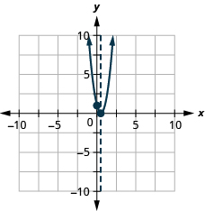

By the end of this section, you will be able to:
* Solve quadratic inequalities graphically
* Solve quadratic inequalities algebraically

Before you get started, take this readiness quiz.**

1.  Solve:
    <math xmlns="http://www.w3.org/1998/Math/MathML"><mrow><mn>2</mn><mi>x</mi><mo>−</mo><mn>3</mn><mo>=</mo><mn>0</mn><mo>.</mo></mrow></math>
    
    * * *
    {: data-type="newline"}
    
    If you missed this problem, review [\[link\]](/m63308#fs-id1167836432956).
2.  Solve:
    <math xmlns="http://www.w3.org/1998/Math/MathML"><mrow><mn>2</mn><msup><mi>y</mi><mn>2</mn></msup><mo>+</mo><mi>y</mi><mo>=</mo><mn>15</mn></mrow></math>
    
    .
    * * *
    {: data-type="newline"}
    
    If you missed this problem, review [\[link\]](/m63362#fs-id1167836625705).
3.  Solve
    <math xmlns="http://www.w3.org/1998/Math/MathML"><mrow><mfrac><mn>1</mn><mrow><msup><mi>x</mi><mn>2</mn></msup><mo>+</mo><mn>2</mn><mi>x</mi><mo>−</mo><mn>8</mn></mrow></mfrac><mo>&gt;</mo><mn>0</mn></mrow></math>
    
    * * *
    {: data-type="newline"}
    
    If you missed this problem, review [\[link\]](/m63376#fs-id1167835534361).
{: data-number-style="arabic"}

We have learned how to solve linear inequalities and rational inequalities previously. Some of the techniques we used to solve them were the same and some were different.

We will now learn to solve inequalities that have a quadratic expression. We will use some of the techniques from solving linear and rational inequalities as well as quadratic equations.

We will solve quadratic inequalities two ways—both graphically and algebraically.

# Solve Quadratic Inequalities Graphically

A **quadratic equation**{: data-type="term" .no-emphasis} is in standard form when written as *ax*2 + *bx* + *c* = 0. If we replace the equal sign with an inequality sign, we have a **quadratic inequality**{: data-type="term"} in standard form.

Quadratic Inequality

A **quadratic inequality** is an inequality that contains a quadratic expression.

The standard form of a quadratic inequality is written:

<math xmlns="http://www.w3.org/1998/Math/MathML"><mrow><mtable><mtr><mtd columnalign="left"><mi>a</mi><msup><mi>x</mi><mn>2</mn></msup><mo>+</mo><mi>b</mi><mi>x</mi><mo>+</mo><mi>c</mi><mo>&lt;</mo><mn>0</mn></mtd><mtd /><mtd /><mtd /><mtd /><mtd columnalign="left"><mi>a</mi><msup><mi>x</mi><mn>2</mn></msup><mo>+</mo><mi>b</mi><mi>x</mi><mo>+</mo><mi>c</mi><mo>≤</mo><mn>0</mn></mtd></mtr> <mtr><mtd columnalign="left"><mi>a</mi><msup><mi>x</mi><mn>2</mn></msup><mo>+</mo><mi>b</mi><mi>x</mi><mo>+</mo><mi>c</mi><mo>&gt;</mo><mn>0</mn></mtd><mtd /><mtd /><mtd /><mtd /><mtd columnalign="left"><mi>a</mi><msup><mi>x</mi><mn>2</mn></msup><mo>+</mo><mi>b</mi><mi>x</mi><mo>+</mo><mi>c</mi><mo>≥</mo><mn>0</mn></mtd></mtr></mtable></mrow></math>

The graph of a quadratic function *f*(*x*) = *ax*2 + *bx* + *c* = 0 is a parabola. When we ask when is *ax*2 + *bx* + *c* &lt; 0, we are asking when is f(*x*) &lt; 0. We want to know when the parabola is below the *x*-axis.

When we ask when is *ax*2 + *bx* + *c* &gt; 0, we are asking when is *f*(*x*) &gt; 0. We want to know when the parabola is above the *y*-axis.

    

How to Solve a Quadratic Inequality Graphically

Solve <math xmlns="http://www.w3.org/1998/Math/MathML"><mrow><msup><mi>x</mi><mn>2</mn></msup><mo>−</mo><mn>6</mn><mi>x</mi><mo>+</mo><mn>8</mn><mo>&lt;</mo><mn>0</mn></mrow></math>

 graphically. Write the solution in interval notation.

    ![The figure is a table with 3 columns. The first column says Step 2-Graph the function f of x equals a times x squared plus b times x plus c using properties or transformations. The second column gives instructions and the third column shows the work for step 3 as follows. We will graph using properties. The function is f of x equals x squared minus 6 times x plus 8 where a equals 1, b equals negative 6, and c equals 8. Look at a in the function f of x equals x squared minus 6 times x plus 8. Since a is positive, the parabola opens upward. The equation of the axis of symmetry is the line x equals negative b divided by 2 times a, so x equals negative negative 6 divided by 2 times 1. X equals 3. The axis of symmetry is the line x equals 3. The vertex is on the axis of symmetry. Substitute x equals 3 into the function, so f of 3 equals 3 squared minus 6 times 3 plus 8. F of 3 equals negative 1, so the vertex is (3, negative 1). We find f of 0 in order to find the y-intercept, so f of 0 equals 0 squared minus 6 times 0 plus 8. F of 0 equals 8, so the y intercept is (0, 8). We use the axis of symmetry to find a point symmetric to the y-intercept. The y-intercept is 3 units left of the axis of symmetry, x equals 3. A point 3 units to the right of the axis of symmetry has x equals 6. Point symmetric to y-intercept is (6, 8). We solve f of x equals 0 in order to find the x-intercepts. We can solve this quadratic equation by factoring. 0 equals x squared minus 6 times x plus 8, 0 equals the quantity x minus 2 times the quantity x minus 4, x equals 2 or x equals 4. The x-intercepts are (2, 0) and (4, 0). We graph the vertex, intercepts, and the point symmetric to the y-intercept. We connect these 5 points to sketch the parabola shown that is upward-facing with the points found through this process.](../resources/CNX_IntAlg_Figure_09_08_002b_img.jpg)    

ⓐ Solve <math xmlns="http://www.w3.org/1998/Math/MathML"><mrow><msup><mi>x</mi><mn>2</mn></msup><mo>+</mo><mn>2</mn><mi>x</mi><mo>−</mo><mn>8</mn><mo>&lt;</mo><mn>0</mn></mrow></math>

 graphically and ⓑ write the solution in interval notation.

* * *
{: data-type="newline"}

ⓐ* * *
{: data-type="newline"}

   * * *
{: data-type="newline"}

 ⓑ <math xmlns="http://www.w3.org/1998/Math/MathML"><mrow><mrow><mo>(</mo><mrow><mn>−4</mn><mo>,</mo><mn>−2</mn></mrow><mo>)</mo></mrow></mrow></math>

ⓐ Solve <math xmlns="http://www.w3.org/1998/Math/MathML"><mrow><msup><mi>x</mi><mn>2</mn></msup><mo>−</mo><mn>8</mn><mi>x</mi><mo>+</mo><mn>12</mn><mo>≥</mo><mn>0</mn></mrow></math>

 graphically and ⓑ write the solution in interval notation.

* * *
{: data-type="newline"}

ⓐ* * *
{: data-type="newline"}

  * * *
{: data-type="newline"}

 ⓑ <math xmlns="http://www.w3.org/1998/Math/MathML"><mrow><mrow><mo>(</mo><mrow><mtext>−</mtext><mi>∞</mi><mo>,</mo><mn>2</mn></mrow><mo>]</mo></mrow><mo>∪</mo><mrow><mo>[</mo><mrow><mn>6</mn><mo>,</mo><mi>∞</mi></mrow><mo>)</mo></mrow></mrow></math>

We list the steps to take to solve a quadratic inequality graphically.

Solve a quadratic inequality graphically.

1.  Write the quadratic inequality in standard form.
2.  Graph the function
    <math xmlns="http://www.w3.org/1998/Math/MathML"><mrow><mi>f</mi><mrow><mo>(</mo><mi>x</mi><mo>)</mo></mrow><mo>=</mo><mi>a</mi><msup><mi>x</mi><mn>2</mn></msup><mo>+</mo><mi>b</mi><mi>x</mi><mo>+</mo><mi>c</mi><mo>.</mo></mrow></math>

3.  Determine the solution from the graph.
{: data-number-style="arabic" .stepwise}

In the last example, the parabola opened upward and in the next example, it opens downward. In both cases, we are looking for the part of the parabola that is below the *x*-axis but note how the position of the parabola affects the solution.

Solve <math xmlns="http://www.w3.org/1998/Math/MathML"><mrow><mtext>−</mtext><msup><mi>x</mi><mn>2</mn></msup><mo>−</mo><mn>8</mn><mi>x</mi><mo>−</mo><mn>12</mn><mo>≤</mo><mn>0</mn></mrow></math>

 graphically. Write the solution in interval notation.

<table class="unnumbered unstyled can-break" summary="This figure is step-by-step instructions on how to solve an inequality graphically. The quadratic inequality in standard form is negative x squared minus 8 times x minus 12 less than or equal to 0. Graph the function f of x equals negative x squared minus 8 times x minus 12 to find that the parabola opens upward. Find the line of symmetry by using the equation x equals negative b divided by 2 times a. Substitute in to get x equals negative negative 8 divided by 2 times negative 1 to find x equals negative 4. Find the vertex of f of x equals negative x squared minus 8 times x minus 12 by finding that f of negative 4 equals negative negative 4 squared minus 8 times negative 4 minus 12. That gives you f of negative 4 equals negative 16 minus 32 minus 12, which then reduces to f of negative 4 equals 4. The vertex is (negative 4, 4). Find the x-intercepts. Let f of x equal 0. Take the original function, f of x equals negative x squared minus 8 times x minus 12, then make it 0 equals negative x squared minus 8 times x minus 12. Factor to get 0 equals negative 1 times the quantity x plus 6 times the quantity x plus 2. Use the Zero Product Property to get x equals negative 6 and x equals negative 2. The x-intercepts are (negative 6, 0) and (negative 2, 0). The graph shown is the curve formed when plotting all the points just found. Then, determine the solution from the graph, (negative infinity, negative 6] in union with [negative 2, infinity). We include the x-intercepts as the inequality is &#x201C;less than or equal to.&#x201D;" data-label=""><tbody>
<tr>
<td data-valign="top" data-align="left">The quadratic inequality in standard form.</td>
<td />
<td data-valign="top" data-align="center"><math xmlns="http://www.w3.org/1998/Math/MathML"><mrow><mo>−</mo><msup><mi>x</mi><mn>2</mn></msup><mo>−</mo><mn>8</mn><mi>x</mi><mo>−</mo><mn>12</mn><mo>≤</mo><mn>0</mn></mrow></math></td>
</tr>
<tr>
<td data-valign="top" data-align="left">Graph the function <math xmlns="http://www.w3.org/1998/Math/MathML"><mrow><mi>f</mi><mrow><mo>(</mo><mi>x</mi><mo>)</mo></mrow><mo>=</mo><mtext>−</mtext><msup><mi>x</mi><mn>2</mn></msup><mo>−</mo><mn>8</mn><mi>x</mi><mo>−</mo><mn>12</mn></mrow></math>.</td>
<td />
<td data-valign="top" data-align="left">The parabola opens downward.
</td>
</tr>
<tr>
<td data-valign="top" data-align="left">Find the line of symmetry.</td>
<td />
<td data-valign="top" data-align="left"><math xmlns="http://www.w3.org/1998/Math/MathML"><mrow><mspace width="1.8em" /><mi>x</mi><mo>=</mo><mo>−</mo><mfrac><mi>b</mi><mrow><mn>2</mn><mi>a</mi></mrow></mfrac></mrow></math>

<math xmlns="http://www.w3.org/1998/Math/MathML"><mrow><mspace width="1.8em" /><mi>x</mi><mo>=</mo><mo>−</mo><mfrac><mrow><mo>−</mo><mn>8</mn></mrow><mrow><mn>2</mn><mo stretchy="false">(</mo><mn>−1</mn><mo stretchy="false">)</mo></mrow></mfrac></mrow></math>

<math xmlns="http://www.w3.org/1998/Math/MathML"><mrow><mspace width="1.8em" /><mi>x</mi><mo>=</mo><mn>−4</mn></mrow></math></td>
</tr>
<tr>
<td data-valign="top" data-align="left">Find the vertex.</td>
<td />
<td data-valign="top" data-align="left"><math xmlns="http://www.w3.org/1998/Math/MathML"><mrow><mspace width="0.65em" /><mi>f</mi><mo stretchy="false">(</mo><mi>x</mi><mo stretchy="false">)</mo><mo>=</mo><mtext>−</mtext><msup><mi>x</mi><mn>2</mn></msup><mo>−</mo><mn>8</mn><mi>x</mi><mo>−</mo><mn>12</mn></mrow></math>

<math xmlns="http://www.w3.org/1998/Math/MathML"><mrow><mi>f</mi><mo stretchy="false">(</mo><mn>−4</mn><mo stretchy="false">)</mo><mo>=</mo><mtext>−</mtext><msup><mrow><mo stretchy="false">(</mo><mn>−4</mn><mo stretchy="false">)</mo></mrow><mn>2</mn></msup><mo>−</mo><mn>8</mn><mo stretchy="false">(</mo><mn>−4</mn><mo stretchy="false">)</mo><mo>−</mo><mn>12</mn></mrow></math>

<math xmlns="http://www.w3.org/1998/Math/MathML"><mrow><mi>f</mi><mo stretchy="false">(</mo><mn>−4</mn><mo stretchy="false">)</mo><mo>=</mo><mn>−16</mn><mo>+</mo><mn>32</mn><mo>−</mo><mn>12</mn></mrow></math>

<math xmlns="http://www.w3.org/1998/Math/MathML"><mrow><mi>f</mi><mo stretchy="false">(</mo><mn>−4</mn><mo stretchy="false">)</mo><mo>=</mo><mn>4</mn></mrow></math>

Vertex <math xmlns="http://www.w3.org/1998/Math/MathML"><mrow><mrow><mo>(</mo><mrow><mn>−4</mn><mo>,</mo><mn>4</mn></mrow><mo>)</mo></mrow></mrow></math></td>
</tr>
<tr>
<td data-valign="top" data-align="left">Find the <em>x</em>-intercepts. Let <math xmlns="http://www.w3.org/1998/Math/MathML"><mrow><mi>f</mi><mrow><mo>(</mo><mi>x</mi><mo>)</mo></mrow><mo>=</mo><mn>0</mn></mrow></math>.</td>
<td />
<td data-valign="top" data-align="left"><math xmlns="http://www.w3.org/1998/Math/MathML"><mrow><mspace width="0.75em" /><mi>f</mi><mo stretchy="false">(</mo><mi>x</mi><mo stretchy="false">)</mo><mo>=</mo><mtext>−</mtext><msup><mi>x</mi><mn>2</mn></msup><mo>−</mo><mn>8</mn><mi>x</mi><mo>−</mo><mn>12</mn></mrow></math>

<math xmlns="http://www.w3.org/1998/Math/MathML"><mrow><mspace width="1.95em" /><mn>0</mn><mo>=</mo><mtext>−</mtext><msup><mi>x</mi><mn>2</mn></msup><mo>−</mo><mn>8</mn><mi>x</mi><mo>−</mo><mn>12</mn></mrow></math></td>
</tr>
<tr>
<td data-valign="top" data-align="left">Factor.

Use the Zero Product Property.</td>
<td />
<td data-valign="top" data-align="left"><math xmlns="http://www.w3.org/1998/Math/MathML"><mrow><mspace width="1.95em" /><mn>0</mn><mo>=</mo><mn>−1</mn><mo stretchy="false">(</mo><mi>x</mi><mo>+</mo><mn>6</mn><mo stretchy="false">)</mo><mo stretchy="false">(</mo><mi>x</mi><mo>+</mo><mn>2</mn><mo stretchy="false">)</mo></mrow></math>

<math xmlns="http://www.w3.org/1998/Math/MathML"><mrow><mspace width="2em" /><mi>x</mi><mo>=</mo><mn>−6</mn><mspace width="1.5em" /><mi>x</mi><mo>=</mo><mn>−2</mn></mrow></math></td>
</tr>
<tr>
<td data-valign="top" data-align="left">Graph the parabola.</td>
<td />
<td data-valign="top" data-align="center"><em>x</em>-intercepts <math xmlns="http://www.w3.org/1998/Math/MathML"><mrow><mrow><mo>(</mo><mrow><mn>−6</mn><mo>,</mo><mn>0</mn></mrow><mo>)</mo></mrow><mo>,</mo><mrow><mo>(</mo><mrow><mn>−2</mn><mo>,</mo><mn>0</mn></mrow><mo>)</mo></mrow></mrow></math>

</td>
</tr>
<tr>
<td data-valign="top" data-align="left">Determine the solution from the graph.

We include the <em>x</em>-intercepts as the inequality
is “less than or equal to.”</td>
<td />
<td data-valign="top" data-align="center"><math xmlns="http://www.w3.org/1998/Math/MathML"><mrow><mo stretchy="false">(</mo><mtext>−</mtext><mi>∞</mi><mo>,</mo><mspace width="0.2em" /><mtext>−</mtext><mn>6</mn><mo stretchy="false">]</mo><mo>∪</mo><mo stretchy="false">[</mo><mtext>−</mtext><mn>2</mn><mo>,</mo><mspace width="0.2em" /><mi>∞</mi><mo stretchy="false">)</mo></mrow></math></td>
</tr>
</tbody></table>

ⓐ Solve <math xmlns="http://www.w3.org/1998/Math/MathML"><mrow><mtext>−</mtext><msup><mi>x</mi><mn>2</mn></msup><mo>−</mo><mn>6</mn><mi>x</mi><mo>−</mo><mn>5</mn><mo>&gt;</mo><mn>0</mn></mrow></math>

 graphically and ⓑ write the solution in interval notation.

* * *
{: data-type="newline"}

ⓐ* * *
{: data-type="newline"}

    * * *
{: data-type="newline"}

 ⓑ <math xmlns="http://www.w3.org/1998/Math/MathML"><mrow><mrow><mo>(</mo><mrow><mn>−1</mn><mo>,</mo><mn>5</mn></mrow><mo>)</mo></mrow></mrow></math>

ⓐ Solve <math xmlns="http://www.w3.org/1998/Math/MathML"><mrow><mtext>−</mtext><msup><mi>x</mi><mn>2</mn></msup><mo>+</mo><mn>10</mn><mi>x</mi><mo>−</mo><mn>16</mn><mo>≤</mo><mn>0</mn></mrow></math>

 graphically and ⓑ write the solution in interval notation.

* * *
{: data-type="newline"}

ⓐ* * *
{: data-type="newline"}

   * * *
{: data-type="newline"}

 ⓑ <math xmlns="http://www.w3.org/1998/Math/MathML"><mrow><mrow><mo>(</mo><mrow><mtext>−</mtext><mi>∞</mi><mo>,</mo><mn>2</mn></mrow><mo>]</mo></mrow><mo>∪</mo><mrow><mo>[</mo><mrow><mn>8</mn><mo>,</mo><mi>∞</mi></mrow><mo>)</mo></mrow></mrow></math>

# Solve Quadratic Inequalities Algebraically

The algebraic method we will use is very similar to the method we used to solve rational inequalities. We will find the critical points for the inequality, which will be the solutions to the related quadratic equation. Remember a polynomial expression can change signs only where the expression is zero.

We will use the **critical points**{: data-type="term" .no-emphasis} to divide the number line into intervals and then determine whether the quadratic expression willl be postive or negative in the interval. We then determine the solution for the inequality.

How To Solve Quadratic Inequalities Algebraically

Solve <math xmlns="http://www.w3.org/1998/Math/MathML"><mrow><msup><mi>x</mi><mn>2</mn></msup><mo>−</mo><mi>x</mi><mo>−</mo><mn>12</mn><mo>≥</mo><mn>0</mn></mrow></math>

 algebraically. Write the solution in interval notation.

          ![Step 4 says above the number line show the sign of each quadratic expression using test points from each interval substituted into the original inequality. X equals negative 5, x equals 0, and x equals 5 are chosen to test. The expression negative x squared minus x minus 12 is given with negative 5 squared minus negative 5 minus 12 underneath, which gives 18. The expression negative x squared minus x minus 12 is given with 0 squared minus 0 minus 12 underneath, which gives 12. The expression negative x squared minus x minus 12 is given with 5 squared minus 5 minus 12 underneath, which gives 8.](../resources/CNX_IntAlg_Figure_09_08_004d_img.jpg)   ![For Step 5, determine the intervals where the inequality is correct. Write the solution in interval notation. x squared minus x minus 12 greater than or equal to 0 is shown. The inequality is positive in the first and last intervals and equals 0 at the points negative 4, 3 . The solution, in interval notation, is (negative infinity, negative 3\] in union with \[4, infinity).](../resources/CNX_IntAlg_Figure_09_08_004e_img.jpg) 

Solve <math xmlns="http://www.w3.org/1998/Math/MathML"><mrow><msup><mi>x</mi><mn>2</mn></msup><mo>+</mo><mn>2</mn><mi>x</mi><mo>−</mo><mn>8</mn><mo>≥</mo><mn>0</mn></mrow></math>

 algebraically. Write the solution in interval notation.

<math xmlns="http://www.w3.org/1998/Math/MathML"><mrow><mrow><mo>(</mo><mrow><mtext>−</mtext><mi>∞</mi><mo>,</mo><mn>−4</mn></mrow><mo>]</mo></mrow><mo>∪</mo><mrow><mo>[</mo><mrow><mn>2</mn><mo>,</mo><mi>∞</mi></mrow><mo>)</mo></mrow></mrow></math>

Solve <math xmlns="http://www.w3.org/1998/Math/MathML"><mrow><msup><mi>x</mi><mn>2</mn></msup><mo>−</mo><mn>2</mn><mi>x</mi><mo>−</mo><mn>15</mn><mo>≤</mo><mn>0</mn></mrow></math>

 algebraically. Write the solution in interval notation.

<math xmlns="http://www.w3.org/1998/Math/MathML"><mrow><mrow><mo>[</mo><mrow><mn>−3</mn><mo>,</mo><mn>5</mn></mrow><mo>]</mo></mrow></mrow></math>

In this example, since the expression <math xmlns="http://www.w3.org/1998/Math/MathML"><mrow><msup><mi>x</mi><mn>2</mn></msup><mo>−</mo><mi>x</mi><mo>−</mo><mn>12</mn></mrow></math>

 factors nicely, we can also find the sign in each interval much like we did when we solved rational inequalities. We find the sign of each of the factors, and then the sign of the product. Our number line would like this:

    The result is the same as we found using the other method.

We summarize the steps here.

Solve a quadratic inequality algebraically.

1.  Write the quadratic inequality in standard form.
2.  Determine the critical points—the solutions to the related quadratic equation.
3.  Use the critical points to divide the number line into intervals.
4.  Above the number line show the sign of each quadratic expression using test points from each interval substituted into the original inequality.
5.  Determine the intervals where the inequality is correct. Write the solution in interval notation.
{: data-number-style="arabic" .stepwise}

Solve <math xmlns="http://www.w3.org/1998/Math/MathML"><mrow><msup><mrow><mi>x</mi></mrow><mrow><mn>2</mn></mrow></msup><mo>+</mo><mn>6</mn><mi>x</mi><mo>−</mo><mn>7</mn><mo>≥</mo><mn>0</mn></mrow></math>

 algebraically. Write the solution in interval notation.

<table class="unnumbered unstyled can-break" summary="The figure is gives step-by-step instructions on how to solve negative x squared plus 6 times x minus 7 greater than or equal to 0 algebraically. Write the inequality in standard form. negative x squared plus 6 times x minus 7 greater than or equal to 0 is already in standard form. Multiply both sides of the inequality by negative 1, remember to reverse the inequality sign, to get x squared minus 6 times x plus 7 less than or equal to 0. Determine the critical points by solving the related quadratic equation, x squared minus 6 times x plus 7 equals 0. Write the quadratic formula, x equals negative b plus or minus the square root of b squared minus 4 times a times c all divided by 2 times a. Then substitute in the values of a, b, c, to get x equals negative negative 6 plus or minus the square root of negative 6 squared minus 4 times 1 times 7 all divided by 2 times 1. Simplify to get x equals 6 plus or minus the square root of 8 divided by 2. Remove the common factor of 2, x equals 2 times the quantity 3 plus or minus square root of 2 divided by 2 which gives x equals 3 plus or minus square root of 2. If x equals 3 plus square root of 2, x is approximately 1 and 6 tenths. If x equals 3 minus square root of 2, x is approximately 4 and 4 tenths. Use the critical points to divide the number line into intervals. A number line is shown with 1 and 6 tenths and 4 and 4 tenths. Test the numbers from each interval in the original inequality. On the number line, negative x squared plus 6 times x minus 7 is shown with the signs negative, positive, and negative. Determine the intervals where the inequality is correct. Write the solution in interval notation. negative x squared plus 6 times x minus 7 is greater than or equals to 0 in the middle interval, so the final answer is [3 minus square root of 2, 3 plus square root of 2" data-label=""><tbody>
<tr>
<td data-valign="top" data-align="left">Write the quadratic inequality in standard form.</td>
<td data-valign="top" data-align="left"><math xmlns="http://www.w3.org/1998/Math/MathML"><mrow><mo>−</mo><msup><mi>x</mi><mn>2</mn></msup><mo>+</mo><mn>6</mn><mi>x</mi><mo>−</mo><mn>7</mn><mo>≥</mo><mn>0</mn></mrow></math></td>
</tr>
<tr>
<td data-valign="top" data-align="left">Multiply both sides of the inequality by <math xmlns="http://www.w3.org/1998/Math/MathML"><mrow><mn>−1</mn></mrow></math>.

Remember to reverse the inequality sign.</td>
<td data-valign="top" data-align="left"><math xmlns="http://www.w3.org/1998/Math/MathML"><mrow><mspace width="0.7em" /><msup><mi>x</mi><mn>2</mn></msup><mo>−</mo><mn>6</mn><mi>x</mi><mo>+</mo><mn>7</mn><mo>≤</mo><mn>0</mn></mrow></math></td>
</tr>
<tr>
<td data-valign="top" data-align="left">Determine the critical points by solving
the related quadratic equation.</td>
<td data-valign="top" data-align="left"><math xmlns="http://www.w3.org/1998/Math/MathML"><mrow><mspace width="0.7em" /><msup><mi>x</mi><mn>2</mn></msup><mo>−</mo><mn>6</mn><mi>x</mi><mo>+</mo><mn>7</mn><mo>=</mo><mn>0</mn></mrow></math></td>
</tr>
<tr>
<td data-valign="top" data-align="left">Write the Quadratic Formula.</td>
<td data-valign="top" data-align="left"><math xmlns="http://www.w3.org/1998/Math/MathML"><mrow><mspace width="4.9em" /><mi>x</mi><mo>=</mo><mfrac><mrow><mo>−</mo><mi>b</mi><mo>±</mo><msqrt><mrow><msup><mi>b</mi><mn>2</mn></msup><mo>−</mo><mn>4</mn><mi>a</mi><mi>c</mi></mrow></msqrt></mrow><mrow><mn>2</mn><mi>a</mi></mrow></mfrac></mrow></math></td>
</tr>
<tr>
<td data-valign="top" data-align="left">Then substitute in the values of <math xmlns="http://www.w3.org/1998/Math/MathML"><mrow><mi>a</mi><mo>,</mo><mi>b</mi><mo>,</mo><mi>c</mi></mrow></math>.</td>
<td data-valign="top" data-align="left"><math xmlns="http://www.w3.org/1998/Math/MathML"><mrow><mspace width="4.9em" /><mi>x</mi><mo>=</mo><mfrac><mrow><mo>−</mo><mo stretchy="false">(</mo><mn>−6</mn><mo stretchy="false">)</mo><mo>±</mo><msqrt><mrow><msup><mrow><mo stretchy="false">(</mo><mn>−6</mn><mo stretchy="false">)</mo></mrow><mn>2</mn></msup><mo>−</mo><mn>4</mn><mo>⋅</mo><mn>1</mn><mo>⋅</mo><mo stretchy="false">(</mo><mn>7</mn><mo stretchy="false">)</mo></mrow></msqrt></mrow><mrow><mn>2</mn><mo>⋅</mo><mn>1</mn></mrow></mfrac></mrow></math></td>
</tr>
<tr>
<td data-valign="top" data-align="left">Simplify.</td>
<td data-valign="top" data-align="left"><math xmlns="http://www.w3.org/1998/Math/MathML"><mrow><mspace width="4.9em" /><mi>x</mi><mo>=</mo><mfrac><mrow><mn>6</mn><mo>±</mo><msqrt><mn>8</mn></msqrt></mrow><mn>2</mn></mfrac></mrow></math></td>
</tr>
<tr>
<td data-valign="top" data-align="left">Simplify the radical.</td>
<td data-valign="top" data-align="left"><math xmlns="http://www.w3.org/1998/Math/MathML"><mrow><mspace width="4.9em" /><mi>x</mi><mo>=</mo><mfrac><mrow><mn>6</mn><mo>±</mo><mn>2</mn><msqrt><mn>2</mn></msqrt></mrow><mn>2</mn></mfrac></mrow></math></td>
</tr>
<tr>
<td data-valign="top" data-align="left">Remove the common factor, 2.</td>
<td data-valign="top" data-align="left"><math xmlns="http://www.w3.org/1998/Math/MathML"><mrow><mspace width="4.9em" /><mi>x</mi><mo>=</mo><mfrac><mrow><mn>2</mn><mrow><mo>(</mo><mrow><mn>3</mn><mo>±</mo><msqrt><mn>2</mn></msqrt></mrow><mo>)</mo></mrow></mrow><mn>2</mn></mfrac></mrow></math>

<math xmlns="http://www.w3.org/1998/Math/MathML"><mrow><mspace width="4.9em" /><mi>x</mi><mo>=</mo><mn>3</mn><mo>±</mo><msqrt><mn>2</mn></msqrt></mrow></math>

<math xmlns="http://www.w3.org/1998/Math/MathML"><mrow><mspace width="4.9em" /><mi>x</mi><mo>=</mo><mn>3</mn><mo>+</mo><msqrt><mn>2</mn></msqrt><mspace width="2em" /><mi>x</mi><mo>=</mo><mn>3</mn><mo>−</mo><msqrt><mn>2</mn></msqrt></mrow></math>

<math xmlns="http://www.w3.org/1998/Math/MathML"><mrow><mspace width="4.9em" /><mi>x</mi><mo>≈</mo><mn>1.6</mn><mspace width="3.35em" /><mi>x</mi><mo>≈</mo><mn>4.4</mn></mrow></math></td>
</tr>
<tr>
<td data-valign="top" data-align="left">Use the critical points to divide the
number line into intervals.

Test numbers from each interval
in the original inequality.</td>
<td data-valign="top" data-align="center">

</td>
</tr>
<tr>
<td data-valign="top" data-align="left">Determine the intervals where the
inequality is correct. Write the solution
in interval notation.</td>
<td data-valign="top" data-align="center"><math xmlns="http://www.w3.org/1998/Math/MathML"><mrow><mtext>−</mtext><msup><mi>x</mi><mn>2</mn></msup><mo>+</mo><mn>6</mn><mi>x</mi><mo>−</mo><mn>7</mn><mo>≥</mo><mn>0</mn></mrow></math> in the middle interval

<math xmlns="http://www.w3.org/1998/Math/MathML"><mrow><mrow><mo>[</mo><mrow><mn>3</mn><mo>−</mo><msqrt><mn>2</mn></msqrt><mo>,</mo><mspace width="0.5em" /><mn>3</mn><mo>+</mo><msqrt><mn>2</mn></msqrt></mrow><mo>]</mo></mrow></mrow></math></td>
</tr>
</tbody></table>

Solve <math xmlns="http://www.w3.org/1998/Math/MathML"><mrow><mtext>−</mtext><msup><mi>x</mi><mn>2</mn></msup><mo>+</mo><mn>2</mn><mi>x</mi><mo>+</mo><mn>1</mn><mo>≥</mo><mn>0</mn></mrow></math>

 algebraically. Write the solution in interval notation.

<math xmlns="http://www.w3.org/1998/Math/MathML"><mrow><mrow><mo>[</mo><mrow><mn>−1</mn><mo>−</mo><msqrt><mn>2</mn></msqrt><mo>,</mo><mn>−1</mn><mo>+</mo><msqrt><mn>2</mn></msqrt></mrow><mo>]</mo></mrow></mrow></math>

Solve <math xmlns="http://www.w3.org/1998/Math/MathML"><mrow><mtext>−</mtext><msup><mi>x</mi><mn>2</mn></msup><mo>+</mo><mn>8</mn><mi>x</mi><mo>−</mo><mn>14</mn><mo>&lt;</mo><mn>0</mn></mrow></math>

 algebraically. Write the solution in interval notation.

<math xmlns="http://www.w3.org/1998/Math/MathML"><mrow><mrow><mo>(</mo><mrow><mtext>−</mtext><mi>∞</mi><mo>,</mo><mn>4</mn><mo>−</mo><msqrt><mn>2</mn></msqrt></mrow><mo>)</mo></mrow><mo>∪</mo><mrow><mo>(</mo><mrow><mn>4</mn><mo>+</mo><msqrt><mn>2</mn></msqrt><mo>,</mo><mi>∞</mi></mrow><mo>)</mo></mrow></mrow></math>

The solutions of the quadratic inequalities in each of the previous examples, were either an interval or the union of two intervals. This resulted from the fact that, in each case we found two solutions to the corresponding quadratic equation *ax*2 + *bx* + *c* = 0. These two solutions then gave us either the two *x-*intercepts for the graph or the two critical points to divide the number line into intervals.

This correlates to our previous discussion of the number and type of solutions to a quadratic equation using the discriminant.

For a quadratic equation of the form *ax*2 + *bx* + *c* = 0, <math xmlns="http://www.w3.org/1998/Math/MathML"><mrow><mi>a</mi><mo>≠</mo><mn>0</mn><mo>.</mo></mrow></math>

  ![The figure is a table with 3 columns. Column 1 is labeled discriminant, column 2 is Number/Type of solution, and column 3 is Typical Graph. Reading across the columns, if b squared minus 4 times a times c is greater than 0, there will be 2 real solutions because there are 2 x-intercepts on the graph. The image of a typical graph an upward or downward parabola with 2 x-intercepts. If the discriminant b squared minus 4 times a times c is equals to 0, then there is 1 real solution because there is 1 x-intercept on the graph. The image of the typical graph is an upward- or downward-facing parabola that has a vertex on the x-axis instead of crossing through it. If the discriminant b squared minus 4 times a times c is less than 0, there are 2 complex solutions because there is no x-intercept. The image of the typical graph shows an upward- or downward-facing parabola that does not cross the x-axis.](../resources/CNX_IntAlg_Figure_09_08_007_img.jpg)  The last row of the table shows us when the parabolas never intersect the *x*-axis. Using the Quadratic Formula to solve the quadratic equation, the radicand is a negative. We get two complex solutions.

In the next example, the quadratic inequality solutions will result from the solution of the quadratic equation being complex.

Solve, writing any solution in interval notation:

ⓐ <math xmlns="http://www.w3.org/1998/Math/MathML"><mrow><msup><mi>x</mi><mn>2</mn></msup><mo>−</mo><mn>3</mn><mi>x</mi><mo>+</mo><mn>4</mn><mo>&gt;</mo><mn>0</mn></mrow></math>

 ⓑ <math xmlns="http://www.w3.org/1998/Math/MathML"><mrow><msup><mi>x</mi><mn>2</mn></msup><mo>−</mo><mn>3</mn><mi>x</mi><mo>+</mo><mn>4</mn><mo>≤</mo><mn>0</mn></mrow></math>

ⓐ* * *
{: data-type="newline"}

 <table class="unnumbered unstyled can-break" summary="The figure is gives step-by-step instructions on how to solve x squared minus 3 times x plus 4 greater than 0 algebraically. Write the inequality in standard form. x squared minus 3 times x plus 4 greater than 0 is already in standard form. Determine the critical points by solving the related quadratic equation, x squared minus 3 times x plus 4 equals 0. Write the quadratic formula, x equals negative b plus or minus the square root of b squared minus 4 times a times c all divided by 2 times a. Then substitute in the values of a, b, c, to get x equals negative negative 3 plus or minus the square root of negative 3 squared minus 4 times 1 times 4 all divided by 2 times 1. Simplify to get x equals 3 plus or minus the square root of negative 7 divided by 2. Simplify the radicand to get x equals 3 plus or minus the square root of 7 times i divided by 2. The complex solutions tell us that parabola does not intercept the x-axis. Also, the parabola opens upward. This tells us that the paprabola is completely above the x-axis, as the image of an upward-facing parabola that does not cross the x-axis shows." data-label=""><tbody>
<tr>
<td data-valign="top" data-align="left">Write the quadratic inequality in standard form.</td>
<td data-valign="top" data-align="left"><math xmlns="http://www.w3.org/1998/Math/MathML"><mrow><mspace width="0.8em" /><mo>−</mo><msup><mi>x</mi><mn>2</mn></msup><mo>−</mo><mn>3</mn><mi>x</mi><mo>+</mo><mn>4</mn><mo>&gt;</mo><mn>0</mn></mrow></math></td>
</tr>
<tr>
<td data-valign="top" data-align="left">Determine the critical points by solving
the related quadratic equation.</td>
<td data-valign="top" data-align="left"><math xmlns="http://www.w3.org/1998/Math/MathML"><mrow><mspace width="1.5em" /><msup><mi>x</mi><mn>2</mn></msup><mo>−</mo><mn>3</mn><mi>x</mi><mo>+</mo><mn>4</mn><mo>=</mo><mn>0</mn></mrow></math></td>
</tr>
<tr>
<td data-valign="top" data-align="left">Write the Quadratic Formula.</td>
<td data-valign="top" data-align="left"><math xmlns="http://www.w3.org/1998/Math/MathML"><mrow><mi>x</mi><mo>=</mo><mfrac><mrow><mo>−</mo><mi>b</mi><mo>±</mo><msqrt><mrow><msup><mi>b</mi><mn>2</mn></msup><mo>−</mo><mn>4</mn><mi>a</mi><mi>c</mi></mrow></msqrt></mrow><mrow><mn>2</mn><mi>a</mi></mrow></mfrac></mrow></math></td>
</tr>
<tr>
<td data-valign="top" data-align="left">Then substitute in the values of <math xmlns="http://www.w3.org/1998/Math/MathML"><mrow><mi>a</mi><mo>,</mo><mi>b</mi><mo>,</mo><mi>c</mi></mrow></math>.</td>
<td data-valign="top" data-align="left"><math xmlns="http://www.w3.org/1998/Math/MathML"><mrow><mi>x</mi><mo>=</mo><mfrac><mrow><mo>−</mo><mo stretchy="false">(</mo><mtext>−</mtext><mn>3</mn><mo stretchy="false">)</mo><mo>±</mo><msqrt><mrow><msup><mrow><mo stretchy="false">(</mo><mtext>−</mtext><mn>3</mn><mo stretchy="false">)</mo></mrow><mn>2</mn></msup><mo>−</mo><mn>4</mn><mo>⋅</mo><mn>1</mn><mo>⋅</mo><mo stretchy="false">(</mo><mn>4</mn><mo stretchy="false">)</mo></mrow></msqrt></mrow><mrow><mn>2</mn><mo>⋅</mo><mn>1</mn></mrow></mfrac></mrow></math></td>
</tr>
<tr>
<td data-valign="top" data-align="left">Simplify.</td>
<td data-valign="top" data-align="left"><math xmlns="http://www.w3.org/1998/Math/MathML"><mrow><mi>x</mi><mo>=</mo><mfrac><mrow><mn>3</mn><mo>±</mo><msqrt><mrow><mo>−</mo><mn>7</mn></mrow></msqrt></mrow><mn>2</mn></mfrac></mrow></math></td>
</tr>
<tr>
<td data-valign="top" data-align="left">Simplify the radicand.</td>
<td data-valign="top" data-align="left"><math xmlns="http://www.w3.org/1998/Math/MathML"><mrow><mi>x</mi><mo>=</mo><mfrac><mrow><mn>3</mn><mo>±</mo><msqrt><mn>7</mn></msqrt><mi>i</mi></mrow><mn>2</mn></mfrac></mrow></math></td>
</tr>
<tr>
<td data-valign="top" data-align="left">The complex solutions tell us the
parabola does not intercept the <em>x</em>-axis.
Also, the parabola opens upward. This
tells us that the parabola is completely above the <em>x</em>-axis.</td>
<td data-valign="top" data-align="center">Complex solutions

</td>
</tr>
</tbody></table>

We are to find the solution to <math xmlns="http://www.w3.org/1998/Math/MathML"><mrow><msup><mi>x</mi><mn>2</mn></msup><mo>−</mo><mn>3</mn><mi>x</mi><mo>+</mo><mn>4</mn><mo>&gt;</mo><mn>0</mn><mo>.</mo></mrow></math>

 Since for all values of <math xmlns="http://www.w3.org/1998/Math/MathML"><mi>x</mi></math>

 the graph is above the *x*-axis, all values of *x* make the inequality true. In interval notation we write <math xmlns="http://www.w3.org/1998/Math/MathML"><mrow><mrow><mo>(</mo><mrow><mtext>−</mtext><mi>∞</mi><mo>,</mo><mi>∞</mi></mrow><mo>)</mo></mrow><mo>.</mo></mrow></math>

ⓑ* * *
{: data-type="newline"}

 <math xmlns="http://www.w3.org/1998/Math/MathML"><mrow><mtable><mtr><mtd columnalign="left"><mtext>Write the quadratic inequality in standard form.</mtext></mtd><mtd /><mtd /><mtd columnalign="left"><msup><mi>x</mi><mn>2</mn></msup><mo>−</mo><mn>3</mn><mi>x</mi><mo>+</mo><mn>4</mn><mo>≤</mo><mn>0</mn></mtd></mtr> <mtr><mtd columnalign="left"><mtable><mtr><mtd columnalign="left"><mtext>Determine the critical points by solving</mtext></mtd></mtr><mtr><mtd columnalign="left"><mtext>the related quadratic equation</mtext></mtd></mtr></mtable></mtd><mtd /><mtd /><mtd columnalign="left"><msup><mi>x</mi><mn>2</mn></msup><mo>−</mo><mn>3</mn><mi>x</mi><mo>+</mo><mn>4</mn><mo>=</mo><mn>0</mn></mtd></mtr></mtable></mrow></math>

Since the corresponding quadratic equation is the same as in part (a), the parabola will be the same. The parabola opens upward and is completely above the *x*-axis—no part of it is below the *x*-axis.

We are to find the solution to <math xmlns="http://www.w3.org/1998/Math/MathML"><mrow><msup><mi>x</mi><mn>2</mn></msup><mo>−</mo><mn>3</mn><mi>x</mi><mo>+</mo><mn>4</mn><mo>≤</mo><mn>0</mn><mo>.</mo></mrow></math>

 Since for all values of *x* the graph is never below the *x*-axis, no values of *x* make the inequality true. There is no solution to the inequality.

Solve and write any solution in interval notation:* * *
{: data-type="newline"}

ⓐ <math xmlns="http://www.w3.org/1998/Math/MathML"><mrow><mtext>−</mtext><msup><mi>x</mi><mn>2</mn></msup><mo>+</mo><mn>2</mn><mi>x</mi><mo>−</mo><mn>4</mn><mo>≤</mo><mn>0</mn></mrow></math>

 ⓑ <math xmlns="http://www.w3.org/1998/Math/MathML"><mrow><mtext>−</mtext><msup><mi>x</mi><mn>2</mn></msup><mo>+</mo><mn>2</mn><mi>x</mi><mo>−</mo><mn>4</mn><mo>≥</mo><mn>0</mn></mrow></math>

ⓐ <math xmlns="http://www.w3.org/1998/Math/MathML"><mrow><mrow><mo>(</mo><mrow><mtext>−</mtext><mi>∞</mi><mo>,</mo><mi>∞</mi></mrow><mo>)</mo></mrow></mrow></math>

* * *
{: data-type="newline"}

ⓑ no solution

Solve and write any solution in interval notation:* * *
{: data-type="newline"}

ⓐ <math xmlns="http://www.w3.org/1998/Math/MathML"><mrow><msup><mi>x</mi><mn>2</mn></msup><mo>+</mo><mn>3</mn><mi>x</mi><mo>+</mo><mn>3</mn><mo>&lt;</mo><mn>0</mn></mrow></math>

 ⓑ <math xmlns="http://www.w3.org/1998/Math/MathML"><mrow><msup><mi>x</mi><mn>2</mn></msup><mo>+</mo><mn>3</mn><mi>x</mi><mo>+</mo><mn>3</mn><mo>&gt;</mo><mn>0</mn></mrow></math>

ⓐ no solution* * *
{: data-type="newline"}

ⓑ <math xmlns="http://www.w3.org/1998/Math/MathML"><mrow><mrow><mo>(</mo><mrow><mtext>−</mtext><mi>∞</mi><mo>,</mo><mi>∞</mi></mrow><mo>)</mo></mrow></mrow></math>

# Key Concepts

* Solve a Quadratic Inequality Graphically
  1.  Write the quadratic inequality in standard form.
  2.  Graph the function
      <math xmlns="http://www.w3.org/1998/Math/MathML"><mrow><mi>f</mi><mrow><mo>(</mo><mi>x</mi><mo>)</mo></mrow><mo>=</mo><mi>a</mi><msup><mi>x</mi><mn>2</mn></msup><mo>+</mo><mi>b</mi><mi>x</mi><mo>+</mo><mi>c</mi></mrow></math>
      
      using properties or transformations.
  3.  Determine the solution from the graph.
  {: data-number-style="arabic" .stepwise}

* How to Solve a Quadratic Inequality Algebraically
  1.  Write the quadratic inequality in standard form.
  2.  Determine the critical points -- the solutions to the related quadratic equation.
  3.  Use the critical points to divide the number line into intervals.
  4.  Above the number line show the sign of each quadratic expression using test points from each interval substituted into the original inequality.
  5.  Determine the intervals where the inequality is correct. Write the solution in interval notation.
  {: data-number-style="arabic" .stepwise}
{: data-bullet-style="bullet"}

<section data-depth="1" class="section-exercises" markdown="1">
## Practice Makes Perfect

**Solve Quadratic Inequalities Graphically**

In the following exercises, ⓐ solve graphically and ⓑ write the solution in interval notation.

<math xmlns="http://www.w3.org/1998/Math/MathML"><mrow><msup><mi>x</mi><mn>2</mn></msup><mo>+</mo><mn>6</mn><mi>x</mi><mo>+</mo><mn>5</mn><mo>&gt;</mo><mn>0</mn></mrow></math>

* * *
{: data-type="newline"}

ⓐ* * *
{: data-type="newline"}

   * * *
{: data-type="newline"}

 ⓑ <math xmlns="http://www.w3.org/1998/Math/MathML"><mrow><mrow><mo>(</mo><mrow><mtext>−</mtext><mi>∞</mi><mo>,</mo><mn>−5</mn></mrow><mo>)</mo></mrow><mo>∪</mo><mrow><mo>(</mo><mrow><mn>−1</mn><mo>,</mo><mi>∞</mi></mrow><mo>)</mo></mrow></mrow></math>

<math xmlns="http://www.w3.org/1998/Math/MathML"><mrow><msup><mi>x</mi><mn>2</mn></msup><mo>+</mo><mn>4</mn><mi>x</mi><mo>−</mo><mn>12</mn><mo>&lt;</mo><mn>0</mn></mrow></math>

<math xmlns="http://www.w3.org/1998/Math/MathML"><mrow><msup><mi>x</mi><mn>2</mn></msup><mo>+</mo><mn>4</mn><mi>x</mi><mo>+</mo><mn>3</mn><mo>≤</mo><mn>0</mn></mrow></math>

* * *
{: data-type="newline"}

ⓐ* * *
{: data-type="newline"}

   * * *
{: data-type="newline"}

 ⓑ <math xmlns="http://www.w3.org/1998/Math/MathML"><mrow><mrow><mo>[</mo><mrow><mn>−3</mn><mo>,</mo><mn>−1</mn></mrow><mo>]</mo></mrow></mrow></math>

<math xmlns="http://www.w3.org/1998/Math/MathML"><mrow><msup><mi>x</mi><mn>2</mn></msup><mo>−</mo><mn>6</mn><mi>x</mi><mo>+</mo><mn>8</mn><mo>≥</mo><mn>0</mn></mrow></math>

<math xmlns="http://www.w3.org/1998/Math/MathML"><mrow><mtext>−</mtext><msup><mi>x</mi><mn>2</mn></msup><mo>−</mo><mn>3</mn><mi>x</mi><mo>+</mo><mn>18</mn><mo>≤</mo><mn>0</mn></mrow></math>

* * *
{: data-type="newline"}

ⓐ* * *
{: data-type="newline"}

   * * *
{: data-type="newline"}

 ⓑ <math xmlns="http://www.w3.org/1998/Math/MathML"><mrow><mo stretchy="false">(</mo><mtext>−</mtext><mi>∞</mi><mo>,</mo><mn>−6</mn><mo stretchy="false">]</mo><mo>∪</mo><mo stretchy="false">[</mo><mn>3</mn><mo>,</mo><mi>∞</mi><mo stretchy="false">)</mo></mrow></math>

<math xmlns="http://www.w3.org/1998/Math/MathML"><mrow><mtext>−</mtext><msup><mi>x</mi><mn>2</mn></msup><mo>+</mo><mn>2</mn><mi>x</mi><mo>+</mo><mn>24</mn><mo>&lt;</mo><mn>0</mn></mrow></math>

<math xmlns="http://www.w3.org/1998/Math/MathML"><mrow><mtext>−</mtext><msup><mi>x</mi><mn>2</mn></msup><mo>+</mo><mi>x</mi><mo>+</mo><mn>12</mn><mo>≥</mo><mn>0</mn></mrow></math>

* * *
{: data-type="newline"}

ⓐ* * *
{: data-type="newline"}

   * * *
{: data-type="newline"}

 ⓑ <math xmlns="http://www.w3.org/1998/Math/MathML"><mrow><mrow><mo>[</mo><mrow><mn>−3</mn><mo>,</mo><mn>4</mn></mrow><mo>]</mo></mrow></mrow></math>

<math xmlns="http://www.w3.org/1998/Math/MathML"><mrow><mtext>−</mtext><msup><mi>x</mi><mn>2</mn></msup><mo>+</mo><mn>2</mn><mi>x</mi><mo>+</mo><mn>15</mn><mo>&gt;</mo><mn>0</mn></mrow></math>

In the following exercises, solve each inequality algebraically and write any solution in interval notation.

<math xmlns="http://www.w3.org/1998/Math/MathML"><mrow><msup><mi>x</mi><mn>2</mn></msup><mo>+</mo><mn>3</mn><mi>x</mi><mo>−</mo><mn>4</mn><mo>≥</mo><mn>0</mn></mrow></math>

<math xmlns="http://www.w3.org/1998/Math/MathML"><mrow><mrow><mo>(</mo><mrow><mtext>−</mtext><mi>∞</mi><mo>,</mo><mn>−4</mn></mrow><mo>]</mo></mrow><mo>∪</mo><mrow><mo>[</mo><mrow><mn>1</mn><mo>,</mo><mi>∞</mi></mrow><mo>)</mo></mrow></mrow></math>

<math xmlns="http://www.w3.org/1998/Math/MathML"><mrow><msup><mi>x</mi><mn>2</mn></msup><mo>+</mo><mi>x</mi><mo>−</mo><mn>6</mn><mo>≤</mo><mn>0</mn></mrow></math>

<math xmlns="http://www.w3.org/1998/Math/MathML"><mrow><msup><mi>x</mi><mn>2</mn></msup><mo>−</mo><mn>7</mn><mi>x</mi><mo>+</mo><mn>10</mn><mo>&lt;</mo><mn>0</mn></mrow></math>

<math xmlns="http://www.w3.org/1998/Math/MathML"><mrow><mrow><mo>(</mo><mrow><mn>2</mn><mo>,</mo><mn>5</mn></mrow><mo>)</mo></mrow></mrow></math>

<math xmlns="http://www.w3.org/1998/Math/MathML"><mrow><msup><mi>x</mi><mn>2</mn></msup><mo>−</mo><mn>4</mn><mi>x</mi><mo>+</mo><mn>3</mn><mo>&gt;</mo><mn>0</mn></mrow></math>

<math xmlns="http://www.w3.org/1998/Math/MathML"><mrow><msup><mi>x</mi><mn>2</mn></msup><mo>+</mo><mn>8</mn><mi>x</mi><mo>&gt;</mo><mo>−</mo><mn>15</mn></mrow></math>

<math xmlns="http://www.w3.org/1998/Math/MathML"><mrow><mrow><mo>(</mo><mrow><mtext>−</mtext><mi>∞</mi><mo>,</mo><mn>−5</mn></mrow><mo>)</mo></mrow><mo>∪</mo><mrow><mo>(</mo><mrow><mn>−3</mn><mo>,</mo><mi>∞</mi></mrow><mo>)</mo></mrow></mrow></math>

<math xmlns="http://www.w3.org/1998/Math/MathML"><mrow><msup><mi>x</mi><mn>2</mn></msup><mo>+</mo><mn>8</mn><mi>x</mi><mo>&lt;</mo><mo>−</mo><mn>12</mn></mrow></math>

<math xmlns="http://www.w3.org/1998/Math/MathML"><mrow><msup><mi>x</mi><mn>2</mn></msup><mo>−</mo><mn>4</mn><mi>x</mi><mo>+</mo><mn>2</mn><mo>≤</mo><mn>0</mn></mrow></math>

<math xmlns="http://www.w3.org/1998/Math/MathML"><mrow><mrow><mo>[</mo><mrow><mn>2</mn><mo>−</mo><msqrt><mn>2</mn></msqrt><mo>,</mo><mn>2</mn><mo>+</mo><msqrt><mn>2</mn></msqrt></mrow><mo>]</mo></mrow></mrow></math>

<math xmlns="http://www.w3.org/1998/Math/MathML"><mrow><mtext>−</mtext><msup><mi>x</mi><mn>2</mn></msup><mo>+</mo><mn>8</mn><mi>x</mi><mo>−</mo><mn>11</mn><mo>&lt;</mo><mn>0</mn></mrow></math>

<math xmlns="http://www.w3.org/1998/Math/MathML"><mrow><msup><mi>x</mi><mn>2</mn></msup><mo>−</mo><mn>10</mn><mi>x</mi><mo>&gt;</mo><mo>−</mo><mn>19</mn></mrow></math>

<math xmlns="http://www.w3.org/1998/Math/MathML"><mrow><mrow><mo>(</mo><mrow><mtext>−</mtext><mi>∞</mi><mo>,</mo><mn>5</mn><mo>−</mo><msqrt><mn>6</mn></msqrt></mrow><mo>)</mo></mrow><mo>∪</mo><mrow><mo>(</mo><mrow><mn>5</mn><mo>+</mo><msqrt><mn>6</mn></msqrt><mo>,</mo><mi>∞</mi></mrow><mo>)</mo></mrow></mrow></math>

<math xmlns="http://www.w3.org/1998/Math/MathML"><mrow><msup><mi>x</mi><mn>2</mn></msup><mo>+</mo><mn>6</mn><mi>x</mi><mo>&lt;</mo><mo>−</mo><mn>3</mn></mrow></math>

<math xmlns="http://www.w3.org/1998/Math/MathML"><mrow><mn>−6</mn><msup><mi>x</mi><mn>2</mn></msup><mo>+</mo><mn>19</mn><mi>x</mi><mo>−</mo><mn>10</mn><mo>≥</mo><mn>0</mn></mrow></math>

<math xmlns="http://www.w3.org/1998/Math/MathML"><mrow><mrow><mo>(</mo><mrow><mtext>−</mtext><mi>∞</mi><mo>,</mo><mo>−</mo><mfrac><mn>5</mn><mn>2</mn></mfrac></mrow><mo>]</mo></mrow><mo>∪</mo><mrow><mo>[</mo><mrow><mo>−</mo><mfrac><mn>2</mn><mn>3</mn></mfrac><mo>,</mo><mi>∞</mi></mrow><mo>)</mo></mrow></mrow></math>

<math xmlns="http://www.w3.org/1998/Math/MathML"><mrow><mn>−3</mn><msup><mi>x</mi><mn>2</mn></msup><mo>−</mo><mn>4</mn><mi>x</mi><mo>+</mo><mn>4</mn><mo>≤</mo><mn>0</mn></mrow></math>

<math xmlns="http://www.w3.org/1998/Math/MathML"><mrow><mn>−2</mn><msup><mi>x</mi><mn>2</mn></msup><mo>+</mo><mn>7</mn><mi>x</mi><mo>+</mo><mn>4</mn><mo>≥</mo><mn>0</mn></mrow></math>

<math xmlns="http://www.w3.org/1998/Math/MathML"><mrow><mrow><mo>(</mo><mrow><mtext>−</mtext><mi>∞</mi><mo>,</mo><mo>−</mo><mfrac><mn>1</mn><mn>2</mn></mfrac></mrow><mo>]</mo></mrow><mo>∪</mo><mrow><mo>[</mo><mrow><mn>4</mn><mo>,</mo><mi>∞</mi></mrow><mo>)</mo></mrow></mrow></math>

<math xmlns="http://www.w3.org/1998/Math/MathML"><mrow><mn>2</mn><msup><mi>x</mi><mn>2</mn></msup><mo>+</mo><mn>5</mn><mi>x</mi><mo>−</mo><mn>12</mn><mo>&gt;</mo><mn>0</mn></mrow></math>

<math xmlns="http://www.w3.org/1998/Math/MathML"><mrow><msup><mi>x</mi><mn>2</mn></msup><mo>+</mo><mn>3</mn><mi>x</mi><mo>+</mo><mn>5</mn><mo>&gt;</mo><mn>0</mn></mrow></math>

<math xmlns="http://www.w3.org/1998/Math/MathML"><mrow><mrow><mo>(</mo><mrow><mtext>−</mtext><mi>∞</mi><mo>,</mo><mi>∞</mi></mrow><mo>)</mo></mrow><mo>.</mo></mrow></math>

<math xmlns="http://www.w3.org/1998/Math/MathML"><mrow><msup><mi>x</mi><mn>2</mn></msup><mo>−</mo><mn>3</mn><mi>x</mi><mo>+</mo><mn>6</mn><mo>≤</mo><mn>0</mn></mrow></math>

<math xmlns="http://www.w3.org/1998/Math/MathML"><mrow><mtext>−</mtext><msup><mi>x</mi><mn>2</mn></msup><mo>+</mo><mi>x</mi><mo>−</mo><mn>7</mn><mo>&gt;</mo><mn>0</mn></mrow></math>

no solution

<math xmlns="http://www.w3.org/1998/Math/MathML"><mrow><mtext>−</mtext><msup><mi>x</mi><mn>2</mn></msup><mo>−</mo><mn>4</mn><mi>x</mi><mo>−</mo><mn>5</mn><mo>&lt;</mo><mn>0</mn></mrow></math>

<math xmlns="http://www.w3.org/1998/Math/MathML"><mrow><mn>−2</mn><msup><mi>x</mi><mn>2</mn></msup><mo>+</mo><mn>8</mn><mi>x</mi><mo>−</mo><mn>10</mn><mo>&lt;</mo><mn>0</mn></mrow></math>

<math xmlns="http://www.w3.org/1998/Math/MathML"><mrow><mrow><mo>(</mo><mrow><mtext>−</mtext><mi>∞</mi><mo>,</mo><mi>∞</mi></mrow><mo>)</mo></mrow><mo>.</mo></mrow></math>

<math xmlns="http://www.w3.org/1998/Math/MathML"><mrow><mtext>−</mtext><msup><mi>x</mi><mn>2</mn></msup><mo>+</mo><mn>2</mn><mi>x</mi><mo>−</mo><mn>7</mn><mo>≥</mo><mn>0</mn></mrow></math>

## Writing Exercises

Explain critical points and how they are used to solve quadratic inequalities algebraically.

Answers will vary.

Solve <math xmlns="http://www.w3.org/1998/Math/MathML"><mrow><msup><mi>x</mi><mn>2</mn></msup><mo>+</mo><mn>2</mn><mi>x</mi><mo>≥</mo><mn>8</mn></mrow></math>

 both graphically and algebraically. Which method do you prefer, and why?

Describe the steps needed to solve a quadratic inequality graphically.

Answers will vary.

Describe the steps needed to solve a quadratic inequality algebraically.

## Self Check

ⓐ After completing the exercises, use this checklist to evaluate your mastery of the objectives of this section.

  
ⓑ On a scale of 1-10, how would you rate your mastery of this section in light of your responses on the checklist? How can you improve this?

</section>

<section data-depth="1" class="review-exercises" markdown="1">
## [Section 9.1 Solve Quadratic Equations Using the Square Root Property](/m63400){: .target-chapter}

**Solve Quadratic Equations of the form *ax*2 = *k* Using the Square Root Property**

In the following exercises, solve using the Square Root Property.

<math xmlns="http://www.w3.org/1998/Math/MathML"><mrow><msup><mi>y</mi><mn>2</mn></msup><mo>=</mo><mn>144</mn></mrow></math>

<math xmlns="http://www.w3.org/1998/Math/MathML"><mrow><mi>y</mi><mo>=</mo><mo>±</mo><mn>12</mn></mrow></math>

<math xmlns="http://www.w3.org/1998/Math/MathML"><mrow><msup><mi>n</mi><mn>2</mn></msup><mo>−</mo><mn>80</mn><mo>=</mo><mn>0</mn></mrow></math>

<math xmlns="http://www.w3.org/1998/Math/MathML"><mrow><mn>4</mn><msup><mi>a</mi><mn>2</mn></msup><mo>=</mo><mn>100</mn></mrow></math>

<math xmlns="http://www.w3.org/1998/Math/MathML"><mrow><mi>a</mi><mo>=</mo><mo>±</mo><mn>5</mn></mrow></math>

<math xmlns="http://www.w3.org/1998/Math/MathML"><mrow><mn>2</mn><msup><mi>b</mi><mn>2</mn></msup><mo>=</mo><mn>72</mn></mrow></math>

<math xmlns="http://www.w3.org/1998/Math/MathML"><mrow><msup><mi>r</mi><mn>2</mn></msup><mo>+</mo><mn>32</mn><mo>=</mo><mn>0</mn></mrow></math>

<math xmlns="http://www.w3.org/1998/Math/MathML"><mrow><mi>r</mi><mo>=</mo><mo>±</mo><mn>4</mn><msqrt><mn>2</mn></msqrt><mi>i</mi></mrow></math>

<math xmlns="http://www.w3.org/1998/Math/MathML"><mrow><msup><mi>t</mi><mn>2</mn></msup><mo>+</mo><mn>18</mn><mo>=</mo><mn>0</mn></mrow></math>

<math xmlns="http://www.w3.org/1998/Math/MathML"><mrow><mfrac><mn>2</mn><mn>3</mn></mfrac><msup><mi>w</mi><mn>2</mn></msup><mo>−</mo><mn>20</mn><mo>=</mo><mn>30</mn></mrow></math>

<math xmlns="http://www.w3.org/1998/Math/MathML"><mrow><mi>w</mi><mo>=</mo><mo>±</mo><mn>5</mn><msqrt><mn>3</mn></msqrt></mrow></math>

11\. <math xmlns="http://www.w3.org/1998/Math/MathML"><mrow><mn>5</mn><msup><mi>c</mi><mn>2</mn></msup><mo>+</mo><mn>3</mn><mo>=</mo><mn>19</mn></mrow></math>

**Solve Quadratic Equations of the Form <math xmlns="http://www.w3.org/1998/Math/MathML"><mrow><mi>a</mi><msup><mrow><mrow><mo>(</mo><mrow><mi>x</mi><mo>−</mo><mi>h</mi></mrow><mo>)</mo></mrow></mrow><mn>2</mn></msup><mo>=</mo><mi>k</mi></mrow></math>

 Using the Square Root Property**

In the following exercises, solve using the Square Root Property.

<math xmlns="http://www.w3.org/1998/Math/MathML"><mrow><msup><mrow><mrow><mo>(</mo><mrow><mi>p</mi><mo>−</mo><mn>5</mn></mrow><mo>)</mo></mrow></mrow><mn>2</mn></msup><mo>+</mo><mn>3</mn><mo>=</mo><mn>19</mn></mrow></math>

<math xmlns="http://www.w3.org/1998/Math/MathML"><mrow><mi>p</mi><mo>=</mo><mn>−1</mn><mo>,</mo><mn>9</mn></mrow></math>

<math xmlns="http://www.w3.org/1998/Math/MathML"><mrow><msup><mrow><mrow><mo>(</mo><mrow><mi>u</mi><mo>+</mo><mn>1</mn></mrow><mo>)</mo></mrow></mrow><mn>2</mn></msup><mo>=</mo><mn>45</mn></mrow></math>

<math xmlns="http://www.w3.org/1998/Math/MathML"><mrow><msup><mrow><mrow><mo>(</mo><mrow><mi>x</mi><mo>−</mo><mfrac><mn>1</mn><mn>4</mn></mfrac></mrow><mo>)</mo></mrow></mrow><mn>2</mn></msup><mo>=</mo><mfrac><mn>3</mn><mrow><mn>16</mn></mrow></mfrac></mrow></math>

<math xmlns="http://www.w3.org/1998/Math/MathML"><mrow><mi>x</mi><mo>=</mo><mfrac><mn>1</mn><mn>4</mn></mfrac><mo>±</mo><mfrac><mrow><msqrt><mn>3</mn></msqrt></mrow><mn>4</mn></mfrac></mrow></math>

<math xmlns="http://www.w3.org/1998/Math/MathML"><mrow><msup><mrow><mrow><mo>(</mo><mrow><mi>y</mi><mo>−</mo><mfrac><mn>2</mn><mn>3</mn></mfrac></mrow><mo>)</mo></mrow></mrow><mn>2</mn></msup><mo>=</mo><mfrac><mn>2</mn><mn>9</mn></mfrac></mrow></math>

<math xmlns="http://www.w3.org/1998/Math/MathML"><mrow><msup><mrow><mrow><mo>(</mo><mrow><mi>n</mi><mo>−</mo><mn>4</mn></mrow><mo>)</mo></mrow></mrow><mn>2</mn></msup><mo>−</mo><mn>50</mn><mo>=</mo><mn>150</mn></mrow></math>

<math xmlns="http://www.w3.org/1998/Math/MathML"><mrow><mi>n</mi><mo>=</mo><mn>4</mn><mo>±</mo><mn>10</mn><msqrt><mn>2</mn></msqrt></mrow></math>

<math xmlns="http://www.w3.org/1998/Math/MathML"><mrow><msup><mrow><mrow><mo>(</mo><mrow><mn>4</mn><mi>c</mi><mo>−</mo><mn>1</mn></mrow><mo>)</mo></mrow></mrow><mn>2</mn></msup><mo>=</mo><mn>−18</mn></mrow></math>

<math xmlns="http://www.w3.org/1998/Math/MathML"><mrow><msup><mi>n</mi><mn>2</mn></msup><mo>+</mo><mn>10</mn><mi>n</mi><mo>+</mo><mn>25</mn><mo>=</mo><mn>12</mn></mrow></math>

<math xmlns="http://www.w3.org/1998/Math/MathML"><mrow><mi>n</mi><mo>=</mo><mn>−5</mn><mo>±</mo><mn>2</mn><msqrt><mn>3</mn></msqrt></mrow></math>

<math xmlns="http://www.w3.org/1998/Math/MathML"><mrow><mn>64</mn><msup><mi>a</mi><mn>2</mn></msup><mo>+</mo><mn>48</mn><mi>a</mi><mo>+</mo><mn>9</mn><mo>=</mo><mn>81</mn></mrow></math>

## [Section 9.2 Solve Quadratic Equations by Completing the Square](/m63459){: .target-chapter}

**Solve Quadratic Equations Using Completing the Square**

In the following exercises, complete the square to make a perfect square trinomial. Then write the result as a binomial squared.

<math xmlns="http://www.w3.org/1998/Math/MathML"><mrow><msup><mi>x</mi><mn>2</mn></msup><mo>+</mo><mn>22</mn><mi>x</mi></mrow></math>

<math xmlns="http://www.w3.org/1998/Math/MathML"><mrow><msup><mrow><mrow><mo>(</mo><mrow><mi>x</mi><mo>+</mo><mn>11</mn></mrow><mo>)</mo></mrow></mrow><mn>2</mn></msup></mrow></math>

<math xmlns="http://www.w3.org/1998/Math/MathML"><mrow><msup><mi>m</mi><mn>2</mn></msup><mo>−</mo><mn>8</mn><mi>m</mi></mrow></math>

<math xmlns="http://www.w3.org/1998/Math/MathML"><mrow><msup><mi>a</mi><mn>2</mn></msup><mo>−</mo><mn>3</mn><mi>a</mi></mrow></math>

<math xmlns="http://www.w3.org/1998/Math/MathML"><mrow><msup><mrow><mrow><mo>(</mo><mrow><mi>a</mi><mo>−</mo><mfrac><mn>3</mn><mn>2</mn></mfrac></mrow><mo>)</mo></mrow></mrow><mn>2</mn></msup></mrow></math>

<math xmlns="http://www.w3.org/1998/Math/MathML"><mrow><msup><mi>b</mi><mn>2</mn></msup><mo>+</mo><mn>13</mn><mi>b</mi></mrow></math>

In the following exercises, solve by completing the square.

<math xmlns="http://www.w3.org/1998/Math/MathML"><mrow><msup><mi>d</mi><mn>2</mn></msup><mo>+</mo><mn>14</mn><mi>d</mi><mo>=</mo><mn>−13</mn></mrow></math>

<math xmlns="http://www.w3.org/1998/Math/MathML"><mrow><mi>d</mi><mo>=</mo><mn>−13</mn><mo>,</mo><mn>−1</mn></mrow></math>

<math xmlns="http://www.w3.org/1998/Math/MathML"><mrow><msup><mi>y</mi><mn>2</mn></msup><mo>−</mo><mn>6</mn><mi>y</mi><mo>=</mo><mn>36</mn></mrow></math>

<math xmlns="http://www.w3.org/1998/Math/MathML"><mrow><msup><mi>m</mi><mn>2</mn></msup><mo>+</mo><mn>6</mn><mi>m</mi><mo>=</mo><mn>−109</mn></mrow></math>

<math xmlns="http://www.w3.org/1998/Math/MathML"><mrow><mi>m</mi><mo>=</mo><mn>−3</mn><mo>±</mo><mn>10</mn><mi>i</mi></mrow></math>

<math xmlns="http://www.w3.org/1998/Math/MathML"><mrow><msup><mi>t</mi><mn>2</mn></msup><mo>−</mo><mn>12</mn><mi>t</mi><mo>=</mo><mn>−40</mn></mrow></math>

<math xmlns="http://www.w3.org/1998/Math/MathML"><mrow><msup><mi>v</mi><mn>2</mn></msup><mo>−</mo><mn>14</mn><mi>v</mi><mo>=</mo><mn>−31</mn></mrow></math>

<math xmlns="http://www.w3.org/1998/Math/MathML"><mrow><mi>v</mi><mo>=</mo><mn>7</mn><mo>±</mo><mn>3</mn><msqrt><mn>2</mn></msqrt></mrow></math>

<math xmlns="http://www.w3.org/1998/Math/MathML"><mrow><msup><mi>w</mi><mn>2</mn></msup><mo>−</mo><mn>20</mn><mi>w</mi><mo>=</mo><mn>100</mn></mrow></math>

<math xmlns="http://www.w3.org/1998/Math/MathML"><mrow><msup><mi>m</mi><mn>2</mn></msup><mo>+</mo><mn>10</mn><mi>m</mi><mo>−</mo><mn>4</mn><mo>=</mo><mn>−13</mn></mrow></math>

<math xmlns="http://www.w3.org/1998/Math/MathML"><mrow><mi>m</mi><mo>=</mo><mn>−9</mn><mo>,</mo><mn>−1</mn></mrow></math>

<math xmlns="http://www.w3.org/1998/Math/MathML"><mrow><msup><mi>n</mi><mn>2</mn></msup><mo>−</mo><mn>6</mn><mi>n</mi><mo>+</mo><mn>11</mn><mo>=</mo><mn>34</mn></mrow></math>

<math xmlns="http://www.w3.org/1998/Math/MathML"><mrow><msup><mi>a</mi><mn>2</mn></msup><mo>=</mo><mn>3</mn><mi>a</mi><mo>+</mo><mn>8</mn></mrow></math>

<math xmlns="http://www.w3.org/1998/Math/MathML"><mrow><mi>a</mi><mo>=</mo><mfrac><mn>3</mn><mn>2</mn></mfrac><mo>±</mo><mfrac><mrow><msqrt><mrow><mn>41</mn></mrow></msqrt></mrow><mn>2</mn></mfrac></mrow></math>

<math xmlns="http://www.w3.org/1998/Math/MathML"><mrow><msup><mi>b</mi><mn>2</mn></msup><mo>=</mo><mn>11</mn><mi>b</mi><mo>−</mo><mn>5</mn></mrow></math>

<math xmlns="http://www.w3.org/1998/Math/MathML"><mrow><mrow><mo>(</mo><mrow><mi>u</mi><mo>+</mo><mn>8</mn></mrow><mo>)</mo></mrow><mrow><mo>(</mo><mrow><mi>u</mi><mo>+</mo><mn>4</mn></mrow><mo>)</mo></mrow><mo>=</mo><mn>14</mn></mrow></math>

<math xmlns="http://www.w3.org/1998/Math/MathML"><mrow><mi>u</mi><mo>=</mo><mn>−6</mn><mo>±</mo><mn>2</mn><msqrt><mn>2</mn></msqrt></mrow></math>

<math xmlns="http://www.w3.org/1998/Math/MathML"><mrow><mrow><mo>(</mo><mrow><mi>z</mi><mo>−</mo><mn>10</mn></mrow><mo>)</mo></mrow><mrow><mo>(</mo><mrow><mi>z</mi><mo>+</mo><mn>2</mn></mrow><mo>)</mo></mrow><mo>=</mo><mn>28</mn></mrow></math>

**Solve Quadratic Equations of the form *ax*2 + *bx* + *c* = 0 by Completing the Square**

In the following exercises, solve by completing the square.

<math xmlns="http://www.w3.org/1998/Math/MathML"><mrow><mn>3</mn><msup><mi>p</mi><mn>2</mn></msup><mo>−</mo><mn>18</mn><mi>p</mi><mo>+</mo><mn>15</mn><mo>=</mo><mn>15</mn></mrow></math>

<math xmlns="http://www.w3.org/1998/Math/MathML"><mrow><mi>p</mi><mo>=</mo><mn>0</mn><mo>,</mo><mn>6</mn></mrow></math>

<math xmlns="http://www.w3.org/1998/Math/MathML"><mrow><mn>5</mn><msup><mi>q</mi><mn>2</mn></msup><mo>+</mo><mn>70</mn><mi>q</mi><mo>+</mo><mn>20</mn><mo>=</mo><mn>0</mn></mrow></math>

<math xmlns="http://www.w3.org/1998/Math/MathML"><mrow><mn>4</mn><msup><mi>y</mi><mn>2</mn></msup><mo>−</mo><mn>6</mn><mi>y</mi><mo>=</mo><mn>4</mn></mrow></math>

<math xmlns="http://www.w3.org/1998/Math/MathML"><mrow><mi>y</mi><mo>=</mo><mo>−</mo><mfrac><mn>1</mn><mn>2</mn></mfrac><mo>,</mo><mn>2</mn></mrow></math>

<math xmlns="http://www.w3.org/1998/Math/MathML"><mrow><mn>2</mn><msup><mi>x</mi><mn>2</mn></msup><mo>+</mo><mn>2</mn><mi>x</mi><mo>=</mo><mn>4</mn></mrow></math>

<math xmlns="http://www.w3.org/1998/Math/MathML"><mrow><mn>3</mn><msup><mi>c</mi><mn>2</mn></msup><mo>+</mo><mn>2</mn><mi>c</mi><mo>=</mo><mn>9</mn></mrow></math>

<math xmlns="http://www.w3.org/1998/Math/MathML"><mrow><mi>c</mi><mo>=</mo><mo>−</mo><mfrac><mn>1</mn><mn>3</mn></mfrac><mo>±</mo><mfrac><mrow><mn>2</mn><msqrt><mn>7</mn></msqrt></mrow><mn>3</mn></mfrac></mrow></math>

<math xmlns="http://www.w3.org/1998/Math/MathML"><mrow><mn>4</mn><msup><mi>d</mi><mn>2</mn></msup><mo>−</mo><mn>2</mn><mi>d</mi><mo>=</mo><mn>8</mn></mrow></math>

<math xmlns="http://www.w3.org/1998/Math/MathML"><mrow><mn>2</mn><msup><mi>x</mi><mn>2</mn></msup><mo>+</mo><mn>6</mn><mi>x</mi><mo>=</mo><mn>−5</mn></mrow></math>

<math xmlns="http://www.w3.org/1998/Math/MathML"><mrow><mi>x</mi><mo>=</mo><mfrac><mn>3</mn><mn>2</mn></mfrac><mo>±</mo><mfrac><mn>1</mn><mn>2</mn></mfrac><mi>i</mi></mrow></math>

<math xmlns="http://www.w3.org/1998/Math/MathML"><mrow><mn>2</mn><msup><mi>x</mi><mn>2</mn></msup><mo>+</mo><mn>4</mn><mi>x</mi><mo>=</mo><mn>−5</mn></mrow></math>

## [Section 9.3 Solve Quadratic Equations Using the Quadratic Formula](/m63463){: .target-chapter}

In the following exercises, solve by using the Quadratic Formula.

<math xmlns="http://www.w3.org/1998/Math/MathML"><mrow><mn>4</mn><msup><mi>x</mi><mn>2</mn></msup><mo>−</mo><mn>5</mn><mi>x</mi><mo>+</mo><mn>1</mn><mo>=</mo><mn>0</mn></mrow></math>

<math xmlns="http://www.w3.org/1998/Math/MathML"><mrow><mi>x</mi><mo>=</mo><mfrac><mn>1</mn><mn>4</mn></mfrac><mo>,</mo><mn>1</mn></mrow></math>

<math xmlns="http://www.w3.org/1998/Math/MathML"><mrow><mn>7</mn><msup><mi>y</mi><mn>2</mn></msup><mo>+</mo><mn>4</mn><mi>y</mi><mo>−</mo><mn>3</mn><mo>=</mo><mn>0</mn></mrow></math>

<math xmlns="http://www.w3.org/1998/Math/MathML"><mrow><msup><mi>r</mi><mn>2</mn></msup><mo>−</mo><mi>r</mi><mo>−</mo><mn>42</mn><mo>=</mo><mn>0</mn></mrow></math>

<math xmlns="http://www.w3.org/1998/Math/MathML"><mrow><mi>r</mi><mo>=</mo><mn>−6</mn><mo>,</mo><mn>7</mn></mrow></math>

<math xmlns="http://www.w3.org/1998/Math/MathML"><mrow><msup><mi>t</mi><mn>2</mn></msup><mo>+</mo><mn>13</mn><mi>t</mi><mo>+</mo><mn>22</mn><mo>=</mo><mn>0</mn></mrow></math>

<math xmlns="http://www.w3.org/1998/Math/MathML"><mrow><mn>4</mn><msup><mi>v</mi><mn>2</mn></msup><mo>+</mo><mi>v</mi><mo>−</mo><mn>5</mn><mo>=</mo><mn>0</mn></mrow></math>

<math xmlns="http://www.w3.org/1998/Math/MathML"><mrow><mi>v</mi><mo>=</mo><mfrac><mrow><mn>−1</mn><mo>±</mo><msqrt><mrow><mn>21</mn></mrow></msqrt></mrow><mn>8</mn></mfrac></mrow></math>

<math xmlns="http://www.w3.org/1998/Math/MathML"><mrow><mn>2</mn><msup><mi>w</mi><mn>2</mn></msup><mo>+</mo><mn>9</mn><mi>w</mi><mo>+</mo><mn>2</mn><mo>=</mo><mn>0</mn></mrow></math>

<math xmlns="http://www.w3.org/1998/Math/MathML"><mrow><mn>3</mn><msup><mi>m</mi><mn>2</mn></msup><mo>+</mo><mn>8</mn><mi>m</mi><mo>+</mo><mn>2</mn><mo>=</mo><mn>0</mn></mrow></math>

<math xmlns="http://www.w3.org/1998/Math/MathML"><mrow><mi>m</mi><mo>=</mo><mfrac><mrow><mn>−4</mn><mo>±</mo><msqrt><mrow><mn>10</mn></mrow></msqrt></mrow><mn>3</mn></mfrac></mrow></math>

<math xmlns="http://www.w3.org/1998/Math/MathML"><mrow><mn>5</mn><msup><mi>n</mi><mn>2</mn></msup><mo>+</mo><mn>2</mn><mi>n</mi><mo>−</mo><mn>1</mn><mo>=</mo><mn>0</mn></mrow></math>

<math xmlns="http://www.w3.org/1998/Math/MathML"><mrow><mn>6</mn><msup><mi>a</mi><mn>2</mn></msup><mo>−</mo><mn>5</mn><mi>a</mi><mo>+</mo><mn>2</mn><mo>=</mo><mn>0</mn></mrow></math>

<math xmlns="http://www.w3.org/1998/Math/MathML"><mrow><mi>a</mi><mo>=</mo><mfrac><mn>5</mn><mrow><mn>12</mn></mrow></mfrac><mo>±</mo><mfrac><mrow><msqrt><mrow><mn>23</mn></mrow></msqrt></mrow><mrow><mn>12</mn></mrow></mfrac><mi>i</mi></mrow></math>

<math xmlns="http://www.w3.org/1998/Math/MathML"><mrow><mn>4</mn><msup><mi>b</mi><mn>2</mn></msup><mo>−</mo><mi>b</mi><mo>+</mo><mn>8</mn><mo>=</mo><mn>0</mn></mrow></math>

<math xmlns="http://www.w3.org/1998/Math/MathML"><mrow><mi>u</mi><mrow><mo>(</mo><mrow><mi>u</mi><mo>−</mo><mn>10</mn></mrow><mo>)</mo></mrow><mo>+</mo><mn>3</mn><mo>=</mo><mn>0</mn></mrow></math>

<math xmlns="http://www.w3.org/1998/Math/MathML"><mrow><mi>u</mi><mo>=</mo><mn>5</mn><mo>±</mo><msqrt><mrow><mn>21</mn></mrow></msqrt></mrow></math>

<math xmlns="http://www.w3.org/1998/Math/MathML"><mrow><mn>5</mn><mi>z</mi><mo stretchy="false">(</mo><mi>z</mi><mo>−</mo><mn>2</mn><mo stretchy="false">)</mo><mo>=</mo><mn>3</mn></mrow></math>

<math xmlns="http://www.w3.org/1998/Math/MathML"><mrow><mfrac><mn>1</mn><mn>8</mn></mfrac><msup><mi>p</mi><mn>2</mn></msup><mo>−</mo><mfrac><mn>1</mn><mn>5</mn></mfrac><mi>p</mi><mo>=</mo><mo>−</mo><mfrac><mn>1</mn><mrow><mn>20</mn></mrow></mfrac></mrow></math>

<math xmlns="http://www.w3.org/1998/Math/MathML"><mrow><mi>p</mi><mo>=</mo><mfrac><mrow><mn>4</mn><mo>±</mo><msqrt><mn>5</mn></msqrt></mrow><mn>5</mn></mfrac></mrow></math>

<math xmlns="http://www.w3.org/1998/Math/MathML"><mrow><mfrac><mn>2</mn><mn>5</mn></mfrac><msup><mi>q</mi><mn>2</mn></msup><mo>+</mo><mfrac><mn>3</mn><mrow><mn>10</mn></mrow></mfrac><mi>q</mi><mo>=</mo><mfrac><mn>1</mn><mrow><mn>10</mn></mrow></mfrac></mrow></math>

<math xmlns="http://www.w3.org/1998/Math/MathML"><mrow><mn>4</mn><msup><mi>c</mi><mn>2</mn></msup><mo>+</mo><mn>4</mn><mi>c</mi><mo>+</mo><mn>1</mn><mo>=</mo><mn>0</mn></mrow></math>

<math xmlns="http://www.w3.org/1998/Math/MathML"><mrow><mi>c</mi><mo>=</mo><mo>−</mo><mfrac><mn>1</mn><mn>2</mn></mfrac></mrow></math>

<math xmlns="http://www.w3.org/1998/Math/MathML"><mrow><mn>9</mn><msup><mi>d</mi><mn>2</mn></msup><mo>−</mo><mn>12</mn><mi>d</mi><mo>=</mo><mn>−4</mn></mrow></math>

**Use the Discriminant to Predict the Number of Solutions of a Quadratic Equation**

In the following exercises, determine the number of solutions for each quadratic equation.

* * *
{: data-type="newline"}

ⓐ <math xmlns="http://www.w3.org/1998/Math/MathML"><mrow><mn>9</mn><msup><mi>x</mi><mn>2</mn></msup><mo>−</mo><mn>6</mn><mi>x</mi><mo>+</mo><mn>1</mn><mo>=</mo><mn>0</mn></mrow></math>

* * *
{: data-type="newline"}

ⓑ <math xmlns="http://www.w3.org/1998/Math/MathML"><mrow><mn>3</mn><msup><mi>y</mi><mn>2</mn></msup><mo>−</mo><mn>8</mn><mi>y</mi><mo>+</mo><mn>1</mn><mo>=</mo><mn>0</mn></mrow></math>

* * *
{: data-type="newline"}

ⓒ <math xmlns="http://www.w3.org/1998/Math/MathML"><mrow><mn>7</mn><msup><mi>m</mi><mn>2</mn></msup><mo>+</mo><mn>12</mn><mi>m</mi><mo>+</mo><mn>4</mn><mo>=</mo><mn>0</mn></mrow></math>

* * *
{: data-type="newline"}

ⓓ <math xmlns="http://www.w3.org/1998/Math/MathML"><mrow><mn>5</mn><msup><mi>n</mi><mn>2</mn></msup><mo>−</mo><mi>n</mi><mo>+</mo><mn>1</mn><mo>=</mo><mn>0</mn></mrow></math>

ⓐ 1 ⓑ 2 ⓒ 2 ⓓ 2

* * *
{: data-type="newline"}

ⓐ <math xmlns="http://www.w3.org/1998/Math/MathML"><mrow><mn>5</mn><msup><mi>x</mi><mn>2</mn></msup><mo>−</mo><mn>7</mn><mi>x</mi><mo>−</mo><mn>8</mn><mo>=</mo><mn>0</mn></mrow></math>

* * *
{: data-type="newline"}

ⓑ <math xmlns="http://www.w3.org/1998/Math/MathML"><mrow><mn>7</mn><msup><mi>x</mi><mn>2</mn></msup><mo>−</mo><mn>10</mn><mi>x</mi><mo>+</mo><mn>5</mn><mo>=</mo><mn>0</mn></mrow></math>

* * *
{: data-type="newline"}

ⓒ <math xmlns="http://www.w3.org/1998/Math/MathML"><mrow><mn>25</mn><msup><mi>x</mi><mn>2</mn></msup><mo>−</mo><mn>90</mn><mi>x</mi><mo>+</mo><mn>81</mn><mo>=</mo><mn>0</mn></mrow></math>

* * *
{: data-type="newline"}

ⓓ <math xmlns="http://www.w3.org/1998/Math/MathML"><mrow><mn>15</mn><msup><mi>x</mi><mn>2</mn></msup><mo>−</mo><mn>8</mn><mi>x</mi><mo>+</mo><mn>4</mn><mo>=</mo><mn>0</mn></mrow></math>

**Identify the Most Appropriate Method to Use to Solve a Quadratic Equation**

In the following exercises, identify the most appropriate method (Factoring, Square Root, or Quadratic Formula) to use to solve each quadratic equation. Do not solve.

* * *
{: data-type="newline"}

ⓐ <math xmlns="http://www.w3.org/1998/Math/MathML"><mrow><mn>16</mn><msup><mi>r</mi><mn>2</mn></msup><mo>−</mo><mn>8</mn><mi>r</mi><mo>+</mo><mn>1</mn><mo>=</mo><mn>0</mn></mrow></math>

* * *
{: data-type="newline"}

ⓑ <math xmlns="http://www.w3.org/1998/Math/MathML"><mrow><mn>5</mn><msup><mi>t</mi><mn>2</mn></msup><mo>−</mo><mn>8</mn><mi>t</mi><mo>+</mo><mn>3</mn><mo>=</mo><mn>9</mn></mrow></math>

* * *
{: data-type="newline"}

ⓒ <math xmlns="http://www.w3.org/1998/Math/MathML"><mrow><mn>3</mn><msup><mrow><mrow><mo>(</mo><mrow><mi>c</mi><mo>+</mo><mn>2</mn></mrow><mo>)</mo></mrow></mrow><mn>2</mn></msup><mo>=</mo><mn>15</mn></mrow></math>

ⓐ factor ⓑ Quadratic Formula ⓒ square root

* * *
{: data-type="newline"}

ⓐ <math xmlns="http://www.w3.org/1998/Math/MathML"><mrow><mn>4</mn><msup><mi>d</mi><mn>2</mn></msup><mo>+</mo><mn>10</mn><mi>d</mi><mo>−</mo><mn>5</mn><mo>=</mo><mn>21</mn></mrow></math>

* * *
{: data-type="newline"}

ⓑ <math xmlns="http://www.w3.org/1998/Math/MathML"><mrow><mn>25</mn><msup><mi>x</mi><mn>2</mn></msup><mo>−</mo><mn>60</mn><mi>x</mi><mo>+</mo><mn>36</mn><mo>=</mo><mn>0</mn></mrow></math>

* * *
{: data-type="newline"}

ⓒ <math xmlns="http://www.w3.org/1998/Math/MathML"><mrow><mn>6</mn><msup><mrow><mo stretchy="false">(</mo><mn>5</mn><mi>v</mi><mo>−</mo><mn>7</mn><mo stretchy="false">)</mo></mrow><mn>2</mn></msup><mo>=</mo><mn>150</mn></mrow></math>

## [Section 9.4 Solve Equations in Quadratic Form](/m63464){: .target-chapter}

**Solve Equations in Quadratic Form**

In the following exercises, solve.

<math xmlns="http://www.w3.org/1998/Math/MathML"><mrow><msup><mi>x</mi><mn>4</mn></msup><mo>−</mo><mn>14</mn><msup><mi>x</mi><mn>2</mn></msup><mo>+</mo><mn>24</mn><mo>=</mo><mn>0</mn></mrow></math>

<math xmlns="http://www.w3.org/1998/Math/MathML"><mrow><mi>x</mi><mo>=</mo><mo>±</mo><msqrt><mn>2</mn></msqrt><mo>,</mo><mspace width="0.2em" /><mtext /><mspace width="0.2em" /><mi>x</mi><mo>=</mo><mo>±</mo><mn>2</mn><msqrt><mn>3</mn></msqrt></mrow></math>

<math xmlns="http://www.w3.org/1998/Math/MathML"><mrow><msup><mi>x</mi><mn>4</mn></msup><mo>+</mo><mn>4</mn><msup><mi>x</mi><mn>2</mn></msup><mo>−</mo><mn>32</mn><mo>=</mo><mn>0</mn></mrow></math>

<math xmlns="http://www.w3.org/1998/Math/MathML"><mrow><mn>4</mn><msup><mi>x</mi><mn>4</mn></msup><mo>−</mo><mn>5</mn><msup><mi>x</mi><mn>2</mn></msup><mo>+</mo><mn>1</mn><mo>=</mo><mn>0</mn></mrow></math>

<math xmlns="http://www.w3.org/1998/Math/MathML"><mrow><mi>x</mi><mo>=</mo><mo>±</mo><mn>1</mn><mo>,</mo><mspace width="0.2em" /><mtext /><mspace width="0.2em" /><mi>x</mi><mo>=</mo><mo>±</mo><mfrac><mn>1</mn><mn>2</mn></mfrac></mrow></math>

<math xmlns="http://www.w3.org/1998/Math/MathML"><mrow><msup><mrow><mrow><mo>(</mo><mrow><mn>2</mn><mi>y</mi><mo>+</mo><mn>3</mn></mrow><mo>)</mo></mrow></mrow><mn>2</mn></msup><mo>+</mo><mn>3</mn><mrow><mo>(</mo><mrow><mn>2</mn><mi>y</mi><mo>+</mo><mn>3</mn></mrow><mo>)</mo></mrow><mo>−</mo><mn>28</mn><mo>=</mo><mn>0</mn></mrow></math>

<math xmlns="http://www.w3.org/1998/Math/MathML"><mrow><mi>x</mi><mo>+</mo><mn>3</mn><msqrt><mi>x</mi></msqrt><mo>−</mo><mn>28</mn><mo>=</mo><mn>0</mn></mrow></math>

<math xmlns="http://www.w3.org/1998/Math/MathML"><mrow><mi>x</mi><mo>=</mo><mn>16</mn></mrow></math>

<math xmlns="http://www.w3.org/1998/Math/MathML"><mrow><mn>6</mn><mi>x</mi><mo>+</mo><mn>5</mn><msqrt><mi>x</mi></msqrt><mo>−</mo><mn>6</mn><mo>=</mo><mn>0</mn></mrow></math>

<math xmlns="http://www.w3.org/1998/Math/MathML"><mrow><msup><mi>x</mi><mrow><mfrac><mn>2</mn><mn>3</mn></mfrac></mrow></msup><mo>−</mo><mn>10</mn><msup><mi>x</mi><mrow><mfrac><mn>1</mn><mn>3</mn></mfrac></mrow></msup><mo>+</mo><mn>24</mn><mo>=</mo><mn>0</mn></mrow></math>

<math xmlns="http://www.w3.org/1998/Math/MathML"><mrow><mi>x</mi><mo>=</mo><mn>64</mn><mo>,</mo><mi>x</mi><mo>=</mo><mn>216</mn></mrow></math>

<math xmlns="http://www.w3.org/1998/Math/MathML"><mrow><mi>x</mi><mo>+</mo><mn>7</mn><msup><mi>x</mi><mrow><mfrac><mn>1</mn><mn>2</mn></mfrac></mrow></msup><mo>+</mo><mn>6</mn><mo>=</mo><mn>0</mn></mrow></math>

<math xmlns="http://www.w3.org/1998/Math/MathML"><mrow><mn>8</mn><msup><mi>x</mi><mrow><mn>−2</mn></mrow></msup><mo>−</mo><mn>2</mn><msup><mi>x</mi><mrow><mn>−1</mn></mrow></msup><mo>−</mo><mn>3</mn><mo>=</mo><mn>0</mn></mrow></math>

<math xmlns="http://www.w3.org/1998/Math/MathML"><mrow><mi>x</mi><mo>=</mo><mn>−2</mn><mo>,</mo><mi>x</mi><mo>=</mo><mfrac><mn>4</mn><mn>3</mn></mfrac></mrow></math>

## [Section 9.5 Solve Applications Modeled by Quadratic Equations](/m63465){: .target-chapter}

**Solve Applications Modeled by Quadratic Equations**

In the following exercises, solve by using the method of factoring, the square root principle, or the Quadratic Formula. Round your answers to the nearest tenth, if needed.

Find two consecutive odd numbers whose product is 323.

Find two consecutive even numbers whose product is 624.

Two consecutive even numbers whose product is 624 are 24 and 26, and −24 and −26.

A triangular banner has an area of 351 square centimeters. The length of the base is two centimeters longer than four times the height. Find the height and length of the base.

Julius built a triangular display case for his coin collection. The height of the display case is six inches less than twice the width of the base. The area of the of the back of the case is 70 square inches. Find the height and width of the case.

The height is 14 inches and the width is 10 inches.

A tile mosaic in the shape of a right triangle is used as the corner of a rectangular pathway. The hypotenuse of the mosaic is 5 feet. One side of the mosaic is twice as long as the other side. What are the lengths of the sides? Round to the nearest tenth.

  

A rectangular piece of plywood has a diagonal which measures two feet more than the width. The length of the plywood is twice the width. What is the length of the plywood’s diagonal? Round to the nearest tenth.

The length of the diagonal is 3.6 feet.

The front walk from the street to Pam’s house has an area of 250 square feet. Its length is two less than four times its width. Find the length and width of the sidewalk. Round to the nearest tenth.

For Sophia’s graduation party, several tables of the same width will be arranged end to end to give serving table with a total area of 75 square feet. The total length of the tables will be two more than three times the width. Find the length and width of the serving table so Sophia can purchase the correct size tablecloth . Round answer to the nearest tenth.

The width of the serving table is 4.7 feet and the length is 16.1 feet.* * *
{: data-type="newline"}

   

A ball is thrown vertically in the air with a velocity of 160 ft/sec. Use the formula *h* = −16*t*2 + *v*0*t* to determine when the ball will be 384 feet from the ground. Round to the nearest tenth.

The couple took a small airplane for a quick flight up to the wine country for a romantic dinner and then returned home. The plane flew a total of 5 hours and each way the trip was 360 miles. If the plane was flying at 150 mph, what was the speed of the wind that affected the plane?

The speed of the wind was 30 mph.

Ezra kayaked up the river and then back in a total time of 6 hours. The trip was 4 miles each way and the current was difficult. If Roy kayaked at a speed of 5 mph, what was the speed of the current?

Two handymen can do a home repair in 2 hours if they work together. One of the men takes 3 hours more than the other man to finish the job by himself. How long does it take for each handyman to do the home repair individually?

One man takes 3 hours and the other man 6 hours to finish the repair alone.

## [Section 9.6 Graphing Quadratic Functions Using Properties](/m63466){: .target-chapter}

**Recognize the Graph of a Quadratic Function**

In the following exercises, graph by plotting point.

Graph <math xmlns="http://www.w3.org/1998/Math/MathML"><mrow><mi>y</mi><mo>=</mo><msup><mi>x</mi><mn>2</mn></msup><mo>−</mo><mn>2</mn></mrow></math>

Graph <math xmlns="http://www.w3.org/1998/Math/MathML"><mrow><mi>y</mi><mo>=</mo><mtext>−</mtext><msup><mi>x</mi><mn>2</mn></msup><mo>+</mo><mn>3</mn></mrow></math>

* * *
{: data-type="newline"}

  

In the following exercises, determine if the following parabolas open up or down.

* * *
{: data-type="newline"}

ⓐ <math xmlns="http://www.w3.org/1998/Math/MathML"><mrow><mi>y</mi><mo>=</mo><mn>−3</mn><msup><mi>x</mi><mn>2</mn></msup><mo>+</mo><mn>3</mn><mi>x</mi><mo>−</mo><mn>1</mn></mrow></math>

* * *
{: data-type="newline"}

ⓑ <math xmlns="http://www.w3.org/1998/Math/MathML"><mrow><mi>y</mi><mo>=</mo><mn>5</mn><msup><mi>x</mi><mn>2</mn></msup><mo>+</mo><mn>6</mn><mi>x</mi><mo>+</mo><mn>3</mn></mrow></math>

* * *
{: data-type="newline"}

ⓐ <math xmlns="http://www.w3.org/1998/Math/MathML"><mrow><mi>y</mi><mo>=</mo><msup><mi>x</mi><mn>2</mn></msup><mo>+</mo><mn>8</mn><mi>x</mi><mo>−</mo><mn>1</mn></mrow></math>

* * *
{: data-type="newline"}

ⓑ <math xmlns="http://www.w3.org/1998/Math/MathML"><mrow><mi>y</mi><mo>=</mo><mn>−4</mn><msup><mi>x</mi><mn>2</mn></msup><mo>−</mo><mn>7</mn><mi>x</mi><mo>+</mo><mn>1</mn></mrow></math>

ⓐ up ⓑ down

**Find the Axis of Symmetry and Vertex of a Parabola**

In the following exercises, find ⓐ the equation of the axis of symmetry and ⓑ the vertex.

<math xmlns="http://www.w3.org/1998/Math/MathML"><mrow><mi>y</mi><mo>=</mo><mtext>−</mtext><msup><mi>x</mi><mn>2</mn></msup><mo>+</mo><mn>6</mn><mi>x</mi><mo>+</mo><mn>8</mn></mrow></math>

<math xmlns="http://www.w3.org/1998/Math/MathML"><mrow><mi>y</mi><mo>=</mo><mn>2</mn><msup><mi>x</mi><mn>2</mn></msup><mo>−</mo><mn>8</mn><mi>x</mi><mo>+</mo><mn>1</mn></mrow></math>

<math xmlns="http://www.w3.org/1998/Math/MathML"><mrow><mi>x</mi><mo>=</mo><mn>2</mn><mo>;</mo><mo stretchy="false">(</mo><mn>2</mn><mo>,</mo><mn>−7</mn><mo stretchy="false">)</mo></mrow></math>

**Find the Intercepts of a Parabola**

In the following exercises, find the *x*- and *y*-intercepts.

<math xmlns="http://www.w3.org/1998/Math/MathML"><mrow><mi>y</mi><mo>=</mo><msup><mi>x</mi><mn>2</mn></msup><mo>−</mo><mn>4</mn><mi>x</mi><mo>+</mo><mn>5</mn></mrow></math>

<math xmlns="http://www.w3.org/1998/Math/MathML"><mrow><mi>y</mi><mo>=</mo><msup><mi>x</mi><mn>2</mn></msup><mo>−</mo><mn>8</mn><mi>x</mi><mo>+</mo><mn>15</mn></mrow></math>

<math xmlns="http://www.w3.org/1998/Math/MathML"><mtable><mtr><mtd columnalign="left"><mi>y</mi><mo>:</mo><mo stretchy="false">(</mo><mn>0</mn><mo>,</mo><mn>15</mn><mo stretchy="false">)</mo></mtd></mtr><mtr><mtd columnalign="left"><mi>x</mi><mo>:</mo><mo stretchy="false">(</mo><mn>3</mn><mo>,</mo><mn>0</mn><mo stretchy="false">)</mo><mo>,</mo><mo stretchy="false">(</mo><mn>5</mn><mo>,</mo><mn>0</mn><mo stretchy="false">)</mo></mtd></mtr></mtable></math>

<math xmlns="http://www.w3.org/1998/Math/MathML"><mrow><mi>y</mi><mo>=</mo><msup><mi>x</mi><mn>2</mn></msup><mo>−</mo><mn>4</mn><mi>x</mi><mo>+</mo><mn>10</mn></mrow></math>

<math xmlns="http://www.w3.org/1998/Math/MathML"><mrow><mi>y</mi><mo>=</mo><mn>−5</mn><msup><mi>x</mi><mn>2</mn></msup><mo>−</mo><mn>30</mn><mi>x</mi><mo>−</mo><mn>46</mn></mrow></math>

<math xmlns="http://www.w3.org/1998/Math/MathML"><mtable><mtr><mtd columnalign="left"><mi>y</mi><mo>:</mo><mo stretchy="false">(</mo><mn>0</mn><mo>,</mo><mn>−46</mn><mo stretchy="false">)</mo></mtd></mtr><mtr><mtd columnalign="left"><mi>x</mi><mo>:</mo><mtext>none</mtext></mtd></mtr></mtable></math>

<math xmlns="http://www.w3.org/1998/Math/MathML"><mrow><mi>y</mi><mo>=</mo><mn>16</mn><msup><mi>x</mi><mn>2</mn></msup><mo>−</mo><mn>8</mn><mi>x</mi><mo>+</mo><mn>1</mn></mrow></math>

<math xmlns="http://www.w3.org/1998/Math/MathML"><mrow><mi>y</mi><mo>=</mo><msup><mi>x</mi><mn>2</mn></msup><mo>+</mo><mn>16</mn><mi>x</mi><mo>+</mo><mn>64</mn></mrow></math>

<math xmlns="http://www.w3.org/1998/Math/MathML"><mtable><mtr><mtd columnalign="left"><mi>y</mi><mo>:</mo><mo stretchy="false">(</mo><mn>0</mn><mo>,</mo><mn>−64</mn><mo stretchy="false">)</mo></mtd></mtr><mtr><mtd columnalign="left"><mi>x</mi><mo>:</mo><mrow><mo>(</mo><mrow><mn>−8</mn><mo>,</mo><mn>0</mn></mrow><mo>)</mo></mrow></mtd></mtr></mtable></math>

**Graph Quadratic Functions Using Properties**

In the following exercises, graph by using its properties.

<math xmlns="http://www.w3.org/1998/Math/MathML"><mrow><mi>y</mi><mo>=</mo><msup><mi>x</mi><mn>2</mn></msup><mo>+</mo><mn>8</mn><mi>x</mi><mo>+</mo><mn>15</mn></mrow></math>

<math xmlns="http://www.w3.org/1998/Math/MathML"><mrow><mi>y</mi><mo>=</mo><msup><mi>x</mi><mn>2</mn></msup><mo>−</mo><mn>2</mn><mi>x</mi><mo>−</mo><mn>3</mn></mrow></math>

* * *
{: data-type="newline"}

  

<math xmlns="http://www.w3.org/1998/Math/MathML"><mrow><mi>y</mi><mo>=</mo><mtext>−</mtext><msup><mi>x</mi><mn>2</mn></msup><mo>+</mo><mn>8</mn><mi>x</mi><mo>−</mo><mn>16</mn></mrow></math>

<math xmlns="http://www.w3.org/1998/Math/MathML"><mrow><mi>y</mi><mo>=</mo><mn>4</mn><msup><mi>x</mi><mn>2</mn></msup><mo>−</mo><mn>4</mn><mi>x</mi><mo>+</mo><mn>1</mn></mrow></math>

* * *
{: data-type="newline"}

  

<math xmlns="http://www.w3.org/1998/Math/MathML"><mrow><mi>y</mi><mo>=</mo><msup><mi>x</mi><mn>2</mn></msup><mo>+</mo><mn>6</mn><mi>x</mi><mo>+</mo><mn>13</mn></mrow></math>

<math xmlns="http://www.w3.org/1998/Math/MathML"><mrow><mi>y</mi><mo>=</mo><mn>−2</mn><msup><mi>x</mi><mn>2</mn></msup><mo>−</mo><mn>8</mn><mi>x</mi><mo>−</mo><mn>12</mn></mrow></math>

* * *
{: data-type="newline"}

  

**Solve Maximum and Minimum Applications**

In the following exercises, find the minimum or maximum value.

<math xmlns="http://www.w3.org/1998/Math/MathML"><mrow><mi>y</mi><mo>=</mo><mn>7</mn><msup><mi>x</mi><mn>2</mn></msup><mo>+</mo><mn>14</mn><mi>x</mi><mo>+</mo><mn>6</mn></mrow></math>

<math xmlns="http://www.w3.org/1998/Math/MathML"><mrow><mi>y</mi><mo>=</mo><mn>−3</mn><msup><mi>x</mi><mn>2</mn></msup><mo>+</mo><mn>12</mn><mi>x</mi><mo>−</mo><mn>10</mn></mrow></math>

The maximum value is 2 when *x* = 2.

In the following exercises, solve. Rounding answers to the nearest tenth.

A ball is thrown upward from the ground with an initial velocity of 112 ft/sec. Use the quadratic equation *h* = −16*t*2 + 112*t* to find how long it will take the ball to reach maximum height, and then find the maximum height.

A daycare facility is enclosing a rectangular area along the side of their building for the children to play outdoors. They need to maximize the area using 180 feet of fencing on three sides of the yard. The quadratic equation *A* = −2*x*2 + 180*x* gives the area, *A*, of the yard for the length, *x*, of the building that will border the yard. Find the length of the building that should border the yard to maximize the area, and then find the maximum area.

  

The length adjacent to the building is 90 feet giving a maximum area of 4,050 square feet.

## [Section 9.7 Graphing Quadratic Functions Using Transformations](/m63467){: .target-chapter}

**Graph Quadratic Functions of the form <math xmlns="http://www.w3.org/1998/Math/MathML"><mrow><mi>f</mi><mo stretchy="false">(</mo><mi>x</mi><mo stretchy="false">)</mo><mo>=</mo><msup><mi>x</mi><mn>2</mn></msup><mo>+</mo><mi>k</mi></mrow></math>

**

In the following exercises, graph each function using a vertical shift.

<math xmlns="http://www.w3.org/1998/Math/MathML"><mrow><mi>g</mi><mrow><mo>(</mo><mi>x</mi><mo>)</mo></mrow><mo>=</mo><msup><mi>x</mi><mn>2</mn></msup><mo>+</mo><mn>4</mn></mrow></math>

<math xmlns="http://www.w3.org/1998/Math/MathML"><mrow><mi>h</mi><mrow><mo>(</mo><mi>x</mi><mo>)</mo></mrow><mo>=</mo><msup><mi>x</mi><mn>2</mn></msup><mo>−</mo><mn>3</mn></mrow></math>

* * *
{: data-type="newline"}

  

In the following exercises, graph each function using a horizontal shift.

<math xmlns="http://www.w3.org/1998/Math/MathML"><mrow><mi>f</mi><mo stretchy="false">(</mo><mi>x</mi><mo stretchy="false">)</mo><mo>=</mo><msup><mrow><mrow><mo>(</mo><mrow><mi>x</mi><mo>+</mo><mn>1</mn></mrow><mo>)</mo></mrow></mrow><mn>2</mn></msup></mrow></math>

<math xmlns="http://www.w3.org/1998/Math/MathML"><mrow><mi>g</mi><mo stretchy="false">(</mo><mi>x</mi><mo stretchy="false">)</mo><mo>=</mo><msup><mrow><mrow><mo>(</mo><mrow><mi>x</mi><mo>−</mo><mn>3</mn></mrow><mo>)</mo></mrow></mrow><mn>2</mn></msup></mrow></math>

* * *
{: data-type="newline"}

  

In the following exercises, graph each function using transformations.

<math xmlns="http://www.w3.org/1998/Math/MathML"><mrow><mi>f</mi><mo stretchy="false">(</mo><mi>x</mi><mo stretchy="false">)</mo><mo>=</mo><msup><mrow><mrow><mo>(</mo><mrow><mi>x</mi><mo>+</mo><mn>2</mn></mrow><mo>)</mo></mrow></mrow><mn>2</mn></msup><mo>+</mo><mn>3</mn></mrow></math>

<math xmlns="http://www.w3.org/1998/Math/MathML"><mrow><mi>f</mi><mo stretchy="false">(</mo><mi>x</mi><mo stretchy="false">)</mo><mo>=</mo><msup><mrow><mrow><mo>(</mo><mrow><mi>x</mi><mo>+</mo><mn>3</mn></mrow><mo>)</mo></mrow></mrow><mn>2</mn></msup><mo>−</mo><mn>2</mn></mrow></math>

* * *
{: data-type="newline"}

  

<math xmlns="http://www.w3.org/1998/Math/MathML"><mrow><mi>f</mi><mo stretchy="false">(</mo><mi>x</mi><mo stretchy="false">)</mo><mo>=</mo><msup><mrow><mrow><mo>(</mo><mrow><mi>x</mi><mo>−</mo><mn>1</mn></mrow><mo>)</mo></mrow></mrow><mn>2</mn></msup><mo>+</mo><mn>4</mn></mrow></math>

<math xmlns="http://www.w3.org/1998/Math/MathML"><mrow><mi>f</mi><mo stretchy="false">(</mo><mi>x</mi><mo stretchy="false">)</mo><mo>=</mo><msup><mrow><mrow><mo>(</mo><mrow><mi>x</mi><mo>−</mo><mn>4</mn></mrow><mo>)</mo></mrow></mrow><mn>2</mn></msup><mo>−</mo><mn>3</mn></mrow></math>

* * *
{: data-type="newline"}

  

**Graph Quadratic Functions of the form <math xmlns="http://www.w3.org/1998/Math/MathML"><mrow><mi>f</mi><mo stretchy="false">(</mo><mi>x</mi><mo stretchy="false">)</mo><mo>=</mo><mi>a</mi><msup><mi>x</mi><mn>2</mn></msup></mrow></math>

**

In the following exercises, graph each function.

<math xmlns="http://www.w3.org/1998/Math/MathML"><mrow><mi>f</mi><mo stretchy="false">(</mo><mi>x</mi><mo stretchy="false">)</mo><mo>=</mo><mn>2</mn><msup><mi>x</mi><mn>2</mn></msup></mrow></math>

<math xmlns="http://www.w3.org/1998/Math/MathML"><mrow><mi>f</mi><mo stretchy="false">(</mo><mi>x</mi><mo stretchy="false">)</mo><mo>=</mo><mtext>−</mtext><msup><mi>x</mi><mn>2</mn></msup></mrow></math>

* * *
{: data-type="newline"}

  

<math xmlns="http://www.w3.org/1998/Math/MathML"><mrow><mi>f</mi><mo stretchy="false">(</mo><mi>x</mi><mo stretchy="false">)</mo><mo>=</mo><mfrac><mn>1</mn><mn>2</mn></mfrac><msup><mi>x</mi><mn>2</mn></msup></mrow></math>

**Graph Quadratic Functions Using Transformations**

In the following exercises, rewrite each function in the <math xmlns="http://www.w3.org/1998/Math/MathML"><mrow><mi>f</mi><mrow><mo>(</mo><mi>x</mi><mo>)</mo></mrow><mo>=</mo><mi>a</mi><msup><mrow><mrow><mo>(</mo><mrow><mi>x</mi><mo>−</mo><mi>h</mi></mrow><mo>)</mo></mrow></mrow><mn>2</mn></msup><mo>+</mo><mi>k</mi></mrow></math>

 form by completing the square.

<math xmlns="http://www.w3.org/1998/Math/MathML"><mrow><mi>f</mi><mrow><mo>(</mo><mi>x</mi><mo>)</mo></mrow><mo>=</mo><mn>2</mn><msup><mi>x</mi><mn>2</mn></msup><mo>−</mo><mn>4</mn><mi>x</mi><mo>−</mo><mn>4</mn></mrow></math>

<math xmlns="http://www.w3.org/1998/Math/MathML"><mrow><mi>f</mi><mrow><mo>(</mo><mi>x</mi><mo>)</mo></mrow><mo>=</mo><mn>2</mn><msup><mrow><mrow><mo>(</mo><mrow><mi>x</mi><mo>−</mo><mn>1</mn></mrow><mo>)</mo></mrow></mrow><mn>2</mn></msup><mo>−</mo><mn>6</mn></mrow></math>

<math xmlns="http://www.w3.org/1998/Math/MathML"><mrow><mi>f</mi><mrow><mo>(</mo><mi>x</mi><mo>)</mo></mrow><mo>=</mo><mn>3</mn><msup><mi>x</mi><mn>2</mn></msup><mo>+</mo><mn>12</mn><mi>x</mi><mo>+</mo><mn>8</mn></mrow></math>

In the following exercises, ⓐ rewrite each function in <math xmlns="http://www.w3.org/1998/Math/MathML"><mrow><mi>f</mi><mrow><mo>(</mo><mi>x</mi><mo>)</mo></mrow><mo>=</mo><mi>a</mi><msup><mrow><mrow><mo>(</mo><mrow><mi>x</mi><mo>−</mo><mi>h</mi></mrow><mo>)</mo></mrow></mrow><mn>2</mn></msup><mo>+</mo><mi>k</mi></mrow></math>

 form and ⓑ graph it by using transformations.

<math xmlns="http://www.w3.org/1998/Math/MathML"><mrow><mi>f</mi><mrow><mo>(</mo><mi>x</mi><mo>)</mo></mrow><mo>=</mo><mn>3</mn><msup><mi>x</mi><mn>2</mn></msup><mo>−</mo><mn>6</mn><mi>x</mi><mo>−</mo><mn>1</mn></mrow></math>

ⓐ <math xmlns="http://www.w3.org/1998/Math/MathML"><mrow><mi>f</mi><mrow><mo>(</mo><mi>x</mi><mo>)</mo></mrow><mo>=</mo><mn>3</mn><msup><mrow><mo stretchy="false">(</mo><mi>x</mi><mo>−</mo><mn>1</mn><mo stretchy="false">)</mo></mrow><mn>2</mn></msup><mo>−</mo><mn>4</mn></mrow></math>

* * *
{: data-type="newline"}

 ⓑ* * *
{: data-type="newline"}

   

<math xmlns="http://www.w3.org/1998/Math/MathML"><mrow><mi>f</mi><mrow><mo>(</mo><mi>x</mi><mo>)</mo></mrow><mo>=</mo><mn>−2</mn><msup><mi>x</mi><mn>2</mn></msup><mo>−</mo><mn>12</mn><mi>x</mi><mo>−</mo><mn>5</mn></mrow></math>

<math xmlns="http://www.w3.org/1998/Math/MathML"><mrow><mi>f</mi><mrow><mo>(</mo><mi>x</mi><mo>)</mo></mrow><mo>=</mo><mn>2</mn><msup><mi>x</mi><mn>2</mn></msup><mo>+</mo><mn>4</mn><mi>x</mi><mo>+</mo><mn>6</mn></mrow></math>

ⓐ <math xmlns="http://www.w3.org/1998/Math/MathML"><mrow><mi>f</mi><mrow><mo>(</mo><mi>x</mi><mo>)</mo></mrow><mo>=</mo><mn>2</mn><msup><mrow><mo stretchy="false">(</mo><mi>x</mi><mo>+</mo><mn>1</mn><mo stretchy="false">)</mo></mrow><mn>2</mn></msup><mo>+</mo><mn>4</mn></mrow></math>

* * *
{: data-type="newline"}

 ⓑ* * *
{: data-type="newline"}

   

<math xmlns="http://www.w3.org/1998/Math/MathML"><mrow><mi>f</mi><mrow><mo>(</mo><mi>x</mi><mo>)</mo></mrow><mo>=</mo><mn>3</mn><msup><mi>x</mi><mn>2</mn></msup><mo>−</mo><mn>12</mn><mi>x</mi><mo>+</mo><mn>7</mn></mrow></math>

In the following exercises, ⓐ rewrite each function in <math xmlns="http://www.w3.org/1998/Math/MathML"><mrow><mi>f</mi><mrow><mo>(</mo><mi>x</mi><mo>)</mo></mrow><mo>=</mo><mi>a</mi><msup><mrow><mrow><mo>(</mo><mrow><mi>x</mi><mo>−</mo><mi>h</mi></mrow><mo>)</mo></mrow></mrow><mn>2</mn></msup><mo>+</mo><mi>k</mi></mrow></math>

 form and ⓑ graph it using properties.

<math xmlns="http://www.w3.org/1998/Math/MathML"><mrow><mi>f</mi><mrow><mo>(</mo><mi>x</mi><mo>)</mo></mrow><mo>=</mo><mn>−3</mn><msup><mi>x</mi><mn>2</mn></msup><mo>−</mo><mn>12</mn><mi>x</mi><mo>−</mo><mn>5</mn></mrow></math>

ⓐ <math xmlns="http://www.w3.org/1998/Math/MathML"><mrow><mi>f</mi><mrow><mo>(</mo><mi>x</mi><mo>)</mo></mrow><mo>=</mo><mn>−3</mn><msup><mrow><mo stretchy="false">(</mo><mi>x</mi><mo>+</mo><mn>2</mn><mo stretchy="false">)</mo></mrow><mn>2</mn></msup><mo>+</mo><mn>7</mn></mrow></math>

* * *
{: data-type="newline"}

 ⓑ* * *
{: data-type="newline"}

   

<math xmlns="http://www.w3.org/1998/Math/MathML"><mrow><mi>f</mi><mrow><mo>(</mo><mi>x</mi><mo>)</mo></mrow><mo>=</mo><mn>2</mn><msup><mi>x</mi><mn>2</mn></msup><mo>−</mo><mn>12</mn><mi>x</mi><mo>+</mo><mn>7</mn></mrow></math>

**Find a Quadratic Function from its Graph**

In the following exercises, write the quadratic function in <math xmlns="http://www.w3.org/1998/Math/MathML"><mrow><mi>f</mi><mrow><mo>(</mo><mi>x</mi><mo>)</mo></mrow><mo>=</mo><mi>a</mi><msup><mrow><mrow><mo>(</mo><mrow><mi>x</mi><mo>−</mo><mi>h</mi></mrow><mo>)</mo></mrow></mrow><mn>2</mn></msup><mo>+</mo><mi>k</mi></mrow></math>

 form.

  

<math xmlns="http://www.w3.org/1998/Math/MathML"><mrow><mi>f</mi><mo stretchy="false">(</mo><mi>x</mi><mo stretchy="false">)</mo><mo>=</mo><msup><mrow><mo stretchy="false">(</mo><mi>x</mi><mo>+</mo><mn>1</mn><mo stretchy="false">)</mo></mrow><mn>2</mn></msup><mo>−</mo><mn>5</mn></mrow></math>

  

## [Section 9.8 Solve Quadratic Inequalities](/m63468){: .target-chapter}

**Solve Quadratic Inequalities Graphically**

In the following exercises, solve graphically and write the solution in interval notation.

<math xmlns="http://www.w3.org/1998/Math/MathML"><mrow><msup><mi>x</mi><mn>2</mn></msup><mo>−</mo><mi>x</mi><mo>−</mo><mn>6</mn><mo>&gt;</mo><mn>0</mn></mrow></math>

* * *
{: data-type="newline"}

ⓐ* * *
{: data-type="newline"}

  * * *
{: data-type="newline"}

 ⓑ <math xmlns="http://www.w3.org/1998/Math/MathML"><mrow><mrow><mo>(</mo><mrow><mo>−</mo><mi>∞</mi><mo>,</mo><mn>−2</mn></mrow><mo>)</mo></mrow><mo>∪</mo><mrow><mo>(</mo><mrow><mn>3</mn><mo>,</mo><mi>∞</mi></mrow><mo>)</mo></mrow></mrow></math>

<math xmlns="http://www.w3.org/1998/Math/MathML"><mrow><msup><mi>x</mi><mn>2</mn></msup><mo>+</mo><mn>4</mn><mi>x</mi><mo>+</mo><mn>3</mn><mo>≤</mo><mn>0</mn></mrow></math>

<math xmlns="http://www.w3.org/1998/Math/MathML"><mrow><mtext>−</mtext><msup><mi>x</mi><mn>2</mn></msup><mo>−</mo><mi>x</mi><mo>+</mo><mn>2</mn><mo>≥</mo><mn>0</mn></mrow></math>

* * *
{: data-type="newline"}

ⓐ* * *
{: data-type="newline"}

  * * *
{: data-type="newline"}

 <math xmlns="http://www.w3.org/1998/Math/MathML"><mrow><mrow><mo>[</mo><mrow><mn>−2</mn><mo>,</mo><mn>1</mn></mrow><mo>]</mo></mrow></mrow></math>

<math xmlns="http://www.w3.org/1998/Math/MathML"><mrow><mtext>−</mtext><msup><mi>x</mi><mn>2</mn></msup><mo>+</mo><mn>2</mn><mi>x</mi><mo>+</mo><mn>3</mn><mo>&lt;</mo><mn>0</mn></mrow></math>

In the following exercises, solve each inequality algebraically and write any solution in interval notation.

<math xmlns="http://www.w3.org/1998/Math/MathML"><mrow><msup><mi>x</mi><mn>2</mn></msup><mo>−</mo><mn>6</mn><mi>x</mi><mo>+</mo><mn>8</mn><mo>&lt;</mo><mn>0</mn></mrow></math>

<math xmlns="http://www.w3.org/1998/Math/MathML"><mrow><mrow><mo>(</mo><mrow><mn>2</mn><mo>,</mo><mn>4</mn></mrow><mo>)</mo></mrow></mrow></math>

<math xmlns="http://www.w3.org/1998/Math/MathML"><mrow><msup><mi>x</mi><mn>2</mn></msup><mo>+</mo><mi>x</mi><mo>&gt;</mo><mn>12</mn></mrow></math>

<math xmlns="http://www.w3.org/1998/Math/MathML"><mrow><msup><mi>x</mi><mn>2</mn></msup><mo>−</mo><mn>6</mn><mi>x</mi><mo>+</mo><mn>4</mn><mo>≤</mo><mn>0</mn></mrow></math>

<math xmlns="http://www.w3.org/1998/Math/MathML"><mrow><mrow><mo>[</mo><mrow><mn>3</mn><mo>−</mo><msqrt><mn>5</mn></msqrt><mo>,</mo><mn>3</mn><mo>+</mo><msqrt><mn>5</mn></msqrt></mrow><mo>]</mo></mrow></mrow></math>

<math xmlns="http://www.w3.org/1998/Math/MathML"><mrow><mn>2</mn><msup><mi>x</mi><mn>2</mn></msup><mo>+</mo><mn>7</mn><mi>x</mi><mo>−</mo><mn>4</mn><mo>&gt;</mo><mn>0</mn></mrow></math>

<math xmlns="http://www.w3.org/1998/Math/MathML"><mrow><mtext>−</mtext><msup><mi>x</mi><mn>2</mn></msup><mo>+</mo><mi>x</mi><mo>−</mo><mn>6</mn><mo>&gt;</mo><mn>0</mn></mrow></math>

no solution

<math xmlns="http://www.w3.org/1998/Math/MathML"><mrow><msup><mi>x</mi><mn>2</mn></msup><mo>−</mo><mn>2</mn><mi>x</mi><mo>+</mo><mn>4</mn><mo>≥</mo><mn>0</mn></mrow></math>

</section>

# Practice Test

Use the Square Root Property to solve the quadratic equation <math xmlns="http://www.w3.org/1998/Math/MathML"><mrow><mn>3</mn><msup><mrow><mrow><mo>(</mo><mrow><mi>w</mi><mo>+</mo><mn>5</mn></mrow><mo>)</mo></mrow></mrow><mn>2</mn></msup><mo>=</mo><mn>27</mn><mo>.</mo></mrow></math>

<math xmlns="http://www.w3.org/1998/Math/MathML"><mrow><mi>w</mi><mo>=</mo><mn>−2</mn><mo>,</mo><mi>w</mi><mo>=</mo><mn>−8</mn></mrow></math>

Use Completing the Square to solve the quadratic equation <math xmlns="http://www.w3.org/1998/Math/MathML"><mrow><msup><mi>a</mi><mn>2</mn></msup><mo>−</mo><mn>8</mn><mi>a</mi><mo>+</mo><mn>7</mn><mo>=</mo><mn>23</mn><mo>.</mo></mrow></math>

Use the Quadratic Formula to solve the quadratic equation <math xmlns="http://www.w3.org/1998/Math/MathML"><mrow><mn>2</mn><msup><mi>m</mi><mn>2</mn></msup><mo>−</mo><mn>5</mn><mi>m</mi><mo>+</mo><mn>3</mn><mo>=</mo><mn>0</mn><mo>.</mo></mrow></math>

<math xmlns="http://www.w3.org/1998/Math/MathML"><mrow><mi>m</mi><mo>=</mo><mn>1</mn><mo>,</mo><mi>m</mi><mo>=</mo><mfrac><mn>3</mn><mn>2</mn></mfrac></mrow></math>

Solve the following quadratic equations. Use any method.

<math xmlns="http://www.w3.org/1998/Math/MathML"><mrow><mn>2</mn><mi>x</mi><mrow><mo>(</mo><mrow><mn>3</mn><mi>x</mi><mo>−</mo><mn>2</mn></mrow><mo>)</mo></mrow><mo>−</mo><mn>1</mn><mo>=</mo><mn>0</mn></mrow></math>

<math xmlns="http://www.w3.org/1998/Math/MathML"><mrow><mfrac><mn>9</mn><mn>4</mn></mfrac><msup><mi>y</mi><mn>2</mn></msup><mo>−</mo><mn>3</mn><mi>y</mi><mo>+</mo><mn>1</mn><mo>=</mo><mn>0</mn></mrow></math>

<math xmlns="http://www.w3.org/1998/Math/MathML"><mrow><mi>y</mi><mo>=</mo><mfrac><mn>2</mn><mn>3</mn></mfrac></mrow></math>

Use the discriminant to determine the number and type of solutions of each quadratic equation.

<math xmlns="http://www.w3.org/1998/Math/MathML"><mrow><mn>6</mn><msup><mi>p</mi><mn>2</mn></msup><mo>−</mo><mn>13</mn><mi>p</mi><mo>+</mo><mn>7</mn><mo>=</mo><mn>0</mn></mrow></math>

<math xmlns="http://www.w3.org/1998/Math/MathML"><mrow><mn>3</mn><msup><mi>q</mi><mn>2</mn></msup><mo>−</mo><mn>10</mn><mi>q</mi><mo>+</mo><mn>12</mn><mo>=</mo><mn>0</mn></mrow></math>

2 complex

Solve each equation.

<math xmlns="http://www.w3.org/1998/Math/MathML"><mrow><mn>4</mn><msup><mi>x</mi><mn>4</mn></msup><mo>−</mo><mn>17</mn><msup><mi>x</mi><mn>2</mn></msup><mo>+</mo><mn>4</mn><mo>=</mo><mn>0</mn></mrow></math>

<math xmlns="http://www.w3.org/1998/Math/MathML"><mrow><msup><mi>y</mi><mrow><mfrac><mn>2</mn><mn>3</mn></mfrac></mrow></msup><mo>+</mo><mn>2</mn><msup><mi>y</mi><mrow><mfrac><mn>1</mn><mn>3</mn></mfrac></mrow></msup><mo>−</mo><mn>3</mn><mo>=</mo><mn>0</mn></mrow></math>

<math xmlns="http://www.w3.org/1998/Math/MathML"><mrow><mi>y</mi><mo>=</mo><mn>1</mn><mo>,</mo><mi>y</mi><mo>=</mo><mn>−27</mn></mrow></math>

For each parabola, find ⓐ which direction it opens, ⓑ the equation of the axis of symmetry, ⓒ the vertex, ⓓ the *x-* and *y*-intercepts, and e) the maximum or minimum value.

<math xmlns="http://www.w3.org/1998/Math/MathML"><mrow><mi>y</mi><mo>=</mo><mn>3</mn><msup><mi>x</mi><mn>2</mn></msup><mo>+</mo><mn>6</mn><mi>x</mi><mo>+</mo><mn>8</mn></mrow></math>

<math xmlns="http://www.w3.org/1998/Math/MathML"><mrow><mi>y</mi><mo>=</mo><mtext>−</mtext><msup><mi>x</mi><mn>2</mn></msup><mo>−</mo><mn>8</mn><mi>x</mi><mo>+</mo><mn>16</mn></mrow></math>

ⓐ down ⓑ <math xmlns="http://www.w3.org/1998/Math/MathML"><mrow><mi>x</mi><mo>=</mo><mn>−4</mn></mrow></math>

* * *
{: data-type="newline"}

ⓒ <math xmlns="http://www.w3.org/1998/Math/MathML"><mrow><mrow><mo>(</mo><mrow><mn>−4</mn><mo>,</mo><mn>0</mn></mrow><mo>)</mo></mrow></mrow></math>

 ⓓ <math xmlns="http://www.w3.org/1998/Math/MathML"><mrow><mi>y</mi><mtext>:</mtext><mspace width="0.2em" /><mrow><mo>(</mo><mrow><mn>0</mn><mo>,</mo><mn>16</mn></mrow><mo>)</mo></mrow><mtext>;</mtext><mspace width="0.2em" /><mi>x</mi><mtext>:</mtext><mspace width="0.2em" /><mrow><mo>(</mo><mrow><mn>−4</mn><mo>,</mo><mn>0</mn></mrow><mo>)</mo></mrow></mrow></math>

* * *
{: data-type="newline"}

ⓔ minimum value of <math xmlns="http://www.w3.org/1998/Math/MathML"><mrow><mn>−4</mn></mrow></math>

 when <math xmlns="http://www.w3.org/1998/Math/MathML"><mrow><mi>x</mi><mo>=</mo><mn>0</mn></mrow></math>

Graph each quadratic function using intercepts, the vertex, and the equation of the axis of symmetry.

<math xmlns="http://www.w3.org/1998/Math/MathML"><mrow><mi>f</mi><mrow><mo>(</mo><mi>x</mi><mo>)</mo></mrow><mo>=</mo><msup><mi>x</mi><mn>2</mn></msup><mo>+</mo><mn>6</mn><mi>x</mi><mo>+</mo><mn>9</mn></mrow></math>

<math xmlns="http://www.w3.org/1998/Math/MathML"><mrow><mi>f</mi><mrow><mo>(</mo><mi>x</mi><mo>)</mo></mrow><mo>=</mo><mn>−2</mn><msup><mi>x</mi><mn>2</mn></msup><mo>+</mo><mn>8</mn><mi>x</mi><mo>+</mo><mn>4</mn></mrow></math>

  

In the following exercises, graph each function using transformations.

<math xmlns="http://www.w3.org/1998/Math/MathML"><mrow><mi>f</mi><mo stretchy="false">(</mo><mi>x</mi><mo stretchy="false">)</mo><mo>=</mo><msup><mrow><mrow><mo>(</mo><mrow><mi>x</mi><mo>+</mo><mn>3</mn></mrow><mo>)</mo></mrow></mrow><mn>2</mn></msup><mo>+</mo><mn>2</mn></mrow></math>

<math xmlns="http://www.w3.org/1998/Math/MathML"><mrow><mi>f</mi><mrow><mo>(</mo><mi>x</mi><mo>)</mo></mrow><mo>=</mo><msup><mi>x</mi><mn>2</mn></msup><mo>−</mo><mn>4</mn><mi>x</mi><mo>−</mo><mn>1</mn></mrow></math>

* * *
{: data-type="newline"}

   * * *
{: data-type="newline"}

 <math xmlns="http://www.w3.org/1998/Math/MathML"><mrow><mi>f</mi><mrow><mo>(</mo><mi>x</mi><mo>)</mo></mrow><mo>=</mo><mn>2</mn><msup><mrow><mrow><mo>(</mo><mrow><mi>x</mi><mo>−</mo><mn>1</mn></mrow><mo>)</mo></mrow></mrow><mn>2</mn></msup><mo>−</mo><mn>6</mn></mrow></math>

In the following exercises, solve each inequality algebraically and write any solution in interval notation.

<math xmlns="http://www.w3.org/1998/Math/MathML"><mrow><msup><mi>x</mi><mn>2</mn></msup><mo>−</mo><mn>6</mn><mi>x</mi><mo>−</mo><mn>8</mn><mo>≤</mo><mn>0</mn></mrow></math>

<math xmlns="http://www.w3.org/1998/Math/MathML"><mrow><mn>2</mn><msup><mi>x</mi><mn>2</mn></msup><mo>+</mo><mi>x</mi><mo>−</mo><mn>10</mn><mo>&gt;</mo><mn>0</mn></mrow></math>

<math xmlns="http://www.w3.org/1998/Math/MathML"><mrow><mrow><mo>(</mo><mrow><mtext>−</mtext><mi>∞</mi><mo>,</mo><mo>−</mo><mfrac><mn>5</mn><mn>2</mn></mfrac></mrow><mo>)</mo></mrow><mo>∪</mo><mrow><mo>(</mo><mrow><mn>2</mn><mo>,</mo><mi>∞</mi></mrow><mo>)</mo></mrow></mrow></math>

Model the situation with a quadratic equation and solve by any method.

Find two consecutive even numbers whose product is 360.

The length of a diagonal of a rectangle is three more than the width. The length of the rectangle is three times the width. Find the length of the diagonal. (Round to the nearest tenth.)

The diagonal is 3.8 units long.

A water balloon is launched upward at the rate of 86 ft/sec. Using the formula *h* = −16*t*2 + 86*t* find how long it will take the balloon to reach the maximum height, and then find the maximum height. Round to the nearest tenth.

## Glossary
{: data-type="glossary-title"}

quadratic inequality
: A quadratic inequality is an inequality that contains a quadratic expression.
{: .definition}

